---
fonte_pdf: "Raciocínio Lógico - Aula 01.pdf"
paginas: 121
conversao: texto-e-imagens
---

<!-- pagina: 2 -->

**Equipe Exatas Estratégia Concursos Aula 01** 

# **Índice** 

|.............................................................................................................................................................................................. 1) Conversão de Linguagem. 3|
|---|
|..............................**.**............................................................................................................................................................... 2) Tabela-Verdade 14|
|.............................................................................................................................................................................................. 3) Tautologia, Contradição e Contingência 27|
|.............................................................................................................................................................................................. 4) Questões Comentadas - Tabela-Verdade - FGV. 46|
|............................................................................................................**.**................................................................................. 5) Questões Comentadas - Conversão de Linguagem - Multibancas 53|
|.............................................................................................................................................................................................. 6) Questões Comentadas - Tabela-Verdade - Multibancas 64|
|..................................................................................................................................**.**........................................................... 7) Questões Comentadas - Tautologia, Contradição e Contingência - Multibancas 82|
|.............................................................................................................................................................................................. 8) Lista de Questões - Tabela Verdade - FGV. 101|
|....................................................................................................**.**......................................................................................... 9) Lista de Questões - Conversão de Linguagem - Multibancas 103|
|.............................................................................................................................................................................................. 10) Lista de Questões - Tabela-Verdade - Multibancas 108|
|............................................................................................................................**.**................................................................. 11) Lista de Questões - Tautologia, Contradição e Contingência - Multibancas 114|

---

<!-- pagina: 3 -->

**Equipe Exatas Estratégia Concursos Aula 01** 

# **A AULA PRESENTAÇÃO DA** 

Fala, pessoal! 

Nessa aula vamos dar continuidade ao assunto de **Estruturas Lógicas** . 

Primeiramente, falaremos sobre a **conversão da linguagem natural para a proposicional** . Essa parte da aula é importante, pois a necessidade de transformar a língua portuguesa em linguagem matemática estará presente em todas as aulas de lógica de proposições. 

Logo depois será tratado sobre **tabela-verdade** . Nessa parte da matéria, é fundamental o entendimento de como se constrói a tabela. 

Para finalizar a aula, falaremos sobre **tautologia, contradição e contingência** . 

Como de costume, vamos exibir, no **início de cada tópico** , um pequeno **resumo** para que você tenha uma visão geral do conteúdo antes mesmo de iniciar o assunto. 

Conte comigo nessa caminhada =) 

#### **Prof. Eduardo Mocellin.** 

#### **@edu.mocellin**

---

<!-- pagina: 4 -->

**Equipe Exatas Estratégia Concursos Aula 01** 

# **CONVERSÃO DA LINGUAGEM NATURAL PARA A PROPOSICIONAL** 

##### **Conversão da linguagem natural para a proposicional** 

**Ordem de precedência da negação e dos conectivos** 

|**1. Realizar a negação abrangendo o menor enunciado possível (**~**);**|
|---|
|**2. Conjunção (**∧**) e disjunção inclusiva (**∨**), na ordem em que aparecerem;**|
|**3. Disjunção exclusiva(**∨**);**|

**4. Condicional (** → **);** 

**5. Bicondicional (**  

**Conversão para a linguagem proposicional** 

**<u>Em regra</u>** <u>, os termos “</u> **não é verdade que** ” e “ **é falso que** ” **costumam negar a proposição composta como um todo** . **Análise do significado das proposições** 

O termo **proposição** é usado para se referir ao **<u>significado</u>** das orações.

---

<!-- pagina: 5 -->

**Equipe Exatas Estratégia Concursos Aula 01** 

## Introdu ão <u>ç</u> 

A língua portuguesa, assim como qualquer linguagem natural, apresenta uma grande variedade de usos, de modo que existem diversas formas de se representar a mesma ideia. Isso faz com que a **<u>língua portuguesa</u>** seja **<u>inexata</u>** <u>.</u> 

Para o nosso estudo de Lógica de Proposições, faz-se necessário transformar a língua portuguesa, uma linguagem natural, para a **<u>linguagem proposicional</u>** , que é **<u>exata</u>** <u>.</u> 

A representação matemática das proposições é dada por dois fundamentos: 

- Uso de letras para representar as proposições simples; e 

- Uso de símbolos para representar os conectivos. 

Considere, por exemplo, a seguinte frase: 

#### **"João é meu amigo, consequentemente empresto dinheiro para ele."** 

Como podemos descrever essa frase "matematicamente", de modo que possamos trabalhar com a Lógica de Proposições? 

Veja que "João ser meu amigo" é a causa, cuja consequência é "emprestar dinheiro para João". Note, portanto, que **a frase em questão nos passa a ideia de uma condicional** . Para descrever essa frase "matematicamente", **precisamos definir duas proposições simples** . 

Considere, portanto, as seguintes proposições: 

**a:** "João é meu amigo." 

**d:** "Empresto dinheiro para João." 

Note que a frase original pode ser descrita como **"Se a** , **então d** ", que pode ser representada matematicamente por **a** → **d** . 

**a** → **d** : " **Se [** João é meu amigo **]** , **então [** empresto dinheiro para João **]** ." 

É justamente desse desafio de transformar as frases da língua portuguesa para a linguagem proposicional que vamos tratar no presente tópico. 

## Ordem de precedência da negação e dos conectivos 

Em diversas situações encontramos proposições compostas sem o devido uso dos parênteses. Quando isso ocorre, surgem diversas dúvidas quanto à ordem em que devem ser feitas as operações. Exemplo: 

~ **p** → **q** ∧ **r**

---

<!-- pagina: 6 -->

**Equipe Exatas Estratégia Concursos Aula 01** 

Qual operação deve ser feita primeiro? A condicional ou a conjunção? E a negação, está negando a proposição composta inteira ou apenas **p** ? Em resumo, queremos saber a qual das possibilidades a expressão acima se refere: 

- ~ **[p** → **(q** ∧ **r)]** 

- **[(** ~ **p)** → **q]** ∧ **r** 

- **(** ~ **p)** → **(q** ∧ **r)** 

Para responder a essa pergunta, devemos obedecer à seguinte **ordem de precedência** , ou seja, a **ordem em que os operadores devem ser executados** : 

#### **Ordem de precedência da negação e dos conectivos** 

- ~ 

- **1. Realizar a negação abrangendo o menor enunciado possível ( );** 

**2. Conjunção (** ∧ **) e disjunção inclusiva (** ∨ **), na ordem em que aparecerem;** 

**3. Disjunção exclusiva (** <u>∨</u> **<u>);</u>** 

**4. Condicional (** → **);** 

**5. Bicondicional (**  **).** 

Cumpre destacar que **alguns autores sugerem que a conjunção (** ∧ **) tem precedência com relação à disjunção inclusiva (** ∨ **).** Apesar disso, o melhor entendimento a ser levado para a prova é de que as operações de conjunção e disjunção inclusiva devem ser executadas na ordem que aparecerem. 

No exemplo dado, " ~ **p** → **q** ∧ **r** ", devemos observar que a negação se refere exclusivamente a **p** . Em seguida, realiza-se a conjunção e, por último, a condicional. Desse modo, o exemplo pode ser mais bem escrito da seguinte forma: 

#### **(** ~ **p)** → **(q** ∧ **r)** 

### Uso de vírgulas para indicar parênteses 

Em alguns casos, as bancas utilizam vírgulas para indicar parênteses nas proposições. Considere a seguinte proposição composta: 

#### **"Se Pedro é matemático, então ele passou no vestibular, e hoje ele sabe calcular integrais"** 

Se definirmos as proposições simples como segue:

---

<!-- pagina: 7 -->

**Equipe Exatas Estratégia Concursos Aula 01** 

**p** : "Pedro é matemático." 

**v** : "Ele passou no vestibular." 

**s:** "Hoje ele sabe calcular integrais." 

A proposição sugerida ficaria da seguinte forma: 

**(p** → **v)** ∧ **s** 

#### **Caso não houvesse a vírgula indicada em vermelho** , a proposição composta seria: 

#### **"Se Pedro é matemático, então ele passou no vestibular e hoje ele sabe calcular integrais."** 

Nesse caso, deveríamos seguir a **ordem de precedência** para montar a proposição composta, de modo que a conjunção deveria ser realizada antes da condicional. O resultado seria o seguinte: 

**p** → **(v** ∧ **s)** 

**(Pref. Farroupilha/2018)** Dada a proposição 

**(p** ∨ **¬q)** → **(p** ∧ **q)** 

Indique o termo com maior prioridade. 

a) **¬q** 

b) **p** 

c) **p** ∧ **q** 

d) → 

e) **q** 

#### **Comentários:** 

Vimos que, na ordem de precedência, a negação apresenta a maior prioridade. 

O **gabarito** , portanto, é **letra A** . 

**Gabarito: Letra A.** 

**(CRA PR/2019)** No que se refere à estrutura lógica, julgue o item. 

O valor‐verdade da expressão lógica (2>3)  <u>(1<0)</u> → <u>(3≠4) é F</u>

---

<!-- pagina: 8 -->

**Equipe Exatas Estratégia Concursos Aula 01** 

#### **Comentários:** 

Para acertar a questão, devemos obrigatoriamente utilizar o entendimento de que **a condicional tem precedência em relação à bicondicional** . Nesse caso, a expressão ficaria mais bem representada desta forma: 

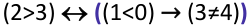

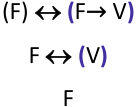

O **gabarito** , portanto, é **CERTO** . 

**Caso calculássemos a expressão seguindo diretamente a ordem indicada** , o valor final da expressão seria diferente e **não chegaríamos ao gabarito oficial** : 

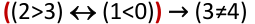

**(** V **)** → V V 

**Gabarito: CERTO.** 

**(TCU/2004)** Suponha que P represente a proposição “Hoje choveu”, Q represente a proposição “José foi à 

praia” e R represente a proposição “Maria foi ao comércio”. Com base nessas informações, julgue o item seguinte. 

A sentença “Hoje não choveu então Maria não foi ao comércio e José não foi à praia” pode ser corretamente representada por: 

~ **P** → **(** ~ **R** ∧~ **Q)** 

#### **Comentários:** 

Observe que a banca omitiu o **"Se"** da condicional apresentada, de modo que podemos entender a sentença original do seguinte modo: 

“ **Se** hoje não choveu então Maria não foi ao comércio e José não foi à praia” 

A principal dúvida que surge na questão é se a sentença apresentada deve ser representada por **(** ~ **P** →~ **R)** ∧~ **Q** ou por ~ **P** → **(** ~ **R** ∧~ **Q)** . 

**Como não há qualquer indicativo na frase original de que a condicional deve ser executada primeiro** , **devemos seguir a ordem de precedência dos conectivos** , que nos diz que **a conjunção "e" precede a condicional "se...então"** . Nesse caso, a representação correta é ~ **P** → **(** ~ **R** ∧~ **Q)** : 

~ **P** → **(** ~ **R** ∧~ **Q)** : “ **Se [** hoje **não** choveu **], então [** (Maria **não** foi ao comércio) **e** (José **não** foi à praia) **]** .” 

O **<u>gabarito</u>** , portanto, é **CERTO** .

---

<!-- pagina: 9 -->

**Equipe Exatas Estratégia Concursos Aula 01** 

Caso a banca quisesse como resposta **(** ~ **P** →~ **R)** ∧~ **Q** , ela deveria dar um indicativo de que a condicional deveria ser executada antes. Esse indicativo poderia ser uma vírgula, conforme exemplificado a seguir: 

**(** ~ **P** →~ **R)** ∧~ **Q:** “ **(Se [** hoje **não** choveu **], então [** Maria **não** foi ao comércio **]), e (** José **não** foi à praia **)** .” 

**Gabarito: CERTO.** 

## Conversão para a linguagem proposicional 

Ao longo do tópico em que os cinco conectivos lógicos foram explicados, realizamos alguns exercícios em que, ao longo da resolução, tivemos que **definir proposições simples** e **transformar uma frase da língua portuguesa para a linguagem de proposições** . 

Não existe teoria sobre essa conversão da língua portuguesa para a linguagem proposicional, de modo que realizaremos uma questão como forma de teoria. 

**(UFRJ/2022)** Sejam as proposições "Marcos é ator", "É falso que Marcos é biólogo" e "Marcos é rico". A alternativa que apresenta a correta tradução para a linguagem simbólica da proposição composta “Marcos não é ator e nem biólogo se e somente se Marcos é biólogo ou não é rico” é: 

a) ( ~ p ∧ q)  ( ~ q ∨~ r) 

b) ( ~ p ∧ q) → ( ~ q ∨~ r) 

c) (p ∨~ q)  (q ∧~ r) 

d) ( ~ p ∨ q) → ( ~ q ∨~ r) 

e) ( ~ p ∧~ q) → (qΛ ~ r) 

**Comentários:** 

Para resolver essa questão, devemos considerar que **p** , **q** e **r** são as seguintes proposições: 

**p:** "Marcos é ator." 

**q** : " **<u>É falso que</u>** Marcos é biólogo." 

**r:** "Marcos é rico." 

Note que a proposição **q** é uma **sentença declarativa negativa** , correspondendo a: 

**q:** "Marcos **<u>não</u>** é biólogo." 

Sua negação, ~ **q** , é uma **sentença declarativa afirmativa** : 

~ **q:** "Marcos é biólogo." 

Feita a observação, note que "Marcos **não** é ator e **nem** biólogo." corresponde a ~ **p** ∧ **q** : 

~ **p** ∧ **q:** " **(** Marcos **não** é ator **) e (** Marcos **não** é biólogo **)** ." 

Além disso, "Marcos é biólogo ou **não** é rico." corresponde a ~ **q** ∨~ **r** : 

~ **<u>q</u>** ∨~ **r: "(** Marcos é biólogo **<u>)</u> ou** **<u>(</u>** Marcos **não** é rico **<u>)</u>** ."

---

<!-- pagina: 10 -->

**Equipe Exatas Estratégia Concursos Aula 01** 

Seguindo a ordem de precedência dos conectivos, devemos executar inicialmente a conjunção "e", depois a disjunção inclusiva "ou" e, **por fim** , **a bicondicional** " **se e somente se** ". Logo, a proposição procurada é dada por **(** ~ **p** ∧ **q)**  **(** ~ **q** ∨~ **r)** : 

**(** ~ **p** ∧ **q)**  **(** ~ **q** ∨~ **r)** : “ **[(** Marcos **não** é ator **) e (** Marcos **não** é biólogo **)] se e somente se [(** Marcos é biólogo **)** ou **(** Marcos **não** é rico **)]** .” 

#### **Gabarito: Letra A.** 

### “Não é verdade que” ou “é falso que” em proposições compostas 

É importante que você saiba que, **<u>em regra</u>** <u>, os termos “</u> **não é verdade que** ” e “ **é falso que** ”, quando utilizados em proposições compostas, **costumam negar a proposição composta como um todo** . 

**(Pref Irauçuba/2022)** Considere as proposições a seguir: 

- **p** : Ana fala inglês; 

- **q** : Ana fala alemão; 

- **r** : Ana fala português. 

A linguagem simbólica da proposição “ **t** : É falso que Ana fala alemão ou português, mas que não fala inglês” é: 

a) ∼ q ∨∼ r ∧∼ p 

b) ∼ (q ∨ r) ∧ p 

c) ∼ ((q ∨ r) ∧∼ p) 

d) ∼ ((q ∨ r) ∧ 

**Comentários:** 

Lembre-se de que a palavra " **mas** " corresponde à **conjunção** " **e** ". 

Nesse caso, perceba que " **Ana fala alemão ou português, mas não fala inglês** " pode ser descrita como **(q** ∨ **r)** ∧∼ **p** : 

**(q** ∨ **r)** ∧∼ **p:** " **([** Ana fala alemão **] ou [** (Ana fala) português **])** , **mas (não** fala inglês **)** " 

O termo " **é falso que** " no início nega a proposição composta como um todo. Logo, a proposição composta em questão corresponde a ~ **((q** ∨ **r)** ∧∼ **p)** : 

~ **((q** ∨ **r)** ∧∼ **p):** " **É falso que {([** Ana fala alemão **] ou [** (Ana fala) português **])** , **mas (** (que) **não** fala inglês **)}** " 

**Gabarito: Letra C.** 

**(CAU AC/2019)** Considere as proposições a seguir. 

**p** : Tony fala inglês; 

**q** : Antônio fala português. 

Qual é a tradução para a linguagem corrente da proposição ~ **<u>(p</u>** ∧~ **<u>q)</u>** ?

---

<!-- pagina: 11 -->

**Equipe Exatas Estratégia Concursos Aula 01** 

a) Não é verdade que Tony fala inglês e que Antônio não fala português. 

b) Tony fala inglês e Antônio não fala português. 

c) Não é verdade que Tony fala inglês e que Antônio fala português. 

d) Tony fala inglês ou Antônio não fala português. 

e) Se Tony fala inglês, então Antônio fala português. 

**Comentários:** 

Temos que as proposições simples que compõem a proposição composta requerida são: 

**p** : “Tony fala inglês.” 

~ **q** : “Antônio **não** fala português.” 

- A proposição composta antes da negação é dada por: 

**p** ∧~ **q: “(** Tony fala inglês **) e (** Antônio **não** fala português **)** .” 

Para negar essa última proposição composta e chegarmos a ~ **(p** ∧~ **q)** , podemos incluir o termo " **não é verdade que** " no início da proposição composta: 

- ~ **(p** ∧~ **q)** : “ **Não é verdade que [(** Tony fala inglês **) e (** Antônio **não** fala português **)]** .” 

**Observação** : Será visto na aula de equivalências lógicas, se for pertinente ao seu edital, que **existe uma outra forma de negar essa proposição composta** utilizando as **Leis de De Morgan** . 

**Gabarito: Letra A.** 

## Análise do significado das proposições 

Em algumas questões, as bancas colocam frases em que não são apresentados os conectivos da maneira que aprendemos até então. 

Para resolver esse tipo de problema, devemos saber que: 

O termo **proposição** é usado para se referir ao **<u>significado</u>** das orações. 

Isso quer dizer que a proposição **não depende de como tenha sido feita a construção de tais sentenças na língua escrita** . Se frases escritas de modo diferente são proposições e têm o mesmo significado, então essas proposições são iguais! Isso significa que as três frases abaixo são exatamente a mesma proposição: 

- **p:** "João bebeu café." 

- **p** : "O café foi bebido por João." 

- **p: "** _John drank coffee._ **"** (Em português: João bebeu café.)

---

<!-- pagina: 12 -->

**Equipe Exatas Estratégia Concursos Aula 01** 

Utilize esse entendimento de analisar o significado das proposições como **último recurso** . 

Quando em uma questão aparecer os **conectivos tradicionais** , não fique tentando entender o significado da proposição composta. Apenas aplique a regra. 

**Exemplo** : se em alguma questão aparecer uma proposição da forma " **q,** **<u>pois</u> p** ", já sabemos que ocorre inversão entre o antecedente e o consequente. Logo, sem realizarmos qualquer interpretação, já sabemos que "==5460== **q,** **<u>pois p"</u>** é a condicional **p** → **q** . 

Vejamos na prática a necessidade de se entender o significado da proposição: 

**(Pref São Cristóvão/2023)** Considerando p e q como as proposições "Eu estudo para um concurso." e "Eu me dedico com afinco." e os símbolos ∧ , ∨ , → e  como os conectivos lógicos "e", "ou", "se ..., então..." e "se, e somente se,", respectivamente, assinale a opção que apresenta a estrutura, na lógica proposicional, da proposição "Ao estudar para um concurso, eu me dedico com afinco.". 

a) **p** ∧ **q** 

b) **p**  **q** 

c) **p** ∨ **q** 

d) **p** → **q** 

**Comentários:** 

Note que **na proposição** " **Ao estudar para um concurso, eu me dedico com afinco.** " **não há nenhum conectivo conhecido** . 

Para resolver essa questão, você deve entender que " **estudar para um concurso** " **<u>é a causa</u>** cuja **<u>consequência</u>** é " **eu me dedico com afinco** ". 

Nesse caso, **devemos interpretar essa proposição como se fosse uma condicional** " **se...então** ": 

" **Se [** eu estudo para um concurso **]** , **então [** eu me dedico com afinco **]** ." 

Logo, a proposição em questão corresponde à condicional **p** → **q** . 

**Gabarito: Letra D.** 

---

<!-- pagina: 13 -->

**Equipe Exatas Estratégia Concursos Aula 01** 

**(IBAMA/2013) P4** : Se o atual aquecimento global é apenas mais um ciclo do fenômeno, como a presença humana no planeta é recente, então a presença humana no planeta não é causadora do atual aquecimento global. 

A proposição **P4** é logicamente equivalente a "Como o atual aquecimento global é apenas mais um ciclo do fenômeno e a presença humana no planeta é recente, a presença humana no planeta não é causadora do atual aquecimento global". 

#### **Comentários:** 

Vamos nos concentrar na proposição **P4** original. Podemos identificar que há ao menos um condicional nela, por conta da presença do conectivo " **se...então** ". 

**P4** : " **<u>Se</u>** o atual aquecimento global é apenas mais um ciclo do fenômeno, **<u>como</u>** a presença humana no planeta é recente, **<u>então</u>** a presença humana no planeta não é causadora do atual aquecimento global." 

Porém, uma dúvida que pode surgir é: e aquele " **como** "? Seria esse " **como"** uma condicional da forma não usual " **como** ... **então** "? Será que a frase "como a presença humana no planeta é recente" pode ser ignorada? 

Para resolver o problema, nessa questão devemos nos recordar que o termo **proposição** é usado para se referir ao **significado** das orações. 

Observe que o **<u>antecedente</u>** é composto por **<u>duas causas</u>** <u>: “</u> <mark>o atual aquecimento global é apenas mais um ciclo do fenômeno”</mark> e “ <mark>a presença humana no planeta é recente”</mark> . 

A **<u>consequência dessas duas causas</u>** , que é o consequente da condicional, é: “ <mark>a presença humana no planeta não é causadora do atual aquecimento global.</mark> ” 

Nesse caso, a proposição **P4** pode ser reescrita da seguinte forma: 

**P4** :“ **<u>Se</u> [** <mark>o atual aquecimento global é apenas mais um ciclo do fenômeno, como a presença humana no planeta é recente</mark> **<mark>]</mark>** , **<u>então</u> [** <mark>a presença humana no planeta não é causadora do atual aquecimento global</mark> **]** .” 

**P4** :“ **<u>Se</u> [** **<mark>(</mark>** <mark>o atual aquecimento global é apenas mais um ciclo do fenômeno</mark> **<mark>)</mark>** **<u>e</u> (** <mark>a presença humana no planeta é recente</mark> **<mark>)</mark> ]** , **<u>então</u> [** <mark>a presença humana no planeta não é causadora do atual aquecimento global</mark> **]** .” 

Outra forma de se escrever esse condicional é utilizar a forma “ **Como** **_p_** , **_q_** ”: 

**P4** :“ **<u>Como</u> [** **<mark>(</mark>** <mark>o atual aquecimento global é apenas mais um ciclo do fenômeno</mark> **<mark>)</mark>** **<u>e</u>** **<mark>(</mark>** <mark>a presença humana no</mark> planeta é recente **)],[** a presença humana no planeta não é causadora do atual aquecimento global **]** .” 

**Gabarito: CERTO.**

---

<!-- pagina: 14 -->

**Equipe Exatas Estratégia Concursos Aula 01** 

# **- TABELA VERDADE** 

**Tabela-verdade Número de linhas** = **2****n** **, n** <u>proposições simples</u> **<u>distintas</u>** <u>.</u> O operador de **negação "** ~ **"** **<u>não altera</u>** o número de linhas. **Passo 1:** determinar o número de linhas da tabela-verdade. **Passo 2** : desenhar o esquema da tabela-verdade. **Passo 3:** atribuir V ou F às proposições simples de maneira alternada. **Passo 4:** obter o valor das demais proposições. 

## Defini ão de tabela-verdade <u>ç</u> 

A **tabela-verdade** é uma ferramenta utilizada para **determinar todos os valores lógicos (V ou F) assumidos por uma proposição composta em função dos valores lógicos atribuídos às proposições simples que a compõem.** 

**Exemplo** : queremos **determinar os valores lógicos assumidos pela proposição composta a seguir em função dos valores atribuídos a p, q e r.** 

Para isso, veremos que um dos passos necessários é listar todas as possibilidades que **p** , **q** e **r** podem assumir em conjunto. Nesse caso, serão oito possibilidades de combinações: 

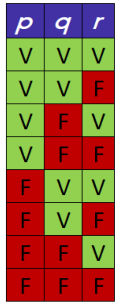

Uma vez listadas todas as combinações de valores lógicos possíveis para **p** , **q** e **r** , a tabela-verdade é uma ferramenta que nos permitirá encontrar todos os valores lógicos assumidos pela expressão ~ ( **p** →~ **q** ) ∨ ( ~ **r** → **q** ). 

Para o da primeira linha (onde **p** , **q** e **r** assumem o valor verdadeiro), veremos que a proposição composta do exemplo assumirá o valor V. Para o caso da quarta linha (V, F, F) veremos que o valor assumido por ~ <u>(</u> **<u>p</u>** →~ **<u>q</u>** <u>)</u> ∨ <u>(</u> ~ **r** → **<u>q</u>** <u>) será falso.</u>

---

<!-- pagina: 15 -->

**Equipe Exatas Estratégia Concursos Aula 01** 

## Número de linhas de uma tabela-verdade 

Se uma proposição for composta por 𝒏 **proposições simples** **<u>distintas</u>** <u>, o número de</u> **linhas da tabela-verdade será** 𝟐𝒏 **.** 

**O operador de negação "** ~ **" em nada altera o número de linhas da tabela-verdade.** 

Vamos continuar com o mesmo exemplo anterior: queremos determinar os valores lógicos assumidos pela proposição composta a seguir em função dos valores atribuídos a **p** , **q** e **r** . 

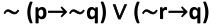

Como cada proposição simples **p** , **q** e **r** admite dois valores lógicos (V ou F), cada uma dessas três proposições pode assumir somente 2 valores. Assim, o total de combinações dado por: 

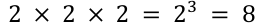

O número de possíveis combinações para **p** , **q** e **r** será exatamente o número de linhas da tabelaverdade do exemplo. 

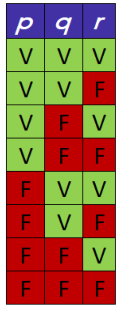

Observe que a inserção do operador de negação " ~ " na expressão ~ ( **p** →~ **q** ) ∨ ( ~ **r** → **q** ) em nada alterou o número de linhas da tabela-verdade. 

Podemos generalizar o resultado, dizendo que se uma proposição for composta por 𝑛 proposições simples, **o número total de linhas da tabela-verdade será o número 2 multiplicado** 𝒏 **vezes, ou seja,** 𝟐𝒏 . 

---

<!-- pagina: 16 -->

**Equipe Exatas Estratégia Concursos Aula 01** 

Pessoal, são inúmeras as questões que cobram diretamente o número de linhas da tabela-verdade de uma proposição composta. 

#### **(PM SC/2023) ((P** ∧ **S)** → **(Q** ∨ **R))** → **((** ~ **R** ∨ **P)** → **(** ~ **Q** ∨~ **S)** 

O número de linhas da tabela-verdade da proposição lógica precedente é igual a 

a) 2 

b) 4 

c) 8 d) 16 e) 32 

**Comentários:** 

Para resolver a questão, vamos assumir que **P** , **Q** , **R** e **S** são proposições simples. Seria melhor que a questão tivesse explicitado isso. 

Note que, na proposição composta apresentada, temos um total de 𝒏 **= 4 proposições simples** **<u>distintas</u>** <u>:</u> **P** , **Q** , **R** e **S** . Portanto, o número de linhas da tabela-verdade é: 

2𝑛 = 24 = 2 × 2 × 2 × 2 = 16 

**Gabarito: Letra D.** 

**(ISS Fortaleza/2023) P** : “Se a pessoa trabalha com o que gosta e está de férias, então é feliz ou está de férias.” 

Considerando a proposição **P** precedente, julgue o item seguinte. 

O número de linhas da tabela-verdade associada à proposição **P** é inferior a 10. 

**Comentários:** 

Considere as seguintes proposições simples: 

**t:** "A pessoa trabalha com o que gosta." 

**f:** "A pessoa está de férias." 

**z:** "A pessoa é feliz." 

Note que a proposição composta **P** pode ser descrita por **(t** ∧ **f)** → **(z** ∨ **f)** : 

**(t** ∧ **f)** → **(z** ∨ **f)** : “ **Se [(** a pessoa trabalha com o que gosta **) e (** está de férias **)]** , **então [(** é feliz **) ou (** está de férias **<u>)]</u>** .”

---

<!-- pagina: 17 -->

**Equipe Exatas Estratégia Concursos Aula 01** 

Note que, na proposição composta apresentada, temos um total de 𝒏 **= 3 proposições simples** **<u>distintas</u>** <u>:</u> **t** , **f** e **z** . Portanto, o número de linhas da tabela-verdade é: 

2𝑛 = 23 = 2 × 2 × 2 = 8 

Logo, o número de linhas da tabela-verdade associada à proposição P é **inferior a 10** . 

#### **Gabarito: CERTO.** 

## Construção de uma tabela-verdade 

No resumo do início do tópico, indicamos que há **quatro passos** para a estruturação da tabela verdade. Agora veremos em detalhes como utilizá-los na prática, tendo como exemplo a proposição composta ~ ( **p** →~ **q** ) ∨ ( ~ **r** → **q** ). 

### Passo 1: determinar o número de linhas da tabela-verdade 

A proposição ~ ( **p** →~ **q** ) ∨ ( ~ **r** → **q** ) é composta por três proposições simples distintas: **p, q** e **r** . Logo o número de linhas da nossa tabela-verdade será: 

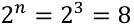

### Passo 2: desenhar o esquema da tabela-verdade 

Antes de desenharmos a estrutura da tabela-verdade, precisamos **fragmentar a proposição composta em partes** para entendermos as operações necessárias para se chegar ao resultado desejado: ~ ( **p** →~ **q** ) ∨ ( ~ **r** → **q** ). Para tanto, **utilizaremos uma** " **engenharia reversa** ", isto é, partindo desta proposição composta aparentemente complexa, chegaremos nas proposições simples ( **p** , **q** e **r** ). Este passo é fundamental, pois organiza o raciocínio de maneira simples e fácil. 

#### **Observe como aplicar esta** " **engenharia reversa** ”: 

Para determinar <mark>~ (</mark> **<mark>p</mark>** <mark>→~</mark> **<mark>q</mark>** <mark>) ∨ ( ~</mark> **<mark>r</mark>** <mark>→</mark> **<mark>q</mark>** <mark>)</mark> , precisamos obter <mark>~ (</mark> **<mark>p</mark>** <mark>→~</mark> **<mark>q</mark>** <mark>)</mark> e <mark>( ~</mark> **<mark>r</mark>** <mark>→</mark> **<mark>q</mark>** <mark>).</mark> 

Para determinar ~ ( **p** →~ **q** ), precisamos obter <mark>(</mark> **<mark>p</mark>** <mark>→~</mark> **<mark>q</mark>** <mark>).</mark> 

Para determinar ( **p** →~ **q** ), precisamos obter **p** e <mark>~</mark> **<mark>q</mark>** <mark>.</mark> 

Para determinar ~ **q** , precisamos obter **q** . 

Para determinar ( ~ **r** → **q** ), precisamos obter ~ **r** e **q** . 

Para determinar ~ **r** <u>, precisamos obter</u> **r** . 

Feita a "engenharia reversa", basta desenhar o esquema da tabela. O número de colunas que corresponderá a cada fragmento que importa para a resolução do exercício: as proposições simples, as negações

---

<!-- pagina: 18 -->

**Equipe Exatas Estratégia Concursos Aula 01** 

necessárias, as proposições compostas necessárias e, se for o caso, suas negações, até chegarmos na proposição composta mais complexa. 

O número de linhas corresponde ao passo 1, isto é, 2𝑛 , sendo 𝑛 o número de proposições simples. No presente caso, temos 3 proposições simples, **p, q** e **r** , portanto, teremos 8 linhas na tabela-verdade. Vejamos: 

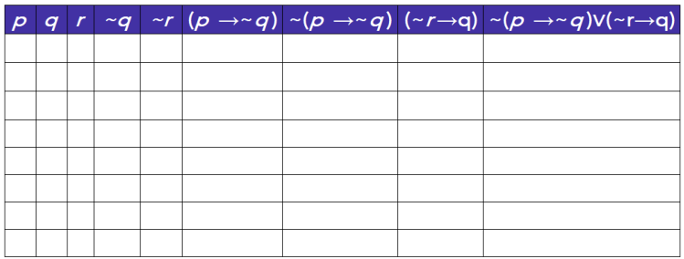

Passo 3: atribuir V ou F às proposições simples de maneira alternada 

No terceiro passo, devemos atribuir os valores V ou F às proposições simples ( **p** , **q** e **r** ) de modo a obter todas as combinações possíveis. O melhor método para fazer isso é conferir os valores lógicos de maneira alternada, conforme demonstrado abaixo: 

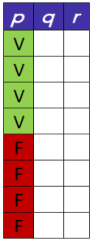

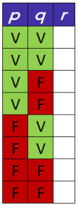

A nossa tabela fica da seguinte forma: 

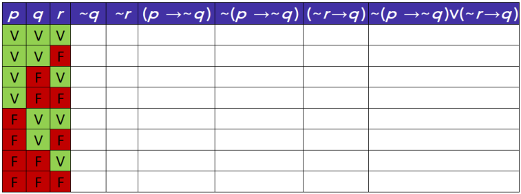

---

<!-- pagina: 19 -->

**Equipe Exatas Estratégia Concursos Aula 01** 

### Passo 4: obter o valor das demais proposições 

Para obter o valor da proposição final, devemos realizar as operações necessárias à solução do caso dado - considerando as cinco operações básicas com os conectivos e a operação de negação. 

Vamos agora partir para a solução do nosso exemplo. Para fins didáticos, veremos cada etapa da resolução separadamente em tabelas individualizadas. Na prática você só fará uma tabela e preencherá com os valores lógicos encontrados. 

Em cada etapa, para que você possa visualizar as operações de modo individualizado, **a coluna pintada em azul corresponderá aos valores lógicos que queremos determinar** e as **colunas em amarelo são aquelas que estamos utilizando como referência para a operação** . 

Obtenção de ~ **q** realizando a negação de **q** : 

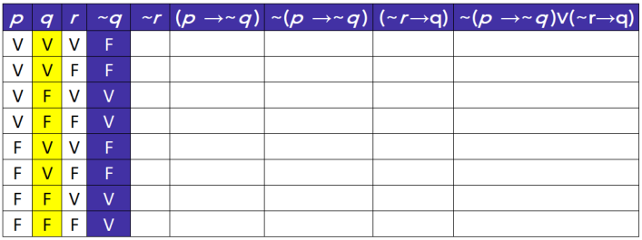

Obtenção de ~ **r** realizando a negação de **r** : 

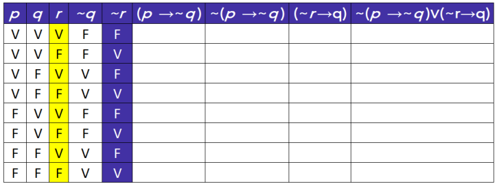

Obtenção de ( **p** →~ **q** ) por meio das colunas **p** e ~ **q** . Observe que a condicional só será falsa quando **p** for verdadeiro e ~ **q** for falso: 

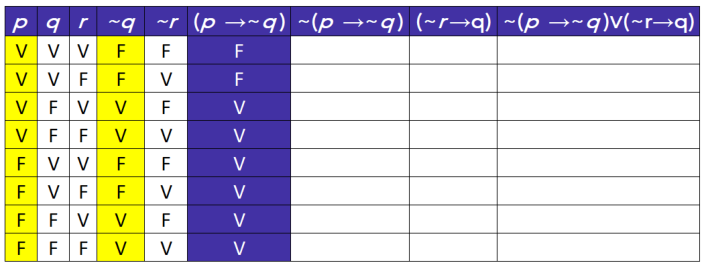

---

<!-- pagina: 20 -->

**Equipe Exatas Estratégia Concursos Aula 01** 

Obtenção de ~ ( **p** →~ **q** ) por meio da negação de ( **p** →~ **q** ). 

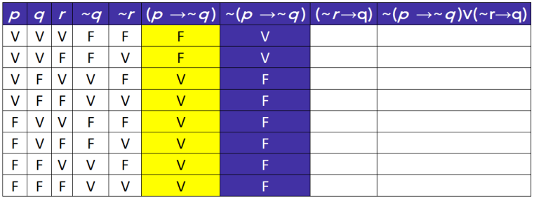

Obtenção de ( ~ **r** → **q** ) por meio das colunas ~ **r** e **q** . Observe que a condicional só será falsa quando ~ **r** for verdadeiro e **q** for falso: 

###### ==5460== 

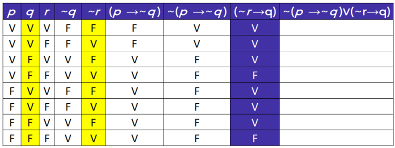

Obtenção de ~ ( **p** →~ **q** ) ∨ ( ~ **r** → **q** ) por meio das colunas ~ ( **p** →~ **q** ) e ( ~ **r** → **q** ). Observe que a disjunção será falsa somente quando ~ ( **p** →~ **q** ) for falso e ( ~ **r** → **q** ) for falso: 

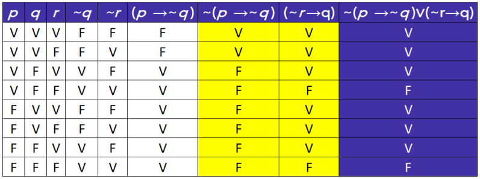

Finalmente finalizamos a tabela-verdade de ~ ( **p** →~ **q** ) ∨ ( ~ **r** → **q** ). Perceba que ela nos diz que essa **proposição composta final** só é falsa em dois casos: 

- **p** é verdadeiro e **q** e **r** são falsos; e 

- **p** , **q** e **r** são falsos.

---

<!-- pagina: 21 -->

**Equipe Exatas Estratégia Concursos Aula 01** 

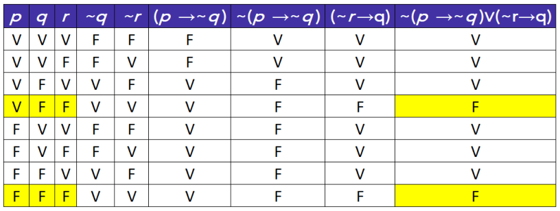

**(IBGE/2021)** Considere a seguinte proposição **P** : 

"Se produz as informações de que o Brasil necessita, o IBGE ajuda o país a estabelecer políticas públicas e justifica o emprego dos recursos que lhe são destinados." 

Verifica-se que a quantidade de linhas da tabela-verdade da proposição **P** que apresentam valor lógico F é igual a 

a) 1 

b) 2 

c) 3 

d) 4 

e) 5 

**Comentários:** 

Considere as seguintes proposições simples: 

**p:** "O IBGE produz as informações de que o Brasil necessita." 

**a:** "O IBGE ajuda o país a estabelecer políticas públicas." 

**j:** "O IBGE justifica o emprego dos recursos que lhe são destinados." 

Note que **a proposição P é uma condicional** em que se omite o " **então** ", podendo ser escrita como **p** → **(a** ∧ **j)** . 

**p** → **(a** ∧ **j)** : “ **Se [** produz as informações de que o Brasil necessita **]** , **[(** o IBGE ajuda o país a estabelecer políticas públicas **) e (** justifica o emprego dos recursos que lhe são destinados **)]** .” 

Vamos construir a tabela-verdade de **<u>p</u>** → **a** ∧ **<u>j</u>** .

---

<!-- pagina: 22 -->

**Equipe Exatas Estratégia Concursos Aula 01** 

**<u>Passo 1</u>** <u>: determinar o número de linhas da tabela-verdade.</u> 

Temos um total de 3 proposições simples distintas. Portanto, o número de linhas da tabela-verdade é: 

23 = 8 

**<u>Passo 2</u>** <u>: desenhar o esquema da tabela-verdade.</u> 

Note que: 

Para determinar **<mark>p</mark>** <mark>→</mark> **<mark>a</mark>** <mark>∧</mark> **<mark>j</mark>** <mark>,</mark> precisamos obter **p** e **<mark>a</mark>** <mark>∧</mark> **<mark>j</mark>** <mark>.</mark> 

Para determinar **a** ∧ **j** , precisamos obter **a** e **j** . 

Logo, temos o seguinte esquema da tabela-verdade: 

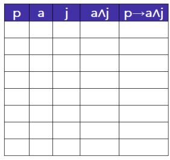

**<u>Passo 3</u>** <u>: atribuir V ou F às proposições simples de maneira alternada.</u> 

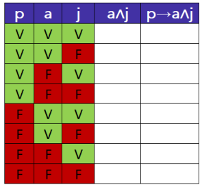

**<u>Passo 4</u>** <u>: obter o valor das demais proposições.</u> 

A conjunção **a** ∧ **j** é verdadeira somente para os casos em que **a** é verdadeiro e **j** é verdadeiro. Nos outros casos, **a** ∧ **j** é falso. 

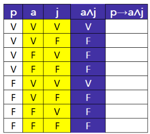

---

<!-- pagina: 23 -->

**Equipe Exatas Estratégia Concursos Aula 01** 

A condicional **p** → **a** ∧ **j** só e falsa quando o antecedente **p** é verdadeiro e o consequente **a** ∧ **j** é falso. Nos demais casos, a condicional é verdadeira. 

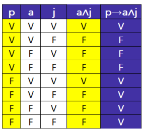

Note, portanto, que **a quantidade de linhas da tabela-verdade de p** → **a** ∧ **j que apresentam valor lógico F é igual a 3** . 

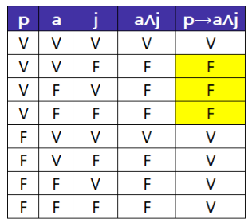

**~~Ga~~ barito: Letra C.** 

**(IPE Saúde/2022)** A tabela-verdade da proposição **((p** ∧ **q)** →∼ **r)**  **q** está incompleta. 

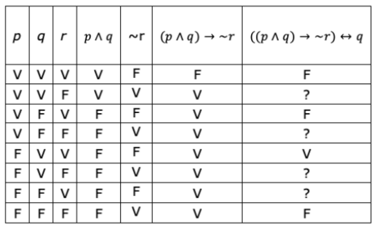

Os valores lógicos que completam a tabela considerando a ordem, de cima para baixo, são: 

a) V – F – V – F. 

b) F – V – F – V. 

c) F – V – V – V. d) V – V – F – F. e) V – F – F – F.

---

<!-- pagina: 24 -->

**Equipe Exatas Estratégia Concursos Aula 01** 

#### **Comentários:** 

Veja que, na questão apresentada, já temos a tabela-verdade construída. Faz-se necessário completar alguns valores lógicos identificados com um ponto de interrogação. 

Note que os valores lógicos da última coluna da tabela-verdade da proposição **((p** ∧ **q)** →∼ **r)**  **q** dependem das colunas referentes às proposições **((p** ∧ **q)** →∼ **r)** e **q** . 

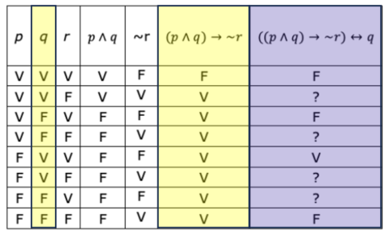

Sabemos que a bicondicional **((p** ∧ **q)** →∼ **r)**  **q** é **verdadeira** para os casos em que as parcelas **((p** ∧ **q)** →∼ **r)** e **q** apresentam o mesmo valor lógico. 

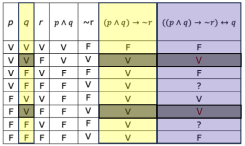

Por outro lado, a bicondicional **((p** ∧ **q)** →∼ **r)**  **q** é **falsa** para os casos em que as parcelas **((p** ∧ **q)** →∼ **r)** e **q** apresentam valores lógicos distintos. 

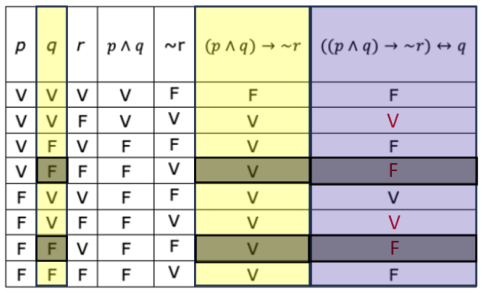

Logo, os valores lógicos que completam a tabela são: 

**V** – **F** – **V** – **F** 

**Gabarito: Letra A.**

---

<!-- pagina: 25 -->

**Equipe Exatas Estratégia Concursos Aula 01** 

**(POLC AL/2023)** Considere-se que as primeiras três colunas da tabela-verdade da proposição lógica **(Q** ∨ **R)** ∧ **P** sejam iguais a: 

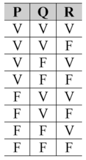

Nessa situação, a última coluna dessa tabela-verdade apresenta valores V ou F, tomados de cima para baixo, na seguinte sequência: 

V V V F V V F F 

#### **Comentários:** 

Devemos obter a tabela-verdade de **(Q** ∨ **R)** ∧ **P** . 

Perceba que o **<u>Passo 1, "</u>** determinar o número de linhas da tabela-verdade", já está feito. O mesmo ocorre com o **<u>Passo 3,</u>** "atribuir V ou F às proposições simples de maneira alternada". 

**<u>Passo 2:</u>** desenhar o esquema da tabela-verdade. 

Para determinar **<mark>(Q</mark>** <mark>∨</mark> **<mark>R)</mark>** <mark>∧</mark> **<mark>P</mark>** precisamos obter **<mark>(Q</mark>** <mark>∨</mark> **<mark>R)</mark>** e **P** . 

Para determinar **Q** ∨ **R** , precisamos obter **Q** e **R.** 

Logo, temos o seguinte esquema da tabela-verdade: 

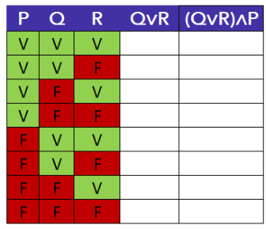

**<u>Passo 4:</u>** obter o valor das demais proposições. 

A disjunção inclusiva **(Q** ∨ **R)** é falsa quando **Q** e **R** são ambos falsos. Nos demais casos, a disjunção inclusiva **<u>(Q</u>** ∨ **R)** é verdadeira.

---

<!-- pagina: 26 -->

**Equipe Exatas Estratégia Concursos Aula 01** 

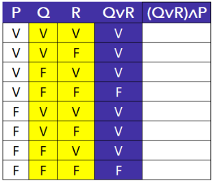

A conjunção **(Q** ∨ **R)** ∧ **P** é verdadeira somente quando ambas as parcelas **(Q** ∨ **R)** e **P** são verdadeiras. Nos demais casos, a conjunção **(Q** ∨ **R)** ∧ **P** é falsa. 

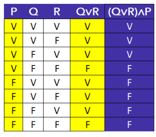

Note que a última coluna da tabela-verdade da proposição composta **(Q** ∨ **R)** ∧ **P** apresenta valores V ou F, tomados de cima para baixo, na seguinte sequência: **V V V F F F F F** . O **gabarito** , portanto, é **ERRADO** . 

**Gabarito: ERRADO.**

---

<!-- pagina: 27 -->

**Equipe Exatas Estratégia Concursos Aula 01** 

# **TAUTOLOGIA, CONTRADIÇÃO E CONTINGÊNCIA** 

|**Tautologia**é uma proposição cujo**valor lógico da tabela-verdade ésempre verdadeiro**. **Contradição**é uma proposição cujo**valor lógico da tabela-verdade ésempre falso**. **Contingência**é uma proposição cujo valor lógico pode ser**tanto V quanto F**,dependendo diretamente dos valores atribuídos às proposições simples que a compõem. **p**∨~**p**é uma**tautologia** **p**∧~**p** é uma**contradição** **Tautologia, contradição e contingência**|
|---|
|**Método da tabela-verdade**|
|• Se na última coluna da tabela-verdade obtivermos**apenas valores verdadeiros**, trata-se de uma **tautologia**; • Se na última coluna da tabela-verdade obtivermos**apenas valores falsos**, trata-se de uma**contradição**; • Se na última coluna da tabela-verdade obtivermos**valores verdadeiros e falsos**(**V**e**F**), trata-se de uma **contingência**.|
|**Método da prova por absurdo**|
|**Primeiro passo:**partir da hipótese de que a proposição é uma**tautologia**ou então de que a proposição é uma**contradição**. Se nós suspeitarmos que a proposição composta é uma**tautologia**, devemos seguir o seguinte procedimento: • Tentar aplicar o valor lógico**falso**à proposição. Dessa tentativa, há duas possibilidades:  ○ **Se for possível que a proposição seja falsa**, sabemos que**não é uma tautologia**. Nesse caso, a proposição**pode ser** **contradição** **ou** **contingência**;ou ○**Se nessa tentativa chegarmos a algumabsurdo**,isso significa que a proposição nunca poderá ser falsa e, portanto,**é uma tautologia**(sempre verdadeira). Por outro lado, se nós suspeitarmos que a proposição composta é uma**contradição**, devemos seguir o seguinte procedimento: •  Tentar aplicar o valor lógico**verdadeiro**à proposição. Dessa tentativa, há duas possibilidades:  ○**Se for possível que a proposição seja verdadeira**, sabemos que**não é uma contradição**. Nesse caso, a proposição**pode ser** **tautologia** **ou** **contingência**;ou  ○**Se nessa tentativa chegarmos a algumabsurdo**,isso significa que a proposição nunca poderá ser verdadeira e, portanto,**é uma contradição **(sempre falsa). **Se for possível que a proposição seja falsa** **e também** **for possível que a proposição seja verdadeira**, **não teremos uma tautologia** **nem teremos uma contradição**. Nesse caso, a proposição em questão é uma**contingência**!|
|**Implicação**|
|Dizemos que uma proposição**p** **implica** **q**quando**a condicional** **p**→**q** **é uma** **tautologia**. A representação da afirmação "**p** **implica** **q**" é representada por**p**⇒**q**.|

---

<!-- pagina: 28 -->

**Equipe Exatas Estratégia Concursos Aula 01** 

## Introdu ão <u>ç</u> 

Inicialmente, vamos conhecer os conceitos de **tautologia** , **contradição** e **contingência** : 

- **Tautologia** é uma proposição cujo **valor lógico da tabela-verdade é sempre verdadeiro** . 

- **Contradição** é uma proposição cujo **valor lógico da tabela-verdade é sempre falso** . 

- **Contingência** é uma proposição cujos valores lógicos podem ser **<u>tanto V quanto F</u>** , dependendo diretamente dos valores atribuídos às proposições simples que a compõem. 

Com base nesses conceitos, vamos resolver uma questão: 

**(ALMG/2023)** Considere as tabelas-verdade I, II e III a seguir: 

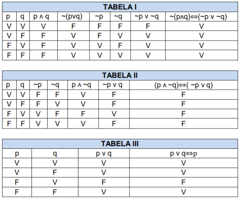

É CORRETO afirmar que: 

a) A tabela I representa uma contradição. 

b) A tabela I representa uma tautologia. 

c) As tabelas I e III representam uma contradição. 

d) As tabelas II e III representam uma tautologia. 

#### **Comentários:** 

Observe que: 

• A última coluna da tabela I mostra que a proposição ~ **(p** ∧ **q)**  **(** ~ **p** ∨~ **q)** é **sempre verdadeira** . Logo, **a tabela I representa uma tautologia** . 

- A última coluna da tabela II mostra que a proposição **(p** ∧~ **q)**  **(** ~ **p** ∨ **q)** é **sempre falsa** . Logo, **a tabela II representa uma contradição** . 

• A última coluna da tabela III mostra que a proposição **p** ∨ **q**  **p pode ser tanto V quanto F** . Logo, **a tabela III representa uma contingência** . 

O **gabarito** , portanto, é **letra B** . 

**Gabarito: Letra B.**

---

<!-- pagina: 29 -->

**Equipe Exatas Estratégia Concursos Aula 01** 

Existe uma tautologia e uma contradição que você necessariamente precisa conhecer, pois elas aparecem muito em prova: 

**p** ∨~ **p** é uma **tautologia** 

**p** ∧~ **p** é uma **contradição** 

Conforme pode ser observado nas tabelas-verdade a seguir, note que **p** ∨~ **p** é sempre verdadeiro e **p** ∧~ **p** é sempre falso. 

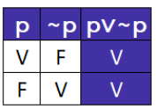

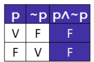

**(CAU TO/2023)** A respeito de estruturas lógicas, julgue o item. 

A proposição “A Terra é plana ou a Terra não é plana” é uma tautologia. 

**Comentários:** 

Considere a seguinte proposição simples: 

**p:** "A Terra é plana." 

Note que a proposição composta sugerida pelo enunciado pode ser descrita por **p** ∨~ **p** : 

**p** ∨~ **p** : “ **[** A Terra é plana **] ou [** a Terra **não** é plana **]** .” 

Conforme acabamos de ver, proposições da forma **p** ∨~ **p** são sempre verdadeiras e, portanto, **a proposição composta em questão é uma tautologia** . 

**Gabarito: CERTO** 

Quando duas proposições assumem valores lógicos necessariamente iguais, dizemos que as **proposições são equivalentes.** Ressalto que trataremos sobre equivalências lógicas em aula futura. Nesse momento, quero que você sabia que representação da equivalência lógica é dada utilizando o símbolo " **≡"** ou " ⇔” . 

Podemos representar a tautologia por uma proposição genérica de símbolo " ⊤ " ou pela letra **t** . Essa proposição genérica tem o valor lógico verdadeiro independentemente de quaisquer condições. Assim: 

**p** ∨~ **p ≡ t**

---

<!-- pagina: 30 -->

**Equipe Exatas Estratégia Concursos Aula 01** 

Informalmente, costuma-se representar essa proposição sempre verdadeira com o valor lógico V. 

De modo análogo, a contradição é representada pela proposição genérica de símbolo " ⊥ " ou pela letra **c** . Essa proposição genérica tem valor lógico falso independentemente de quaisquer condições. Assim: 

Informalmente, costuma-se representar essa proposição sempre falsa com o valor lógico F. 

#### **p** ∧~ **p ≡ F** 

Em algumas questões de Lógica de Proposições, vamos utilizar, **<u>informalmente</u>** , as letras **c** e **t** para representar proposições simples quaisquer, sem que elas sejam uma tautologia ou uma contradição. 

Por exemplo, poderíamos utilizar a letra **t** para representar a proposição "Tiago é engenheiro". 

Ressalto que, quando utilizarmos a letra **c** ou a letra **t** para nos referirmos a contradições ou a tautologias, essa utilização estará muito clara. 

As tautologias e as contradições nem sempre são fáceis de se identificar. 

Para descobrirmos se uma proposição composta é uma tautologia, uma contradição ou uma contingência, podemos utilizar três métodos: **método da tabela-verdade** , **método do absurdo** ou **equivalências lógicas/álgebra de proposições** . 

Para ilustrar os **dois primeiros métodos** , vamos utilizar um exemplo. Queremos verificar se a seguinte proposição é uma **tautologia** , uma **contradição** ou uma **contingência** : 

#### **[(p** ∧ **q)** ∧ **r]** → **[p**  **(q** ∨ **r)]** 

O **terceiro método** , se for relevante para a sua prova, será abordado na aula de Equivalências Lógicas.

---

<!-- pagina: 31 -->

**Equipe Exatas Estratégia Concursos Aula 01** 

## Método da tabela-verdade 

Vamos construir a tabela-verdade da proposição **[(p** ∧ **q)** ∧ **r]** → **[p**  **(q** ∨ **r)]** seguindo os quatro passos vistos no tópico anterior. 

Perceba que, pelas definições de **tautologia** , **contradição** e **contingência** , podemos obter os seguintes resultados: 

- Se na última coluna da tabela-verdade obtivermos **apenas valores verdadeiros** , trata-se de uma **tautologia** ; 

- Se na última coluna da tabela-verdade obtivermos **apenas valores falsos** , trata-se de uma **contradição** ; e 

- Se na última coluna da tabela-verdade obtivermos **valores verdadeiros e falsos** ( **V** e **F** ), trata-se de uma **contingência** . 

**<u>Passo 1</u>** <u>: determinar o número de linhas da tabela-verdade.</u> 

Temos um total de 3 proposições simples distintas ( **p** , **q** e **r** ). Portanto, o número de linhas da tabela-verdade é: 

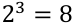

**<u>Passo 2</u>** <u>: desenhar o esquema da tabela-verdade.</u> 

Note que: 

Para determinar **<mark>[(p</mark>** <mark>∧</mark> **<mark>q)</mark>** <mark>∧</mark> **<mark>r]</mark>** <mark>→</mark> **<mark>[p</mark>** <mark></mark> **<mark>(q</mark>** <mark>∨</mark> **<mark>r)]</mark>** , precisamos obter **<mark>[(p</mark>** <mark>∧</mark> **<mark>q)</mark>** <mark>∧</mark> **<mark>r]</mark>** e **<mark>[p</mark>** <mark></mark> **<mark>(q</mark>** <mark>∨</mark> **<mark>r)]</mark>** . 

Para determinar **[(p** ∧ **q)** ∧ **r]** , precisamos obter **<mark>(p</mark>** <mark>∧</mark> **<mark>q)</mark>** e **r** . 

Para determinar **(p** ∧ **q)** , precisamos obter **p** e **q** . 

Para determinar **[p**  **(q** ∨ **r)]** , precisamos obter **p** e **<mark>(q</mark>** <mark>∨</mark> **<mark>r)</mark>** <mark>.</mark> 

Para determinar **(q** ∨ **r)** , precisamos obter **q** e **r** . 

Logo, temos o seguinte esquema da tabela-verdade: 

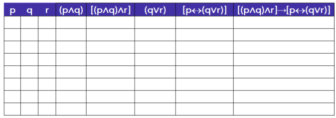

---

<!-- pagina: 32 -->

**Equipe Exatas Estratégia Concursos Aula 01** 

**<u>Passo 3</u>** <u>: atribuir V ou F às proposições simples de maneira alternada.</u> 

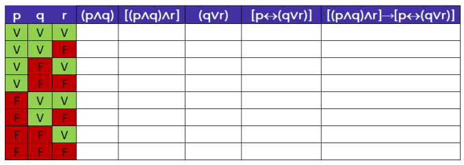

**<u>Passo 4</u>** <u>: obter o valor das demais proposições.</u> 

A conjunção **p** ∧ **q** é verdadeira somente quando **p** e **q** são ambos verdadeiros. Nos demais casos, **p** ∧ **q** é falso. 

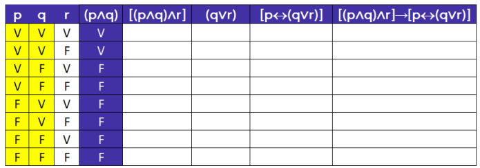

A conjunção **[(p** ∧ **q)** ∧ **r]** é verdadeira somente quando **(p** ∧ **q)** e **r** são ambos verdadeiros. Nos demais casos, **[(p** ∧ **q)** ∧ **r]** é falso. 

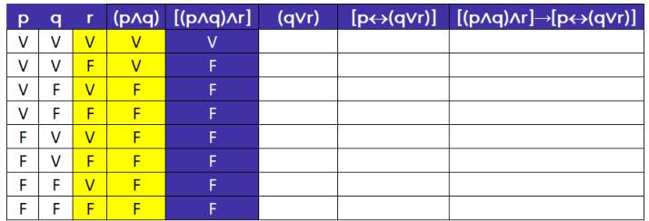

A disjunção inclusiva **(q** ∨ **r)** é falsa somente quando **q** e **r** são ambos falsos. Nos demais casos, **(q** ∨ **r)** é verdadeiro. 

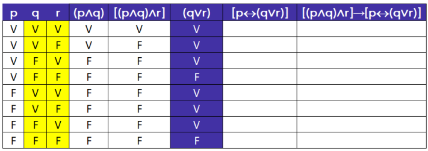

---

<!-- pagina: 33 -->

**Equipe Exatas Estratégia Concursos Aula 01** 

A bicondicional **[p**  **(q** ∨ **r)]** será verdadeira somente quando **p** e **(q** ∨ **r)** tiverem o mesmo valor lógico. Nos demais casos, **[p**  **(q** ∨ **r)]** é falso. 

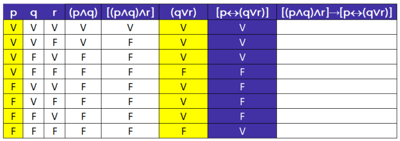

Por fim, a condicional **[(p** ∧ **q)** ∧ **r]** → **[p**  **(q** ∨ **r)]** é falsa somente quando o antecedente **[(p** ∧ **q)** ∧ **r]** é verdadeiro e o consequente **[p**  **(q** ∨ **r)]** é falso. Observe que esse caso nunca ocorre, de modo que essa condicional é sempre verdadeira. Logo, **estamos diante de uma tautologia** . 

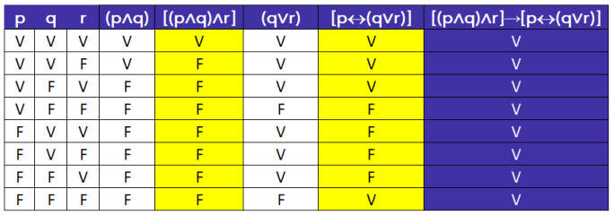

Vamos resolver algumas questões utilizando o método da tabela-verdade. 

**(CRO RS/2022)** Considerando as proposições **p** e **q** , assinale a alternativa que apresenta um exemplo de contradição. 

a) (p ∧ q) → (p ∨ q) 

b) p ∨~ p 

c) p → (q → p) 

d) (p ∧ q) → p 

e) (p ∨~ q)( ~ p ∧ q) 

#### **Comentários:** 

Vamos analisar cada alternativa e verificar aquela que apresenta uma **contradição** .

---

<!-- pagina: 34 -->

**Equipe Exatas Estratégia Concursos Aula 01** 

#### a) **(p** ∧ **q)** → **(p** ∨ **q) − Tautologia** . 

#### **<u>Passo 1</u>** <u>: determinar o número de linhas da tabela-verdade.</u> 

Temos duas proposições simples distintas. Logo, o número de linhas é 22 = 2 × 2 = 4 . 

**<u>Passo 2</u>** <u>: desenhar o esquema da tabela-verdade.</u> 

Para determinar **<mark>(p</mark>** <mark>∧</mark> **<mark>q)</mark>** <mark>→</mark> **<mark>(p</mark>** <mark>∨</mark> **<mark>q)</mark>** <mark>,</mark> precisamos determinar **<mark>(p</mark>** <mark>∧</mark> **<mark>q)</mark>** <mark>,</mark> **<mark>(p</mark>** <mark>∨</mark> **<mark>q)</mark>** <mark>,</mark> **p** e **q.** 

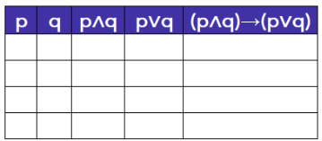

**<u>Passo 3</u>** <u>: atribuir V ou F às proposições simples de maneira alternada.</u> ==5460== 

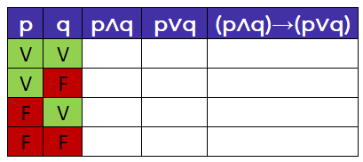

<!-- Start of picture text -->
==5460== <!-- End of picture text -->

**<u>Passo 4</u>** <u>: obter o valor das demais proposições.</u> 

- **(p** ∧ **q)** é verdadeiro somente quando **p** e **q** são ambos verdadeiros. 

- **(p** ∨ **q)** é falso somente quando **p** e **q** são ambos falsos. 

- **(p** ∧ **q)** → **(p** ∨ **q)** é falso somente quando **(p** ∧ **q)** é verdadeiro e **(p** ∨ **q)** é falso. Como isso não ocorre, **estamos** 

- **diante de uma tautologia** . 

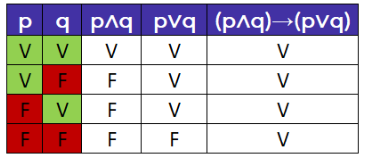

#### b) **p** ∨~ **p − Tautologia** . 

Conforme visto na teoria da aula, **p** ∨~ **p** é uma tautologia. 

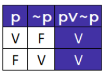

#### c) **p** → **(q** → **p) − Tautologia** . 

**<u>Passo 1</u>** <u>: determinar o número de linhas da tabela-verdade.</u> 

Temos duas proposições simples distintas. Logo, o número de linhas é 22 = 2 × 2 = 4 . **<u>Passo 2</u>** <u>: desenhar o esquema da tabela-verdade.</u> 

Para determinar **<u><mark>p</mark></u>** <mark>→</mark> **<u><mark>(q</mark></u>** <mark>→</mark> **<u><mark>p)</mark></u>** <mark>,</mark> <u>precisamos determinar</u> **<u>p</u>** , **<u>q</u>** e **<u><mark>(q</mark></u>** <mark>→</mark> **<u><mark>p)</mark></u>** <mark>.</mark>

---

<!-- pagina: 35 -->

**Equipe Exatas Estratégia Concursos Aula 01** 

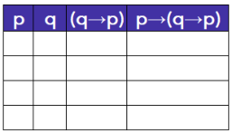

**<u>Passo 3</u>** <u>: atribuir V ou F às proposições simples de maneira alternada.</u> 

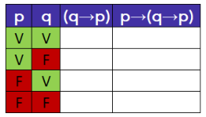

#### **<u>Passo 4</u>** <u>: obter o valor das demais proposições.</u> 

- **(q** → **p)** é falso somente quando **q** é verdadeiro e **p** é falso. 

- **p** → **(q** → **p)** é falso somente quando **p** é verdadeiro e **(q** → **p)** é falso. Como isso não ocorre, **estamos diante** 

- **de uma tautologia** . 

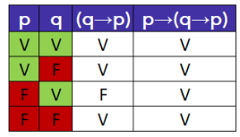

#### d) **(p** ∧ **q)** → **p − Tautologia** . 

**<u>Passo 1</u>** <u>: determinar o número de linhas da tabela-verdade.</u> 

Temos duas proposições simples distintas. Logo, o número de linhas é 22 = 2 × 2 = 4 . 

**<u>Passo 2</u>** <u>: desenhar o esquema da tabela-verdade.</u> 

Para determinar **<mark>(p</mark>** <mark>∧</mark> **<mark>q)</mark>** <mark>→</mark> **<mark>p</mark>** <mark>,</mark> precisamos determinar **<mark>(p</mark>** <mark>∧</mark> **<mark>q)</mark>** <mark>,</mark> **p** e **q.** 

**<u>Passo 3</u>** <u>: atribuir V ou F às proposições simples de maneira alternada.</u> 

**<u>Passo 4</u>** <u>: obter o valor das demais proposições.</u> 

- **(p** ∧ **q)** é verdadeiro somente quando **p** e **q** são ambos verdadeiros. 

- **(p** ∧ **q)** → **p** é falso somente quando **(p** ∧ **q)** é verdadeiro e **p** é falso. Como isso não ocorre, **estamos diante de** 

- **uma tautologia** .

---

<!-- pagina: 36 -->

**Equipe Exatas Estratégia Concursos Aula 01** 

e) **(p** ∨~ **q)**  **(** ~ **p** ∧ **q) − Contradição** . **Esse é o gabarito** . 

**<u>Passo 1</u>** <u>: determinar o número de linhas da tabela-verdade.</u> 

Temos duas proposições simples distintas. Logo, o número de linhas é 22 = 2 × 2 = 4 . **<u>Passo 2</u>** <u>: desenhar o esquema da tabela-verdade.</u> 

Para determinar **<mark>(p</mark>** <mark>∨~</mark> **<mark>q)</mark>** <mark></mark> **<mark>(</mark>** <mark>~</mark> **<mark>p</mark>** <mark>∧</mark> **<mark>q)</mark>** , precisamos obter **<mark>(p</mark>** <mark>∨~</mark> **<mark>q)</mark>** <mark>,</mark> **<mark>(</mark>** <mark>~</mark> **<mark>p</mark>** <mark>∧</mark> **<mark>q)</mark>** <mark>,</mark> ~ **p** , ~ **q** , **p** e **q** . 

**<u>Passo 3</u>** <u>: atribuir V ou F às proposições simples de maneira alternada.</u> 

**<u>Passo 4</u>** <u>: obter o valor das demais proposições.</u> 

- ~ **p** tem o valor lógico oposto de **p.** 

- ~ **q** tem o valor lógico oposto de **q.** 

- **(p** ∨~ **q)** é falso somente quando **p** e ~ **q** são ambos falsos. 

- **(** ~ **p** ∧ **q)** é verdadeiro somente quando ~ **p** e **q** são ambos verdadeiros. 

- **(p** ∨~ **q)**  **(** ~ **p** ∧ **q)** é verdadeiro somente quando **(p** ∨~ **q)** e **(** ~ **p** ∧ **q)** apresentam o mesmo valor lógico. **Como** 

- **isso não ocorre, estamos diante de uma contradição** . 

**Gabarito: Letra E.** 

**(ISS Fortaleza/2023) P** : “Se a pessoa trabalha com o que gosta e está de férias, então é feliz ou está de férias.” 

Considerando a proposição **P** precedente, julgue o item seguinte. A proposição **P** é uma tautologia.

---

<!-- pagina: 37 -->

**Equipe Exatas Estratégia Concursos Aula 01** 

#### **Comentários:** 

Considere as seguintes proposições simples: 

**t:** "A pessoa trabalha com o que gosta." 

**f:** "A pessoa está de férias." 

**z:** "A pessoa é feliz." 

Note que a proposição composta **P** pode ser descrita por **(t** ∧ **f)** → **(z** ∨ **f)** : 

**(t** ∧ **f)** → **(z** ∨ **f)** : “ **Se [(** a pessoa trabalha com o que gosta **) e (** está de férias **)]** , **então [(** é feliz **) ou (** está de férias **)]** .” 

Para verificar se a proposição é uma tautologia, vamos construir a sua tabela-verdade. 

**<u>Passo 1</u>** <u>: determinar o número de linhas da tabela-verdade.</u> 

Temos três proposições simples distintas ( **t** , **f** e **z** ). Logo, o número de linhas é 23 = 2 × 2 × 2 = 8 . **<u>Passo 2</u>** <u>: desenhar o esquema da tabela-verdade.</u> 

Para determinar **<mark>(t</mark>** <mark>∧</mark> **<mark>f)</mark>** <mark>→</mark> **<mark>(z</mark>** <mark>∨</mark> **<mark>f)</mark>** <mark>,</mark> precisamos obter **<mark>(t</mark>** <mark>∧</mark> **<mark>f)</mark>** <mark>,</mark> **<mark>(z</mark>** <mark>∨</mark> **<mark>f)</mark>** <mark>,</mark> **t** , **z** e **f** . 

**<u>Passo 3</u>** <u>: atribuir V ou F às proposições simples de maneira alternada.</u> 

**<u>Passo 4</u>** <u>: obter o valor das demais proposições.</u> 

- **(t** ∧ **z)** é verdadeiro somente quando **t** e **z** são ambos verdadeiros. 

- **(z** ∨ **f)** é falso somente quando **z** e **f** são ambos falsos. 

- **(t** ∧ **z)** → **(z** ∨ **f)** é falso somente quando **(t** ∧ **z)** é verdadeiro e **(z** ∨ **f)** é falso. Como isso não ocorre, **estamos** 

- **diante de uma tautologia** .

---

<!-- pagina: 38 -->

**Equipe Exatas Estratégia Concursos Aula 01** 

<!-- Start of picture text -->
Gabarito: CERTO. <!-- End of picture text -->

## Método da prova por absurdo 

Vamos utilizar o **método da prova por absurdo** para verificar se a seguinte proposição é uma **tautologia** , uma **contradição** ou uma **contingência** : 

#### **[(p** ∧ **q)** ∧ **r]** → **[p**  **(q** ∨ **r)]** 

Para aplicar esse método, o **<u>primeiro passo</u>** é partir da hipótese de que a proposição é uma **tautologia** ou então partir da hipótese de que a proposição é uma **contradição** . 

Se nós suspeitarmos que a proposição composta é uma **tautologia** , devemos seguir o seguinte procedimento: 

- Tentar aplicar o valor lógico **falso** à proposição. Dessa tentativa, há duas possibilidades: 

   - **Se for possível que a proposição seja falsa** , sabemos que **não é uma tautologia** . Nesse caso, a proposição **pode ser** **<u>contradição</u> ou** **<u>contingência</u>** <u>; ou</u> 

   - **Se nessa tentativa chegarmos a algum absurdo** <u>, isso significa que a proposição nunca poderá</u> ser falsa e, portanto, **é uma tautologia** (sempre verdadeira). 

Por outro lado, se nós suspeitarmos que a proposição composta é uma **contradição** , devemos seguir o seguinte procedimento: 

- Tentar aplicar o valor lógico **verdadeiro** à proposição. Dessa tentativa, há duas possibilidades: `o` **Se for possível que a proposição seja verdadeira** , sabemos que **não é uma contradição** . Nesse caso, a proposição **pode ser** **<u>tautologia</u> ou** **<u>contingência</u>** <u>; ou</u> 

   - **Se nessa tentativa chegarmos a algum absurdo** <u>, isso significa que a proposição nunca poderá</u> ser verdadeira e, portanto, **é uma contradição** (sempre falsa). 

_Ok, professor! Mas como eu descubro com esse método se a proposição é uma contingência?_ 

Simples, caro aluno! 

Veja que, ao aplicar o método, **se for possível que a proposição seja falsa e também for possível que a proposição seja verdadeira** , **não teremos uma tautologia e também não teremos uma contradição** . Nesse caso, a proposição em questão é uma **contingência** !

---

<!-- pagina: 39 -->

**Equipe Exatas Estratégia Concursos Aula 01** 

_Certo, professor. Mas o que é esse tal de absurdo?_ 

Excelente pergunta! Vamos esclarecer. 

Nesse contexto, o termo " **absurdo** " se refere a uma **<u>situação contraditória</u>** que surge ao tentar aplicar o **valor falso a uma tautologia** ou o **valor verdadeiro a uma contradição** . 

**Exemplo** : vamos supor que você aplica o **valor falso** a uma proposição composta que você suspeita que é uma tautologia. Em decorrência disso, você obtém que <u>algumas proposições simples devem ser verdadeiras e falsas ao mesmo tempo. Trata-se de um</u> **absurdo** , pois sabemos que as proposições não podem ser V e F ao mesmo tempo. Como chegamos em um absurdo, isso significa que a **proposição composta original nunca pode ser falsa** . Portanto, temos uma **tautologia** . 

Esse conceito ficará mais claro em seguida, <u>quando mostrarmos o método com mais detalhes.</u> 

Bom, vamos aplicar o método! Queremos descobrir se **[(p** ∧ **q)** ∧ **r]** → **[p**  **(q** ∨ **r)]** é uma **tautologia** , uma **contradição** ou uma **contingência** . Arbitrariamente, **vamos inicialmente supor que [(p** ∧ **q)** ∧ **r]** → **[p**  **(q** ∨ **r)] é uma contradição** . 

Nesse caso, devemos **tentar aplicar o valor lógico verdadeiro à proposição composta** . 

Você consegue verificar como essa condicional com antecedente **[(p** ∧ **q)** ∧ **r]** e com consequente **[p**  **(q** ∨ **r)]** pode ser verdadeira? 

Eu tentaria, por exemplo, fazer com que o antecedente dessa condicional fosse falso. Nesse caso, a condicional será verdadeira, pois necessariamente não teremos o único caso em que a condicional é falsa (caso **V** → **F** ). 

Perceba, então, **que se p** , **q e r forem todos falsos** , por exemplo, **teremos um antecedente falso** e, consequentemente, a proposição será verdadeira: 

**[(p** ∧ **q)** ∧ **r]** → **[p**  **(q** ∨ **r)]** 

**[(F** ∧ **F)** ∧ **F]** → **[F**  **(F** ∨ **F)]** 

**[F** ∧ **F]** → **[F**  **F]** 

**[F]** → **[V]** 

**V**

---

<!-- pagina: 40 -->

**Equipe Exatas Estratégia Concursos Aula 01** 

Olha só, que legal! **Conseguimos fazer com que a proposição seja verdadeira** ! **Logo** , **sabemos que a proposição composta em questão não é uma contradição** , podendo ser **<u>tautologia</u> ou** **<u>contingência.</u>** 

Bom, sabemos que a proposição composta em questão não é uma contradição. **Vamos supor** , **então** , **que [(p** ∧ **q)** ∧ **r]** → **[p**  **(q** ∨ **r)] é uma tautologia** . 

Nesse caso, devemos **tentar aplicar o valor lógico falso à proposição composta** . 

Para que a condicional em questão seja falsa, devemos ter o caso **V** → **F** . Logo: 

- O antecedente **[(p** ∧ **q)** ∧ **r]** deve ser **verdadeiro** ; e 

- O consequente **[p**  **(q** ∨ **r)]** deve ser **falso** . 

#### **Antecedente** 

Vamos verificar o antecedente **[(p** ∧ **q)** ∧ **r]** . Para que a conjunção de **(p** ∧ **q)** com **r** seja verdadeira, ambas as parcelas precisam ser verdadeiras. Logo: 

- **(p** ∧ **q)** deve ser verdadeiro; e 

- **r** deve ser verdadeiro. 

Além disso, para que **(p** ∧ **q)** seja verdadeiro, devemos ter **p** e **q** ambos verdadeiros. Logo: 

- **p deve ser verdadeiro** ; 

- **q deve ser verdadeiro** ; e 

- **r deve ser verdadeiro** . 

Vamos agora analisar o consequente da condicional. 

#### **Consequente** 

Para que a bicondicional **[p**  **(q** ∨ **r)]** seja falsa, ambas as parcelas, **p** e **(q** ∨ **r)** , devem ter valores lógicos distintos. Isso significa que podemos ter dois casos: 

- **p verdadeiro** com **(q** ∨ **r) falso** ; e 

- **p falso** com **(q** ∨ **r) verdadeiro** . 

Veja que **aqui nós já encontramos um absurdo** <u>!</u> **Isso porque já obtivemos que p** , **q e r** **<u>devem ser todos verdadeiros</u>** <u>! Veja que, quando analisamos a bicondicional do consequente:</u> 

- No primeiro caso, teremos **(q** ∨ **r)** falso, de modo que **q e r devem ser ambos falsos** ; 

- No segundo caso, **p deve ser falso** . 

Como acabamos de chegar em um absurdo, note que **a proposição lógica em questão não pode ser falsa** . Trata-se, <u>portanto, de uma</u> **tautologia** .

---

<!-- pagina: 41 -->

**Equipe Exatas Estratégia Concursos Aula 01** 

Para fins de resolução de questões de **tautologia** , **contradição** e **contingência** , **provar por absurdo** costuma ser a **melhor opção** quando comparada com a tabela-verdade. Isso porque a construção de uma tabela-verdade costuma levar mais tempo. 

Vamos resolver algumas questões utilizando o **método da prova por absurdo** . 

**(Pref Penedo/2023)** Qual das alternativas apresenta uma tautologia? 

a) P ∧ Q ∧ R 

b) P ∨ QR ∨ S 

c) P ∨ QR ∧ S 

d) P ∨ Q ∨ R → S 

e) P ∨ Q ∨ R ∨ ¬S ∨ ¬P 

#### **Comentários:** 

Pessoal, note que **as alternativas de A até D são** **<u>contingências</u>** <u>. Isso porque, nesses quatro casos, as proposições simples de cada proposição composta não se repetem.</u> 

Veja que, nesses quatro casos, podemos atribuir valores lógicos às proposições simples de modo que a proposição composta pode ser tanto verdadeira quanto falsa a depender dos valores lógicos atribuídos às proposições simples. 

#### a) **P** ∧ **Q** ∧ **R – Contingência.** 

- Se **P** , **Q** e **R** forem todos verdadeiros, **P** ∧ **Q** ∧ **R** será verdadeiro. 

- Se **P** , **Q** e **R** forem todos falsos, **P** ∧ **Q** ∧ **R** será falso. 

Como acabamos de mostrar um caso em que a proposição composta pode ser verdadeira e um caso em que a proposição composta pode ser falsa, temos uma **<u>contingência</u>** <u>.</u> 

#### b) **P** ∨ **Q**  **R** ∨ **S – Contingência.** 

- Se **P** , **Q** , **R** e **S** forem todos verdadeiros, **P** ∨ **Q**  **R** ∨ **S** será verdadeiro. 

- Se **P** e **Q** forem verdadeiros e **R** e **S** forem falsos, **P** ∨ **Q**  **R** ∨ **S** será falso

---

<!-- pagina: 42 -->

**Equipe Exatas Estratégia Concursos Aula 01** 

Como acabamos de mostrar um caso em que a proposição composta pode ser verdadeira e um caso em que a proposição composta pode ser falsa, temos uma **<u>contingência</u>** <u>.</u> 

#### c) **P** ∨ **Q**  **R** ∧ **S – Contingência.** 

- Se **P** , **Q** , **R** e **S** forem todos verdadeiros, **P** ∨ **Q**  **R** ∧ **S** será verdadeiro. 

• Se **P** e **Q** forem verdadeiros e **R** e **S** forem falsos, **P** ∨ **Q**  **R** ∧ **S** será falso Como acabamos de mostrar um caso em que a proposição composta pode ser verdadeira e um caso em que a proposição composta pode ser falsa, temos uma **<u>contingência</u>** <u>.</u> d) **P** ∨ **Q** ∨ **R** → **S – Contingência.** 

- Se **P** , **Q** , **R** e **S** forem todos verdadeiros, **P** ∨ **Q** ∨ **R** → **S** será verdadeiro. 

• Se **P** , **Q** e **R** forem verdadeiros e **S** for falso, **P** ∨ **Q** ∨ **R** → **S** será falso Como acabamos de mostrar um caso em que a proposição composta pode ser verdadeira e um caso em que a proposição composta pode ser falsa, temos uma **<u>contingência</u>** <u>.</u> e) **P** ∨ **Q** ∨ **R** ∨~ **S** ∨~ **P − Tautologia** . Como a questão pergunta por uma tautologia, **a nossa suspeita é de que P** ∨ **Q** ∨ **R** ∨~ **S** ∨~ **P é uma tautologia** . Nesse caso, vamos **tentar aplicar o valor lógico falso à proposição** . Como temos uma disjunção inclusiva com 5 termos, para que ela seja falsa, todos os cinco termos devem ser falsos. Logo: 

**P** **<u>deve ser falso</u>** <u>;</u> **Q** deve ser falso; **R** deve ser falso; **¬S** deve ser falso; e ~ **P** **<u>deve ser falso</u>** Veja que aqui encontramos um **<u>absurdo</u>** <u>. Isso porque</u> **P** e ~ **P** não podem ser ao mesmo tempo falsos, dado que **P** e ~ **P** devem apresentar valores lógicos opostos. 

Logo, a proposição em questão **nunca poderá ser falsa** e, portanto, **é uma tautologia** (sempre verdadeira). **Gabarito: Letra E.** 

**(PETROBRAS/2022)** A proposição **[(p** → **r)** ∧ **(q** → **r)]** → **[r** → **(p** ∨ **q)]** é sempre verdadeira, independentemente do valor-verdade das proposições **p, q** e **r** . 

#### **Comentários:** 

A questão pergunta se a proposição **[(p** → **r)** ∧ **(q** → **r)]** → **[r** → **(p** ∨ **q)]** é sempre verdadeira. Em outras palavras, **queremos saber se essa proposição composta é uma tautologia** . 

Como a questão pergunta por uma tautologia, **a nossa suspeita é de que [(p** → **r)** ∧ **(q** → **r)]** → **[r** → **(p** ∨ **q)] é uma tautologia** . 

Nesse caso, vamos **tentar aplicar o valor lógico falso à proposição** . 

Para a condicional **[(p** → **r)** ∧ **(q** → **r)]** → **[r** → **(p** ∨ **q)]** ser falsa, devemos ter o caso **V** → **F** . Logo: 

- O antecedente **[(p** → **r)** ∧ **(q** → **r)]** deve ser verdadeiro; e 

- O consequente **<u>[r</u>** → **<u>(p</u>** ∨ **<u>q)]</u>** deve ser falso.

---

<!-- pagina: 43 -->

**Equipe Exatas Estratégia Concursos Aula 01** 

Vamos analisar primeiro o consequente, pois, a partir da falsidade do consequente, obteremos alguns valores lógicos que as proposições simples devem ter. 

#### **Consequente** 

Para que a condicional **[r** → **(p** ∨ **q)]** seja falsa, devemos ter o caso **V** → **F** . Logo: 

- **r** deve ser verdadeiro; e 

- **(p** ∨ **q)** deve ser falso. 

Para que a disjunção inclusiva **(p** ∨ **q)** seja falsa, ambas as parcelas precisam ser falsas. Logo: 

- **r deve ser verdadeiro** ; e 

- **p deve ser falso** ; e 

- **q deve ser falso** . 

#### **Antecedente** 

Para que a conjunção **[(p** → **r)** ∧ **(q** → **r)]** seja verdadeira, ambas as parcelas da conjunção devem ser verdadeiras. Logo: 

- **(p** → **r)** deve ser verdadeiro; e 

- **(q** → **r)** deve ser verdadeiro. 

**Veja que isso não contradiz os valores já obtidos para p** , **q** e **r** . Isso porque, com **r verdadeiro** , **p falso** e **q falso** , **(p** → **r)** e **(q** → **r)** são ambos verdadeiros. 

Note, portanto, que para **r verdadeiro** , **p falso** e **q falso** , temos que o antecedente **[(p** → **r)** ∧ **(q** → **r)]** é verdadeiro e o consequente **[r** → **(p** ∨ **q)]** é falso. **Portanto** , **é possível fazer com que a condicional [(p** → **r)** ∧ **(q** → **r)]** → **[r** → **(p** ∨ **q)] seja falsa** ! 

Isso significa que para esses valores lógicos de **r** , **p** e **q** , temos que a condicional **[(p** → **r)** ∧ **(q** → **r)]** → **[r** → **(p** ∨ **q)]** é falsa. Logo, **não se trata de uma tautologia** . 

**Gabarito: ERRADO.** 

A questão a seguir já foi resolvida utilizando o **método da tabela-verdade** . Resolveremos, nesse momento, utilizando o **método da prova por absurdo** . 

**(ISS Fortaleza/2023) P** : “Se a pessoa trabalha com o que gosta e está de férias, então é feliz ou está de férias.” 

Considerando a proposição **P** precedente, julgue o item seguinte. 

A proposição **P** é uma tautologia. 

**Comentários:** 

Considere as seguintes proposições simples: 

**t:** "A pessoa trabalha com o que gosta." 

**f:** "A pessoa está de férias." 

**z:** "A pessoa é feliz." 

Note que a proposição composta **P** pode ser descrita por **(t** ∧ **f)** → **(z** ∨ **f)** : 

**(t** ∧ **f)** → **(z** ∨ **f)** : “ **Se [(** a pessoa trabalha com o que gosta **) e (** está de férias **)]** , **então [(** é feliz **) ou (** está de férias **<u>)]</u>** .”

---

<!-- pagina: 44 -->

**Equipe Exatas Estratégia Concursos Aula 01** 

Como a questão pergunta por uma tautologia, **a nossa suspeita é de que (t** ∧ **f)** → **(z** ∨ **f) é uma tautologia** . 

Nesse caso, vamos **tentar aplicar o valor lógico falso à proposição** . 

Para que a condicional **(t** ∧ **f)** → **(z** ∨ **f)** seja falsa, devemos ter o caso **V** → **F** . Logo 

- O antecedente **(t** ∧ **f)** deve ser verdadeiro; e 

- O consequente **(z** ∨ **f)** deve ser falso. 

#### **Antecedente** 

Para que a conjunção **(t** ∧ **f)** seja verdadeira, ambas as parcelas precisam ser verdadeiras. Logo: 

- **t deve ser verdadeiro** ; e 

- **f deve ser verdadeiro** . 

#### **Consequente** 

Para que a disjunção inclusiva **(z** ∨ **f)** seja falsa, ambas as parcelas precisam ser falsas. Logo: 

- **z deve ser falso** ; e 

- **f deve ser falso** . 

Veja que aqui encontramos um **<u>absurdo</u>** <u>! Isso porque, analisando o antecedente, obtivemos que</u> **f deve ser verdadeiro** . Por outro lado, analisando o consequente, obtivemos que **f deve ser falso** . 

Como acabamos de chegar em um absurdo, note que **a proposição lógica em questão não pode ser falsa** . Trata-se, portanto, de uma **tautologia** . 

**Gabarito: CERTO.** 

## Implicação 

Para finalizar essa parte teórica, vamos entender o conceito de **implicação** . 

Dizemos que uma proposição **p** **<u>implica</u> q** quando a **condicional p** → **q é uma tautologia** . A representação da afirmação " **p** **<u>implica</u> q"** é **p** ⇒ **q.** 

**p** → **q** é uma condicional com o antecedente **p** e o consequente **q** . 

**p** ⇒ **q** significa " **p** **<u>implica q</u>** ", isto é, significa afirmar que "a condicional **p** → **q** é uma tautologia".

---

<!-- pagina: 45 -->

**Equipe Exatas Estratégia Concursos Aula 01** 

**Apesar dessa distinção, algumas bancas utilizam o símbolo de implicação** " ⇒” **como se fosse o símbolo da condicional** " →” . 

Além disso, em algumas questões, as bancas podem utilizar a expressão " **p** **<u>implica</u> q** " **para se referir simplesmente a uma condicional p** → **q** , **sem que ela necessariamente seja uma tautologia** . 

**(PC SE/2014)** Diz-se que uma proposição composta A implica numa proposição composta B, se: 

a) a conjunção entre elas for tautologia 

b) o condicional entre elas, nessa ordem, for tautologia. 

c) o bicondicional entre elas for tautologia 

d) A disjunção entre elas for tautologia. 

**Comentários:** 

Dizer que uma proposição composta **A** **<u>implica</u>** numa proposição composta **B** significa dizer que **a condicional A** → **B é uma tautologia** . 

**Gabarito: Letra B.**

---

<!-- pagina: 46 -->

**Equipe Exatas Estratégia Concursos Aula 01** 

# **- QUESTÕES COMENTADAS FGV** 

## Tabela-verdade 

#### **<mark>(FGV/DNIT/2024) Considere a sentença:</mark>** 

**“Se André é vascaíno ou Beto é botafoguense, então Cadu é flamenguista e Beto não é botafoguense”.** 

**Sabendo-se que a sentença dada é verdadeira, é correto concluir que** 

a) André é vascaíno. 

b) Beto é botafoguense. 

c) Cadu é flamenguista. 

d) André não é vascaíno. 

e) Beto não é botafoguense. 

#### **Comentários:** 

Sejam as proposições simples: 

**a:** "André é vascaíno." 

**b:** "Beto é botafoguense." 

**c:** "Cadu é flamenguista" 

Note que a sentença do enunciado corresponde a **(a** ∨ **b)** → **(c** ∧~ **b)** : 

**(a** ∨ **b)** → **(c** ∧~ **b)** : " **Se [(** André é vascaíno **) ou (** Beto é botafoguense **)]** , **então [(** Cadu é flamenguista **) e (** Beto **não** é botafoguense **)]** ." 

Observe que, como a condicional é verdadeira, só não podemos ter o caso **V** → **F** . Logo, podemos ter os casos **V** → **V** , **F** → **V** ou **F** → **F** . Perceba, portanto, que **não conseguimos analisar individualmente o valor lógico das três proposições simples a** , **b e c** . Devemos, portanto, avaliar as três proposições compostas em conjunto. 

Vamos, então, **construir uma tabela-verdade com a condicional (a** ∨ **b)** → **(c** ∧~ **b)** e **obter as linhas da tabela-verdade em que ela é verdadeira** . 

**<u>Passo 1</u>** <u>: determinar o número de linhas da tabela-verdade.</u> 

Temos um total de 3 proposições simples distintas. Portanto, o número de linhas da tabela-verdade é: 

23 = 8

---

<!-- pagina: 47 -->

**Equipe Exatas Estratégia Concursos Aula 01** 

**<u>Passo 2</u>** <u>: desenhar o esquema da tabela-verdade.</u> 

Para determinar **<mark>(a</mark>** <mark>∨</mark> **<mark>b)</mark>** <mark>→</mark> **<mark>(c</mark>** <mark>∧~</mark> **<mark>b)</mark>** , precisamos obter **<mark>(a</mark>** <mark>∨</mark> **<mark>b)</mark>** e **<mark>(c</mark>** <mark>∧~</mark> **<mark>b)</mark>** <mark>;</mark> 

Para determinar **(a** ∨ **b)** precisamos obter **a** e **b** ; 

Para determinar **(c** ∧~ **b)** , precisamos obter **c** e <mark>~</mark> **<mark>b</mark>** <mark>;</mark> 

Para determinar ~ **b** , precisamos obter **b** 

Logo, temos o seguinte esquema da tabela-verdade: 

<!-- Start of picture text -->
==5460== <!-- End of picture text -->

**<u>Passo 3</u>** <u>: atribuir V ou F às proposições simples de maneira alternada.</u> 

**<u>Passo 4</u>** <u>: obter o valor das demais proposições.</u> 

- ~ **b** apresenta valor lógico contrário a **b** . 

---

<!-- pagina: 48 -->

**Equipe Exatas Estratégia Concursos Aula 01** 

**(a** ∨ **b)** é falso somente quando **a** e **b** são ambos falsos. 

**(c** ∧~ **b)** é verdadeiro somente quando **c** e ~ **b** são ambos verdadeiros. 

**(a** ∨ **b)** → **(c** ∧~ **b)** é falsa somente quando o antecedente **(a** ∨ **b)** é verdadeiro e o consequente **(c** ∧~ **b)** é falso. 

Observe que **a condicional (a** ∨ **b)** → **(c** ∧~ **b) é verdadeira somente nas linhas 3, 7 e 8** . 

---

<!-- pagina: 49 -->

**Equipe Exatas Estratégia Concursos Aula 01** 

Nessas três linhas que respeitam a condição do enunciado, temos que a proposição **b** é falsa. Portanto, é correto concluir a **negação de b** , que é necessariamente verdadeira: 

~ **b** : "Beto **não** é botafoguense." 

**Gabarito: Letra E.** 

**<mark>(FGV/BANESTES/2023) Sejam p, q e r proposições simples e</mark>** <mark>∼</mark> **<mark>p,</mark>** <mark>∼</mark> **<mark>q e</mark>** <mark>∼</mark> **<mark>r, respectivamente, as suas negações. As seguintes proposições compostas têm valor lógico verdadeiro:</mark>** 

**p** ∨ **q** 

**q** ∨~ **r r** ∨~ **p** 

**Pode-se concluir que o conjunto de proposições simples logicamente verdadeiras é dado por** 

a) {p}. 

b) {q}. 

c) {r}. 

d) {p, q}. 

e) {q, r}. 

**Comentários:** 

A questão apresenta **três disjunções inclusivas** **<u>verdadeiras</u>** <u>:</u> **p** ∨ **q** , **q** ∨~ **r** e **r** ∨~ **p** . 

Sabemos que a **disjunção inclusiva** " **ou** " é **<u>falsa</u>** somente quando **<u>ambas as parcelas são falsas</u>** (caso **F** ∨ **F** ). Nos outros três casos, **V** ∨ **V** , **V** ∨ **F** e **F** ∨ **V** , a disjunção inclusiva é verdadeira. 

Note que, **analisando individualmente cada uma das proposições compostas p** ∨ **q** , **q** ∨~ **r** e **r** ∨~ **p** , **não conseguimos determinar os valores lógicos das proposições simples p** , **q** e **r** . Devemos, portanto, avaliar as três proposições compostas em conjunto. 

Vamos então **construir uma tabela-verdade com as três disjunções inclusivas p** ∨ **q** , **q** ∨~ **r** e **r** ∨~ **p** e **obter as linhas da tabela-verdade em que as três proposições compostas são simultaneamente verdadeiras** . 

**<u>Passo 1</u>** <u>: determinar o número de linhas da tabela-verdade.</u> 

Temos um total de 3 proposições simples distintas. Portanto, o número de linhas da tabela-verdade é: 

---

<!-- pagina: 50 -->

**Equipe Exatas Estratégia Concursos Aula 01** 

**<u>Passo 2</u>** <u>: desenhar o esquema da tabela-verdade.</u> 

- Proposição **p** ∨ **q** : 

Para determinar **<mark>p</mark>** <mark>∨</mark> **<mark>q</mark>** <mark>,</mark> precisamos obter **p** e **q** . 

- Proposição **q** ∨~ **r** : 

Para determinar **<mark>q</mark>** <mark>∨~</mark> **<mark>r</mark>** , precisamos obter **q** e ~ **r** . 

Para determinar ~ **r** , precisamos obter **r** . 

- Proposição **r** ∨~ **p** : 

Para determinar **<mark>r</mark>** <mark>∨~</mark> **<mark>p</mark>** , precisamos obter **r** e <mark>~</mark> **<mark>p</mark>** <mark>.</mark> 

Para determinar ~ **p** , precisamos obter **p** . 

Logo, temos o seguinte esquema da tabela-verdade: 

**<u>Passo 3</u>** <u>: atribuir V ou F às proposições simples de maneira alternada.</u> 

---

<!-- pagina: 51 -->

**Equipe Exatas Estratégia Concursos Aula 01** 

#### **<u>Passo 4</u>** <u>: obter o valor das demais proposições.</u> 

- ~ **p** apresenta o valor lógico contrário a **p** , e ~ **r** apresenta valor lógico contrário a **r** . 

**p** ∨ **q** é falso somente quando **p** e **q** são ambos falsos. Nos outros casos, **p** ∨ **q** é verdadeiro. 

**q** ∨~ **r** é falso somente quando **q** e ~ **r** são ambos falsos. Nos outros casos, **q** ∨~ **r** é verdadeiro. 

---

<!-- pagina: 52 -->

**Equipe Exatas Estratégia Concursos Aula 01** 

**r** ∨~ **p** é falso somente quando **r** e ~ **p** são ambos falsos. Nos outros casos, **r** ∨~ **p** é verdadeiro. 

Note que **as três disjunções inclusivas p** ∨ **q** , **q** ∨~ **r** e **r** ∨~ **p são simultaneamente verdadeiras na primeira linha, na quinta linha e na sexta linha da tabela-verdade** : 

Isso significa que **p** ∨ **q** , **q** ∨~ **r** e **r** ∨~ **p** são simultaneamente verdadeiras para os seguintes casos: 

- **Primeira linha** : **p verdadeiro** , **<mark>q verdadeiro</mark>** e **r verdadeiro** ; 

- **Quinta linha** : **p falso** , **<mark>q verdadeiro</mark>** e **r verdadeiro** ; e 

- **Sexta linha** : **p falso** , **<mark>q verdadeiro</mark>** e **r falso** . 

Note que, para que **p** ∨ **q** , **q** ∨~ **r** e **r** ∨~ **p** sejam simultaneamente verdadeiras, **p** e **r** podem ser V ou F. Apesar disso, sabemos que **<mark>q é necessariamente verdadeiro</mark>** . 

Logo, **pode-se concluir que o conjunto de proposições simples logicamente verdadeiras é dado por {q}** . 

**Gabarito: Letra B.**

---

<!-- pagina: 53 -->

**Equipe Exatas Estratégia Concursos Aula 01** 

# **– QUESTÕES COMENTADAS MULTIBANCAS** 

## Conversão da linguagem natural para a proposicional 

**<mark>(FEPESE/Pref. Chapecó/2025) No contexto das estruturas lógicas, considere as seguintes proposições.</mark>** 

**p: “A escola ampliará o número de vagas no próximo ano.”** 

**q: “Será necessário contratar novos professores.”** 

**r: “O orçamento da secretaria de educação será aumentado.”** 

**Considere a seguinte proposição composta:** 

**(p** → **q)** ∧ **(q** → **r)** 

**Assinale a alternativa que interpreta corretamente a proposição composta.** 

a) O orçamento da secretaria só será aumentado se a escola ampliar o número de vagas. 

b) Se a escola não ampliar o número de vagas, então o orçamento da secretaria será aumentado. 

c) A escola ampliará o número de vagas ou será necessário contratar novos professores, mas não ambos. 

d) Se a escola ampliar o número de vagas, então será necessário contratar novos professores, e se novos professores forem contratados, o orçamento da secretaria será aumentado. 

e) A contratação de novos professores é condição suficiente para que a escola amplie o número de vagas e para que o orçamento seja aumentado. 

**Comentários:** 

O enunciado fornece as seguintes proposições simples: 

𝒑 : "A escola ampliará o número de vagas no próximo ano." 

𝒒 : "Será necessário contratar novos professores." 

𝒓 : "O orçamento da secretaria de educação será aumentado." 

A proposição composta (𝒑→𝒒) ∧ (𝒒→𝒓) é uma **conjunção de duas condicionais** : 

𝒑 →𝒒 : " **Se [** a escola ampliar o número de vagas **]** , **então [** será necessário contratar novos professores **]** ." 

𝒒 →𝒓 : " **Se [** novos professores forem contratados **]** , **então [** o orçamento da secretaria será aumentado **]** ." 

A **conjunção (** ∧ **)** indica que **ambas as condicionais são afirmadas simultaneamente** . Logo, a interpretação para a linguagem natural da proposição composta (𝒑 → 𝒒) ∧ (𝒒 → 𝒓) é: 

**"[se (** a escola ampliar o número de vagas **), então (** será necessário contratar novos professores **)], e [(se "** novos professores forem contratados **), (** o orçamento da secretaria será aumentado **)]** . 

#### **Gabarito: Letra D.**

---

<!-- pagina: 54 -->

**Equipe Exatas Estratégia Concursos Aula 01** 

#### **<mark>(Instituto Verbena/UFG/2025) Considere a sentença a seguir.</mark>** 

**“Se o laboratório está aberto, então há técnico de plantão. Se isso acontece, então, se o laboratório estiver aberto e não houver aula marcada, os equipamentos estarão funcionando. Além disso, os equipamentos só estarão funcionando se, e somente se, o laboratório estiver aberto.”** 

**Considerando as proposições: p: “O laboratório está aberto”, q: “Há técnico de plantão”, r: “Os equipamentos estão funcionando”, s: “Há aula marcada”, a sentença acima é traduzida para a linguagem simbólica na proposição lógica** 

a) (pq)[(p ∧ ¬s) → r] ∨ (rp). 

b) (pq)[(p ∧ ¬s) → r] ∧ (rp). 

c) (p → q) → [(p ∨ ¬s) → r] ∨ (rp). 

d) (p → q) → [(p ∧ ¬s) → r] ∧ (rp). 

**Comentários:** 

O enunciado já fornece as proposições simples: 

Vamos traduzir a sentença por partes. 

#### **_"Se [o laboratório está aberto], então [há técnico de plantão]."_** 

Trata-se de uma condicional 𝒑 →𝒒 . 

#### **_"Se [isso acontece], então, [se [(o laboratório estiver aberto) e (não houver aula marcada)], [os equipamentos estarão funcionando]]."_** 

O termo **_"isso acontece"_** refere-se à sentença anterior, 𝒑 →𝒒 . O consequente dessa nova condicional é **"** **_se o laboratório estiver aberto e não houver aula marcada, os equipamentos estarão funcionando_ "** , que corresponde a (𝒑∧~𝒔) →𝒓 . Portanto: 

#### **"Além disso, (os equipamentos só estarão funcionando) se, e somente se, (o laboratório estiver aberto)."** 

A expressão **"se, e somente se"** indica uma bicondicional entre 𝒓 e 𝒑 : 

𝒓 ↔𝒑

---

<!-- pagina: 55 -->

**Equipe Exatas Estratégia Concursos Aula 01** 

O conectivo **"Além disso"** apresenta sentido de **adição** , funcionando como uma **conjunção (** ∧ **)** entre as duas partes da sentença. Assim, a tradução completa é: 

#### (𝒑→𝒒) →[(𝒑∧~𝒔) →𝒓] ∧(𝒓↔𝒑) 

#### **Gabarito: Letra D.** 

**<mark>(VUNESP/SEDUC SP/2025) Assim como existe a ordem de precedência nas operações em expressões numéricas e algébricas, existe a ordem de precedência na interpretação de uma proposição lógica composta.</mark>** 

**Dessa forma, a correta interpretação da proposição p** ∨ **q** → **r**  **s** ∧ **t é:** 

a) (p ∨ q) → (r  (s ∧ t)). 

b) ((p ∨ q) → r)  (s ∧ t). 

c) ((p ∨ q) → (r  s)) ∧ t. 

d) (p ∨ q) → ((r  s) ∧ t). 

e) (p ∨ (q → r))  (s ∧ t). 

#### **Comentários:** 

Para determinar a correta interpretação da proposição composta dada, devemos aplicar a **ordem de precedência dos conectivos lógicos** : 

1. **Negação (** ~ **ou** ¬ **)** : é o operador de maior precedência, aplicando-se imediatamente à proposição que o segue. 

2. **Conjunção (** ∧ **) e Disjunção Inclusiva (** ∨ **)** : devem ser executados na ordem que aparecerem. 

3. **Disjunção Exclusiva (** <u>∨</u> **<u>)</u>** . 

4. **Condicional (** → **)** : 

5. **Bicondicional (** ↔ **)** : é o conectivo com a menor precedência, sendo geralmente o último a ser resolvido, a não ser que tenhamos parênteses indicando uma precedência diferente. 

Vamos analisar a proposição apresentada: 𝒑 ∨𝒒 →𝒓 ↔𝒔 ∧𝒕 . 

**Primeiro** , **identificamos e resolvemos as conjunções e disjunções** , **pois elas têm prioridade sobre a condicional e a bicondicional** . Temos uma **disjunção inclusiva** entre 𝒑 **e** 𝒒 , e uma **conjunção** entre 𝒔 **e** 𝒕 . Colocando os parênteses nestas operações para indicar a precedência, ficamos com: 

(𝑝∨𝑞) →𝑟↔(𝑠∧𝑡) 

Agora restam os conectivos **condicional** ( → ) e **bicondicional** (  ). **Pela regra de precedência** , **a condicional deve ser resolvida antes da bicondicional** . Portanto, devemos agrupar a operação condicional que conecta o antecedente (𝒑∨𝒒) ao consequente 𝒓 . Ao isolar essa operação com parênteses, obtemos: 

((𝑝∨𝑞) →𝑟) ↔(𝑠∧𝑡)

---

<!-- pagina: 56 -->

**Equipe Exatas Estratégia Concursos Aula 01** 

Por fim, **resta apenas o bicondicional** (  ), **que será o conectivo principal da sentença** , ligando todo o bloco da esquerda ao bloco da direita. A estrutura final, com a pontuação correta segundo a ordem de precedência, é: 

#### ((𝑝∨𝑞) →𝑟) ↔(𝑠∧𝑡) 

Ao compararmos este resultado com as alternativas fornecidas, observamos que ele corresponde exatamente à letra B. 

#### **Gabarito: Letra B.** 

**<mark>(VUNESP/SEDUC SP/2025) No livro Lógica e Conjuntos, o autor Francisco Cunha defende o uso de parênteses na simbolização das proposições para evitar ambiguidades, mas concorda que a notação</mark> pode ser simplificada (supressão de parênteses) desde que não venham a ocorrer ambiguidades. Para** **<mark>essa simplificação é definida uma ordem de precedência das operações lógicas, de maneira a permitir identificar o conectivo principal de uma proposição, de modo a poder nomeá-la. De acordo com a ordem</mark> estabelecida no livro, dadas as proposições simples, p, q, r e s, a proposição** 

∼ ∼ **p** ∨ **q** → **r** ∧ **(s**  ∼ **q** ∨ ∼ **p)** 

#### **é uma** 

a) negação. 

b) disjunção. 

c) condicional. 

d) conjunção. 

e) bicondicional. 

#### **Comentários:** 

Para determinar a correta interpretação da proposição composta dada, devemos aplicar a **ordem de precedência dos conectivos lógicos** : 

1. **Negação (** ~ **ou** ¬ **)** : é o operador de maior precedência, aplicando-se imediatamente à proposição que o segue. 

2. **Conjunção (** ∧ **) e Disjunção Inclusiva (** ∨ **)** : devem ser executados na ordem que aparecerem. 

3. **Disjunção Exclusiva (** <u>∨</u> **<u>)</u>** . 

4. **Condicional (** → **)** : 

5. **Bicondicional (** ↔ **)** : é o conectivo com a menor precedência, sendo geralmente o último a ser resolvido, a não ser que tenhamos parênteses indicando uma precedência diferente. 

Cumpre destacar que **os parênteses têm a função de alterar essa hierarquia** , ou seja, **tudo o que está dentro dos parênteses deve ser resolvido antes das operações externas** . 

A proposição apresentada no enunciado é:

---

<!-- pagina: 57 -->

**Equipe Exatas Estratégia Concursos Aula 01** 

∼∼𝑝∨𝑞→𝑟∧(𝑠↔∼𝑞∨∼𝑝) 

Vamos analisar a estrutura passo a passo para **identificar o conectivo principal** ( **aquele que é resolvido por último e que dá nome à proposição** ). 

1. **Resolução dos Parênteses:** o termo (𝒔↔∼𝒒∨∼𝒑) é um bloco fechado. Embora contenha uma bicondicional, **ele funciona como uma única unidade lógica para o restante da expressão externa** . 

2. **Negações (** ∼ **):** no nível externo, temos ∼∼𝒑 . Isso se liga diretamente ao 𝒑 . Adicionando parênteses para explicitar essa precedência, ficamos com: 

      - (∼∼𝑝) ∨𝑞→𝑟∧(𝑠↔∼𝑞∨∼𝑝) 

3. **Conjunções (** ∧ **) e Disjunções (** ∨ **):** na hierarquia, estes conectivos precedem a condicional. Portanto, eles "grudam" os termos adjacentes antes que a condicional possa atuar. 

   - **À esquerda da condicional** ( → ), temos a **disjunção inclusiva** : (∼∼𝒑) ∨𝒒 . Este bloco forma o **antecedente** . Ficamos com: 

      - [(∼∼𝑝) ∨𝑞] →𝑟∧ (𝑠↔∼𝑞∨∼𝑝) 

   - **À direita da condicional** ( → ), temos a conjunção: 𝑟∧(bloco dos parênteses) . Este bloco forma o **consequente** . Ficamos com: 

4. **Condicional (** → **):** agora que resolvemos as operações mais fortes, resta o conectivo condicional conectando o **bloco da esquerda** ( **disjunção inclusiva** ) ao **bloco da direita** ( **conjunção** ). 

Portanto, a estrutura lógica final, com a precedência explícita, é: 

Como o último conectivo a ser operado é o **"se... então" (** → **)** , **ele é o conectivo principal** . Portanto, a proposição inteira é classificada como uma **condicional** . 

#### **Gabarito: Letra C.** 

**<mark>(CEBRASPE/INPI/2024) P: “Como Carlos enfrentou resistência dos produtores locais, articulou e negociou o fornecimento com produtores de outros estados.”</mark>** 

#### **Considerando a proposição P precedente, julgue o próximo item.** 

**Sob o ponto de vista lógico, a proposição P pode ser escrita como “Uma vez que enfrentou resistência dos produtores locais, Carlos articulou e negociou o fornecimento com produtores de outros estados.”.** 

#### **Comentários:** 

Observe que a condicional " **Se p** , **então q** " pode ser escrita tanto da forma " **Como p, q** " quanto da forma " **Uma vez que p** , **q** ". Isso porque essas três expressões expressam a ideia de condicional.

---

<!-- pagina: 58 -->

**Equipe Exatas Estratégia Concursos Aula 01** 

Observe a proposição composta **P** : 

**P** : “ **Como [** Carlos enfrentou resistência dos produtores locais **]** , **[** articulou e negociou o fornecimento com produtores de outros estados **]** .” 

Essa proposição composta é uma condicional, podendo ser descrita assim: 

**P** : “ **Se [** Carlos enfrentou resistência dos produtores locais **]** , **então [** articulou e negociou o fornecimento com produtores de outros estados **]** .” 

Outra forma de se escrever a condicional é: 

**P** : “ **Uma vez que [** Carlos enfrentou resistência dos produtores locais **]** , **[** articulou e negociou o fornecimento com produtores de outros estados **]** .” 

O item apresenta justamente esse formato de representar a proposição **P** , **explicitando no consequente da condicional o sujeito** " **Carlos** ", **que estava omitido** : 

**P** : “ **Uma vez que [** Carlos enfrentou resistência dos produtores locais **]** , **[Carlos** articulou e negociou o fornecimento com produtores de outros estados **]** .” 

#### **Gabarito: CERTO.** 

**<mark>(Instituto AOCP/Pref. V Conquista/2023) Comumente observam-se algumas divergências entre o sentido dos conectivos para a lógica e para a língua portuguesa. É o caso do conectivo “OU”, por exemplo, que é empregado usualmente na língua portuguesa como indicativo para uma escolha</mark> enquanto a lógica utilizaria o “OU ... OU ...” para o mesmo fim. Observe os dizeres de um cartaz** **<mark>informativo no caixa de uma loja varejista:</mark>** 

#### **“PAGUE COM PIX E GANHE DESCONTO”** 

**Nesse caso, apesar do emprego do conectivo “E”, o sentido está associado a uma expressão condicional. Assim, assinale a alternativa que apresenta a reescrita do cartaz em uma estrutura condicional, mantendo o sentido pretendido.** 

a) Ganhou desconto e pagou com PIX. 

b) Ganhou desconto ou pagou com PIX. 

c) Ou ganhou desconto ou pagou com PIX. 

d) Só será aceito o pagamento se for com PIX. 

e) Se pagar com PIX, então ganhará desconto. 

#### **Comentários:** 

Segundo o enunciado, os dizeres “ **Pague com Pix e ganhe desconto** ” apresenta o sentido de uma **condicional** , que **costuma ser expressa por meio do conectivo** “ **se...então** ”. Logo, a frase pode ser reescrita do seguinte modo:

---

<!-- pagina: 59 -->

**Equipe Exatas Estratégia Concursos Aula 01** 

#### **“Se [** pagar com PIX **]** , **então [** ganhará desconto **]** .” 

#### **Gabarito: Letra E.** 

**<mark>(CEBRASPE/PM SC/2023) Assinale a opção que apresenta uma proposição equivalente a "Você faltou com a verdade".</mark>** 

a) Você não falou a verdade. 

b) Você não falou mentira. 

c) Você faltou com a mentira. 

- d) Você falou a verdade. 

- e) Você não disse mentira. 

#### **Comentários:** 

Devemos encontrar uma proposição que tenha o mesmo significado da seguinte proposição simples: 

#### **"Você faltou com a verdade"** 

Note que "faltar com a verdade" significa "não falar a verdade". Portanto, a proposição simples original corresponde a: 

#### **"Você não falou a verdade"** 

O **gabarito** , portanto, é **letra A** . 

Note que as **alternativas B** , **C** e **E** significam a mesma ideia: " **Você não falou mentira** ". Além disso, a **alternativa D** apresenta a o contrário do sentido procurado: " **Você falou a verdade** ". 

#### **Gabarito: Letra A.** 

#### **<mark>(CEBRASPE/TRT8/2023) Considere-se a seguinte proposição P.</mark>** 

**P: “O juiz atendeu ao pedido do promotor e determinou a suspensão do porte de arma do suspeito.”** 

**Assinale a opção que, sob o ponto de vista da lógica sentencial, apresenta uma proposição equivalente à proposição P.** 

a) O juiz não só atendeu ao pedido do promotor, como também determinou a suspensão do porte de arma do suspeito. 

b) Se o juiz atendeu ao pedido do promotor, então determinou a suspensão do porte de arma do suspeito. 

c) Ou o juiz atendeu ao pedido do promotor ou determinou a suspensão do porte de arma do suspeito. 

d) O juiz atendeu ao pedido do promotor se, e somente se, determinou a suspensão do porte de arma do suspeito. 

e) Se o juiz não determinou a suspensão do porte de arma do suspeito, então não atendeu ao pedido do promotor. 

**Comentários:**

---

<!-- pagina: 60 -->

**Equipe Exatas Estratégia Concursos Aula 01** 

Note que a proposição **P** apresenta o **conectivo conjunção (** ∧ **)** , e o sentido apresentado é um **sentido de adição** : 

“ **[** O juiz atendeu ao pedido do promotor **] e [** determinou a suspensão do porte de arma do suspeito **]** .” 

Na Língua Portuguesa, o termo " **não só..., como também** " também apresenta **sentido de adição** : 

**[** O juiz **não só** atendeu ao pedido do promotor **]** , **como também [** determinou a suspensão do porte de arma do suspeito **]** . 

Portanto, a **alternativa A** é o **gabarito** da questão, pois também apresenta um **sentido de adição** . Nesse caso, devemos considerar que essa alternativa também apresenta o **conectivo conjunção (** ∧ **)** . 

As demais alternativas apresentam os conectivos **disjunção exclusiva** , **condicional** e **bicondicional** nas formas usuais " **ou...ou** ", " **se...então** ", " **se, e somente se** ". Veremos, no decorrer da aula de Equivalências Lógicas, que **não há equivalência entre a conjunção "e" e esses conectivos** . 

#### **Gabarito: Letra A.** 

**<mark>(IBFC/PCBA/2022) O total de proposições simples distintas que formam a proposição composta “Ou o motorista foi imprudente ou a sinalização estava com defeito se, e somente se, o agente de trânsito notificou o ocorrido e o motorista foi imprudente, mas as condições da pista não eram adequadas”, é igual a:</mark>** 

a) 4 

b) 5 

c) 6 

d) 7 

e) 3 

#### **Comentários:** 

Considere as seguintes proposições simples: 

**m:** "O motorista foi imprudente." 

**s:** "A sinalização estava com defeito." 

**a:** "O agente de trânsito notificou o ocorrido." 

**p:** "As condições da pista não eram adequadas." 

Note que a proposição composta apresentada pode ser descrita por **(m** <u>∨</u> **<u>[s</u>**  **(a** ∧ **m)])** ∧ **p** : 

**(m** <u>∨</u> **<u>[s</u>**  **(a** ∧ **m)])** ∧ **p** : “ **[Ou [** o motorista foi imprudente **] ou [(** a sinalização estava com defeito **) se, e somente se, ([** o agente de trânsito notificou o ocorrido **] e [** o motorista foi imprudente **])]]** , **mas [** as condições da pista não eram adequadas **]** .”

---

<!-- pagina: 61 -->

**Equipe Exatas Estratégia Concursos Aula 01** 

Logo, **o total de proposições simples distintas é quatro** . 

#### **Gabarito: Letra A.** 

**<mark>(IBFC/PCBA/2022/ADAPTADA) A ocorrência foi registrada e o inquérito foi instaurado se, e somente se, a testemunha foi ouvida ou o flagrante foi validado, mas o processo será analisado.</mark>** 

**Nessas condições, o total de conectivos lógicos distintos utilizados na frase acima é igual a:** 

a) 2 

b) 3 

c) 5 

d) 6 

e) 4 

#### **Comentários:** 

Considere as seguintes proposições simples: 

**o:** "A ocorrência foi registrada." 

**i:** "O inquérito foi instaurado." 

**t:** "A testemunha foi ouvida." 

**f:** "O flagrante foi validado." 

**p:** "O processo será analisado." 

Note que a proposição composta apresentada pode ser descrita por **[(o** ∧ **i)**  **(t** ∨ **f)]** ∧ **p** : 

" **[[(** A ocorrência foi registrada **) e (** o inquérito foi instaurado **)] se, e somente se** , **[(** a testemunha foi ouvida **) ou (** o flagrante foi validado **)]]** , **mas [** o processo será analisado **]** ." 

#### Perceba que **o total de conectivos lógicos distintos utilizados é três** : 

- **Conjunção** (utilizada duas vezes nas formas " **e** " e " **mas** "); 

- **Disjunção inclusiva** " **ou** "; 

- **Bicondicional** " **se e somente se** ". 

#### **Gabarito: Letra B.** 

**<mark>(CEBRASPE/PETROBRAS/2022) Julgue o item seguinte, considerando a proposição P: “Como nossas</mark>** 

**<mark>reservas de matéria prima se esgotaram e não encontramos um novo nicho de mercado, entramos em falência”.</mark>**

---

<!-- pagina: 62 -->

**Equipe Exatas Estratégia Concursos Aula 01** 

**Caso a afirmação tivesse sido dita antes dos acontecimentos, a proposição P poderia, sem prejuízo à sua estrutura lógica, ser substituída por: “Se nossas reservas de matéria prima se esgotarem e não encontrarmos um novo nicho de mercado, então entraremos em falência”.** 

#### **Comentários:** 

Considere as seguintes proposições simples: 

**r:** "Nossas reservas de matéria prima se esgotaram." 

**n:** "Encontramos um novo nicho de mercado." 

**f:** "Entramos em falência." 

Note que **a proposição composta P é uma condicional** da forma " **Como p, q** ", em que o antecedente é uma conjunção. Essa proposição composta pode ser escrita como ==5460== **r** ∧ ~ **n** → **f** . 

**r** ∧ ~ **n** → **f:** “ **Como [(** nossas reservas de matéria prima se **<u>esgotaram)</u> e (não** encontramos um novo nicho de 

mercado **)]** , **[** entramos em falência **]** ”. 

Veja que **a nova proposição composta sugerida também é uma condicional** . Essa segunda condicional está escrita da forma tradicional " **Se p, então q** ". 

**r** ∧ ~ **n** → **f:** “ **Se [(** nossas reservas de matéria prima se **<u>esgotarem)</u> e (não** encontramos um novo nicho de 

mercado **)]** , **então [** entramos em falência **]** ”. 

**r** ∧ ~ **n** → **f** . O **gabarito** , portanto, é **CERTO** . 

Um aluno mais atento pode ter percebido que o tempo verbal da proposição **r** mudou, de modo que " **<u>esgotaram</u>** " passou a ser " **<u>esgotarem</u>** ". Essa alteração em nada altera o gabarito da questão pois, via de regra, o tempo verbal não é relevante em lógica de proposições. 

#### **Gabarito: CERTO.** 

**<mark>(CEBRASPE/ADAPAR/2021) Sendo A, B, C e D proposições simples escolhidas adequadamente, assinale a opção que, no âmbito da lógica proposicional, apresenta uma expressão lógica que representa simbolicamente a sentença “Se o Paraná é uma área livre de febre aftosa sem vacinação, então haverá</mark> ampliação do comércio de carnes produzidas no estado e haverá aumento do preço do produto para os** **<mark>países compradores; com isso, o estado será mais rico”.</mark>** 

a) (A → B ∨ C) → D 

b) (A ∧ B ∧ C) → D 

c) (A → B ∧ C) → D 

d) (A → B ∧ C) ∧ D

---

<!-- pagina: 63 -->

**Equipe Exatas Estratégia Concursos Aula 01** 

e) (A ∧ B → C) → D 

#### **Comentários:** 

Primeiramente, vamos analisar a seguinte **proposição composta apresentada antes do ponto e vírgula** : 

" **Se [** o Paraná é uma área livre de febre aftosa sem vacinação **]** , **então [(** haverá ampliação do comércio de carnes produzidas no estado **) e (** haverá aumento do preço do produto para os países compradores **)]** ." 

Considere as seguintes proposições simples: 

**A:** "O Paraná é uma área livre de febre aftosa sem vacinação." 

**B:** "Haverá ampliação do comércio de carnes produzidas no estado." 

**C:** "Haverá aumento do preço do produto para os países compradores." 

Note, portanto, que essa **proposição composta apresentada antes do ponto e vírgula** pode ser representada por **A** → **B** ∧ **C** , pois o antecedente da condicional em questão é a proposição **A** e o consequente da condicional é a conjunção **B** ∧ **C** . 

Considere agora a seguinte proposição simples: 

**D** : "O estado será mais rico." 

Vamos observar a **proposição composta completa** : 

“ **[** Se o Paraná é uma área livre de febre aftosa sem vacinação, então haverá ampliação do comércio de carnes produzidas no estado e haverá aumento do preço do produto para os países compradores **]; com isso** , **[** o estado será mais rico **]** .” 

Na teoria da aula, não vimos um conectivo " **com isso** ". Nesse caso, devemos nos lembrar de que: 

O termo **proposição** é usado para se referir ao **<u>significado</u>** das orações. 

Note que, no caso em questão, " **o estado será mais rico** " **é** **<u>consequência</u>** da seguinte **<u>causa</u>** <u>: "</u> **Se o Paraná é uma área livre de febre aftosa sem vacinação, então haverá ampliação do comércio de carnes produzidas no estado e haverá aumento do preço do produto para os países compradores** ". 

Isso significa que, na **proposição composta completa** , temos uma condicional cujo **<u>consequente</u>** é **D** e o **<u>antecedente</u>** é **A** → **B** ∧ **C** . Portanto, a proposição composta completa é dada por: 

#### **(A** → **B** ∧ **C)** → **D** 

#### **Gabarito: Letra C.**

---

<!-- pagina: 64 -->

**Equipe Exatas Estratégia Concursos Aula 01** 

# **– QUESTÕES COMENTADAS MULTIBANCAS** 

## Tabela-verdade 

**<mark>(FGV/ALEGO/2026) Sejam p e q duas proposições. Considere a sentença S dada por: (p</mark>** <mark>→</mark> **<mark>q)</mark>** <mark></mark> **<mark>(</mark>** <mark>~</mark> **<mark>p</mark>** <mark>∨</mark> **<mark>q) e</mark>** 

**<mark>a tabela verdade abaixo.</mark>** 

|**p **  **q** **S** **V   V**|
|---|
|**V   F**|
|**F   V**|
|**F   F**|

**Construindo a tabela verdade acima, os valores lógicos da sentença S (de cima para baixo) são:** 

a) V – V – V – V. 

b) V – F – V – V. 

c) V – V – V – F. 

d) V – F – F – V. 

e) V – F – V – F. 

**Comentários:** 

A sentença 𝑺 é dada por (𝒑→𝒒) ↔(~𝒑∨𝒒) . 

Para construir uma tabela-verdade, podemos seguir os seguintes passos: 

- **Passo 1: determinar o número de linhas da tabela-verdade;** 

- **Passo 2: desenhar o esquema da tabela-verdade;** 

- **Passo 3: atribuir V ou F às proposições simples de maneira alternada; e** 

- **Passo 4: obter o valor das demais proposições.** 

Perceba que o **Passo 1** , " **determinar o número de linhas da tabela-verdade** ", já está feito. O mesmo ocorre com o **Passo 3** , " **atribuir V ou F às proposições simples de maneira alternada** ". 

#### **Passo 2: desenhar o esquema da tabela-verdade** 

- Para determinar (𝒑→𝒒) ↔(~𝒑∨𝒒) , precisamos obter (𝒑→𝒒) e (~𝒑∨𝒒) ; 

- Para determinar (𝒑→𝒒) , precisamos obter 𝒑 e 𝒒 ; 

- Para determinar (~𝒑∨𝒒) , precisamos obter ~𝒑 e 𝒒 ; 

- Para determinar ~𝒑 , precisamos obter 𝒑 . 

Ficamos com o seguinte esquema:

---

<!-- pagina: 65 -->

**Equipe Exatas Estratégia Concursos Aula 01** 

|𝒑   𝒒  ~𝒑  𝒑→𝒒|~𝒑 ∨𝒒  𝑺≡(𝒑→𝒒)↔(~𝒑∨𝒒)|
|---|---|
|V   V||
|V   F||
|F   V||
|F   F||

**Passo 4: obter o valor das demais proposições.** 

~𝒑 apresenta valor lógico contrário a 𝒑 . 

|𝒑   𝒒|~𝒑  𝒑→𝒒  ~𝒑 ∨𝒒  𝑺≡(𝒑→𝒒)↔(~𝒑∨𝒒)|
|---|---|
|V   V|**F**|
|V   F|**F**|
|F   V|**V**|
|F   F|**V** ==5460==|

A condicional 𝒑 →𝒒 é **falsa** somente quando o **antecedente** 𝒑 é **verdadeiro** e o **consequente** 𝒒 é **falso** . 

|𝒑   𝒒|~𝒑  𝒑→𝒒|~𝒑 ∨𝒒  𝑺≡(𝒑→𝒒)↔(~𝒑∨𝒒)|
|---|---|---|
|V V|F **V**||
|V F|F **F**||
|F V|V **V**||
|F F|V **V**||

A disjunção inclusiva ~𝒑 ∨𝒒 é **falsa** somente quando ~𝒑 e 𝒒 são **ambos falsos** . 

|𝒑   𝒒  ~𝒑|𝒑→𝒒|~𝒑 ∨𝒒  𝑺≡(𝒑→𝒒)↔(~𝒑∨𝒒)|
|---|---|---|
|V V F|V|**V**|
|V F F|F|**F**|
|F V V|V|**V**|
|F F V|V|**V**|

A bicondicional (𝒑→𝒒) ↔(~𝒑∨𝒒) é verdadeira somente quando ambas as parcelas apresentam o mesmo valor lógico. 

|𝒑   𝒒|~𝒑  𝒑→𝒒|~𝒑 ∨𝒒|𝑺≡(𝒑→𝒒)↔(~𝒑∨𝒒)|
|---|---|---|---|
|V   V|F V|V|**V**|
|V   F|F F|F|**V**|
|F   V|V V|V|**V**|
|F   F|V V|V|**V**|

Os valores lógicos da sentença 𝑺 , de cima para baixo, são **V – V – V – V** . Perceba que **S é uma tautologia** . 

#### **Gabarito: Letra A.** 

**<mark>(CEBRASPE/SEED SE/2026) Assinale a opção em que é corretamente apresentado o número de linhas da tabela-verdade associada à proposição “Se a pessoa é irracional, então é contraditória”.</mark>**

---

<!-- pagina: 66 -->

**Equipe Exatas Estratégia Concursos Aula 01** 

a) 2 

b) 4 

c) 8 

d) 16 

e) 32 

**Comentários:** 

Considere as seguintes proposições simples: 

Note que a proposição do enunciado corresponde a 𝒑 →𝒒 : 

Sabemos que se uma proposição for composta por 𝒏 **proposições simples distintas** , o número de linhas da tabela-verdade será 𝟐𝒏 . Para o caso em questão, temos 𝒏= 𝟐 . Logo, o número de linhas da tabelaverdade é: 

#### **Gabarito: Letra B.** 

**<mark>(FUNDATEC/SBC/2025) Quantas linhas tem a tabela verdade da fórmula p</mark>** <mark>∧</mark> **<mark>q</mark>** <mark>→</mark> **<mark>r, considerando que existem três proposições (p, q e r)?</mark>** 

a) 3. 

b) 6. 

c) 8. 

d) 12. 

e) 16. 

**Comentários:** 

A proposição composta 𝒑 ∧𝒒 →𝒓 envolve 3 proposições simples: 𝒑 , 𝒒 e 𝒓 . 

Sabemos que se uma proposição for composta por 𝒏 **proposições simples distintas** , o número de linhas da tabela-verdade será 𝟐𝒏 . Para o caso em questão, temos 𝒏= 𝟑 . Logo, o número de linhas é: 

#### **Gabarito: Letra C.** 

https://t.me/KakashiAssinaturasBot

---

<!-- pagina: 67 -->

**Equipe Exatas Estratégia Concursos Aula 01** 

**<mark>(VUNESP/UNESP/2025) A Tabela-Verdade de uma proposição composta por 4 proposições simples indica um número de possibilidades de valor lógico dessa proposição composta igual a</mark>** 

a) 8. 

b) 12. 

c) 16. 

d) 24. 

e) 32. 

**Comentários:** 

Sabemos que se uma proposição for composta por 𝒏 **proposições simples distintas** , o número de linhas da tabela-verdade será 𝟐𝒏 . Para o caso em questão, temos 𝒏= 𝟒 . Logo, o número de linhas (possibilidades de valor lógico) é: 

#### **Gabarito: Letra C.** 

**<mark>(FUNDATEC/DPE SC/2025) O número de linhas da tabela verdade da proposição (p</mark>** <mark>∨</mark> **<mark>q)</mark>** <mark>∧</mark> **<mark>(r</mark>** <mark>∨</mark> **<mark>s), onde p, q, r e s são proposições simples, é:</mark>** 

a) 04. 

b) 08. 

c) 12. 

d) 16. 

e) 20. 

**Comentários:** 

A proposição composta (𝒑∨𝒒) ∧(𝒓∨𝒔) envolve **4 proposições simples distintas** : 𝒑 , 𝒒 , 𝒓 e 𝒔 . 

Sabemos que se uma proposição for composta por 𝒏 **proposições simples distintas** , o número de linhas da tabela-verdade será 𝟐𝒏 . Para o caso em questão, temos 𝒏= 𝟒 . Logo, o número de linhas é: 

#### **Gabarito: Letra D.** 

**<mark>(QUADRIX/CRMV PA/2025) No que se refere à proposição lógica P: “Se ele fizer bolo ou não comprar pão, haverá piquenique.”, julgue o seguinte item.</mark>** 

**A tabela-verdade associada à P tem 16 linhas.** 

**Comentários:**

---

<!-- pagina: 68 -->

**Equipe Exatas Estratégia Concursos Aula 01** 

Considere as seguintes proposições simples: 

Note que a proposição **P** pode ser descrita por (𝒃∨~𝒑) →𝒉 : 

(𝒃∨~𝒑) →𝒉 : " **Se [(** ele fizer bolo **) ou (não** comprar pão **)]** , **(então) [** haverá piquenique **]** ." 

Temos 𝒏= 𝟑 **proposições simples distintas** . Sabemos que se uma proposição for composta por 𝒏 **proposições simples distintas** , o número de linhas da tabela-verdade será 𝟐𝒏 . Logo, o número de linhas é: 

**O item afirma** que a tabela-verdade tem **16 linhas** , **o que é incorreto** . 

#### **Gabarito: ERRADO.** 

**<mark>(CPCON UEPB/Pref. Pombal/2025) Assinale a alternativa que apresenta CORRETAMENTE a quantidade de linhas necessárias para a construção da tabela verdade da proposição composta a seguir.</mark>** 

a) 8 

b) 32 

c) 2 

d) 16 

e) 4 

**Comentários:** 

A proposição composta ~(~𝒓→(𝒒∧~𝒑)) ∨(𝒒∧(𝒑→𝒔)) envolve as proposições simples 𝒑 , 𝒒 , 𝒓 e 𝒔 . Temos, portanto, 𝒏= 𝟒 **proposições simples distintas** . 

Sabemos que se uma proposição for composta por 𝒏 **proposições simples distintas** , o número de linhas da tabela-verdade será 𝟐𝒏 . Logo, o número de linhas é: 

#### **Gabarito: Letra D.** 

**<mark>(CPCON UEPB/CREF 10/2025) Considere a fórmula proposicional composta abaixo por:</mark>** 

---

<!-- pagina: 69 -->

**Equipe Exatas Estratégia Concursos Aula 01** 

**Sobre a tabela verdade completa desta fórmula, qual das alternativas indica CORRETAMENTE 1/4 do número de linhas que ela possui?** 

a) 16. 

b) 6. 

c) 8. 

d) 32. 

e) 4. 

**Comentários:** 

A proposição composta [(𝒑→𝒒) ∧~𝒓] ∨(𝒔↔𝒕) envolve as proposições simples 𝒑 , 𝒒 , 𝒓 , 𝒔 e 𝒕 . Temos, portanto, 𝒏= 𝟓 **proposições simples distintas** . 

Sabemos que se uma proposição for composta por 𝒏 **proposições simples distintas** , o número de linhas da tabela-verdade será 𝟐𝒏 . Logo, o número de linhas da tabela-verdade completa é: 

𝟏 **A questão pede do número de linhas** : 𝟒 

32 = 8 4 

**Gabarito: Letra C.** 

**<mark>(FAFIPA/Pref. Araucária/2025) A tabela-verdade a seguir apresenta algumas proposições com valores lógicos ocultos, representados pelas letras a, b e c:</mark>** 

**Com base nas regras lógicas e na análise da tabela, determine o valor lógico correspondente a** 𝒂 **,** 𝒃 **e** 𝒄 **, respectivamente.** 

a) V, F, F. 

b) F, F, V. 

c) V, F, V. 

d) V, V, V. 

e) F, V, F. 

**Comentários:** 

A tabela do enunciado apresenta a proposição ~𝒑 → 𝒒 com os valores ocultos 𝒂 , 𝒃 e 𝒄 .

---

<!-- pagina: 70 -->

**Equipe Exatas Estratégia Concursos Aula 01** 

#### **Valor de** 𝒂 

Na primeira linha, 𝒑 é **F** . Como ~𝒑 apresenta valor lógico contrário a 𝒑 , temos que ~𝒑 é **V** . Logo, 𝒂 **= V** . 

|𝒑   ~𝒑|𝒒  ~𝒑→𝒒|
|---|---|
|F **V**|F 𝑏|
|V   F|V 𝑐|

**Valor de** 𝒃 

Ainda na **primeira linha** , o antecedente ~𝒑 é **V** e o consequente 𝒒 é **F** . A condicional ~𝒑 → 𝒒 é **falsa** somente quando o **antecedente** ~𝒑 **é verdadeiro** e o **consequente** 𝒒 **é falso** . Este é exatamente o caso ( 𝑽 → 𝑭 ). Logo, 𝒃 = **F** . 

|𝒑   ~𝒑|𝒒  ~𝒑→𝒒|
|---|---|
|F V|F **F**|
|V   F|V 𝑐|

**Valor de** 𝒄 

Na segunda linha, ~𝒑 é **F** e 𝒒 é **V** . Logo, a condicional ~𝒑 → 𝒒 é da forma 𝑭→𝑽 . Portanto, a condicional é verdadeira, pois uma condicional só é falsa no caso 𝑽→𝑭 . Logo, 𝒄 **= V** . 

|𝒑   ~𝒑|𝒒  ~𝒑→𝒒|
|---|---|
|F  V|F F|
|V F|V **V**|

Portanto, os valores de 𝒂 , 𝒃 e 𝒄 são, respectivamente, **V, F e V** . 

**Gabarito: Letra C.** 

**<mark>(FUNDATEC/Pref. Xangri-lá/2025) Considerando que p e q são duas proposições lógicas quaisquer, a ordem correta de preenchimento da tabela verdade, de cima para baixo, é:</mark>** 

|**p **  **q**  ~**p **∨ **q**|
|---|
|**V   V**|
|**V   F**|
|**F   V**|
|**F   F**|

a) V – F – F – V. 

b) F – V – V – F. 

c) V – F – V – V. 

d) F – F – F – F. 

e) V – V – V – F.

---

<!-- pagina: 71 -->

**Equipe Exatas Estratégia Concursos Aula 01** 

**Comentários:** 

Para construir uma tabela-verdade, podemos seguir os seguintes passos: 

- **Passo 1: determinar o número de linhas da tabela-verdade;** 

- **Passo 2: desenhar o esquema da tabela-verdade;** 

- **Passo 3: atribuir V ou F às proposições simples de maneira alternada; e** 

- **Passo 4: obter o valor das demais proposições.** 

Perceba que o **Passo 1** , " **determinar o número de linhas da tabela-verdade** ", já está feito. O mesmo ocorre com o **Passo 3** , " **atribuir V ou F às proposições simples de maneira alternada** ". 

#### **Passo 2: desenhar o esquema da tabela-verdade;** 

- Para determinar ~𝒑 ∨𝒒 , precisamos obter ~𝒑 e 𝒒 . 

- Para determinar ~𝒑 ∨𝒒 , precisamos obter 𝒑 . 

Ficamos com o seguinte esquema: 

<!-- Start of picture text -->
𝒑 𝒒 ~𝒑 ~𝒑 ∨𝒒 V   V V   F F   V F   F <!-- End of picture text -->

**Passo 4: obter o valor das demais proposições** 

~𝒑 apresenta valor lógico contrário a 𝒑 . 

<!-- Start of picture text -->
𝒑 𝒒 ~𝒑 ~𝒑 ∨𝒒 V   V   F V   F   F F   V   V F   F   V <!-- End of picture text -->

A disjunção inclusiva ~𝒑 ∨𝒒 é **falsa** somente quando ~𝒑 e 𝒒 são **ambos falsos** . 

|𝒑   𝒒 |~𝒑  ~𝒑 ∨𝒒|
|---|---|
|V V|F **V**|
|V F|F **F**|
|F V|V **V**|
|F F|V **V**|

A ordem correta de preenchimento, de cima para baixo, é **V – F – V – V** . 

**Gabarito: Letra C.**

---

<!-- pagina: 72 -->

**Equipe Exatas Estratégia Concursos Aula 01** 

**<mark>(CPCON UEPB/Pref. Nazarezinho/2025) Uma determinada proposição composta,</mark>** <mark>𝑹(𝒑, 𝒒)</mark> **<mark>, formada a partir de duas proposições simples, p e q e alguns conectivos, a saber: negação, disjunção e conjunção, pode ser descrita pela seguinte expressão lógica.</mark>** 

𝑹(𝒑, 𝒒) = (∼(𝒑∨𝒒) ∧(∼𝒑)) 

**Após analisar** 𝑹(𝒑, 𝒒) **, assinale a alternativa que completa CORRETAMENTE a última coluna da tabela verdade na sequência crescente de suas linhas.** 

|**Linhas**  𝒑|𝒒 𝑹(𝒑, 𝒒)|
|---|---|
|**01** **V**|**V**|
|**02** **V**|**F**|
|**03** **F**|**V**|
|**04** **F**|**F**|

a) F F V V. 

b) V F F V. 

c) F V F V. 

d) F F F V. 

e) V V F F. 

**Comentários:** 

A proposição composta é 𝑹(𝒑, 𝒒) = ~(𝒑∨𝒒) ∧~𝒑 . 

Para construir uma tabela-verdade, podemos seguir os seguintes passos: 

- **Passo 1: determinar o número de linhas da tabela-verdade;** 

- **Passo 2: desenhar o esquema da tabela-verdade;** 

- **Passo 3: atribuir V ou F às proposições simples de maneira alternada; e** 

- **Passo 4: obter o valor das demais proposições.** 

Perceba que o **Passo 1** , " **determinar o número de linhas da tabela-verdade** ", já está feito. O mesmo ocorre com o **Passo 3** , " **atribuir V ou F às proposições simples de maneira alternada** ". 

#### **Passo 2: desenhar o esquema da tabela-verdade.** 

- Para determinar ~(𝒑∨𝒒) ∧~𝒑 , precisamos obter ~(𝒑∨𝒒) e ~𝒑 ; 

- Para determinar ~(𝒑∨𝒒) , precisamos obter (𝒑∨𝒒) ; 

- Para determinar (𝒑∨𝒒) , precisamos obter 𝒑 e 𝒒 ; 

- Para determinar ~𝒑 , precisamos obter 𝒑 . 

Ficamos com o seguinte esquema: 

|𝒑   𝒒|𝒑 ∨𝒒  ~(𝒑∨𝒒)  ~𝒑  𝑹(𝒑, 𝒒)≡~(𝒑∨𝒒) ∧~𝒑|
|---|---|
|V   V||
|V   F||

---

<!-- pagina: 73 -->

**Equipe Exatas Estratégia Concursos Aula 01** 

|F   V|
|---|
|F   F|

**Passo 4: obter o valor das demais proposições.** 

A disjunção inclusiva 𝒑 ∨𝒒 é **falsa** somente quando 𝒑 e 𝒒 são **ambos falsos** . 

|𝒑  𝒒|𝒑 ∨𝒒|~(𝒑∨𝒒)  ~𝒑  𝑹(𝒑, 𝒒)≡~(𝒑∨𝒒) ∧~𝒑|
|---|---|---|
|V V|**V**||
|V F|**V**||
|F V|**V**||
|F F|**F**||

~(𝒑∨𝒒) apresenta valor lógico **contrário** a (𝒑∨𝒒) . 

|𝒑  𝒒|𝒑 ∨𝒒|~(𝒑∨𝒒)|~𝒑  𝑹(𝒑, 𝒒)≡~(𝒑∨𝒒) ∧~𝒑|
|---|---|---|---|
|V   V|V|**F**||
|V   F|V|**F**||
|F   V|V|**F**||
|F   F|F|**V**||

~𝒑 apresenta valor lógico **contrário** a 𝒑 . 

|𝒑   𝒒|𝒑 ∨𝒒|~(𝒑∨𝒒)|~𝒑  𝑹(𝒑, 𝒒)≡~(𝒑∨𝒒) ∧~𝒑|
|---|---|---|---|
|V   V|V|F|**F**|
|V   F|V|F|**F**|
|F   V|V|F|**V**|
|F   F|F|V|**V**|

A conjunção ~(𝒑∨𝒒) ∧~𝒑 é **verdadeira** somente quando ~(𝒑∨𝒒) e ~𝒑 são **ambos verdadeiros** . 

|𝒑  𝒒|𝒑 ∨𝒒|~(𝒑∨𝒒)|~𝒑|𝑹(𝒑, 𝒒)≡~(𝒑∨𝒒) ∧~𝒑|
|---|---|---|---|---|
|V   V|V|F|F|**F**|
|V   F|V|F|F|**F**|
|F   V|V|F|V|**F**|
|F   F|F|V|V|**V**|

A última coluna, de cima para baixo, é **F, F, F, V** . 

**Gabarito: Letra D.** 

**<mark>(Instituto AOCP/TJPR/2025) Considere as seguintes proposições simples:</mark>** 

**P: “O servidor concluiu a análise.” Q: “O sistema emitiu o parecer.”**

---

<!-- pagina: 74 -->

**Equipe Exatas Estratégia Concursos Aula 01** 

**Analisando a tabela-verdade da proposição composta “O servidor concluiu a análise e o sistema não emitiu parecer, então o servidor não concluiu a análise”, é correto afirmar que a quantidade de linhas em que os valores-verdade são V (verdadeiros), para essa proposição composta, é** 

a) 4. 

b) 3. 

c) 2. 

d) 1. 

e) 0. 

**Comentários:** 

Considere as seguintes proposições simples: 

A proposição composta descrita no enunciado é (𝒑∧~𝒒) →~𝒑 . 

(𝒑∧~𝒒) →~𝒑 : " **Se [(** o servidor concluiu a análise **) e (** o sistema **não** emitiu o parecer **)]** , **então [** o servidor **não** concluiu a análise **]** ." 

#### **Passo 1: determinar o número de linhas da tabela-verdade.** 

Temos 𝒏= 𝟐 **proposições simples distintas** . Portanto, o número de linhas da tabela-verdade é: 

22 = 4 

#### **Passo 2: desenhar o esquema da tabela-verdade.** 

- Para determinar (𝒑∧~𝒒) →~𝒑 , precisamos obter (𝒑∧~𝒒) e ~𝒑 ; 

- Para determinar (𝒑∧~𝒒) , precisamos obter 𝒑 e ~𝒒 ; 

- Para determinar ~𝒒 , precisamos obter 𝒒 ; 

- Para determinar ~𝒑 , precisamos obter 𝒑 . 

Ficamos com o seguinte esquema: 

<!-- Start of picture text -->
𝒑 𝒒 ~𝒒 ~𝒑 𝒑 ∧ ~𝒒 (𝒑∧ ~𝒒) →~𝒑 <!-- End of picture text -->

**Passo 3: atribuir V ou F às proposições simples de maneira alternada.** 

Cada linha da tabela verdade deve corresponder a uma combinação distinta de valores lógicos para as proposições simples 𝒑 **e** 𝒒 : **V** − **V** ; **V** − **F** ; **F** − **V** e **F** − **F** .

---

<!-- pagina: 75 -->

**Equipe Exatas Estratégia Concursos Aula 01** 

|𝒑  𝒒  ~𝒒  ~𝒑|𝒑 ∧~𝒒  (𝒑∧~𝒒)→~𝒑|
|---|---|
|V V||
|V F||
|F V||
|F F||

**Passo 4: obter o valor das demais proposições.** 

~𝒒 apresenta valor lógico contrário a 𝒒 . 

|𝒑  𝒒  ~𝒒|~𝒑  𝒑 ∧~𝒒  (𝒑∧~𝒒)→~𝒑|
|---|---|
|V V **F**||
|V F **V**||
|F V **F**||
|F F **V**||

~𝒑 apresenta valor lógico contrário a 𝒑 . 

|𝒑   𝒒  ~𝒒|~𝒑|𝒑 ∧~𝒒  (𝒑∧~𝒒)→~𝒑|
|---|---|---|
|V   V   F|**F**||
|V   F   V|**F**||
|F   V   F|**V**||
|F   F   V|**V**||

A conjunção 𝒑 ∧~𝒒 é verdadeira somente quando 𝒑 e ~𝒒 são ambos verdadeiros. 

|𝒑   𝒒  ~𝒒|~𝒑|𝒑 ∧~𝒒  (𝒑∧~𝒒)→~𝒑|
|---|---|---|
|V   V F|F|**F**|
|V   F V|F|**V**|
|F   V F|V|**F**|
|F   F V|V|**F**|

A condicional (𝒑∧~𝒒) →~𝒑 é falsa somente quando o antecedente (𝒑∧~𝒒) é verdadeiro e o consequente ~𝒑 é falso. 

|𝒑   𝒒  ~𝒒|~𝒑|𝒑∧~𝒒|(𝒑∧~𝒒)→~𝒑|
|---|---|---|---|
|V   V   F|F|F|V|
|V   F   V|F|V|F|
|F   V   F|V|F|V|
|F   F   V|V|F|V|

Logo, **a coluna final apresenta 3 valores V** ( **linhas 1, 3 e 4** ). 

**Gabarito: Letra B.**

---

<!-- pagina: 76 -->

**Equipe Exatas Estratégia Concursos Aula 01** 

**<mark>(INSTITUTO MAIS/Pref. Jarinu/2025) Considerando a coluna final da tabela de verdade da proposição (p</mark>** <mark>→</mark> **<mark>¬q)</mark>** <mark>∨</mark> **<mark>¬r, assinale a alternativa que apresenta exatamente quantas linhas de valor de verdade V ela possui.</mark>** 

a) 4. 

b) 5. 

c) 6. 

d) 7. 

**Comentários:** 

Para construir uma tabela-verdade, podemos seguir os seguintes passos: 

- **Passo 1: determinar o número de linhas da tabela-verdade;** 

- **Passo 2: desenhar o esquema da tabela-verdade;** 

- **Passo 3: atribuir V ou F às proposições simples de maneira alternada; e** 

- **Passo 4: obter o valor das demais proposições.** 

#### **Passo 1: determinar o número de linhas da tabela-verdade;** 

A proposição composta é (𝒑→~𝒒) ∨~𝒓 e envolve 𝒏= 𝟑 **proposições simples distintas** . 

Sabemos que se uma proposição for composta por 𝒏 **proposições simples distintas** , o número de linhas da tabela-verdade será 𝟐𝒏 . Para o caso em questão, o número de linhas é: 

#### **Passo 2: desenhar o esquema da tabela-verdade.** 

- Para determinar (𝒑→~𝒒) ∨~𝒓 , precisamos obter (𝒑→~𝒒) e ~𝒓 ; 

- Para determinar (𝒑→~𝒒) , precisamos obter 𝒑 e ~𝒒 **;** 

- Para determinar ~𝒒 , precisamos obter 𝒒 ; 

- Para determinar ~𝒓 , precisamos obter 𝒓 . 

Ficamos com o seguinte esquema: 

|𝒑  𝒒  𝒓  ~𝒒  ~𝒓  𝒑→~𝒒  (𝒑→~𝒒) ∨~𝒓|
|---|

---

<!-- pagina: 77 -->

**Equipe Exatas Estratégia Concursos Aula 01** 

#### **Passo 3: atribuir V ou F às proposições simples de maneira alternada.** 

Cada linha da tabela verdade deve corresponder a uma combinação distinta de valores lógicos para as proposições simples 𝒑 , 𝒒 e 𝒓 . 

<!-- Start of picture text -->
𝒑 𝒒 𝒓 ~𝒒 ~𝒓 𝒑  →~𝒒 (𝒑 →~𝒒) ∨ ~𝒓 V   V   V V   V    F V   F   V V   F    F F  V   V F  V    F F   F   V F   F    F <!-- End of picture text -->

**Passo 4: obter o valor das demais proposições.** 

~𝒒 apresenta valor lógico contrário a 𝒒 . 

|𝒑   𝒒  𝒓|~𝒒  ~𝒓  𝒑→~𝒒  (𝒑→~𝒒) ∨~𝒓|
|---|---|
|V VV|**F**|
|V VF|**F**|
|V FV|**V**|
|V FF|**V**|
|F VV|**F**|
|F VF|**F**|
|F FV|**V**|
|F FF|**V**|

~𝒓 apresenta valor lógico contrário a 𝒓 . 

|𝒑   𝒒  𝒓  ~𝒒|~𝒓|𝒑→~𝒒  (𝒑→~𝒒) ∨~𝒓|
|---|---|---|
|V   V **V**F|**F**||
|V   V **F**F|**V**||
|V   F **V**V|**F**||
|V   F **F**V|**V**||
|F   V **V**F|**F**||
|F   V **F**F|**V**||
|F   F **V**V|**F**||
|F   F **F**V|**V**||

A condicional 𝒑 →~𝒒 é falsa somente quando o **antecedente** 𝒑 é **verdadeiro** e o **consequente** ~𝒒 é **falso** . 

|𝒑   𝒒  𝒓|~𝒒  ~𝒓|𝒑→~𝒒  (𝒑→~𝒒) ∨~𝒓|
|---|---|---|
|V   V   V|F F|**F**|
|V   V   F|F V|**F**|
|V   F   V|V F|**V**|

---

<!-- pagina: 78 -->

**Equipe Exatas Estratégia Concursos Aula 01** 

|V   F   F|V V|**V**|
|---|---|---|
|F   V   V|F F|**V**|
|F   V   F|F V|**V**|
|F   F   V|V F|**V**|
|F   F   F|V V|**V**|

A disjunção inclusiva (𝒑→~𝒒) ∨~𝒓 é falsa somente quando (𝒑→~𝒒) e ~𝒓 são ambos falsos. 

|𝒑   𝒒  𝒓|~𝒒  ~𝒓|𝒑→~𝒒|(𝒑→~𝒒) ∨~𝒓|
|---|---|---|---|
|V   V   V|F F|F|**F**|
|V   V   F|F V|F|**V**|
|V   F   V|V F|V|**V**|
|V   F   F|V V|V|**V**|
|F   V   V|F F|V|**V**|
|F   V   F|F V|V|**V**|
|F   F   V|V F|V|**V**|
|F   F   F|V V|V|**V**|

**A coluna final apresenta 7 valores V** . A única linha com valor **F** é a primeira, em que 𝒑 e 𝒒 são verdadeiros e 𝒓 é verdadeiro. 

#### **Gabarito: Letra D.** 

**<mark>(Instituto Seletiva/CM Angra dos Reis/2025) Considere a proposição composta: F = [(P ou Q)</mark>** <mark>→</mark> **<mark>(P e Q)] ou R. Assinale a alternativa correta que apresenta quantas atribuições de verdade (entre as 8</mark> possíveis para P, Q e R) tornam F verdadeira.** 

a) 4. 

b) 5. 

c) 6. 

d) 7. 

**Comentários:** 

Para construir uma tabela-verdade, podemos seguir os seguintes passos: 

- **Passo 1: determinar o número de linhas da tabela-verdade;** 

- **Passo 2: desenhar o esquema da tabela-verdade;** 

- **Passo 3: atribuir V ou F às proposições simples de maneira alternada; e** 

- **Passo 4: obter o valor das demais proposições.** 

#### **Passo 1: determinar o número de linhas da tabela-verdade;** 

A proposição composta é 𝑭= [(𝒑∨𝒒) →(𝒑∧𝒒)] ∨𝒓 e envolve 𝒏= 𝟑 **proposições simples distintas** . Sabemos que se uma proposição for composta por 𝒏 **proposições simples distintas** , o número de linhas da tabela-verdade será 𝟐𝒏 . Logo, o número de linhas é:

---

<!-- pagina: 79 -->

**Equipe Exatas Estratégia Concursos Aula 01** 

23 = 8 

#### **Passo 2: desenhar o esquema da tabela-verdade** 

- Para determinar [(𝒑∨𝒒) →(𝒑∧𝒒)] ∨𝒓 , precisamos obter (𝒑∨𝒒) →(𝒑∧𝒒) e 𝒓 ; 

- Para determinar (𝒑∨𝒒) →(𝒑∧𝒒) , precisamos obter (𝒑∨𝒒) e (𝒑∧𝒒) ; 

- Para determinar (𝒑∨𝒒) e (𝒑∧𝒒) , precisamos obter 𝒑 e 𝒒 . 

Ficamos com o seguinte esquema: 

|𝒑   𝒒  𝒓  𝒑 ∨𝒒  𝒑 ∧𝒒  (𝒑∨𝒒)→(𝒑∧𝒒)  𝑭≡[(𝒑∨𝒒)→(𝒑∧𝒒)] ∨𝒓|
|---|

**Passo 3: atribuir V ou F às proposições simples de maneira alternada.** 

Cada linha da tabela verdade deve corresponder a uma combinação distinta de valores lógicos para as proposições simples 𝒑 , 𝒒 e 𝒓 . 

|𝒑   𝒒  𝒓  𝒑 ∨𝒒|𝒑 ∧𝒒  (𝒑∨𝒒)→(𝒑∧𝒒)  𝑭≡[(𝒑∨𝒒)→(𝒑∧𝒒)] ∨𝒓|
|---|---|
|V V V||
|V V F||
|V F V||
|V F F||
|F V V||
|F V F||
|F F V||
|F F F||

**Passo 4: obter o valor das demais proposições.** 

A disjunção inclusiva 𝒑 ∨𝒒 é **falsa** somente quando 𝒑 e 𝒒 são **ambos falsos** . 

|𝒑   𝒒  𝒓|𝒑 ∨𝒒|𝒑 ∧𝒒  (𝒑∨𝒒)→(𝒑∧𝒒)  𝑭≡[(𝒑∨𝒒)→(𝒑∧𝒒)] ∨𝒓|
|---|---|---|
|V VV|**V**||
|V VF|**V**||
|V FV|**V**||
|V FF|**V**||
|F VV|**V**||
|F VF|**V**||
|F FV|**F**||

---

<!-- pagina: 80 -->

**Equipe Exatas Estratégia Concursos Aula 01** 

F <mark>F</mark> F **<mark>F</mark>** 

A conjunção 𝒑 ∧𝒒 é **verdadeira** somente quando 𝒑 e 𝒒 são **ambos verdadeiros** . 

|𝒑   𝒒  𝒓|𝒑 ∨𝒒|𝒑 ∧𝒒|(𝒑∨𝒒)→(𝒑∧𝒒)  𝑭≡[(𝒑∨𝒒)→(𝒑∧𝒒)] ∨𝒓|
|---|---|---|---|
|V VV| V|**V**||
|V VF|V|**V**||
|V FV| V|**F**||
|V FF|V|**F**||
|F VV| V|**F**||
|F VF|V|**F**||
|F FV| F|**F**||
|F FF|F|**F**||

A condicional (𝒑∨𝒒) →(𝒑∧𝒒) é **falsa** somente quando o **antecedente** (𝒑∨𝒒) é **verdadeiro** e o **consequente** (𝒑∧𝒒) é **falso** . 

|𝒑   𝒒  𝒓|𝒑 ∨𝒒|𝒑 ∧𝒒|(𝒑∨𝒒)→(𝒑∧𝒒)  𝑭≡[(𝒑∨𝒒)→(𝒑∧𝒒)] ∨𝒓|
|---|---|---|---|
|V   V   V|V|V|**V**|
|V   V   F|V|V|**V**|
|V   F   V|V|F|**F**|
|V   F   F|V|F|**F**|
|F   V   V|V|F|**F**|
|F   V   F|V|F|**F**|
|F   F   V|F|F|**V**|
|F   F   F|F|F|**V**|

A disjunção inclusiva [(𝒑∨𝒒) →(𝒑∧𝒒)] ∨𝒓 é **falsa** somente quando (𝒑∨𝒒) →(𝒑∧𝒒) e 𝒓 são **ambos falsos** . 

|𝒑   𝒒  𝒓|𝒑 ∨𝒒|𝒑 ∧𝒒|(𝒑∨𝒒)→(𝒑∧𝒒)|𝑭≡[(𝒑∨𝒒)→(𝒑∧𝒒)] ∨𝒓|
|---|---|---|---|---|
|V   V V|V|V|V|**V**|
|V   V F|V|V|V|**V**|
|V   F V|V|F|F|**V**|
|V   F F|V|F|F|**F**|
|F   V V|V|F|F|**V**|
|F   V F|V|F|F|**F**|
|F   F V|F|F|V|**V**|
|F   F F|F|F|V|**V**|

**A coluna final apresenta 6 valores V** ( **linhas 1, 2, 3, 5, 7 e 8** ). As duas linhas com valor falso ( **F** ) ocorrem quando 𝒑 e 𝒒 têm valores lógicos distintos e 𝒓 é falso. 

#### **Gabarito: Letra C.**

---

<!-- pagina: 81 -->

**Equipe Exatas Estratégia Concursos Aula 01** 

**<mark>(CONSULPLAM/ISS BH/2024) Considere a proposição: “O número de professores aumenta ou o índice de analfabetismo funcional irá aumentar”. Nesse caso, o número de linhas da tabela verdade é igual a:</mark>** a) 2. 

b) 4. 

c) 8. 

d) 16. 

e) 32. 

#### **Comentários:** 

Sejam as proposições simples: 

**p:** "O número de professores aumenta." 

Note que a proposição original pode ser descrita por **p** ∨ **a** : 

**p** ∨ **a** : “ **[** O número de professores aumenta **] ou [** o índice de analfabetismo funcional irá aumentar **]** .” 

Sabemos que se uma proposição for composta por 𝒏 **<u>proposições simples distintas</u>** <u>, o número de linhas da</u> tabela-verdade será 𝟐𝒏 . Para a proposição original em questão, temos 𝒏= 𝟐 . Logo, o número de linhas da tabela-verdade da proposição é: 

**Gabarito: Letra B.**

---

<!-- pagina: 82 -->

**Equipe Exatas Estratégia Concursos Aula 01** 

# **– QUESTÕES COMENTADAS MULTIBANCAS** 

## Tautologia, contradição e contingência 

**<mark>(FUNDATEC/PCRS/2026) A proposição lógica a seguir é classificada como:</mark>** 

**p** ∨ **¬p** 

a) Contradição. 

b) Tautologia. 

c) Contingência. 

d) Bicondicional. 

- e) Nenhuma das alternativas anteriores está correta. 

**Comentários:** 

Da teoria sobre **tautologia** , **contradição** e **contingência** , sabemos que 𝒑 ∨~𝒑 é uma **tautologia** . Note que: 

- Se 𝒑 é **verdadeira** , então a proposição ~𝒑 é **falsa** . 

   - Nesse caso, 𝒑 ∨~𝒑 corresponde a 𝑽 ∨ 𝑭 , que é **verdadeiro** . 

- Se 𝒑 é **falsa** , então ~𝒑 é **verdadeira** . 

   - Nesse caso, 𝒑 ∨~𝒑 corresponde a 𝑭 ∨ 𝑽 , que é **verdadeiro** . 

Como a proposição 𝒑 ∨~𝒑 **é sempre verdadeira** , independentemente do valor lógico de 𝒑 , estamos diante de uma **tautologia** . 

**Gabarito: Letra B.** 

**<mark>(CPCON UEPB/Pref. Condado/2026) Considere a proposição a seguir e analise as assertivas.</mark>** 

**(p** → **q)** ∨ **(r**  **p)** 

**I- Trata-se de uma proposição composta, formada a partir de 3 outras proposições e mediante o emprego de operadores lógicos.** 

**II- A tabela verdade correspondente à proposição é composta por 16 linhas.** 

**III- A proposição é tautológica.** 

**IV- A proposição é contingente.** 

**É CORRETO o que se afirma apenas em:** 

a) IV. 

b) I, II e IV. 

c) II e III. 

d) I e IV.

---

<!-- pagina: 83 -->

**Equipe Exatas Estratégia Concursos Aula 01** 

e) I e III. 

**Comentários:** 

Analisemos cada assertiva. 

#### **I. Trata-se de uma proposição composta, formada a partir de 3 outras proposições e mediante o emprego de operadores lógicos. CERTO** . 

A proposição (𝒑→𝒒) ∨(𝒓↔𝒑) é composta por 3 proposições simples distintas: 𝒑 , 𝒒 e 𝒓 . 

#### **II. A tabela-verdade correspondente à proposição é composta por 16 linhas. ERRADO** . 

Sabemos que se uma proposição for composta por 𝒏 **proposições simples distintas** , o número de linhas da tabela-verdade será 𝟐𝒏 . Como temos 𝒏= 𝟑 , o **número de linhas é** 𝟐𝟑 = 𝟖 , e **não 16** . 

#### **III. A proposição é tautológica. ERRADO** . 

Para que a proposição (𝒑→𝒒) ∨(𝒓  𝒑) seja uma **tautologia** ( **sempre verdadeira** ), essa proposição composta não deve admitir o valor falso. 

Vamos verificar se (𝒑→𝒒) ∨(𝒓  𝒑) pode ser falsa. 

Para que a **disjunção inclusiva** entre (𝒑→𝒒) **e** (𝒓  𝒑) seja falsa, **ambas as parcelas devem ser falsas** : 

- (𝒑→𝒒) **deve ser F** ; e 

- (𝒓  𝒑) **deve ser F** . 

Para que a **condicional** (𝒑→𝒒) seja **falsa** , devemos ter o caso 𝑽→𝑭 . Logo, 𝒑 **deve ser V** e 𝒒 **deve ser F** . Sintetizando novamente as informações, temos: 

- 𝒑 **deve ser V** ; 

- 𝒒 **deve ser F** ; e 

- (𝒓  𝒑) **deve ser F** . 

Note que, para que a **bicondicional** (𝒓  𝒑) **seja falsa** , as duas parcelas da bicondicional devem ter valores distintos. Logo, como 𝒑 **deve ser V** , 𝒓 **deve ser falsa (F)** . Ficamos com: 

- 𝒑 **deve ser V** ; 

- 𝒒 **deve ser F** ; e 

- 𝒓 **deve ser F** . 

Note, portanto, que **a proposição** (𝒑→𝒒) ∨(𝒓  𝒑) **pode ser falsa:** basta que 𝒑 **seja verdadeiro** e que 𝒒 **e** 𝒓 **sejam falsos.** Como a proposição composta pode ser falsa, **não se trata de uma tautologia** . 

#### **IV. A proposição é contingente. CERTO** . 

Como demonstrado, a disjunção inclusiva entre (𝒑→𝒒) **e** (𝒓  𝒑) **pode ser falsa** (quando 𝒑 **é verdadeiro** com 𝒒 **e** 𝒓 **falsos** ).

---

<!-- pagina: 84 -->

**Equipe Exatas Estratégia Concursos Aula 01** 

Note que a proposição composta (𝒑→𝒒) ∨(𝒓  𝒑) **também pode ser verdadeira** : basta, **por exemplo** , que 𝒑 , 𝒒 e 𝒓 sejam todos verdadeiros. Nesse caso, temos: 

Portanto, como a proposição composta **pode ser tanto verdadeira quanto falsa** , temos uma **contingência** . 

Analisando as assertivas, note que **estão corretas apenas I e IV** . 

#### **Gabarito: Letra D.** 

**<mark>(COPS UEL/CM Londrina/2026) Considere as proposições simples a seguir.</mark>** 

**p: O estudante concluiu o curso de Ciências.** 

**q: O estudante obteve diploma.** 

**A partir dessas proposições simples, relacione as proposições compostas, na coluna de cima, com as afirmativas, na coluna de baixo.** 

#### **(I) (p** → **q)** ∧ **(p** ∧∼ **q)** 

**(II) [(p** → **q)** ∧ **(** ∼ **q)]** →∼ **p** 

**(III)** ∼ **p** ∧ **(q** ∨∼ **q)** 

**(IV) p**  **q** 

#### **(A) É uma tautologia** 

#### **(B) É uma contradição.** 

**(C) É uma contingência verdadeira somente quando p e q têm o mesmo valor lógico.** 

- **(D) É uma contingência verdadeira somente quando p é falsa.** 

**Assinale a alternativa que contém a associação correta.** 

a) I-A, II-B, III-C, IV-D. 

b) I-A, II-B, III-D, IV-C. 

c) I-B, II-A, III-C, IV-D. 

d) I-B, II-A, III-D, IV-C. 

e) I-D, II-C, III-B, IV-A. 

**Comentários:**

---

<!-- pagina: 85 -->

**Equipe Exatas Estratégia Concursos Aula 01** 

Vamos analisar cada proposição composta. 

#### **– (I)** (𝒑→𝒒) ∧(𝒑∧~𝒒) **(B)** 

Vamos verificar se a proposição é uma **contradição** utilizando o **método da prova por absurdo** . Para isso, vamos partir da suposição de que a conjunção principal, entre (𝒑→𝒒) **e** (𝒑∧~𝒒) , seja **verdadeira (V)** . 

Para que uma conjunção seja verdadeira, é obrigatório que **ambas as suas parcelas sejam verdadeiras simultaneamente** . 

Para que a **segunda parcela** (𝒑∧~𝒒) **seja verdadeira** , 𝒑 e ~𝒒 devem ser **ambos verdadeiros.** Para que ~𝒒 seja **verdadeiro** , 𝒒 deve ser **falso** . Logo: 

- 𝒑 deve ser 𝑽 

- 𝒒 deve ser 𝑭 . 

Note, porém, que **para que a primeira parcela** (𝒑→𝒒) **seja verdadeira** , **não podemos recair no caso V** → **F** , em que a condicional é falsa. Logo, **não podemos ter** 𝒑 **verdadeiro com** 𝒒 **falso** . 

Veja que aqui encontramos um **absurdo** ! Para a conjunção ser verdadeira, **a primeira parcela precisaria ser verdadeira** , **mas as condições impostas pela segunda parcela a tornam falsa** . 

Como acabamos de chegar a um **absurdo lógico ao assumir que a proposição é verdadeira** , note que ela **não pode assumir o valor (V) em nenhuma hipótese** . Trata-se, portanto, de uma **contradição (B)** . 

#### **– (II)** [(𝒑→𝒒) ∧(~𝒒)] →~𝒑 **(A)** 

Vamos verificar se é **tautologia** pelo método da **prova por absurdo** . Para isso, vamos supor que a condicional principal entre [(𝒑→𝒒) ∧(~𝒒)] **e** ~𝒑 , seja **falsa** . 

Para que a condicional seja falsa, o **antecedente** (𝒑→𝒒) ∧(~𝒒) **deve ser verdadeiro** e o **consequente** ~𝒑 deve ser **falso** . 

Para que o **<u>consequente</u>** ~𝒑 **seja falso** , então 𝒑 **deve ser verdadeiro** : 

- 𝒑 **deve ser V** . 

Para que o **<u>antecedente</u>** (𝒑→𝒒) ∧(~𝒒) **seja verdadeiro** , ambas as parcelas da conjunção devem ser verdadeiras. Resumindo as condições, temos: 

- 𝒑 **deve ser V.** 

- (𝒑→𝒒) **deve ser V** . 

- ~𝒒 **deve ser V** . 

Para que ~𝒒 **seja verdadeira,** 𝒒 **deve ser falsa.** Logo: 

- 𝒑 **deve ser V.** 

- (𝒑→𝒒) **deve ser V** .

---

<!-- pagina: 86 -->

**Equipe Exatas Estratégia Concursos Aula 01** 

- 𝒒 **deve ser F** . 

Veja que aqui encontramos um absurdo! **Não é possível termos** (𝒑→𝒒) **verdadeiro ao mesmo tempo em que** 𝒑 **é verdadeiro com** 𝒒 **falso.** 

Como acabamos de chegar em um absurdo, note que **a proposição em questão não pode ser falsa** . Tratase, portanto, de uma **tautologia (A)** . 

Sabemos da teoria de **tautologia** , **contradição** e **contingência** que uma estrutura da forma 𝒑∨~𝒑 é uma **tautologia** ( **sempre verdadeira** ). 

Aplicando esse conhecimento para uma proposição 𝒒 , note que **a disjunção inclusiva** (𝒒∨~𝒒) **é sempre verdadeira.** Portanto, a proposição ~𝒑∧(𝒒∨~𝒒) **simplifica-se a:** 

~𝒑∧ 𝑽 

Note que: 

- Se 𝒑 **for V** , temos que ~ **p será F** . Nesse caso, a proposição ~𝒑∧(𝒒∨~𝒒) será **falsa** . 

- Se 𝒑 **for F** , temos que ~ **p será V** . Nesse caso, a proposição ~𝒑∧(𝒒∨~𝒒) será **verdadeira** . 

Portanto, trata-se de uma **contingência verdadeira somente quando** 𝒑 **é falsa (D)** . 

A **bicondicional** é **verdadeira** quando **ambas as proposições possuem o mesmo valor lógico** e **falsa quando ambas as proposições possuem valores lógicos distintos** . Portanto, trata-se de uma **contingência verdadeira somente quando** 𝒑 **e** 𝒒 **têm o mesmo valor lógico (C)** . 

Resumindo as associações realizadas, obtemos: **I-B, II-A, III-D, IV-C** . 

**Gabarito: Letra D.** 

**<mark>(Instituto Verbena/CM Gameleira de Goiás/2026) Considere as proposições compostas:</mark>** 

**(P** ∧ **Q)** → **(P** ∨ **Q)** 

**(P** ∨ **Q)** → **(P** ∧ **Q)** 

**Essas proposições são, respectivamente, exemplos de** 

a) tautologia e contradição. 

b) contingência e tautologia. 

c) contradição e contingência. 

d) tautologia e contingência. 

**Comentários:**

---

<!-- pagina: 87 -->

**Equipe Exatas Estratégia Concursos Aula 01** 

Vamos analisar cada proposição composta. 

#### **– Primeira proposição:** (𝑷∧𝑸) →(𝑷∨𝑸) **Tautologia.** 

Vamos verificar se é **tautologia** pelo **método da prova por absurdo** . Para que a condicional seja **falsa** , o **antecedente** 𝑷 ∧𝑸 **deve ser verdadeiro** e o **consequente** 𝑷 ∨𝑸 **deve ser falso** . 

Para que o **antecedente** 𝑷 ∧𝑸 **seja verdadeiro** , ambas as parcelas da conjunção devem ser verdadeiras. Logo: 

- 𝑷 **deve ser V** . 

- 𝑸 **deve ser V** . 

Para que o **consequente** 𝑷 ∨𝑸 **seja falso,** ambas as parcelas da disjunção inclusiva devem ser **falsas.** Logo: ==5460== 

- 𝑷 **deve ser F** . 

- 𝑸 **deve ser F** . 

Veja que aqui encontramos um absurdo! 𝑷 e 𝑸 não podem ser ambos verdadeiros e falsos ao mesmo tempo. Como acabamos de chegar em um absurdo, note que **a proposição em questão não pode ser falsa** . Trata-se, portanto, de uma **tautologia** . 

#### **Segunda proposição:** (𝑷∨𝑸) →(𝑷∧𝑸) **– Contingência.** 

Observe que essa proposição pode ser falsa. Tomando 𝑷 **verdadeiro (V)** e 𝑸 **falso (F)** , temos: 

Além disso, observe que essa proposição pode ser verdadeira. Tomando 𝑷 **verdadeiro (V)** e 𝑸 **verdadeiro (V)** , temos: 

Como a proposição pode ser tanto verdadeira quanto falsa, estamos diante de uma **contingência** . 

Portanto, **as proposições são** , **respectivamente** , **exemplos de tautologia e contingência.** 

**Gabarito: Letra D.** 

**<mark>(COPS UEL/CM Londrina/2026) Considere as proposições simples a seguir.</mark>** 

---

<!-- pagina: 88 -->

**Equipe Exatas Estratégia Concursos Aula 01** 

#### **p: Hoje vai chover.** 

**q: A temperatura máxima é de 32º Celsius.** 

**Com base nessas proposições, considere as afirmativas a seguir.** 

**I. (p** ∧ **q)** → **p é uma tautologia.** 

**II. (p** ∧∼ **p)** → **p é uma tautologia.** 

**III. (p** ∨ **q)** → **p é uma contradição.** 

**IV. (q** ∨∼ **q) é uma contradição. Assinale a alternativa correta.** 

a) Somente as afirmativas I e II são corretas. 

b) Somente as afirmativas I e IV são corretas. 

c) Somente as afirmativas III e IV são corretas. 

d) Somente as afirmativas I, II e III são corretas. 

e) Somente as afirmativas II, III e IV são corretas. 

**Comentários:** 

Considere as seguintes proposições simples: 

𝒑 : "Hoje vai chover." 

𝒒 : "A temperatura máxima é de 32° Celsius." 

Analisemos cada afirmativa. 

#### **I.** (𝒑∧𝒒) →𝒑 **é uma tautologia. CERTO** . 

Vamos verificar pelo **método da prova por absurdo** . **Suponhamos que** (𝒑∧𝒒) →𝒑 **seja uma tautologia** . Nesse caso, devemos **tentar fazer com que a proposição composta seja falsa** . 

Para que a **condicional** seja **falsa** , devemos ter o caso **V** → **F** . Logo, o **antecedente** 𝒑 ∧𝒒 **deve ser verdadeiro** e o **consequente** 𝒑 **<u>deve ser falso</u>** <u>.</u> 

Porém, se a **conjunção** 𝒑 ∧𝒒 **deve ser verdadeira** , então 𝒑 **<u>deve ser verdadeiro</u>** , **o que contradiz a exigência anterior** . 

Veja que aqui encontramos um **absurdo** ! Como acabamos de chegar em um absurdo, note que a proposição em questão **não pode ser falsa** . Trata-se, portanto, de uma **tautologia** . A afirmativa está correta. 

#### **II.** (𝒑∧~𝒑) →𝒑 **é uma tautologia. CERTO** .

---

<!-- pagina: 89 -->

**Equipe Exatas Estratégia Concursos Aula 01** 

Note que 𝒑 ∧~𝒑 é uma **contradição** (sempre falsa). Logo, o **antecedente da condicional** é **sempre falso** . Como uma **condicional com antecedente falso é sempre verdadeira** (nunca recairemos no caso **V** → **F** , em que a condicional é falsa), a proposição é sempre verdadeira. Logo, **trata-se de uma tautologia** . A afirmativa está correta. 

#### **III.** (𝒑∨𝒒) →𝒑 **é uma contradição. ERRADO** . 

Observe que a proposição pode ser verdadeira. Tomando 𝒑 **verdadeiro** e 𝒒 **verdadeiro** , temos: 

Como a proposição **pode ser verdadeira** , **não se trata de uma contradição** . A afirmativa está incorreta. 

#### **IV.** (𝒒∨~𝒒) **é uma contradição. ERRADO** 

Da teoria sobre **tautologia** , **contradição** e **contingência** , sabemos a estrutura 𝒑 ∨~𝒑 é uma tautologia. Logo, aplicando esse conhecimento para o caso, **note que** (𝒒∨~𝒒) **é uma tautologia** , **e não uma contradição** . A afirmativa está incorreta. 

Portanto, **somente as afirmativas I e II são corretas** . 

#### **Gabarito: Letra A.** 

**<mark>(FUNDATEC/Pref. Tangará da Serra/2025) O tipo de operação lógica cujos resultados finais são sempre falsos é chamado de:</mark>** 

a) Negação. 

b) Contingência. 

c) Tautologia. 

- d) Contradição. 

**Comentários:** 

Da teoria sobre **tautologia** , **contradição** e **contingência** , sabe-se que **<u>contradição</u>** é uma proposição composta cujo valor lógico é **sempre falso** , **independentemente dos valores lógicos das proposições simples que a compõem** . 

Conforme visto na teoria da aula, 𝒑 ∧~𝒑 é um caso clássico de **contradição** . Note que: 

- Se 𝒑 é **verdadeira** , então a proposição ~𝒑 é **falsa** . 

   - Nesse caso, 𝒑 ∧~𝒑 corresponde a 𝑽 ∧ 𝑭 , que é **falso** .

---

<!-- pagina: 90 -->

**Equipe Exatas Estratégia Concursos Aula 01** 

- Se 𝒑 é **falsa** , então ~𝒑 é **verdadeira** . 

   - Nesse caso, 𝒑 ∧~𝒑 corresponde a 𝑭 ∧ 𝑽 , que é **falso** . 

#### Logo, 𝒑 ∧~𝒑 **é sempre falsa** , **<u>independentemente do valor lógico de</u>** 𝒑 . 

**Gabarito: Letra D.** 

**(FUNDATEC/Pref. Xangri-lá/2025) Sejam as proposições lógicas arbitrárias p, q, r e s.** 

**<mark>Tabela 1</mark>** 

|**p **  **q**|**q **→ **p**|**p **→ **q**|**(q **→ **p) **→ **(p **→ **q)**|
|---|---|---|---|
|**V   V**| **V**|**V**|**V**|
|**V   F**|**V**|**F**|**F**|
|**F   V**| **F**|**V**|**V**|
|**F   F**|**V**|**V**|**V**|

**Tabela 2** 

|**r** **s**|**r**∧**s**| **r****s**|**(r **∧**s) **→ **(r ****s)**|
|---|---|---|---|
|**V   V**|**V**|**V**|**V**|
|**V   F**|**F**|**F**|**V**|
|**F   V**|**F**|**F**|**V**|
|**F   F**|**F**|**V**|**V**|

**As tabelas-verdade 1 e 2 acima, significam, correta e respectivamente, casos de:** 

a) Contingência e Tautologia. 

b) Contradição e Tautologia. 

c) Tautologia e Contingência. 

d) Tautologia e Contradição. 

e) Contingência e Contradição. 

**Comentários:** 

Analisemos as tabelas-verdade fornecidas pelo enunciado. 

#### **Tabela 1:** (𝒒→𝒑) →(𝒑→𝒒) 

A última coluna apresenta os valores **V, F, V, V** . Como a proposição pode ser tanto **verdadeira** quanto **falsa** , a **Tabela 1** representa uma **<u>contingência</u>** . 

#### **Tabela 2:** (𝒓∧𝒔) →(𝒓↔𝒔) 

A última coluna apresenta os valores **V, V, V, V** . Como a proposição é **sempre verdadeira** , a **Tabela 2** representa uma **<u>tautologia</u>** <u>.</u>

---

<!-- pagina: 91 -->

**Equipe Exatas Estratégia Concursos Aula 01** 

Portanto, **as Tabelas 1 e 2 representam** , **respectivamente** , **casos de contingência e tautologia** . 

#### **Gabarito: Letra A.** 

**<mark>(FUNDATEC/UFRGS/2025) Considere que p e q sejam proposições lógicas simples quaisquer. Sendo assim, analise as tabelas verdade a seguir e assinale a alternativa correta.</mark>** 

**Tabela 1** 

|**p **  **q**|**p **∧ **q**|**p **∨ **q**|**(p **∧ **q) **→ **(p **∨ **q)**|
|---|---|---|---|
|**V   V**|**V**|**V**|**V**|
|**V   F**|**F**|**V**|**V**|
|**F   V**|**F**|**V**|**V**|
|**F   F**|**F**|**F**|**V**|

**Tabela 2** 

|**p **  **q**|**p **∨ **q**|**p **∧ **q**|**(p **∨ **q) **→ **(p **∧ **q)**|
|---|---|---|---|
|**V   V**|**V**|**V**|**V**|
|**V   F**|**V**|**F**|**F**|
|**F   V**|**V**|**F**|**F**|
|**F   F**|**F**|**F**|**V**|

**Tabela 3** 

|**p **  **q**|~**p**|~**q**|**(p **∨ ~**q) **→ **(p **∧ ~**q)**|
|---|---|---|---|
|**V   V**|**F**|**F**|**F**|
|**V   F**|**F**|**V**|**F**|
|**F   V**|**V**|**F**|**F**|
|**F   F**|**V**|**V**|**F**|

a) As tabelas 1 e 3 são contradições. 

b) As tabelas 1 e 3 são tautologias. 

c) A tabela 1 é uma tautologia, e a tabela 3 é uma contingência. 

d) A tabela 2 é uma contingência. 

e) A tabela 1 é uma contingência. 

**Comentários:** 

Analisemos as tabelas-verdade fornecidas pelo enunciado. 

#### **Tabela 1:** (𝒑∧𝒒) →(𝒑∨𝒒) 

A última coluna apresenta os valores **V, V, V, V** . Como a proposição é **sempre verdadeira** , a **Tabela 1 representa uma tautologia** <u>.</u>

---

<!-- pagina: 92 -->

**Equipe Exatas Estratégia Concursos Aula 01** 

#### **Tabela 2:** (𝒑∨𝒒) →(𝒑∧𝒒) 

A última coluna apresenta os valores **V, F, F, V** . Como a proposição pode ser tanto **verdadeira** quanto **falsa** , **a Tabela 2 representa uma** **<u>contingência</u>** . 

#### **Tabela 3:** (𝒑∨~𝒒) →(𝒑∧~𝒒) 

A última coluna apresenta os valores **F, F, F, F** . Como a proposição é **sempre falsa** , a **Tabela 3** representa uma **<u>contradição</u>** <u>.</u> 

Analisando as alternativas, temos como gabarito a **alternativa D** : **a Tabela 2 é uma contingência** . 

#### **Gabarito: Letra D.** 

**<mark>(QUADRIX/CRO AL/2025) Aurora, Enzo e Maria Valentina fizeram tatuagens distintas, escolhendo entre um coração, uma estrela e uma lua. Sabendo-se que apenas uma das afirmações a seguir é verdadeira: “Aurora tatuou uma estrela”; “Enzo não tatuou uma estrela”; e “Maria Valentina não tatuou um coração”, julgue o item a seguir.</mark>** 

**A proposição “Aurora tatuou uma estrela ou ela não tatuou uma estrela” é uma contradição.** 

**Comentários:** 

Considere a seguinte proposição simples: 

Note que a proposição **"Aurora tatuou uma estrela ou ela não tatuou uma estrela"** pode ser representada por 𝒑 ∨~𝒑 . 

Da teoria sobre **tautologia** , **contradição** e **contingência** , sabemos que 𝒑 ∨~𝒑 é uma **tautologia** . Note que: 

- Se 𝒑 é **verdadeira** , então a proposição ~𝒑 é **falsa** . 

   - Nesse caso, 𝒑 ∨~𝒑 corresponde a 𝑽 ∨ 𝑭 , que é **verdadeiro** . 

- Se 𝒑 é **falsa** , então ~𝒑 é **verdadeira** . 

   - Nesse caso, 𝒑 ∨~𝒑 corresponde a 𝑭 ∨ 𝑽 , que é **verdadeiro** . 

Como a proposição 𝒑 ∨~𝒑 **é sempre verdadeira** , independentemente do valor lógico de 𝒑 , **estamos diante de uma tautologia** , **e não uma contradição** . 

#### **Gabarito: ERRADO.** 

**<mark>(QUADRIX/CRB 5/2025) Considerem-se as proposições “Magali gosta de melancia” e “Gael gosta de melancia e pequi”. Admitindo-se que a proposição “Gael e Magali gostam de melancia” é verdadeira, julgue o item seguinte.</mark>** 

**A proposição “Ou Gael gosta de pequi, ou Gael não gosta de pequi” é uma contradição.**

---

<!-- pagina: 93 -->

**Equipe Exatas Estratégia Concursos Aula 01** 

**Comentários:** 

Considere a seguinte proposição simples: 

A proposição **"Ou Gael gosta de pequi, ou Gael não gosta de pequi"** pode ser representada pela disjunção exclusiva 𝒈 ⊻~𝒈 . 

Sabemos que a **disjunção exclusiva** é **verdadeira** quando **ambas as parcelas apresentam valores opostos** . Observe que **o caso verdadeiro sempre vai acontecer** , qualquer que seja o valor lógico de 𝑔 : 

- Se 𝒈 é **verdadeira** , então a proposição ~𝒈 é **falsa** . 

   - Nesse caso, 𝒈 ⊻~𝒈 corresponde a 𝑽⊻ 𝑭 , que é **verdadeiro** . 

- Se 𝒈 é **falsa** , então ~𝒈 é **verdadeira** . 

   - Nesse caso, 𝒈⊻~𝒈 corresponde a 𝑭 ⊻ 𝑽 , que é **verdadeiro** . 

Como 𝒈 ⊻~𝒈 é **sempre verdadeira** , independentemente do valor lógico de 𝒈 , **estamos diante de uma tautologia** , **não uma contradição** . 

#### **Gabarito: ERRADO.** 

**<mark>(SELECON/Pref. Cuiabá/2025) Dentre as opções a seguir, a única que contém uma tautologia é a:</mark>** 

a) P ∨ ¬P 

b) P ∧ ¬P 

c) P → ¬P 

d) (A ∨ B) → A 

**Comentários:** 

Vamos analisar cada alternativa e assinalar aquela que apresenta uma tautologia. 

a) 𝑷 ∨~𝑷 . **Tautologia. Esse é o gabarito** . 

Da teoria sobre **tautologia** , **contradição** e **contingência** , sabemos que 𝑷 ∨~𝑷 é uma **tautologia** . Note que: 

- Se 𝑷 é **verdadeira** , então a proposição ~𝑷 é **falsa** . 

   - Nesse caso, 𝑷 ∨~𝑷 corresponde a 𝑽 ∨ 𝑭 , que é **verdadeiro** . 

- Se 𝑷 é **falsa** , então ~𝑷 é **verdadeira** . 

   - Nesse caso, 𝑷 ∨~𝑷 corresponde a 𝑭 ∨ 𝑽 , que é **verdadeiro** . 

Como a proposição 𝑷∨~𝑷 **é sempre verdadeira** , independentemente do valor lógico de 𝑷 , temos uma **tautologia** . 

b) 𝑷 ∧~𝑷 . **Contradição** .

---

<!-- pagina: 94 -->

**Equipe Exatas Estratégia Concursos Aula 01** 

Conforme visto na teoria da aula, 𝑷 ∧~𝑷 é um caso clássico de **contradição** . Note que: 

- Se 𝑷 é **verdadeira** , então a proposição ~𝑷 é **falsa** . 

   - Nesse caso, 𝑷 ∧~𝑷 corresponde a 𝑽 ∧ 𝑭 , que é **falso** . 

- Se 𝑷 é **falsa** , então ~𝑷 é **verdadeira** . 

   - Nesse caso, 𝑷 ∧~𝑷 corresponde a 𝑭 ∧ 𝑽 , que é **falso** . 

Logo, 𝑷 ∧~𝑷 **é sempre falsa** , independentemente do valor lógico de 𝑷 . Trata-se de uma **contradição** . 

#### c) 𝑷 →~𝑷 . **Contingência** . 

Tomando 𝑷 **verdadeiro** , temos: 

Tomando 𝑷 **falso** , temos: 

𝑷 →~𝑷 𝑽 → 𝑭 𝑭 𝑷 →~𝑷 𝑭 → 𝑽 𝑽 

#### Como a proposição **pode ser tanto verdadeira quanto falsa** , trata-se de uma **contingência** . 

#### d) (𝑨∨𝑩) →𝑨 . **Contingência** . 

Tomando 𝑨 **verdadeiro** e 𝑩 **verdadeiro** , temos: 

(𝑨∨𝑩) →𝑨 (𝑽 ∨ 𝑽) → 𝑽 𝑽 → 𝑽 𝑽 

Tomando 𝑨 **falso** e 𝑩 **verdadeiro** , temos: 

(𝑨∨𝑩) →𝑨 (𝑭 ∨ 𝑽) → 𝑭 𝑽 → 𝑭

---

<!-- pagina: 95 -->

**Equipe Exatas Estratégia Concursos Aula 01** 

#### 𝑭 

#### Como a proposição **pode ser tanto verdadeira quanto falsa** , trata-se de uma **contingência** . 

#### **Gabarito: Letra A.** 

**<mark>(FEPESE/Pref. Brusque/2025) Assinale a alternativa que apresenta uma tautologia:</mark>** 

a) Se Maria não estuda, então Pedro trabalha. 

b) Se Maria estuda, então Maria estuda e Pedro trabalha. 

c) Se Maria estuda ou Pedro trabalha, então Pedro trabalha. 

d) Se Maria estuda, então Maria estuda ou Pedro trabalha. 

e) Se Maria estuda e Pedro trabalha, então Maria estuda e Pedro não trabalha. 

**Comentários:** 

Considere as seguintes proposições simples: 

Vamos analisar cada alternativa e assinalar aquela que apresenta uma **tautologia** . Para realizar a análise, **vamos tentar fazer com que cada alternativa seja** **<u>falsa</u>** <u>:</u> **se for** **<u>possível</u>** <u>,</u> **não é uma tautologia** . Caso contrário, ou seja, **caso** **<u>não seja possível fazer com que a proposição</u> da alternativa seja falsa** , então a proposição será **sempre verdadeira** e, portanto, teremos uma **tautologia** . 

**a) "Se Maria não estuda, então Pedro trabalha"** corresponde a ~𝒎 →𝒑 . **Não é tautologia** . 

Note que a proposição em questão pode ser falsa. Tomando 𝒎 **falso** e 𝒑 **falso** , temos: 

**b) "Se Maria estuda, então Maria estuda e Pedro trabalha"** corresponde a 𝒎→(𝒎∧𝒑) . **Não é tautologia** . 

Note que a proposição em questão pode ser falsa. Tomando 𝒎 **verdadeiro** e 𝒑 **falso** , temos: 

---

<!-- pagina: 96 -->

**Equipe Exatas Estratégia Concursos Aula 01** 

𝑭 

**c) "Se Maria estuda ou Pedro trabalha, então Pedro trabalha"** corresponde a (𝒎∨𝒑) →𝒑 . **Não é tautologia** . 

Note que a proposição em questão pode ser falsa. Tomando 𝒎 **verdadeiro** e 𝒑 **falso** , temos: 

**d) "Se Maria estuda, então Maria estuda ou Pedro trabalha"** corresponde a 𝒎→(𝒎∨𝒑) . **<u>Tautologia</u>** <u>.</u> **Esse é o gabarito** . 

Vamos verificar pelo **método da prova por absurdo** . **Suponhamos que** 𝒎→(𝒎∨𝒑) **seja uma tautologia** . Nesse caso, **devemos tentar fazer com que a proposição composta seja falsa** . 

Para que a **condicional** 𝒎→(𝒎∨𝒑) seja **falsa** , devemos ter o caso **V** → **F** . Logo, 𝒎 **deve ser verdadeiro** e 𝒎 ∨𝒑 **deve ser falso** . 

Porém, **se** 𝒎 **é verdadeiro** , **a disjunção inclusiva** 𝒎 ∨𝒑 **é necessariamente verdadeira** , independentemente do valor lógico de 𝒑 . **O consequente** 𝒎 ∨𝒑 **deveria ser falso** , **mas resulta em verdadeiro** . 

Veja que aqui encontramos um absurdo! Como acabamos de chegar em um absurdo, **note que a proposição em questão não pode ser falsa** . Trata-se, portanto, de uma **<u>tautologia</u>** . 

**e) "Se Maria estuda e Pedro trabalha, então Maria estuda e Pedro não trabalha"** corresponde a (𝒎∧𝒑) →(𝒎∧~𝒑) . **Não é tautologia** . 

Note que a proposição em questão pode ser falsa. Tomando 𝒎 **verdadeiro** e 𝒑 **verdadeiro** , temos: 

**Gabarito: Letra D.** 

**<mark>(Instituto Verbena/SEBRAE GO/2025) A proposição que representa uma tautologia é</mark>** 

a) ((P ∨ Q) ∧ (P → Q)) → Q.

---

<!-- pagina: 97 -->

**Equipe Exatas Estratégia Concursos Aula 01** 

b) (P → Q) ∧ P ∧ ¬Q. 

c) (P ∧ Q) ∧ (P → Q). 

d) (P ∧ ¬Q) ∨ (¬P ∧ Q). 

**Comentários:** 

Vamos analisar cada alternativa e assinalar aquela que apresenta uma **tautologia** . Para realizar a análise, **vamos tentar fazer com que cada alternativa seja** **<u>falsa</u>** <u>:</u> **se for** **<u>possível</u>** <u>,</u> **não é uma tautologia** . Caso contrário, ou seja, **caso** **<u>não seja possível fazer com que a proposição</u> da alternativa seja falsa** , então a proposição será **sempre verdadeira** e, portanto, teremos uma **tautologia** . 

a) ((𝑷∨𝑸) ∧(𝑷→𝑸)) →𝑸 . **CERTO** . **Esse é o gabarito** . 

Vamos verificar pelo **método da prova por absurdo** . **Suponhamos que** ((𝑷∨𝑸) ∧(𝑷→𝑸)) →𝑸 **seja uma tautologia** . Nesse caso, **devemos tentar fazer com que a proposição composta seja falsa** . 

Para que a condicional seja **falsa** , devemos ter o caso **V** → **F** . Logo, o **<u>antecedente</u>** (𝑷∨𝑸) ∧(𝑷→𝑸) deve ser **verdadeiro** e o **<u>consequente</u>** 𝑸 **deve ser falso** . 

Para que a **conjunção do antecedente** (𝑷∨𝑸) ∧(𝑷→𝑸) **seja verdadeira** , ambas as parcelas, dadas por (𝑷∨𝑸) **e** (𝑷→𝑸) **, devem ser verdadeiras** . 

- **Primeira parcela** (𝑷∨𝑸) : como 𝑸 **deve ser falso,** para que 𝑷 ∨𝑸 seja verdadeiro, 𝑷 **<u>deve ser verdadeiro</u>** <u>.</u> 

- **Segunda parcela** (𝑷→𝑸) **:** note que, com 𝑷 **verdadeiro** e 𝑸 **falso** , a condicional 𝑷 →𝑸 cai no caso **V** → **F** , ou seja, é falsa. 

Veja que aqui encontramos um absurdo! A parcela 𝑷 →𝑸 **deveria ser verdadeira** , **mas resulta em falsa** . Como acabamos de chegar em um absurdo, note que **a proposição original em questão não pode ser falsa** . Trata-se, portanto, de uma **tautologia** . 

#### b) (𝑷→𝑸) ∧𝑷∧~𝑸 . 

Note que **é possível fazer com que essa conjunção de três termos seja falsa** : basta, por exemplo, que 𝑷 seja falso. Logo, **não temos uma tautologia** . 

#### c) (𝑷∧𝑸) ∧(𝑷→𝑸) . 

Tomando 𝑷 verdadeiro e 𝑸 falso, temos: 

---

<!-- pagina: 98 -->

**Equipe Exatas Estratégia Concursos Aula 01** 

#### Como a **proposição pode ser falsa** , **não temos uma tautologia** . 

d) (𝑷∧~𝑸) ∨(~𝑷∧𝑸) . 

Tomando 𝑷 **verdadeiro** e 𝑸 **verdadeiro** , temos: 

#### 𝑭 

#### Como a **proposição pode ser falsa** , **não temos uma tautologia** . 

#### **Gabarito: Letra A.** 

**<mark>(FUNDATEC/ISS Criciúma/2024) Entre as alternativas abaixo, qual apresenta uma contradição?</mark>** 

a) Todo gato é verde. 

b) Nem estudou e nem passou. 

c) Não é caro, mas custa muito caro. 

d) Laura será aprovada ou não será aprovada no concurso. 

e) Maria é alta, e João é baixo. 

#### **Comentários:** 

**Contradição** é uma proposição cujo valor lógico da tabela-verdade é **<u>sempre falso</u>** . Vamos avaliar as alternativas e assinalar aquela que apresenta uma contradição. 

#### **a) Todo gato é verde. ERRADO** . 

Trata-se de uma **proposição simples** , que pode ser representada, por exemplo, pela letra **p** . Como essa proposição simples pode assumir valores V ou F, estamos diante de uma **contingência** . 

#### **b) Nem estudou e nem passou. ERRADO** . 

Considere as seguintes proposições simples: 

**p:** "Estudou." 

Note que a proposição composta " **nem estudou e nem passou** " pode ser entendida como " **não estudou e não passou** ", podendo ser representada por ~ **p** ∧~ **q** : 

~ **p** ∧~ **q** : " **[Não** estudou **] e [não** passou **]** ."

---

<!-- pagina: 99 -->

**Equipe Exatas Estratégia Concursos Aula 01** 

Observe que estamos diante de uma **contingência** , pois a proposição composta ~ **p** ∧~ **q** pode assumir os valores V ou F: 

|**p** **q**|~**p**|~**q**|~**p**∧~**q**|
|---|---|---|---|
|V V|F|F|F|
|V F|F|V|F|
|F V|V|F|F|
|F F|V|V|V|

#### **c) Não é caro, mas custa muito caro. CERTO. Esse é o gabarito** . 

Considere a seguinte proposição simples: 

**p:** "É caro." 

Nesse caso, considerando que " **custa muito caro** " é uma proposição simples que tem o mesmo significado de " **é caro** ", podemos representar a proposição composta em questão como ~ **p** ∧ **p** : 

~ **p** ∧ **p** : " **[Não** é caro **]** , **mas [** é caro **]** " 

Note que a proposição ~ **p** ∧ **p** é uma **contradição** , pois o valor lógico da sua tabela-verdade é **<u>sempre falso</u>** 

|**p**|~**p** ~**p**∧**p**|
|---|---|
|V|F F|
|F|V F|

#### **d) Laura será aprovada ou não será aprovada no concurso. ERRADO** . 

Considere a seguinte proposição simples: 

**p** : "Laura será aprovada no concurso." 

Note que a proposição composta em questão pode ser representada por **p** ∨~ **p** : 

**p** ∨~ **p** : " **[** Laura será aprovada (no concurso) **] ou [** (Laura) **não** será aprovada no concurso **]** ." 

Observe que a proposição **p** ∨~ **p** é uma **tautologia** , pois o valor lógico da sua tabela-verdade é **<u>sempre verdadeiro</u>** <u>.</u> 

|**p**|~**p**|**p**∨~**p**|
|---|---|---|
|V|F|V|
|F|V|V|

#### **e) Maria é alta, e João é baixo. ERRADO** . 

Considere as seguintes proposições simples: 

**p:** "Maria é alta."

---

<!-- pagina: 100 -->

**Equipe Exatas Estratégia Concursos Aula 01** 

#### **q** : "João é baixo." 

Note que a proposição composta em questão pode ser representada por **p** ∧ **q** : 

#### **p** ∧ **q** : " **[** Maria é alta **]** , **e [** João é baixo **]** ." 

Trata-se de uma contingência, que pode assumir os valores V ou F: 

|**p**|**q**|**p**∧**q**|
|---|---|---|
|V|V|V|
|V|F|F|
|F|V|F|
|F|F|F|

#### **Gabarito: Letra C.** 

#### **<mark>(FUNDATEC/Pref. Criciúma/2024) Considere a seguinte proposição:</mark>** 

**“O médico irá prescrever o medicamento adequado ou não irá prescrever o medicamento adequado”.** 

#### **Analisando a sentença conforme a lógica, essa afirmação é um exemplo de:** 

a) Contradição. 

b) Contingência. 

c) Tautologia. 

- d) Equivalência. 

e) Redundância. 

#### **Comentários:** 

Considere a seguinte proposição simples: 

**p:** "O médico irá prescrever o medicamento adequado." 

Note que a proposição composta apresentada pode ser descrita por **p** ∨~ **p** : 

**p** ∨~ **p** : “ **[** O médico irá prescrever o medicamento adequado **] ou [** (o médico) **não** irá prescrever o medicamento adequado **]** .” 

Observe que a proposição **p** ∨~ **p** é uma **tautologia** , pois o valor lógico da sua tabela-verdade é **<u>sempre verdadeiro</u>** <u>.</u> 

|**p**|~**p**|**p**∨~**p**|
|---|---|---|
|V|F|V|
|F|V|V|

**Gabarito: Letra C.**

---

<!-- pagina: 101 -->

**Equipe Exatas Estratégia Concursos Aula 01** 

# **- LISTA DE QUESTÕES FGV** 

## Tabela-verdade 

**<mark>(FGV/DNIT/2024) Considere a sentença:</mark>** 

**“Se André é vascaíno ou Beto é botafoguense, então Cadu é flamenguista e Beto não é botafoguense”.** 

**Sabendo-se que a sentença dada é verdadeira, é correto concluir que** 

a) André é vascaíno. 

b) Beto é botafoguense. 

c) Cadu é flamenguista. 

- d) André não é vascaíno. 

- e) Beto não é botafoguense. 

**<mark>(FGV/BANESTES/2023) Sejam p, q e r proposições simples e</mark>** <mark>∼</mark> **<mark>p,</mark>** <mark>∼</mark> **<mark>q e</mark>** <mark>∼</mark> **<mark>r, respectivamente, as suas negações. As seguintes proposições compostas têm valor lógico verdadeiro:</mark>** 

#### **Pode-se concluir que o conjunto de proposições simples logicamente verdadeiras é dado por** 

a) {p}. 

b) {q}. 

c) {r}. 

d) {p, q}. 

e) {q, r}.

---

<!-- pagina: 102 -->

**Equipe Exatas Estratégia Concursos Aula 01** 

# **- GABARITO FGV** 

## Tabela-verdade 

LETRA E LETRA B 

<!-- Start of picture text -->
==5460== <!-- End of picture text -->

---

<!-- pagina: 103 -->

**Equipe Exatas Estratégia Concursos Aula 01** 

# **– LISTA DE QUESTÕES MULTIBANCAS** 

## Conversão da linguagem natural para a proposicional 

**<mark>(FEPESE/Pref. Chapecó/2025) No contexto das estruturas lógicas, considere as seguintes proposições.</mark>** 

**p: “A escola ampliará o número de vagas no próximo ano.”** 

**q: “Será necessário contratar novos professores.”** 

**r: “O orçamento da secretaria de educação será aumentado.”** 

**Considere a seguinte proposição composta:** 

**(p** → **q)** ∧ **(q** → **r)** 

**Assinale a alternativa que interpreta corretamente a proposição composta.** 

a) O orçamento da secretaria só será aumentado se a escola ampliar o número de vagas. 

b) Se a escola não ampliar o número de vagas, então o orçamento da secretaria será aumentado. 

c) A escola ampliará o número de vagas ou será necessário contratar novos professores, mas não ambos. 

d) Se a escola ampliar o número de vagas, então será necessário contratar novos professores, e se novos professores forem contratados, o orçamento da secretaria será aumentado. 

e) A contratação de novos professores é condição suficiente para que a escola amplie o número de vagas e para que o orçamento seja aumentado. 

**<mark>(Instituto Verbena/UFG/2025) Considere a sentença a seguir.</mark>** 

**“Se o laboratório está aberto, então há técnico de plantão. Se isso acontece, então, se o laboratório estiver aberto e não houver aula marcada, os equipamentos estarão funcionando. Além disso, os equipamentos só estarão funcionando se, e somente se, o laboratório estiver aberto.”** 

**Considerando as proposições: p: “O laboratório está aberto”, q: “Há técnico de plantão”, r: “Os equipamentos estão funcionando”, s: “Há aula marcada”, a sentença acima é traduzida para a linguagem simbólica na proposição lógica** 

a) (pq)[(p ∧ ¬s) → r] ∨ (rp). 

b) (pq)[(p ∧ ¬s) → r] ∧ (rp). 

c) (p → q) → [(p ∨ ¬s) → r] ∨ (rp). 

d) (p → q) → [(p ∧ ¬s) → r] ∧ (rp). 

**<mark>(VUNESP/SEDUC SP/2025) Assim como existe a ordem de precedência nas operações em expressões numéricas e algébricas, existe a ordem de precedência na interpretação de uma proposição lógica composta.</mark>** 

**Dessa forma, a correta interpretação da proposição p** ∨ **q** → **r**  **s** ∧ **t é:**

---

<!-- pagina: 104 -->

**Equipe Exatas Estratégia Concursos Aula 01** 

a) (p ∨ q) → (r  (s ∧ t)). 

b) ((p ∨ q) → r)  (s ∧ t). 

c) ((p ∨ q) → (r  s)) ∧ t. 

d) (p ∨ q) → ((r  s) ∧ t). 

e) (p ∨ (q → r))  (s ∧ t). 

**<mark>(VUNESP/SEDUC SP/2025) No livro Lógica e Conjuntos, o autor Francisco Cunha defende o uso de parênteses na simbolização das proposições para evitar ambiguidades, mas concorda que a notação pode ser simplificada (supressão de parênteses) desde que não venham a ocorrer ambiguidades. Para essa simplificação é definida uma ordem de precedência das operações lógicas, de maneira a permitir</mark> identificar o conectivo principal de uma proposição, de modo a poder nomeá-la. De acordo com a ordem** **<mark>estabelecida no livro, dadas as proposições simples, p, q, r e s, a proposição</mark>** 

∼ ∼ **p** ∨ **q** → **r** ∧ **(s**  ∼ **q** ∨ ∼ **p)** 

#### **é uma** 

a) negação. b) disjunção. 

c) condicional. 

d) conjunção. 

e) bicondicional. 

**<mark>(CEBRASPE/INPI/2024) P: “Como Carlos enfrentou resistência dos produtores locais, articulou e negociou o fornecimento com produtores de outros estados.”</mark>** 

**Considerando a proposição P precedente, julgue o próximo item.** 

**Sob o ponto de vista lógico, a proposição P pode ser escrita como “Uma vez que enfrentou resistência dos produtores locais, Carlos articulou e negociou o fornecimento com produtores de outros estados.”.** 

**<mark>(Instituto AOCP/Pref. V Conquista/2023) Comumente observam-se algumas divergências entre o sentido dos conectivos para a lógica e para a língua portuguesa. É o caso do conectivo “OU”, por exemplo, que é empregado usualmente na língua portuguesa como indicativo para uma escolha</mark> enquanto a lógica utilizaria o “OU ... OU ...” para o mesmo fim. Observe os dizeres de um cartaz** **<mark>informativo no caixa de uma loja varejista:</mark>** 

#### **“PAGUE COM PIX E GANHE DESCONTO”** 

**Nesse caso, apesar do emprego do conectivo “E”, o sentido está associado a uma expressão condicional. Assim, assinale a alternativa que apresenta a reescrita do cartaz em uma estrutura condicional, mantendo o sentido pretendido.**

---

<!-- pagina: 105 -->

**Equipe Exatas Estratégia Concursos Aula 01** 

a) Ganhou desconto e pagou com PIX. 

b) Ganhou desconto ou pagou com PIX. 

c) Ou ganhou desconto ou pagou com PIX. 

d) Só será aceito o pagamento se for com PIX. 

e) Se pagar com PIX, então ganhará desconto. 

**<mark>(CEBRASPE/PM SC/2023) Assinale a opção que apresenta uma proposição equivalente a "Você faltou com a verdade".</mark>** 

a) Você não falou a verdade. 

b) Você não falou mentira. 

c) Você faltou com a mentira. ==5460== d) Você falou a verdade. 

e) Você não disse mentira. 

**<mark>(CEBRASPE/TRT8/2023) Considere-se a seguinte proposição P.</mark>** 

**P: “O juiz atendeu ao pedido do promotor e determinou a suspensão do porte de arma do suspeito.”** 

**Assinale a opção que, sob o ponto de vista da lógica sentencial, apresenta uma proposição equivalente à proposição P.** 

a) O juiz não só atendeu ao pedido do promotor, como também determinou a suspensão do porte de arma do suspeito. 

b) Se o juiz atendeu ao pedido do promotor, então determinou a suspensão do porte de arma do suspeito. 

c) Ou o juiz atendeu ao pedido do promotor ou determinou a suspensão do porte de arma do suspeito. 

d) O juiz atendeu ao pedido do promotor se, e somente se, determinou a suspensão do porte de arma do suspeito. 

e) Se o juiz não determinou a suspensão do porte de arma do suspeito, então não atendeu ao pedido do promotor. 

**<mark>(IBFC/PCBA/2022) O total de proposições simples distintas que formam a proposição composta “Ou o motorista foi imprudente ou a sinalização estava com defeito se, e somente se, o agente de trânsito</mark> notificou o ocorrido e o motorista foi imprudente, mas as condições da pista não eram adequadas”, é** **<mark>igual a:</mark>** 

a) 4 

b) 5 

c) 6 

d) 7

---

<!-- pagina: 106 -->

**Equipe Exatas Estratégia Concursos Aula 01** 

e) 3 

**<mark>(IBFC/PCBA/2022/ADAPTADA) A ocorrência foi registrada e o inquérito foi instaurado se, e somente se, a testemunha foi ouvida ou o flagrante foi validado, mas o processo será analisado.</mark>** 

**Nessas condições, o total de conectivos lógicos distintos utilizados na frase acima é igual a:** 

a) 2 

b) 3 

c) 5 

d) 6 

e) 4 

**<mark>(CEBRASPE/PETROBRAS/2022) Julgue o item seguinte, considerando a proposição P: “Como nossas reservas de matéria prima se esgotaram e não encontramos um novo nicho de mercado, entramos em falência”.</mark>** 

**Caso a afirmação tivesse sido dita antes dos acontecimentos, a proposição P poderia, sem prejuízo à sua estrutura lógica, ser substituída por: “Se nossas reservas de matéria prima se esgotarem e não encontrarmos um novo nicho de mercado, então entraremos em falência”.** 

**<mark>(CEBRASPE/ADAPAR/2021) Sendo A, B, C e D proposições simples escolhidas adequadamente,</mark> assinale a opção que, no âmbito da lógica proposicional, apresenta uma expressão lógica que representa** **<mark>simbolicamente a sentença “Se o Paraná é uma área livre de febre aftosa sem vacinação, então haverá ampliação do comércio de carnes produzidas no estado e haverá aumento do preço do produto para os países compradores; com isso, o estado será mais rico”.</mark>** 

a) (A → B ∨ C) → D 

b) (A ∧ B ∧ C) → D 

c) (A → B ∧ C) → D 

d) (A → B ∧ C) ∧ D 

e) (A ∧ B → C) → D

---

<!-- pagina: 107 -->

**Equipe Exatas Estratégia Concursos Aula 01** 

# **– GABARITO MULTIBANCAS** 

## Conversão da linguagem natural para a proposicional 

LETRA D CERTO LETRA A LETRA D LETRA E LETRA B LETRA B LETRA A CERTO LETRA C LETRA A LETRA C 

---

<!-- pagina: 108 -->

**Equipe Exatas Estratégia Concursos Aula 01** 

# **– LISTA DE QUESTÕES MULTIBANCAS** 

## Tabela-verdade 

**<mark>(FGV/ALEGO/2026) Sejam p e q duas proposições. Considere a sentença S dada por: (p</mark>** <mark>→</mark> **<mark>q)</mark>** <mark></mark> **<mark>(</mark>** <mark>~</mark> **<mark>p</mark>** <mark>∨</mark> **<mark>q) e a tabela verdade abaixo.</mark>** 

|**p **  **q** **S** **V   V**|
|---|
|**V   F**|
|**F   V**|
|**F   F**|

**Construindo a tabela verdade acima, os valores lógicos da sentença S (de cima para baixo) são:** 

a) V – V – V – V. 

b) V – F – V – V. 

c) V – V – V – F. 

d) V – F – F – V. 

e) V – F – V – F. 

**<mark>(CEBRASPE/SEED SE/2026) Assinale a opção em que é corretamente apresentado o número de linhas</mark> da tabela-verdade associada à proposição “Se a pessoa é irracional, então é contraditória”.** 

a) 2 

b) 4 

c) 8 

d) 16 

e) 32 

**<mark>(FUNDATEC/SBC/2025) Quantas linhas tem a tabela verdade da fórmula p</mark>** <mark>∧</mark> **<mark>q</mark>** <mark>→</mark> **<mark>r, considerando que existem três proposições (p, q e r)?</mark>** 

a) 3. 

b) 6. 

c) 8. 

d) 12. 

e) 16.

---

<!-- pagina: 109 -->

**Equipe Exatas Estratégia Concursos Aula 01** 

**<mark>(VUNESP/UNESP/2025) A Tabela-Verdade de uma proposição composta por 4 proposições simples indica um número de possibilidades de valor lógico dessa proposição composta igual a</mark>** 

a) 8. 

b) 12. 

c) 16. 

d) 24. 

e) 32. 

**<mark>(FUNDATEC/DPE SC/2025) O número de linhas da tabela verdade da proposição (p</mark>** <mark>∨</mark> **<mark>q)</mark>** <mark>∧</mark> **<mark>(r</mark>** <mark>∨</mark> **<mark>s), onde p, q, r e s são proposições simples, é:</mark>** 

a) 04. 

b) 08. 

c) 12. 

d) 16. 

e) 20. 

**<mark>(QUADRIX/CRMV PA/2025) No que se refere à proposição lógica P: “Se ele fizer bolo ou não comprar pão, haverá piquenique.”, julgue o seguinte item.</mark>** 

**A tabela-verdade associada à P tem 16 linhas.** 

**<mark>(CPCON UEPB/Pref. Pombal/2025) Assinale a alternativa que apresenta CORRETAMENTE a quantidade de linhas necessárias para a construção da tabela verdade da proposição composta a seguir.</mark>** 

∼ **(** ∼ **r** → **(q** ∧∼ **p))** ∨ **(q** ∧ **(p** → **s))** 

a) 8 

b) 32 

c) 2 

d) 16 

e) 4 

**<mark>(CPCON UEPB/CREF 10/2025) Considere a fórmula proposicional composta abaixo por:</mark>** 

**[(p** → **q)** ∧∼ **r]** ∨ **(s**  **t)** 

**Sobre a tabela verdade completa desta fórmula, qual das alternativas indica CORRETAMENTE 1/4 do número de linhas que ela possui?** 

a) 16. 

https://t.me/KakashiAssinaturasBot

---

<!-- pagina: 110 -->

###### **Equipe Exatas Estratégia Concursos Aula 01** 

b) 6. 

c) 8. 

d) 32. 

#### e) 4. 

**<mark>(FAFIPA/Pref. Araucária/2025) A tabela-verdade a seguir apresenta algumas proposições com valores lógicos ocultos, representados pelas letras a, b e c:</mark>** 

==5460== 

**Com base nas regras lógicas e na análise da tabela, determine o valor lógico correspondente a** 𝒂 **,** 𝒃 **e** 𝒄 **, respectivamente.** 

a) V, F, F. 

b) F, F, V. 

c) V, F, V. 

d) V, V, V. 

e) F, V, F. 

**<mark>(FUNDATEC/Pref. Xangri-lá/2025) Considerando que p e q são duas proposições lógicas quaisquer, a ordem correta de preenchimento da tabela verdade, de cima para baixo, é:</mark>** 

|**p **  **q**  ~**p **∨ **q**|
|---|
|**V   V**|
|**V   F**|
|**F   V**|
|**F   F**|

#### a) V – F – F – V. 

b) F – V – V – F. 

c) V – F – V – V. 

d) F – F – F – F. e) V – V – V – F. 

**<mark>(CPCON UEPB/Pref. Nazarezinho/2025) Uma determinada proposição composta,</mark>** <mark>𝑹(𝒑, 𝒒)</mark> **<mark>, formada a partir de duas proposições simples, p e q e alguns conectivos, a saber: negação, disjunção e conjunção, pode ser descrita pela seguinte expressão lógica.</mark>** 

###### **DataPrev - Raciocínio Lógico - 2026 (Pós-Edital)** <mark>110</mark> **_www.estrategiaconcursos.com.br_** <mark>121</mark> https://t.me/KakashiAssinaturasBot

---

<!-- pagina: 111 -->

**Equipe Exatas Estratégia Concursos Aula 01** 

**Após analisar** 𝑹(𝒑, 𝒒) **, assinale a alternativa que completa CORRETAMENTE a última coluna da tabela verdade na sequência crescente de suas linhas.** 

|**Linhas**  𝒑|𝒒 𝑹(𝒑, 𝒒)|
|---|---|
|**01** **V**|**V**|
|**02** **V**|**F**|
|**03** **F**|**V**|
|**04** **F**|**F**|

a) F F V V. 

b) V F F V. 

c) F V F V. 

d) F F F V. 

e) V V F F. 

**<mark>(Instituto AOCP/TJPR/2025) Considere as seguintes proposições simples:</mark>** 

**P: “O servidor concluiu a análise.”** 

**Q: “O sistema emitiu o parecer.”** 

**Analisando a tabela-verdade da proposição composta “O servidor concluiu a análise e o sistema não emitiu parecer, então o servidor não concluiu a análise”, é correto afirmar que a quantidade de linhas em que os valores-verdade são V (verdadeiros), para essa proposição composta, é** 

a) 4. 

b) 3. 

c) 2. 

d) 1. 

e) 0. 

**<mark>(INSTITUTO MAIS/Pref. Jarinu/2025) Considerando a coluna final da tabela de verdade da proposição (p</mark>** <mark>→</mark> **<mark>¬q)</mark>** <mark>∨</mark> **<mark>¬r, assinale a alternativa que apresenta exatamente quantas linhas de valor de verdade V ela possui.</mark>** 

a) 4. 

b) 5. 

c) 6. 

d) 7. 

**<mark>(Instituto Seletiva/CM Angra dos Reis/2025) Considere a proposição composta: F = [(P ou Q)</mark>** <mark>→</mark> **<mark>(P e Q)] ou R. Assinale a alternativa correta que apresenta quantas atribuições de verdade (entre as 8 possíveis para P, Q e R) tornam F verdadeira.</mark>**

---

<!-- pagina: 112 -->

**Equipe Exatas Estratégia Concursos Aula 01** 

a) 4. 

b) 5. 

c) 6. 

d) 7. 

**<mark>(CONSULPLAM/ISS BH/2024) Considere a proposição: “O número de professores aumenta ou o índice de analfabetismo funcional irá aumentar”. Nesse caso, o número de linhas da tabela verdade é igual a:</mark>** 

a) 2. 

b) 4. 

c) 8. 

d) 16. 

e) 32.

---

<!-- pagina: 113 -->

**Equipe Exatas Estratégia Concursos Aula 01** 

# **– GABARITO MULTIBANCAS** 

## Tabela-verdade 

LETRA A ERRADO LETRA D LETRA B LETRA D LETRA B LETRA C LETRA C LETRA D LETRA C LETRA C LETRA C LETRA D LETRA C LETRA B 

---

<!-- pagina: 114 -->

**Equipe Exatas Estratégia Concursos Aula 01** 

# **– LISTA DE QUESTÕES MULTIBANCAS** 

## Tautologia, contradição e contingência 

**<mark>(FUNDATEC/PCRS/2026) A proposição lógica a seguir é classificada como:</mark>** 

**p** ∨ **¬p** 

a) Contradição. 

b) Tautologia. 

c) Contingência. 

d) Bicondicional. 

- e) Nenhuma das alternativas anteriores está correta. 

**<mark>(CPCON UEPB/Pref. Condado/2026) Considere a proposição a seguir e analise as assertivas.</mark>** 

**(p** → **q)** ∨ **(r**  **p)** 

**I- Trata-se de uma proposição composta, formada a partir de 3 outras proposições e mediante o emprego de operadores lógicos.** 

**II- A tabela verdade correspondente à proposição é composta por 16 linhas.** 

**III- A proposição é tautológica.** 

**IV- A proposição é contingente.** 

**É CORRETO o que se afirma apenas em:** 

a) IV. 

b) I, II e IV. 

c) II e III. 

d) I e IV. 

e) I e III. 

**<mark>(COPS UEL/CM Londrina/2026) Considere as proposições simples a seguir.</mark>** 

**p: O estudante concluiu o curso de Ciências.** 

**q: O estudante obteve diploma.** 

**A partir dessas proposições simples, relacione as proposições compostas, na coluna de cima, com as afirmativas, na coluna de baixo.** 

#### **(I) (p** → **q)** ∧ **(p** ∧∼ **q)** 

https://t.me/KakashiAssinaturasBot

---

<!-- pagina: 115 -->

**Equipe Exatas Estratégia Concursos Aula 01** 

**(II) [(p** → **q)** ∧ **(** ∼ **q)]** →∼ **p** 

**(III)** ∼ **p** ∧ **(q** ∨∼ **q)** 

**(IV) p**  **q** 

#### **(A) É uma tautologia** 

#### **(B) É uma contradição.** 

**(C) É uma contingência verdadeira somente quando p e q têm o mesmo valor lógico.** 

- **(D) É uma contingência verdadeira somente quando p é falsa.** 

**Assinale a alternativa que contém a associação correta.** 

a) I-A, II-B, III-C, IV-D. 

b) I-A, II-B, III-D, IV-C. 

c) I-B, II-A, III-C, IV-D. 

d) I-B, II-A, III-D, IV-C. 

e) I-D, II-C, III-B, IV-A. 

**<mark>(Instituto Verbena/CM Gameleira de Goiás/2026) Considere as proposições compostas:</mark>** 

**(P** ∧ **Q)** → **(P** ∨ **Q)** 

**(P** ∨ **Q)** → **(P** ∧ **Q)** 

**Essas proposições são, respectivamente, exemplos de** 

a) tautologia e contradição. 

b) contingência e tautologia. 

c) contradição e contingência. 

d) tautologia e contingência. 

**<mark>(COPS UEL/CM Londrina/2026) Considere as proposições simples a seguir.</mark>** 

**p: Hoje vai chover.** 

**q: A temperatura máxima é de 32º Celsius.** 

**Com base nessas proposições, considere as afirmativas a seguir.** 

**I. (p** ∧ **q)** → **p é uma tautologia.** 

**II. (p** ∧∼ **p)** → **p é uma tautologia.** 

**III. (p** ∨ **q)** → **p é uma contradição.** 

**IV. (q** ∨∼ **q) é uma contradição.**

---

<!-- pagina: 116 -->

**Equipe Exatas Estratégia Concursos Aula 01** 

**Assinale a alternativa correta.** 

a) Somente as afirmativas I e II são corretas. 

- b) Somente as afirmativas I e IV são corretas. 

- c) Somente as afirmativas III e IV são corretas. 

- d) Somente as afirmativas I, II e III são corretas. 

- e) Somente as afirmativas II, III e IV são corretas. 

**<mark>(FUNDATEC/Pref. Tangará da Serra/2025) O tipo de operação lógica cujos resultados finais são sempre falsos é chamado de:</mark>** 

a) Negação. 

b) Contingência. 

- c) Tautologia. 

- d) Contradição. 

**(FUNDATEC/Pref. Xangri-lá/2025) Sejam as proposições lógicas arbitrárias p, q, r e s.** 

#### **<mark>Tabela 1</mark>** 

|**p **  **q**|**q **→ **p**|**p **→ **q**|**(q **→ **p) **→ **(p **→ **q)**|
|---|---|---|---|
|**V   V**| **V**|**V**|**V**|
|**V   F**|**V**|**F**|**F**|
|**F   V**| **F**|**V**|**V**|
|**F   F**|**V**|**V**|**V**|

**Tabela 2** 

|**r** **s**|**r**∧**s**| **r****s**|**(r **∧**s) **→ **(r ****s)**|
|---|---|---|---|
|**V   V**|**V**|**V**|**V**|
|**V   F**|**F**|**F**|**V**|
|**F   V**|**F**|**F**|**V**|
|**F   F**|**F**|**V**|**V**|

**As tabelas-verdade 1 e 2 acima, significam, correta e respectivamente, casos de:** 

a) Contingência e Tautologia. 

b) Contradição e Tautologia. 

c) Tautologia e Contingência. 

d) Tautologia e Contradição. 

e) Contingência e Contradição.

---

<!-- pagina: 117 -->

**Equipe Exatas Estratégia Concursos Aula 01** 

**<mark>(FUNDATEC/UFRGS/2025) Considere que p e q sejam proposições lógicas simples quaisquer. Sendo assim, analise as tabelas verdade a seguir e assinale a alternativa correta.</mark>** 

**Tabela 1** 

|**p **  **q**|**p **∧ **q**|**p **∨ **q**|**(p **∧ **q) **→ **(p **∨ **q)**|
|---|---|---|---|
|**V   V**|**V**|**V**|**V**|
|**V   F**|**F**|**V**|**V**|
|**F   V**|**F**|**V**|**V**|
|**F   F**|**F**|**F**|**V**|

**Tabela 2** 

|**p **  **q**|**p **∨ **q**|**p **∧ **q**|**(p **∨ **q) **→ **(p **∧ **q)**|
|---|---|---|---|
|**V   V**|**V**|**V** ==5460==|**V**|
|**V   F**|**V**|**F**|**F**|
|**F   V**|**V**|**F**|**F**|
|**F   F**|**F**|**F**|**V**|

**Tabela 3** 

|**p **  **q**|~**p**|~**q**|**(p **∨ ~**q) **→ **(p **∧ ~**q)**|
|---|---|---|---|
|**V   V**|**F**|**F**|**F**|
|**V   F**|**F**|**V**|**F**|
|**F   V**|**V**|**F**|**F**|
|**F   F**|**V**|**V**|**F**|

a) As tabelas 1 e 3 são contradições. 

b) As tabelas 1 e 3 são tautologias. 

c) A tabela 1 é uma tautologia, e a tabela 3 é uma contingência. 

d) A tabela 2 é uma contingência. 

e) A tabela 1 é uma contingência. 

**<mark>(QUADRIX/CRO AL/2025) Aurora, Enzo e Maria Valentina fizeram tatuagens distintas, escolhendo entre um coração, uma estrela e uma lua. Sabendo-se que apenas uma das afirmações a seguir é verdadeira:</mark> “Aurora tatuou uma estrela”; “Enzo não tatuou uma estrela”; e “Maria Valentina não tatuou um** **<mark>coração”, julgue o item a seguir.</mark>** 

**A proposição “Aurora tatuou uma estrela ou ela não tatuou uma estrela” é uma contradição.**

---

<!-- pagina: 118 -->

**Equipe Exatas Estratégia Concursos Aula 01** 

**<mark>(QUADRIX/CRB 5/2025) Considerem-se as proposições “Magali gosta de melancia” e “Gael gosta de melancia e pequi”. Admitindo-se que a proposição “Gael e Magali gostam de melancia” é verdadeira, julgue o item seguinte.</mark>** 

**A proposição “Ou Gael gosta de pequi, ou Gael não gosta de pequi” é uma contradição.** 

**<mark>(SELECON/Pref. Cuiabá/2025) Dentre as opções a seguir, a única que contém uma tautologia é a:</mark>** 

a) P ∨ ¬P 

b) P ∧ ¬P 

c) P → ¬P 

d) (A ∨ B) → A 

**<mark>(FEPESE/Pref. Brusque/2025) Assinale a alternativa que apresenta uma tautologia:</mark>** 

a) Se Maria não estuda, então Pedro trabalha. 

b) Se Maria estuda, então Maria estuda e Pedro trabalha. 

c) Se Maria estuda ou Pedro trabalha, então Pedro trabalha. 

d) Se Maria estuda, então Maria estuda ou Pedro trabalha. 

e) Se Maria estuda e Pedro trabalha, então Maria estuda e Pedro não trabalha. 

**<mark>(Instituto Verbena/SEBRAE GO/2025) A proposição que representa uma tautologia é</mark>** 

a) ((P ∨ Q) ∧ (P → Q)) → Q. 

b) (P → Q) ∧ P ∧ ¬Q. 

c) (P ∧ Q) ∧ (P → Q). 

d) (P ∧ ¬Q) ∨ (¬P ∧ Q). 

**<mark>(FUNDATEC/ISS Criciúma/2024) Entre as alternativas abaixo, qual apresenta uma contradição?</mark>** 

a) Todo gato é verde. 

b) Nem estudou e nem passou. 

c) Não é caro, mas custa muito caro. 

d) Laura será aprovada ou não será aprovada no concurso. 

e) Maria é alta, e João é baixo. 

**<mark>(FUNDATEC/Pref. Criciúma/2024) Considere a seguinte proposição:</mark>** 

**“O médico irá prescrever o medicamento adequado ou não irá prescrever o medicamento adequado”.**

---

<!-- pagina: 119 -->

**Equipe Exatas Estratégia Concursos Aula 01** 

#### **Analisando a sentença conforme a lógica, essa afirmação é um exemplo de:** 

a) Contradição. 

- b) Contingência. 

- c) Tautologia. 

d) Equivalência. 

- e) Redundância.

---

<!-- pagina: 120 -->

**Equipe Exatas Estratégia Concursos Aula 01** 

# **– GABARITO MULTIBANCAS** 

## Tautologia, contradição e contingência 

LETRA B LETRA D LETRA A LETRA D LETRA A LETRA D LETRA D LETRA D LETRA A LETRA D ERRADO LETRA C LETRA A ERRADO LETRA C 

---

<!-- pagina: 121 -->

