---
fonte_pdf: "Raciocínio Lógico - Aula 02.pdf"
paginas: 132
conversao: texto-e-imagens
---

<!-- pagina: 2 -->

**Equipe Exatas Estratégia Concursos Aula 02** 

# **Índice** 

|.............................................................................................................................................................................................. 1) Equivalências e Negações Lógicas 3|
|---|
|.............................................................................................................................................................................................. 2) Outras Equivalências e Negações 35|
|.............................................................................................................................................................................................. 3) Álgebra de Proposições 56|
|.............................................................................................................................................................................................. 4) Questões Comentadas - Equivalências e Negações Lógicas - FGV 76|
|.............................................................................................................................................................................................. 5) Questões Comentadas - Outras Equivalências e Negações - FGV 113|
|.............................................................................................................................................................................................. 6) Questões Comentadas - Álgebra de Proposições - FGV 115|
|.............................................................................................................................................................................................. 7) Lista de Questões - Equivalências e Negações Lógicas - FGV 117|
|.............................................................................................................................................................................................. 8) Lista de Questões - Outras Equivalências e Negações - FGV 128|
|.............................................................................................................................................................................................. 9) Lista de Questões - Álgebra de Proposições - FGV 130|

---

<!-- pagina: 3 -->

**Equipe Exatas Estratégia Concursos Aula 02** 

# **APRESENTAÇÃO DA AULA** 

Fala, pessoal! 

O principal assunto da aula de hoje é **equivalências lógicas.** 

O entendimento da aula é muito importante, porém **<u>igualmente importante</u>** é que você **<u>DECORE</u>** as principais equivalências lógicas. Equivalências lógicas existem para serem usadas, e o uso delas requer que você tenha as principais fórmulas " **no sangue** ". 

Como de costume, vamos exibir um **resumo** logo no **início de cada tópico** para que você tenha uma visão geral do conteúdo antes mesmo de iniciar o assunto. 

Conte comigo nessa caminhada =) 

**Prof. Eduardo Mocellin.** 

**@edu.mocellin**

---

<!-- pagina: 4 -->

**Equipe Exatas Estratégia Concursos Aula 02** 

# **EQUIVALÊNCIAS E NEGAÇÕES LÓGICAS** 

|**Equivalências lógicas**|
|---|
|Duas proposições**A**e**B**são**equivalentes**quando todos os**valores lógicos**(V ou F) assumidos por elas**são** **iguais**para**todas as combinações de valores lógicos atribuídos às proposições simples que as compõem**. **Equivalências fundamentais**|
|Equivalência contrapositiva **p**→**q ≡**~**q**→~**p** Transformação da condicional (se...então) em disjunção inclusiva (ou) **p**→**q ≡**~**p**∨**q** Transformação disjunção inclusiva (ou) em condicional (se...então) **p**∨**q ≡**~**p**→**q**|
|**Negações lógicas**|
|Dupla negação da proposição simples ~**(**~**p) ≡ p**|
|Negação da conjunção e da disjunção inclusiva (Leis de De Morgan) **Para negar "e"**:**negar ambas**as proposições e **trocar o "e" pelo "ou"**. ~**(p**∧**q) ≡**~**p**∨~**q** **Para negar "ou"**:**negar ambas**as proposições e **trocar o "ou" pelo "e"**. ~**(p**∨**q) ≡**~**p**∧~**q**|
|Negação da condicional (se...então) ~**(p**→**q) ≡ p**∧~**q**|

---

<!-- pagina: 5 -->

**Equipe Exatas Estratégia Concursos Aula 02** 

## O que é uma equivalência lógica 

Quando duas proposições apresentam a mesma tabela-verdade, dizemos que as **proposições são equivalentes.** 

A representação da equivalência lógica é dada pelo símbolo ⇔ ou **≡** . Se **A** é equivalente a **B** , podemos escrever de duas maneiras: 

##### **Observação: o símbolo de equivalência** ⇔ **é diferente do conectivo bicondicional**  

Informalmente, podemos dizer que duas proposições são equivalentes quando elas têm o mesmo significado. Exemplo: 

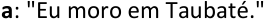

##### **b:** " **<u>Não é verdade</u>** que eu **<u>não</u>** moro em Taubaté." 

O conceito de **equivalência lógica** pode ser melhor detalhado assim: 

Duas proposições **A** e **B** são **equivalentes** quando todos os **valores lógicos** (V ou F) assumidos por elas **são iguais** para **todas as combinações de valores lógicos atribuídos às proposições simples que as compõem** . 

Vejamos um exemplo: 

**Mostre que as proposições (p** → **q)** ∧ **(q** → **p) e p**  **q são equivalentes.** 

Para resolver esse problema, basta construirmos a tabela-verdade de ambas proposições. Como a bicondicional já é conhecida por nós, precisamos simplesmente confeccionar a tabela-verdade de **(p** → **q)** ∧ **(q** → **p)** e comparar com a bicondicional **p**  **q** . 

##### **<u>Passo 1: determinar o número de linhas da tabela-verdade.</u>** 

Temos duas proposições simples distintas, **<u>p</u>** e **<u>q</u>** . Logo, o número de linhas é 2𝑛 = 22 = 4 . 

https://t.me/KakashiAssinaturasBot

---

<!-- pagina: 6 -->

**Equipe Exatas Estratégia Concursos Aula 02** 

##### **<u>Passo 2: desenhar o esquema da tabela-verdade.</u>** 

Para determinar <mark>(</mark> **<mark>p</mark>** <mark>→</mark> **<mark>q</mark>** <mark>) ∧ (</mark> **<mark>q</mark>** <mark>→</mark> **<mark>p</mark>** <mark>),</mark> precisamos obter <mark>(</mark> **<mark>p</mark>** <mark>→</mark> **<mark>q</mark>** <mark>)</mark> e <mark>(</mark> **<mark>q</mark>** <mark>→</mark> **<mark>p</mark>** <mark>).</mark> 

Para determinar **(p** → **q)** , precisamos obter **p** e **q** . 

Para determinar **(q** → **p)** , precisamos obter **p** e **q** . 

Podemos também incluir, de imediato, na nossa tabela a condicional **p**  **q** , pois vamos compará-la com a expressão que estamos querendo obter. 

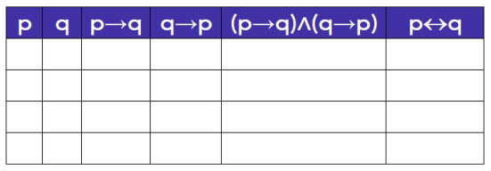

**<u>Passo 3: atribuir V ou F às proposições simples de maneira alternada.</u>** 

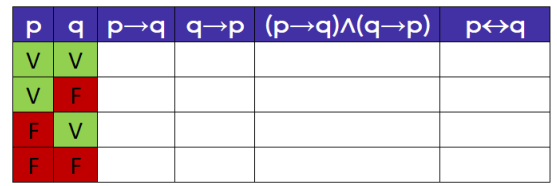

**<u>Passo 4: obter o valor das demais proposições.</u>** 

A condicional **p** → **q** é falsa somente quando o antecedente **p** for verdadeiro e o consequente **q** for falso. 

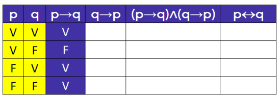

A condicional **q** → **p** é falsa somente quando o antecedente **q** for verdadeiro e o consequente **p** for falso. 

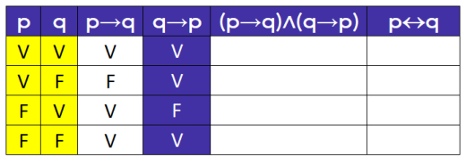

A conjunção **<u>(p</u>** → **<u>q)</u>** ∧ **<u>(q</u>** → **<u>p)</u>** só será verdadeira quando **<u>p</u>** → **<u>q</u>** e **<u>q</u>** → **<u>p</u>** forem ambos verdadeiros.

---

<!-- pagina: 7 -->

**Equipe Exatas Estratégia Concursos Aula 02** 

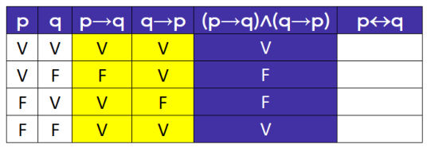

Para a bicondicional, já sabemos que ela será verdadeira quando **p** e **q** tiverem o mesmo valor lógico. 

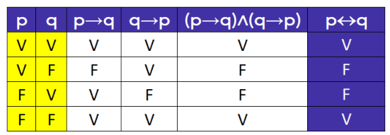

Podemos perceber da análise da tabela-verdade acima que **(p** → **q)** ∧ **(q** → **p)** e **p**  **q** assumem os exatos mesmos valores lógicos para todas as possibilidades de valores lógicos de **p** e **q** . Logo, as proposições são equivalentes. Veja: 

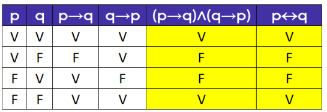

Podemos escrever: 

##### **p**  **q** ⇔ **(p** → **q)** ∧ **(q** → **p)** 

ou 

##### **<u>p</u>**  **<u>q ≡ (p</u>** → **<u>q)</u>** ∧ **<u>(q</u>** → **<u>p)</u>** 

## Equivalências fundamentais 

Existem três equivalências fundamentais que **<u>despencam</u>** em provas de concurso público: 

- **Equivalência contrapositiva** ; 

- **Transformação da condicional (se...então) em disjunção inclusiva (ou); e** 

- **Transformação da disjunção inclusiva (ou) em condicional (se...então).** 

### Equivalência contrapositiva 

A primeira equivalência fundamental é conhecida como **contrapositiva da condicional:** 

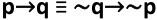

A equivalência é realizada do seguinte modo:

---

<!-- pagina: 8 -->

**Equipe Exatas Estratégia Concursos Aula 02** 

##### **1. Invertem-se as posições do antecedente e do consequente; e** 

##### **2. Negam-se ambos os termos da condicional.** 

Como exemplo, sejam as proposições: 

**p** : “Hoje choveu.” 

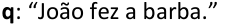

Considere a seguinte condicional **p** → **q** : 

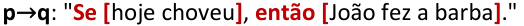

A condicional a seguir é equivalente à condicional original: 

~ **q** →~ **p** : " **Se [** João **não** fez a barba **]** , **então [** hoje **não** choveu **]** ." 

Um erro muito explorado pelas bancas é dizer que **p** → **q** seria equivalente a ~ **p** →~ **q** . Isso porque é muito comum no dia a dia as pessoas cometerem esse erro. 

Observe o exemplo acima: " **Se hoje choveu, então João fez a barba** ". Vamos supor que não choveu. O que podemos afirmar sobre a barba de João? Absolutamente nada, ele pode tanto ter feito quanto não ter feito a barba. **Logo** , **<u>não podemos dizer que</u>** " **Se hoje não choveu, então João** **<u>não fez a barba</u>** " **é equivalente à condicional original** . Em outras palavras, não podemos dizer que ~ **p** →~ **q** é equivalente a **p** → **q** . 

Por outro lado, podemos afirmar sem dúvida que ~ **q** →~ **p** . Em outras palavras, considerando a proposição original, podemos dizer que " **Se João não fez a barba, então hoje não choveu** ". 

**p** → **q é equivalente a** ~ **q** →~ **p** 

**p** → **q não é equivalente a** ~ **p** →~ **q**

---

<!-- pagina: 9 -->

**Equipe Exatas Estratégia Concursos Aula 02** 

**Mostre que são equivalentes p** → **q e** ~ **q** →~ **p.** 

Para mostrar a equivalência, montaremos a tabela-verdade de ~ **q** →~ **p** e compararemos com **p** → **q** . 

**<u>Passos 1, 2 e 3: determinar o número de linhas da tabela-verdade, desenhar o esquema da tabela-verdade</u> e atribuir V ou F às proposições simples de maneira alternada.** 

Vamos também incluir **p** → **q** para fins de comparação. 

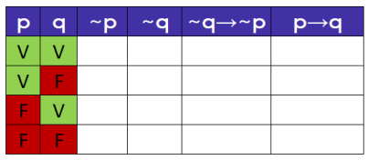

**<u>Passo 4: obter o valor das demais proposições.</u>** 

Para obter ~ **p** e ~ **q** , basta inverter o valor lógico de **p** e de **q** . 

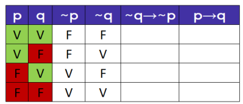

A condicional ~ **q** →~ **p** é falsa somente quando o antecedente ~ **q** for verdadeiro e o consequente ~ **p** for falso. 

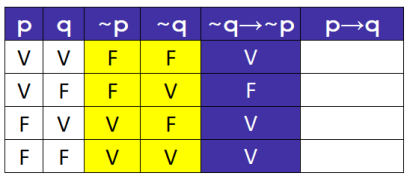

Por fim, a condicional **p** → **q** é falsa somente quando o antecedente **p** for verdadeiro e o consequente **q** for falso. 

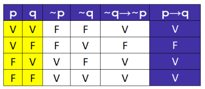

Observe que os valores lógicos de **p** → **q** e ~ **q** →~ **p** são exatamente iguais para todas as linhas e, portanto, essas proposições são equivalentes. 

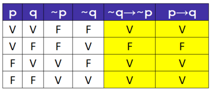

---

<!-- pagina: 10 -->

**Equipe Exatas Estratégia Concursos Aula 02** 

Logo, podemos escrever: 

**<u>p</u>** → **<u>q ≡</u>** ~ **<u>q</u>** →~ **<u>p</u>** 

Vamos resolver exercícios envolvendo essa equivalência que acabamos de aprender. 

**(EPC/2023)** Considere a seguinte afirmação: 

Se subir a montanha é difícil, então a paisagem compensa. 

Assinale a alternativa que contém uma equivalente lógica à afirmação apresentada. a) Subir a montanha é difícil e a paisagem compensa. b) Subir a montanha não é difícil e a paisagem não compensa. c) Se a paisagem não compensa, então subir a montanha não é difícil. d) Se subir a montanha é difícil, então a paisagem não compensa. e) Subir a montanha não é difícil ou a paisagem não compensa. **Comentários:** Sejam as proposições simples: **m:** "Subir a montanha é difícil." **p:** "A paisagem compensa." A sentença original pode ser descrita por **m** → **p** : **m** → **p:** “ **Se [** subir a montanha é difícil **]** , **então [** a paisagem compensa **]** .” Uma equivalência fundamental envolvendo o conectivo condicional é a **contrapositiva** : **p** → **q ≡** ~ **q** →~ **p.** Para aplicar essa equivalência, devemos realizar o seguinte procedimento: 

- **Invertem-se as posições do antecedente e do consequente; e** 

- **Negam-se ambos os termos da condicional.** 

Para o caso em questão, temos: 

**m** → **p ≡** ~ **p** →~ **m** 

A proposição equivalente pode ser descrita por: ~ **p** →~ **m:** “ **Se [** a paisagem **não** compensa **]** , **então [** subir a montanha **não** é difícil **]** ”. **Gabarito: Letra C.**

---

<!-- pagina: 11 -->

**Equipe Exatas Estratégia Concursos Aula 02** 

**(Pref. Bagé/2020)** Uma proposição equivalente de “Se a prova está difícil, então Antônio não será aprovado no concurso” é: 

a) A prova está difícil e Antônio não será aprovado no concurso. 

b) Se Antônio for aprovado no concurso, então a prova não está difícil. 

c) A prova está fácil e Antônio foi aprovado no concurso. 

d) A prova está fácil e Antônio não foi aprovado no concurso. 

e) A prova não está fácil e Antônio foi aprovado no concurso. 

**Comentários:** 

Sejam as proposições simples: 

**p: "** A prova está difícil." 

**a:** "Antônio será aprovado no concurso." 

A proposição original pode ser descrita por **p** →~ **a** : 

**p** →~ **a** : “ **Se [** a prova está difícil **]** , **então [** Antônio **não** será aprovado no concurso **]** .” 

Uma equivalência fundamental envolvendo o conectivo condicional é a **contrapositiva** : **p** → **q ≡** ~ **q** →~ **p.** Para aplicar essa equivalência, devemos realizar o seguinte procedimento: 

- **Invertem-se as posições do antecedente e do consequente; e** 

- **Negam-se ambos os termos da condicional.** 

Para o caso em questão, temos: 

**p** →~ **a** ≡ ~ **(** ~ **a)** →~ **p** 

Como a dupla negação de **a** corresponde à própria proposição **a** , a condicional equivalente pode também ser descrita por **a** →~ **p** . 

**p** →~ **a** ≡ **a** →~ **p** 

Logo, temos a seguinte proposição equivalente: 

**a** →~ **p:** " **Se [** Antônio for aprovado no concurso **]** , **então [** a prova **não** está difícil **]** ." 

**Gabarito: Letra B.** 

---

<!-- pagina: 12 -->

**Equipe Exatas Estratégia Concursos Aula 02** 

Na questão anterior, definimos originalmente a seguinte **sentença declarativa afirmativa** <u>:</u> 

**a** : "Antônio será aprovado no concurso." A sua negação corresponde a: ~ **a** : "Antônio **não** será aprovado no concurso." 

A proposição original, nesse caso, foi descrita por **p** →~ **a** . 

**Poderíamos ter resolvido a questão definindo originalmente uma sentença declarativa** **<u>negativa</u>** <u>.</u> **<u>Isso em nada altera o gabarito</u>** . Poderíamos, portanto, ter definido a proposição **a** como: **a** : "Antônio **não** será aprovado no concurso." Nesse caso, a sua negação seria: 

~ **a** : "Antônio será aprovado no concurso." 

A proposição original, a partir dessas novas definições, seria descrita por **p** → **a** . 

A seguir, vamos resolver a mesma questão de outro modo. **<u>Compare com a resolução anterior</u>** . 

**(Pref. Bagé/2020)** Uma proposição equivalente de “Se a prova está difícil, então Antônio não será aprovado no concurso” é: 

a) A prova está difícil e Antônio não será aprovado no concurso. 

b) Se Antônio for aprovado no concurso, então a prova não está difícil. 

c) A prova está fácil e Antônio foi aprovado no concurso. 

d) A prova está fácil e Antônio não foi aprovado no concurso. 

e) A prova não está fácil e Antônio foi aprovado no concurso. 

**Comentários:** 

Considere as proposições simples: 

**p: "** A prova está difícil." 

**a:** "Antônio **não** será aprovado no concurso." 

Note que, nesse caso, a negação da proposição **a** será: 

~ **a:** "Antônio será aprovado no concurso." 

A proposição original é descrita por **p** → **a** : 

**<u>p</u>** → **a** : “ **Se** **<u>[</u>** a prova está difícil **<u>]</u>** , **então** **<u>[</u>** Antônio **não** será aprovado no concurso **<u>]</u>** .”

---

<!-- pagina: 13 -->

**Equipe Exatas Estratégia Concursos Aula 02** 

Uma equivalência fundamental envolvendo o conectivo condicional é a **contrapositiva** : **p** → **q ≡** ~ **q** →~ **p.** Para aplicar essa equivalência, devemos realizar o seguinte procedimento: 

- **Invertem-se as posições do antecedente e do consequente; e** 

- **Negam-se ambos os termos da condicional.** 

Para o caso em questão, temos: 

**p** → **a ≡** ~ **a** →~ **p** 

Logo, temos a seguinte proposição equivalente: 

~ **a** →~ **p:** " **Se [** Antônio for aprovado no concurso **]** , **então [** a prova **não** está difícil **]** ." 

**Gabarito: Letra B.** 

Transformação da condicional (se...então) em disjunção inclusiva (ou) 

A segunda equivalência fundamental é a **transformação da condicional (se...então;** → **) em disjunção inclusiva (ou;** ∨ **):** 

**p** → **q ≡** ~ **p** ∨ **q** 

A equivalência é realizada do seguinte modo: 

**1. Nega-se o primeiro termo;** 

**2. Troca-se a condicional (se...então;** → **) pela disjunção inclusiva (ou;** ∨ **); e** 

**3. Mantém-se o segundo termo.** 

Como exemplo, considere novamente a seguinte condicional: 

**p** → **q** : " **Se [** hoje choveu **]** , **então [** João fez a barba **]** ." 

Observe que a frase seguinte é equivalente: 

~ **p** ∨ **q** : " **[** Hoje **não** choveu **] ou [** João fez a barba **]** ." 

**Mostre que são equivalentes p** → **q e** ~ **p** ∨ **q** 

Para mostrar a equivalência, montaremos a tabela-verdade de ~ **p** ∨ **q** e compararemos com **p** → **q** . 

**<u>Passos 1, 2 e 3:</u> determinar o número de linhas, desenhar o esquema e atribuir V ou F às proposições simples de maneira alternada.** 

Vamos também incluir **<u>p</u>** → **<u>q</u>** <u>para fins de comparação.</u> 

https://t.me/KakashiAssinaturasBot

---

<!-- pagina: 14 -->

**Equipe Exatas Estratégia Concursos Aula 02** 

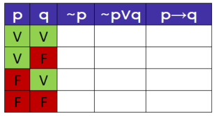

##### **<u>Passo 4: obter o valor das demais proposições.</u>** 

Para obter ~ **p** basta inverter o valor lógico de **p** . 

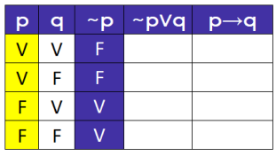

A disjunção inclusiva ~ **p** ∨ **q** só será falsa quando ~ **p** e **q** forem ambos falsos. 

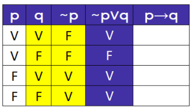

Por fim, a condicional **p** → **q** é falsa somente quando o antecedente **p** for verdadeiro e o consequente **q** for falso. 

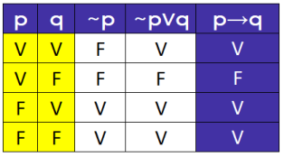

Observe que os valores lógicos de **p** → **q** e ~ **p** ∨ **q** são exatamente iguais para todas as linhas e, portanto, essas proposições são equivalentes. 

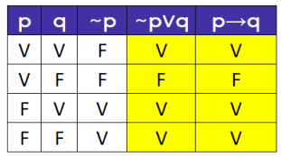

Logo, podemos escrever: 

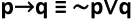

Antes de realizar alguns exercícios sobre essa equivalência, é importante que você saiba que a condicional **p** → **q** apresenta somente duas possíveis equivalências: ~ **q** →~ **p** e ~ **p** ∨ **q** :

---

<!-- pagina: 15 -->

**Equipe Exatas Estratégia Concursos Aula 02** 

A condicional **p** → **q** apresenta somente duas possíveis equivalências: 

**<mark>p</mark>** <mark>→</mark> **<mark>q ≡</mark>** <mark>~</mark> **<mark>q</mark>** <mark>→~</mark> **<mark>p</mark>** 

**<mark>p</mark>** <mark>→</mark> **<mark>q ≡</mark>** <mark>~</mark> **<mark>p</mark>** <mark>∨</mark> **<mark>q</mark>** 

<mark>Portanto, uma</mark> **<mark>condicional só pode ser equivalente a outra condicional ou a uma disjunção</mark> inclusiva** . 

Vamos resolver exercícios envolvendo essa equivalência que acabamos de aprender. 

**(PROCON-DF/2023)** A respeito de raciocínio lógico, julgue o item. 

As proposições “Se Alice é uma estudante de medicina, então ela é inteligente” e “Alice não é uma estudante de medicina ou é inteligente” são equivalentes. 

**Comentários:** 

Sejam as proposições simples: 

**e:** "Alice é uma estudante de medicina." 

**i: "** Alice é inteligente. **"** 

A proposição original pode ser descrita por **e** → **i** : 

**e** → **i:** " **Se [** Alice é uma estudante de medicina **]** , **então [** ela (Alice) é inteligente **]** ." 

Note que a questão sugere que a proposição original é equivalente a uma **disjunção inclusiva (ou;** ∨ **)** . Devemos, portanto, usar a equivalência da **transformação da condicional (se...então;** → **) em disjunção inclusiva (ou;** ∨ **)** . 

**p** → **q ≡** ~ **p** ∨ **q** 

Para aplicar essa equivalência, devemos realizar o seguinte procedimento: 

- **Nega-se o primeiro termo;** 

- **Troca-se a condicional (se...então;** → **) pela disjunção inclusiva (ou;** ∨ **); e** 

- **Mantém-se o segundo termo.**

---

<!-- pagina: 16 -->

**Equipe Exatas Estratégia Concursos Aula 02** 

Para o caso em questão, temos: 

**e** → **i ≡** ~ **e** ∨ **i** 

A proposição equivalente pode ser descrita por: 

~ **e** ∨ **i:** " **[** Alice **não** é uma estudante de medicina **] ou [** (Alice) é inteligente **]** ." 

**Gabarito: CERTO.** 

**(PM RN/2023)** De acordo com o Raciocínio Lógico proposicional uma frase que equivale a “Se o oficial faltou ao serviço, então a instrução foi cancelada” é a frase: 

a) O oficial não faltou ao serviço ou a instrução foi cancelada 

b) O oficial não faltou ao serviço ou a instrução não foi cancelada 

c) O oficial faltou ao serviço ou a instrução foi cancelada 

d) O oficial faltou ao serviço ou a instrução não foi cancelada 

e) O oficial não faltou ao serviço e a instrução foi cancelada 

**Comentários:** 

Sejam as proposições simples: 

**f:** "O oficial faltou ao serviço." 

**c:** "A instrução foi cancelada." 

A proposição original pode ser descrita por **f** → **c** : 

**f** → **c** : “ **Se [** o oficial faltou ao serviço **]** , **então [** a instrução foi cancelada **]** .” 

Note que a proposição original é uma condicional e, nas alternativas, as possíveis opções de equivalência são **disjunções inclusivas (ou,** ∨ **)** e uma **conjunção (e;** ∧ **)** . Nesse caso, **não devemos utilizar a equivalência contrapositiva** , pois ela resulta em uma nova condicional. Devemos, portanto, usar a equivalência da **transformação da condicional (se...então;** → **) em disjunção inclusiva (ou;** ∨ **)** : 

**p** → **q ≡** ~ **p** ∨ **q** 

A equivalência é realizada do seguinte modo: 

- **Nega-se o primeiro termo;** 

- **Troca-se a condicional (se...então;** → **) pela disjunção inclusiva (ou;** ∨ **); e** 

- **Mantém-se o segundo termo.** 

Para o caso em questão, temos: 

**f** → **c ≡** ~ **f** ∨ **c** 

A proposição equivalente pode ser descrita por: 

- ~ **f** ∨ **c:** " **[** O oficial **não** faltou ao serviço **] ou [** a instrução foi cancelada **]** ." 

**Gabarito: Letra A.**

---

<!-- pagina: 17 -->

**Equipe Exatas Estratégia Concursos Aula 02** 

**(Pref. S Parnaíba/2023)** Considerando como verdadeira a sentença “Se Marcos cozinha, então ele não lava a louça”, assinale a alternativa que apresenta uma sentença equivalente a esta. 

a) Marcos não cozinha ou não lava a louça. 

b) Marcos não cozinha ou lava a louça. 

c) Se Marcos não lava a louça, então ele cozinha. 

d) Se Marcos lava a louça, então ele cozinha. 

**Comentários:** 

Sejam as proposições simples: 

**c:** "Marcos cozinha." 

**l:** "Marcos lava a louça." 

A proposição original pode ser descrita por **c** →~ **l** : 

**c** →~ **l** : “ **Se [** Marcos cozinha **]** , **então [** ele **não** lava a louça **]** .” 

**As alternativas apresentam tanto condicionais (se...então;** → **) quanto disjunções inclusivas (ou;** ∨ **) como equivalentes.** Devemos, portanto, testar as duas equivalências fundamentais que envolvem a condicional: 

- **p** → **q ≡** ~ **q** →~ **p** (contrapositiva) 

- **p** → **q ≡** ~ **p** ∨ **q** (transformação da condicional em disjunção inclusiva) 

Para aplicar a primeira equivalência, devemos realizar o seguinte procedimento: 

- **Invertem-se as posições do antecedente e do consequente; e** 

- **Negam-se ambos os termos da condicional.** 

Para o caso em questão, temos: 

**c** →~ **l** ≡ ~ **(** ~ **l)** →~ **c** 

A dupla negação de **l** corresponde à proposição original **l** . Ficamos com: 

**c** →~ **l** ≡ **l** →~ **c** 

A proposição equivalente pode ser descrita por: 

**l** →~ **c:** " **Se [** Marcos lava a louça **]** , **então [** ele (Marcos) **não** cozinha **]** ." 

Veja que essa equivalência não está nas alternativas apresentadas. 

Vamos agora utilizar a segunda equivalência. Para aplicar essa equivalência, devemos realizar o seguinte procedimento: 

- **Nega-se o primeiro termo;** 

- **Troca-se a condicional (se...então;** → **) pela disjunção inclusiva (ou;** ∨ **); e** 

- **Mantém-se o segundo termo.** 

Para o caso em questão, temos: 

**c** →~ **l ≡** ~ **c** ∨~ **l**

---

<!-- pagina: 18 -->

**Equipe Exatas Estratégia Concursos Aula 02** 

A proposição equivalente pode ser descrita por: 

~ **c** ∨~ **l:** " **[** Marcos **não** cozinha **] ou [não** lava a louça **]** ." 

##### **Gabarito: Letra A.** 

**(CM POA/2012)** Se **p** e **q** são proposições, e o símbolo ~ denota negação, o símbolo ∨ denota o conetivo "ou", o símbolo ∧ denota o conetivo "e", e o símbolo → denota o conetivo condicional, então a proposição **(p** →~ **q)** é equivalente à seguinte fórmula 

a) **(** ~ **p** ∧~ **q)** 

b) ~ **(p** ∨ **q)** 

c) **(** ~ **p** ∧ **q)** 

d) **(** ~ **p** ∨ **q)** 

e) **(** ~ **p** ∨~ **q)** 

##### **Comentários:** 

Note que a proposição original é uma condicional e, nas alternativas, as possíveis opções de equivalência são a **conjunção (e;** ∧ **)** e a **disjunção inclusiva (ou;** ∨ **)** . Nesse caso, **não devemos utilizar a equivalência contrapositiva** , pois ela resulta em uma nova condicional. Devemos, portanto, aplicar a seguinte equivalência fundamental: 

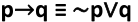

A equivalência é realizada do seguinte modo: 

- **Nega-se o primeiro termo;** 

- **Troca-se a condicional (se...então;** → **) pela disjunção inclusiva (ou;** ∨ **); e** 

- **Mantém-se o segundo termo.** 

Aplicando essa equivalência para **(p** →~ **q)** , temos: 

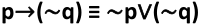

A equivalência obtida corresponde à **alternativa E** : **(** ~ **p** ∨~ **q)** . 

##### **Gabarito: Letra E.** 

### Transformação disjunção inclusiva (ou) em condicional (se...então) 

A terceira equivalência fundamental para sua prova é a **transformação da disjunção inclusiva (ou;** ∨ **) em condicional (se...então;** → **)** : 

##### **p** ∨ **q** ≡ ~ **p** → **q** 

A equivalência é realizada do seguinte modo: 

##### **1. Nega-se o primeiro termo;** 

##### **2. Troca-se a disjunção inclusiva (ou;** ∨ **) pela condicional (se...então;** → **); e** 

**3. Mantém-se o segundo termo.**

---

<!-- pagina: 19 -->

**Equipe Exatas Estratégia Concursos Aula 02** 

Como exemplo, considere a seguinte disjunção inclusiva: 

##### **p** ∨ **q:** " **[** Pedro estuda **] ou [** Maria trabalha **]** ." 

Observe que a frase seguinte é equivalente: 

~ **p** → **q** : " **Se [** Pedro **não** estuda **], então [** Maria trabalha **]** ." 

**Mostre que são equivalentes p** ∨ **q e** ~ **p** → **q.** 

Para demonstrar a equivalência, poderíamos estruturar a tabela-verdade de ~ **p** → **q** e comparar com **p** ∨ **q** , como feito nos exemplos anteriores. Contudo, existe uma outra forma. 

Já vimos que uma possível equivalência da condicional corresponde a negar o primeiro termo e realizar uma <u>disjunção inclusiva com o segundo termo. A equivalência que conhecemos é:</u> 

**p** → **q** ≡ ~ **p** ∨ **q** 

Como as proposições **p** e **q** são arbitrárias (poderíamos ter chamado de **r** e **s** , por exemplo), podemos chamar ~ a primeira proposição de **( p)** . Assim, continuamos com a mesma regra: <u>negamos o primeiro termo e realizamos uma disjunção inclusiva com o segundo termo.</u> 

**(** ~ **p)** → **q ≡** ~ **(** ~ **p)** ∨ **q** 

A dupla negação de uma proposição simples é equivalente à própria proposição simples, isto é, ~ **(** ~ **p) ≡ p** . Substituindo esse fato na equivalência acima, temos: 

**(** ~ **p)** → **q ≡ p** ∨ **q** 

Agora basta alterar a ordem da equivalência acima para chegarmos ao resultado que queremos: 

**<u>p</u>** ∨ **<u>q</u>** ≡ ~ **<u>p</u>** → **<u>q</u>** 

Vamos resolver exercícios envolvendo essa equivalência que acabamos de aprender. 

---

<!-- pagina: 20 -->

**Equipe Exatas Estratégia Concursos Aula 02** 

**(EPC/2023)** Posso contar com os amigos ou ficarei sozinho. Uma afirmação que é logicamente equivalente a afirmação anterior é: 

a) Se não posso contar com os amigos, então ficarei sozinho. b) Se posso contar com os amigos, então ficarei sozinho. c) Se não posso contar com os amigos, então não ficarei sozinho. d) Se ficarei sozinho, então não posso contar com os amigos. e) Posso contar com os amigos e ficarei sozinho. **Comentários:** 

Sejam as proposições simples: **a** : "Posso contar com os amigos." **s:** "Ficarei sozinho." 

A proposição original pode ser descrita por **a** ∨ **s** : 

**a** ∨ **s** : " **[** Posso contar com os amigos **] ou [** ficarei sozinho **]** ." 

Sabemos que a disjunção inclusiva (ou; ∨ ) apresenta uma equivalência fundamental dada por **p** ∨ **q ≡** ~ **p** → **q** . Para aplicar essa equivalência, devemos realizar o seguinte procedimento: 

- **Nega-se o primeiro termo;** 

- **Troca-se a disjunção inclusiva (ou;** ∨ **) pela condicional (se...então;** → **); e** 

- **Mantém-se o segundo termo.** 

Aplicando essa equivalência para proposição em questão, ficamos com: **a** ∨ **s** ≡ ~ **a** → **s** A equivalência obtida é descrita por: ~ **a** → **s:** " **Se [não** posso contar com os amigos **]** , **então [** ficarei sozinho **]** ." **Gabarito: Letra A.** 

**(Pref. Campinas/2019)** Uma afirmação equivalente a: “Os cantadores da madrugada saíram hoje ou eu não ouço bem”, é a) Os cantadores da madrugada não saíram hoje ou eu ouço bem. b) Os cantadores da madrugada saíram hoje e eu ouço bem. c) Se os cantadores da madrugada saíram hoje, então eu não ouço bem. d) Os cantadores da madrugada não saíram hoje e eu ouço bem. e) Se os cantadores da madrugada não saíram hoje, então eu não ouço bem. **Comentários:** 

https://t.me/KakashiAssinaturasBot

---

<!-- pagina: 21 -->

**Equipe Exatas Estratégia Concursos Aula 02** 

Sejam as proposições simples: **c:** "Os cantadores da madrugada saíram hoje." **o:** "Eu ouço bem." A proposição original pode ser descrita por **c** ∨~ **o** . **c** ∨~ **o:** " **[** Os cantadores da madrugada saíram hoje **] ou [** eu **não** ouço bem **]** ." Sabemos que a disjunção inclusiva (ou; ∨ ) apresenta uma equivalência fundamental dada por **p** ∨ **q ≡** ~ **p** → **q** . Para aplicar essa equivalência, devemos realizar o seguinte procedimento: 

- **Nega-se o primeiro termo;** 

- **Troca-se a disjunção inclusiva (ou;** ∨ **) pela condicional (se...então;** → **); e** 

- **Mantém-se o segundo termo.** 

Aplicando essa equivalência para proposição em questão, ficamos com: 

**c** ∨~ **o ≡** ~ **c** →~ **o** 

A equivalência obtida é descrita por: 

- ~ **c** →~ **o:** " **Se [** os cantadores da madrugada **não** saíram hoje **]** , **então [** eu **não** ouço bem **]** ." 

- **Gabarito: Letra E.** 

## Negações Lógicas 

Nesse tópico iremos estudar as principais **negações lógicas** . Antes de apresentarmos as negações, é importante que você entenda que **uma negação lógica acaba sendo uma equivalência proveniente da negação de uma proposição** . 

Veremos mais adiante, por exemplo, que a **<u>negação</u> de p** ∧ **q** , que pode ser representada por ~ **(p** ∧ **q)** , corresponde a ~ **p** ∨~ **q** . Nesse caso: 

- Podemos dizer que a **<u>negação de</u> p** ∧ **q é** ~ **p** ∨~ **q** ; 

- Podemos dizer que ~ **(p** ∧ **q) é equivalente a** ~ **p** ∨~ **q** . 

Ao se construir **negação** de uma proposição, constrói-se uma nova proposição com **valores lógicos sempre opostos aos da proposição original** . Para o exemplo apresentado, ~ **p** ∨~ **q** sempre terá o valor contrário da proposição **p** ∧ **q** para todas as linhas da tabela-verdade, conforme pode ser observado a seguir: 

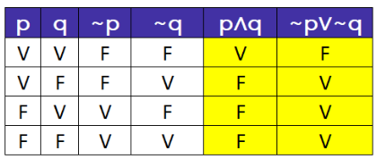

Em outras palavras, ~ **p** ∨~ **q** terá o valor lógico da **negação de p** ∧ **q** , dada por ~ **(p** ∧ **q)** , para todas as linhas da tabela-verdade:

---

<!-- pagina: 22 -->

**Equipe Exatas Estratégia Concursos Aula 02** 

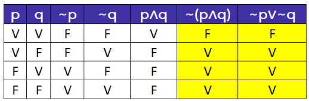

Veremos a seguir as principais negações que você precisa saber. 

### Dupla negação da proposição simples 

Um resultado importante que pode ser obtido da tabela verdade é que a **negação da negação de p** sempre tem valor lógico igual a **proposição p** , ou seja, é equivalente a **p** . 

~ ~ **( p) ≡ p** 

A prova dessa equivalência corresponde à tabela-verdade abaixo. 

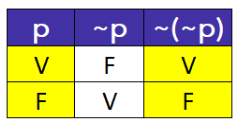

Como exemplo, temos que a dupla negação " **Não é verdade que [Joãozinho não comeu o chocolate]** " é equivalente a " **Joãozinho comeu o chocolate** ". 

A **negação da negação de p** é equivalente a **p.** 

~ ~ **( p) ≡ p** 

### Negação da conjunção e da disjunção inclusiva (Leis de De Morgan) 

Nesse tópico, veremos como se nega a **conjunção (e;** ∧ **)** e a **disjunção inclusiva (ou;** ∨ **)** . Essas negações são conhecidas como **Leis de De Morgan** . 

#### **Negação da conjunção (e;** ∧ **)** 

Para realizar a negação conjunção **p** ∧ **q** , deve-se seguir o seguinte procedimento:

---

<!-- pagina: 23 -->

**Equipe Exatas Estratégia Concursos Aula 02** 

**1. Negam-se ambas as parcelas da conjunção (e;** ∧ **); e** 

**2. Troca-se a conjunção (e;** ∧ **) pela disjunção inclusiva (ou;** ∨ **).** 

Como resultado, podemos dizer que <u>a negação</u> de **p** ∧ **q** , também conhecida por ~ **(p** ∧ **q)** , é equivalente a 

~ **p** ∨~ **q:** 

##### ~ **(p** ∧ **q) ≡** ~ **p** ∨~ **q** 

Como exemplo, considere as seguintes proposições simples: 

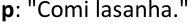

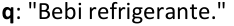

A conjunção entre dessas duas proposições pode ser descrita por: 

##### **p** ∧ **q** : " **[** Comi lasanha **] e [** bebi refrigerante **]** ." 

A negação dessa proposição composta é: 

- ~ **(p** ∧ **q) ≡** ~ **p** ∨~ **q** : " **[Não** comi lasanha **] ou [não** bebi refrigerante **]** ." 

**Mostre que são equivalentes** ~ **(p** ∧ **q) e** ~ **p** ∨~ **q** . 

##### **<u>Passos 1, 2 e 3: determinar o número de linhas, estruturar a tabela-verdade e atribuir V ou F às proposições</u> simples de maneira alternada.** 

Para fins de comparação, vamos incluir ambas as proposições em uma mesma tabela. 

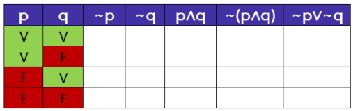

**<u>Passo 4:</u>** obter o valor das demais proposições. 

Para obter ~ **p** e ~ **q** , basta inverter o valor lógico de **p** e de **q** . 

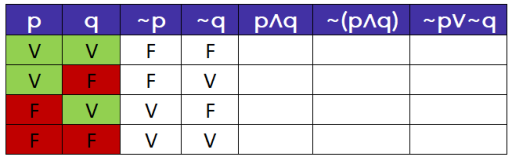

A conjunção **p** ∧ **q** só é verdadeira quando **p** e **q** são verdadeiras. Nos demais casos, a conjunção será falsa. 

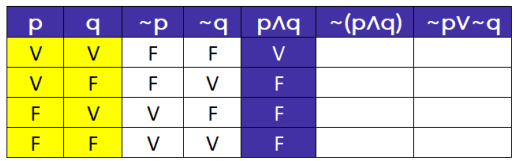

---

<!-- pagina: 24 -->

**Equipe Exatas Estratégia Concursos Aula 02** 

A proposição ~ **(p** ∧ **q)** é obtida pela negação de **p** ∧ **q.** 

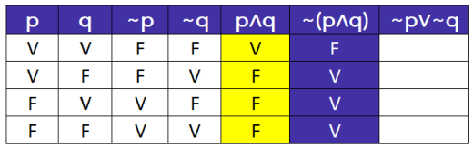

Finalmente, temos que ~ **p** ∨~ **q** é falsa apenas quando ~ **p** e ~ **q** forem ambas falsas. 

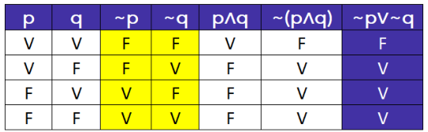

Observe que os valores lógicos assumidos por ~ **(p** ∧ **q)** e ~ **p** ∨~ **q** são iguais para todas as linhas da tabelaverdade. 

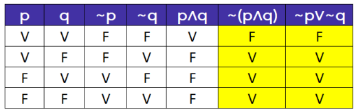

Portanto, podemos escrever que a negação de **p** ∧ **q** , dada por ~ **(p** ∧ **q),** é equivalente a ~ **p** ∨~ **q** . 

##### ~ **<u>(p</u>** ∧ **<u>q) ≡</u>** ~ **<u>p</u>** ∨~ **<u>q</u>** 

#### **Negação da disjunção inclusiva (ou;** ∨ **)** 

De modo semelhante à negação da conjunção, para negarmos a disjunção inclusiva **p** ∨ **q,** devemos seguir o seguinte procedimento: 

**1. Negam-se ambas as parcelas da disjunção inclusiva (ou;** ∨ **); e** 

**2. Troca-se a disjunção inclusiva (ou;** ∨ **) pela conjunção (e;** ∧ **).** 

Como resultado disso, podemos escrever que <u>a negação</u> de **p** ∨ **q** , também conhecida por ~ **(p** ∨ **q)** , é equivalente a ~ **p** ∧~ **q:** 

~ **(p** ∨ **q) ≡** ~ **p** ∧~ **q** 

Vejamos um exemplo: 

##### **p** ∨ **q** : " **[** Comi lasanha **] ou [** bebi refrigerante **]** ." 

A negação dessa proposição composta é: 

- ~ **(p** ∨ **q) ≡** ~ **p** ∧~ **q** : " **[Não** comi lasanha **] e [não** bebi refrigerante **]** ."

---

<!-- pagina: 25 -->

**Equipe Exatas Estratégia Concursos Aula 02** 

Essa equivalência pode ser constatada na tabela-verdade a seguir: 

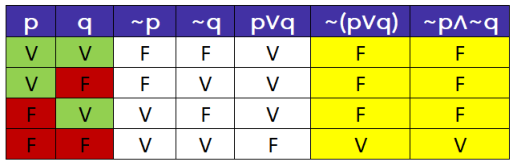

- A seguir temos um mnemônico que resume as duas **Leis de De Morgan** : 

**<mark>Para negar o</mark>** <mark>"</mark> **<mark>e</mark>** <mark>":</mark> **<mark>negar ambas</mark>** <mark>as proposições e</mark> **<mark>trocar o "e" pelo</mark>** <mark>"</mark> **<mark>ou</mark>** <mark>".</mark> 

<mark>~</mark> **<mark>(p</mark>** <mark>∧</mark> **<mark>q) ≡</mark>** <mark>~</mark> **<mark>p</mark>** <mark>∨~</mark> **<mark>q</mark>** 

**<mark>Para negar o</mark>** <mark>"</mark> **<mark>ou</mark>** <mark>":</mark> **<mark>negar ambas</mark>** <mark>as proposições e</mark> **<mark>trocar o "ou" pelo</mark>** <mark>"</mark> **<mark>e</mark>** <mark>".</mark> 

~ **(p** ∨ **q) ≡** ~ **p** ∧~ **q** 

Vamos agora resolver exercícios envolvendo as **Leis de De Morgan** . 

**(BBTS/2023)** Considere a afirmação a seguir. 

“Eu fiz dieta e não emagreci.” 

A negação lógica dessa afirmação é: 

a) Eu não fiz dieta e não emagreci. 

b) Eu não fiz dieta ou emagreci. 

c) Eu não fiz dieta e emagreci. 

d) Eu não fiz dieta ou não emagreci. 

e) Eu fiz dieta e emagreci. 

**Comentários:** 

Sejam as proposições simples: 

**d:** "Eu fiz dieta." 

**e: "** Eu emagreci." 

A proposição original pode ser escrita pela conjunção **d** ∧~ **e** : 

**d** ∧~ **e** : " **<u>[</u>** Eu fiz dieta **<u>]</u> e** **<u>[</u>** <u>(eu)</u> **não** emagreci **<u>]</u>** ."

---

<!-- pagina: 26 -->

**Equipe Exatas Estratégia Concursos Aula 02** 

Para realizar a negação de uma conjunção, usa-se a equivalência ~ **(p** ∧ **q) ≡** ~ **p** ∨~ **q** . Para aplicar essa equivalência, devemos seguir o seguinte procedimento: 

**• Negam-se ambas as parcelas da conjunção (e;** ∧ **); e • Troca-se a conjunção (e;** ∧ **) pela disjunção inclusiva (ou;** ∨ **).** Em outras palavras, **negam-se as duas proposições e troca-se o "e" pelo "ou"** . Para o caso em questão, temos: ~ **(d** ∧~ **e) ≡** ~ **d** ∨~ **(** ~ **e)** A dupla negação da proposição simples **e** corresponde à proposição original. Ficamos com: ~ **(d** ∧~ **e) ≡** ~ **d** ∨ **e** Logo, a negação requerida pode ser descrita por: ~ **d** ∨ **e** : “ **[** Eu **não** fiz dieta **] ou [** (eu) emagreci **]** .” **Gabarito: Letra B.** 

**(AGENERSA/2023)** Considere a afirmação: “Caminho ou não saio do lugar.” Assinale a opção que apresenta sua negação lógica. a) Não caminho ou não saio do lugar. b) Caminho ou saio do lugar. c) Não caminho ou saio do lugar. d) Caminho e não saio do lugar. e) Não caminho e saio do lugar. **Comentários:** Sejam as proposições simples: **c:** "Caminho." **s: "** Saio do lugar." A proposição original pode ser escrita pela disjunção inclusiva **c** ∨~ **s** : **c** ∨~ **s** : " **[** Caminho **] ou [não** saio do lugar **]** ." Para realizar a negação de uma disjunção inclusiva, usa-se a equivalência ~ **(p** ∨ **q) ≡** ~ **p** ∧~ **q** . Para aplicar essa equivalência, devemos seguir o seguinte procedimento: 

- **Negam-se ambas as parcelas da disjunção inclusiva (ou;** ∨ **); e** 

- **Troca-se a disjunção inclusiva (ou;** ∨ **) pela conjunção (e;** ∧ **).** 

Em outras palavras, **negam-se as duas proposições e troca-se o "ou" pelo "e"** . Para o caso em questão, temos:

---

<!-- pagina: 27 -->

**Equipe Exatas Estratégia Concursos Aula 02** 

~ **(c** ∨~ **s) ≡** ~ **c** ∨~ **(** ~ **s)** 

A dupla negação da proposição simples **s** corresponde à proposição original. Ficamos com: 

~ **(c** ∨~ **s) ≡** ~ **c** ∨ **s** 

Logo, a negação requerida pode ser descrita por: 

- ~ **c** ∨ **s** : “ **[Não** caminho **] e [** saio do lugar **]** .” 

##### **Gabarito: Letra E.** 

**(PM CE/2023)** Sabendo-se que não é verdade que o policial militar de serviço pode dormir e pode usar a viatura para fins pessoais, é correto afirmar que: 

a) O policial militar de serviço pode dormir ou pode usar a viatura para fins pessoais. 

b) O policial militar de serviço não pode dormir ou não pode usar a viatura para fins pessoais. 

c) O policial militar de serviço pode dormir ou não pode usar a viatura para fins pessoais. 

d) O policial militar de serviço não pode dormir ou pode usar a viatura para fins pessoais. 

e) O policial militar de serviço não pode dormir e não pode usar a viatura para fins pessoais. 

**Comentários:** 

Sejam as proposições simples: 

**d:** "O policial militar de serviço pode dormir." 

**v** : "O policial militar de serviço pode usar a viatura para fins pessoais." 

Note que a proposição original pode ser descrita por ~ **(d** ∧ **v)** : 

~ **(d** ∧ **v)** : " **Não é verdade que [(** o policial militar de serviço pode dormir **) e (** (o policial militar de serviço) pode usar a viatura para fins pessoais **)]** ." 

Observe que a proposição original, ~ **(d** ∧ **v)** , é a negação da conjunção **(d** ∧ **v)** . Como a questão pergunta por algo que é correto de se afirmar, devemos encontrar algo que é equivalente a ~ **(d** ∧ **v)** , ou seja, **devemos negar (d** ∧ **v)** . 

Para realizar a negação de uma conjunção, usa-se a equivalência ~ **(p** ∧ **q) ≡** ~ **p** ∨~ **q** . Para aplicar essa equivalência, devemos seguir o seguinte procedimento: 

- **Negam-se ambas as parcelas da conjunção (e;** ∧ **); e** 

- **Troca-se a conjunção (e;** ∧ **) pela disjunção inclusiva (ou;** ∨ **).** 

Em outras palavras, **negam-se as duas proposições e troca-se o "ou" pelo "e"** . Para o caso em questão, temos: 

~ **(d** ∧ **v) ≡** ~ **d** ∨~ **v** 

Logo, a negação requerida pode ser descrita por: 

~ **d** ∨~ **v:** " **[** O policial militar de serviço **não** pode dormir **] ou [** (o policial militar de serviço) **não** pode usar a viatura para fins pessoais **]** ." 

**Gabarito: Letra B.**

---

<!-- pagina: 28 -->

**Equipe Exatas Estratégia Concursos Aula 02** 

### Negação da condicional (se...então) 

A negação de **p** → **q** é realizada por meio da seguinte equivalência: 

~ **(p** → **q) ≡ p** ∧~ **q** 

A negação da condicional é realizada do seguinte modo: 

**1. Mantém-se o primeiro termo;** 

**2. Troca-se a condicional (se...então;** → **) pela conjunção (e;** ∧ **); e** 

**3. Nega-se o segundo termo.** 

Como exemplo, considere a seguinte condicional: 

**p** → **q: "Se [** eu comi lasanha **]** , **então [** eu bebi refrigerante **]** ." 

A negação dessa expressão pode ser escrita como: 

~ **(p** → **q) ≡ p** ∧~ **q** : " **[** Eu comi lasanha **] e [** eu **não** bebi refrigerante **]** ." 

**Mostre que** ~ **(p** → **q) é equivalente a p** ∧~ **q.** 

Para demonstrar a equivalência, poderíamos estruturar a tabela-verdade de ~ **(p** → **q)** e comparar com **p** ∧~ **q** , como feito nos exemplos anteriores. Contudo, existe uma outra forma. 

Conhecemos a seguinte equivalência fundamental: 

**p** → **q ≡** ~ **p** ∨ **q** 

Se negarmos ambos os lados da equivalência anterior, obteremos: 

~ **(p** → **q) ≡** ~ **((** ~ **p)** ∨ **q)** 

O lado direito dessa equivalência é a negação de uma disjunção inclusiva. Utilizando a equivalência de De Morgan, obtemos: 

~ **(p** → **q) ≡** ~ **(** ~ **p)** ∧~ **q** A negação da negação da proposição simples **p** é a própria proposição original. Portanto: ~ **<u>(p</u>** → **<u>q) ≡ p</u>** ∧~ **<u>q</u>**

---

<!-- pagina: 29 -->

**Equipe Exatas Estratégia Concursos Aula 02** 

Essa negação é muito importante e deve ser memorizada. 

<mark>~</mark> **<mark>(p</mark>** <mark>→</mark> **<mark>q) ≡ p</mark>** <mark>∧~</mark> **<mark>q</mark>** 

É muito importante também que você não confunda a equivalência da condicional com a negação da condicional. 

##### **Não confunda a equivalência da condicional com a sua negação** 

**p** → **q ≡** ~ **p** ∨ **q** 

~ **(p** → **q) ≡ p** ∧~ **q** 

Vamos resolver exercícios envolvendo essa negação que acabamos de aprender. 

**(DPE SP/2023)** Uma afirmação que corresponde a uma negação da lógica da afirmação: 

'Se cada escultura é uma obra de arte, então a chuva é uma grande artista”, é 

a) Se a chuva não é uma grande artista, então cada escultura não é uma obra de arte. 

b) Cada escultura é uma obra de arte ou a chuva é uma grande artista. 

c) Cada escultura não é uma obra de arte ou a chuva não é uma grande artista. 

https://t.me/KakashiAssinaturasBot

---

<!-- pagina: 30 -->

**Equipe Exatas Estratégia Concursos Aula 02** 

d) Cada escultura é uma obra de arte, e a chuva não é uma grande artista. 

e) Se cada escultura não é uma obra de arte, então a chuva não é uma grande artista. 

**Comentários:** 

Sejam as proposições simples: 

**o:** "Cada escultura é uma obra de arte." 

**a:** "A chuva é uma grande artista." 

A sentença original pode ser descrita por **o** → **a** : 

**o** → **a:** “ **Se [** cada escultura é uma obra de arte **]** , **então [** a chuva é uma grande artista **]** ”. 

Para realizar a negação de uma condicional, usa-se a equivalência ~ **(p** → **q) ≡ p** ∧~ **q.** Para aplicar essa equivalência, devemos seguir o seguinte procedimento: 

- **Mantém-se o primeiro termo;** 

- **Troca-se a condicional (se...então;** → **) pela conjunção (e;** ∧ **); e** 

- **Nega-se o segundo termo.** 

Para o caso em questão, temos: 

~ **(o** → **a) ≡ o** ∧~ **a** 

Logo, a negação pode ser descrita por: 

**o** ∧~ **a:** " **[** Cada escultura é uma obra de arte **] e [** a chuva **não** é uma grande artista **]** ." 

**Gabarito: Letra D.** 

**(MPE SP/2023)** Considere a proposição: 

“Se Maria não sabe Matemática, então ela erra problemas de porcentagem”. 

Assinale a opção que apresenta a negação dessa proposição. 

a) Se Maria sabe Matemática, então ela não erra problemas de porcentagem. 

- b) Se Maria não sabe Matemática, então ela não erra problemas de porcentagem. 

- c) Se Maria não erra problemas de porcentagem, então ela sabe Matemática. 

- d) Maria não sabe Matemática e não erra problemas de porcentagem. 

- e) Maria sabe Matemática e erra problemas de porcentagem. **Comentários:** 

Sejam as proposições simples: 

**m:** "Maria sabe Matemática." 

**p:** "Maria erra problemas de porcentagem." 

A sentença original pode ser descrita por ~ **m** → **p** : 

- ~ **m** → **<u>p:</u>** “ **Se** **<u>[</u>** Maria **não** sabe Matemática **<u>]</u>** , **então** **<u>[</u>** ela (Maria) erra problemas de porcentagem **<u>]</u>** ”. 

https://t.me/KakashiAssinaturasBot

---

<!-- pagina: 31 -->

**Equipe Exatas Estratégia Concursos Aula 02** 

Para realizar a negação de uma condicional, usa-se a equivalência ~ **(p** → **q) ≡ p** ∧~ **q.** Para aplicar essa equivalência, devemos seguir o seguinte procedimento: 

- **Mantém-se o primeiro termo;** 

- **Troca-se a condicional (se...então;** → **) pela conjunção (e;** ∧ **); e** 

- **Nega-se o segundo termo.** 

Para o caso em questão, temos: 

~ **(** ~ **m** → **p) ≡** ~ **m** ∧~ **p** 

Logo, a negação pode ser descrita por: 

- ~ **m** ∧~ **p:** " **[** Maria **não** sabe Matemática **] e [** (Maria) **não** erra problemas de porcentagem **]** ." 

**Gabarito: Letra D.** 

Questões com mais de uma equivalência 

Para fins de resolução de questões de concurso público, é importante que você se familiarize com a **utilização de mais de uma equivalência em um mesmo problema** . 

Vamos praticar com algumas questões. 

**(SEPLAN RR/2023)** Considerando os conectivos lógicos usuais, que as letras maiúsculas representam ~ proposições lógicas e que o símbolo representa a negação de uma proposição, julgue o item subsecutivo. A expressão **(A** ∨ **B)** → **C** é equivalente à expressão **(** ~ **A** ∧~ **B)** ∨ **C** . 

##### **Comentários:** 

Note que originalmente temos uma condicional cujo antecedente é **(A** ∨ **B)** e cujo consequente é **C** . Sabemos que a condicional apresenta somente duas equivalências: 

- **p** → **q ≡** ~ **q** →~ **p** (contrapositiva) 

- **p** → **q ≡** ~ **p** ∨ **q** (transformação da condicional em disjunção inclusiva) 

Como a proposição composta sugerida como equivalente não é uma condicional, vamos utilizar a segunda equivalência. 

Para aplicar essa equivalência, devemos realizar o seguinte procedimento: 

- **Nega-se o primeiro termo;** 

- **Troca-se a condicional (se...então;** → **) pela disjunção inclusiva (ou;** ∨ **); e** 

- **Mantém-se o segundo termo.**

---

<!-- pagina: 32 -->

**Equipe Exatas Estratégia Concursos Aula 02** 

Para o caso em questão, temos: 

**(A** ∨ **B)** → **C ≡** ~ **(A** ∨ **B)** ∨ **C** 

Note que ~ **(A** ∨ **B)** é a negação de **(A** ∨ **B)** , podendo ser desenvolvida por De Morgan. Para negar a disjunção inclusiva "ou" **negam-se as duas proposições e troca-se o "ou" pelo "e"** . Ficamos com: 

**(A** ∨ **B)** → **C ≡ (** ~ **A** ∧~ **B)** ∨ **C** 

**Gabarito: CERTO.** 

**(TJ SP/2023)** Em uma reunião, com seus colaboradores, o chefe do atendimento diz: “Se o atendimento é bom, então o cliente fica satisfeito e volta”. A alternativa que contém uma afirmação equivalente à afirmação do chefe é: 

==5460== a) Se o cliente fica satisfeito e volta, então o atendimento é bom. 

b) Se o cliente não fica satisfeito ou não volta, então o atendimento não é bom. 

c) O cliente fica satisfeito ou volta e o atendimento é bom. 

d) Se o cliente não fica satisfeito ou volta, então o atendimento não é bom. 

e) O atendimento é bom e o cliente fica satisfeito e volta. 

**Comentários:** 

Sejam as proposições simples: 

**b:** "O atendimento é bom." 

**s:** "O cliente fica satisfeito." 

**v:** "O cliente volta." 

A sentença original pode ser descrita por **b** → **(s** ∧ **v)** : 

**b** → **(s** ∧ **v)** : “ **Se [** o atendimento é bom **]** , **então [(** o cliente fica satisfeito **) e (** (o cliente) volta **)]** .” 

Note que originalmente temos uma condicional cujo antecedente é **b** e cujo consequente é **(s** ∧ **v)** . Sabemos que a condicional apresenta somente duas equivalências: 

- **p** → **q ≡** ~ **q** →~ **p** (contrapositiva) 

- **p** → **q ≡** ~ **p** ∨ **q** (transformação da condicional em disjunção inclusiva) 

Vamos começar utilizando a equivalência **contrapositiva** : **p** → **q ≡** ~ **q** →~ **p.** Para aplicar essa equivalência, devemos realizar o seguinte procedimento: 

- **Invertem-se as posições do antecedente e do consequente; e** 

- **Negam-se ambos os termos da condicional.** 

https://t.me/KakashiAssinaturasBot

---

<!-- pagina: 33 -->

**Equipe Exatas Estratégia Concursos Aula 02** 

Para o caso em questão, temos: 

**b** → **(s** ∧ **v)** ≡ ~ **(s** ∧ **v)** →~ **b** : 

Note que ~ **(s** ∧ **v)** é a negação de **(s** ∧ **v)** , podendo ser desenvolvida por De Morgan. Para negar a conjunção "e" **negam-se as duas proposições e troca-se o "e" pelo "ou"** . Ficamos com: 

**b** → **(s** ∧ **v)** ≡ **(** ~ **s** ∨~ **v)** →~ **b** : 

Note que a proposição obtida como equivalente corresponde à **alternativa B** , que é o **gabarito da questão** : 

**(** ~ **s** ∨~ **v)** →~ **b** : " **Se [(** o cliente **não** fica satisfeito **) ou (** (o cliente) **não** volta **)]** , **então [** o atendimento **não** é bom **]** ." 

Para fins didáticos, vamos aplicar a segunda equivalência da condicional, dada por **p** ∨ **q ≡** ~ **p** → **q** . Para aplicar essa equivalência, devemos realizar o seguinte procedimento: 

- **Nega-se o primeiro termo;** 

- **Troca-se a disjunção inclusiva (ou;** ∨ **) pela condicional (se...então;** → **); e** 

- **Mantém-se o segundo termo.** 

Para o caso em questão, temos: 

**b** → **(s** ∧ **v) ≡** ~ **b** ∨ **(s** ∧ **v)** 

Ficamos com a seguinte equivalência: 

~ **b** ∨ **(s** ∧ **v):** " **[** O atendimento **não** é bom **] ou [(** o cliente fica satisfeito **) e (** (o cliente) volta **)]** ." Veja que não temos essa opção nas alternativas. 

**Gabarito: Letra B.** 

**(CBM SC/2023)** Dentre as alternativas a seguir, aquela que contém a negação lógica da proposição composta “Estou doente e, se o médico permite, então viajo” é: 

a) Estou doente e o médico permite e não viajo. 

b) Não estou doente e o médico permite e viajo. 

c) Estou doente ou o médico permite e não viajo. 

d) Não estou doente e o médico permite e não viajo. 

e) Não estou doente ou o médico permite e não viajo. 

**Comentários:** 

Sejam as proposições simples: **d:** "Estou doente." **m:** "O médico permite." **v:** "Eu viajo." 

A sentença original pode ser descrita por **d** ∧ **(m** → **v)** : 

**d** ∧ **<u>(m</u>** → **v)** : “ **<u>[</u>** Estou doente **<u>]</u> e,** **<u>[se (</u>** o médico permite **<u>)</u>** , **então** **<u>(</u>** <u>(eu) viajo</u> **<u>)]</u>** ”

---

<!-- pagina: 34 -->

**Equipe Exatas Estratégia Concursos Aula 02** 

Devemos negar a sentença original. Note que **temos uma conjunção (e;** ∧ **)** entre a proposição simples **d** e a condicional **(m** → **v)** . 

Para realizar a negação de uma conjunção, usa-se a equivalência ~ **(p** ∧ **q) ≡** ~ **p** ∨~ **q** . Para aplicar essa equivalência, devemos seguir o seguinte procedimento: 

- **Negam-se ambas as parcelas da conjunção (e;** ∧ **);** 

- **Troca-se a conjunção (e;** ∧ **) pela disjunção inclusiva (ou;** ∨ **).** 

Em outras palavras, **negam-se as duas proposições e troca-se o "e" pelo "ou"** . Para o caso em questão, temos: 

- ~ **[d** ∧ **(m** → **v)]** ≡ ~ **d** ∨~ **(m** → **v)** 

- Note que uma das parcelas obtidas, ~ **(m** → **v)** , é a negação da condicional **(m** → **v)** . 

Para realizar a negação de uma condicional, usa-se a equivalência ~ **(p** → **q) ≡ p** ∧~ **q.** Para aplicar essa equivalência, devemos seguir o seguinte procedimento: 

- **Mantém-se o primeiro termo;** 

- **Troca-se a condicional (se...então;** → **) pela conjunção (e;** ∧ **); e** 

- **Nega-se o segundo termo.** Logo, ficamos com: ~ **[d** ∧ **(m** → **v)]** ≡ ~ **d** ∨ **(m** ∧~ **v)** 

- Logo, a negação requerida corresponde a: ~ **d** ∨ **(m** ∧~ **v):** " **[Não** estou doente **] ou [(** o médico permite **) e (não** viajo **)]** ." 

- **Gabarito: Letra E.**

---

<!-- pagina: 35 -->

**Equipe Exatas Estratégia Concursos Aula 02** 

# **OUTRAS EQUIVALÊNCIAS E NEGAÇÕES** 

**Outras equivalências e negações Negação da conjunção (e) para a forma condicional (se...então)** ~ **(p** ∧ **q) ≡ p** →~ **q** ~ **(p** ∧ **q) ≡ q** →~ **p Conjunção de condicionais** Quando o **termo comum** é o **consequente** , a equivalência apresenta uma **disjunção inclusiva** no **antecedente** . **(p** → **r)** ∧ **(q** → **r) ≡ (p** ∨ **q)** → **r** Quando o **termo comum** é o **antecedente** , a equivalência apresenta uma **conjunção** no **consequente** . 

###### **(p** → **q)** ∧ **(p** → **r) ≡ p** → **(q** ∧ **r)** 

|**Equivalências da disjunção exclusiva (ou...ou)**|
|---|
|**p**∨**q ≡ (**~**p)**∨**(**~**q) **|
|**p**∨**q ≡ (**~**p)****q**|
|**p**∨**q ≡ p****(**~**q)**|
|**Negações da disjunção exclusiva (ou...ou)**|
|~**(p**∨**q) ≡ p****q** ~**(p**∨**q) ≡ (**~**p)**∨**q**|
|~**(p**∨**q) ≡p**∨**(**~**q) **|
|**Equivalências da bicondicional (se e somente se)**|
|**p****q ≡ (p**→**q)**∧**(q**→**p)**|
|**p****q ≡ (**~**p)****(**~**q) **|
|**p****q ≡ (**~**p)**∨**q**|
|**p****q ≡p**∨**(**~**q) **|
|**Negações da bicondicional (se e somente se)**|
|~**(p****q) ≡p**∨**q**|
|~**(p****q) ≡ (**~**p)****q**|
|~**(p****q) ≡ p****(**~**q) **|
|~**(p****q) ≡ (p**∧~**q)**∨**(q**∧~**p) **|

---

<!-- pagina: 36 -->

**Equipe Exatas Estratégia Concursos Aula 02** 

Neste tópico, serão apresentadas **outras equivalências e negações** que, **apesar de apresentarem baixa incidência** , **podem aparecer na sua prova** . 

Negações da conjunção (e) para a forma condicional (se...então) 

Existem duas maneiras de se negar a conjunção de modo que ela adquira a forma condicional: 

~ **(p** ∧ **q) ≡ p** →~ **q** 

~ **(p** ∧ **q) ≡ q** →~ **p** 

Considere, por exemplo, a seguinte conjunção: 

**p** ∧ **q** : " **[** Comi lasanha **] e [** bebi refrigerante **]** ." 

Além de negar por De Morgan, temos as seguintes possíveis negações de **p** ∧ **q** : 

~ **(p** ∧ **q) ≡ p** →~ **q:** " **Se [** comi lasanha **], então [não** bebi refrigerante **]** ." 

~ **(p** ∧ **q) ≡ q** →~ **p:** " **Se [** bebi refrigerante **], então [não** comi lasanha **]** ." 

**Mostre que** ~ **(p** ∧ **q) e p** →~ **q são equivalentes.** 

Utilizando a negação da conjunção por De Morgan, temos: 

~ **(p** ∧ **q) ≡** ~ **p** ∨~ **q** 

Chegamos a uma disjunção inclusiva (ou; ∨ ), mas queremos encontrar uma condicional (se...então, → ). Como proceder? Basta lembrar que existe uma equivalência fundamental que correlaciona a disjunção inclusiva com a condicional, que é dada por **p** ∨ **q ≡** ~ **p** → **q.** 

Essa equivalência nos diz basicamente que, para levar uma disjunção inclusiva para a condicional, devemos **negar o primeiro termo** , **trocar a disjunção inclusiva pela condicional** e **manter o segundo termo** . Aplicando esse procedimento para ~ **p** ∨~ **q** , temos: 

~ **(p** ∧ **q) ≡** ~ **(** ~ **p)** →~ **q** 

A dupla negação da proposição simples **p** é a própria proposição original. Assim, chegamos ao resultado pretendido: 

~ **<u>(p</u>** ∧ **<u>q) ≡ p</u>** →~ **<u>q</u>** 

Agora que sabemos que ~ **(p** ∧ **q)** é equivalente a **p** →~ **q** , a prova da outra equivalência fica mais simples. Veja: 

https://t.me/KakashiAssinaturasBot

---

<!-- pagina: 37 -->

**Equipe Exatas Estratégia Concursos Aula 02** 

**Mostre que** ~ **(p** ∧ **q) e q** →~ **p são equivalentes.** 

Temos a seguinte equivalência: 

~ **(p** ∧ **q) ≡ p** →~ **q** 

Aplicando a **equivalência contrapositiva** em **p** →~ **q** , ficamos com: 

~ **(p** ∧ **q) ≡** ~ **(** ~ **q)** →~ **p** 

A dupla negação da proposição simples **q** é a própria proposição original. Assim, chegamos ao resultado pretendido: 

~ **<u>(p</u>** ∧ **<u>q) ≡ q</u>** →~ **<u>p</u>** 

~ **(p** ∧ **q) ≡ p** →~ **q** 

~ **(p** ∧ **q) ≡ q** →~ **p** 

**(MRE/2016)** Considere a sentença "Corro e não fico cansado". Uma sentença logicamente equivalente à negação da sentença dada é: 

a) Se corro então fico cansado. 

b) Se não corro então não fico cansado. 

c) Não corro e fico cansado. 

d) Corro e fico cansado. 

e) Não corro ou não fico cansado. 

**Comentários:** 

Sejam as proposições simples: 

**c** : "Corro." 

**f** : "Fico cansado." 

A proposição original pode ser escrita pela conjunção **c** ∧~ **f** : 

**c** ∧~ **f** : " **[** Corro **] e [não** fico cansado **]** ." 

A questão pede pela **negação da conjunção (e;** ∧ **) considerada** . **Em regra** , **devemos utilizar De Morgan para negar uma conjunção** . **Logo** , **vamos testar essa possibilidade primeiro** . 

Para realizar a negação de uma conjunção, usa-se a equivalência ~ **(p** ∧ **q) ≡** ~ **p** ∨~ **q** . Para aplicar essa equivalência, devemos seguir o seguinte procedimento:

---

<!-- pagina: 38 -->

**Equipe Exatas Estratégia Concursos Aula 02** 

- **Negam-se ambas as parcelas da conjunção (e;** ∧ **); e** 

- **Troca-se a conjunção (e;** ∧ **) pela disjunção inclusiva (ou;** ∨ **).** 

Em outras palavras, **negam-se as duas proposições e troca-se o "e" pelo "ou"** . Para o caso em questão, temos: 

~ **(c** ∧~ **f) ≡** ~ **c** ∨~ **(** ~ **f)** 

A dupla negação da proposição simples **f** corresponde à proposição original. Ficamos com: 

~ **(c** ∧~ **f) ≡** ~ **c** ∨ **f** 

Logo, a negação requerida pode ser descrita por: 

~ **c** ∨ **f** : “ **[Não** corro **] ou [** fico cansado **]** .” 

**Note que essa possível negação não está presente nas alternativas** . Observe, porém, que as alternativas A e B apresentam condicionais como a negação da conjunção original. Logo, vamos utilizar as seguintes negações da conjunção: 

~ **(p** ∧ **q) ≡ p** →~ **q** 

**ou** 

~ **(p** ∧ **q) ≡ q** →~ **p** 

Aplicando essas equivalências para o caso em questão, ficamos com: 

~ **(c** ∧~ **f) ≡ c** →~ **(** ~ **f)** 

**ou** 

~ **(c** ∧~ **f) ≡** ~ **f** →~ **c** 

A dupla negação de **f** corresponde à proposição original. Ficamos com: 

~ **(c** ∧~ **f) ≡ c** → **f** 

**ou** 

~ **(c** ∧~ **f) ≡** ~ **f** →~ **c** 

Logo, podemos escrever a negação da conjunção **c** ∧~ **f** das seguintes formas: 

~ **(c** ∧~ **f) ≡ c** → **f:** " **Se [** corro **]** , **então [** fico cansado **]** ." 

##### **ou** 

~ **(c** ∧~ **f) ≡** ~ **f** →~ **c:** " **Se [não** fico cansado **]** , **então [não** corro **]** ." 

Veja que a primeira possibilidade de se negar a conjunção está presente na **alternativa A** , que é o **gabarito da questão** . 

**Gabarito: Letra A.**

---

<!-- pagina: 39 -->

**Equipe Exatas Estratégia Concursos Aula 02** 

## Conjunção de condicionais 

Existem duas equivalências envolvendo **conjunção de condicionais** que de vez em quando aparecem nas provas: 

##### **(p** → **r)** ∧ **(q** → **r) ≡ (p** ∨ **q)** → **r** 

##### **(p** → **q)** ∧ **(p** → **r) ≡ p** → **(q** ∧ **r)** 

Quando o **termo comum** é o **consequente** , a equivalência apresenta uma **disjunção inclusiva** no **antecedente** . 

##### **(p** → **r)** ∧ **(q** → **r) ≡ (** **<mark>p</mark>** <mark>∨</mark> **<mark>q)</mark>** → **r** 

Quanto o **termo comum** é o **antecedente** , a equivalência apresenta uma **conjunção** no **consequente** . 

**(p** → **q)** ∧ **(p** → **r) ≡ p** → **<mark>(q</mark>** <mark>∧</mark> **<mark>r)</mark>** 

Podemos verificar as duas equivalências por tabela-verdade: 

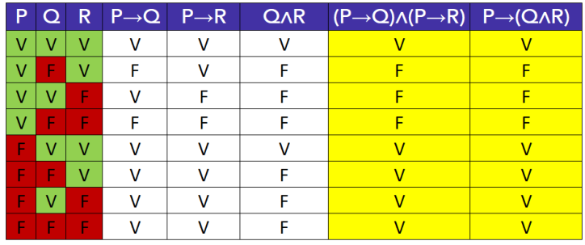

---

<!-- pagina: 40 -->

**Equipe Exatas Estratégia Concursos Aula 02** 

**(SEFAZ-AL/2020)** Considere as proposições: 

- **P1** : “Se há carência de recursos tecnológicos no setor Alfa, então o trabalho dos servidores públicos que 

- atuam nesse setor pode ficar prejudicado.”. 

- **P2** : “Se há carência de recursos tecnológicos no setor Alfa, então os beneficiários dos serviços prestados 

- por esse setor podem ser mal atendidos.”. 

A proposição **P1** ∧ **P2** é equivalente à proposição “Se há carência de recursos tecnológicos no setor Alfa, então o trabalho dos servidores públicos que atuam nesse setor pode ficar prejudicado e os beneficiários dos serviços prestados por esse setor podem ser mal atendidos.”. 

**Comentários:** 

Considere as proposições simples: 

**c:** "Há carência de recursos tecnológicos no setor Alfa." 

**t:** "O trabalho dos servidores públicos que atuam nesse setor pode ficar prejudicado." 

**b:** "Os beneficiários dos serviços prestados por esse setor podem ser mal atendidos." 

A proposição **P1** pode ser descrita por **c** → **t** e a proposição **P2** pode ser descrita por **c** → **b** . Logo, a proposição **P1** ∧ **P2** pode ser descrita por: 

**(c** → **t)** ∧ **(c** → **b)** 

Devemos, portanto, avaliar se **(c** → **t)** ∧ **(c** → **b)** é equivalente a: 

“ **Se [** há carência de recursos tecnológicos no setor Alfa **]** , **então [(** o trabalho dos servidores públicos que atuam nesse setor pode ficar prejudicado **) e (** os beneficiários dos serviços prestados por esse setor podem ser mal atendidos **)]** .” 

Isto é, devemos avaliar se **(c** → **t)** ∧ **(c** → **b)** é equivalente a **c** → **(t** ∧ **b)** . 

Sabemos que essas duas proposições compostas são equivalentes, pois correspondem à seguinte equivalência estudada: 

**(p** → **q)** ∧ **(p** → **r) ≡ p** → **(q** ∧ **r)** 

O **<u>gabarito</u>** , portanto, é **CERTO** .

---

<!-- pagina: 41 -->

**Equipe Exatas Estratégia Concursos Aula 02** 

Caso você não se lembre dessa equivalência na hora da prova, não se esqueça que **SEMPRE** podemos recorrer à **tabela-verdade** para verificar se duas proposições são equivalentes. Isso porque, pela definição de equivalências, temos que duas proposições **A** e **B** são **equivalentes** quando todos os **valores lógicos** (V ou F) assumidos por elas **são iguais** para **todas as combinações de valores lógicos atribuídos às proposições simples que as compõem** . 

Para o caso em questão, podemos montar a seguinte tabela-verdade: 

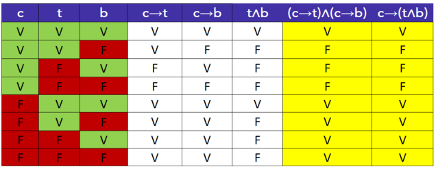

Veja que ambas as proposições apresentam a mesma tabela-verdade e, portanto, são equivalentes. 

**Gabarito: CERTO.** 

**(PF/2004)** As proposições **(P** ∨ **Q)** → **S** e **(P** → **S)** ∨ **(Q** → **S)** possuem tabelas de valorações iguais. 

**Comentários:** 

**A assertiva está ERRADA** . A equivalência correta seria **(P** → **S)** ∧ **(Q** → **S) ≡ (P** ∨ **Q)** → **S** . 

Lembre-se que as equivalências mostradas nesse tópico são **<u>conjunções (e;</u>** ∧ **)** **<u>de condicionais</u>** . Veja: 

**(p** → **r)** ∧ **(q** → **r) ≡ (p** ∨ **q)** → **r** 

**(p** → **q)** ∧ **(p** → **r) ≡ p** → **(q** ∧ **r)** 

Para mostrar formalmente que **(P** ∨ **Q)** → **S** e **(P** → **S)** ∨ **(Q** → **S) não** possuem tabelas de valorações iguais, isto é, para mostrar que essas proposições **não** são equivalentes, podemos montar a seguinte tabela-verdade: 

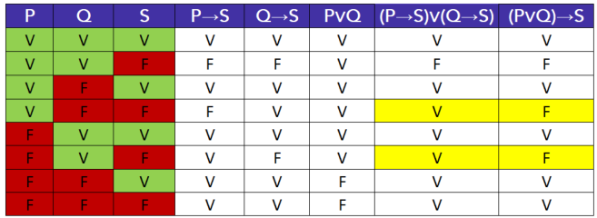

**Gabarito: ERRADO.**

---

<!-- pagina: 42 -->

**Equipe Exatas Estratégia Concursos Aula 02** 

## Equivalências da disjunção exclusiva (ou...ou) 

Uma forma equivalente de se escrever a **disjunção exclusiva (ou...ou;** <u>∨</u> **<u>)</u>** consiste em **negar ambos os termos** : 

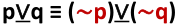

Como exemplo, considere a disjunção exclusiva: 

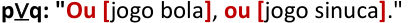

Essa disjunção exclusiva é equivalente a: 

**(** ~ **p)** <u>∨</u> **(** ~ **q): "Ou [não** jogo bola==5460== **]** , **ou [não** jogo sinuca **]** ." 

Uma possível equivalência da disjunção exclusiva **p** <u>∨</u> **<u>q</u>** consiste em negar tanto **p** quanto **q** : 

Além disso, outras duas possibilidades de se obter equivalências da disjunção exclusiva  consiste em transformá-la em uma **bicondicional (se e somente se;**  **) negando-se apenas um dos termos** : 

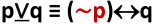

Para fins de exemplo, considere novamente a seguinte disjunção exclusiva: 

Essa disjunção exclusiva também é equivalente às seguintes proposições: 

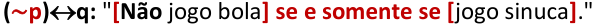

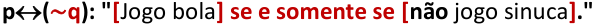

---

<!-- pagina: 43 -->

**Equipe Exatas Estratégia Concursos Aula 02** 

##### **p** <u>∨</u> **q ≡ (** ~ **p)** <u>∨</u> **<u>(</u>** ~ **q)** 

**(TCE SP/2017)** Se a afirmação “Ou Renato é o gerente da loja ou Rodrigo é o dono da loja” é verdadeira, então uma afirmação necessariamente verdadeira é: 

a) Renato é o gerente da loja e Rodrigo é o dono da loja. 

b) Renato é o gerente da loja se, e somente se, Rodrigo não é o dono da loja. 

c) Se Renato não é o gerente da loja, então Rodrigo não é o dono da loja. 

d) Se Renato é o gerente da loja, então Rodrigo é o dono da loja. 

e) Renato é o gerente da loja. 

##### **Comentários:** 

Sejam as proposições simples: 

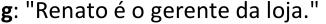

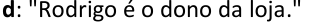

A proposição original pode ser descrita por **<u>g</u>** <u>∨</u> **<u>d</u>** : 

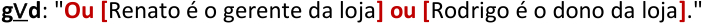

Temos que procurar nas alternativas uma resposta equivalente a uma **disjunção exclusiva** . Sabemos que existem as seguintes equivalências: 

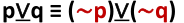

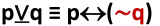

Como não há uma disjunção exclusiva nas respostas, devemos testar as últimas duas equivalências. Para o caso em questão, temos as seguintes equivalências: 

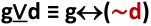

---

<!-- pagina: 44 -->

**Equipe Exatas Estratégia Concursos Aula 02** 

Essas equivalências podem ser descritas por: 

**(** ~ **g)**  **d** : " **[** Renato **não** é o gerente da loja **] se, e somente se, [** Rodrigo é o dono da loja **]** ." 

**g**  **(** ~ **d):** " **[** Renato é o gerente da loja **] se, e somente se, [** Rodrigo **não** é o dono da loja **]** ." 

Veja que **g**  **(** ~ **d)** corresponde à proposição composta que está na **letra B** , que é o **gabarito da questão** . 

**Gabarito: Letra B.** 

Negação da disjunção exclusiva (ou...ou) 

A principal **negação da disjunção exclusiva** é a **bicondicional** : 

~ **(p** <u>∨</u> **<u>q) ≡ p</u>**  **q** 

Como exemplo, considere a seguinte disjunção exclusiva: 

##### **p** <u>∨</u> **<u>q: "Ou</u> [** jogo bola **]** , **ou [** jogo sinuca **]** ." 

A negação dessa disjunção exclusiva pode ser escrita da seguinte forma: 

~ **(p** <u>∨</u> **<u>q) ≡ p</u>**  **q** : " **[** Jogo bola **] se e somente se [** jogo sinuca **]** ." 

**Mostre que são equivalentes** ~ **(p** <u>∨</u> **<u>q) e p</u>**  **q.** 

Vamos colocar lado a lado as tabelas-verdade de **p**  **q** e **<u>p</u>** <u>∨</u> **<u>q</u>** . 

Quando as proposições simples **p** e **q** têm o mesmo valor lógico, a disjunção exclusiva **<u>p</u>** <u>∨</u> **<u>q</u>** é falsa. Nos demais casos, é verdadeira. 

Para a bicondicional **p**  **q** ocorre exatamente o oposto: os casos em que ela é verdadeira são somente aqueles em que **p** e **q** são iguais. 

Isso significa que, ao negarmos a disjunção exclusiva, chegaremos à bicondicional. Veja:

---

<!-- pagina: 45 -->

**Equipe Exatas Estratégia Concursos Aula 02** 

Assim, temos: 

~ **<u>(p</u>** <u>∨</u> **<u>q) ≡ p</u>**  **<u>q</u>** 

Uma possível **negação para a disjunção exclusiva** é a **bicondicional** : ~ **(p** <u>∨</u> **<u>q) ≡ p</u>**  **q** 

Podemos ainda negar a disjunção exclusiva negando **<u>apenas uma</u>** das suas parcelas. Veja: 

Como exemplo, considere novamente a seguinte disjunção exclusiva: 

A negação dessa disjunção exclusiva também pode ser escrita das seguintes formas: 

~ **(p** <u>∨</u> **<u>q) ≡ p</u>** <u>∨</u> **<u>(</u>** ~ **q): "Ou [** jogo bola **]** , **ou [não** jogo sinuca **]** ." 

##### ~ **(p** <u>∨</u> **<u>q) ≡ p</u>**  **q** 

<mark>~</mark> **<mark>(p</mark>** <u><mark>∨</mark></u> **<u><mark>q) ≡ (</mark></u>** <mark>~</mark> **<mark>p)</mark>** <u><mark>∨</mark></u> **<u><mark>q</mark></u>** 

~ **(p** <u>∨</u> **<u>q) ≡ p</u>** <u>∨</u> **<u>(</u>** ~ **q)**

---

<!-- pagina: 46 -->

**Equipe Exatas Estratégia Concursos Aula 02** 

**(DPE SP/2023)** Considere a seguinte afirmação: 

Ou Flávio é funcionário público ou Flávio é funcionário de empresa privada. 

Assinale a alternativa que contém uma negação lógica para a afirmação apresentada. 

a) Ou Flávio não é funcionário público ou Flávio não é funcionário de empresa privada. b) Flávio é funcionário de empresa privada se, e somente se, ele é funcionário público. c) Se Flávio é funcionário público, então ele é funcionário de empresa privada. 

d) Flávio é funcionário de empresa privada e é funcionário público. 

e) Flávio é funcionário público ou é funcionário de empresa privada. 

**Comentários:** 

Sejam as proposições simples: 

**p:** "Flávio é funcionário público." 

**e:** "Flávio é funcionário de empresa privada." 

A afirmação original é uma **disjunção exclusiva** ( **ou...ou** ) representada por **<u>p</u>** <u>∨</u> **<u>e</u>** : 

**p** <u>∨</u> **<u>e:</u>** " **Ou [** Flávio é funcionário público **] ou [** Flávio é funcionário de empresa privada **]** ." Conhecemos as seguintes negações da disjunção exclusiva: 

~ **(p** <u>∨</u> **<u>q) ≡ p</u>**  **q** 

~ **(p** <u>∨</u> **<u>q) ≡ (</u>** ~ **p)** <u>∨</u> **<u>q</u>** 

~ **(p** <u>∨</u> **<u>q) ≡ p</u>** <u>∨</u> **<u>(</u>** ~ **q)** 

Veja que **as alternativas C, D e E podem ser eliminadas** , pois a negação da disjunção exclusiva **não pode ser** uma **condicional** , uma **conjunção** ou uma **disjunção inclusiva** . **Restam apenas as alternativas A e B** . Aplicando negações aprendidas para o caso em questão, temos: 

~ **(p** <u>∨</u> **<u>e) ≡ p</u>**  **e** 

~ **(p** <u>∨</u> **<u>e) ≡ (</u>** ~ **p)** <u>∨</u> **<u>e</u>** 

~ **(p** <u>∨</u> **<u>e) ≡ p</u>** <u>∨</u> **<u>(</u>** ~ **e)** 

Veja que **a alternativa A está errada** , pois ela nega ambas as parcelas da disjunção exclusiva, apresentando a proposição **(** ~ **p)** <u>∨</u> **<u>(</u>** ~ **e)** . Essa proposição é uma equivalência de **<u>p</u>** <u>∨</u> **<u>e</u>** , não uma negação de **<u>p</u>** <u>∨</u> **<u>e</u>** . 

Logo **, a alternativa correta é a letra B** , que apresenta uma possibilidade para a negação ~ **(p** <u>∨</u> **<u>e)</u>** , dada por **p**  **e:** 

~ **(p** <u>∨</u> **<u>e) ≡ p</u>**  **e:** " **[** Flávio é funcionário de empresa privada **] se, e somente se, [** ele é funcionário público **]** ." **Gabarito: Letra B.**

---

<!-- pagina: 47 -->

**Equipe Exatas Estratégia Concursos Aula 02** 

<!-- Start of picture text -->
(CMSJC/2022)  Considere a afirmação: "Ou arranjo emprego ou não me caso". A negação dessa afirmação é: a) Se eu arranjo emprego, então eu me caso. b) Se eu não arranjo emprego, então eu me caso. c) Ou não arranjo emprego ou me caso. d) Ou não arranjo emprego ou não me caso. e) Arranjo emprego e não me caso. Comentários: Considere as proposições simples: a:  "Arranjo emprego." c:  "Me caso." A afirmação original é uma  disjunção exclusiva  ( ou...ou ) representada por  a ∨~ c : a ∨~ c:  "  Ou [ arranjo emprego ] ou [não  me caso ] ." Conhecemos as seguintes negações da disjunção exclusiva: ~ (p ∨ q) ≡ p  q ~ (p ∨ q) ≡ ( ~ p) ∨ q ~ (p ∨ q) ≡ p ∨ ( ~ q) Note que nas alternativas  não temos nenhuma bicondicional . Portanto,  não devemos utilizar essa forma de se negar a disjunção exclusiva . Utilizando a negação  ~ (p ∨ q) ≡ ( ~ p) ∨ q  para o caso em questão, ficamos com: ~ (a ∨~ c) ≡  ~ a ∨~ c: "Ou [não  arranjo emprego ] ou [não  me caso ]." Veja que a primeira negação está presente na  alternativa D , que é o  gabarito  da questão. Note que o uso da equivalência  ~ (p ∨ q) ≡  p ∨ ( ~ q)  também seria possível. Ocorre que, nesse caso, não encontramos resposta. Vejamos: ~ (a ∨~ c) ≡ a ∨~ ( ~ c)  A dupla negação de  c  corresponde à proposição original. Ficamos com: ~ (a ∨~ c) ≡ a ∨ c Logo, a negação poderia ser descrita por: ~ (a ∨~ c) ≡ a ∨ c: "Ou [ arranjo emprego ] ou [ me caso ]." Note que essa possibilidade não aparece nas possíveis alternativas. Gabarito: Letra D. <!-- End of picture text -->

---

<!-- pagina: 48 -->

**Equipe Exatas Estratégia Concursos Aula 02** 

## Equivalências da bicondicional (se e somente se) 

Inicialmente, é importante que você saiba que a bicondicional apresenta a seguinte equivalência: 

##### **p**  **q ≡ (p** → **q)** ∧ **(q** → **p)** 

Considere, por exemplo, a seguinte bicondicional **p**  **q** : 

Essa bicondicional é equivalente a **(p** → **q)** ∧ **(q** → **p)** : 

**(p** → **q)** ∧ **(q** → **p)** : " **[Se (** estou cansado **)** , **então (** durmo **)] e [se (** durmo **)** , **então (** estou cansado **)]** ". 

Os alunos costumam decorar essa equivalência do seguinte modo: uma forma equivalente à bicondicional é **ir (p** → **q) e (** ∧ **) voltar (q** → **p)** com a condicional. 

##### **p**  **q ≡ (p** → **q)** ∧ **(q** → **p)** 

**Mnemônico:** uma forma equivalente à **bicondicional** é **ir e voltar** com a **condicional** 

Outra forma equivalente de se escrever a bicondicional consiste em **negar ambos os termos** : 

Considere novamente a seguinte bicondicional **p**  **q** : 

Essa bicondicional é equivalente a **(** ~ **p)**  **(** ~ **q)** : 

**(** ~ **p)**  **(** ~ **q)** : " **[Não** durmo **] se e somente se [não** estou cansado **]** ."

---

<!-- pagina: 49 -->

**Equipe Exatas Estratégia Concursos Aula 02** 

Uma possível equivalência da bicondicional **p**  **q** consiste em negar tanto **p** quanto **q** : 

**p**  **q ≡ (** ~ **p)**  **(** ~ **q)** 

Além disso, outras duas possibilidades de se obter uma equivalência da bicondicional consiste em transformá-la em uma **disjunção exclusiva (ou...ou;** <u>∨</u> **<u>)</u> negando-se apenas um dos termos** : 

Para fins de exemplo, considere novamente a seguinte bicondicional: 

Essa bicondicional também é equivalente às seguintes proposições: 

**(** ~ **p)** <u>∨</u> **<u>q:</u>** " **Ou [não** durmo **], ou [** estou cansado **]** ." 

**p** <u>∨</u> **(** ~ **q):** " **Ou [** durmo **], ou [não** estou cansado **]** ." 

##### **p**  **q ≡ (p** → **q)** ∧ **(q** → **p)** 

**<mark>p</mark>** <mark></mark> **<mark>q ≡ (</mark>** <mark>~</mark> **<mark>p)</mark>** <mark></mark> **<mark>(</mark>** <mark>~</mark> **<mark>q)</mark>** 

**<mark>p</mark>** <mark></mark> **<mark>q ≡ (</mark>** <mark>~</mark> **<mark>p)</mark>** <u><mark>∨</mark></u> **<u><mark>q</mark></u>** 

**p**  **q ≡ p** <u>∨</u> **<u>(</u>** ~ **q)** 

Vejamos algumas questões sobre equivalências da bicondicional.

---

<!-- pagina: 50 -->

**Equipe Exatas Estratégia Concursos Aula 02** 

**(APPGG Pref. SP/2023)** Uma proposição lógica equivalente à proposição “Adriano é pai se, e somente se, Giuliano é filho” está contida na alternativa: 

a) Se Giuliano não é filho, então Adriano não é pai. 

b) Adriano é pai, e Giuliano não é filho. 

c) Ou Adriano é pai, ou Giuliano é filho. 

d) Se Adriano é pai, então Giuliano é filho. 

e) Ou Giuliano é filho, ou Adriano não é pai. 

**Comentários:** 

Sejam as seguintes proposições simples: 

**a:** "Adriano é pai." 

**g** : "Giuliano é filho." 

A proposição original pode ser escrita pela bicondicional **a**  **g** : 

“ **[** Adriano é pai **] se, e somente se, [** Giuliano é filho **]** .” 

Conhecemos as seguintes equivalências para a bicondicional: 

**p**  **q ≡ (p** → **q)** ∧ **(q** → **p)** 

Note que **as alternativas A e D podem ser eliminadas** , pois são condicionais em que há apenas duas proposições simples sem uma conjunção. 

A **alternativa B também pode ser eliminada** , pois a bicondicional não pode ser equivalente a uma conjunção. 

Logo, **restam as alternativas C e E** , **que são disjunções exclusivas (ou...ou;** <u>∨</u> **<u>)</u>** . Devemos, portanto, aplicar as duas últimas equivalências: 

Note que **a alternativa C deve ser eliminada** , pois ela não negou nenhuma parcela. Essa alternativa corresponde a **<u>a</u>** <u>∨</u> **<u>g</u>** : 

A **alternativa correta** é a **letra E** , que apresenta a proposição **<u>g</u>** <u>∨</u> **<u>(</u>** ~ **a)** . 

https://t.me/KakashiAssinaturasBot

---

<!-- pagina: 51 -->

**Equipe Exatas Estratégia Concursos Aula 02** 

Ainda nessa aula, em **álgebra de proposições** , veremos que na disjunção exclusiva podemos trocar livremente de posição ambas as parcelas, de modo que a equivalência dada por **(** ~ **a)** <u>∨</u> **<u>g</u>** corresponde a **<u>g</u>** <u>∨</u> **<u>(</u>** ~ **a)** : 

**<u>g</u>** <u>∨</u> **(** ~ **a)** : **Ou [** Giuliano é filho **]** , **ou [** Adriano **não** é pai **]** . 

**Gabarito: Letra E.** 

**(ISS RJ/2010)** A proposição "um número inteiro é par se e somente se o seu quadrado for par" equivale logicamente à proposição: 

a) se um número inteiro for par, então o seu quadrado é par, e se um número inteiro não for par, então o seu quadrado não é par. 

b) se um número inteiro for ímpar, então o seu quadrado é ímpar. 

c) se o quadrado de um número inteiro for ímpar, então o número é ímpar. 

d) se um número inteiro for par, então o seu quadrado é par, e se o quadrado de um número inteiro não for par, então o número não é par. 

e) se um número inteiro for par, então o seu quadrado é par. 

**Comentários:** 

Sejam as proposições: 

**p: "** Um número inteiro é par." 

**q:** "O quadrado de um número inteiro é par." 

- A proposição composta pode ser assim representada: 

**p**  **q: "[** Um número inteiro é par **] se e somente se [** o seu quadrado for par **]** ." 

Sabemos que uma possível equivalência para a bicondicional é: 

**p**  **q ≡ (p** → **q)** ∧ **(q** → **p)** 

Não temos alternativa que corresponda a essa última equivalência. Note, porém, que se realizarmos a **contrapositiva de (q** → **p)** , encontramos: 

**p**  **q ≡ (p** → **q)** ∧ **(** ~ **p** →~ **q)** 

Esse resultado pode ser lido como: 

**(p** → **q)** ∧ **(** ~ **p** →~ **q):** " **[Se (** um número inteiro for par **)** , **então (** o seu quadrado é par **)]** , **e [se (** um número inteiro **não** for par **)** , **então (** o seu quadrado **não** é par **)]** ." 

**Gabarito: Letra A.** 

https://t.me/KakashiAssinaturasBot

---

<!-- pagina: 52 -->

**Equipe Exatas Estratégia Concursos Aula 02** 

## Negações da bicondicional (se e somente se) 

São quatro as maneiras mais comuns de se negar a bicondicional **.** A primeira que vamos apresentar é que a **negação da bicondicional é equivalente à disjunção exclusiva.** 

Considere novamente a seguinte bicondicional **p**  **q** : 

##### **p**  **q** : " **[** Durmo **] se e somente se [** estou cansado **]** " 

A negação dessa bicondicional pode ser escrita da seguinte forma: 

~ **(p**  **q) ≡ p** <u>∨</u> **<u>q:</u>** " **Ou [** Durmo **], ou [** estou cansado **]** " 

**Mostre que** ~ **(p**  **q) e p** <u>∨</u> **<u>q são equivalentes.</u>** 

Podemos demonstrar a equivalência ~ **(p**  **q) ≡ (p** <u>∨</u> **<u>q)</u>** utilizando outra equivalência já conhecida, a negação da disjunção exclusiva: 

~ **(p** <u>∨</u> **<u>q) ≡ p</u>**  **q** 

Podemos negar os dois lados desse resultado da seguinte forma: 

A proposição composta **p** <u>∨</u> **<u>q</u>** é uma proposição assim como qualquer proposição simples, com a diferença que ela é resultado de uma composição de proposições simples por meio de um conectivo. Assim, continua válido o entendimento de que ao negar duas vezes uma proposição retornamos à proposição original. Logo: 

##### **p** <u>∨</u> **q ≡** ~ **(p**  **q)** 

Esse resultado pode ser escrito da seguinte forma, trocando os lados direito e esquerdo da equivalência anterior: 

~ **<u>(p</u>**  **<u>q) ≡ (p</u>** <u>∨</u> **<u>q)</u>** 

Uma possível **negação para a bicondicional** é a **disjunção exclusiva** : 

##### ~ **(p**  **q) ≡ p** <u>∨</u> **<u>q</u>** 

Podemos ainda negar a proposição bicondicional negando **<u>apenas uma</u>** das suas parcelas. Veja:

---

<!-- pagina: 53 -->

**Equipe Exatas Estratégia Concursos Aula 02** 

~ **(p**  **q) ≡ (** ~ **p)**  **q** 

~ **(p**  **q) ≡ p**  **(** ~ **q)** 

Como exemplo, considere novamente a seguinte bicondicional: 

##### **p**  **q** : " **[** Durmo **] se e somente se [** estou cansado **]** " 

A negação dessa bicondicional também pode ser escrita das seguintes formas: 

~ **(p**  **q) ≡ (** ~ **p)**  **q:** " **[Não** durmo **] se e somente se [** estou cansado **]** " 

~ **(p**  **q) ≡ p**  **(** ~ **q):** " **[** Durmo **] se e somente se [não** estou cansado **]** " 

Cabe salientar que existe uma outra forma de **negação da bicondicional utilizando apenas operadores de conjunção e de disjunção inclusiva** : 

##### ~ **(p**  **q) ≡ (p** ∧~ **q)** ∨ **(q** ∧~ **p)** 

**Mostre que** ~ **(p**  **q) e (p** ∧~ **q)** ∨ **(q** ∧~ **p) são equivalentes.** 

A utilização da tabela-verdade é a forma tradicional de se provar a equivalência. Vejamos, porém, uma forma mais interessante de provar esta equivalência por meio de outras equivalências que já aprendemos. Vamos utilizar a seguinte equivalência para a bicondicional já conhecida: 

**p**  **q ≡(p** → **q)** ∧ **(q** → **p)** 

Se negarmos ambos os lados da equivalência teremos o seguinte: 

~ **(p**  **q) ≡** ~ **((p** → **q)** ∧ **(q** → **p))** 

Veja-se que o lado direito da equivalência é a negação de uma conjunção, que pode ser reescrita utilizando De Morgan: 

~ **(p**  **q) ≡** ~ **(p** → **q)** ∨~ **(q** → **p)** 

Agora devemos negar os dois condicionais, **(p** → **q)** e **(q** → **p)** . 

~ **<u>(p</u>**  **<u>q) ≡ (p</u>** ∧~ **<u>q)</u>** ∨ **<u>(q</u>** ∧~ **<u>p)</u>** 

https://t.me/KakashiAssinaturasBot

---

<!-- pagina: 54 -->

**Equipe Exatas Estratégia Concursos Aula 02** 

~ **(p**  **q) ≡ p** <u>∨</u> **<u>q</u>** 

<mark>~</mark> **<mark>(p</mark>** <mark></mark> **<mark>q) ≡ (</mark>** <mark>~</mark> **<mark>p)</mark>** <mark></mark> **<mark>q</mark>** 

<mark>~</mark> **<mark>(p</mark>** <mark></mark> **<mark>q) ≡ p</mark>** <mark></mark> **<mark>(</mark>** <mark>~</mark> **<mark>q)</mark>** 

~ **(p**  **q) ≡ (p** ∧~ **q)** ∨ **(q** ∧~ **p)** 

Vamos resolver alguns exercícios relativos à negação da bicondicional. 

**(CAU TO/2023)** Com relação a estruturas lógicas, julgue o item. 

A negação de “A Fênix é imortal se, e somente se, renasce das cinzas” é “Ou a Fênix é imortal ou renasce das cinzas”. 

**Comentários:** 

Sejam as proposições simples: 

**i:** "A Fênix é imortal." 

**r:** "A Fênix renasce das cinzas." 

A afirmação original é a bicondicional **i**  **r** : 

**i**  **r** : " **[** A Fênix é imortal **] se, e somente se, [** renasce das cinzas **]** ." 

A questão sugere que a negação da bicondicional é uma disjunção exclusiva. Devemos, portanto, utilizar a negação ~ **(p**  **q) ≡ p** <u>∨</u> **<u>q</u>** . Para o caso em questão, temos: 

~ **(i**  **r) ≡ i** <u>∨</u> **r** 

Ficamos com a seguinte negação: 

~ **(i**  **r) ≡ i** <u>∨</u> **<u>r:</u>** “ **Ou [** a Fênix é imortal **] ou [** renasce das cinzas **]** .” 

**Gabarito: CERTO.**

---

<!-- pagina: 55 -->

**Equipe Exatas Estratégia Concursos Aula 02** 

**(Pref. Vila Lângaro/2019)** A negação da proposição “João passa no concurso público se e somente se João estuda” é: 

a) João não passa no concurso público se e somente se João não estudou. 

b) João não passa no concurso público e João não estudou. 

c) João passa no concurso público e João estuda. 

d) Ou João passa no concurso público ou João estuda. 

e) Se João passa no concurso público, então João estuda. 

**Comentários:** 

Sejam as proposições simples: 

**p:** " João passa no concurso público." 

**e:** " João estuda." 

A afirmação original é a bicondicional **p**  **e** : 

**p**  **e** : " **[** João passa no concurso público **] se, e somente se, [** João estuda **]** ." 

As principais formas de se negar a bicondicional são: 

~ **(p**  **q) ≡ p** <u>∨</u> **<u>q</u>** 

~ **(p**  **q) ≡ (** ~ **p)**  **q** 

~ **(p**  **q) ≡ p**  **(** ~ **q)** 

~ **(p**  **q) ≡ (p** ∧~ **q)** ∨ **(q** ∧~ **p)** 

Note que a primeira forma de se negar a bicondicional apresentada, quando aplicada para a bicondicional **p**  **e** , corresponde à **alternativa D** , que é o **gabarito da questão** : 

~ **(p**  **e) ≡ p** <u>∨</u> **<u>e:</u>** " **Ou [** João passa no concurso público **] ou [** João estuda **]** ." 

As demais formas apresentadas nas alternativas não correspondem à negação da bicondicional. Especial atenção deve ser dada à **alternativa A** , que **apresenta uma equivalência da bicondicional** , **<u>não uma negação</u>** <u>:</u> 

**p**  **e ≡ (** ~ **p)**  **(** ~ **e)** 

**Gabarito: Letra D.**

---

<!-- pagina: 56 -->

**Equipe Exatas Estratégia Concursos Aula 02** 

# **Á LGEBRA DE PROPOSIÇÕES** 

|**Álgebra de proposições**|
|---|
|**Propriedade comutativa**|
|Todos os conectivos,**exceto o condicional (se...então;**→**)**, gozam da propriedade comutativa. **p**∧**q ≡ q**∧**p** **p**∨**q ≡ q**∨**p** **p**∨**q ≡q**∨**p** **p****q ≡ q****p**|
|**Propriedade associativa**|
|**(p**∧**q)**∧**r ≡ p**∧**(q**∧**r)** **(p**∨**q)**∨**r ≡ p**∨**(q**∨**r)**|
|**Propriedade distributiva**|
|**p**∧**(q**∨**r) ≡ (p**∧**q)**∨**(p**∧**r)** **p**∨**(q**∧**r) ≡ (p**∨**q)**∧**(p**∨**r)**|
|**Propriedade da identidade**|
|**p**∧**t ≡ p** **p**∧**c ≡ c**|
|**p**∨**t ≡ t** **p**∨**c ≡ p**|
|**Propriedade da absorção**|
|**p**∨**(p**∧**q) ≡ p** **p**∧**(p**∨**q) ≡ p**|
|**Propriedade da idempotência**|
|**p**∧**p ≡ p** **p**∨**p ≡ p**|
|**Álgebra de proposições × tautologia, contradição e contingência**|
|Desenvolver a proposição composta original até se chegar: • Em uma**tautologia** **t**; ou • Em uma**contradição** **c**; ou|
|• Em uma**contingência**, que pode ser uma proposição simples**p**, uma conjunção**p**∧**q**, etc. Bicondicional em problemas de tautologia, contradição e contingência **X****Y** • Se**X**e**Y**forem proposições equivalentes, a bicondicional será uma**tautologia**. • Se**X**e**Y**forem proposições em que uma é a negação da outra, a bicondicional será uma**contradição**.|

---

<!-- pagina: 57 -->

**Equipe Exatas Estratégia Concursos Aula 02** 

## Introdu ão <u>ç</u> 

A **álgebra de proposições** trata do uso sequencial de equivalências lógicas e de outras propriedades para simplificar expressões. 

O uso dessa ferramenta é interessante para resolver questões de um modo mais rápido. Além disso, pode ser **muito útil em questões mais diretas de equivalências lógicas, quando a banca tenta "esconder" a equivalência nas alternativas** . 

O mais importante é você conhecer as propriedades **comutativa** , **associativa** e **distributiva** <u>e suas aplicações mais imediatas nas questões. Isso porque, via de regra, o conhecimento das demais propriedades não</u> costuma ser cobrado e, além disso, é comum que as **questões mais complexas** de **álgebra de proposições** possam ser resolvidas por **tabela-verdade.** 

As **três primeiras propriedades** que serão apresentadas são as mais importantes para sua prova: **comutativa** , **associativa** e **distributiva** . 

**Questões mais complexas** em regra podem ser resolvidas por **tabela-verdade** . Nesses casos, a desenvoltura com **álgebra de proposições** seria apenas um " **bônus** " para que você resolva alguns problemas mais rapidamente. 

## Propriedade comutativa 

Todos os conectivos, **exceto o condicional (se...então;** → **)** , gozam da propriedade comutativa. Isso quer dizer que é possível trocar a ordem dos componentes em uma proposição composta sem afetar o resultado da tabela-verdade: 

##### **p** <u>∨</u> **<u>q ≡ q</u>** <u>∨</u> **<u>p</u>** 

##### **p**  **q ≡ q**  **p** 

A seguir temos um exemplo da utilidade da propriedade comutativa em questões de concursos públicos.

---

<!-- pagina: 58 -->

**Equipe Exatas Estratégia Concursos Aula 02** 

Suponha que uma questão peça para você a negação da seguinte condicional: 

**p** → **q** : " **Se [** eu correr **]** , **então [** chego a tempo **]** ." 

Sabemos que **essa condicional não goza da propriedade comutativa** . A negação dessa condicional, pedida pela questão, pode ser encontrada pela seguinte equivalência: 

~ ( **p** → **q** ) **≡ p** ∧~ **q** : <mark>"Corro</mark> e <mark>não chego a tempo.</mark> " 

Suponha agora que, dentre as alternativas da questão, você não encontre a proposição composta <mark>"Corro</mark> e <mark>não chego a tempo"</mark> , porém encontre " <mark>Não chego a tempo</mark> e <mark>corro"</mark> . Pode marcar essa alternativa sem medo! Isso porque, usando a **propriedade comutativa** , a conjunção obtida **p** ∧~ **q** pode ser escrita como ~ **q** ∧ **p** : 

~ <u>(</u> **<u>p</u>** → **<u>q</u>** <u>)</u> **≡ p** ∧~ **<u>q ≡</u>** ~ **<u>q</u>** ∧ **<u>p</u>** : <mark>"Não chego a tempo</mark> e <mark>corro.</mark> " 

**Todos os conectivos** , **exceto o condicional** , **comutam:** 

**<mark>p</mark>** <mark>∧</mark> **<mark>q ≡ q</mark>** <mark>∧</mark> **<mark>p p</mark>** <mark>∨</mark> **<mark>q ≡ q</mark>** <mark>∨</mark> **<mark>p p</mark>** <u><mark>∨</mark></u> **<u><mark>q ≡ q</mark></u>** <u><mark>∨</mark></u> **<u><mark>p</mark></u>** **<mark>p</mark>** <mark></mark> **<mark>q ≡ q</mark>** <mark></mark> **<mark>p</mark>** 

**<mark>A condicional p</mark>** <mark>→</mark> **<mark>q não goza da propriedade comutativa.</mark>** 

**<mark>p</mark>** <mark>→</mark> **<mark>q e q</mark>** <mark>→</mark> **<mark>p não são equivalentes.</mark>** 

**<mark>A equivalência correta para a condicional é a contrapositiva:</mark>** 

**p** → **q ≡** ~ **q** →~ **p** 

Vejamos uma questão de negações lógicas em que é necessário utilizar a propriedade comutativa:

---

<!-- pagina: 59 -->

**Equipe Exatas Estratégia Concursos Aula 02** 

**(EPC/2023)** Considere a afirmação: 

Animais são bípedes ou são quadrúpedes e árvores tem folhas verdes. 

Uma afirmação que corresponda à negação lógica dessa afirmação é: 

a) Árvores não tem folhas verdes e animais são bípedes e são quadrúpedes. 

b) Animais não são bípedes ou não são quadrúpedes e árvores não têm folhas verdes. 

c) Animais não são bípedes ou não são quadrúpedes, ou árvores não têm folhas verdes. 

d) Árvores têm folhas verdes e animais não são bípedes ou são quadrúpedes. 

e) Árvores não têm folhas verdes ou animais não são bípedes e não são quadrúpedes. 

##### **Comentários:** 

Sejam as proposições simples: 

**b:** "Animais são bípedes." 

**q:** "Animais são quadrúpedes." 

**a** : "Árvores tem folhas verdes." 

A afirmação do enunciado corresponde a: 

**(b** ∨ **q)** ∧ **a:** " **[(** Animais são bípedes **) ou (** (animais) são quadrúpedes **)] e [** árvores tem folhas verdes **]** ." 

A negação dessa frase é a negação de uma **conjunção (e;** ∧ **)** formada dois termos: o termo **(b** ∨ **q)** e o termo **a** . Para realizar a negação de uma conjunção, usa-se a equivalência ~ **(p** ∧ **q) ≡** ~ **p** ∨~ **q** . Para aplicar essa equivalência, devemos seguir o seguinte procedimento: 

- **Negam-se ambas as parcelas da conjunção (e;** ∧ **);** 

- **Troca-se a conjunção (e;** ∧ **) pela disjunção inclusiva (ou;** ∨ **).** 

Aplicando a equivalência em questão para negar **(b** ∨ **q)** ∧ **a** , ficamos com: 

~ **[(b** ∨ **q)** ∧ **a] ≡** ~ **(b** ∨ **q)** ∨~ **a** 

Note que ficamos com uma disjunção inclusiva entre ~ **(b** ∨ **q)** e ~ **a** . Veja que a parcela ~ **(b** ∨ **q)** é a negação da disjunção inclusiva **(b** ∨ **q)** , que também pode ser desenvolvida por De Morgan. Como ~ **(b** ∨ **q)** corresponde a ~ **b** ∧~ **q** , ficamos com: 

~ **[(b** ∨ **q)** ∧ **a] ≡ (** ~ **b** ∧~ **q)** ∨~ **a** 

Logo, **(** ~ **b** ∧~ **q)** ∨~ **a** é uma forma de se representar a negação que estamos procurando: 

**(** ~ **b** ∧~ **q)** ∨~ **a:** " **[(** Animais **não** são bípedes **) e (** (animais) **não** são quadrúpedes **)] ou [** árvores **não** tem folhas verdes **<u>]</u>** ."

---

<!-- pagina: 60 -->

**Equipe Exatas Estratégia Concursos Aula 02** 

Veja que não encontramos exatamente uma resposta. Observe, porém, que fazendo uso da **propriedade comutativa** podemos trocar de posição as parcelas **(** ~ **b** ∧~ **q)** e ~ **a** que compõem a disjunção inclusiva: 

##### **(** ~ **b** ∧~ **q)** ∨~ **a ≡** ~ **a** ∨ **(** ~ **b** ∧~ **q)** 

Logo, a negação procurada pode ser descrita por: 

~ **a** ∨ **(** ~ **b** ∧~ **q):** " **[** Árvores **não** tem folhas verdes **] ou [(** Animais **não** são bípedes **) e (** (animais) **não** são quadrúpedes **)]** ." 

Veja que, com o uso da propriedade comutativa, chegamos na **alternativa E** , que é o **gabarito** da questão. 

**Gabarito: Letra E.** 

## Propriedade associativa 

Na **álgebra elementar** , quando realizamos uma multiplicação, é comum ouvirmos a frase "a ordem dos fatores não altera o produto". Essa frase resume a propriedade associativa para a multiplicação. 

Vamos supor que queremos realizar a multiplicação **3** × **5** × **7** . Ela pode ser feita de duas formas: 

- Multiplicamos **3** × **5** e depois multiplicamos esse resultado por **7** , obtendo **(3** × **5)** × **7** ; ou 

- Multiplicamos **3** pelo resultado da multiplicação de **5** × **7** , obtendo **3** × **(5** × **7)** . 

Ou seja, na álgebra elementar, a propriedade associativa nos diz que em uma multiplicação de diversos termos, podemos realizar as operações de multiplicação na ordem que bem entendermos que o resultado será o mesmo: 

(𝟑× 𝟓) × 𝟕= 𝟑× (𝟓× 𝟕) 

A mesma ideia vale para a adição de termos: 

(𝟑+ 𝟓) + 𝟕= 𝟑+ (𝟓+ 𝟕) 

Na **álgebra de proposições** temos algo muito semelhante. Dizemos que a **conjunção (e;** ∧ **)** e a **disjunção inclusiva (ou;** ∨ **)** gozam da propriedade associativa, sendo válidas as equivalências: 

##### **(p** ∧ **q)** ∧ **r ≡ p** ∧ **(q** ∧ **r)** 

##### **(p** ∨ **q)** ∨ **r ≡ p** ∨ **(q** ∨ **r)** 

Observe que a propriedade **associativa não mistura em uma mesma expressão** o conectivo " **e** " e o conectivo " **ou** ".

---

<!-- pagina: 61 -->

**Equipe Exatas Estratégia Concursos Aula 02** 

Vamos a um exemplo que mostra uma utilidade para a propriedade associativa. 

**(INÉDITA)** Julgue o item a seguir. 

A proposição **p** ∨ **(q** ∨~ **p)** é uma tautologia. 

##### **Comentários:** 

Nesse tipo de problema, **é interessante tentarmos chegar em uma proposição do tipo (p** ∨~ **p)** . Isso porque, de acordo com a aula anterior, sabemos que **essa proposição é uma tautologia** . Originalmente, temos: **p** ∨ **(q** ∨~ **p)** Utilizando a **propriedade comutativa** em **(q** ∨~ **p),** temos: **p** ∨ **(** ~ **p** ∨ **q)** 

Utilizando a **propriedade associativa** na expressão anterior, temos: **(p** ∨~ **p)** ∨ **q** 

De acordo com a aula anterior, sabemos que **(p** ∨~ **p)** é uma tautologia clássica. Representando a tautologia pela letra **t** , ficamos com: 

**t** ∨ **q** 

Observe que a **t** ∨ **q** é a **disjunção inclusiva** entre **um termo que é sempre verdade** com a proposição **q** . Sabemos que, para a disjunção inclusiva ser falsa, ambos os termos precisam ser falsos. Logo, **como um dos termos é sempre verdadeiro** , essa disjunção inclusiva é **sempre verdadeira** . Consequentemente, a expressão original é uma **tautologia** . Podemos escrever: 

**p** ∨ **(q** ∨~ **p) ≡ t** 

##### **Gabarito: CERTO.** 

Outra forma de se entender a propriedade associativa é perceber que, **quando temos uma sequência só de conjunções (e;** ∧ **) ou só de disjunções inclusivas (ou;** ∨ **)** , **podemos remover os parênteses/colchetes** . 

**(TRT 1/2008)** Proposições compostas são denominadas equivalentes quando possuem os mesmos valores lógicos V ou F, para todas as possíveis valorações V ou F atribuídas às proposições simples que as compõem. Assinale a opção correspondente à proposição equivalente a “ ~ **[[A** ∧ **(¬B)]** → **C]** ”. a) A ∧ ( ~ B) ∧ ( ~ C) 

b) ( ~ A) ∨ ( ~ B) ∨ C 

c) C → [A ∧ ( ~ B)] 

d) ( ~ A) ∨ B ∨ C 

e) [( ~ A) ∧ B] → ( ~ C) 

##### **Comentários:** 

A proposição original, dada por ~ **[[A** ∧ **(** ~ **B)]** → **C]** , corresponde à negação de um condicional cujo antecedente é **[A** ∧ **(** ~ **B)]** e cujo consequente é **C.** 

Para negar uma condicional, utilizamos a equivalência ~ **(p** → **q) ≡ p** ∧~ **q.** Aplicando ao caso em questão, devemos manter **<u>[A</u>** ∧ **<u>(</u>** ~ **B)]** , trocar a condicional pela conjunção e negar **C:**

---

<!-- pagina: 62 -->

**Equipe Exatas Estratégia Concursos Aula 02** 

##### ~ **[[A** ∧ **(** ~ **B)]** → **C] ≡ [A** ∧ **(** ~ **B)]** ∧ **(** ~ **C)** 

Observe que, pela **propriedade associativa** , a **ordem em que é executada a conjunção não importa** . Nesse caso, **podemos remover os colchetes da proposição obtida** . Consequentemente, podemos escrever: 

**Gabarito: Letra A.** 

## Propriedade distributiva 

Na **álgebra elementar** , a propriedade distributiva da multiplicação com relação à adição consiste em realizar a seguinte operação: 

Da mesma forma, podemos partir do lado direito da equação acima chegar ao lado esquerdo "colocando o número 3 em evidência": 

##### <mark>3 × 5</mark> + <mark>3 ×</mark> 7 = <mark>3 ×</mark> (5 + 7) 

Na **álgebra de proposições** temos as seguintes **propriedades distributivas:** 

- **Da conjunção (e;** ∧ **) com relação à disjunção inclusiva (ou;** ∨ **); e** 

- **Da disjunção inclusiva (ou;** ∨ **) com relação à conjunção (e;** ∧ **);** 

### Propriedade distributiva da conjunção com relação à disjunção inclusiva 

A propriedade distributiva do conectivo "e" em relação ao "ou" é dada pela equivalência abaixo. Perceba que nela " **p** ∧ " é distribuído. 

##### **p** ∧ **(q** ∨ **r) ≡ (p** ∧ **q)** ∨ **(p** ∧ **r)** 

É importante também reconhecer a propriedade "de trás para frente". Isso significa que podemos colocar o termo " **p** ∧ " em evidência. 

##### **(p** ∧ **q)** ∨ **(p** ∧ **r) ≡ p** ∧ **(q** ∨ **r)** 

### Propriedade distributiva da disjunção inclusiva com relação à conjunção 

A propriedade distributiva do conectivo "ou" em relação ao "e" é dada pela equivalência abaixo. Perceba que nela " **p** ∨ " é distribuído. 

##### **p** ∨ **(q** ∧ **r) ≡ (p** ∨ **q)** ∧ **(p** ∨ **r)** 

É importante também reconhecer a propriedade "de trás para frente". Isso significa que podemos colocar o termo " **p** ∨ " em evidência. 

##### **(p** ∨ **q)** ∧ **(p** ∨ **r) ≡ p** ∨ **(q** ∧ **r)**

---

<!-- pagina: 63 -->

**Equipe Exatas Estratégia Concursos Aula 02** 

**(ISS Fortaleza/2023) P** : "Se a pessoa trabalha com o que gosta e está de férias, então é feliz ou está de férias." Considerando a proposição **P** precedente, julgue o item seguinte. 

A proposição **P** pode ser obtida pela aplicação da propriedade distributiva da conjunção sobre a condicional, utilizando-se as proposições "A pessoa está de férias." e "Se a pessoa trabalha com o que gosta, é feliz.". **Comentários:** 

Em lógica de proposições, temos as seguintes propriedades distributivas: 

##### **Propriedade distributiva da conjunção com relação à disjunção inclusiva** 

**p** ∧ **(q** ∨ **r) ≡ (p** ∧ **q)** ∨ **(p** ∧ **r)** 

##### **Propriedade distributiva da disjunção inclusiva com relação à conjunção** 

**p** ∨ **(q** ∧ **r) ≡ (p** ∨ **q)** ∧ **(p** ∨ **r)** 

Não há que se falar em " **propriedade distributiva da conjunção sobre a condicional** ". **Gabarito: ERRADO.** 

**(SEFAZ SC/2010)** Na questão, considere a notação **¬X** para a negação da proposição **X** . 

Considere as proposições **a** e **b** e assinale a expressão que é logicamente equivalente a **(a** ∧ **b)** ∨ **(a** ∧ **¬b)** 

a) **¬a** ∧ **¬b** b) **¬a** ∨ **¬b** 

c) **¬a** ∨ **b** 

d) **a** ∨ **¬b** e) **a Comentários:** 

Por meio da **propriedade distributiva** , podemos colocar " **a** ∧ " em evidência: 

**(a** ∧ **b)** ∨ **(a** ∧~ **b) ≡ a** ∧ **(b** ∨~ **b)** 

A expressão **(b** ∨~ **b)** é uma tautologia. Logo, **a** ∧ **(b** ∨~ **b)** corresponde a: **a** ∧ **t** 

https://t.me/KakashiAssinaturasBot

---

<!-- pagina: 64 -->

**Equipe Exatas Estratégia Concursos Aula 02** 

Temos uma conjunção formada pelo termo **a** e **um termo que é sempre verdadeiro** . Perceba que o valor da conjunção é determinado exclusivamente pela proposição **a** : se **a** for verdadeiro, **a** ∧ **t** será verdadeiro. Por outro lado, se **a** for falso, **a** ∧ **t** será falso. 

Logo, a expressão em questão corresponde à proposição simples **a** . Podemos escrever: 

**(a** ∧ **b)** ∨ **(a** ∧~ **b) ≡ a** 

**Gabarito: Letra E.** 

**(Pref. Alumínio/2016)** Considere a afirmação: Sueli é professora e, pratica ginástica ou pratica corrida. Uma afirmação equivalente é 

A) Sueli é professora e pratica ginástica e pratica corrida. B) Se Sueli é professora, então ela não pratica ginástica e não pratica corrida. 

C) Sueli é professora e pratica ginástica, ou é professora e pratica corrida. 

D) Se Sueli não pratica ginástica ou não pratica corrida, então ela é professora. 

E) Sueli pratica ginástica e pratica corrida, ou é professora. **Comentários:** 

Sejam as proposições simples: 

**s:** "Sueli é professora." **g** : "Sueli pratica ginástica." 

**k:** "Sueli pratica corrida." Na afirmação do enunciado, a vírgula após o " **e** " indica parênteses na proposição composta: 

- " **[** Sueli é professora **] e, [(** pratica ginástica **) ou (** pratica corrida **)]** ." 

Logo, temos a seguinte representação: 

**s** ∧ **(g** ∨ **k)** 

Por meio da **propriedade distributiva** , podemos distribuir " **s** ∧ ”: 

##### **s** ∧ **(g** ∨ **k) ≡ (s** ∧ **g)** ∨ **(s** ∧ **k)** 

Temos, portanto, a seguinte equivalência: 

**(s** ∧ **g)** ∨ **(s** ∧ **k): "([** Sueli é professora **] e [** pratica ginástica **])** , **ou ([** Sueli é professora **] e [** pratica corrida **])** " Essa equivalência corresponde à **alternativa C** . 

**Gabarito: Letra C.** 

Cumpre destacar que quando temos um **condicional** e queremos utilizar a **álgebra de proposições** para resolver alguma questão, é necessário **transformar a condicional em disjunção inclusiva** por meio da seguinte equivalência já conhecida: 

**p** → **q ≡** ~ **p** ∨ **q** 

https://t.me/KakashiAssinaturasBot

---

<!-- pagina: 65 -->

**Equipe Exatas Estratégia Concursos Aula 02** 

##### Lembre-se, também, que temos como **transformar a negação da condicional em uma conjunção:** 

A seguir, apresentaremos duas questões que podem ser resolvidas mais rapidamente utilizando as propriedades que vimos até agora. 

**(MPE RO/2023)** Assinale a opção em que é apresentada a proposição lógica equivalente à proposição lógica (P → Q) ∧ (R ∨ Q). 

a) Q ∨ ( ~ P ∧ R) 

b) (P ∧ R) ∨ ( ~ Q ∨~ P) 

c) P → (R ∧ Q) 

d) ~ P → ( ~ Q ∧ R) 

e) (P → R) ∨ ( ~ Q →~ P) 

##### **Comentários:** 

Para resolver essa questão, faz-se necessário utilizar as propriedades que aprendemos até agora de modo a **desenvolver a proposição composta (P** → **Q)** ∧ **(R** ∨ **Q) até se chegar em outra mais simples** . 

Veja que, caso não resolvêssemos essa questão por **álgebra de proposições** , seria necessário construir a tabela-verdade de **(P** → **Q)** ∧ **(R** ∨ **Q)** e comparar essa tabela-verdade com as tabelas das outras cinco alternativas. 

Feitas essas observações, vamos ao problema. 

Note que **temos uma condicional** na proposição composta original: **(P** → **Q)** . Para desenvolver a expressão por álgebra de proposições, devemos transformá-la em disjunção inclusiva: ~ **P** ∨ **Q** . Logo, a proposição original pode ser descrita por: 

**(** ~ **<mark>P</mark>** <mark>∨</mark> **<mark>Q)</mark>** ∧ **(** **<mark>R</mark>** <mark>∨</mark> **<mark>Q)</mark>** 

Observando o que acabamos de obter, note que, **após algumas operações** , poderemos colocar " **<mark>Q</mark>** <mark>∨</mark> " em evidência, por meio da **propriedade distributiva** . Antes disso, note que: 

- Aplicando a **propriedade comutativa** em **(** ~ **<mark>P</mark>** <mark>∨</mark> **<mark>Q)</mark>** , ficamos com **<mark>(Q</mark>** <mark>∨~</mark> **P)** ; e 

- Aplicando a **propriedade comutativa** em **(** **<mark>R</mark>** <mark>∨</mark> **<mark>Q)</mark>** , ficamos com **<mark>(Q</mark>** <mark>∨</mark> **R)** . 

Logo, a proposição **(** ~ **<mark>P</mark>** <mark>∨</mark> **<mark>Q)</mark>** ∧ **(** **<mark>R</mark>** <mark>∨</mark> **<mark>Q</mark> )** pode ser descrita por: 

**<mark>(Q</mark>** <mark>∨~</mark> **P)** ∧ **<mark>(Q</mark>** <mark>∨</mark> **<mark>R</mark> )** 

Por meio da **propriedade distributiva** , podemos colocar " **<mark>Q</mark>** <mark>∨ "</mark> em evidência: 

**<mark>Q</mark>** <mark>∨</mark> **<u><mark>(</mark></u>** ~ **P** ∧ **R)**

---

<!-- pagina: 66 -->

**Equipe Exatas Estratégia Concursos Aula 02** 

Note, portanto, que a proposição original corresponde à proposição apresentada na **alternativa A** . 

**Gabarito: Letra A.** 

**(TCE RO/2013)** Com referência às proposições lógicas simples **P** , **Q** e **R** , julgue o próximo item. 

Se ¬R representa a negação de R, então as proposições P ∨ [¬(Q → R)] e (P ∨ Q) ∧ [P ∨ (¬R)] são equivalentes. 

**Comentários:** 

Note que **poderíamos resolver essa questão comparando as tabelas-verdade** das duas proposições. Nesse momento, vamos resolver o problema com **álgebra de proposições** . 

A nossa estratégia será desenvolver **P** ∨ **[** ~ **(Q** → **R)]** para tentar chegar em **(P** ∨ **Q)** ∧ **[P** ∨ **(** ~ **R)]** . 

Veja que, para a negação da condicional **(Q** → **R),** podemos utilizar a equivalência ~ **(p** → **q) ≡ p** ∧~ **q** . Logo, **P** ∨ **[** ~ **(Q** → **R)]** corresponde a: 

**P** ∨ **[Q** ∧~ **R]** 

Aplicando a **propriedade distributiva em** " **P** ∨ ", ficamos com: 

**[P** ∨ **Q]** ∧ **[P** ∨~ **R]** 

Note, portanto, que a partir de **P** ∨ **[** ~ **(Q** → **R)]** chegamos em **[P** ∨ **Q]** ∧ **[P** ∨~ **R]** . Logo, as proposições são equivalentes. 

##### **Gabarito: CERTO.** 

## Propriedade da identidade, da absorção e da idempotência 

Trate as propriedades da **identidade** , da **absorção** e da **idempotência** como um " **bônus** " que pode te ajudar em algumas questões mais difíceis. Não se apegue muito a essas propriedades, pois elas não costumam aparecer em prova. 

### Propriedade da identidade 

#### **Propriedade da identidade para a conjunção** 

Sendo **t** uma **tautologia** e **c** uma **contradição** , temos as seguintes equivalências: 

---

<!-- pagina: 67 -->

**Equipe Exatas Estratégia Concursos Aula 02** 

Note que **p** ∧ **t** é equivalente a **p** porque se trata de uma conjunção em que um termo é sempre verdadeiro. Isso significa que o valor de **p** ∧ **t** depende somente do valor de **p:** 

- Se **p** for verdadeiro, teremos **V** ∧ **V** , que é uma conjunção verdadeira; e 

- Se **p** for falso, teremos **F** ∧ **V** , que é uma conjunção falsa. 

Além disso, **p** ∧ **c** é equivalente a **c** porque se trata de uma conjunção em que temos um termo sempre falso. 

#### **Propriedade da identidade para a disjunção inclusiva** 

Sendo **t** uma **tautologia** e **c** uma **contradição** , temos as seguintes equivalências: 

Note que **p** ∨ **t** é uma tautologia **t** porque se trata de uma disjunção inclusiva em que temos um termo sempre verdadeiro: 

Além disso, **p** ∨ **c** é equivalente a **p** porque se trata de uma disjunção inclusiva em que um termo é sempre falso. Isso significa que o valor de **p** ∨ **c** depende somente do valor de **p:** 

- Se **p** for verdadeiro, teremos **V** ∨ **F** , que é uma disjunção inclusiva verdadeira; e 

- Se **p** for falso, teremos **F** ∨ **F** , que é uma disjunção inclusiva falsa. 

---

<!-- pagina: 68 -->

**Equipe Exatas Estratégia Concursos Aula 02** 

**(ANPAD/2014)** A proposição composta **p** ∧ **(q** ∨ **(** ~ **p))** é logicamente equivalente à proposição 

a) **q** 

b) **p** ∧ **q** 

c) **p** ∨ **q** 

d) **p** ∧ **(** ~ **q)** 

e) **p** ∨ **(** ~ **q) Comentários:** 

Aplicado a **propriedade distributiva** em " **p** ∧ ", temos: 

**p** ∧ **(q** ∨~ **p) ≡ (p** ∧ **q)** ∨ **(p** ∧~ **p)** 

Conforme visto na aula anterior, **(p** ∧~ **p)** é uma contradição. Logo, ficamos com: 

**(p** ∧ **q)** ∨ **c** 

Veja que temos uma disjunção inclusiva entre **(p** ∧ **q)** e uma contradição **c** . Essa disjunção inclusiva é equivalente a **(p** ∧ **q)** , pois se trata de uma disjunção inclusiva em que um termo é sempre falso ( **propriedade da identidade para a disjunção inclusiva** ). Logo, ficamos com: 

**(p** ∧ **q)** 

**Gabarito: Letra B.** 

### Propriedade da absorção 

A propriedade da absorção é representada por duas equivalências: 

**p** ∨ **(p** ∧ **q) ≡ p p** ∧ **(p** ∨ **q) ≡ p** 

Essas equivalências são demonstráveis por tabela-verdade: 

---

<!-- pagina: 69 -->

**Equipe Exatas Estratégia Concursos Aula 02** 

**(SEFAZ MS/2006)** Representando por ~ **r** a negação de uma proposição **r** , a negação de **p** ∧ **(p** ∨ **q** ) é equivalente a: 

a) ~ **p** . 

b) ~ **q** . 

c) ~ **(p** ∨ **q)** . 

d) ~ **(p** ∧ **q)** . 

e) uma contradição. 

**Comentários:** 

Pela **propriedade da absorção** , sabemos que **p** ∧ **(p** ∨ **q) ≡ p** . Logo, a negação pedida é ~ **p** . 

**Gabarito: Letra A.** 

### Propriedade da idempotência 

A propriedade da idempotência é representada por duas equivalências: 

Note que o valor lógico da conjunção **p** ∧ **p** depende exclusivamente da proposição **p** , pois: 

- Se **p** for verdadeiro, **p** ∧ **p** será verdadeiro, pois será uma conjunção entre dois termos verdadeiros; e 

- Se **p** for falso, **p** ∧ **p** será falso, pois será uma conjunção entre dois termos falsos 

Além disso, o valor lógico da disjunção inclusiva **p** ∨ **p** também depende exclusivamente da proposição **p** , pois: 

- Se **p** for verdadeiro, **p** ∨ **p** será verdadeiro, pois será uma disjunção inclusiva entre dois termos verdadeiros; e 

- Se **p** for falso, **p** ∨ **p** será falso, pois será uma disjunção inclusiva entre dois termos falsos. 

Para que não reste dúvidas, as equivalências são demonstráveis por tabela-verdade: 

**(DPEN/2013)** Considerando que, **P** , **Q** e **R** são proposições conhecidas, julgue o próximo item. 

A proposição **¬[(P** → **Q)** ∨ **Q]** é equivalente à proposição **P** ∧ **(¬Q)** , em que **¬P** é a negação de **P** . 

**Comentários:** 

Primeiramente, vale perceber que essa questão pode ser resolvida por **tabela-verdade** . Isso porque, para duas proposições serem equivalentes, basta que elas apresentem a mesma tabela-verdade.

---

<!-- pagina: 70 -->

**Equipe Exatas Estratégia Concursos Aula 02** 

Dito isso, vamos resolver a questão por **álgebra de proposições** . A nossa estratégia será partir de ~ **[(P** → **Q)** ∨ **Q]** para chegar em **P** ∧ **(** ~ **Q).** 

Veja que ~ **[(P** → **Q)** ∨ **Q]** é a negação da disjunção inclusiva entre **(P** → **Q)** e **Q** . Vamos desenvolver essa negação por De Morgan, negando ambas as parcelas e trocando "ou" por "e". Ficamos com: 

~ **(P** → **Q)** ∧~ **Q** 

Para negar uma condicional, utilizamos a seguinte equivalência: ~ **(p** → **q) ≡ p** ∧~ **q.** Ficamos com: 

**[P** ∧~ **Q]** ∧~ **Q** 

Pela **propriedade associativa** , podemos escrever: 

**P** ∧ **<mark>[</mark>** <mark>~</mark> **<mark>Q</mark>** <mark>∧~</mark> **<mark>Q]</mark>** 

Observe que, pela **propriedade idempotente** , **<mark>[</mark>** <mark>~</mark> **<mark>Q</mark>** <mark>∧~</mark> **<mark>Q]</mark>** apresenta sempre o valor lógico de ~ **Q.** Isso porque quando ~ **Q** é V, **<mark>[</mark>** <mark>~</mark> **<mark>Q</mark>** <mark>∧~</mark> **<mark>Q]</mark>** é V, e quando ~ **Q** é F, **<mark>[</mark>** <mark>~</mark> **<mark>Q</mark>** <mark>∧~</mark> **<mark>Q]</mark>** é F. Logo, nossa conjunção fica assim: 

**P** ∧ **<mark>(</mark>** <mark>~</mark> **<mark>Q)</mark>** 

##### **Gabarito: CERTO.** 

## Álgebra de proposições × tautologia, contradição e contingência 

Você se lembra que um dos métodos para descobrirmos se uma proposição composta é uma **tautologia** , uma **contradição** ou uma **contingência** é utilizar **equivalências lógicas** ou **álgebra de proposições** ? 

Esse método costuma ser o mais rápido, porém requer o domínio das equivalências lógicas e das propriedades da álgebra de proposições. 

A ideia consiste basicamente em desenvolver a proposição composta original até se chegar: 

- Em uma **tautologia t** ; ou 

- Em uma **contradição c** ; ou 

- Em uma **contingência** , que pode ser uma proposição simples **p** , uma conjunção **p** ∧ **q** , etc. 

**(STJ/2018)** A proposição **¬P** → **(P** → **Q)** , em que **¬P** denota a negação da proposição **P** , é uma tautologia, isto é, todos os elementos de sua tabela-verdade são V (verdadeiro). 

##### **Comentários:** 

Note que originalmente temos a condicional ~ **P** → **(P** → **Q)** , cujo antecedente é ~ **P** e cujo consequente é outra condicional, dada por **<u>(P</u>** → **Q)** .

---

<!-- pagina: 71 -->

**Equipe Exatas Estratégia Concursos Aula 02** 

Utilizando a equivalência **p** → **q ≡** ~ **p** ∨ **q** , ficamos com: ~ **(** ~ **P)** ∨ **(P** → **Q)** A dupla negação de **P** corresponde à proposição simples **P** . Ficamos com: **P** ∨ **(P** → **Q)** Utilizando novamente a equivalência **p** → **q ≡** ~ **p** ∨ **q** para a condicional **(P** → **Q)** , ficamos com: **P** ∨ **(** ~ **P** ∨ **Q)** Utilizando a **propriedade associativa** , temos: **(P** ∨ ~ **P)** ∨ **Q P** ∨ ~ **P** é uma tautologia. Ficamos com: **t** ∨ **Q** 

Veja que temos uma disjunção inclusiva entre uma tautologia **t** e uma proposição simples **Q** . **Essa disjunção inclusiva é sempre verdadeira** , pois um dos termos dela (tautologia **t** ) sempre será verdadeiro ( **propriedade da identidade para a disjunção inclusiva** ). Logo, a proposição original corresponde a uma tautologia: 

**t** 

**Gabarito: CERTO.** 

**(CBM AL/2017)** A respeito de proposições lógicas, julgue o item a seguir. 

Se **P** e **Q** forem proposições simples, então a proposição composta **Q** ∨ **(Q** → **P)** é uma tautologia. **Comentários:** Temos a seguinte proposição composta: **Q** ∨ **(Q** → **P)** Utilizando a equivalência **p** → **q ≡** ~ **p** ∨ **q** para a condicional **(Q** → **P)** , ficamos com: **Q** ∨ **(** ~ **Q** ∨ **P)** Utilizando a **propriedade associativa** , temos: **(Q** ∨~ **Q)** ∨ **P Q** ∨~ **Q** é uma tautologia. Ficamos com: **t** ∨ **P** 

Veja que temos uma disjunção inclusiva entre uma tautologia **t** e uma proposição simples **P** . **Essa disjunção inclusiva é sempre verdadeira** , pois um dos termos dela (tautologia **t** ) sempre será verdadeiro ( **propriedade da identidade para a disjunção inclusiva** ). Logo, a proposição original corresponde a uma tautologia: 

##### **t** 

**Gabarito: CERTO.** 

https://t.me/KakashiAssinaturasBot

---

<!-- pagina: 72 -->

**Equipe Exatas Estratégia Concursos Aula 02** 

### Bicondicional em problemas de tautologia, contradição e contingência 

Um problema muito explorado pelas bancas de concurso público consiste em perguntar se uma determinada **bicondicional** é uma **tautologia** ou uma **contradição** . 

Quanto ao conectivo bicondicional, sabemos que: 

- A **bicondicional** é **<u>verdadeira</u>** quando ambas as parcelas tiverem o mesmo valor lógico; e 

- A **bicondicional** é **<u>falsa</u>** quando ambas as parcelas tiverem valores lógicos contrários. 

Considere a seguinte bicondicional cujas parcelas são duas proposições compostas **X** e **Y** : 

##### **X**  **Y** 

Note que: 

- **Se X e Y forem proposições equivalentes** , ambas as parcelas terão **<u>sempre</u>** o mesmo valor lógico. Nesse caso, a bicondicional será **<u>sempre</u>** verdadeira, ou seja, **a bicondicional será uma tautologia** . 

- **Se X e Y forem proposições em que uma é a negação da outra** , ambas as parcelas terão **<u>sempre</u>** <u>valores lógicos contrários. Nesse caso, a bicondicional será</u> **<u>sempre</u>** falsa, ou seja, **a bicondicional será uma contradição** . 

**(POLC AL/2023)** Considere os conectivos lógicos usuais e assuma que as letras maiúsculas representam proposições lógicas simples. Com base nessas informações, julgue o item seguinte relativo à lógica proposicional. 

A proposição lógica **(P** → **Q)**  **((** ~ **P)** ∨ **Q)** é uma tautologia. 

**Comentários:** 

Originalmente, temos a seguinte bicondicional: 

##### **(P** → **Q)**  **((** ~ **P)** ∨ **Q)** 

Utilizando a equivalência **p** → **q ≡** ~ **p** ∨ **q** para a condicional **(P** → **Q)** , obtemos **((** ~ **P)** ∨ **Q)** . Logo, a bicondicional original pode ser descrita por: 

##### **((** ~ **P)** ∨ **Q)**  **((** ~ **P)** ∨ **Q)** 

Veja que a bicondicional original corresponde a uma bicondicional em que as duas parcelas são iguais. Logo, ambas as parcelas da bicondicional **<u>sempre</u>** vão apresentar o <u>mesmo valor lógico. Consequentemente, a</u> bicondicional **<u>sempre</u>** será verdadeira. Trata-se, portanto, de uma **tautologia** . 

**Gabarito: CERTO**

---

<!-- pagina: 73 -->

**Equipe Exatas Estratégia Concursos Aula 02** 

**(Pref. Acrelândia/2022)** A proposição **(P** ∧ **Q)**  **(** ∼ **P** ∨∼ **Q)** representa uma afirmativa que podemos chamar de: 

a) contingência. 

b) tautologia. 

c) implicação lógica. 

d) contradição. 

e) paradoxo. **Comentários:** 

Originalmente, temos a seguinte bicondicional: 

**(P** ∧ **Q)**  **(** ∼ **P** ∨∼ **Q)** 

Note que o segundo termo da bicondicional, **(** ~ **P** ∨~ **Q)** , é a negação do primeiro termo **(P** ∧ **Q)** . Isso porque, por De Morgan, temos: 

**(P** ∧ **Q) ≡ (** ~ **P** ∨~ **Q)** 

Logo, a bicondicional em questão pode ser escrita do seguinte modo: 

**(P** ∧ **Q)**  ~ **(P** ∧ **Q)** 

Veja que a bicondicional original corresponde a uma bicondicional em que as duas parcelas são uma a negação da outra. Logo, ambas as parcelas da bicondicional **<u>sempre</u>** vão apresentar valores lógicos distintos. Consequentemente, a bicondicional **<u>sempre</u>** será falsa. Trata-se, portanto, de uma **<u>contradição</u>** . **Gabarito: Letra D.** 

**(Pref Mal. Deodoro/2023)** Assinale a alternativa que apresenta corretamente a classificação da respectiva fórmula proposicional. 

a) (A → B)(B → A) é uma contradição. 

b) (A ∨~ A) → (B ∧~ B) é uma tautologia. 

c) (A ∧ B) → (A ∨ B) é uma contingência. 

d) (A ∧ B)( ~ A ∨~ B) é uma contradição. 

e) ~ (A ∨ B) → ( ~ A ∧~ B) é uma contingência. 

**Comentários:** 

Vamos avaliar cada uma das alternativas e assinalar a correta. 

**a) (A** → **B)**  **(B** → **A) é uma contradição. ERRADO** . 

Temos uma bicondicional com dois termos que **não são equivalentes** e que também **não são um a negação do outro** . Logo, podemos suspeitar que se trata de uma contingência. 

Note que, se **A** e **B** forem verdadeiros, teremos uma bicondicional verdadeira: 

**<u>(V</u>** → **V)**  **<u>(V</u>** → **V)**

---

<!-- pagina: 74 -->

**Equipe Exatas Estratégia Concursos Aula 02** 

**V**  **V** 

**V** 

Por outro lado, se **A** for verdadeiro **B** for falso, teremos uma bicondicional falsa: 

**(V** → **F)**  **(F** → **V) F**  **V F** 

Como a bicondicional em questão pode ser tanto verdadeira quanto falsa, temos uma **<u>contingência</u>** <u>.</u> **b) (A** ∨~ **A)** → **(B** ∧~ **B) é uma tautologia. ERRADO** . 

Note que **(A** ∨~ **A)** é uma tautologia **t** e **(B** ∧~ **B)** é uma contradição **c** . Logo, a condicional apresentada corresponde a: ==5460== **t** → **c** Trata-se de uma **condicional sempre falsa** , pois o antecedente é sempre verdadeiro e o consequente é sempre falso. Logo, temos uma **<u>contradição</u>** <u>.</u> **c) (A** ∧ **B)** → **(A** ∨ **B) é uma contingência. ERRADO** . Temos a condicional **(A** ∧ **B)** → **(A** ∨ **B)** cujo antecedente é **(A** ∧ **B)** e cujo consequente é **(A** ∨ **B)** . Utilizando a equivalência **p** → **q ≡** ~ **p** ∨ **q** , ficamos com: ~ **(A** ∧ **B)** ∨ **(A** ∨ **B)** ~ **(A** ∧ **B)** é a negação da conjunção **A** ∧ **B** . Por De Morgan, temos que essa negação corresponde a **(** ~ **A** ∨~ **B)** . Ficamos com: **(** ~ **A** ∨~ **B)** ∨ **(A** ∨ **B)** Como temos apenas disjunções inclusivas, pela **propriedade associativa** , podemos nos livrar dos parênteses: ~ **A** ∨~ **B** ∨ **A** ∨ **B** Pela **propriedade comutativa** , temos: ~ **A** ∨ **A** ∨~ **B** ∨ **B** Novamente, pela **propriedade associativa** , temos: 

**(** ~ **A** ∨ **A)** ∨ **(** ~ **B** ∨ **B)** 

Note que **(** ~ **A** ∨ **A)** é uma tautologia **t** , assim como **(** ~ **B** ∨ **B)** também é uma tautologia **t** . Ficamos com: **t** ∨ **t** 

Note que chegamos em uma disjunção inclusiva em que ambos os termos são sempre verdadeiros. Logo, a proposição em questão é uma **<u>tautologia</u>** : 

**t**

---

<!-- pagina: 75 -->

**Equipe Exatas Estratégia Concursos Aula 02** 

##### **d) (A** ∧ **B)**  **(** ~ **A** ∨~ **B) é uma contradição. CERTO** . Esse é o **gabarito** . 

Note que o segundo termo da bicondicional, **(** ~ **A** ∨~ **B)** , é a negação do primeiro termo **(A** ∧ **B)** . Isso porque, por De Morgan, temos: 

~ **(A** ∧ **B) ≡** ~ **A** ∨~ **B** 

Logo, a bicondicional em questão pode ser escrita do seguinte modo: 

**(A** ∧ **B)**  ~ **(A** ∧ **B)** 

Veja que a bicondicional original corresponde a uma bicondicional em que as duas parcelas são uma a negação da outra. Logo, ambas as parcelas da bicondicional **<u>sempre</u>** vão apresentar valores lógicos distintos. Consequentemente, a bicondicional **<u>sempre</u>** será falsa. Trata-se, portanto, de uma **<u>contradição</u>** . 

##### **e)** ~ **(A** ∨ **B)** → **(** ~ **A** ∧~ **B) é uma contingência. ERRADO** . 

Note que o segundo termo da condicional é equivalente ao primeiro termo, pois, por De Morgan, temos que ~ **(A** ∨ **B) ≡ (** ~ **A** ∧~ **B)** . Logo, temos uma condicional no seguinte formato: 

~ **(A** ∨ **B)** →~ **(A** ∨ **B)** 

Trata-se de uma condicional em que os dois termos são iguais. Note que: 

- Se ~ **(A** ∨ **B)** for verdadeiro, teremos uma **condicional** da forma **V** → **V** , que é **verdadeira** ; e 

- Se ~ **(A** ∨ **B)** for falso, teremos uma **condicional** da forma **F** → **F** , que é **verdadeira** . 

Logo, temos uma condicional que sempre será verdadeira. Consequentemente, estamos diante de uma **<u>tautologia</u>** <u>.</u> 

##### **Gabarito: Letra D.**

---

<!-- pagina: 76 -->

**Equipe Exatas Estratégia Concursos Aula 02** 

# **- QUESTÕES COMENTADAS FGV** 

## Equivalências e Negações Lógicas 

##### **<mark>(FGV/ALESC/2024) Considere a afirmação:</mark>** 

**“Se tenho namorada então não fico sozinho”** 

**Uma afirmação logicamente equivalente à afirmação dada é:** 

a) Se não fico sozinho então tenho namorada. 

b) Se fico sozinho então não tenho namorada. 

c) Se não tenho namorada então fico sozinho. 

d) Tenho namorada e não fico sozinho. 

e) Tenho namorada ou não fico sozinho. 

**Comentários:** 

Sejam as proposições simples: 

**t:** "Tenho namorada." 

**f:** "Fico sozinho." 

A afirmação original corresponde a **t** →~ **f** : 

**t** →~ **f** : “ **Se [** tenho namorada **]** , **então [não** fico sozinho **]** .” 

**As alternativas apresentam tanto condicionais (se...então;** → **) quanto uma disjunção inclusiva (ou;** ∨ **) como equivalentes.** Devemos, portanto, testar as duas equivalências fundamentais que envolvem a condicional: 

- **p** → **q ≡** ~ **q** →~ **p** (contrapositiva) 

- **p** → **q ≡** ~ **p** ∨ **q** (transformação da condicional em disjunção inclusiva) 

Para aplicar a primeira equivalência, devemos realizar o seguinte procedimento: 

- **Invertem-se as posições do antecedente e do consequente; e** 

##### • **Negam-se ambos os termos da condicional.** 

Para o caso em questão, temos: 

**t** →~ **f ≡** ~ **(** ~ **f)** →~ **t** 

A dupla negação de **f** corresponde à proposição original **f** . Ficamos com:

---

<!-- pagina: 77 -->

**Equipe Exatas Estratégia Concursos Aula 02** 

##### **t** →~ **f ≡ f** →~ **t** 

A proposição equivalente pode ser descrita por: 

##### **f** →~ **t** : “ **Se [** fico sozinho **]** , **então [não** tenho namorada **]** .” 

Veja que essa equivalência está na **alternativa B** , que é o **gabarito da questão** . 

Para fins didáticos, vamos utilizar a segunda equivalência. Para aplicar essa equivalência, devemos realizar o seguinte procedimento: 

- **Nega-se o primeiro termo;** 

- **Troca-se a condicional (** → **) pela disjunção inclusiva (** ∨ **); e** 

- **Mantém-se o segundo termo.** 

Para o caso em questão, temos: 

**t** →~ **f ≡** ≡ ~ **t** ∨~ **f** 

A proposição equivalente pode ser descrita por: 

##### ~ **t** ∨~ **f:** “ **[Não** tenho namorada **] ou [não** fico sozinho **]** .” 

Veja que essa possível equivalência não aparece nas alternativas. 

**Gabarito: Letra B.** 

##### **<mark>(FGV/ALESC/2024) Considere a sentença:</mark>** 

**“Se x ≤ 6 e x > 4, então −x ≤ 2”. Uma sentença logicamente equivalente à sentença dada é** 

a) Se x > 6 e x ≤ 4, então  −x > 2. 

b) Se  −x ≤ 2, então x ≤ 6 e x > 4. 

c) Se x > 6 ou x ≤ 4, então  − x > 2. 

d) x > 6 ou x ≤ 4 ou  −x ≤ 2. 

e) x > 6 e x ≤ 4 ou  −x ≤ 2. 

##### **Comentários:** 

Pessoal, nessa questão temos **sentenças abertas** , **não proposições** . Isso porque as sentenças que vamos definir a seguir **dependem de uma variável** . Apesar disso, podemos utilizar nossos conhecimentos de equivalências lógicas para resolver o problema. 

Cumpre destacar também que a resolução da questão requer um **conhecimento básico sobre inequações** . 

Considere as seguintes sentenças:

---

<!-- pagina: 78 -->

**Equipe Exatas Estratégia Concursos Aula 02** 

**p:** “x **≤** 6” 

**q:** “x **>** 4” 

**r:** “−x **≤** 2” 

Observe que as negações dessas sentenças são: 

~ **r:** “−x **>** 2” 

- **Observação** : note que, se “ 𝒙 **é menor ou igual (≤) a um número** ”, a negação dessa sentença corresponde a “ 𝒙 **maior do que (>) esse número** ”. 

Por exemplo, considerando **x ≤ 6** , os números 6, 5, 4 satisfazem essa inequação e os números 7, 8 e 9 não satisfazem. Na negação é o contrário: em **x > 6** , os números 7, 8  e 9 satisfazem essa inequação e os números 6, 5 e 4 não satisfazem. 

Além disso, se “ 𝒙 **é maior do que (>) um número** ”, a negação dessa sentença corresponde a “ 𝒙 **é menor ou igual (≤) a esse número** ”. 

Por exemplo, se **x > 4** , os números 5, 6  e 7 satisfazem essa inequação e os números 4, 3 e 2 não satisfazem. Na negação é o contrário: em **x ≤ 4** , os números 4, 3 e 2 satisfazem essa inequação e os números 5, 6 e 7 não satisfazem. 

Voltando ao problema, note que a sentença original pode ser descrita por **p** ∧ **q** → **r** : 

**As alternativas apresentam tanto condicionais (se...então;** → **) quanto uma disjunção inclusiva (ou;** ∨ **) como equivalentes.** Devemos, portanto, testar as duas equivalências fundamentais que envolvem a condicional: 

- **p** → **q ≡** ~ **q** →~ **p** ( **contrapositiva** ) 

- **p** → **q ≡** ~ **p** ∨ **q** ( **transformação da condicional em disjunção inclusiva** ) 

Para aplicar a primeira equivalência, devemos realizar o seguinte procedimento: 

- **Invertem-se as posições do antecedente e do consequente; e** 

- **Negam-se ambos os termos da condicional.** 

Para o caso em questão, temos: 

##### **p** ∧ **q** → **r ≡** ~ **r** →~ **(p** ∧ **q)** 

Observe que ~ **(p** ∧ **q)** é a negação da conjunção **p** ∧ **q** . Desenvolvendo por **De Morgan** , obtemos ~ **p** ∨~ **q** . Ficamos com:

---

<!-- pagina: 79 -->

**Equipe Exatas Estratégia Concursos Aula 02** 

##### **p** ∧ **q** → **r ≡** ~ **r** → **(** ~ **p** ∨~ **q)** 

Logo, uma possível sentença equivalente corresponde a: 

##### ~ **r** → **(** ~ **p** ∨~ **q)** : “ **Se [** −x > 2 **]** , **então [(** x > 6 **) ou (** x ≤ 4 **)]** .” 

Note que não temos essa equivalência nas alternativas. 

Nesse momento, vamos utilizar a segunda equivalência possível. Para aplicar essa equivalência, devemos realizar o seguinte procedimento: 

- **Nega-se o primeiro termo;** 

- **Troca-se a condicional (** → **) pela disjunção inclusiva (** ∨ **); e** 

- **Mantém-se o segundo termo.** 

Para o caso em questão, temos: 

##### **p** ∧ **q** → **r ≡** ≡ ~ **(p** ∧ **q)** ∨ **r** 

Observe que ~ **(p** ∧ **q)** é a negação da conjunção **p** ∧ **q** . Desenvolvendo por **De Morgan** , obtemos ~ **p** ∨~ **q** . Ficamos com: 

##### **p** ∧ **q** → **r ≡** ≡ **(** ~ **p** ∨~ **q)** ∨ **r** 

A proposição equivalente pode ser descrita por: 

**(** ~ **p** ∨~ **q)** ∨ **r:** “ **[(** x > 6 **) ou (** x ≤ 4 **)] ou [** −x ≤ 2 **]** .” 

**Gabarito: Letra D.** 

**<mark>(FGV/ALE TO/2024) A negação da proposição:</mark>** 

**Se** 𝑦 **≠ 0, então** 𝑥 **> 2 e** 𝑥 **≤ 5** 

##### **é dada por** 

a) Se 𝑦 = 0, então 𝑥 > 2 e 𝑥 ≤ 5 

b) Se 𝑦 = 0, então 𝑥 < 2 ou 𝑥 ≥ 5 

c) 𝑦 = 0 e 𝑥 ≤ 2 ou 𝑥 > 5 

d) 𝑦 ≠ 0 e 𝑥 ≤ 2 ou 𝑥 > 5 

e) 𝑦 ≠ 0 e 𝑥 ≤ 2 e 𝑥 > 5 

**Comentários:**

---

<!-- pagina: 80 -->

**Equipe Exatas Estratégia Concursos Aula 02** 

Antes de resolvermos o problema, cumpre destacar que a sentença apresentada não é uma proposição. Trata-se de uma **sentença aberta** , pois dependemos das variáveis 𝑥 e 𝑦 para determinar os possíveis valores lógicos dela. 

Considere as seguintes sentenças: 

**p: "** 𝑦 ≠ 0” 

Observe que a negação dessas sentenças corresponde a: 

**<u>Observação:</u>** note que a negação de **q:** " 𝑥 > 2" é ~ **q:** " 𝑥 **≤** 2". Para o caso em que 𝑥 é igual a 2, **<u>q</u>** <u>é falso, porque</u> 2 não é "maior do que dois". Nesse caso, ~ **<u>q</u>** <u>deve ser verdadeiro. Consequentemente, o caso em que</u> 𝑥 é exatamente igual a 2 **deve ser incluído** na sentença ~ **q** . 

Além disso, note que a negação de **r:** " 𝑥 ≤ 5" é ~ **r:** " 𝑥 **>** 5". Para o caso em que 𝑥 é igual a 5, **<u>r</u>** <u>é verdadeiro,</u> porque 5 é "menor ou igual a 5". Nesse caso, ~ **<u>r</u>** <u>deve ser falso. Consequentemente, o caso em que</u> 𝑥 é exatamente igual a 5 **não deve ser incluído** na sentença ~ **r** . 

Note que a sentença original corresponde a **p** → **(q** ∧ **r)** : 

Para realizar a negação de uma condicional, usa-se a equivalência ~ **(p** → **q)** ≡ **p** ∧~ **q** . Para aplicar essa equivalência, devemos seguir o seguinte procedimento: 

- **Mantém-se o primeiro termo;** 

- **Troca-se a condicional (** → **) pela conjunção (** ∧ **); e** 

- **Nega-se o segundo termo.** 

Para o caso em questão, temos: 

##### ~ **[p** → **(q** ∧ **r)]** ≡ **p** ∧~ **(q** ∧ **r)** 

Note que a parcela ~ **(q** ∧ **r)** pode ser desenvolvida por **De Morgan** , correspondendo a ~ **q** ∨~ **r** . Ficamos com: 

Ficamos com a seguinte negação:

---

<!-- pagina: 81 -->

**Equipe Exatas Estratégia Concursos Aula 02** 

##### **p** ∧ **(** ~ **q** ∨~ **r): "[** 𝑦 ≠ 0 **] e [(** 𝑥 ≤ 2 **) ou (** 𝑥 > 5 **)]** ." 

##### **Gabarito: Letra D.** 

##### **<mark>(FGV/SEFAZ-MG/2023) É dada a afirmativa:</mark>** 

**“Se o cliente pagou então não é devedor.”** 

**Para cada uma das três afirmativas a seguir, assinale “V” se a afirmativa for logicamente equivalente à afirmativa dada e “F” se a afirmativa não for logicamente equivalente à afirmativa dada.** 

**I. Se o cliente não pagou então é devedor.** 

**II. Se o cliente não é devedor então pagou.** 

**III. Se o cliente é devedor então não pagou.** 

**As afirmativas I, II e III são, respectivamente,** 

a) V, V e F. 

b) F, V e F. c) F, F e V. d) F, V e V. e) V, V e V. 

**Comentários:** 

Sejam as proposições simples: 

**p:** "O cliente pagou." 

**d: "** O cliente é devedor. **"** 

A proposição original pode ser descrita por **p** →~ **d** : 

**p** →~ **d:** " **Se [** o cliente pagou **]** , **então [não** é devedor **]** ." 

Veja que estamos <u>partindo de uma condicional e a questão pergunta quais das três condicionais</u> são equivalentes. Para avaliá-las, devemos utilizar **somente** a **equivalência contrapositiva** , pois **ela é a única que transforma uma condicional em outra condicional** . 

A equivalência **contrapositiva** é dada por **p** → **q ≡** ~ **q** →~ **p.** Para aplicar essa equivalência, devemos realizar o seguinte procedimento: 

- **Invertem-se as posições do antecedente e do consequente; e** 

- **Negam-se ambos os termos da condicional.** 

Para o caso em questão, temos:

---

<!-- pagina: 82 -->

**Equipe Exatas Estratégia Concursos Aula 02** 

A dupla negação de uma proposição corresponde à proposição original. Ficamos com: 

A proposição equivalente pode ser descrita por: 

**Somente a afirmação III** apresenta uma condicional equivalente. As demais condicionais não são equivalentes, pois não decorrem da equivalência contrapositiva. O **gabarito** , portanto, é **letra C** : **F** , **F** e **V** . 

##### **Gabarito: Letra C.** 

##### **<mark>(FGV/AGENERSA/2023) Considere a afirmativa a seguir.</mark>** 

**“Se não durmo, então tenho dor de cabeça.”** 

**Analise, a seguir, três novas afirmativas:** 

**I. Se durmo, então não tenho dor de cabeça.** 

**II. Se tenho dor de cabeça, então não durmo.** 

**III. Se não tenho dor de cabeça, então durmo.** 

**Assinale a opção que indica a(s) afirmativa(s) que é(são) equivalente(s) à inicial.** 

a) I, apenas. 

b) II, apenas. 

c) III, apenas. 

d) I e II, apenas. 

e) I, II e III. 

**Comentários:** 

Sejam as proposições simples: 

**d:** "Durmo." 

**t: "** Tenho dor de cabeça. **"** 

A proposição original pode ser descrita por ~ **d** →t : 

~ **d** →t **:** " **Se [não** durmo **]** , **então [** tenho dor de cabeça **]** ."

---

<!-- pagina: 83 -->

**Equipe Exatas Estratégia Concursos Aula 02** 

Veja que estamos <u>partindo de uma condicional e a questão pergunta quais das três condicionais</u> são equivalentes. Para avaliá-las, devemos utilizar **somente** a **equivalência contrapositiva** , pois **ela é a única que transforma uma condicional em outra condicional** . 

A equivalência **contrapositiva** é dada por **p** → **q ≡** ~ **q** →~ **p.** Para aplicar essa equivalência, devemos realizar o seguinte procedimento: 

- **Invertem-se as posições do antecedente e do consequente; e** 

- **Negam-se ambos os termos da condicional.** 

Para o caso em questão, temos: 

~ **d** →t **≡** ~ **t** →~ **(** ~ **d)** 

A dupla negação de uma proposição corresponde à proposição original. Ficamos com: 

~ **d** →t **≡** ~ **t** → **d** 

A proposição equivalente pode ser descrita por: 

~ **t** → **d** : " **Se [não** tenho dor de cabeça **]** , **então [** durmo **]** ." 

**Somente a afirmação III** apresenta uma condicional equivalente. As demais condicionais não são equivalentes, pois não decorrem da equivalência contrapositiva. O **gabarito** , portanto, é **letra C** . 

##### **Gabarito: Letra C.** 

**<mark>(FGV/DPE RS/2023) Sobre as condições de trabalho em uma empresa, o diretor afirmou:</mark>** 

**“Se o ambiente é calmo, então o resultado não demora.”** 

**Considere as três novas afirmações:** 

**I. Se o resultado não demora, então o ambiente é calmo.** 

**II. Se o ambiente não é calmo, então o resultado demora.** 

**III. Se o resultado demora, então o ambiente não é calmo.** 

**Dessas três novas afirmações, são equivalentes à afirmação do diretor:** 

a) somente I; 

b) somente II; 

c) somente III; 

d) somente II e III; 

e) I, II e III. 

**Comentários:**

---

<!-- pagina: 84 -->

**Equipe Exatas Estratégia Concursos Aula 02** 

Sejam as proposições simples: 

##### **c:** "O ambiente é calmo." 

##### **d: "** O resultado demora. **"** 

A proposição original pode ser descrita por **c** →~ **d** : 

**c** →~ **d:** " **Se [** o ambiente é calmo **]** , **então [** o resultado **não** demora **]** ." 

Veja que estamos <u>partindo de uma condicional e a questão pergunta quais das três condicionais</u> são equivalentes. Para avaliá-las, devemos utilizar **somente** a **equivalência contrapositiva** , pois **ela é a única que transforma uma condicional em outra condicional** . 

A equivalência **contrapositiva** é dada por **p** → **q ≡** ~ **q** →~ **p.** Para aplicar essa equivalência, devemos realizar o seguinte procedimento: 

- **Invertem-se as posições do antecedente e do consequente; e** 

- **Negam-se ambos os termos da condicional.** 

Para o caso em questão, temos: 

A dupla negação de uma proposição corresponde à proposição original. Ficamos com: 

A proposição equivalente pode ser descrita por: 

**Somente a afirmação III** apresenta uma condicional equivalente. As demais condicionais não são equivalentes, pois não decorrem da equivalência contrapositiva. O **gabarito** , portanto, é **letra C** . 

##### **Gabarito: Letra C.** 

##### **<mark>(FGV/MPE SP/2023) Considere a proposição:</mark>** 

**“Se estamos em fevereiro, então eu pago o IPVA”.** 

##### **Assinale a opção que apresenta uma negação dessa proposição.** 

a) Estamos em fevereiro e eu não pago o IPVA. 

b) Não estamos em fevereiro e eu não pago o IPVA. 

c) Se estamos em fevereiro, então eu não pago o IPVA. 

d) Se não estamos em fevereiro, então eu não pago o IPVA. 

e) Se não estamos em fevereiro, então eu pago o IPVA.

---

<!-- pagina: 85 -->

**Equipe Exatas Estratégia Concursos Aula 02** 

##### **Comentários:** 

Sejam as proposições simples: 

**e:** "Estamos em fevereiro." 

**p:** "Eu pago o IPVA." 

A sentença original pode ser descrita por **e** → **p** : 

**e** → **p:** “ **Se [** estamos em fevereiro **]** , **então [** eu pago o IPVA **]** ”. 

Para realizar a negação de uma condicional, usa-se a equivalência ~ ( **p** → **q** ) **≡ p** ∧~ **q** . Para aplicar essa equivalência, devemos seguir o seguinte procedimento: 

- **Mantém-se o primeiro termo;** 

- **Troca-se a condicional (** → **) pela conjunção (** ∧ **); e** 

- **Nega-se o segundo termo.** 

Para o caso em questão, temos: 

~ **(e** → **p) ≡ e** ∧~ **p** 

Logo, a negação pode ser descrita por: 

**e** ∧~ **p:** " **[** Estamos em fevereiro **] e [** eu **não** pago o IPVA **]** ." 

##### **Gabarito: Letra A.** 

**<mark>(FGV/PGM Niterói/2023) Considere a sentença: “Se o chapéu é branco, então o sapato é bicolor”.</mark>** 

##### **A negação lógica da sentença dada é:** 

a) se o chapéu é branco, então o sapato não é bicolor; 

b) se o chapéu não é branco, então o sapato é bicolor; 

c) se o sapato não é bicolor, então o chapéu não é branco; 

d) o chapéu não é branco ou o sapato é bicolor; 

e) o chapéu é branco e o sapato não é bicolor. 

##### **Comentários:** 

Sejam as proposições simples: 

**c:** "O chapéu é branco." 

**s:** "O sapato é bicolor."

---

<!-- pagina: 86 -->

**Equipe Exatas Estratégia Concursos Aula 02** 

A sentença original pode ser descrita por **c** → **s** : 

**c** → **s:** “ **Se [** o chapéu é branco **]** , **então [** o sapato é bicolor **]** ”. 

Para realizar a negação de uma condicional, usa-se a equivalência ~ ( **p** → **q** ) **≡ p** ∧~ **q** . Para aplicar essa equivalência, devemos seguir o seguinte procedimento: 

- **Mantém-se o primeiro termo;** 

- **Troca-se a condicional (** → **) pela conjunção (** ∧ **); e** 

- **Nega-se o segundo termo.** 

Para o caso em questão, temos: 

~ **(c** → **s) ≡ c** ∧~ **s** 

Logo, a negação pode ser descrita por: 

**c** ∧~ **s:** " **[** O chapéu é branco **] e [** o sapato **não** é bicolor **]** ." 

##### **Gabarito: Letra E.** 

**<mark>(FGV/Pref Niterói/2023) Houve um problema na construção de uma casa e o arquiteto que elaborou o projeto disse:</mark>** 

**“O projeto está certo e eu fiscalizei a obra.”** 

##### **Considerando que essa frase é falsa, é correto concluir que** 

a) “O projeto não está certo e o arquiteto fiscalizou a obra.” 

b) “O projeto está certo e o arquiteto não fiscalizou a obra.” 

c) “O projeto não está certo e o arquiteto não fiscalizou a obra.” 

d) “O projeto está certo ou o arquiteto fiscalizou a obra.” 

e) “O projeto não está certo ou o arquiteto não fiscalizou a obra.” 

**Comentários:** 

Sejam as proposições simples: 

**p:** "O projeto está certo." 

**f: "** O arquiteto fiscalizou a obra." 

Note que a frase original foi dita pelo arquiteto. Nesse caso, podemos escrever a frase como uma conjunção da forma **p** ∧ **f** : 

**p** ∧ **f** : " **[** O projeto está certo **] e [** o arquiteto fiscalizou a obra **]** ."

---

<!-- pagina: 87 -->

**Equipe Exatas Estratégia Concursos Aula 02** 

Como o enunciado diz que **a frase original é falsa** , **é correto concluir a negação dessa proposição** . Devemos, portanto, negar a conjunção **p** ∧ **f** . 

Para realizar a negação de uma conjunção, usa-se a equivalência ~ ( **p** ∧ **q** ) **≡** ~ **p** ∨~ **q** . Para aplicar essa equivalência, devemos seguir o seguinte procedimento: 

- **Negam-se ambas as parcelas da conjunção;** 

- **Troca-se a conjunção (** ∧ **) pela disjunção inclusiva (** ∨ **).** 

Em outras palavras, **negam-se as duas proposições e troca-se o "e" pelo "ou"** . Para o caso em questão, temos: 

##### ~ **(p** ∧ **f) ≡** ~ **p** ∨~ **f** 

Logo, a negação requerida pode ser descrita por: 

- ~ **p** ∨~ **f** : “ **[** O projeto **não** está certo **] ou [** o arquiteto **não** fiscalizou a obra **]** .” 

##### **Gabarito: Letra E.** 

**<mark>(FGV/Câmara dos Deputados/2023) Na canção “Se você jurar”, de Ismael Silva, encontramos a afirmação:</mark>** 

**_Se você jurar que me tem amor, eu posso me regenerar._** 

##### **A negação dessa proposição é** 

a) você jura que me tem amor e eu não me regenero. 

b) você não jura que me tem amor e eu não me regenero. 

- c) você não jura que me tem amor e eu me regenero. 

- d) você jura que me tem amor e eu posso me regenerar. 

- e) você não jura que me tem amor e eu não posso me regenerar. 

##### **Comentários:** 

Sejam as proposições simples: 

**j** : "Você jura que me tem amor." 

**r:** "Eu posso me regenerar." 

**Observação:** Em " **Você jura que me tem amor** .", apesar de termos dois verbos ( **jurar** e **ter** ), temos uma proposição simples, pois há apenas uma oração principal: 

" **Você jura** ~~que me tem amor.~~ " 

" **Você jura ISSO** ."

---

<!-- pagina: 88 -->

**Equipe Exatas Estratégia Concursos Aula 02** 

O mesmo ocorre com a proposição " **Eu posso me regenerar** .", que apresenta apenas uma oração principal: 

" **Eu posso** ~~me regenerar.~~ " 

" **Eu posso ISSO** ." 

Note que a afirmação original pode ser descrita por **j** → **r** : 

Para realizar a negação de uma condicional, usa-se a equivalência ~ **(p** → **q) ≡ p** ∧~ **q** . Para aplicar essa equivalência, devemos seguir o seguinte procedimento: 

- **Mantém-se o primeiro termo;** 

- **Troca-se a condicional (** → **) pela conjunção (** ∧ **); e** 

- **Nega-se o segundo termo.** 

Para o caso em questão, temos: 

~ **(j** → **r)** ≡ **j** ∧~ **r** 

Ficamos com a seguinte negação: 

**j** ∧~ **r** : " **[** Você jura que me tem amor **] e [** eu **não** posso me regenerar **]** ." 

A alternativa que mais se aproxima da negação obtida corresponde à **letra A** , em que a proposição ~ **r** , dada por "eu **não** posso me regenerar", é reescrita como "eu **não** me regenero". 

**j** ∧~ **r** : " **[** Você jura que me tem amor **] e [** eu **não** me regenero **]** ." 

##### **Gabarito: Letra A.** 

**<mark>(FGV/Câmara dos Deputados/2023) A canção Folhetim, de Chico Buarque de Holanda, inicia com os versos</mark>** 

**_Se acaso me quiseres,_** 

**_sou dessas mulheres que só dizem sim._** 

##### **A negação desses versos é** 

a) Me queres ou não sou dessas mulheres que só dizem sim 

b) Não me queres e sou dessas mulheres que só dizem sim. 

c) Me queres e não sou dessas mulheres que só dizem sim. 

d) Não me queres e não sou dessas mulheres que só dizem sim.

---

<!-- pagina: 89 -->

**Equipe Exatas Estratégia Concursos Aula 02** 

e) Se acaso me quiseres, não sou dessas mulheres que só dizem não. 

##### **Comentários:** 

Sejam as proposições simples: 

**q:** "Me queres." 

**s:** "Sou dessas mulheres que só dizem sim." 

**<u>Observação 1:</u>** Em " **Sou dessas mulheres que só dizem sim** .", apesar de termos dois verbos ( **ser** e **dizer** ), temos uma proposição simples, pois há apenas uma oração principal: 

" **Sou dessas mulheres** ~~que só dizem sim.~~ " 

" **Sou dessas mulheres** ." 

Note que os versos podem ser descritos por **q** → **s** : 

**q** → **s** : " **Se** **~~[~~** ~~acaso~~ me quiseres **], então [** sou dessas mulheres que só dizem sim **]** ." 

**<u>Observação 2:</u>** perceba que podemos remover o termo "acaso" sem mudança de sentido, pois esse termo somente reforça a ideia de hipótese presente na condicional. 

Para realizar a negação de uma condicional, usa-se a equivalência ~ **(p** → **q) ≡ p** ∧~ **q** . Para aplicar essa equivalência, devemos seguir o seguinte procedimento: 

- **Mantém-se o primeiro termo;** 

- **Troca-se a condicional (** → **) pela conjunção (** ∧ **); e** 

- **Nega-se o segundo termo.** 

Para o caso em questão, temos: 

~ **(q** → **s) ≡ q** ∧~ **s** 

Ficamos com a seguinte negação: 

**q** ∧~ **s:** " **[** Me queres **]** e **[não** sou dessas mulheres que só dizem sim **]** ." 

O **gabarito** , portanto, é **letra C** . 

**<u>Observação 3:</u>** note que a negação de " **sou dessas mulheres que só dizem sim** " corresponde a " **<u>não</u> sou dessas mulheres que só dizem sim** ". Isso porque, em uma proposição simples, devemos negar o verbo da oração principal. 

Seria **ERRADO** dizer que a negação dessa proposição simples seria " **sou dessas mulheres que só dizem não** " ou " **<u>não</u> sou dessas mulheres que só dizem não** ". 

**Gabarito: Letra C.**

---

<!-- pagina: 90 -->

**Equipe Exatas Estratégia Concursos Aula 02** 

##### **<mark>(FGV/Câmara dos Deputados/2023) Considere a afirmação:</mark>** 

##### **Se Fred não for ao supermercado hoje, nós iremos a um restaurante ou passaremos fome.** 

##### **A negativa dessa afirmação é** 

a) Se Fred for ao supermercado hoje, nós não iremos a um restaurante. 

b) Se Fred for ao supermercado hoje, nós não passaremos fome. 

c) Se Fred for ao supermercado hoje, nós não iremos a um restaurante e não passaremos fome. 

d) Se Fred não for ao supermercado hoje, nós não iremos a um restaurante e não passaremos fome. 

e) Se Fred não for ao supermercado hoje, nós não iremos a um restaurante ou não passaremos fome. 

##### **Comentários:** 

Sejam as proposições simples: 

**s:** "Fred vai ao supermercado hoje." 

**r:** "Nós iremos a um restaurante." 

**p** : "Passaremos fome." 

A afirmação pode ser descrita pela condicional ~ **s** → **(r** ∨ **p)** , na forma em que se omite o " **então** ": 

- ~ **s** → **(r** ∨ **p):** “ **Se [** Fred **não** for ao supermercado hoje **]** , **[(** nós iremos a um restaurante **) ou (** passaremos fome **)]** .” 

Para realizar a negação de uma condicional, usa-se a equivalência ~ **(p** → **q)** ≡ **p** ∧~ **q** . Para aplicar essa equivalência, devemos seguir o seguinte procedimento: 

- **Mantém-se o primeiro termo;** 

- **Troca-se a condicional (** → **) pela conjunção (** ∧ **); e** 

- **Nega-se o segundo termo.** 

Para o caso em questão, temos: 

~ **[** ~ **s** → **(r** ∨ **p)]** ≡ ~ **s** ∧~ **(r** ∨ **p)** 

Note que a parcela ~ **(r** ∨ **p)** pode ser desenvolvida por **De Morgan** , correspondendo a ~ **r** ∧~ **p** . Ficamos com: 

~ **[** ~ **s** → **(r** ∨ **p)]** ≡ ~ **s** ∧ **(** ~ **r** ∧~ **p)** 

Logo, a negação pode ser descrita por: 

- ~ **s** ∧ **(** ~ **r** ∧~ **p):** " **[** Fred **não** vai ao supermercado hoje **] e [** nós **não** iremos a um restaurante **] e [não** passaremos fome **]** ." 

Veja que nenhuma alternativa apresenta a negação da condicional original.

---

<!-- pagina: 91 -->

**Equipe Exatas Estratégia Concursos Aula 02** 

Mesmo sem realizar a negação da condicional, poderíamos perceber que a questão não apresenta alternativa correta, pois **a negação de uma condicional sempre resultará em uma conjunção "e"** . Por esse motivo, **a questão deveria ter sido anulada** . 

Infelizmente a banca FGV apresentou como gabarito a alternativa C como resposta à questão. Assim, a banca considerou que ~ **s** → **(** ~ **r** ∧~ **p)** seria uma possível negação de ~ **s** → **(r** ∨ **p)** . 

Trata-se de um entendimento completamente equivocado que a banca utilizou não só na prova da **Câmara dos Deputados de 2023** , mas também na prova do **Senado Federal de 2022** . **Segundo o entendimento equivocado da banca** , **a negação (ou a "negativa") de uma condicional p** → **q pode ser representada por p** →~ **q** . Vejamos os exemplos da prova da prova do Senado Federal: 

- A **<u>negativa</u>** da frase “Se fizer sol amanhã, eu vou à praia." é "Se fizer sol amanhã, **eu não vou à praia** ." 

- A **<u>negativa</u>** do dito “Quem tudo quer tudo perde” é "Quem tudo quer **<u>nem tudo perde</u>** ." 

- A **<u>negação</u>** de “Se tudo der certo, eu viajo amanhã.” é "Se tudo der certo, **eu não viajo amanhã** ." 

##### **Gabarito do professor: ANULADA.** 

##### **Gabarito da banca: Letra C.** 

**<mark>(FGV/MPE SP/2023) “Se a TV não está ligada, então eu estou dormindo ou estou lendo”.</mark>** 

##### **Assinale a opção que descreve uma sentença logicamente equivalente à afirmação acima.** 

a) A TV não está ligada e eu estou acordado e não estou lendo. 

b) Se eu não estou dormindo e não estou lendo, então a TV está ligada. 

c) Se eu estou acordado ou não estou lendo, então a TV está ligada. 

d) Eu estou acordado e lendo se, e somente se, a TV está desligada. 

e) A TV está ligada e eu estou acordado ou não estou lendo. 

##### **Comentários:** 

Sejam as proposições simples: 

**t:** "A TV está ligada." 

A proposição original pode ser descrita pela condicional entre ~ **t** e **(d** ∨ **l)** , isto é, pode ser descrita por ~ **t** → **(d** ∨ **l)** : 

~ **t** → **(d** ∨ **l)** : “ **Se [** a TV **não** está ligada **]** , **então [(** eu estou dormindo **) ou (** estou lendo **)]** .” 

Uma equivalência fundamental envolvendo o conectivo condicional é a **contrapositiva** : **p** → **q ≡** ~ **q** →~ **p.** Para aplicar essa equivalência, devemos realizar o seguinte procedimento:

---

<!-- pagina: 92 -->

**Equipe Exatas Estratégia Concursos Aula 02** 

- **Invertem-se as posições do antecedente e do consequente; e** 

- **Negam-se ambos os termos da condicional.** 

Para o caso em questão, temos: 

##### ~ **t** → **(d** ∨ **l)** ≡ ~ **(d** ∨ **l)** →~ **(** ~ **t)** 

A dupla negação de uma proposição corresponde à proposição original. Ficamos com: 

##### ~ **t** → **(d** ∨ **l)** ≡ ~ **(d** ∨ **l)** → **t** 

Note que a parcela ~ **(d** ∨ **l)** também pode ser desenvolvida por **De Morgan** , e corresponde a ~ **d** ∧~ **l** . Portanto, temos a seguinte equivalência: 

##### ~ **t** → **(d** ∨ **l)** ≡ **(** ~ **d** ∧~ **l)** → **t** 

Logo, a proposição equivalente pode ser descrita por: 

**(** ~ **d** ∧~ **l)** → **t** : " **Se [(** eu **não** estou dormindo **) e (não** estou lendo **)]** , **então [** a TV está ligada **]** ." 

##### **Gabarito: Letra B.** 

**<mark>(FGV/GCM SJC/2023) Considere a seguinte proposição:</mark>** 

**Se estou de férias e é verão, então fico satisfeito.** 

##### **Essa proposição é equivalente a** 

a) Se não estou de férias e não é verão, então não fico satisfeito. 

b) Se não estou de férias ou não é verão, então não fico satisfeito. 

c) Se fico satisfeito, então estou de férias e é verão. 

d) Se fico satisfeito, então não estou de férias e não é verão. 

e) Se não fico satisfeito, então não estou de férias ou não é verão. 

##### **Comentários:** 

Sejam as proposições simples: 

**f:** "Estou de férias." 

**v** : "É verão." 

**s:** "Fico satisfeito." 

A proposição original pode ser descrita pela condicional entre **(f** ∧ **v)** e **s** , isto é, pode ser descrita por **(f** ∧ **v)** → **s** :

---

<!-- pagina: 93 -->

**Equipe Exatas Estratégia Concursos Aula 02** 

**(f** ∧ **v)** → **s** : “ **Se [(** estou de férias **) e (** é verão **)]** , **então [** fico satisfeito **]** ." 

Uma equivalência fundamental envolvendo o conectivo condicional é a **contrapositiva** : **p** → **q ≡** ~ **q** →~ **p.** Para aplicar essa equivalência, devemos realizar o seguinte procedimento: 

- **Invertem-se as posições do antecedente e do consequente; e** 

- **Negam-se ambos os termos da condicional.** 

Para o caso em questão, temos: 

##### **(f** ∧ **v)** → **s** ≡ ~ **s** →~ **(f** ∧ **v)** 

Note que a parcela ~ **(f** ∧ **v)** também pode ser desenvolvida por **De Morgan** , e corresponde a ~ **f** ∨~ **v** . Portanto, temos a seguinte equivalência: 

##### **(f** ∧ **v)** → **s** ≡ ~ **s** → **(** ~ **f** ∨~ **v)** 

Logo, a proposição equivalente pode ser descrita por: 

~ **s** → **(** ~ **f** ∨~ **v)** : " **Se [não** fico satisfeito **]** , **então [(não** estou de férias **) ou (não** é verão **)]** ." 

##### **Gabarito: Letra E.** 

**<mark>(FGV/CM Taubaté/2022) Considere a sentença: “Se Antônio é baiano, então Carlos não é amapaense”.</mark>** 

##### **Uma sentença logicamente equivalente à sentença dada é:** 

a) Se Carlos não é amapaense, então Antônio é baiano. 

b) Se Antônio não é baiano, então Carlos é amapaense. 

c) Se Carlos é amapaense, então Antônio é baiano. 

d) Antônio não é baiano ou Carlos não é amapaense. 

e) Antônio é baiano e Carlos é amapaense. 

##### **Comentários:** 

Sejam as proposições simples: 

**a:** "Antônio é baiano." 

**c: "** Carlos é amapaense. **"** 

A proposição original pode ser descrita por **a** → ~ **c** : 

**a** → ~ **c:** " **Se [** Antônio é baiano **]** , **então [** Carlos **não** é amapaense **]** ."

---

<!-- pagina: 94 -->

**Equipe Exatas Estratégia Concursos Aula 02** 

**As alternativas apresentam tanto condicionais (se...então;** → **) quanto uma disjunção inclusiva (ou;** ∨ **) como equivalentes.** Devemos, portanto, testar as duas equivalências fundamentais que envolvem a condicional: 

- **p** → **q ≡** ~ **q** →~ **p** (contrapositiva) 

- **p** → **q ≡** ~ **p** ∨ **q** (transformação da condicional em disjunção inclusiva) 

Para aplicar a primeira equivalência, devemos realizar o seguinte procedimento: 

- **Invertem-se as posições do antecedente e do consequente; e** 

- **Negam-se ambos os termos da condicional.** 

Para o caso em questão, temos: 

**a** → ~ **c ≡** ~ **(** ~ **c)** →~ **a** 

A dupla negação de uma proposição corresponde à proposição original. Ficamos com: 

A proposição equivalente pode ser escrita por: 

**c** →~ **a** : " **Se [** Carlos é amapaense **]** , **então [** Antônio **não** é baiano **]** ." 

Veja que essa equivalência não está nas alternativas apresentadas. 

Vamos agora utilizar a segunda equivalência. Para aplicar essa equivalência, devemos realizar o seguinte procedimento: 

- **Nega-se o primeiro termo;** 

- **Troca-se a condicional (** → **) pela disjunção inclusiva (** ∨ **); e** 

- **Mantém-se o segundo termo.** 

Para o caso em questão, temos: 

**a** → ~ **c ≡** ~ **a** ∨~ **c** 

A proposição equivalente pode ser descrita por: 

- ~ **a** ∨~ **c:** “ **[** Antônio **não** é baiano **] ou [** Carlos **não** é amapaense **].** ” 

Note que essa proposição equivalente está presente na alternativa D. 

##### **Gabarito: Letra D.** 

**<mark>(FGV/TRT MA/2022) Considere verdadeira a afirmação:</mark>** 

**“Todos os corredores são magros”.**

---

<!-- pagina: 95 -->

**Equipe Exatas Estratégia Concursos Aula 02** 

**Observe, a seguir, três conclusões da afirmação dada:** 

**1. Se João é magro então é corredor.** 

**2. Se João não é corredor, então não é magro.** 

**3. Se João não é magro então não é corredor.** 

**Denotando por V uma conclusão verdadeira e por F uma conclusão falsa, para as três conclusões dadas, temos, respectivamente,** 

a) V, V, V. 

b) F, V, V. 

c) F, F, V. 

d) V, V, F. 

e) V, F, F. 

##### **Comentários:** 

Considere as seguintes proposições simples: 

**c:** "João é corredor." 

**m:** "João é magro." 

Originalmente, temos a proposição _“todos os corredores são magros”_ . Trata-se de uma proposição categórica, pois estabelece uma relação entre a categoria dos "corredores" e a categoria dos "magros". Mais detalhes sobre as proposições categóricas são estudados nas aulas de **Diagramas Lógicos** e de **Lógica de Primeira Ordem** , caso esse assunto faça parte do seu edital. 

Note que, **para o caso específico de João** , a proposição categórica _“todos os corredores são magros”_ apresenta o sentido da seguinte condicional: 

**c** → **m:** " **Se [** João é corredor **]** , **então [** João é magro **]** ." 

Dentre as três conclusões sugeridas, devemos procurar por aquelas que são equivalentes à condicional **c** → **m** . 

Como as três conclusões sugeridas são condicionais, sabemos que devemos procurar uma condicional equivalente a **c** → **m** . Portanto, resta-nos aplicar a **equivalência contrapositiva** : **p** → **q ≡** ~ **q** →~ **p** . 

Para aplicar essa equivalência, devemos realizar o seguinte procedimento: 

- **Invertem-se as posições do antecedente e do consequente; e** 

- **Negam-se ambos os termos da condicional.** 

Para o caso em questão, temos: 

**c** → **m ≡** ~ **m** →~ **c** 

A proposição equivalente pode ser escrita por:

---

<!-- pagina: 96 -->

**Equipe Exatas Estratégia Concursos Aula 02** 

~ **m** →~ **c** : " **Se [** João **não** é magro **]** , **então [** João **não** é corredor **]** ." 

Note, portanto, que **somente a conclusão 3 está correta** . As outras conclusões **não correspondem** a uma equivalência da condicional **c** → **m** : 

- **Conclusão 1: "Se [** João é magro **] então [** é corredor **]** ." − corresponde a **m** → **c** , que não é equivalente a **c** → **m** ; 

- **Conclusão 2: "Se [** João **não** é corredor **]** , **então [não** é magro **]** ." − corresponde a ~ **c** →~ **m** , que não é equivalente a **c** → **m** . 

Logo, denotando por V uma conclusão verdadeira e por F uma conclusão falsa, para as três conclusões dadas, temos, respectivamente, **F, F, V.** 

##### **Gabarito: Letra C.** 

**<mark>(FGV/CBM AM/2022) Um antigo ditado diz: “Se há fumaça então há fogo”.</mark>** 

##### **Uma sentença logicamente equivalente é** 

a) se há fogo então há fumaça. 

b) se não há fumaça então não há fogo. 

c) se não há fogo, então não há fumaça. 

d) se não há fumaça pode haver fogo. 

e) se há fogo então pode haver fumaça. 

##### **Comentários:** 

Sejam as proposições simples: 

**u:** "Há fumaça." 

**o:** "Há fogo." 

A sentença original pode ser descrita por **u** → **o** : 

**u** → **o:** “ **Se [** há fumaça **]** , **então [** há fogo **]** .” 

Uma equivalência fundamental envolvendo o conectivo condicional é a **contrapositiva** : **p** → **q ≡** ~ **q** →~ **p.** Para aplicar essa equivalência, devemos realizar o seguinte procedimento: 

- **Invertem-se as posições do antecedente e do consequente; e** 

- **Negam-se ambos os termos da condicional.** 

Para o caso em questão, temos: 

##### **u** → **o ≡** ~ **o** →~ **u**

---

<!-- pagina: 97 -->

**Equipe Exatas Estratégia Concursos Aula 02** 

A proposição equivalente pode ser descrita por: 

~ **o** →~ **u** : " **Se [não** há fogo **]** , **então [não** há fumaça **]** ." 

##### **Gabarito: Letra C.** 

**<mark>(FGV/SEMSA Manaus/2022) Considere a afirmação:</mark>** 

**“Se o acusado estava no hospital então não é culpado”.** 

**É correto concluir que** 

a) se o acusado não estava no hospital então é culpado. 

b) se o acusado é culpado então não estava no hospital. 

c) se o acusado não é culpado então não estava no hospital. 

d) o acusado estava no hospital e é culpado. 

e) o acusado não é culpado e não estava no hospital. 

##### **Comentários:** 

Sejam as proposições simples: 

**h:** "O acusado estava no hospital." 

**c:** "O acusado é culpado." 

A sentença original pode ser descrita por **h** →~ **c** : 

**h** →~ **c:** “ **Se [** o acusado estava no hospital **]** , **então [** ele **não** é culpado **]** ”. 

Uma equivalência fundamental envolvendo o conectivo condicional é a **contrapositiva** : **p** → **q ≡** ~ **q** →~ **p.** Para aplicar essa equivalência, devemos realizar o seguinte procedimento: 

- **Invertem-se as posições do antecedente e do consequente; e** 

- **Negam-se ambos os termos da condicional.** 

Para o caso em questão, temos: 

**h** →~ **c ≡** ~ **(** ~ **c)** →~ **h** 

A dupla negação de **c** corresponde à proposição original. Ficamos com: 

**h** →~ **c ≡ c** →~ **h** 

A proposição equivalente pode ser descrita por:

---

<!-- pagina: 98 -->

**Equipe Exatas Estratégia Concursos Aula 02** 

**c** →~ **h** : " **Se [** o acusado é culpado **]** , **então [não** estava no hospital **]** ." 

##### **Gabarito: Letra B.** 

##### **<mark>(FGV/MPE GO/2022) Considere a sentença:</mark>** 

**“Se Pedro é senador e Simone não é deputada federal, então Carlota é vereadora”.** 

##### **Sabe-se que a sentença dada é FALSA.** 

##### **É então correto concluir que** 

a) Pedro é senador, Simone não é deputada federal, Carlota não é vereadora. 

b) Pedro não é senador, Simone é deputada federal, Carlota é vereadora. 

c) Pedro é senador, Simone não é deputada federal, Carlota é vereadora. 

d) Pedro não é senador, Simone é deputada federal, Carlota não é vereadora. 

e) Pedro não é senador, Simone não é deputada federal, Carlota não é vereadora. 

##### **Comentários:** 

Considere as seguintes proposições simples: 

**p:** "Pedro é senador." 

**s:** "Simone é deputada federal." 

**c:** "Carlota é vereadora." 

Note que a proposição original pode ser descrita por **(p** ∧~ **s)** → **c** : 

**(p** ∧~ **s)** → **c** : “ **Se [(** Pedro é senador **) e (** Simone **não** é deputada federal **)]** , **então [** Carlota é vereadora **]** ”. 

Como o enunciado diz que **a sentença original é falsa** , **é correto concluir a negação dessa proposição** . Devemos, portanto, negar a condicional **(p** ∧~ **s)** → **c** . 

Para realizar a negação de uma condicional, usa-se a equivalência ~ ( **p** → **q** ) **≡ p** ∧~ **q** . Para aplicar essa equivalência, devemos seguir o seguinte procedimento: 

- **Mantém-se o primeiro termo;** 

- **Troca-se a condicional (** → **) pela conjunção (** ∧ **); e** 

- **Nega-se o segundo termo.** 

Para o caso em questão, temos: 

**(p** ∧~ **s)** → **c** ≡ **(p** ∧~ **s)** ∧~ **c** 

Logo, podemos concluir:

---

<!-- pagina: 99 -->

**Equipe Exatas Estratégia Concursos Aula 02** 

**(p** ∧~ **s)** ∧~ **c:** " **[** Pedro é senador **] e [** Simone **não** é deputada federal **] e [** Carlota **não** é vereadora **]** ." 

A **alternativa A** representa essa conclusão obtida omitindo-se o conectivo "e": 

##### _Pedro é senador, Simone_ **_não_** _é deputada federal, Carlota_ **_não_** _é vereadora._ 

##### **Gabarito: Letra A.** 

**<mark>(FGV/DEPEN MG/2022) Considere a afirmação: “Pedro comprou a moto e não vendeu o carro”.</mark>** 

##### **Sabendo que essa afirmação é falsa, então** 

a) Pedro não comprou a moto e não vendeu o carro. 

b) Pedro comprou a moto e vendeu o carro. 

c) Pedro não comprou a moto e vendeu o carro. 

d) Pedro comprou a moto ou não vendeu o carro. 

e) Pedro não comprou a moto ou vendeu o carro. 

##### **Comentários:** 

Sejam as proposições simples: 

**c:** "Pedro comprou a moto." 

**v: "** Pedro vendeu o carro." 

A proposição original pode ser escrita pela conjunção **c** ∧~ **v** : 

**c** ∧~ **v** : " **[** Pedro comprou a moto **] e [não** vendeu o carro **]** ." 

Note que, sendo **c** ∧~ **v** uma proposição composta falsa, a negação dessa proposição composta, ~ **(c** ∧~ **v)** , é verdadeira. Como queremos uma conclusão correta que pode ser extraída da afirmação original, devemos negá-la. 

Para realizar a negação de uma conjunção, usa-se a equivalência ~ ( **p** ∧ **q** ) **≡** ~ **p** ∨~ **q** . Para aplicar essa equivalência, devemos seguir o seguinte procedimento: 

- **Negam-se ambas as parcelas da conjunção;** 

- **Troca-se a conjunção (** ∧ **) pela disjunção inclusiva (** ∨ **).** 

Em outras palavras, **negam-se as duas proposições e troca-se o "e" pelo "ou"** . Para o caso em questão, temos: 

~ **(c** ∧~ **v) ≡** ~ **c** ∨~ **(** ~ **v)** 

A dupla negação da proposição simples **v** corresponde à proposição original. Ficamos com:

---

<!-- pagina: 100 -->

**Equipe Exatas Estratégia Concursos Aula 02** 

~ **(c** ∧~ **v) ≡** ~ **c** ∨ **v** 

Logo, a negação requerida pode ser descrita por: 

~ **c** ∨ **v** : “ **[** Pedro **não** comprou a moto **] ou [** vendeu o carro **]** .” 

##### **Gabarito: Letra E.** 

**<mark>(FGV/SSP AM/2022) Considere a afirmação:</mark>** 

**“Hoje é sexta-feira e amanhã não trabalharei”.** 

##### **A negação lógica dessa sentença é** 

a) Hoje não é sexta-feira e amanhã trabalharei. 

b) Hoje não é sexta-feira ou amanhã trabalharei. 

c) Hoje não é sexta-feira, então amanhã trabalharei. 

d) Hoje é sexta-feira e amanhã trabalharei. 

e) Hoje é sexta-feira ou amanhã não trabalharei. 

**Comentários:** 

Sejam as proposições simples: 

**h:** "Hoje é sexta-feira." 

**a: "** Amanhã trabalharei." 

A proposição original pode ser escrita pela conjunção **h** ∧~ **a** : 

**h** ∧~ **a** :" **[** Hoje é sexta-feira **] e [** Amanhã **não** trabalharei **]** ." 

Para realizar a negação de uma conjunção, usa-se a equivalência ~ ( **p** ∧ **q** ) **≡** ~ **p** ∨~ **q** . Para aplicar essa equivalência, devemos seguir o seguinte procedimento: 

- **Negam-se ambas as parcelas da conjunção;** 

- **Troca-se a conjunção (** ∧ **) pela disjunção inclusiva (** ∨ **).** 

Em outras palavras, **negam-se as duas proposições e troca-se o "e" pelo "ou"** . Para o caso em questão, temos: 

~ **(h** ∧~ **a) ≡** ~ **h** ∨~ **(** ~ **a)** 

A dupla negação da proposição simples **a** corresponde à proposição original. Ficamos com: 

- ~ **(h** ∧~ **a) ≡** ~ **h** ∨ **a**

---

<!-- pagina: 101 -->

**Equipe Exatas Estratégia Concursos Aula 02** 

Logo, a negação requerida pode ser descrita por: 

~ **h** ∨ **a** : “ **[** Hoje **não** é sexta-feira **] ou [** amanhã trabalharei **]** .” 

##### **Gabarito: Letra B.** 

##### **<mark>(FGV/SEMSA Manaus/2022) Considere a sentença:</mark>** 

**“Paulo é torcedor do Nacional ou Débora não é torcedora do Fast”.** 

##### **A negação lógica dessa sentença é** 

a) Paulo não é torcedor do Nacional ou Débora não é torcedora do Fast. 

b) Paulo não é torcedor do Nacional ou Débora é torcedora do Fast. 

c) Paulo não é torcedor do Nacional e Débora não é torcedora do Fast. 

d) Paulo não é torcedor do Nacional e Débora é torcedora do Fast. 

e) Paulo é torcedor do Nacional ou Débora é torcedora do Fast. 

##### **Comentários:** 

Sejam as proposições simples: 

**p:** "Paulo é torcedor do Nacional." 

A sentença original pode ser descrita por **p** ∨~ **d:** 

**p** ∨~ **d:** “ **[** Paulo é torcedor do Nacional **] ou [** Débora **não** é torcedora do Fast **]** .” 

Para realizar a negação de uma disjunção inclusiva, usa-se a equivalência ~ ( **p** ∨ **q** ) **≡** ~ **p** ∧~ **q** . Para aplicar essa equivalência, devemos seguir o seguinte procedimento: 

##### • **Negam-se ambas as parcelas da disjunção inclusiva;** 

##### • **Troca-se a disjunção inclusiva (** ∨ **) pela conjunção (** ∧ **).** 

Em outras palavras, **negam-se as duas proposições e troca-se o "ou" pelo "e"** . Para o caso em questão, temos: 

A dupla negação de **d** corresponde à proposição original. Ficamos com: 

##### ~ **(p** ∨~ **d) ≡** ~ **p** ∧ **d** 

Logo, a negação requerida pode ser descrita por:

---

<!-- pagina: 102 -->

**Equipe Exatas Estratégia Concursos Aula 02** 

~ **p** ∧ **d: "[** Paulo **não** é torcedor do Nacional **] e [** Débora é torcedora do Fast **]** . **"** 

##### **Gabarito: Letra D.** 

**<mark>(FGV/Senado Federal/2022) Se não é verdade que Daniel fala mandarim ou japonês, avalie as afirmativas a seguir e assinale (V) para a verdadeira e (F) para a falsa.</mark>** 

**( ) Pode ser que Daniel fale mandarim e não fale japonês.** 

**( ) Daniel não fala nem mandarim nem japonês.** 

**( ) Pode ser que Daniel fale mandarim e japonês.** 

**As afirmativas são, respectivamente,** 

a) V, V e V. 

b) F, V e F. 

c) V, V e F. 

d) F, F e V. 

e) F, F e F. 

**Comentários:** 

Sejam as proposições simples: 

**m:** "Daniel fala mandarim." 

**j:** "Daniel fala japonês." 

Sabemos que, em regra, a expressão " **não é verdade que** " costuma negar toda a proposição composta. Logo, a sentença original do enunciado pode ser expressa por ~ **(m** ∨ **j)** : 

~ **(m** ∨ **j):** " **Não é verdade que [(** Daniel fala mandarim **) ou (** Daniel fala japonês **)]** ." 

Note que proposição ~ **(m** ∨ **j)** corresponde à negação de **(m** ∨ **j)** . 

Para realizar a negação de uma disjunção inclusiva, usa-se a equivalência ~ ( **p** ∨ **q** ) **≡** ~ **p** ∧~ **q** . Para aplicar essa equivalência, devemos seguir o seguinte procedimento: 

- **Negam-se ambas as parcelas da disjunção inclusiva;** 

- **Troca-se a disjunção inclusiva (** ∨ **) pela conjunção (** ∧ **).** 

Em outras palavras, **negam-se as duas proposições e troca-se o "ou" pelo "e"** . Para o caso em questão, temos:

---

<!-- pagina: 103 -->

**Equipe Exatas Estratégia Concursos Aula 02** 

##### ~ **(m** ∨ **j) ≡** ~ **m** ∧~ **j** 

Logo, a sentença original, ~ **(m** ∨ **j)** , pode ser descrita por ~ **m** ∧~ **j** : 

~ **m** ∧~ **j:** " **[** Daniel **não** fala mandarim **] e [** Daniel **não** fala japonês **]** ." 

Com base nessa sentença obtida a partir da sentença original, vamos avaliar as três alternativas. 

##### **(F) Pode ser que Daniel fale mandarim e não fale japonês. FALSO.** 

Daniel **não fala mandarim** e também **não fala japonês** . Não há uma possibilidade de Daniel falar ou não mandarim. 

##### **(V) Daniel não fala nem mandarim nem japonês. VERDADEIRO.** 

Veja que essa afirmação apresenta o seguinte sentido: 

"Daniel não fala mandarim e Daniel não fala japonês" 

É justamente esse sentido que obtivemos em ~ **m** ∧~ **j** : 

~ **m** ∧~ **j:** " **[** Daniel **não** fala mandarim **] e [** Daniel **não** fala japonês **]** ." 

Uma possível confusão que a afirmação poderia gerar seria se o concurseiro considerasse o " **nem...nem** " como se fosse uma disjunção exclusiva, isto é, como se fosse algo como " **ou não** .... **ou não** ". 

Esse entendimento está errado, pois, considerando a língua portuguesa, a expressão "nem...nem" não apresenta sentido de alternância nem de exclusão. 

##### **(F) Pode ser que Daniel fale mandarim e japonês. FALSO.** 

Daniel **não fala mandarim** e também **não fala japonês** . Não há uma possibilidade de Daniel falar ou não mandarim e japonês. 

Consequentemente, conclui-se que as afirmativas são, respectivamente, **F** , **V** e **F** . 

##### **Gabarito: Letra B** . 

##### **<mark>(FGV/PC AM/2022) Considere a afirmação:</mark>** 

**“Se Jonas é um soldado então é forte”.** 

##### **A negação dessa afirmação é** 

a) Jonas é um soldado e não é forte. 

b) Se Jonas não é um soldado então é forte. 

c) Se Jonas é um soldado então não é forte. 

- d) Se Jonas não é um soldado então não é forte.

---

<!-- pagina: 104 -->

**Equipe Exatas Estratégia Concursos Aula 02** 

e) Se Jonas não é forte então não é um soldado. 

##### **Comentários:** 

Sejam as proposições simples: 

**s:** "Jonas é um soldado." 

**f:** "Jonas é forte." 

A sentença original pode ser descrita por **s** → **f** : 

Para realizar a negação de uma condicional, usa-se a equivalência ~ ( **p** → **q** ) **≡ p** ∧~ **q** . Para aplicar essa equivalência, devemos seguir o seguinte procedimento: 

- **Mantém-se o primeiro termo;** 

- **Troca-se a condicional (** → **) pela conjunção (** ∧ **); e** 

- **Nega-se o segundo termo.** 

Para o caso em questão, temos: 

~ **(s** → **f) ≡ s** ∧~ **f** 

Logo, a negação pode ser descrita por: 

**s** ∧~ **f:** " **[** Jonas é um soldado **] e [não** é forte **]** ." 

##### **Gabarito: Letra A.** 

**<mark>(FGV/EPE/2022) A negação da afirmativa “Se João vai ao jogo, então o Flamengo perde” é</mark>** 

a) João vai ao jogo e o Flamengo não perde. 

b) João não vai ao jogo e o Flamengo perde. 

c) João não vai ao jogo e o Flamengo não perde. 

d) Se João não vai ao jogo, então o Flamengo perde. 

e) Se João não vai ao jogo, então o Flamengo não perde. 

##### **Comentários:** 

Sejam as proposições simples: 

**j:** "João vai ao jogo." 

**f:** "O Flamengo perde." 

A sentença original pode ser descrita por **j** → **f** :

---

<!-- pagina: 105 -->

**Equipe Exatas Estratégia Concursos Aula 02** 

**j** → **f:** “ **Se [** João vai ao jogo **]** , **então [** o Flamengo perde **]** ”. 

Para realizar a negação de uma condicional, usa-se a equivalência ~ ( **p** → **q** ) **≡ p** ∧~ **q** . Para aplicar essa equivalência, devemos seguir o seguinte procedimento: 

- **Mantém-se o primeiro termo;** 

- **Troca-se a condicional (** → **) pela conjunção (** ∧ **); e** 

- **Nega-se o segundo termo.** 

Para o caso em questão, temos: 

~ **(j** → **f) ≡ j** ∧~ **f** 

Logo, a negação pode ser descrita por: 

**j** ∧~ **f:** " **[** João vai ao jogo **] e [** o Flamengo **não** perde **]** ." 

##### **Gabarito: Letra A.** 

**<mark>(FGV/CM Taubaté/2022) Um menino conversa com seu irmão sobre os pequenos bichos da floresta e diz: “Se tem 8 patas, não é um inseto”.</mark>** 

**A negação lógica dessa afirmação é** 

a) Tem 8 patas e é um inseto. 

b) Não tem 8 patas e é um inseto. 

c) Não tem 8 patas e não é um inseto. 

d) Se não é um inseto, então não tem 8 patas. 

e) Se não é um inseto, então tem 8 patas. 

**Comentários:** 

Sejam as proposições simples: 

**t:** "Tem 8 patas." 

**i:** "É um inseto." 

A sentença original pode ser descrita pela condicional **t** →~ **i** , na forma em que se omite o " **então** ": 

**t** →~ **i:** “ **Se [** tem oito patas **]** , **[não** é um inseto **]** ”. 

Para realizar a negação de uma condicional, usa-se a equivalência ~ ( **p** → **q** ) **≡ p** ∧~ **q** . Para aplicar essa equivalência, devemos seguir o seguinte procedimento: 

- **Mantém-se o primeiro termo;**

---

<!-- pagina: 106 -->

**Equipe Exatas Estratégia Concursos Aula 02** 

- **Troca-se a condicional (** → **) pela conjunção (** ∧ **); e** 

- **Nega-se o segundo termo.** 

Para o caso em questão, temos: 

~ **(t** →~ **i) ≡ t** ∧~ **(** ~ **i)** 

A dupla negação corresponde à proposição original. Ficamos com: 

~ **(t** →~ **i) ≡ t** ∧ **i** 

Logo, a negação pode ser descrita por: 

**t** ∧ **i:** " **[** Tem 8 patas **] e [** é um inseto **]** ." 

##### **Gabarito: Letra A.** 

**<mark>(FGV/Senado Federal/2022) A negativa da frase “Se fizer sol amanhã, eu vou à praia.” é</mark>** 

a) Se fizer sol amanhã, eu vou ficar em casa. 

b) Amanhã fará sol, mas eu não vou à praia. 

c) Se fizer sol amanhã, eu não vou à praia. 

d) Se não fizer sol amanhã, eu não vou à praia. 

e) Amanhã não fará sol e eu vou à praia. 

##### **Comentários:** 

Sejam as proposições simples: 

**s:** "Fará sol amanhã." 

**p:** "Eu vou à praia." 

A sentença original pode ser descrita pela condicional **s** → **p** , na forma em que se omite o " **então** ": 

**s** → **p:** “ **Se [** fizer sol amanhã **]** , **[** eu vou à praia **]** ”. 

Para realizar a negação de uma condicional, usa-se a equivalência ~ ( **p** → **q** ) **≡ p** ∧~ **q** . Para aplicar essa equivalência, devemos seguir o seguinte procedimento: 

- **Mantém-se o primeiro termo;** 

- **Troca-se a condicional (** → **) pela conjunção (** ∧ **); e** 

- **Nega-se o segundo termo.** 

Para o caso em questão, temos:

---

<!-- pagina: 107 -->

**Equipe Exatas Estratégia Concursos Aula 02** 

##### ~ **(s** → **p) ≡ s** ∧~ **p** 

Logo, a negação pode ser descrita por: 

Sabemos que, para fins de lógica de proposições, a conjunção "e" pode ser substituída pela palavra "mas". Além disso, sem prejuízo no sentido da proposição, podemos dizer que " _fará sol amanhã_ " corresponde a " _amanhã fará sol_ ". Logo, a negação requerida pode ser descrita por: 

##### **s** ∧~ **p:** " **[** Amanhã fará sol **], mas [** eu **não** vou à praia **]** ." 

O **gabarito** , portanto, é **letra B** . 

Infelizmente a banca FGV manteve em seu gabarito definitivo a alternativa C como resposta à questão. 

##### **Gabarito do professor: Letra B.** 

##### **Gabarito da banca: Letra C.** 

**<mark>(FGV/Senado Federal/2022) A negativa do dito “Quem tudo quer tudo perde” é</mark>** 

a) Quem tudo quer nem tudo perde. 

b) Quem tudo quer nada perde. 

c) Quem algo quer nem tudo perde. 

d) Quem algo quer algo perde. 

e) Quem algo quer nada perde. 

##### **Comentários:** 

Sejam as proposições simples: 

**r:** "Um indivíduo tudo quer." 

**e:** "Um indivíduo tudo perde." 

Note que a sentença original apresenta um **sentido de condicional** . Logo, a sentença original pode ser descrita por **r** → **e** : 

**r** → **e:** " **Se [** um indivíduo tudo quer **], então [** esse indivíduo tudo perde **]** ." 

Para realizar a negação de uma condicional, usa-se a equivalência ~ ( **p** → **q** ) **≡ p** ∧~ **q** . Para aplicar essa equivalência, devemos seguir o seguinte procedimento: 

- **Mantém-se o primeiro termo;** 

- **Troca-se a condicional (** → **) pela conjunção (** ∧ **); e**

---

<!-- pagina: 108 -->

**Equipe Exatas Estratégia Concursos Aula 02** 

##### • **Nega-se o segundo termo.** 

Para o caso em questão, temos: 

##### ~ **(r** → **e) ≡ r** ∧~ **e** 

Logo, a negação pode ser descrita por: 

**r** ∧~ **e:** " **[** Um indivíduo tudo quer **] e [** esse indivíduo **não** perde tudo **]** ." 

Note que nenhuma alternativa apresenta a negação da afirmação, pois todas exprimem condicionais. Por esse motivo, **a questão deveria ter sido anulada** . 

Infelizmente a banca FGV manteve em seu gabarito definitivo a alternativa A como resposta à questão. Assim, a banca considerou que a proposição presente na alternativa A, que pode ser representada por ==5460== **r** →~ **e** , seria uma possível negação de **r** → **e** . 

Trata-se de um entendimento completamente equivocado. Conforme pode ser observado na tabela-verdade a seguir, a negação de **r** → **e** , dada por ~ **(r** → **e)** , não corresponde a **r** →~ **e** . 

**Gabarito do professor: ANULADA.** 

**Gabarito da banca: Letra A.** 

**<mark>(FGV/Senado Federal/2022) Considere a afirmativa a seguir.</mark>** 

**(1) “Se tudo der certo, eu viajo amanhã.”** 

**Avalie se as três frases a seguir são negações dessa afirmativa:** 

**I. Se tudo der certo, eu não viajo amanhã.** 

**II. Se tudo der errado, eu viajo amanhã.** 

**III. Se algo der errado, eu não viajo amanhã.** 

**Assim, é correto concluir que:** 

a) I, II e III são negações da afirmativa (1). 

b) apenas I é uma negação da afirmativa (1). 

c) apenas II é uma negação da afirmativa (1). 

d) apenas III é uma negação da afirmativa (1).

---

<!-- pagina: 109 -->

**Equipe Exatas Estratégia Concursos Aula 02** 

e) apenas II não é uma negação da afirmativa (1). 

##### **Comentários:** 

Sejam as proposições simples: 

**c:** "Tudo dará certo." 

**a:** "Eu viajo amanhã." 

A afirmativa (1) pode ser descrita pela condicional **c** → **a** , na forma em que se omite o " **então** ": 

Para realizar a negação de uma condicional, usa-se a equivalência ~ ( **p** → **q** ) **≡ p** ∧~ **q** . Para aplicar essa equivalência, devemos seguir o seguinte procedimento: 

- **Mantém-se o primeiro termo;** 

- **Troca-se a condicional (** → **) pela conjunção (** ∧ **); e** 

- **Nega-se o segundo termo.** 

Para o caso em questão, temos: 

~ **(c** → **a) ≡ c** ∧~ **a** 

Logo, a negação pode ser descrita por: 

**c** ∧~ **a:** " **[** Tudo dará certo **] e [** eu **não** viajo amanhã **]** ." 

Note que nenhuma das três frases sugeridas apresenta a negação da afirmação. 

Mesmo sem realizar a negação da condicional, poderíamos perceber que a questão não apresenta alternativa correta, pois **a negação de uma condicional sempre resultará em uma conjunção "e"** . Por esse motivo, **a questão deveria ter sido anulada** . 

Infelizmente a banca FGV manteve em seu gabarito definitivo a alternativa B como resposta à questão. Assim, a banca considerou que a frase I, que pode ser representada por **c** →~ **a** , seria uma possível negação de **c** → **a** . 

Trata-se de um entendimento completamente equivocado. Conforme pode ser observado na tabela-verdade a seguir, a negação de **c** → **a** , dada por ~ **(c** → **a)** , não corresponde a **c** →~ **a** .

---

<!-- pagina: 110 -->

**Equipe Exatas Estratégia Concursos Aula 02** 

##### **Gabarito do professor: ANULADA.** 

##### **Gabarito da banca: Letra B.** 

**<mark>(FGV/CBM AM/2022) Gabriel comprou a camiseta do Nacional-AM, e guardou para uma ocasião especial. Certo dia, procurado em casa por um amigo, sua irmã disse:</mark>** 

**“Vestiu a camiseta e foi ao jogo ou ao bar.”** 

##### **A negação lógica dessa sentença é:** 

a) Não vestiu a camiseta e foi ao jogo ou ao bar. 

b) Vestiu a camiseta e não foi ao jogo ou ao bar. 

c) Vestiu a camiseta e não foi ao jogo nem ao bar. 

d) Não vestiu a camiseta ou foi ao jogo ou ao bar. 

e) Não vestiu a camiseta ou não foi ao jogo nem ao bar. 

##### **Comentários:** 

Sejam as proposições simples: 

**v:** "Vestiu a camiseta." 

**j: "** Foi ao jogo." 

**b: "** Foi ao bar." 

A proposição original pode ser descrita pela conjunção entre **v** e **(j** ∨ **b)** , isto é, pode ser descrita por **v** ∧ **(j** ∨ **b)** : 

##### **v** ∧ **(j** ∨ **b)** :" **[** Vestiu a camiseta **] e [(** foi ao jogo **) ou (** foi ao bar **)]** ." 

Para realizar a negação de uma conjunção, usa-se a equivalência ~ ( **p** ∧ **q** ) **≡** ~ **p** ∨~ **q** . Para aplicar essa equivalência, devemos seguir o seguinte procedimento: 

- **Negam-se ambas as parcelas da conjunção;** 

- **Troca-se a conjunção (** ∧ **) pela disjunção inclusiva (** ∨ **).** 

Em outras palavras, **negam-se as duas proposições e troca-se o "e" pelo "ou"** . Para o caso em questão, temos:

---

<!-- pagina: 111 -->

**Equipe Exatas Estratégia Concursos Aula 02** 

##### ~ **[v** ∧ **(j** ∨ **b)] ≡** ~ **v** ∨~ **(j** ∨ **b)** 

Note que a parcela ~ **(j** ∨ **b)** também pode ser desenvolvida por **De Morgan** , e corresponde a ~ **j** ∧~ **b** . Portanto, temos a seguinte equivalência: 

##### ~ **[v** ∧ **(j** ∨ **b)] ≡** ~ **v** ∨ **(** ~ **j** ∧~ **b)** 

Logo, a negação requerida pode ser descrita por: 

~ **v** ∨ **(** ~ **j** ∧~ **b)** : " **[Não** vestiu a camiseta **] ou [(não** foi ao jogo **) e (não** foi ao bar **)]** ." 

Veja que essa negação é apresentada na alternativa E, que a representa a expressão " **e não** " por " **nem** ": 

~ **v** ∨ **(** ~ **j** ∧~ **b)** : " **[Não** vestiu a camiseta **] ou [(não** foi ao jogo **) (nem** ao bar **)]** ." 

##### **Gabarito: Letra E.** 

##### **<mark>(FGV/SSP AM/2022) Considere a sentença:</mark>** 

**“Se Amazonino é amazonense e Reno não é alagoano, então Carlota não é carioca”.** 

##### **Uma sentença logicamente equivalente à sentença dada é** 

a) Se Carlota não é carioca, então Amazonino é amazonense e Reno não é alagoano. 

b) Se Amazonino não é amazonense e Reno é alagoano, então Carlota é carioca. 

c) Se Amazonino não é amazonense ou Reno é alagoano, então Carlota é carioca. 

d) Se Carlota é carioca, então Amazonino não é amazonense ou Reno é alagoano. 

e) Se Carlota é carioca, então Amazonino não é amazonense e Reno não é alagoano. 

##### **Comentários:** 

Considere as proposições simples: 

**a** : "Amazonino é amazonense." 

**r:** "Reno é alagoano." 

Note que a proposição original pode ser descrita por **a** ∧~ **r** → ~ **c** . 

**a** ∧~ **r** → ~ **c** : “ **Se [(** Amazonino é amazonense **) e** (Reno **não** é alagoano **)]** , **então [** Carlota **não** é carioca **]** ”. 

Uma equivalência fundamental envolvendo o conectivo condicional é a **contrapositiva** : **p** → **q ≡** ~ **q** →~ **p.** Para aplicar essa equivalência, devemos realizar o seguinte procedimento: 

- **Invertem-se as posições do antecedente e do consequente; e** 

- **Negam-se ambos os termos da condicional.**

---

<!-- pagina: 112 -->

**Equipe Exatas Estratégia Concursos Aula 02** 

Para o caso em questão, temos: 

A dupla negação da proposição simples **c** corresponde à proposição original. Ficamos com: 

Além disso, ~ **(a** ∧~ **r)** pode ser desenvolvido por **De Morgan** , correspondendo a ~ **a** ∨ **r** . Ficamos com: 

Logo, a proposição equivalente pode ser descrita por: 

**c** → ~ **a** ∨ **r: "Se [** Carlota é carioca **]** , **então [(** Amazonino **não** é amazonense **) ou (** Reno é alagoano **)]** ." 

##### **Gabarito: Letra D.**

---

<!-- pagina: 113 -->

**Equipe Exatas Estratégia Concursos Aula 02** 

# **- QUESTÕES COMENTADAS FGV** 

## Outras Equivalências e Negações 

**<mark>(FGV/BANESTES/2018) Considere a sentença “Joana gosta de leite e não gosta de café”.</mark>** 

**Sabe-se que a sentença dada é falsa.** 

**Deduz-se que:** 

a) Joana não gosta de leite e não gosta de café; 

b) Se Joana gosta de leite, então ela não gosta de café; 

c) Joana gosta de leite ou gosta de café; 

d) Se Joana não gosta de café, então ela não gosta de leite; 

e) Joana não gosta de leite ou não gosta de café. 

**Comentários:** 

Sejam as proposições simples: 

**l:** "Joana gosta de leite." 

**c: "** Joana gosta de café." 

A proposição original pode ser escrita pela conjunção **l** ∧~ **c** : 

**l** ∧~ **c** :" **[** Joana gosta de leite **] e [não** gosta de café **]** ." 

Ao informar que " _a sentença dada é falsa_ ", podemos deduzir corretamente que a negação da sentença é verdadeira. **A questão pede** , **portanto** , **para negarmos a conjunção original** . 

**Em regra** , **devemos utilizar De Morgan para negar uma conjunção** . Logo, vamos testar essa possibilidade primeiro. 

Para realizar a negação de uma conjunção, usa-se a equivalência ~ ( **p** ∧ **q** ) **≡** ~ **p** ∨~ **q** . Para aplicar essa equivalência, devemos seguir o seguinte procedimento: 

- **Negam-se ambas as parcelas da conjunção;** 

- **Troca-se a conjunção (** ∧ **) pela disjunção inclusiva (** ∨ **).** 

Em outras palavras, **negam-se as duas proposições e troca-se o "e" pelo "ou"** . Para o caso em questão, temos: 

~ **(l** ∧~ **c) ≡** ~ **l** ∨~ **(** ~ **c)**

---

<!-- pagina: 114 -->

**Equipe Exatas Estratégia Concursos Aula 02** 

A dupla negação de uma proposição corresponde à proposição original: 

Logo, a negação requerida pode ser descrita por: 

**Note que essa possível negação não está presente nas alternativas** . Observe, porém, que as alternativas B e D apresentam condicionais como a negação da conjunção original. Logo, vamos utilizar as seguintes negações da conjunção: 

<!-- Start of picture text -->
==5460== <!-- End of picture text -->

Aplicando essas equivalências para o caso em questão, ficamos com: 

A dupla negação de **c** corresponde à proposição original. Ficamos com: 

Logo, podemos escrever a negação da conjunção **l** ∧~ **c** das seguintes formas: 

~ **(l** ∧~ **c) ≡ l** → **c:** " **Se [** Joana gosta de leite **]** , **então [** ela (Joana) gosta de café **]** ." 

Veja que a segunda possibilidade de se negar a conjunção em questão está presente na **alternativa D** , que é o gabarito da questão. 

##### **Gabarito: Letra D.**

---

<!-- pagina: 115 -->

**Equipe Exatas Estratégia Concursos Aula 02** 

# **– QUESTÕES COMENTADAS FGV** 

## Álgebra de Proposições 

**<mark>(FGV/PPBA/2024) Sejam</mark>** <mark>𝒑</mark> **<mark>,</mark>** <mark>𝒒</mark> **<mark>e</mark>** <mark>𝒓</mark> **<mark>proposições simples e</mark>** <mark>𝒑</mark> **<mark>,</mark>** <mark>𝒒</mark> **<mark>e</mark>** <mark>𝒓</mark> **<mark>, suas respectivas negações.</mark>** 

**A proposição composta** (𝒑̅ ∨𝒒) ∧(𝒑̅ ∨𝒓) **é equivalente a:** 

a) 𝑝 ∨(𝑞∧𝑟) 

- b) 𝑝 ∧(𝑞∨𝑟) 

c) 𝑝 ∨(𝑞 ∧𝑟) 

d) 𝑝 ∧(𝑞 ∧𝑟) 

<!-- Start of picture text -->
==5460== <!-- End of picture text -->

- e) 𝑝∧𝑞∧𝑟 

##### **Comentários:** 

A questão apresenta uma notação incomum referente à negação de proposições simples. Segundo o enunciado, devemos considerar que 𝒑̅ é a negação da proposição simples **p** , ou seja, 𝒑̅ corresponde a ~ **p** . Nesse caso, temos originalmente a seguinte proposição composta: 

##### **(** ~ **p** ∨ **q)** ∧ **(** ~ **p** ∨ **r)** 

Por meio da **propriedade distributiva** , podemos colocar " <mark>~</mark> **<mark>p</mark>** <mark>∨ "</mark> em evidência. Nesse caso, temos a seguinte equivalência: 

##### **<mark>(</mark>** <mark>~</mark> **<mark>p</mark>** <mark>∨</mark> **<mark>q</mark> )** ∧ **<mark>(</mark>** <mark>~</mark> **<mark>p</mark>** <mark>∨</mark> **<mark>r</mark> ) ≡** <mark>~</mark> **<mark>p</mark>** <mark>∨</mark> **<mark>(</mark> q** ∧ **r)** 

Portanto, a proposição composta original é equivalente a ~ **p** ∨ **(q** ∧ **r).** Utilizando a notação do enunciado, temos 𝑝 ∨(𝑞∧𝑟) . 

##### **Gabarito: Letra A.** 

**<mark>(FGV/PMSJC/2024) Em um laboratório, há 3 salas (1, 2 e 3). Em cada uma delas, há um sensor de</mark> temperatura que é acionado quando a temperatura no interior da sala ultrapassa os 35 °C. De acordo com** **<mark>o protocolo de segurança, se forem acionados simultaneamente o sensor da sala 1 e o sensor de qualquer uma das outras duas salas, o alarme do laboratório é soado e a energia local é desligada.</mark>** 

**Considere as seguintes proposições simples:** 

- 𝒔𝟏: **o sensor da sala 1 é acionado;** 

- 𝒔𝟐: **o sensor da sala 2 é acionado;** 

- 𝒔𝟑: **o sensor da sala 3 é acionado;**

---

<!-- pagina: 116 -->

**Equipe Exatas Estratégia Concursos Aula 02** 

- 𝒂: **o alarme do laboratório é soado;** 

- 𝒆 **: a energia elétrica local é ligada.** 

**Considerando** ~ **como a negação de uma proposição qualquer, o protocolo de segurança descrito acima pode ser representado, com exatidão, em linguagem lógica simbólica por** 

a) 𝑠1 ∧𝑠2 ∧𝑠3 →𝑎∧𝑒 

b) 𝑠1 ∧𝑠2 ∧𝑠3 →𝑎∧~𝑒 

c) (𝑠1 ∧𝑠2) ∨(𝑠1 ∧𝑠3) →𝑎∧𝑒 

d) (𝑠1 ∨𝑠2) ∧(𝑠1 ∨𝑠3) →𝑎∧~𝑒 

e) (𝑠1 ∧𝑠2) ∨(𝑠1 ∧𝑠3) →𝑎∧~𝑒 

**Comentários:** 

Temos as seguintes proposições simples: 

Devemos transformar para a linguagem proposicional a seguinte condicional: 

- " **Se [(** forem acionados simultaneamente o sensor da sala 1 **) e (** o sensor de qualquer uma das outras duas salas **)]** , **então [(** o alarme do laboratório é soado **) e (** a energia local é **desligada)]** ." 

Sem perder o sentido original, podemos reescrever essa condicional da seguinte forma: 

- " **Se [(** o sensor da sala 1 é acionado **) e ({** o sensor da sala 2 é acionado **} ou {** o sensor da sala 3 é acionado **})]** , **então [(** o alarme do laboratório é soado **) e (** a energia local **não** é ligada **)]** ." 

Portanto, o protocolo de segurança pode ser representado em linguagem simbólica por: 

Aplicando a **propriedade distributiva** em <mark>𝒔</mark> 𝟏<mark>∧(</mark>𝒔 𝟐∨𝒔 𝟑), obtemos ( <mark>𝒔𝟏</mark><mark>∧</mark>𝒔 𝟐)∨ ( <mark>𝒔𝟏</mark><mark>∧</mark>𝒔 𝟑). Portanto, o protocolo de segurança pode ser representado por: 

**<mark>Gabarito: Letra E.</mark>**

---

<!-- pagina: 117 -->

**Equipe Exatas Estratégia Concursos Aula 02** 

# **- LISTA DE QUESTÕES FGV** 

## Equivalências e Negações Lógicas 

**<mark>(FGV/ALESC/2024) Considere a afirmação:</mark>** 

**“Se tenho namorada então não fico sozinho”** 

##### **Uma afirmação logicamente equivalente à afirmação dada é:** 

a) Se não fico sozinho então tenho namorada. 

b) Se fico sozinho então não tenho namorada. 

c) Se não tenho namorada então fico sozinho. 

d) Tenho namorada e não fico sozinho. 

e) Tenho namorada ou não fico sozinho. 

##### **<mark>(FGV/ALESC/2024) Considere a sentença:</mark>** 

**“Se x ≤ 6 e x > 4, então −x ≤ 2”. Uma sentença logicamente equivalente à sentença dada é** 

a) Se x > 6 e x ≤ 4, então  −x > 2. 

b) Se  −x ≤ 2, então x ≤ 6 e x > 4. 

c) Se x > 6 ou x ≤ 4, então  − x > 2. 

d) x > 6 ou x ≤ 4 ou  −x ≤ 2. 

e) x > 6 e x ≤ 4 ou  −x ≤ 2. 

##### **<mark>(FGV/ALE TO/2024) A negação da proposição:</mark>** 

**Se** 𝑦 **≠ 0, então** 𝑥 **> 2 e** 𝑥 **≤ 5** 

##### **é dada por** 

a) Se 𝑦 = 0, então 𝑥 > 2 e 𝑥 ≤ 5 

b) Se 𝑦 = 0, então 𝑥 < 2 ou 𝑥 ≥ 5 

c) 𝑦 = 0 e 𝑥 ≤ 2 ou 𝑥 > 5 

d) 𝑦 ≠ 0 e 𝑥 ≤ 2 ou 𝑥 > 5 

e) 𝑦 ≠ 0 e 𝑥 ≤ 2 e 𝑥 > 5 

##### **<mark>(FGV/SEFAZ-MG/2023) É dada a afirmativa:</mark>** 

**“Se o cliente pagou então não é devedor.”**

---

<!-- pagina: 118 -->

**Equipe Exatas Estratégia Concursos Aula 02** 

**Para cada uma das três afirmativas a seguir, assinale “V” se a afirmativa for logicamente equivalente à afirmativa dada e “F” se a afirmativa não for logicamente equivalente à afirmativa dada.** 

**I. Se o cliente não pagou então é devedor.** 

**II. Se o cliente não é devedor então pagou.** 

**III. Se o cliente é devedor então não pagou.** 

**As afirmativas I, II e III são, respectivamente,** 

a) V, V e F. 

b) F, V e F. 

c) F, F e V. 

d) F, V e V. 

e) V, V e V. 

**<mark>(FGV/AGENERSA/2023) Considere a afirmativa a seguir.</mark>** 

**“Se não durmo, então tenho dor de cabeça.”** 

**Analise, a seguir, três novas afirmativas:** 

**I. Se durmo, então não tenho dor de cabeça.** 

**II. Se tenho dor de cabeça, então não durmo.** 

**III. Se não tenho dor de cabeça, então durmo.** 

**Assinale a opção que indica a(s) afirmativa(s) que é(são) equivalente(s) à inicial.** 

a) I, apenas. 

b) II, apenas. 

c) III, apenas. 

d) I e II, apenas. 

e) I, II e III. 

**<mark>(FGV/DPE RS/2023) Sobre as condições de trabalho em uma empresa, o diretor afirmou:</mark>** 

**“Se o ambiente é calmo, então o resultado não demora.”** 

**Considere as três novas afirmações:** 

**I. Se o resultado não demora, então o ambiente é calmo.** 

**II. Se o ambiente não é calmo, então o resultado demora. III. Se o resultado demora, então o ambiente não é calmo. Dessas três novas afirmações, são equivalentes à afirmação do diretor:** 

a) somente I; 

b) somente II;

---

<!-- pagina: 119 -->

**Equipe Exatas Estratégia Concursos Aula 02** 

c) somente III; 

d) somente II e III; 

e) I, II e III. 

**<mark>(FGV/MPE SP/2023) Considere a proposição:</mark>** 

**“Se estamos em fevereiro, então eu pago o IPVA”.** 

##### **Assinale a opção que apresenta uma negação dessa proposição.** 

a) Estamos em fevereiro e eu não pago o IPVA. 

b) Não estamos em fevereiro e eu não pago o IPVA. 

c) Se estamos em fevereiro, então eu não pago o IPVA. 

d) Se não estamos em fevereiro, então eu não pago o IPVA. 

e) Se não estamos em fevereiro, então eu pago o IPVA. 

**<mark>(FGV/PGM Niterói/2023) Considere a sentença: “Se o chapéu é branco, então o sapato é bicolor”.</mark>** 

**A negação lógica da sentença dada é:** 

a) se o chapéu é branco, então o sapato não é bicolor; 

b) se o chapéu não é branco, então o sapato é bicolor; 

c) se o sapato não é bicolor, então o chapéu não é branco; 

d) o chapéu não é branco ou o sapato é bicolor; 

e) o chapéu é branco e o sapato não é bicolor. 

**<mark>(FGV/Pref Niterói/2023) Houve um problema na construção de uma casa e o arquiteto que elaborou o projeto disse:</mark>** 

**“O projeto está certo e eu fiscalizei a obra.”** 

**Considerando que essa frase é falsa, é correto concluir que** 

a) “O projeto não está certo e o arquiteto fiscalizou a obra.” 

b) “O projeto está certo e o arquiteto não fiscalizou a obra.” 

c) “O projeto não está certo e o arquiteto não fiscalizou a obra.” 

d) “O projeto está certo ou o arquiteto fiscalizou a obra.” 

e) “O projeto não está certo ou o arquiteto não fiscalizou a obra.” 

**<mark>(FGV/Câmara dos Deputados/2023) Na canção “Se você jurar”, de Ismael Silva, encontramos a afirmação:</mark>**

---

<!-- pagina: 120 -->

**Equipe Exatas Estratégia Concursos Aula 02** 

**_Se você jurar que me tem amor, eu posso me regenerar._** 

##### **A negação dessa proposição é** 

a) você jura que me tem amor e eu não me regenero. 

b) você não jura que me tem amor e eu não me regenero. 

c) você não jura que me tem amor e eu me regenero. 

d) você jura que me tem amor e eu posso me regenerar. 

e) você não jura que me tem amor e eu não posso me regenerar. 

**<mark>(FGV/Câmara dos Deputados/2023) A canção Folhetim, de Chico Buarque de Holanda, inicia com os</mark> versos** 

**_Se acaso me quiseres, sou dessas mulheres que só dizem sim._** 

##### **A negação desses versos é** 

a) Me queres ou não sou dessas mulheres que só dizem sim 

b) Não me queres e sou dessas mulheres que só dizem sim. 

c) Me queres e não sou dessas mulheres que só dizem sim. 

d) Não me queres e não sou dessas mulheres que só dizem sim. 

e) Se acaso me quiseres, não sou dessas mulheres que só dizem não. 

**<mark>(FGV/Câmara dos Deputados/2023) Considere a afirmação:</mark>** 

**Se Fred não for ao supermercado hoje, nós iremos a um restaurante ou passaremos fome.** 

##### **A negativa dessa afirmação é** 

a) Se Fred for ao supermercado hoje, nós não iremos a um restaurante. 

b) Se Fred for ao supermercado hoje, nós não passaremos fome. 

c) Se Fred for ao supermercado hoje, nós não iremos a um restaurante e não passaremos fome. 

d) Se Fred não for ao supermercado hoje, nós não iremos a um restaurante e não passaremos fome. 

e) Se Fred não for ao supermercado hoje, nós não iremos a um restaurante ou não passaremos fome. 

**<mark>(FGV/MPE SP/2023) “Se a TV não está ligada, então eu estou dormindo ou estou lendo”.</mark>** 

##### **Assinale a opção que descreve uma sentença logicamente equivalente à afirmação acima.** 

a) A TV não está ligada e eu estou acordado e não estou lendo. 

b) Se eu não estou dormindo e não estou lendo, então a TV está ligada.

---

<!-- pagina: 121 -->

**Equipe Exatas Estratégia Concursos Aula 02** 

c) Se eu estou acordado ou não estou lendo, então a TV está ligada. 

d) Eu estou acordado e lendo se, e somente se, a TV está desligada. 

e) A TV está ligada e eu estou acordado ou não estou lendo. 

##### **<mark>(FGV/GCM SJC/2023) Considere a seguinte proposição:</mark>** 

**Se estou de férias e é verão, então fico satisfeito.** 

##### **Essa proposição é equivalente a** 

a) Se não estou de férias e não é verão, então não fico satisfeito. 

b) Se não estou de férias ou não é verão, então não fico satisfeito. 

c) Se fico satisfeito, então estou de férias e é verão. 

d) Se fico satisfeito, então não estou de férias e não é verão. 

e) Se não fico satisfeito, então não estou de férias ou não é verão. 

**<mark>(FGV/CM Taubaté/2022) Considere a sentença: “Se Antônio é baiano, então Carlos não é amapaense”. Uma sentença logicamente equivalente à sentença dada é:</mark>** 

a) Se Carlos não é amapaense, então Antônio é baiano. 

b) Se Antônio não é baiano, então Carlos é amapaense. 

c) Se Carlos é amapaense, então Antônio é baiano. 

d) Antônio não é baiano ou Carlos não é amapaense. 

e) Antônio é baiano e Carlos é amapaense. 

##### **<mark>(FGV/TRT MA/2022) Considere verdadeira a afirmação:</mark>** 

**“Todos os corredores são magros”.** 

**Observe, a seguir, três conclusões da afirmação dada:** 

**1. Se João é magro então é corredor.** 

**2. Se João não é corredor, então não é magro.** 

**3. Se João não é magro então não é corredor.** 

**Denotando por V uma conclusão verdadeira e por F uma conclusão falsa, para as três conclusões dadas, temos, respectivamente,** 

a) V, V, V. 

b) F, V, V. 

c) F, F, V. 

d) V, V, F. 

e) V, F, F.

---

<!-- pagina: 122 -->

**Equipe Exatas Estratégia Concursos Aula 02** 

##### **<mark>(FGV/CBM AM/2022) Um antigo ditado diz: “Se há fumaça então há fogo”.</mark>** 

##### **Uma sentença logicamente equivalente é** 

a) se há fogo então há fumaça. 

b) se não há fumaça então não há fogo. 

c) se não há fogo, então não há fumaça. 

d) se não há fumaça pode haver fogo. 

e) se há fogo então pode haver fumaça. 

##### **<mark>(FGV/SEMSA Manaus/2022) Considere a afirmação:</mark>** 

**“Se o acusado estava no hospital então não é culpado”.** 

##### **É correto concluir que** 

a) se o acusado não estava no hospital então é culpado. 

b) se o acusado é culpado então não estava no hospital. 

c) se o acusado não é culpado então não estava no hospital. 

d) o acusado estava no hospital e é culpado. 

e) o acusado não é culpado e não estava no hospital. 

##### **<mark>(FGV/MPE GO/2022) Considere a sentença:</mark>** 

**“Se Pedro é senador e Simone não é deputada federal, então Carlota é vereadora”.** 

##### **Sabe-se que a sentença dada é FALSA.** 

##### **É então correto concluir que** 

a) Pedro é senador, Simone não é deputada federal, Carlota não é vereadora. 

b) Pedro não é senador, Simone é deputada federal, Carlota é vereadora. 

c) Pedro é senador, Simone não é deputada federal, Carlota é vereadora. 

d) Pedro não é senador, Simone é deputada federal, Carlota não é vereadora. 

e) Pedro não é senador, Simone não é deputada federal, Carlota não é vereadora. 

**<mark>(FGV/DEPEN MG/2022) Considere a afirmação: “Pedro comprou a moto e não vendeu o carro”.</mark>** 

##### **Sabendo que essa afirmação é falsa, então** 

a) Pedro não comprou a moto e não vendeu o carro. 

b) Pedro comprou a moto e vendeu o carro. 

c) Pedro não comprou a moto e vendeu o carro. 

- d) Pedro comprou a moto ou não vendeu o carro.

---

<!-- pagina: 123 -->

**Equipe Exatas Estratégia Concursos Aula 02** 

e) Pedro não comprou a moto ou vendeu o carro. 

##### **<mark>(FGV/SSP AM/2022) Considere a afirmação:</mark>** 

**“Hoje é sexta-feira e amanhã não trabalharei”.** 

##### **A negação lógica dessa sentença é** 

a) Hoje não é sexta-feira e amanhã trabalharei. 

b) Hoje não é sexta-feira ou amanhã trabalharei. 

c) Hoje não é sexta-feira, então amanhã trabalharei. 

d) Hoje é sexta-feira e amanhã trabalharei. 

e) Hoje é sexta-feira ou amanhã não trabalharei. 

##### **<mark>(FGV/SEMSA Manaus/2022) Considere a sentença:</mark>** 

**“Paulo é torcedor do Nacional ou Débora não é torcedora do Fast”.** 

##### **A negação lógica dessa sentença é** 

a) Paulo não é torcedor do Nacional ou Débora não é torcedora do Fast. 

b) Paulo não é torcedor do Nacional ou Débora é torcedora do Fast. 

c) Paulo não é torcedor do Nacional e Débora não é torcedora do Fast. 

d) Paulo não é torcedor do Nacional e Débora é torcedora do Fast. 

e) Paulo é torcedor do Nacional ou Débora é torcedora do Fast. 

**<mark>(FGV/Senado Federal/2022) Se não é verdade que Daniel fala mandarim ou japonês, avalie as</mark> afirmativas a seguir e assinale (V) para a verdadeira e (F) para a falsa.** 

**( ) Pode ser que Daniel fale mandarim e não fale japonês.** 

**( ) Daniel não fala nem mandarim nem japonês.** 

**( ) Pode ser que Daniel fale mandarim e japonês.** 

##### **As afirmativas são, respectivamente,** 

a) V, V e V. 

b) F, V e F. 

c) V, V e F. 

d) F, F e V. 

e) F, F e F.

---

<!-- pagina: 124 -->

**Equipe Exatas Estratégia Concursos Aula 02** 

##### **<mark>(FGV/PC AM/2022) Considere a afirmação:</mark>** 

**“Se Jonas é um soldado então é forte”.** 

##### **A negação dessa afirmação é** 

a) Jonas é um soldado e não é forte. 

b) Se Jonas não é um soldado então é forte. 

c) Se Jonas é um soldado então não é forte. 

d) Se Jonas não é um soldado então não é forte. 

e) Se Jonas não é forte então não é um soldado. 

**<mark>(FGV/EPE/2022) A negação da afirmativa “Se João vai ao jogo, então o Flamengo perde” é</mark>** ==5460== a) João vai ao jogo e o Flamengo não perde. 

b) João não vai ao jogo e o Flamengo perde. 

c) João não vai ao jogo e o Flamengo não perde. 

d) Se João não vai ao jogo, então o Flamengo perde. 

e) Se João não vai ao jogo, então o Flamengo não perde. 

**<mark>(FGV/CM Taubaté/2022) Um menino conversa com seu irmão sobre os pequenos bichos da floresta e diz: “Se tem 8 patas, não é um inseto”.</mark>** 

##### **A negação lógica dessa afirmação é** 

a) Tem 8 patas e é um inseto. 

b) Não tem 8 patas e é um inseto. 

c) Não tem 8 patas e não é um inseto. 

d) Se não é um inseto, então não tem 8 patas. 

e) Se não é um inseto, então tem 8 patas. 

**<mark>(FGV/Senado Federal/2022) A negativa da frase “Se fizer sol amanhã, eu vou à praia.” é</mark>** 

a) Se fizer sol amanhã, eu vou ficar em casa. 

b) Amanhã fará sol, mas eu não vou à praia. 

c) Se fizer sol amanhã, eu não vou à praia. 

d) Se não fizer sol amanhã, eu não vou à praia. 

e) Amanhã não fará sol e eu vou à praia. 

**<mark>(FGV/Senado Federal/2022) A negativa do dito “Quem tudo quer tudo perde” é</mark>** 

---

<!-- pagina: 125 -->

**Equipe Exatas Estratégia Concursos Aula 02** 

a) Quem tudo quer nem tudo perde. 

b) Quem tudo quer nada perde. 

c) Quem algo quer nem tudo perde. 

d) Quem algo quer algo perde. 

e) Quem algo quer nada perde. 

**<mark>(FGV/Senado Federal/2022) Considere a afirmativa a seguir.</mark>** 

**(1) “Se tudo der certo, eu viajo amanhã.”** 

**Avalie se as três frases a seguir são negações dessa afirmativa:** 

**I. Se tudo der certo, eu não viajo amanhã.** 

**II. Se tudo der errado, eu viajo amanhã.** 

**III. Se algo der errado, eu não viajo amanhã.** 

**Assim, é correto concluir que:** 

a) I, II e III são negações da afirmativa (1). 

b) apenas I é uma negação da afirmativa (1). 

c) apenas II é uma negação da afirmativa (1). 

d) apenas III é uma negação da afirmativa (1). 

e) apenas II não é uma negação da afirmativa (1). 

**<mark>(FGV/CBM AM/2022) Gabriel comprou a camiseta do Nacional-AM, e guardou para uma ocasião especial. Certo dia, procurado em casa por um amigo, sua irmã disse:</mark>** 

**“Vestiu a camiseta e foi ao jogo ou ao bar.”** 

**A negação lógica dessa sentença é:** 

a) Não vestiu a camiseta e foi ao jogo ou ao bar. 

b) Vestiu a camiseta e não foi ao jogo ou ao bar. 

c) Vestiu a camiseta e não foi ao jogo nem ao bar. 

d) Não vestiu a camiseta ou foi ao jogo ou ao bar. 

e) Não vestiu a camiseta ou não foi ao jogo nem ao bar. 

##### **<mark>(FGV/SSP AM/2022) Considere a sentença:</mark>** 

**“Se Amazonino é amazonense e Reno não é alagoano, então Carlota não é carioca”.** 

**Uma sentença logicamente equivalente à sentença dada é** 

a) Se Carlota não é carioca, então Amazonino é amazonense e Reno não é alagoano.

---

<!-- pagina: 126 -->

**Equipe Exatas Estratégia Concursos Aula 02** 

b) Se Amazonino não é amazonense e Reno é alagoano, então Carlota é carioca. c) Se Amazonino não é amazonense ou Reno é alagoano, então Carlota é carioca. d) Se Carlota é carioca, então Amazonino não é amazonense ou Reno é alagoano. 

e) Se Carlota é carioca, então Amazonino não é amazonense e Reno não é alagoano.

---

<!-- pagina: 127 -->

**Equipe Exatas Estratégia Concursos Aula 02** 

# **- GABARITO FGV** 

## Equivalências e Negações Lógicas 

LETRA B LETRA D LETRA D LETRA C LETRA C LETRA C LETRA A LETRA E LETRA E LETRA A LETRA C LETRA C / ANULADA LETRA B LETRA E LETRA D LETRA C LETRA C LETRA B LETRA A LETRA E LETRA B LETRA D LETRA B LETRA A LETRA A LETRA A LETRA C / LETRA B LETRA A / ANULADA LETRA B / ANULADA LETRA E LETRA D 

---

<!-- pagina: 128 -->

**Equipe Exatas Estratégia Concursos Aula 02** 

# **- LISTA DE QUESTÕES FGV** Outras Equivalências e Negações **<mark>(FGV/BANESTES/2018) Considere a sentença “Joana gosta de leite e não gosta de café”.</mark> Sabe-se que a sentença dada é falsa. Deduz-se que:** 

- a) Joana não gosta de leite e não gosta de café; b) Se Joana gosta de leite, então ela não gosta de café; c) Joana gosta de leite ou gosta de café; ==5460== d) Se Joana não gosta de café, então ela não gosta de leite; e) Joana não gosta de leite ou não gosta de café.

---

<!-- pagina: 129 -->

**Equipe Exatas Estratégia Concursos Aula 02** 

# **- GABARITO FGV** 

## Outras Equivalências e Negações 

##### LETRA D

---

<!-- pagina: 130 -->

**Equipe Exatas Estratégia Concursos Aula 02** 

# **– LISTA DE QUESTÕES FGV** 

## Álgebra de Proposições 

**<mark>(FGV/PPBA/2024) Sejam</mark>** <mark>𝒑</mark> **<mark>,</mark>** <mark>𝒒</mark> **<mark>e</mark>** <mark>𝒓</mark> **<mark>proposições simples e</mark>** <mark>𝒑</mark> **<mark>,</mark>** <mark>𝒒</mark> **<mark>e</mark>** <mark>𝒓</mark> **<mark>, suas respectivas negações.</mark>** 

**A proposição composta** (𝒑̅ ∨𝒒) ∧(𝒑̅ ∨𝒓) **é equivalente a:** 

a) 𝑝 ∨(𝑞∧𝑟) 

b) 𝑝 ∧(𝑞∨𝑟) 

c) 𝑝 ∨(𝑞 ∧𝑟) 

d) 𝑝 ∧(𝑞 ∧𝑟) 

e) 𝑝∧𝑞∧𝑟 

**<mark>(FGV/PMSJC/2024) Em um laboratório, há 3 salas (1, 2 e 3). Em cada uma delas, há um sensor de temperatura que é acionado quando a temperatura no interior da sala ultrapassa os 35 °C. De acordo com o protocolo de segurança, se forem acionados simultaneamente o sensor da sala 1 e o sensor de qualquer uma das outras duas salas, o alarme do laboratório é soado e a energia local é desligada.</mark>** 

##### **Considere as seguintes proposições simples:** 

- 𝒔𝟏: **o sensor da sala 1 é acionado;** 

- 𝒔𝟐: **o sensor da sala 2 é acionado;** 

- 𝒔𝟑: **o sensor da sala 3 é acionado;** 

- 𝒂: **o alarme do laboratório é soado;** 

- 𝒆 **: a energia elétrica local é ligada.** 

**Considerando** ~ **como a negação de uma proposição qualquer, o protocolo de segurança descrito acima pode ser representado, com exatidão, em linguagem lógica simbólica por** 

a) 𝑠1 ∧𝑠2 ∧𝑠3 →𝑎∧𝑒 

b) 𝑠1 ∧𝑠2 ∧𝑠3 →𝑎∧~𝑒 

c) (𝑠1 ∧𝑠2) ∨(𝑠1 ∧𝑠3) →𝑎∧𝑒 

d) (𝑠1 ∨𝑠2) ∧(𝑠1 ∨𝑠3) →𝑎∧~𝑒 

e) (𝑠1 ∧𝑠2) ∨(𝑠1 ∧𝑠3) →𝑎∧~𝑒

---

<!-- pagina: 131 -->

**Equipe Exatas Estratégia Concursos Aula 02** 

# **– GABARITO FGV** 

## Álgebra de Proposições 

LETRA A LETRA E 

<!-- Start of picture text -->
==5460== <!-- End of picture text -->

---

<!-- pagina: 132 -->

