---
fonte_pdf: "Raciocínio Lógico - Aula 03.pdf"
paginas: 72
conversao: texto-e-imagens
---

<!-- pagina: 2 -->

**Equipe Exatas Estratégia Concursos Aula 03** 

## **Índice** 

|.............................................................................................................................................................................................. 1) Proposições Quantificadas 3|
|---|
|.............................................................................................................................................................................................. 2) Diagramas Lógicos 18|
|.............................................................................................................................................................................................. 3) Questões Comentadas - Proposições Quantificadas - FGV 23|
|.............................................................................................................................................................................................. 4) Questões Comentadas - Diagramas Lógicos - FGV 45|
|.............................................................................................................................................................................................. 5) Lista de Questões - Proposições Quantificadas - FGV 59|
|.............................................................................................................................................................................................. 6) Lista de Questões - Diagramas Lógicos - FGV 68|

---

<!-- pagina: 3 -->

**Equipe Exatas Estratégia Concursos Aula 03** 

## **PROPOSIÇÕES QUANTIFICADAS E DIAGRAMAS LÓGICOS** 

#### Introdu ão <u>ç</u> 

Para introduzir o assunto da aula de hoje, falaremos um pouco sobre **as sentenças abertas** . De modo direto 

e simplificado, **sentenças abertas são expressões que possuem um termo variável** . Por possuírem esse termo variável, **não há como atribuir-lhes valor lógico** e, portanto, **não são proposições** . _Você lembra das aulas anteriores?_ Acompanhe alguns exemplos de sentenças abertas: 

- 𝑥+ 10 = 50 

Sendo 𝑥 uma variável, **não sabemos** se a expressão acima é verdadeira ou falsa. 

_Professor, mas o "x" nessa equação é igual a 40! Sabemos quem é sim!_ 

Em Raciocínio Lógico, quando escrevemos " 𝑥+ 10 = 50 ", **<u>sem qualquer outra informação</u>** , teremos uma sentença aberta. Perceba que, **se o "x" for 10, a sentença torna-se** **<u>falsa</u>** <u>. Por sua vez,</u> **se "x" for 40, a sentença torna-se** **<u>verdadeira</u>** . Observe que o valor lógico da sentença depende de quem é "x", nossa variável. Por esse motivo, temos uma sentença aberta. 

Nesse momento, já gostaria de resolver uma questão com vocês em que esclareço situações que podem causar dúvidas! Galera, muita atenção nos comentários! 

**(ISS-GUARULHOS/2019)** Dentre as sentenças a seguir, aquela que é uma sentença aberta é 

A) 3𝑥+ 4– 𝑥– 3– 2𝑥= 0 

B) 7 + 3 = 11 

C) 0 ⋅𝑥= 5 

D) 13 ⋅𝑥= 7 

E) 43 −1 = 42 

###### **Comentários:** 

A) 3𝑥+ 4– 𝑥– 3– 2𝑥= 0 

**Muito cuidado nessa, pessoal.** Devemos fazer todas as operações de cada lado, pois, algumas vezes, **a variável "x" pode desaparecer** <u>.</u> **Se a variável desaparece, então não teremos uma sentença aberta.** Quando resolvemos a parte esquerda da equação, encontramos que 1 = 0 . Note que as variáveis somem e é possível

---

<!-- pagina: 4 -->

**Equipe Exatas Estratégia Concursos Aula 03** 

dizer com precisão que **a sentença é falsa** . Ora, se conseguimos atribuir um valor lógico para a sentença, **ela** 

###### **não é aberta** . 

###### B) 7 + 3 = 11 

**É uma outra sentença fechada.** Ao resolver a parte esquerda da equação, encontramos que 10 = 11 . Dessa forma, vemos que não há variáveis, bem como conseguimos julgar objetivamente **a sentença como falsa** . 

###### C) 0 ⋅𝑥= 5 

**É uma sentença fechada.** Quando resolvemos a parte da esquerda, encontramos 0 = 5 . Observe que isso está claramente errado (falso) e a variável também desaparece. 

###### D) 13 ⋅𝑥= 7 

==5460== **Opa! Aqui está nosso gabarito.** Essa é uma sentença aberta, pois não sabemos o valor de "x" e ele não some quando fazemos a operação do lado esquerdo. Se "x" for 1, por exemplo, a sentença será falsa. Por sua vez, se for igual a 7/13, ela será verdadeira. **Tudo dependerá do seu valor.** 

###### E) 43– 1 = 42 

**É uma sentença fechada.** Observe que não há variáveis e, na prática, a sentença está nos dizendo que 42=42. Sendo assim, trata-se de uma **sentença verdadeira** . 

**Gabarito:** LETRA D. 

Agora, vamos resolver mais um exercício! 

**(PREF. HULHA NEGRA/2022)** Analise as sentenças a seguir e classifique as em abertas ou fechadas. A seguir, assinale a sequência CORRETA da classificação das sentenças. 

I. 𝑥−3 = 4 . 

II. Paulo Freire foi presidente da Coreia do Norte. 

III. Ela é bonita. 

IV. Donald Trump é presidente dos EUA. 

A) Aberta — Aberta — Fechada — Fechada. 

B) Aberta — Fechada — Aberta — Fechada. 

C) Fechada — Fechada — Aberta — Fechada.

---

<!-- pagina: 5 -->

**Equipe Exatas Estratégia Concursos Aula 03** 

D) Fechada — Aberta — Fechada — Aberta. 

E) Fechada — Fechada - Fechada - Fechada. 

###### **Comentários:** 

Questão para aplicarmos o que acabamos de ver! Vamos analisar cada uma as afirmativas. 

I. 𝑥−3 = 4 . 

É uma **sentença aberta** <u>! Não sabemos se é verdadeira ou falsa, pois isso vai depender do valor de "x".</u> 

II. Paulo Freire foi presidente da Coreia do Norte. 

É uma **sentença fechada** <u>! Não há variáveis aqui. Note que conseguimos atribuir um valor lógico a ela (</u> **<u>falso</u>** <u>)</u> pois sabemos que Paulo Freire não foi presidente da Coreia do Norte. 

III. Ela é bonita. 

É uma **sentença aberta** <u>!</u> _Ela quem?!_ Sem saber, não conseguimos afirmar se a sentença é falsa ou verdadeira. 

IV. Donald Trump é presidente dos EUA. 

É um outra **sentença fechada** <u>! Observe também que, por ser fechada, conseguimos avaliá-la, já que sabemos</u> que Donald Trump não é mais o presidente dos EUA (portanto, **a sentença é falsa** ). 

**Gabarito:** LETRA B. 

#### **Proposições Quantificadas** 

Agora que esclarecemos o que é uma sentença aberta, vamos descobrir como a transformamos em uma proposição. Para esse fim, podemos recorrer a duas alternativas: 

##### **1) Podemos atribuir um valor para a variável.** 

20 + 10 = 50 

Substituímos o 𝑥 por 20 e agora é possível julgar a expressão. Temos uma **<u>proposição falsa</u>** , uma vez que o resultado dessa soma é 30 e não 50 . 

_Professor, então quer dizer que "x+10=50" é uma sentença aberta e "20+10=50" é uma sentença fechada (proposição)?_ 

Sim! Quando atribuímos um valor para a variável, passamos a poder avaliar a sentença e, por isso, ela se transforma em fechada.

---

<!-- pagina: 6 -->

**Equipe Exatas Estratégia Concursos Aula 03** 

##### **2) Podemos usar os quantificadores.** 

Os **quantificadores são palavras e/ou expressões** que, ao serem usados em sentenças abertas, **permitem transformá-las em proposições** . Essas proposições passam a ser chamadas de **proposições quantificadas** . **Existem dois tipos de quantificadores.** Vamos detalhá-los. 

#### **Quantificador Universal -** ∀ 

<mark>Matematicamente, o</mark> **<mark>quantificador universal</mark>** <mark>é representado pelo símbolo ∀ ("para todo", "para qualquer", "qualquer que seja"). Observe como ficam as sentenças abertas que usamos anteriormente transformadas em proposições por meio do uso dos quantificadores:</mark> 

- ∀𝒙, 𝑥+ 10 = 50 

   - Lemos essa expressão da seguinte forma: _"_ **_qualquer que seja_** 𝒙 _, x mais dez é igual a cinquenta."_ . De início, já percebemos que **<u>é possível atribuir um valor lógico</u>** a essa expressão. A igualdade acima não será satisfeita para qualquer valor de 𝑥 e, por esse motivo, **é falsa** . 

- ∀𝒙, 𝑥≤ 𝜋 

   - Lemos essa expressão como: **_"qualquer que seja x_** _, x é menor ou igual a pi."_ . Percebemos que essa afirmação **é falsa** . Veja que, de fato, com a simples adição do quantificador, conseguimos julgar a afirmação e atribuir-lhe um valor lógico. 

- **Todo** homem é careca. 

   - Substituímos "aquele" na expressão original pelo quantificador universal "todo". Veja que **se trata de uma proposição quantificada** e que facilmente conseguimos julgá-la como verdadeira ou falsa. 

**(PREF. SÃO GONÇALO/2022)** Considere as 4 proposições abaixo. 

p: ∃𝑥, 𝑥+ 1 = 5 

q: ∀𝑥, (𝑥+ 1)² = 𝑥² + 2𝑥+ 1 

r: 𝑥> 0 ⇔5𝑥> 0 

s: 𝑥² = 4 ⇒𝑥−2 ∨𝑥= −2 

A única proposição que apresenta o símbolo do quantificador universal está indicada na seguinte opção: A) p 

B) q

---

<!-- pagina: 7 -->

**Equipe Exatas Estratégia Concursos Aula 03** 

C) r 

D) s 

###### **Comentários:** 

Questão bem direta, pessoal! Era visualizar o quantificador e marcar! Observe que a única proposição que contém o quantificador universal (destacado em vermelho) é a "q". 

### 𝑞: ∀𝑥, (𝑥+ 1)² = 𝑥² + 2𝑥+ 1 

**Gabarito:** LETRA B. 

#### **<mark>Quantificador Existencial -</mark>** <mark>∃</mark> 

O **quantificador existencial** é representado pelo símbolo ∃ ("existe", "algum", "pelo menos um"). 

- ∃𝒙∶ 𝑥+ 10 = 50 

Lemos essa expressão como _"_ **_existe_** 𝒙 **_tal que_** 𝑥 _mais dez é igual a cinquenta."_ . Observe que, de fato, existe 𝑥 tal que a equação é satisfeita ( 𝑥= 40 ). Portanto, ao adicionarmos o quantificador existencial a essa sentença aberta, **obtemos uma proposição quantificada** de valor lógico verdadeiro. 

- ∃𝒙∶ 𝑥≤ 𝜋 

   - Lemos essa expressão como _"_ **_existe_** 𝒙 **_tal que_** 𝑥 _é menor ou igual a pi."_ . Atente-se que, mais uma vez, **é possível atribuir um valor lógico à expressão** . De fato, existem números que são menores que pi. 

- **Algum** homem é careca. 

Podemos usar também "algum" para denotar o quantificador existencial. _E aí? Está começando a perceber como os quantificadores atuam? Vejam_ que, de fato, eles **<u>transformam sentenças abertas em proposições</u>** <u>.</u> 

**(PREF. DE GRAMADO-RS/2019)** A alternativa que apresenta uma sentença aberta com o quantificador existencial é: 

A) Todos os estabelecimentos comerciais do município de Gramado têm plano de prevenção de incêndio. B) O cinema Palácio dos Festivais tem plano de prevenção de incêndio. 

C) Algum dos restaurantes do município de Gramado tem plano de prevenção de incêndio. 

D) Qualquer hotel do município de Gramado tem plano de prevenção de incêndio.

---

<!-- pagina: 8 -->

**Equipe Exatas Estratégia Concursos Aula 03** 

E) O centro de eventos do município de Gramado tem plano de prevenção de incêndio **.** 

###### **Comentários:** 

**São quantificadores existenciais** : "existe", "pelo menos um", "há", "algum". 

A) Todos os estabelecimentos comerciais do município de Gramado têm plano de prevenção de incêndio. **Alternativa incorreta.** "Todos" é um quantificador universal. 

B) O cinema Palácio dos Festivais tem plano de prevenção de incêndio. 

**Alternativa incorreta.** Não apresenta quantificador algum. 

C) Algum dos restaurantes do município de Gramado tem plano de prevenção de incêndio. **Alternativa correta.** "Algum" é um quantificador existencial. 

D) Qualquer hotel do município de Gramado tem plano de prevenção de incêndio. 

**Alternativa incorreta.** "Qualquer" é um quantificador universal. 

E) O centro de eventos do município de Gramado tem plano de prevenção de incêndio. **Alternativa incorreta.** Não apresenta quantificador algum. 

**Gabarito:** Letra C 

##### **Negação de Proposições Quantificadas** 

Antes de aprendermos a negar proposições quantificadas, devemos conhecer alguns tipos de proposições que são fundamentais. 

- **Proposição Universal Afirmativa:** É toda proposição iniciada por um quantificador universal e cujo predicado é uma afirmação. 

   - **Todo** marinheiro **é pescador** . 

   - **Toda** profissão **é digna** . 

- **Proposição Universal Negativa:** É toda proposição iniciada por um quantificador universal e cujo predicado é uma negação. Além desse caso, podemos identificar como proposições universais negativas todas aquelas que utilizam o quantificador **"nenhum"** . 

   - **Todo** brasileiro **<u>não</u>** é mentiroso. 

   - **Nenhuma** estudante é preguiçosa.

---

<!-- pagina: 9 -->

**Equipe Exatas Estratégia Concursos Aula 03** 

Pessoal, **sempre que estivermos lidando com expressões do tipo "todo... não..." poderemos trocá-la por "nenhum"** . **Não há mudança de sentido** ao reescrever as proposições usando esse tipo de substituição: 

- " **Todo** brasileiro **não** é mentiroso." = " **<u>Nenhum</u>** brasileiro é mentiroso." 

   - " **Toda** estudante **não** é preguiçosa."  = " **<u>Nenhuma</u>** estudante é preguiçosa." 

   - " **Todo** trabalhador **não** acorda tarde." = " **<u>Nenhum</u>** trabalhador acorda tarde." 

- **Proposição Particular Afirmativa:** É toda proposição iniciada por um **quantificador existencial** e cujo predicado é uma afirmação. 

      - **Existe** um matemático **que é engenheiro** . 

      - **Pelo menos uma** empresa **é honesta** . 

      - **Algum** advogado **é médico** . 

- **Proposição Particular Negativa:** É toda proposição iniciada por um **quantificador existencial** e cujo predicado é uma negação. 

      - **Existe** um matemático que **<u>não</u>** é engenheiro. 

      - **Algum** advogado **<u>não</u>** é médico. 

      - **Pelo menos uma** empresa **<u>não</u>** é honesta. 

Pessoal, o primeiro passo para negar esse tipo de proposição é compreender que se temos uma sentença do tipo "todo brasileiro gosta de futebol", para negá-la **<u>não podemos dizer que</u> "nenhum brasileiro gosta de futebol"** . Esse tipo de erro é bastante comum entre os alunos. 

Para negar o fato de que "todo brasileiro gosta de futebol" devemos falar que "pelo menos um brasileiro " <u>não gosta de futebol . Afinal,</u> **só basta um brasileiro não gostar** de futebol para que a sentença "todo brasileiro gosta de futebol" não seja verdade. Veja que: 

- p: **Todo** brasileiro **gosta de futebol** . 

- ¬p: **<u>Pelo menos um</u>** brasileiro **<u>não gosta de futebol</u>** <u>.</u> 

- r: **Qualquer** pessoa **consegue passar** . 

###### ¬r: **<u>Alguma</u>** pessoa **<u>não consegue passar</u>** .

---

<!-- pagina: 10 -->

**Equipe Exatas Estratégia Concursos Aula 03** 

- s: **Todos** os empregados **foram demitidos** . 

¬s: **<u>Algum</u>** empregado **<u>não foi demitido</u>** . 

Então, comece a perceber que para negar uma proposição quantificada, **precisamos substituir o seu quantificador por outro** . Nesse caso, estamos substituindo um quantificador universal por um quantificador existencial. Além de realizar essa troca, **estamos negando sempre o predicado da oração** . 

Você lembra o que é **<u>predicado</u>** ? Predicado é tudo na oração que se declara sobre o sujeito, seja afirmando algo sobre ele ou negando. Confira alguns exemplos: 

Todo brasileiro gosta de futebol. [Sujeito = _"todo brasileiro"_ ; Predicado = _"gosta de futebol"_ ] 

Algum engenheiro não faltou à aula. 

[Sujeito = _"algum engenheiro"_ ; Predicado = _"não faltou à aula"_ ] 

Então, quando falamos que devemos negar o predicado, **queremos transformar o que está sendo afirmado em uma negação ou que já está sendo negado em uma afirmação** . Por exemplo, ao negar o predicado "gosta de futebol" ficamos com "não gosta de futebol", ao negar o predicado "não faltou à aula", ficamos com "faltou à aula". 

# **Predicado** 

_Tudo na oração que se declara sobre o sujeito_ 

Todo estudante **alcança seus objetivos** . Qualquer auditor **ganha muito bem** . 

---

<!-- pagina: 11 -->

**Equipe Exatas Estratégia Concursos Aula 03** 

**(IPE SAÚDE/2022)** Considerando a proposição “Todo professor de estatística é professor de lógica”, dizer que, de acordo com as regras da lógica para a negação de proposições quantificadas, a sua negação, é: A) Todo professor de estatística não é professor de lógica. 

B) Nenhum professor de estatística é professor de lógica. 

C) Nenhum professor de lógica é professor de estatística. 

D) Existe professor de estatística que não é professor de lógica. 

E) Existe professor de lógica que não é professor de estatística. 

###### **Comentários:** 

Galera, aqui temos uma proposição quantificada universal afirmativa. Para negá-la, precisamos **<u>substituir o</u> quantificador universal por um quantificador existencial** . Com essa afirmação, já era possível eliminar as alternativas A, B e C, pois todas elas apresentam quantificadores universais. Ademais, além de trocar o quantificador, precisamos **negar o predicado da oração** . Vamos esquematizar essas mudanças. 

p: **Todo** professor de estatística **é professor de lógica** . 

¬p: **<u>Existe</u>** professor de estatística **que não é professor de lógica** . 

**Gabarito:** Letra D. 

E se for necessário negar uma proposição universal negativa, como fazemos? **Realizamos exatamente a mesma coisa!** Vamos trocar o tipo de quantificador e negar o predicado da sentença. Acompanhe alguns exemplos: 

###### p: **Todo** brasileiro **não gosta de música clássica** . 

###### ~p: **<u>Existe um</u>** brasileiro **<u>que gosta de música clássica</u>** <u>.</u> 

Substituímos " **todo" que é um quantificador universal** por **"existe um" que é um quantificador existencial** . Além disso, tínhamos o predicado "não gosta de música clássica", ao negá-lo ficamos com "gosta de música clássica". Vamos ver mais um exemplo? 

###### q: **Nenhum** investidor **quer perder dinheiro** . 

###### ~q: **<u>Pelo menos um</u>** <u>investidor</u> **<u>quer perder dinheiro</u>** <u>.</u> 

Observe que quando temos **o quantificador universal "nenhum"** , não precisamos negar o predicado. Isso acontece pois quando falamos "nenhum", na verdade **já temos uma negação subentendida** . 

---

<!-- pagina: 12 -->

**Equipe Exatas Estratégia Concursos Aula 03** 

**(SEFAZ-ES/2022)** A negação de “Nenhuma cobra voa” é 

A) Pelo menos uma cobra voa. 

- B) Alguns animais que voam são cobras. 

C) Todas as cobras voam. 

D) Todos os animais que voam são cobras. 

E) Todas as cobras são répteis. 

###### **Comentários:** 

Pessoal, de um jeito mais técnico, " **nenhuma cobra voa" é uma proposição universal negativa** . Para negála, podemos simplesmente **substituir o quantificador "nenhum" por "pelo menos uma" ou "alguma** ". _Professor, mas não vamos ter que negar o predicado?_ 

Nessa situação, não precisa! Lembre-se que: " **nenhuma** cobra voa" = " **toda** cobra **não** voa". 

Ou seja, o quantificador "nenhum" já engloba a ideia de "todo (a) ... não ...". Logo, quando substituímos 

"nenhum" por "pelo menos um", **<u>automaticamente já estamos negando o predicado</u>** . _Tudo bem?!_ 

Sendo assim, **o gabarito é a letra A.** 

De um jeito mais simples, poderíamos também fazer uma análise das alternativas. De imediato, é possível eliminar as letras "B", "D" e "E", pois **vão além do que a proposição original trouxe** , falando de "animais" e "répteis". Com isso, ficaríamos na dúvida entre as letras "A" e "C". 

É **muito comum** questões desse tipo, que tentam nos confundir ao afirmar que a negação de "nenhum(a)" é "todo(a)" ou vice-versa. Isso **não** é verdade! **Cuidado aqui, moçada!** 

Se você fala para alguém que nenhuma cobra voa, basta existir **pelo menos uma cobra que voe** e esse alguém já poderá chamá-lo de mentiroso ( **negar sua afirmativa** ). (rsrs) 

**Gabarito:** LETRA A. 

Para negar as proposições existenciais, devemos fazer a substituição por quantificadores universais. Não podemos esquecer de também negar o predicado. 

- p: **Existem** pessoas que **não pegaram Covid-19** . 

- ¬p: **<u>Todas</u>** as pessoas **<u>pegaram Covid-19</u>** . 

- r: **Pelo menos uma** pessoa **participou do congresso.** 

¬r: **<u>Nenhuma</u>** pessoa **<u>participou do congresso</u>** .

---

<!-- pagina: 13 -->

**Equipe Exatas Estratégia Concursos Aula 03** 

**(MPE-AL/2018)** Considere a afirmação: “Existem insetos que não são pretos”. Se essa afirmação é falsa, então é verdade que: 

A) nenhum inseto é preto. 

B) todo inseto é preto. 

C) todos os animais pretos são insetos. 

D) nenhum animal preto é inseto. 

E) nem todos os insetos são pretos. 

###### **Comentários:** 

**Se a afirmação fornecida é falsa, a sua negação será verdadeira.** A proposição quantificada do enunciado possui um quantificador existencial, sabemos que para negá-la basta substituí-lo por um quantificador universal e negar seu predicado. Lembre-se: 

**<u>Quantificadores existenciais:</u>** "existe", "pelo menos um", "algum"; 

**<u>Quantificadores universais:</u>** "todo(s)", "toda(s)", "qualquer", "nenhum". 

𝑝 : Existem insetos que não são pretos. (F) ~𝑝 : **<u>Todo</u>** inseto **<u>é preto</u>** <u>.</u> (V) 

**Gabarito:** Letra B. 

Pessoal, para confundir o candidato, as bancas gostam de colocar termos "adicionais" na proposição. Observe uma questão bem recente: 

**(CM TAUBATÉ/2022)** O avô de Luciano disse: “Com óculos, todas as fotos são nítidas.” 

Se essa frase é **FALSA** é correto concluir que 

a) sem óculos todas as fotos são nítidas. 

b) com óculos todas as fotos não são nítidas. 

c) sem óculos há fotos que não são nítidas. 

d) com óculos há, pelo menos, uma foto que não é nítida. 

e) com óculos nenhuma foto é nítida. 

Esse "com óculos" aparece cirurgicamente para confundir o candidato e deixa uma pulga atrás da orelha na hora de marcar a correta. _O que fazer nessas situações?_

---

<!-- pagina: 14 -->

**Equipe Exatas Estratégia Concursos Aula 03** 

Galera, se você identificou que está diante de um problema de negação de proposição quantificada, você deve focar no que vimos aqui: **<u>substituir o quantificador</u>** e **<u>negar o predicado</u>** . **O resto não muda!!!** 

###### **_"Com"_** _<u>não vira</u>_ **_"sem"!_** 

**_"Quente"_** _<u>não vira</u>_ **_"frio"!_** 

**_"Bom"_** _<u>não vira</u>_ **_"ruim"!_** 

###### **_"Noite"_** _<u>não vira</u>_ **_"dia"!_** 

###### **_"Esquerda"_** _<u>não vira</u>_ **_"direita"!_** 

O examinador vai tentar te pegar jogando termos assim na proposição. Vamos ver alguns exemplos. 

p: À **<u>noite</u>** <u>, todas as estrelas aparecem no céu.</u> 

¬p: À **<u>noite</u>** , alguma estrela não aparece no céu. 

- q: Todo dia **<u>quente</u>** agrada aos turistas. 

- ¬q: Algum dia **<u>quente</u>** não agrada aos turistas. 

- r: Quando virou à **<u>esquerda</u>** <u>, todos os semáforos estavam verdes.</u> 

- ¬r: Quando virou à **<u>esquerda</u>** , algum semáforo não estava verde. 

Observe que em nenhuma negação nós substituímos "noite" por "dia", "quente" por "frio"... O foco é a substituição do quantificador e a negação do predicado. Não caiam nessas pegadinhas! 

##### **Proposições Categóricas** 

**Proposição categórica é um tipo especial de proposição quantificada** . Essas proposições vão estabelecer uma relação entre termos de categorias distintas. Quando dizemos, por exemplo, que **todo cachorro é obediente** , estou estabelecendo uma relação de inclusão entre a categoria dos cachorros e a categoria dos obedientes. Trata-se, portanto, de uma proposição categórica. 

Por serem proposições quantificadas, **elas podem ser classificadas nos tipos vistos nessa aula** : "proposição universal afirmativa", "proposição universal negativa", "proposição particular positiva" e "proposição particular negativa". No entanto, **essa mesma classificação ganha uma nomenclatura nova** no contexto das proposições categóricas. Acompanhe: 

- **Proposição Universal Afirmativa** - **Forma A** 

Todo engenheiro é responsável. 

- **Proposição Universal Negativa** - **Forma E** 

Nenhum engenheiro é responsável.

---

<!-- pagina: 15 -->

**Equipe Exatas Estratégia Concursos Aula 03** 

- **Proposição Particular Afirmativa** - **Forma I** 

Algum engenheiro é responsável. 

- **Proposição Particular Negativa** - **Forma O** 

Algum engenheiro não é responsável. 

As letras que utilizamos para nomear os tipos de proposições categóricas vêm das duas primeiras vogais das palavras, em latim, **a** ff **i** rmo e n **e** g **o** . Portanto, **A e I se referem às proposições afirmativas enquanto E e O às proposições negativas** . 

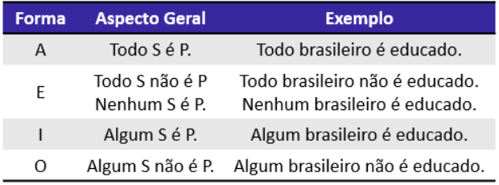

Um ponto muito importante que devemos entender é a diferença de **duas propriedades** das proposições categóricas, **a qualidade e a quantidade** . Quando falamos que uma proposição é **universal ou particular** , estamos nos referindo a propriedade **"quantidade"** . Por outro lado, quando falamos que uma proposição é **afirmativa ou negativa** , estamos nos referindo a **"qualidade"** da proposição. 

Sintetizando, em relação à quantidade, uma proposição pode ser universal ou particular e em relação à qualidade, pode ser afirmativa ou negativa. Por que saber dessas coisas é importante? **Para conseguir entender melhor como classificamos as proposições categóricas em mais quatro tipos** : 

- **Proposições contrárias:** São **proposições universais** que possuem **qualidades distintas** , isto é, todo par afirmativo-negativo de proposições universais. 

Todo marinheiro é pescador. [Forma A] Todo marinheiro não é pescador. [Forma E] 

Perceba que sempre as proposições categóricas de forma A e E serão contrárias. 

- **Proposições subcontrárias:** São **proposições particulares** que possuem **qualidades distintas** , isto é, todo par afirmativo-negativo de proposições particulares. 

Algum empresário é rico. [Forma I] Algum empresário não é rico. [Forma O] 

Note, dessa vez, que as proposições categóricas de forma I e O serão sempre subcontrárias.

---

<!-- pagina: 16 -->

**Equipe Exatas Estratégia Concursos Aula 03** 

- **Proposições subalternas:** São proposições que, apesar de **possuírem a mesma qualidade** , **diferem pela quantidade** . 

**A:** Todo estudante é preparado. **E:** Nenhum cachorro é feio **I:** Algum estudante é preparado. **O:** Algum cachorro não é feio. 

Todas as proposições categóricas de forma A e I são subalternas entre si, bem como as proposições de forma E e O. 

- **Proposições contraditórias** : São proposições que **diferem** , **simultaneamente** , **em qualidade e quantidade** . 

**A:** Todo animal é dócil. 

**E:** Nenhum jogador é amigável. 

**O:** Algum animal não é dócil. **I:** Algum jogador é amigável. 

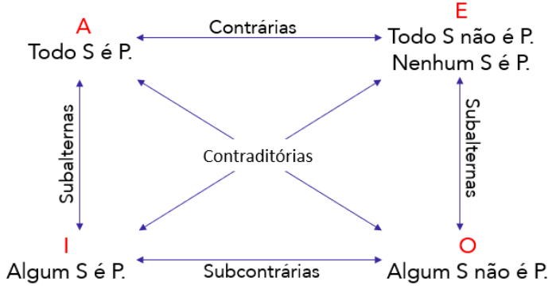

Todas essas informações são resumidas em uma estrutura muito conhecida no mundo da Lógica, essa estrutura é denominada de **<u>quadrado das oposições</u>** ou simplesmente **<u>quadrado lógico.</u>** É exatamente a imagem representada na figura acima. 

_Calma aí, professor!_ Pessoal, eu sei que essas classificações podem ser um pouco chatas! Para melhorar um pouco sua vida, te aviso que **esse não é o tema mais cobrado dentro do tópico que estamos estudando** . Pelo contrário, essas classificações costumam cair bem pouco. No entanto, como queremos gabaritar a prova, vale a pena dedicar um pouco de tempo para entendê-las. 

---

<!-- pagina: 17 -->

**Equipe Exatas Estratégia Concursos Aula 03** 

Galera, um último ponto que eu gostaria de tocar antes de finalizarmos esse tópico, é **uma equivalência bastante comum em prova** . Considere a seguinte proposição: **"Todo engenheiro é responsável."** Vocês concordam comigo que a afirmativa acima equivale a dizer: **"Se uma pessoa é engenheiro, então ela é responsável."?** Note que, **como todos os engenheiros são pessoas responsáveis, então, é correto concluir a condicional acima** . Além disso, sabemos que existem mais relações de equivalência que envolvem condicionais, lembre-se das aulas anteriores o seguinte: 

<u>𝑝⇒𝑞 ⇔ ~𝑞 ⇒~𝑝</u> 

Usando essa equivalência para reescrever a condicional citada anteriormente, ficamos com: **"Se uma pessoa não é responsável, então não é engenheiro."** Portanto, **partindo de uma única proposição categórica conseguimos reescrevê-la sob duas formas igualmente válidas.** Em algumas questões, teremos que realizar esse tipo de equivalência para podermos marcar a alternativa correta. Vamos ver na prática? 

**(MPE-BA/2017)** Considere a afirmação: “Todo baiano é um homem feliz”. Uma afirmação logicamente equivalente é: 

A) Todo homem feliz é baiano; 

B) Um homem que não é feliz não é baiano; 

C) Quem não é baiano não é feliz; 

D) Um homem é baiano ou é feliz; 

###### **Comentários:** 

**O examinador está buscando uma afirmação logicamente equivalente** . Se "Todo baiano é feliz", sabemos imediatamente que é equivalente dizer: " **se é baiano então é feliz".** Normalmente, essa equivalência imediata não é o suficiente para marcarmos a alternativa correta e devemos ir mais fundo, **revisitando a aula de Equivalências Lógicas para lembrar que:** 𝑝 ⟹𝑞 ⇔ ~𝑞 ⟹~𝑝 

Logo, **a condicional "se é baiano então é feliz" é equivalente a: "se não é feliz, então não é baiano"** . Essa conclusão está **<u>disfarçada</u>** na alternativa B: **"um homem que não é feliz, não é baiano.'** 

**Gabarito:** Letra B.

---

<!-- pagina: 18 -->

**Equipe Exatas Estratégia Concursos Aula 03** 

#### Diagramas Lógicos 

Com essa bagagem formada sobre proposições categóricas, agora vamos entrar finalmente no estudo dos diagramas lógicos. **Usamos esse tipo de diagrama para representar visualmente as proposições categóricas** . Quando fazemos isso, muitas vezes **conseguimos resolver mais facilmente determinado exercício** , pois possibilita enxergarmos situações que de outra forma não enxergaríamos. Confira alguns exemplos e como representá-los. 

###### • **Todo engenheiro é responsável.** 

Veja que podemos representar os engenheiros como um círculo menor, que está dentro de outro círculo maior, o círculo dos responsáveis. Formalmente, dizemos que os engenheiros são um subconjunto dos responsáveis. O que eu gostaria que você prestasse atenção, é que **quando falamos que "todo engenheiro é responsável", NÃO é o mesmo que dizer que "todo responsável é engenheiro"** . 

Por isso, no diagrama ao lado **, o conjunto dos engenheiros não cobre totalmente o conjunto dos responsáveis** , de modo que os responsáveis que não são engenheiros são representados pela parte fora do conjunto dos engenheiros mas ainda dentro do conjunto dos responsáveis. 

<!-- Start of picture text -->
Responsáveis <!-- End of picture text -->

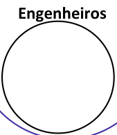

<!-- Start of picture text -->
Engenheiros <!-- End of picture text -->

###### • **Nenhum engenheiro é responsável** . 

Nesse caso, representamos os dois conjuntos totalmente separados entre si. Dessa forma, estamos mostrando que não há intersecção entre eles e que, portanto, não existe nenhum elemento de um que seja também elemento do outro. Quando existe um grupo de conjuntos que **não possuem intersecção** entre si, dizemos que esses conjuntos são **disjuntos.** 

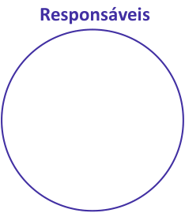

<!-- Start of picture text -->
Responsáveis <!-- End of picture text -->

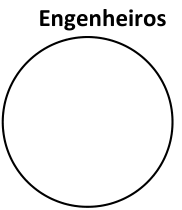

<!-- Start of picture text -->
Engenheiros <!-- End of picture text -->

###### • **Algum engenheiro é responsável** 

Quando temos uma proposição categórica de forma I, **devemos representar esse tipo de proposição com um diagrama que mostre a intersecção entre os dois conjuntos** . É exatamente essa intersecção que indicará que existe algum engenheiro que também é responsável, sendo ele, então, um **elemento comum** aos dois conjuntos. 

<!-- Start of picture text -->
Responsáveis <!-- End of picture text -->

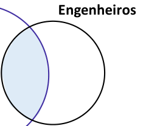

<!-- Start of picture text -->
Engenheiros <!-- End of picture text -->

---

<!-- pagina: 19 -->

**Equipe Exatas Estratégia Concursos Aula 03** 

- **Algum engenheiro não é responsável** 

É uma situação praticamente análoga a anterior. No entanto, a 

- parte do diagrama que estaremos interessados **será o conjunto dos engenheiros que não é responsável** , ou seja, a 

parte do conjunto que está fora da intersecção. Veja como fica: 

<!-- Start of picture text -->
Responsáveis <!-- End of picture text -->

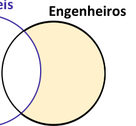

<!-- Start of picture text -->
Engenheiros <!-- End of picture text -->

**(PREF. F. VASCONCELOS/2020)** Em determinado município, alguns médicos são professores e todo professor é funcionário público. Sendo assim, é correto afirmar que 

- (A) todo funcionário público é médico. 

- (B) todo médico é funcionário público. 

- (C) não existe funcionário público que é médico. 

- (D) não existe médico que é funcionário público. 

- (E) existe funcionário público que não é médico 

###### **Comentários:** 

Você deve ter começado a perceber que a Vunesp gosta muito dessas questões. Para resolvê-la, vamos desenhar diagramas. Se **alguns médicos (M) são professores (P),** 

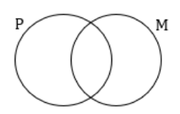

Ademais, como todo professor (P) é funcionário público (FP), temos a seguinte possibilidade de diagrama: 

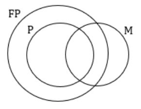

Agora, devemos analisar as alternativas.

---

<!-- pagina: 20 -->

**Equipe Exatas Estratégia Concursos Aula 03** 

###### (A) todo funcionário público é médico. 

**Alternativa incorreta.** Essa afirmativa não é necessariamente verdade. A região **<u>azul</u>** no diagrama abaixo representa **os funcionários públicos que não são médicos** . Isso contraria o que está na afirmativa. 

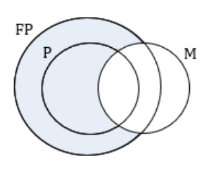

###### (B) todo médico é funcionário público. 

**Alternativa incorreta.** A região **<u>azul</u>** no diagrama abaixo representa ==5460== **médicos que não são funcionários públicos** . Sendo essa uma possibilidade, a alternativa erra ao generalizar e afirmar que todo médico é funcionário público. 

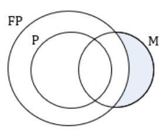

###### (C) não existe funcionário público que é médico. 

###### (D) não existe médico que é funcionário público. 

**Alternativas incorretas** . Se alguns médicos são professores e todos os professores são funcionários públicos, então **os médicos que são professores também são funcionários públicos** . Logo, existe sim funcionário público que é médico. 

###### (E) existe funcionário público que não é médico 

**Alternativa correta.** Há <u>professores que são funcionários públicos e não são médicos e</u> **até funcionários públicos que não são professores** . Observe a região azul do diagrama: 

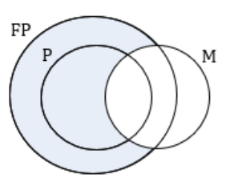

**Gabarito:** LETRA E.

---

<!-- pagina: 21 -->

**Equipe Exatas Estratégia Concursos Aula 03** 

##### Validade de Argumentos 

Pessoal, é possível também utilizar diagramas lógicos para demonstrar **a validade ou não de determinados argumentos** . Muitas vezes, os argumentos trazem uma conclusão que **não é necessariamente verdadeira** . Esse tipo de situação **pode ser identificado de imediato com o uso de diagramas** . Vamos ver um exemplo para entender melhor como essa ferramenta pode nos auxiliar na prática. 

**(PC-ES/2019)** Assinale a alternativa que apresenta um argumento lógico válido. 

- a) Todos os mamutes estão extintos e não há elefantes extintos, logo nenhum elefante é um mamute. 

- b) Todas as meninas jogam vôlei e Jonas não é uma menina, então Jonas não joga vôlei. 

- c) Em São Paulo, moram muitos retirantes e João é um retirante, logo João mora em São Paulo. 

d) Não existem policiais corruptos e Paulo não é corrupto, então Paulo é policial. 

- e) Todo bolo é de chocolate e Maria fez um bolo, logo Maria não fez um bolo de chocolate. 

###### **Comentários:** 

a) **Alternativa correta.** Se todos os mamutes estão extintos, então podemos desenhar o seguinte diagrama: 

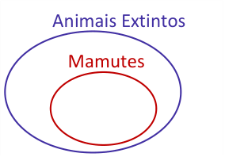

<!-- Start of picture text -->
Animais Extintos Mamutes <!-- End of picture text -->

Se não há elefantes extintos, então: 

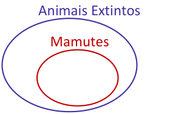

<!-- Start of picture text -->
Animais Extintos Mamutes <!-- End of picture text -->

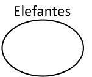

<!-- Start of picture text -->
Elefantes <!-- End of picture text -->

Observe que, de fato, nenhum elefante é mamute, pois, não há intersecção entre os diagramas. Logo, a conclusão do argumento é verdadeira, permitindo concluir que se trata de um argumento válido.

---

<!-- pagina: 22 -->

**Equipe Exatas Estratégia Concursos Aula 03** 

b) **Alternativa incorreta.** Se todas as meninas jogam vôlei, então podemos desenhar o seguinte: 

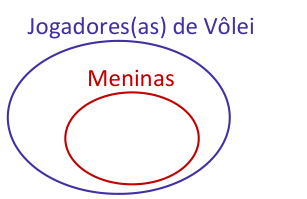

<!-- Start of picture text -->
Jogadores(as) de Vôlei Meninas <!-- End of picture text -->

Observe que existe uma região do diagrama que não é preenchido pelo conjunto das meninas. Isso significa que pode haver jogadores de vôlei que não são meninas. Logo, mesmo que Jonas não seja uma menina, ele pode ser sim um jogador de vôlei. Trata-se de um argumento inválido. 

c) **Alternativa incorreta** . Quando dizemos que "muitos retirantes vivem em São Paulo", fica implícita a ideia de que são alguns (apesar de muitos) e não a totalidade dos retirantes que vivem lá. Dessa forma, podemos usar o seguinte diagrama. 

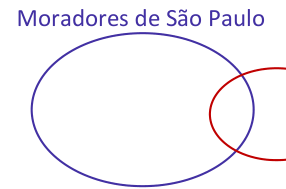

<!-- Start of picture text -->
Moradores de São Paulo <!-- End of picture text -->

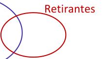

<!-- Start of picture text -->
Retirantes <!-- End of picture text -->

Com isso, não podemos concluir que João, apesar de ser retirante, mora em São Paulo. Note que há uma pequena região no diagrama dos retirantes, que não está incluída no de pessoas que moram em São Paulo. 

d) **Alternativa incorreta** . Não existem policiais corruptos. Isso pode ser representado por meio de dois conjuntos disjuntos. 

<!-- Start of picture text -->
Policiais <!-- End of picture text -->

<!-- Start of picture text -->
Policiais Corruptos <!-- End of picture text -->

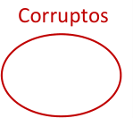

<!-- Start of picture text -->
Corruptos <!-- End of picture text -->

Se Paulo não é corrupto, isso não o torna automaticamente policial. Isso simplesmente indica que ele não está dentro do nosso conjunto laranja. Logo, a conclusão do argumento não é verdadeira. 

e) **Alternativa incorreta.** Se todo bolo é de chocolate e Maria fez um bolo, então, necessariamente, o bolo de maria é de chocolate. Por esse motivo, a alternativa encontra-se errada. **Gabarito:** LETRA A.

---

<!-- pagina: 23 -->

**Equipe Exatas Estratégia Concursos Aula 03** 

## **- QUESTÕES COMENTADAS FGV** 

#### **Proposições Quantificadas** 

**1. (FGV/CM-SP/2024) Considere a afirmação referente aos candidatos de um concurso: “Todo candidato possui curso superior ou 5 anos de experiência”. A negação lógica dessa sentença é:** 

A) Todo candidato não possui curso superior ou não possui 5 anos de experiência. 

B) Todo candidato não possui curso superior e não possui 5 anos de experiência. 

C) Há candidato que não possui curso superior ou não possui 5 anos de experiência. 

D) Há candidato que possui curso superior, mas não possui 5 anos de experiência. 

E) Há candidato que não possui curso superior e não possui 5 anos de experiência. 

###### **Comentários:** 

Temos uma proposição categórica e queremos negá-la. Para realizar essa tarefa, devemos substituir o tipo de quantificador (no caso, **um quantificador universal por um existencial** ) e **<u>negar o predicado</u>** . Ademais, quando temos duas proposições categóricas conectadas por um "ou", usamos a lei de De Morgan e **substituímos o "ou" pelo "e"** . Vamos fazer isso para a proposição do enunciado. 

###### **“Todo candidato possui curso superior ou 5 anos de experiência”** 

###### **Negação:** 

**Há** candidato que **<u>não</u>** possui curso superior **<u>e não</u>** possui 5 anos de experiência. 

###### **Gabarito:** LETRA E. 

**2. (FGV/ALE-TO/2024) Considere a seguinte proposição condicional: Se todos os alunos da Escola Aristarco gostam de matemática, então, ao menos um deles ganha medalha na Olimpíada Nacional de Matemática. Se essa proposição é verdadeira, é correto afirmar que** 

A) se nenhum dos alunos da Escola Aristarco gosta de Matemática, então nenhum deles ganha medalha na Olimpíada Nacional de Matemática. 

B) se todos os alunos da Escola Aristarco ganham medalha na Olimpíada Nacional de Matemática, então, todos esses alunos gostam de Matemática. 

C) se algum aluno da Escola Aristarco ganha medalha na Olimpíada Nacional de Matemática, então todos esses alunos gostam de Matemática. 

D) se nenhum aluno da Escola Aristarco ganha medalha na Olimpíada Nacional de Matemática, então nenhum desses alunos gosta de Matemática. 

E) se nenhum aluno da Escola Aristarco ganha medalha na Olimpíada Nacional de Matemática, então algum desses alunos não gosta de Matemática.

---

<!-- pagina: 24 -->

**Equipe Exatas Estratégia Concursos Aula 03** 

###### **Comentários:** 

A proposição condicional dada é da forma P -> Q, onde **P é "todos os alunos da Escola Aristarco gostam de matemática"** e **Q é "ao menos um deles ganha medalha na Olimpíada Nacional de Matemática"** . Para encontrarmos uma alternativa correta, podemos buscar por **¬Q -> ¬P** , que sabemos ser **<u>equivalente</u>** <u>. Para</u> isso, precisamos negar as proposições quantificadas P e Q. 

- P: **todos** os alunos da Escola Aristarco gostam de matemática; 

- ¬P: **<u>algum</u>** aluno da Escola Aristarco **não** gosta de matemática. 

- Q: **Ao menos um** deles ganha medalha na Olimpíada Nacional de Matemática; 

- ¬Q: **<u>Nenhum</u>** deles ganha medalha na Olimpíada Nacional de Matemática. 

Portanto, é correto afirmar que: 

_Se_ **_nenhum deles ganha medalha na Olimpíada Nacional de Matemática_** _, então_ **_algum aluno da Escola Aristarco não gosta de matemática_** _._ 

A alternativa que trouxe corretamente essa proposição foi a E. 

**Gabarito:** LETRA E. 

**3. (FGV/TCE-BA/2023) O entrevistador da PNAD (Pesquisa Nacional por Amostra de Domicílios) está fazendo a entrevista com o sr. João:** 

###### **Entrevistador: Quantos filhos maiores de 18 anos o senhor tem?** 

**Sr. João: Três.** 

###### **Entrevistador: Todos trabalham?** 

**Sr. João: Não.** 

**A partir do diálogo acima é correto concluir que:** 

- A)   nenhum dos filhos de João trabalha; 

- B)   os três filhos de João estudam; 

- C)   pelo menos um filho de João estuda; 

- D)  pelo menos um filho de João não trabalha; 

- E)   apenas um filho de João não trabalha. 

###### **Comentários:** 

Pessoal, vamos ser bem diretos nessa questão. 

De acordo com a entrevista, concluímos que **não é verdade** que todos os filhos de João trabalham. Sendo assim, temos que **negar** essa proposição quantificada para obtermos uma informação verdadeira.

---

<!-- pagina: 25 -->

**Equipe Exatas Estratégia Concursos Aula 03** 

Na negação de uma proposição quantificada, **substituímos o quantificador e negamos o predicado** . 

- p: **<u>Todos</u>** os filhos de João **trabalham** .                         (Falso) 

- ¬p: **<u>Pelo menos um</u>** dos filhos de João **<u>não trabalha</u>** . (Verdadeiro) 

###### **Gabarito:** LETRA D. 

**4. (FGV/AGENERSA/2023) Três candidatos candidataram-se para o preenchimento de uma vaga em certo cargo de uma empresa. No processo de seleção, um diretor afirmou:** 

**“Todos os candidatos têm mais de 25 anos.”** 

**Considerando que essa afirmação é falsa, é correto concluir que** 

A) Um dos candidatos tem 25 anos. 

- B) Todos os candidatos têm menos de 25 anos. 

- C) Todos os candidatos têm 25 anos ou menos. 

- D) Exatamente um candidato tem 25 anos ou menos. 

- E) Pelo menos um candidato tem 25 anos ou menos. 

###### **Comentários:** 

Precisamos **negar a afirmação** . Para isso, devemos substituir o quantificador e negar o predicado. 

<!-- Start of picture text -->
Predicado <!-- End of picture text -->

**<u>Todos</u>** os candidatos **<u>têm mais de 25 anos</u>** <u>.</u> 

Quantificador Universal 

Observe que a única alternativa que trouxe um quantificador existencial foi a alternativa E. Portanto, será nossa candidata preferida. O quantificador existencial escolhido foi "pelo menos um". 

<!-- Start of picture text -->
Predicado Negado <!-- End of picture text -->

<!-- Start of picture text -->
Quantificador Existencial <!-- End of picture text -->

Quantificador **<u>Pelo menos um</u>** candidato **<u>não tem mais de 25 anos</u>** <u>.</u> Existencial 

Como pelo menos um candidato não tem mais de 25 anos, podemos dizer que ele tem 25 anos ou menos. A FGV gosta de "mudar o predicado", colocando um **semanticamente equivalente** . É preciso ficar atento! 

Predicado Negado 

<!-- Start of picture text -->
Quantificador Existencial <!-- End of picture text -->

> Quantificador **<u>Pelo menos um</u>** candidato **<u>tem 25 anos ou menos</u>** <u>.</u> Existencial 

**Gabarito:** LETRA E.

---

<!-- pagina: 26 -->

**Equipe Exatas Estratégia Concursos Aula 03** 

###### **5. (FGV/PM-SP/2023) Considere a seguinte afirmação:** 

**“Todas as pessoas apreendidas têm 21 anos ou mais e são do sexo masculino.”** 

###### **A negação dessa afirmação é:** 

A) Nenhuma pessoa apreendida tem 21 anos ou mais ou é do sexo masculino. 

B) Nenhuma pessoa apreendida tem 21 anos ou mais e é do sexo masculino. 

C) Pelo menos uma das pessoas apreendidas tem menos de 21 anos e é do sexo feminino. 

D) Pelo menos uma das pessoas apreendidas tem menos de 21 anos ou é do sexo feminino. 

###### **Comentários:** 

Temos duas proposições no enunciado, vamos explicitá-las. 

Conectivo 

- “Todas as pessoas (...) têm 21 anos ou mais **e** (todas as pessoas) são do sexo masculino.” 

1ª Proposição Quantificada 2ª Proposição Quantificada 

Com isso, precisaremos negar cada uma das proposições quantificadas e trocar o conectivo "e" por "ou". Lembre-se de De Morgan! Para negar proposições universais, **devemos substituir o quantificador universal por um quantificador existencial** . 

Quando observamos as alternativas, percebemos que o quantificador escolhido foi o "pelo menos uma". Ao juntar esse fato com a negação do predicado e a troca conectivo: 

1ª Proposição Quantificada Negada 

Pelo menos uma das pessoas apreendidas não tem 21 anos ou mais 

**ou** Troca de Conectivo 

_(Pelo menos uma das pessoas)_ <u>não são do sexo masculino.</u> 

2ª Proposição Quantificada Negada 

Ora, se ela não tem 21 anos ou mais, então podemos dizer que **ela tem menos de 21 anos** . Da mesma forma, se ela não é do sexo masculino, podemos dizer que **ela é do sexo feminino** . Logo, podemos reescrever: 

###### **Pelo menos uma** das pessoas apreendidas **tem menos de 21 anos** ou **é do sexo feminino** . 

**Gabarito:** LETRA D. 

**6. (FGV/SEFAZ-ES/2022) A negação de “Nenhuma cobra voa” é**

---

<!-- pagina: 27 -->

**Equipe Exatas Estratégia Concursos Aula 03** 

- A) Pelo menos uma cobra voa. 

- B) Alguns animais que voam são cobras. 

- C) Todas as cobras voam. 

- D) Todos os animais que voam são cobras. 

- E) Todas as cobras são répteis. 

###### **Comentários:** 

Pessoal, de um jeito mais técnico, " **nenhuma cobra voa" é uma proposição universal negativa** . Para negála, podemos simplesmente **substituir o quantificador "nenhum" por "pelo menos uma" ou "alguma** ". 

###### _Professor, mas não vamos ter que negar o predicado?_ 

Nessa situação, não precisa! Lembre-se que: " **nenhuma** cobra voa" = " **toda** cobra **não** voa". 

Ou seja, o quantificador "nenhum" já engloba a ideia de "todo (a) ... não ...". Logo, quando substituímos 

"nenhum" por "pelo menos um", **<u>automaticamente já estamos negando o predicado</u>** . _Tudo bem?!_ 

###### Sendo assim, **o gabarito é a letra A.** 

De um jeito mais simples, poderíamos também fazer uma análise das alternativas. De imediato, é possível eliminar as letras "B", "D" e "E", pois **<u>vão além do que a proposição original trouxe</u>** , falando de "animais" e "répteis". Com isso, ficaríamos na dúvida entre as letras "A" e "C". 

É **muito comum** questões desse tipo, que tentam nos confundir ao afirmar que a negação de "nenhum(a)" é "todo(a)" ou vice-versa. Isso **<u>não</u>** é verdade! **Cuidado aqui, moçada!** 

Se você fala para alguém que nenhuma cobra voa, basta existir **pelo menos uma cobra que voe** e esse alguém já poderá chamá-lo de mentiroso ( **<u>negar sua afirmativa</u>** ). (rsrs) 

###### **Gabarito:** LETRA A. 

**7. (FGV/PM-AM/2022) Considere a afirmação: “Nenhum soldado escuta mal”. A sua negação é:** 

A) Há pelo menos um soldado que escuta mal. 

B) Vários soldados escutam mal. 

C) Todos os soldados escutam mal. 

- D) Todos os soldados escutam bem. 

- E) Todas as pessoas que escutam bem são soldados. 

###### **Comentários:** 

A FGV está trazendo bastante questões com o quantificador "nenhum".

---

<!-- pagina: 28 -->

**Equipe Exatas Estratégia Concursos Aula 03** 

Pessoal, lembre-se sempre que para negar uma proposição que traga o quantificador "nenhum", basta **substituí-lo por "pelo menos um" ou "algum".** Sendo assim, a negação de " **<u>nenhum</u>** soldado escuta mal" é " **<u>pelo menos um</u>** soldado escuta mal". Não precisamos alterar o predicado nessa situação. 

Quando olhamos para as alternativas, vemos que a letra A é a correta. 

_Obs.: Não há problema algum em acrescentar o "há" ou o "existe", pois o sentido continua o mesmo_ . 

###### **Gabarito:** LETRA A. 

**8. (FGV/SEFAZ-AM/2022) O diretor de uma empresa fez ao funcionário Miguel, do departamento financeiro, uma pergunta que foi prontamente respondida:** 

**Diretor: — João disse que todos os funcionários receberam gratificação.** 

**Miguel: — Não é verdade o que João disse.** 

###### **Se o diretor considerou que Miguel falou a verdade, é correto concluir que** 

A) pelo menos um funcionário não recebeu gratificação. 

B) nenhum funcionário recebeu gratificação. 

C) um único funcionário não recebeu gratificação. 

D) mais da metade dos funcionários não receberam gratificação. 

E) somente um funcionário recebeu gratificação. 

###### **Comentários:** 

Vamos lá, moçada! João disse o seguinte: 

"Todos os funcionários receberam gratificação." 

Trata-se de uma **proposição quantificada universal afirmativa** . De acordo com o enunciado, João não disse a verdade. Logo, a proposição é falsa. Para obtermos uma conclusão correta a partir dela, **devemos negá-la** . Nesse intuito, vamos **substituir o quantificador** universal "todo" por um quantificador existencial como "pelo menos um". Além disso, devemos **negar o predicado** . Observe como fica a proposição! 

p: " **Todos** os funcionários **receberam gratificação.** " 

(F) 

¬p: " **Pelo menos um** funcionário **<u>não recebeu gratificação</u>** ."            (V) 

Lembre-se que temos que fazer os ajustes no português, para adequação dos plurais, principalmente. 

**Gabarito:** LETRA A.

---

<!-- pagina: 29 -->

**Equipe Exatas Estratégia Concursos Aula 03** 

###### **9. (FGV/SEFAZ-AM/2022) Considere as afirmativas:** 

- **Alguns homens gostam de ler.** 

- **Quem gosta de ler vai à livraria.** 

###### **A partir dessas afirmativas é correto concluir que:** 

A) Todos os homens vão à livraria. 

B) Mulheres não gostam de ler. 

- C) Quem vai à livraria gosta de ler. 

- D) Se um homem não vai à livraria então não gosta de ler. 

E) Quem não gosta de ler não vai à livraria. 

###### **Comentários:** 

Nessa questão, vamos comentar alternativa por alternativa! 

###### A) Todos os homens vão à livraria. 

**Errado.** O enunciado disse que apenas alguns homens gostam de ler. Esses homens que gostam de ler, com certeza vão a livraria (pois quem gosta de ler vai à livraria). No entanto, **não podemos afirmar nada sobre aqueles que não gostam de ler** . 

B) Mulheres não gostam de ler. 

**Errado.** Em nenhum momento a questão falou sobre as mulheres. 

C) Quem vai à livraria gosta de ler. 

**Errado.** Isso não é **<u>necessariamente</u>** verdade. O enunciado apenas informou que quem gosta de ler vai a livraria. No entanto, isso não é suficiente para concluirmos o inverso. 

D) Se um homem não vai à livraria então não gosta de ler. 

**Correto.** É o nosso gabarito. A proposição "Quem gosta de ler vai à livraria" pode ser vista como uma condicional "implícita": **"Se gosta de ler, então vai à livraria".** Com isso em mente, lembre-se do que foi visto na aula de Equivalências Lógicas: 

𝑝⇒𝑞 ≡~𝑞⇒~𝑝 

Dessa forma, uma proposição equivalente a condicional acima seria **"Se não vai a livraria, então não gosta de ler"** , conforma aponta a alternativa. 

###### E) Quem não gosta de ler não vai à livraria. 

**Errado.** Observe que **o examinador reescreveu a alternativa C** , mas usando a **equivalência da condicional** vista acima. Sendo assim, a alternativa continua errada. 

###### **Gabarito:** LETRA D.

---

<!-- pagina: 30 -->

**Equipe Exatas Estratégia Concursos Aula 03** 

###### **10. (FGV/SEFAZ-BA/2022) Considere a afirmação:** 

###### **“À noite, todos os gatos são pretos.”** 

###### **Se essa frase é falsa, é correto concluir que** 

A) De dia, todos os gatos são pretos. 

B) À noite, todos os gatos são brancos. 

C) De dia há gatos que não são pretos. 

D) À noite há, pelo menos, um gato que não é preto. 

E) À noite nenhum gato é preto. 

###### **Comentários:** 

Questão bem legal! Trata-se de uma proposição categórica. Para negá-la, devemos substituir o quantificador 

e negar o predicado. Sendo assim, **não vamos nem olhar para o que não for quantificador ou predicado** . 

###### p: "À noite, **<u>todos</u>** os gatos **<u>são pretos</u>** ." 

- ¬p: "À noite, **há, pelo menos, um** gato que **não é preto.** " 

Perceba, pessoal, que para negar a proposição, não precisamos transformar "à noite" em "de dia". 

Quando você visualizar esse tipo de proposição em sua prova, foque em **substituir o quantificador** e **negar o predicado** . Na nossa questão, temos um quantificador universal: "todos". Devemos substituí-lo por um quantificador existencial: "algum", "pelo menos um", "existe". 

_Professor, como saber qual quantificador usar?_ Olhe para as alternativas!!! Dê uma olhada qual quantificador o examinador usará. Assim, é só substituir por ele. 

Ademais, o predicado da proposição dada é: "são pretos". Sua negação é: "não são pretos". 

Como devemos ajustar a concordância também, ficamos com: **"não é preto."** 

###### **Gabarito:** LETRA D. 

**11. (FGV/IBGE/2022) No censo de 2010 Laura foi entrevistada pelo recenseador Mário.** 

###### **Início da entrevista:** 

**Mário – Quantas pessoas moram nesta casa?** 

**Laura – Quatro: eu, que me chamo Laura, meu marido João e meus dois filhos Alberto e Roberto Mário – Todos trabalham?** 

**Laura – Não.**

---

<!-- pagina: 31 -->

**Equipe Exatas Estratégia Concursos Aula 03** 

###### **É correto concluir que:** 

- A) nenhuma das quatro pessoas trabalha. 

- B) apenas uma das quatro pessoas não trabalha. 

- C) apenas uma das quatro pessoas trabalha. 

- D) pelo menos uma das quatro pessoas não trabalha. 

- E) nenhuma das quatro pessoas possui emprego formal, com carteira assinada. 

###### **Comentários:** 

- "Todos trabalham" é uma **proposição quantificada** e sabemos que **ela é falsa** . 

Para obtermos uma proposição verdadeira, **devemos negá-la** . 

<!-- Start of picture text -->
==5460== <!-- End of picture text -->

Nesse intuito, é preciso trocar o quantificador e negar o predicado. 

p: " **<u>Todos</u>** trabalham" (F) ¬p: " **Pelo menos um não** trabalha." (V) 

Note que a alternativa que trouxe essa ideia foi a D. 

###### **Gabarito:** LETRA D. 

**12. (FGV/IBGE/2022) A negação lógica da sentença “Toda cobra é verde ou venenosa” é:** 

A) Nenhuma cobra é verde ou venenosa. 

- B) Toda cobra não é verde ou não é venenosa. 

- C) Existe cobra que não é verde nem é venenosa. 

- D) Toda cobra verde não é venenosa. 

- E) Nenhuma cobra venenosa é verde. 

###### **Comentários:** 

Para resolver esse exercícios, precisaríamos lembrar das **Leis de De Morgan** . Observe **a presença do conectivo "ou".** Na grande maioria dos casos e no contexto das proposições lógicas, sempre que precisamos negar uma proposição com "ou", deveremos **substituir esse conectivo pelo "e"** . Com isso, já eliminamos as alternativas A e B. 

Além disso, a presença do "toda" nos remete a negação das proposições quantificadas. Nessa situação, **é preciso substituir o quantificador universal por um existencial** , além de negar o predicado. Com essa informação, também poderíamos eliminar as alternativas D e E, pois as duas apresentam quantificadores universais. Dito tudo isso, vamos negar a sentença!

---

<!-- pagina: 32 -->

**Equipe Exatas Estratégia Concursos Aula 03** 

- p: **Toda** cobra **é verde** ou **venenosa** . 

- ¬p: **Existe** cobra que **<u>não é verde</u>** e **<u>não é venenosa</u>** . 

Observe que na alternativa C, **o examinador preferiu usar o "nem" no lugar do "e não"** . Não há problema nisso, pois são expressões equivalentes. Tudo bem? 

###### **Gabarito:** LETRA C. 

###### **13. (FGV/IMBEL/2021) Considere verdadeira a afirmação:** 

**“Todo vegetal verde é saudável.”** 

###### **É correto concluir que:** 

A) Todo vegetal saudável é verde. 

B) Todo vegetal que não é saudável não é verde. 

C) Todo vegetal que não é verde não é saudável. 

- D) Alguns vegetais verdes não são saudáveis. 

- E) Alguns vegetais que não são saudáveis são verdes. 

###### **Comentários:** 

Essa aula envolve bastante as **equivalências lógicas** . Por isso, é preciso que você esteja afiado nelas! 

Nessa questão, observe que podemos escrever a afirmação na forma da seguinte **condicional** : 

"Se o vegetal é verde, então é saudável." 

Ao escrever dessa forma, podemos usar uma das **equivalências para a condicional** : 𝑝⇒𝑞 ≡~𝑞⇒~𝑝 

Revisado esse ponto, podemos escrever: 

"Se o vegetal não é saudável, então não é verde." 

###### ou, de uma **forma diferente** <u>:</u> 

"Todo vegetal que não é saudável não é verde." 

Guardem isso: é possível transformar expressões do tipo **"Todo A é B"** na condicional **"Se é A, então é B"** . Algumas bancas gostam de explorar isso! Fiquem atentos! 

**Gabarito:** LETRA B. 

###### **14. (FGV/FUNSAÚDE-CE/2021) Considere a sentença:**

---

<!-- pagina: 33 -->

**Equipe Exatas Estratégia Concursos Aula 03** 

###### **“Todo urso branco é amigo da onça.”** 

###### **A negação lógica dessa sentença é:** 

A) Nenhum urso branco é amigo da onça. 

B) Algum urso branco não é amigo da onça. 

C) Todo urso marrom é amigo da onça. 

- D) Nenhuma onça é amiga de urso branco. 

- E) Algum urso não é branco e é amigo da onça. 

###### **Comentários:** 

Opa! Mais uma questão em que devemos negar uma proposição categórica! 

###### Lembre-se dos passos: **substituímos o quantificador** e **negamos o predicado** . 

Temos uma proposição universal afirmativa. Logo, sua negação será uma **proposição particular negativa** . 

As únicas alternativas que contêm proposições particulares são as alternativas 𝐵 e 𝐸 (observe o quantificador existencial "algum" que caracteriza esse tipo de proposição). 

**"** O predicado da sentença é: **"é amigo da onça".** A negação desse predicado fica: **<u>não é amigo da onça"</u>** . 

Com isso, conseguimos marcar a **alternativa B** . 

###### **Gabarito:** LETRA B. 

###### **15. (FGV/FUNSAÚDE-CE/2021) O advogado de uma empresa afirmou ao diretor que:** 

**“Todos os processos relativos à empresa X foram finalizados”** 

###### **Dias depois, o diretor foi informado que essa afirmação não era verdadeira. O diretor concluiu logicamente** 

###### **que** 

A) nenhum processo da empresa X foi finalizado. 

B) somente um processo da empresa X não foi finalizado. 

C) pelo menos um processo da empresa X não foi finalizado. 

D) foi finalizado pelo menos um processo que não se refere à empresa X. 

E) todos os processos finalizados não se referiam à empresa X. 

###### **Comentários:**

---

<!-- pagina: 34 -->

**Equipe Exatas Estratégia Concursos Aula 03** 

Para obter uma conclusão logicamente verdadeira, devemos negar a afirmação do advogado. Como estamos lidando com uma proposição universal afirmativa, **sua negação será uma proposição particular negativa** . Na prática, substituímos o quantificador existencial "todos" por um quantificador existencial tal como **"existe", "pelo menos um", "algum".** Além disso, **negamos o predicado** . Vejamos como vai ficar! 

p: **Todos** os processos relativos à empresa X **foram finalizados** . 

¬p: **Pelo menos um** processo da empresa X **<u>não foi finalizado</u>** . 

**Gabarito:** LETRA C. 

**16. (FGV/FUNSAÚDE-CE/2021) Um dos diretores de certo hospital, falando sobre as enfermeiras que lá trabalham disse:** 

**“Todas as enfermeiras são formadas pela UFC.”** 

###### **Sabendo que essa afirmação não é verdadeira, é correto concluir que** 

A) nenhuma enfermeira é formada pela UFC. 

B) nenhuma enfermeira é formada. 

C) alguma enfermeira é formada na Unifor. 

D) há, pelo menos, uma enfermeira que não é formada na UFC. 

E) há, pelo menos, uma enfermeira que não é formada. 

###### **Comentários:** 

Para concluir corretamente sobre uma afirmação que não é verdadeira, **devemos negá-la** . 

A questão trouxe uma proposição quantificada universal positiva. 

Sendo assim, sabemos que a sua negação será uma proposição quantificada particular negativa. 

É válido observar que as alternativas A e B são proposições quantificadas **universais negativas** . 

Por sua vez, a alternativa C é uma **particular positiva.** 

Apenas as alternativas D e E apresentam proposições **particulares negativas** . Sabemos que para negar uma proposição quantificada, substituímos o quantificador e negamos o predicado. 

###### p: **Todas** as enfermeiras **são formadas pela UFC** . 

- ¬p: **Pelo menos uma** enfermeira **<u>não é formada na UFC</u>** . 

**Gabarito:** LETRA D.

---

<!-- pagina: 35 -->

**Equipe Exatas Estratégia Concursos Aula 03** 

###### **17. (FGV/PREF. PAULÍNIA/2021) Considere a sentença:** 

**“Todo advogado é bom orador.”** 

###### **A negação lógica dessa sentença é:** 

A) Nenhum advogado é bom orador. 

B) Todo bom orador é advogado. 

C) Nenhum bom orador é advogado. 

- D) Algum advogado não é bom orador. 

E) Algum bom orador não é advogado. 

###### **Comentários:** 

Mais uma vez, observe que temos uma proposição **universal afirmativa** . A FGV parece gostar bastante dela! 

###### Lembre-se que **a negação desse tipo de proposição será uma particular negativa** <u>.</u> 

Dentre as alternativas apresentadas, apenas as alternativas D e E são particulares negativas. 

Para negar a proposição da questão, **substituímos o quantificador universal por um existencial.** 

Ademais, não esqueça de **negar o predicado** . 

p: **Todo** advogado **é bom orador** . 

¬p: **Algum** advogado **<u>não é bom orador</u>** . 

###### **Gabarito:** LETRA D. 

**18. (FGV/PREF. SALVADOR/2019) Se não é verdade que “Todo soteronito é soteronoso”, então é correto** 

###### **afirmar que** 

a) “Nenhum soteronito é soteronoso”. 

b) “Todo soteronoso é soteronito”. 

c) “Algum soteronito não é soteronoso”. 

d) “Algum soteronoso não é soteronito”. 

e) “Algum soteronito é soteronoso”. 

###### **Comentários:** 

Temos uma proposição categórica **universal afirmativa** . Devemos lembrar que sua negação deve ser uma **particular negativa** . Para transformá-la, precisamos **substituir o quantificador universal** _("todo")_ , por um quantificador existencial _("algum", "pelo menos um", "existe")._ Além disso, **é preciso negar o predicado** . Para a questão em tela, **o predicado é "é soteronoso"** . Logo, sua negação fica **"não é soteronoso"** . Organizando essas informações, ficamos com:

---

<!-- pagina: 36 -->

**Equipe Exatas Estratégia Concursos Aula 03** 

###### p: " **Todo** soteronito **é soteronoso."** 

- ¬p: " **Algum** soteronito **<u>não é soteronoso</u>** ." 

###### **Gabarito:** LETRA C. 

**19. (FGV/IBGE/2019) João, o dono da casa, atende Célio, o recenseador. Início da entrevista:** 

**Célio – Quantas pessoas moram nesta casa?** 

**João – Três: eu, que me chamo João, minha esposa Maria e meu primo Pedro.** 

**Célio – Todos trabalham?** 

**João – Não.** 

###### **É correto concluir que:** 

- a) nenhuma das três pessoas trabalha; 

- b) apenas uma das três pessoas não trabalha; 

- c) apenas uma das três pessoas trabalha; 

- d) pelo menos uma das três pessoas não trabalha; 

- e) nenhuma das três pessoas possui emprego formal, com carteira assinada. 

###### **Comentários:** 

Galera, essa é uma questão que envolve o que vimos na aula **de uma forma mais contextualizada** . Quando João afirma que não são todos que trabalham, então **basta uma única pessoa não trabalhar** para que isso seja verdade. Logo, a alternativa correta é aquela que diz que pelo menos uma das três pessoas não trabalha. Pode ser uma, pode ser duas, pode ser até que as três pessoas estejam desempregadas. 

###### **Gabarito:** LETRA D. 

**20. (FGV/PREF. DE SALVADOR-BA/2019) Considere a afirmação:** 

###### **"Todo estudante que gosta de Matemática também gosta de Ciências Biológicas."** 

###### **Considerando que essa sentença é falsa, é correto concluir que:** 

A) "Todo estudante que não gosta de Matemática gosta de Ciências Biológicas." 

B) "Nenhum estudante que gosta de Matemática também gosta de Ciências Biológicas." 

C) "Todo estudante que gosta de Matemática não gosta de Ciências Biológicas." 

D) “Algum estudante que gosta de Matemática não gosta de Ciências Biológicas." 

E) “Algum estudante que não gosta de Matemática gosta de Ciências Biológicas.” 

###### **Comentários:**

---

<!-- pagina: 37 -->

**Equipe Exatas Estratégia Concursos Aula 03** 

Sabemos que **a afirmação dada é falsa** , a sua negação, portanto, será uma sentença verdadeira. Lembre-se que para negar uma sentença com o quantificador universal "todo", **devemos substituí-lo por uma com o quantificador existencial** "pelo menos um", "existe", "algum". Além disso, <u>nega-se o predicado. Das</u> alternativas, percebemos que o quantificador existencial escolhido foi "algum". Ficamos então com: 

p: Todo estudante que gosta de Matemática também gosta de Ciências Biológicas. (F) ~p: **<u>Algum</u>** estudante que gosta de Matemática **<u>não gosta</u>** de Ciências Biológicas. (V) 

###### **Gabarito:** LETRA D. 

**21. (FGV/MPE-AL/2018) Considere a afirmação: “Existem insetos que não são pretos”. Se essa afirmação é falsa, então é verdade que:** 

- A) nenhum inseto é preto. 

- B) todo inseto é preto. 

- C) todos os animais pretos são insetos. 

- D) nenhum animal preto é inseto. 

- E) nem todos os insetos são pretos. 

###### **Comentários:** 

<u>Se a afirmação fornecida é falsa, a sua negação será uma sentença verdadeira. Para negar a expressão,</u> devemos substituir o quantificador existencial por um quantificador universal. Além disso, devemos negar o predicado. Lembre-se: 

**Quantificadores existenciais:** "existe", "pelo menos um", "algum"; 

**Quantificadores universais:** "todo(s)", "toda(s)", "qualquer". 

p: Existem insetos que não são pretos. (F) ~p: **<u>Todo</u>** inseto **<u>é</u>** preto. (V) 

###### **Gabarito:** LETRA B. 

**22. (FGV/CGM Niterói/2018) A negação de “Nenhum analista é magro” é** 

a) “Há pelo menos um analista magro”. 

- b) “Alguns magros são analistas”. 

c) “Todos os analistas são magros”. 

- d) “Todos os magros são analistas”. 

- e) “Todos os analistas não são magros”. 

###### **Comentários:**

---

<!-- pagina: 38 -->

**Equipe Exatas Estratégia Concursos Aula 03** 

Temos uma proposição categórica **universal negativa** . Para negá-la, devemos transformá-la em uma **particular afirmativa** . Nesse intuito, devemos substituir o quantificador universal ("nenhum") por um quantificador existencial ("algum", "há pelo menos um", "existe"). 

Pessoal, **nessas situações não precisamos negar o predicado** , pois quando substituímos "nenhum" por "algum/existe/há pelo menos um", **<u>implicitamente</u>** também estamos transformando o predicado, pois, lembre-se que "nenhum" = "todo ... não ...". Sendo assim, quando organizamos essas informações todas, ficamos com: 

###### p: " **Nenhum** analista é magro." 

- ¬p: " **Há pelo menos um** analista é magro." 

###### **Gabarito:** LETRA A. 

**23. (FGV/TJ-SC/2018) Considere a sentença: “Todo catarinense gosta de camarão ou é torcedor do Figueirense”. A negação lógica da sentença dada é:** 

a) Nenhum catarinense gosta de camarão ou é torcedor do Figueirense; 

b) Todo catarinense gosta de camarão, mas não é torcedor do Figueirense; 

c) Todo catarinense não gosta de camarão e não é torcedor do Figueirense; 

d) Algum catarinense não gosta de camarão e não é torcedor do Figueirense; 

e) Algum catarinense não gosta de camarão ou não é torcedor do Figueirense. 

###### **Comentários:** 

Temos que negar duas proposições que estão ligadas por uma disjunção ("ou"). Nessas situações, deveremos lembrar da lei de De Morgan que diz que além de **negar as proposições individualmente** , devemos **substituir a disjunção pela conjunção** . Matematicamente, ¬(𝑝∨𝑞) ≡¬𝑝∧¬𝑞 . 

Note que, ao lembrar disso, **_podemos eliminar as alternativas A, B e E_** . Ficamos apenas entre as letras C e D. Aumentamos as chances de acertar para 50%. Ademais, se você lembrar que, ao negar uma proposição quantificada, **precisamos substituir o quantificador** . Então, você já acertaria a questão, marcando a letra D (a letra C **<u>manteve</u>** o quantificador "todo"). 

Dito isso, vamos aos detalhes. Temos a seguinte afirmação que devemos negar: 

**“Todo catarinense gosta de camarão ou é torcedor do Figueirense”** 

Podemos reescrevê-la assim: 

- **“Todo catarinense gosta de camarão ou todo catarinense é torcedor do Figueirense”**

---

<!-- pagina: 39 -->

**Equipe Exatas Estratégia Concursos Aula 03** 

São duas proposições quantificadas e precisamos negá-las. Para isso, lembre-se de **substituir o quantificador** universal "todo", por um quantificador existencial como "algum". Além disso, **precisamos negar o predicado** . 

O predicado da primeira é _"gosta de camarão"_ , ao negá-lo, ficamos com _"_ **_<u>não</u>_** _gosta de camarão"_ . Na segunda proposição, temos o predicado _"é torcedor do Figueirense"_ , ao negá-lo, ficamos com _"não é torcedor do Figueirense"_ . Como temos uma disjunção, **não podemos esquecer de substituir "ou" por "e"** . Assim, 

- " **<u>Algum catarinense não gosta de camarão</u> e** **<u>algum catarinense não é torcedor do Figueirense</u>** " 

**Para não ser repetitivo** , o enunciado simplifica e escrever apenas como: 

"Algum catarinense não gosta de camarão e não é torcedor do Figueirense" 

###### **Gabarito:** LETRA D. 

###### **24. (FGV/ALE-RO/2018) Considere verdadeira a afirmação:** 

**“Todo parlamentar conhece bem a Constituição”.** 

###### **É correto concluir que** 

a) “Se uma pessoa conhece bem a Constituição então é parlamentar.” 

b) “Se uma pessoa não é um parlamentar então não conhece bem a Constituição.” 

c) “Se uma pessoa não conhece bem a constituição então não é parlamentar.” 

d) “Existe um parlamentar que não conhece bem a Constituição.” 

e) “Não existe pessoa que conheça bem a Constituição e não seja parlamentar.” 

###### **Comentários:** 

Pessoal, essa é uma questão que merece bastante cuidado. **Ela não quer a negação da afirmativa dada.** Algum aluno que esteja bem acostumado a ver as questões sempre pedindo para negar, pode correr e marcar a letra D (que é a negação) e vai errar. A questão **quer uma afirmação equivalente** , algo que seja possível concluir sabendo que o que foi dado é verdadeiro. 

Na teoria, nos vimos que **algumas proposições quantificadas podem ser escritas como condicionais** . No caso em tela, temos que "todo parlamentar conhece bem a Constituição" pode ser escrita na forma **_"se é parlamentar, então conhece bem a Constituição"_** . Concorda?! Sendo assim, podemos usar a equivalência 𝑝⇒𝑞≡¬𝑞 ⇒¬𝑝 para reescrever a condição de uma outra forma. Ao fazer isso, ficamos com **_"se não conhece bem a Constituição, então não é parlamentar"._** É o que temos na alternativa C. 

###### **Gabarito:** LETRA C.

---

<!-- pagina: 40 -->

**Equipe Exatas Estratégia Concursos Aula 03** 

###### **25. (FGV/COMPESA/2018) Considere a sentença a seguir.** 

**“Todo pernambucano gosta de peixe e torce pelo Náutico.”** 

###### **A negação lógica da sentença dada é** 

a) “Nenhum pernambucano gosta de peixe e torce pelo Náutico.” 

- b) “Todo pernambucano não gosta de peixe e não torce pelo Náutico.” 

- c) “Algum pernambucano não gosta de peixe e não torce pelo Náutico.” 

- d) “Algum pernambucano não gosta de peixe ou não torce pelo Náutico.” 

- e) “Algum pernambucano gosta de peixe e não torce pelo Náutico.” 

###### **Comentários:** 

Aqui temos duas proposições que estão **ligadas por uma conjunção ("e")** . Queremos negá-la. Para essa tarefa, **<u>é imprescindível</u>** lembrarmos da _lei de De Morgan_ que diz que, na negação de uma conjunção, além de negarmos as proposições individualmente, precisamos **substituir a conjunção ("e") por uma disjunção ("ou")** ou vice-versa. Matematicamente, ¬(𝑝∧𝑞) ≡¬𝑝∨¬𝑞 . 

É uma questão muito parecida com uma que já fizemos, em que tínhamos _"todo catarinense"_ ao invés de _"todo pernambucano"_ . Vamos lá! Pessoal, ao lembrar que deveríamos usar De Morgan, já conseguiríamos marcar a alternativa correta (letra D). Veja que **é a única onde houve a substituição** da conjunção pela disjunção. No entanto, vamos detalhar mais. 

O enunciado disse que: 

**"Todo pernambucano gosta de peixe e torce pelo Náutico.”** 

Temos **duas proposições quantificadas** e unidas por uma conjunção ("e"). Queremos negá-la. Sabemos que ao negar as proposições quantificadas individualmente, devemos **substituir o quantificador universal** "todo" **por um quantificador existencial** ("algum", "pelo menos um", "existe"). 

Além disso, **negamos os predicados.** O primeiro predicado é "gosta de peixe", ficamos então com "não gosta de peixe". O segundo predicado é "torce pelo Náutico", ficamos com "não torce pelo Náutico". Assim, 

"Algum pernambucano não gosta de peixe ou não torce pelo Náutico." 

###### **Gabarito:** LETRA D. 

**26. (FGV/COMPESA/2018) Considere a afirmação: "Todas as pessoas que tomam limonada não ficam resfriadas." Se esta afirmação não é verdadeira, é correto concluir que:** 

A) “Alguma pessoa que toma limonada fica resfriada.”

---

<!-- pagina: 41 -->

**Equipe Exatas Estratégia Concursos Aula 03** 

B) “Alguma pessoa que não toma limonada fica resfriada.” 

- C) “Todas as pessoas que não tomam limonada ficam resfriadas.” 

D) “Todas as pessoas que não ficam resfriadas tomam limonada.” 

- E) “Todas as pessoas que ficam resfriadas não tomam limonada.” 

###### **Comentários:** 

<u>Se a afirmação fornecida é falsa, a sua negação será uma sentença verdadeira. Para negar a expressão,</u> devemos substituir o quantificador universal por um quantificador existencial. Além disso, devemos negar o predicado. Com esse conhecimento, conseguimos eliminar 3 alternativas (C, D e E), restando como opções possíveis de resposta apenas as letras A e B. 

- p: Todas as pessoas que tomam limonada não ficam resfriadas. 

- ~p: **Alguma** pessoa que toma limonada **<u>fica resfriada.</u>** 

(F) (V) 

**Gabarito:** LETRA A. 

**27. (IBGE/TRT-12/2017) Em uma caixa só pode haver bolas pretas ou brancas. Sabe-se que a caixa não está vazia e que não é verdade que “todas as bolas na caixa são pretas”. Então é correto concluir que:** 

a) nenhuma bola na caixa é preta; 

b) todas as bolas na caixa são brancas; 

c) há pelo menos uma bola preta na caixa; 

d) há pelo menos uma bola branca na caixa; 

e) há bolas pretas e bolas brancas na caixa. 

###### **Comentários:** 

Sabemos que **não é verdade** que "todas as bolas na caixa são pretas". Para uma proposição falsa virar verdadeira, basta negá-la. Logo, para negar uma proposição quantificada, deve-se **substituir** o quantificador universal "todo" por um quantificador existencial "algum", "pelo menos um" ou "existe". 

Além disso, também **negamos o predicado** . Para a questão em tela, temos o predicado "são pretas". Logo, sua negação fica "não é preta" (os **ajustes necessários devem ser feitos** para que concorde com o sujeito). Assim, ficamos com: 

- p:  " **Todas** as bolas na caixa **são pretas.** " 

- ¬p: " **<u>Há pelo menos uma</u>** bola na caixa que **<u>não é preta</u>** ." 

Pessoal, a escolha do quantificador existencial ("existe", "algum" ou "pelos menos um") deve ser feita analisando **o que está nas alternativas** . Ao olhar para elas, claramente vemos que o examinador optou por _"pelo menos um"._

---

<!-- pagina: 42 -->

**Equipe Exatas Estratégia Concursos Aula 03** 

Além disso, uma coisa importante é que **só existem duas cores de bola** : ou é preta ou é branca. Logo, se estamos dizendo que **pelo menos uma bola** **<u>não é preta</u>** <u>, estamos dizendo que</u> **pelo menos uma bola é branca** . Assim, conseguimos marcar a letra D. 

###### **Gabarito:** LETRA D. 

**28. (FGV/IBGE/2017) Considere como verdadeira a seguinte sentença: “Se todas as flores são vermelhas, então o jardim é bonito”. É correto concluir que:** 

a) se todas as flores não são vermelhas, então o jardim não é bonito; 

b) se uma flor é amarela, então o jardim não é bonito; 

c) se o jardim é bonito, então todas as flores são vermelhas; 

d) se o jardim não é bonito, então todas as flores não são vermelhas; 

e) se o jardim não é bonito, então pelo menos uma flor não é vermelha. 

###### **Comentários:** 

Mais uma questão que, além de envolver **negação de proposições categóricas** , aborda **equivalências lógicas** . Assim, queremos uma alternativa que traga uma afirmação equivalente àquela do enunciado. Atenção: **não é pedido a negação** ! Queremos encontrar uma equivalência. Lembre-se que, 

𝑝⇒𝑞≡¬𝑞⇒¬𝑝 

Assim, 

###### p: " **Todas** as flores **são vermelhas** ." 

###### ¬p: " **Pelo menos uma** flor **<u>não é vermelha.</u>** " 

q: "O jardim é bonito." 

¬q: "O jardim **<u>não</u>** é bonito." 

Logo, uma **maneira equivalente** de escrever a mesma expressão do enunciado seria: 

"Se o jardim não é bonito, então pelo menos uma flor não é vermelha." 

###### **Gabarito:** LETRA E. 

###### **29. (FGV/SEPOG-RO/2017) Considere a afirmação:** 

###### **“Toda pessoa que faz exercícios não tem pressão alta”.** 

**De acordo com essa afirmação é correto concluir que:**

---

<!-- pagina: 43 -->

**Equipe Exatas Estratégia Concursos Aula 03** 

A) se uma pessoa tem pressão alta então não faz exercícios. 

B) se uma pessoa não faz exercícios então tem pressão alta. 

C) se uma pessoa não tem pressão alta então faz exercícios. 

D) existem pessoas que fazem exercícios e que têm pressão alta. 

E) não existe pessoa que não tenha pressão alta e não faça exercícios. 

###### **Comentários:** 

Temos agora uma sentença, que, a partir dela, **<u>devemos tirar uma outra afirmação igualmente válida</u>** <u>.</u> Lembre-se que uma sentença escrita com o quantificador universal "todo/qualquer" pode ser escrita como <u>uma condicional! Portanto, uma opção de reescrita da afirmação do enunciado é:</u> 

###### **"Se uma pessoa faz exercícios então não tem pressão alta."** 

Perceba, no entanto, que não há essa alternativa, devemos ir mais além e buscar uma outra equivalência! Da aula de Equivalências Lógicas: 

<u>𝑝 ⟹𝑞 ≡ ~𝑞 ⟹~𝑝</u> 

Portanto, também é possível escrever que: 

###### **"Se uma pessoa tem pressão alta então não faz exercícios."** 

**Gabarito:** LETRA A. 

###### **30. (FGV/MPE-BA/2017) Considere a afirmação:** 

**“Todo baiano é um homem feliz”.** 

###### **Uma afirmação logicamente equivalente é:** 

A) Todo homem feliz é baiano; 

B) Um homem que não é feliz não é baiano; 

C) Quem não é baiano não é feliz; 

D) Um homem é baiano ou é feliz; 

E) Um homem não é feliz ou não é baiano. 

###### **Comentários:** 

Questão muito similar a anterior, **<u>o examinador está buscando uma afirmação logicamente equivalente</u>** <u>.</u> Como "Todo baiano é feliz", sabemos imediatamente que é equivalente dizer: "se é baiano então é feliz". Normalmente, essa equivalência imediata não é o suficiente para marcamos a alternativa correta e devemos ir mais fundo, revisitando a aula de Equivalências Lógicas, para lembrar que:

---

<!-- pagina: 44 -->

**Equipe Exatas Estratégia Concursos Aula 03** 

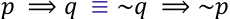

Logo, a condicional "se é baiano então é feliz" é equivalente a: "se não é feliz, então não é baiano". Essa conclusão disfarçada está na alternativa B: "um homem que não é feliz, não é baiano.' 

###### **Gabarito:** LETRA B.

---

<!-- pagina: 45 -->

**Equipe Exatas Estratégia Concursos Aula 03** 

## **- QUESTÕES COMENTADAS FGV** 

#### Diagramas Lógicos 

###### **1. (FGV/PM-SP/2023) Em grupo de desportistas, todos os ciclistas jogam futebol e alguns ciclistas jogam basquete. Com respeito aos indivíduos desse grupo, pode-se afirmar que** 

- A) todos aqueles que jogam futebol também são ciclistas. 

- B) todos aqueles que jogam basquete também são ciclistas. 

- C) quem não joga futebol não é ciclista. 

- D) quem é ciclista joga basquete. 

###### **Comentários:** 

Vamos desenhar os diagramas e, depois, avaliar as alternativas. Como todos os ciclistas jogam futebol, podemos desenhar: 

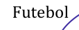

<!-- Start of picture text -->
Futebol <!-- End of picture text -->

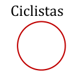

<!-- Start of picture text -->
Ciclistas <!-- End of picture text -->

Alguns ciclistas (C) jogam basquete (B). Observe que temos algumas possibilidades para essa situação: 

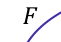

<!-- Start of picture text -->
𝐹 <!-- End of picture text -->

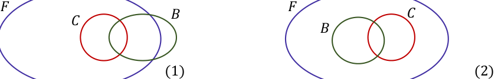

<!-- Start of picture text -->
𝐹  𝐹 𝐵  𝐶 𝐶 𝐵 (1)  (2) <!-- End of picture text -->

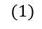

<!-- Start of picture text -->
(1) <!-- End of picture text -->

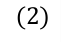

<!-- Start of picture text -->
(2) <!-- End of picture text -->

Com essas duas possibilidades em mente, vamos avaliar as alternativas. 

A) todos aqueles que jogam futebol também são ciclistas. 

**Errado.** Observe que podemos ter uma gama de jogares de futebol que não são ciclistas. 

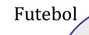

<!-- Start of picture text -->
Futebol <!-- End of picture text -->

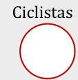

<!-- Start of picture text -->
Ciclistas <!-- End of picture text -->

---

<!-- pagina: 46 -->

**Equipe Exatas Estratégia Concursos Aula 03** 

B) todos aqueles que jogam basquete também são ciclistas. 

**Errado.** Observe que nas possibilidades (1) e (2), temos que apenas alguns que jogam bastante são ciclistas. 

C) quem não joga futebol não é ciclista. 

**Correto!** Observe que o diagrama dos ciclistas está necessariamente dentro do diagrama daqueles que jogam futebol. Sendo assim, **quem não joga futebol não pode ser ciclista** . 

D) quem é ciclista joga basquete. 

**Errado.** O enunciado afirma que apenas **alguns ciclistas** jogam basquete. 

###### **Gabarito:** LETRA C. 

**2. (FGV/MPE-SC/2022) Sabe-se que:** 

- **Todo A é B.** 

- **Nem todo B é C.** 

###### **É correto concluir que:** 

A) todo A é C; 

- B) nenhum A é C; 

- C) algum C não é B; 

- D) algum B não é C; 

- E) algum C não é A. 

###### **Comentários:** 

Se " **Todo A é B** ", então podemos desenhar o seguinte diagrama lógico: 

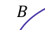

<!-- Start of picture text -->
𝐵 <!-- End of picture text -->

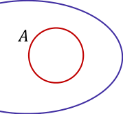

<!-- Start of picture text -->
𝐴 <!-- End of picture text -->

Além disso, o enunciado nos informa que " **nem todo B é C** ". Podemos ter algumas situações tais como: 

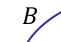

<!-- Start of picture text -->
𝐵 <!-- End of picture text -->

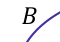

<!-- Start of picture text -->
𝐵 <!-- End of picture text -->

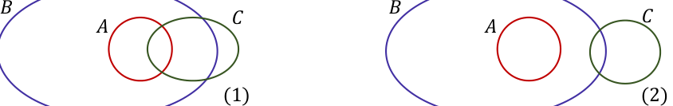

<!-- Start of picture text -->
𝐵  𝐵 𝐶  𝐶 𝐴 𝐴 (1)  (2) <!-- End of picture text -->

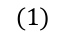

<!-- Start of picture text -->
(1) <!-- End of picture text -->

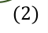

<!-- Start of picture text -->
(2) <!-- End of picture text -->

---

<!-- pagina: 47 -->

**Equipe Exatas Estratégia Concursos Aula 03** 

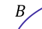

<!-- Start of picture text -->
𝐵 <!-- End of picture text -->

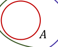

<!-- Start of picture text -->
𝐴 <!-- End of picture text -->

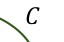

<!-- Start of picture text -->
𝐶 <!-- End of picture text -->

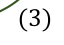

<!-- Start of picture text -->
(3) <!-- End of picture text -->

Pessoal, nesse tipo de questão, buscamos aquela alternativa que é necessariamente verdade. Cuidado, pois nas alternativas **temos várias situações possíveis** , demonstradas pelos diagramas desenhados acima. No entanto, **queremos aquela que é necessariamente verdade** . 

###### A) todo A é C; 

**Errado.** É uma possibilidade, conforme (3), mas **não é necessariamente verdade** , conforme (2). 

###### B) nenhum A é C; 

**Errado.** Apesar de ser uma possibilidade, **não é necessariamente verdade** , vide diagramas 1 e 3. 

###### C) algum C não é B; 

**Errado.** Note que também podemos ter a seguinte situação: 

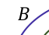

<!-- Start of picture text -->
𝐵 <!-- End of picture text -->

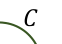

<!-- Start of picture text -->
𝐶 <!-- End of picture text -->

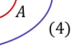

<!-- Start of picture text -->
𝐴 (4) <!-- End of picture text -->

Verifique que continua sendo verdade que: (i) Todo A é B e que (ii) "Nem todo B é C". Mesmo nessa hipótese, é possível ter que a situação acima em que **todo C é B** . 

###### D) algum B não é C; 

**Correto, pessoal.** Aqui está uma afirmativa necessariamente verdadeira. O motivo disso é que ela significa a mesma coisa que já está escrita no enunciado: "nem todo B é C"!! Ora, se nem todo B é C, é por que **existe algum B que não é C** . 

###### E) algum C não é A. 

**Errado.** Podemos ter a possibilidade que C esteja contido inteiramente dentro de A. 

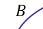

<!-- Start of picture text -->
𝐵 <!-- End of picture text -->

<!-- Start of picture text -->
𝐴 <!-- End of picture text -->

<!-- Start of picture text -->
𝐶 <!-- End of picture text -->

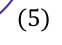

<!-- Start of picture text -->
(5) <!-- End of picture text -->

---

<!-- pagina: 48 -->

**Equipe Exatas Estratégia Concursos Aula 03** 

Nessa situação, teremos que **todo C é A** . 

**Gabarito:** LETRA D. 

###### **3. (FGV/SEFAZ-ES/2021) Considere as afirmativas a seguir:** 

**I. Todo auditor que fiscaliza a contabilidade de empresas também presta orientações sobre legislação tributária, mas nenhum auditor que presta orientações sobre legislação tributária instaura processos administrativos fiscais.** 

**II. Todo auditor que apreende mercadorias irregulares faz o controle aduaneiro, e alguns auditores que fazem controle aduaneiro, instauram processos administrativos fiscais.** 

**III. Nenhum auditor que faz o controle aduaneiro presta orientação tributária.** 

**Sendo certo que não há auditor que execute conjuntamente as funções de controle aduaneiro, apreensão de mercadorias irregulares e de instauração de processos administrativos-fiscais, é correto concluir que:** 

(A) nenhum auditor que apreende mercadorias irregulares também fiscaliza a contabilidade de empresas. 

(B) todo auditor que faz o controle aduaneiro também apreende mercadorias irregulares. 

(C) todo auditor que presta orientações sobre a legislação tributária também fiscaliza a contabilidade de 

empresas. 

(D) pelo menos um auditor que apreende mercadorias irregulares também instaura processos administrativos-fiscais. 

(E) pelo menos um auditor que fiscaliza a contabilidade de empresas também instaura processos administrativos-fiscais. 

###### **Comentários:** 

Um bom começo para essa questão é **desenhar os diagramas lógicos** . Para isso, vamos identificar os grupos. 

FC = auditores que fiscalizam a contabilidade de empresas; 

PO = auditores que prestam orientações sobre legislação tributária; 

IP = auditores que instauram processos administrativos-fiscais; 

AM = auditores que apreendem mercadorias irregulares; 

CA = auditores que fazem controle aduaneiro. 

Temos **cinco grupos** e vamos chamá-lo cada um conjunto de duas letras (FC, PO, ...) para facilitar nossa vida. 

Agora, vamos **desenhar diagramas para cada uma das afirmativas** que o enunciado trouxe. 

_I. Todo auditor que fiscaliza a contabilidade de empresas também presta orientações sobre legislação tributária, mas nenhum auditor que presta orientações sobre legislação tributária instaura processos administrativos fiscais._

---

<!-- pagina: 49 -->

**Equipe Exatas Estratégia Concursos Aula 03** 

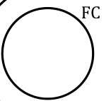

<!-- Start of picture text -->
FC <!-- End of picture text -->

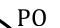

<!-- Start of picture text -->
PO <!-- End of picture text -->

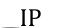

<!-- Start of picture text -->
IP <!-- End of picture text -->

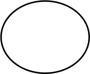

Observe que quem fiscaliza contabilidade (FC) também presta orientações (PO). Isso significa que **FC está inteiramente contido dentro de PO** . É válido perceber que podem existir pessoas que prestam orientação, mas não fiscalizam contabilidade. Ademais, como não há quem preste orientação e instaura processos, os **dois conjuntos são desenhados separadamente, sem intersecção** . 

###### _II. Todo auditor que apreende mercadorias irregulares faz o controle aduaneiro, e alguns auditores que fazem controle aduaneiro, instauram processos administrativos fiscais._ 

Com essa informação, podemos desenvolver várias possibilidades de diagramas. Vamos visualizar algumas 

###### **- 1ª possibilidade** 

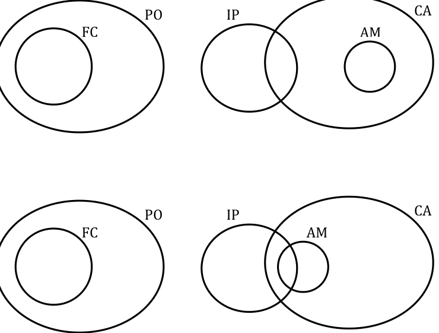

<!-- Start of picture text -->
CA PO IP FC AM CA PO IP FC AM <!-- End of picture text -->

###### **- 2ª possibilidade** 

- **3ª possibilidade**

---

<!-- pagina: 50 -->

**Equipe Exatas Estratégia Concursos Aula 03** 

###### **- 4ª possibilidade** 

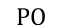

<!-- Start of picture text -->
PO <!-- End of picture text -->

<!-- Start of picture text -->
PO CA AM IP FC PO CA IP FC AM <!-- End of picture text -->

<!-- Start of picture text -->
IP <!-- End of picture text -->

É importante ressaltar que **existem ainda mais possibilidades** . No entanto, com essas já conseguiremos desenrolar o restante da questão. 

III. Nenhum auditor que faz o controle aduaneiro presta orientação tributária. 

Essa informação nos ajuda a **<u>eliminar algumas das possibilidades</u>** que chegamos analisando as afirmativas anteriores. Como não há auditor que faz controle aduaneiro e presta orientação tributária, **então não pode haver intersecção entre os dois conjuntos.** Nesse caso, eliminamos qualquer possibilidade em que os dois conjuntos se intersectem ( **como a 3ª e 4ª possibilidade acima** ). Com isso, ainda ficam no jogo as seguintes: 

###### **- 1ª possibilidade** 

<!-- Start of picture text -->
FC <!-- End of picture text -->

<!-- Start of picture text -->
PO <!-- End of picture text -->

<!-- Start of picture text -->
IP <!-- End of picture text -->

<!-- Start of picture text -->
AM <!-- End of picture text -->

<!-- Start of picture text -->
CA <!-- End of picture text -->

###### **- 2ª possibilidade**

---

<!-- pagina: 51 -->

**Equipe Exatas Estratégia Concursos Aula 03** 

<!-- Start of picture text -->
FC <!-- End of picture text -->

<!-- Start of picture text -->
PO <!-- End of picture text -->

<!-- Start of picture text -->
IP <!-- End of picture text -->

<!-- Start of picture text -->
AM <!-- End of picture text -->

<!-- Start of picture text -->
CA <!-- End of picture text -->

Nessas possibilidades, **não há intersecção entre PO e CA** , estando de acordo com a informação passada. 

Por fim, veja que o enunciado ainda diz mais uma informação relevante! 

_“Sendo certo que não há auditor que execute conjuntamente as funções de controle aduaneiro, apreensão de mercadorias irregulares e de instauração de processos administrativos-fiscais...”_ 

A segunda possibilidade trouxe auditores que executam essas três funções. 

###### **- 2ª possibilidade** 

<!-- Start of picture text -->
FC <!-- End of picture text -->

<!-- Start of picture text -->
PO <!-- End of picture text -->

<!-- Start of picture text -->
IP <!-- End of picture text -->

<!-- Start of picture text -->
AM <!-- End of picture text -->

<!-- Start of picture text -->
CA <!-- End of picture text -->

A região destacada acima mostra exatamente um grupo de auditores que instaura processos, apreendem mercadorias irregulares e fazem controle aduaneiro. O enunciado diz que isso não acontece, assim, podemos eliminar essa possibilidade. Veja que **a única situação que passou por todos os crivos foi a primeira!** É ela que utilizaremos para embasar nossa análise das alternativas. 

###### **- 1ª possibilidade**

---

<!-- pagina: 52 -->

**Equipe Exatas Estratégia Concursos Aula 03** 

<!-- Start of picture text -->
FC <!-- End of picture text -->

<!-- Start of picture text -->
PO <!-- End of picture text -->

<!-- Start of picture text -->
IP <!-- End of picture text -->

<!-- Start of picture text -->
AM <!-- End of picture text -->

<!-- Start of picture text -->
CA <!-- End of picture text -->

(A) nenhum auditor que apreende mercadorias irregulares também fiscaliza a contabilidade de empresas. **Correto!** Note que não há intersecção entre os dois conjuntos (FC e PO). Assim, podemos concluir corretamente que não há auditor que apreenda mercadorias irregulares e fiscaliza empresas. 

<!-- Start of picture text -->
==5460== <!-- End of picture text -->

(B) todo auditor que faz o controle aduaneiro também apreende mercadorias irregulares. 

**Errado.** Sabemos que quem apreende mercadorias irregulares faz controle aduaneiro. No entanto, não podemos afirmar o inverso. 

(C) todo auditor que presta orientações sobre a legislação tributária também fiscaliza a contabilidade de empresas. 

**Errado.** Mesmo problema do item anterior. As bancas gostam muito de confundir o aluno nisso! Pessoal, quando temos que “todo A é B” não podemos concluir que “todo B é A”. Muito cuidado!! 

- (D) pelo menos um auditor que apreende mercadorias irregulares também instaura processos administrativos-fiscais. 

**Errado.** O enunciado diz que _“Sendo certo que não há auditor que execute conjuntamente as funções de controle aduaneiro, apreensão de mercadorias irregulares e de instauração de processos administrativosfiscais.”._ Com isso, não poderíamos ter um auditor que apreende mercadorias irregulares (logo, também executa controle aduaneiro) e instaura processos administrativos fiscais. Nessa situação, o auditor estaria desempenhando todas as três funções, o que não é permitido pela questão. 

(E) pelo menos um auditor que fiscaliza a contabilidade de empresas também instaura processos administrativos-fiscais. 

**Errado.** Lembre-se que a afirmativa I termina assim: “... nenhum auditor que presta orientações sobre legislação tributária instaura processos administrativos fiscais.”. Como todo auditor que fiscaliza a contabilidade de empresas também presta orientação sobre legislação tributária, então esse auditor não pode instaurar processos administrativos-fiscais. 

###### **Gabarito:** LETRA A. 

**4. (FGV/PREF. SALVADOR/2019) Considere as afirmativas a seguir.**

---

<!-- pagina: 53 -->

**Equipe Exatas Estratégia Concursos Aula 03** 

- **“Alguns homens jogam xadrez”.** 

- **“Quem joga xadrez tem bom raciocínio”.** 

###### **A partir dessas afirmações, é correto concluir que** 

a) “Todos os homens têm bom raciocínio”. 

- b) “Mulheres não jogam xadrez”. 

- c) “Quem tem bom raciocínio joga xadrez”. 

- d) “Homem que não tem bom raciocínio não joga xadrez”. 

- e) “Quem não joga xadrez não tem bom raciocínio”. 

###### **Comentários:** 

Vamos desenhar um configuração de diagramas em que as considerações do enunciado sejam válidas. 

Há apenas **uma intersecção** entre "homens" e "xadrez", indicando que "alguns homens jogam xadrez". Além disso, veja que "xadrez" **está totalmente dentro** do "bom raciocínio", indicando que "quem joga xadrez tem bom raciocínio". 

###### a) “Todos os homens têm bom raciocínio”. 

**ERRADO.** No diagrama que estamos utilizando de exemplo, **temos homens que não possuem um raciocínio bom** . É bom lembrar que várias são as possibilidades de diagrama e o que for dito na alternativa **deve ser válido para qualquer uma delas** . Se existir _mesmo que seja uma única_ configuração de diagramas que contradiga o que está escrito, então o que está na alternativa **não é necessariamente verdade** . Ok?! 

###### b) “Mulheres não jogam xadrez”. 

**ERRADO.** O enunciado não menciona mulheres ou algo que possibilite uma conclusão sobre elas. 

###### c) “Quem tem bom raciocínio joga xadrez”. 

**ERRADO.** Veja que o conjunto de quem joga xadrez **está inteiramente contido** no conjunto daqueles que possuem um bom raciocínio. No entanto, **os dois não se confundem** . Esse fato indica que há pessoas com bom raciocínio, mas que não jogam xadrez. 

###### d) “Homem que não tem bom raciocínio não joga xadrez”. 

**CERTO.** De acordo com o enunciado, _se joga xadrez, então possui um bom raciocínio_ . Logo, **é verdade** quando afirmarmos que _quem não tem bom raciocínio, não joga xadrez_ . Para chegar nessa conclusão com facilidade, deveríamos lembrar a seguinte equivalência lógica: 𝑝⇒𝑞≡¬𝑞 ⇒¬𝑝 .

---

<!-- pagina: 54 -->

**Equipe Exatas Estratégia Concursos Aula 03** 

###### e) “Quem não joga xadrez não tem bom raciocínio”. 

**ERRADO.** Perceba que é o que está escrito na letra C, porém, usando a equivalência 𝑝⇒𝑞≡¬𝑞 ⇒¬𝑝 . Logo, podemos usar a mesma justificativa. **Os dois conjuntos não se confundem.** 

###### **Gabarito:** LETRA D. 

**5. (FGV/BANESTES/2018) Em certa empresa são verdadeiras as afirmações:** 

###### **I. Qualquer gerente é mulher.** 

- **II. Nenhuma mulher sabe trocar uma lâmpada.** 

###### **É correto concluir que, nessa empresa:** 

- A) algum gerente é homem 

- B) há gerente que sabe trocar uma lâmpada 

- C) todo homem sabe trocar uma lâmpada; 

- D) todas as mulheres são gerentes; 

- E) nenhum gerente sabe trocar uma lâmpada. 

###### **Comentários:** 

Quando escrevemos que "Qualquer gerente é mulher", estamos dizendo, <u>em outras palavras, que nessa</u> empresa: **"toda gerente é mulher"** . Logo, ao escolhermos qualquer gerente, necessariamente será uma mulher, e da afirmativa II, nenhuma mulher sabe trocar uma lâmpada. Logo, nenhuma gerente sabe trocar uma lâmpada. Veja o diagrama lógico: 

###### **Gabarito:** LETRA E. 

###### **6. (FGV/TRT-12/2017) Considere verdadeiras as afirmações:** 

###### **I. Todos os artistas são pessoas interessantes.** 

- **II. Nenhuma pessoa interessante sabe dirigir.** 

###### **É correto concluir que:** 

A) todas as pessoas interessantes são artistas;

---

<!-- pagina: 55 -->

**Equipe Exatas Estratégia Concursos Aula 03** 

###### B) algum artista sabe dirigir; 

C) quem não é interessante sabe dirigir; 

D) toda pessoa que não sabe dirigir é artista; 

- E) nenhum artista sabe dirigir. 

###### **Comentários:** 

Perceba que se todos os artistas são pessoas interessantes e nenhuma pessoa interessante sabe dirigir, é imediata a conclusão de que **<u>nenhum artista sabe dirigir</u>** <u>. Perceba que se algum artista soubesse dirigir,</u> então a afirmativa II seria negada, pois todos os artista são interessantes e portanto, você teria alguma pessoa interessante sabendo dirigir. Vamos ver os erros das demais alternativas: 

###### A) todas as pessoas interessantes são artistas; 

**Alternativa incorreta.** Na afirmativa I temos: "todos os artistas são pessoas interessantes" ou em outras palavras "se é artista então é uma pessoa interessante". A "volta" de uma condicional não é necessariamente verdadeira. Veja um possível diagrama lógico representando a situação: 

###### B) algum artista sabe dirigir; 

**Alternativa incorreta.** Se algum artista soubesse dirigir, você teria alguém interessante (afirmativa I) dirigindo. Tal conclusão contradiz a afirmativa II, em que nenhuma pessoa interessante sabe dirigir. 

###### C) quem não é interessante sabe dirigir; 

**Alternativa incorreta.** A volta de uma condicional não é necessariamente verdadeira e é uma generalização que frequentemente leva vários alunos a erros. Muita atenção! 

###### D) toda pessoa que não sabe dirigir é artista; 

**Alternativa incorreta.** De acordo com a afirmativa II, nenhuma pessoa interessante sabe dirigir. Isso não significa que toda pessoa que não sabe dirigir é um artista, pois nem toda pessoa interessante necessariamente é um artista, conforme discutimos na análise do item A. 

###### **Gabarito:** LETRA E. 

**7. (FGV/IBGE/2017) Em um jogo há fichas brancas e pretas sendo algumas redondas, outras quadradas e outras triangulares. Não há fichas de outras cores ou de outros formatos. Considere como verdadeira a afirmação:**

---

<!-- pagina: 56 -->

**Equipe Exatas Estratégia Concursos Aula 03** 

**“Qualquer ficha branca não é quadrada.”** 

###### **É correto concluir que:** 

A) toda ficha preta é quadrada; 

B) toda ficha quadrada é preta; 

C) uma ficha que não é redonda é certamente branca; 

D) uma ficha que não é quadrada é certamente preta; 

- E) algumas fichas triangulares são pretas. 

###### **Comentários:** 

Do enunciado, podemos retirar duas informações cruciais: 

- I. Existe um jogo com fichas brancas e pretas. 

- II. Essas fichas podem ser redondas, quadradas ou triangulares. 

Depois, o examinador te passa a seguinte informação: 

"Qualquer ficha branca não é quadrada" 

Veja que a afirmação acima também pode ser escrita da seguinte forma: 

###### **"Nenhuma ficha branca é quadrada."** 

Ora, se nenhuma ficha branca é quadrada e se existe ficha quadrada no jogo, **necessariamente todas as fichas quadradas serão pretas** . 

**Gabarito:** LETRA B. 

**8. (FGV/PREF. DE CUIABÁ-MT/2015) Em certa comunidade são verdadeiras as seguintes afirmações:** 

###### **I. Todo motorista é homem.** 

###### **II. Nenhum homem sabe cozinhar.** 

###### **É correto afirmar que:** 

A) algum motorista é mulher. 

B) algum motorista sabe cozinhar. 

C) toda mulher sabe cozinhar. 

D) todo homem é motorista. 

E) nenhum motorista sabe cozinhar.

---

<!-- pagina: 57 -->

**Equipe Exatas Estratégia Concursos Aula 03** 

###### **Comentários:** 

###### A) algum motorista é mulher. 

**Alternativa incorreta** . Esse item, ao dizer que existe alguma motorista que é mulher, contradiz diretamente a afirmativa I, que diz que todo motorista é homem. 

###### B) algum motorista sabe cozinhar. 

**Alternativa incorreta** . Se esse item fosse verdade, estaríamos contradizendo a afirmativa II, veja: se algum motorista soubesse cozinhar, da afirmativa I, saberíamos que esse motorista seria homem. Portanto, teríamos um homem que sabe cozinhar, que é o oposto do que encontramos na afirmativa II. 

###### C) toda mulher sabe cozinhar. 

**Alternativa incorreta** . Nenhuma das afirmações nos permite fazer tal assertiva. O fato de nenhum homem saber cozinhar (afirmativa II) não implica necessariamente que toda mulher sabe. É uma extrapolação do fato. 

###### D) todo homem é motorista. 

**Alternativa incorreta** . De acordo com a questão, é verdade que "todo motorista é homem", mas também não podemos afirmar o inverso, trata-se de uma falácia da afirmação do consequente. 

###### E) nenhum motorista sabe cozinhar. 

**Essa alternativa é a correta** . Perceba que se todo motorista é homem e se não existe homem que sabe cozinhar, então, necessariamente, nenhum motorista sabe cozinhar. 

###### **Gabarito:** LETRA E. 

**9. (FGV/DPE-MT/2015) Considere verdadeiras as afirmações a seguir:** 

- **Existem advogados que são poetas.** 

- **Todos os poetas escrevem bem.** 

###### **Com base nas afirmações, é correto concluir que** 

A) se um advogado não escreve bem então não é poeta. 

B) todos os advogados escrevem bem. 

C) quem não é advogado não é poeta. 

- D) quem escreve bem é poeta. 

- E) quem não é poeta não escreve bem. 

###### **Comentários:** 

A) se um advogado não escreve bem então não é poeta.

---

<!-- pagina: 58 -->

**Equipe Exatas Estratégia Concursos Aula 03** 

**Alternativa correta.** Perceba que se todos os poetas escrevem bem, então quem não escreve bem não pode ser poeta, independentemente de ser advogado ou não. 

###### B) todos os advogados escrevem bem. 

**Alternativa incorreta.** A afirmativa I nos informa apenas que "Existem advogados que são poetas.". Não conseguimos, a partir disso, dizer que todos os advogados escrevem bem. 

###### C) quem não é advogado não é poeta. 

**Alternativa incorreta.** Em nenhuma das afirmativas foi afirmado que todos os poetas são advogados. Somente a partir de tal informação poderíamos chegar a esse item. 

###### D) quem escreve bem é poeta. 

**Alternativa incorreta.** Trata-se do erro X, muito comum quando se está estudando proposições envolvendo condicional. Lembre-se sempre: 

###### <u>𝑝 ⟹ 𝑞</u> ⇎ <u>𝑞 ⟹ 𝑝</u> 

De modo que se afirmarmos que todos os poetas escrevem bem, **NÃO SERÁ VERDADE** que todos que escrevem bem serão poetas! 

###### E) quem não é poeta não escreve bem. 

**Alternativa incorreta.** O item está errado pois parte do pressuposto que todo mundo que escreve bem são poetas, o que, de acordo com o discutido na letra D, não é verdade! Então, quem não é poeta pode sim escrever bem. 

**Gabarito:** LETRA A.

---

<!-- pagina: 59 -->

**Equipe Exatas Estratégia Concursos Aula 03** 

## **- LISTA DE QUESTÕES FGV** 

#### **Proposições Quantificadas** 

**1. (FGV/CM-SP/2024) Considere a afirmação referente aos candidatos de um concurso: “Todo candidato possui curso superior ou 5 anos de experiência”. A negação lógica dessa sentença é:** 

A) Todo candidato não possui curso superior ou não possui 5 anos de experiência. 

B) Todo candidato não possui curso superior e não possui 5 anos de experiência. 

C) Há candidato que não possui curso superior ou não possui 5 anos de experiência. 

D) Há candidato que possui curso superior, mas não possui 5 anos de experiência. 

E) Há candidato que não possui curso superior e não possui 5 anos de experiência. 

###### **2. (FGV/ALE-TO/2024) Considere a seguinte proposição condicional: Se todos os alunos da Escola Aristarco gostam de matemática, então, ao menos um deles ganha medalha na Olimpíada Nacional de Matemática. Se essa proposição é verdadeira, é correto afirmar que** 

A) se nenhum dos alunos da Escola Aristarco gosta de Matemática, então nenhum deles ganha medalha na Olimpíada Nacional de Matemática. 

B) se todos os alunos da Escola Aristarco ganham medalha na Olimpíada Nacional de Matemática, então, todos esses alunos gostam de Matemática. 

C) se algum aluno da Escola Aristarco ganha medalha na Olimpíada Nacional de Matemática, então todos esses alunos gostam de Matemática. 

D) se nenhum aluno da Escola Aristarco ganha medalha na Olimpíada Nacional de Matemática, então nenhum desses alunos gosta de Matemática. 

E) se nenhum aluno da Escola Aristarco ganha medalha na Olimpíada Nacional de Matemática, então algum desses alunos não gosta de Matemática. 

**3. (FGV/TCE-BA/2023) O entrevistador da PNAD (Pesquisa Nacional por Amostra de Domicílios) está fazendo a entrevista com o sr. João:** 

###### **Entrevistador: Quantos filhos maiores de 18 anos o senhor tem?** 

**Sr. João: Três.** 

**Entrevistador: Todos trabalham?** 

**Sr. João: Não.** 

###### **A partir do diálogo acima é correto concluir que:** 

- A)   nenhum dos filhos de João trabalha; 

- B)   os três filhos de João estudam; 

- C)   pelo menos um filho de João estuda; 

- D)  pelo menos um filho de João não trabalha;

---

<!-- pagina: 60 -->

**Equipe Exatas Estratégia Concursos Aula 03** 

- E)   apenas um filho de João não trabalha. 

**4. (FGV/AGENERSA/2023) Três candidatos candidataram-se para o preenchimento de uma vaga em certo cargo de uma empresa. No processo de seleção, um diretor afirmou:** 

**“Todos os candidatos têm mais de 25 anos.”** 

**Considerando que essa afirmação é falsa, é correto concluir que** 

A) Um dos candidatos tem 25 anos. 

- B) Todos os candidatos têm menos de 25 anos. 

- C) Todos os candidatos têm 25 anos ou menos. 

- D) Exatamente um candidato tem 25 anos ou menos. 

==5460== E) Pelo menos um candidato tem 25 anos ou menos. 

**5. (FGV/PM-SP/2023) Considere a seguinte afirmação:** 

**“Todas as pessoas apreendidas têm 21 anos ou mais e são do sexo masculino.”** 

**A negação dessa afirmação é:** 

A) Nenhuma pessoa apreendida tem 21 anos ou mais ou é do sexo masculino. 

- B) Nenhuma pessoa apreendida tem 21 anos ou mais e é do sexo masculino. 

C) Pelo menos uma das pessoas apreendidas tem menos de 21 anos e é do sexo feminino. 

D) Pelo menos uma das pessoas apreendidas tem menos de 21 anos ou é do sexo feminino. 

###### **6. (FGV/SEFAZ-ES/2022) A negação de “Nenhuma cobra voa” é** 

A) Pelo menos uma cobra voa. 

B) Alguns animais que voam são cobras. 

- C) Todas as cobras voam. 

- D) Todos os animais que voam são cobras. 

- E) Todas as cobras são répteis. 

###### **7. (FGV/PM-AM/2022) Considere a afirmação: “Nenhum soldado escuta mal”. A sua negação é:** 

A) Há pelo menos um soldado que escuta mal. 

B) Vários soldados escutam mal. 

C) Todos os soldados escutam mal. 

D) Todos os soldados escutam bem. 

- E) Todas as pessoas que escutam bem são soldados. 

**8. (FGV/SEFAZ-AM/2022) O diretor de uma empresa fez ao funcionário Miguel, do departamento financeiro, uma pergunta que foi prontamente respondida:**

---

<!-- pagina: 61 -->

**Equipe Exatas Estratégia Concursos Aula 03** 

**Diretor: — João disse que todos os funcionários receberam gratificação.** 

**Miguel: — Não é verdade o que João disse.** 

###### **Se o diretor considerou que Miguel falou a verdade, é correto concluir que** 

A) pelo menos um funcionário não recebeu gratificação. 

B) nenhum funcionário recebeu gratificação. 

C) um único funcionário não recebeu gratificação. 

D) mais da metade dos funcionários não receberam gratificação. 

- E) somente um funcionário recebeu gratificação. 

###### **9. (FGV/SEFAZ-AM/2022) Considere as afirmativas:** 

###### **- Alguns homens gostam de ler.** 

- **Quem gosta de ler vai à livraria.** 

###### **A partir dessas afirmativas é correto concluir que:** 

A) Todos os homens vão à livraria. 

B) Mulheres não gostam de ler. 

C) Quem vai à livraria gosta de ler. 

D) Se um homem não vai à livraria então não gosta de ler. 

- E) Quem não gosta de ler não vai à livraria. 

###### **10. (FGV/SEFAZ-BA/2022) Considere a afirmação:** 

**“À noite, todos os gatos são pretos.”** 

###### **Se essa frase é falsa, é correto concluir que** 

A) De dia, todos os gatos são pretos. 

B) À noite, todos os gatos são brancos. 

C) De dia há gatos que não são pretos. 

D) À noite há, pelo menos, um gato que não é preto. 

E) À noite nenhum gato é preto. 

###### **11. (FGV/IBGE/2022) No censo de 2010 Laura foi entrevistada pelo recenseador Mário.** 

###### **Início da entrevista:** 

**Mário – Quantas pessoas moram nesta casa?** 

**Laura – Quatro: eu, que me chamo Laura, meu marido João e meus dois filhos Alberto e Roberto Mário – Todos trabalham?**

---

<!-- pagina: 62 -->

**Equipe Exatas Estratégia Concursos Aula 03** 

**Laura – Não.** 

###### **É correto concluir que:** 

- A) nenhuma das quatro pessoas trabalha. 

- B) apenas uma das quatro pessoas não trabalha. 

- C) apenas uma das quatro pessoas trabalha. 

- D) pelo menos uma das quatro pessoas não trabalha. 

- E) nenhuma das quatro pessoas possui emprego formal, com carteira assinada. 

**12. (FGV/IBGE/2022) A negação lógica da sentença “Toda cobra é verde ou venenosa” é:** 

A) Nenhuma cobra é verde ou venenosa. 

B) Toda cobra não é verde ou não é venenosa. 

C) Existe cobra que não é verde nem é venenosa. 

D) Toda cobra verde não é venenosa. 

- E) Nenhuma cobra venenosa é verde. 

###### **13. (FGV/IMBEL/2021) Considere verdadeira a afirmação:** 

**“Todo vegetal verde é saudável.”** 

###### **É correto concluir que:** 

A) Todo vegetal saudável é verde. 

B) Todo vegetal que não é saudável não é verde. 

C) Todo vegetal que não é verde não é saudável. 

D) Alguns vegetais verdes não são saudáveis. 

E) Alguns vegetais que não são saudáveis são verdes. 

###### **14. (FGV/FUNSAÚDE-CE/2021) Considere a sentença:** 

**“Todo urso branco é amigo da onça.”** 

###### **A negação lógica dessa sentença é:** 

A) Nenhum urso branco é amigo da onça. 

B) Algum urso branco não é amigo da onça. 

C) Todo urso marrom é amigo da onça. 

D) Nenhuma onça é amiga de urso branco. 

E) Algum urso não é branco e é amigo da onça. 

###### **15. (FGV/FUNSAÚDE-CE/2021) O advogado de uma empresa afirmou ao diretor que:**

---

<!-- pagina: 63 -->

**Equipe Exatas Estratégia Concursos Aula 03** 

**“Todos os processos relativos à empresa X foram finalizados”** 

###### **Dias depois, o diretor foi informado que essa afirmação não era verdadeira. O diretor concluiu logicamente** 

###### **que** 

A) nenhum processo da empresa X foi finalizado. 

B) somente um processo da empresa X não foi finalizado. 

C) pelo menos um processo da empresa X não foi finalizado. 

D) foi finalizado pelo menos um processo que não se refere à empresa X. 

E) todos os processos finalizados não se referiam à empresa X. 

###### **16. (FGV/FUNSAÚDE-CE/2021) Um dos diretores de certo hospital, falando sobre as enfermeiras que lá trabalham disse:** 

**“Todas as enfermeiras são formadas pela UFC.”** 

###### **Sabendo que essa afirmação não é verdadeira, é correto concluir que** 

A) nenhuma enfermeira é formada pela UFC. 

B) nenhuma enfermeira é formada. 

C) alguma enfermeira é formada na Unifor. 

D) há, pelo menos, uma enfermeira que não é formada na UFC. 

E) há, pelo menos, uma enfermeira que não é formada. 

**17. (FGV/PREF. PAULÍNIA/2021) Considere a sentença:** 

**“Todo advogado é bom orador.”** 

###### **A negação lógica dessa sentença é:** 

A) Nenhum advogado é bom orador. 

B) Todo bom orador é advogado. 

C) Nenhum bom orador é advogado. 

D) Algum advogado não é bom orador. 

E) Algum bom orador não é advogado. 

###### **18. (FGV/PREF. SALVADOR/2019) Se não é verdade que “Todo soteronito é soteronoso”, então é correto afirmar que** 

a) “Nenhum soteronito é soteronoso”. 

b) “Todo soteronoso é soteronito”. 

c) “Algum soteronito não é soteronoso”. 

d) “Algum soteronoso não é soteronito”. 

e) “Algum soteronito é soteronoso”.

---

<!-- pagina: 64 -->

**Equipe Exatas Estratégia Concursos Aula 03** 

###### **19. (FGV/IBGE/2019) João, o dono da casa, atende Célio, o recenseador. Início da entrevista:** 

**Célio – Quantas pessoas moram nesta casa?** 

**João – Três: eu, que me chamo João, minha esposa Maria e meu primo Pedro.** 

**Célio – Todos trabalham?** 

**João – Não.** 

**É correto concluir que:** 

a) nenhuma das três pessoas trabalha; 

b) apenas uma das três pessoas não trabalha; 

c) apenas uma das três pessoas trabalha; 

d) pelo menos uma das três pessoas não trabalha; 

- e) nenhuma das três pessoas possui emprego formal, com carteira assinada. 

###### **20. (FGV/PREF. DE SALVADOR-BA/2019) Considere a afirmação:** 

###### **"Todo estudante que gosta de Matemática também gosta de Ciências Biológicas."** 

###### **Considerando que essa sentença é falsa, é correto concluir que:** 

A) "Todo estudante que não gosta de Matemática gosta de Ciências Biológicas." 

B) "Nenhum estudante que gosta de Matemática também gosta de Ciências Biológicas." 

C) "Todo estudante que gosta de Matemática não gosta de Ciências Biológicas." 

D) “Algum estudante que gosta de Matemática não gosta de Ciências Biológicas." 

E) “Algum estudante que não gosta de Matemática gosta de Ciências Biológicas.” 

**21. (FGV/MPE-AL/2018) Considere a afirmação: “Existem insetos que não são pretos”. Se essa afirmação é falsa, então é verdade que:** 

A) nenhum inseto é preto. 

B) todo inseto é preto. 

C) todos os animais pretos são insetos. 

D) nenhum animal preto é inseto. 

E) nem todos os insetos são pretos. 

**22. (FGV/CGM Niterói/2018) A negação de “Nenhum analista é magro” é** 

a) “Há pelo menos um analista magro”. 

b) “Alguns magros são analistas”. 

c) “Todos os analistas são magros”. 

d) “Todos os magros são analistas”. 

e) “Todos os analistas não são magros”.

---

<!-- pagina: 65 -->

**Equipe Exatas Estratégia Concursos Aula 03** 

**23. (FGV/TJ-SC/2018) Considere a sentença: “Todo catarinense gosta de camarão ou é torcedor do Figueirense”. A negação lógica da sentença dada é:** 

a) Nenhum catarinense gosta de camarão ou é torcedor do Figueirense; 

b) Todo catarinense gosta de camarão, mas não é torcedor do Figueirense; 

c) Todo catarinense não gosta de camarão e não é torcedor do Figueirense; 

d) Algum catarinense não gosta de camarão e não é torcedor do Figueirense; 

e) Algum catarinense não gosta de camarão ou não é torcedor do Figueirense. 

###### **24. (FGV/ALE-RO/2018) Considere verdadeira a afirmação:** 

**“Todo parlamentar conhece bem a Constituição”.** 

###### **É correto concluir que** 

a) “Se uma pessoa conhece bem a Constituição então é parlamentar.” 

b) “Se uma pessoa não é um parlamentar então não conhece bem a Constituição.” 

c) “Se uma pessoa não conhece bem a constituição então não é parlamentar.” 

d) “Existe um parlamentar que não conhece bem a Constituição.” 

e) “Não existe pessoa que conheça bem a Constituição e não seja parlamentar.” 

###### **25. (FGV/COMPESA/2018) Considere a sentença a seguir.** 

**“Todo pernambucano gosta de peixe e torce pelo Náutico.”** 

###### **A negação lógica da sentença dada é** 

a) “Nenhum pernambucano gosta de peixe e torce pelo Náutico.” 

b) “Todo pernambucano não gosta de peixe e não torce pelo Náutico.” 

c) “Algum pernambucano não gosta de peixe e não torce pelo Náutico.” 

d) “Algum pernambucano não gosta de peixe ou não torce pelo Náutico.” 

e) “Algum pernambucano gosta de peixe e não torce pelo Náutico.” 

###### **26. (FGV/COMPESA/2018) Considere a afirmação: "Todas as pessoas que tomam limonada não ficam resfriadas." Se esta afirmação não é verdadeira, é correto concluir que:** 

A) “Alguma pessoa que toma limonada fica resfriada.” 

B) “Alguma pessoa que não toma limonada fica resfriada.” 

C) “Todas as pessoas que não tomam limonada ficam resfriadas.” 

D) “Todas as pessoas que não ficam resfriadas tomam limonada.” 

E) “Todas as pessoas que ficam resfriadas não tomam limonada.”

---

<!-- pagina: 66 -->

**Equipe Exatas Estratégia Concursos Aula 03** 

**27. (IBGE/TRT-12/2017) Em uma caixa só pode haver bolas pretas ou brancas. Sabe-se que a caixa não está vazia e que não é verdade que “todas as bolas na caixa são pretas”. Então é correto concluir que:** 

a) nenhuma bola na caixa é preta; 

b) todas as bolas na caixa são brancas; 

c) há pelo menos uma bola preta na caixa; 

d) há pelo menos uma bola branca na caixa; 

e) há bolas pretas e bolas brancas na caixa. 

**28. (FGV/IBGE/2017) Considere como verdadeira a seguinte sentença: “Se todas as flores são vermelhas, então o jardim é bonito”. É correto concluir que:** 

a) se todas as flores não são vermelhas, então o jardim não é bonito; 

b) se uma flor é amarela, então o jardim não é bonito; 

c) se o jardim é bonito, então todas as flores são vermelhas; 

d) se o jardim não é bonito, então todas as flores não são vermelhas; 

e) se o jardim não é bonito, então pelo menos uma flor não é vermelha. 

###### **29. (FGV/SEPOG-RO/2017) Considere a afirmação:** 

**“Toda pessoa que faz exercícios não tem pressão alta”.** 

###### **De acordo com essa afirmação é correto concluir que:** 

A) se uma pessoa tem pressão alta então não faz exercícios. 

B) se uma pessoa não faz exercícios então tem pressão alta. 

C) se uma pessoa não tem pressão alta então faz exercícios. 

D) existem pessoas que fazem exercícios e que têm pressão alta. 

E) não existe pessoa que não tenha pressão alta e não faça exercícios. 

###### **30. (FGV/MPE-BA/2017) Considere a afirmação:** 

**“Todo baiano é um homem feliz”.** 

###### **Uma afirmação logicamente equivalente é:** 

A) Todo homem feliz é baiano; 

B) Um homem que não é feliz não é baiano; 

C) Quem não é baiano não é feliz; 

D) Um homem é baiano ou é feliz; 

E) Um homem não é feliz ou não é baiano.

---

<!-- pagina: 67 -->

**Equipe Exatas Estratégia Concursos Aula 03** 

||**GABARITO** ||
|---|---|---|
|1. LETRA E|11. LETRA D|21. LETRA B|
|2. LETRA E|12. LETRA C|22. LETRA A|
|3. LETRA D|13. LETRA B|23. LETRA D|
|4. LETRA E|14. LETRA B|24. LETRA C|
|5. LETRA D|15. LETRA C|25. LETRA D|
|6. LETRA A|16. LETRA D|26. LETRA A|
|7. LETRA A|17. LETRA D|27. LETRA D|
|8. LETRA A|18. LETRA C|28. LETRA E|
|9. LETRA D|19. LETRA D|29. LETRA A|
|10. LETRA D|20. LETRA D|30. LETRA B|

---

<!-- pagina: 68 -->

**Equipe Exatas Estratégia Concursos Aula 03** 

## **- LISTA DE QUESTÕES FGV** 

#### Diagramas Lógicos 

**1. (FGV/PM-SP/2023) Em grupo de desportistas, todos os ciclistas jogam futebol e alguns ciclistas jogam basquete. Com respeito aos indivíduos desse grupo, pode-se afirmar que** 

A) todos aqueles que jogam futebol também são ciclistas. 

B) todos aqueles que jogam basquete também são ciclistas. 

C) quem não joga futebol não é ciclista. 

D) quem é ciclista joga basquete. 

###### **2. (FGV/MPE-SC/2022) Sabe-se que:** 

###### **- Todo A é B.** 

- **Nem todo B é C.** 

###### **É correto concluir que:** 

A) todo A é C; 

B) nenhum A é C; 

C) algum C não é B; 

D) algum B não é C; 

E) algum C não é A. 

###### **3. (FGV/SEFAZ-ES/2021) Considere as afirmativas a seguir:** 

**I. Todo auditor que fiscaliza a contabilidade de empresas também presta orientações sobre legislação tributária, mas nenhum auditor que presta orientações sobre legislação tributária instaura processos administrativos fiscais.** 

**II. Todo auditor que apreende mercadorias irregulares faz o controle aduaneiro, e alguns auditores que fazem controle aduaneiro, instauram processos administrativos fiscais.** 

**III. Nenhum auditor que faz o controle aduaneiro presta orientação tributária.** 

**Sendo certo que não há auditor que execute conjuntamente as funções de controle aduaneiro, apreensão de mercadorias irregulares e de instauração de processos administrativos-fiscais, é correto concluir que:** 

(A) nenhum auditor que apreende mercadorias irregulares também fiscaliza a contabilidade de empresas. 

(B) todo auditor que faz o controle aduaneiro também apreende mercadorias irregulares. 

(C) todo auditor que presta orientações sobre a legislação tributária também fiscaliza a contabilidade de empresas.

---

<!-- pagina: 69 -->

**Equipe Exatas Estratégia Concursos Aula 03** 

(D) pelo menos um auditor que apreende mercadorias irregulares também instaura processos administrativos-fiscais. 

(E) pelo menos um auditor que fiscaliza a contabilidade de empresas também instaura processos administrativos-fiscais. 

**4. (FGV/PREF. SALVADOR/2019) Considere as afirmativas a seguir.** 

- **“Alguns homens jogam xadrez”.** 

- **“Quem joga xadrez tem bom raciocínio”.** 

###### **A partir dessas afirmações, é correto concluir que** 

a) “Todos os homens têm bom raciocínio”. 

- b) “Mulheres não jogam xadrez”. 

- c) “Quem tem bom raciocínio joga xadrez”. 

- d) “Homem que não tem bom raciocínio não joga xadrez”. 

- e) “Quem não joga xadrez não tem bom raciocínio”. 

###### **5. (FGV/BANESTES/2018) Em certa empresa são verdadeiras as afirmações:** 

###### **I. Qualquer gerente é mulher.** 

###### **II. Nenhuma mulher sabe trocar uma lâmpada.** 

###### **É correto concluir que, nessa empresa:** 

A) algum gerente é homem 

B) há gerente que sabe trocar uma lâmpada 

C) todo homem sabe trocar uma lâmpada; 

D) todas as mulheres são gerentes; 

E) nenhum gerente sabe trocar uma lâmpada. 

###### **6. (FGV/TRT-12/2017) Considere verdadeiras as afirmações:** 

###### **I. Todos os artistas são pessoas interessantes.** 

###### **II. Nenhuma pessoa interessante sabe dirigir.** 

###### **É correto concluir que:** 

A) todas as pessoas interessantes são artistas; 

B) algum artista sabe dirigir; 

C) quem não é interessante sabe dirigir; 

D) toda pessoa que não sabe dirigir é artista; 

- E) nenhum artista sabe dirigir.

---

<!-- pagina: 70 -->

**Equipe Exatas Estratégia Concursos Aula 03** 

**7. (FGV/IBGE/2017) Em um jogo há fichas brancas e pretas sendo algumas redondas, outras quadradas e outras triangulares. Não há fichas de outras cores ou de outros formatos. Considere como verdadeira a afirmação:** 

###### **“Qualquer ficha branca não é quadrada.”** 

###### **É correto concluir que:** 

A) toda ficha preta é quadrada; 

B) toda ficha quadrada é preta; 

C) uma ficha que não é redonda é certamente branca; 

- D) uma ficha que não é quadrada é certamente preta; 

- E) algumas fichas triangulares são pretas. 

<!-- Start of picture text -->
==5460== <!-- End of picture text -->

**8. (FGV/PREF. DE CUIABÁ-MT/2015) Em certa comunidade são verdadeiras as seguintes afirmações:** 

###### **I. Todo motorista é homem.** 

###### **II. Nenhum homem sabe cozinhar.** 

###### **É correto afirmar que:** 

A) algum motorista é mulher. 

B) algum motorista sabe cozinhar. 

C) toda mulher sabe cozinhar. 

- D) todo homem é motorista. 

- E) nenhum motorista sabe cozinhar. 

**9. (FGV/DPE-MT/2015) Considere verdadeiras as afirmações a seguir:** 

- **Existem advogados que são poetas.** 

- **Todos os poetas escrevem bem.** 

###### **Com base nas afirmações, é correto concluir que** 

A) se um advogado não escreve bem então não é poeta. 

B) todos os advogados escrevem bem. 

C) quem não é advogado não é poeta. 

- D) quem escreve bem é poeta. 

- E) quem não é poeta não escreve bem.

---

<!-- pagina: 71 -->

**Equipe Exatas Estratégia Concursos Aula 03** 

## **GABARITO** 

**1.** LETRA C 

**2.** LETRA D 

**3.** LETRA A 

**4.** LETRA D 

**5.** LETRA E 

**6.** LETRA E 

**7.** LETRA B 

**8.** LETRA E 

**9.** LETRA A

---

<!-- pagina: 72 -->

