---
fonte_pdf: "Raciocínio Lógico - Aula 04.pdf"
paginas: 49
conversao: texto-e-imagens
---

<!-- pagina: 2 -->

**Equipe Exatas Estratégia Concursos Aula 04** 

## **Índice** 

|.............................................................................................................................................................................................. 1) Lógica de Primeira Ordem 3|
|---|
|.............................................................................................................................................................................................. 2) Questões Comentadas - Lógica de Primeira Ordem - Multibancas 15|
|.............................................................................................................................................................................................. 3) Lista de Questões - Lógica de Primeira Ordem - Multibancas 40|

---

<!-- pagina: 3 -->

**Equipe Exatas Estratégia Concursos Aula 04** 

## **LÓGICA DE PRIMEIRA ORDEM** 

### Introdu ão <u>ç</u> 

A Lógica de Primeira Ordem (LPO) surge de uma necessidade: **superar as limitações da Lógica Proposicional** . Quais limitações seriam essas? Considere a seguinte sentença declarativa: **todo aluno do Estratégia é aprovado** . Como representamos, **utilizando proposições e conectivos** , esse tipo de declaração? Existe uma certa dificuldade na tarefa. Isso acontece, pois, nas primeiras aulas do curso, nosso foco foi a Lógica Proposicional. Trabalhamos com expressões tais como: 

𝑝∧𝑞             𝑟∨𝑠           𝑢⟹𝑣 

Nós representamos proposições simples com letras minúsculas e **utilizamos conectivos** para expressar ideias que **possuíssem um pouco mais de complexidade** . Esse tipo de representação **vai se tornando precário** à medida que aumentamos o número de pessoas (objetos) e relações que queremos expressar. 

Você deve estar pensando: _"ei professor, mas a sentença 'todo aluno do Estratégia é aprovado' é uma proposição categórica universal afirmativa! Nós já estudamos isso!"_ É bem verdade que **as proposições categóricas serão um ótimo ponto de partida** no estudo da Lógica de Primeira Ordem! Aproveitaremos muitas coisas que vimos anteriormente. Por esse motivo, **faremos uma rápida revisão** de dois assuntos fundamentais: **<u>equivalências lógicas e proposições quantificadas</u>** <u>.</u> 

Essa integração de assuntos facilita a resolução dos exercícios. Você verá que, apesar de haver questões que explicitamente trazem o conteúdo de Lógica de Primeira Ordem, poderemos resolvê-la utilizando Lógica Proposicional. O motivo para isso é que **aquela é apenas uma extensão desta** , **não uma substituição** . Logo, tudo que vimos na Lógica de Proposições, **continuará válido na Lógica de Predicados (LPO)** . 

**(BR/2012)** Considere a seguinte afirmativa: Ser analista de sistemas é condição necessária porém não suficiente para ser engenheiro de software. Considere os predicados 𝐴(𝑥) e 𝐸(𝑥) que representam respectivamente que 𝑥 é analista de sistemas e que x é engenheiro de software. Uma representação coerente da afirmativa acima, em lógica de primeira ordem, é 

A) 𝐴(𝑥) →𝐸(𝑥) B) 𝐴(𝑥) →¬𝐸(𝑥) C) ¬𝐴(𝑥) →𝐸(𝑥)

---

<!-- pagina: 4 -->

**Equipe Exatas Estratégia Concursos Aula 04** 

D) ¬𝐸(𝑥) →¬𝐴(𝑥) 

E) 𝐸(𝑥) →𝐴(𝑥) 

###### **Comentários:** 

Apesar de trazer predicados 𝐴(𝑥) e 𝐸(𝑥) , **a questão é resolvida com** **<u>conhecimentos de aulas passadas</u>** . Lembre-se que, **em uma condicional** , temos o seguinte: 

𝑝⟹𝑞 

A proposição 𝒑 **é uma condição suficiente para** 𝒒 . Por sua vez, 𝒒 **é uma condição necessária para** 𝒑 . Logo, se **ser analista é condição necessária para ser engenheiro** de software, então, 

𝐸(𝑥) ⟹𝐴(𝑥) 

**Gabarito:** LETRA E. 

### Simbologia e Aspectos Iniciais 

Nesse primeiro momento, nosso principal objetivo será **passar alguns conceitos iniciais** e provocar uma **familiarização com os símbolos** que utilizaremos. Devemos, ao final desse capítulo, ser capazes de **traduzir a notação simbólica** que permeia a LPO **para o bom e velho português** . Para começar, considere a seguinte sentença: 

#### 𝑥 é ímpar 

_A sentença acima é verdadeira ou falsa?_ Não sabemos, pois **dependemos do valor de** 𝒙 . Como 𝑥 pode assumir vários valores distintos, **chamamos o** 𝒙 **de variável** . Além disso, tudo que é dito sobre essa variável, nós **chamamos de predicado** . A oração "x é ímpar" vai ser, portanto, **uma função-predicado (ou função proposicional)** pois é uma sentença que depende do valor de uma variável para que seja possível atribuí-la determinado valor lógico. Observe: 

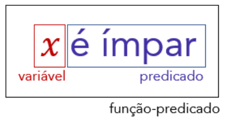

A pergunta que faremos agora é: _quais números a variável_ 𝑥 _pode assumir?_ Podemos considerar **o conjunto dos números inteiros** , isto é:

---

<!-- pagina: 5 -->

**Equipe Exatas Estratégia Concursos Aula 04** 

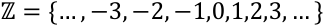

Nessa situação, chamamos o conjunto dos números inteiros de **Universo de Discurso do predicado** . Em outras palavras, **o Universo de Discurso é um conjunto formado pelos valores que a variável de uma funçãopredicado pode assumir** . Em muitas situações, esse conjunto não é explicitamente detalhado, ficando a cargo do leitor sua correta identificação **dado o contexto do problema** . Vamos observar alguns exemplos. 

- 𝑥 é um país emergente. 

Se nada for falado no comando da questão, pode-se extrair como Universo de Discurso o conjunto formado por **todos os países existentes no globo** . Por exemplo, se 𝑥 assumir o valor "Canadá", a proposição será falsa. Caso assuma "Índia", então teremos uma proposição verdadeira. 

- 𝑥 passou no concurso dos sonhos. 

Novamente, se nada for falado no comando da questão, pode-se extrair como Universo de Discurso o conjunto formado por **todas as pessoas que estudam para concursos** . No entanto, o examinador pode estabelecer o Universo de Discurso como sendo, por exemplo, só os alunos do Estratégia. 

Observe que ficar escrevendo a função-predicado "x é ímpar" não é interessante, pois, quando começarmos a aplicar propriedades e a fazer um estudo mais detalhado dos predicados, "carregar" a sentença inteira não é a melhor das ideias. Por esse motivo, **podemos simplificá-la escrevendo-a de até três maneiras distintas:** 𝑰𝒎𝒑𝒂𝒓(𝒙) **ou** 𝑰(𝒙) **ou** 𝑰𝒙 **.** 

𝑰𝒎𝒑𝒂𝒓(𝒙) = 𝑰(𝒙) = 𝑰𝒙= 𝒙 é í𝒎𝒑𝒂𝒓 

**(BR/2012)** Considere a afirmativa “Todo gerente de projeto é programador”. Considere os predicados G(x) e P(x), que representam, respectivamente, que x é gerente de projeto e que x é programador. Uma representação coerente da afirmativa acima em lógica de primeira ordem é 

A) 𝐺(𝑥) →¬𝑃(𝑥) 

B) ¬𝐺(𝑥) →𝑃(𝑥) 

C) 𝑃(𝑥) →𝐺(𝑥) 

D) ¬𝑃(𝑥) →𝐺(𝑥) 

E) ¬𝑃(𝑥) →¬𝐺(𝑥) 

###### **Comentários:**

---

<!-- pagina: 6 -->

**Equipe Exatas Estratégia Concursos Aula 04** 

O enunciado fornece os seguintes predicados: 

#### 𝐺(𝑥):      𝑥 é gerente de projeto 𝑃(𝑥):        𝑥 é programador 

Note que afirmações do tipo **"todo A é B"** são equivalentes à **"Se A, então B"** . Dessa forma, devemos colocar os predicados acima na forma de uma condicional. Considerando os dados do enunciado, temos que **: todo gerente de projeto é programador.** Observe que tal afirmativa equivale a falar: **se é gerente de projeto, então é programador** . Em notação da lógica de primeira ordem fica: 

𝐺(𝑥) ⟹𝑃(𝑥) 

Observe que a forma que escrevemos **não está contemplada entre as alternativas** ==5460== . Devemos, nesse momento, lembrar da aula de Equivalências Lógicas: 

#### 𝑝⟹𝑞        ≡      ¬𝑞⟹¬𝑝 

Podemos usar a mesma relação aqui na lógica de primeira ordem. 

𝐺(𝑥) ⟹𝑃(𝑥)        ≡      ¬𝑃(𝑥) ⟹¬𝐺(𝑥) 

Qualquer uma das expressões acima **são possíveis respostas da questão** . No entanto, **apenas** ¬𝑷(𝒙) ⟹ ¬𝑮(𝒙) **está contemplada nas alternativas** e é o nosso gabarito. 

**Gabarito:** LETRA E. 

Na questão anterior, temos **uma resposta coerente** . No entanto, **ela não é uma resposta completa** <u>. Uma</u> representação mais adequada para a afirmativa do enunciado **deveria conter o quantificador universal** ∀ **.** Isso acontece, pois, precisamos indicar que **<u>a totalidade</u>** dos gerentes de projeto são programadores. 

Quando escrevemos que 𝐺(𝑥) ⟹𝑃(𝑥) , estamos dizer que: 

Se x é gerente de projeto, então x é programador 

Intuitivamente, é possível inferir uma totalidade implícita quando escrevemos a própria condicional. Mas, **para uma resposta completa e explícita, devemos fazer o uso do quantificador** <u>. Essa representação seria:</u> 

(∀𝑥)(𝐺(𝑥) ⟹𝑃(𝑥)) 

Uma leitura completa da expressão acima é:

---

<!-- pagina: 7 -->

**Equipe Exatas Estratégia Concursos Aula 04** 

Para todo x pertencente ao Universo de Discurso, se x é gerente de projeto, então x é programador. 

###### No cotidiano, **fazemos uma leitura simplificada** : 

Para todo x, se x é gerente de projetos, x é programador. 

A ideia de que 𝑥 pertence ao universo de discurso **fica implícita** . 

**(IPE-SAÚDE/2022)** Considere como conjunto universo 𝑈 = {0,1,2,3,4} e observe as seguintes proposições quantificadas, assinalando V, se verdadeiro, ou F, se falso. 

- (   ) (∀𝑥∈𝑈)(𝑥+ 3 > 6) 

- (   ) (∃𝑥∈𝑈)(𝑥 é 𝑝𝑎𝑟) 

- (   ) (∀𝑥∈𝑈)(𝑥2 < 20) 

O valor lógico das afirmações acima, na ordem de preenchimento, de cima para baixo, é: 

A) 𝑉 – 𝑉 – 𝑉. 

B) 𝑉 – 𝑉 – 𝐹. 

C) 𝑉 – 𝐹 – 𝑉. 

D) 𝐹 – 𝑉 – 𝑉. 

E) 𝐹 – 𝐹 – 𝐹. 

###### **Comentários:** 

Para começar nosso estudo de LPO, vamos avaliar as proposições do enunciado. O primeiro passo aqui é observar o **Universo de Discurso** . 

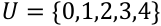

###### ( **F** ) (∀𝑥∈𝑈)(𝑥+ 3 > 6) 

Pessoal, essa aqui é **falsa** . Quando "traduzimos" a expressão, ela diz que **para todo x** pertencente ao conjunto universo, temos que **x mais três é maior do que 6** . Ora, veja que se "x" for 0, a expressão não vai ser verdade. Com isso, não poderíamos usar o "para todo". 

( **V** ) (∃𝑥∈𝑈)(𝑥 é 𝑝𝑎𝑟)

---

<!-- pagina: 8 -->

**Equipe Exatas Estratégia Concursos Aula 04** 

**Verdadeiro.** A "tradução" para o português fica: _"existe x pertencente a U tal que x é par"._ Ora, observando o conjunto U, vemos que existe sim! **O "0", o "2" e o "4" são números pares** . 

###### ( **V** ) (∀𝑥∈𝑈)(𝑥2 < 20) 

**Verdadeiro.** A "tradução" dessa para o português fica: _"para todo x pertencente a U tem-se que o quadrado de x é menor do que 20"._ Como o conjunto **U tem poucos elementos** , podemos testar todos. 

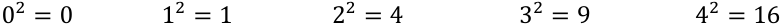

Observe que os quadrados de **<u>todos</u>** os elementos de U são realmente **menores do que 20** . Logo, a proposição é **verdadeira** . 

**Gabarito:** LETRA D. 

#### LPO e as Proposições Categóricas 

Você deve ter percebido que nosso foco está em **fazer verdadeiras traduções entre a Língua Portuguesa e a linguagem de símbolos da Lógica de Primeira Ordem** . Minha intenção aqui é fazer com que esse monte de símbolos não te assuste e que na hora da prova **você possa se diferenciar dos seus concorrentes** . Nesse intuito, eu gostaria que você prestasse bastante atenção no quadro abaixo. 

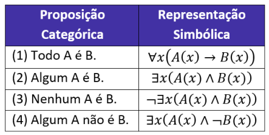

Observe que temos **uma representação simbólica para cada uma das formas** de proposição categórica que estudamos e revisamos anteriormente. **Vamos entender o porquê** de cada uma das representações? 

- **Todo A é B.** 

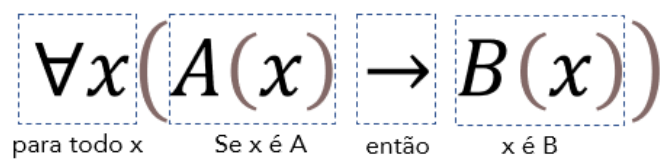

É exatamente a expressão que obtivemos ao escrever uma resposta mais completa para a questão que vimos. Note que, **para representar a noção de totalidade** , devemos colocar **o quantificador universal** .

---

<!-- pagina: 9 -->

**Equipe Exatas Estratégia Concursos Aula 04** 

Além disso, não esqueça que **a condicional desempenha um papel fundamental** , pois, quando queremos dizer que todo A é B, no fundo estamos dizendo _que se dado objeto possui a propriedade A, então ele também possuirá a propriedade B_ . 

- **Algum A é B.** 

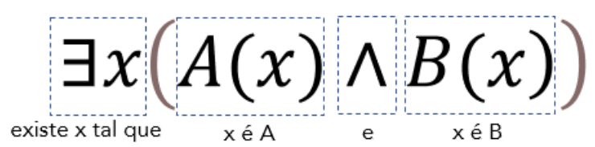

Agora, para representar que **algum objeto A possui a propriedade B** , utilizamos **o quantificador existencial** ∃ **.** Esse quantificador, como já vimos, exprime a ideia de que _existe pelo menos um x_ (ou, simplesmente, algum x). Veja que **usamos a conjunção (** ∧ **)** para expressar que o objeto **possui duas propriedades (A e B), simultaneamente** . _Essa combinação de símbolos, de fato, expressa que Algum A é B, concorda?_ 

- **Nenhum A é B.** 

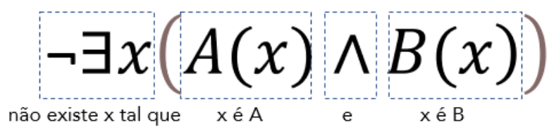

Note que para dizer que _Nenhum A é B_ , basta dizer que **não existe x tal que x tenha as duas propriedades** (seja A e B, simultaneamente). Isso é exatamente **a negação (o operador ¬)** de "Algum A é B". Lembrese que **a negação de uma proposição categórica particular positiva é uma universal negativa** . 

- **Algum A não é B.** 

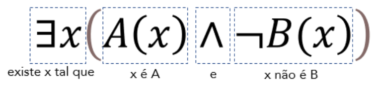

Podemos aproveitar a representação simbólica de "todo A é B" para escrever a representação de "algum A não é B". Para isso, devemos lembrar que **um é a negação do outro** . Temos ainda que na negação de proposições quantificadas, **trocamos o quantificador e negamos a proposição subsequente** . Sabemos que:

---

<!-- pagina: 10 -->

**Equipe Exatas Estratégia Concursos Aula 04** 

#### ~(𝑝⇒𝑞) ≡  𝑝∧~𝑞 

Vamos aproveitar essa informação e usar aqui também! A Lógica de Predicados nada mais é do que **uma extensão da Lógica Proposicional** . Observe a semelhança entre as duas expressões acima. Para ajudar na compreensão, vamos fazer uma questão do CESPE que traz uma grande aula sobre o assunto. 

**(ADAPAR/2021)** Considere a seguinte proposição categórica O. 

O: “Nem todo carneiro é dócil”. 

Considerando que x pertença ao conjunto T de todos os animais do mundo, que C(x) represente simbolicamente a propriedade “x é carneiro” e que D(x) represente simbolicamente a propriedade “x é dócil”, assinale a opção que apresenta uma representação simbólica correta da proposição O na linguagem da lógica de primeira ordem. 

A) ∀𝑥(𝐶(𝑥) →¬𝐷(𝑥)) 

B) ∀𝑥(𝐶(𝑥) →𝐷(𝑥)) 

C) ¬∃𝑥(𝐶(𝑥) ∧𝐷(𝑥)) 

D) ∃𝑥(𝐶(𝑥) ∧¬𝐷(𝑥)) 

E) ∃𝑥(𝐶(𝑥) ∧𝐷(𝑥)) 

###### **Comentários:** 

Questão bem bacana para treinar o que acabamos de ver.  Inicialmente, é interessante escrever a proposição categórica O de um jeito mais familiar com o que estamos estudando. 

"Nem todo carneiro é dócil" = "Algum carneiro não é dócil" 

Com isso, caímos na situação que vimos anteriormente. 

- **Algum A não é B.** 

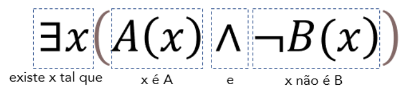

https://t.me/KakashiAssinaturasBot

---

<!-- pagina: 11 -->

**Equipe Exatas Estratégia Concursos Aula 04** 

Como o enunciado deu que **C(x) representa "x é carneiro" e D(x) representa "x é dócil"** . Temos que: 

###### ∃𝒙(𝑪(𝒙) ∧¬𝑫(𝒙)) 

Perceba que para matarmos a questão, convertemos a frase para um formato familiar. Guarde essa dica! Às vezes, as questões não dão as proposições categóricas do jeito "tradicional". No entanto, lembre-se que você pode sim **escrevê-la de uma forma mais conveniente** , **desde que expresse o mesmo sentido** . Por fim, recomendo fortemente que decore a tabelinha abaixo: 

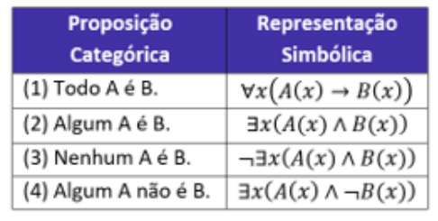

Esse tipo de conversão costuma cair bastante e saber "na lata" vai lhe **poupar preciosos minutos** enquanto seus concorrentes estarão "quebrando" a cabeça! 

**Gabarito:** LETRA D. 

#### Relações e Aridade 

Vamos avançar um pouco mais. Todos os predicados que vimos até agora são **relações unárias** , isto é, possuem apenas uma única variável. Nesse caso, dizemos que **predicados assim possuem aridade 1** <u>.</u> 

𝐼(𝑥):        𝑥 é impar 𝐺(𝑥):        𝑥 é gerente de projetos 𝑃(𝑥):        𝑥 é um pavão 

No entanto, podemos ir além e **estabelecer relações entre dois ou mais objetos!** Observe alguns exemplos de **<u>relações binárias</u>** <u>.</u> 

𝐶(𝑥, 𝑦):      𝑥 é casado com y 𝐸(𝑥, 𝑦):      𝑥 estuda na escola y 𝐴(𝑥, 𝑦):      𝑥 acredita na religião y 

Os predicados acima possuem duas variáveis e, por esse motivo, dizemos que **<u>possui aridade 2</u>** . É importante ressaltar que, com duas variáveis, **encontraremos 2 quantificadores em um mesmo predicado** . **Cada um**

---

<!-- pagina: 12 -->

**Equipe Exatas Estratégia Concursos Aula 04** 

**deles estará associado ao escopo de sua variável** . Para esclarecer melhor esse ponto da matéria, vamos analisar uma questão recente que traz essa abordagem. 

**(TRANSPETRO/2018)** Considere a seguinte sentença: 

“Todo aluno do curso de Informática estuda algum tópico de Matemática Discreta” 

e os seguintes predicados: 

𝐴(𝑥): 𝑥 é aluno. 𝐼(𝑥): 𝑥 é do curso de Informática. 𝐸(𝑥, 𝑦): 𝑥 estuda 𝑦 . 𝑇(𝑥): 𝑥 é tópico de Matemática Discreta. 

Uma forma de traduzi-la é 

A) ∀𝑥((𝐴(𝑥) ∧𝐼(𝑥)) →∃𝑦(𝑇(𝑦) ∧𝐸(𝑥, 𝑦))) 

B) ∀𝑥(𝐴(𝑥) ∧𝐼(𝑥)) ∧∀𝑦(𝑇(𝑦) →𝐸(𝑥, 𝑦)) 

C) ∃𝑥∀𝑦(𝐴(𝑥) ∧/(𝑥) ∧𝑇(𝑦) ∧¬𝐸(𝑥, 𝑦)) 

D) ∀𝑥((𝐴(𝑥) ∧𝐼(𝑥)) →∀𝑦(𝑇(𝑦) →𝐸(𝑥, 𝑦))) 

E) ∃𝑥∀(𝐴(𝑥) ∧𝐼(𝑥) ∧𝑇(𝑦) ∧𝐸(𝑥, 𝑦)) 

###### **Comentários:** 

Inicialmente, note que 𝒙 **irá representar alguém no conjunto de todos os alunos** . 𝒚 **representa alguma matéria que é estudada por** 𝒙 . Temos a seguinte sentença para traduzi-la em linguagem simbólica: 

###### **“Todo aluno do curso de Informática estuda algum tópico de Matemática Discreta”** 

Note que podemos reescrever a frase do seguinte modo: 

###### **“Todo aluno do curso de Informática é estudante de algum tópico de Matemática Discreta”** 

Vimos que expressões do tipo **"Todo P é Q."** pode ser representada simbolicamente por: 

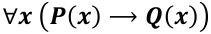

---

<!-- pagina: 13 -->

**Equipe Exatas Estratégia Concursos Aula 04** 

Portanto, devemos procurar alternativas que **possuam uma condicional** . Sabendo disso, podemos **eliminar as alternativas** 𝑪 **e** 𝑬 . Agora, vamos descobrir quem é o antecedente e o consequente dessa condicional. Atente-se aos predicados fornecidos pelo enunciado: 

𝐴(𝑥): 𝑥 é aluno. 𝐼(𝑥): 𝑥 é do curso de Informática. 𝐸(𝑥, 𝑦): 𝑥 estuda 𝑦 . 

𝑇(𝑥): 𝑥 é tópico de Matemática Discreta. 

Queremos que 𝒙 **seja aluno** **<u>e</u> seja do curso de informática** . Logo, 𝑨(𝒙) ∧ 𝑰(𝒙) . Agora, queremos dizer que esse aluno **estuda algum tópico de matemática discreta** . Se 𝑥 estuda 𝑦 , então 𝑦 é o tópico de matemática discreta, logo devemos usar 𝑻(𝒚) . Para representar "algum", **utilizamos o quantificador** ∃ **.** Ficamos então com **x estuda y** **<u>e</u> y é tópico de matemática discreta** ( 𝑻(𝒚) ∧𝑬(𝒙, 𝒚) ) 

∀𝑥((𝐴(𝑥) ∧𝐼(𝑥)) →∃𝑦(𝑇(𝑦) ∧𝐸(𝑥, 𝑦))) 

**Gabarito:** LETRA A. 

#### Equivalências Lógicas na LPO 

Pessoal, **já sabemos que equivalências lógicas caem muito** em provas de concurso! Elas são igualmente cobradas aqui no contexto da Lógica de Primeira Ordem. No entanto, elas aparecerão numa forma **aparentemente mais complexa** . Confira, por exemplo, como representamos **as leis de De Morgan** : 

¬(𝑷(𝒙) ∧𝑸(𝒙)) ≡¬𝑷(𝒙) ∨¬𝑸(𝒙) ¬(𝑷(𝒙) ∨𝑸(𝒙)) ≡¬𝑷(𝒙) ∧¬𝑸(𝒙) 

**(ESFCEX/2021)** Considere a seguinte sentença quantificada: (∀𝑥) (𝑥 + 3 < 5 ∧ 𝑥 + 7 ≥ 1). 

Uma negação para a sentença apresentada é: 

A) (∀𝑥) (𝑥 + 3 > 5 ∧ 𝑥 + 7 ≤ 1). B) (∀𝑥) (𝑥 + 3 ≥ 5 ∨ 𝑥 + 7 < 1). C) (∃𝑥) (𝑥 + 3 ≥ 5 ∨ 𝑥 + 7 < 1). D) (∃𝑥) (𝑥 + 3 > 5 ∨ 𝑥 + 7 ≤ 1). 

https://t.me/KakashiAssinaturasBot

---

<!-- pagina: 14 -->

**Equipe Exatas Estratégia Concursos Aula 04** 

E) (∃𝑥) (𝑥 + 3 ≥ 5 ∧ 𝑥 + 7 < 1). 

**Comentários:** 

Temos que negar a proposição apresentada. 

O primeiro passo é negar o quantificador. Como na sentença do enunciado tínhamos (∀𝑥) , **na negação ficaremos com o** (∃𝒙) **.** Sabendo disso, já poderíamos cortar a letra A e a letra B. 

O segundo passo é perceber que se trata de uma proposição composta conectadas pelo conectivo ∧ . Aqui, lembramos das leis de De Morgan, ou seja, **na negação substituiremos o conectivo** ∧ **pelo** ∨ . 

Nesse ponto, podemos eliminar a letra E. Ademais, devemos negar cada uma das proposições: 

Quando negamos 𝑥 + 3 < 5 , ficamos com 𝑥+ 3 ≥5 . 

Quando negamos 𝑥 + 7 ≥ 1 , ficamos com 𝑥+ 7 < 1. 

Juntando tudo, nossa resposta fica: 

(∃𝑥) (𝑥 + 3 ≥ 5 ∨ 𝑥 + 7 < 1) 

**Gabarito:** LETRA C.

---

<!-- pagina: 15 -->

**Equipe Exatas Estratégia Concursos Aula 04** 

## **QUESTÕES COMENTADAS** 

### Lógica de Primeira Ordem 

###### **1. (IGEDUC/AEB/2024) Julgue o item a seguir.** 

Quando atribuímos um valor do domínio à variável x na condição p(x), resulta-se numa proposição. Na matemática, uma técnica essencial para gerar proposições de p(x) é o uso dos quantificadores, ∀𝑥 para o quantificador universal e ∃𝑥 para o existencial, colocados antes da condição. 

###### **Comentários:** 

Correto, pessoal! Foi exatamente o que vimos quando estudamos proposições quantificadas. Lembre-se que há duas maneiras de transformar uma sentença aberta em uma proposição: podemos **atribuir um valor para a variável** ou **podemos utilizar os quantificadores** . 

Os quantificadores estão corretamente indicados, uma vez que ∀ representa o quantificador universal e ∃ representa o quantificador existencial. 

###### **Gabarito:** CERTO. 

**2. (FGV/PREF. NOVA IGUAÇU/2024) Sejam P o conjunto não vazio formado por todos os pintores renascentistas da história da humanidade e p um elemento desse conjunto. Considere as propriedades E e A, definidas no conjunto P:** 

**E(p): “p foi escultor” A(p): “p foi arquiteto”** 

**Admita verdadeira a proposição** ∄𝒑(¬𝑬(𝒑) ∨¬𝑨(𝒑)) **. Logo** 

A) nenhum pintor renascentista foi arquiteto e escultor. 

B) todos os pintores renascentistas foram arquitetos e escultores. 

C) houve pintores renascentistas que foram arquitetos, mas não escultores. 

D) houve pintores renascentistas que foram escultores, mas não arquitetos. 

E) houve pintores renascentistas que não foram arquitetos e nem escultores. 

###### **Comentários:** 

A proposição fornecida pela questão foi: 

∄𝒑(¬𝑬(𝒑) ∨ ¬𝑨(𝒑)) 

De acordo com o enunciado, temos que:

---

<!-- pagina: 16 -->

**Equipe Exatas Estratégia Concursos Aula 04** 

- E(p): “p foi escultor”. Sendo assim, **¬E(p) é "p não foi escultor".** 

- A(p): “p foi arquiteto”. Sendo assim, **¬A(p) é "p não foi arquiteto".** 

Além disso, sabemos que " ∄𝒑 **" significa "não existe p"** e que ∨ **é o conectivo "ou".** 

Quando juntamos essas informações, chegamos ao seguinte resultado: 

###### **Não existe pintor renascentista (p) que não foi escultor ou que não foi arquiteto.** 

De uma forma mais rebuscada, o que a sentença nos informa é que **todos os pintores renascentistas foram arquitetos e escultores** , conforme aponta a alternativa B. No entanto, podemos trabalhar mais um pouco a proposição para transformá-la ao formato da resposta. Utilizando as **equivalências lógicas** , temos que: 

∄𝒑(¬𝑬(𝒑) ∨¬𝑨(𝒑)) ≡¬∃𝒑(¬𝑬(𝒑) ∨¬𝑨(𝒑)) ≡∀𝒑¬(¬𝑬(𝒑) ∨¬𝑨(𝒑)) ≡∀𝒑(𝑬(𝒑) ∧𝑨(𝒑)) 

Ou seja: 

∄𝒑(¬𝑬(𝒑) ∨¬𝑨(𝒑)) ≡∀𝒑(𝑬(𝒑) ∧ 𝑨(𝒑)) 

Temos então que podemos enunciar a proposição da questão da seguinte forma: 

**Para todo pintor renascentista p** , **p foi escultor e p foi arquiteto** . 

###### **Gabarito:** LETRA B. 

**3. (FGV/TJ-MT/2024) Seja A o conjunto de todos os alunos da turma X da escola Y e x** ∈ **A. Considere as seguintes funções proposicionais:** 

###### **p(x): o aluno x sabe lógica.** 

**q(x): o aluno x sabe filosofia.** 

**r(x): o aluno x será aprovado no ano letivo de 2024.** 

**A proposição composta “Qualquer que seja o aluno da turma X da escola Y, se ele sabe lógica ou sabe filosofia, então será aprovado no ano letivo de 2024” é melhor representada, em linguagem simbólica, por** A) ∃𝑥: (𝑝(𝑥) ∧𝑞(𝑥) →𝑟(𝑥)) 

B) ∃𝑥: (𝑝(𝑥) ∨𝑞(𝑥) →𝑟(𝑥)) 

C) ∀𝑥: (𝑝(𝑥) ∧𝑞(𝑥) →𝑟(𝑥)) 

D) ∀𝑥: (𝑝(𝑥) ∨𝑞(𝑥) →𝑟(𝑥)) 

E) ∄𝑥(𝑝(𝑥) ∨𝑞(𝑥) →𝑟(𝑥))

---

<!-- pagina: 17 -->

**Equipe Exatas Estratégia Concursos Aula 04** 

###### **Comentários:** 

Vamos pegar cada um do trechos da proposição composta! 

- " **Qualquer que seja o aluno** ...". Esse trecho indica que usaremos o quantificador universal ( ∀𝒙 ). 

- "... **ele sabe lógica ou sabe filosofia** ...". Esse trecho indica que usaremos 𝑝(𝑥) ∨ 𝑞(𝑥) . 

.... " **se ... então será reprovado** ". Esse trecho indica que usaremos → 𝑟(𝑥) . 

Ora, quando juntamos todas essas informações, chegamos a seguinte proposição em **linguagem simbólica** : 

∀𝑥∶ <u>(𝑝(𝑥) ∨𝑞(𝑥) →𝑟(𝑥))</u> 

Observe que a alternativa que contém a proposição correta é a D! 

**Gabarito:** LETRA D. 

###### **4. (CEBRASPE/TST/2024)** 

(∃x) (maisIdade(x)→(∀y) (maisJovem(y)→ maisEstudioso(x,y))) 

**Considerando que maisIdade(x) indica que x é uma pessoa de mais idade na faculdade, que maisJovem(x) indica que x é uma pessoa mais jovem na faculdade e que maisEstudioso(x,y) indica que x é mais estudioso que y, assinale a opção que traduz corretamente a notação lógica da sentença precedente.** 

A) Algumas pessoas de mais idade na faculdade são mais estudiosas que alguns dos mais jovens de lá. 

B) Todas as pessoas de mais idade na faculdade são mais estudiosas que alguns dos mais jovens de lá. 

C) Não existe nenhuma pessoa de mais idade na faculdade que seja mais estudiosa que todos os mais jovens de lá. 

D) Algumas pessoas de mais idade na faculdade são mais estudiosas que todos os mais jovens de lá. 

E) Todas as pessoas de mais idade na faculdade são mais estudiosas que todos os mais jovens de lá. 

###### **Comentários:** 

Vamos separar o significado de cada um dos predicados. 

maisIdade(x) = x é uma **pessoa de mais idade** na faculdade 

maisJovem(x) = x é uma **pessoa mais jovem** na faculdade 

maisEstudioso(x,y) = x é **mais estudioso** que y 

Com eles em mente, vamos fazer a "tradução". 

(∃x) (maisIdade(x) → (∀y) (maisJovem(y)→ maisEstudioso(x,y))) 

Começaremos pelo trecho mais interno:

---

<!-- pagina: 18 -->

**Equipe Exatas Estratégia Concursos Aula 04** 

(maisJovem(y)→ maisEstudioso(x,y))) 

Temos que **se "y" é uma pessoa mais jovem na faculdade, então x é mais estudioso do que y.** Não sabemos quem é "y", nem "x". Nesse momento, entra o papel do primeiro quantificador. 

(∀y) (maisJovem(y)→ maisEstudioso(x,y))) 

O (∀y) entra aqui para nos dizer que não importa quem é y. É todo "y"! Se y for o mais jovem, então "x" é mais estudioso do que "y". De um jeito mais natural, podemos dizer que **"x" é mais estudioso do que qualquer jovem da faculdade** . 

Agora, vamos adicionar a outra parte da notação. 

(maisIdade(x) → (∀y) (maisJovem(y)→ maisEstudioso(x,y))) 

Observe que temos uma outra condicional: 

Se x é uma pessoa de mais idade, então "x" é mais estudioso do que qualquer jovem da faculdade. 

Aproveitamos o trabalho que fizemos anteriormente! Agora, sobra o seguinte questionamento: _quem é "x"?_ 

Nesse contexto, vem o quantificador mais externo! 

(∃x) (maisIdade(x) → (∀y) (maisJovem(y)→ maisEstudioso(x,y))) 

O (∃x) significa "existe x" ou "algum x". Como "x" representa uma pessoa na faculdade, então podemos lêlo como "alguma pessoa". Quando juntamos essa informação com a última tradução que fizemos, podemos concluir que **algumas pessoas de mais de mais idade são mais estudiosas do que qualquer jovem da faculdade** . A alternativa que trouxe corretamente essa ideia é a D. 

###### **Gabarito:** LETRA D. 

**5. (CEBRASPE/TJ-ES/2024) Acerca de noções de lógica, julgue o item a seguir.** 

A sentença “Há pelo menos um desembargador que é mais velho que todos os juízes” pode ser escrita na forma simbólica como ∀𝑥∃𝑦 (𝐷(𝑥) ∧𝐽(𝑦) →𝑉(𝑥, 𝑦)) , em que 𝐷(𝑥) representa a proposição “x é desembargador”; 𝐽(𝑦) representa a proposição “y é juiz”; e 𝑉(𝑥, 𝑦) representa a proposição “x é mais velho que y”. 

###### **Comentários:**

---

<!-- pagina: 19 -->

**Equipe Exatas Estratégia Concursos Aula 04** 

Vamos separar o significado de cada um dos predicados: 

𝐷(𝑥) = x é desembargador 

𝐽(𝑦) = y é juiz 

𝑉(𝑥, 𝑦) = x é mais velho que y 

Agora, devemos traduzir a seguinte expressão simbólica: 

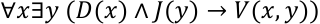

Observe que inicialmente temos o ∀𝑥 . Essa notação significa que vamos considerar **o conjunto de todos os desembargadores** , uma vez que "x" está associado com a função-predicado "x é desembargador" e ∀ é nosso quantificador universal. 

Por sua vez, temos também ∃𝑦 , que significa que vamos considerar apenas **algum juiz** , uma vez que "y" está associado com a função-predicado "y é juiz" e ∃ é nosso quantificador existencial. 

Dito isso, ∀𝑥∃𝑦 fornece a ideia de que "para todo desembargador, existe/algum juiz..." 

Agora, vamos analisar o que está dentro dos parênteses. 

###### 𝐷(𝑥) ∧𝐽(𝑦) →𝑉(𝑥, 𝑦) 

Ora, temos uma conjunção e uma condicional! 

Se "x" é desembargador e "y" é juiz, então "x" é mais velho do que "y". 

Juntando a tradução acima com a ideia proposta pelos quantificadores, obtemos: 

Para cada desembargador, existe um juiz mais novo do que ele. 

Com isso, percebemos **que o significado proposto no item não está correto** . 

###### **Gabarito:** ERRADO. 

**6. (UFAL/IF-AL/2023) Considerando o universo dos números inteiros e que os símbolos** ∃ **e** ∀ **representam os quantificadores existencial e universal, respectivamente, assinale a alternativa verdadeira.** 

A) ∀𝑥∀𝑦∃𝑧 (𝑥+ 𝑦< 𝑧) 

B) ∀𝑥∃𝑦∀𝑧 (𝑥+ 𝑦< 𝑧) 

C) ∀𝑥∀𝑦∀𝑧 (𝑥+ 𝑦< 𝑧) 

D) ∃𝑥∀𝑦∀𝑧 (𝑥+ 𝑦< 𝑧)

---

<!-- pagina: 20 -->

**Equipe Exatas Estratégia Concursos Aula 04** 

###### E) ∃𝑥∃𝑦∀𝑧 (𝑥+ 𝑦> 𝑧) 

###### **Comentários:** 

Vamos comentar cada uma das alternativas. 

###### A) ∀𝑥∀𝑦∃𝑧 (𝑥+ 𝑦< 𝑧) 

**Esse já é o nosso gabarito, pessoal!** A proposição nos afirma que " **para todo** 𝒙 **e para todo** 𝒚 **, existe** 𝒛 **tal que** 𝒙+ 𝒚< 𝒛 ". Observe que, como estamos lidando com o **universo dos números inteiros** , isso sempre será verdade, pois sempre conseguiremos encontrar um número "z" que é maior do que a soma de qualquer outros dois. 

###### B) ∀𝑥∃𝑦∀𝑧 (𝑥+ 𝑦< 𝑧) 

**Errado!** A tradução dessa seria algo como: " para todo x e algum y, qualquer z é tal que 𝑥+ 𝑦< 𝑧 . Observe que **não é qualquer "** 𝒛 **" que tornaria a inequação válida** , uma vez sempre existirá um " 𝑧 " menor do que qualquer resultado da soma 𝑥+ 𝑦 . 

###### C) ∀𝑥∀𝑦∀𝑧 (𝑥+ 𝑦< 𝑧) 

**Errado!** Dessa vez, a proposição afirma que para qualquer x, y e z, ela seria sempre válida. Ora, isso não é verdade, tome 𝑥= 1 , 𝑦= 1 e 𝑧= 1 . Com isso, teríamos 2 < 1 , o que claramente é falso. 

###### D) ∃𝑥∀𝑦∀𝑧 (𝑥+ 𝑦< 𝑧) 

**Errado!** É o mesmo caso da alternativa "B". Não é para qualquer "z" que a desigualdade funciona. 

###### E) ∃𝑥∃𝑦∀𝑧 (𝑥+ 𝑦> 𝑧) 

**Errado!** Também cai na situação vista anteriormente. Não é para qualquer "z" que a desigualdade funciona. 

###### **Gabarito:** LETRA A. 

**7. (Inst. Consulplan/FEPAM-RS/2023) Os quantificadores, universal e existencial, são operadores lógicos que restringem as funções proposicionais, de forma que estas funções se refiram a todo o conjunto ou a uma parte dele. Considere A = {1, 2, 3, 4, 5} e dado x** ∈ **A. Assinale, a seguir, a função proposicional quantificada que tem seu valor lógico falso.** 

A) ∀𝑥 (𝑥+ 3 < 10) 

B) ∃𝑥 (𝑥+ 3 > 5) 

- C) ∀𝑥 (𝑥+ 3 ≤7) 

- D) ∃𝑥 (𝑥² + 2𝑥= 15) 

- E) ∃𝑥 (𝑥2 −7𝑥+ 10 = 0) 

###### **Comentários:** 

Antes de qualquer coisa, devemos ter em mente que o 𝑥 só poderá assumir valores que estão em A.

---

<!-- pagina: 21 -->

**Equipe Exatas Estratégia Concursos Aula 04** 

###### 𝑨 = {𝟏, 𝟐, 𝟑, 𝟒, 𝟓} 

Agora, vamos analisar as alternativas! 

###### A) ∀𝑥 (𝑥+ 3 < 10) 

**Errado.** Nessa alternativa, temos que "para todo 𝑥 , 𝑥+ 3 < 10 ". Devemos verificar se isso realmente acontece para qualquer valor de A. Quando testamos o maior valor de A, 𝑥= 5 , temos que 5 + 3 = 8 < 10 . Como a **proposição é verdadeira** para o maior valor de A, então ela será verdadeira para todos os outros. Portanto, não é a alternativa que estamos buscando! **Queremos a falsa** <u>!</u> 

###### B) ∃𝑥 (𝑥+ 3 > 5) 

**Errado.** Dessa vez, temos que "existe 𝑥 tal que 𝑥+ 3 > 5 ". Observe que essa proposição é verdadeira, uma vez que se usarmos 𝑥= 5 , temos que 5 + 3 = 8 > 5 . 

###### C) ∀𝑥 (𝑥+ 3 ≤7) 

**Gabarito!** Dessa vez, temos que "para todo 𝑥 , 𝑥+ 3 ≤7 ". Ora, **basta usarmos** 𝒙= 𝟓 **para perceber que a proposição não é verdadeira** , uma vez que 5 + 3 = 8 > 7 , o que contraria a alternativa. 

###### D) ∃𝑥 (𝑥² + 2𝑥= 15) 

**Errado.** A proposição afirma que existe um 𝑥 em A tal que 𝑥 satisfaz a equação de segundo grau indicada. Há duas saídas possíveis aqui: podemos resolver a equação de segundo grau e encontrar as raízes ou **podemos substituir os valores de A na equação e ver se algum satisfaz** . Quando optamos por essa última saída, identificamos que 𝒙= 𝟑 **satisfaz a equação,** o que torna a proposição é verdadeira. 

###### E) ∃𝑥 (𝑥2 −7𝑥+ 10 = 0) 

**Errado!** Para verificar essa alternativa, usamos a mesma estratégia da anterior. Substituímos os valores de A para verificar se algum satisfaz. Observe que 𝒙= 𝟐 **é uma das raízes da equação** , o que torna a proposição também verdadeira. 

###### **Gabarito:** LETRA C. 

###### **8. (FADESP/PM-PA/2022) Considere as seguintes sentenças:** 

###### **S1: Para todo militar existe uma missão.** 

###### **S2: Sargento Maia é paraense.** 

###### **Pode-se afirmar que** 

A) S1 enquadra-se como sentença de uma lógica proposicional enquanto S2 caracteriza-se como sendo de uma lógica de 1ª ordem. 

B) S1 enquadra-se como sentença de uma lógica de 1ª ordem enquanto S2 caracteriza-se como sendo de uma lógica proposicional. 

C) S1 e S2 enquadram-se como sentenças lógicas exclusivamente de 1ª ordem.

---

<!-- pagina: 22 -->

**Equipe Exatas Estratégia Concursos Aula 04** 

D) S1 e S2 enquadram-se como sentenças lógicas exclusivamente proposicionais. 

###### **Comentários:** 

Questão bem direta! Observe que S1 se utiliza de quantificadores (para todo), enquanto S2 não. Com isso, podemos afirmar que S1 é melhor enquadrada como uma sentença estudada pela **lógica de 1ª ordem** , enquanto S2 está associada à **lógica proposicional** . 

###### **Gabarito:** LETRA B. 

**9. (FAPEC/UFMS/2022) Dadas as proposições que seguem:** 

###### **p)** (∃! 𝒙)(𝒙−𝟐= 𝟓) 

**q)** (∀𝒚)(𝟐𝒚+ 𝟕> 𝟎) 

**r)** (∃𝒂)(−𝟐𝒂𝟐 + 𝟓𝟎= 𝟎) 

###### **Determine corretamente os valores lógicos das negações das respectivas proposições (p, q, r).** 

A) Verdadeiro; Verdadeiro; Falso. 

B) Falso; Falso; Verdadeiro. 

C) Falso; Falso; Falso. 

D) Verdadeiro; Falso; Verdadeiro. 

E) Falso; Verdadeiro; Falso. 

###### **Comentários:** 

Vamos comentar cada uma das proposições. 

###### **p)** (∃! 𝒙)(𝒙−𝟐= 𝟓) 

Pessoal, a primeira informação importante é que ∃! 𝑥 significa " **existe um único x** ". Logo em seguida, temos na proposição uma equação de primeiro grau cuja única raiz é 7. Logo, podemos afirmar que **"p" é verdadeira** uma vez que realmente existe apenas um único x ("7") que satisfaz a equação dada. Com isso, o valor lógico da **negação de "p"** é **<u>falso</u>** <u>.</u> 

###### **q)** (∀𝒚)(𝟐𝒚+ 𝟕> 𝟎) 

A proposição afirma que **para todo y** , temos que 2y + 7 > 0. Ora, **isso é falso** ! A inequação somente será verdadeira para valores de y maiores do que − 𝟑, 𝟓 . Com isso, o valor lógico da **negação de "q"** é **<u>verdadeiro</u>** <u>.</u> 

###### **r)** (∃𝒂)(−𝟐𝒂𝟐 + 𝟓𝟎= 𝟎) 

A proposição afirma que **existe a** tal que −𝟐𝒂𝟐 + 𝟓𝟎= 𝟎 **.** Ora, quando resolvemos a equação de segundo grau, chegamos às raízes 𝑎′ = −5 e 𝑎′′ = 5 . Portanto, "r" é verdadeira. Com isso, o valor lógico da negação de "r" é **<u>falso</u>** <u>.</u> 

A alternativa que contém sequência **<u>Falso, Verdadeiro e Falso</u>** é a alternativa E.

---

<!-- pagina: 23 -->

**Equipe Exatas Estratégia Concursos Aula 04** 

###### **Gabarito:** LETRA E. 

**10. (FUNDATEC/AGERGS/2022) Considere as seguintes proposições quantificadas:** 

**I.** ∀𝒙∈{−𝟐, 𝟎, 𝟐}, 𝒙+ 𝟐≠𝟑 **.** 

**II.** ∃𝒙∈{−𝟐, 𝟎, 𝟐} 𝒙+ 𝟑= 𝟓 **.** 

**III.** ∀𝒙∈{−𝟐, 𝟎, 𝟐}, 𝒙> 𝟎 **.** 

###### **Com relação às afirmações, podemos dizer que:** 

- A) Todas são verdadeiras. 

- B) Todas são falsas. 

- C) Apenas I e II são verdadeiras. 

- D) Apenas I e III são verdadeiras. 

- E) Apenas II e III são verdadeiras. 

###### **Comentários:** 

Vamos analisar cada uma das proposições, com muita atenção aos quantificadores de cada uma! 

- **I.** ∀𝒙∈{−𝟐, 𝟎, 𝟐}, 𝒙+ 𝟐≠𝟑 **.** 

- Para 𝑥= −2 , temos que −2 + 2 = 0 ≠3 . 

- Para 𝑥= 0 , temos que 0 + 2 = 2 ≠3 . 

- Para 𝑥= 2 , temos que 2 + 2 = 4 ≠3 . 

Observe que **para qualquer valor do domínio** {-2, 0, 2}, **a soma resultante é diferente de 3** . Com isso, temos que a **proposição é verdadeira** . 

**II.** ∃𝒙∈{−𝟐, 𝟎, 𝟐} 𝒙+ 𝟑= 𝟓 **.** 

- Para 𝑥= −2 , temos que −2 + 3 = 1 ≠5 . 

- Para 𝑥= 0 , temos que 0 + 3 = 3 ≠5 . 

- **Para** 𝒙= 𝟐 **, temos que** 𝟐+ 𝟑= 𝟓 . 

Observe que **existe um valor no domínio** {-2, 0, **2** } tal que **a soma resulta em 5** . Com isso, temos que a **proposição é verdadeira** <u>.</u> 

**III.** ∀𝒙∈{−𝟐, 𝟎, 𝟐}, 𝒙> 𝟎 **.** 

- Para 𝑥= −2 , temos que 𝑥< 0 . 

- Para 𝑥= 0 , temos que 𝑥= 0 . 

- Para 𝑥= 2 , temos que 𝑥> 0 .

---

<!-- pagina: 24 -->

**Equipe Exatas Estratégia Concursos Aula 04** 

Observe que **<u>não é</u> para qualquer valor do domínio** {-2, 0, 2} que teremos x > 0. Isso só acontece quando 𝑥= 2 . Com isso, temos que a **proposição é falsa** <u>.</u> 

###### **Gabarito:** LETRA C. 

**11. (PROGEP FURG/FURG/2022) Considere P(x) a seguinte sentença aberta, "x é estudante e P(x) é esforçado”. A proposição “Todos os estudantes são esforçados” pode ser corretamente simbolizada por:** A) (∃𝑥) (𝑃(𝑥)) 

B) (∀𝑥) (𝑃(𝑥)) 

C ) (~𝑥) (𝑃(𝑥)) 

D) (∀𝑥) (~𝑃(𝑥)) 

E) (∃! 𝑥) (𝑃(𝑥)) 

###### **Comentários:** 

Questão que foi mal formulada pois define P(x) em função do próprio P(x). Só por essa confusão, já merecia ser anulada. Para resolvermos adequadamente a questão, **devemos interpretar que "x" pertence ao domínio dos estudantes e que P(x) é a função-predicado "x é esforçado".** Recuperado o enunciado da questão, vamos analisar o que significa cada uma das alternativas. 

###### A) (∃𝑥) (𝑃(𝑥)) 

**Errado** , pois a proposição significa que " **existe estudante que é esforçado** ". 

###### B) (∀𝑥) (𝑃(𝑥)) 

**Correto** , pois a proposição traduz a ideia de que " **todos os estudantes são esforçados** ". 

###### C ) (~𝑥) (𝑃(𝑥)) 

**Errado** , pois  ( ~𝑥 ) não é uma forma válida de quantificação. 

###### D) (∀𝑥) (~𝑃(𝑥)) 

**Errado** , pois a proposição significa que " **todos os estudantes não são esforçados** ". 

###### E) (∃! 𝑥) (𝑃(𝑥)) 

**Errado** , pois a proposição significa que " **existe um único estudante que é esforçado** ". 

###### **Gabarito:** LETRA C. 

**12. (SELECON/PREF. CUIABÁ/2019) Em Lógica e em Matemática, usam-se símbolos próprios chamados quantificadores. Existem fundamentalmente dois tipos de quantificadores: universal e existencial. O símbolo que representa o quantificador universal está representado na seguinte alternativa** : A) ∃ 

B) ∀

---

<!-- pagina: 25 -->

**Equipe Exatas Estratégia Concursos Aula 04** 

C)  > 

D) ⇒ 

###### **Comentários:** 

Questão bem direta que pede para identificarmos o **<u>quantificador universal</u>** <u>! Não esqueça:</u> 

# <u>∀</u> 

**Gabarito:** LETRA B. 

###### **13. (CESGRANRIO/TRANSPETRO/2018) Considere a seguinte sentença:** 

**“Todo aluno do curso de Informática estuda algum tópico de Matemática Discreta” e os seguintes predicados:** 

𝑨(𝒙): 𝒙 **é aluno.** 𝑰(𝒙): 𝒙 **é do curso de Informática.** 𝑬(𝒙, 𝒚): 𝒙 **estuda** 𝒚 **.** 𝑻(𝒙): 𝒙 **é tópico de Matemática Discreta.** 

###### **Uma forma de traduzi-la é** 

A) ∀𝑥((𝐴(𝑥) ∧𝐼(𝑥)) →∃𝑦(𝑇(𝑦) ∧𝐸(𝑥, 𝑦))) 

B) ∀𝑥(𝐴(𝑥) ∧𝐼(𝑥)) ∧∀𝑦(𝑇(𝑦) →𝐸(𝑥, 𝑦)) 

C) ∃𝑥∀𝑦(𝐴(𝑥) ∧/(𝑥) ∧𝑇(𝑦) ∧¬𝐸(𝑥, 𝑦)) 

D) ∀𝑥((𝐴(𝑥) ∧𝐼(𝑥)) →∀𝑦(𝑇(𝑦) →𝐸(𝑥, 𝑦))) 

E) ∃𝑥∀(𝐴(𝑥) ∧𝐼(𝑥) ∧𝑇(𝑦) ∧𝐸(𝑥, 𝑦)) 

###### **Comentários:** 

Inicialmente, note que 𝒙 **irá representar alguém no conjunto de todos os alunos** . 𝒚 **representa alguma matéria que é estudada por** 𝒙 . Temos a seguinte sentença para traduzi-la em linguagem simbólica: 

##### **“Todo aluno do curso de Informática estuda algum tópico de Matemática Discreta”** 

Note que podemos reescrever a frase do seguinte modo: 

##### **“Todo aluno do curso de Informática é estudante de algum tópico de Matemática Discreta”** 

Vimos que expressões do tipo **"Todo P é Q."** pode ser representada simbolicamente por: 

#### ∀𝒙 (𝑷(𝒙) ⟶𝑸(𝒙))

---

<!-- pagina: 26 -->

**Equipe Exatas Estratégia Concursos Aula 04** 

Portanto, devemos procurar alternativas que **possuam uma condicional** . Sabendo disso, podemos **eliminar as alternativas** 𝑪 **e** 𝑬 . Agora, vamos descobrir quem é o antecedente e o consequente dessa condicional. Atente-se aos predicados fornecidos pelo enunciado: 

𝐴(𝑥): 𝑥 é aluno. 𝐼(𝑥): 𝑥 é do curso de Informática. 

𝐸(𝑥, 𝑦): 𝑥 estuda 𝑦 . 

𝑇(𝑥): 𝑥 é tópico de Matemática Discreta. 

Queremos que 𝒙 **seja aluno** **<u>e</u> seja do curso de informática** . Logo, 𝑨(𝒙) ∧ 𝑰(𝒙) . Agora, queremos dizer que esse aluno **estuda algum tópico de matemática discreta** . Se 𝑥 estuda 𝑦 , então 𝑦 é o tópico de matemática discreta, logo devemos usar 𝑻(𝒚) . Para representar "algum", **utilizamos o quantificador** ∃ **.** Ficamos então com **x estuda y** **<u>e</u> y é tópico de matemática discreta** ( 𝑻(𝒚) ∧ 𝑬(𝒙, 𝒚) ) 

#### ∀𝑥((𝐴(𝑥) ∧𝐼(𝑥)) →∃𝑦(𝑇(𝑦) ∧𝐸(𝑥, 𝑦))) 

###### **Gabarito:** LETRA A. 

**14. (UFAL/PREF. ROTEIRO/2017) Considerando que os símbolos ¬,** ∧ **,** ∨ **,** ∀ **e** ∃ **representam negação, conjunção, disjunção, quantificador universal e quantificador existencial, respectivamente, e dado o conjunto de premissas** {∀𝒙(¬𝑷(𝒙) ∧𝑸(𝒙))} **, qual informação abaixo pode ser inferida?** A) ∀𝑥(𝑃(𝑥) ∧𝑄(𝑥)) 

B) ∃𝑥(𝑃(𝑥) ∧𝑄(𝑥)) 

C) ∀𝑥𝑃(𝑥) 

D) ∀𝑥𝑄(𝑥) 

E) ∃𝑥𝑃(𝑥) 

###### **Comentários:** 

Devemos considerar que **o conjunto de premissas é verdadeiro** . Assim, para que a premissa ∀𝑥(¬𝑃(𝑥) ∧ 𝑄(𝑥)) seja verdadeira, a conjunção (¬𝑃(𝑥) ∧ 𝑄(𝑥)) **deve ser verdadeira para todo x** . 

Pela **tabela-verdade da conjunção ("e")** , sabemos que a conjunção (¬𝑃(𝑥) ∧ 𝑄(𝑥)) só é verdadeira **se ambas as partes forem verdadeiras** . 

Portanto, podemos inferir duas informações a partir da premissa: 

- ∀𝑥¬𝑃(𝑥) → Para todo x, **P(x) é falso (pois ¬P(x) é verdadeiro)** . 

- ∀𝑥𝑄(𝑥) → Para todo x, **Q(x) é verdadeiro** .

---

<!-- pagina: 27 -->

**Equipe Exatas Estratégia Concursos Aula 04** 

Com isso, a única proposição que pode ser inferida diretamente das premissas é aquela da **alternativa D** . 

###### **Gabarito:** LETRA D. 

**15. (QUADRIX/CORECON-PE/2016) Milton Friedman, um economista americano, prêmio Nobel em economia, afirmou:** 

**“Quando usamos política monetária expansionista e a política fiscal expansionista, causamos a inflação.”** 

**Usando sentenças da lógica de primeira ordem, representa a afirmação de Friedman:** 

A) ∀𝑥((𝑃(𝑥) ∧𝑄(𝑥)) →𝑅(𝑥)) 

B) 𝑅(𝑥) →∀𝑥((𝑃(𝑥) ∨𝑄(𝑥)) 

C) ∀𝑥((𝑃(𝑥) ∨𝑄(𝑥)) →𝑅(𝑥)) 

D) (𝑃(𝑥) ∨𝑄(𝑥)) →𝑄(𝑥)) 

E) 𝑄(𝑥) →∀𝑥((𝑃(𝑥) ∨𝑅(𝑥)) 

###### **Comentários:** 

Inicialmente, vamos interpretar as parte da frase como predicados de uma variável x. 

𝑃(𝑥) : Usamos política monetária em 𝑥 ; 

𝑄(𝑥) : Usamos política fiscal expansionista em 𝑥 ; 

𝑅(𝑥) : Causamos inflação em 𝑥 . 

Na frase de Friedman **, o termo "quando" expressa a ideia de uma condicional** : **se** usamos política monetária <u>e (</u> ∧ ) fiscal, então causamos inflação. Em notação lógica, podemos escrever: 

𝑃(𝑥)⋀𝑄(𝑥) →𝑅(𝑥) 

Como a frase expressa uma **regra geral** , que acontece sempre, para todo x, então **usamos o quantificador universal** ( ∀ ). Sendo assim, ficamos com a seguinte proposição: 

#### ∀𝑥((𝑃(𝑥) ∧ <u>𝑄(𝑥)) →𝑅(𝑥))</u> 

###### **Gabarito:** LETRA D. 

**16. (UFAL/PREF. SÃO SEBASTIÃO/2015) Se os símbolos ¬,** ∧ **,** ∨ **, →, ↔,** ∀ **e** ∃ **representam a negação, conjunção, disjunção, condicional, bicondicional, para todo e existe, respectivamente, a negação da fórmula** ∀𝒙(𝑷(𝒙) →𝑸(𝒙)) **é equivalente à fórmula** 

A) ∃𝑥(𝑃(𝑥) ∨𝑄(𝑥)) 

B) ∃𝑥(𝑃(𝑥) ∧¬𝑄(𝑥)) 

C) ∃𝑥(¬𝑃(𝑥) →¬𝑄(𝑥))

---

<!-- pagina: 28 -->

**Equipe Exatas Estratégia Concursos Aula 04** 

D) ∀𝑥(𝑃(𝑥) ∧¬𝑄(𝑥)) 

E) ∀𝑥(¬𝑃(𝑥) ∨𝑄(𝑥)) 

###### **Comentários:** 

Precisamos encontrar uma fórmula equivalente à **negação de** ∀𝒙(𝑷(𝒙) → 𝑸(𝒙)) **.** A primeira coisa a lembrar é que, ao negar um quantificador universal, **ele se transforma em um quantificador existencial** . Além disso, também negamos a proposição que ele quantifica. Assim, aplicando essa equivalência, podemos escrever: 

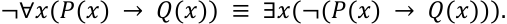

Em seguida, precisamos negar a condicional 𝑃(𝑥) → 𝑄(𝑥 ). Pela equivalência lógica, sabemos que **uma condicional é equivalente a** ¬𝑷(𝒙) ∨𝑸(𝒙) . Logo, a negação dessa condicional, isto é, ¬(𝑃(𝑥) → 𝑄(𝑥)) , será equivalente a ¬(¬𝑃(𝑥) ∨ 𝑄(𝑥)) . Aplicando a **Lei de De Morgan** , essa negação se transforma em 𝑃(𝑥) ∧¬𝑄(𝑥) . Assim, nossa expressão completa fica: 

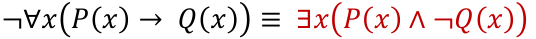

Portanto, a fórmula equivalente à negação de ∀𝑥(𝑃(𝑥) →𝑄(𝑥)) é justamente ∃𝑥(𝑃(𝑥) ∧¬𝑄(𝑥)) , que corresponde à alternativa B. 

###### **Gabarito:** LETRA B. 

**17. (UFAL/PREF. SÃO SEBASTIÃO/2015) Se os símbolos** ¬, ∧, ∨, →, ↔, ∀ **e** ∃ **representam a negação, conjunção, disjunção, condicional, bicondicional, para todo e existe, respectivamente, a fórmula** ∀𝒙∃𝒚(𝑷(𝒙) →𝑸(𝒚)) **é equivalente à fórmula** 

A) ∃𝑥𝑃(𝑥) →∃𝑦𝑄(𝑦) 

B) ∃𝑥𝑃(𝑥) ↔∀𝑦𝑄(𝑦) 

- C) ∀𝑥𝑃(𝑥) →∃𝑦𝑄(𝑦) 

- D) ∀𝑥𝑃(𝑥) →∀𝑦𝑄(𝑦) 

- E) ∀𝑥𝑃(𝑥) ↔∃𝑦𝑄(𝑦) 

###### **Comentários:** 

Vamos lá! 

Temos a fórmula ∀𝑥∃𝑦(𝑃(𝑥) →𝑄(𝑦)) , ou seja, para todo x, existe algum y tal que se P(x), então Q(y). 

Lembre-se da tabela-verdade da condicional **:** 𝑷(𝒙) → 𝑸(𝒚) **só será falsa se** 𝑷(𝒙) **for verdadeiro e** 𝑸(𝒚) **for falso** . Em qualquer outra situação (se 𝑃(𝑥) for falso ou se 𝑄(𝑦) for verdadeiro), **a condicional será verdadeira** .

---

<!-- pagina: 29 -->

**Equipe Exatas Estratégia Concursos Aula 04** 

Assim, se não existir nenhum x tal que 𝑃(𝑥) seja verdadeiro, a condicional será automaticamente verdadeira para todo x, e a fórmula será satisfeita. 

Por outro lado, **se existe ao menos um x tal que P(x) é verdadeiro** , então, para que a fórmula seja verdadeira para todos os x, **precisa existir pelo menos um y tal que Q(y) seja verdadeiro** . Caso contrário, haveria algum x com P(x) verdadeiro e nenhum y com Q(y) verdadeiro, tornando a condicional falsa. Em notação lógica, podemos escrever: 

#### ∀𝑥∃𝑦(𝑃(𝑥) → <u>𝑄(𝑦)) ≡∃𝑥𝑃(𝑥) →∃𝑦𝑄(𝑦)</u> 

###### **Gabarito:** LETRA A. 

**18. (CESGRANRIO/BR/2012) Considere a seguinte afirmativa: Ser analista de sistemas é condição necessária porém não suficiente para ser engenheiro de software. Considere os predicados** 𝑨(𝒙) **e** 𝑬(𝒙) **que representam respectivamente que** 𝒙 **é analista de sistemas e que x é engenheiro de software. Uma representação coerente da afirmativa acima, em lógica de primeira ordem, é** 

A) 𝐴(𝑥) →𝐸(𝑥) 

B) 𝐴(𝑥) →¬𝐸(𝑥) 

C) ¬𝐴(𝑥) →𝐸(𝑥) 

D) ¬𝐸(𝑥) →¬𝐴(𝑥) 

E) 𝐸(𝑥) →𝐴(𝑥) 

###### **Comentários:** 

Apesar de trazer predicados 𝐴(𝑥) e 𝐸(𝑥) , a questão é resolvida com conhecimentos de aulas passadas. Lembre-se que, em uma condicional, temos o seguinte: 

### 𝒑⟹𝒒 

**A proposição** 𝒑 **é uma condição suficiente para** 𝒒 . Por sua vez, 𝒒 **é uma condição necessária para** 𝒑 . Logo, se ser analista é condição necessária para ser engenheiro de software, então, 

### 𝑬(𝒙) ⟹𝑨(𝒙) 

###### **Gabarito:** LETRA E. 

**19. (CESGRANRIO/BR/2012) Considere a afirmativa “Todo gerente de projeto é programador”. Considere os predicados** 𝑮(𝒙) **e** 𝑷(𝒙) **, que representam, respectivamente, que** 𝒙 **é gerente de projeto e que** 𝒙 **é programador. Uma representação coerente da afirmativa acima em lógica de primeira ordem é** A) 𝐺(𝑥) →¬𝑃(𝑥) 

B) ¬𝐺(𝑥) →𝑃(𝑥)

---

<!-- pagina: 30 -->

**Equipe Exatas Estratégia Concursos Aula 04** 

C) 𝑃(𝑥) →𝐺(𝑥) 

D) ¬𝑃(𝑥) →𝐺(𝑥) 

E) ¬𝑃(𝑥) →¬𝐺(𝑥) 

###### **Comentários:** 

O enunciado fornece os seguintes predicados: 

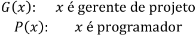

Note que afirmações do tipo **"todo A é B" são equivalentes à "Se A, então B"** . Dessa forma, devemos colocar os predicados acima na forma de uma condicional. Considerados os dados do enunciado, temos que **: todo gerente de projeto é programador** . Observe que tal afirmativa equivale a falar: **se é gerente de projeto, então é programador.** Em notação da lógica de primeira ordem fica: 

### 𝐺(𝑥) ⟹𝑃(𝑥) 

Observe que a forma que escrevemos **não aparece nas alternativas** . Devemos ir na aula de equivalências lógicas e buscar mais uma equivalência. Lembre-se: 

### 𝑝⟹𝑞        ≡      ¬𝑞⟹¬𝑝 

Podemos usar a mesma relação aqui na lógica de primeira ordem. 

### 𝐺(𝑥) ⟹𝑃(𝑥)        ≡      ¬𝑃(𝑥) ⟹¬𝐺(𝑥) 

Qualquer uma das expressões acima são possíveis respostas da questão. No entanto, **apenas** ¬𝑷(𝒙) ⟹ ¬𝑮(𝒙) **está contemplada nas alternativas e é o nosso gabarito** . 

###### **Gabarito:** LETRA E. 

**20. (CESGRANRIO/TRANSPETRO/2012) Considerando os predicados: chefe** (𝒙) **significando que** 𝒙 **é chefe, departamento** (𝒙) **significando que** 𝒙 **é um departamento e chefia** (𝒙, 𝒚) **significando que** 𝒙 **chefia** 𝒚 **, a restrição “Todo chefe chefia um departamento” pode ser expressa pela seguinte fórmula da lógica de predicados de primeira ordem:** 

A) ∀𝑥∀𝑦 chefe ∧(𝑥) departamento (𝑦) → chefia (𝑥, 𝑦) 

B) ∀𝑥∀𝑦 chefia (𝑥, 𝑦) ∧ chefe (𝑥) ∧ departamento (𝑦) 

C) ∀𝑥 chefe (𝑥) ∧ (∃𝑦 departamento (𝑦) → chefia (𝑥, 𝑦)) 

D) ∀𝑥 chefe (𝑥) →∃𝑦 (departamento (𝑦) ∧ chefia (𝑥, 𝑦) ) 

E) ∀𝑥 chefe (𝑥) →¬∃𝑦 (departamento (𝑦) ∧ ¬ chefia (𝑥, 𝑦))

---

<!-- pagina: 31 -->

**Equipe Exatas Estratégia Concursos Aula 04** 

###### **Comentários:** 

O enunciado traz a seguinte expressão. 

##### **Todo chefe chefia um departamento.** 

Vamos reescrever a expressão do enunciado de uma forma que estamos habituados trabalhar. 

##### **Todo chefe é chefe de um departamento.** 

Veja que reescrevemos a afirmativa do enunciado em uma proposição categórica da forma "todo A é B". Ao longo da teoria dessa aula, vimos que esse tipo de proposição quantificada possui a seguinte representação simbólica: 

#### ∀𝑥 (𝐴(𝑥) ⟹𝐵(𝑥)) 

Sabendo disso, podemos eliminar a alternativa B, **pois não traz uma condicional** . O predicado 𝐴(𝑥) é usado **no antecedente da condicional** . Fazendo um paralelo com a expressão "todo chefe é...", descobrimos que 𝑐ℎ𝑒𝑓𝑒(𝑥) equivale ao 𝐴(𝑥) . 

###### ∀𝑥 (𝑐ℎ𝑒𝑓𝑒(𝑥) ⟹𝐵(𝑥)) 

Sem achar o consequente da condicional, já é possível eliminar mais três alternativas: letras A e C. Nossa chance de acertar está em 50%. Para encontrar o gabarito definitivo, **devemos escrever que o chefe chefia um departamento** . O enunciado disse que: 

𝑐ℎ𝑒𝑓𝑖𝑎(𝑥, 𝑦):     𝑥 chefia 𝑦. 𝑑𝑒𝑝𝑎𝑟𝑡𝑎𝑚𝑒𝑛𝑡𝑜(𝑥):     𝑥 é um departamento 

Note que não é adequado usarmos 𝑥 para representar um departamento, uma vez que a variável 𝑥 já está indicando um chefe. **Como alguém** 𝒙 **chefia** 𝒚 **, devemos usar a variável** 𝒚 **pra representar o departamento** . 

𝑐ℎ𝑒𝑓𝑖𝑎(𝑥, 𝑦):     𝑥 chefia 𝑦. 𝑑𝑒𝑝𝑎𝑟𝑡𝑎𝑚𝑒𝑛𝑡𝑜(𝑦):     𝑦 é um departamento 

Para juntar esses dois predicados, devemos utilizar a conjunção ∧ . Isso acontece, pois, **as duas sentenças devem ser verdadeiras simultaneamente** para traduzir exatamente a ideia de que: 

#### 𝑥 chefia 𝑦     𝒆     𝑦 é um departamento

---

<!-- pagina: 32 -->

**Equipe Exatas Estratégia Concursos Aula 04** 

Considerando que **cada chefe chefia um departamento e não todos** , usamos o quantificador ∃. Logo, juntando todas essas informações 

###### ∀𝑥 chefe (𝑥) ⟹∃𝑦 (departamento (𝑦) ∧ chefia (𝑥, 𝑦)) 

###### **Gabarito:** LETRA D. 

**21. (CESGRANRIO/LIQUIGÁS/2012) O predicado** 𝒈(𝒙, 𝒚) **é avaliado como verdadeiro se “x gosta de y". A sentença “se uma pessoa não gosta de si mesma então não gosta de qualquer outra" pode ser expressa em lógica de primeira ordem como** 

A) ¬𝑔(𝑖, 𝑖) → ∀𝑥¬𝑔(𝑖, 𝑥) 

B) ¬𝑔(𝑖, 𝑖) → ¬∀𝑥¬𝑔(𝑖, 𝑥) 

C) Ǝ𝑥 𝑔(𝑥, 𝑖) → ¬Ǝ𝑥¬𝑔(𝑖, 𝑥) 

D) Ǝ𝑥 𝑔(𝑖, 𝑥) → ¬∀𝑥¬𝑔(𝑖, 𝑥) 

E) ¬Ǝ𝑥¬𝑔(𝑥, 𝑖) → ¬∀𝑥¬𝑔(𝑖, 𝑥) 

###### **Comentários:** 

Se 𝒈(𝒙, 𝒚) **expressa a ideia de que "x gosta de y"** , então para dizer que **"x não gosta de y" basta escrever** ¬𝒈(𝒙, 𝒚) . Se queremos dizer que uma pessoa não gosta dela mesma, basta utilizar uma mesma letra. Olhando as alternativas percebemos que o examinador utilizou o "i". Logo, ¬𝒈(𝒊, 𝒊) **expressa que "i não gosta de i" ou seja "a pessoa i não gosta dela mesma"** . 

Quando isso acontece, **a pessoa não gosta de qualquer outra** . A palavra "qualquer" nos passa a ideia de universalidade, por isso, vamos precisar do **quantificador** ∀ . Representaremos essas outras pessoas que "i" não é capaz de gostar por "x". Logo, o quantificador deverá atuar em "x", não em "i". 

Sendo assim, **a ideia que "i não gosta de qualquer x" é corretamente representada por** ∀𝒙¬𝒈(𝒊, 𝒙) (para qualquer x, i não gosta de x). Logo, a condicional fica 

### ¬𝑔(𝑖, 𝑖) → ∀𝑥¬𝑔(𝑖, 𝑥) 

###### **Gabarito:** LETRA A. 

###### **Texto para as próximas questões** 

**Considere uma função proposicional** 𝑷(𝒏) **relativa aos números naturais que satisfaça às seguintes propriedades:** 

**(i)** 𝑷(𝟑) **é verdadeira;** 

**(ii) se, para um número natural** 𝒏 **,** 𝑷(𝒏) **for verdadeira, então** 𝑷(𝒏𝟐 ) **também será verdadeira;** 

**(iii) se, para um número natural** 𝒏≥𝟐 **,** 𝑷(𝒏) **for verdadeira, então** 𝑷(𝒏−𝟏) **também será verdadeira.**

---

<!-- pagina: 33 -->

**Equipe Exatas Estratégia Concursos Aula 04** 

**Sabendo que o conjunto dos números naturais é dado por** {𝟏, 𝟐, 𝟑, 𝟒, . . . } **, julgue o item que se segue, acerca de** 𝑷(𝒏) **e suas propriedades.** 

**22. (CEBRASPE/ABIN/2010) A função proposicional "a raiz quadrada de n é um número inteiro" não pode ser usada como exemplo para** 𝑷(𝒏) **.** 

###### **Comentários:** 

Para verificar a função proposicional dada, **basta testar as propriedades e ver se todas são satisfeitas** . Em caso positivo, **ela poderá ser usada como exemplo para** 𝑷(𝒏) **.** A primeira propriedade é que 𝑷(𝟑) **deve ser verdadeira** . Teste: _"a raiz quadrada de 3 é um número inteiro"?_ Pessoal, sabemos que isso não é verdade. **A raiz quadrada de 3 é um número irracional.** 

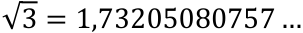

Com isso, a função proposicional do item **<u>já falha no primeiro teste</u>** e, portanto, **não pode ser usada como exemplo** para 𝑃(𝑛). É exatamente o que traz o item. 

###### **Gabarito:** CERTO. 

**23. (CEBRASPE/ABIN/2010)** 𝑷(𝒏) **é verdadeira para todos os números naturais.** 

###### **Comentários:** 

O enunciado diz que 𝑷(𝟑) **é verdadeira** . Ademais, a propriedade (iii) diz que **se** 𝑷(𝒏) **é verdadeira, então** 𝑷(𝒏−𝟏) **também é** , para 𝑛≥2 **.** Logo, por 𝑃(3) ser verdadeira, a propriedade (iii) garante que 𝑷(𝟐) **também é** . Usando a mesma propriedade para 𝑃(2) , é possível concluir que 𝑷(𝟏) **também é verdadeira** . 

A propriedade (ii) diz que **se** 𝑷(𝒏) **é verdadeira, então** 𝑷(𝒏𝟐 ) **também é** . Logo, como 𝑃(3) é verdadeira, 𝑃(32 ) = 𝑷(𝟗) **também é** . Aplicando essa propriedade sucessivamente, encontramos que 𝑃(92 ) = 𝑷(𝟖𝟏) **é verdadeira** , depois 𝑃(812 ) = 𝑷(𝟔𝟓𝟗𝟏) **é verdadeira** ... Note que podemos chegar tão longe quanto se queira. Depois disso, **podemos usar a propriedade (iii)** e concluir que **todos os** 𝑷(𝒏) **anteriores são verdadeiros** . Logo, 𝑃(𝑛) é, de fato, verdadeira para todos os números naturais. 

###### **Gabarito:** CERTO. 

###### **Texto para as questões seguintes.** 

**Na lógica de primeira ordem, uma proposição é funcional quando é expressa por um predicado que contém um número finito de variáveis e é interpretada como verdadeira (V) ou falsa (F) quando são atribuídos valores às variáveis e um significado ao predicado. Por exemplo, a proposição “Para qualquer** 𝒙 **, tem-se que** 𝒙– 𝟐> 𝟎 **” possui interpretação V quando** 𝒙 **é um número real maior do que** 𝟐 **e possui interpretação F quando** 𝒙 **pertence, por exemplo, ao conjunto** {– 𝟒, – 𝟑, – 𝟐, – 𝟏, 𝟎} **. Com base nessas informações, julgue o próximo item.**

---

<!-- pagina: 34 -->

**Equipe Exatas Estratégia Concursos Aula 04** 

**24. (CEBRASPE/BB/2007) A proposição funcional “Para qualquer** 𝒙 **, tem-se que** 𝒙𝟐 > 𝒙 **” é verdadeira para** 𝟓 𝟑 𝟏 **todos os valores de x que estão no conjunto** {𝟓, , 𝟑, , 𝟐, } **.** 𝟐 𝟐 𝟐 

###### **Comentários:** 

_”_ O enunciado trouxe a seguinte proposição funcional: _“Para qualquer_ 𝑥 _, tem-se que_ 𝑥2 > 𝑥 **.** O item quer 5 3 1 saber se essa proposição é válida **para todos os valores do conjunto** {5, ,3, , 2, ~~}~~ . **Como são poucos,** 2 2 2 **podemos testar um por um** e descobrir se o item é verdadeiro ou não. 

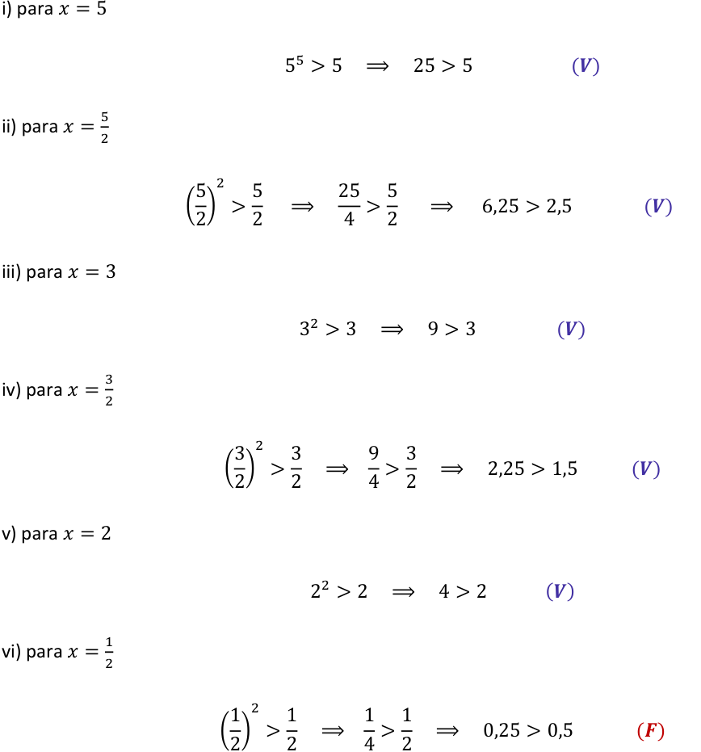

Percebemos que, no último caso testado, **a proposição é falsa** . Logo, **não é verdadeira para todos** os elementos do conjunto fornecido. 

###### **Gabarito:** ERRADO.

---

<!-- pagina: 35 -->

**Equipe Exatas Estratégia Concursos Aula 04** 

###### **25. (Questão Inédita) Quais das sentenças abaixo é uma sentença aberta?** 

A) A Secretaria Especial da Receita Federal é um excelente órgão para se trabalhar. 

B) O Brasil é a único país hexacampeão do mundo no futebol. 

- C) Aquele aluno estuda sempre que consegue ter um tempo livre. 

- D) O Tribunal de Contas da União aprecia as contas do Presidente da República. 

E) Machado de Assis escreveu o romance "Memórias Póstumas de Brás Cubas". 

###### **Comentários:** 

Pessoal, questão bem rápida, apenas para treinarmos o que acabamos de ver! 

Note que nas alternativas A, B, D e E temos sujeito bem definidos. Esse fato nos permite **avaliar com precisão** se o que está sendo falado é verdadeiro ou falso. Quando isso acontece **r, a sentença será fechada** <u>!</u> 

Por sua vez, na alternativa C, temos apenas uma referência "àquele aluno". _Mas que aluno é esse que a sentença está falando?_ Eu não sei. _Será que ele estuda sempre que tem um tempo livre mesmo?_ **Não conseguimos avaliar se a sentença é verdadeira ou falsa.** Esse é o maior indicativo de que se trata de uma sentença aberta. Guarde isso: 

Se ao ler a sentença você consegue avaliá-la em verdadeiro ou falso, a sentença será fechada. 

Se ao ler a sentença você não consegue avaliá-la, trata-se de uma sentença aberta. 

###### **Gabarito:** LETRA C. 

###### **26. (Questão Inédita) Quais das sentenças abaixo é uma sentença aberta?** 

A) 𝑥+ 1 = 𝑥+ 2 

B) 0 ⋅𝑥= 10 

C) 100 −1 = 99 

D) 𝑥2 −2𝑥+ 1 = 0 

E) 3 + 5 = 8 

###### **Comentários:** 

Questão para treinarmos esses mesmos aspectos, agora relacionados às expressões matemáticas. 

A) 𝑥+ 1 = 𝑥+ 2 

**É uma sentença fechada.** Observe que o "x" está escrito, mas não tem nenhuma função. Nós podemos cortálo. Na prática, temos a seguinte expressão: 

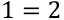

---

<!-- pagina: 36 -->

**Equipe Exatas Estratégia Concursos Aula 04** 

_E aí? A expressão é verdadeira ou falsa?_ É falsa, galera!! Como conseguimos avaliá-la, trata-se de uma sentença fechada. 

###### B) 0 ⋅𝑥= 10 

**É uma sentença fechada.** Mais uma vez, moçada! O "x" está aqui só para confundir a cabeça do aluno. Afinal, todo número ao ser multiplicado por zero é zero. Na prática, a expressão a ser avaliada é a seguinte: 

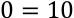

E aí?? Trata-se de um absurdo! A expressão é falsa. Como conseguimos fazer essa avaliação, sabemos que temos uma **sentença fechada** . 

###### C) 100 −1 = 99 

**É uma sentença fechada.** Não há variável nenhuma aqui. Sendo assim, podemos avaliá-la sem mistérios. 

###### D) 𝑥2 −2𝑥+ 1 = 0 

**É uma sentença aberta.** Note que o "x" não some aqui. Dessa forma, **a depender do valor de "x"** , que não sabemos qual é, a sentença será verdadeira ou falsa. 

###### E) 3 + 5 = 8 

**É uma sentença fechada.** Nessas situações, como não há variáveis, temos sentenças fechadas. 

**Gabarito:** LETRA D. 

**27. (Questão Inédita) Dentre as alternativas abaixo, qual não representa uma sentença aberta?** 

A) Aquele auditor foi o responsável pelo lançamento do crédito tributário. 

B) 𝑥+ 10 = 20 para 𝑥= 10 

C) Ele não é uma pessoa confiável. 

D) A cidade não foi receptiva com os turistas. 

E) 𝑥2 + 1 = 𝑥 

###### **Comentários:** 

Vamos analisar cada uma das alternativas. 

A) Aquele auditor foi o responsável pelo lançamento do crédito tributário. 

**É uma sentença aberta.** Que auditor foi esse? Conseguimos avaliar essa sentença com precisão? 

###### B) 𝑥+ 10 = 20 para 𝑥= 10 

**É uma sentença fechada.** Note que o "x" está aqui apenas para confundir o aluno. Na verdade, **<u>não é uma</u> variável pois seu valor é dado logo em seguida: "para** 𝒙= 𝟏𝟎 **".** Na prática, a alternativa representa a seguinte sentença:

---

<!-- pagina: 37 -->

**Equipe Exatas Estratégia Concursos Aula 04** 

10 + 10 = 20 

Note que a expressão é verdadeira, conseguimos avaliá-la. Temos, portanto, uma sentença fechada. 

###### C) Ele não é uma pessoa confiável. 

**É uma sentença aberta.** _Ele quem? A sentença é falsa ou verdadeira? Conseguimos afirmar algo?_ 

###### D) A cidade não foi receptiva com os turistas. 

**É uma sentença aberta.** Que cidade é essa? Conseguimos dizer se é verdade ou mentira? Não! 

E) 𝑥2 + 1 = 𝑥 

**É uma sentença aberta.** Temos aqui a variável "x". A depender do valor que ela assumir, a sentença será verdadeira ou falsa. Sem saber, **<u>não podemos fazer qualquer avaliação</u>** . 

###### **Gabarito:** LETRA B. 

**28. (Questão Inédita) Considere a afirmativa "Todo aluno do Estratégia Concursos é aprovado no concurso dos sonhos". Considere também que os predicados** 𝑬(𝒙) **e** 𝑨(𝒙) **representam, respectivamente, que "x é aluno do Estratégia Concursos" e que "x é aprovado no concurso dos sonhos". Assinale a opção que representa corretamente a afirmativa acima de acordo com a Lógica de Predicados:** A) (∀𝑥)(𝐸(𝑥) →𝐴(𝑥)) 

B) (∃𝑥)(𝐸(𝑥) ∧𝐴(𝑥)) 

C) (¬∃𝑥)(𝐸(𝑥) ∧𝐴(𝑥)) D) (∀𝑥)(𝐴(𝑥) →𝐸(𝑥)) E) (∃𝑥)(𝐸(𝑥) ∨¬𝐴(𝑥)) 

###### **Comentários:** 

Questão para treinarmos aquela tabela que vimos na teoria! 

|**Proposição Categórica**|**Representação Simbólica**|
|---|---|
|Todo A é B|(∀𝑥)(𝐴(𝑥) →𝐵(𝑥))|
|Algum A é B|(∃𝑥)(𝐴(𝑥) ∧𝐵(𝑥))|
|Nenhum A é B|(¬∃𝑥)(𝐴(𝑥) ∧𝐵(𝑥))|
|Algum A não é B|(∃𝑥)(𝐴(𝑥) ∧¬𝐵(𝑥))|

Observe que a afirmativa do enunciado é da forma " **Todo A é B** ". 

Como os predicados são representados por 𝐸(𝑥) e 𝐴(𝑥) , podemos escrever:

---

<!-- pagina: 38 -->

**Equipe Exatas Estratégia Concursos Aula 04** 

#### (∀𝒙)(𝑬(𝒙) →𝑨(𝒙)) 

###### **Gabarito:** LETRA A. 

**29. (Questão Inédita) Considere a afirmativa "Nenhum estudante é preguiçoso". Considere também que os predicados** 𝑬(𝒙) **e** 𝑷(𝒙) **representam, respectivamente, que "x é estudante" e que "x é preguiçoso". Assinale a opção que representa corretamente a afirmativa acima de acordo com a Lógica de Predicados:** A) (∀𝑥)(𝐸(𝑥) →𝑃(𝑥)) 

B) (∃𝑥)(𝐸(𝑥) ∧𝑃(𝑥)) C) (¬∃𝑥)(𝐸(𝑥) ∧𝑃(𝑥)) D) (∀𝑥)(𝑃(𝑥) →𝐸(𝑥)) E) (∃𝑥)(𝐸(𝑥) ∨¬𝑃(𝑥)) 

###### **Comentários:** 

Mais uma pessoal! Recomendo fortemente que vocês guardem a tabela abaixo no coração! 

|**Proposição Categórica**|**Representação Simbólica**|
|---|---|
|Todo A é B|(∀𝑥)(𝐴(𝑥) →𝐵(𝑥))|
|Algum A é B|(∃𝑥)(𝐴(𝑥) ∧𝐵(𝑥))|
|Nenhum A é B|(¬∃𝑥)(𝐴(𝑥) ∧𝐵(𝑥))|
|Algum A não é B|(∃𝑥)(𝐴(𝑥) ∧¬𝐵(𝑥))|

Dessa vez, a afirmativa do enunciado é da forma **"Nenhum A é B"** . Conforme temos na tabela acima e considerando que os **<u>predicados</u>** são representados por 𝐸(𝑥) e 𝑃(𝑥) , podemos escrever: 

### (¬∃𝒙)(𝑬(𝒙) ∧𝑷(𝒙)) 

Ressalto que também poderíamos escrever: 

### (∀𝒙)(𝑬(𝒙) →¬𝑷(𝒙)) 

###### **Gabarito:** LETRA C. 

**30. (Questão Inédita) Considere a afirmativa "Algum auditor fiscal é professor". Considere também que os predicados** 𝑨(𝒙) **e** 𝑷(𝒙) **representam, respectivamente, que "x é auditor fiscal" e que "x é professor". Assinale a opção que representa corretamente a afirmativa acima de acordo com a Lógica de Predicados:** A) (∀𝑥)(𝐴(𝑥) →𝑃(𝑥))

---

<!-- pagina: 39 -->

**Equipe Exatas Estratégia Concursos Aula 04** 

B) (∃𝑥)(𝐴(𝑥) ∧𝑃(𝑥)) C) (¬∃𝑥)(𝐴(𝑥) ∧𝑃(𝑥)) 

D) (∀𝑥)(𝐴(𝑥) →𝑃(𝑥)) 

E) (∀𝑥)(𝐴(𝑥) ∨¬𝑃(𝑥)) 

###### **Comentários:** 

Essa é última nessa pegada! Lembre-se da tabela: 

|**Proposição Categórica**|**Representação Simbólica**|
|---|---|
|Todo A é B|(∀𝑥)(𝐴(𝑥) →𝐵(𝑥))|
|Algum A é B|(∃𝑥)(𝐴(𝑥) ∧𝐵(𝑥))|
|Nenhum A é B|(¬∃𝑥)(𝐴(𝑥) ∧𝐵(𝑥))|
|Algum A não é B|(∃𝑥)(𝐴(𝑥) ∧¬𝐵(𝑥))|

Note que a afirmativa "Algum auditor fiscal é professor" é da forma **"Algum A é B"** . Conforme a tabela que montamos e considerando que os **<u>predicados</u>** são representados por 𝐴(𝑥) e 𝑃(𝑥) , podemos escrever: 

### (∃𝒙)(𝑨(𝒙) ∧𝑷(𝒙)) 

**Gabarito:** LETRA B.

---

<!-- pagina: 40 -->

**Equipe Exatas Estratégia Concursos Aula 04** 

## **LISTA DE QUESTÕES** 

### Lógica de Primeira Ordem 

**1. (IGEDUC/AEB/2024) Julgue o item a seguir.** 

Quando atribuímos um valor do domínio à variável x na condição p(x), resulta-se numa proposição. Na matemática, uma técnica essencial para gerar proposições de p(x) é o uso dos quantificadores, ∀𝑥 para o quantificador universal e ∃𝑥 para o existencial, colocados antes da condição. 

**2. (FGV/PREF. NOVA IGUAÇU/2024) Sejam P o conjunto não vazio formado por todos os pintores renascentistas da história da humanidade e p um elemento desse conjunto. Considere as propriedades E e A, definidas no conjunto P:** 

**E(p): “p foi escultor” A(p): “p foi arquiteto”** 

**Admita verdadeira a proposição** ∄𝒑(¬𝑬(𝒑) ∨¬𝑨(𝒑)) **. Logo** 

A) nenhum pintor renascentista foi arquiteto e escultor. 

B) todos os pintores renascentistas foram arquitetos e escultores. 

C) houve pintores renascentistas que foram arquitetos, mas não escultores. 

D) houve pintores renascentistas que foram escultores, mas não arquitetos. 

- E) houve pintores renascentistas que não foram arquitetos e nem escultores. 

**3. (FGV/TJ-MT/2024) Seja A o conjunto de todos os alunos da turma X da escola Y e x** ∈ **A. Considere as seguintes funções proposicionais:** 

###### **p(x): o aluno x sabe lógica.** 

**q(x): o aluno x sabe filosofia.** 

**r(x): o aluno x será aprovado no ano letivo de 2024.** 

**A proposição composta “Qualquer que seja o aluno da turma X da escola Y, se ele sabe lógica ou sabe filosofia, então será aprovado no ano letivo de 2024” é melhor representada, em linguagem simbólica, por** A) ∃𝑥: (𝑝(𝑥) ∧𝑞(𝑥) →𝑟(𝑥)) 

B) ∃𝑥: (𝑝(𝑥) ∨𝑞(𝑥) →𝑟(𝑥)) 

C) ∀𝑥: (𝑝(𝑥) ∧𝑞(𝑥) →𝑟(𝑥)) 

D) ∀𝑥: (𝑝(𝑥) ∨𝑞(𝑥) →𝑟(𝑥)) 

E) ∃! 𝑥(𝑝(𝑥) ∨𝑞(𝑥) →𝑟(𝑥))

---

<!-- pagina: 41 -->

**Equipe Exatas Estratégia Concursos Aula 04** 

###### **4. (CEBRASPE/TST/2024)** 

###### (∃x) (maisIdade(x)→(∀y) (maisJovem(y)→ maisEstudioso(x,y))) 

**Considerando que maisIdade(x) indica que x é uma pessoa de mais idade na faculdade, que maisJovem(x) indica que x é uma pessoa mais jovem na faculdade e que maisEstudioso(x,y) indica que x é mais estudioso que y, assinale a opção que traduz corretamente a notação lógica da sentença precedente.** 

A) Algumas pessoas de mais idade na faculdade são mais estudiosas que alguns dos mais jovens de lá. 

B) Todas as pessoas de mais idade na faculdade são mais estudiosas que alguns dos mais jovens de lá. 

C) Não existe nenhuma pessoa de mais idade na faculdade que seja mais estudiosa que todos os mais jovens de lá. 

D) Algumas pessoas de mais idade na faculdade são mais estudiosas que todos os mais jovens de lá. 

E) Todas as pessoas de mais idade na faculdade são mais estudiosas que todos os mais jovens de lá. 

**5. (CEBRASPE/TJ-ES/2024) Acerca de noções de lógica, julgue o item a seguir.** 

A sentença “Há pelo menos um desembargador que é mais velho que todos os juízes” pode ser escrita na forma simbólica como ∀𝑥∃𝑦 (𝐷(𝑥) ∧𝐽(𝑦) →𝑉(𝑥, 𝑦)) , em que 𝐷(𝑥) representa a proposição “x é desembargador”; 𝐽(𝑦) representa a proposição “y é juiz”; e 𝑉(𝑥, 𝑦) representa a proposição “x é mais velho que y”. 

**6. (UFAL/IF-AL/2023) Considerando o universo dos números inteiros e que os símbolos** ∃ **e** ∀ **representam os quantificadores existencial e universal, respectivamente, assinale a alternativa verdadeira.** 

A) ∀𝑥∀𝑦∃𝑧 (𝑥+ 𝑦< 𝑧) 

B) ∀𝑥∃𝑦∀𝑧 (𝑥+ 𝑦< 𝑧) 

C) ∀𝑥∀𝑦∀𝑧 (𝑥+ 𝑦< 𝑧) 

D) ∃𝑥∀𝑦∀𝑧 (𝑥+ 𝑦< 𝑧) 

E) ∃𝑥∃𝑦∀𝑧 (𝑥+ 𝑦> 𝑧) 

**7. (Inst. Consulplan/FEPAM-RS/2023) Os quantificadores, universal e existencial, são operadores lógicos que restringem as funções proposicionais, de forma que estas funções se refiram a todo o conjunto ou a uma parte dele. Considere A = {1, 2, 3, 4, 5} e dado x** ∈ **A. Assinale, a seguir, a função proposicional quantificada que tem seu valor lógico falso.** 

A) ∀𝑥 (𝑥+ 3 < 10) 

B) ∃𝑥 (𝑥+ 3 > 5) 

C) ∀𝑥 (𝑥+ 3 ≤7) 

D) ∃𝑥 (𝑥² + 2𝑥= 15) 

E) ∃𝑥 (𝑥2 −7𝑥+ 10 = 0) 

**8. (FADESP/PM-PA/2022) Considere as seguintes sentenças:**

---

<!-- pagina: 42 -->

**Equipe Exatas Estratégia Concursos Aula 04** 

###### **S1: Para todo militar existe uma missão.** 

###### **S2: Sargento Maia é paraense.** 

###### **Pode-se afirmar que** 

A) S1 enquadra-se como sentença de uma lógica proposicional enquanto S2 caracteriza-se como sendo de uma lógica de 1ª ordem. 

B) S1 enquadra-se como sentença de uma lógica de 1ª ordem enquanto S2 caracteriza-se como sendo de uma lógica proposicional. 

C) S1 e S2 enquadram-se como sentenças lógicas exclusivamente de 1ª ordem. 

D) S1 e S2 enquadram-se como sentenças lógicas exclusivamente proposicionais. 

###### **9. (FAPEC/UFMS/2022) Dadas as proposições que seguem:** 

**p)** (∃! 𝒙)(𝒙−𝟐= 𝟓) 

**q)** (∀𝒚)(𝟐𝒚+ 𝟕> 𝟎) 

**r)** (∃𝒂)(−𝟐𝒂𝟐 + 𝟓𝟎= 𝟎) 

###### **Determine corretamente os valores lógicos das negações das respectivas proposições (p, q, r).** 

A) Verdadeiro; Verdadeiro; Falso. 

B) Falso; Falso; Verdadeiro. 

C) Falso; Falso; Falso. 

D) Verdadeiro; Falso; Verdadeiro. 

E) Falso; Verdadeiro; Falso. 

###### **10. (FUNDATEC/AGERGS/2022) Considere as seguintes proposições quantificadas:** 

**I.** ∀𝒙∈{−𝟐, 𝟎, 𝟐}, 𝒙+ 𝟐≠𝟑 **. II.** ∃𝒙∈{−𝟐, 𝟎, 𝟐} 𝒙+ 𝟑= 𝟓 **. III.** ∀𝒙∈{−𝟐, 𝟎, 𝟐}, 𝒙> 𝟎 **.** 

###### **Com relação às afirmações, podemos dizer que:** 

A) Todas são verdadeiras. 

B) Todas são falsas. 

C) Apenas I e II são verdadeiras. 

D) Apenas I e III são verdadeiras. 

E) Apenas II e III são verdadeiras. 

**11. (PROGEP FURG/FURG/2022) Considere P(x) a seguinte sentença aberta, "x é estudante e P(x) é esforçado”. A proposição “Todos os estudantes são esforçados” pode ser corretamente simbolizada por:** A) (∃𝑥) (𝑃(𝑥)) B) (∀𝑥) (𝑃(𝑥))

---

<!-- pagina: 43 -->

**Equipe Exatas Estratégia Concursos Aula 04** 

C ) (~𝑥) (𝑃(𝑥)) D) (∀𝑥) (~𝑃(𝑥)) 

E) (∃! 𝑥) (𝑃(𝑥)) 

**12. (SELECON/PREF. CUIABÁ/2019) Em Lógica e em Matemática, usam-se símbolos próprios chamados quantificadores. Existem fundamentalmente dois tipos de quantificadores: universal e existencial. O símbolo que representa o quantificador universal está representado na seguinte alternativa** : A) ∃ 

B) ∀ 

C)  > 

D) ⇒ 

###### **13. (CESGRANRIO/TRANSPETRO/2018) Considere a seguinte sentença:** 

**“Todo aluno do curso de Informática estuda algum tópico de Matemática Discreta” e os seguintes predicados:** 

𝑨(𝒙): 𝒙 **é aluno.** 𝑰(𝒙): 𝒙 **é do curso de Informática.** 𝑬(𝒙, 𝒚): 𝒙 **estuda** 𝒚 **.** 𝑻(𝒙): 𝒙 **é tópico de Matemática Discreta.** 

**Uma forma de traduzi-la é** 

A) ∀𝑥((𝐴(𝑥) ∧𝐼(𝑥)) →∃𝑦(𝑇(𝑦) ∧𝐸(𝑥, 𝑦))) 

B) ∀𝑥(𝐴(𝑥) ∧𝐼(𝑥)) ∧∀𝑦(𝑇(𝑦) →𝐸(𝑥, 𝑦)) 

C) ∃𝑥∀𝑦(𝐴(𝑥) ∧/(𝑥) ∧𝑇(𝑦) ∧¬𝐸(𝑥, 𝑦)) 

D) ∀𝑥((𝐴(𝑥) ∧𝐼(𝑥)) →∀𝑦(𝑇(𝑦) →𝐸(𝑥, 𝑦))) 

E) ∃𝑥∀(𝐴(𝑥) ∧𝐼(𝑥) ∧𝑇(𝑦) ∧𝐸(𝑥, 𝑦)) 

**14. (UFAL/PREF. ROTEIRO/2017) Considerando que os símbolos ¬,** ∧ **,** ∨ **,** ∀ **e** ∃ **representam negação, conjunção, disjunção, quantificador universal e quantificador existencial, respectivamente, e dado o conjunto de premissas** {∀𝒙(¬𝑷(𝒙) ∧𝑸(𝒙))} **, qual informação abaixo pode ser inferida?** A) ∀𝑥(𝑃(𝑥) ∧𝑄(𝑥)) 

B) ∃𝑥(𝑃(𝑥) ∧𝑄(𝑥)) 

C) ∀𝑥𝑃(𝑥) 

D) ∀𝑥𝑄(𝑥) 

E) ∃𝑥𝑃(𝑥) 

**15. (QUADRIX/CORECON-PE/2016) Milton Friedman, um economista americano, prêmio Nobel em economia, afirmou:**

---

<!-- pagina: 44 -->

**Equipe Exatas Estratégia Concursos Aula 04** 

**“Quando usamos política monetária expansionista e a política fiscal expansionista, causamos a inflação.”** 

###### **Usando sentenças da lógica de primeira ordem, representa a afirmação de Friedman:** 

A) ∀𝑥((𝑃(𝑥) ∧𝑄(𝑥)) →𝑅(𝑥)) 

B) 𝑅(𝑥) →∀𝑥((𝑃(𝑥) ∨𝑄(𝑥)) 

C) ∀𝑥((𝑃(𝑥) ∨𝑄(𝑥)) →𝑅(𝑥)) 

D) (𝑃(𝑥) ∨𝑄(𝑥)) →𝑄(𝑥)) 

E) 𝑄(𝑥) →∀𝑥((𝑃(𝑥) ∨𝑅(𝑥)) 

**16. (UFAL/PREF. SÃO SEBASTIÃO/2015) Se os símbolos ¬,** ∧ **,** ∨ **, →, ↔,** ∀ **e** ∃ **representam a negação, conjunção, disjunção, condicional, bicondicional, para todo e existe, respectivamente, a negação da fórmula** ∀𝒙(𝑷(𝒙) →𝑸(𝒙)) **é equivalente à fórmula** 

A) ∃𝑥(𝑃(𝑥) ∨𝑄(𝑥)) 

B) ∃𝑥(𝑃(𝑥) ∧¬𝑄(𝑥)) 

C) ∃𝑥(¬𝑃(𝑥) →¬𝑄(𝑥)) 

D) ∀𝑥(𝑃(𝑥) ∧¬𝑄(𝑥)) 

E) ∀𝑥(¬𝑃(𝑥) ∨𝑄(𝑥)) 

**17. (UFAL/PREF. SÃO SEBASTIÃO/2015) Se os símbolos** ¬, ∧, ∨, →, ↔, ∀ **e** ∃ **representam a negação, conjunção, disjunção, condicional, bicondicional, para todo e existe, respectivamente, a fórmula** ∀𝒙∃𝒚(𝑷(𝒙) →𝑸(𝒚)) **é equivalente à fórmula** 

A) ∃𝑥𝑃(𝑥) →∃𝑦𝑄(𝑦) 

B) ∃𝑥𝑃(𝑥) ↔∀𝑦𝑄(𝑦) 

C) ∀𝑥𝑃(𝑥) →∃𝑦𝑄(𝑦) 

D) ∀𝑥𝑃(𝑥) →∀𝑦𝑄(𝑦) 

E) ∀𝑥𝑃(𝑥) ↔∃𝑦𝑄(𝑦) 

**18. (CESGRANRIO/BR/2012) Considere a seguinte afirmativa: Ser analista de sistemas é condição necessária porém não suficiente para ser engenheiro de software. Considere os predicados** 𝑨(𝒙) **e** 𝑬(𝒙) **que representam respectivamente que** 𝒙 **é analista de sistemas e que x é engenheiro de software. Uma representação coerente da afirmativa acima, em lógica de primeira ordem, é** 

A) 𝐴(𝑥) →𝐸(𝑥) 

B) 𝐴(𝑥) →¬𝐸(𝑥) 

C) ¬𝐴(𝑥) →𝐸(𝑥) 

D) ¬𝐸(𝑥) →¬𝐴(𝑥) 

E) 𝐸(𝑥) →𝐴(𝑥) 

**19. (CESGRANRIO/BR/2012) Considere a afirmativa “Todo gerente de projeto é programador”. Considere os predicados** 𝑮(𝒙) **e** 𝑷(𝒙) **, que representam, respectivamente, que** 𝒙 **é gerente de projeto e que** 𝒙 **é programador. Uma representação coerente da afirmativa acima em lógica de primeira ordem é** A) 𝐺(𝑥) →¬𝑃(𝑥)

---

<!-- pagina: 45 -->

**Equipe Exatas Estratégia Concursos Aula 04** 

B) ¬𝐺(𝑥) →𝑃(𝑥) 

C) 𝑃(𝑥) →𝐺(𝑥) 

D) ¬𝑃(𝑥) →𝐺(𝑥) 

E) ¬𝑃(𝑥) →¬𝐺(𝑥) 

**20. (CESGRANRIO/TRANSPETRO/2012) Considerando os predicados: chefe** (𝒙) **significando que** 𝒙 **é chefe, departamento** (𝒙) **significando que** 𝒙 **é um departamento e chefia** (𝒙, 𝒚) **significando que** 𝒙 **chefia** 𝒚 **, a restrição “Todo chefe chefia um departamento” pode ser expressa pela seguinte fórmula da lógica de predicados de primeira ordem:** 

- A) ∀𝑥∀𝑦 chefe ∧(𝑥) departamento (𝑦) → chefia (𝑥, 𝑦) 

- B) ∀𝑥∀𝑦 chefia (𝑥, 𝑦) ∧ chefe (𝑥) ∧ departamento (𝑦) 

- C) ∀𝑥 chefe (𝑥) ∧ (∃𝑦 departamento (𝑦) → chefia (𝑥, 𝑦)) 

D) ∀𝑥 chefe (𝑥) →∃𝑦 (departamento (𝑦) ∧ chefia ==5460== (𝑥, 𝑦) ) 

E) ∀𝑥 chefe (𝑥) →¬∃𝑦 (departamento (𝑦) ∧ ¬ chefia (𝑥, 𝑦)) 

**21. (CESGRANRIO/LIQUIGÁS/2012) O predicado** 𝒈(𝒙, 𝒚) **é avaliado como verdadeiro se “x gosta de y". A sentença “se uma pessoa não gosta de si mesma então não gosta de qualquer outra" pode ser expressa em lógica de primeira ordem como** 

A) ¬𝑔(𝑖, 𝑖) → ∀𝑥¬𝑔(𝑖, 𝑥) 

B) ¬𝑔(𝑖, 𝑖) → ¬∀𝑥¬𝑔(𝑖, 𝑥) 

C) Ǝ𝑥 𝑔(𝑥, 𝑖) → ¬Ǝ𝑥¬𝑔(𝑖, 𝑥) 

D) Ǝ𝑥 𝑔(𝑖, 𝑥) → ¬∀𝑥¬𝑔(𝑖, 𝑥) 

- E) ¬Ǝ𝑥¬𝑔(𝑥, 𝑖) → ¬∀𝑥¬𝑔(𝑖, 𝑥) 

###### **Texto para as próximas questões** 

**Considere uma função proposicional** 𝑷(𝒏) **relativa aos números naturais que satisfaça às seguintes propriedades:** 

###### **(i)** 𝑷(𝟑) **é verdadeira;** 

**(ii) se, para um número natural** 𝒏 **,** 𝑷(𝒏) **for verdadeira, então** 𝑷(𝒏𝟐 ) **também será verdadeira;** 

**(iii) se, para um número natural** 𝒏≥𝟐 **,** 𝑷(𝒏) **for verdadeira, então** 𝑷(𝒏−𝟏) **também será verdadeira.** 

**Sabendo que o conjunto dos números naturais é dado por** {𝟏, 𝟐, 𝟑, 𝟒, . . . } **, julgue o item que se segue, acerca de** 𝑷(𝒏) **e suas propriedades.** 

**22. (CEBRASPE/ABIN/2010) A função proposicional "a raiz quadrada de n é um número inteiro" não pode ser usada como exemplo para** 𝑷(𝒏) **.** 

**23. (CEBRASPE/ABIN/2010)** 𝑷(𝒏) **é verdadeira para todos os números naturais.** 

###### **Texto para as questões seguintes.**

---

<!-- pagina: 46 -->

**Equipe Exatas Estratégia Concursos Aula 04** 

**Na lógica de primeira ordem, uma proposição é funcional quando é expressa por um predicado que contém um número finito de variáveis e é interpretada como verdadeira (V) ou falsa (F) quando são atribuídos valores às variáveis e um significado ao predicado. Por exemplo, a proposição “Para qualquer** 𝒙 **, tem-se que** 𝒙– 𝟐> 𝟎 **” possui interpretação V quando** 𝒙 **é um número real maior do que** 𝟐 **e possui interpretação F quando** 𝒙 **pertence, por exemplo, ao conjunto** {– 𝟒, – 𝟑, – 𝟐, – 𝟏, 𝟎} **. Com base nessas informações, julgue o próximo item.** 

**24. (CEBRASPE/BB/2007) A proposição funcional “Para qualquer** 𝒙 **, tem-se que** 𝒙𝟐 > 𝒙 **” é verdadeira para** 𝟓 𝟑 𝟏 **todos os valores de x que estão no conjunto** {𝟓, , 𝟑, , 𝟐, } **.** 𝟐 𝟐 𝟐 

**25. (Questão Inédita) Quais das sentenças abaixo é uma sentença aberta?** 

A) A Secretaria Especial da Receita Federal é um excelente órgão para se trabalhar. 

B) O Brasil é a único país hexacampeão do mundo no futebol. 

C) Aquele aluno estuda sempre que consegue ter um tempo livre. 

D) O Tribunal de Contas da União aprecia as contas do Presidente da República. 

E) Machado de Assis escreveu o romance "Memórias Póstumas de Brás Cubas". 

**26. (Questão Inédita) Quais das sentenças abaixo é uma sentença aberta?** 

A) 𝑥+ 1 = 𝑥+ 2 

B) 0 ⋅𝑥= 10 

C) 100 −1 = 99 

D) 𝑥2 −2𝑥+ 1 = 0 

E) 3 + 5 = 8 

**27. (Questão Inédita) Dentre as alternativas abaixo, qual não representa uma sentença aberta?** 

A) Aquele auditor foi o responsável pelo lançamento do crédito tributário. 

B) 𝑥+ 10 = 20 para 𝑥= 10 

C) Ele não é uma pessoa confiável. 

D) A cidade não foi receptiva com os turistas. 

E) 𝑥2 + 1 = 𝑥 

**28. (Questão Inédita) Considere a afirmativa "Todo aluno do Estratégia Concursos é aprovado no concurso dos sonhos". Considere também que os predicados** 𝑬(𝒙) **e** 𝑨(𝒙) **representam, respectivamente, que "x é aluno do Estratégia Concursos" e que "x é aprovado no concurso dos sonhos". Assinale a opção que representa corretamente a afirmativa acima de acordo com a Lógica de Predicados:** 

A) (∀𝑥)(𝐸(𝑥) →𝐴(𝑥)) 

B) (∃𝑥)(𝐸(𝑥) ∧𝐴(𝑥)) 

C) (¬∃𝑥)(𝐸(𝑥) ∧𝐴(𝑥)) D) (∀𝑥)(𝐴(𝑥) →𝐸(𝑥)) E) (∃𝑥)(𝐸(𝑥) ∨¬𝐴(𝑥))

---

<!-- pagina: 47 -->

**Equipe Exatas Estratégia Concursos Aula 04** 

**29. (Questão Inédita) Considere a afirmativa "Nenhum estudante é preguiçoso". Considere também que os predicados** 𝑬(𝒙) **e** 𝑷(𝒙) **representam, respectivamente, que "x é estudante" e que "x é preguiçoso". Assinale a opção que representa corretamente a afirmativa acima de acordo com a Lógica de Predicados:** A) (∀𝑥)(𝐸(𝑥) →𝑃(𝑥)) 

B) (∃𝑥)(𝐸(𝑥) ∧𝑃(𝑥)) 

C) (¬∃𝑥)(𝐸(𝑥) ∧𝑃(𝑥)) 

D) (∀𝑥)(𝑃(𝑥) →𝐸(𝑥)) 

E) (∃𝑥)(𝐸(𝑥) ∨¬𝑃(𝑥)) 

**30. (Questão Inédita) Considere a afirmativa "Algum auditor fiscal é professor". Considere também que os predicados** 𝑨(𝒙) **e** 𝑷(𝒙) **representam, respectivamente, que "x é auditor fiscal" e que "x é professor". Assinale a opção que representa corretamente a afirmativa acima de acordo com a Lógica de Predicados:** A) (∀𝑥)(𝐴(𝑥) →𝑃(𝑥)) 

B) (∃𝑥)(𝐴(𝑥) ∧𝑃(𝑥)) 

C) (¬∃𝑥)(𝐴(𝑥) ∧𝑃(𝑥)) 

D) (∀𝑥)(𝐴(𝑥) →𝑃(𝑥)) 

E) (∀𝑥)(𝐴(𝑥) ∨¬𝑃(𝑥))

---

<!-- pagina: 48 -->

**Equipe Exatas Estratégia Concursos Aula 04** 

## **GABARITO** 

1. CERTO 2. LETRA B 3. LETRA D 

4. LETRA D 

5. ERRADO 

6. LETRA A 

7. LETRA C 

8. LETRA B 

9. LETRA E 10. LETRA C 11. LETRA C 12. LETRA B 13. LETRA A 

14. LETRA D 

15. LETRA D 

16. LETRA B 

17. LETRA A 

18. LETRA E 

19. LETRA E 

20. LETRA D 

21. LETRA A 

22. CERTO 23. CERTO 24. ERRADO 25. LETRA C 26. LETRA D 27. LETRA B 28. LETRA A 29. LETRA C 

30. LETRA B

---

<!-- pagina: 49 -->

