---
fonte_pdf: "Raciocínio Lógico - Aula 05.pdf"
paginas: 158
conversao: texto-e-imagens
---

<!-- pagina: 2 -->

**Equipe Exatas Estratégia Concursos Aula 05** 

# **Índice** 

|............................................................................................................................................................... 1) Conectivos Lógicos - Questões Clássicas|............................... 3|
|---|---|
|............................................................................................................................................................... 2) Lógica de Argumentação - Argumentos Dedutivos|............................... 25|
|............................................................................................................................................................... 3) Questões Comentadas - Conectivos Lógicos - Questões Clássicas - FGV|............................... 76|
|............................................................................................................................................................... 4) Questões Comentadas - Lógica de Argumentação - Argumentos Dedutivos - FGV|............................... 98|
|............................................................................................................................................................... 5) Lista de Questões - Conectivos Lógicos - Questões Clássicas - FGV|............................... 141|
|............................................................................................................................................................... 6) Lista de Questões - Lógica de Argumentação - Argumentos Dedutivos - FGV|............................... 148|

---

<!-- pagina: 3 -->

**Equipe Exatas Estratégia Concursos Aula 05** 

# **APRESENTAÇÃO DA AULA** 

##### Fala, pessoal! 

O primeiro assunto que vamos tratar nessa aula é relativo a **<u>questões clássicas envolvendo os conectivos</u> lógicos** . Esse tema requer que as **tabelas-verdade dos cinco conectivos estejam "no sangue"** . 

**Caso seja pertinente para o seu edital** , abordaremos em seguida o tema **lógica de argumentação: argumentos dedutivos** . Você verá que essa matéria apresenta certa intersecção com o assunto anterior. 

Como de costume, vamos exibir um **resumo** logo no **início de cada tópico** para que você tenha uma visão geral do conteúdo antes mesmo de iniciar o assunto. 

Com calma e persistência, vamos avançando no conteúdo. Lembre-se de que sempre temos um **fórum de dúvidas à disposição** . 

Conte comigo nessa caminhada =) 

**Prof. Eduardo Mocellin.** 

**@edu.mocellin**

---

<!-- pagina: 4 -->

**Equipe Exatas Estratégia Concursos Aula 05** 

# **CONECTIVOS LÓGICOS: QUESTÕES CLÁSSICAS** 

|Para resolver essas questões, devemos seguir**quatro etapas**: **•Etapa 1:** **identificar as afirmações que se apresentam em algum dos**"**formatos fáceis**"; **• Etapa 2: desconsiderar o contexto da questão**, transformando as afirmações da língua portuguesa para a linguagem proposicional; **•Etapa 3:** **obter os valores lógicos das proposições simples**presentes nas afirmações do enunciado (**sempre que possível**); **•Etapa 4: verificar a resposta**que apresenta uma proposição**verdadeira**. As afirmações do enunciado que apresentam um "formato fácil" são as seguintes: **• Proposição simples**(**verdadeira**ou**falsa**); **•Conjunção (e;**∧**) verdadeira**; **•Disjunção inclusiva (ou;**∨**) falsa**; **•Condicional** **(se...então;**→**) falsa**. **Conectivos lógicos: questões clássicas**|
|---|

---

<!-- pagina: 5 -->

**Equipe Exatas Estratégia Concursos Aula 05** 

Antes de iniciar o assunto desse tópico, é necessário que você **<u>DECORE</u>** o uso dos cinco conectivos lógicos. 

**Conjunção (p** ∧ **q):** é **verdadeira** somente quando **ambas as parcelas são verdadeiras** . **Disjunção Inclusiva (p** ∨ **q):** é **falsa** somente quando **ambas as parcelas são falsas Disjunção Exclusiva (p** <u>∨</u> **<u>q):</u>** é **falsa** somente quando **ambas as parcelas tiverem o mesmo valor lógico** . **Condicional (p** → **q):** é **falsa** somente quando a **primeira parcela é verdadeira** e a **segunda parcela é falsa** . **Bicondicional (p**  **q):** é **verdadeira** somente quando **ambas as parcelas tiverem o mesmo valor lógico** . 

##### **<u>Decorou?</u>** Certo, agora podemos começar. 

Pessoal, nesse momento vamos tratar de um tipo específico de questão que costuma aparecer muito em provas de concurso público. 

Essas questões apresentam uma certa **intersecção com Lógica de Argumentação** , porém **também podem ser cobradas em provas que não exigem explicitamente esse assunto** . 

Para o aluno mais avançado, **talvez o presente tópico pareça redundante** . Apesar disso, as questões que vamos tratar aqui são um pouco diferentes das questões que resolvemos na primeira aula de Lógica de Proposições, quando aprendemos sobre o uso dos cinco conectivos. 

**A partir de agora** , vamos resolver questões que apresentam algumas **proposições lógicas no enunciado** , as quais chamaremos de **afirmações** , para em seguida pedir **qual proposição seria uma consequência verdadeira** resultante dessas afirmações do enunciado. 

Veja um exemplo típico de enunciado dessas questões clássicas: 

**Se Pedro é feliz, então Joaquim é alegre. Se Maria é alta, então Tiago é baixo. É sabido que Pedro é feliz e Tiago não é baixo. Logo, pode-se afirmar corretamente que:** a) Se Pedro é feliz, Tiago é baixo. b) Joaquim não é alegre. c) Tiago não é baixo. d) Tiago é baixo. e) Joaquim é alegre ou Tiago é baixo. 

Perceba que no **enunciado** são apresentadas algumas **proposições lógicas,** as quais chamaremos de **afirmações** . Veja que, em seguida, **é pedido qual proposição seria uma consequência verdadeira** resultante dessas afirmações do enunciado.

---

<!-- pagina: 6 -->

**Equipe Exatas Estratégia Concursos Aula 05** 

Nesse exemplo, temos **três afirmações** no enunciado e **cinco possíveis consequências** para serem analisadas nas alternativas. 

As **três afirmações** são: 

I. "Se Pedro é feliz, então Joaquim é alegre." (Condicional **p** → **j** ) 

II. "Se Maria é alta, então Tiago é baixo." (Condicional **m** → **t** ) 

III. "Pedro é feliz e Tiago não é baixo." (Conjunção **p** ∧~ **t** ) 

As **cinco possíveis consequências que devem ser analisadas** são: 

- a) "Se Pedro é feliz, Tiago é baixo." (Condicional **p** → **t** ) 

- ~ 

- b) "Joaquim não é alegre." (Proposição simples **j** ) 

- c) "Tiago não é baixo." (Proposição simples ~ **t** ) 

- d) "Tiago é baixo." (Proposição simples **t** ) 

e) "Joaquim é alegre ou Tiago é baixo." (Disjunção inclusiva **<u>j</u>** ∨ **t** <u>)</u> 

Naturalmente, em uma **prova no estilo** " **certo ou errado** ", teremos **apenas uma possível consequência para analisar** . 

Em resumo, essas questões clássicas envolvendo os conectivos **<u>apresentam um conjunto de afirmações no enunciado</u>** e **<u>perguntam por uma consequência verdadeira resultante dessas afirmações</u>** . 

Nesse tipo de questão, as **afirmações** apresentadas no enunciado **devem ser consideradas verdadeiras** , **a não ser que a questão indique que alguma delas é falsa** . 

##### Para resolver essas questões, devemos seguir **<u>quatro etapas</u>** <u>:</u> 

- **<u>Etapa 1:</u> identificar as afirmações que se apresentam em algum dos "formatos fáceis"** ; 

- **<u>Etapa 2:</u> desconsiderar o contexto da questão** , transformando as afirmações da língua portuguesa para a linguagem proposicional; 

- **<u>Etapa 3:</u> obter os valores lógicos das proposições simples** presentes nas afirmações do enunciado ( **sempre que possível** ); 

- **<u>Etapa 4:</u> verificar a resposta** que apresenta uma proposição **verdadeira** . 

_Professor, o que você chama de "formato fácil"?_ 

Excelente pergunta! As afirmações do enunciado que apresentam um "formato fácil" são as seguintes: 

- **Proposição simples verdadeira** ou **falsa** ); 

- **Conjunção (e;** ∧ **) verdadeira** ; 

- **Disjunção inclusiva (ou;** ∨ **) falsa** ; 

- **Condicional (se...então;** → **) falsa** .

---

<!-- pagina: 7 -->

**Equipe Exatas Estratégia Concursos Aula 05** 

Observe que, nesses quatro casos, temos "de graça" o valor lógico de uma ou mais proposições simples. Veja: 

- **Afirmação** ( **verdadeira** ou **falsa** ) **com proposição simples** : o valor lógico da afirmação é dado e ela se trata de uma proposição simples. Logo, temos de imediato o valor lógico dessa proposição simples; 

- **Afirmação verdadeira com conjunção** : as duas proposições simples que compõem a conjunção são verdadeiras; 

- **Afirmação falsa com uma disjunção inclusiva** : as duas proposições simples que compõem a disjunção inclusiva são falsas; 

- **Afirmação falsa com condicional** : o primeiro termo do condicional é verdadeiro e o segundo termo é falso. 

##### _Professor, não entendi absolutamente nada desse tópico!_ 

Calma, caro aluno. Vamos massificar esse aprendizado com questões. Novamente, peço que você não se preocupe ao errar, pois o enfoque, nesse momento, é o aprendizado. 

**(MPSP/2023)** As seguintes afirmações acerca de Marcos são verdadeiras: 

I. Marcos é professor ou pratica natação. II. Marcos tem filhos e não pratica natação. III. Marcos não é brasileiro ou não é professor. IV. Se Marcos conhece São Paulo, então Marcos é brasileiro. A partir dessas informações, pode-se afirmar que Marcos 

a) tem filhos, é brasileiro e conhece São Paulo. b) é professor, não conhece São Paulo e não é brasileiro. 

c) tem filhos, é brasileiro e é professor. d) é brasileiro, pratica natação e não conhece São Paulo. e) não é professor, não tem filhos e é brasileiro. **Comentários:** A questão **<u>apresenta um conjunto de afirmações no enunciado</u>** e **<u>pergunta por uma consequência verdadeira resultante dessas afirmações</u>** <u>.</u> Vamos seguir as quatro etapas apresentadas na teoria da aula.

---

<!-- pagina: 8 -->

**Equipe Exatas Estratégia Concursos Aula 05** 

##### **<u>Etapa 1: identificar as afirmações que se apresentam em algum dos "formatos fáceis"</u>** 

Note que temos uma **conjunção verdadeira** em "Marcos tem filhos **e não** pratica natação". **É essa afirmação que devemos atacar primeiro** . 

**<u>Etapa 2: desconsiderar o contexto</u>** 

Sejam as proposições: 

**p:** "Marcos é professor." 

**n:** "Marcos pratica natação." 

**f** : "Marcos tem filhos." 

**b** : "Marcos é brasileiro." 

**s** : "Marcos conhece São Paulo." 

As afirmações apresentadas correspondem a: 

" **I. p** ∨ **n (V) − [** Marcos é professor **] ou [** pratica natação **]** ." 

**II. f** ∧~ **n (V) −** " **[** Marcos tem filhos **] e [não** pratica natação **]** ." 

**III.** ~ **b** ∨~ **p (V) −** " **[** Marcos **não** é brasileiro **] ou [não** é professor **]** ." 

**IV. s** → **b (V) −** " **Se [** Marcos conhece São Paulo **]** , **então [** Marcos é brasileiro **]** ." 

##### **<u>Etapa 3: obter os valores lógicos das proposições simples (sempre que possível)</u>** 

Devemos obter os valores lógicos das proposições simples iniciando pelo " **formato fácil** ", que para essa questão é a **afirmação II** . 

A **afirmação II** é uma conjunção verdadeira. Logo, ambas as parcelas devem ser verdadeiras. Consequentemente, **f** e ~ **n** são ambos verdadeiros. Logo, **<mark>f</mark>** <mark>é V</mark> e **<mark>n</mark>** <mark>é F</mark> . 

Agora que temos o valor de **f** e de **n** , vamos para outra afirmação que apresenta a proposição **f** ou que apresenta a proposição **n** . 

A **afirmação I** é uma disjunção inclusiva verdadeira. Como **n** é falso, é necessário que **p** seja verdadeiro. Isso porque, caso ambas as parcelas fossem falsas, a disjunção inclusiva seria falsa. Logo, **<mark>p</mark>** <mark>é V.</mark> 

Agora que temos o valor de **p** , vamos para outra afirmação que apresenta a proposição **p** . 

A **afirmação III** é uma disjunção inclusiva verdadeira. Como ~ **p** é falso, é necessário que ~ **b** seja verdadeiro. Isso porque, caso ambas as parcelas fossem falsas, a disjunção inclusiva seria falsa. Logo, **<mark>b</mark>** <mark>é F.</mark> Agora que temos o valor de **b** , vamos para outra afirmação que apresenta a proposição **b** .

---

<!-- pagina: 9 -->

**Equipe Exatas Estratégia Concursos Aula 05** 

A **afirmação IV** é uma condicional verdadeira. Logo, não podemos recair no caso **V** → **F** , que é o único caso em que a condicional falsa. Como o consequente **b** é falso, o antecedente **s** não pode ser verdadeiro. Portanto, **<mark>s</mark>** <mark>é F.</mark> 

Veja que já passamos por todas as afirmações e descobrimos os valores lógicos de todas as proposições simples. Vamos agora para a **etapa 4** . 

##### **<u>Etapa 4: verificar a resposta que apresenta uma proposição verdadeira</u>** 

Veja que em todas alternativas temos conjunções com três termos. Nesses casos, a conjunção será verdadeira somente quando os três termos forem verdadeiros. 

a) **f** ∧ **b** ∧ **s –** conjunção falsa, pois **b** e **s** são ambos falsos. 

b) **p** ∧~ **s** ∧~ **b –** conjunção verdadeira, pois **p** , ~ **s** e ~ **b** são todos verdadeiros. **Esse é o gabarito** . 

c) **f** ∧ **b** ∧ **p −** conjunção falsa, pois **b** é falso. 

d) **b** ∧ **n** ∧~ **s −** conjunção falsa, pois **b** e **n** são ambos falsos. 

e) ~ **p** ∧~ **f** ∧ **b –** conjunção falsa, pois ~ **p** , ~ **f** e **b** são todos falsos. 

**Gabarito: Letra B.** 

**(Pref. Campo Bom/2023)** Se Laura canta, então Luciana fecha a porta do seu quarto. Se Luciana fecha a porta do seu quarto, então Marcos assiste televisão na sala. Se Marcos assiste televisão na sala, então Júlio cozinha o jantar. Se Júlio cozinha o jantar, então Sandra faz as tarefas escolares. Se Sandra faz as tarefas escolares, então sua mãe Cláudia lê um livro. Ora, a mãe de Sandra, Cláudia, não lê um livro, pode-se afirmar que: 

a) Laura canta e Luciana não fecha a porta do seu quarto. 

b) Marcos não assiste televisão na sala. 

c) Sandra faz as tarefas escolares. 

d) Luciana fecha a porta do seu quarto. 

e) Júlio não cozinha o jantar e Marcos assiste televisão na sala 

**Comentários:** 

A questão **<u>apresenta um conjunto de afirmações no enunciado</u>** e **<u>pergunta por uma consequência verdadeira resultante dessas afirmações</u>** <u>.</u> 

Vamos seguir as quatro etapas apresentadas na teoria da aula. 

##### **<u>Etapa 1: identificar as afirmações que se apresentam em algum dos "formatos fáceis"</u>** 

Note que temos uma **proposição simples verdadeira** em "Cláudia **não** lê um livro". **É essa afirmação que devemos atacar primeiro** .

---

<!-- pagina: 10 -->

**Equipe Exatas Estratégia Concursos Aula 05** 

##### **<u>Etapa 2: desconsiderar o contexto</u>** 

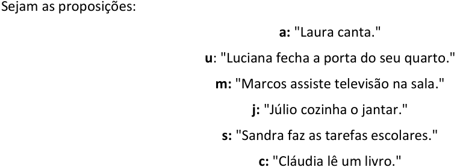

<!-- Start of picture text -->
Sejam as proposições: a: "Laura canta." u : "Luciana fecha a porta do seu quarto." m:  "Marcos assiste televisão na sala." j:  "Júlio cozinha o jantar." s:  "Sandra faz as tarefas escolares." c:  "Cláudia lê um livro." <!-- End of picture text -->

As afirmações apresentadas correspondem a: 

**I** . **a** → **u (V)** − **Se [** Laura canta **]** , **então [** Luciana fecha a porta do seu quarto **]** . **II** . **u** → **m (V)** − **Se [** Luciana fecha a porta do seu quarto **]** , **então [** Marcos assiste televisão na sala **]** . **III** . **m** → **j (V)** − **Se [** Marcos assiste televisão na sala **]** , **então [** Júlio cozinha o jantar **]** . **IV** . **j** → **s (V)** − **Se [** Júlio cozinha o jantar **]** , **então [** Sandra faz as tarefas escolares **]** . **V** . **s** → **c (V)** − **Se [** Sandra faz as tarefas escolares **]** , **então [** sua mãe Cláudia lê um livro **]** . **VI** . ~ **c (V)** − " _Ora, a mãe de Sandra, Cláudia,_ **_<u>não</u>_** _<u>lê um livro</u>_ <u>."</u> **<u>Etapa 3: obter os valores lógicos das proposições simples (sempre que possível)</u>** Devemos obter os valores lógicos das proposições simples iniciando pelo " **formato fácil** ", que para essa questão é a **afirmação VI** . 

A **afirmação IV** é uma proposição simples verdadeira. Como ~ **c** é verdadeiro, temos que **<mark>c</mark>** <mark>é F.</mark> Agora que temos o valor de **c** , vamos para outra afirmação que apresenta a proposição **c** . 

A **afirmação V** é uma condicional verdadeira. Logo, não podemos recair no caso **V** → **F** , que é o único caso em que a condicional falsa. Como o consequente **c** é falso, o antecedente **s** não pode ser verdadeiro. Portanto, **<mark>s</mark>** <mark>é F.</mark> Agora que temos o valor de **s** , vamos para outra afirmação que apresenta a proposição **s** . 

A **afirmação IV** é uma condicional verdadeira. Logo, não podemos recair no caso **V** → **F** , que é o único caso em que a condicional falsa. Como o consequente **s** é falso, o antecedente **j** não pode ser verdadeiro. Portanto, **<mark>j</mark>** <mark>é F.</mark> 

Agora que temos o valor de **<u>j</u>** , vamos para outra afirmação que apresenta a proposição **<u>j</u>** .

---

<!-- pagina: 11 -->

**Equipe Exatas Estratégia Concursos Aula 05** 

A **afirmação III** é uma condicional verdadeira. Logo, não podemos recair no caso **V** → **F** , que é o único caso em que a condicional falsa. Como o consequente **j** é falso, o antecedente **m** não pode ser verdadeiro. Portanto, **<mark>m</mark>** <mark>é F.</mark> 

Agora que temos o valor de **m** , vamos para outra afirmação que apresenta a proposição **m** . 

A **afirmação II** é uma condicional verdadeira. Logo, não podemos recair no caso **V** → **F** , que é o único caso em que a condicional falsa. Como o consequente **m** é falso, o antecedente **u** não pode ser verdadeiro. Portanto, **<mark>u</mark>** <mark>é F.</mark> 

Agora que temos o valor de **u** , vamos para outra afirmação que apresenta a proposição **u** . 

A **afirmação I** é uma condicional verdadeira. Logo, não podemos recair no caso **V** → **F** , que é o único caso em que a condicional falsa. Como o consequente **u** é falso, o antecedente **a** não pode ser verdadeiro. Portanto, **<mark>a</mark>** <mark>é F.</mark> 

Veja que já passamos por todas as afirmações e descobrimos os valores lógicos de todas as proposições simples. Vamos agora para a **etapa 4** . **<u>Etapa 4: verificar a resposta que apresenta uma proposição verdadeira</u>** 

a) **a** ∧~ **u –** conjunção falsa, pois **a** é falso. 

b) ~ **m −** proposição simples verdadeira, pois **m** é falso e, portanto, ~ **m** é verdadeiro. **Esse é o gabarito** . 

c) **s −** proposição simples falsa, pois **s** é falso. 

d) **u −** proposição simples falsa, pois **u** é falso. 

e) ~ **j** ∧ **m –** conjunção falsa, pois **m** é falso. 

**Gabarito: Letra B.** 

**(SEFAZ ES/2022)** Valter fala sobre seus hábitos no almoço: 

- Como carne ou frango. 

- Como legumes ou não como carne. 

- Como macarrão ou não como frango. 

Certo dia, no almoço, Valter não comeu macarrão. 

É correto afirmar que, nesse dia, Valter 

a) comeu frango e carne. 

b) não comeu frango nem carne. 

c) comeu carne e não comeu legumes. d) comeu legumes e carne. e) não comeu frango nem legumes. 

https://t.me/KakashiAssinaturasBot

---

<!-- pagina: 12 -->

**Equipe Exatas Estratégia Concursos Aula 05** 

##### **Comentários:** 

A questão **<u>apresenta um conjunto de afirmações no enunciado</u>** e **<u>pergunta por uma consequência verdadeira resultante dessas afirmações</u>** <u>.</u> 

Vamos seguir as quatro etapas apresentadas na teoria da aula. 

##### **<u>Etapa 1: identificar as afirmações que se apresentam em algum dos "formatos fáceis"</u>** 

Note que temos uma **proposição simples verdadeira** em "Valter **não** comeu macarrão". **É essa afirmação que devemos atacar primeiro** . 

##### **<u>Etapa 2: desconsiderar o contexto</u>** 

Sejam as proposições: 

**c:** "Valter come carne." 

**f:** "Valter come frango." 

**l:** "Valter come legumes." 

**m:** "Valter come macarrão." 

As afirmações apresentadas, considerando que Valter foi quem as disse, são as seguintes: 

**I** . **~~c~~** ∨ **f (V) –** " **[** Valter come carne **] ou [** Valter come frango **]** ." 

**II** . **l** ∨~ **c (V) –** " **[** Valter come legumes **] ou [** Valter **não** come carne **]** ." 

**III** . **m** ∨~ **f (V) –** " **[** Valter come macarrão **] ou [** Valter **não** como frango **]** ." 

**IV** . ~ **m (V) –** "Valter **não** comeu macarrão." 

##### **<u>Etapa 3: obter os valores lógicos das proposições simples (sempre que possível)</u>** 

Devemos obter os valores lógicos das proposições simples iniciando pelo " **formato fácil** ", que para essa questão é a **afirmação IV** . 

A **afirmação IV** é uma proposição simples verdadeira. Como ~ **m** é verdadeiro, temos que **<mark>m</mark>** <mark>é F</mark> . 

Agora que temos o valor de **m** , vamos para outra afirmação que apresenta a proposição **m** . 

A **afirmação III** é uma disjunção inclusiva verdadeira. Logo, as duas parcelas não podem ser ambas falsas. Como **m** é F, é necessário que ~ **f** seja verdadeiro. Portanto, **<mark>f</mark>** <mark>é F.</mark> 

Agora que temos o valor de **f** , vamos para outra afirmação que apresenta a proposição **f** .

---

<!-- pagina: 13 -->

**Equipe Exatas Estratégia Concursos Aula 05** 

A **afirmação I** é uma disjunção inclusiva verdadeira. Logo, as duas parcelas não podem ser ambas falsas. Como **f** é falso, é necessário que **c** seja verdadeiro. Portanto, **<mark>c</mark>** <mark>é V.</mark> 

Agora que temos o valor de **c** , vamos para outra afirmação que apresenta a proposição **c** . 

A **afirmação II** é uma disjunção inclusiva verdadeira. Logo, as duas parcelas não podem ser ambas falsas. Como ~ **c** é falso, é necessário que **l** seja verdadeiro. Portanto, **<mark>l</mark>** <mark>é V.</mark> 

Veja que já passamos por todas as afirmações e descobrimos os valores lógicos de todas as proposições simples. Vamos agora para a **etapa 4** . 

**<u>Etapa 4: verificar a resposta que apresenta uma proposição verdadeira</u>** 

− a) **f** ∧ **c** conjunção falsa, pois **f** é falso. 

b) ~ **f** ∧~ **c** − conjunção falsa, uma das parcelas, ~ **c** , é falsa. 

**Observação** : lembre-se de que " **nem** " corresponde a " **<u>e não</u>** ". 

" **[** Valter **não** comeu frango **] [nem** carne **]** ." 

corresponde a 

" **[** Valter **não** comeu frango **]** **<u>e [</u>** Valter **<u>não</u>** comeu carne **]** ." 

c) **c** ∧ ~ **l** − conjunção falsa, pois uma das parcelas, ~ **l** , é falsa. 

− d) **l** ∧ **c** conjunção verdadeira, pois **l** e **c** são ambos verdadeiros. **Esse é o gabarito** . 

e) ~ **f** ∧~ **l** − conjunção falsa, pois uma das parcelas, ~ **l** , é falsa. 

**Observação** : nessa última alternativa, novamente temos que " **nem** " corresponde a " **<u>e não</u>** ": 

**Gabarito: Letra D.** 

Vale lembrar que **o enunciado** dessas questões clássicas **pode indicar que algumas afirmações são falsas** . 

**(TJSP/2023)** Seguem algumas afirmações sobre pessoas. 

I. “Se Ana é generosa, então Bernardo é gastador”. Considere essa afirmação como sendo VERDADEIRA. 

II. “Bernardo é gastador ou Claudete é gentil”. Considere essa afirmação como sendo VERDADEIRA. 

III. “Eduardo é tímido e Claudete é gentil”. Considere essa afirmação como sendo FALSA. 

IV. “Ou Gerson é ligeiro ou Eduardo é tímido”. Considere essa afirmação como sendo VERDADEIRA. 

V. “Bernardo é gastador”. Considere essa afirmação como sendo FALSA. 

VI. “Se Hugo é rico, então Ana é generosa”. Considere essa afirmação como sendo VERDADEIRA. 

A partir das informações apresentadas, é logicamente verdadeiro que

---

<!-- pagina: 14 -->

**Equipe Exatas Estratégia Concursos Aula 05** 

a) Claudete não é gentil. 

b) Hugo não é rico. 

c) Gerson não é ligeiro. 

d) Eduardo é tímido. 

e) Ana é generosa. 

##### **Comentários:** 

A questão **<u>apresenta um conjunto de afirmações no enunciado</u>** e **<u>pergunta por uma consequência verdadeira resultante dessas afirmações</u>** <u>.</u> 

Vamos seguir as quatro etapas apresentadas na teoria da aula. 

##### **<u>Etapa 1: identificar as afirmações que se apresentam em algum dos "formatos fáceis"</u>** 

Note que temos uma **proposição simples falsa** em "Bernardo é gastador". **É essa afirmação que devemos atacar primeiro** . 

**<u>Etapa 2: desconsiderar o contexto</u>** 

Sejam as proposições: 

**a:** "Ana é generosa." 

**b:** "Bernardo é gastador." 

**c:** "Claudete é gentil." 

**e:** "Eduardo é tímido." 

**g:** "Gerson é ligeiro." 

**h:** "Hugo é rico." 

As afirmações apresentadas correspondem a: 

**I** . **a** → **b (V) −** “ **Se [** Ana é generosa **]** , **então [** Bernardo é gastador **]** ”. 

“ **II** . **b** ∨ **c (V) − [** Bernardo é gastador **] ou [** Claudete é gentil **]** ”. 

**III** . **e** ∧ **c (F) −** “ **[** Eduardo é tímido **] e [** Claudete é gentil **]** ”. 

“ **IV** . **<u>g</u>** <u>∨</u> **<u>e</u> (V) − Ou [** Gerson é ligeiro **] ou [** Eduardo é tímido **]** ”. 

**V** . **b (F) −** “Bernardo é gastador”. 

**VI** . **h** → **a (V) −** “ **Se [** Hugo é rico **]** , **então [** Ana é generosa **]** ”. 

**<u>Etapa 3: obter os valores lógicos das proposições simples (sempre que possível)</u>** 

Devemos obter os valores lógicos das proposições simples iniciando pelo " **formato fácil** ", que para essa <u>questão é a</u> **afirmação V** .

---

<!-- pagina: 15 -->

**Equipe Exatas Estratégia Concursos Aula 05** 

A **afirmação V** é uma proposição simples falsa. Logo, **<mark>b</mark>** <mark>é F.</mark> 

Agora que temos o valor de **b** , vamos para outra afirmação que apresenta a proposição **b** . 

A **afirmação I** é uma condicional verdadeira. Logo, não podemos recair no caso **V** → **F** , que é o único caso em que a condicional falsa. Como o consequente **b** é falso, o antecedente **a** não pode ser verdadeiro. Portanto, **<mark>a</mark>** <mark>é F.</mark> 

Agora que temos o valor de **a** , vamos para outra afirmação que apresenta a proposição **a** . 

A **afirmação VI** é uma condicional verdadeira. Logo, não podemos recair no caso **V** → **F** , que é o único caso em que a condicional falsa. Como o consequente **a** é falso, o antecedente **h** não pode ser verdadeiro. Portanto, **<mark>h</mark>** <mark>é F.</mark> 

Veja que **não temos outra afirmação que apresenta a proposição h** . Apesar disso, **como já temos os valores de b e de a** , **podemos procurar por outras afirmações não utilizadas que tenham essas proposições simples** . Trata-se do caso da **afirmação II** , que tem a proposição **b** . 

A **afirmação II** é uma disjunção inclusiva verdadeira. Como **b** é falso, é necessário que **c** seja verdadeiro. Isso porque, caso ambas as parcelas fossem falsas, a disjunção inclusiva seria falsa. Logo, **<mark>c</mark>** <mark>é V.</mark> Agora que temos o valor de **c** , vamos para outra afirmação que apresenta a proposição **c** . 

A **afirmação III** é uma conjunção **falsa** . Logo, ambas as parcelas não podem ser verdadeiras. Como **c** é verdadeiro, devemos ter que **<mark>e</mark>** <mark>é F</mark> . 

Agora que temos o valor de **e** , vamos para outra afirmação que apresenta a proposição **e** . 

A **afirmação IV** é uma <u>disjunção exclusiva verdadeira. Logo, ambas as parcelas devem ter valores lógicos</u> distintos. Como **e** é falso, devemos ter que **<mark>g</mark>** <mark>é V.</mark> 

Veja que já passamos por todas as afirmações e descobrimos os valores lógicos de todas as proposições simples. Vamos agora para a **etapa 4** . 

**<u>Etapa 4: verificar a resposta que apresenta uma proposição verdadeira</u>** 

a) ~ **c −** proposição simples falsa, pois **c** é verdadeiro e, portanto, ~ **c** é falso. 

b) ~ **h −** proposição simples verdadeira, pois **h** é falso e, portanto, ~ **h** é verdadeiro. **Esse é o gabarito** . c) ~ **g −** proposição simples falsa, pois **g** é verdadeiro e, portanto, ~ **g** é falso. d) **e −** proposição simples falsa, pois **e** é falso. e) **a −** proposição simples falsa, pois **a** é falso. **Gabarito: Letra B.** 

https://t.me/KakashiAssinaturasBot

---

<!-- pagina: 16 -->

**Equipe Exatas Estratégia Concursos Aula 05** 

**(TJSP/2023)** Para descobrir se André é ou não é arquiteto, se Célia é ou não é cineasta, se Daniel é ou não é dançarino, se Elisa é ou não é escultora, se Luisa é ou não é literata, se Paulo é ou não é pintor, afirmou-se o que segue: 

I. Se André é arquiteto, então Célia não é cineasta. 

II. Se Daniel não é dançarino, então Elisa é escultora. 

III. Se Luisa é literata, então Célia é cineasta e Elisa é escultora. 

IV. Se André não é arquiteto e Daniel é dançarino, então Paulo é pintor. 

- V. Celia não é cineasta ou Elisa é escultora. 

Em relação às afirmações anteriores, as afirmações III e V são falsas e as demais afirmações são verdadeiras. Dessa forma, a afirmação com valor lógico verdadeiro é: 

- a) Luisa não é literata e Paulo é pintor. 

b) Daniel não é dançarino e Luisa é literata. 

c) Se Luisa é literata, então André é arquiteto. 

- d) Paulo não é pintor ou Daniel não é dançarino. 

e) Se Paulo não é pintor, então André é arquiteto. 

##### **Comentários:** 

A questão **<u>apresenta um conjunto de afirmações no enunciado</u>** e **<u>pergunta por uma consequência verdadeira resultante dessas afirmações</u>** <u>.</u> 

Vamos seguir as quatro etapas apresentadas na teoria da aula. 

**<u>Etapa 1: identificar as afirmações que se apresentam em algum dos "formatos fáceis"</u>** 

Note que temos uma **condicional falsa** na **afirmação III** e temos uma **disjunção inclusiva falsa** na **afirmação V** . **São essas afirmações que devemos atacar primeiro** . 

##### **<u>Etapa 2: desconsiderar o contexto</u>** 

Sejam as proposições: 

**a:** "André é arquiteto." 

**c:** "Célia é cineasta." 

**d:** "Daniel é dançarino." 

**e:** "Elisa é escultora." 

**l:** "Luisa é literata." 

**<u>p:</u>** "Paulo é pintor."

---

<!-- pagina: 17 -->

**Equipe Exatas Estratégia Concursos Aula 05** 

As afirmações apresentadas correspondem a: 

**I** . **a** →~ **c (V) −** " **Se [** André é arquiteto **]** , **então [** Célia **não** é cineasta **]** ." 

**II** . ~ **d** → **e (V) −** " **Se [** Daniel **não** é dançarino **]** , **então [** Elisa é escultora **]** ." 

**III** . **l** → **(c** ∧ **e) (F) −** " **Se [** Luisa é literata **]** , **então [(** Célia é cineasta **) e (** Elisa é escultora **)]** ." 

**IV** . **(** ~ **a** ∧ **d)** → **p (V) −** " **Se [(** André **não** é arquiteto **) e (** Daniel é dançarino **)]** , **então [** Paulo é pintor **]** ." 

**V** . ~ **c** ∨ **e (F) −** " **[** Celia não é cineasta **] ou [** Elisa é escultora **]** ." 

##### **<u>Etapa 3: obter os valores lógicos das proposições simples (sempre que possível)</u>** 

Devemos obter os valores lógicos das proposições simples iniciando pelos " **formatos fáceis** ", que para essa questão correspondem às **afirmações III e V** . 

A **afirmação III** é uma **condicional falsa** . Logo, devemos ter o caso **V** → **F** . Portanto, o antecedente **<u>l</u>** <u>deve ser verdadeiro e o consequente</u> **(c** ∧ **e)** deve ser falso. Note que, para que a conjunção **(c** ∧ **e)** seja falsa, podemos ter somente **c** falso, somente **e** falso ou então **c** e **e** ambos falsos. Consequentemente, nesse momento, não podemos determinar os valores lógicos de **c** e de **e** . Logo, sabemos somente que **<mark>l</mark>** <mark>é V</mark> . 

A **afirmação V** é uma **disjunção inclusiva falsa** . Logo, ~ **c** e **e** devem ser falsos. Consequentemente, **<mark>c</mark>** <mark>é V</mark> e **<mark>e</mark>** <mark>é F.</mark> Agora que temos os valores lógicos de **c** e de **e** , vamos analisar outras afirmações que apresentam as proposições simples **c** ou **e** . 

A **afirmação I** é uma condicional verdadeira. Logo, não podemos recair no caso **V** → **F** , que é o único caso em que a condicional falsa. Como o consequente ~ **c** é falso, o antecedente **a** não pode ser verdadeiro. Portanto, **<mark>a</mark>** <mark>é F.</mark> 

A **afirmação II** é uma condicional verdadeira. Logo, não podemos recair no caso **V** → **F** , que é o único caso em que a condicional falsa. Como o consequente **e** é falso, o antecedente ~ **d** não pode ser verdadeiro. Portanto, ~ **d** é falso. Consequentemente, **<mark>d</mark>** <mark>é V.</mark> 

Resta apenas a **afirmação IV** para ser analisada. 

A **afirmação IV** é uma condicional verdadeira. Logo, não podemos recair no caso **V** → **F** , que é o único caso em que a condicional falsa. Note que o antecedente **(** ~ **a** ∧ **d)** é verdadeiro, pois ambas as parcelas, ~ **a** e **d** , são verdadeiras. Logo, o consequente **p** não pode ser falso. Consequentemente, **<mark>p</mark>** <mark>é V</mark> . 

Veja que já passamos por todas as afirmações e descobrimos os valores lógicos de todas as proposições simples. Vamos agora para a **etapa 4** .

---

<!-- pagina: 18 -->

**Equipe Exatas Estratégia Concursos Aula 05** 

##### **<u>Etapa 4: verificar a resposta que apresenta uma proposição verdadeira</u>** 

a) ~ **l** ∧ **p −** conjunção falsa, pois um dos termos, ~ **l** , é falso. 

b) ~ **d** ∧ **l −** conjunção falsa, pois um dos termos, ~ **d** , é falso. 

c) **l** → **a –** condicional falsa, pois temos o caso **V** → **F** . 

d) ~ **p** ∨~ **d –** disjunção inclusiva falsa, pois ambos os termos, ~ **p** e ~ **d** , são falsos. 

e) ~ **p** → **a –** temos a condicional **F** → **F** . Trata-se de uma condicional verdadeira, pois a condicional é falsa somente no caso **V** → **F** . **Esse é o gabarito** . 

**Gabarito: Letra E.** 

**(SEFAZ AM/2022)** Considere as sentenças a seguir. 

- Paulo é carioca ou Bernardo é paulista. 

- Se Sérgio é amazonense, então Paulo é carioca. Sabe-se que a primeira sentença é verdadeira e a segunda é falsa. É correto concluir que 

a) Paulo é carioca, Bernardo é paulista, Sérgio é amazonense. 

b) Paulo é carioca, Bernardo não é paulista, Sérgio é amazonense. 

c) Paulo não é carioca, Bernardo é paulista, Sérgio é amazonense. 

d) Paulo não é carioca, Bernardo é paulista, Sérgio não é amazonense. e) Paulo não é carioca, Bernardo não é paulista, Sérgio é amazonense. **Comentários:** A questão **<u>apresenta um conjunto de afirmações no enunciado</u>** e **<u>pergunta por uma consequência verdadeira resultante dessas afirmações</u>** <u>.</u> Vamos seguir as quatro etapas apresentadas na teoria da aula. 

**<u>Etapa 1: identificar as afirmações que se apresentam em algum dos "formatos fáceis"</u>** Note que temos uma **condicional falsa** em "Se Sérgio é amazonense, então Paulo é carioca". **É essa afirmação que devemos atacar primeiro** . **<u>Etapa 2: desconsiderar o contexto</u>** 

Considere as proposições simples: 

**p** : "Paulo é carioca." **b** : "Bernardo é paulista." **s** : "Sérgio é amazonense."

---

<!-- pagina: 19 -->

**Equipe Exatas Estratégia Concursos Aula 05** 

Podemos escrever as afirmações do enunciado do seguinte modo: 

**Afirmação I: p** ∨ **b (V)** 

**Afirmação II: s** → **p (F)** 

##### **<u>Etapa 3: obter os valores lógicos das proposições simples (sempre que possível)</u>** 

A **afirmação II** é uma condicional falsa (caso **V** → **F** ). Logo, **<mark>s</mark>** <mark>é V</mark> e **<mark>p</mark>** <mark>é F.</mark> 

A **afirmação I** é uma disjunção inclusiva verdadeira. Para a disjunção inclusiva ser verdadeira, ao menos um dos seus termos deve ser verdadeiro. Como **p** é F, temos que **<mark>b</mark>** <mark>é V.</mark> 

==5460== Veja que já passamos por todas as afirmações e descobrimos os valores lógicos de todas as proposições simples. Vamos agora para a **etapa 4** . 

##### **<u>Etapa 4: verificar a resposta que apresenta uma proposição verdadeira</u>** 

Todas as alternativas são proposições compostas formadas por sequências de conjunções. Para esse tipo de proposição composta ser verdadeira, todos os termos devem ser verdadeiros. 

a) **p** ∧ **b** ∧ **s** – falso, pois **p** é falso. 

b) **p** ∧~ **b** ∧ **s** – falso, pois **p** e ~ **b** são ambos falsos. 

c) ~ **p** ∧ **b** ∧ **s** – verdadeiro, pois ~ **p** , **b** e **s** são todos verdadeiros. **Esse é o gabarito** . 

d) ~ **p** ∧ **b** ∧~ **s** – falso, pois ~ **s** é falso. 

e) ~ **p** ∧~ **b** ∧ **s** – falso, pois ~ **b** é falso. 

**Gabarito: Letra C.** 

Cumpre destacar que **nem sempre vamos conseguir determinar o valor lógico de todas as proposições simples** . Mesmo assim, deve-se prosseguir para a verificação da resposta que apresenta uma proposição verdadeira. Vejamos o exercício a seguir.

---

<!-- pagina: 20 -->

**Equipe Exatas Estratégia Concursos Aula 05** 

**(TRT 4/2022)** Toda vez que viaja ao interior, Luciano não vai à feira. Quando está em férias e não é dia útil, Luciano viaja ao interior. Se hoje Luciano foi à feira, então, necessariamente, 

a) é dia útil. 

b) Luciano está em férias. 

c) Luciano não está em férias. 

d) não é dia útil. 

e) Luciano não viajou ao interior. **Comentários:** A questão **<u>apresenta um conjunto de afirmações no enunciado</u>** e **<u>pergunta por uma consequência verdadeira resultante dessas afirmações</u>** <u>.</u> 

Vamos seguir as quatro etapas apresentadas na teoria da aula. 

##### **<u>Etapa 1: identificar as afirmações que se apresentam em algum dos "formatos fáceis"</u>** 

Note que temos uma **proposição simples verdadeira** em "Hoje Luciano foi à feira". **É essa afirmação que devemos atacar primeiro** . 

##### **<u>Etapa 2: desconsiderar o contexto</u>** 

Considere as proposições simples: 

**v:** "Luciano viaja ao interior." 

**f:** "Luciano vai à feira." 

**s:** "Luciano está em férias." 

**u:** "É dia útil." 

Podemos escrever as afirmações do enunciado do seguinte modo: 

**Afirmação I: v** →~ **f (V)** − " **Toda vez que [** viaja ao interior **]** , **[** Luciano **não** vai à feira **]** ." 

**Afirmação II:  s** ∧~ **u** → **v (V)** − **"Quando [(** está em férias **) e (não** é dia útil **)]** , **[** Luciano viaja ao interior **]** ." − **Afirmação III: f (V)** "Hoje Luciano foi à feira." 

##### **<u>Etapa 3: obter os valores lógicos das proposições simples (sempre que possível)</u>** 

A **afirmação III** é uma proposição simples verdadeira. Logo, **<mark>f</mark>** <mark>é V</mark> . 

Agora que temos o valor de **f** , vamos para outra afirmação que apresenta a proposição **f** . 

A **afirmação I** é uma condicional verdadeira. Como o consequente ~ **f** é falso, o antecedente **v** deve ser falso, pois caso contrário recairíamos no condicional falso **V** → **F** . Logo, **<mark>v</mark>** <mark>é F.</mark> 

Agora que temos o valor de **v** , vamos para outra afirmação que apresenta a proposição **v** .

---

<!-- pagina: 21 -->

**Equipe Exatas Estratégia Concursos Aula 05** 

A **afirmação II** é uma condicional verdadeira. Como o consequente **v** é falso, o antecedente **<mark>s</mark>** <mark>∧~</mark> **<mark>u</mark>** <mark>deve ser falso,</mark> pois caso contrário recairíamos no condicional falso **V** → **F.** Note que, a partir dessa informação, <mark>não podemos determinar o valor lógico de</mark> **<mark>s</mark>** <mark>nem o valor lógico de</mark> **<mark>u</mark>** . A única certeza que temos é que a conjunção **s** ∧~ **u** deve ser falsa e, para que a conjunção seja falsa, ao menos uma das parcelas, **s** ou ~ **u** , deve ser falsa, podendo inclusive termos **s** e ~ **u** ambos falsos. 

##### **<u>Etapa 4: verificar a resposta que apresenta uma proposição verdadeira</u>** 

a) **u** – Não podemos determinar se é verdadeira, pois não temos o valor lógico de **u** . b) **s** − Não podemos determinar se é verdadeira, pois não temos o valor lógico de **s** . c) ~ **s** − Não podemos determinar se é verdadeira, pois não temos o valor lógico de **s** . d) ~ **u** − Não podemos determinar se é verdadeira, pois não temos o valor lógico de **u** . e) ~ **v** – Trata-se de uma **proposição verdadeira** , pois **v** é falso e, consequentemente, ~ **v** é verdadeiro. **Esse é o gabarito** . **Gabarito: Letra E.** 

**(SEFAZ AL/2021)** Considere as proposições lógicas P e Q, a seguir, a respeito de um condômino chamado Marcos. 

∙ P: “Se Marcos figura no quadro de associados e está com os pagamentos em dia, então ele tem direito a receber os benefícios providos pela associação de moradores de seu condomínio.” ∙ Q: “Marcos não figura no quadro de associados, mas ele está com os pagamentos em dia.” Tendo como referência essas proposições, julgue o item a seguir. Mesmo que sejam verdadeiras as proposições P e Q, não se pode afirmar que Marcos não tem direito a receber os benefícios providos pela associação de moradores de seu condomínio. **Comentários:** A questão **<u>apresenta um conjunto de afirmações no enunciado</u>** e **<u>pergunta por uma consequência verdadeira resultante dessas afirmações</u>** <u>.</u> Vamos seguir as quatro etapas apresentadas na teoria da aula. **<u>Etapa 1: identificar as afirmações que se apresentam em algum dos "formatos fáceis"</u>** Note que temos uma **conjunção verdadeira** em " **(** Marcos **não** figura no quadro de associados **)** , **mas (** ele está com os pagamentos em dia **)** ". **É essa afirmação que devemos atacar primeiro** . 

**<u>Etapa 2: desconsiderar o contexto</u>** 

Considere as proposições simples:

---

<!-- pagina: 22 -->

**Equipe Exatas Estratégia Concursos Aula 05** 

**a:** "Marcos figura no quadro de associados." 

**p** : "Marcos está com os pagamentos em dia." 

**b:** "Marcos tem o direito a receber os benefícios providos pela associação de moradores de seu condomínio." 

As afirmações podem ser descritas por: 

**Afirmação I (P)** : **a** ∧ **p** → **b (V)** 

**Afirmação II (Q)** : ~ **a** ∧ **p (V)** 

##### **<u>Etapa 3: obter os valores lógicos das proposições simples (sempre que possível)</u>** 

A **afirmação II** é uma conjunção verdadeira. Logo, ambas as parcelas devem ser verdadeiras. Assim, ~ **a** é verdadeiro e **p** é verdadeiro. Consequentemente, **<mark>a</mark>** <mark>é F</mark> e **<mark>p</mark>** <mark>é V.</mark> 

A **afirmação I** é uma condicional verdadeira. Note que o antecedente **a** ∧ **p** é falso, pois um de seus termos, **p** , é falso. Observe, portanto, que <mark>nada podemos afirmar quanto ao valor lógico de</mark> **<mark>b</mark>** <mark>,</mark> pois a condicional é verdadeira qualquer que seja o valor lógico de **b** . Isso porque os condicionais **F** → **V** e **F** → **F** são ambos verdadeiros. 

##### **<u>Etapa 4: verificar a resposta que apresenta uma proposição verdadeira</u>** 

Nesse caso, o item nos diz que "não se pode afirmar que Marcos não tem direito a receber os benefícios providos pela associação de moradores de seu condomínio". Note que **o item está correto** , pois, conforme foi constatado na etapa anterior, **nada podemos afirmar quanto ao valor lógico de "b"** . 

##### **Gabarito: CERTO.** 

Algumas questões de múltipla escolha apresentam certa **ambiguidade** no enunciado envolvendo o uso do **condicional** . 

Essa imprecisão pode confundir o concurseiro, que pode ser levado a crer que não há afirmações em algum dos "formatos fáceis". Vejamos o exercício a seguir, em que destacamos parte do enunciado para melhor compreensão.

---

<!-- pagina: 23 -->

**Equipe Exatas Estratégia Concursos Aula 05** 

**(ISS Manaus/2019)** Aos domingos, 

- Como pizza no jantar ou não tomo açaí, 

- Corro ou jogo futebol e 

- Tomo açaí ou não corro. 

**Se** , no último domingo, **<u>não joguei futebol</u>** , **então** 

a) corri e não comi pizza no jantar. 

b) não corri e comi pizza no jantar. 

c) não comi pizza no jantar e não tomei açaí. 

d) não corri e não tomei açaí. 

e) corri e tomei açaí. 

##### **Comentários:** 

Nessa questão, **devemos considerar que a proposição simples** " **<u>não joguei futebol</u>** " **é uma afirmação que compõe o enunciado** , que deve ser considerada **verdadeira** . 

Veja que, no problema apresentado, **poderíamos ser levados a pensar erroneamente** que existem apenas três afirmações verdadeiras e que " **não joguei futebol** " compõe o antecedente de uma condicional cujo consequente se quer determinar nas alternativas. 

Agora que entendemos a polêmica, vamos resolver a questão. 

##### **<u>Etapa 1: identificar as afirmações que se apresentam em algum dos "formatos fáceis"</u>** 

Note que temos uma **proposição simples** em " **<u>não joguei futebol</u>** ". **É essa afirmação que devemos atacar primeiro** . 

##### **<u>Etapa 2: desconsiderar o contexto</u>** 

Sejam as proposições: 

**p** : "Como pizza no jantar." 

**a** : "Tomo açaí." 

**c** : "Corro." 

**f** : "Jogo futebol." 

As afirmações apresentadas são as seguintes: 

**I** . **p** ∨~ **a (V) − "[** Como pizza no jantar **] ou [não** tomo açaí **]** ." 

**II** . **c** ∨ **f (V) − "[** Corro **] ou [** jogo futebol **]** ." 

**III** . **a** ∨~ **c (V) − "[** Tomo açaí **] ou [não** corro **]** ." 

**IV** . ~ **f (V) −** " **Não** <u>joguei futebol"</u>

---

<!-- pagina: 24 -->

**Equipe Exatas Estratégia Concursos Aula 05** 

##### **<u>Etapa 3: obter os valores lógicos das proposições simples (sempre que possível)</u>** 

A **afirmação IV** é uma proposição simples verdadeira. Como ~ **f** é verdadeiro, temos que **<mark>f</mark>** <mark>é F.</mark> 

Agora que temos o valor de **f** , vamos para outra afirmação que apresenta a proposição **f** . 

A **afirmação II** é uma disjunção inclusiva verdadeira. Como **f** é F, temos que **<mark>c</mark>** <mark>é V,</mark> pois uma das parcelas deve ser verdadeira. 

Agora que temos o valor de **c** , vamos para outra afirmação que apresenta a proposição **c** . 

A **afirmação III** é uma disjunção inclusiva verdadeira. Como ~ **c** é F, temos que **<mark>a</mark>** <mark>é V</mark> , pois uma das parcelas deve ser verdadeira. 

Agora que temos o valor de **a** , vamos para outra afirmação que apresenta a proposição **a** . 

A **afirmação I** é uma disjunção inclusiva verdadeira. Como ~ **a** é F, temos que **<mark>p</mark>** <mark>é V</mark> , pois uma das parcelas deve ser verdadeira. 

Veja que já passamos por todas as afirmações e descobrimos os valores lógicos de todas as proposições simples. Vamos agora para a **etapa 4** . 

**<u>Etapa 4: verificar a resposta que apresenta uma proposição verdadeira</u>** 

a) **c** ∧ ~ **p** - a conjunção é falsa, pois ~ **p** é F. 

b) ~ **c** ∧ **p** a conjunção é falsa, pois ~ **c** é F. 

c) ~ **p** ∧ ~ **a -** a conjunção é falsa, pois ~ **p** e ~ **a** são ambos F. 

d) ~ **c** ∧ ~ **a -** a conjunção é falsa, pois ~ **c** e ~ **a** são ambos F. 

e) **c** ∧ **a -** A conjunção é verdadeira, pois tanto **c** quanto **a** são verdadeiros. **Este é o gabarito** . 

**Gabarito: Letra E.** 

_Professor, o que acontece quando nenhuma das afirmações da questão está em algum dos "formatos fáceis"?_ 

Excelente pergunta, caro aluno! 

Esses problemas são resolvidos dentro de um tópico da aula de **Lógica de Argumentação** propriamente dita, **caso esse assunto seja pertinente para o seu edital** .

---

<!-- pagina: 25 -->

**Equipe Exatas Estratégia Concursos Aula 05** 

# **L : ARGUMENTOS DEDUTIVOS ÓGICA DE ARGUMENTAÇÃO** 

###### **Lógica de argumentação: argumentos dedutivos** 

- **Argumentos dedutivos** 

- • Um **argumento** é a relação que se dá entre um conjunto de **premissas** que dão suporte à **<u>defesa</u>** de uma **conclusão** . • Para fins do estudo dos argumentos dedutivos, as **<u>premissas</u>** podem ser definidas como **proposições que devem ser consideradas verdadeiras** para se chegar a uma **<u>conclusão</u>** <u>.</u> • **Premissas** também são conhecidas por **hipóteses** do argumento **.** • Os **argumentos dedutivos** são aqueles que **<u>não produzem conhecimento novo</u>** . 

- **Silogismo:** argumento dedutivo composto por duas premissas e uma conclusão. 

- • **Argumentos categóricos** apresentam **proposições categóricas** . 

- **Argumentos hipotéticos** não apresentam proposições categóricas, fazem uso dos **conectivos** . **Validade dos argumentos dedutivos** × **Veracidade das proposições** 

- • **Validade** é uma característica dos **argumentos dedutivos** . Esse tipo de argumento pode ser **válido** ou **inválido** ; e • **Veracidade** é uma característica das **proposições** . As proposições podem ser **verdadeiras** ou **falsas** . <mark>Validade dos argumentos dedutivos</mark> 

- O **argumento dedutivo** é **<u>válido</u>** quando a **<u>conclusão</u>** é **<u>necessariamente verdadeira</u> uma vez que as premissas são CONSIDERADAS verdadeiras** . Um **argumento dedutivo** é **<u>inválido</u>** quando, **<u>CONSIDERADAS</u> as premissas como verdadeiras** , a **<u>conclusão não é necessariamente verdadeira</u>** . Um **argumento dedutivo inválido** também é conhecido por **sofisma** ou **falácia formal.** <mark>Veracidade das proposições</mark> 

- Podemos ter um **argumento** **<u>válido</u>** nas seguintes situações: • **Premissas verdadeiras e conclusão verdadeira** ; • **Premissas falsas e conclusão verdadeira** ; e • **Premissas falsas e conclusão falsa** . **Não é possível** ter um **argumento válido** com **premissas verdadeiras e conclusão falsa** . Já para um **argumento** **<u>inválido</u>** podemos ter as quatro situações: • **Premissas verdadeiras e conclusão verdadeira** ; • **Premissas verdadeiras e conclusão falsa** ; • **Premissas falsas e conclusão verdadeira** ; e • **Premissas falsas e conclusão falsa** ; Não há uma relação direta entre a **<u>validade de um argumento</u>** e a **<u>veracidade da sua conclusão</u>** .

---

<!-- pagina: 26 -->

**Equipe Exatas Estratégia Concursos Aula 05** 

###### **Representação de um argumento dedutivo** 

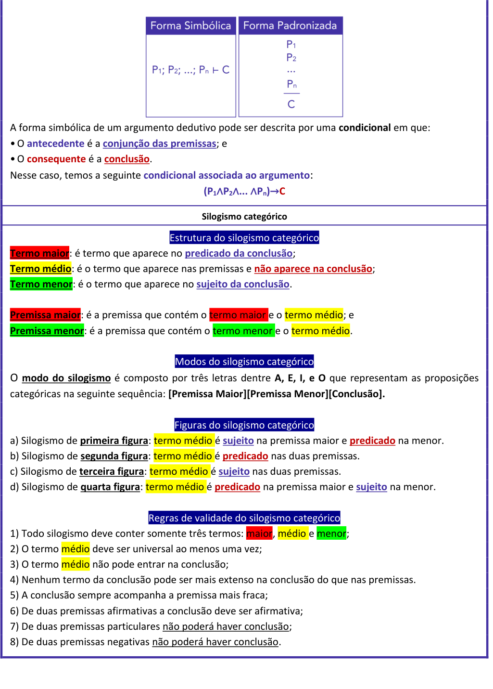

<!-- Start of picture text -->
A forma simbólica de um argumento dedutivo pode ser descrita por uma  condicional  em que: • O  antecedente  é a  conjunção das premissas ; e • O  consequente  é a  conclusão . Nesse caso, temos a seguinte  condicional associada ao argumento : (P1 ∧ P2 ∧ ...  ∧ Pn) → C Silogismo categórico Estrutura do silogismo categórico Termo maior :  é termo que aparece no  predicado da conclusão ; Termo médio :  é o termo que aparece nas premissas e  não aparece na conclusão ; Termo menor :  é o termo que aparece no  sujeito da conclusão . Premissa maior :  é a premissa que contém o  termo maior e  o  termo médio;  e Premissa menor :  é a premissa que contém o  termo menor e  o  termo médio. Modos do silogismo categórico O  modo do silogismo é composto por três letras dentre  A, E, I, e O  que representam as proposições categóricas na seguinte sequência:  [Premissa Maior][Premissa Menor][Conclusão]. Figuras do silogismo categórico a) Silogismo de  primeira figura :  termo médio é sujeito na premissa maior e  predicado  na menor. b) Silogismo de  segunda figura :  termo médio é predicado nas duas premissas. c) Silogismo de terceira figura :  termo médio é sujeito nas duas premissas. d) Silogismo de  quarta figura :  termo médio é predicado na premissa maior e sujeito  na menor. Regras de validade do silogismo categórico 1) Todo silogismo deve conter somente três termos:  maior, médio e menor; 2) O termo  médio  deve ser universal ao menos uma vez; 3) O termo  médio  não pode entrar na conclusão; 4) Nenhum termo da conclusão pode ser mais extenso na conclusão do que nas premissas. 5) A conclusão sempre acompanha a premissa mais fraca; 6) De duas premissas afirmativas a conclusão deve ser afirmativa; 7) De duas premissas particulares não poderá haver conclusão; 8) De duas premissas negativas não poderá haver conclusão. <!-- End of picture text -->

---

<!-- pagina: 27 -->

**Equipe Exatas Estratégia Concursos Aula 05** 

###### **Métodos de verificação da validade de um argumento dedutivo** 

<mark>Método dos diagramas lógicos</mark> Esse método consiste em se utilizar **diagramas lógicos** para se verificar a validade do argumento, devendo ser usado quando temos **argumentos categóricos** . 

<mark>Método em que se considera todas as premissas verdadeiras</mark> Devemos **considerar as premissas verdadeiras** e **<u>verificar se a conclusão é necessariamente verdadeira</u>** <u>.</u> Esse método apresenta uma **semelhança muito grande com aquelas** " **questões clássicas** " que envolvem os conectivos lógicos. Quando estamos tratando de argumentos, as **<u>premissas devem ser tratadas como afirmações verdadeiras</u>** <u>.</u> 

- <mark>Método da tabela-verdade</mark> 

- Construir a tabela-verdade da **condicional associada ao argumento** , dada por **(P1** ∧ **P2** ∧ **...** ∧ **Pn)** → **C:** • Se a condicional que representa o argumento for uma **tautologia** , o **argumento é válido** ; e • Se a condicional **não for** uma **tautologia** , o **argumento é inválido** . Em questões de múltipla escolha, temos três etapas: • **<u>Etapa 1</u>** <u>:</u> **desconsiderar o contexto** , transformando as afirmações da língua portuguesa para a linguagem proposicional; • **<u>Etapa 2</u>** <u>: inserir todas as premissas na tabela e</u> **obter as linhas da tabela-verdade em que todas as premissas são simultaneamente verdadeiras** ; e • **<u>Etapa 3</u>** <u>:</u> **verificar a resposta** que apresenta uma proposição **que é verdadeira para todas as linhas obtidas na etapa anterior** . <mark>Método da conclusão falsa</mark> 

- Para se aplicar esse método é necessário que a **conclusão** seja uma **<u>proposição simples</u>** , uma **<u>disjunção inclusiva</u>** ( **ou;** ∨ ) ou uma **<u>condicional</u>** ( **se...então;** → ). 

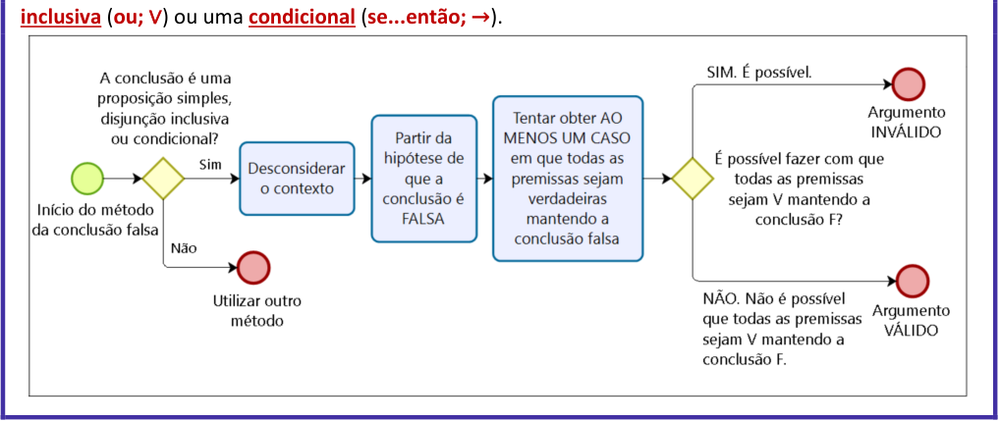

<!-- Start of picture text -->
inclusiva ( ou;  ∨ ) ou uma  condicional ( se...então;  → ). <!-- End of picture text -->

---

<!-- pagina: 28 -->

**Equipe Exatas Estratégia Concursos Aula 05** 

###### <mark>Método da transitividade da condicional</mark> 

O **método da transitividade do condicional** consiste basicamente em **concatenar** de modo conveniente uma parte ou todas as premissas do argumento, que se apresentam no formato condicional, de modo a se **obter a conclusão sugerida** . **Se a conclusão for obtida** , **o argumento é válido** . 

O argumento no formato abaixo, independentemente do número de premissas, é **sempre válido** . 

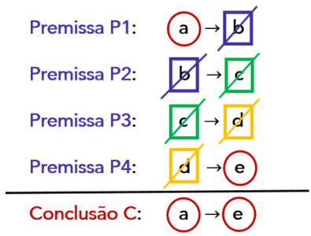

Em algumas questões é necessário utilizar a **equivalência contrapositiva (p** → **q ≡** ~ **q** →~ **p)** para deixar as condicionais dispostas de uma forma em que é possível conectá-las. 

Em algumas questões as premissas podem estar no formato de **disjunção inclusiva (ou;** ∨ **)** . Nesse caso, podemos **transformar essas premissas em condicionais** utilizando a equivalência **p** ∨ **q ≡** ~ **p** → **q** . 

Algumas questões podem apresentar **condicionais nas premissas** e uma **conclusão** que é uma **proposição simples** . Nesses casos, busca-se obter uma conclusão da forma ~ **p** → **p** ou da forma **p** →~ **p** : 

**• Conclusão** ~ **p** → **p significa que p é verdadeiro** ; e 

- **Conclusão p** →~ **p significa que p é falso** . 

###### <mark>Método das regras de inferência</mark> 

Regras de inferência são "regras de bolso" que servem para verificar a validade de um argumento dedutivo com maior rapidez. 

As **regras de inferência** apresentam **<u>argumentos válidos</u>** <u>.</u> 

**Modus Ponens (afirmação do antecedente)** 

**Premissa 1** : Se **p** , então **q** . 

**Premissa 2** : **p** . **Conclusão** : **q** . 

**Modus Tollens (negação do consequente) Premissa 1** : Se **p** , então **q** . **Premissa 2** : ~ **q** . **Conclusão** : ~ **p** . 

**Silogismo Hipotético** 

**Premissa 1** : Se **p** , então **q** . **Premissa 2** : Se **q** , então **r** . **Conclusão** : Se **p** , então **r** .

---

<!-- pagina: 29 -->

**Equipe Exatas Estratégia Concursos Aula 05** 

|**Premissa 1**: Se**p**, então**q**.|**Dilema Construtivo**|
|---|---|
|**Premissa 2**: Se**r**, então**s**.||
|**Premissa 3**:**p** ou**r**.||
|**Conclusão**:**q** ou**s**.|**Dilema Destrutivo**|
|**Premissa 1**: Se**p**, então**q**.||
|**Premissa 2**: Se**r**, então**s**.||
|**Premissa 2**:~**q**ou~**s**.||
|**Conclusão**:~**p**ou~**r**.||

---

<!-- pagina: 30 -->

**Equipe Exatas Estratégia Concursos Aula 05** 

## Introdução aos argumentos dedutivos 

Podemos definir **argumento** como a relação que se dá entre um conjunto de **premissas** que dão suporte à defesa de uma **conclusão** . 

Os argumentos podem ser classificados em três tipos: argumentos dedutivos, argumentos indutivos e argumentos abdutivos. 

Nesse momento vamos estudar somente os **<u>argumentos dedutivos</u>** <u>, que são aqueles que fazem parte da</u> **Lógica Proposicional** , isto é, que pertencem ao ramo da lógica que estudamos até o momento. Os outros tipos de argumentos, caso façam parte do seu edital, serão abordados futuramente. 

Para fins do estudo dos argumentos dedutivos, as **premissas** podem ser definidas como **proposições que devem ser consideradas verdadeiras** para se chegar a uma **conclusão** . 

Vale ressaltar que as **premissas** também são conhecidas por **hipóteses** do argumento. 

Os **<u>argumentos dedutivos</u>** são aqueles que **<u>não</u> produzem conhecimento novo** .  Isso significa que a informação presente na conclusão já estava presente nas premissas. Veja o exemplo: 

**Premissa 1** : João e Pedro foram à praia. 

**Conclusão** : Logo, João foi à praia. 

Observe que, **<u>considerando a</u> premissa 1** **<u>verdadeira</u>** <u>, temos que a conjunção "João e Pedro foram à praia"</u> é verdadeira, e isso significa que as proposições simples que a compõem, "João foi à praia" e "Pedro foi à praia", são ambas verdadeiras. Observe que, nesse caso, a **conclusão** " **João foi à praia** " **torna explícito um conhecimento que já estava presente na premissa** . 

Quando temos um argumento dedutivo composto por exatamente **duas premissas** e uma conclusão, esse argumento é chamado de **<u>silogismo.</u>** Exemplo: 

**Premissa 1** : Se João foi à praia, então o dia estava ensolarado. 

**Premissa 2:** João foi à praia. 

**Conclusão** : Logo, o dia estava ensolarado. 

Novamente, podemos perceber que o argumento dedutivo acima não produziu conhecimento novo. 

### Argumentos categóricos e hipotéticos 

Os argumentos dedutivos também podem conter **proposições categóricas** , apresentando **quantificadores** como " **todo** ", " **nenhum** ", " **existe** ", " **algum** ", " **pelo menos um** ", etc. Esses argumentos são chamados de **argumentos categóricos** . Exemplo:

---

<!-- pagina: 31 -->

**Equipe Exatas Estratégia Concursos Aula 05** 

**Premissa 1** : **<u>Todo</u>** ser humano é mortal. 

**Premissa 2** : João é ser humano. 

**Conclusão** : Logo, João é mortal. 

Os **argumentos hipotéticos** , por outro lado, são aqueles que não apresentam proposições categóricas e **fazem uso dos conectivos** : conjunção, disjunção inclusiva, disjunção exclusiva, condicional ou bicondicional. Os dois primeiros argumentos apresentados nesse tópico introdutório são argumentos hipotéticos. 

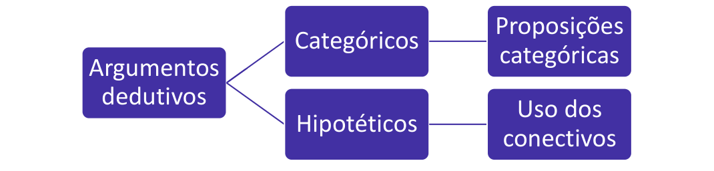

<!-- Start of picture text -->
Proposições Categóricos categóricas Argumentos dedutivos Uso dos Hipotéticos conectivos <!-- End of picture text -->

## Validade dos argumentos dedutivos × Veracidade das proposições 

O primeiro ponto que deve ser entendido quanto a diferença entre **<u>validade</u>** e **<u>veracidade</u>** é: 

- **<u>Validade</u>** é uma característica dos **argumentos dedutivos** . Esse tipo de argumento pode ser **válido** ou **inválido** ; e 

- **<u>Veracidade</u>** é uma característica das **proposições** . As proposições podem ser **verdadeiras** ou **falsas** . 

Feita essa distinção, vamos desenvolver essas duas ideias. Quanto à validade dos argumentos, nesse momento serão apresentados apenas conceitos preliminares. Mais adiante, ainda nessa aula, aprenderemos os **métodos de verificação da validade de um argumento dedutivo** . 

### Validade dos argumentos dedutivos 

Observe o argumento a seguir, com as premissas **P1** , **P2** e **P3** e com a sua conclusão **C** : 

**P1:** "Se eu comer muito, então eu engordo." 

**P2:** "Se eu engordar, então eu corro uma menor distância em 12 minutos." 

**P3** : "Se eu correr uma menor distância em 12 minutos, então minha performance no teste físico diminui." 

**C** : "Se eu comer muito, então minha performance no teste físico diminui." 

Para avaliar a **validade** do argumento, estamos preocupados apenas com a **<u>forma com que ele é construído</u>** .

---

<!-- pagina: 32 -->

**Equipe Exatas Estratégia Concursos Aula 05** 

Não estamos discutindo a veracidade das premissas **P1** , **P2** e **P3** nem a veracidade da conclusão **C** . **Não sabemos ao certo se as condicionais, quando contrastadas com a realidade dos fatos, são verdadeiras** : 

- Se a pessoa comer muito, ela necessariamente vai engordar? Pode ser que ela tenha uma genética propícia... 

- Se essa pessoa engordar, ela realmente corre uma menor distância em 12 minutos? Pode ser que não... 

- Se essa pessoa correr uma distância menor em 12 minutos, a performance dela no teste físico realmente vai diminuir? Esse teste físico pode ser composto por diversas modalidades... 

- Se essa pessoa comer muito, ela realmente vai ter sua performance diminuída no teste físico? 

Enfim, **para fins de aferição da** **<u>validade</u> de um argumento** , **todos esses questionamentos quanto à** **<u>veracidade</u> das premissas e da conclusão são** **<u>irrelevantes.</u>** 

Veremos a seguir que, **para verificar se um argumento é válido ou inválido** , **as premissas devem ser CONSIDERADAS verdadeiras** . **Isso não significa que** , **no mudo dos fatos** , **elas são realmente verdadeiras** . 

#### **Argumento dedutivo válido** 

Um **argumento dedutivo é válido** quando a sua **conclusão** é uma **consequência inevitável** do **conjunto de premissas** . Em outras palavras, podemos dizer que: 

Um **argumento dedutivo** é **<u>válido</u>** quando a **<u>conclusão</u>** é **<u>necessariamente verdadeira</u> uma vez que as premissas são CONSIDERADAS verdadeiras** . 

Vamos a um exemplo de **argumento válido** : 

**Premissa 1** : Todas as vacas têm asas. 

**Premissa 2** : Mimosa é uma vaca. 

**Conclusão** : Logo, Mimosa tem asas. 

Pessoal, sabemos que, no mudo dos fatos, vacas não têm asas. Apesar disso, devemos considerar as premissas como verdadeiras. Cogite a possibilidade de que todas as vacas têm asas. Agora pense na minha vaquinha que se chama Mimosa. Perceba que uma **consequência inevitável** desse raciocínio é que a Mimosa tem asas. A **<u>conclusão</u>** é **<u>necessariamente verdadeira</u> uma vez que as premissas foram consideradas verdadeiras** . 

---

<!-- pagina: 33 -->

**Equipe Exatas Estratégia Concursos Aula 05** 

Note que, no caso acima, temos que a **proposição P1** , quando avaliada pela realidade dos fatos, é nitidamente **falsa** e, mesmo assim, o **argumento é válido** <u>. Isso porque, por mais</u> que **P1** seja falsa no mundo dos fatos, **devemos considerá-la verdadeira** **<u>para fins de aferição da validade do argumento</u>** . 

Essa obtenção da validade do argumento **depende da forma** em que ele e construído, e **não do contexto das premissas e da conclusão** . 

Ainda não vimos os **métodos de verificação da validade de um argumento dedutivo** , porém, somente com a definição, podemos resolver algumas questões. Veja: 

**(TCE RO/2013)** Considere que um argumento seja formado pelas seguintes proposições: 

**P1** : A sociedade é um coletivo de pessoas cujo discernimento entre o bem e o mal depende de suas crenças, convicções e tradições. **P2** : As pessoas têm o direito ao livre pensar e à liberdade de expressão. 

**P3** : A sociedade tem paz quando a tolerância é a regra precípua do convívio entre os diversos grupos que a compõem. 

**P4** : Novas leis, com penas mais rígidas, devem ser incluídas no Código Penal, e deve ser estimulada uma atuação repressora e preventiva dos sistemas judicial e policial contra todo ato de intolerância. Com base nessas proposições, julgue o item subsecutivo. 

O argumento em que as proposições de **P1** a **P3** são as premissas e **P4** é a conclusão é um argumento lógico válido. 

**Comentários:** 

Sabemos que um **argumento dedutivo** é **<u>válido</u>** quando a **<u>conclusão</u>** é **<u>necessariamente verdadeira</u> uma vez que as premissas são CONSIDERADAS verdadeiras** . 

Observe que as premissas **P1** e **P3** em nada ajudam para determinar o valor lógico da conclusão. A premissa **P1** nos fala sobre o que é a sociedade e premissa **P2** diz sobre o "direito ao livre pensar e a liberdade de expressão". Já a conclusão trata sobre "novas leis que devem ser incluídas no Código Penal" e sobre a "atuação dos sistemas judicial e policial". 

Em resumo, **a conclusão não é consequência necessariamente verdadeira do conjunto de premissas** , pois **não há qualquer conexão lógica entre a conclusão e as premissas** . Logo, **não se pode dizer que o argumento é válido** . 

**Gabarito: ERRADO.** 

#### **Argumento dedutivo inválido** 

Vejamos a definição de argumento inválido: 

Um **argumento dedutivo** é **<u>inválido</u>** quando, **<u>CONSIDERADAS</u> as premissas como verdadeiras** , **<u>a conclusão não é necessariamente verdadeira</u>** <u>.</u> 

Um **argumento dedutivo inválido** também é conhecido por **falácia formal.**

---

<!-- pagina: 34 -->

**Equipe Exatas Estratégia Concursos Aula 05** 

Vamos a um exemplo: 

**Premissa 1** : Todas as vacas são animais. 

**Premissa 2** : Godofredo não é uma vaca. 

**Conclusão** : Logo, Godofredo não é um animal. 

Perceba que esse é um **argumento inválido** <u>, uma vez que as premissas</u> **não garantem que a conclusão seja necessariamente verdadeira** . Veja que Godofredo pode ser um cachorro, por exemplo. Nesse caso, Godofredo pode ser um animal que não é uma vaca. Consequentemente, perceba que, ao se considerar verdadeiras as premissas " **Todas as vacas são animais** " e " **Godofredo não é uma vaca** ", **<u>a conclusão não é necessariamente verdadeira</u>** <u>, pois não se pode afirmar de modo inequívoco que "</u> **Godofredo não é um animal** ". 

### Veracidade das proposições 

Já vimos que, para a aferição da **<u>validade</u>** de um argumento, devemos **<u>CONSIDERAR</u>** as premissas verdadeiras e avaliar se, como consequência disso, a conclusão é necessariamente verdadeira. 

**Quando falamos de veracidade das proposições** , estamos nos referindo à **<u>contextualização</u>** das **premissas** e da **conclusão** com o mundo real. Nesse caso, ao dizer que uma **proposição** ( **premissa** ou **conclusão** ) é verdadeira ou falsa estamos, na verdade, contrastando a proposição com o mundo dos fatos para averiguar se ela é de fato verdadeira ou se ela realmente é falsa. 

Podemos ter um **argumento válido** nas seguintes situações: 

- **Premissas verdadeiras e conclusão verdadeira;** 

- **Premissas falsas e conclusão verdadeira** ; e 

- **Premissas falsas e conclusão falsa** . 

Observe que **não é possível** ter um **argumento válido** com **premissas verdadeiras e conclusão falsa** . 

Já para um **argumento inválido** , podemos ter as quatro situações: 

- **Premissas verdadeiras e conclusão verdadeira** ; 

- **Premissas verdadeiras e conclusão falsa;** 

- **Premissas falsas e conclusão verdadeira** ; e 

- **Premissas falsas e conclusão falsa** .

---

<!-- pagina: 35 -->

**Equipe Exatas Estratégia Concursos Aula 05** 

_Professor, fiquei confuso. Se eu me deparar, por exemplo, com um argumento em que as_ **_premissas são falsas e a conclusão é falsa_** _. Como vou saber se o argumento é válido ou não?_ 

Calma, caro aluno! Em breve vamos falar sobre os **métodos de verificação da validade de um argumento** . Para obter a **<u>validade</u> de um argumento** , **<u>não</u>** devemos avaliar a **<u>veracidade</u> das proposições** . Como acabamos de ver, um argumento com **premissas falsas e conclusão falsa** pode ser tanto **válido** quanto **inválido** . 

Observe também que **não há uma relação direta** entre a **<u>validade de um argumento</u>** e a **<u>veracidade da sua</u> conclusão** . Um argumento pode ser válido tanto com uma conclusão verdadeira quanto com uma conclusão <u>falsa.</u> 

Como acabamos de ver, é possível termos um **argumento válido** com **premissas falsas e conclusão falsa** <u>.</u> Além disso, é possível ter um **argumento inválido** com **premissas falsas e conclusão falsa** , bem como com **premissas verdadeiras e conclusão falsa** . 

**Não há uma relação direta** entre a **<u>validade</u> de um argumento** e a **<u>veracidade da sua</u> conclusão** . Um argumento pode ser válido tanto com uma conclusão verdadeira quanto com uma conclusão falsa. 

Vamos praticar os conceitos vistos até aqui. 

##### **(Pref. São Cristóvão/2023)** 

O fato de a proposição “Se tiro boas notas, sou aprovado.” ser uma premissa do argumento apresentado no texto significa que 

a) deve-se sempre supor a veracidade da proposição para se verificar a validade do argumento. 

b) tal proposição é sempre verdadeira. 

c) a veracidade da proposição implica a validade do argumento. 

d) a validade do argumento implica a veracidade da proposição. 

**Comentários:**

---

<!-- pagina: 36 -->

**Equipe Exatas Estratégia Concursos Aula 05** 

Vamos verificar cada alternativa e assinalar aquela que melhor completa a frase do enunciado. **a) O fato de a proposição “Se tiro boas notas, sou aprovado.” ser uma premissa do argumento apresentado** **<u>no texto significa que se deve sempre supor a veracidade da proposição para se verificar a validade do</u> argumento. CERTO. Esse é o gabarito.** Quanto à validade de um argumento, aprendemos que: • Um **argumento dedutivo é** **<u>válido</u>** quando a **<u>conclusão</u>** é **<u>necessariamente verdadeira</u> uma vez que as premissas são CONSIDERADAS verdadeiras** . • Um **argumento dedutivo é inválido** quando, **<u>CONSIDERADAS as premissas como verdadeiras</u>** , a **<u>conclusão não é necessariamente verdadeira</u>** . Note, portanto, que para verificar se um argumento é **<u>válido</u>** ou **<u>inválido</u>** <u>, devemos</u> **supor a veracidade da proposição em questão** , **que é uma premissa** . **b) O fato de a proposição “Se tiro boas notas, sou aprovado.” ser uma premissa do argumento apresentado** **<u>no texto significa que tal proposição é sempre verdadeira. ERRADO.</u>** 

O fato de uma proposição ser uma premissa **não significa** dizer que ela é sempre verdadeira quando contrastada com a realidade dos fatos. Na verdade, a premissa é uma proposição que deve ser **CONSIDERADA verdadeira** somente para fins de verificação da validade do argumento. **c) O fato de a proposição “Se tiro boas notas, sou aprovado.” ser uma premissa do argumento apresentado** **<u>no texto significa que a veracidade da proposição implica a validade do argumento. ERRADO.</u>** A possível veracidade de uma premissa não faz com que o argumento seja obrigatoriamente válido. A validade do argumento **depende da forma** com que ele foi construído, **<u>não</u>** da **<u>veracidade</u>** das premissas. **d) O fato de a proposição “Se tiro boas notas, sou aprovado.” ser uma premissa do argumento apresentado** **<u>no texto significa que a validade do argumento implica a veracidade da proposição. ERRADO.</u>** Lembre-se de que, para um **argumento válido** , podemos ter três situações: • **Premissas verdadeiras e conclusão verdadeira** ; • **<u>Premissas falsas e conclusão verdadeira</u>** ; e • **<u>Premissas falsas e conclusão falsa</u>** . Logo, **podemos ter um argumento válido com premissas falsas** . Consequentemente, a validade do argumento **não implica** a veracidade da premissa. **Gabarito: Letra A. (Polícia Federal/2021) P1** : Se a fiscalização foi deficiente, as falhas construtivas não foram corrigidas. **P2** : Se as falhas construtivas foram corrigidas, os mutuários não tiveram prejuízos.

---

<!-- pagina: 37 -->

**Equipe Exatas Estratégia Concursos Aula 05** 

**P3** : A fiscalização foi deficiente. 

##### **C** : Os mutuários tiveram prejuízos. 

Considerando um argumento formado pelas proposições precedentes, em que **C** é a conclusão, e **P1** a **P3** são as premissas, julgue o item a seguir. 

Caso o argumento apresentado seja válido, a proposição **C** será verdadeira. 

**Comentários:** 

Não há uma relação direta entra a **<u>validade</u> de um argumento** e a **<u>veracidade da sua conclusão</u>** . Um argumento pode ser válido tanto com uma conclusão verdadeira quanto com uma conclusão falsa. 

É **plenamente possível termos um argumento válido com uma conclusão falsa** . A obtenção da validade do argumento **depende da forma** com que ele e construído, **<u>não</u>** da **<u>veracidade</u>** da conclusão **.** Lembre-se de que, para um **argumento válido** , podemos ter três situações: 

- **Premissas verdadeiras e conclusão verdadeira** ; 

- **Premissas falsas e conclusão verdadeira** ; e 

- **Premissas falsas e conclusão falsa** . 

- **Gabarito: ERRADO.** 

**(PO AL/2013)** Nas investigações, pesquisadores e peritos devem evitar fazer afirmações e tirar conclusões errôneas. Erros de generalização, ocorridos ao se afirmar que certas características presentes em alguns casos deveriam estar presentes em toda a população, são comuns. É comum, ainda, o uso de argumentos inválidos como justificativa para certas conclusões. Acerca de possíveis erros em trabalhos investigativos, julgue o item a seguir. 

Em um argumento inválido, a conclusão é uma proposição falsa. 

**Comentários:** 

Não há uma relação direta entra a **<u>validade</u> de um argumento** e a **<u>veracidade da sua conclusão</u>** . Um argumento pode ser inválido tanto com uma conclusão verdadeira quanto com uma conclusão falsa. 

É **plenamente possível termos um argumento inválido com uma conclusão verdadeira** . A obtenção da validade do argumento **depende da forma** com que ele e construído, **<u>não</u>** da **<u>veracidade</u>** da conclusão **.** Lembre-se de que, para um **argumento inválido** , podemos ter quatro situações: 

- **Premissas verdadeiras e conclusão verdadeira** ; 

- **Premissas verdadeiras e conclusão falsa** ; 

- **Premissas falsas e conclusão verdadeira** ; 

- **Premissas falsas e conclusão falsa** . 

**Gabarito: ERRADO.**

---

<!-- pagina: 38 -->

**Equipe Exatas Estratégia Concursos Aula 05** 

## Representação de um argumento dedutivo 

Um **argumento dedutivo** com **n** premissas ( **P1; P2; ... ; Pn** ) e com uma conclusão **C** pode ser representado na **forma simbólica** ou na **forma padronizada** . 

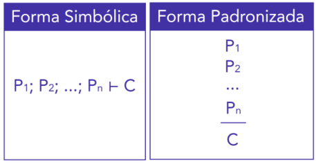

### Condicional associada ao argumento 

A forma simbólica de um argumento dedutivo pode ser descrita por uma **condicional** em que: 

- O **antecedente** é a **<u>conjunção das premissas</u>** ; e 

- O **consequente** é a **<u>conclusão</u>** . 

Nesse caso, temos a seguinte **condicional associada ao argumento** : 

**(P1** ∧ **P2** ∧ **...** ∧ **Pn)** → **C** 

**(Pref. Limoeiro de Anadia/2013)** A afirmação “Um ________ pode ser representado de forma simbólica por **P1&P2&P3&...& Pn** → **Q** , onde **P1** , **P2** , ... **Pn** são denominados ________ e **Q** é denominada ________ do argumento.” 

a) Predicado; Hipóteses; Premissa. 

b) Argumento Dedutivo; Premissas; Hipótese. 

c) Argumento Indutivo; Variáveis; Conclusão. 

d) Argumento Válido; Premissas; Hipótese. 

e) Argumento Dedutivo; Premissas; Conclusão. 

**Comentários:** 

Trata-se de um **argumento dedutivo** em que **P1** ; **P2 ; ...; P3** são as **premissas** ou **hipóteses** e **Q** é a **conclusão** . **<u>Observação</u>** <u>: lembre-se de que o conectivo "</u> **&** " **é uma conjunção** , que poderia ter sido representada por " ∧ ". **Gabarito: Letra E.**

---

<!-- pagina: 39 -->

**Equipe Exatas Estratégia Concursos Aula 05** 

**(Polícia Federal/2021)** 

**P1** : Se a fiscalização foi deficiente, as falhas construtivas não foram corrigidas. 

**P2** : Se as falhas construtivas foram corrigidas, os mutuários não tiveram prejuízos. 

**P3** : A fiscalização foi deficiente. 

**C** : Os mutuários tiveram prejuízos. 

Considerando um argumento formado pelas proposições precedentes, em que **C** é a conclusão, e **P1** a **P3** são as premissas, julgue o item a seguir. 

A tabela verdade da proposição condicional associada ao argumento tem menos de dez linhas. 

**Comentários:** 

Considere as seguintes proposições simples: 

**d:** "A fiscalização foi deficiente." 

**f:** "As falhas construtivas foram corrigidas." 

**m:** "Os mutuários tiveram prejuízo." 

O argumento em questão é dado por: 

**Premissa P1** : **d** →~ **f** 

**Premissa P2** : **f** →~ **m** 

**Premissa P3** : **f** 

**Conclusão C** : **m** 

A **condicional associada ao argumento** é aquela em que: 

• O **antecedente** é a **<u>conjunção das premissas</u>** ; e 

• O **consequente** é a **<u>conclusão</u>** <u>.</u> 

Logo, a **condicional associada ao argumento** é: 

**[(d** →~ **f)** ∧ **(f** →~ **m)** ∧ **(f)]** → **m** 

Veja que nessa condicional temos apenas 𝑛= 3 proposições simples distintas. Logo, o número de linhas da tabela-verdade da proposição condicional associada ao argumento é: 

𝟐𝟑 = 𝟖 **linhas** 

Portanto, é **correto** dizer que a tabela-verdade da proposição condicional associada ao argumento tem **menos de dez linhas** . 

**Gabarito: CERTO.**

---

<!-- pagina: 40 -->

**Equipe Exatas Estratégia Concursos Aula 05** 

## Silogismo categórico 

Já vimos que **argumentos categóricos** são aqueles que apresentam **proposições categóricas** . Além disso, sabemos que um **silogismo** é composto por exatamente **duas premissas** . 

Nesse tópico, vamos apresentar alguns conceitos relacionados ao **silogismo categórico** , isto é, conceitos sobre argumentos que apresentam apenas duas premissas que são proposições categóricas 

Esse assunto não costuma ser muito cobrado em provas, mas é necessário apresentá-los para que você tenha um material completo. 

### Estrutura do silogismo categórico 

Os silogismos categóricos são formados por **três termos** : 

- a) <mark>Termo maior:</mark> é termo que aparece no **<u>predicado da conclusão</u>** <u>;</u> 

- b) <mark>Termo médio:</mark> é o termo que aparece nas premissas e **<u>não aparece na conclusão</u>** ; 

- c) <mark>Termo menor:</mark> é o termo que aparece no **<u>sujeito da conclusão</u>** <u>.</u> 

Observe, no exemplo abaixo, que " <mark>guepardo"</mark> é o termo maior, " <mark>rápido (a)"</mark> é o termo médio e <mark>"tartaruga"</mark> é o termo menor. 

Todo <mark>guepardo</mark> é <mark>rápido.</mark> 

Alguma <mark>tartaruga n</mark> ão é <mark>rápida.</mark> 

Logo, nenhuma <mark>tartaruga é</mark> <u><mark>guepardo</mark></u> . 

Definidos esses três termos, podemos também **definir os seguintes conceitos** : 

a) <mark>Premissa maior:</mark> é a premissa que contém o <mark>termo maior</mark> e o <mark>termo médio;</mark> e 

b) <mark>Premissa menor:</mark> é a premissa que contém o <mark>termo menor</mark> e o <mark>termo médio.</mark> 

Perceba que, no exemplo dado, "Todo o <mark>guepardo</mark> é <mark>rápido"</mark> é a <mark>premissa maior</mark> e "Alguma <mark>tartaruga</mark> não é <mark>rápida"</mark> é a <mark>premissa menor.</mark> 

Por convenção, costuma-se colocar a **premissa maior** como a **primeira** do silogismo categórico, porém, em uma questão de concurso público, a banca pode inverter a ordem das premissas para confundir o candidato. Portanto, é necessário que você **entenda as definições** de premissa maior e de premissa menor. 

### Modos do silogismo categórico 

Já aprendemos em aula passada que uma proposição categórica pode ser classificada como: 

- a) Universal afirmativa (A); 

- b) Universal negativa (E); 

- c) Particular afirmativa (I); e 

- d) Particular negativa (O).

---

<!-- pagina: 41 -->

**Equipe Exatas Estratégia Concursos Aula 05** 

O **modo do silogismo categórico** é composto por três letras que representam as proposições categóricas na seguinte sequência **: [Premissa Maior][Premissa Menor][Conclusão].** Para o caso no nosso exemplo, o modo do silogismo é AOE. 

### Figuras do silogismo categórico 

Para classificar a figura do silogismo, devemos utilizar a seguinte regra: 

- a) Silogismo de **<u>primeira figura</u>** : <mark>termo médio</mark> é **<u>sujeito</u>** na premissa maior e **<u>predicado</u>** na menor. 

b) Silogismo de **<u>segunda figura</u>** : <mark>termo médio</mark> é **<u>predicado</u>** nas duas premissas. 

c) Silogismo de **<u>terceira figura</u>** : <mark>termo médio</mark> é **<u>sujeito</u>** nas duas premissas. 

d) Silogismo de **<u>quarta figura</u>** : <mark>termo médio</mark> é **<u>predicado</u>** na premissa maior e **<u>sujeito</u>** na menor. 

Observe novamente o nosso exemplo: 

Todo <mark>guepardo</mark> é <mark>rápido.</mark> 

Alguma <mark>tartaruga n</mark> ão é <mark>rápida.</mark> 

Logo, nenhuma <mark>tartaruga é</mark> <u><mark>guepardo</mark></u> . 

Trata-se de um silogismo de segunda figura, pois o termo médio " <mark>rápido (a)"</mark> é predicado nas suas premissas. 

**(PCSP/2013)** Assinale a alternativa que representa o modo e a figura do silogismo seguinte. 

Todo sapo é verde. 

Algum cão não é verde. 

Logo, nenhum cão é sapo. 

a) OAE – 2. b) AEI – 4. c) EAO – 1. d) AOE – 2. e) AIE – 3. 

**Comentários:** 

O termo médio é o termo que não aparece na conclusão: <mark>verde.</mark> Esse termo é predicado nas duas premissas, logo, trata-se de um silogismo de **<u>segunda figura.</u>** 

A termo maior é o predicado da conclusão: <mark>sapo.</mark> 

O termo menor é o sujeito da conclusão: <mark>cão.</mark> 

Podemos então observar que o silogismo está no modo "tradicional", em que a premissa maior é a primeira premissa "Todo <mark>sapo é verde"</mark> : 

Vamos agora obter o **modo.**

---

<!-- pagina: 42 -->

**Equipe Exatas Estratégia Concursos Aula 05** 

Todo <mark>sapo é verde.</mark> - Premissa maior é universal afirmativa: **A** . 

Algum <mark>cão n</mark> ão é <mark>verde.</mark> - Premissa menor é particular negativa: **O** . 

Logo, nenhum <mark>cão é sapo.</mark> - Conclusão é universal negativa: **E.** 

Observa-se que o modo é **AOE** . 

A questão nos pede o modo e a figura: **AOE-2** . 

**Gabarito: Letra D.** 

### Regras de validade do silogismo categórico 

Temos oito regras de validade do silogismo categórico: 

- 1) Todo silogismo deve conter somente três termos: <mark>maior, médio e menor</mark> ; 

- 2) O termo <mark>médio d</mark> eve ser universal ao menos uma vez; 

- 3) O termo <mark>médio n</mark> ão pode entrar na conclusão; 

- 4) Nenhum termo da conclusão pode ser mais extenso na conclusão do que nas premissas. 

- 5) A conclusão sempre acompanha a premissa mais fraca; 

- 6) De duas premissas afirmativas a conclusão deve ser afirmativa; 

- 7) De duas premissas particulares não poderá haver conclusão; 

- 8) De duas premissas negativas não poderá haver conclusão. 

O fato de a conclusão acompanhar a premissa mais fraca significa que, se houver uma premissa negativa, a conclusão será negativa. Se houver uma premissa particular, a conclusão será particular. Se houver ambas, a conclusão deverá ser negativa e particular. 

**(PETROBRAS/2010)** Com relação às regras para validade de um silogismo, analise o que se segue. 

I - Todo silogismo deve conter somente três termos. 

II - De duas premissas particulares não poderá haver conclusão. 

III - Se há uma premissa particular, a conclusão será particular. 

IV - Se há um termo médio negativo, a conclusão será negativa. 

São regras válidas para um silogismo 

A) I e IV, apenas. 

B) II e III, apenas. 

C) I, II e III, apenas. 

D) I, II e IV, apenas. 

E) I, II, III e IV. 

##### **Comentários:** 

I - Certo, todo silogismo deve conter somente três termos: maior, médio e menor. 

II - Certo, está é uma regra de validade do silogismo categórico: "de duas premissas particulares não poderá <u>haver conclusão".</u>

---

<!-- pagina: 43 -->

**Equipe Exatas Estratégia Concursos Aula 05** 

III - Certo, pois a conclusão sempre acompanha a premissa mais fraca. Isso significa que se houver uma premissa negativa, a conclusão será negativa. Se houver uma premissa particular, a conclusão será particular. Se houver ambas, a conclusão deverá ser negativa e particular. 

IV - Errado. Não temos como afirmar isso. Não há que se falar em "termo médio negativo", mas sim em premissa, conclusão ou proposição negativa. Quanto às <u>premissas, sabemos que a conclusão sempre</u> acompanha a premissa mais fraca. 

**Gabarito: Letra C.** 

## Métodos de verificação da validade de um argumento dedutivo 

Pessoal, especial atenção para esse tópico, pois é o mais importante dessa aula. 

Existem diversas formas de se avaliar se um **argumento dedutivo** é **válido** ou **inválido** . A seguir, vamos apresentar os principais métodos. 

### Método dos diagramas lógicos 

Conforme já mencionado nessa aula, os **argumentos dedutivos** podem ser **argumentos categóricos** ou **argumentos hipotéticos** . 

Quando temos **argumentos categóricos** , a validade do argumento é aferida por meio dos **diagramas lógicos** aprendidos na aula anterior. 

Ao se desenhar os diagramas lógicos e se verificar que a **conclusão do argumento não é necessariamente verdadeira** , temos um **argumento inválido** . Por outro lado, se a **conclusão for necessariamente verdadeira** , temos um **argumento válido** . 

Não vamos discorrer muito sobre diagramas lógicos nessa aula, pois tudo o que você precisava saber já foi apresentado na aula anterior. Vamos apenas realizar um exemplo para "refrescar a memória": 

**(BANESTES/2023)** Dado um conjunto finito de proposições **p1** , **p2** , ... , **pn** (chamadas premissas) e uma proposição **c** (chamada conclusão), diz-se que a relação que associa as premissas à conclusão é um argumento. 

Um argumento é válido quando a conclusão **c** é consequência obrigatória do conjunto de premissas. Considere os seguintes argumentos: 

##### **Argumento I** 

**p1** : todas as crianças gostam de pizza. 

**p2** : quem gosta de refrigerante gosta de pizza. 

**c** : todas as crianças gostam de refrigerante. 

##### **Argumento II** 

**p1** : todas as crianças gostam de pizza. 

**<u>p2</u>** : quem gosta de refrigerante gosta de pizza.

---

<!-- pagina: 44 -->

**Equipe Exatas Estratégia Concursos Aula 05** 

**c** : quem gosta de refrigerante é criança. 

##### **Argumento III** 

**p1** : todas as crianças gostam de pizza. 

**p2** : quem gosta de refrigerante não gosta de pizza. 

**c** : nenhuma criança gosta de refrigerante. 

É (são) argumento(s) válido(s) 

a) I, apenas. 

b) III, apenas. 

c) I e II, apenas. 

d) II e III, apenas. 

e) I, II e III. 

##### **Comentários:** 

Em cada um dos três argumentos apresentados, **vamos verificar se a conclusão é consequência obrigatória do conjunto de premissas** . 

##### **<u>Argumento I</u>** 

**p1** : todas as crianças gostam de pizza. 

Nesse caso, devemos desenhar o conjunto das crianças dentro do conjunto dos que gostam de pizza. 

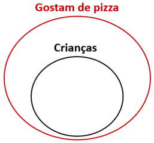

**p2** : quem gosta de refrigerante gosta de pizza. 

Essa proposição corresponde a " **todo aquele que gosta de refrigerante gosta de pizza** ". Nesse caso, devemos desenhar o conjunto dos que gostam de refrigerante dentro do conjunto dos que gostam de pizza. Existem **cinco possibilidades** : 

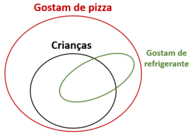

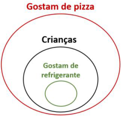

---

<!-- pagina: 45 -->

**Equipe Exatas Estratégia Concursos Aula 05** 

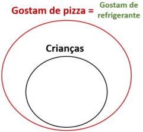

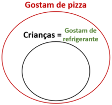

**c** : todas as crianças gostam de refrigerante. 

Veja que **a conclusão não é uma consequência obrigatória das premissas** . Isso porque, nas possibilidades a seguir, temos crianças que não gostam de refrigerante: 

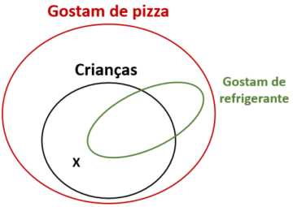

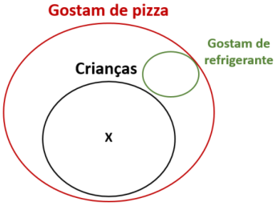

O **argumento** , portanto, é **inválido** . 

**<u>Argumento II</u>** 

No **argumento II** temos as mesmas premissas do **argumento I** . Nesse caso, **teremos os mesmos cinco possíveis diagramas lógicos** . Com base nesses diagramas, vamos avaliar a conclusão. 

**c** : quem gosta de refrigerante é criança. 

Essa conclusão corresponde a " **todo aquele que gosta de refrigerante é criança** ". Veja que **a conclusão não é uma consequência obrigatória das premissas** . Isso porque, nas possibilidades a seguir, temos pessoas que gostam de refrigerante e não são crianças: 

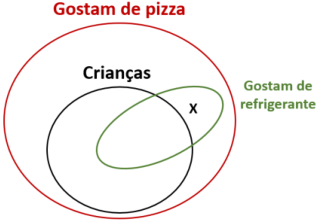

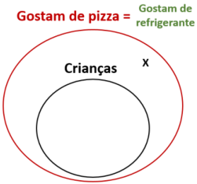

O **argumento** , portanto, é **inválido** . 

##### **<u>Argumento III</u>** 

**p1** : todas as crianças gostam de pizza. 

Nesse caso, devemos desenhar o conjunto das crianças dentro do conjunto dos que gostam de pizza.

---

<!-- pagina: 46 -->

**Equipe Exatas Estratégia Concursos Aula 05** 

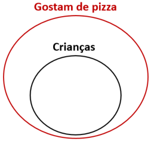

**p2** : quem gosta de refrigerante não gosta de pizza. 

Essa premissa corresponde a " **<u>todo aquele que gosta de refrigerante não</u> gosta de pizza** ", podendo ser descrita por " **<u>Ninguém que gosta de refrigerante gosta de pizza</u>** ". Nesse caso, não deve haver intersecção entre o conjunto dos que gostam de refrigerante e o conjunto dos que gostam de pizza. **Temos apenas uma possibilidade** : 

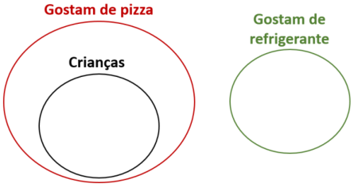

**c** : nenhuma criança gosta de refrigerante. 

Veja que **a conclusão é uma consequência obrigatória das premissas** , pois, com base no único diagrama possível, não há intersecção entre o conjunto das crianças e o conjunto dos que gostam de refrigerante. O **argumento** , portanto, **é válido** . 

Logo, é correto concluir que **apenas o argumento III é válido.** 

**Gabarito: Letra B.** 

Método em que se considera todas as premissas verdadeiras 

Conhecemos as seguintes definições de **argumento válido** e de **argumento inválido** : 

Um **argumento dedutivo** é **<u>válido</u>** quando a **<u>conclusão</u>** é **<u>necessariamente verdadeira</u> uma vez que as premissas são CONSIDERADAS verdadeiras** . 

Um **argumento dedutivo** é **<u>inválido</u>** quando, **<u>CONSIDERADAS</u> as premissas como verdadeiras** , **<u>a conclusão não é necessariamente verdadeira</u>** <u>.</u> 

Para aferir a validade de um argumento, podemos utilizar a própria definição de argumento válido/inválido. Nesse método, devemos **considerar as premissas verdadeiras e verificar se a conclusão é necessariamente** **<u>verdadeira</u>** .

---

<!-- pagina: 47 -->

**Equipe Exatas Estratégia Concursos Aula 05** 

Esse método apresenta uma **semelhança muito grande com aquelas** " **questões clássicas** " envolvendo os conectivos lógicos. Em resumo, quando estamos lidando com argumentos, as **<u>premissas devem ser tratadas</u> como afirmações verdadeiras** <u>.</u> 

Esse método acaba sendo útil somente quando temos premissas que se enquadram nos "formatos fáceis" vistos na teoria sobre as "questões clássicas". Como **<u>premissas</u>** são tratadas como **<u>afirmações verdadeiras</u>** , esse método só é útil quando temos premissas nos seguintes formatos: 

- **Proposição simples verdadeira** ; ou 

- **Conjunção (e;** ∧ **) verdadeira.** 

Vamos recapitular as quatro etapas: 

- **<u>Etapa 1:</u> identificar as afirmações** ( **premissas** ) **que se apresentam em algum dos "formatos fáceis"** ; 

- **<u>Etapa 2:</u> desconsiderar o contexto da questão** , transformando as afirmações da língua portuguesa para a linguagem proposicional; 

- **<u>Etapa 3:</u> obter os valores lógicos das proposições simples** presentes nas afirmações (premissas) do enunciado ( **sempre que possível** ); 

- **<u>Etapa 4:</u> verificar a resposta** que apresenta uma proposição **verdadeira** ( **conclusão verdadeira** ). 

Note que, na **<u>etapa 4</u>** <u>, estamos na verdade aferindo a</u> **validade do argumento** , ou seja, **estamos averiguando se a conclusão é verdadeira uma vez que as premissas foram consideradas verdadeiras** . 

**(CM Taubaté/2023)** Considere as seguintes premissas: 

I. Se Fulano estudou para a prova, então ele foi aprovado. 

II. Se Cicrano não estudou para a prova, então ele não foi aprovado. 

III. Cicrano estudou para prova e Fulano não foi aprovado. 

Uma conclusão válida das premissas apresentadas é: 

a) Cicrano foi aprovado e Fulano não estudou para a prova. 

b) Cicrano foi aprovado ou Fulano estudou para a prova. 

c) Cicrano não foi aprovado e Fulano estudou para a prova. 

d) Cicrano não foi aprovado ou Fulano não estudou para a prova. 

e) ou Cicrano foi aprovado ou Fulano estudou para a prova. 

##### **Comentários:** 

A partir do enunciado, perceba que temos claramente uma questão de **Lógica de Argumentação** , pois são apresentadas **premissas** e procura-se por uma **conclusão** que torna o **argumento válido** . 

Para resolver o problema, vamos utilizar o **método em que se considera todas as premissas verdadeiras** , que apresenta grande semelhança com a resolução das " **questões clássicas** " **envolvendo os conectivos lógicos** . **<u>Etapa 1: identificar as afirmações (premissas) que se apresentam em algum dos "formatos fáceis"</u>**

---

<!-- pagina: 48 -->

**Equipe Exatas Estratégia Concursos Aula 05** 

Note que temos uma **conjunção verdadeira** em "Cicrano estudou para prova **e** Fulano **não** foi aprovado". **É essa afirmação** ( **premissa** ) **que devemos atacar primeiro** . 

##### **<u>Etapa 2: desconsiderar o contexto da questão</u>** 

Sejam as proposições simples: 

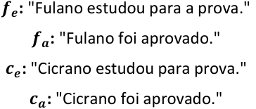

<!-- Start of picture text -->
𝒇𝒆 :  "Fulano estudou para a prova." 𝒇𝒂 :  "Fulano foi aprovado." 𝒄𝒆 :  "Cicrano estudou para prova." 𝒄𝒂 :  "Cicrano foi aprovado." <!-- End of picture text -->

As afirmações (premissas) correspondem a: 

− " **I.** 𝒇𝒆 →𝒇𝒂 **(V) Se [** Fulano estudou para a prova **]** , **então [** ele foi aprovado **]** ." 

− " **II.** ~𝒄𝒆 →~𝒄𝒂 **(V) Se [** Cicrano **não** estudou para a prova **]** , **então [** ele **não** foi aprovado **]** ." − " **III.** 𝒄𝒆 ∧~𝒇𝒂 **(V) [** Cicrano estudou para prova **] e [** Fulano **não** foi aprovado **]** ." 

**<u>Etapa 3: obter os valores lógicos das proposições simples (sempre que possível)</u>** 

Devemos obter os valores lógicos das proposições simples iniciando pelo " **formato fácil** ", que para essa questão é a **premissa III** . 

A **premissa III** é uma conjunção que deve ser considerada verdadeira. Logo, ambas as parcelas devem ser verdadeiras. Consequentemente, 𝒄𝒆 e ~𝒇𝒂 devem ser ambos verdadeiros. Logo, <mark>𝒄</mark> 𝒆<mark>é V</mark>e <mark>𝒇</mark> 𝒂<mark>é F.</mark> 

A **premissa I** é uma condicional que deve ser considerada verdadeira. Logo, não podemos recair no caso **V** → **F** , que é o único caso em que a condicional é falsa. Como o consequente 𝒇𝒂 é falso, o antecedente 𝒇𝒆 não pode ser verdadeiro. Logo, <mark>𝒇</mark> 𝒆<mark>é F</mark>. 

A **premissa II** é uma condicional que deve ser considerada verdadeira. Logo, não podemos recair no caso **V** → **F** , que é o único caso em que a condicional é falsa. Como o antecedente ~𝒄𝒆 é falso, a condicional em questão sempre será verdadeira, qualquer que seja o valor de ~𝒄𝒂 . Isso porque **F** → **V** e **F** → **F** são ambas condicionais verdadeiras. Logo, <mark>não podemos determinar o valor de 𝒄</mark> 𝒂<mark>.</mark> **<u>Etapa 4: verificar a resposta que apresenta uma proposição verdadeira (conclusão verdadeira)</u>** a) 𝒄𝒂 ∧~𝒇𝒆 – Uma conjunção é verdadeira somente quando ambas as parcelas são verdadeiras. Não podemos determinar se a conjunção em questão é verdadeira, pois não temos o valor lógico de 𝒄𝒂 . 

b) 𝒄𝒂 ∨𝒇𝒆 – Para que a disjunção inclusiva seja verdadeira, ao menos uma das parcelas deve ser verdadeira. Como a parcela 𝒇𝒆 é falsa, o valor lógico da disjunção inclusiva depende exclusivamente de 𝒄𝒂 . Como não temos o valor lógico de 𝒄𝒂 , não podemos determinar se a disjunção inclusiva é verdadeira.

---

<!-- pagina: 49 -->

**Equipe Exatas Estratégia Concursos Aula 05** 

c) ~𝒄𝒂 ∧𝒇𝒆 − Uma conjunção é verdadeira somente quando ambas as parcelas são verdadeiras. Não podemos determinar se a conjunção em questão é verdadeira, pois não temos o valor lógico de 𝒄𝒂 . 

d) ~𝒄𝒂 ∨~𝒇𝒆 − Para que a disjunção inclusiva seja verdadeira, ao menos uma das parcelas deve ser verdadeira. Como a parcela ~𝒇𝒆 é verdadeira, **o valor lógico da disjunção inclusiva é verdadeiro** , **qualquer que seja o valor lógico de** 𝒄𝒂 . **Esse é o gabarito** . 

e) 𝒄𝒂 <u>∨</u> 𝒇𝒆 − Para a disjunção exclusiva ser verdadeira, ambas as parcelas precisam apresentar valores lógicos distintos. Como não temos o valor lógico de 𝒄𝒂 , não podemos determinar se a disjunção exclusiva é verdadeira. 

**Gabarito: Letra D.** 

### Método da tabela-verdade 

Considere um **argumento hipotético** com as **premissas P1** , **P2** , ..., **Pn** e com a **conclusão C** . Temos a seguinte **condicional associada ao argumento** em questão: 

**(P1** ∧ **P2** ∧ **...** ∧ **Pn)** → **C** 

Para aferir a validade do argumento, podemos construir a tabela-verdade dessa condicional: 

- Se a condicional que representa o argumento for uma **tautologia** , o **argumento é válido** ; e 

- Se a condicional **não for** uma **tautologia** , o **argumento é inválido** . 

Ressalto que o método da tabela-verdade não costuma ser rápido e, por isso, não deve ser utilizado com frequência. Lembre-se que se tivermos 𝒏 proposições simples distintas no argumento, a tabela-verdade apresentará 𝟐𝒏 linhas. 

Vejamos um exemplo. 

**(TRE RJ/2012)** O cenário político de uma pequena cidade tem sido movimentado por denúncias a respeito da existência de um esquema de compra de votos dos vereadores. A dúvida quanto a esse esquema persiste em três pontos, correspondentes às proposições **P** , **Q** e **R** , abaixo: 

**P** : O vereador Vitor não participou do esquema; 

**Q** : O prefeito Pérsio sabia do esquema; 

**R** : O chefe de gabinete do prefeito foi o mentor do esquema. 

Os trabalhos de investigação de uma CPI da câmara municipal conduziram às premissas **P1** , **P2** e **P3** seguintes: **P1** : Se o vereador Vitor não participou do esquema, então o prefeito Pérsio não sabia do esquema. **P2** : Ou o chefe de gabinete foi o mentor do esquema, ou o prefeito Pérsio sabia do esquema, mas não ambos. **P3** : Se o vereador Vitor não participou do esquema, então o chefe de gabinete não foi o mentor do esquema. Considerando essa situação hipotética, julgue o item seguinte, acerca de proposições lógicas. A partir das premissas **P1** , **P2** e **P3** , é correto inferir que o prefeito Pérsio não sabia do esquema. **Comentários:**

---

<!-- pagina: 50 -->

**Equipe Exatas Estratégia Concursos Aula 05** 

Note que o enunciado já identificou as proposições simples. A conclusão que se quer avaliar é "o prefeito Pérsio **não** sabia do esquema", ou seja, queremos avaliar se ~ **Q** é uma conclusão válida do argumento. 

Podemos construir o argumento da seguinte maneira: 

**Premissa P1** : **P** →~ **Q** 

**Premissa P2** : **<u>R</u>** <u>∨</u> **<u>Q</u>** 

**Premissa P3** : **P** →~ **R** 

**Conclusão** : ~ **Q** 

Identificado o argumento, podemos construir a tabela-verdade da condicional **P1** ∧ **P2** ∧ **P3** → **C** , isto é, da condicional [( **P** →~ **Q** ) ∧ ( **<u>R</u>** <u>∨</u> **Q** ) ∧ ( **P** →~ **R** )] → ~ **Q** . 

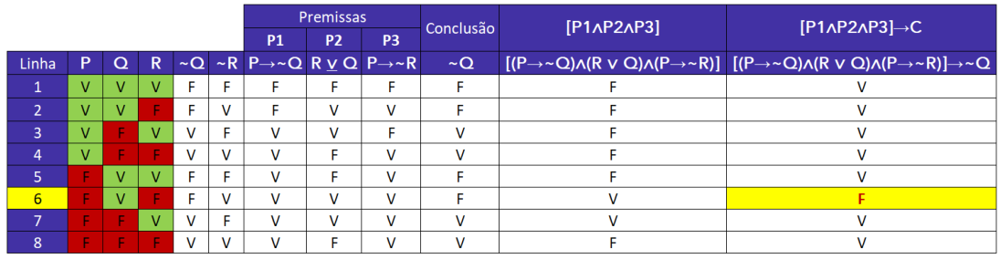

Observe que na linha 6 a condicional [( **P** →~ **Q** ) ∧ ( **<u>R</u>** <u>∨</u> **<u>Q</u>** ) ∧ ( **P** →~ **R** )] → ~ **Q** é falsa. Como a condicional **<u>não é uma</u> tautologia** , temos um argumento **<u>inválido</u>** <u>.</u> 

**Gabarito: ERRADO.** 

Em questões de múltipla escolha, é comum que tenhamos que selecionar nas alternativas uma conclusão que tornaria o argumento válido. Nesse caso, para evitar construir uma tabela-verdade para cada alternativa, devemos seguir as seguintes etapas: 

- **<u>Etapa 1:</u> desconsiderar o contexto** , transformando as afirmações da língua portuguesa para a linguagem proposicional; 

- **<u>Etapa 2:</u>** inserir todas as **<u>premissas</u>** na tabela e **obter as linhas da tabela-verdade em que todas as** **<u>premissas são simultaneamente verdadeiras;</u>** e 

- **<u>Etapa 3: verificar a resposta</u>** que apresenta uma proposição **que é verdadeira para todas as linhas obtidas na etapa anterior** . 

**(SEFAZ ES/2022)** Sabe-se que as 3 sentenças a seguir são verdadeiras. 

- Se Pedro é capixaba ou Raquel não é carioca, então Renata não é pernambucana. 

- Se Pedro não é capixaba ou Renata é pernambucana, então Raquel é carioca. 

- Se Raquel não é carioca, então Pedro é capixaba e Renata é pernambucana. 

É correto concluir que

---

<!-- pagina: 51 -->

**Equipe Exatas Estratégia Concursos Aula 05** 

a) Pedro é capixaba. 

b) Raquel é carioca. 

c) Renata é pernambucana. 

d) Pedro não é capixaba. 

e) Raquel não é carioca. 

##### **Comentários:** 

Vamos resolver essa questão pelo **método da tabela-verdade** . 

Devemos **selecionar a alternativa** que apresenta uma **conclusão que tornaria o argumento válido** . Nesse caso, vamos seguir as três etapas apresentadas na teoria. 

##### **<u>Etapa 1: desconsiderar o contexto, transformando as afirmações da língua portuguesa para a linguagem</u> proposicional** 

Considere as seguintes proposições simples: 

**p:** "Pedro é capixaba." 

**a:** "Raquel é carioca." 

**e:** "Renata é pernambucana." 

As afirmações apresentadas no enunciado são: 

**Afirmação I: p** ∨~ **a** →~ **e** 

**Afirmação II:** ~ **p** ∨~ **e** → **a** 

**Afirmação III:** ~ **a** → **p** ∧ **e** 

##### **<u>Etapa 2: inserir todas as premissas na tabela e obter as linhas da tabela-verdade em que todas as</u> premissas são simultaneamente verdadeiras** 

A tabela-verdade com as afirmações fica assim: 

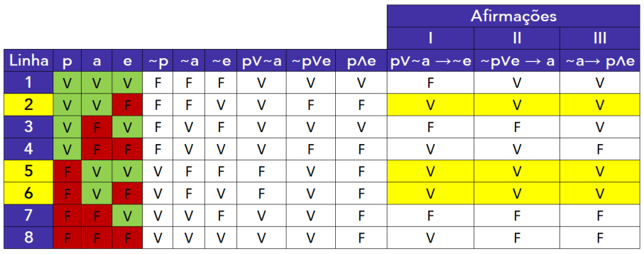

Note que as linhas da tabela-verdade em que as afirmações são verdadeiras são **2, 5 e 6** .

---

<!-- pagina: 52 -->

**Equipe Exatas Estratégia Concursos Aula 05** 

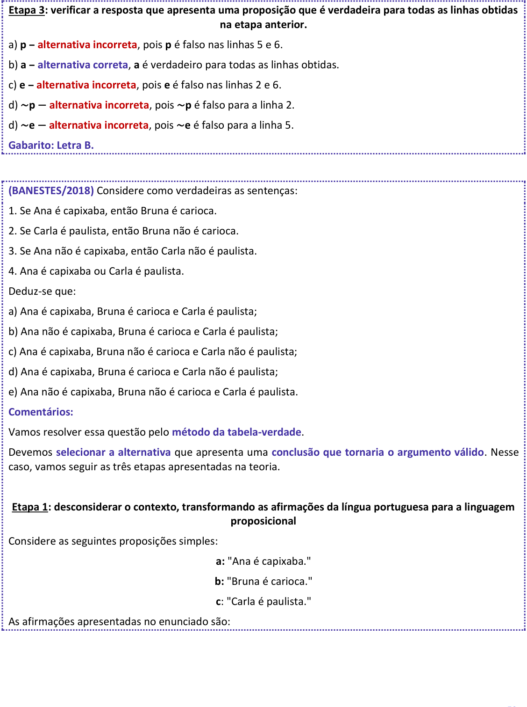

<!-- Start of picture text -->
Etapa 3: verificar a resposta que apresenta uma proposição que é verdadeira para todas as linhas obtidas na etapa anterior. a)  p  –  alternativa incorreta , pois  p  é falso nas linhas 5 e 6. b)  a  –  alternativa correta ,  a  é verdadeiro para todas as linhas obtidas. c)  e  –  alternativa incorreta , pois  e  é falso nas linhas 2 e 6. d)  ~ p  −  alternativa incorreta , pois  ~ p  é falso para a linha 2. d)  ~ e  −  alternativa incorreta , pois  ~ e  é falso para a linha 5. Gabarito: Letra B. (BANESTES/2018)  Considere como verdadeiras as sentenças: 1. Se Ana é capixaba, então Bruna é carioca. 2. Se Carla é paulista, então Bruna não é carioca. 3. Se Ana não é capixaba, então Carla não é paulista. 4. Ana é capixaba ou Carla é paulista. Deduz-se que: a) Ana é capixaba, Bruna é carioca e Carla é paulista; b) Ana não é capixaba, Bruna é carioca e Carla é paulista; c) Ana é capixaba, Bruna não é carioca e Carla não é paulista; d) Ana é capixaba, Bruna é carioca e Carla não é paulista; e) Ana não é capixaba, Bruna não é carioca e Carla é paulista. Comentários: Vamos resolver essa questão pelo  método da tabela-verdade . Devemos  selecionar a alternativa  que apresenta uma  conclusão que tornaria o argumento válido . Nesse caso, vamos seguir as três etapas apresentadas na teoria. Etapa 1: desconsiderar o contexto, transformando as afirmações da língua portuguesa para a linguagem proposicional Considere as seguintes proposições simples: a:  "Ana é capixaba." b:  "Bruna é carioca." c : "Carla é paulista." As afirmações apresentadas no enunciado são: <!-- End of picture text -->

---

<!-- pagina: 53 -->

**Equipe Exatas Estratégia Concursos Aula 05** 

**Afirmação 1. a** → **b** 

**Afirmação 2. c** →~ **b** 

**Afirmação 3.** ~ **a** →~ **c** 

**Afirmação 4. a** ∨ **c** 

##### **<u>Etapa 2: inserir todas as premissas na tabela e obter as linhas da tabela-verdade em que todas as</u> premissas são simultaneamente verdadeiras** 

A tabela-verdade com as afirmações fica assim: 

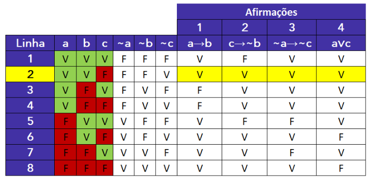

Observe que obtivemos apenas uma linha em que as afirmações são simultaneamente verdadeiras (linha 2). Logo, para essa linha da tabela-verdade, **<mark>a</mark>** <mark>é V,</mark> **<mark>b</mark>** <mark>é V e</mark> **<mark>c</mark>** <mark>é F.</mark> 

##### **<u>Etapa 3: verificar a resposta que apresenta uma proposição que é verdadeira para todas as linhas obtidas</u> na etapa anterior.** 

No caso específico dessa questão, perceba que todas as respostas são conjunções das proposições simples. Pode-se perceber mais facilmente que a **alternativa D** é a correta, pois afirma que **a, b** e ~ **c** são verdadeiros. Para fins didáticos, vamos verificar as demais alternativas: 

a) **a** ∧ **b** ∧ **c -** conjunção falsa, pois **c** é falso. 

b) ~ **a** ∧ **b** ∧ **c -** conjunção falsa, pois ~ **a** e **c** são falsos. 

- c) **a** ∧ ~ **b** ∧ ~ **c -** conjunção falsa, pois ~ **b** é falso. 

e) ~ **a** ∧ ~ **b** ∧ **c -** conjunção falsa, pois todas suas parcelas são falsas. 

**Gabarito: Letra D.** 

#### **Tabela-verdade aplicada a questões com afirmações falsas** 

Existem problemas que não são exatamente de Lógica de Argumentação que exigem o uso da tabela-verdade para serem resolvidos.

---

<!-- pagina: 54 -->

**Equipe Exatas Estratégia Concursos Aula 05** 

Esses problemas teriam tudo para serem " **questões clássicas** " envolvendo os conectivos lógicos, exceto pelo fato de que **nesses problemas não temos nenhum dos quatro** " **formatos fáceis** " nas afirmações, quais sejam: 

- **Proposição simples (verdadeira ou falsa)** ; 

- **Conjunção (e;** ∧ **) verdadeira** ; 

- **Disjunção inclusiva (ou;** ∨ **) falsa** ; 

- **Condicional (se...então;** → **) falsa** . 

Para resolver esse tipo de problema, devemos seguir os seguintes passos: 

- **<u>Etapa 1:</u> desconsiderar o contexto** , transformando as afirmações da língua portuguesa para a linguagem proposicional; 

- **<u>Etapa 2:</u>** inserir todas as **<u>afirmações</u>** na tabela e **obter as linhas da tabela-verdade em que todas as** **<u>afirmações</u> são simultaneamente verdadeiras** ==5460== ( **ou falsas** , **para os casos que o enunciado determinar** ); e 

- **<u>Etapa 3: verificar a resposta</u>** que apresenta uma proposição **que é verdadeira para todas as linhas obtidas na etapa anterior** ( **ou que é falsa para todas as linhas** , **se assim a questão determinar** ). 

**(TCM SP/2023)** Considere falsa a afirmação I e verdadeira a afirmação II: 

I. Camila é auditora de controle externo em Ciências Atuariais e Jorge é auditor de controle externo em Ciências Jurídicas. 

II. Se Camila é auditora de controle externo em Ciências Atuariais, então Jorge é auditor de controle externo em Ciências Jurídicas. 

Nessas condições, é necessariamente 

a) verdade que Jorge é auditor de controle externo em Ciências Jurídicas. 

b) falsidade que Jorge é auditor de controle externo em Ciências Jurídicas. 

c) verdade que Camila é auditora de controle externo em Ciências Atuariais. 

d) falsidade que Camila é auditora de controle externo em Ciências Atuariais. 

e) verdade que Camila e Jorge não são auditores de controle externo. 

##### **Comentários:** 

Note que essa questão **<u>não é</u>** uma das " **questões clássicas** " envolvendo os conectivos lógicos. Isso porque não temos nenhum dos seguintes " **formatos fáceis** ": 

- **Proposição simples** ( **verdadeira** ou **falsa** ); 

- **Conjunção (e;** ∧ **) verdadeira** ; 

- **Disjunção inclusiva (ou;** ∨ **) falsa** ; 

- **Condicional** **<u>(se...então;</u>** → **<u>)</u> falsa** .

---

<!-- pagina: 55 -->

**Equipe Exatas Estratégia Concursos Aula 05** 

Vamos então resolver o problema utilizando **tabela-verdade** . 

##### **<u>Etapa 1: desconsiderar o contexto, transformando as afirmações da língua portuguesa para a linguagem</u> proposicional** 

Considere as seguintes proposições simples: 

**c:** "Camila é auditora de controle externo em Ciências Atuariais" 

**j:** "Jorge é auditor de controle externo em Ciências Jurídicas" 

As afirmações apresentadas no enunciado são: 

**Afirmação I: c** ∧ **j (F)** 

**Afirmação II: c** → **j (V)** 

**<u>Etapa 2: inserir todas as afirmações na tabela e obter as linhas da tabela-verdade em que todas as</u> afirmações são simultaneamente verdadeiras (ou falsas, para os casos que o enunciado determinar)** 

A tabela-verdade com as afirmações fica assim: 

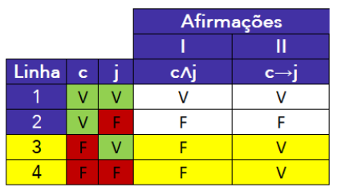

Segundo o enunciado, a **afirmação I é falsa** e a **afirmação II é verdadeira** . Observe que temos duas linhas em que **afirmação I é falsa** e a **afirmação II é verdadeira** : linhas 3 e 4. 

**<u>Etapa 3: verificar a resposta que apresenta uma proposição que é verdadeira para todas as linhas obtidas</u> na etapa anterior (ou que é falsa para todas as linhas** , **se assim a questão determinar).** 

Veja que, para as <u>linhas 3 e 4, temos que a proposição</u> **<mark>c</mark>** <mark>é falsa.</mark> Em outras palavras, **é necessariamente falsidade que Camila é auditora de controle externo em Ciências Atuariais** . O **<u>gabarito</u>** , portanto, é **letra D** . 

### Método da conclusão falsa 

Para aplicar o **método da conclusão falsa,** é necessário que a **conclusão** esteja em um dos seguintes formatos: 

- **Proposição simples** ; 

- **Disjunção inclusiva** ( **ou;** ∨ ); ou 

- **Condicional** ( **se...então;** → ). 

Identificada a conclusão como um desses três formatos, devemos aplicar os seguintes passos:

---

<!-- pagina: 56 -->

**Equipe Exatas Estratégia Concursos Aula 05** 

- **<u>Etapa 1:</u>** desconsiderar o contexto, transformando as premissas da língua portuguesa para a linguagem proposicional; 

- **<u>Etapa 2</u>** <u>: partir da hipótese de que a conclusão é falsa;</u> 

- **<u>Etapa 3</u>** <u>: tentar obter</u> **<u>ao menos um caso</u>** em que **<u>todas as premissas sejam verdadeiras</u>** mantendo a conclusão falsa. 

**Se é possível** fazer com que **todas as premissas sejam verdadeiras** mantendo a **conclusão falsa** , o **argumento é inválido** . **Se não for possível** fazer com que **todas as premissas sejam verdadeiras** mantendo a **conclusão falsa** , o **argumento é válido** . 

O fluxograma a seguir resume o método. 

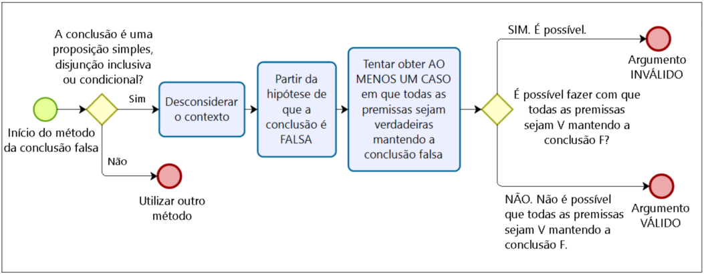

O método da conclusão falsa é um dos métodos mais rápidos para se resolver **questões do tipo** " **certo ou errado** ", pois esse tipo de questão costuma apresentar apenas uma possibilidade de conclusão para ser verificada. 

##### **(DATAPREV/2023)** 

**P1** : “Se houver resistência de populares ou depredação de patrimônio, a polícia agirá.” 

**P2** : “Se a polícia agir, a ambulância será necessária.” 

**P3** : “Não houve depredação de patrimônio, mas a ambulância foi necessária.” 

**C** : “Houve resistência de populares.” 

Tomando por referência as proposições precedentes, julgue o item a seguir. 

O argumento que tem por premissas as proposições **P1** , **P2** e **P3** , e, por conclusão, a proposição **C** , é válido. 

##### **Comentários:** 

Como a **conclusão** é uma **<u>proposição simples</u>** , podemos usar o **método da conclusão falsa** .

---

<!-- pagina: 57 -->

**Equipe Exatas Estratégia Concursos Aula 05** 

##### **<u>Etapa 1: desconsiderar o contexto, transformando as premissas da língua portuguesa para a linguagem</u> proposicional** 

Sejam as proposições simples: **r:** "Houve resistência de populares." **d:** "Houve depredação de patrimônio." **p:** "A polícia agiu." **a:** "A ambulância foi necessária." As premissas do argumento e a conclusão **C** são dadas por: 

**P1: r** ∨ **d** → **p P2: p** → **a P3:** ~ **d** ∧ **a C: r** **<u>Etapa 2: partir da hipótese de que a conclusão é falsa</u>** Considerando a conclusão falsa, temos que **<mark>r</mark>** <mark>é F.</mark> 

**<u>Etapa 2: partir da hipótese de que a conclusão é falsa</u>** Considerando a conclusão falsa, temos que **<mark>r</mark>** <mark>é F.</mark> **<u>Etapa 3: tentar obter ao menos um caso em que todas as premissas sejam verdadeiras mantendo a</u> conclusão falsa** Para a **premissa P3** ser verdadeira, ambas as parcelas, ~ **d** e **a** , precisam ser verdadeiras. Logo, **<mark>d</mark>** <mark>é F e</mark> **<mark>a</mark>** <mark>é V.</mark> Para a **premissa P2** ser verdadeira, não podemos recair no caso **V** → **F** . Note que, com **a** verdadeiro, nunca teremos o caso **V** → **F** , <mark>qualquer que seja o valor lógico de</mark> **<mark>p</mark>** <mark>.</mark> 

Para a **premissa P1** ser verdadeira, não podemos recair no caso **V** → **F** . Note que, com **r** e **d** falsos, teremos o antecedente **r** ∨ **d** será falso, de modo que nunca teremos o caso **V** → **F** , <mark>qualquer que seja o valor lógico de</mark> **<mark>p</mark>** . Veja que **é possível fazer com que todas as premissas sejam verdadeiras mantendo a conclusão falsa.** Basta que **<mark>r</mark>** <mark>seja F</mark> , **<mark>d</mark>** <mark>seja F</mark> e **<mark>a</mark>** <mark>seja V, podendo</mark> **<mark>p</mark>** <mark>assumir qualquer valor.</mark> Como **é possível fazer com que todas as premissas sejam verdadeiras mantendo a conclusão falsa** , temos um **argumento inválido. Gabarito: ERRADO.** 

https://t.me/KakashiAssinaturasBot

---

<!-- pagina: 58 -->

**Equipe Exatas Estratégia Concursos Aula 05** 

**(PGE PE/2019)** Considere as seguintes proposições. 

- **P1** : Se a empresa privada causar prejuízos à sociedade e se o governo interferir na sua gestão, então o 

- governo dará sinalização indesejada para o mercado. 

- **P2** : Se o governo der sinalização indesejada para o mercado, a popularidade do governo cairá. 

- **Q1** : Se a empresa privada causar prejuízos à sociedade e se o governo não interferir na sua gestão, o 

- governo será visto como fraco. 

- **Q2** : Se o governo for visto como fraco, a popularidade do governo cairá. 

Tendo como referência essas proposições, julgue o item seguinte, a respeito da lógica de argumentação. 

O argumento em que as proposições **P1** , **P2** , **Q1** e **Q2** são as premissas e a conclusão é a proposição “A popularidade do governo cairá.” é um argumento válido. 

##### **Comentários:** 

Como a **conclusão** é uma **proposição simples** , podemos usar o **método da conclusão falsa** . 

##### **<u>Etapa 1: desconsiderar o contexto</u>** 

Sejam as proposições simples: 

**e** : "A empresa privada causa prejuízos à sociedade" 

**g** : "O governo interfere na gestão da empresa privada" 

**s** : "O governo dá sinalização indesejada para o mercado" 

**p** : "A popularidade do governo cairá." 

**f** : "O governo é visto como fraco." 

As premissas do argumento e a conclusão **C** são dadas por: 

**P1: e** ∧ **g** → **s** 

**P2: s** → **p** 

**Q1: e** ∧~ **g** → **f** 

**Q2: f** → **p** 

**C: p** 

##### **<u>Etapa 2: partir da hipótese de que a conclusão é falsa</u>** 

Considerando a conclusão falsa, temos que **<mark>p</mark>** <mark>é F.</mark> 

##### **<u>Etapa 3: tentar obter ao menos um caso em que todas as premissas sejam verdadeiras mantendo a</u> conclusão falsa** 

Para a **premissa Q2** ser verdadeira, não podemos recair no caso **V** → **F** . Como o consequente **p** é falso, o antecedente **f** não pode ser verdadeiro. Logo, **<mark>f</mark>** <mark>é F.</mark> 

Para a **premissa P2** ser verdadeira, não podemos recair no caso **V** → **F** . Como o consequente **p** é falso, o antecedente **s** não pode ser verdadeiro. Logo, **<mark>s</mark>** <mark>é F.</mark>

---

<!-- pagina: 59 -->

**Equipe Exatas Estratégia Concursos Aula 05** 

Para a **premissa P1** ser verdadeira, não podemos recair no caso **V** → **F** . Como o consequente **s** é falso, o antecedente **e** ∧ **g** não pode ser verdadeiro. Logo, **<mark>e</mark>** <mark>∧</mark> **<mark>g</mark>** <mark>é falso.</mark> Para **e** ∧ **g** ser falso, <mark>podemos ter, por exemplo, somente</mark> **<mark>e</mark>** <mark>falso, somente</mark> **<mark>g</mark>** <mark>falso, ou</mark> **<mark>e</mark>** <mark>e</mark> **<mark>g</mark>** <mark>ambos falsos.</mark> 

Para a **premissa Q1** ser verdadeira, não podemos recair no caso **V** → **F** . Como o consequente **f** é falso, o antecedente **e** ∧~ **g** não pode ser verdadeiro. Logo, **<mark>e</mark>** <mark>∧~</mark> **<mark>g</mark>** <mark>é falso.</mark> Para **e** ∧~ **g** ser falso, <mark>podemos ter, por exemplo, somente</mark> **<mark>e</mark>** <mark>falso, somente ~</mark> **<mark>g</mark>** <mark>falso, ou</mark> **<mark>e</mark>** <mark>e ~</mark> **<mark>g</mark>** <mark>ambos falsos.</mark> 

Veja que **é possível fazer com que todas as premissas sejam verdadeiras mantendo a conclusão falsa.** 

Os casos das **premissas Q2** e **P2** são mais evidentes, pois <mark>basta que</mark> **<mark>s</mark>** <mark>e</mark> **<mark>f</mark>** <mark>sejam falsos.</mark> 

**<mark>e</mark>** <mark>é F, independentemente do valor de</mark> **<mark>g</mark> .** 

Como **é possível fazer com que todas as premissas sejam verdadeiras mantendo a conclusão falsa** , temos um **argumento inválido.** 

**Gabarito: ERRADO.** 

### Método da transitividade da condicional 

Suponha que temos um argumento formado por: 

- **Premissas** no formato **condicional** em que o <u>antecedente da premissa posterior é igual ao consequente da premissa anterior;</u> 

- **Conclusão** no formato **condicional** cujo antecedente é o antecedente da primeira premissa e cujo <u>consequente é o consequente da última premissa.</u> 

Esse tipo de argumento, independentemente do número de premissas, é **sempre válido** . Costuma-se chamar essa propriedade de **transitividade do condicional** . 

Veja um exemplo desse tipo de **argumento válido** com 4 premissas: 

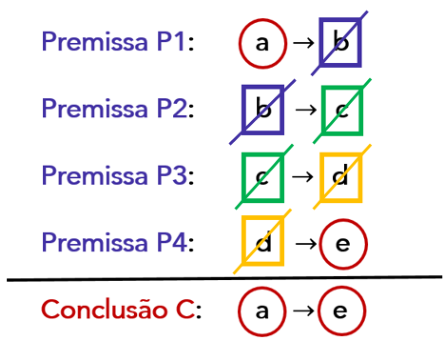

Agora que conhecemos essa propriedade do condicional, vamos entender o método. 

O **método da transitividade do condicional** consiste basicamente em **concatenar** de modo conveniente **uma parte ou todas as premissas** do argumento, que se apresentam no formato condicional, de modo a se **obter a conclusão sugerida** . **Se a conclusão for obtida** , **o argumento é válido** .

---

<!-- pagina: 60 -->

**Equipe Exatas Estratégia Concursos Aula 05** 

**(PGE PE/2019)** Considere as seguintes proposições. 

- **Q1** : Se a empresa privada causar prejuízos à sociedade e se o governo não interferir na sua gestão, o 

- governo será visto como fraco. 

- **Q2** : Se o governo for visto como fraco, a popularidade do governo cairá. 

Tendo como referência essas proposições, julgue o item seguinte, a respeito da lógica de argumentação. 

O argumento em que as proposições **Q1** e **Q2** são as premissas e a conclusão é a proposição “Se a empresa privada causar prejuízos à sociedade e se o governo não interferir na sua gestão, a popularidade do governo cairá.” é um argumento válido. 

##### **Comentários:** 

Note que tanto as premissas quanto a conclusão são condicionais. Vamos, portanto, utilizar o **método da transitividade do condicional** . 

Considere as seguintes proposições simples: 

**p:** "A empresa privada causa prejuízos à sociedade." 

**i:** "O governo interfere na gestão da empresa." 

**f:** "O governo é visto como fraco." 

**g:** "A popularidade do governo cairá." 

A **premissa Q1** pode ser descrita por: 

**(p** ∧~ **i)** → **f :** " **Se [(** a empresa privada causar prejuízos à sociedade **) e se (** o governo **não** interferir na sua gestão **)]** , **[** o governo será visto como fraco **]** ." 

A **premissa Q2** pode ser descrita por: 

**f** → **g:** " **Se [** o governo for visto como fraco **]** , **[** a popularidade do governo cairá **]** ." 

A **conclusão** pode ser descrita por: 

**(p** ∧~ **i)** → **g:** “ **Se [(** a empresa privada causar prejuízos à sociedade **) e se (** o governo **não** interferir na sua gestão **)]** , **[** a popularidade do governo cairá **]** .” 

Perceba que ao se concatenar as premissas **Q1** e **Q2** , obtemos a **conclusão** sugerida: 

**Premissa Q1:** **<mark>(p</mark>** <mark>∧~</mark> **<mark>i)</mark>** <mark>→</mark> **f** **<u>Premissa Q2: f</u>** <u>→</u> **<u>g</u>** 

**Conclusão:** **<mark>(p</mark>** <mark>∧~</mark> **<mark>i)</mark>** <mark>→</mark> **g** 

Logo, trata-se de um **argumento válido** . 

**Gabarito: CERTO.**

---

<!-- pagina: 61 -->

**Equipe Exatas Estratégia Concursos Aula 05** 

Em algumas questões é necessário utilizar a **equivalência contrapositiva** ( **p** → **q ≡** ~ **q** →~ **p** ) para deixar as condicionais dispostas de uma forma em que é possível conectá-las. 

**(SSP AM/2022)** Considere as seguintes afirmativas a respeito de um objeto chamado biba: 

• Se biba é bala então não é bola. 

• Se biba não é bala então é babalu. 

É correto concluir que 

a) se biba é bola então é babalu. 

b) se biba é babalu então é bola. 

c) se biba não é bola então é babalu. 

d) se biba não é babalu então é bola. 

e) se biba é bola então não é babalu. 

**Comentários:** 

Note que tanto as afirmações presentes no enunciado quanto as possíveis conclusões presentes nas alternativas são condicionais. Vamos, portanto, utilizar o **método da transitividade do condicional** . 

Considere as seguintes proposições simples: 

**a:** "Biba é bala." 

**o:** "Biba é bola." 

**u:** "Biba é babalu." 

Podemos descrever as afirmações do seguinte modo: 

**Afirmação I: a** →~ **o** 

**Afirmação II:** ~ **a** → **u** 

Ao concatenarmos a **contrapositiva da afirmação I** com a **afirmação II** , obtemos a conclusão **o** → **u.** Veja: 

**Contrapositiva I: o** →~ **a** 

**<u>Afirmação II:</u>** ~ **<u>a</u>** <u>→</u> **<u>u</u>** 

**Conclusão: o** → **u** 

Logo, é correto concluir **o** → **u** , que corresponde a " **se [** biba é bola **] então [** é babalu **]** ". 

**Gabarito: Letra A.**

---

<!-- pagina: 62 -->

**Equipe Exatas Estratégia Concursos Aula 05** 

Em algumas questões as premissas podem estar no formato de **disjunção inclusiva (ou;** ∨ **)** . Nesse caso, podemos **transformar essas premissas em condicionais** utilizando a equivalência **p** ∨ **q** ≡ ~ **p** → **q** . 

**(Pref. Penedo/2023)** Dadas as sentenças lógicas “Ana vai ao festival de cinema ou Rita não vai” e “Ana não vai ao festival de cinema, se Tiago for”, qual das alternativas é uma conclusão lógica válida? 

a) Rita e Tiago vão ao festival. 

b) Tiago e Rita não vão ao festival. 

c) Rita não vai ao festival, mas Tiago vai. 

d) Se Tiago não for ao festival, Rita vai. 

e) Se Rita for ao festival, Tiago não vai. 

**Comentários:** 

Considere as seguintes proposições simples: 

**a:** "Ana vai ao festival de cinema." 

**r:** "Rita vai ao festival de cinema." 

**t:** "Tiago vai ao festival de cinema." 

Veja que _"_ **_[_** _Ana_ **_não_** _vai ao festival de cinema_ **_]_** _,_ **_se [_** _Tiago for_ **_]_** _"_ corresponde a _"_ **_Se [_** _Tiago for ao festival de cinema_ **_]_** _,_ **_então [_** _Ana_ **_não_** _vai_ **_]_** _"_ . Logo, podemos descrever as afirmações do seguinte modo: 

**Afirmação I: a** ∨~ **r** 

**Afirmação II: t** →~ **a** 

Utilizando a equivalência **p** ∨ **q** ≡ ~ **p** → **q** , podemos transformar a disjunção inclusiva **a** ∨~ **r** em uma condicional. Ficamos com: 

**a** ∨~ **r ≡** ~ **a** →~ **r** 

Logo, temos as seguintes afirmações: 

**Afirmação I:** ~ **a** →~ **r** 

**Afirmação II: t** →~ **a**

---

<!-- pagina: 63 -->

**Equipe Exatas Estratégia Concursos Aula 05** 

Ao concatenarmos a **contrapositiva da afirmação I** com a **contrapositiva da afirmação II** , obtemos a conclusão **r** →~ **t.** Veja: 

**Contrapositiva I: r** → **a** 

**<u>Contrapositiva II: a</u>** <u>→~</u> **<u>t</u>** 

**Conclusão: r** →~ **t** 

Logo, é correto concluir **r** →~ **t** , que corresponde a " **Se [** Rita for ao festival **]** , **[** Tiago **não** vai **]** ". **Gabarito: Letra E.** 

Algumas questões podem apresentar **condicionais nas premissas** e uma **conclusão** que é uma **proposição simples** . Nesses casos, **busca-se obter uma conclusão da forma** ~ **p** → **p ou da forma p** →~ **p** . Veja que: 

**•** Se obtivermos como **conclusão** ~ **p** → **p** , temos que ~ **p** → **p** é uma consequência verdadeira das premissas. **Isso significa que p é verdadeiro** pois, caso fosse falso, teríamos como conclusão uma condicional falsa da forma **V** → **F** . 

**•** Se obtivermos como **conclusão p** →~ **p** , temos que **p** →~ **p** é uma consequência verdadeira das premissas. **Isso significa que p é falso** pois, caso fosse verdadeiro, teríamos como conclusão uma condicional falsa da forma **V** → **F** . 

- **Conclusão** ~ **p** → **p significa que p é verdadeiro** ; e 

- **Conclusão p** →~ **p significa que p é falso** .

---

<!-- pagina: 64 -->

**Equipe Exatas Estratégia Concursos Aula 05** 

**(BANESTES/2021)** Considere como verdadeiras as sentenças a seguir. 

Se Priscila é paulista, então Joel é capixaba. 

Se Gabriela não é carioca, então Joel não é capixaba. 

Se Gabriela é carioca, então Priscila não é paulista. 

É correto deduzir que: 

a) Gabriela é carioca; 

b) Gabriela não é carioca; 

c) Priscila não é paulista; 

d) Priscila é paulista; 

e) Joel não é capixaba. 

**Comentários:** 

Veja que temos **condicionais no enunciado** e, **nas alternativas** , **temos proposições simples** . Vamos resolver essa questão pelo **método da transitividade do condicional** , procurando obter condicionais da forma ~ **p** → **p** ou da forma **p** →~ **p** . 

Sejam as proposições: 

**p:** "Priscila é paulista." 

**j:** "Joel é capixaba." 

**g:** "Gabriela é carioca." 

Podemos descrever as afirmações do seguinte modo: 

**Afirmação I: p** → **j** 

**Afirmação II:** ~ **g** →~ **j** 

**Afirmação III: g** →~ **p** 

Ao concatenarmos a **afirmação I** com a **contrapositiva da afirmação II** e com a **afirmação III** , conclui-se **p** →~ **p** . 

**Afirmação I: p** → **j** 

**Contrapositiva II: j** → **g** 

**<u>Afirmação II: g</u>** <u>→</u> <mark>~</mark> **<u><mark>p</mark></u>** 

**Conclusão: p** → <mark>~</mark> **<mark>p</mark>** 

Como a **conclusão p** →~ **p é uma consequência verdadeira** das afirmações do enunciado, temos que **p é falso** . Isso porque, caso **p** fosse verdadeiro, teríamos a condicional **V** → **F** , que é uma condicional falsa. 

Logo, é correto concluir ~ **p** , isto é, "Priscila **não** é paulista". O **gabarito** , portanto, é **letra C** . 

**Gabarito: Letra C.**

---

<!-- pagina: 65 -->

**Equipe Exatas Estratégia Concursos Aula 05** 

A questão a seguir já foi resolvida quando aprendemos sobre o **método da tabela-verdade** . Vamos agora resolvê-la pelo **método da transitividade do condicional** . 

**(TCM SP/2023)** Considere falsa a afirmação I e verdadeira a afirmação II: 

I. Camila é auditora de controle externo em Ciências Atuariais e Jorge é auditor de controle externo em Ciências Jurídicas. 

II. Se Camila é auditora de controle externo em Ciências Atuariais, então Jorge é auditor de controle externo em Ciências Jurídicas. 

Nessas condições, é necessariamente 

a) verdade que Jorge é auditor de controle externo em Ciências Jurídicas. 

b) falsidade que Jorge é auditor de controle externo em Ciências Jurídicas. 

c) verdade que Camila é auditora de controle externo em Ciências Atuariais. 

d) falsidade que Camila é auditora de controle externo em Ciências Atuariais. 

e) verdade que Camila e Jorge não são auditores de controle externo. 

**Comentários:** 

Considere as seguintes proposições simples: 

**c:** "Camila é auditora de controle externo em Ciências Atuariais" 

**j:** "Jorge é auditor de controle externo em Ciências Jurídicas" 

Para aplicar o **método da transitividade do condicional** , **devemos ter condicionais verdadeiras** . As **afirmações I e II** podem ser escritas assim: 

**Afirmação I: c** ∧ **j (F)** 

**Afirmação II: c** → **j (V)** 

Como a **afirmação I é falsa** , **a negação dela é verdadeira** . Por De Morgan, temos: 

~ **(c** ∧ **j) ≡** ~ **c** ∨~ **j** 

Logo, a **afirmação I** , **que originalmente é falsa** , **pode ser escrita como uma afirmação verdadeira dada por** ~ **c** ∨~ **j** . Ficamos com as seguintes afirmações: 

**Afirmação I:** ~ **c** ∨~ **j (V)** 

**Afirmação II: c** → **j (V)** 

Note que ainda não temos duas condicionais. Observe, porém, que utilizando a equivalência **p** ∨ **q ≡** ~ **p** → **q** , temos que a **afirmação II** é equivalente a ~ **(** ~ **c)** → **(** ~ **j),** ou seja, é equivalente a **c** →~ **j** . Ficamos com as seguintes afirmações:

---

<!-- pagina: 66 -->

**Equipe Exatas Estratégia Concursos Aula 05** 

**Afirmação I: c** →~ **j (V)** 

**Afirmação II: c** → **j (V)** 

Ao concatenarmos a **afirmação I** com a **contrapositiva da afirmação II** , conclui-se **c** →~ **c** . 

**Afirmação I: c** →~ **j** 

**<u>Contrapositiva II:</u>** ~ **<u>j</u>** <u>→~</u> **<u>c</u>** 

**Conclusão: c** →~ **c** 

Como a **conclusão c** →~ **c** é uma consequência **verdadeira** das afirmações do enunciado, temos que **c é falso** . Isso porque, caso **c** fosse verdadeiro, teríamos a condicional **V** → **F** , que é uma condicional falsa. 

Logo, **é necessariamente falsidade que Camila é auditora de controle externo em Ciências Atuariais** . Novamente, obtivemos a **alternativa D** como **gabarito** . 

**Gabarito: Letra D.** 

### Método das regras de inferência 

Pessoal, regras de inferência são "regras de bolso" que servem para verificar a validade de um argumento dedutivo com maior rapidez. 

As **regras de inferência** sempre apresentam **<u>argumentos válidos</u>** <u>.</u> 

Existe um número incontável de regras de inferência. Vamos apresentar as mais comuns que já apareceram em provas de concursos públicos. 

#### **_Modus Ponens_ (afirmação do antecedente)** 

O argumento **_Modus Ponens_** apresenta o seguinte formato e é **sempre** um **argumento válido** : 

##### **_<u>Modus Ponens</u>_** **<u>(afirmação do antecedente)</u>** 

**<mark>Premissa 1:</mark>** <mark>Se</mark> **<mark>p</mark>** <mark>, então</mark> **<mark>q. Premissa 2: p.</mark> Conclusão: q.**

---

<!-- pagina: 67 -->

**Equipe Exatas Estratégia Concursos Aula 05** 

Perceba que no **_Modus Ponens_** temos como **premissas** um **<u>condicional</u> e** a **<u>afirmação do antecedente</u>** . A **conclusão** é o **<u>consequente</u>** <u>.</u> 

Observe um exemplo de **_Modus Ponens_ :** 

**Premissa 1** : Se eu trabalhar, as crianças terão leite para tomar. 

**Premissa 2:** Eu trabalho. 

**Conclusão** : Logo, as crianças terão leite para tomar. 

**(PETROBRAS/2012)** Dadas as premissas **p1** , **p2** ,..., **pn** e uma conclusão **q** , uma regra de inferência a partir da qual **q** se deduz logicamente de **p1** , **p2** ,..., **pn** é denotada por **p1, p2,..., pn** ⊢ **q** . Uma das regras de inferência clássica é chamada Modus Ponens, que, em latim, significa “modo de afirmar”. 

Qual a notação que designa a regra de inferência Modus Ponens? 

a) p ∨ q, ¬p ⊢ q 

b) p ∧ q, ¬p ⊢ ¬q 

c) p  q ⊢ p → q 

d) p, p → q ⊢ q 

e) q, p → q ⊢ p **Comentários:** 

O _modus ponens_ é dado pelo seguinte argumento: 

**Premissa 1** : Se **p** , então **q** . 

**Premissa 2** : **p** . **Conclusão** : **q** . 

A representação simbólica, seguindo a ordem das premissas apresentadas, é **p** → **q; p** ⊢ **q.** Observe que a alternativa D apresenta essa representação com a simples troca da ordem das premissas: **p , p** → **q** ⊢ **q. Gabarito: Letra D.** 

#### **_Modus Tollens_ (negação do consequente)** 

O argumento **_Modus Tollens_** apresenta o seguinte formato e é **sempre** um **argumento válido** : 

---

<!-- pagina: 68 -->

**Equipe Exatas Estratégia Concursos Aula 05** 

##### **_<u>Modus Tollens</u>_** **<u>(negação do consequente)</u>** 

**<mark>Premissa 1:</mark>** <mark>Se</mark> **<mark>p</mark>** <mark>, então</mark> **<mark>q. Premissa 2:</mark>** <mark>~</mark> **<mark>q.</mark> Conclusão:** ~ **p.** 

Perceba que no **_Modus Tollens_** temos como **premissas** um **<u>condicional</u> e** a **<u>negação do consequente</u>** . A **conclusão** é a **<u>negação do antecedente</u>** . 

Observe um exemplo de **_Modus Tollens_ :** 

**Premissa 1** : Se eu trabalhar, as crianças terão leite para tomar. 

**Premissa 2:** As crianças não têm leite para tomar. 

**Conclusão** : Logo, eu não trabalho. 

Veja que o **_Modus Tollens_** nada mais é do que a aplicação **_Modus Ponens_** quando se faz a contrapositiva da condicional **:** 

**Premissa 1:** Se ( ~ **q** ), então ( ~ **p** ) **.** **<mark>Premissa 2:</mark>** <mark>( ~</mark> **<mark>q</mark>** <mark>)</mark> **<mark>.</mark> Conclusão:** ( ~ **p** ) **.** 

**(CM SJC/2018)** Considere verdadeiras as duas afirmações a seguir. 

Se hoje é feriado, então amanhã eu trabalho. 

Amanhã eu não trabalho. 

Com base apenas nas informações apresentadas, conclui-se corretamente que 

a) hoje não é feriado. 

b) hoje é feriado. 

c) amanhã não será feriado. 

d) amanhã será feriado. 

e) ontem foi feriado. 

**Comentários:** 

Sejam as proposições simples: 

**h:** "Hoje é feriado." 

**a:** "Amanhã eu trabalho." 

Note que temos as seguintes premissas por meio das quais devemos encontrar uma conclusão apropriada:

---

<!-- pagina: 69 -->

**Equipe Exatas Estratégia Concursos Aula 05** 

##### **Premissa 1: h** → **a** 

##### **Premissa 2:** ~ **a** 

Veja que o argumento apresentado é corresponde ao **_Modus Tollens_** : temos como **premissas** um **<u>condicional</u>** e a **<u>negação do consequente</u>** <u>. Uma</u> **conclusão** válida, portanto, é dada pela **negação do antecedente** : ~ **h.** Logo, conclui-se corretamente que: 

~ **h:** "Hoje **não** é feriado." 

##### **Gabarito: Letra A.** 

**(CBM SC/2023)** A partir de um argumento considerado válido, são extraídas suas premissas: 

P1: Se o desperdício é evitado e as pessoas são conscientes, então o lixo encontrado nas ruas diminui. 

P2: O lixo encontrado nas ruas não diminuiu. 

Com base nessas informações, uma conclusão para esse argumento é: 

a) O desperdício foi evitado ou as pessoas foram conscientes. 

b) O desperdício não foi evitado, mas as pessoas foram conscientes. 

c) O desperdício foi evitado, mas as pessoas não foram conscientes. 

d) O desperdício não foi evitado e as pessoas não foram conscientes. 

e) O desperdício não foi evitado ou as pessoas não foram conscientes. 

##### **Comentários:** 

Sejam as proposições simples: 

**d:** "O desperdício é evitado." 

**p:** "As pessoas são conscientes." 

**l:** "O lixo encontrado nas ruas diminui." 

Note que temos as seguintes premissas por meio das quais devemos encontrar uma conclusão apropriada: 

**Premissa 1: (d** ∧ **p)** → **l** 

##### **Premissa 2:** ~ **l** 

Veja que o argumento apresentado é corresponde ao **_Modus Tollens_** : temos como **premissas** um **<u>condicional</u>** e a **<u>negação do consequente</u>** . Uma **conclusão** válida, portanto, é dada pela **negação do antecedente** : ~ **(d** ∧ **p).** 

Como temos a negação de uma conjunção, podemos desenvolvê-la por De Morgan. Ficamos com: 

~ **(d** ∧ **p) ≡** ~ **d** ∨~ **p** 

Logo, conclui-se corretamente que: 

~ **d** ∨~ **p:** " **[** O desperdício **não** foi evitado **] ou [** as pessoas **não** foram conscientes **]** ." 

**Gabarito: Letra E.**

---

<!-- pagina: 70 -->

**Equipe Exatas Estratégia Concursos Aula 05** 

**(PETROBRAS/2018)** Considere o seguinte argumento: 

Premissa 1: **[(** ~ **A)** ∧ **(** ~ **G)]** → **(** ~ **P)** 

Premissa 2: **P** 

Conclusão: **A** ∨ **G** 

A validade do argumento pode ser deduzida, respectivamente, a partir da aplicação das regras de inferência 

a) Paradoxo e Contingência 

b) Contraposição e Absurdo 

c) Modus Ponnens e Contradição 

d) Modus Tollens e Lei de De Morgan 

e) Silogismo Conjuntivo e Silogismo hipotético 

##### **Comentários:** 

No **Modus Tollens** , temos um **<u>condicional</u>** e a **<u>negação do consequente</u>** como **premissas** e temos como **conclusão** a **<u>negação do antecedente</u>** . 

Perceba que é exatamente esse formato de argumento que se apresenta na questão. Podemos perceber isso ao aplicarmos a **Lei De Morgan** na negação do antecedente da condicional. 

Aplicando a **Lei de De Morgan** na negação ~ **[(** ~ **A)** ∧ **(** ~ **G)]** , temos: 

~ **[(** ~ **A)** ∧ **(** ~ **G)] ≡** ~ **(** ~ **A)** ∨ ~ **(** ~ **G)** 

A dupla negação de **A** e a dupla negação de **G** correspondem, respectivamente, a **A** e a **G** . Ficamos com: 

~ **[(** ~ **A)** ∧ **(** ~ **G)] ≡** **<mark>A</mark>** <mark>∨</mark> **<mark>G</mark>** 

Veja, portanto, que o argumento apresentado de fato é um **Modus Tollens** em que se utilizou a **Lei de De Morgan** : 

**Premissa 1** : condicional **<mark>[(</mark>** <mark>~</mark> **<mark>A)</mark>** <mark>∧</mark> **<mark>(</mark>** <mark>~</mark> **<mark>G)]</mark>** → **<mark>(</mark>** <mark>~</mark> **<mark>P).</mark>** 

**Premissa 2:** negação do consequente ~ **(** ~ **P)** ≡ **P.** 

**Conclusão:** negação do antecedente ~ **[(** ~ **A)** ∧ **(** ~ **G)] ≡** **<mark>A</mark>** <mark>∨</mark> **<mark>G</mark>** <mark>.</mark> 

**Gabarito: Letra D.** 

**(SEDF/2017)** Lógica é a ciência que estuda princípios e métodos de inferência, tendo como objetivo principal determinar em que condições certas coisas se seguem (são consequência), ou não, de outras. 

A partir da definição da lógica filosófica apresentada anteriormente, julgue o item que se segue. 

Qualquer argumento que estiver estruturado nas formas lógicas do _modus ponens_ ou do _modus tollens_ será válido, independentemente do valor de verdade dos conteúdos das proposições. 

**Comentários:**

---

<!-- pagina: 71 -->

**Equipe Exatas Estratégia Concursos Aula 05** 

Sabemos que a validade dos argumentos **independe da veracidade das proposições** , pois ela depende exclusivamente da **<u>forma</u>** em que os argumentos estão estruturados. 

Além disso, vimos na teoria que as **regras de inferência** , dentre as quais temos _modus ponens_ e _modus tollens_ , **sempre nos dão argumentos válidos** . 

##### **Gabarito: CERTO.** 

#### **Silogismo Hipotético** 

O **Silogismo Hipotético** apresenta o seguinte formato e é sempre um argumento válido: 

##### **<u>Silogismo Hipotético</u>** 

**<mark>Premissa 1:</mark>** <mark>Se</mark> **<mark>p</mark>** <mark>, então</mark> **<mark>q. Premissa 2:</mark>** <mark>Se</mark> **<mark>q</mark>** <mark>, então</mark> **<mark>r.</mark> Conclusão:** Se **p** , então **r.** 

Em resumo, a regra de inferência denominada "silogismo hipotético" utiliza a **transitividade do condicional** quando temos duas premissas. 

**(ISS Curitiba/2019)** Um argumento da lógica proposicional é formado por premissas **(P1, P2, ... , Pn)** e uma conclusão ( **Q** ). Um argumento é válido quando **P1** ∧ **P2** ∧ **...** ∧ **Pn** → **Q** é uma tautologia. Nesse caso, diz-se que a conclusão **Q** pode ser deduzida logicamente de **P1** ∧ **P2** ∧ **...** ∧ **Pn** . Alguns argumentos, chamados fundamentais, são usados correntemente em lógica proposicional para fazer inferências e, portanto, são também conhecidos como Regras de Inferência. Seja o seguinte argumento da Lógica Proposicional: 

**Premissa 1** : SE Ana é mais velha que João, ENTÃO Ana cuida de João. 

**Premissa 2** : SE Ana cuida de João, ENTÃO os pais de João viajam para o exterior. 

**Conclusão** : SE Ana é mais velha que João, ENTÃO os pais de João viajam para o exterior. 

Assinale a alternativa que apresenta o nome desse argumento. 

a) Modus Ponens. 

b) Modus Tollens. 

c) Dilema Construtivo. 

d) Contrapositivo. 

e) Silogismo Hipotético. 

**Comentários:**

---

<!-- pagina: 72 -->

**Equipe Exatas Estratégia Concursos Aula 05** 

Estamos diante de um **Silogismo Hipotético,** pois o argumento em questão apresenta a seguinte forma: 

**Premissa 1** : Se **p** , então **q** . 

**Premissa 2** : Se **q** , então **r** . 

**Conclusão:** Se **p** , então **r** . 

**Gabarito: Letra E.** 

#### **Dilema Construtivo ou Silogismo Disjuntivo** 

O argumento chamado **Dilema Construtivo** ou **Silogismo Disjuntivo** apresenta o seguinte formato e é sempre um argumento válido: 

##### **<u>Dilema Construtivo ou Silogismo Disjuntivo</u>** 

**<mark>Premissa 1:</mark>** <mark>Se</mark> **<mark>p</mark>** <mark>, então</mark> **<mark>q.</mark>** 

**<mark>Premissa 2:</mark>** <mark>Se</mark> **<mark>r</mark>** <mark>, então</mark> **<mark>s. Premissa 3: p</mark>** <u><mark>ou</mark></u> **<mark>r.</mark> Conclusão: q** <u>ou</u> **s.** 

Em resumo, o **Dilema Construtivo** ou **Silogismo Disjuntivo** apresenta três **premissas** : **duas condicionais** e a **disjunção inclusiva dos antecedentes das condicionais** . A **conclusão** dessa regra de inferência é a **disjunção inclusiva dos consequentes das condicionais** . 

**(CM Indaiatuba/2018)** Se Joana é dentista e Mauro é médico, então Cristina não é funcionária pública. Se Mirian é casada, então João é solteiro. Sabe-se que Joana é dentista e Mauro é médico, ou que Mirian é casada. Logo: 

a) Cristina não é funcionária pública. 

b) João é solteiro. 

c) Cristina não é funcionária pública e João é solteiro. 

d) João é solteiro ou Cristina não é funcionária pública. 

e) Cristina é funcionária pública e João não é solteiro. 

**Comentários:**

---

<!-- pagina: 73 -->

**Equipe Exatas Estratégia Concursos Aula 05** 

Considere as seguintes proposições simples: 

**j:** "Joana é dentista." 

**a: "** Mauro é médico **." c: "** Cristina é funcionária pública **."** 

**i: "** Mirian é casada **." j: "** João é solteiro **."** Note que as premissas do enunciado correspondem a: 

**Premissa I: (j** ∧ **a)** →~ **c** − " **Se [** Joana é dentista e Mauro é médico **]** , **então [** Cristina **não** é funcionária pública **]** ." **Premissa II: i** → **j** − **"Se [** Mirian é casada **]** , **então [** João é solteiro **]** ." 

− **Premissa III: (j** ∧ **a)** ∨ **i** " **[(** Joana é dentista **) e (** Mauro é médico **)]** , **ou [** Mirian é casada **]** ." 

Veja que as premissas presentadas correspondem ao **dilema construtivo** , em que **<u>a terceira premissa é a disjunção inclusiva dos antecedentes das duas primeiras premissas</u>** : **(j** ∧ **a)** ∨ **i** . 

Sabemos que no **dilema construtivo** uma **conclusão** que torna o argumento válido é a **<u>disjunção inclusiva dos consequentes das duas primeiras premissas</u>** <u>:</u> ~ **c** ∨ **j** : 

~ **c** ∨ **j:** " **[** Cristina **não** é funcionária pública **] ou [** João é solteiro **]** ." 

Essa conclusão correta está presente na **letra D** na forma equivalente em que se troca de posição os dois termos da disjunção inclusiva: 

**j** ∨ ~ **c:** " **[** João é solteiro **] ou [** Cristina **não** é funcionária pública **]** ." 

**Gabarito: Letra D.** 

#### **Dilema Destrutivo** 

O argumento **Dilema Destrutivo** apresenta o seguinte formato e é sempre um argumento válido: 

##### **<u>Dilema Destrutivo</u>** 

**<mark>Premissa 1:</mark>** <mark>Se</mark> **<mark>p</mark>** <mark>, então</mark> **<mark>q. Premissa 2:</mark>** <mark>Se</mark> **<mark>r</mark>** <mark>, então</mark> **<mark>s. Premissa 3:</mark>** <mark>~</mark> **<mark>q</mark>** <u><mark>ou</mark></u> <mark>~</mark> **<mark>s.</mark> Conclusão:** ~ **p** <u>ou</u> ~ **r.**

---

<!-- pagina: 74 -->

**Equipe Exatas Estratégia Concursos Aula 05** 

Em resumo, o **Dilema Destrutivo** apresenta três **premissas** : **duas condicionais** e a **disjunção inclusiva da negação dos consequentes das condicionais** . A **conclusão** dessa regra de inferência é a **disjunção inclusiva da negação dos antecedentes das condicionais** . 

**(PC SP/2018)** Se o depoente A compareceu ao plantão, então o boletim de ocorrência do depoente A foi lavrado. Se o depoente B compareceu ao plantão, então o boletim de ocorrência do depoente B foi lavrado. Sabendo-se que o boletim de ocorrência do depoente A não foi lavrado ou o boletim de ocorrência do depoente B não foi lavrado, então conclui-se, corretamente, que 

a) o depoente B não compareceu ao plantão. 

b) o depoente A não compareceu ao plantão ou o depoente B não compareceu ao plantão. 

c) o depoente A não compareceu ao plantão e o depoente B também não compareceu. 

d) se o depoente A não compareceu ao plantão, então o depoente B também não compareceu. 

e) o depoente A não compareceu ao plantão. 

**Comentários:** 

Considere as seguintes proposições simples: 

**p:** "O depoente A compareceu ao plantão." 

**q: "** O boletim de ocorrência do depoente A foi lavrado **."** 

**r: "** O depoente B compareceu ao plantão **."** 

**s: "** O boletim de ocorrência do depoente B foi lavrado **."** 

Note que as premissas do enunciado correspondem a: 

**Premissa I: p** → **q** 

**Premissa II: r** → **s** 

**Premissa III:** ~ **q** ∨ ~ **s** 

Veja que as premissas presentadas correspondem ao **dilema destrutivo** , em que **<u>a terceira premissa é a disjunção inclusiva da negação dos consequentes das duas primeiras premissas</u>** <u>:</u> ~ **q** ∨~ **s** . 

Sabemos que no **dilema destrutivo** uma **conclusão** que torna o argumento válido é a **<u>disjunção inclusiva da negação dos antecedentes das duas primeiras premissas</u>** <u>:</u> ~ **p** ∨~ **r** . 

Essa conclusão correta está presente na **letra B** : 

~ **p** ∨~ **r:** " **[** O depoente A **não** compareceu ao plantão **] ou [** o depoente B **não** compareceu ao plantão **]** ." 

**Gabarito: Letra B.**

---

<!-- pagina: 75 -->

**Equipe Exatas Estratégia Concursos Aula 05** 

**(CREA MG/2019)** Qual a dedução da conclusão do seguinte terno de premissas: **r** ∧ **s** →t **s** → **t** ∧ **u** ~ **t** ∨~ **(t** ∧ **u)** segundo a regra do Dilema Destrutivo a) ~ **t** ∧ **r** b) ~ **r** ∨ **s** c) ~ **(r** ∧ **s)** ∨ ~ **s** d) ~ **(t** ∨ **u) Comentários:** O **dilema destrutivo** apresenta o seguinte formato: **Premissa 1** : Se **p** , então **q** . **Premissa 2** : Se **r** , então **s** . **Premissa 3** : ~ **q** ou ~ **s** . **Conclusão** : ~ **p** ou ~ **r** . 

Observe que a **conclusão** é a **disjunção inclusiva das negações dos antecedentes das condicionais** . No caso da questão, a conclusão é a seguinte disjunção inclusiva: ~ **(r** ∧ **s)** ∨ ~ **s. Gabarito: Letra C.**

---

<!-- pagina: 76 -->

**Equipe Exatas Estratégia Concursos Aula 05** 

# **– QUESTÕES COMENTADAS FGV** 

## Conectivos lógicos: questões clássicas 

**<mark>(FGV/AGENERSA/2023) Considere como verdadeiras as sentenças a seguir.</mark>** 

- **Casemiro é vascaíno ou Raquel é flamenguista.** 

- **Se Raquel é flamenguista, então Rosa é botafoguense.** 

- **Rosa não é botafoguense.** 

##### **É correto concluir que** 

a) se Casemiro é vascaíno, então Raquel é flamenguista. 

b) se Casemiro não é vascaíno, então Rosa é botafoguense. 

- c) Casemiro não é vascaíno ou Raquel é flamenguista. 

- d) Casemiro é vascaíno e Rosa é botafoguense. 

e) se Raquel não é flamenguista, então Casemiro não é vascaíno. 

##### **Comentários:** 

A questão **<u>apresenta um conjunto de afirmações no enunciado</u>** e **<u>pergunta por uma consequência verdadeira resultante dessas afirmações</u>** <u>.</u> 

Vamos seguir as quatro etapas apresentadas na teoria da aula. 

##### **<u>Etapa 1: identificar as afirmações que se apresentam em algum dos "formatos fáceis"</u>** 

Note que temos uma **proposição simples verdadeira** em "Rosa **não** é botafoguense". **É essa afirmação que devemos atacar primeiro** . 

##### **<u>Etapa 2: desconsiderar o contexto</u>** 

Considere as proposições simples: 

**v:** "Casemiro é vascaíno." 

**f:** "Raquel é flamenguista." 

**b:** "Rosa é botafoguense." 

Podemos escrever as afirmações do enunciado do seguinte modo: 

##### **Afirmação I: v** ∨ **f (V)** 

##### **Afirmação II: f** → **b (V)** 

**Afirmação III:** ~ **b (V)**

---

<!-- pagina: 77 -->

**Equipe Exatas Estratégia Concursos Aula 05** 

##### **<u>Etapa 3: obter os valores lógicos das proposições simples</u>** 

A **afirmação III** é uma proposição simples verdadeira. Logo, ~ **b** é verdadeiro. Portanto, **<mark>b</mark>** <mark>é F</mark> . 

A **afirmação II** é uma condicional verdadeira. Logo, não podemos recair no caso **V** → **F** . Como o consequente **b** é falso, o antecedente **f** não pode ser verdadeiro. Portanto, **<mark>f</mark>** <mark>é F.</mark> 

A **afirmação I** é uma disjunção inclusiva verdadeira. Logo, não podemos ter o caso em que ambas as parcelas são falsas. Como **f** é falso, devemos ter que **<mark>v</mark>** <mark>é V.</mark> 

##### **<u>Etapa 4: verificar a resposta que apresenta uma proposição verdadeira</u>** 

a) **v** → **f –** trata-se de uma condicional falsa, pois temos o caso **V** → **F** . 

b) ~ **v** → **b –** trata-se de uma condicional verdadeira, pois temos o caso **F** → **F** . **Esse é o gabarito** . 

c) ~ **v** ∨ **f –** trata-se de uma disjunção inclusiva falsa, pois ambos os termos, ~ **v** e **f** , são falsos. 

d) **v** ∧ **b –** trata-se de uma conjunção falsa, pois um dos termos, **b** , é falso. 

e) ~ **f** →~ **v −** trata-se de uma condicional falsa, pois temos o caso **V** → **F** . 

##### **Gabarito: Letra B.** 

**<mark>(FGV/TRT-PB/2022) Considere como verdadeiras as seguintes sentenças:</mark>** 

**Se Gerson não é torcedor do Botafogo, então Luiz é torcedor do Treze.** 

**Se Luiz é torcedor do Treze, então Débora não é torcedora do Campinense.** 

**Se Débora não é torcedora do Campinense, então Lúcia é torcedora do Botafogo.** 

**Lúcia não é torcedora do Botafogo.** 

**É correto concluir que** 

a) Luiz é torcedor do Treze. 

b) Gerson é torcedor do Botafogo. 

c) Luiz não é torcedor do Botafogo. 

d) Débora é torcedora do Campinense. 

e) Lúcia é torcedora do Treze. 

##### **Comentários:** 

A questão **<u>apresenta um conjunto de afirmações no enunciado</u>** e **<u>pergunta por uma consequência verdadeira resultante dessas afirmações</u>** <u>.</u> 

Vamos seguir as quatro etapas apresentadas na teoria da aula.

---

<!-- pagina: 78 -->

**Equipe Exatas Estratégia Concursos Aula 05** 

##### **<u>Etapa 1: identificar as afirmações que se apresentam em algum dos "formatos fáceis"</u>** 

Note que temos uma **proposição simples verdadeira** em "Lúcia **não** é torcedora do Botafogo". **É essa afirmação que devemos atacar primeiro** . 

##### **<u>Etapa 2: desconsiderar o contexto</u>** 

Considere as proposições simples: 

**g:** "Gerson é torcedor do Botafogo." 

**z:** "Luiz é torcedor do Treze." 

**d:** "Débora é torcedora do Campinense." 

**l:** "Lúcia é torcedora do Botafogo." 

Podemos escrever as afirmações do enunciado do seguinte modo: 

**Afirmação I:** ~ **g** → **z (V)** 

**Afirmação II: z** →~ **d (V) Afirmação III:** ~ **d** → **l (V) Afirmação IV:** ~ **l (V)** 

##### **<u>Etapa 3: obter os valores lógicos das proposições simples</u>** 

A **afirmação IV** é uma proposição simples verdadeira. ~ **l** é verdadeiro. Logo, **<mark>l</mark>** <mark>é F.</mark> 

A **afirmação III** é uma condicional verdadeira. Como o consequente **l** é falso, o antecedente ~ **d** deve ser falso, pois caso contrário teríamos uma condicional falsa (caso **V** → **F** ). Logo, como ~ **d** é falso, **<mark>d</mark>** <mark>é V.</mark> 

A **afirmação II** é uma condicional verdadeira. Como o consequente ~ **d** é falso, o antecedente **z** deve ser falso, pois caso contrário teríamos uma condicional falsa (caso **V** → **F** ). Logo, **<mark>z</mark>** <mark>é F.</mark> 

A **afirmação I** é uma condicional verdadeira. Como o consequente **z** é falso, o antecedente ~ **g** deve ser falso, pois caso contrário teríamos uma condicional falsa (caso **V** → **F** ). Logo, como ~ **g** é falso, **<mark>g</mark>** <mark>é V.</mark> 

##### **<u>Etapa 4: verificar a resposta que apresenta uma proposição verdadeira</u>** 

a) **z** – alternativa errada, pois **z** é falso. 

b) **g** – alternativa correta, pois **g** é verdadeiro. **Esse é um possível gabarito** . 

“ ” c) **Luiz não é torcedor do Botafogo** – Veja que essa proposição é nova, pois não está presente nas afirmações do enunciado. Logo, nada podemos afirmar sobre essa proposição. 

d) **d** – alternativa correta, pois **d** é verdadeiro. **Esse é um possível gabarito** .

---

<!-- pagina: 79 -->

**Equipe Exatas Estratégia Concursos Aula 05** 

e) " **Lúcia é torcedora do Treze** " – Veja que essa proposição é nova, pois não está presente nas afirmações do enunciado. Logo, nada podemos afirmar sobre essa proposição. 

Veja que a questão apresenta dois possíveis gabaritos, motivo pelo qual a questão foi **ANULADA** . 

##### **Gabarito: ANULADA.** 

**<mark>(FGV/FunSaúde CE/2021) Roberto fez as seguintes afirmações sobre suas atividades diárias:</mark>** 

- **faço ginástica ou natação.** 

- **vou ao clube ou não faço natação.** 

- **vou à academia ou não faço ginástica.** 

**Certo dia Roberto não foi à academia.** 

**É correto concluir que, nesse dia, Roberto** 

a) fez ginástica e natação. 

b) não fez ginástica nem natação. 

- c) fez natação e não foi ao clube. 

- d) foi ao clube e fez natação. 

- e) não fez ginástica e não foi ao clube. 

##### **Comentários:** 

A questão **<u>apresenta um conjunto de afirmações no enunciado</u>** e **<u>pergunta por uma consequência verdadeira resultante dessas afirmações</u>** <u>.</u> 

Vamos seguir as quatro etapas apresentadas na teoria da aula. 

##### **<u>Etapa 1: identificar as afirmações que se apresentam em algum dos "formatos fáceis"</u>** 

Nessa questão, devemos retirar uma conclusão com base em um determinado dia. Nesse determinado dia, note que temos uma **proposição simples** verdadeira: "Roberto **não** foi à academia". **É essa afirmação que devemos atacar primeiro** . 

##### **<u>Etapa 2: desconsiderar o contexto</u>** 

Considere as proposições simples: 

**g:** "Roberto faz ginástica." 

**n:** "Roberto faz natação." 

**c:** "Roberto vai ao clube." 

- **a:** "Roberto vai à academia."

---

<!-- pagina: 80 -->

**Equipe Exatas Estratégia Concursos Aula 05** 

Considerando que quem diz as afirmações é o Roberto, podemos descrever as afirmações do enunciado do seguinte modo: 

##### **Afirmação I: g** ∨ **n (V)** 

**Afirmação II: c** ∨~ **n (V)** 

**Afirmação III: a** ∨~ **g (V)** 

**Afirmação IV:** ~ **a (V)** 

##### **<u>Etapa 3: obter os valores lógicos das proposições simples</u>** 

A **afirmação IV** é uma proposição simples verdadeira. Como ~ **a** é verdadeiro, temos que **<mark>a</mark>** <mark>é F</mark> . 

A **afirmação III** é uma disjunção inclusiva verdadeira. Logo, ao menos uma das parcelas deve ser verdadeira. Como **a** é F, temos que ~ **g** é V. Logo, **<mark>g</mark>** <mark>é F.</mark> 

A **afirmação I** é uma disjunção inclusiva verdadeira. Logo, ao menos uma das parcelas deve ser verdadeira. Como **g** é F, temos que **<mark>n</mark>** <mark>é V.</mark> 

A **afirmação II** é uma disjunção inclusiva verdadeira. Logo, ao menos uma das parcelas deve ser verdadeira. Como ~ **n** é F, temos que **<mark>c</mark>** <mark>é V.</mark> 

##### **<u>Etapa 4: verificar a resposta que apresenta uma proposição verdadeira</u>** 

a) **g** ∧ **n** – conjunção falsa, um de seus termos, **g** , é falso. 

b) ~ **g** ∧~ **n** – conjunção falsa, um de seus termos, ~ **n** , é falso. 

c) **n** ∧~ **c** – conjunção falsa, um de seus termos, ~ **c** , é falso. 

d) **c** ∧ **n** – conjunção verdadeira, pois ambos os termos, **c** e **n** , são verdadeiros. **Esse é o gabarito** . 

e) ~ **g** ∧~ **c** – conjunção falsa, um de seus termos, ~ **c** , é falso. 

##### **Gabarito: Letra D.** 

**<mark>(FGV/Pref. Angra/2019) Considere como verdadeiras as sentenças:</mark>** 

- **I. Pedro é baiano ou Maria é carioca.** 

**II. Se Maria é carioca, então Sérgio é paulista.** 

**III. Sérgio não é paulista.** 

##### **É verdade concluir que** 

a) Pedro é baiano. 

b) Pedro não é baiano.

---

<!-- pagina: 81 -->

**Equipe Exatas Estratégia Concursos Aula 05** 

c) Maria é carioca. 

- d) Se Maria não é carioca, então Pedro não é baiano. 

e) Se Pedro é baiano, então Sérgio é paulista. 

##### **Comentário:** 

A questão **<u>apresenta um conjunto de afirmações no enunciado</u>** e **<u>pergunta por uma consequência verdadeira resultante dessas afirmações</u>** <u>.</u> 

Vamos seguir as quatro etapas apresentadas na teoria da aula. 

##### **<u>Etapa 1: identificar as afirmações que se apresentam em algum dos "formatos fáceis"</u>** 

Note que temos uma **proposição simples** verdadeira na **afirmação III** . **É essa afirmação que devemos atacar primeiro** . 

##### **<u>Etapa 2: desconsiderar o contexto</u>** 

Considere as proposições simples: 

**p:** "Pedro é baiano." 

**m:** "Maria é carioca." 

**s** : "Sérgio é paulista." 

As afirmações podem ser descritas por: 

**Afirmação I: p** ∨ **m (V)** 

**Afirmação II: m** → **s (V)** 

**Afirmação III:** ~ **s (V)** 

##### **<u>Etapa 3: obter os valores lógicos das proposições simples</u>** 

A **afirmação III** é uma proposição simples verdadeira. Como ~ **s** é V, temos que **<mark>s</mark>** <mark>é F</mark> . 

A **afirmação II** é uma condicional verdadeira. Como o consequente **s** é F, o antecedente **<mark>m</mark>** <mark>é F,</mark> pois caso contrário recairíamos na condicional falsa da forma **V** → **F** . 

A **afirmação I** é uma disjunção inclusiva verdadeira e, portanto, deve apresentar ao menos um termo verdadeiro. Como **m** é F, devemos ter que **<mark>p</mark>** <mark>é V</mark> . 

##### **<u>Etapa 4: verificar a resposta que apresenta uma proposição verdadeira</u>** 

a) **p** – alternativa correta, pois **p** é V **. Esse é o gabarito.** 

b) ~ **p** − errado, pois **p** é V e, portanto, ~ **p** é F.

---

<!-- pagina: 82 -->

**Equipe Exatas Estratégia Concursos Aula 05** 

c) **m** – errado, pois **m** é F. 

d) ~ **m** →~ **p** − errado, pois temos um condicional da forma **V** → **F** , isto é, um condicional falso. 

e) **p** → **s** – errado, pois temos um condicional da forma **V** → **F** , isto é, um condicional falso. 

##### **Gabarito: Letra A.** 

**<mark>(FGV/TJ SC/2018) Alberto disse: “Se chego tarde em casa, não ligo o computador e, se não ligo o computador, vou cozinhar. Porém, sempre que ligo o computador, tomo café”.</mark>** 

**Certo dia, Alberto chegou em casa e não tomou café.** 

**É correto concluir que Alberto:** 

a) cozinhou; 

b) chegou tarde; 

c) não cozinhou; 

d) chegou cedo; 

e) ligou o computador. 

##### **Comentários:** 

A questão **<u>apresenta um conjunto de afirmações no enunciado</u>** e **<u>pergunta por uma consequência verdadeira resultante dessas afirmações</u>** <u>.</u> 

Vamos seguir as quatro etapas apresentadas na teoria da aula. 

##### **<u>Etapa 1: identificar as afirmações que se apresentam em algum dos "formatos fáceis"</u>** 

Note que temos uma **proposição simples** verdadeira em " _Alberto ... não tomou café_ ". **É essa afirmação que devemos atacar primeiro.** 

**<u>Observação:</u>** Dado o contexto da fala completa de Alberto, consideramos que a última informação, dada por " _certo dia, Alberto chegou em casa e não tomou café"_ , é uma proposição simples que pretende passar unicamente a ideia de que " _Alberto_ **_não_** _tomou café_ ". 

Situação diferente ocorreria caso a última informação fosse " _Alberto_ **_<u>chegou tarde</u>_** _em casa_ **_e_** _não tomou café_ ". Nesse caso, considerando a fala original de Alberto, teríamos duas informações: " _Alberto chegou tarde_ " e " _Alberto_ **_não_** _tomou café_ ". 

##### **<u>Etapa 2: desconsiderar o contexto</u>** 

Considere as proposições simples: 

**t:** "Chego tarde em casa."

---

<!-- pagina: 83 -->

**Equipe Exatas Estratégia Concursos Aula 05** 

**l:** "Ligo o computador." 

**c** : "Vou cozinhar." 

**k:** "Tomo café." 

As afirmações podem ser descritas por: 

**Afirmação I: t** →~ **l (V)** − **"** _Se chego tarde em casa, não ligo o computador."_ 

**Afirmação II:** ~ **l** → **c (V)** − **"** _Se não ligo o computador, vou cozinhar."_ 

**Afirmação III: l** → **k (V)** − **"** _Sempre que ligo o computador, tomo café."_ 

**Afirmação IV:** ~ **k (V)** − **"** _Alberto ... não tomou café."_ 

##### **<u>Etapa 3: obter os valores lógicos das proposições simples</u>** 

A **afirmação IV** é uma proposição simples verdadeira. Como ~ **k** é V, temos que **<mark>k</mark>** <mark>é F</mark> . 

A **afirmação III** é uma condicional verdadeira. Como o consequente **k** é F, o antecedente **<mark>l</mark>** <mark>é F,</mark> pois caso contrário recairíamos na condicional falsa da forma **V** → **F** . 

A **afirmação II** é uma condicional verdadeira. Como o antecedente ~ **l** é V, o consequente **<mark>c</mark>** <mark>é V,</mark> pois caso contrário recairíamos na condicional falsa da forma **V** → **F** . 

A **afirmação I** é uma condicional verdadeira. Como o consequente ~ **l** é V, <mark>nada podemos afirmar quanto ao antecedente</mark> **<mark>t</mark>** <mark>,</mark> pois o fato de o consequente ser V já garante que não recairemos na condicional falsa da forma V → F. 

##### **<u>Etapa 4: verificar a resposta que apresenta uma proposição verdadeira</u>** 

a) **c** – alternativa correta, pois **c** é V **. Esse é o gabarito** . 

b) **t** – errado, pois nada podemos afirmar quanto ao valor lógico de **t** . 

c) ~ **c** – errado, pois **c** é V e, portanto, ~ **c** é F. 

d) ~ **t** – errado. Mesmo considerando correta a negação de "chegar tarde" como "chegar cedo", essa alternativa está errada, pois nada podemos afirmar quanto ao valor lógico de **t** . 

e) **l** − Errado, pois **l** é F. 

##### **Gabarito: Letra A.** 

**<mark>(FGV/COMPESA/2018) Considere verdadeiras as afirmações feitas por Adelson:</mark>** 

- **Vejo TV ou leio.** 

- **Bebo cerveja ou não vejo TV.**

---

<!-- pagina: 84 -->

**Equipe Exatas Estratégia Concursos Aula 05** 

- **Ponho óculos ou não leio.** 

**Sabe-se que ontem Adelson não pôs óculos.** 

**É correto concluir que Adelson** 

a) leu e bebeu cerveja. 

- b) não bebeu cerveja e não viu TV. 

c) não pôs óculos e não bebeu cerveja. 

d) leu e não bebeu cerveja. 

e) bebeu cerveja e viu TV. 

##### **Comentários:** 

A questão **<u>apresenta um conjunto de afirmações no enunciado</u>** e **<u>pergunta por uma consequência verdadeira resultante dessas afirmações</u>** <u>.</u> 

Vamos seguir as quatro etapas apresentadas na teoria da aula. 

##### **<u>Etapa 1: identificar as afirmações que se apresentam em algum dos "formatos fáceis"</u>** 

Note que temos uma **proposição simples** verdadeira em " _Adelson não pôs óculos_ ". **É essa afirmação que devemos atacar primeiro** . 

**<u>Etapa 2: desconsiderar o contexto</u>** 

Considere as proposições simples: 

**v:** "Vejo TV." 

**l:** "Leio." 

**b** : "Bebo cerveja." 

**p:** "Ponho óculos." 

As afirmações podem ser descritas por: 

**Afirmação I: v** ∨ **l (V)** 

**Afirmação II: b** ∨~ **v (V)** 

**Afirmação III: p** ∨~ **l (V)** 

~ **Afirmação IV: p (V)** 

##### **<u>Etapa 3: obter os valores lógicos das proposições simples</u>** 

A **afirmação IV** é uma proposição simples verdadeira. Como ~ **p** é V, temos que **<mark>p</mark>** <mark>é F</mark> . 

A **afirmação III** é uma disjunção inclusiva verdadeira e, portanto, deve apresentar ao menos um termo verdadeiro. Como **p** é F, devemos ter que ~ **l** é V. Logo, **<mark>l</mark>** <mark>é F.</mark>

---

<!-- pagina: 85 -->

**Equipe Exatas Estratégia Concursos Aula 05** 

A **afirmação I** é uma disjunção inclusiva verdadeira e, portanto, deve apresentar ao menos um termo verdadeiro. Como **l** é F, devemos ter que **<mark>v</mark>** <mark>é V.</mark> 

A **afirmação II** é uma disjunção inclusiva verdadeira e, portanto, deve apresentar ao menos um termo verdadeiro. Como ~ **v** é F, devemos ter que **<mark>b</mark>** <mark>é V.</mark> 

##### **<u>Etapa 4: verificar a resposta que apresenta uma proposição verdadeira</u>** 

a) **l** ∧ **b** – errado, pois trata-se de uma conjunção falsa, visto que **l** é F. 

b) ~ **b** ∧~ **v** – errado, pois trata-se de uma conjunção falsa, visto que ~ **b** é F e ~ **v** é F. 

c) ~ **p** ∧~ **b** – errado, pois trata-se de uma conjunção falsa, visto que ~ **b** é F. 

d) **l** ∧~ **b** – errado, pois trata-se de uma conjunção falsa, visto que **l** é F e ~ **b** é F. 

e) **b** ∧ **v** – alternativa correta, pois temos uma conjunção verdadeira, visto que **b** é V e **v** é V. **Esse é o gabarito.** 

##### **Gabarito: Letra E.** 

##### **<mark>(FGV/TRT 12/2017) Considere como verdadeiras as afirmativas:</mark>** 

- **~~S~~ e Jorge é francês, então Denise é espanhola.** 

- **Denise não é espanhola ou Beatriz é brasileira.** 

##### **Sabe-se que Beatriz não é brasileira.** 

##### **Logo, é correto afirmar que:** 

a) Denise é espanhola e Jorge é francês; 

b) Denise é espanhola ou Jorge é francês; 

c) se Beatriz não é brasileira, então Denise é espanhola; 

d) se Denise não é espanhola, então Jorge é francês; 

e) se Jorge não é francês, então Denise não é espanhola. 

##### **Comentários:** 

##### A questão **<u>apresenta um conjunto de afirmações no enunciado</u>** e **<u>pergunta por uma consequência verdadeira resultante dessas afirmações</u>** <u>.</u> 

Vamos seguir as quatro etapas apresentadas na teoria da aula. 

##### **<u>Etapa 1: identificar as afirmações que se apresentam em algum dos "formatos fáceis"</u>** 

Note que temos uma **proposição simples** verdadeira em "Beatriz **não** é brasileira". **É essa afirmação que devemos atacar primeiro** .

---

<!-- pagina: 86 -->

**Equipe Exatas Estratégia Concursos Aula 05** 

##### **<u>Etapa 2: desconsiderar o contexto</u>** 

Considere as proposições simples: 

**j:** "Jorge é francês." 

**d:** "Denise é espanhola." 

**b: "** Beatriz é brasileira." 

As afirmações podem ser descritas por: 

**Afirmação I: j** → **d (V)** 

**Afirmação II:** ~ **d** ∨ **b (V)** 

**Afirmação III:** ~ **b (V)** 

##### **<u>Etapa 3: obter os valores lógicos das proposições simples</u>** 

Como a **afirmação III** é verdadeira, ~ **b** é verdadeira. Logo, **<mark>b</mark>** <mark>é F.</mark> 

Para a **afirmação II** ser verdadeira, um dos termos da disjunção inclusiva deve ser verdadeiro. Como **b** é F, devemos ter que ~ **d** é V. Logo, **<mark>d</mark>** <mark>é F</mark> . 

Para a condicional da **afirmação I** ser verdadeira, como temos o consequente **d** falso, não podemos ter o antecedente **j** verdadeiro, pois nesse caso recairíamos no condicional falso **V** → **F** . Logo, **<mark>j</mark>** <mark>é F.</mark> 

##### **<u>Etapa 4: verificar a resposta que apresenta uma proposição verdadeira</u>** 

a) **d** ∧ **j** – conjunção falsa, pois **d** e **j** são falsos. 

b) **d** ∨ **j** – disjunção inclusiva falsa, pois **d** e **j** são falsos. 

c) ~ **b** → **d** – condicional falsa, pois o antecedente ~ **b** é verdadeiro e o consequente **d** é falso. 

d) ~ **d** → **j** – condicional falsa, pois o antecedente ~ **d** é verdadeiro e o consequente **j** é falso. 

e) ~ **j** →~ **d** – condicional verdadeira, pois o antecedente ~ **j** é verdadeiro e o consequente ~ **d** é verdadeiro. **Esse é o gabarito** . 

##### **<mark>Gabarito: Letra E.</mark>** 

**<mark>(FGV/Pref. Salvador/2017) Carlos fez quatro afirmações verdadeiras sobre algumas de suas atividades diárias:</mark>** 

**De manhã, ou visto calça, ou visto bermuda.** 

**Almoço, ou vou à academia.** 

**Vou ao restaurante, ou não almoço.**

---

<!-- pagina: 87 -->

**Equipe Exatas Estratégia Concursos Aula 05** 

**Visto bermuda, ou não vou à academia.** 

**Certo dia, Carlos vestiu uma calça pela manhã.** 

**É correto concluir que Carlos** 

a) almoçou e foi à academia. 

b) foi ao restaurante e não foi à academia. 

c) não foi à academia e não almoçou. 

d) almoçou e não foi ao restaurante. 

**Comentários:** 

A questão **<u>apresenta um conjunto de afirmações no enunciado</u>** e **<u>pergunta por uma consequência verdadeira resultante dessas afirmações</u>** <u>.</u> 

Vamos seguir as quatro etapas apresentadas na teoria da aula. 

##### **<u>Etapa 1: identificar as afirmações que se apresentam em algum dos "formatos fáceis"</u>** 

Note que temos uma **proposição simples** verdadeira em "Carlos vestiu uma calça (pela manhã)". **É essa afirmação que devemos atacar primeiro** . 

**<u>Etapa 2: desconsiderar o contexto</u>** 

Considere as proposições simples: 

**c:** "Carlos veste calça." 

**b:** "Carlos veste bermuda." 

**a:** "Carlos almoça." 

**k:** "Carlos vai à academia." 

**r:** "Carlos vai ao restaurante." 

As afirmações podem ser descritas por: 

**Afirmação I: c** <u>∨</u> **b (V)** 

**Afirmação II: a** ∨ **k (V)** 

**Afirmação III: r** ∨ ~ **a (V)** 

**Afirmação IV: b** ∨ ~ **k (V)** 

**Afirmação V: c (V)** 

##### **<u>Etapa 3: obter os valores lógicos das proposições simples</u>**

---

<!-- pagina: 88 -->

**Equipe Exatas Estratégia Concursos Aula 05** 

##### Como a **afirmação V** é verdadeira, **<mark>c</mark>** <mark>é V.</mark> 

Para a **afirmação I** ser verdadeira, um dos termos da disjunção exclusiva deve ser verdadeiro e o outro termo deve ser falso. Como **c** é V, devemos ter que **<mark>b</mark>** <mark>é F.</mark> 

Para **afirmação IV** ser verdadeira, ao menos um dos termos da disjunção inclusiva deve ser verdadeiro. Como **b** é F, devemos ter ~ **k** verdadeiro. Logo, **<mark>k</mark>** <mark>é F.</mark> 

Para **afirmação II** ser verdadeira, ao menos um dos termos da disjunção inclusiva deve ser verdadeiro. Como **k** é F, devemos ter que **<mark>a</mark>** <mark>é V</mark> . 

Para **afirmação III** ser verdadeira, ao menos um dos termos da disjunção inclusiva deve ser verdadeiro. Como ~ **a** é F, devemos ter que **<mark>r</mark>** <mark>é V.</mark> 

##### **<u>Etapa 4: verificar a resposta que apresenta uma proposição verdadeira</u>** 

a) **a** ∧ **k** – Conjunção falsa, pois **k** é falso. 

- b) **r** ∧ ~ **k** − Conjunção verdadeira, pois **r** e ~ **k** são verdadeiros. Este é o gabarito. 

- c) ~ **k** ∧ ~ **a** – Conjunção falsa, pois ~ **a** é falso. 

d) **a** ∧ ~ **r** – Conjunção falsa, pois ~ **r** é falso. 

##### **Gabarito: Letra B.** 

**<mark>(FGV/MPE RJ/2016) Sobre as atividades fora de casa no domingo, Carlos segue fielmente as seguintes regras:</mark>** 

- **Ando ou corro.** 

- **Tenho companhia ou não ando.** 

- **Calço tênis ou não corro.** 

**Domingo passado Carlos saiu de casa de sandálias.** 

**É correto concluir que, nesse dia, Carlos:** 

a) correu e andou; 

- b) não correu e não andou; 

- c) andou e não teve companhia; 

- d) teve companhia e andou; 

- e) não correu e não teve companhia. 

##### **Comentários:** 

A questão **<u>apresenta um conjunto de afirmações no enunciado</u>** e **<u>pergunta por uma consequência verdadeira resultante dessas afirmações</u>** <u>.</u>

---

<!-- pagina: 89 -->

**Equipe Exatas Estratégia Concursos Aula 05** 

Vamos seguir as quatro etapas apresentadas na teoria da aula. 

##### **<u>Etapa 1: identificar as afirmações que se apresentam em algum dos "formatos fáceis"</u>** 

Note que, ao dizer " _Carlos saiu de casa de sandália_ ", temos a informação de que "Carlos **não** calça tênis". Portanto, temos uma afirmação verdadeira em forma de **proposição simples** . **É essa afirmação que devemos atacar primeiro** . 

##### **<u>Etapa 2: desconsiderar o contexto</u>** 

Considere as proposições simples: 

**a:** "Ando." 

**c:** "Corro." 

**t:** "Tenho companhia." 

**k:** "Calço tênis." 

As afirmações podem ser descritas por: 

− **Afirmação I: a** ∨ **c  (V) "** _Ando ou corro."_ 

**Afirmação II: t** ∨ ~ **a (V)** − " _Tenho companhia ou não ando_ ." 

− **Afirmação III: k** ∨ ~ **c (V) "** _Calço tênis ou não corro."_ 

**Afirmação IV:** ~ **k (V)** − **"** _Carlos saiu de casa de sandálias."_ 

##### **<u>Etapa 3: obter os valores lógicos das proposições simples</u>** 

Como a **afirmação IV** é verdadeira, ~ **k** é V. Logo, **<mark>k</mark>** <mark>é F</mark> . 

Para **afirmação III** ser verdadeira, ao menos um dos termos da disjunção inclusiva deve ser verdadeiro. Como **k** é F, devemos ter ~ **c** verdadeiro. Logo, **<mark>c</mark>** <mark>é F.</mark> 

Para **afirmação I** ser verdadeira, ao menos um dos termos da disjunção inclusiva deve ser verdadeiro. Como **c** é F, devemos ter que **<mark>a</mark>** <mark>é V</mark> . 

Para **afirmação II** ser verdadeira, ao menos um dos termos da disjunção inclusiva deve ser verdadeiro. Como ~ **a** é F, devemos ter que **<mark>t</mark>** <mark>é V.</mark> 

##### **<u>Etapa 4: verificar a resposta que apresenta uma proposição verdadeira</u>** 

a) **c** ∧ **a** – conjunção falsa, pois **k** é F. 

b) ~ **c** ∧ ~ **a** – conjunção falsa, pois ~ **a** é F. 

- c) **a** ∧ ~ **t** – conjunção falsa, pois ~ **t** é F. 

- d) **t** ∧ **a** – conjunção verdadeira, pois **t** é V e **a** é V. **Esse é o gabarito.**

---

<!-- pagina: 90 -->

**Equipe Exatas Estratégia Concursos Aula 05** 

e) ~ **c** ∧ ~ **t** – conjunção falsa, pois ~ **t** é F. 

##### **Gabarito: Letra D.** 

##### **<mark>(FGV/Pref. Paulínia/2016) Carlos costuma dizer, ao chegar do trabalho:</mark>** 

**“Se estou cansado, não leio e, se não leio, vejo televisão. Porém, quando leio, coloco óculos.”** 

**Certo dia, ao chegar do trabalho, Carlos não colocou os óculos.** 

**Então, é correto deduzir que Carlos** 

a) viu televisão. 

- b) estava cansado. 

==5460== c) não viu televisão. 

d) não estava cansado. 

e) leu. 

##### **Comentários:** 

A questão **<u>apresenta um conjunto de afirmações no enunciado</u>** e **<u>pergunta por uma consequência verdadeira resultante dessas afirmações</u>** <u>.</u> 

Vamos seguir as quatro etapas apresentadas na teoria da aula. 

##### **<u>Etapa 1: identificar as afirmações que se apresentam em algum dos "formatos fáceis"</u>** 

Note que temos uma **proposição simples** verdadeira em "Carlos **não** colocou os óculos". **É essa afirmação que devemos atacar primeiro** . 

##### **<u>Etapa 2: desconsiderar o contexto</u>** 

Considere as proposições simples: 

**e:** "Estou cansado." 

**l:** "Leio." **v** : "Vejo televisão." **o:** "Coloco óculos." 

As afirmações podem ser descritas por: 

**Afirmação I: e** →~ **l (V)** − **"** _Se estou cansado, não leio."_ 

**Afirmação II:** ~ **l** → **v (V)** − **"** _Se não leio, vejo televisão."_ 

**Afirmação III: l** → **o (V)** − **"** _Quando leio, coloco óculos."_

---

<!-- pagina: 91 -->

**Equipe Exatas Estratégia Concursos Aula 05** 

**Afirmação IV:** ~ **o (V)** − **"** _Carlos não colocou os óculos."_ 

##### **<u>Etapa 3: obter os valores lógicos das proposições simples</u>** 

A **afirmação IV** é uma proposição simples verdadeira. Como ~ **o** é V, temos que **<mark>o</mark>** <mark>é F</mark> . 

A **afirmação III** é uma condicional verdadeira. Como o consequente **o** é F, o antecedente **<mark>l</mark>** <mark>é F,</mark> pois caso contrário recairíamos na condicional falsa da forma V → F. 

A **afirmação II** é uma condicional verdadeira. Como o antecedente ~ **l** é V, o consequente **<mark>v</mark>** <mark>é V,</mark> pois caso contrário recairíamos na condicional falsa da forma V → F. 

A **afirmação I** é uma condicional verdadeira. Como o consequente ~ **l** é V, <mark>nada podemos afirmar quanto ao antecedente</mark> **<mark>e</mark>** <mark>,</mark> pois o fato de o consequente ser V já garante que não recairemos na condicional falsa da forma V → F. 

##### **<u>Etapa 4: verificar a resposta que apresenta uma proposição verdadeira</u>** 

a) **v** – alternativa correta, pois **v** é V **. Esse é o gabarito.** 

b) **e** – errado, pois nada podemos afirmar quanto ao valor lógico de **e** . 

c) ~ **v** – errado, pois **v** é V e, portanto, ~ **v** é F. 

d) ~ **e** – errado, pois nada podemos afirmar quanto ao valor lógico de **e** . 

e) **l** − errado, pois **l** é F. 

##### **Gabarito: Letra A.** 

**<mark>(FGV/TJ PI/2015) Renato falou a verdade quando disse:</mark>** 

- **Corro ou faço ginástica.** 

- **Acordo cedo ou não corro.** 

- **Como pouco ou não faço ginástica.** 

**Certo dia, Renato comeu muito.** 

##### **É correto concluir que, nesse dia, Renato:** 

a) correu e fez ginástica; 

b) não fez ginástica e não correu; 

c) correu e não acordou cedo; 

- d) acordou cedo e correu; 

e) não fez ginástica e não acordou cedo.

---

<!-- pagina: 92 -->

**Equipe Exatas Estratégia Concursos Aula 05** 

##### **Comentários:** 

A questão **<u>apresenta um conjunto de afirmações no enunciado</u>** e **<u>pergunta por uma consequência verdadeira resultante dessas afirmações</u>** <u>.</u> 

Vamos seguir as quatro etapas apresentadas na teoria da aula. 

##### **<u>Etapa 1: identificar as afirmações que se apresentam em algum dos "formatos fáceis"</u>** 

Note que, ao dizer " _Renato comeu muito_ ", temos a informação de que "Renato **não** comeu pouco". Portanto, temos uma afirmação verdadeira em forma de **proposição simples** . **É essa afirmação que devemos atacar primeiro** . 

##### **<u>Etapa 2: desconsiderar o contexto</u>** 

Considere as proposições simples: 

**c:** "Corro." 

**g:** "Faço ginástica." 

**a:** "Acordo cedo." 

**p:** "Como pouco." 

As afirmações podem ser descritas por: 

− **Afirmação I: c** ∨ **g (V) "** _Corro ou faço ginástica."_ 

**Afirmação II: a** ∨ ~ **c (V)** – “ _Acordo cedo ou não corro."_ 

“ **Afirmação III: p** ∨ ~ **g (V)** − _Como pouco ou não faço ginástica."_ 

**Afirmação IV:** ~ **p (V)** − “ _Renato comeu muito."_ 

##### **<u>Etapa 3: obter os valores lógicos das proposições simples</u>** 

Como a **afirmação IV** é verdadeira, ~ **p** é V. Logo, **<mark>p</mark>** <mark>é F</mark> . 

Para **afirmação III** ser verdadeira, ao menos um dos termos da disjunção inclusiva deve ser verdadeiro. Como **p** é F, devemos ter ~ **g** verdadeiro. Logo, **<mark>g</mark>** <mark>é F.</mark> 

Para **afirmação I** ser verdadeira, ao menos um dos termos da disjunção inclusiva deve ser verdadeiro. Como **g** é F, devemos ter que **<mark>c</mark>** <mark>é V</mark> . 

Para **afirmação II** ser verdadeira, ao menos um dos termos da disjunção inclusiva deve ser verdadeiro. Como ~ **c** é F, devemos ter que **<mark>a</mark>** <mark>é V</mark> . 

##### **<u>Etapa 4: verificar a resposta que apresenta uma proposição verdadeira</u>** 

a) **c** ∧ **g** – conjunção falsa, pois **g** é F.

---

<!-- pagina: 93 -->

**Equipe Exatas Estratégia Concursos Aula 05** 

b) ~ **g** ∧ ~ **c** – conjunção falsa, pois ~ **c** é F. 

c) **c** ∧ ~ **a** – conjunção falsa, pois ~ **a** é F. 

d) **a** ∧ **c** – conjunção verdadeira, pois **a** é V e **c** é V. **Esse é o gabarito** . 

e) ~ **g** ∧ ~ **a** – Conjunção falsa, pois ~ **a** é F. 

##### **Gabarito: Letra D.** 

**<mark>(FGV/CGE MA/2014) Analise as premissas a seguir.</mark>** 

**Se o bolo é de laranja, então o refresco é de limão.** 

**Se o refresco não é de limão, então o sanduíche é de queijo.** 

**O sanduíche não é de queijo.** 

**Logo, é correto concluir que** 

a) o bolo é de laranja. 

b) o refresco é de limão. 

c) o bolo não é de laranja. 

d) o refresco não é de limão. 

e) o bolo é de laranja e o refresco é de limão. 

##### **Comentários:** 

A questão **<u>apresenta um conjunto de afirmações no enunciado</u>** e **<u>pergunta por uma consequência verdadeira resultante dessas afirmações</u>** <u>.</u> 

Vamos seguir as quatro etapas apresentadas na teoria da aula. 

##### **<u>Etapa 1: identificar as afirmações que se apresentam em algum dos "formatos fáceis"</u>** 

Note que temos uma afirmação verdadeira em forma de **proposição simples** : "o sanduíche **não** é de queijo". **É essa afirmação que devemos atacar primeiro** . 

##### **<u>Etapa 2: desconsiderar o contexto</u>** 

Considere as proposições simples: 

**b:** "O bolo é de laranja." 

**r:** "O refresco é de limão." 

**s: "** O sanduíche é de queijo." 

As afirmações podem ser descritas por:

---

<!-- pagina: 94 -->

**Equipe Exatas Estratégia Concursos Aula 05** 

**Afirmação I: b** → **r (V)** 

**Afirmação II:** ~ **r** → **s (V) Afirmação III:** ~ **s (V)** 

##### **<u>Etapa 3: obter os valores lógicos das proposições simples</u>** 

Como a **afirmação III** é verdadeira, ~ **s** é verdadeira. Logo, **<mark>s</mark>** <mark>é F.</mark> 

Para a condicional da **afirmação II** ser verdadeira, como temos o consequente **s** falso, não podemos ter o antecedente ~ **r** verdadeiro, pois nesse caso recairíamos no condicional falso **V** → **F** . Portanto, ~ **r** é falso e, assim, **<mark>r</mark>** <mark>é V.</mark> 

A **afirmação I** é uma condicional verdadeira. Como o consequente **r** é V, <mark>nada podemos afirmar quanto ao antecedente</mark> **<mark>b</mark>** <mark>,</mark> pois o fato de o consequente ser V já garante que não recairemos na condicional falsa da forma V → F. 

##### **<u>Etapa 4: verificar a resposta que apresenta uma proposição verdadeira</u>** 

a) **b** – errado, pois nada podemos afirmar quanto ao valor de **b** . 

B) **r** – correto, pois **r** é V. **Esse é o gabarito** . 

c) ~ **b** – errado, pois nada podemos afirmar quanto ao valor de **b** . 

d) ~ **r** – errado, pois **r** é V e, portanto, ~ **r** é F. 

e) **b** ∧ **r** – errado. Para a conjunção ser verdadeira, ambos os termos devem ser verdadeiros. Apesar de **r** ser verdadeiro, nada podemos afirmar quanto ao valor de **b** e, portanto, não podemos determinar se a conjunção é verdadeira. 

##### **Gabarito: Letra B.** 

**<mark>(FGV/PC MA/2012) Em frente à casa onde moram João e Maria, a prefeitura está fazendo uma obra na rua. Se o operário liga a britadeira, João sai de casa e Maria não ouve a televisão. Certo dia, depois do almoço, Maria ouve a televisão.</mark>** 

##### **Pode-se concluir, logicamente, que** 

a) João saiu de casa. 

b) João não saiu de casa. 

c) O operário ligou a britadeira. 

d) O operário não ligou a britadeira. 

e) O operário ligou a britadeira e João saiu de casa. 

##### **Comentários:**

---

<!-- pagina: 95 -->

**Equipe Exatas Estratégia Concursos Aula 05** 

A questão **<u>apresenta um conjunto de afirmações no enunciado</u>** e **<u>pergunta por uma consequência verdadeira resultante dessas afirmações</u>** <u>.</u> 

Vamos seguir as quatro etapas apresentadas na teoria da aula. 

##### **<u>Etapa 1: identificar as afirmações que se apresentam em algum dos "formatos fáceis"</u>** 

Note que temos uma afirmação verdadeira em forma de **proposição simples** : "Maria ouve a televisão". **É essa afirmação que devemos atacar primeiro** . 

##### **<u>Etapa 2: desconsiderar o contexto</u>** 

Considere as proposições simples: 

**o:** "O operário liga a britadeira." 

**j:** "João sai de casa." 

**m: "** Maria ouve a televisão." 

As afirmações podem ser descritas por: 

**Afirmação I: o** → **(j** ∧~ **m) (V)** − _Se o operário liga a britadeira, João sai de casa e Maria não ouve a televisão._ − **Afirmação II: m (V)** _Maria ouve a televisão._ 

##### **<u>Etapa 3: obter os valores lógicos das proposições simples</u>** 

A **afirmação II** é verdadeira. Logo, **<mark>m</mark>** <mark>é V.</mark> 

Na **afirmação I** , temos uma condicional verdadeira com o consequente **(j** ∧~ **m)** . Como ~ **m** é F, o consequente **(j** ∧~ **m)** é falso qualquer que seja o valor de **j** , pois para uma conjunção ser verdadeira ambos os termos devem ser verdadeiros. 

Ainda na **afirmação I** , observe que a condicional apresenta o consequente **(j** ∧~ **m)** falso. Para a condicional ser de fato verdadeira, o antecedente **o** não pode ser verdadeiro, pois nesse caso recairíamos no condicional falso **V** → **F** . Logo, **<mark>o</mark>** <mark>é F</mark> . 

Perceba ainda que, com as informações disponibilizadas, <mark>nada podemos afirmar quanto ao valor lógico de</mark> **<mark>j.</mark>** 

##### **<u>Etapa 4: verificar a resposta que apresenta uma proposição verdadeira</u>** 

a) **j** – errado, pois nada podemos afirmar quanto ao valor de **j** . 

b) ~ **j** – errado, pois nada podemos afirmar quanto ao valor de **j** . 

c) **o** – errado, pois **o** é F.

---

<!-- pagina: 96 -->

**Equipe Exatas Estratégia Concursos Aula 05** 

d) ~ **o** – correto, pois **o** é V e, portanto, ~ **o** é V. **Esse é o gabarito.** 

e) **o** ∧ **j** – errado. Para a conjunção ser verdadeira, ambos os termos devem ser verdadeiros. Apesar de **o** ser verdadeiro, nada podemos afirmar quanto ao valor de **j** e, portanto, não podemos determinar se a conjunção é verdadeira. 

##### **Gabarito: Letra D.** 

##### **<mark>(FGV/CGE RJ/2011)</mark>** 

**Se Huxley briga com Samuel, então Samuel briga com Darwin.** 

**Se Samuel briga com Darwin, então Darwin vai ao bar.** 

**Se Darwin vai ao bar, então Wallace briga com Darwin.** 

**Ora, Wallace não briga com Darwin.** 

##### **Logo,** 

a) Darwin não vai ao bar e Samuel briga com Darwin. 

b) Darwin vai ao bar e Samuel briga com Darwin. 

- c) Samuel não briga com Darwin e Huxley não briga com Samuel. 

- d) Samuel briga com Darwin e Huxley briga com Samuel. 

- e) Samuel não briga com Darwin e Huxley briga com Samuel. 

##### **Comentários:** 

A questão **<u>apresenta um conjunto de afirmações no enunciado</u>** e **<u>pergunta por uma consequência verdadeira resultante dessas afirmações</u>** <u>.</u> 

Vamos seguir as quatro etapas apresentadas na teoria da aula. 

##### **<u>Etapa 1: identificar as afirmações que se apresentam em algum dos "formatos fáceis"</u>** 

Note que temos uma **proposição simples** em "Wallace **não** briga com Darwin". **É essa afirmação que devemos atacar primeiro** . 

##### **<u>Etapa 2: desconsiderar o contexto</u>** 

Sejam as proposições: 

**h:** "Huxley briga com Samuel." 

**s:** "Samuel briga com Darwin." 

**d:** "Darwin vai ao bar."

---

<!-- pagina: 97 -->

**Equipe Exatas Estratégia Concursos Aula 05** 

##### **w:** "Wallace briga com Darwin." 

As afirmações apresentadas são as seguintes: 

I. **h** → **s (V)** − " **Se [** Huxley briga com Samuel **]** , **então [** Samuel briga com Darwin **]** ." 

II. **s** → **d (V)** − " **Se [** Samuel briga com Darwin **]** , **então [** Darwin vai ao bar **]** ." 

III. **d** → **w (V)** − " **Se [** Darwin vai ao bar **]** , **então [** Wallace briga com Darwin **]** ." 

IV. ~ **w (V)** − "Wallace **não** briga com Darwin." 

##### **<u>Etapa 3: obter os valores lógicos das proposições simples</u>** 

A **afirmação IV** , que é verdadeira, é a negação de uma proposição simples. ~ **w** é V. Portanto, **<mark>w</mark>** <mark>é F</mark> . 

A **afirmação III** é uma condicional verdadeira com o consequente **w** falso. Logo, **<mark>d</mark>** <mark>é F,</mark> pois se fosse verdadeiro entraríamos no único caso em que a condicional é falsa (V → F). 

A **afirmação II** é uma condicional verdadeira com o consequente **d** falso. Logo, **<mark>s</mark>** <mark>é F</mark> . 

A **afirmação I** é uma condicional verdadeira com o consequente **s** falso. Logo, **<mark>h</mark>** <mark>é F.</mark> 

##### **<u>Etapa 4: verificar a resposta que apresenta uma proposição verdadeira</u>** 

a) ~ **d** ∧ **s** − a conjunção é falsa, pois **s** é falso. 

− b) **d** ∧ **s** a conjunção é falsa, pois **d** e **s** são falsos. 

c) ~ **s** ∧ ~ **h** − a conjunção é verdadeira, pois ~ **s** e ~ **h** são ambas verdadeiras. **Esse é o gabarito** . 

− d) **s** ∧ **h** a conjunção é falsa, pois **s** e **h** são falsos. 

e) ~ **s** ∧ **h** − a conjunção é falsa, pois **h** é falso. 

##### **Gabarito: Letra C.**

---

<!-- pagina: 98 -->

**Equipe Exatas Estratégia Concursos Aula 05** 

# **– QUESTÕES COMENTADAS FGV** 

## Lógica de argumentação: Argumentos dedutivos 

**<mark>(FGV/DNIT/2024) Considere como verdadeiras as afirmações:</mark>** 

- **Todo carro novo não tem defeitos.** 

- **Se um carro não tem defeitos então é seguro para viajar.** 

**A partir dessas afirmações é correto concluir que** 

a) se um carro não é novo, então tem defeitos. 

b) se um carro tem defeitos, então não é seguro para viajar. 

c) se um carro não tem defeitos, então é novo. 

d) se um carro é seguro para viajar, então não tem defeitos. 

e) se um carro não é seguro para viajar então não é novo. 

**Comentários:** 

Note que tanto as afirmações presentes no enunciado quanto as possíveis conclusões presentes nas alternativas são condicionais. Vamos, portanto, utilizar o **método da transitividade do condicional** . 

Sejam as proposições simples: 

**n:** "Um carro é novo." 

**d:** "Um carro tem defeitos." 

**s:** "Um carro é seguro para viajar." 

Podemos descrever as afirmações do seguinte modo: 

**Afirmação I: n** →~ **d −** **_"_** _Todo carro novo_ **_não_** _tem defeitos_ **_._** " 

**Afirmação II:** ~ **d** → **s −** _"_ **_Se_** _um carro_ **_não_** _tem defeitos_ **_então_** _é seguro para viajar."_ 

Ao concatenarmos a **afirmação I** com a **afirmação II** obtemos a conclusão **n** → **s:** 

**Afirmação I: n** → <mark>~</mark> **<mark>d</mark>** 

**<u>Afirmação II:</u>** <mark>~</mark> **<u><mark>d</mark></u>** <u><mark>→</mark></u> **<u>s</u>** 

**Conclusão: n** → **s** 

Portanto, uma conclusão correta é:

---

<!-- pagina: 99 -->

**Equipe Exatas Estratégia Concursos Aula 05** 

##### **n** → **s: "Se [** um carro é novo **]** , **então [** é seguro para viajar **]** ." 

Note que não temos essa conclusão nas alternativas. Utilizando a **equivalência contrapositiva** , temos: 

Logo, outra possível conclusão é: 

~ **s** →~ **n:** " **Se [** um carro **não** é seguro para viajar **] então [não** é novo **]** ." 

##### **Gabarito: Letra E.** 

**<mark>(FGV/Câmara dos Deputados/2023) Julia, Leda e Mariana estavam discutindo se iriam tomar um banho</mark>** 

<!-- Start of picture text -->
==5460== <!-- End of picture text -->

**<mark>de cachoeira no domingo. As seguintes afirmações foram feitas:</mark>** 

**Mariana disse que iria se Leda fosse.** 

**Leda disse que iria se Mariana fosse.** 

**Se Júlia for, Leda disse que iria e Mariana disse que não iria.** 

##### **Se as três afirmações estão corretas, podemos concluir que:** 

a) se Júlia não for, Mariana não irá. 

- b) ninguém irá. 

c) ou Leda não irá ou Mariana não irá. 

d) somente uma das três irá. 

e) se Leda for, Júlia não irá. 

##### **Comentários:** 

Vamos resolver essa questão pelo **método das regras de inferência** . Sejam as proposições simples: 

**m:** "Mariana irá." 

**l:** "Leda irá." 

**j:** "Júlia irá." 

Podemos entender as três afirmações da seguinte forma: 

- **I. l** → **m −** " **Se [** Leda for **]** , **então [** Mariana irá **]** ." 

**II. m** → **l −** " **Se [** Mariana for **]** , **então [** Leda irá **]** ." 

**III. j** → **(l** ∧~ **m) −** " **Se [** Júlia for **]** , **então [(** Leda irá **) e (** Mariana **não** irá **)]** ."

---

<!-- pagina: 100 -->

**Equipe Exatas Estratégia Concursos Aula 05** 

Note que a primeira afirmação pode ser transformada em uma disjunção inclusiva por meio da equivalência **p** → **q ≡** ~ **p** ∨ **q** . Ficamos com: 

Portanto, podemos escrever as afirmações do seguinte modo: 

##### **I.** ~ **l** ∨ **m** 

**II. m** → **l** 

**III. j** → **(l** ∧~ **m)** 

Observe que a **afirmação I** é a negação do consequente da **afirmação III** . Isso porque, por **De Morgan** , temos: 

~ **(l** ∧~ **m) ≡** ~ **l** ∨ **m** 

Portanto, podemos escrever a **afirmação I** como ~ **(l** ∧~ **m)** . Tomando as **afirmações III e I** , note que obtemos a **regra de inferência** denominada **_Modus Tollens_** , cuja conclusão que torna o argumento válido é a negação do antecedente: 

##### **Afirmação III: j** → **(l** ∧~ **m)** 

##### **<u>Afirmação I:</u>** ~ **<u>(l</u>** <u>∧~</u> **<u>m)</u>** 

##### **Conclusão:** ~ **j** 

Portanto, é correto concluir como verdadeiro ~ **j** , ou seja, "Júlia **não** irá". 

Observando as alternativas, temos a seguinte condicional na **letra E** : 

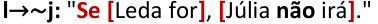

Note que, qualquer que seja o valor lógico do antecedente **l** , a **condicional será verdadeira** . Isso porque, sendo o consequente ~ **j** verdadeiro, nunca recairemos no caso **V** → **F** . Logo, também podemos concluir que _"se Leda for, Júlia não irá"_ .  O **gabarito** , portanto, é **letra E** . 

− 

Vamos agora resolver essa questão de outra maneira. Conforme obtido na resolução anterior, temos as seguintes afirmações: 

##### **I. l** → **m** 

##### **II. m** → **l** 

##### **III. j** → **(l** ∧~ **m)**

---

<!-- pagina: 101 -->

**Equipe Exatas Estratégia Concursos Aula 05** 

Note que a **afirmação I** com a **afirmação II** pode ser entendida como **(l** → **m)** ∧ **(m** → **l)** . Essas duas afirmações em conjunto correspondem à bicondicional **l**  **m** . Ficamos com: 

##### **I e II: l**  **m** 

##### **III. j** → **(l** ∧~ **m)** 

Observe que, sendo a bicondicional **l**  **m** uma afirmação verdadeira, **l** e **m** devem ser ambos verdadeiros ou ambos falsos. Consequentemente, nesses dois casos, o consequente da condicional da **afirmação III** , **(l** ∧~ **m)** , será falso. Portanto, para que a **afirmação III** seja uma condicional verdadeira, **<mark>j</mark>** <mark>deve ser falso</mark> , pois não podemos recair no caso **V** → **F** . Logo, podemos concluir que: 

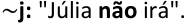

Observando as alternativas, temos a seguinte condicional na **letra E** : 

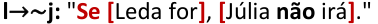

Note que, qualquer que seja o valor lógico do antecedente **l** , a **condicional será verdadeira** . Isso porque, sendo o consequente ~ **j** verdadeiro, nunca recairemos no caso **V** → **F** . Portanto, também podemos concluir que _"se Leda for, Júlia não irá"_ . O **gabarito** , portanto, é **letra E** . 

##### **Gabarito: Letra E.** 

**<mark>(FGV/Câmara dos Deputados/2023) Uma certa empresa farmacêutica guarda a sete chaves o segredo do lançamento de seus próximos produtos. Uma espionagem patrocinada por uma empresa concorrente descobriu que três novos medicamentos estão sendo produzidos: anti-A (contra azia), anti-B (contra bronquite) e anti-C (contra cefaleia), mas não soube dizer se eles serão ou não lançados no mercado.</mark>** 

**A espionagem conseguiu ainda recolher as seguintes informações adicionais:** 

**se o anti-C for lançado, o anti-A também será lançado.** 

**se anti-C não for lançado, o anti-A também não será lançado.** 

**se o anti-B for lançado, o anti-A também será lançado, mas não o anti-C.** 

**Com essas informações, a empresa concorrente sabe que** 

a) se o anti-B não for lançado, o anti-C não será lançado. 

b) não haverá lançamentos. 

c) ou o anti-A não será lançado ou o anti-C não será lançado. 

d) apenas um medicamento será lançado. 

e) se o anti-A for lançado, o anti-B não será lançado. 

##### **Comentários:**

---

<!-- pagina: 102 -->

**Equipe Exatas Estratégia Concursos Aula 05** 

Vamos resolver essa questão pelo **método das regras de inferência** . Sejam as proposições simples: 

**a:** "O anti-A será lançado." 

**b:** "O anti-B será lançado." 

**c:** "O anti-C será lançado." 

As três afirmações correspondem a: 

**I. c** → **a** 

**II.** ~ **c** →~ **a** 

**III. b** → **(a** ∧~ **c)** 

Ao aplicar a equivalência contrapositiva na segunda afirmação, temos: 

~ **c** →~ **a ≡ a** → **c** 

Portanto, podemos escrever as afirmações do seguinte modo: 

**I. c** → **a** 

**II. a** → **c** 

**III. b** → **(a** ∧~ **c)** 

Note que a segunda afirmação pode ser transformada em uma disjunção inclusiva por meio da equivalência **p** → **q ≡** ~ **p** ∨ **q** . Ficamos com: 

**a** → **c ≡** ~ **a** ∨ **c** 

Ficamos com as seguintes afirmações: 

**I. c** → **a** 

**II.** ~ **a** ∨ **c** 

##### **III. b** → **(a** ∧~ **c)** 

Observe que a **afirmação II** é a negação do consequente da **afirmação III** . Isso porque, por **De Morgan** , temos: 

~ **(a** ∧~ **c) ≡** ~ **a** ∨ **c**

---

<!-- pagina: 103 -->

**Equipe Exatas Estratégia Concursos Aula 05** 

Portanto, podemos escrever a **afirmação II** como ~ **(a** ∧~ **c)** . Tomando as **afirmações III e II** , note que obtemos a **regra de inferência** denominada **_Modus Tollens_** , cuja conclusão que torna o argumento válido é a negação do antecedente: 

##### **Afirmação III: b** → **(a** ∧~ **c)** 

##### **<u>Afirmação I:</u>** ~ **<u>(a</u>** <u>∧~</u> **<u>c)</u>** 

##### **Conclusão:** ~ **b** 

Portanto, é correto concluir como verdadeiro ~ **b** , ou seja, " O anti-B **não** será lançado ". 

Observando as alternativas, temos a seguinte condicional na **letra E** : 

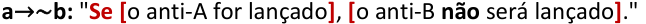

Note que, qualquer que seja o valor lógico do antecedente **a** , a **condicional será verdadeira** . Isso porque, sendo o consequente ~ **b** verdadeiro, nunca recairemos no caso **V** → **F** . Logo, também podemos concluir que _"se o anti-A for lançado, o anti-B não será lançado"_ .  O **gabarito** , portanto, é **letra E** . 

− 

Vamos agora resolver essa questão de outra maneira. Conforme obtido na resolução anterior, aplicando a equivalência contrapositiva na **afirmação II** , ficamos com as seguintes afirmações: 

##### **I. c** → **a** 

##### **II. a** → **c** 

##### **III. b** → **(a** ∧~ **c)** 

Note que a **afirmação I** com a **afirmação II** pode ser entendida como **(c** → **a)** ∧ **(a** → **c)** . Essas duas afirmações em conjunto correspondem à bicondicional **c**  **a** . Ficamos com: 

##### **I e II: c**  **a** 

##### **III. b** → **(a** ∧~ **c)** 

Observe que, sendo a bicondicional **c**  **a** uma afirmação verdadeira, **c** e **a** devem ser ambos verdadeiros ou ambos falsos. Consequentemente, nesses dois casos, o consequente da condicional da **afirmação III** , **(a** ∧~ **c)** , será falso. Portanto, para que a **afirmação III** seja uma condicional verdadeira, **<mark>b</mark>** <mark>deve ser falso</mark> , pois não podemos recair no caso **V** → **F** . Logo, podemos concluir que: 

~ **b:** "O anti-B **não** será lançado ". 

Observando as alternativas, temos a seguinte condicional na **letra E** : 

**a** →~ **b:** " **Se [** o anti-A for lançado **]** , **[** o anti-B **não** será lançado **]** ."

---

<!-- pagina: 104 -->

**Equipe Exatas Estratégia Concursos Aula 05** 

Note que, qualquer que seja o valor lógico do antecedente **a** , a **condicional será verdadeira** . Isso porque, sendo o consequente ~ **b** verdadeiro, nunca recairemos no caso **V** → **F** . Logo, também podemos concluir que _" se o anti-A for lançado, o anti-B não será lançado "_ . O **gabarito** , portanto, é **letra E** . 

##### **Gabarito: Letra E.** 

**<mark>(FGV/SSP AM/2022) Considere as seguintes afirmativas a respeito de um objeto chamado biba:</mark>** 

- **Se biba é bala então não é bola.** 

- **Se biba não é bala então é babalu.** 

##### **É correto concluir que** 

a) se biba é bola então é babalu. 

b) se biba é babalu então é bola. 

c) se biba não é bola então é babalu. 

d) se biba não é babalu então é bola. 

e) se biba é bola então não é babalu. 

##### **Comentários:** 

Note que tanto as afirmações presentes no enunciado quanto as possíveis conclusões presentes nas alternativas são condicionais. Vamos, portanto, utilizar o **método da transitividade do condicional** . 

Sejam as proposições: 

**a:** "Biba é bala." **o:** "Biba é bola." **u:** "Biba é babalu." 

Podemos descrever as afirmações do seguinte modo: 

##### **Afirmação I: a** →~ **o** 

##### **Afirmação II:** ~ **a** → **u** 

Ao concatenarmos a **contrapositiva da afirmação I** com a **afirmação II** , obtemos a conclusão **o** → **u.** Veja: 

##### **Contrapositiva I: o** →~ **a** 

##### **<u>Afirmação II:</u>** ~ **<u>a</u>** <u>→</u> **<u>u</u>** 

##### **Conclusão: o** → **u** 

Logo, é correto concluir **o** → **u** , que corresponde a " **se [** biba é bola **] então** é **[** babalu **]** ". 

##### **Gabarito: Letra A.**

---

<!-- pagina: 105 -->

**Equipe Exatas Estratégia Concursos Aula 05** 

##### **<mark>(FGV/SEFAZ AM/2022) Considere as seguintes premissas:</mark>** 

- **Quem tem azar não sorri.** 

- **Quem é maratonista não está doente.** 

- **Quem não está doente, sorri.** 

##### **A partir dessas premissas é correto concluir que** 

- a) Quem não está doente é maratonista. 

- b) Quem está doente não sorri. 

- c) Quem não tem azar sorri. 

- d) Quem é maratonista não tem azar. 

- e) Quem sorri, não está doente. 

##### **Comentários:** 

Note que tanto as afirmações presentes no enunciado quanto as possíveis conclusões presentes nas alternativas são condicionais. Vamos, portanto, utilizar o **método da transitividade do condicional** . 

Sejam as proposições: 

**a:** "Um indivíduo tem azar." 

**s:** " Um indivíduo sorri." 

**m:** "Um indivíduo é maratonista." 

**d:** "Um indivíduo está doente." 

As afirmações apresentadas estão no formato " **Quem p** , **q** ", que pode ser entendido como " **Todo p, q** ". Esse tipo de proposição corresponde a uma condicional da forma " **Se p, então q** ". 

Logo, podemos descrever as afirmações do seguinte modo: 

**Afirmação I: a** →~ **s** 

**Afirmação II: m** →~ **d** 

**Afirmação III:** ~ **d** → **s** 

Ao concatenarmos a **afirmação II** com a **afirmação III** e com a **contrapositiva da afirmação I** , obtemos a conclusão **m** →~ **a.** Veja: 

**Afirmação II: m** → <mark>~</mark> **<mark>d</mark>** 

**Afirmação III:** <mark>~</mark> **<mark>d</mark>** → **s** 

**<u>Contrapositiva I: s</u>** <u>→~</u> **<u>a</u>** 

**Conclusão: m** →~ **a**

---

<!-- pagina: 106 -->

**Equipe Exatas Estratégia Concursos Aula 05** 

Logo, é correto concluir **m** →~ **a** , que corresponde a " **Quem [** é maratonista **] [não** tem azar **]** ". 

##### **Gabarito: Letra D.** 

##### **<mark>(FGV/SEFAZ ES/2022) Sabe-se que as 3 sentenças a seguir são verdadeiras.</mark>** 

- **Se Pedro é capixaba ou Raquel não é carioca, então Renata não é pernambucana.** 

- **Se Pedro não é capixaba ou Renata é pernambucana, então Raquel é carioca.** 

- **Se Raquel não é carioca, então Pedro é capixaba e Renata é pernambucana.** 

##### **É correto concluir que** 

a) Pedro é capixaba. 

- b) Raquel é carioca. 

- c) Renata é pernambucana. 

- d) Pedro não é capixaba. 

- e) Raquel não é carioca. 

##### **Comentários:** 

Pessoal, a resolução dessa questão não sai pelo método da transitividade do condicional. Nesse caso, vamos "apelar" para o **método da tabela-verdade** . 

Devemos **selecionar a alternativa** que apresenta uma **conclusão que tornaria o argumento válido** . Nesse caso, vamos seguir as três etapas apresentadas na teoria: 

##### **<u>Etapa 1: desconsiderar o contexto, transformando as afirmações da língua portuguesa para a linguagem</u> proposicional** 

Considere as seguintes proposições simples: 

**p:** "Pedro é capixaba." 

**a:** "Raquel é carioca." 

**e:** "Renata é pernambucana." 

As afirmações apresentadas no enunciado são: 

##### **Premissa I: p** ∨~ **a** → ~ **e** 

**Premissa II:** ~ **p** ∨~ **e** → **a** 

**Premissa III:** ~ **a** → **p** ∧ **e** 

##### **<u>Etapa 2: inserir todas as premissas/afirmações na tabela e obter as linhas da tabela-verdade em que</u> todas as premissas/afirmações são simultaneamente verdadeiras**

---

<!-- pagina: 107 -->

**Equipe Exatas Estratégia Concursos Aula 05** 

A tabela-verdade com as afirmações fica assim: 

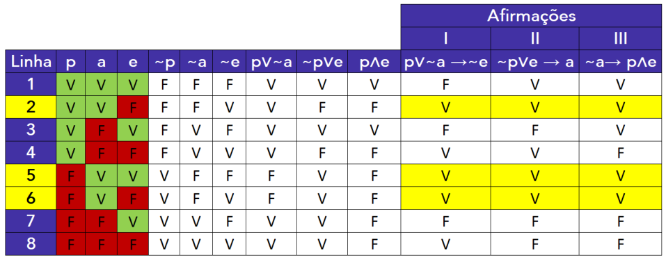

Note que as linhas da tabela-verdade em que as afirmações são verdadeiras são **2, 5 e 6** . 

##### **<u>Etapa 3: verificar a resposta que apresenta uma proposição que é verdadeira para todas as linhas obtidas</u> na etapa anterior** 

a) **p** – **alternativa incorreta** , pois **p** é falso nas linhas 5 e 6. 

b) **a** – **alternativa correta** , **a** é verdadeiro para todas as linhas obtidas. 

c ~~)~~ **e** – **alternativa incorreta** , pois **e** é falso nas linhas 2 e 6. 

d) ~ **p** − **alternativa incorreta** , pois ~ **p** é falso para a linha 2. 

d) ~ **e** − **alternativa incorreta** , pois ~ **e** é falso para a linha 5. 

**Gabarito: Letra B.** 

**<mark>(FGV/BANESTES/2021) Considere como verdadeiras as sentenças a seguir.</mark>** 

**Se Priscila é paulista, então Joel é capixaba.** 

**Se Gabriela não é carioca, então Joel não é capixaba.** 

**Se Gabriela é carioca, então Priscila não é paulista.** 

**É correto deduzir que:** 

- a) Gabriela é carioca; 

- b) Gabriela não é carioca; 

- c) Priscila não é paulista; 

- d) Priscila é paulista; 

- e) Joel não é capixaba.

---

<!-- pagina: 108 -->

**Equipe Exatas Estratégia Concursos Aula 05** 

##### **Comentários:** 

Veja que temos condicionais no enunciado e, nas alternativas, temos proposições simples. Vamos resolver essa questão pelo **método da transitividade do condicional** , procurando obter condicionais da forma **p** →~ **p** ou da forma ~ **p** → **p** . 

Sejam as proposições: 

**p:** "Priscila é paulista." 

**j:** "Joel é capixaba." 

**g:** "Gabriela é carioca." 

Podemos descrever as afirmações do seguinte modo: 

**Afirmação I: p** → **j** 

**Afirmação II:** ~ **g** →~ **j** 

**Afirmação III: g** →~ **p** 

Ao concatenarmos a **afirmação I** com a **contrapositiva da afirmação II** e com a **afirmação III** , conclui-se **p** →~ **p** . 

**Afirmação I: p** → **j** 

**Contrapositiva II: j** → **g** 

**<u>Afirmação III: g</u>** <u>→</u> <mark>~</mark> **<u><mark>p</mark></u>** 

**Conclusão: p** → <mark>~</mark> **<mark>p</mark>** 

Como a **conclusão p** →~ **p** é uma consequência **verdadeira** das afirmações do enunciado, temos que **<mark>p</mark>** <mark>é falso.</mark> Isso porque, caso **p** fosse verdadeiro, teríamos a condicional **V** → **F** , que é uma condicional falsa. 

Logo, é correto concluir ~ **p** , isto é, "Priscila **não** é paulista". O **gabarito** , portanto, é **letra C** . 

**Gabarito: Letra C.** 

**<mark>(FGV/TRT 12/2017) Sabe-se que são verdadeiras as afirmativas:</mark>** 

- **Se Z, então não X.** 

- **Se não Z, então Y.** 

**Logo, deduz-se que:** 

a) Z é necessário para X; 

b) Z é suficiente para Y; 

- c) X é necessário para Y;

---

<!-- pagina: 109 -->

**Equipe Exatas Estratégia Concursos Aula 05** 

d) X é suficiente para Z; 

e) Y é necessário para X. 

##### **Comentários:** 

Note que tanto as afirmações presentes no enunciado quanto as possíveis conclusões presentes nas alternativas são condicionais. Vamos, portanto, utilizar o **método da transitividade do condicional** . 

Podemos descrever as afirmações do seguinte modo: 

##### **Afirmação I: z** →~ **x** 

**Afirmação II:** ~ **z** → **y** 

Ao concatenarmos a **contrapositiva da afirmação I** com a **afirmação II** , obtemos a conclusão **x** → **y.** Veja: 

##### **Contrapositiva I: x** →~ **z** 

##### **<u>Afirmação II:</u>** ~ **<u>z</u>** <u>→</u> **<u>y</u>** 

##### **Conclusão: x** → **y** 

Logo, é correto concluir **x** → **y** , que corresponde a "Y é condição necessária para X". 

##### **Gabarito: Letra E.** 

##### **<mark>(FGV/IBGE/2017) Considere as seguintes afirmativas:</mark>** 

- **Se X é líquido, então não é azul.** 

- **Se X não é líquido, então é vegetal.** 

##### **Pode-se concluir logicamente que:** 

a) se X é azul, então é vegetal; 

b) se X é vegetal, então é azul; 

c) se X não é azul, então não é líquido; 

d) se X não é vegetal, então é azul; 

e) se X não é azul, então não é vegetal. 

##### **Comentários:** 

Note que tanto as afirmações presentes no enunciado quanto as possíveis conclusões presentes nas alternativas são condicionais. Vamos, portanto, utilizar o **método da transitividade do condicional** . 

Sejam as proposições simples: 

**l:** "X é líquido."

---

<!-- pagina: 110 -->

**Equipe Exatas Estratégia Concursos Aula 05** 

**a** : "X é azul." 

**v:** "X é vegetal." 

Podemos descrever as afirmações do seguinte modo: 

**Afirmação I: l** →~ **a** 

**Afirmação II:** ~ **l** → **v** 

Ao concatenarmos a **contrapositiva da afirmação I** com a **afirmação II** , obtemos a conclusão **a** → **v.** Veja: 

**Contrapositiva I: a** →~ **l** 

**<u>Afirmação II:</u>** ~ **<u>l</u>** <u>→</u> **<u>v</u>** 

**Conclusão: a** → **v** 

Logo, é correto concluir **a** → **v** , que corresponde a "se X é azul, então é vegetal". 

##### **Gabarito: Letra A.** 

**<mark>(FGV/IBGE/2017) Considere como verdadeiras as sentenças:</mark>** 

**Se Roberto é vascaíno, então Jair é botafoguense.** 

**Se Roberto não é vascaíno, então Sérgio é tricolor.** 

**É correto concluir que:** 

a) se Sérgio é tricolor, então Roberto não é vascaíno; 

b) se Jair não é botafoguense, então Sérgio é tricolor; 

c) se Sérgio é tricolor, então Jair não é botafoguense; 

d) se Jair não é botafoguense, então Sérgio não é tricolor; 

e) se Jair é botafoguense, então Roberto é vascaíno. 

##### **Comentários:** 

Note que tanto as afirmações presentes no enunciado quanto as possíveis conclusões presentes nas alternativas são condicionais. Vamos, portanto, utilizar o **método da transitividade do condicional** . 

Sejam as proposições simples: 

**r:** "Roberto é vascaíno." 

**j: "** Jair é botafoguense." 

**s:** "Sérgio é tricolor." 

Podemos descrever as afirmações do seguinte modo:

---

<!-- pagina: 111 -->

**Equipe Exatas Estratégia Concursos Aula 05** 

##### **Afirmação I: r** → **j** 

##### **Afirmação II:** ~ **r** → **s** 

Ao concatenarmos a **contrapositiva da afirmação I** com a **afirmação II** , obtemos a conclusão ~ **j** → **s.** Veja: 

##### **Contrapositiva I:** ~ **j** →~ **r** 

##### **<u>Afirmação II:</u>** ~ **<u>r</u>** <u>→</u> **<u>s</u>** 

##### **Conclusão:** ~ **j** → **s** 

Logo, é correto concluir ~ **j** → **s** , que corresponde a " **se [** Jair **não** é botafoguense **]** , **então [** Sérgio é tricolor **]** ". 

##### **Gabarito: Letra B.** 

##### **<mark>(FGV/TRT 12/2017) Sabe-se que:</mark>** 

- **Se X é vermelho, então Y não é verde.** 

- **Se X não é vermelho, então Z não é azul.** 

- **Se Y é verde, então Z é azul.** 

##### **Logo, deduz-se que:** 

a) X é vermelho; 

b) X não é vermelho; 

c) Y é verde; 

d) Y não é verde; 

e) Z não é azul. 

##### **Comentários:** 

Veja que temos condicionais no enunciado e, nas alternativas, temos proposições simples. Vamos resolver essa questão pelo **método da transitividade do condicional** , procurando obter condicionais da forma **p** →~ **p** ou da forma ~ **p** → **p** . 

Sejam as proposições simples: 

**x:** "X é vermelho." 

**y:** "Y é verde." 

**z:** "Z é azul." 

As afirmações são descritas por: 

**Afirmação I: x** →~ **y** 

**Afirmação II:** ~ **x** →~ **z** 

**Afirmação III: y** → **z**

---

<!-- pagina: 112 -->

**Equipe Exatas Estratégia Concursos Aula 05** 

Ao concatenarmos a **contrapositiva da afirmação I** com a **afirmação II** , conclui-se **y** →~ **z** . 

**Contrapositiva I: y** →~ **x** 

**<u>Afirmação II:</u>** ~ **<u>x</u>** <u>→~</u> **<u>z</u>** 

**Conclusão I: y** →~ **z** 

Ao concatenarmos a **conclusão I** com a **contrapositiva da afirmação III** , conclui-se **y** →~ **y** . 

**Conclusão I: y** →~ **z** 

##### **<u>Contrapositiva III:</u>** ~ **<u>z</u>** <u>→~</u> **<u>y</u>** 

##### **Conclusão II: y** →~ **y** . 

Como a **conclusão y** →~ **y** é uma consequência **verdadeira** das afirmações do enunciado, temos que **<mark>y</mark>** <mark>é falso.</mark> Isso porque, caso **w** fosse verdadeiro, teríamos a condicional **V** → **F** , que é uma condicional falsa. 

Logo, é correto concluir ~ **y** , isto é, "Y **não** é verde". O **gabarito** , portanto, é **letra D** . 

##### **Gabarito: Letra D.** 

**<mark>(FGV/IBGE/2016) Sobre os amigos Marcos, Renato e Waldo, sabe-se que:</mark>** 

**I - Se Waldo é flamenguista, então Marcos não é tricolor;** 

**II - Se Renato não é vascaíno, então Marcos é tricolor;** 

**III - Se Renato é vascaíno, então Waldo não é flamenguista.** 

##### **Logo, deduz-se que:** 

a) Marcos é tricolor; 

b) Marcos não é tricolor; 

c) Waldo é flamenguista; 

d) Waldo não é flamenguista; 

e) Renato é vascaíno. 

##### **Comentários:** 

Veja que temos condicionais no enunciado e, nas alternativas, temos proposições simples. Vamos resolver essa questão pelo **método da transitividade do condicional** , procurando obter condicionais da forma **p** →~ **p** ou da forma ~ **p** → **p** . 

Sejam as proposições: 

**w** : "Waldo é flamenguista." 

**m** : "Marcos é tricolor."

---

<!-- pagina: 113 -->

**Equipe Exatas Estratégia Concursos Aula 05** 

##### **r** : "Renato é vascaíno." 

As afirmações são descritas por: 

**Afirmação I: w** →~ **m** 

**Afirmação II:** ~ **r** → **m** 

**Afirmação III: r** →~ **w** 

Ao concatenarmos a **contrapositiva da afirmação II** com a **afirmação III** , conclui-se ~ **m** →~ **w** . 

##### **Contrapositiva II:** <mark>~</mark> **<mark>m</mark>** <mark>→</mark> **r** 

##### **<u>Afirmação III: r</u>** <u>→</u> <mark>~</mark> **<u><mark>w</mark></u>** 

##### **Conclusão I:** <mark>~</mark> **<mark>m</mark>** <mark>→~</mark> **<mark>w</mark>** 

Ao concatenarmos a **afirmação I** com a **conclusão I** , conclui-se **w** →~ **w** . 

**Afirmação I: w** → <mark>~</mark> **<mark>m</mark>** 

**<u>Conclusão I:</u>** <mark>~</mark> **<u><mark>m</mark></u>** <u><mark>→~</mark></u> **<u><mark>w</mark></u>** 

##### **Conclusão II: w** → <mark>~</mark> **<mark>w.</mark>** 

Como a **conclusão w** →~ **w** é uma consequência **verdadeira** das afirmações do enunciado, temos que **<mark>w</mark>** <mark>é falso.</mark> Isso porque, caso **w** fosse verdadeiro, teríamos a condicional **V** → **F** , que é uma condicional falsa. 

Logo, é correto concluir ~ **w** , isto é, "Waldo **não** é flamenguista". O **gabarito** , portanto, é **letra D** . 

##### **Gabarito: Letra D.** 

**<mark>(FGV/MPE MS/2013) Considere verdadeiras as seguintes afirmações:</mark>** 

- **Se vou ao clube, então não almoço em casa.** 

- **Todo domingo vou ao clube.** 

**Pode‐se concluir que:** 

a) se não é domingo então não vou ao clube. 

b) se almoço em casa então não é domingo. 

c) se não vou ao clube então almoço em casa. 

d) se vou ao clube então é domingo. 

e) se não almoço em casa então vou ao clube. 

##### **Comentários:**

---

<!-- pagina: 114 -->

**Equipe Exatas Estratégia Concursos Aula 05** 

Note que tanto as afirmações presentes no enunciado quanto as possíveis conclusões presentes nas alternativas são condicionais. Vamos, portanto, utilizar o **método da transitividade do condicional** . 

Sejam as proposições: 

**v:** "Vou ao clube." 

**a:** "Almoço em casa." 

**d:** "É domingo." 

Note que " _todo domingo vou ao clube"_ pode ser entendido como a condicional _"_ **_se_** _é domingo,_ **_então_** _vou ao clube"._ Logo, podemos descrever as afirmações do seguinte modo: 

**Afirmação I: v** →~ **a** 

**Afirmação II: d** → **v** 

Ao concatenarmos a **afirmação II** com a **afirmação I** , obtemos a conclusão **d** →~ **a.** Veja: 

**Afirmação II: d** → **v** 

**<u>Afirmação I: v</u>** <u>→~</u> **<u>a</u>** 

**Conclusão: d** →~ **a** 

Portanto, uma conclusão correta é: 

**d** →~ **a: "Se [** é domingo **]** , **então [não** almoço em casa **]** ." 

Note que não temos essa conclusão nas alternativas. Utilizando a **equivalência contrapositiva** , temos: 

**d** →~ **a ≡** ~ **(** ~ **a)** →~ **d** 

A dupla negação de uma proposição corresponde à proposição original. Ficamos com: 

**d** →~ **a ≡ a** →~ **d** 

Note que a conclusão **a** →~ **d** corresponde à **alternativa B** . 

**a** →~ **d:** " **Se [** almoço em casa **]** , **então [não** é domingo **]** ." 

**Gabarito: Letra B.** 

**<mark>(FGV/ALEMA/2013) Considere as seguintes afirmativas:</mark>** 

##### **Se é domingo, não trabalho.** 

**Se não é domingo, acordo cedo.** 

**Pode‐se concluir logicamente que**

---

<!-- pagina: 115 -->

**Equipe Exatas Estratégia Concursos Aula 05** 

a) se trabalho então acordo cedo. 

b) se acordo cedo então trabalho. 

c) se não trabalho então acordo cedo. 

d) se não acordo cedo então trabalho. 

e) se trabalho então não acordo cedo. 

##### **Comentários:** 

Note que tanto as afirmações presentes no enunciado quanto as possíveis conclusões presentes nas alternativas são condicionais. Vamos, portanto, utilizar o **método da transitividade do condicional** . 

Sejam as proposições simples: 

**d:** "É domingo." **t:** "Trabalho." **a:** "Acordo cedo." 

Podemos descrever as afirmações do seguinte modo: 

**Afirmação I: d** →~ **t** 

**Afirmação II:** ~ **d** → **a** 

Ao concatenarmos a **contrapositiva da afirmação I** com a **afirmação II** , obtemos a conclusão **t** → **a.** Veja: 

**Contrapositiva I: t** → <mark>~</mark> **<mark>d</mark>** 

**<u>Afirmação II:</u>** <mark>~</mark> **<u><mark>d</mark></u>** <u><mark>→</mark></u> **<u>a</u>** 

**Conclusão: t** → **a** 

Logo, é correto concluir **t** → **a** , que corresponde a: 

**t** → **a:** " **Se [** trabalho **]** , **então [** acordo cedo **]** ". 

##### **Gabarito: Letra A.** 

**<mark>(FGV/TJ AM/2013) Considere como verdadeiras as sentenças a seguir.</mark>** 

**I. Se André não é americano, então Bruno é francês.** 

**II. Se André é americano então Carlos não é inglês.** 

**III. Se Bruno não é francês então Carlos é inglês.** 

**Logo, tem‐se obrigatoriamente que** 

a) Bruno é francês.

---

<!-- pagina: 116 -->

**Equipe Exatas Estratégia Concursos Aula 05** 

b) André é americano. 

- c) Bruno não é francês. 

- d) Carlos é inglês. 

- e) André não é americano. 

##### **Comentários:** 

Vamos resolver essa questão por dois métodos: 

- **Método da transitividade do condicional; e** 

- **Método da tabela-verdade.** 

##### <mark>Método da transitividade do condicional</mark> 

Sejam as proposições simples: 

**a:** "André é americano." 

**b:** "Bruno é francês." 

**c:** "Carlos é inglês." 

As afirmações são descritas por: 

**Afirmação I:** ~ **a** → **b** 

**Afirmação II: a** →~ **c** 

**Afirmação III:** ~ **b** → **c** 

Ao concatenarmos a **contrapositiva da afirmação II** com a **afirmação I** , conclui-se **c** → **b** . 

**Contrapositiva II: c** →~ **a** 

**<u>Afirmação I:</u>** ~ **<u>a</u>** <u>→</u> **<u>b</u>** 

**Conclusão I: c** → **b** 

Ao concatenarmos a **afirmação III** com a **conclusão I** , conclui-se ~ **b** → **b** . 

**Afirmação III:** <mark>~</mark> **<mark>b</mark>** <mark>→</mark> **c** 

##### **<u>Conclusão I: c</u>** <u>→</u> **<u>b</u>** 

##### **Conclusão II:** <mark>~</mark> **<mark>b</mark>** <mark>→</mark> **b** . 

Como a **conclusão** ~ **b** → **b** é uma consequência **verdadeira** das afirmações do enunciado, temos que **<mark>b</mark>** <mark>é verdadeiro.</mark> Isso porque, caso **b** fosse falso, teríamos a condicional **V** → **F** , que é uma condicional falsa. 

Logo, é correto concluir **b** , isto é, "Bruno é francês". O **gabarito** , portanto, é **letra A** .

---

<!-- pagina: 117 -->

**Equipe Exatas Estratégia Concursos Aula 05** 

##### <mark>Método da tabela-verdade</mark> 

Devemos **selecionar a alternativa** que apresenta uma **conclusão que tornaria o argumento válido** . Nesse caso, vamos seguir as três etapas apresentadas na teoria: 

##### **<u>Etapa 1: desconsiderar o contexto, transformando as afirmações da língua portuguesa para a linguagem</u> proposicional** 

Sejam as proposições simples: 

**a:** "André é americano." 

**b:** "Bruno é francês." 

**c:** "Carlos é inglês." 

As afirmações são descritas por: 

**Afirmação I:** ~ **a** → **b** 

**Afirmação II: a** →~ **c** 

**Afirmação III:** ~ **b** → **c** 

##### **<u>Etapa 2: inserir todas as premissas/afirmações na tabela e obter as linhas da tabela-verdade em que</u> todas as premissas/afirmações são simultaneamente verdadeiras** 

A tabela-verdade com as afirmações fica assim: 

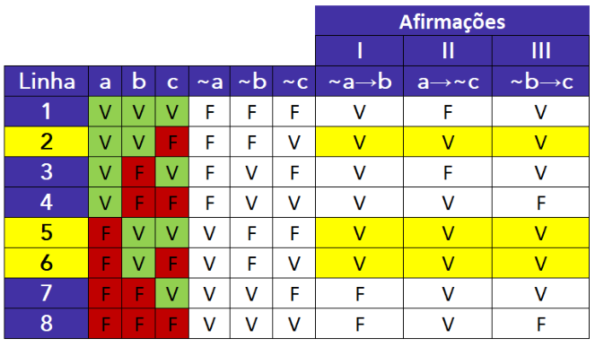

Note que as linhas da tabela-verdade em que as afirmações são verdadeiras são **2, 5 e 6** . 

##### **<u>Etapa 3: verificar a resposta que apresenta uma proposição que é verdadeira para todas as linhas obtidas</u> na etapa anterior** 

a) **b** − **Alternativa correta** , pois **b** é verdadeiro para todas as linhas obtidas. 

b) **a** − Alternativa incorreta, pois **a** pode ser tanto V quanto F.

---

<!-- pagina: 118 -->

**Equipe Exatas Estratégia Concursos Aula 05** 

c) ~ **b** − Alternativa incorreta, pois **b** é verdadeiro para todas as linhas obtidas e, portanto, ~ **b** é falso. 

- d) **c** − Alternativa incorreta, pois **c** pode ser tanto V quanto F. 

- e) ~ **a** − Alternativa incorreta, pois **a** pode ser tanto V quanto F. 

##### **Gabarito: Letra A.** 

**<mark>(FGV/SUDENE/2013) Sabe‐se que</mark>** 

**I. se Mauro não é baiano então Jair é cearense.** 

**II. se Jair não é cearense então Angélica é pernambucana.** 

**III. Mauro não é baiano ou Angélica não é pernambucana.** 

**É necessariamente verdade que** 

a) Mauro não é baiano. 

b) Angélica não é pernambucana. 

c) Jair não é cearense. 

d) Angélica é pernambucana. 

e) Jair é cearense. 

**Comentários:** 

Vamos resolver essa questão por dois métodos: 

- **Método da transitividade do condicional; e** 

- **Método da tabela-verdade.** 

##### <mark>Método da transitividade do condicional</mark> 

Sejam as proposições simples: 

**m:** "Mauro é baiano." 

**j:** "Jair é cearense." 

**a:** "Angélica é pernambucana." 

As afirmações são descritas por: 

**Afirmação I:** ~ **m** → **j** 

**Afirmação II:** ~ **j** → **a** 

**Afirmação III:** ~ **m** ∨~ **a**

---

<!-- pagina: 119 -->

**Equipe Exatas Estratégia Concursos Aula 05** 

Para trabalhar com o método da transitividade do condicional, temos que ter condicionais nas afirmações. Logo, devemos transformar a afirmação III em uma condicional. Utilizando a equivalência da **transformação da disjunção inclusiva em condicional** , dada por **p** ∨ **q ≡** ~ **p** → **q** , ficamos com: 

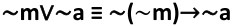

A dupla negação corresponde à proposição original: 

##### ~ **m** ∨~ **a ≡ m** →~ **a** 

Portanto, temos as seguintes afirmações em formato condicional: 

**Afirmação I:** ~ **m** → **j** 

**Afirmação II:** ~ **j** → **a** 

**Afirmação III Equivalente: m** →~ **a** 

Ao concatenarmos a **contrapositiva da afirmação I** com a **afirmação III equivalente** , conclui-se ~ **j** →~ **a** . 

**Contrapositiva I:** ~ **j** → **m** 

**<u>Afirmação III Equivalente: m</u>** <u>→~</u> **<u>a</u>** 

**Conclusão I:** ~ **j** →~ **a** 

Ao concatenarmos a **conclusão I** com a **contrapositiva da afirmação II** , conclui-se ~ **j** → **j** . 

**Conclusão I:** ~ **j** → **a** 

##### **<u>Contrapositiva II: a</u>** <u>→</u> **<u>j</u>** 

**Conclusão II:** ~ **j** → **j** . 

Como a **conclusão** ~ **j** → **j** é uma consequência **verdadeira** das afirmações do enunciado, temos que **j** é <mark>verdadeiro.</mark> Isso porque, caso **j** fosse falso, teríamos a condicional **V** → **F** , que é uma condicional falsa. 

Logo, é correto concluir **j** , isto é, "Jair é cearense". O **gabarito** , portanto, é **letra E** . 

##### <mark>Método da tabela-verdade</mark> 

Devemos **selecionar a alternativa** que apresenta uma **conclusão que tornaria o argumento válido** . Nesse caso, vamos seguir as três etapas apresentadas na teoria: 

##### **<u>Etapa 1: desconsiderar o contexto, transformando as afirmações da língua portuguesa para a linguagem</u> proposicional** 

Sejam as proposições simples: 

**m:** "Mauro é baiano." 

**j:** "Jair é cearense."

---

<!-- pagina: 120 -->

**Equipe Exatas Estratégia Concursos Aula 05** 

##### **a:** "Angélica é pernambucana." 

As afirmações são descritas por: 

**Afirmação I:** ~ **m** → **j** 

**Afirmação II:** ~ **j** → **a** 

**Afirmação III:** ~ **m** ∨~ **a** 

##### **<u>Etapa 2: inserir todas as premissas/afirmações na tabela e obter as linhas da tabela-verdade em que</u> todas as premissas/afirmações são simultaneamente verdadeiras** 

A tabela-verdade com as afirmações fica assim: 

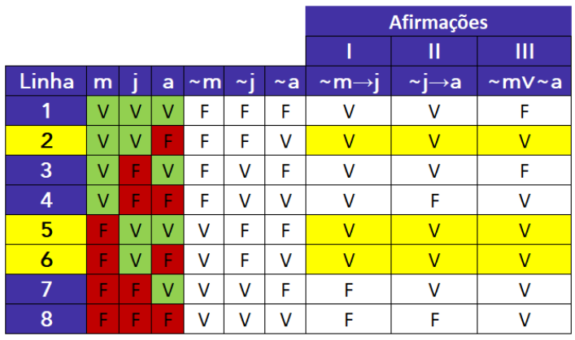

Note que as linhas da tabela-verdade em que as afirmações são verdadeiras são **2, 5 e 6** . 

##### **<u>Etapa 3: verificar a resposta que apresenta uma proposição que é verdadeira para todas as linhas obtidas</u> na etapa anterior** 

- a) ~ **m** − Alternativa incorreta, pois **m** pode ser tanto V quanto F. 

- b) ~ **a** − Alternativa incorreta, pois **a** pode ser tanto V quanto F. 

- c) ~ **j** − Alternativa incorreta, pois **j** é verdadeiro para todas as linhas obtidas e, portanto, ~ **j** é falso. 

- d) **a** − Alternativa incorreta, pois **a** pode ser tanto V quanto F. 

- e) **j** − **Alternativa correta** , pois **j** é verdadeiro para todas as linhas obtidas. 

##### **Gabarito: Letra E.**

---

<!-- pagina: 121 -->

**Equipe Exatas Estratégia Concursos Aula 05** 

**<mark>(FGV/ALEMA/2013) Considere como verdadeiras as seguintes afirmativas:</mark>** 

**I. Se a lei A for aprovada, então a lei B não será aprovada.** 

**II. Se a lei C não for aprovada, então a lei B será aprovada.** 

**III. Se a lei A não for aprovada, então a lei C será aprovada.** 

**A partir das afirmativas, é correto deduzir que** 

a) a lei A será aprovada. 

- b) nenhuma dessas três leis será aprovada. 

- c) apenas duas dessas três leis serão aprovadas. 

d) a lei B não será aprovada. 

e) a lei C será aprovada. 

**Comentários:** 

Vamos resolver essa questão por dois métodos: 

- **Método da transitividade do condicional; e** 

- **Método da tabela-verdade.** 

##### <mark>Método da transitividade do condicional</mark> 

Sejam as proposições simples: 

**a:** "A lei A será aprovada." 

**b:** "A lei B será aprovada." **c:** "A lei C será aprovada." 

As afirmações são descritas por: 

**Afirmação I: a** →~ **b** 

**Afirmação II:** ~ **c** → **b** 

**Afirmação III:** ~ **a** → **c** 

Ao concatenarmos a **contrapositiva da afirmação I** com a **afirmação III** , conclui-se **b** → **c** . 

**Contrapositiva I: b** →~ **a** 

**<u>Afirmação III:</u>** ~ **<u>a</u>** <u>→</u> **<u>c</u>** 

**Conclusão I: b** → **c** 

Ao concatenarmos a **afirmação II** com a **conclusão I** , conclui-se ~ **c** → **c** . 

**Afirmação II:** ~ **c** → **b**

---

<!-- pagina: 122 -->

**Equipe Exatas Estratégia Concursos Aula 05** 

##### **<u>Contrapositiva II: b</u>** <u>→</u> **<u>c</u>** 

##### **Conclusão II:** ~ **c** → **c** . 

Como a **conclusão** ~ **c** → **c** é uma consequência **verdadeira** das afirmações do enunciado, temos que **<mark>c</mark>** <mark>é verdadeiro.</mark> Isso porque, caso **c** fosse falso, teríamos a condicional **V** → **F** , que é uma condicional falsa. 

Logo, é correto concluir **c** , isto é, "A lei C será aprovada". O **gabarito** , portanto, é **letra E** . 

##### <mark>Método da tabela-verdade</mark> 

Devemos **selecionar a alternativa** que apresenta uma **conclusão que tornaria o argumento válido** . Nesse caso, vamos seguir as três etapas apresentadas na teoria: 

##### **<u>Etapa 1: desconsiderar o contexto, transformando as afirmações da língua portuguesa para a linguagem</u> proposicional** 

Sejam as proposições simples: 

**a:** "A lei A será aprovada." 

**b:** "A lei B será aprovada." 

**c:** "A lei C será aprovada." 

As afirmações são descritas por: 

**Afirmação I: a** →~ **b** 

**Afirmação II:** ~ **c** → **b** 

**Afirmação III:** ~ **a** → **c** 

##### **<u>Etapa 2: inserir todas as premissas/afirmações na tabela e obter as linhas da tabela-verdade em que</u> todas as premissas/afirmações são simultaneamente verdadeiras** 

A tabela-verdade com as afirmações fica assim: 

---

<!-- pagina: 123 -->

**Equipe Exatas Estratégia Concursos Aula 05** 

Note que as linhas da tabela-verdade em que as afirmações são verdadeiras são **3, 5** e **7** . 

##### **<u>Etapa 3: verificar a resposta que apresenta uma proposição que é verdadeira para todas as linhas obtidas</u> na etapa anterior** 

Nas **linhas 3** , **5** e **7** , temos que **a** e **b** podem ser tanto V quanto F. Logo, não podemos afirmar se é verdade ou não que: 

**a:** "A lei A será aprovada." 

**b:** "A lei B será aprovada." 

Por outro lado, nas linhas **3** , **5** e **7** , sabemos que **c** é sempre verdadeiro. Logo, podemos afirmar que é verdade que: 

**c:** "A lei C será aprovada." 

O **gabarito** , portanto, é **Letra E** . 

##### **Gabarito: Letra E.** 

**<mark>(FGV/TJ AM/2013) Considere como verdadeiras as afirmativas a seguir.</mark>** 

**I. Se Carlos mentiu, então João é culpado.** 

**II. Se João é culpado, então Carlos não mentiu.** 

**III. Se Carlos não mentiu, então Pedro não é culpado.** 

**IV. Se Pedro não é culpado, então João não é culpado.** 

**Com base nas afirmativas acima, é correto concluir que** 

a) Carlos mentiu, João é culpado, Pedro não é culpado. 

b) Carlos mentiu, João não é culpado, Pedro não é culpado. 

c) Carlos mentiu, João é culpado, Pedro é culpado. 

d) Carlos não mentiu, João não é culpado, Pedro não é culpado. 

e) Carlos não mentiu, João é culpado, Pedro é culpado. 

**Comentários:** 

Vamos resolver essa questão por dois métodos: 

- **Método da transitividade do condicional; e** 

- **Método da tabela-verdade.** 

<mark>Método da transitividade do condicional</mark> 

Sejam as proposições:

---

<!-- pagina: 124 -->

**Equipe Exatas Estratégia Concursos Aula 05** 

**c:** "Carlos mentiu." 

**j:** "João é culpado." 

**p:** "Pedro é culpado." 

As afirmações são descritas por: 

**Afirmação I: c** → **j** 

**Afirmação II: j** →~ **c** 

**Afirmação III:** ~ **c** →~ **p** 

**Afirmação IV:** ~ **p** →~ **j** 

Ao concatenarmos a **afirmação I** com a **afirmação II** , conclui-se **c** →~ **c** 

**Afirmação I: c** → **j** 

**<u>Afirmação II: j</u>** <u>→~</u> **<u>c</u>** 

**Conclusão I: c** →~ **c** 

Como a **conclusão c** →~ **c** é uma consequência **verdadeira** das afirmações do enunciado, temos que **<mark>c</mark>** <mark>é falso.</mark> Isso porque, caso **c** fosse verdadeiro, teríamos a condicional **V** → **F** , que é uma condicional falsa. 

Agora que sabemos que **c** é falso, podemos utilizar essa informação nas demais afirmações. 

A **afirmação III** é um condicional verdadeiro. Como o antecedente ~ **c** é verdadeiro, o consequente ~ **p** não pode ser falso, pois caso contrário recairíamos no condicional falso V → F. Logo, ~ **p** é V e, portanto, **<mark>p</mark>** <mark>é falso</mark> . 

A **afirmação IV** é um condicional verdadeiro. Como o antecedente ~ **p** é verdadeiro, o consequente ~ **j** não pode ser falso, pois caso contrário recairíamos no condicional falso V → F. Logo, ~ **j** é V e, portanto, **<mark>j</mark>** <mark>é falso.</mark> 

Obtemos, portanto, que **c** , **p** e **j** são proposições falsas. Note que, com base nos valores lógicos que obtemos, as **afirmações I e II** também são verdadeiras, pois são, respectivamente, as condicionais **F** → **F** e **F** → **V** . 

Como **c** , **j** e **p** são todas proposições falsas, ~ **c** , ~ **j** e ~ **p** são proposições verdadeiras. Logo, é correto concluir que _"Carlos_ **_não_** _mentiu, João_ **_não_** _é culpado, Pedro_ **_não_** _é culpado"._ O **gabarito** , portanto, é **letra D** . 

##### <mark>Método da tabela-verdade</mark> 

Devemos **selecionar a alternativa** que apresenta uma **conclusão que tornaria o argumento válido** . Nesse caso, vamos seguir as três etapas apresentadas na teoria: 

##### **<u>Etapa 1: desconsiderar o contexto, transformando as afirmações da língua portuguesa para a linguagem</u> proposicional** 

Sejam as proposições: 

**c:** "Carlos mentiu."

---

<!-- pagina: 125 -->

**Equipe Exatas Estratégia Concursos Aula 05** 

##### **j:** "João é culpado." 

##### **p:** "Pedro é culpado." 

As afirmações são descritas por: 

**Afirmação I: c** → **j** 

**Afirmação II: j** →~ **c** 

**Afirmação III:** ~ **c** →~ **p** 

**Afirmação IV:** ~ **p** →~ **j** 

##### **<u>Etapa 2: inserir todas as premissas/afirmações na tabela e obter as linhas da tabela-verdade em que</u> todas as premissas/afirmações são simultaneamente verdadeiras** 

A tabela-verdade com as afirmações fica assim: 

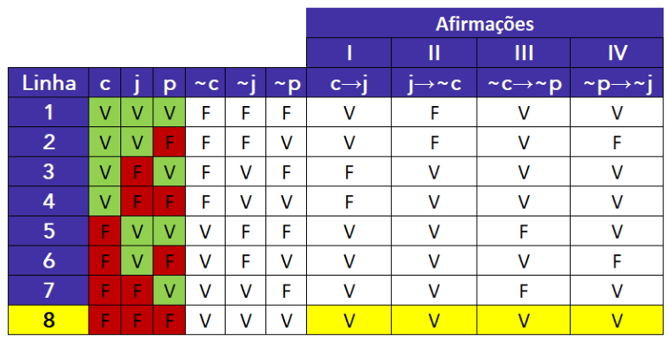

Note que temos apenas uma linha da tabela-verdade com afirmações simultaneamente verdadeiras. Considerando essa única possibilidade, temos que **c** , **j** e **p** são todos falsos. 

##### **<u>Etapa 3: verificar a resposta que apresenta uma proposição que é verdadeira para todas as linhas obtidas</u> na etapa anterior** 

Como **c** , **j** e **p** são todas proposições falsas, ~ **c** , ~ **j** e ~ **p** são proposições verdadeiras. Logo, é correto concluir que _"Carlos_ **_não_** _mentiu, João_ **_não_** _é culpado, Pedro_ **_não_** _é culpado"._ O **gabarito** , portanto, é **letra D** . 

##### **Gabarito: Letra D.** 

**<mark>(FGV/ALEMA/2013) Três amigos, Antônio, Roberto e Sérgio, são torcedores do Moto Club, do Maranhão e do Sampaio Corrêa, não necessariamente nesta ordem. Cada um deles torce por um desses três clubes e não há dois deles que torçam pelo mesmo clube.</mark>** 

**Além disso, sabe‐se que:** 

##### **I. Se Roberto não torce pelo Moto Club, então Sérgio torce pelo Maranhão.**

---

<!-- pagina: 126 -->

**Equipe Exatas Estratégia Concursos Aula 05** 

##### **II. Roberto não torce pelo Moto Club ou Antônio não torce pelo Sampaio Corrêa.** 

**III. Se Sérgio não torce pelo Maranhão, então Antônio torce pelo Sampaio Corrêa.** 

**Logo, Antônio, Roberto e Sérgio são torcedores, respectivamente, de** 

a) Moto Club, Maranhão e Sampaio Corrêa. 

b) Moto Club, Sampaio Corrêa e Maranhão. 

c) Sampaio Corrêa, Maranhão e Moto Club. 

d) Sampaio Corrêa, Moto Club e Maranhão. 

e) Maranhão, Moto Club e Sampaio Corrêa. 

##### **Comentários:** 

Vamos resolver essa questão pelo **método da transitividade do condicional,** transformando a afirmação II em uma condicional. 

Sejam as proposições: 

**r:** "Roberto torce pelo Moto Club." 

**s:** "Sérgio torce pelo Maranhão." 

**a:** "Antônio torce pelo Sampaio Corrêa." 

Observe que a afirmação II pode ser descrita por ~ **r** ∨~ **a** . Utilizando a equivalência **p** ∨ **q ≡** ~ **p** → **q** , a afirmação II é equivalente a ~ **(** ~ **r)** → **(** ~ **a),** isto é **, r** →~ **a** . 

Logo, afirmações são descritas por: 

**Afirmação I:** ~ **r** → **s** 

**Afirmação II: r** →~ **a** 

**Afirmação III:** ~ **s** → **a** 

Ao concatenarmos a **afirmação III** com a **contrapositiva da afirmação II** , conclui-se ~ **s** →~ **r** . 

**Contrapositiva II:** ~ **s** → **a** 

**<u>Afirmação III: a</u>** <u>→~</u> **<u>r</u>** 

**Conclusão I:** ~ **s** →~ **r** 

Ao concatenarmos a **conclusão I** com a **afirmação I** , conclui-se ~ **s** → **s** .

---

<!-- pagina: 127 -->

**Equipe Exatas Estratégia Concursos Aula 05** 

##### **Conclusão I:** ~ **s** →~ **r** 

##### **<u>Afirmação I:</u>** ~ **<u>r</u>** <u>→~</u> **<u>s</u> Conclusão II:** ~ **s** → **s** . 

Como a **conclusão** ~ **s** → **s** é uma consequência **verdadeira** das afirmações do enunciado, temos que **<mark>s</mark>** <mark>é verdadeiro.</mark> Isso porque, caso **s** fosse falso, teríamos a condicional **V** → **F** , que é uma condicional falsa. 

Uma vez que **s** é verdadeiro, <mark>Sérgio torce para o Maranhão.</mark> Com isso, resta-nos apenas as alternativas B e D para analisar. 

Devemos agora nos lembrar que cada amigo torce para um dos três clubes e não há dois deles que torçam <u>pelo mesmo clube. Resta-nos apenas os amigos</u> **Antônio** e **Roberto** e os times **Moto Club** e **Sampaio Corrêa** . 

A partir desse momento, **não torcer para o Moto Club** significa **torcer para o Sampaio Corrêa** , bem como **não torcer para o Sampaio Corrêa** significa **torcer para o Moto Club** . A afirmação II, dada por ~ **r** ∨~ **a** , pode ser descrita por: 

"Roberto torce pelo Sampaio Corrêa **ou** Antônio torce pelo Moto Club" 

Sabemos que a disjunção inclusiva acima é verdadeira e, para tanto, <u>ao menos uma parcela deve ser</u> verdadeira. Ocorre que, **se uma das parcelas for verdadeira e outra falsa** , **teríamos dois amigos torcendo para o mesmo time** . Logo, ambas as parcelas são verdadeiras: 

- Roberto torce pelo Sampaio Corrêa; e 

- Antônio torce pelo Moto Club. 

Portanto, Antônio, Roberto e Sérgio são torcedores, respectivamente, de Moto Club, Sampaio Corrêa e Maranhão. 

##### **Gabarito: Letra B.** 

**<mark>(FGV/Senado/2012) Considere verdadeiras as seguintes proposições compostas:</mark>** 

**I. Se João é brasileiro, então Maria não é portuguesa.** 

**II. Se Pedro não é japonês, então Maria é portuguesa.** 

**III. Se João não é brasileiro, então Pedro é japonês.** 

**Logo, é correto deduzir que** 

a) Pedro é japonês. 

b) Maria é portuguesa. 

c) Pedro não é japonês. 

d) João é brasileiro. 

e) João não é brasileiro. 

##### **Comentários:**

---

<!-- pagina: 128 -->

**Equipe Exatas Estratégia Concursos Aula 05** 

Vamos resolver essa questão por dois métodos: 

- **Método da transitividade do condicional; e** 

- **Método da tabela-verdade.** 

##### <mark>Método da transitividade do condicional</mark> 

Sejam as proposições simples: 

**j:** "João é brasileiro." 

**m:** "Maria é portuguesa." 

**p:** "Pedro é japonês." 

As afirmações são descritas por: 

**Afirmação I: j** →~ **m** 

**Afirmação II:** ~ **p** → **m** 

**Afirmação III:** ~ **j** → **p** 

Ao concatenarmos a **contrapositiva da afirmação I** com a **afirmação III** , conclui-se **m** → **p** . 

**Contrapositiva I: m** →~ **j** 

**<u>Afirmação III:</u>** ~ **<u>j</u>** <u>→</u> **<u>p</u>** 

**Conclusão I: m** → **p** 

Ao concatenarmos a **afirmação II** com a **conclusão I** , conclui-se ~ **p** → **p** . 

**Afirmação II:** <mark>~</mark> **<mark>p</mark>** <mark>→</mark> **m** 

**<u>Contrapositiva II: m</u>** <u>→</u> **<u>p</u>** 

**Conclusão II:** <mark>~</mark> **<mark>p</mark>** <mark>→</mark> **p** . 

Como a **conclusão** ~ **p** → **p** é uma consequência **verdadeira** das afirmações do enunciado, temos que **<mark>p</mark>** <mark>é verdadeiro.</mark> Isso porque, caso **p** fosse falso, teríamos a condicional **V** → **F** , que é uma condicional falsa. 

Logo, é correto concluir **p** , isto é, "Pedro é japonês". O **gabarito** , portanto, é **letra A** . 

##### <mark>Método da tabela-verdade</mark> 

Devemos **selecionar a alternativa** que apresenta uma **conclusão que tornaria o argumento válido** . Nesse caso, vamos seguir as três etapas apresentadas na teoria: 

##### **<u>Etapa 1: desconsiderar o contexto, transformando as afirmações da língua portuguesa para a linguagem</u> proposicional** 

Sejam as proposições simples:

---

<!-- pagina: 129 -->

**Equipe Exatas Estratégia Concursos Aula 05** 

**j:** "João é brasileiro." 

**m:** "Maria é portuguesa." 

**p:** "Pedro é japonês." 

As afirmações são descritas por: 

**Afirmação I: j** →~ **m** 

**Afirmação II:** ~ **p** → **m** 

**Afirmação III:** ~ **j** → **p** 

##### **<u>Etapa 2: inserir todas as premissas/afirmações na tabela e obter as linhas da tabela-verdade em que</u> todas as premissas/afirmações são simultaneamente verdadeiras** 

A tabela-verdade com as afirmações fica assim: 

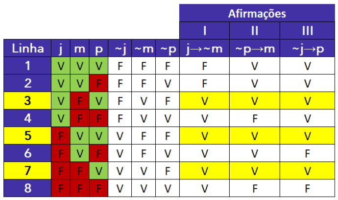

Note que as linhas da tabela-verdade em que as afirmações são verdadeiras são **3, 5** e **7** . 

##### **<u>Etapa 3: verificar a resposta que apresenta uma proposição que é verdadeira para todas as linhas obtidas</u> na etapa anterior** 

a) **p** − **Alternativa correta** , pois **p** é verdadeiro para todas as linhas obtidas. 

b) **m** − Alternativa incorreta, pois **m** pode ser tanto V quanto F. 

c) ~ **p** − Alternativa incorreta, pois **p** é verdadeiro para todas as linhas obtidas e, portanto, ~ **p** é falso. 

d) **j** − Alternativa incorreta, pois **j** pode ser tanto V quanto F. 

e) ~ **j** − Alternativa incorreta, pois **j** pode ser tanto V quanto F. 

##### **Gabarito: Letra A.**

---

<!-- pagina: 130 -->

**Equipe Exatas Estratégia Concursos Aula 05** 

**<mark>(FGV/Senado Federal/2012) Entre os argumentos a seguir, aquele que é dedutivamente legítimo é:</mark>** 

a) Se o Senado votar a lei A, então não votará a lei B. Se a sessão continuar após meia‐noite, então o Senado votará a lei B. Logo, se o Senado não votar a lei A, então a sessão continuará após a meia‐noite. 

b) Se o Senado não votar a lei A, então não votará a lei B. Se a sessão continuar após meia‐noite, então o Senado votará a lei B. Logo, se o Senado votar a lei A, então a sessão continuará após a meia‐noite. 

c) Se o Senado votar a lei A, então não votará a lei B. Se a sessão continuar após meia‐noite, então o Senado votará a lei B. Logo, se o Senado votar a lei A, então a sessão não continuará após a meia‐noite. 

d) Se o Senado votar a lei A, então não votará a lei B. Se a sessão continuar após meia‐noite, então o Senado votará a lei B. Logo, se o Senado não votar a lei A, então a sessão não continuará após a meia‐noite. 

e) Se o Senado não votar a lei A, então não votará a lei B. Se a sessão continuar após meia‐noite, então o Senado votará a lei B. Logo, se o Senado não votar a lei A, então a sessão continuará após a meia‐noite. 

##### **Comentários:** 

Para analisar a validade dos argumentos, vamos descontextualizá-los. Considere as proposições simples: 

**a:** "O Senado votará a lei A." 

**b:** "O Senado votará a lei B." 

**m:** "A sessão continuará após a meia-noite." 

Temos os seguintes argumentos: 

|**a)Premissa** **I**:**a**→~**b** **Premissa** **II**:**m**→**b**|**b)Premissa** **I**:~**a**→~**b** **Premissa** **II**:**m**→**b**|**c)Premissa** **I**:**a**→~**b** **Premissa** **II**:**m**→**b**|
|---|---|---|
|**Conclusão:** ~**a**→**m**|**Conclusão:** **a**→**m**|**Conclusão:** **a**→~**m**|
|**d)Premissa** **I**:**a**→~**b**|**e)Premissa** **I**:~**a**→~**b**||
|**Premissa** **II**:**m**→**b**|**Premissa** **II**:**m**→**b**||
|**Conclusão:** ~**a**→~**m**|**Conclusão:** ~**a**→**m**||

Agora, observe a alternativa C. Pelo **método da transitividade do condicional** , ao concatenar a premissa I com a contrapositiva da premissa II, obtém-se a conclusão sugerida: 

**Premissa I** : **a** → <mark>~</mark> **<mark>b</mark>** 

**Contrapositiva II** : <mark>~</mark> **<mark>b</mark>** <mark>→~</mark> **<mark>m</mark>** 

**Conclusão: a** → <mark>~</mark> **<mark>m</mark>** 

Logo, a **alternativa C** apresenta um **argumento válido** . **Este é o gabarito** . 

Para fins didáticos, pode-se mostrar que as alternativas **A** , **B** , **D** e **E** apresentam **argumentos inválidos** por meio do **método da conclusão falsa** .

---

<!-- pagina: 131 -->

**Equipe Exatas Estratégia Concursos Aula 05** 

##### <mark>Alternativa A</mark> 

##### **<u>Etapa 1: desconsiderar o contexto</u>** 

<mark>As premissas e a conclusão são dadas por:</mark> 

**Premissa I** : **a** →~ **b** 

**Premissa II** : **m** → **b** 

**Conclusão:** ~ **a** → **m** 

##### **<u>Etapa 2: partir da hipótese de que a conclusão é falsa</u>** 

Se considerarmos a conclusão falsa, temos que o antecedente ~ **a** é verdadeiro e o consequente **m** é falso. Logo, **<mark>a</mark>** <mark>é F</mark> e **<mark>m</mark>** <mark>é F.</mark> 

##### **<u>Etapa 3: tentar obter ao menos um caso em que todas as premissas sejam verdadeiras mantendo a</u>** 

##### **conclusão falsa** 

Note que, a partir da conclusão considerada falsa, a premissa I é verdadeira, pois temos uma condicional com o antecedente **a** , que é falso. 

Observe também que a premissa II também é verdadeira, pois temos uma condicional com o antecedente **m** , que é falso. 

Veja que **é possível fazer com que todas as premissas sejam verdadeiras mantendo a conclusão falsa** . Basta que **a** seja F e **m** seja F, qualquer que seja o valor lógico de **b** . Logo, o **argumento é inválido** . 

##### <mark>Alternativa B</mark> 

##### **<u>Etapa 1: desconsiderar o contexto</u>** 

<mark>As premissas e a conclusão são dadas por:</mark> 

**Premissa I** : ~ **a** →~ **b** 

**Premissa II** : **m** → **b** 

**Conclusão: a** → **m** 

##### **<u>Etapa 2: partir da hipótese de que a conclusão é falsa</u>** 

Se considerarmos a conclusão falsa, temos que o antecedente **a** é verdadeiro e o consequente **m** é falso. Logo, **<mark>a</mark>** <mark>é V</mark> e **<mark>m</mark>** <mark>é F.</mark> 

##### **<u>Etapa 3: tentar obter ao menos um caso em que todas as premissas sejam verdadeiras mantendo a</u> conclusão falsa** 

Note que, a partir da conclusão considerada falsa, a premissa I é verdadeira, pois temos uma condicional com o antecedente ~ **a** , que é falso.

---

<!-- pagina: 132 -->

**Equipe Exatas Estratégia Concursos Aula 05** 

Observe também que a premissa II também é verdadeira, pois temos uma condicional com o antecedente **m** , que é falso. 

Veja que **é possível fazer com que todas as premissas sejam verdadeiras mantendo a conclusão falsa** . Basta que **a** seja V e **m** seja F, qualquer que seja o valor lógico de **b** . Logo, o **argumento é inválido** . 

<mark>Alternativa D</mark> 

##### **<u>Etapa 1: desconsiderar o contexto</u>** 

<mark>As premissas e a conclusão são dadas por:</mark> 

**Premissa I** : **a** →~ **b** 

**Premissa II** : **m** → **b** 

**Conclusão:** ~ **a** →~ **m** 

##### **<u>Partir da hipótese de que a conclusão é falsa</u>** 

Se considerarmos a conclusão falsa, temos que o antecedente ~ **a** é verdadeiro e o consequente ~ **m** é falso. Logo, **<mark>a</mark>** <mark>é F</mark> e **<mark>m</mark>** <mark>é V.</mark> 

##### **<u>Etapa 3: tentar obter ao menos um caso em que todas as premissas sejam verdadeiras mantendo a</u>** 

##### **conclusão falsa** 

Note que, a partir da conclusão considerada falsa, a premissa I é verdadeira, pois temos uma condicional com o antecedente **a** , que é falso. 

Para a premissa II ser verdadeira, como temos o antecedente **m** verdadeiro, devemos ter o consequente **b** verdadeiro, pois caso contrário recairíamos na condicional falsa V → F. Logo, **<mark>b</mark>** <mark>é V.</mark> 

Veja que **é possível fazer com que todas as premissas sejam verdadeiras mantendo a conclusão falsa** . Basta que **a** seja F, **m** seja V e **b** seja V. Logo, o **argumento é inválido** . 

##### <mark>Alternativa E</mark> 

##### **<u>Etapa 1: desconsiderar o contexto</u>** 

<mark>As premissas e a conclusão são dadas por:</mark> 

**Premissa I** : ~ **a** →~ **b** 

**Premissa II** : **m** → **b** 

**Conclusão:** ~ **a** → **m** 

##### **<u>Etapa 2: partir da hipótese de que a conclusão é falsa</u>** 

Se considerarmos a conclusão falsa, temos que o antecedente ~ **a** é verdadeiro e o consequente **m** é falso. Logo, **<mark>a</mark>** <mark>é F</mark> e **<mark>m</mark>** <mark>é F.</mark>

---

<!-- pagina: 133 -->

**Equipe Exatas Estratégia Concursos Aula 05** 

##### **<u>Etapa 3: tentar obter ao menos um caso em que todas as premissas sejam verdadeiras mantendo a</u> conclusão falsa** 

Note que, a partir da conclusão considerada falsa, a premissa II é verdadeira, pois temos uma condicional com o antecedente **m** , que é falso. 

Para a premissa I ser verdadeira, como temos o antecedente ~ **a** verdadeiro, devemos ter o consequente ~ **b** verdadeiro, pois caso contrário recairíamos na condicional falsa V → F. Logo, **<mark>b</mark>** <mark>é F</mark> . 

Veja que **é possível fazer com que todas as premissas sejam verdadeiras mantendo a conclusão falsa** . Basta que **a** seja F, **m** seja F e **b** seja F. Logo, o **argumento é inválido** . 

##### **Gabarito: Letra C.** 

**<mark>(FGV/MEC/2009) O silogismo é uma forma de raciocínio dedutivo. Na sua forma padronizada, é constituído por três proposições: as duas primeiras denominam-se premissas e a terceira, conclusão.</mark>** 

**As premissas são juízos que precedem a conclusão. Em um silogismo, a conclusão é consequência necessária das premissas.** 

**São dados três conjuntos formados por duas premissas verdadeiras e uma conclusão não necessariamente verdadeira.** 

**I- Premissa 1: Todos os mamíferos são homeotérmicos.** 

**Premissa 2: Todas as baleias são mamíferas.** 

**Conclusão: Todas as baleias são homeotérmicas.** 

**II- Premissa 1: Todos os peixes são pecilotérmicos.** 

**Premissa 2: Todos os tubarões são pecilotérmicos.** 

**Conclusão: Todos os tubarões são peixes.** 

**III- Premissa 1: Todos os primatas são mamíferos.** 

**Premissa 2: Todos os mamíferos são vertebrados.** 

**Conclusão: Todos os vertebrados são primatas.** 

**Assinale:** 

a) se somente o conjunto I for um silogismo. b) se somente o conjunto II for um silogismo. 

c) se somente o conjunto III for um silogismo. d) se somente os conjuntos I e III forem silogismos. 

e) se somente os conjuntos II e III forem silogismos.

---

<!-- pagina: 134 -->

**Equipe Exatas Estratégia Concursos Aula 05** 

##### **Comentários:** 

A questão define **silogismo** como um **<u>argumento válido</u>** (conclusão é consequência necessária das premissas) <u>constituído por duas premissas e uma conclusão. Devemos, portanto, avaliar quais dos três</u> argumentos são válidos. 

##### <mark>Argumento I</mark> 

##### **<u>Premissa 1: Todos os mamíferos são homeotérmicos</u>** 

Note que, nesse caso, o conjunto dos mamíferos (M) **está contido** no conjunto dos homeotérmicos (H). 

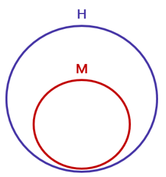

##### **<u>Premissa 2: Todas as baleias são mamíferas.</u>** 

Note que, nesse caso, o conjunto das baleias (B) **está contido** no conjunto dos mamíferos (M). 

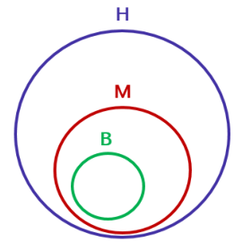

Observe que, a partir das premissas, a **conclusão** "todas as baleias são homeotérmicas" é **uma consequência necessariamente verdadeira** , pois o <u>conjunto das baleias</u> (B) necessariamente **deve estar contido** no <u>conjunto dos homeotérmicos (H). O</u> **argumento** , portanto, é **válido** . 

##### <mark>Argumento II</mark> 

##### **<u>Premissa 1: Todos os peixes são pecilotérmicos.</u>** 

Note que, nesse caso, o conjunto dos peixes (P) **está contido** no conjunto dos pecilotérmicos (E).

---

<!-- pagina: 135 -->

**Equipe Exatas Estratégia Concursos Aula 05** 

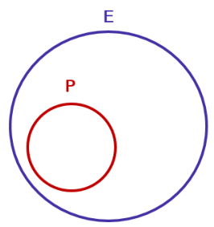

##### **<u>Premissa 2: Todos os tubarões são pecilotérmicos.</u>** 

Note que, nesse caso, o conjunto dos tubarões (T) **está contido** no conjunto dos pecilotérmicos (E). Existem diversas formas de se incluir o conjunto dos tubarões no diagrama: 

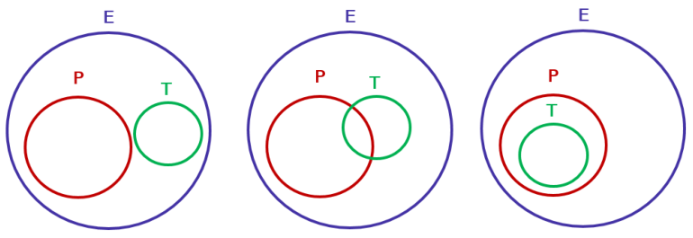

Observe que, a partir das premissas, a **conclusão** "todos os tubarões são peixes" **não é uma consequência necessariamente verdadeira** , pois o <u>conjunto dos tubarões</u> (T) não necessariamente está contido no <u>conjunto dos peixes (P). O</u> **argumento** , portanto, é **inválido** . 

<mark>Argumento III</mark> 

##### **<u>Premissa 1: Todos os primatas são mamíferos.</u>** 

Note que, nesse caso, o conjunto dos primatas (P) **está contido** no conjunto dos mamíferos (M). 

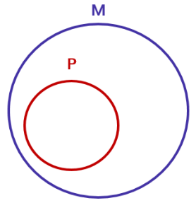

**<u>Premissa 2: Todos os mamíferos são vertebrados.</u>** 

Note que, nesse caso, o conjunto dos mamíferos (M) **está contido** no conjunto dos vertebrados (V).

---

<!-- pagina: 136 -->

**Equipe Exatas Estratégia Concursos Aula 05** 

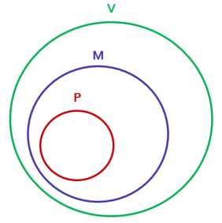

Observe que, a partir das premissas, a **conclusão** "todos os vertebrados são primatas" **não é uma consequência necessariamente verdadeira** . Isso porque, conforme a área destacada no diagrama a seguir, podemos ter vertebrados que não são primatas. O **argumento** , portanto, é **inválido** . 

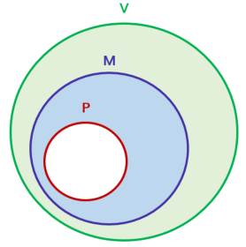

Veja que **somente o argumento I constitui um argumento válido** . O **gabarito** , portanto, é **letra A** . 

**Gabarito: Letra A.** 

**<mark>(FGV/MEC/2009) O silogismo é uma forma de raciocínio dedutivo. Na sua forma padronizada, é constituído por três proposições: as duas primeiras denominam-se premissas e a terceira, conclusão. As premissas são juízos que precedem a conclusão. Em um silogismo, a conclusão é consequência necessária das premissas.</mark>** 

**São dados 3 conjuntos formados por 2 premissas verdadeiras e 1 conclusão não necessariamente verdadeira.** 

**I. Premissa 1: Alguns animais são homens. Premissa 2: Júlio é um animal. Conclusão: Júlio é homem.** 

**II. Premissa 1: Todo homem é um animal. Premissa 2: João é um animal. Conclusão: João é um homem. III. Premissa 1: Todo homem é um animal. Premissa 2: José é um homem. Conclusão: José é um animal. É (são) silogismo(s) somente:** 

a) I 

b) II 

c) III

---

<!-- pagina: 137 -->

**Equipe Exatas Estratégia Concursos Aula 05** 

d) I e III 

e) II e III 

##### **Comentários:** 

A questão define **silogismo** como um **<u>argumento válido</u>** (conclusão é consequência necessária das premissas) <u>constituído por duas premissas e uma conclusão. Devemos, portanto, avaliar quais dos três</u> argumentos são válidos. 

##### <mark>Argumento I</mark> 

##### **<u>Premissa 1: Alguns animais são homens.</u>** 

Note que, nesse caso, a premissa indica que **há intersecção** entre o conjunto dos animais (A) e o conjunto <u>dos homens (H).</u> 

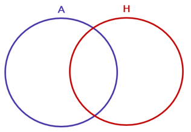

**<u>Premissa 2: Júlio é um animal.</u>** 

Note que, nesse caso, a premissa indica que o <u>elemento Júlio</u> **está contido** no <u>conjunto dos animais (A).</u> Existem duas formas de se representar essa informação: 

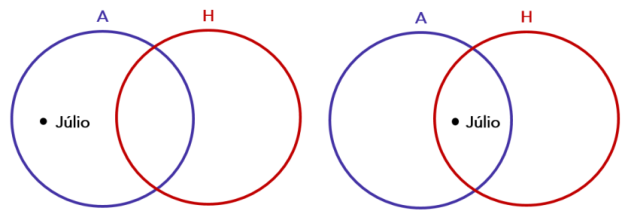

Observe que, a partir das premissas, a **conclusão** "Júlio é homem" **não é uma consequência necessariamente verdadeira** , pois Júlio não necessariamente está contido no conjunto dos homens. O **argumento** , portanto, é **inválido** . 

##### <mark>Argumento II</mark> 

##### **<u>Premissa 1: Todo homem é um animal.</u>** 

Note que, nesse caso, o conjunto dos homens (H) **está contido** no conjunto dos animais (A).

---

<!-- pagina: 138 -->

**Equipe Exatas Estratégia Concursos Aula 05** 

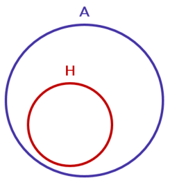

**<u>Premissa 2: João é um animal.</u>** 

Note que, nesse caso, a premissa indica que o <u>elemento João</u> **está contido** no <u>conjunto dos animais (A).</u> Existem duas formas de se representar essa informação: 

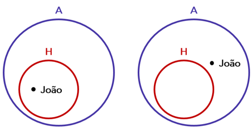

Note que, a partir das premissas, a **conclusão** "João é homem" **não é uma consequência necessariamente verdadeira** , pois João não necessariamente está contido no conjunto dos homens. O **argumento** , portanto, é **inválido** . 

##### <mark>Argumento III</mark> 

##### **<u>Premissa 1: Todo homem é um animal.</u>** 

Note que, nesse caso, o conjunto dos homens (H) **está contido** no conjunto dos animais (A). 

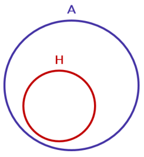

**<u>Premissa 2: José é um homem.</u>** 

Note que, nesse caso, a premissa indica que o elemento José **está contido** no conjunto dos homens (H).

---

<!-- pagina: 139 -->

**Equipe Exatas Estratégia Concursos Aula 05** 

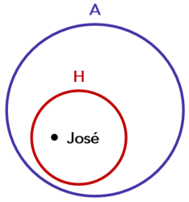

Observe que, a partir das premissas, a **conclusão** " José é um animal" é **uma consequência necessariamente verdadeira** , pois José necessariamente deve estar contido no <u>conjunto dos animais (A). O</u> **argumento** , portanto, é **válido** . 

Veja que **somente o argumento III constitui um argumento válido** . O **gabarito** , portanto, é **letra C** . 

##### **Gabarito: Letra C.** 

**<mark>(FGV/SEFAZ MS/2006) Se chove, fico em casa. Se fico em casa, vejo televisão. Se vejo televisão, aborreço-me com as notícias. Podemos afirmar que:</mark>** 

a) se vejo televisão, fico em casa. 

b) fico em casa somente se chove. 

c) é necessário ficar em casa para ver televisão. 

d) se não me aborreço com as notícias, não chove. 

e) se fico em casa, então chove. 

##### **Comentários:** 

Note que tanto as afirmações quanto a conclusão são condicionais. Vamos, portanto, utilizar o **método da transitividade do condicional** . 

Sejam as proposições: 

**c:** "Chove." 

**f:** "Fico em casa." 

**v:** "Vejo televisão." 

**a:** "Aborreço-me com as notícias." 

As afirmações são descritas por: 

##### **Afirmação I: c** → **f** 

**Afirmação II: f** → **v** 

**Afirmação III: v** → **a**

---

<!-- pagina: 140 -->

**Equipe Exatas Estratégia Concursos Aula 05** 

Ao concatenarmos as três afirmações, chega-se na conclusão **c** → **a** : 

**Afirmação I: c** → **f** 

**Afirmação II: f** → **v** 

##### **<u>Afirmação III: v</u>** <u>→</u> **<u>a</u>** 

**Conclusão: c** → **a** 

Portanto, uma conclusão correta é: 

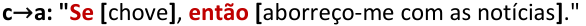

Note que não temos essa conclusão nas alternativas. Utilizando a **equivalência contrapositiva** , temos: 

Agora sim temos resposta: 

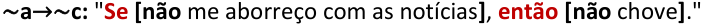

A alternativa D apresenta essa conclusão na forma em que se omite o " **então** ". 

##### **Gabarito: Letra D.**

---

<!-- pagina: 141 -->

**Equipe Exatas Estratégia Concursos Aula 05** 

# **– LISTA DE QUESTÕES FGV** 

## Conectivos lógicos: questões clássicas 

**<mark>(FGV/AGENERSA/2023) Considere como verdadeiras as sentenças a seguir.</mark>** 

- **Casemiro é vascaíno ou Raquel é flamenguista.** 

- **Se Raquel é flamenguista, então Rosa é botafoguense.** 

- **Rosa não é botafoguense.** 

##### **É correto concluir que** 

a) se Casemiro é vascaíno, então Raquel é flamenguista. 

b) se Casemiro não é vascaíno, então Rosa é botafoguense. 

c) Casemiro não é vascaíno ou Raquel é flamenguista. 

- d) Casemiro é vascaíno e Rosa é botafoguense. 

e) se Raquel não é flamenguista, então Casemiro não é vascaíno. 

**<mark>(FGV/TRT-PB/2022) Considere como verdadeiras as seguintes sentenças:</mark>** 

**Se Gerson não é torcedor do Botafogo, então Luiz é torcedor do Treze.** 

**Se Luiz é torcedor do Treze, então Débora não é torcedora do Campinense.** 

**Se Débora não é torcedora do Campinense, então Lúcia é torcedora do Botafogo.** 

**Lúcia não é torcedora do Botafogo.** 

**É correto concluir que** 

a) Luiz é torcedor do Treze. 

- b) Gerson é torcedor do Botafogo. 

- c) Luiz não é torcedor do Botafogo. 

d) Débora é torcedora do Campinense. 

e) Lúcia é torcedora do Treze. 

**<mark>(FGV/FunSaúde CE/2021) Roberto fez as seguintes afirmações sobre suas atividades diárias:</mark>** 

- **faço ginástica ou natação.** 

- **vou ao clube ou não faço natação.** 

- **vou à academia ou não faço ginástica.** 

**Certo dia Roberto não foi à academia.** 

**É correto concluir que, nesse dia, Roberto**

---

<!-- pagina: 142 -->

**Equipe Exatas Estratégia Concursos Aula 05** 

a) fez ginástica e natação. 

b) não fez ginástica nem natação. 

c) fez natação e não foi ao clube. 

d) foi ao clube e fez natação. 

e) não fez ginástica e não foi ao clube. 

**<mark>(FGV/Pref. Angra/2019) Considere como verdadeiras as sentenças:</mark>** 

**I. Pedro é baiano ou Maria é carioca.** 

**II. Se Maria é carioca, então Sérgio é paulista.** 

**III. Sérgio não é paulista.** ==5460== **É verdade concluir que** 

a) Pedro é baiano. 

b) Pedro não é baiano. 

c) Maria é carioca. 

d) Se Maria não é carioca, então Pedro não é baiano. 

e) Se Pedro é baiano, então Sérgio é paulista. 

**<mark>(FGV/TJ SC/2018) Alberto disse: “Se chego tarde em casa, não ligo o computador e, se não ligo o computador, vou cozinhar. Porém, sempre que ligo o computador, tomo café”.</mark>** 

**Certo dia, Alberto chegou em casa e não tomou café.** 

**É correto concluir que Alberto:** 

a) cozinhou; 

b) chegou tarde; 

c) não cozinhou; 

d) chegou cedo; 

e) ligou o computador. 

**<mark>(FGV/COMPESA/2018) Considere verdadeiras as afirmações feitas por Adelson:</mark>** 

- **Vejo TV ou leio.** 

- **Bebo cerveja ou não vejo TV.** 

- **Ponho óculos ou não leio.** 

**Sabe-se que ontem Adelson não pôs óculos.**

---

<!-- pagina: 143 -->

**Equipe Exatas Estratégia Concursos Aula 05** 

##### **É correto concluir que Adelson** 

a) leu e bebeu cerveja. 

b) não bebeu cerveja e não viu TV. 

c) não pôs óculos e não bebeu cerveja. 

d) leu e não bebeu cerveja. 

e) bebeu cerveja e viu TV. 

**<mark>(FGV/TRT 12/2017) Considere como verdadeiras as afirmativas:</mark>** 

- **Se Jorge é francês, então Denise é espanhola.** 

- **Denise não é espanhola ou Beatriz é brasileira.** 

**Sabe-se que Beatriz não é brasileira.** 

**Logo, é correto afirmar que:** 

a) Denise é espanhola e Jorge é francês; 

b) Denise é espanhola ou Jorge é francês; 

c) se Beatriz não é brasileira, então Denise é espanhola; 

d) se Denise não é espanhola, então Jorge é francês; 

e) se Jorge não é francês, então Denise não é espanhola. 

**<mark>(FGV/Pref. Salvador/2017/Adaptada) Carlos fez quatro afirmações verdadeiras sobre algumas de suas atividades diárias:</mark>** 

**De manhã, ou visto calça, ou visto bermuda.** 

**Almoço, ou vou à academia.** 

**Vou ao restaurante, ou não almoço.** 

**Visto bermuda, ou não vou à academia.** 

**Certo dia, Carlos vestiu uma calça pela manhã.** 

**É correto concluir que Carlos** 

a) almoçou e foi à academia. 

b) foi ao restaurante e não foi à academia. 

c) não foi à academia e não almoçou. 

d) almoçou e não foi ao restaurante.

---

<!-- pagina: 144 -->

**Equipe Exatas Estratégia Concursos Aula 05** 

**<mark>(FGV/MPE RJ/2016) Sobre as atividades fora de casa no domingo, Carlos segue fielmente as seguintes</mark> regras:** 

- **Ando ou corro.** 

- **Tenho companhia ou não ando.** 

- **Calço tênis ou não corro.** 

**Domingo passado Carlos saiu de casa de sandálias.** 

**É correto concluir que, nesse dia, Carlos:** 

a) correu e andou; 

b) não correu e não andou; 

c) andou e não teve companhia; 

d) teve companhia e andou; 

e) não correu e não teve companhia. 

**<mark>(FGV/Pref. Paulínia/2016) Carlos costuma dizer, ao chegar do trabalho:</mark>** 

**“Se estou cansado, não leio e, se não leio, vejo televisão. Porém, quando leio, coloco óculos.”** 

**Certo dia, ao chegar do trabalho, Carlos não colocou os óculos.** 

**Então, é correto deduzir que Carlos** 

a) viu televisão. 

b) estava cansado. 

c) não viu televisão. 

d) não estava cansado. 

e) leu. 

**<mark>(FGV/TJ PI/2015) Renato falou a verdade quando disse:</mark>** 

- **Corro ou faço ginástica.** 

- **Acordo cedo ou não corro.** 

- **Como pouco ou não faço ginástica.** 

**Certo dia, Renato comeu muito.** 

**É correto concluir que, nesse dia, Renato:** 

a) correu e fez ginástica; 

b) não fez ginástica e não correu; 

c) correu e não acordou cedo;

---

<!-- pagina: 145 -->

**Equipe Exatas Estratégia Concursos Aula 05** 

##### d) acordou cedo e correu; 

##### e) não fez ginástica e não acordou cedo. 

**<mark>(FGV/CGE MA/2014) Analise as premissas a seguir.</mark>** 

##### **Se o bolo é de laranja, então o refresco é de limão.** 

**Se o refresco não é de limão, então o sanduíche é de queijo.** 

**O sanduíche não é de queijo.** 

##### **Logo, é correto concluir que** 

a) o bolo é de laranja. 

b) o refresco é de limão. 

c) o bolo não é de laranja. 

d) o refresco não é de limão. 

e) o bolo é de laranja e o refresco é de limão. 

**<mark>(FGV/PC MA/2012) Em frente à casa onde moram João e Maria, a prefeitura está fazendo uma obra na rua. Se o operário liga a britadeira, João sai de casa e Maria não ouve a televisão. Certo dia, depois do almoço, Maria ouve a televisão.</mark>** 

##### **Pode-se concluir, logicamente, que** 

a) João saiu de casa. 

b) João não saiu de casa. 

c) O operário ligou a britadeira. 

d) O operário não ligou a britadeira. 

e) O operário ligou a britadeira e João saiu de casa. 

##### **<mark>(FGV/CGE RJ/2011)</mark>** 

**Se Huxley briga com Samuel, então Samuel briga com Darwin.** 

**Se Samuel briga com Darwin, então Darwin vai ao bar.** 

**Se Darwin vai ao bar, então Wallace briga com Darwin.** 

**Ora, Wallace não briga com Darwin.** 

##### **Logo,** 

a) Darwin não vai ao bar e Samuel briga com Darwin. 

b) Darwin vai ao bar e Samuel briga com Darwin. 

- c) Samuel não briga com Darwin e Huxley não briga com Samuel.

---

<!-- pagina: 146 -->

**Equipe Exatas Estratégia Concursos Aula 05** 

d) Samuel briga com Darwin e Huxley briga com Samuel. 

e) Samuel não briga com Darwin e Huxley briga com Samuel.

---

<!-- pagina: 147 -->

**Equipe Exatas Estratégia Concursos Aula 05** 

# **– GABARITO FGV** 

## Conectivos lógicos: questões clássicas 

LETRA B ANULADA LETRA D LETRA A LETRA A LETRA E LETRA E LETRA B LETRA D LETRA A LETRA D LETRA B LETRA D LETRA C 

---

<!-- pagina: 148 -->

**Equipe Exatas Estratégia Concursos Aula 05** 

# **– LISTA DE QUESTÕES FGV** 

## Lógica de argumentação: Argumentos dedutivos 

**<mark>(FGV/DNIT/2024) Considere como verdadeiras as afirmações:</mark>** 

- **Todo carro novo não tem defeitos.** 

- **Se um carro não tem defeitos então é seguro para viajar.** 

**A partir dessas afirmações é correto concluir que** 

a) se um carro não é novo, então tem defeitos. 

b) se um carro tem defeitos, então não é seguro para viajar. 

c) se um carro não tem defeitos, então é novo. 

d) se um carro é seguro para viajar, então não tem defeitos. 

e) se um carro não é seguro para viajar então não é novo. 

**<mark>(FGV/Câmara dos Deputados/2023) Julia, Leda e Mariana estavam discutindo se iriam tomar um banho de cachoeira no domingo. As seguintes afirmações foram feitas:</mark>** 

**Mariana disse que iria se Leda fosse.** 

**Leda disse que iria se Mariana fosse.** 

**Se Júlia for, Leda disse que iria e Mariana disse que não iria.** 

**Se as três afirmações estão corretas, podemos concluir que:** 

a) se Júlia não for, Mariana não irá. 

b) ninguém irá. 

c) ou Leda não irá ou Mariana não irá. 

d) somente uma das três irá. 

e) se Leda for, Júlia não irá. 

**<mark>(FGV/Câmara dos Deputados/2023) Uma certa empresa farmacêutica guarda a sete chaves o segredo do lançamento de seus próximos produtos. Uma espionagem patrocinada por uma empresa concorrente descobriu que três novos medicamentos estão sendo produzidos: anti-A (contra azia), anti-B (contra bronquite) e anti-C (contra cefaleia), mas não soube dizer se eles serão ou não lançados no mercado.</mark>** 

**A espionagem conseguiu ainda recolher as seguintes informações adicionais:** 

**se o anti-C for lançado, o anti-A também será lançado.** 

**se anti-C não for lançado, o anti-A também não será lançado.**

---

<!-- pagina: 149 -->

**Equipe Exatas Estratégia Concursos Aula 05** 

##### **se o anti-B for lançado, o anti-A também será lançado, mas não o anti-C.** 

##### **Com essas informações, a empresa concorrente sabe que** 

a) se o anti-B não for lançado, o anti-C não será lançado. 

b) não haverá lançamentos. 

- c) ou o anti-A não será lançado ou o anti-C não será lançado. 

- d) apenas um medicamento será lançado. 

e) se o anti-A for lançado, o anti-B não será lançado. 

**<mark>(FGV/SSP AM/2022) Considere as seguintes afirmativas a respeito de um objeto chamado biba:</mark>** 

- **Se biba é bala então não é bola. • Se biba não é bala então é babalu.** ==5460== 

**É correto concluir que** 

a) se biba é bola então é babalu. 

b) se biba é babalu então é bola. 

c) se biba não é bola então é babalu. 

d) se biba não é babalu então é bola. 

e) se biba é bola então não é babalu. 

**<mark>(FGV/SEFAZ AM/2022) Considere as seguintes premissas:</mark>** 

- **Quem tem azar não sorri.** 

- **Quem é maratonista não está doente.** 

- **Quem não está doente, sorri.** 

**A partir dessas premissas é correto concluir que** 

- a) Quem não está doente é maratonista. 

- b) Quem está doente não sorri. 

- c) Quem não tem azar sorri. 

- d) Quem é maratonista não tem azar. 

- e) Quem sorri, não está doente. 

**<mark>(FGV/SEFAZ ES/2022) Sabe-se que as 3 sentenças a seguir são verdadeiras.</mark>** 

- **Se Pedro é capixaba ou Raquel não é carioca, então Renata não é pernambucana.** 

- **Se Pedro não é capixaba ou Renata é pernambucana, então Raquel é carioca.** 

- **Se Raquel não é carioca, então Pedro é capixaba e Renata é pernambucana.**

---

<!-- pagina: 150 -->

**Equipe Exatas Estratégia Concursos Aula 05** 

**É correto concluir que** 

a) Pedro é capixaba. 

b) Raquel é carioca. 

c) Renata é pernambucana. 

d) Pedro não é capixaba. 

e) Raquel não é carioca. 

**<mark>(FGV/BANESTES/2021) Considere como verdadeiras as sentenças a seguir.</mark>** 

**Se Priscila é paulista, então Joel é capixaba.** 

**Se Gabriela não é carioca, então Joel não é capixaba.** 

**Se Gabriela é carioca, então Priscila não é paulista.** 

**É correto deduzir que:** 

a) Gabriela é carioca; 

b) Gabriela não é carioca; 

c) Priscila não é paulista; 

d) Priscila é paulista; 

e) Joel não é capixaba. 

**<mark>(FGV/TRT 12/2017) Sabe-se que são verdadeiras as afirmativas:</mark>** 

- **Se Z, então não X.** 

- **Se não Z, então Y.** 

**Logo, deduz-se que:** 

a) Z é necessário para X; 

b) Z é suficiente para Y; 

c) X é necessário para Y; 

d) X é suficiente para Z; 

e) Y é necessário para X. 

**<mark>(FGV/IBGE/2017) Considere as seguintes afirmativas:</mark>** 

- **Se X é líquido, então não é azul.** 

- **Se X não é líquido, então é vegetal.** 

**Pode-se concluir logicamente que:** 

a) se X é azul, então é vegetal;

---

<!-- pagina: 151 -->

**Equipe Exatas Estratégia Concursos Aula 05** 

b) se X é vegetal, então é azul; 

c) se X não é azul, então não é líquido; 

d) se X não é vegetal, então é azul; 

e) se X não é azul, então não é vegetal. 

**<mark>(FGV/IBGE/2017) Considere como verdadeiras as sentenças:</mark>** 

**Se Roberto é vascaíno, então Jair é botafoguense.** 

**Se Roberto não é vascaíno, então Sérgio é tricolor.** 

##### **É correto concluir que:** 

a) se Sérgio é tricolor, então Roberto não é vascaíno; 

b) se Jair não é botafoguense, então Sérgio é tricolor; 

c) se Sérgio é tricolor, então Jair não é botafoguense; 

d) se Jair não é botafoguense, então Sérgio não é tricolor; 

e) se Jair é botafoguense, então Roberto é vascaíno. 

##### **<mark>(FGV/TRT 12/2017) Sabe-se que:</mark>** 

- **Se X é vermelho, então Y não é verde.** 

- **Se X não é vermelho, então Z não é azul.** 

- **Se Y é verde, então Z é azul.** 

##### **Logo, deduz-se que:** 

a) X é vermelho; 

b) X não é vermelho; 

c) Y é verde; 

d) Y não é verde; 

e) Z não é azul. 

**<mark>(FGV/IBGE/2016) Sobre os amigos Marcos, Renato e Waldo, sabe-se que:</mark>** 

**I - Se Waldo é flamenguista, então Marcos não é tricolor;** 

**II - Se Renato não é vascaíno, então Marcos é tricolor;** 

**III - Se Renato é vascaíno, então Waldo não é flamenguista.** 

**Logo, deduz-se que:** 

a) Marcos é tricolor; 

b) Marcos não é tricolor;

---

<!-- pagina: 152 -->

**Equipe Exatas Estratégia Concursos Aula 05** 

c) Waldo é flamenguista; 

##### d) Waldo não é flamenguista; 

e) Renato é vascaíno. 

**<mark>(FGV/MPE MS/2013) Considere verdadeiras as seguintes afirmações:</mark>** 

- **Se vou ao clube, então não almoço em casa.** 

- **Todo domingo vou ao clube.** 

**Pode‐se concluir que:** 

a) se não é domingo então não vou ao clube. 

b) se almoço em casa então não é domingo. 

c) se não vou ao clube então almoço em casa. 

d) se vou ao clube então é domingo. 

e) se não almoço em casa então vou ao clube. 

**<mark>(FGV/ALEMA/2013) Considere as seguintes afirmativas:</mark>** 

**Se é domingo, não trabalho.** 

**Se não é domingo, acordo cedo.** 

**Pode‐se concluir logicamente que** 

a) se trabalho então acordo cedo. 

b) se acordo cedo então trabalho. 

c) se não trabalho então acordo cedo. 

d) se não acordo cedo então trabalho. 

e) se trabalho então não acordo cedo. 

**<mark>(FGV/TJ AM/2013) Considere como verdadeiras as sentenças a seguir.</mark>** 

**I. Se André não é americano, então Bruno é francês.** 

**II. Se André é americano então Carlos não é inglês.** 

**III. Se Bruno não é francês então Carlos é inglês.** 

**Logo, tem‐se obrigatoriamente que** 

a) Bruno é francês. 

b) André é americano. 

c) Bruno não é francês.

---

<!-- pagina: 153 -->

**Equipe Exatas Estratégia Concursos Aula 05** 

##### d) Carlos é inglês. 

##### e) André não é americano. 

**<mark>(FGV/SUDENE/2013) Sabe‐se que</mark>** 

**I. se Mauro não é baiano então Jair é cearense.** 

**II. se Jair não é cearense então Angélica é pernambucana.** 

**III. Mauro não é baiano ou Angélica não é pernambucana.** 

**É necessariamente verdade que** 

a) Mauro não é baiano. 

b) Angélica não é pernambucana. 

c) Jair não é cearense. 

d) Angélica é pernambucana. 

e) Jair é cearense. 

**<mark>(FGV/ALEMA/2013) Considere como verdadeiras as seguintes afirmativas:</mark>** 

**I. Se a lei A for aprovada, então a lei B não será aprovada.** 

**II. Se a lei C não for aprovada, então a lei B será aprovada.** 

**III. Se a lei A não for aprovada, então a lei C será aprovada.** 

**A partir das afirmativas, é correto deduzir que** 

a) a lei A será aprovada. 

b) nenhuma dessas três leis será aprovada. 

- c) apenas duas dessas três leis serão aprovadas. 

d) a lei B não será aprovada. 

e) a lei C será aprovada. 

**<mark>(FGV/TJ AM/2013) Considere como verdadeiras as afirmativas a seguir.</mark>** 

**I. Se Carlos mentiu, então João é culpado.** 

**II. Se João é culpado, então Carlos não mentiu.** 

**III. Se Carlos não mentiu, então Pedro não é culpado.** 

**IV. Se Pedro não é culpado, então João não é culpado.** 

**Com base nas afirmativas acima, é correto concluir que** 

a) Carlos mentiu, João é culpado, Pedro não é culpado. 

b) Carlos mentiu, João não é culpado, Pedro não é culpado.

---

<!-- pagina: 154 -->

**Equipe Exatas Estratégia Concursos Aula 05** 

c) Carlos mentiu, João é culpado, Pedro é culpado. 

d) Carlos não mentiu, João não é culpado, Pedro não é culpado. 

e) Carlos não mentiu, João é culpado, Pedro é culpado. 

**<mark>(FGV/ALEMA/2013) Três amigos, Antônio, Roberto e Sérgio, são torcedores do Moto Club, do Maranhão e do Sampaio Corrêa, não necessariamente nesta ordem. Cada um deles torce por um desses três clubes e não há dois deles que torçam pelo mesmo clube.</mark>** 

**Além disso, sabe‐se que:** 

**I. Se Roberto não torce pelo Moto Club, então Sérgio torce pelo Maranhão.** 

**II. Roberto não torce pelo Moto Club ou Antônio não torce pelo Sampaio Corrêa.** 

**III. Se Sérgio não torce pelo Maranhão, então Antônio torce pelo Sampaio Corrêa.** 

**Logo, Antônio, Roberto e Sérgio são torcedores, respectivamente, de** 

a) Moto Club, Maranhão e Sampaio Corrêa. 

b) Moto Club, Sampaio Corrêa e Maranhão. 

c) Sampaio Corrêa, Maranhão e Moto Club. 

d) Sampaio Corrêa, Moto Club e Maranhão. 

e) Maranhão, Moto Club e Sampaio Corrêa. 

**<mark>(FGV/Senado Federal/2012) Considere verdadeiras as seguintes proposições compostas:</mark>** 

**I. Se João é brasileiro, então Maria não é portuguesa.** 

**II. Se Pedro não é japonês, então Maria é portuguesa.** 

**III. Se João não é brasileiro, então Pedro é japonês.** 

**Logo, é correto deduzir que** 

a) Pedro é japonês. 

b) Maria é portuguesa. 

c) Pedro não é japonês. 

d) João é brasileiro. 

e) João não é brasileiro. 

**<mark>(FGV/Senado/2012) Entre os argumentos a seguir, aquele que é dedutivamente legítimo é:</mark>** 

a) Se o Senado votar a lei A, então não votará a lei B. Se a sessão continuar após meia‐noite, então o Senado votará a lei B. Logo, se o Senado não votar a lei A, então a sessão continuará após a meia‐noite. 

b) Se o Senado não votar a lei A, então não votará a lei B. Se a sessão continuar após meia‐noite, então o Senado votará a lei B. Logo, se o Senado votar a lei A, então a sessão continuará após a meia‐noite.

---

<!-- pagina: 155 -->

**Equipe Exatas Estratégia Concursos Aula 05** 

c) Se o Senado votar a lei A, então não votará a lei B. Se a sessão continuar após meia‐noite, então o Senado votará a lei B. Logo, se o Senado votar a lei A, então a sessão não continuará após a meia‐noite. 

d) Se o Senado votar a lei A, então não votará a lei B. Se a sessão continuar após meia‐noite, então o Senado votará a lei B. Logo, se o Senado não votar a lei A, então a sessão não continuará após a meia‐noite. 

e) Se o Senado não votar a lei A, então não votará a lei B. Se a sessão continuar após meia‐noite, então o Senado votará a lei B. Logo, se o Senado não votar a lei A, então a sessão continuará após a meia‐noite. 

**<mark>(FGV/MEC/2009) O silogismo é uma forma de raciocínio dedutivo. Na sua forma padronizada, é constituído por três proposições: as duas primeiras denominam-se premissas e a terceira, conclusão.</mark>** 

**As premissas são juízos que precedem a conclusão. Em um silogismo, a conclusão é consequência necessária das premissas.** 

**São dados três conjuntos formados por duas premissas verdadeiras e uma conclusão não necessariamente verdadeira.** 

**I- Premissa 1: Todos os mamíferos são homeotérmicos.** 

**Premissa 2: Todas as baleias são mamíferas.** 

**Conclusão: Todas as baleias são homeotérmicas.** 

**II- Premissa 1: Todos os peixes são pecilotérmicos.** 

**Premissa 2: Todos os tubarões são pecilotérmicos.** 

**Conclusão: Todos os tubarões são peixes.** 

**III- Premissa 1: Todos os primatas são mamíferos.** 

**Premissa 2: Todos os mamíferos são vertebrados.** 

**Conclusão: Todos os vertebrados são primatas.** 

**Assinale:** 

a) se somente o conjunto I for um silogismo. 

b) se somente o conjunto II for um silogismo. 

c) se somente o conjunto III for um silogismo. 

d) se somente os conjuntos I e III forem silogismos. 

e) se somente os conjuntos II e III forem silogismos. 

**<mark>(FGV/MEC/2009) O silogismo é uma forma de raciocínio dedutivo. Na sua forma padronizada, é</mark> constituído por três proposições: as duas primeiras denominam-se premissas e a terceira, conclusão. As** **<mark>premissas são juízos que precedem a conclusão. Em um silogismo, a conclusão é consequência necessária das premissas.</mark>**

---

<!-- pagina: 156 -->

**Equipe Exatas Estratégia Concursos Aula 05** 

**São dados 3 conjuntos formados por 2 premissas verdadeiras e 1 conclusão não necessariamente verdadeira.** 

**I. Premissa 1: Alguns animais são homens. Premissa 2: Júlio é um animal. Conclusão: Júlio é homem. II. Premissa 1: Todo homem é um animal. Premissa 2: João é um animal. Conclusão: João é um homem. III. Premissa 1: Todo homem é um animal. Premissa 2: José é um homem. Conclusão: José é um animal. É (são) silogismo(s) somente:** 

a) I 

b) II 

c) III 

d) I e III 

e) II e III 

**<mark>(FGV/SEFAZ MS/2006) Se chove, fico em casa. Se fico em casa, vejo televisão. Se vejo televisão, aborreço-me com as notícias. Podemos afirmar que:</mark>** 

a) se vejo televisão, fico em casa. 

b) fico em casa somente se chove. 

c) é necessário ficar em casa para ver televisão. 

d) se não me aborreço com as notícias, não chove. 

e) se fico em casa, então chove.

---

<!-- pagina: 157 -->

**Equipe Exatas Estratégia Concursos Aula 05** 

# **– GABARITO FGV** 

## Lógica de argumentação: Argumentos dedutivos 

LETRA E LETRA E LETRA E LETRA A LETRA D LETRA B LETRA C LETRA E LETRA A LETRA B LETRA D LETRA D LETRA B LETRA A LETRA A LETRA E LETRA E LETRA D LETRA B LETRA A LETRA C LETRA A LETRA C LETRA D 

---

<!-- pagina: 158 -->

