---
fonte_pdf: "Raciocínio Lógico - Aula 06.pdf"
paginas: 77
conversao: texto-e-imagens
---

<!-- pagina: 2 -->

**Equipe Exatas Estratégia Concursos Aula 06** 

# **Índice** 

|.............................................................................................................................................................. 1) Argumentos - Estrutura Básica e Classificação|................................ 3|
|---|---|
|.............................................................................................................................................................. 2) Questões Comentadas - Argumentos - Estrutura Básica e Classificação - FGV|................................ 25|
|.............................................................................................................................................................. 3) Questões Comentadas - Estrutura Básica e Classificação - Multibancas|................................ 38|
|.............................................................................................................................................................. 4) Lista de Questões - Argumentos - Estrutura Básica e Classificação - FGV|................................ 62|
|.............................................................................................................................................................. 5) Lista de Questões - Estrutura Básica e Classificação - Multibancas|................................ 67|

---

<!-- pagina: 3 -->

**Equipe Exatas Estratégia Concursos Aula 06** 

# **APRESENTAÇÃO DA AULA** 

##### Fala, pessoal! 

Nessa aula, vamos apresentar a **estrutura básica de um argumento** e suas três classificações: argumentos **dedutivos** , **indutivos** e **abdutivos** . 

Em seguida, **caso o assunto faça parte do seu edital** , abordaremos os **argumentos falaciosos e apelativos** , os quais, embora exprimam uma aparência de corretos, apresentam erros de raciocínio. 

Como de costume, vamos exibir um **resumo** logo no **início de cada tópico** para que você tenha uma visão geral do conteúdo antes mesmo de iniciar o assunto. 

Conte comigo nessa caminhada =) 

**Prof. Eduardo Mocellin** 

**@edu.mocellin**

---

<!-- pagina: 4 -->

**Equipe Exatas Estratégia Concursos Aula 06** 

# **ARGUMENTOS: ESTRUTURA BÁSICA E CLASSIFICAÇÃO** 

###### **Argumentos: estrutura básica e classificação** 

**Estrutura básica dos argumentos Argumento** é a relação que se dá entre um conjunto de **premissas** que dão suporte à <u>defesa</u> de uma **conclusão** . **Premissa** é uma declaração, uma afirmação ou um fato a partir do qual uma conclusão é construída. Indica as razões pelas quais a conclusão deve ser aceita. **Conclusão** é uma afirmação ou um julgamento resultante de uma ou mais razões apresentadas. Indica o que se quer demonstrar. − **<u>Indicadores de conclusão:</u> Logo** ; **Portanto** ; Então; Por conseguinte; Consequentemente; Por isso; Assim; Deste modo; Pode-se inferir que. **<u>Indicadores de premissa:</u> Pois** ; **Porque** ; Tanto que; Dado que; Visto que; Uma vez que; Devido a; Admitindo que; Assumindo que. 

**Classificação dos argumentos** <mark>Argumentos dedutivos</mark> Em regra, **argumentos dedutivos** são aqueles que são objeto de estudo da Lógica Formal ou da Lógica Proposicional. Eles **<u>não</u> produzem conhecimentos novos** .  Isso significa que a informação presente na conclusão já estava presente nas premissas. O **<u>raciocínio dedutivo</u>** utiliza-se de uma **regra geral** para se analisar **casos particulares** . **Somente** os **argumentos dedutivos** podem ser classificados como **válidos** ou **inválidos** . <mark>Argumentos indutivos</mark> O **argumento indutivo** é aquele em que a **conclusão apresenta conhecimentos novos** que não estão presentes nas premissas, nem sequer de modo implícito. Em outras palavras, a conclusão **transcende as premissas** . 

Esse tipo de argumento parte de fatos apresentados nas premissas e chega a uma **conclusão** que estende esses fatos para um **<u>novo caso ou</u>** para **<u>todos os casos</u>** <u>, por meio de uma</u> **<u>generalização</u>** . Argumentos indutivos **<u>não</u> podem ser avaliados como válidos** . O juízo que se faz sobre eles é subjetivo, podendo serem eles considerados " **mais fortes** " ou " **mais fracos** " quando comparados. Consequentemente, chega-se a uma conclusão " **mais provável** " ou " **menos provável** ". − **Analogia** é um **<u>caso específico de argumento indutivo</u>** em que **características comuns são ressaltadas** como forma de se realizar a indução.

---

<!-- pagina: 5 -->

**Equipe Exatas Estratégia Concursos Aula 06** 

|Argumentos abdutivos|
|---|
|Na**argumentação por abdução**,a conclusão obtidarepresenta a melhor explicação para os fatos enunciados nas premissas.Trata-se de uma**hipótese explicativa**.|
|Argumentos abdutivos também**não** **podem ser avaliados como válidos ou inválidos**. O juízo que se faz sobre eles é subjetivo, podendo ser considerados "**mais fortes**" ou "**mais fracos**" quando novas informações forem introduzidas no contexto analisado.|
|Diferença entre dedução, indução e abdução segundo C.S. Peirce • Na**dedução**, tem-se uma**generalização**(**regra**) e uma**hipótese **(**premissa**) e, por meio delas, chega-se a uma**conclusão**; • Na**indução**, tem-se uma**hipótese **(**premissa**) e uma**conclusão**e, por meio delas, chega-se a uma **generalização**(**regra**). • Na abdução, tem-se uma**generalização**(**regra**) e uma**conclusão**e, por meio delas, chega-se a uma **hipótese **(**premissa**).|

Anteriormente, tratamos exclusivamente dos argumentos que são relacionados à lógica de proposições, isto é, os argumentos dedutivos. No presente tópico, **abordaremos o conceito de argumento de uma forma mais ampla** , trazendo também as definições de **argumentos indutivos** e **abdutivos** . 

---

<!-- pagina: 6 -->

**Equipe Exatas Estratégia Concursos Aula 06** 

## Estrutura básica dos argumentos 

### Argumento 

Ao tratar dos argumentos dedutivos, já definimos o que é um argumento: 

**Argumento** é relação que se dá entre um conjunto de **premissas** que dão suporte à <u>defesa de uma</u> **conclusão** . 

Em resumo, a **estrutura básica de um argumento** é composta por um **conjunto de premissas** e por uma **conclusão** que estão conectados por meio de um **vínculo lógico** . 

### Premissa 

Para fins de identificação das premissas em argumentos dedutivos, ou seja, em argumentos que pertencem ao <u>âmbito da lógica proposicional</u> (fazendo uso de proposições, conectivos, etc.), nós definimos que <u>premissas são proposições que se consideram verdadeiras para se chegar a uma conclusão.</u> 

Dada a riqueza de possibilidades da língua portuguesa, e uma vez que existem outras formas não dedutivas de argumentação, vamos **ampliar o conceito de premissa para abranger as outras formas de se argumentar** : 

**<u>Premissa</u>** é uma declaração, uma afirmação ou um fato a partir do qual uma conclusão é construída. 

**As premissas indicam as razões pelas quais a conclusão deve ser aceita** . Elas procuram responder aos seguintes questionamentos: "Por que devo aceitar essa conclusão? Quais são as evidências?". 

### Conclusão 

Podemos definir a **<u>conclusão</u>** da seguinte maneira: 

**<u>Conclusão</u>** é uma afirmação ou um julgamento resultante da relação entre uma ou mais razões apresentadas. 

**(ANVISA/2016)** A sentença "As consequências de nossos atos são florestas devastadas, descongelamento das calotas polares, extinção de dezenas de espécies animais, poluição dos rios e diminuição drástica das reservas de água potável" apresenta um argumento válido. 

##### **Comentários:** 

Um **argumento** é relação que se dá entre um conjunto de **premissas** que dão suporte à <u>defesa</u> de uma **conclusão** . 

A assertiva em questão apresenta apenas uma proposição simples. Não se trata, portanto, de um argumento. **Gabarito: ERRADO.** 

https://t.me/KakashiAssinaturasBot

---

<!-- pagina: 7 -->

**Equipe Exatas Estratégia Concursos Aula 06** 

### Reconhecimento da estrutura básica dos argumentos 

É muito importante para fins de provas de concurso público saber reconhecer quais são as premissas e qual é a conclusão de um determinado argumento. Vamos a um exemplo: 

**"Esse ventilador será uma boa compra, pois o último produto que comprei desta marca foi uma boa compra e três amigos meus adquiriram esse ventilador e não tiveram problemas."** 

Observe que "esse ventilador será uma boa compra" é a afirmação que se quer demonstrar ( **conclusão** ) por meio das seguintes evidências ( **premissas** ): "o último produto que comprei desta marca foi uma boa compra" e "três amigos meus compraram esse ventilador e não tiveram problemas". 

Podemos dispor o argumento da seguinte maneira: 

**Premissa 1:** O último produto que comprei da mesma marca do ventilador foi uma boa compra. 

**Premissa 2:** Três amigos meus compraram o ventilador e não tiveram problemas. **Conclusão:** O ventilador será uma boa compra. 

A **conclusão** pode ser apresentada tanto no **início** , quanto no **meio** , quanto no **final** de um argumento. Não há uma ordem pré-estabelecida. No exemplo anterior, a conclusão foi apresentada no início. Veja um outro exemplo, em que a conclusão aparecerá no meio do argumento: 

**"Gatos não precisam ser levados para passear, logo, comparativamente aos cães, dão menos trabalho para seus donos. Além disso, gatos não necessitam de banho semanal."** 

Observe que "comparativamente aos cães, gatos dão menos trabalho para seus donos" é a afirmação que se quer demonstrar ( **conclusão** ) por meio das seguintes evidências ( **premissas** ): "gatos não precisam ser levados para passear " e "gatos não necessitam de banho semanal". 

Podemos dispor o argumento da seguinte forma: 

**Premissa 1:** Gatos não precisam ser levados para passear. 

**Premissa 2:** Gatos não necessitam de banho semanal. 

**Conclusão:** Comparativamente aos cães, gatos dão menos trabalho para seus donos. 

Vamos praticar esse reconhecimento com dois exercícios.

---

<!-- pagina: 8 -->

**Equipe Exatas Estratégia Concursos Aula 06** 

**(PC AM/2022)** Identifique o trecho a seguir que apresenta a estrutura de uma premissa levando a uma conclusão. 

a) Ouvi o barulho de um gambá na cozinha; a cozinheira deve ter deixado o pote de ração dos gatos no chão. 

b) Todos já devem ter chegado à festa, porque ninguém mais telefonou, reclamando do atraso. 

c) Nossos amigos possivelmente vão ser aprovados no concurso, já que estudaram bastante tempo. 

d) Talvez as encomendas cheguem a tempo, pois partiremos depois de amanhã. 

e) O lixeiro deve estar passando em nossa porta; senti um odor de coisa podre. 

**Comentários:** 

Para resolver essa questão, é interessante retomarmos o conceito de **premissa** e o conceito de **conclusão** : 

**<u>Premissa</u>** é uma declaração, uma afirmação ou um **<u>fato</u>** a partir do qual uma conclusão é construída. 

**<u>Conclusão</u>** é uma afirmação ou um **<u>julgamento</u>** resultante da relação entre uma ou mais razões apresentadas. 

Note, portanto, que a **premissa** é um **<u>fato</u>** que deve ser tomado por verdade para se chegar a uma **conclusão** , que é um **<u>julgamento</u>** <u>.</u> 

Vamos analisar cada uma das alternativas. 

**a) Ouvi o barulho de um gambá na cozinha; a cozinheira deve ter deixado o pote de ração dos gatos no chão. CERTO** . 

Veja que **_"ouvi o barulho de um gambá na cozinha"_** é um fato que deve ser tomado por verdade para se chegar à conclusão de que " **_a cozinheira deve ter deixado o pote de ração dos gatos no chão_** ". 

Como **inicialmente temos uma premissa que leva a uma conclusão subsequente** , **essa alternativa é o gabarito** da questão. 

**b) Todos já devem ter chegado à festa, porque ninguém mais telefonou, reclamando do atraso. ERRADO** . 

Veja que **_"_ ninguém mais telefonou, reclamando do atraso** **_"_** é um fato que deve ser tomado por verdade para se chegar à conclusão de que " **_todos já devem ter chegado à festa_** ". 

Como **a conclusão é apresentada antes da premissa** , essa **alternativa** **<u>não é o gabarito da questão</u>** . 

**c) Nossos amigos possivelmente vão ser aprovados no concurso, já que estudaram bastante tempo. ERRADO** . 

Veja que **_"(nossos amigos)_ estudaram bastante tempo** **_"_** é um fato que deve ser tomado por verdade para se chegar à conclusão de que " **_nossos amigos possivelmente vão ser aprovados no concurso_** ". 

Como **a conclusão é apresentada antes da premissa** , essa **alternativa** **<u>não é o gabarito da questão</u>** . 

https://t.me/KakashiAssinaturasBot

---

<!-- pagina: 9 -->

**Equipe Exatas Estratégia Concursos Aula 06** 

**d) Talvez as encomendas cheguem a tempo, pois partiremos depois de amanhã. ERRADO** . 

Veja que **_"partiremos depois de amanhã"_** é um fato que deve ser tomado por verdade para se chegar à conclusão de que " **_talvez as encomendas cheguem a tempo_** ". 

Apesar de não parecer que a premissa dá suporte à defesa da conclusão, note que " **_talvez as encomendas cheguem a tempo_** " **é um julgamento** feito no argumento apresentado, uma vez que a palavra "talvez" indica uma probabilidade. Logo, " **_talvez as encomendas cheguem a tempo_** " é a **conclusão** . 

Como **a conclusão é apresentada antes da premissa** , essa **alternativa** **<u>não é o gabarito da questão</u>** . 

**e) O lixeiro deve estar passando em nossa porta; senti um odor de coisa podre. ERRADO** . 

Veja que **_"senti um odor de coisa podre"_** é um fato que deve ser tomado por verdade para se chegar à conclusão de que " **_o lixeiro deve estar passando em nossa porta_** ". 

Como **a conclusão é apresentada antes da premissa** , essa **alternativa** **<u>não é o gabarito da questão</u>** . 

**Gabarito: Letra A.** 

**(Pref. 7 Lagoas/2014)** O texto a seguir constrói um argumento: 

É lógico que o time A é o melhor time do atual campeonato brasileiro de futebol, uma vez que o referido time tem o melhor ataque, sua defesa é a defesa menos vazada e, além disso, tal time possui o maior número de pontos ganhos na tabela geral do campeonato. 

A conclusão do argumento construído nesse texto é que o time A 

a) é o melhor time do atual campeonato brasileiro de futebol. 

b) possui o maior número de pontos ganhos no campeonato brasileiro de futebol. 

c) tem a melhor defesa do atual campeonato brasileiro de futebol 

d) tem o melhor ataque do atual campeonato brasileiro de futebol. 

**Comentários:** 

Observe que "O time A é o melhor time do atual campeonato brasileiro de futebol" é a afirmação que se quer demonstrar ( **conclusão** ) por meio das seguintes evidências ( **premissas** ): "o time A tem o melhor ataque", "a defesa do time A é a defesa menos vazada " e "o time A possui o maior número de pontos ganhos na tabela geral do campeonato". 

Podemos recompor o argumento da seguinte forma: 

**Premissa 1:** O time A tem o melhor ataque. 

**Premissa 2:** A defesa do time A é a defesa menos vazada. 

**Premissa 3:** O time A possui o maior número de pontos ganhos na tabela geral do campeonato. 

**Conclusão:** O time A é o melhor time do atual campeonato brasileiro de futebol. 

**Gabarito: Letra A.**

---

<!-- pagina: 10 -->

**Equipe Exatas Estratégia Concursos Aula 06** 

A seguir será apresentada uma lista de expressões que indicam premissas e conclusões. Essa lista não exaure todas as possibilidades e, por isso, o entendimento dos conceitos de premissa e conclusão é fundamental para identificar corretamente a estrutura básica dos argumentos. 

##### **<u>Indicadores de conclusão</u>** 

##### **<u>Indicadores de premissa</u>** 

- **Logo** ; 

- **Portanto** ; 

- **Por isso** ; 

- Então; 

- Por conseguinte; 

- • Consequentemente; 

- Assim; 

- Deste modo; 

- Pode-se inferir que. 

- **Pois** ; 

- **Porque** ; 

- Tanto que; 

- Dado que; 

- Visto que; 

- Uma vez que; 

- Devido a; 

- Admitindo que; 

- Assumindo que. 

**(BNB/2018)** A partir do argumento “A saúde é uma fonte de riqueza, pois as pessoas saudáveis são muito trabalhadoras, e as pessoas trabalhadoras sempre enriquecem.”, julgue o próximo item. 

A proposição “A saúde é uma fonte de riqueza.” é a conclusão do referido argumento. 

##### **Comentários:** 

Observe que "a saúde é uma fonte de riqueza" é a afirmação que se quer demonstrar ( **conclusão** ) por meio das seguintes evidências ( **premissas** ): "as pessoas saudáveis são muito trabalhadoras" e "as pessoas trabalhadoras sempre enriquecem". 

Vale observar que o conectivo " **pois** " presente no argumento está indicando que, após ele, serão apresentadas premissas. 

Podemos reestruturar o argumento da seguinte maneira: 

**Premissa 1** : As pessoas saudáveis são muito trabalhadoras. 

**Premissa 2** : As pessoas trabalhadoras sempre enriquecem. 

**Conclusão** : A saúde é uma fonte de riqueza. 

**Gabarito: CERTO.**

---

<!-- pagina: 11 -->

**Equipe Exatas Estratégia Concursos Aula 06** 

## Classificação dos argumentos 

O conceito de **inferência** engloba as três classificações de argumentos. Pode-se inferir por meio de um argumento **analítico (dedutivo)** ou por meio de argumentos **sintéticos** , sendo estes classificados como **indutivos** ou **abdutivos** . 

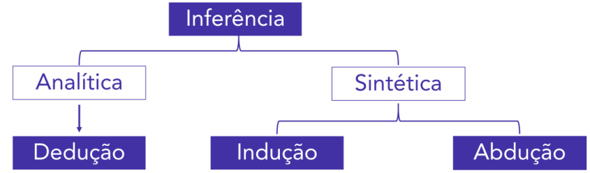

Vamos entender esses conceitos com mais detalhes. 

### Argumentos dedutivos 

Conforme já visto, os **argumentos dedutivos** são aqueles que **<u>não</u> produzem conhecimento novo** .  Isso significa que a informação presente na conclusão já estava presente nas premissas. 

Em regra, os **argumentos dedutivos** são aqueles que são objeto de estudo da **Lógica Formal** ou da **Lógica Proposicional** . 

Apesar dessa regra, podemos entender o conceito de **raciocínio dedutivo** para qualquer raciocínio que **parte de uma regra geral** para se analisar **casos particulares** . 

O **<u>raciocínio dedutivo</u>** utiliza-se de uma **regra geral** para se analisar **casos particulares** . 

**Somente** os **argumentos dedutivos** podem ser classificados como **válidos** ou **inválidos** . Lembre-se que: 

- Um **argumento** dedutivo é **<u>válido</u>** quando a **<u>conclusão</u>** é **<u>necessariamente verdadeira</u> quando se consideram as premissas verdadeiras** . 

- Um **argumento dedutivo** é **<u>inválido</u>** quando, **consideradas as premissas como verdadeiras** , a **<u>conclusão</u>** obtida é **<u>falsa</u>** . 

Por outro lado, como veremos em seguida, o juízo que se faz sobre argumentos construídos por **<u>indução</u>** ou por **<u>abdução</u>** é subjetivo, não sendo possível afirmar que sejam válidos ou inválidos.

---

<!-- pagina: 12 -->

**Equipe Exatas Estratégia Concursos Aula 06** 

### Argumentos indutivos 

#### **Definição de argumento indutivo** 

O **argumento indutivo** é aquele em que a **conclusão traz conhecimentos novos** que não estão presentes nas premissas, nem sequer de modo implícito. Em outras palavras, a conclusão **transcende as premissas** . 

Esse tipo de argumento parte de fatos apresentados nas premissas e chega em uma **conclusão** que estende esses fatos para um **<u>novo caso ou</u>** para **<u>todos os casos,</u>** por meio de uma **<u>generalização</u>** . 

**(TJDFT/2022)** “Quando se julga por indução e sem o necessário conhecimento dos fatos, às vezes chega-se a ser injusto até mesmo com os malfeitores.” 

O raciocínio abaixo que deve ser considerado como indutivo é: 

a) Os funcionários públicos folgam amanhã, por isso meu marido ficará em casa; b) Todos os juízes procuram julgar corretamente, por isso é o que ele também procura; c) Nos dias de semana os mercados abrem, por isso deixarei para comprar isso amanhã; d) No inverno, chove todos os dias, por isso vou comprar um guarda-chuva; e) Ontem nevou bastante, por isso as estradas devem estar intransitáveis. **Comentários:** Os **argumentos indutivos** partem de fatos apresentados nas premissas para se chegar em uma **conclusão** q ~~u~~ e estende esses fatos para um **<u>novo caso ou</u>** para **<u>todos os casos</u>** <u>, por meio de uma</u> **generalização** . Veja que essa generalização ocorre na **alternativa E** , pois o raciocínio parte de um caso particular relativo a " **ontem** " <u>(</u> **_<u>ontem</u> nevou bastante_** ) para estender esse fato para um **<u>novo caso</u>** relacionado ao **tempo presente** ( **_as estradas devem estar intransitáveis_** ). 

As **demais alternativas partem de uma realidade geral para uma realidade particular** . Logo, não são raciocínios indutivos. a) Parte-se de uma generalização ( **_os funcionários públicos folgam amanhã_** ) para o caso particular do marido de quem fala, que se pressupõe ser funcionário público ( **_meu marido ficará em casa_** ). b) Parte-se de uma generalização sobre os juízes ( **_todos os juízes procuram julgar corretamente_** ) para um caso particular ( **_é o que ele também procura_** ). c) Parte-se de uma generalização sobre o horário de funcionamento dos mercados ( **_nos dias de semana os mercados abrem_** ) para aplicá-la para o caso particular de amanhã ( **_deixarei para comprar isso amanhã_** ). d) Parte-se de uma generalização ( **_no inverno, chove todos os dias_** ) para uma decisão particular ( **_vou comprar um guarda-chuva_** ). **Gabarito: Letra E.**

---

<!-- pagina: 13 -->

**Equipe Exatas Estratégia Concursos Aula 06** 

**(SEDUC AM/2014)** Indução é um processo intelectual que parte de dados particulares, suficientemente constatados, para inferir uma verdade geral ou universal, que não estava contida nas partes examinadas. 

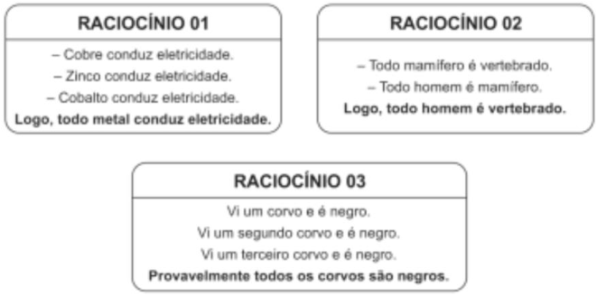

Considerando a definição dada, analise os raciocínios a seguir. ==5460== 

Assinale a opção que identifica corretamente exemplos de raciocínios indutivos. 

a) 1, 2 e 3. 

b) 1 e 2, somente. 

c) 1 e 3, somente. 

d) 2 e 3, somente. 

e) 3, somente. 

##### **Comentários:** 

Os **argumentos indutivos** , que são fruto de **raciocínios indutivos** , partem de fatos apresentados nas premissas para se chegar em uma **conclusão** que estende esses fatos para um **<u>novo caso ou</u>** para **<u>todos os casos</u>** <u>, por meio de uma</u> **<u>generalização</u>** . 

− 

Veja que o **Raciocínio 01** é **indutivo** , pois utiliza como **<u>premissas</u>** o fato de **metais específicos** conduzirem eletricidade ( **cobre** , **zinco** e **cobalto** ) para **<u>concluir</u>** <u>, por meio de uma</u> **<u>generalização</u>** , que **todos os metais conduzem eletricidade.** 

− 

Por outro lado, o **Raciocínio 02** é **dedutivo** . Isso porque a conclusão sugerida, " **_todo homem é vertebrado_** ", decorre imediatamente das premissas. Em outras palavras, **podemos obter a conclusão de maneira inequívoca por meio de Diagramas Lógicos** . Note que, ao desenharmos as premissas por meio de Diagramas Lógicos, a conclusão é necessariamente verdadeira. 

###### https://t.me/KakashiAssinaturasBot

---

<!-- pagina: 14 -->

**Equipe Exatas Estratégia Concursos Aula 06** 

##### _"_ **_Todo mamífero é vertebrado."_** 

Nesse caso, o conjunto dos mamíferos deve ser desenhado dentro do conjunto dos vertebrados. 

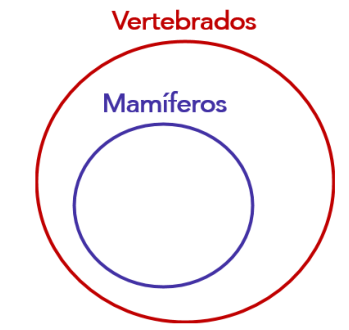

##### _"_ **_Todo homem é mamífero."_** 

Nesse caso, o conjunto dos homens deve ser desenhado dentro do conjunto dos mamíferos. 

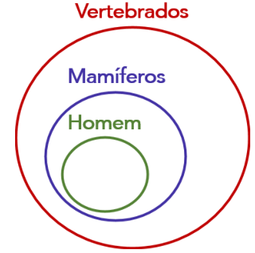

Note, portanto, que uma decorrência lógica das premissas é que " **_todo homem é vertebrado_** ", pois o conjunto dos homens necessariamente está dentro do conjunto dos vertebrados. 

− 

Por fim, o **Raciocínio 03** também é **indutivo** , pois utiliza como **<u>premissas</u>** algumas observações particulares quanto à cor dos corvos para **<u>concluir</u>** , por meio de uma **<u>generalização</u>** <u>, que</u> **existe uma probabilidade maior de que todos os corvos sejam negros** . 

Portanto, são exemplos de raciocínios indutivos **1 e 3, somente** . 

**Gabarito: Letra C.**

---

<!-- pagina: 15 -->

**Equipe Exatas Estratégia Concursos Aula 06** 

Argumentos indutivos **<u>não podem ser avaliados como válidos ou inválidos</u>** . O juízo que se faz sobre eles é subjetivo, podendo eles serem " **mais fortes** " ou " **mais fracos** " quando comparados. Consequentemente, chega-se a uma conclusão " **mais provável** " ou " **menos provável** ". Veja o exemplo a seguir: 

**Premissa 1** : Vi um cachorro comendo brócolis. 

**Premissa 2** : Vi dois cachorros comendo brócolis. 

**Premissa 3** : Vi três cachorros comendo brócolis. 

**Premissa 4** : Vi quatro cachorros comendo brócolis. 

**Premissa 5** : Vi cinco cachorros comendo brócolis. 

**Conclusão** : Logo, a maioria dos cachorros come brócolis. 

Veja que a conclusão traz um **conhecimento novo** não presente nas premissas: " **a maioria dos cachorros come brócolis** ". Perceba que as premissas nos induzem a crer que muitos dos cachorros comem brócolis, e tal **generalização** é obtida de informações particulares. 

Note, também, que a <u>inclusão de novas informações, como o aumento do número de observações de</u> cachorros comendo brócolis, poderia tornar o argumento "mais forte". Novas informações também poderiam tornar o argumento "mais fraco", pois alguém poderia dizer algo como: "Não é verdade! O meu cachorro e o cachorro do meu vizinho não comem brócolis!" 

Além da inclusão de novas informações nas premissas, a <u>alteração da conclusão</u> também pode tornar o argumento "mais forte" ou "mais fraco". No exemplo acima, se alterássemos a conclusão para " **mais de 20% dos cachorros comem brócolis** ", o argumento seria mais forte. Isso porque, ao se comparar com "a maioria dos cachorros", é mais provável que ao menos 20% dos cachorros comam brócolis. 

Perceba que um argumento " **mais forte** " ou " **mais fraco** " **nada nos diz sobre a validade da conclusão** . Com base nas premissas, **não podemos afirmar nem negar categoricamente** que "a maioria dos cachorros comem brócolis". 

Vejamos um outro exemplo de argumento indutivo: 

**Premissa 1** : 80% dos professores do Instituto de Tricô de Arapongas são mestres. 

**Premissa 2** : Fulano é professor do Instituto de Tricô de Arapongas. 

**Conclusão** : Logo, Fulano tem um mestrado. 

Perceba que o argumento acima **transcende o conteúdo das premissas** , pois Fulano pode ser parte dos 20% dos professores que não têm mestrado ou então pode realmente fazer parte dos 80% dos professores que têm um título de mestrado (mais provável). Além disso, o argumento parte de fatos apresentados nas premissas ("80% dos professores são mestres") para chegar em uma **conclusão** que estende o fato para um **<u>novo caso</u>** <u>.</u>

---

<!-- pagina: 16 -->

**Equipe Exatas Estratégia Concursos Aula 06** 

Perceba que, se alterássemos a primeira premissa para "50% dos professores do Instituto de Tricô de Arapongas são mestres", o novo argumento ficaria "mais fraco" do que o anterior, pois a <u>alteração da premissa faria com que a conclusão ficasse "menos provável".</u> 

**(SEFAZ SP/2002)** Assinale o argumento indutivo que estabelece sua conclusão de modo mais forte: 

a)Os livros em oferta custam entre 10 e 40 reais. Logo, este livro em oferta custa entre 20 e 30 reais. b)Os livros em oferta custam entre 10 e 40 reais. Logo, este livro em oferta custa entre 10 e 30 reais. c)Os livros em oferta custam entre 5 e 50 reais. Logo, este livro em oferta custa entre 20 e 25 reais. d)Os livros em oferta custam entre 10 e 50 reais. Logo, este livro em oferta custa entre 15 e 30 reais. 

e)Os livros em oferta custam entre 10 e 50 reais. Logo, este livro em oferta custa entre 10 e 20 reais. 

##### **Comentários:** 

Note que, em todos os argumentos apresentados nas alternativas, temos uma premissa da forma "os livros em oferta custam entre 𝒙 **e** 𝒚 **reais** " e uma conclusão no formato "este livro em oferta custa entre 𝒛 **e** 𝒘 **reais** ". 

Trata-se de um argumento indutivo, uma vez que a conclusão transcende o conteúdo das premissas. Para **determinar qual argumento é mais forte** , devemos observar qual das alternativas apresenta uma **conclusão mais provável em face à premissa apresentada** . Vamos analisar cada alternativa: 

**a)Os livros em oferta custam entre 10 e 40 reais. Logo, este livro em oferta custa entre 20 e 30 reais.** 

− Note que a premissa apresenta um intervalo de 40 10 = 30 reais, e a conclusão apresenta um intervalo de 30 − 20 = 10 reais. Logo, a conclusão **abrange** 10/30 = **1/3 do intervalo original** . 

**b)Os livros em oferta custam entre 10 e 40 reais. Logo, este livro em oferta custa entre 10 e 30 reais.** 

− Note que a premissa apresenta um intervalo de 40 10 = 30 reais, e a conclusão apresenta um intervalo de 30 − 10 = 20 reais. Logo, a conclusão **abrange** 20/30 = **2/3 do intervalo original** . 

**c)Os livros em oferta custam entre 5 e 50 reais. Logo, este livro em oferta custa entre 20 e 25 reais.** 

− Note que a premissa apresenta um intervalo de 50 5 = 45 reais, e a conclusão apresenta um intervalo de 25 − 20 = 5 reais. Logo, a conclusão **abrange** 5/45 = **1/9 do intervalo original** . 

**d)Os livros em oferta custam entre 10 e 50 reais. Logo, este livro em oferta custa entre 15 e 30 reais.** 

− Note que a premissa apresenta um intervalo de 50 10 = 40 reais, e a conclusão apresenta um intervalo de 30 − 15 = 15 reais. Logo, a conclusão **abrange** 15/40 = **3/8 do intervalo original** . 

**e)Os livros em oferta custam entre 10 e 50 reais. Logo, este livro em oferta custa entre 10 e 20 reais.** 

− Note que a premissa apresenta um intervalo de 50 10 = 40 reais, e a conclusão apresenta um intervalo de 20 − 10 = 10 reais. Logo, a conclusão **abrange** 10/40 = **1/4 do intervalo original** .

---

<!-- pagina: 17 -->

**Equipe Exatas Estratégia Concursos Aula 06** 

Note que **em B tem-se a conclusão mais provável** **<u>em face à premissa apresentada</u>** <u>, pois a conclusão dessa alternativa abrange a maior parte do intervalo considerado na premissa dessa alternativa. Isso porque 2/3 é</u> o maior número dentre as frações apresentadas: 

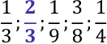

Para verificar que 2/3 é de fato o maior número, uma possibilidade é realizar a divisão do numerador pelo denominador: 

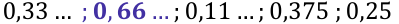

##### **Gabarito: Letra B.** 

Observe que o **argumento por indução** é **muito utilizado por ciências experimentais:** 

**Premissa 1:** **<u>Dois corpos A e B</u>** se atraem por uma força que é proporcional ao produto das massas e que é inversamente proporcional ao quadrado da distância entre eles. 

**Premissa 2:** **<u>Dois corpos C e D</u>** se atraem por uma força que é proporcional ao produto das massas e que é inversamente proporcional ao quadrado da distância entre eles. 

**Conclusão** : Logo, **<u>dois corpos quaisquer</u>** se atraem por uma força que é proporcional ao produto das massas e que é inversamente proporcional ao quadrado da distância entre eles. 

Perceba que as ciências experimentais observam casos particulares e formulam uma **conclusão ampliativa** , **transcendendo** o caso particular por meio de uma **generalização** . 

**(MPE SP/2011)** Dados os argumentos: 

I. Sejam a, b, c números naturais, onde a = b e b = c; logo a = c 

II. Num escritório; 5/6 dos funcionários têm nível superior; José é funcionário do escritório, logo José tem nível superior. 

Assinale a alternativa correta: 

a) Ambos são argumentos dedutivos 

b) O argumento I é um exemplo canônico de um argumento indutivo e o argumento II é um típico argumento dedutivo. 

c) O argumento II apenas estaria correto se fosse: "No escritório 5/6 dos funcionários tem nível superior; José é funcionário do escritório; logo José não é de nível superior. 

d) O argumento I é exemplo canônico de um argumento classificado como válido pela lógica dedutiva. O argumento II é um argumento que não é classificado como válido pela lógica dedutiva, denominado indutivo. 

##### **Comentários:** 

O **argumento I** é um argumento dedutivo. Trata-se de um argumento válido, pois as premissas, consideradas verdadeiras, levam a uma conclusão necessariamente verdadeira. Observe:

---

<!-- pagina: 18 -->

**Equipe Exatas Estratégia Concursos Aula 06** 

**Premissa 1** : a, b, c são números naturais. 

**Premissa 2** : a = b. **Premissa 3** : b = c. **Conclusão** : a = c 

O **argumento II** , por sua vez, **não pode ser classificado como válido** . Trata-se de um argumento indutivo. 

**Premissa 1** : "Num escritório; 5/6 dos funcionários têm nível superior." 

**Premissa 2** : "José é funcionário do escritório." 

**Conclusão** : "José tem nível superior." 

Perceba que nesse caso a conclusão **transcende o conteúdo das premissas** . 

**Gabarito: Letra D.** 

#### **Analogias** 

**Analogia** é um **<u>caso específico de argumento indutivo</u>** em que **características comuns são ressaltadas como forma de se realizar a indução** . Veja um exemplo: 

"Pessoas bilionárias acordam muito cedo todos os dias **,** fazem atividade física regularmente, leem muito e fazem sessões mensais de _coach_ empresarial. Joaquim acorda muito cedo todos os dias, faz atividade física regularmente, lê muito e faz sessões mensais de _coach_ empresarial. Concluo que Joaquim é bilionário." 

O argumento indutivo acima ressaltou diversas características presentes em pessoas bilionárias e em Joaquim como forma de induzir à conclusão apresentada. 

Veja que o argumento apresentado nos parece um tanto fraco pelo fato de as características apresentadas não serem tão relevantes para a conclusão a que se quer chegar. Isso porque a **<u>relevância das características comparadas</u>** influencia a força da analogia. Veja esse novo argumento: 

"Muitas pessoas bilionárias são acionistas majoritários de companhias lucrativas, trabalham no setor de tecnologia e sabem liderar equipes. Joaquim é acionista majoritário de uma companhia lucrativa, trabalha no setor de tecnologia e sabe liderar equipes. Concluo que Joaquim é bilionário." 

Note que "ser acionista majoritário de uma companhia lucrativa", "trabalhar no setor de tecnologia" e "saber liderar equipes" são características mais relevantes para a conclusão que se quer obter. Logo, o argumento por analogia acima é "mais forte" do que o apresentado anteriormente. 

Outro fator que pode tornar uma nova analogia "mais forte" ou "mais fraca" com relação à anterior é a **<u>força da conclusão com relação às premissas</u>** <u>:</u>

---

<!-- pagina: 19 -->

**Equipe Exatas Estratégia Concursos Aula 06** 

"Muitas pessoas bilionárias são acionistas majoritários de companhias lucrativas, trabalham no setor de tecnologia e sabem liderar equipes. Joaquim é acionista majoritário de uma companhia lucrativa, trabalha no setor de tecnologia e sabe liderar equipes. **Concluo que Joaquim não é** **<u>pobre</u>** ." 

Perceba que a conclusão "Joaquim não é pobre" é mais provável do que "Joaquim é bilionário", tornando o argumento mais forte. 

O argumento indutivo por analogia é muito utilizado no dia a dia. Observe: 

"Há cinco anos, comprei o carro A da fabricante X, o qual nunca apresentou problemas de manutenção. Recentemente, a fabricante X lançou um novo modelo B. Vou trocar meu carro <u>pelo modelo B, pois este automóvel não deverá apresentar problemas de manutenção."</u> 

Veja que ambos os modelos de automóvel, A e B, apresentam a característica comum de terem sido fabricados pela fabricante X e que o interlocutor tem conhecimento, por sua própria experiência, que o modelo A nunca apresentou problemas quanto à manutenção. Em razão disso, infere, **<u>por analogia</u>** <u>, que o</u> modelo B, recentemente lançado pela mesma fabricante, não trará problemas quanto à manutenção. 

Perceba que **<u>o número de comparações realizadas</u>** também afeta a força da analogia. Veja o exemplo a seguir: 

"Há cinco anos, comprei um carro do modelo A, produzido pela fabricante X, o qual nunca apresentou problemas de manutenção. <u>Tenho três amigos que têm carros produzidos pela mesma fabricante e nunca tiveram problemas de manutenção. Recentemente, a fabricante X</u> lançou um novo modelo B. Vou trocar meu carro pelo modelo B, pois este automóvel não deverá apresentar problemas de manutenção." 

Perceba que a inclusão da informação de que outras três pessoas compraram um carro da fabricante X faz com que a analogia seja "mais forte", pois há um maior número de comparações. 

Outro fator que pode tornar uma analogia mais forte ou mais fraca é **<u>a quantidade de características comparadas</u>** <u>.</u> 

"Há cinco anos, comprei o carro A, da <u>fabricante X, na concessionária Y</u> e esse carro nunca apresentou problemas de manutenção. Tenho três amigos que também adquiriram automóveis da mesma <u>fabricante X, na concessionária Y,</u> e nunca tiveram problemas. Recentemente, a fabricante X lançou um novo modelo de automóvel B. Vou na concessionária Y trocar o meu carro A pelo modelo B, <u>pois este automóvel não deverá apresentar problemas de manutenção."</u> 

Perceba que a inclusão de uma nova característica para integrar a comparação aumenta o grau de persuasão do argumento, tornando a analogia "mais forte".

---

<!-- pagina: 20 -->

**Equipe Exatas Estratégia Concursos Aula 06** 

Por fim, o **<u>número de pontos de diferença (desanalogias)</u>** entre os exemplos mencionados é outro ponto que modifica a força do argumento. Veja o novo exemplo a seguir: 

"Não compre automóveis do fabricante X. Conheço três pessoas que compraram carros deste fabricante que apresentaram problemas de manutenção" 

Se, no argumento acima, acrescentarmos a informação de que se trata de um modelo de carro específico, e que os três amigos compraram este mesmo modelo, as novas informações reduzem a força do argumento. Isso porque, eventualmente, quem procura um automóvel pode estar interessado em modelo ou categoria diversa daquele referido. 

Outra desanalogia que enfraqueceria o argumento ocorreria se incluíssemos a informação de que uma quarta pessoa comprou um carro do fabricante X, o qual jamais apresentou problemas de manutenção. 

**(FUNPRESP/2016)** Acerca dos argumentos racionais, julgue o item a seguir. 

No diálogo a seguir, a resposta de B é fundamentada em um raciocínio por analogia. 

A: O que eu faço para ser rico assim como você? 

B: Como você sabe, eu não nasci rico. Eu alcancei o padrão de vida que tenho hoje trabalhando muito duro. Logo, você também conseguirá ter esse padrão de vida trabalhando muito duro. 

##### **Comentários:** 

Perceba que B apresenta uma característica em comum com a A: " **<u>não nascer rico</u>** ". 

Nota-se que, por meio dessa característica, B faz uma **indução por analogia** ao afirmar que A também "conseguirá ser rico trabalhando muito". 

**Gabarito: CERTO.** 

### Argumentos abdutivos 

No **argumento por abdução** , a conclusão obtida representa a melhor explicação para os fatos enunciados <u>nas premissas. Trata-se de uma</u> **hipótese explicativa** . 

O exemplo citado por C.S. Peirce1 mostra bem a diferença entre os argumentos por **dedução** , por **indução** e por **abdução** . Considere as seguintes proposições: 

**P1:** "Todos os feijões do saco são brancos." 

**P2:** "Todos os feijões da mesa vieram do saco." 

**P3:** "Todos os feijões da mesa são brancos." 

- 1 PEIRCE, C. S. **Collected papers of Charles Sanders Peirce.** Elements of logic, Volume II. Harvard University Press. 1932.

---

<!-- pagina: 21 -->

**Equipe Exatas Estratégia Concursos Aula 06** 

No **argumento por dedução** **<u>não se produz conhecimento novo</u>** . Se as premissas são tratadas como verdadeiras, o argumento válido apresenta uma conclusão verdadeira. Veja que o argumento abaixo pode ser deduzido com o uso de diagramas lógicos: 

##### **<u>Argumento por dedução</u>** 

**Premissa P1:** Todos os feijões do saco são brancos. 

**Premissa P2:** Todos os feijões da mesa vieram do saco. 

**Conclusão P3:** Todos os feijões da mesa são brancos. 

O **argumento por indução** traz uma conclusão que **transcende** o conteúdo das premissas, estendendo o caso das premissas para um **novo caso** **<u>ou</u> generalizando para todos os casos** : 

##### **<u>Argumento por indução</u>** 

**Premissa P2:** Todos os feijões da mesa vieram do saco. 

**Premissa P3:** Todos os feijões da mesa são brancos. 

**Conclusão P1:** Todos os feijões do saco são brancos. 

No **argumento por abdução,** a conclusão é obtida por melhor representar a explicação dos fatos enunciados <u>nas premissas.</u> 

##### **<u>Argumento por abdução</u>** 

**Premissa P1:** Todos os feijões do saco são brancos. 

**Premissa P3:** Todos os feijões da mesa são brancos. 

**Conclusão P2:** Todos os feijões da mesa vieram do saco. 

Argumentos por abdução também **<u>não podem ser avaliados como válidos ou inválidos</u>** . O juízo que se faz sobre eles é subjetivo, podendo serem considerados " **mais fortes** " ou " **mais fracos** " quando novas informações forem introduzidas. Veja um novo exemplo: 

"Pedro foi diagnosticado com uma doença cardíaca há 5 anos. Hoje, Pedro faleceu. Portanto, <u>pode-se supor que Pedro morreu em decorrência de sua doença cardíaca.</u> 

Note que o argumento apresentado mostra uma conclusão que representa a melhor explicação para os fatos <u>enunciados nas premissas. Se incluíssemos a informação de que, no dia anterior ao falecimento, Pedro havia</u> relatado dores no peito, a hipótese explicativa exposta na conclusão seria "mais provável", tornando o argumento "mais forte".  Por outro lado, caso incluíssemos a informação de que Pedro tinha outras comorbidades além da sua doença cardíaca, tal fato tornaria o argumento "mais fraco".

---

<!-- pagina: 22 -->

**Equipe Exatas Estratégia Concursos Aula 06** 

**(FUNPRESP/2016)** Acerca dos argumentos racionais, julgue o item a seguir. 

O texto que se segue, produzido por um detetive durante uma investigação criminal, ilustra um raciocínio por indução. 

Ontem uma senhora rica foi assassinada em sua casa. No momento do crime, havia uma festa na casa da vítima e nela estavam presentes umas cinquenta pessoas. Dessas cinquenta, é sabido que nove tinham algum tipo de problema com a senhora assassinada. Assim, é plausível supor que o assassino esteja entre essas nove pessoas. 

##### **Comentários:** 

A questão trouxe um **argumento por abdução** cuja a conclusão representa a melhor explicação para os fatos <u>enunciados nas premissas. Trata-se de uma</u> **hipótese explicativa** . 

##### **Gabarito: ERRADO.** 

### Diferença entre dedução, indução e abdução segundo C.S. Peirce 

Até o momento, chamamos de **premissa** todas aquelas afirmações ou fatos a partir dos quais uma conclusão é obtida. Conforme já visto: 

**<u>Premissa</u>** é uma declaração, uma afirmação ou um fato a partir do qual uma conclusão é construída. 

Além disso, tratamos como **conclusão** todo aquele julgamento que é obtido em um argumento: 

**<u>Conclusão</u>** é uma afirmação ou um julgamento resultante da relação entre uma ou mais razões apresentadas. 

A partir desse momento, **vamos redefinir esses conceitos para mostrar a diferença entre dedução** , **indução e abdução conforme nos ensina C.S. Peirce****1** . Considere o seguinte **argumento dedutivo** : 

##### **<u>Argumento por dedução</u>** 

**Premissa P1:** Todos os feijões do saco são brancos. 

**Premissa P2:** Todos os feijões da mesa vieram do saco. 

**Conclusão P3:** Todos os feijões da mesa são brancos. 

A partir desse argumento dedutivo: 

- Chamaremos a premissa " **_todos os feijões do saco são brancos_** " de **regra** , pois se trata de uma **generalização** . 

- Por outro lado, " **_todos os feijões da mesa vieram do saco_** " será chamada de **hipótese** (ou **premissa** propriamente dita). 

- Por fim, " **_todos os feijões da mesa são brancos_** _"_ é a **conclusão obtida por meio de um argumento dedutivo** .

---

<!-- pagina: 23 -->

**Equipe Exatas Estratégia Concursos Aula 06** 

Podemos dizer que na **<u>dedução</u>** tem-se uma **generalização** ( **regra** ) e uma **hipótese** ( **premissa** ) e, por meio delas, chega-se a uma **conclusão** . 

##### **<u>Argumento por dedução</u>** 

**Generalização** / **Regra** : Todos os feijões do saco são brancos. 

**Hipótese** / **Premissa** : Todos os feijões da mesa vieram do saco. 

**Conclusão** : Todos os feijões da mesa são brancos. 

Na **<u>indução</u>** tem-se uma **hipótese** ( **premissa** ) e uma **conclusão** e, por meio delas, chega-se a uma **generalização** ( **regra** ). 

##### **<u>Argumento por indução</u>** 

**Hipótese** / **Premissa:** Todos os feijões da mesa vieram do saco. 

**Conclusão:** Todos os feijões da mesa são brancos. 

**Generalização** <u>/</u> **Regra:** Todos os feijões do saco são brancos. 

Por fim, na **<u>abdução</u>** <u>, tem-se uma</u> **generalização** ( **regra** ) e uma **conclusão** e, por meio delas, chega-se a uma **hipótese** ( **premissa** ). 

##### **<u>Argumento por abdução</u>** 

**Generalização** / **Regra:** Todos os feijões do saco são brancos. 

**Conclusão:** Todos os feijões da mesa são brancos. 

**Hipótese** <u>/</u> **Premissa:** Todos os feijões da mesa vieram do saco. 

Destaco que essa distinção entre **Hipótese** / **Premissa** e **Generalização** / **Regra** é um tanto polêmica, pois nem sempre teremos um argumento em que será fácil determinar o que é a regra e o que é a hipótese. Além disso, conforme visto ao longo da teoria, a **conclusão** de um argumento costuma ser entendida como tudo aquilo que se extrai das premissas, de modo que " **_todos os feijões da mesa vieram do saco_** " pode ser entendida como a conclusão do argumento por abdução. 

Apesar da crítica exposta, é necessário que você entenda que a diferença entre **dedução** , **indução** e **abdução** consiste no seguinte: 

- Na **dedução** , tem-se uma **generalização** ( **regra** ) e uma **hipótese** ( **premissa** ) e, por meio delas, chegase a uma **conclusão** ; 

- Na **indução** , tem-se uma **hipótese** ( **premissa** ) e uma **conclusão** e, por meio delas, chega-se a uma **generalização** ( **regra** ).

---

<!-- pagina: 24 -->

**Equipe Exatas Estratégia Concursos Aula 06** 

- Na abdução, tem-se uma **generalização** ( **regra** ) e uma **conclusão** e, por meio delas, chega-se a uma **hipótese** ( **premissa** ). 

**(MGS/2022)** Em lógica, pode-se dizer os 3 tipos de raciocínio são: dedução, indução e abdução. Se for dada uma premissa, uma conclusão e uma regra pela qual a premissa implica a conclusão, então podemos dizer que: 

a) dedução corresponde a determinar a regra 

- b) indução corresponde a determinar a conclusão 

- c) abdução corresponde a determinar a premissa 

- d) indução corresponde a determinar a premissa **Comentários:** 

Conforme o que acabamos de aprender: 

- Dedução corresponde a determinar a **conclusão** ; 

- Indução corresponde a determinar a **generalização** / **regra** ; 

- Abdução corresponde a determinar a **hipótese** / **premissa** . 

Portanto, pode-se dizer que **abdução corresponde a determinar a premissa** . **Gabarito: Letra C.**

---

<!-- pagina: 25 -->

**Equipe Exatas Estratégia Concursos Aula 06** 

# **– QUESTÕES COMENTADAS FGV** 

## Argumentos: estrutura básica e classificação 

Pessoal, a FGV tem o costume de cobrar esses assuntos de **Raciocínio Crítico** na disciplina de **Língua Portuguesa** , como interpretação de texto. Por esse motivo, grande parte das questões dessa bateria foram originalmente cobradas em provas de Português. 

**<mark>(FGV/PC AM/2022) Identifique o trecho a seguir que apresenta a estrutura de uma premissa levando a uma conclusão.</mark>** 

a) Ouvi o barulho de um gambá na cozinha; a cozinheira deve ter deixado o pote de ração dos gatos no chão. 

b) Todos já devem ter chegado à festa, porque ninguém mais telefonou, reclamando do atraso. 

c) Nossos amigos possivelmente vão ser aprovados no concurso, já que estudaram bastante tempo. 

d) Talvez as encomendas cheguem a tempo, pois partiremos depois de amanhã. 

e) O lixeiro deve estar passando em nossa porta; senti um odor de coisa podre. 

##### **Comentários:** 

Para resolver essa questão, é interessante retomarmos o conceito de **premissa** e o conceito de **conclusão** : 

**<u>Premissa</u>** é uma declaração, uma afirmação ou um **<u>fato</u>** a partir do qual uma conclusão é construída. 

**<u>Conclusão</u>** é uma afirmação ou um **<u>julgamento</u>** resultante da relação entre uma ou mais razões apresentadas. 

Note, portanto, que a **premissa** é um **<u>fato</u>** que deve ser tomado por verdade para se chegar a uma **conclusão** , que é um **<u>julgamento</u>** <u>.</u> 

Vamos analisar cada uma das alternativas. 

**a) Ouvi o barulho de um gambá na cozinha; a cozinheira deve ter deixado o pote de ração dos gatos no chão. CERTO** .

---

<!-- pagina: 26 -->

**Equipe Exatas Estratégia Concursos Aula 06** 

Veja que **_"ouvi o barulho de um gambá na cozinha"_** é um fato que deve ser tomado por verdade para se chegar à conclusão de que " **_a cozinheira deve ter deixado o pote de ração dos gatos no chão_** ". 

Note, ainda, que temos um **argumento por abdução** . Isso porque a conclusão " **_a cozinheira deve ter deixado o pote de ração dos gatos no chão_** " é uma **<u>hipótese explicativa</u>** <u>, pois representa a melhor explicação para o fato enunciado na premissa.</u> 

Como **inicialmente temos uma premissa que leva a uma conclusão subsequente** , **essa alternativa é o gabarito** da questão. 

##### **b) Todos já devem ter chegado à festa, porque ninguém mais telefonou, reclamando do atraso. ERRADO** . 

Veja que **_"_ ninguém mais telefonou, reclamando do atraso** **_"_** é um fato que deve ser tomado por verdade para se chegar à conclusão de que " **_todos já devem ter chegado à festa_** ". 

Note, ainda, que temos um **argumento por abdução** . Isso porque a conclusão " **_todos já devem ter chegado à festa_** " é uma **<u>hipótese explicativa</u>** , pois representa a melhor explicação para o fato enunciado na premissa. 

##### Como **a conclusão é apresentada antes da premissa** , essa **alternativa** **<u>não é o gabarito da questão</u>** . 

##### **c) Nossos amigos possivelmente vão ser aprovados no concurso, já que estudaram bastante tempo. ERRADO** . 

Veja que **_"(nossos amigos)_ estudaram bastante tempo** **_"_** é um fato que deve ser tomado por verdade para se chegar à conclusão de que " **_nossos amigos possivelmente vão ser aprovados no concurso_** ". 

Note, ainda, que temos um **argumento por indução** . Isso porque a conclusão " **_nossos amigos possivelmente vão ser aprovados no concurso_** " é uma **<u>generalização</u>** feita a partir do caso particular de que **_"(nossos " amigos)_ estudaram bastante tempo** _._ 

Como **a conclusão é apresentada antes da premissa** , essa **alternativa** **<u>não é o gabarito da questão</u>** . 

##### **d) Talvez as encomendas cheguem a tempo, pois partiremos depois de amanhã. ERRADO** . 

Veja que **_"partiremos depois de amanhã"_** é um fato que deve ser tomado por verdade para se chegar à conclusão de que " **_talvez as encomendas cheguem a tempo_** ". 

Apesar de não parecer que a premissa dá suporte à defesa da conclusão, note que " **_talvez as encomendas cheguem a tempo_** " **é um julgamento** feito no argumento apresentado, uma vez que a palavra "talvez" indica uma probabilidade. Logo, " **_talvez as encomendas cheguem a tempo_** " é a **conclusão** . 

##### Como **a conclusão é apresentada antes da premissa** , essa **alternativa** **<u>não é o gabarito da questão</u>** . 

##### **e) O lixeiro deve estar passando em nossa porta; senti um odor de coisa podre. ERRADO** . 

Veja que **_"senti um odor de coisa podre"_** é um fato que deve ser tomado por verdade para se chegar à conclusão de que " **_o lixeiro deve estar passando em nossa porta_** ".

---

<!-- pagina: 27 -->

**Equipe Exatas Estratégia Concursos Aula 06** 

Note, ainda, que temos um **argumento por abdução** . Isso porque a conclusão " **_o lixeiro deve estar passando em nossa porta_** " é uma **<u>hipótese explicativa</u>** , pois representa a melhor explicação para o fato enunciado na <u>premissa.</u> 

##### Como **a conclusão é apresentada antes da premissa** , essa **alternativa** **<u>não é o gabarito da questão</u>** . 

##### **Gabarito: Letra A.** 

**<mark>(FGV/PC AM/2022) Assinale a frase a seguir que se apoia em um raciocínio indutivo.</mark>** 

a) Os turistas amam curiosidades, daí que um bom guia tenha um bom estoque delas em seu repertório. 

b) Um filme de terror como este pode causar impactos graves em pessoas mais sensíveis, daí ser bom evitálos. 

c) Os livros são ótimos companheiros, por isso acabo de comprar um para me fazer companhia no final de semana. 

d) Os novos celulares são miniaturas de computadores; em função disso, algumas empresas investem em programas cada vez mais complicados. 

e) As eleições são o ponto mais alto do processo democrático; as próximas vão ser ferrenhamente disputadas. 

##### **Comentários:** 

Os **argumentos indutivos** partem de fatos apresentados nas premissas para se chegar em uma **conclusão** que estende esses fatos para um **<u>novo caso ou</u>** para **<u>todos os casos</u>** <u>, por meio de uma</u> **generalização** . 

Veja que essa generalização ocorre na **alternativa B** , pois o raciocínio parte de um caso particular ( **_um filme de terror_** **_<u>como este</u> pode causar impactos graves em pessoas mais sensíveis_** ) para realizar uma **generalização** para todos os filmes de terror ( **_ser bom evitá-los_** ). 

As **demais alternativas partem de uma realidade geral para uma realidade particular** . Logo, não são raciocínios indutivos. 

a) Parte-se de uma generalização ( **_os turistas amam curiosidades_** ) para um caso particular ( **_um bom guia tenha um bom estoque delas em seu repertório_** ). Veja que, dentro da realidade dos turistas, "um bom guia" ter um bom estoque de curiosidades é um caso específico dentro da realidade geral de os turistas amarem curiosidades. 

b) Parte-se de uma generalização ( **_os livros são ótimos companheiros_** ) para um caso particular ( **_acabo de comprar um para me fazer companhia no final de semana_** ). 

d) Parte-se de uma realidade geral relacionada a computadores ( **_os novos celulares são miniaturas de computadores_** ) para uma realidade particular dentro do universo de computadores ( **_algumas empresas investem em programas cada vez mais complicados_** ).

---

<!-- pagina: 28 -->

**Equipe Exatas Estratégia Concursos Aula 06** 

e) Parte-se de uma generalização sobre as eleições ( **_as eleições são o ponto mais alto do processo democrático_** ) para um caso particular sobre as próximas eleições ( **_as próximas vão ser ferrenhamente disputadas_** ). 

##### **Gabarito: Letra B.** 

**<mark>(FGV/TJDFT/2022) “Quando se julga por indução e sem o necessário conhecimento dos fatos, às vezes chega-se a ser injusto até mesmo com os malfeitores.”</mark>** 

**O raciocínio abaixo que deve ser considerado como indutivo é:** 

a) Os funcionários públicos folgam amanhã, por isso meu marido ficará em casa; 

b) Todos os juízes procuram julgar corretamente, por isso é o que ele também procura; 

<!-- Start of picture text -->
==5460== <!-- End of picture text -->

c) Nos dias de semana os mercados abrem, por isso deixarei para comprar isso amanhã; 

d) No inverno, chove todos os dias, por isso vou comprar um guarda-chuva; 

e) Ontem nevou bastante, por isso as estradas devem estar intransitáveis. 

##### **Comentários:** 

Os **argumentos indutivos** partem de fatos apresentados nas premissas para se chegar em uma **conclusão** que estende esses fatos para um **<u>novo caso ou</u>** para **<u>todos os casos</u>** <u>, por meio de uma</u> **generalização** . 

Veja que essa generalização ocorre na **alternativa E** , pois o raciocínio parte de um caso particular relativo a " **ontem** " <u>(</u> **_<u>ontem</u> nevou bastante_** ) para estender esse fato para um **<u>novo caso</u>** relacionado ao **tempo presente** ( **_as estradas devem estar intransitáveis_** ). 

As **demais alternativas partem de uma realidade geral para uma realidade particular** . Logo, não são raciocínios indutivos. 

a) Parte-se de uma generalização ( **_os funcionários públicos folgam amanhã_** ) para o caso particular do marido de quem fala, que se pressupõe ser funcionário público ( **_meu marido ficará em casa_** ). 

b) Parte-se de uma generalização sobre os juízes ( **_todos os juízes procuram julgar corretamente_** ) para um caso particular ( **_é o que ele também procura_** ). 

c) Parte-se de uma generalização sobre o horário de funcionamento dos mercados ( **_nos dias de semana os mercados abrem_** ) para aplicá-la para o caso particular de amanhã ( **_deixarei para comprar isso amanhã_** ). 

d) Parte-se de uma generalização ( **_no inverno, chove todos os dias_** ) para uma decisão particular ( **_vou comprar um guarda-chuva_** ). 

##### **Gabarito: Letra E.** 

**<mark>(FGV/PC RJ/2021) Os raciocínios dos textos argumentativos ora se apoiam no método indutivo – do particular para o geral – ora no método dedutivo – do geral para o particular.</mark>** 

---

<!-- pagina: 29 -->

**Equipe Exatas Estratégia Concursos Aula 06** 

##### **A frase que exemplifica o método indutivo é:** 

a) Os jogos do Campeonato Brasileiro já deveriam ser abertos ao público, pois, assim, haveria mais emoção e incentivo; o Atlético Mineiro, por exemplo, obteria ainda melhor resultado ontem, se a torcida estivesse na arquibancada; 

b) O hospital Getúlio Vargas atendeu ontem um número excessivo de emergências e enfrentou as dificuldades oriundas da falta de pessoal, mas, na verdade, os hospitais públicos, em todas as grandes cidades, estão passando por isso; 

c) As livrarias estão fechando as portas em muitos lugares, em função da substituição dos livros pela mídia digital; a livraria de um shopping no centro da cidade resiste ainda porque, espertamente, abriu um café dentro da loja; 

d) O circo deixou de existir, pelo menos nos grandes centros, já que não encontra mais espaço nem nos terrenos nem no coração das pessoas; um pequeno circo ainda está presente no subúrbio de Realengo, onde as crianças se divertem com o palhaço Cascão; 

e) Nem todos os divertimentos eletrônicos custam caro, já que há pequenos produtores que investem em games mais simples e mais baratos, como no caso do Pequena Batalha. 

##### **Comentários:** 

Os **argumentos indutivos** partem de fatos apresentados nas premissas para se chegar em uma **conclusão** que estende esses fatos para um **<u>novo caso ou</u>** para **<u>todos os casos</u>** <u>, por meio de uma</u> **generalização** . 

Veja que essa generalização ocorre na **alternativa B** , pois o raciocínio parte de um caso particular relativo a um hospital público ( **_o hospital Getúlio Vargas atendeu ontem um número excessivo de emergências e enfrentou as dificuldades oriundas da falta de pessoal_** ) para realizar uma **generalização** para todos os hospitais públicos de grandes cidades ( **_os hospitais públicos, em todas as grandes cidades, estão passando por isso_** ). 

As **demais alternativas partem de uma realidade geral para uma realidade particular** . Logo, não são raciocínios indutivos. 

a) Parte-se de uma generalização sobre os jogos do Campeonato Brasileiro ( **_os jogos do Campeonato Brasileiro já deveriam ser abertos ao público_** ) para o caso particular do Atlético Mineiro ( **_o Atlético Mineiro, por exemplo, obteria ainda melhor resultado ontem, se a torcida estivesse na arquibancada_** ). 

c) Parte-se de uma generalização sobre o fechamento de livrarias ( **_as livrarias estão fechando as portas em muitos lugares, em função da substituição dos livros pela mídia digital_** ) para apresentar uma exceção de uma livraria específica ( **_a livraria de um shopping no centro da cidade resiste ainda porque, espertamente, abriu um café dentro da loja_** ). 

d) Parte-se de uma generalização os circos ( **_o circo deixou de existir, pelo menos nos grandes centros, já que não encontra mais espaço nem nos terrenos nem no coração das pessoas_** ) para apresentar uma exceção de um circo específico ( **_um pequeno circo ainda está presente no subúrbio de Realengo, onde as crianças se divertem com o palhaço Cascão_** ).

---

<!-- pagina: 30 -->

**Equipe Exatas Estratégia Concursos Aula 06** 

e) Parte-se de uma generalização sobre divertimentos eletrônicos ( **_nem todos os divertimentos eletrônicos custam caro_** ) para apresentar um exemplo específico ( **_há pequenos produtores que investem em games mais simples e mais baratos, como no caso do Pequena Batalha_** ). 

##### **Gabarito: Letra B.** 

**<mark>(FGV/CM Aracaju/2021) “O livro de Laurentino Gomes sobre a escravidão é de dimensão agradável e de preço acessível, por isso deve vender bastante."</mark>** 

##### **A conclusão desse raciocínio:** 

a) se apoia num processo dedutivo; 

b) deriva de uma premissa falsa; 

- c) surge a partir de uma generalização; 

- d) estrutura-se a partir de uma indução; 

- e) mostra-se como fruto de um testemunho de autoridade. 

##### **Comentários:** 

No raciocínio apresentado, temos a premissa " **_o livro de Laurentino Gomes sobre a escravidão é de dimensão agradável e de preço acessível_** " e a conclusão " **_(o livro) deve vender bastante_** ". 

Note que o raciocínio parte de **características específicas do livro** , indicadas pelas expressões _"_ **_dimensão agradável_** _"_ e _"_ **_preço acessível_** _"_ , para trazer uma **generalização sobre o livro** : " **_(o livro) deve vender bastante_** ". Logo, a conclusão desse raciocínio estrutura-se a partir de uma **indução** . O **gabarito** , portanto, é **letra D** . 

Note que as demais alternativas estão incorretas. 

A **alternativa A** erra ao dizer que a conclusão se apoia em um processo dedutivo, pois **não** se parte de uma generalização para se chegar em uma conclusão particular. 

A **alternativa B** está errada, pois não há elementos para se verificar a veracidade da premissa " **_o livro de Laurentino Gomes sobre a escravidão é de dimensão agradável e de preço acessível_** ". 

A **alternativa C** também está errada, pois sugere que o raciocínio é dedutivo, assim como na alternativa A. 

Por fim, a **alternativa E** apresenta uma certa "pegadinha". Veja que **a suposta autoridade** , " **Laurentino Gomes** ", **não é usada para defender a conclusão** de que o livro deve vender bastante. Em outras palavras, a referência a Laurentino Gomes não é utilizada para se comprovar a conclusão. 

##### **Gabarito: Letra D.**

---

<!-- pagina: 31 -->

**Equipe Exatas Estratégia Concursos Aula 06** 

**<mark>(FGV/TCE-AM/2021) Um teólogo russo, V. S. Soloviev, declarou: “Sinto vergonha, logo existo”.</mark>** 

##### **A afirmação INADEQUADA sobre essa frase:** 

a) é parte de um silogismo em que falta a conclusão; 

- b) mostra intertextualidade com uma frase famosa; 

- c) emite uma opinião pessoal do seu autor; 

- d) exemplifica um texto de caráter argumentativo; 

e) não traz as duas premissas de um silogismo. 

##### **Comentários:** 

Note que, no argumento em questão, temos uma **única premissa** e uma **única conclusão** , introduzida pela palavra " **logo** ": 

**Premissa** : Sinto vergonha. 

**Conclusão:** Existo. 

Veja que, para que tivéssemos um **silogismo** de forma a obter um **argumento dedutivo válido** , seria necessário incluir a premissa maior " **_Todos que sentem vergonha, existem_** ". Veja que, nesse caso, a conclusão poderia ser obtida de modo inequívoco por meio de diagramas lógicos: 

**Premissa 1** : Todos que sentem vergonha, existem. 

**Premissa 2** : Sinto vergonha. 

**Conclusão:** Existo. 

Vamos avaliar as alternativas da questão, lembrando que devemos marcar a alternativa que apresenta uma **afirmação inadequada** . 

##### **a) é parte de um silogismo em que falta a conclusão. Afirmação ERRADA** . **<u>Esse é o gabarito</u>** . 

A conclusão da declaração original é " **existo** ", introduzida pela palavra " **logo** ". 

##### **b) mostra intertextualidade com uma frase famosa. CERTO.** 

A frase famosa que está correlacionada à declaração do teólogo russo V. S. Soloviev é “ **Penso, logo existo** ”, dita pelo filósofo francês René Descartes. 

##### **c) emite uma opinião pessoal do seu autor. CERTO.** 

De fato, a declaração “Sinto vergonha, logo existo” emite uma opinião pessoal do teólogo russo V. S. Soloviev. 

##### **d) exemplifica um texto de caráter argumentativo. CERTO.** 

A frase exemplifica um texto de caráter argumentativo, por apresenta uma **premissa** que dá suporte à defesa de uma **conclusão** .

---

<!-- pagina: 32 -->

**Equipe Exatas Estratégia Concursos Aula 06** 

##### **e) não traz as duas premissas de um silogismo. CERTO.** 

Para que a frase fosse considerada um **silogismo** , seria necessário apresentar a premissa maior " **_Todos que sentem vergonha, existem_** ". 

##### **Gabarito: Letra A.** 

**<mark>(FGV/TRT 12ª Região/2017) Sempre que passamos diretamente de uma premissa a uma conclusão, consideramos verdadeira uma ideia intermediária. Nos conjuntos abaixo, aquele que mostra uma conclusão antes da premissa é:</mark>** 

a) O chão do restaurante está escorregadio. / Alguém derramou azeite no chão. 

b) Meu filho está se vestindo. / Meu filho vai sair. 

c) Não vou poder escrever a carta. / Meu computador apresentou defeito. 

d) A luz apagou na cidade. / Um acidente deve ter derrubado um transformador. 

e) Meu time ganhou o jogo de ontem. / Meu time é o melhor do campeonato. 

##### **Comentários:** 

Para resolver essa questão, é interessante retomarmos o conceito de **premissa** e o conceito de **conclusão** : 

**<u>Premissa</u>** é uma declaração, uma afirmação ou um fato a partir do qual uma conclusão é construída. 

**<u>Conclusão</u>** é uma afirmação ou um julgamento resultante da relação entre uma ou mais razões apresentadas. 

Note, portanto, que a **premissa** é um **<u>fato</u>** que deve ser tomado por verdade para se chegar a uma **conclusão** , que é um **<u>julgamento</u>** <u>.</u> 

Vamos analisar cada uma das alternativas. 

##### **a) O chão do restaurante está escorregadio. / Alguém derramou azeite no chão. ERRADO.** 

Veja que **_"o chão do restaurante está escorregadio"_** é um fato que deve ser tomado por verdade para se chegar à conclusão de que " **_alguém derramou azeite no chão_** ". 

Note, ainda, que temos um **argumento por abdução** . Isso porque a conclusão " **_alguém derramou azeite no chão_** " é uma **<u>hipótese explicativa</u>** , pois representa a melhor explicação para o fato enunciado na premissa. 

Como **a conclusão não é apresentada antes da premissa** , essa alternativa **não é o gabarito** da questão. 

##### **b) Meu filho está se vestindo. / Meu filho vai sair. ERRADO.**

---

<!-- pagina: 33 -->

**Equipe Exatas Estratégia Concursos Aula 06** 

Veja que **_"meu filho está se vestindo"_** é um fato que deve ser tomado por verdade para se chegar à conclusão de que " **_meu filho vai sair_** ". 

Note, ainda, que temos um **argumento por abdução** . Isso porque a conclusão " **_meu filho vai sair_** " é uma **<u>hipótese explicativa</u>** <u>, pois representa a melhor explicação para o fato enunciado na premissa.</u> 

Como **a conclusão não é apresentada antes da premissa** , essa alternativa **não é o gabarito** da questão. 

##### **c) Não vou poder escrever a carta. / Meu computador apresentou defeito. CERTO.** 

Veja que **_"meu computador apresentou defeito"_** é um fato que deve ser tomado por verdade para se chegar à conclusão de que " **_não vou poder escrever a carta_** ". 

Como **a conclusão é apresentada antes da premissa** , **essa alternativa é o gabarito** da questão. 

##### **d) A luz apagou na cidade. / Um acidente deve ter derrubado um transformador.** 

Veja que **_"a luz apagou na cidade"_** é um fato que deve ser tomado por verdade para se chegar à conclusão de que " **_um acidente deve ter derrubado um transformador_** ". 

Note, ainda, que temos um **argumento por abdução** . Isso porque a conclusão " **_um acidente deve ter derrubado um transformador_** " é uma **<u>hipótese explicativa</u>** <u>, pois representa a melhor explicação para o fato enunciado na premissa.</u> 

Como **a conclusão não é apresentada antes da premissa** , essa alternativa **não é o gabarito** da questão. 

##### **e) Meu time ganhou o jogo de ontem. / Meu time é o melhor do campeonato.** 

Veja que **_"meu time ganhou o jogo de ontem"_** é um fato que deve ser tomado por verdade para se chegar à conclusão de que " **_meu time é o melhor do campeonato_** ". 

Note, ainda, que temos um **argumento por indução** . Isso porque a conclusão " **_meu time é o melhor do campeonato_** " é uma **<u>generalização</u>** feita a partir do caso particular de que **_"meu time ganhou o jogo de ontem "_** _._ 

Como **a conclusão não é apresentada antes da premissa** , essa alternativa **não é o gabarito** da questão. 

##### **Gabarito: Letra C.** 

**<mark>(FGV/TRT 12/2017) Analise o seguinte raciocínio:</mark>** 

**Observando alguns turistas brasileiros, deduzimos que os sulistas são mais ricos que os nordestinos.** 

**Esse raciocínio é do tipo indutivo (do particular para o geral); a inferência realizada é fruto do(a):** 

a) generalização; 

b) relação causa/efeito;

---

<!-- pagina: 34 -->

**Equipe Exatas Estratégia Concursos Aula 06** 

c) analogia; 

##### d) opinião preconceituosa; 

e) certeza insofismável. 

##### **Comentários:** 

Os **argumentos indutivos** , que são fruto de **raciocínios indutivos** , partem de fatos apresentados nas premissas para se chegar em uma **conclusão** que estende esses fatos para um **<u>novo caso ou</u>** para **<u>todos os casos</u>** <u>, por meio de uma</u> **<u>generalização</u>** . O **gabarito** , portanto, é **letra A** . 

##### **Gabarito: Letra A.** 

**<mark>(FGV/PROCEMPA/2014) Assinale a opção que indica, dentre os textos listados a seguir, o que se apoia no método indutivo.</mark>** 

a) “Os campeonatos esportivos são muito mal organizados no Brasil, daí que não se deva esperar uma tabela bem elaborada para o campeonato brasileiro de 2015.” 

b) “Os dias de inverno são bastante frios na Europa, daí que seja necessária a compra de agasalhos bem encorpados para nossa viagem de férias.” 

c) “O supermercado da esquina de minha rua abriu hoje às seis horas da manhã, daí que a vizinhança tenha pensado numa modificação do horário do comércio nos fins de semana.” 

d) “A obra poética de Manoel de Barros é de muita sensibilidade, daí que seu último livro tenha atingido ótimos índices de venda.” 

e) “As guerras modernas mostram alto desenvolvimento tecnológico, daí que se possa esperar intenso uso de armas sofisticadas na guerra contra os extremistas árabes.”´ 

##### **Comentários:** 

Os **argumentos indutivos** partem de fatos apresentados nas premissas para se chegar em uma **conclusão** que estende esses fatos para um **<u>novo caso ou</u>** para **<u>todos os casos</u>** <u>, por meio de uma</u> **generalização** . 

Veja que essa generalização ocorre na **alternativa C** , pois o raciocínio parte de um caso particular ( **_o supermercado da esquina de minha rua abriu hoje às seis horas da manhã_** ) para realizar uma **generalização** para todo o comércio da vizinhança ( **_daí que a vizinhança tenha pensado numa modificação do horário do comércio nos fins de semana_** ). 

As **demais alternativas partem de uma generalização para um caso particular** . Logo, não são raciocínios indutivos. 

A) Parte-se de uma generalização ( **_todos os campeonatos_** ) para um caso particular ( **_campeonato brasileiro de 2015_** ). 

B) Parte-se de uma generalização ( **_todos os dias de inverno_** ) para um caso particular ( **_nossa viagem de férias_** ).

---

<!-- pagina: 35 -->

**Equipe Exatas Estratégia Concursos Aula 06** 

D) Parte-se de uma generalização ( **_a obra poética de Manoel de Barros_** ) para um caso particular ( **_seu último livro_** ). 

E) Parte-se de uma generalização ( **_as guerras modernas_** ) para um caso particular ( **_guerra contra os extremistas árabes_** ). 

##### **Gabarito: Letra C.** 

**<mark>(FGV/SEDUC AM/2014) Indução é um processo intelectual que parte de dados particulares, suficientemente constatados, para inferir uma verdade geral ou universal, que não estava contida nas partes examinadas.</mark>** 

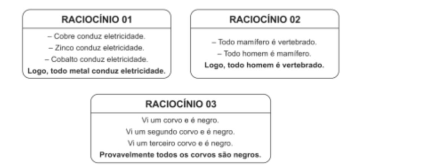

##### **Considerando a definição dada, analise os raciocínios a seguir.** 

##### **Assinale a opção que identifica corretamente exemplos de raciocínios indutivos.** 

a) 1, 2 e 3. 

b) 1 e 2, somente. 

c) 1 e 3, somente. 

d) 2 e 3, somente. 

e) 3, somente. 

##### **Comentários:** 

Os **argumentos indutivos** , que são fruto de **raciocínios indutivos** , partem de fatos apresentados nas premissas para se chegar em uma **conclusão** que estende esses fatos para um **<u>novo caso ou</u>** para **<u>todos os casos</u>** <u>, por meio de uma</u> **<u>generalização</u>** . 

Veja que o **Raciocínio 01** é **indutivo** , pois utiliza como **<u>premissas</u>** o fato de **metais específicos** conduzirem eletricidade ( **cobre** , **zinco** e **cobalto** ) para **<u>concluir</u>** <u>, por meio de uma</u> **<u>generalização</u>** , que **todos os metais conduzem eletricidade.** 

Por outro lado, o **Raciocínio 02** é **dedutivo** . Isso porque a conclusão sugerida, " **_todo homem é vertebrado_** ", decorre imediatamente das premissas. Em outras palavras, **podemos obter a conclusão de maneira**

---

<!-- pagina: 36 -->

**Equipe Exatas Estratégia Concursos Aula 06** 

**inequívoca por meio de Diagramas Lógicos** . Note que, ao desenharmos as premissas por meio de Diagramas Lógicos, a conclusão é necessariamente verdadeira. 

##### _"_ **_Todo mamífero é vertebrado."_** 

Nesse caso, o conjunto dos mamíferos deve ser desenhado dentro do conjunto dos vertebrados. 

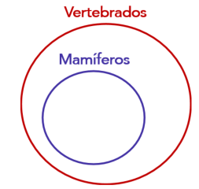

##### _"_ **_Todo homem é mamífero."_** 

Nesse caso, o conjunto dos homens deve ser desenhado dentro do conjunto dos mamíferos. 

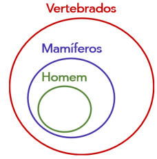

Note, portanto, que uma decorrência lógica das premissas é que " **_todo homem é vertebrado_** ", pois o conjunto dos homens necessariamente está dentro do conjunto dos vertebrados. 

Por fim, o **Raciocínio 03** também é **indutivo** , pois utiliza como **<u>premissas</u>** algumas observações particulares quanto à cor dos corvos para **<u>concluir</u>** , por meio de uma **<u>generalização</u>** <u>, que</u> **existe uma probabilidade maior de que todos os corvos sejam negros** . 

Portanto, são exemplos de raciocínios indutivos **1 e 3, somente** . 

##### **Gabarito: Letra C.** 

**<mark>(FGV/ALEMA/2013/Adaptada) Assinale a alternativa em que se apresenta uma inferência do tipo indutivo, ou seja, que parte do particular para o geral.</mark>** 

##### a) Os romances da “Guerra dos Tronos” são volumosos e caros, por isso não vendem muito. 

b) Os colégios particulares estão apresentando mais sucesso nos exames vestibulares, daí que o Colégio Santo Agostinho esteja com muitos alunos.

---

<!-- pagina: 37 -->

**Equipe Exatas Estratégia Concursos Aula 06** 

c) As novelas de televisão atraem muito público feminino, daí que se espere que “Avenida Brasil” venha a ser sucesso entre as mulheres. 

d) O futebol brasileiro parece superado, daí que o Santos não consiga superar adversários estrangeiros. 

##### **Comentários:** 

Os **argumentos indutivos** partem de fatos apresentados nas premissas para se chegar em uma **conclusão** que estende esses fatos para um **<u>novo caso ou</u>** para **<u>todos os casos</u>** <u>, por meio de uma</u> **generalização** . 

Veja que essa generalização ocorre na **alternativa A** , pois o raciocínio parte de duas características particulares ( **_os romances da “Guerra dos Tronos” são volumosos e caros_** ) para realizar uma **generalização** sobre as vendas ( **_não vendem muito_** ). 

As **demais alternativas partem de uma realidade geral para uma realidade particular** . Logo, não são raciocínios indutivos. 

b) Parte-se de uma generalização sobre o sucesso de colégios particulares ( **_<u>os colégios particulares estão</u> apresentando mais sucesso nos exames vestibulares_** ) para se chegar a uma conclusão específica de um único colégio ( **_<u>o Colégio Santo Agostinho esteja com muitos alunos</u>_** ). 

c) Parte-se de uma generalização sobre as novelas ( **_as novelas de televisão atraem muito público feminino_** ) e conclui-se algo específico sobre uma novela ( **_daí que se espere que “Avenida Brasil” venha a ser sucesso entre as mulheres_** ). 

d) Parte-se de uma generalização sobre o futebol brasileiro ( **_o futebol brasileiro parece superado_** ) para uma realidade particular de um único time de futebol brasileiro ( **_daí que o_** **_<u>Santos não consiga superar</u> adversários estrangeiros_** ). 

##### **Gabarito: Letra A.**

---

<!-- pagina: 38 -->

**Equipe Exatas Estratégia Concursos Aula 06** 

# **– QUESTÕES COMENTADAS MULTIBANCAS** 

## Argumentos: estrutura básica e classificação 

**<mark>(FGV/TCEPE/2025) Considere a forma dos raciocínios a seguir.</mark>** 

**I. Nenhum número primo é divisível por 2, exceto o próprio 2. O número 5 é primo. Logo, o número 5 não é divisível por 2.** 

**II. Se uma empresa reduz custos, então aumenta o lucro. Esta empresa aumentou o lucro. Portanto, ela reduziu custos.** 

**III. Noto que nenhum gato que observei até hoje era roxo. Logo, não deve existir nenhum gato roxo.** 

**É raciocínio do tipo indutivo o que se afirma em:** 

a) I, II e III. 

b) I e II, apenas. 

c) I e III, apenas. 

d) II e III, apenas. 

e) III, apenas. 

**Comentários:** 

Para classificar os raciocínios apresentados na questão, devemos lembrar as definições básicas dos tipos de argumentos lógicos, especialmente a distinção entre **dedução** e **indução** . 

- **Dedução** : parte-se de uma **premissa geral** (uma **regra universal** ) para chegar a uma **conclusão particular** . Se as **premissas** forem consideradas verdadeiras e a estrutura for válida, a **conclusão** será necessariamente verdadeira. 

- **Indução** : parte-se de **observações particulares** ( **casos específicos** ) para chegar a uma **conclusão geral** ( **generalização** ). **A conclusão vai além das premissas** , oferecendo apenas uma probabilidade. 

Vamos verificar quais dos raciocínios apresentados são do tipo **indutivo** . 

##### **I. Nenhum número primo é divisível por 2, exceto o próprio 2. O número 5 é primo. Logo, o número 5 não é divisível por 2. ERRADO.** 

Trata-se de um **raciocínio dedutivo** : parte-se de uma **regra geral** (nenhum número primo é divisível por 2, exceto o 2) aplicada ao caso particular do número 5. A **conclusão** é uma **consequência necessária das premissas** . 

##### **II. Se uma empresa reduz custos, então aumenta o lucro. Esta empresa aumentou o lucro. Portanto, ela reduziu custos. ERRADO.**

---

<!-- pagina: 39 -->

**Equipe Exatas Estratégia Concursos Aula 06** 

A forma do raciocínio pertence ao campo da **dedução** (mais especificamente, é um **argumento dedutivo inválido** por incorrer na **falácia da afirmação do consequente** ). De toda forma, **não se trata de indução** . 

**III. Noto que nenhum gato que observei até hoje era roxo. Logo, não deve existir nenhum gato roxo. CERTO.** Esse é o item indutivo. 

Parte-se de **casos particulares observados** (gatos não roxos) para realizar uma **generalização** (não existem gatos roxos). Caracteriza um **argumento por indução** . 

Portanto, **apenas o item III** apresenta um raciocínio do tipo **indutivo** . 

##### **Gabarito: Letra E.** 

**<mark>(Instituto Verbena/SEBRAE GO/2025) Considere o seguinte argumento: “Hoje pela manhã estava calor e não havia nuvens no céu; à tarde, o tempo estava ameno e o céu estava parcialmente nublado. Logo, quando o céu está nublado não pode fazer calor.” Esse argumento é um exemplo de</mark>** 

a) dedução. 

b) abdução. 

c) analogia. 

d) indução. 

**Comentários:** 

Para classificar o raciocínio apresentado, devemos lembrar as definições básicas dos tipos de argumentos lógicos, especialmente a distinção entre **dedução** e **indução** . 

- Na **dedução** , parte-se de uma **regra geral** para se concluir um caso particular. 

- Na **indução** , parte-se de **observações particulares** para chegar a uma **conclusão geral** ( **generalização** ). 

No argumento apresentado, partiu-se de **duas observações particulares** ( **hoje pela manhã** com calor e sem nuvens; **hoje à tarde** com tempo ameno e céu parcialmente nublado) para se chegar a uma **conclusão generalizadora** : **quando o céu está nublado** ( **ou seja** , **sempre que está nublado** ) **não pode fazer calor** . 

Trata-se, portanto, de um **argumento por indução** . 

##### **Gabarito: Letra D.** 

**<mark>(Instituto Consulplan/DPE PR/2024) Das alternativas apresentadas a seguir, qual apresenta o raciocínio indutivo?</mark>** 

a) Os técnicos administrativos da DPE-PR são todos felizes. Por isso eu quero passar neste concurso: para ser feliz. 

b) Amanhã é feriado para os servidores públicos do Paraná. Assim, os técnicos administrativos da DPE-PR poderão descansar.

---

<!-- pagina: 40 -->

**Equipe Exatas Estratégia Concursos Aula 06** 

c) Para se tornar defensor público é preciso ser bacharel direito. Como Carla é defensora pública, certamente ela é bacharel em direito. 

d) Jonas foi participar de um curso na Alemanha. José vai fazer mestrado na França. Marcela foi palestrar em um seminário na Espanha. Ser servidor da DPE-PR significa ter oportunidades de aprimoramento profissional. 

**Comentários:** 

Um **argumento indutivo** parte de fatos apresentados nas **premissas** e chega em uma **conclusão** que **estende esses fatos para um novo caso** ou para todos os casos, por meio de uma **generalização** . 

Vamos analisar cada uma das alternativas. 

**a) Os técnicos administrativos da DPE-PR são todos felizes. Por isso eu quero passar neste concurso: para ser feliz. ERRADO.** 

Parte-se de uma **generalização** ( **todos** os técnicos são felizes) para uma motivação **particular** do candidato. **Não há generalização a partir de casos particulares** . 

##### **b) Amanhã é feriado para os servidores públicos do Paraná. Assim, os técnicos administrativos da DPE-PR poderão descansar. ERRADO.** 

Parte-se de uma **regra geral** ( **feriado para todos** os servidores) para o caso particular dos técnicos administrativos. Trata-se de **dedução** . 

##### **c) Para se tornar defensor público é preciso ser bacharel direito. Como Carla é defensora pública, certamente ela é bacharel em direito. ERRADO.** 

Parte-se de uma **regra geral** ( **todo defensor público** é bacharel em direito) para o caso particular de Carla. Trata-se de **dedução** . 

**d) Jonas foi participar de um curso na Alemanha. José vai fazer mestrado na França. Marcela foi palestrar em um seminário na Espanha. Ser servidor da DPE-PR significa ter oportunidades de aprimoramento profissional. CERTO. Esse é o gabarito** . 

Veja que o raciocínio parte de **três casos particulares** ( **servidores específicos com oportunidades no exterior** ) para realizar uma **generalização** (" **ser servidor da DPE-PR significa ter oportunidades de aprimoramento profissional** "). Caracteriza, portanto, um **argumento por indução** . 

##### **Gabarito: Letra D.** 

**<mark>(CEBRASPE/TRF6/2025) Julgue o item a seguir, referente ao raciocínio analítico e à estrutura da argumentação.</mark>** 

**No texto a seguir, a conclusão é estabelecida com base em um raciocínio de natureza abdutiva.** 

**“João e Maria são casados. João tem cabelo preto. Maria tem cabelo preto. Logo, os filhos deles também terão cabelo preto.”**

---

<!-- pagina: 41 -->

**Equipe Exatas Estratégia Concursos Aula 06** 

##### **Comentários:** 

A conclusão do argumento apresentado não é uma hipótese explicativa e, portanto, não se trata de um raciocínio por abdução. A questão apresenta um **argumento por indução** . 

Observe que, nas premissas, temos **dois casos particulares** na família ( **_João tem cabelo preto_** e **_Maria tem cabelo preto_** ) e, partir desses casos particulares, **estende-se o fato** de que eles têm cabelo preto **para novos casos** ( **_os filhos deles também terão cabelo preto_** ), por meio de uma **generalização** . 

##### **Gabarito: ERRADO.** 

**<mark>(CEBRASPE/TRF6/2025) Considerando as características do raciocínio analítico e a estrutura da</mark> argumentação, julgue o item a seguir.** 

**Suponha que uma pessoa procure um livro em sua estante, não o ache e, diante disso, chegue à seguinte conclusão: “Alguma pessoa mexeu na minha estante e pegou o livro que procuro.”. Nesse caso, tal conclusão foi elaborada com base no raciocínio indutivo.** 

##### **Comentários:** 

Um **argumento indutivo** parte de fatos apresentados nas premissas e chega em uma **conclusão** que estende esses fatos para um **novo caso** **<u>ou</u>** para **todos os casos,** por meio de uma **generalização** .  Observe que, **no argumento apresentado** , **não temos casos particulares que são generalizados** . O argumento pode ser sintetizado do seguinte modo: 

**Premissa 1** : O livro não está na minha estante. 

**Conclusão** : Alguma pessoa mexeu na minha estante e pegou o livro que procuro. 

O raciocínio apresentado na questão é um **raciocínio por abdução** . Nesse tipo de raciocínio, a conclusão obtida ( **_alguma pessoa mexeu na minha estante e pegou o livro que procuro_** ) representa a **melhor explicação para os fatos enunciados nas premissas** ( **_o livro não está na minha estante_** ). Trata-se de uma **hipótese explicativa** . 

##### **Gabarito: ERRADO.** 

**<mark>(FEPESE/Pref. Brusque/2024) Analise o seguinte trecho:</mark>** 

**– Todos os cachorros que eu conheci são bravos. Portanto, todos os cachorros devem ser bravos.** 

**Assinale a alternativa que indica corretamente o tipo de raciocínio lógico utilizado nesse trecho.** 

a) Crítica 

b) Abdução 

c) Contradição 

d) Dedução 

e) Indução

---

<!-- pagina: 42 -->

**Equipe Exatas Estratégia Concursos Aula 06** 

**Comentários:** 

Para classificar o raciocínio apresentado, devemos lembrar as definições básicas dos tipos de argumentos lógicos, especialmente a distinção entre **dedução** , **indução** e **abdução** . 

- Na **dedução** , parte-se de uma **regra geral** para se concluir um caso particular. 

- Na **indução** , parte-se de **observações particulares** para chegar a uma **conclusão geral** ( **generalização** ). 

- Na **abdução** , temos uma **hipótese explicativa** , em que a conclusão é apresentada como a melhor explicação para os fatos das premissas. 

No trecho, partiu-se de uma **observação particular** sobre os cachorros conhecidos pelo autor ( **todos os cachorros que ele conheceu são bravos** ) para se chegar a uma **conclusão generalizadora** ( **todos os cachorros devem ser bravos** ). 

Trata-se, portanto, de um **argumento por indução** . 

**Gabarito: Letra E.** 

**<mark>(SELECON/CM Rio Brilhante/2024) A indução e a dedução são processos de raciocínio amplamente usados em várias áreas do conhecimento. No que tange a esse assunto, a alternativa que apresenta um exemplo de raciocínio dedutivo é:</mark>** 

a) Joana tem apenas cinco anos de idade e já é uma criança obesa. A obesidade infantil é um problema de saúde pública da atualidade. 

b) Sérgio comprou um bilhete da loteria. Ele orou fervorosamente para que seu bilhete fosse premiado. Isso não ocorreu, portanto, Deus não existe. 

c) Pedro almoçou duas vezes no restaurante do Heitor. Ele gostou muito da comida e do serviço e passou a recomendar esse restaurante para os seus amigos. 

d) As viagens aéreas internacionais são a realização dos sonhos de muitas pessoas, mas também produzem tragédias, como a do acidente aéreo que vitimou inúmeros indivíduos que iam do Rio a Paris em 2009. 

e) John é americano. Ele viaja para o Brasil a fim de encontrar amigos brasileiros que gostam muito de jogar futebol. Ele percebe a habilidade de seus amigos nesse esporte. Ao voltar para o seu país, conta aos seus amigos e familiares que todos os brasileiros são bons jogadores de futebol. 

**Comentários:** 

Para classificar os raciocínios apresentados, devemos lembrar as definições básicas dos tipos de argumentos lógicos. 

- Na **dedução** , parte-se de uma **regra geral** para se concluir um caso particular. 

- Na **indução** , parte-se de **observações particulares** para chegar a uma **conclusão geral** ( **generalização** ). 

- Na **abdução** , temos uma **hipótese explicativa** , em que a conclusão é apresentada como a melhor explicação para os fatos das premissas. 

Vamos analisar cada alternativa.

---

<!-- pagina: 43 -->

**Equipe Exatas Estratégia Concursos Aula 06** 

**a) Joana tem apenas cinco anos de idade e já é uma criança obesa. A obesidade infantil é um problema de saúde pública da atualidade. ERRADO.** 

Parte-se de um **caso particular** ( **Joana** ) para uma **afirmação geral** . Caso fosse classificável, aproximar-se-ia da **indução** , e não da **dedução** . 

##### **b) Sérgio comprou um bilhete da loteria. Ele orou fervorosamente para que seu bilhete fosse premiado. Isso não ocorreu, portanto, Deus não existe. ERRADO.** 

A **conclusão** (" **Deus não existe** ") extrapola completamente as ideias contidas nas premissas ( **bilhete comprado** + **orar pela premiação do bilhete** ). Não é um exemplo de dedução. 

**c) Pedro almoçou duas vezes no restaurante do Heitor. Ele gostou muito da comida e do serviço e passou a recomendar esse restaurante para os seus amigos. ERRADO.** 

A partir de **poucos casos particulares** ( **duas visitas** ), Pedro **generaliza a qualidade** do restaurante. Trata-se de **indução** . 

**d) As viagens aéreas internacionais são a realização dos sonhos de muitas pessoas, mas também produzem tragédias, como a do acidente aéreo que vitimou inúmeros indivíduos que iam do Rio a Paris em 2009. CERTO.** Esse é o gabarito. 

Parte-se de uma **regra geral** (" **viagens aéreas internacionais produzem tragédias** ") para um **caso particular específico** ( **o acidente Rio-Paris em 2009** ). Trata-se, portanto, de um **raciocínio dedutivo** : aplica-se a **regra geral** a um **caso particular** como ilustração. 

**e) John é americano. Ele viaja para o Brasil a fim de encontrar amigos brasileiros que gostam muito de jogar futebol. (...) Ao voltar para o seu país, conta aos seus amigos e familiares que todos os brasileiros são bons jogadores de futebol. ERRADO.** 

Parte-se dos **casos particulares** dos amigos brasileiros para uma **generalização** (" **todos os brasileiros são bons jogadores de futebol** "). Trata-se de **indução** . 

##### **Gabarito: Letra D.** 

**<mark>(COPESE/UFT/2024) A lógica dedutiva formal está interessada nas relações estruturais que articulam antecedentes e consequentes. Nessa lógica, pode-se dizer que a DEDUÇÃO se caracteriza por:</mark>** 

**I.  Ter um consequente que é inferência necessária do antecedente.** 

**II.  Ser um argumento organizado por enumeração.** 

**III.  Ter um consequente cujo conteúdo não excede, não é mais informativo, que o do antecedente.** 

**IV.  Ser um argumento que parte sempre do particular para o geral.** 

**V. Ter um consequente que não leva a um conhecimento novo, mas organiza o conhecimento já adquirido. Assinale a alternativa CORRETA.** 

- a) Apenas as afirmativas I, II e IV estão corretas.

---

<!-- pagina: 44 -->

**Equipe Exatas Estratégia Concursos Aula 06** 

- b) Apenas as afirmativas III e V estão corretas. 

- c) Apenas as afirmativas I e II estão corretas. 

- d) Apenas as afirmativas I, III e V estão corretas. 

- e) Nenhuma das afirmativas está correta. 

##### **Comentários:** 

Vamos verificar quais das afirmativas I a V se referem a **argumentos dedutivos** ( **dedução** ). 

##### **I.  Ter um consequente que é inferência necessária do antecedente. CERTO** . 

Sabemos que um argumento dedutivo pode ser entendido como uma condicional  em que: 

- O **antecedente** é a **<u>conjunção das premissas (P1</u>** ∧ **P2** ∧ **...** ∧ **Pn)** ; e 

- O **consequente** é a **<u>conclusão (C)</u>** . 

Nesse caso, temos a seguinte **condicional associada ao argumento** : 

**(P1** ∧ **P2** ∧ **...** ∧ **Pn)** → **C** 

Em um **argumento dedutivo** , de fato **o consequente** <u>(</u> **<u>conclusão</u>** <u>)</u> **é uma** **<u>inferência necessária</u> do antecedente** ( **do conjunto de premissas** ). Conforme visto na teoria da aula: 

Um **argumento dedutivo** é **<u>válido</u>** quando a **<u>conclusão</u>** é **<u>necessariamente verdadeira</u> uma vez que as premissas são CONSIDERADAS verdadeiras** . 

##### **II.  Ser um argumento organizado por enumeração. ERRADO** . 

A enumeração não é uma característica dos argumentos dedutivos. Trata-se de uma característica mais relacionada aos **argumentos indutivos** , em que **fatos particulares são enumerados nas premissas** para se chegar em uma **conclusão** que estende esses fatos para um **<u>novo caso ou</u>** para **<u>todos os casos,</u>** por meio de uma **<u>generalização</u>** <u>.</u> 

**III.  Ter um consequente cujo conteúdo não excede, não é mais informativo, que o do antecedente. CERTO** . 

Os **argumentos dedutivos** são aqueles que **<u>não</u> produzem conhecimento novo** .  Logo, o **consequente** <u>(</u> **<u>conclusão</u>** ) **não excede** , **não é mais informativo** , **que o do antecedente** ( **conjunto de premissas** ). 

##### **IV.  Ser um argumento que parte sempre do particular para o geral. ERRADO** . 

Os **argumentos dedutivos** partem de uma **regra geral** para se analisar **casos particulares** . Os argumentos que partem do particular para o geral são os **argumentos indutivos** . 

**V. Ter um consequente que não leva a um conhecimento novo, mas organiza o conhecimento já adquirido. CERTO** .

---

<!-- pagina: 45 -->

**Equipe Exatas Estratégia Concursos Aula 06** 

Conforme visto na teoria da aula, os **argumentos dedutivos** são aqueles que **<u>não</u> produzem conhecimento novo** .  Em outras palavras, podemos dizer que os argumentos dedutivos **<u>organizam os conhecimentos do</u> conjunto de premissas na conclusão** <u>(</u> **<u>consequente</u>** <u>).</u> 

##### **Gabarito: Letra D.** 

**<mark>(CEBRASPE/CGE RJ/2024) Certo pensador, ao comentar a respeito de determinada ideologia, manifestou a seguinte opinião: “Essa ideologia é igual às outras: se você acredita, não precisa de explicação; se você não acredita, não adianta explicação.”.</mark>** 

**Uma pesquisa revelou que, de 1.000 pessoas de uma cidade, 300 conhecem e acreditam na referida ideologia, 400 a conhecem, mas não acreditam nela, 200 não a conhecem e 100 a conhecem, mas são indiferentes (nem dizem acreditar, nem dizem desacreditar).** 

##### **Considerando essa situação hipotética, julgue o item a seguir.** 

**As informações apresentadas, em especial a opinião do pensador, permitem inferir que a ideologia em referência prescinde de explicação.** 

##### **Comentários:** 

Antes de resolver o item, creio ser interessante contextualizar como a questão, composta por vários itens, apareceu na prova. 

A situação hipotética do problema é composta de dois parágrafos: 

- O primeiro parágrafo serviu de base para o presente item e para um item relativo a equivalências lógicas; 

- O segundo parágrafo foi utilizado para resolver questões de probabilidade, matéria que constava no edital daquela prova. 

Para resolver o atual item que estamos julgando, **devemos tomar por base somente a opinião do pensador** : **“Essa ideologia é igual às outras: se você acredita, não precisa de explicação; se você não acredita, não adianta explicação”.** 

**A partir dessa opinião** , o item afirma que **podemos inferir** (ou seja, concluir, seja por **dedução** , **indução** ou **abdução** ) **que a ideologia em questão não precisa de explicação** (prescinde de explicação). 

Observe que **o item está ERRADO** , pois na opinião do autor **não constam elementos para que seja feita a inferência** de que a ideologia em questão não precisa de explicação, seja por **dedução** (partindo de uma generalização para um caso específico), seja por **indução** (partindo de casos específicos para se obter uma generalização), seja por **abdução** (trazendo uma hipótese explicativa). 

##### **Gabarito: ERRADO.** 

**<mark>(IBFC/Pref. Cuiabá/2023) O tipo de raciocínio que se utiliza da regra do argumento e sua premissa para se chegar a uma conclusão é:</mark>** 

a) Abdução

---

<!-- pagina: 46 -->

**Equipe Exatas Estratégia Concursos Aula 06** 

b) Indução 

c) Tratamento 

d) Dedução 

**Comentários:** 

Conforme visto na teoria, podemos distinguir os três tipos clássicos de raciocínio, segundo **C. S. Peirce** , considerando três elementos: **regra** ( **generalização** ), **premissa** ( **hipótese** ) e **conclusão** . 

- Na **<u>dedução</u>** <u>, tem-se uma</u> **generalização** ( **regra** ) e uma **hipótese** ( **premissa** ) e, por meio delas, chega-se a uma **conclusão** . 

- Na **<u>indução</u>** <u>, tem-se uma</u> **hipótese** ( **premissa** ) e uma **conclusão** e, por meio delas, chega-se a uma **generalização** ( **regra** ). 

- Na **<u>abdução</u>** <u>, tem-se uma</u> **generalização** ( **regra** ) e uma **conclusão** e, por meio delas, chega-se a uma **hipótese** ( **premissa** ). 

O tipo de raciocínio que se utiliza da **regra** do argumento e sua **premissa** para se chegar a uma **conclusão** é, portanto, a **dedução** . 

##### **Gabarito: Letra D.** 

**<mark>(IBFC/Pref. Cuiabá/2023) O tipo de raciocínio que se utiliza da conclusão e da regra para defender que a premissa pode explicar a conclusão é chamado de:</mark>** 

a) Dedução 

b) Indução 

c) Abdução 

d) Tratamento 

**Comentários:** 

Conforme visto na teoria, podemos distinguir os três tipos clássicos de raciocínio, segundo C. S. Peirce, considerando três elementos: **regra** ( **generalização** ), **premissa** ( **hipótese** ) e **conclusão** . 

- Na **<u>dedução</u>** <u>, tem-se uma</u> **generalização** ( **regra** ) e uma **hipótese** ( **premissa** ) e, por meio delas, chega-se a uma **conclusão** . 

- Na **<u>indução</u>** <u>, tem-se uma</u> **hipótese** ( **premissa** ) e uma **conclusão** e, por meio delas, chega-se a uma **generalização** ( **regra** ). 

- Na **<u>abdução</u>** <u>, tem-se uma</u> **generalização** ( **regra** ) e uma **conclusão** e, por meio delas, chega-se a uma **hipótese** ( **premissa** ) — ou seja, parte-se da **conclusão** e da **regra para se defender que uma determinada** **<u>premissa pode explicar a conclusão</u>** . Trata-se de uma **hipótese explicativa** . 

Portanto, o tipo de raciocínio descrito no enunciado é a **abdução** . 

**Gabarito: Letra C.**

---

<!-- pagina: 47 -->

**Equipe Exatas Estratégia Concursos Aula 06** 

**<mark>(IDCAP/CREA BA/2023) Analise o argumento abaixo.</mark>** 

**Carlos é atleta.** 

**Todo atleta gosta de açaí.** 

**Logo, Carlos gosta de açaí.** 

**A conclusão dada é classificada como uma:** 

a) Dedução. 

b) Analogia. 

c) Inferência. 

d) Transferência. 

e) Indução. 

**Comentários:** 

Para classificar o argumento, devemos lembrar as definições básicas dos tipos de raciocínio: 

- Na **dedução** , parte-se de uma **regra geral** para se concluir um caso particular. 

- Na **indução** , parte-se de **observações particulares** para chegar a uma **conclusão geral** ( **generalização** ). 

- Na **abdução** , temos uma **hipótese explicativa** , em que a conclusão é apresentada como a melhor explicação para os fatos das premissas. 

P ~~o~~ demos estruturar o argumento da seguinte forma: 

**Premissa 1** : Carlos é atleta. 

**Premissa 2** : Todo atleta gosta de açaí. 

**Conclusão** : Carlos gosta de açaí. 

Veja que se parte de uma **regra geral** (" **todo atleta gosta de açaí** ") e aplica-se ao caso particular de Carlos. A **conclusão** é uma **consequência necessária das premissas** . Trata-se, portanto, de uma **dedução** . 

**Gabarito: Letra A.** 

**<mark>(FGV/Câmara dos Deputados/2023) O procedimento lógico, pelo qual se passa de alguns fatos particulares para um princípio geral, e em que se pode estabelecer uma lei geral a partir da repetição constatada de regularidades em vários casos particulares, é denominado</mark>** 

a) teorização. 

b) dedução. 

c) objetivação. 

d) indução. 

e) comparação.

---

<!-- pagina: 48 -->

**Equipe Exatas Estratégia Concursos Aula 06** 

**Comentários:** 

O enunciado descreve um procedimento lógico em que se parte de **fatos particulares** (regularidades observadas em vários casos) para se chegar a um **princípio geral** (uma lei geral). 

Na **dedução** , parte-se da **regra geral** para o caso particular. Na **indução** , parte-se de **observações particulares** (casos específicos) para se chegar a uma **conclusão** geral ( **generalização** ). 

Observe que a descrição corresponde exatamente à **indução** : a passagem de casos particulares para o estabelecimento de uma **lei geral** , por meio da constatação de **regularidades** . 

##### **Gabarito: Letra D.** 

**<mark>(IMPARH/Pref. Fortaleza/2022) Considere as seguintes afirmações como verdadeiras:</mark>** 

**I. “Se João come muitos doces, então ele fica com dor de barriga.”** 

**II. “Se João fica com dor de barriga, então ele toma remédio.”** 

**III. “Se João toma remédio, então ele fica com sono.”** 

**IV. “Se João fica com sono, então ele chega atrasado no trabalho.”** 

**Suponha que João não tomou remédio. Podemos concluir que João:** 

a) não comeu muitos doces. 

b) ficou com dor de barriga. 

c) não ficou com sono. 

- d) chegou atrasado no trabalho. 

**Comentários:** 

Trata-se de uma questão que pode ser resolvida pela aplicação sucessiva da regra de inferência **Modus Tollens** ( **negação do consequente** ). 

Considere as seguintes proposições simples: 

**d** : "João come muitos doces." 

**b** : "João fica com dor de barriga." 

**r** : "João toma remédio." 

**s** : "João fica com sono." 

**a** : "João chega atrasado no trabalho." 

As afirmações I, II, III e IV podem ser representadas por: 

I. **d** → **b**

---

<!-- pagina: 49 -->

**Equipe Exatas Estratégia Concursos Aula 06** 

II. **b** → **r** 

III. **r** → **s** 

IV. **s** → **a** 

A informação adicional é que ~ **r** (João não tomou remédio). 

Aplicando o **Modus Tollens** sobre II e ~ **r** : 

De **b** → **r** e ~ **r** , conclui-se ~ **b** (João **não** ficou com dor de barriga). 

Aplicando novamente o **Modus Tollens** sobre I e ~ **b** : 

De **d** → **b** e ~ **b** , conclui-se ~ **d** (João **não** comeu muitos doces). 

Portanto, a **conclusão** válida é "João não comeu muitos doces". 

Vamos verificar as demais alternativas. As alternativas (b), (c) e (d) tratam de **b** , **s** e **a** , respectivamente. A partir das premissas e da informação ~ **r** , nada se pode concluir sobre **s** nem sobre **a** (a negação do antecedente em **r** → **s** e a propagação para **s** → **a** não permite inferência válida). Sobre **b** , vimos acima que a conclusão é ~ **b** (e não **b** , como afirma a alternativa b). 

O **gabarito** é **letra A** . 

##### **Gabarito: Letra A.** 

**<mark>(IBFC/MGS/2022) O tipo de raciocínio lógico que se utiliza da regra e sua premissa para se chegar à conclusão é:</mark>** 

a) Dedução 

b) Abdução 

c) Indução 

d) Propulsão 

##### **Comentários:** 

Conforme visto na teoria da aula, na **indução** temos o **uso de casos particulares nas premissas para se chegar em uma generalização** ( **regra** ). 

Por outro lado, na **dedução** , **partimos de uma generalização** ( **regra** ) **para se chegar em uma conclusão que é um caso particular** . 

Logo, tipo de raciocínio lógico que se utiliza da **regra** e sua premissa para se chegar à conclusão é a **dedução** . 

##### **Gabarito: Letra A.**

---

<!-- pagina: 50 -->

**Equipe Exatas Estratégia Concursos Aula 06** 

**<mark>(IBFC/DPE MT/2022) O tipo de raciocínio lógico cujo objetivo é se determinar a regra a partir de como a conclusão segue da premissa é chamado de:</mark>** 

a) indução 

b) abdução 

c) dedução 

d) assimilação 

##### **Comentários:** 

Conforme visto na teoria da aula, na **indução** temos o **uso de casos particulares nas premissas para se chegar em uma generalização** ( **regra** ). O **gabarito** , portanto, é **letra A** . 

##### **Gabarito: Letra A.** 

**<mark>(IBFC/MGS/2022) Em lógica, pode-se dizer os 3 tipos de raciocínio são: dedução, indução e abdução.</mark> Se for dada uma premissa, uma conclusão e uma regra pela qual a premissa implica a conclusão, então** **<mark>podemos dizer que:</mark>** 

a) dedução corresponde a determinar a regra 

b) indução corresponde a determinar a conclusão 

c) abdução corresponde a determinar a premissa 

d) indução corresponde a determinar a premissa 

##### **Comentários:** 

Conforme visto na teoria: 

- Na **dedução** , tem-se uma **generalização** ( **regra** ) e uma **hipótese** ( **premissa** ) e, por meio delas, chegase a uma **conclusão** ; 

- Na **indução** , tem-se uma **hipótese** ( **premissa** ) e uma **conclusão** e, por meio delas, chega-se a uma **generalização** ( **regra** ). 

- Na abdução, tem-se uma **generalização** ( **regra** ) e uma **conclusão** e, por meio delas, chega-se a uma **hipótese** ( **premissa** ). 

Portanto, pode-se dizer que **abdução corresponde a determinar a premissa** . 

##### **Gabarito: Letra C.** 

**<mark>(FGV/PCAM/2022) Identifique o trecho a seguir que apresenta a estrutura de uma premissa levando a uma conclusão.</mark>** 

a) Ouvi o barulho de um gambá na cozinha; a cozinheira deve ter deixado o pote de ração dos gatos no chão. 

b) Todos já devem ter chegado à festa, porque ninguém mais telefonou, reclamando do atraso.

---

<!-- pagina: 51 -->

**Equipe Exatas Estratégia Concursos Aula 06** 

c) Nossos amigos possivelmente vão ser aprovados no concurso, já que estudaram bastante tempo. 

d) Talvez as encomendas cheguem a tempo, pois partiremos depois de amanhã. 

e) O lixeiro deve estar passando em nossa porta; senti um odor de coisa podre. 

##### **Comentários:** 

Para resolver essa questão, é interessante retomarmos o conceito de **premissa** e o conceito de **conclusão** : 

**<u>Premissa</u>** é uma declaração, uma afirmação ou um **<u>fato</u>** a partir do qual uma conclusão é construída. 

**<u>Conclusão</u>** é uma afirmação ou um **<u>julgamento</u>** resultante da relação entre uma ou mais razões apresentadas. 

Note, portanto, que a **premissa** é um **<u>fato</u>** que deve ser tomado por verdade para se chegar a uma **conclusão** , que é um **<u>julgamento</u>** <u>.</u> 

Vamos analisar cada uma das alternativas. 

**a) Ouvi o barulho de um gambá na cozinha; a cozinheira deve ter deixado o pote de ração dos gatos no chão. CERTO** . 

Veja que **_"ouvi o barulho de um gambá na cozinha"_** é um fato que deve ser tomado por verdade para se chegar à conclusão de que " **_a cozinheira deve ter deixado o pote de ração dos gatos no chão_** ". 

Note, ainda, que temos um **argumento por abdução** . Isso porque a conclusão " **_a cozinheira deve ter deixado o pote de ração dos gatos no chão_** " é uma **<u>hipótese explicativa</u>** <u>, pois representa a melhor explicação para o fato enunciado na premissa.</u> 

Como **inicialmente temos uma premissa que leva a uma conclusão subsequente** , **essa alternativa é o gabarito** da questão. 

##### **b) Todos já devem ter chegado à festa, porque ninguém mais telefonou, reclamando do atraso. ERRADO** . 

Veja que **_"_ ninguém mais telefonou, reclamando do atraso** **_"_** é um fato que deve ser tomado por verdade para se chegar à conclusão de que " **_todos já devem ter chegado à festa_** ". 

Note, ainda, que temos um **argumento por abdução** . Isso porque a conclusão " **_todos já devem ter chegado à festa_** " é uma **<u>hipótese explicativa</u>** , pois representa a melhor explicação para o fato enunciado na premissa. 

Como **a conclusão é apresentada antes da premissa** , essa **alternativa** **<u>não é o gabarito da questão</u>** . 

##### **c) Nossos amigos possivelmente vão ser aprovados no concurso, já que estudaram bastante tempo. ERRADO** .

---

<!-- pagina: 52 -->

**Equipe Exatas Estratégia Concursos Aula 06** 

Veja que **_"(nossos amigos)_ estudaram bastante tempo** **_"_** é um fato que deve ser tomado por verdade para se chegar à conclusão de que " **_nossos amigos possivelmente vão ser aprovados no concurso_** ". 

Note, ainda, que temos um **argumento por indução** . Isso porque a conclusão " **_nossos amigos possivelmente vão ser aprovados no concurso_** " é uma **<u>generalização</u>** feita a partir do caso particular de que **_"(nossos " amigos)_ estudaram bastante tempo** _._ 

##### Como **a conclusão é apresentada antes da premissa** , essa **alternativa** **<u>não é o gabarito da questão</u>** . 

##### **d) Talvez as encomendas cheguem a tempo, pois partiremos depois de amanhã. ERRADO** . 

Veja que **_"partiremos depois de amanhã"_** é um fato que deve ser tomado por verdade para se chegar à conclusão de que " **_talvez as encomendas cheguem a tempo_** ". 

Apesar de não parecer que a premissa dá suporte à defesa da conclusão, note que "==5460== **_talvez as encomendas cheguem a tempo_** " **é um julgamento** feito no argumento apresentado, uma vez que a palavra "talvez" indica uma probabilidade. Logo, " **_talvez as encomendas cheguem a tempo_** " é a **conclusão** . 

Como **a conclusão é apresentada antes da premissa** , essa **alternativa** **<u>não é o gabarito da questão</u>** . 

##### **e) O lixeiro deve estar passando em nossa porta; senti um odor de coisa podre. ERRADO** . 

Veja que **_"senti um odor de coisa podre"_** é um fato que deve ser tomado por verdade para se chegar à conclusão de que " **_o lixeiro deve estar passando em nossa porta_** ". 

Note, ainda, que temos um **argumento por abdução** . Isso porque a conclusão " **_o lixeiro deve estar passando em nossa porta_** " é uma **<u>hipótese explicativa</u>** , pois representa a melhor explicação para o fato enunciado na <u>premissa.</u> 

##### Como **a conclusão é apresentada antes da premissa** , essa **alternativa** **<u>não é o gabarito da questão</u>** . 

##### **Gabarito: Letra A.** 

**<mark>(FGV/TJDFT/2022) “Quando se julga por indução e sem o necessário conhecimento dos fatos, às vezes chega-se a ser injusto até mesmo com os malfeitores.”</mark>** 

**O raciocínio abaixo que deve ser considerado como indutivo é:** 

a) Os funcionários públicos folgam amanhã, por isso meu marido ficará em casa; 

b) Todos os juízes procuram julgar corretamente, por isso é o que ele também procura; 

c) Nos dias de semana os mercados abrem, por isso deixarei para comprar isso amanhã; 

d) No inverno, chove todos os dias, por isso vou comprar um guarda-chuva; 

e) Ontem nevou bastante, por isso as estradas devem estar intransitáveis. 

##### **Comentários:**

---

<!-- pagina: 53 -->

**Equipe Exatas Estratégia Concursos Aula 06** 

Os **argumentos indutivos** partem de fatos apresentados nas premissas para se chegar em uma **conclusão** que estende esses fatos para um **<u>novo caso ou</u>** para **<u>todos os casos</u>** <u>, por meio de uma</u> **generalização** . 

Veja que essa generalização ocorre na **alternativa E** , pois o raciocínio parte de um caso particular relativo a " **ontem** " <u>(</u> **_<u>ontem</u> nevou bastante_** ) para estender esse fato para um **<u>novo caso</u>** relacionado ao **tempo presente** ( **_as estradas devem estar intransitáveis_** ). 

As **demais alternativas partem de uma realidade geral para uma realidade particular** . Logo, não são raciocínios indutivos. 

a) Parte-se de uma generalização ( **_os funcionários públicos folgam amanhã_** ) para o caso particular do marido de quem fala, que se pressupõe ser funcionário público ( **_meu marido ficará em casa_** ). 

b) Parte-se de uma generalização sobre os juízes ( **_todos os juízes procuram julgar corretamente_** ) para um caso particular ( **_é o que ele também procura_** ). 

c) Parte-se de uma generalização sobre o horário de funcionamento dos mercados ( **_nos dias de semana os mercados abrem_** ) para aplicá-la para o caso particular de amanhã ( **_deixarei para comprar isso amanhã_** ). 

d) Parte-se de uma generalização ( **_no inverno, chove todos os dias_** ) para uma decisão particular ( **_vou comprar um guarda-chuva_** ). 

##### **Gabarito: Letra E.** 

**<mark>(Instituto AOCP/FUNPRESP JUD/2021) Considerando o conteúdo e as características do raciocínio lógico</mark> e analítico, julgue o seguinte item.** 

**"Quando trabalho de manhã, folgo à tarde. Trabalhei hoje de manhã. Logo, folgarei hoje à tarde" é um exemplo de raciocínio lógico por dedução.** 

##### **Comentários:** 

A questão apresenta uma **regra de inferência** denominada **_Modus Ponens_** . Trata-se, portanto, de um **argumento dedutivo** , em que se parte de uma regra geral para se concluir um caso particular. Considere as seguintes proposições simples: 

**p:** "Trabalho de manhã." 

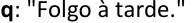

Veja que o argumento em questão corresponde ao **_Modus Ponens_** : 

**Premissa 1: p** → **q** − " _Quando trabalho de manhã, folgo à tarde._ " 

− " **Premissa 2: p** _Trabalhei hoje de manhã._ " 

− " **Conclusão: q** _Logo, folgarei hoje à tarde._ " 

##### **Gabarito: CERTO.**

---

<!-- pagina: 54 -->

**Equipe Exatas Estratégia Concursos Aula 06** 

**<mark>(Instituto AOCP/FUNPRESP JUD/2021) Considerando o conteúdo e as características do raciocínio lógico e analítico, julgue o seguinte item.</mark>** 

**"Quando trabalho de manhã, folgo à tarde. Folguei à tarde, então pode ter acontecido de eu ter ido trabalhar no período da manhã" é um exemplo de raciocínio lógico por indução, pois é a melhor explicação para o fato de eu folgar no período da tarde.** 

##### **Comentários:** 

Em um argumento por indução, a conclusão estende os fatos das premissas para um **<u>novo caso ou</u>** para **<u>todos os casos</u>** <u>, por meio de uma</u> **<u>generalização</u>** <u>.</u> 

No argumento apresentado **não ocorre uma generalização** e, portanto, não se trata de uma indução. Ao se referir a " **melhor explicação** " para o fato, a questão trata de um **argumento por abdução** . 

##### **Gabarito: ERRADO.** 

**<mark>(Instituto AOCP/FUNPRESP JUD/2021) Considerando o conteúdo e as características do raciocínio lógico e analítico, julgue o seguinte item.</mark>** 

**Numa argumentação por analogia, ressaltamos características em comum entre duas ou mais situações com o intuito de inferir conclusões parecidas. Porém, seja qual for essa relevância, um argumento por analogia é sempre um argumento indutivo e nunca um argumento dedutivo, isto é, trata-se de um argumento que da verdade das premissas infere a conclusão como provavelmente verdadeira, e não de um argumento no qual a verdade da conclusão se segue necessariamente da verdade das premissas.** 

##### **Comentários:** 

A questão apresenta uma definição correta de **argumento por analogia** . Conforme visto na teoria: 

**Analogia** é um **<u>caso específico de argumento indutivo</u>** em que **características comuns são ressaltadas** como forma de se realizar a indução. 

##### **Gabarito: CERTO.** 

**<mark>(FGV/TCEAM/2021) Um teólogo russo, V. S. Soloviev, declarou: “Sinto vergonha, logo existo”.</mark>** 

##### **A afirmação INADEQUADA sobre essa frase:** 

a) é parte de um silogismo em que falta a conclusão; 

b) mostra intertextualidade com uma frase famosa; 

c) emite uma opinião pessoal do seu autor; 

d) exemplifica um texto de caráter argumentativo; 

e) não traz as duas premissas de um silogismo. 

##### **Comentários:**

---

<!-- pagina: 55 -->

**Equipe Exatas Estratégia Concursos Aula 06** 

Note que, no argumento em questão, temos uma **única premissa** e uma **única conclusão** , introduzida pela palavra " **logo** ": 

**Premissa** : Sinto vergonha. 

##### **Conclusão:** Existo. 

Veja que, para que tivéssemos um **silogismo** de forma a obter um **argumento dedutivo válido** , seria necessário incluir a premissa maior " **_Todos que sentem vergonha, existem_** ". Veja que, nesse caso, a conclusão poderia ser obtida de modo inequívoco por meio de diagramas lógicos: 

**Premissa 1** : Todos que sentem vergonha, existem. 

**Premissa 2** : Sinto vergonha. 

##### **Conclusão:** Existo. 

Vamos avaliar as alternativas da questão, lembrando que devemos marcar a alternativa que apresenta uma **afirmação inadequada** . 

##### **a) é parte de um silogismo em que falta a conclusão. Afirmação ERRADA** . **<u>Esse é o gabarito</u>** . 

A conclusão da declaração original é " **existo** ", introduzida pela palavra " **logo** ". 

##### **b) mostra intertextualidade com uma frase famosa. CERTO.** 

A frase famosa que está correlacionada à declaração do teólogo russo V. S. Soloviev é “ **Penso, logo existo** ”, dita pelo filósofo francês René Descartes. 

##### **c) emite uma opinião pessoal do seu autor. CERTO.** 

De fato, a declaração “Sinto vergonha, logo existo” emite uma opinião pessoal do teólogo russo V. S. Soloviev. 

##### **d) exemplifica um texto de caráter argumentativo. CERTO.** 

A frase exemplifica um texto de caráter argumentativo, por apresenta uma **premissa** que dá suporte à defesa de uma **conclusão** . 

##### **e) não traz as duas premissas de um silogismo. CERTO.** 

Para que a frase fosse considerada um **silogismo** , seria necessário apresentar a premissa maior " **_Todos que sentem vergonha, existem_** ". 

##### **Gabarito: Letra A.** 

**<mark>(IBFC/Pref. Cruzeiro do Sul/2019) Considere o argumento:</mark>** 

**Aqui só temos rosas e violetas** 

**As rosas são vermelhas**

---

<!-- pagina: 56 -->

**Equipe Exatas Estratégia Concursos Aula 06** 

##### **As violetas são azuis.** 

##### **Esta flor é vermelha, então é uma rosa.** 

##### **Quanto ao tipo de raciocínio envolvido nesse argumento, assinale a alternativa correta.** 

a) Indução 

b) Falácia 

c) Tautologia 

d) Dedução 

##### **Comentários:** 

**Argumentos dedutivos** são aqueles que **<u>não</u> produzem conhecimentos novos** . Isso significa que a informação presente na conclusão já estava presente nas premissas. 

Na **dedução** , parte-se de uma **generalização** ( **caso geral** ) para se chegar a um **caso particular** . Veja que é justamente isso que ocorre: 

**Premissa 1** : Aqui só temos rosas e violetas ( **caso geral** ) 

**Premissa 2** : As rosas são vermelhas ( **caso geral** ) 

**Premissa 3** : As violetas são azuis. ( **caso geral** ) 

**Conclusão** : Esta flor é vermelha, então é uma rosa. ( **caso específico** ) 

##### **Gabarito: Letra D.** 

**<mark>(IBFC/Pref. Candeias/2019)  Analise as afirmativas abaixo, dê valores Verdadeiro (V) ou Falso (F)</mark>** 

**I. O raciocínio por indução parte de particularidades para se obter uma conclusão geral.** 

**II. O raciocínio por dedução utiliza-se de uma regra geral para se analisar casos particulares.** 

**III. Raciocínio indutivo e dedutivo são tipos de raciocínios diferentes.** 

**Assinale a alternativa que apresenta a sequência correta de cima para baixo.** 

a) V, F, F 

b) V, F, V 

c) V, V, V 

d) F, F, V 

##### **Comentários:** 

Vamos analisar as afirmativas. 

**I. O raciocínio por indução parte de particularidades para se obter uma conclusão geral. Verdadeiro.**

---

<!-- pagina: 57 -->

**Equipe Exatas Estratégia Concursos Aula 06** 

Conforme visto na teoria, o **raciocínio por indução** parte de fatos apresentados nas premissas e chega a uma **conclusão** que estende esses fatos para um **<u>novo caso ou</u>** para **<u>todos os casos</u>** , por meio de uma **<u>generalização</u>** <u>.</u> 

##### **II. O raciocínio por dedução utiliza-se de uma regra geral para se analisar casos particulares. Verdadeiro.** 

Trata-se da definição de **raciocínio dedutivo** : 

##### O **<u>raciocínio dedutivo</u>** utiliza-se de uma **regra geral** para se analisar **casos particulares** . 

##### **III. Raciocínio indutivo e dedutivo são tipos de raciocínios diferentes. Verdadeiro.** 

Conforme visto na teoria, **dedução** , **indução** e **abdução** são diferentes maneiras de se realizar uma inferência. 

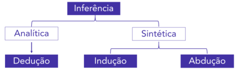

##### **Gabarito: Letra C.** 

**<mark>(IBFC/Pref. C Sto. Agostinho/2019)  Leia atentamente: Bolas iguais numeradas em ordem crescente de</mark>** 

**<mark>1 a 20 são postas em uma urna opaca. 10 Bolas são azuis e 10 Bolas são vermelhas. Sendo assim, analise</mark> as afirmativas abaixo:** 

**I. A probabilidade de, em um sorteio aleatório, ser retirada da urna uma bola azul é de uma em duas, ou seja 50%.** 

**II. Se 10 bolas da urna forem retiradas em sequência, sem reposição, e todas são azuis, então o sorteio é provavelmente viciado.** 

**III. Se 19 Bolas forem retiradas sem reposição, então a última bola na urna é conhecida.** 

##### **Quanto ao fundamento, em termos do raciocínio lógico utilizado, assinale a alternativa correta.** 

a) I-dedução; II-indução; III-dedução 

b) I-indução; II-dedução; III-dedução 

c) I-dedução; II-dedução; III-dedução 

d) I-indução; II-indução; III-indução 

##### **Comentários:** 

Vamos analisar cada afirmativa. 

**I. A probabilidade de, em um sorteio aleatório, ser retirada da urna uma bola azul é de uma em duas, ou seja 50%.**

---

<!-- pagina: 58 -->

**Equipe Exatas Estratégia Concursos Aula 06** 

Essa afirmativa é fruto de um raciocínio dedutivo válido. Isso porque, ao se considerar como premissa que "em uma urna, 10 Bolas são azuis e 10 Bolas são vermelhas", a conclusão de que "a probabilidade de, em um sorteio aleatório, ser retirada da urna uma bola azul é de 50%" é uma decorrência necessária da premissa, pois se trata de uma certeza matemática que independe de generalizações a partir de casos particulares. 

##### **_II. Se 10 bolas da urna forem retiradas em sequência, sem reposição, e todas são azuis, então o sorteio é provavelmente viciado._** 

O argumento apresentado é **indutivo** , pois parte-se de 10 casos particulares para se concluir, por meio de uma **generalização** , uma propriedade geral do sorteio. Veja que, apesar de apresentar baixa probabilidade, é possível que o sorteio não esteja viciado. 

##### **_III. Se 19 Bolas forem retiradas sem reposição, então a última bola na urna é conhecida._** 

Essa afirmativa é fruto de um **raciocínio dedutivo válido** , pois se retirarmos 19 bolas, a bola restante realmente será conhecida, sem haver dúvidas quanto a esse fato: 

- O número da bola será o número de 1 a 20 que não foi retirado; 

- Se das 19 bolas retiradas temos 10 azuis e 9 vermelhas, a bola restante será vermelha. Já se retiramos 9 azuis e 10 vermelhas, a bola restante será azul. 

Veja, portanto, que a última bola da urna é necessariamente conhecida. 

##### **Gabarito: Letra A.** 

**<mark>(IBFC/IDAM/2019) Dentre as proposições condicionais abaixo, assinale a alternativa que apresenta qual corresponde a um exemplo correto de aplicação do método de indução para obtenção da conclusão.</mark>** 

a) Se os cães desse bairro têm rabo, e cães são quadrúpedes, então, quadrúpedes têm rabo 

b) Se o ônibus passa às 18h e agora é 17h35, então o ônibus passará em 25 minutos 

c) Se Jorge é irmão de José, e José é irmão de João, então Jorge é irmão de João 

d) Se laranjeiras dão laranjas, e quero laranjas em meu quintal, então plantarei laranjeiras no quintal 

##### **Comentários:** 

Note que o argumento da alternativa A parte de **casos particulares** apresentados nas premissas e estende <u>esses fatos para novos casos por meio de uma</u> **generalização** . 

Veja que " **os cães desse bairro têm rabo** " são casos particulares e que " **quadrúpedes têm rabo** " é uma generalização realizada pelo fato de que " **cães são quadrúpedes** ". 

As demais alternativas apresentam argumentos dedutivos. 

b) A conclusão de que " **o ônibus passará em 25 minutos** " é uma consequência necessária das premissas " **o ônibus passa às 18h** " e " **agora é 17h35** ".

---

<!-- pagina: 59 -->

**Equipe Exatas Estratégia Concursos Aula 06** 

c) A conclusão de que " **Jorge é irmão de João** " é uma consequência necessária das premissas " **Jorge é irmão de José** " e " **José é irmão de João** ", pois as premissas indicam que Jorge, José e João são irmãos entre si. 

d) A conclusão " **plantarei laranjeiras no quintal** " decorre das premissas " **laranjeiras dão laranjas** " e " **quero laranjas em meu quintal** ". 

##### **Gabarito: Letra A.** 

**<mark>(IBFC/Pref. Cruzeiro do Sul/2019) A preservação do movimento pela Natureza consiste de uma lei enunciada por Galileo Galilei na primeira metade do século XVII, identificada sob o nome de Lei da Inércia e que consiste de uma das leis da Física na teoria sobre o movimento de Isaac Newton, desenvolvida na segunda metade do século XVII.</mark>** 

##### **Analise o fato experimental abaixo.** 

**Fato experimental: Um objeto que se desloca (sem rolar) contra uma superfície está submetido à fricção (atrito) que resulta no surgimento de uma força oposta ao deslocamento do corpo ao longo do tempo. Essa força retira gradualmente movimento do corpo até pará-lo completamente em relação à superfície. Quanto mais lisas as superfícies do corpo e a superfície sobre a qual ele se desloca, verifica-se que um mesmo impulso resulta em um maior deslocamento total do corpo em relação à superfície até ele parar.** 

##### **Considere o argumento abaixo construído por uma pessoa a partir deste fato experimental.** 

**Argumento: se forças de atrito cada vez menores permitem deslocamentos cada vez maiores do corpo sobre a superfície, se fosse possível eliminar o atrito completamente, então o corpo nunca pararia, seguindo com velocidade constante.** 

**Se, em experimentos, se conseguir produzir atritos progressivamente menores, sem nunca conseguir eliminar por completo, assinale a alternativa que corretamente identifica o tipo de raciocínio que caracteriza o Argumento apresentado (lei da Inércia).** 

a) Dedução 

b) Indução 

c) Reiteração 

d) Paradoxo 

##### **Comentários:** 

Perceba que os **casos particulares** resultantes de **experimentos** mostram que <u>forças de atrito cada vez menores permitem deslocamentos cada vez maiores do corpo sobre a superfície. Em seguida, realiza-se uma</u> **abstração** que **generaliza** o comportamento dos corpos, afirmando-se que " **_se fosse possível eliminar o atrito completamente, então o corpo nunca pararia, seguindo com velocidade constante_** ". Trata-se, portanto, de um **raciocínio indutivo** . 

##### **Gabarito: Letra B.** 

**<mark>(CONSULPLAN/CM BH/2018) “Um gato preto a atravessar o meu caminho significa que o animal está a ir para algum lado.” (Groucho Marx.)</mark>**

---

<!-- pagina: 60 -->

**Equipe Exatas Estratégia Concursos Aula 06** 

**70% dos gatos abandonados são pretos. Os números foram partilhados pela RSPCA, baseados em 1.000 gatos abandonados ao seu cuidado.** 

**A principal causa apontada é a dificuldade dos donos em tirar fotografias com eles. Numa sociedade dominada pela exposição nas redes sociais e pelas selfies, ter um gato que parece sempre a silhueta de um gato, não parece cativar. Mas o fenômeno com os gatos pretos vai muito mais além de uma simples questão fotográfica. As superstições ainda estão muito vivas na nossa sociedade e os gatos pretos acabam por representar um enigma para muitas pessoas, que chegam a temê-los de forma irracional.** 

**(Disponível em: https://www.mundodosanimais.pt/gatos/gato-preto/.)** 

**Ao sair de casa, Silvana viu um gato preto e, logo a seguir, caiu e quebrou o braço. Maria viu o mesmo gato e, alguns minutos depois, foi assaltada. Joseph também viu o mesmo gato e, ao sair do estacionamento, bateu com o carro. Logo, o fato é** 

a) raciocínio lógico indutivo. 

- b) raciocínio lógico dedutivo. 

- c) indução por enumeração incompleta. 

d) analogia, indução, probabilidade matemática. 

##### **Comentários:** 

Veja que o caso hipotético apresentado pela questão apresenta **três pessoas que** , **após virem um determinado gato preto** , **tiveram uma suposta consequência indesejada** . 

Creio que a questão deveria apresentar de maneira clara a conclusão sugerida pelo raciocínio apresentado. Segundo superstições irracionais presentes na sociedade, **visualizar um gato preto traz azar para a pessoa que visualizou** . 

Nesse caso apresentado, temos uma série de **casos particulares** ( **três pessoas viram um gato** ) e, a partir desses casos particulares, o raciocínio estende esses fatos para novos casos por meio de uma **generalização** ( **visualizar gato preto traz azar** ). Trata-se, portanto, de um **raciocínio indutivo** . 

##### **Gabarito: Letra A.** 

##### **<mark>(CONSULPLAN/CM BH/2018)</mark>** 

##### **Ônibus são incendiados em Belo Horizonte e na Região Metropolitana** 

**De acordo com a Polícia Militar, quatro coletivos foram atacados. Em um dos incêndios, os bandidos deixaram um bilhete reivindicando melhorias em presídio da Grande BH.** 

**(Disponível em: https://g1.globo.com/mg/minas-gerais/noticia/onibus-sao-incendiados-em-belo-horizonte-e-na-regiaometropolitana.ghtml.)** 

**Há fumaça saindo do terminal de ônibus intermunicipais e vários carros do Corpo de Bombeiros indo naquela direção. Pode-se concluir, portanto, que há incêndio no citado terminal. Temos, portanto, um argumento** 

##### a) dedutivo. 

##### b) indutivo forte.

---

<!-- pagina: 61 -->

**Equipe Exatas Estratégia Concursos Aula 06** 

c) indutivo fraco. 

d) lógico dedutivo. 

##### **Comentários:** 

Veja que **haver incêndio no terminal é a melhor explicação** para o fato de **haver fumaça saindo do terminal** aliado ao fato de **vários carros do Corpo de Bombeiros estarem indo na direção do terminal** . 

Logo, o raciocínio apresentado poderia ser classificado como **raciocínio por abdução** , pois a conclusão obtida <u>representa a melhor explicação para os fatos enunciados nas premissas.</u> 

Como **não temos** " **argumento por abdução** " **nas alternativas** , devemos tentar encontrar a melhor resposta. 

Saiba que, em parte da literatura de lógica, os argumentos costumam ser divididos somente entre **<u>dedutivos</u>** e **<u>indutivos</u>** <u>.</u> 

Em resumo, quando estamos diante de premissas que não nos dão certeza da conclusão, teríamos um argumento indutivo. Segundo essa vertente, para o caso em questão, o **raciocínio apresentado é indutivo** . 

Sendo um argumento indutivo, resta-nos duas possibilidades: alternativas B e C. Nesse momento, devemos realizar uma análise subjetiva de modo a classificar o argumento indutivo como "forte" ou "fraco". 

Creio que o concurseiro médio classificaria o argumento dedutivo como "forte", pois dado que **há fumaça no terminal** e **há carros do Corpo de Bombeiros indo ao local** , **parece muito provável que de fato há um incêndio no local** . 

Portanto, pelas razões expostas, temos um **raciocínio indutivo forte** . 

##### **Gabarito: Letra B.**

---

<!-- pagina: 62 -->

**Equipe Exatas Estratégia Concursos Aula 06** 

# **– LISTA DE QUESTÕES FGV** 

## Argumentos: estrutura básica e classificação 

Pessoal, a FGV tem o costume de cobrar esses assuntos de **Raciocínio Crítico** na disciplina de **Língua Portuguesa** , como interpretação de texto. Por esse motivo, grande parte das questões dessa bateria foram originalmente cobradas em provas de Português. 

**<mark>(FGV/PC AM/2022) Identifique o trecho a seguir que apresenta a estrutura de uma premissa levando a uma conclusão.</mark>** 

a) Ouvi o barulho de um gambá na cozinha; a cozinheira deve ter deixado o pote de ração dos gatos no chão. 

b) Todos já devem ter chegado à festa, porque ninguém mais telefonou, reclamando do atraso. 

c) Nossos amigos possivelmente vão ser aprovados no concurso, já que estudaram bastante tempo. 

d) Talvez as encomendas cheguem a tempo, pois partiremos depois de amanhã. 

e) O lixeiro deve estar passando em nossa porta; senti um odor de coisa podre. 

**<mark>(FGV/PC AM/2022) Assinale a frase a seguir que se apoia em um raciocínio indutivo.</mark>** 

a) Os turistas amam curiosidades, daí que um bom guia tenha um bom estoque delas em seu repertório. 

b) Um filme de terror como este pode causar impactos graves em pessoas mais sensíveis, daí ser bom evitálos. 

c) Os livros são ótimos companheiros, por isso acabo de comprar um para me fazer companhia no final de semana. 

d) Os novos celulares são miniaturas de computadores; em função disso, algumas empresas investem em programas cada vez mais complicados. 

e) As eleições são o ponto mais alto do processo democrático; as próximas vão ser ferrenhamente disputadas. 

**<mark>(FGV/TJDFT/2022) “Quando se julga por indução e sem o necessário conhecimento dos fatos, às vezes chega-se a ser injusto até mesmo com os malfeitores.”</mark>** 

**O raciocínio abaixo que deve ser considerado como indutivo é:** 

a) Os funcionários públicos folgam amanhã, por isso meu marido ficará em casa;

---

<!-- pagina: 63 -->

**Equipe Exatas Estratégia Concursos Aula 06** 

b) Todos os juízes procuram julgar corretamente, por isso é o que ele também procura; 

c) Nos dias de semana os mercados abrem, por isso deixarei para comprar isso amanhã; 

d) No inverno, chove todos os dias, por isso vou comprar um guarda-chuva; 

e) Ontem nevou bastante, por isso as estradas devem estar intransitáveis. 

**<mark>(FGV/PC RJ/2021) Os raciocínios dos textos argumentativos ora se apoiam no método indutivo – do particular para o geral – ora no método dedutivo – do geral para o particular.</mark>** 

##### **A frase que exemplifica o método indutivo é:** 

a) Os jogos do Campeonato Brasileiro já deveriam ser abertos ao público, pois, assim, haveria mais emoção e incentivo; o Atlético Mineiro, por exemplo, obteria ainda melhor resultado ontem, se a torcida estivesse na arquibancada; 

b) O hospital Getúlio Vargas atendeu ontem um número excessivo de emergências e enfrentou as dificuldades oriundas da falta de pessoal, mas, na verdade, os hospitais públicos, em todas as grandes cidades, estão passando por isso; 

c) As livrarias estão fechando as portas em muitos lugares, em função da substituição dos livros pela mídia digital; a livraria de um shopping no centro da cidade resiste ainda porque, espertamente, abriu um café dentro da loja; 

d) O circo deixou de existir, pelo menos nos grandes centros, já que não encontra mais espaço nem nos terrenos nem no coração das pessoas; um pequeno circo ainda está presente no subúrbio de Realengo, onde as crianças se divertem com o palhaço Cascão; 

e) Nem todos os divertimentos eletrônicos custam caro, já que há pequenos produtores que investem em games mais simples e mais baratos, como no caso do Pequena Batalha. 

**<mark>(FGV/CM Aracaju/2021) “O livro de Laurentino Gomes sobre a escravidão é de dimensão agradável e de preço acessível, por isso deve vender bastante."</mark>** 

##### **A conclusão desse raciocínio:** 

a) se apoia num processo dedutivo; 

b) deriva de uma premissa falsa; 

c) surge a partir de uma generalização; 

d) estrutura-se a partir de uma indução; 

e) mostra-se como fruto de um testemunho de autoridade. 

**<mark>(FGV/TCE-AM/2021) Um teólogo russo, V. S. Soloviev, declarou: “Sinto vergonha, logo existo”.</mark>** 

##### **A afirmação INADEQUADA sobre essa frase:** 

a) é parte de um silogismo em que falta a conclusão; 

b) mostra intertextualidade com uma frase famosa;

---

<!-- pagina: 64 -->

**Equipe Exatas Estratégia Concursos Aula 06** 

c) emite uma opinião pessoal do seu autor; 

d) exemplifica um texto de caráter argumentativo; 

e) não traz as duas premissas de um silogismo. 

**<mark>(FGV/TRT 12ª Região/2017) Sempre que passamos diretamente de uma premissa a uma conclusão, consideramos verdadeira uma ideia intermediária. Nos conjuntos abaixo, aquele que mostra uma conclusão antes da premissa é:</mark>** 

a) O chão do restaurante está escorregadio. / Alguém derramou azeite no chão. 

b) Meu filho está se vestindo. / Meu filho vai sair. 

c) Não vou poder escrever a carta. / Meu computador apresentou defeito. 

==5460== d) A luz apagou na cidade. / Um acidente deve ter derrubado um transformador. 

e) Meu time ganhou o jogo de ontem. / Meu time é o melhor do campeonato. 

**<mark>(FGV/TRT 12/2017) Analise o seguinte raciocínio:</mark>** 

**Observando alguns turistas brasileiros, deduzimos que os sulistas são mais ricos que os nordestinos. Esse raciocínio é do tipo indutivo (do particular para o geral); a inferência realizada é fruto do(a):** 

a) generalização; 

b) relação causa/efeito; 

c) analogia; 

d) opinião preconceituosa; 

e) certeza insofismável. 

**<mark>(FGV/PROCEMPA/2014) Assinale a opção que indica, dentre os textos listados a seguir, o que se apoia no método indutivo.</mark>** 

a) “Os campeonatos esportivos são muito mal organizados no Brasil, daí que não se deva esperar uma tabela bem elaborada para o campeonato brasileiro de 2015.” 

b) “Os dias de inverno são bastante frios na Europa, daí que seja necessária a compra de agasalhos bem encorpados para nossa viagem de férias.” 

c) “O supermercado da esquina de minha rua abriu hoje às seis horas da manhã, daí que a vizinhança tenha pensado numa modificação do horário do comércio nos fins de semana.” 

d) “A obra poética de Manoel de Barros é de muita sensibilidade, daí que seu último livro tenha atingido ótimos índices de venda.” 

e) “As guerras modernas mostram alto desenvolvimento tecnológico, daí que se possa esperar intenso uso de armas sofisticadas na guerra contra os extremistas árabes.”´

---

<!-- pagina: 65 -->

**Equipe Exatas Estratégia Concursos Aula 06** 

**<mark>(FGV/SEDUC AM/2014) Indução é um processo intelectual que parte de dados particulares,</mark> suficientemente constatados, para inferir uma verdade geral ou universal, que não estava contida nas** **<mark>partes examinadas.</mark>** 

**Considerando a definição dada, analise os raciocínios a seguir.** 

**Assinale a opção que identifica corretamente exemplos de raciocínios indutivos.** 

a) 1, 2 e 3. 

b) 1 e 2, somente. 

c) 1 e 3, somente. 

d) 2 e 3, somente. 

e) 3, somente. 

**<mark>(FGV/ALEMA/2013/Adaptada) Assinale a alternativa em que se apresenta uma inferência do tipo indutivo, ou seja, que parte do particular para o geral.</mark>** 

a) Os romances da “Guerra dos Tronos” são volumosos e caros, por isso não vendem muito. 

b) Os colégios particulares estão apresentando mais sucesso nos exames vestibulares, daí que o Colégio Santo Agostinho esteja com muitos alunos. 

c) As novelas de televisão atraem muito público feminino, daí que se espere que “Avenida Brasil” venha a ser sucesso entre as mulheres. 

d) O futebol brasileiro parece superado, daí que o Santos não consiga superar adversários estrangeiros.

---

<!-- pagina: 66 -->

**Equipe Exatas Estratégia Concursos Aula 06** 

# **– GABARITO FGV** 

## Argumentos: estrutura básica e classificação 

LETRA A 

LETRA B 

LETRA E 

LETRA B 

LETRA D 

LETRA A 

LETRA C 

LETRA A 

LETRA C LETRA C LETRA A 

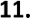

---

<!-- pagina: 67 -->

**Equipe Exatas Estratégia Concursos Aula 06** 

# **– LISTA DE QUESTÕES MULTIBANCAS** 

## Argumentos: estrutura básica e classificação 

**<mark>(FGV/TCEPE/2025) Considere a forma dos raciocínios a seguir.</mark>** 

**I. Nenhum número primo é divisível por 2, exceto o próprio 2. O número 5 é primo. Logo, o número 5 não é divisível por 2.** 

**II. Se uma empresa reduz custos, então aumenta o lucro. Esta empresa aumentou o lucro. Portanto, ela reduziu custos.** 

**III. Noto que nenhum gato que observei até hoje era roxo. Logo, não deve existir nenhum gato roxo.** 

**É raciocínio do tipo indutivo o que se afirma em:** 

a) I, II e III. 

b) I e II, apenas. 

c) I e III, apenas. 

d) II e III, apenas. 

e) III, apenas. 

**<mark>(Instituto Verbena/SEBRAE GO/2025) Considere o seguinte argumento: “Hoje pela manhã estava calor e não havia nuvens no céu; à tarde, o tempo estava ameno e o céu estava parcialmente nublado. Logo, quando o céu está nublado não pode fazer calor.” Esse argumento é um exemplo de</mark>** 

a) dedução. 

b) abdução. 

c) analogia. 

d) indução. 

**<mark>(Instituto Consulplan/DPE PR/2024) Das alternativas apresentadas a seguir, qual apresenta o raciocínio</mark>** 

**indutivo?** 

a) Os técnicos administrativos da DPE-PR são todos felizes. Por isso eu quero passar neste concurso: para ser feliz. 

b) Amanhã é feriado para os servidores públicos do Paraná. Assim, os técnicos administrativos da DPE-PR poderão descansar. 

c) Para se tornar defensor público é preciso ser bacharel direito. Como Carla é defensora pública, certamente ela é bacharel em direito. 

d) Jonas foi participar de um curso na Alemanha. José vai fazer mestrado na França. Marcela foi palestrar em um seminário na Espanha. Ser servidor da DPE-PR significa ter oportunidades de aprimoramento profissional.

---

<!-- pagina: 68 -->

**Equipe Exatas Estratégia Concursos Aula 06** 

**<mark>(CEBRASPE/TRF6/2025) Julgue o item a seguir, referente ao raciocínio analítico e à estrutura da argumentação.</mark>** 

**No texto a seguir, a conclusão é estabelecida com base em um raciocínio de natureza abdutiva.** 

**“João e Maria são casados. João tem cabelo preto. Maria tem cabelo preto. Logo, os filhos deles também terão cabelo preto.”** 

**<mark>(CEBRASPE/TRF6/2025) Considerando as características do raciocínio analítico e a estrutura da argumentação, julgue o item a seguir.</mark>** 

**Suponha que uma pessoa procure um livro em sua estante, não o ache e, diante disso, chegue à seguinte conclusão: “Alguma pessoa mexeu na minha estante e pegou o livro que procuro.”. Nesse caso, tal conclusão foi elaborada com base no raciocínio indutivo.** 

**<mark>(FEPESE/Pref. Brusque/2024) Analise o seguinte trecho:</mark>** 

**– Todos os cachorros que eu conheci são bravos.** 

**Portanto, todos os cachorros devem ser bravos.** 

**Assinale a alternativa que indica corretamente o tipo de raciocínio lógico utilizado nesse trecho.** 

a) Crítica 

b) Abdução 

c) Contradição 

d) Dedução 

e) Indução 

**<mark>(SELECON/CM Rio Brilhante/2024) A indução e a dedução são processos de raciocínio amplamente usados em várias áreas do conhecimento. No que tange a esse assunto, a alternativa que apresenta um exemplo de raciocínio dedutivo é:</mark>** 

a) Joana tem apenas cinco anos de idade e já é uma criança obesa. A obesidade infantil é um problema de saúde pública da atualidade. 

b) Sérgio comprou um bilhete da loteria. Ele orou fervorosamente para que seu bilhete fosse premiado. Isso não ocorreu, portanto, Deus não existe. 

c) Pedro almoçou duas vezes no restaurante do Heitor. Ele gostou muito da comida e do serviço e passou a recomendar esse restaurante para os seus amigos. 

d) As viagens aéreas internacionais são a realização dos sonhos de muitas pessoas, mas também produzem tragédias, como a do acidente aéreo que vitimou inúmeros indivíduos que iam do Rio a Paris em 2009. 

e) John é americano. Ele viaja para o Brasil a fim de encontrar amigos brasileiros que gostam muito de jogar futebol. Ele percebe a habilidade de seus amigos nesse esporte. Ao voltar para o seu país, conta aos seus amigos e familiares que todos os brasileiros são bons jogadores de futebol.

---

<!-- pagina: 69 -->

**Equipe Exatas Estratégia Concursos Aula 06** 

**<mark>(COPESE/UFT/2024) A lógica dedutiva formal está interessada nas relações estruturais que articulam antecedentes e consequentes. Nessa lógica, pode-se dizer que a DEDUÇÃO se caracteriza por:</mark>** 

**I.  Ter um consequente que é inferência necessária do antecedente.** 

**II.  Ser um argumento organizado por enumeração.** 

**III.  Ter um consequente cujo conteúdo não excede, não é mais informativo, que o do antecedente.** 

**IV.  Ser um argumento que parte sempre do particular para o geral.** 

**V. Ter um consequente que não leva a um conhecimento novo, mas organiza o conhecimento já adquirido.** 

##### **Assinale a alternativa CORRETA.** 

a) Apenas as afirmativas I, II e IV estão corretas. 

b) Apenas as afirmativas III e V estão corretas. 

c) Apenas as afirmativas I e II estão corretas. 

d) Apenas as afirmativas I, III e V estão corretas. 

- e) Nenhuma das afirmativas está correta. 

**<mark>(CEBRASPE/CGE RJ/2024) Certo pensador, ao comentar a respeito de determinada ideologia, manifestou</mark>** 

**<mark>a seguinte opinião: “Essa ideologia é igual às outras: se você acredita, não precisa de explicação; se você não acredita, não adianta explicação.”.</mark>** 

**Uma pesquisa revelou que, de 1.000 pessoas de uma cidade, 300 conhecem e acreditam na referida ideologia, 400 a conhecem, mas não acreditam nela, 200 não a conhecem e 100 a conhecem, mas são indiferentes (nem dizem acreditar, nem dizem desacreditar).** 

**Considerando essa situação hipotética, julgue o item a seguir.** 

**As informações apresentadas, em especial a opinião do pensador, permitem inferir que a ideologia em referência prescinde de explicação.** 

**<mark>(IBFC/Pref. Cuiabá/2023) O tipo de raciocínio que se utiliza da regra do argumento e sua premissa para se chegar a uma conclusão é:</mark>** 

a) Abdução 

b) Indução 

c) Tratamento 

d) Dedução 

**<mark>(IBFC/Pref. Cuiabá/2023) O tipo de raciocínio que se utiliza da conclusão e da regra para defender que a premissa pode explicar a conclusão é chamado de:</mark>** 

a) Dedução

---

<!-- pagina: 70 -->

**Equipe Exatas Estratégia Concursos Aula 06** 

b) Indução 

c) Abdução 

##### d) Tratamento 

**<mark>(IDCAP/CREA BA/2023) Analise o argumento abaixo.</mark>** 

**Carlos é atleta.** 

**Todo atleta gosta de açaí. Logo, Carlos gosta de açaí.** 

**A conclusão dada é classificada como uma:** 

a) Dedução. 

b) Analogia. 

c) Inferência. 

d) Transferência. 

e) Indução. 

**<mark>(FGV/Câmara dos Deputados/2023) O procedimento lógico, pelo qual se passa de alguns fatos particulares para um princípio geral, e em que se pode estabelecer uma lei geral a partir da repetição constatada de regularidades em vários casos particulares, é denominado</mark>** 

a) teorização. 

b) dedução. 

c) objetivação. 

d) indução. 

e) comparação. 

**<mark>(IMPARH/Pref. Fortaleza/2022) Considere as seguintes afirmações como verdadeiras:</mark>** 

**I. “Se João come muitos doces, então ele fica com dor de barriga.”** 

**II. “Se João fica com dor de barriga, então ele toma remédio.”** 

**III. “Se João toma remédio, então ele fica com sono.”** 

**IV. “Se João fica com sono, então ele chega atrasado no trabalho.”** 

**Suponha que João não tomou remédio. Podemos concluir que João:** 

a) não comeu muitos doces. 

b) ficou com dor de barriga. 

c) não ficou com sono.

---

<!-- pagina: 71 -->

**Equipe Exatas Estratégia Concursos Aula 06** 

##### d) chegou atrasado no trabalho. 

**<mark>(IBFC/MGS/2022) O tipo de raciocínio lógico que se utiliza da regra e sua premissa para se chegar à conclusão é:</mark>** 

a) Dedução 

b) Abdução 

c) Indução 

d) Propulsão 

**<mark>(IBFC/DPE MT/2022) O tipo de raciocínio lógico cujo objetivo é se determinar a regra a partir de como a conclusão segue da premissa é chamado de:</mark>** 

a) indução 

b) abdução 

c) dedução 

d) assimilação 

**<mark>(IBFC/MGS/2022) Em lógica, pode-se dizer os 3 tipos de raciocínio são: dedução, indução e abdução. Se for dada uma premissa, uma conclusão e uma regra pela qual a premissa implica a conclusão, então</mark> podemos dizer que:** 

a) dedução corresponde a determinar a regra 

b) indução corresponde a determinar a conclusão 

- c) abdução corresponde a determinar a premissa 

- d) indução corresponde a determinar a premissa 

**<mark>(FGV/PCAM/2022) Identifique o trecho a seguir que apresenta a estrutura de uma premissa levando a uma conclusão.</mark>** 

a) Ouvi o barulho de um gambá na cozinha; a cozinheira deve ter deixado o pote de ração dos gatos no chão. 

b) Todos já devem ter chegado à festa, porque ninguém mais telefonou, reclamando do atraso. 

c) Nossos amigos possivelmente vão ser aprovados no concurso, já que estudaram bastante tempo. 

d) Talvez as encomendas cheguem a tempo, pois partiremos depois de amanhã. 

e) O lixeiro deve estar passando em nossa porta; senti um odor de coisa podre. 

**<mark>(FGV/TJDFT/2022) “Quando se julga por indução e sem o necessário conhecimento dos fatos, às vezes chega-se a ser injusto até mesmo com os malfeitores.”</mark>**

---

<!-- pagina: 72 -->

**Equipe Exatas Estratégia Concursos Aula 06** 

**O raciocínio abaixo que deve ser considerado como indutivo é:** 

a) Os funcionários públicos folgam amanhã, por isso meu marido ficará em casa; 

b) Todos os juízes procuram julgar corretamente, por isso é o que ele também procura; 

c) Nos dias de semana os mercados abrem, por isso deixarei para comprar isso amanhã; 

d) No inverno, chove todos os dias, por isso vou comprar um guarda-chuva; 

e) Ontem nevou bastante, por isso as estradas devem estar intransitáveis. 

**<mark>(Instituto AOCP/FUNPRESP JUD/2021) Considerando o conteúdo e as características do raciocínio lógico e analítico, julgue o seguinte item.</mark>** 

**"Quando trabalho de manhã, folgo à tarde. Trabalhei hoje de manhã. Logo, folgarei hoje à tarde" é um exemplo de raciocínio lógico por dedução.** 

**<mark>(Instituto AOCP/FUNPRESP JUD/2021) Considerando o conteúdo e as características do raciocínio lógico e analítico, julgue o seguinte item.</mark>** 

**"Quando trabalho de manhã, folgo à tarde. Folguei à tarde, então pode ter acontecido de eu ter ido trabalhar no período da manhã" é um exemplo de raciocínio lógico por indução, pois é a melhor explicação para o fato de eu folgar no período da tarde.** 

**<mark>(Instituto AOCP/FUNPRESP JUD/2021) Considerando o conteúdo e as características do raciocínio lógico e analítico, julgue o seguinte item.</mark>** 

**Numa argumentação por analogia, ressaltamos características em comum entre duas ou mais situações com o intuito de inferir conclusões parecidas. Porém, seja qual for essa relevância, um argumento por analogia é sempre um argumento indutivo e nunca um argumento dedutivo, isto é, trata-se de um argumento que da verdade das premissas infere a conclusão como provavelmente verdadeira, e não de um argumento no qual a verdade da conclusão se segue necessariamente da verdade das premissas.** 

**<mark>(FGV/TCEAM/2021) Um teólogo russo, V. S. Soloviev, declarou: “Sinto vergonha, logo existo”.</mark>** 

**A afirmação INADEQUADA sobre essa frase:** 

a) é parte de um silogismo em que falta a conclusão; 

b) mostra intertextualidade com uma frase famosa; 

c) emite uma opinião pessoal do seu autor; 

d) exemplifica um texto de caráter argumentativo; 

e) não traz as duas premissas de um silogismo. 

**<mark>(IBFC/Pref. Cruzeiro do Sul/2019) Considere o argumento:</mark>** 

---

<!-- pagina: 73 -->

**Equipe Exatas Estratégia Concursos Aula 06** 

##### **Aqui só temos rosas e violetas** 

##### **As rosas são vermelhas** 

**As violetas são azuis.** 

**Esta flor é vermelha, então é uma rosa.** 

**Quanto ao tipo de raciocínio envolvido nesse argumento, assinale a alternativa correta.** 

a) Indução 

b) Falácia 

c) Tautologia 

d) Dedução 

**<mark>(IBFC/Pref. Candeias/2019)  Analise as afirmativas abaixo, dê valores Verdadeiro (V) ou Falso (F)</mark>** 

**I. O raciocínio por indução parte de particularidades para se obter uma conclusão geral.** 

**II. O raciocínio por dedução utiliza-se de uma regra geral para se analisar casos particulares.** 

**III. Raciocínio indutivo e dedutivo são tipos de raciocínios diferentes.** 

**Assinale a alternativa que apresenta a sequência correta de cima para baixo.** 

a) V, F, F 

b) V, F, V 

c) V, V, V 

d) F, F, V 

**<mark>(IBFC/Pref. C Sto. Agostinho/2019)  Leia atentamente: Bolas iguais numeradas em ordem crescente de</mark> 1 a 20 são postas em uma urna opaca. 10 Bolas são azuis e 10 Bolas são vermelhas. Sendo assim, analise** **<mark>as afirmativas abaixo:</mark>** 

**I. A probabilidade de, em um sorteio aleatório, ser retirada da urna uma bola azul é de uma em duas, ou seja 50%.** 

**II. Se 10 bolas da urna forem retiradas em sequência, sem reposição, e todas são azuis, então o sorteio é provavelmente viciado.** 

**III. Se 19 Bolas forem retiradas sem reposição, então a última bola na urna é conhecida.** 

**Quanto ao fundamento, em termos do raciocínio lógico utilizado, assinale a alternativa correta.** 

a) I-dedução; II-indução; III-dedução 

b) I-indução; II-dedução; III-dedução 

c) I-dedução; II-dedução; III-dedução 

d) I-indução; II-indução; III-indução

---

<!-- pagina: 74 -->

**Equipe Exatas Estratégia Concursos Aula 06** 

**<mark>(IBFC/IDAM/2019) Dentre as proposições condicionais abaixo, assinale a alternativa que apresenta qual corresponde a um exemplo correto de aplicação do método de indução para obtenção da conclusão.</mark>** 

a) Se os cães desse bairro têm rabo, e cães são quadrúpedes, então, quadrúpedes têm rabo 

b) Se o ônibus passa às 18h e agora é 17h35, então o ônibus passará em 25 minutos 

c) Se Jorge é irmão de José, e José é irmão de João, então Jorge é irmão de João 

d) Se laranjeiras dão laranjas, e quero laranjas em meu quintal, então plantarei laranjeiras no quintal 

**<mark>(IBFC/Pref. Cruzeiro do Sul/2019) A preservação do movimento pela Natureza consiste de uma lei enunciada por Galileo Galilei na primeira metade do século XVII, identificada sob o nome de Lei da Inércia</mark> e que consiste de uma das leis da Física na teoria sobre o movimento de Isaac Newton, desenvolvida na** ==5460== **<mark>segunda metade do século XVII.</mark>** 

##### **Analise o fato experimental abaixo.** 

**Fato experimental: Um objeto que se desloca (sem rolar) contra uma superfície está submetido à fricção (atrito) que resulta no surgimento de uma força oposta ao deslocamento do corpo ao longo do tempo. Essa força retira gradualmente movimento do corpo até pará-lo completamente em relação à superfície. Quanto mais lisas as superfícies do corpo e a superfície sobre a qual ele se desloca, verifica-se que um mesmo impulso resulta em um maior deslocamento total do corpo em relação à superfície até ele parar.** 

**Considere o argumento abaixo construído por uma pessoa a partir deste fato experimental.** 

**Argumento: se forças de atrito cada vez menores permitem deslocamentos cada vez maiores do corpo sobre a superfície, se fosse possível eliminar o atrito completamente, então o corpo nunca pararia, seguindo com velocidade constante.** 

**Se, em experimentos, se conseguir produzir atritos progressivamente menores, sem nunca conseguir eliminar por completo, assinale a alternativa que corretamente identifica o tipo de raciocínio que caracteriza o Argumento apresentado (lei da Inércia).** 

a) Dedução 

b) Indução 

c) Reiteração 

d) Paradoxo 

**<mark>(CONSULPLAN/CM BH/2018) “Um gato preto a atravessar o meu caminho significa que o animal está a ir para algum lado.” (Groucho Marx.)</mark>** 

**70% dos gatos abandonados são pretos. Os números foram partilhados pela RSPCA, baseados em 1.000 gatos abandonados ao seu cuidado.** 

**A principal causa apontada é a dificuldade dos donos em tirar fotografias com eles. Numa sociedade dominada pela exposição nas redes sociais e pelas selfies, ter um gato que parece sempre a silhueta de um gato, não parece cativar. Mas o fenômeno com os gatos pretos vai muito mais além de uma simples questão fotográfica. As superstições ainda estão muito vivas na nossa sociedade e os gatos pretos acabam por representar um enigma para muitas pessoas, que chegam a temê-los de forma irracional.**

---

<!-- pagina: 75 -->

**Equipe Exatas Estratégia Concursos Aula 06** 

**(Disponível em: https://www.mundodosanimais.pt/gatos/gato-preto/.)** 

**Ao sair de casa, Silvana viu um gato preto e, logo a seguir, caiu e quebrou o braço. Maria viu o mesmo gato e, alguns minutos depois, foi assaltada. Joseph também viu o mesmo gato e, ao sair do estacionamento, bateu com o carro. Logo, o fato é** 

a) raciocínio lógico indutivo. 

- b) raciocínio lógico dedutivo. 

c) indução por enumeração incompleta. 

d) analogia, indução, probabilidade matemática. 

##### **<mark>(CONSULPLAN/CM BH/2018)</mark>** 

**Ônibus são incendiados em Belo Horizonte e na Região Metropolitana** 

**De acordo com a Polícia Militar, quatro coletivos foram atacados. Em um dos incêndios, os bandidos deixaram um bilhete reivindicando melhorias em presídio da Grande BH.** 

**(Disponível em: https://g1.globo.com/mg/minas-gerais/noticia/onibus-sao-incendiados-em-belo-horizonte-e-na-regiaometropolitana.ghtml.)** 

**Há fumaça saindo do terminal de ônibus intermunicipais e vários carros do Corpo de Bombeiros indo naquela direção. Pode-se concluir, portanto, que há incêndio no citado terminal. Temos, portanto, um argumento** 

a) dedutivo. 

b) indutivo forte. 

c) indutivo fraco. 

d) lógico dedutivo.

---

<!-- pagina: 76 -->

**Equipe Exatas Estratégia Concursos Aula 06** 

# **– GABARITO MULTIBANCAS** 

## Argumentos: estrutura básica e classificação 

LETRA E LETRA C ERRADO LETRA D LETRA A CERTO LETRA D LETRA D LETRA A ERRADO LETRA A LETRA D ERRADO LETRA A LETRA C LETRA E LETRA A LETRA A LETRA D LETRA C LETRA A LETRA D LETRA A LETRA B ERRADO LETRA E LETRA A LETRA D CERTO LETRA B 

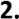

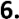

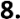

---

<!-- pagina: 77 -->

