---
fonte_pdf: "Raciocínio Lógico - Aula 07.pdf"
paginas: 120
conversao: texto-e-imagens
---

<!-- pagina: 2 -->

**Equipe Exatas Estratégia Concursos Aula 07** 

# **Índice** 

|................................................................................................................................................ 1) Orientação Temporal|.............................................. 3|
|---|---|
|................................................................................................................................................ 2) Orientação Espacial|.............................................. 27|
|................................................................................................................................................ 3) Princípio da Casa dos Pombos|.............................................. 33|
|................................................................................................................................................ 4) Questões Comentadas - Orientação Temporal - FGV|.............................................. 43|
|................................................................................................................................................ 5) Questões Comentadas - Orientação Espacial - FGV|.............................................. 60|
|................................................................................................................................................ 6) Questões Comentadas - Princípio da Casa dos Pombos - FGV|.............................................. 82|
|................................................................................................................................................ 7) Lista de Questões - Orientação Temporal - FGV|.............................................. 100|
|................................................................................................................................................ 8) Lista de Questões - Orientação Espacial - FGV|.............................................. 107|
|................................................................................................................................................ 9) Lista de Questões - Princípio da Casa dos Pombos - FGV|.............................................. 114|

---

<!-- pagina: 3 -->

**Equipe Exatas Estratégia Concursos Aula 07** 

# **A AULA PRESENTAÇÃO DA** 

Fala, pessoal! 

Nessa aula trataremos sobre diferentes **problemas de lógica** que podem aparecer na sua prova. 

No tópico de **orientação temporal** , serão abordados alguns conceitos básicos de **unidades de tempo** e de **calendários** . Quanto ao assunto de **calendários** , percebi que **os alunos costumam errar essas questões por uma unidade** . Por exemplo, sendo a resposta de uma questão " **terça-feira** ", percebi que os erros se concentravam nas alternativas que apresentassem como resposta " **segunda-feira** " ou " **quarta-feira** ". Para evitarmos esses erros, desenvolvi uma **teoria própria** que envolve conceitos de " **intervalo inclusive** " e " **intervalo exclusive** ". Seguindo os passos corretamente, você nunca mais vai errar esse tipo de questão. 

Em seguida, teremos os tópicos de **orientação espacial** e **princípio da casa dos pombos** . Cumpre destacar que esse último assunto pode vir a ser cobrado mesmo que não esteja explícito nos editais. 

Como de costume, vamos exibir, no **início da aula** , um pequeno **resumo** para que você tenha uma visão geral do conteúdo antes de iniciar o assunto. 

Conte comigo nessa caminhada =) 

**Prof. Eduardo Mocellin.** 

**@edu.mocellin**

---

<!-- pagina: 4 -->

**Equipe Exatas Estratégia Concursos Aula 07** 

# **ORIENTAÇÃO TEMPORAL** 

###### **Orientação temporal** 

**Unidades de tempo** 

**1 minuto** = **60 segundos** 

**1 hora** = **60 minutos** = **3.600 segundos 1 dia** = **24 horas** = **86.400 segundos** 

**1 semana** = **7 dias** 

**1 ano** = **365 dias** (exceto o ano bissexto, que tem 366 dias) 

**Introdução ao calendário** 

###### **<u>Número de dias de cada mês</u>** 

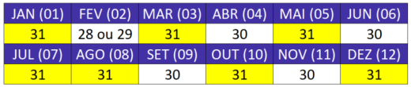

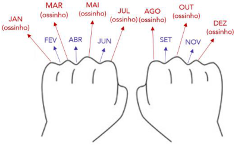

<mark>Ano normal e ano bissexto</mark> 

**<u>Fevereiro</u>** pode ter **28 dias** , para o caso de um **ano normal** , ou **29 dias** , para o caso de um **ano bissexto** . **Ano normal** : começa e termina no **<u>mesmo</u>** dia da semana. 

**Ano bissexto** : termina no dia da semana **<u>seguinte</u>** ao dia da semana em que começou o ano. 

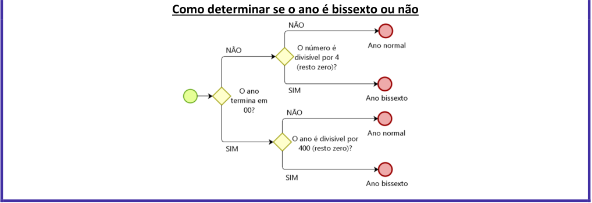

<!-- Start of picture text -->
Como determinar se o ano é bissexto ou não <!-- End of picture text -->

---

<!-- pagina: 5 -->

**Equipe Exatas Estratégia Concursos Aula 07** 

<mark>Anos com calendários iguais</mark> 

Para termos dois anos com calendários iguais, é necessário que: 

- O primeiro dia de ambos os anos devem começar no mesmo dia da semana; e 

- Os anos devem ser ambos "normais" ou ambos bissextos. 

**Intervalo inclusive** × **Intervalo exclusive** 

O **intervalo inclusive** é o número de dias transcorridos entre duas datas em que se considera na contagem o **<u>dia inicial</u>** e o **<u>dia final</u>** <u>. Para dias de um mesmo mês:</u> 

**Intervalo inclusive** = ( **Dia Final** − **Dia Inicial** ) + 1 

O **intervalo exclusive** é o número de dias que se deve somar à **<u>data inicial</u>** para se obter a **<u>data final</u>** <u>. Para</u> dias de um mesmo mês: 

**Intervalo exclusive** = ( **Dia Final** − **Dia Inicial** ) 

Quando o **intervalo exclusive** a ser obtido não é entre datas de um mesmo mês, devemos **obter o intervalo inclusive** e **subtrair uma unidade** . Isso porque **intervalo exclusive** é o número de dias entre duas datas sem considerar a **<u>data inicial</u>** <u>. Portanto:</u> 

**Intervalo exclusive** = **Intervalo inclusive** − 1 

**Problemas envolvendo dias da semana** 

<mark>Dia da semana da data inicial é dado</mark> 

- Identificar o **intervalo exclusive** ; 

- Dividir o **intervalo exclusive** por 7 e obter o **resto** ; 

- Obter o dia da semana da **<u>data final somando</u>** o resto ao dia da semana da **<u>data inicial</u>** . 

###### <mark>Dia da semana da data final é dado</mark> 

- Identificar o **intervalo exclusive** ; 

- Dividir o **intervalo exclusive** por 7 e obter o **resto** ; 

- Obter o dia da semana da **<u>data inicial subtraindo</u>** o **resto** do dia da semana da **<u>data final</u>** . 

###### <mark>Datas com o mesmo dia da semana</mark> 

Duas datas apresentam o mesmo dia da semana quando a divisão do **intervalo exclusive** por 7 der **resto zero** . 

- Ao **somarmos** múltiplos de 7 dias (7, 14, 21, etc.) a uma **<u>data inicial</u>** <u>, a</u> **<u>data final</u>** obtida apresenta o **<u>mesmo dia da semana</u>** do que a **<u>data inicial</u>** . 

- Ao **subtrairmos** múltiplos de 7 dias (7, 14, 21, etc.) de uma **<u>data final</u>** <u>, a</u> **<u>data inicial</u>** obtida apresenta o **<u>mesmo dia da semana</u>** do que a **<u>data final</u>** <u>.</u>

---

<!-- pagina: 6 -->

**Equipe Exatas Estratégia Concursos Aula 07** 

## Unidades de tempo 

Temos as seguintes relações entre as unidades de tempo: 

##### **1 minuto = 60 segundos** 

**1 hora = 60 minutos = 3.600 segundos** 

**1 dia = 24 horas** 

Veja que 1 hora tem 3.600 segundos. Isso ocorre por conta do seguinte cálculo: 

**1 hora** = 60 **minutos** 

= 60 × **60 segundos** 

= **3.600 segundos** 

Quantos segundos temos em um dia? 86.400 segundos. 

**1 dia** = 24 **horas** 

= 24 × **3.600 segundos** 

= **86.400 segundos** 

Deve-se saber também que: 

**1 semana = 7 dias** 

**1 ano = 365 dias** 

( **exceto o ano bissexto** , **que tem 366 dias** ) 

### Subtração de tempos 

Especial atenção deve ser dada **quando se subtrai tempos** . Nesses casos, pode ser necessário transformar horas em minutos ou minutos em segundos para que a operação seja efetuada. Veja o exemplo a seguir: 

**(Pref. Santo André/2024)** Um funcionário começou um determinado serviço às 6 horas e 40 minutos. Esse funcionário trabalhou sem parar e terminou o serviço às 8 horas e 25 minutos. 

O tempo que esse funcionário levou para fazer esse serviço foi de 

a) 1 hora e 15 minutos. 

b) 1 hora e 45 minutos. 

c) 2 horas e 15 minutos. 

d) 2 horas e 45 minutos. 

**Comentários:** 

https://t.me/KakashiAssinaturasBot

---

<!-- pagina: 7 -->

**Equipe Exatas Estratégia Concursos Aula 07** 

Para obter o tempo que o funcionário trabalhou, devemos subtrair o **horário de início** do **horário de término** : 

8h 25min −6h 40min ⏟ ⏟ Término Início 

Observe que não se pode subtrair **40min** de **25min** , pois **nesse caso obteríamos** " **minutos negativos** ". 

Nesse caso, como **1h = 60min** , vamos " **pedir 60 minutos emprestados** " para as **8h** . Em outras palavras, para realizar a subtração, **vamos transformar 8h 25min** em **7h 85min** . Ficamos com a seguinte subtração: 

7h 85min −6h 40min ⏟ ⏟ Término Início 

Com essa transformação, podemos subtrair as horas e os minutos normalmente: 

(7 −6)h (85 −40)min 

= 𝟏𝐡 𝟒𝟓𝐦𝐢𝐧 

O **gabarito** , portanto, é **letra B** . 

A seguir, representamos visualmente a operação realizada: 

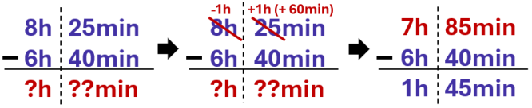

**Gabarito: Letra B.** 

### Conversão de minutos para horas e de segundos para minutos 

Em alguns exercícios, ao se obter uma quantidade de minutos superior a 60, pode ser necessário converter esses minutos em horas. 

Essa conversão é feita **determinando-se quantos** " **conjuntos de 60 minutos** " (ou seja, quantas horas) **cabem no tempo em minutos considerado** . Para tanto, **realiza-se a divisão dos minutos por 60** : o **<u>quociente obtido</u> é o número de horas** e o **<u>resto são os minutos restantes que não foram convertidos em horas</u>** . 

**<u>Exemplo</u>** <u>:</u> **310 minutos** dividido por **60** deixa **quociente 5** e **resto 10** . Isso significa que: 

**310 minutos** = **5 horas** e **10 minutos** 

O mesmo pode ocorrer com os segundos, ou seja, ao se obter um número de segundos superior a 60, pode ser necessário converter esses segundos para minutos. Nesse caso, converte-se os segundos para minutos seguindo o mesmo procedimento: ao realizar a **divisão dos segundos por 60** , o **<u>quociente obtido é o número</u> de minutos** e o **<u>resto são os segundos restantes que não foram convertidos em minutos</u>** . 

**<u>Exemplo</u>** <u>:</u> **520 segundos** dividido por **60** deixa **quociente 8** e **resto 40** . Isso significa que: 

**520 segundos** = **8 min** e **40 segundos**

---

<!-- pagina: 8 -->

**Equipe Exatas Estratégia Concursos Aula 07** 

**(CM Itapeva/2024)** Um piloto de testes deu 9 voltas completas em uma pista de corrida e gastou, no total, 33 minutos. Sabendo que cada volta levou exatamente o mesmo tempo, o tempo gasto em cada volta foi igual a 

a) 4 minutos. 

b) 3 minutos e 50 segundos. 

c) 3 minutos e 40 segundos. 

d) 3 minutos e 15 segundos. 

e) 2 minutos e 50 segundos. 

##### **Comentários:** 

O tempo total gasto para as 9 voltas é **33min** . Como **1min = 60 segundos** , o tempo total gasto, em segundos, é: 

33 × 60 = 1.980 segundos 

Portanto, **o tempo gasto em cada volta** , **em segundos** , é: 

1.980 segundos 

9 voltas 

= 220 segundos por volta 

Observe que as alternativas estão em minutos e segundos. Ao dividir **220 segundos** por **60** , obtemos **quociente 3** e **resto 40** . Portanto: 

**220 segundos** = **3 minutos** e **40 segundos** 

**Gabarito: Letra C.** 

### Horas e minutos com partes decimais 

Podemos também encontrar problemas em que temos horas e minutos com partes decimais. 

**Se tivermos horas com casas decimais, basta separar a parte decimal e multiplicá-la por 60 para obtermos os minutos correspondentes** . Exemplo: 

5,1 horas = 5 horas + 𝟎, 𝟏 **horas** 

= 5 horas e (𝟎, 𝟏× 𝟔𝟎) **minutos** 

5 horas e 𝟔 **minutos** 

**O mesmo ocorre para quando temos minutos com casas decimais: basta multiplicar a parte decimal por 60 para obtermos os segundos correspondentes** . Exemplo: 

50,4 minutos = 50 minutos + 𝟎, 𝟒 **minutos** 

= 50 minutos e (𝟎, 𝟒× 𝟔𝟎) **segundos** 

50 minutos e 𝟐𝟒 **segundos** 

Vejamos o exemplo a seguir.

---

<!-- pagina: 9 -->

**Equipe Exatas Estratégia Concursos Aula 07** 

**(TJ PR/2019)** Conforme resolução do TJ/PR, os servidores do órgão devem cumprir a jornada das 12 h às 19 h, salvo exceções devidamente autorizadas. Em determinado dia, o servidor Ivo, devidamente autorizado, saiu antes do final do expediente e, no dia seguinte, ao conferir seu extrato do ponto eletrônico, verificou que deveria repor 3,28 horas de trabalho por conta dessa saída antecipada. Nesse caso, se, no dia em que saiu antes do final do expediente, Ivo havia iniciado sua jornada às 12 h, então, nesse dia, a sua saída ocorreu às 

a) 15 h 28 min. 

b) 15 h 32 min. 

c) 15 h 43 min 12 s. 

d) 15 h 44 min 52 s. 

e) 15 h 57 min 52 s. 

**Comentários:** 

Para determinar o horário de saída, devemos subtrair as **3,28 horas** das **19 horas** : 

19h −3,28h = 𝟏𝟓, 𝟕𝟐 𝐡 

Como temos uma parte decimal de horas, vamos convertê-la para minutos: 

15,72 h = 15h + 𝟎, 𝟕𝟐𝐡 

= 15h + (𝟎, 𝟕𝟐 × 𝟔𝟎) 𝐦𝐢𝐧 

= 15h  𝟒𝟑, 𝟐 𝐦𝐢𝐧 

Sabemos, portanto, que o horário de saída é **15h e 43,2 min** . Como temos uma parte decimal de minutos, vamos convertê-la para segundos: 

15h  43,2 min 

= 15h 43min + 𝟎, 𝟐𝐦𝐢𝐧 

= 15h 43min + (𝟎, 𝟐× 𝟔𝟎)𝐬 

= 15h 43min 𝟏𝟐𝐬 

Logo, a saída ocorreu às **15h 43min 12s** . 

**Gabarito: Letra C.** 

## Introdu ão ao calendário <u>ç</u> 

Primeiramente, vamos ao básico: 

- Tem-se sete **<u>dias da semana</u>** : domingo, segunda-feira, terça-feira, quarta-feira, quinta-feira, sextafeira e sábado. 

- Um **ano tem 12 meses** : janeiro (01), fevereiro (02), março (03), abril (04), maio (05), junho (06), julho (07), agosto (08), setembro (09), outubro (10), novembro (11) e dezembro (12).

---

<!-- pagina: 10 -->

**Equipe Exatas Estratégia Concursos Aula 07** 

### Número de dias dos meses 

O quadro abaixo resume quantos dias existem cada um dos 12 meses do ano. Observe que mês de fevereiro pode apresentar **28 dias** , para o caso de um **ano normal** , ou **29 dias** , para o caso de um **ano bissexto** . Veremos essas definições de ano normal e ano bissexto mais adiante. 

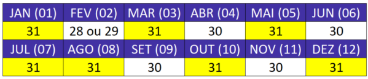

Um mnemônico para não errar quantos dias existem em um determinado mês é o seguinte: 

- Feche as duas mãos, coloque-as lado a lado e observe as articulações (" **ossinhos** ") e os **vãos** que aparecem; 

- Desconsidere os polegares; e 

- Comece a contar os meses a partir do "ossinho" do dedo mínimo da mão esquerda. 

Os " **ossinhos** " representam os meses que têm **31 dias** , e os **vãos** representam os meses que têm **30 dias** ( **exceto no caso de fevereiro, que pode ter 28 ou 29 dias** ). Observe a figura a seguir para melhor clareza do mnemônico. 

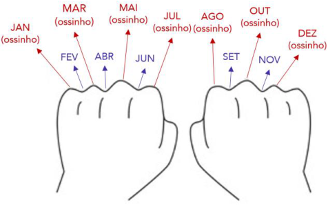

### Ano normal e ano bissexto 

#### **Definição** 

Um **ano normal** , ou seja, um ano que não é bissexto, é aquele que apresenta **365 dias** . Nesse tipo de ano, o mês de **fevereiro** apresenta **28 dias** . 

Uma propriedade importante do **ano normal** é que ele **começa e termina no mesmo dia da semana** . Isso significa que se o dia 1° de janeiro de um ano normal é uma **<u>terça-feira</u>** <u>, o dia 31 de dezembro desse ano</u> normal também será uma **<u>terça-feira</u>** . Consequentemente, o ano seguinte a esse ano normal começará em uma **<u>quarta-feira</u>** <u>.</u> 

O **ano bissexto** é aquele que apresenta **366 dias** . Nesse tipo de ano, o mês de **fevereiro** apresenta **29 dias** . Esses anos **terminam no dia da semana seguinte ao dia da semana em que começou o ano** . Isso significa

---

<!-- pagina: 11 -->

**Equipe Exatas Estratégia Concursos Aula 07** 

que se o dia 1° de janeiro de um ano bissexto é uma **<u>terça-feira</u>** <u>, o dia 31 de dezembro desse ano bissexto</u> será uma **<u>quarta-feira</u>** <u>. Consequentemente, o ano seguinte a esse ano bissexto começará em uma</u> **<u>quintafeira</u>** <u>.</u> 

**Ano normal:** começa e termina no **<u>mesmo</u>** dia da semana. 

**Ano bissexto:** termina no dia da semana **<u>seguinte</u>** ao dia da semana em que começou o ano. 

O ano seguinte a um **ano normal** ou a **um bissexto** começa no dia da semana seguinte ao <u>dia da semana que termina o ano anterior.</u> 

#### **Como determinar se um ano é bissexto** 

Para **determinar se um ano é bissexto** , a **regra geral** é verificar a sua **divisão por 4** : se o número for divisível por 4, o ano é bissexto. Isso significa que, se o resto da divisão do ano por 4 for zero, esse ano é bissexto. 

**Exceção a essa regra geral** ocorre quando **o número é divisível por 100 (termina em 00) e, ao mesmo tempo,** **<u>não é divisível por 400.</u>** Esses anos, apesar de serem divisíveis por 4, **não são bissextos** . 

Para evitar equívocos na identificação dos anos bissextos, o diagrama abaixo resume a regra e a exceção: 

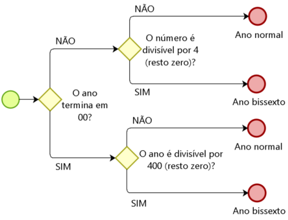

---

<!-- pagina: 12 -->

**Equipe Exatas Estratégia Concursos Aula 07** 

**Determine se os anos 2020, 2005, 2000, 1900 e 1600 são normais ou bissextos.** 

**Ano 2020** . Termina em 00? Não. É divisível por 4? Sim, pois 2020 dividido por 4 deixa resto zero. Logo, é um **ano bissexto** . 

**Ano 2005** . Termina em 00? Não. É divisível por 4? Não, pois 2005 dividido por 4 deixa resto 1. Logo, é um **ano normal** . 

**Ano 2000** . Termina em 00? Sim. É divisível por 400? Sim, pois 2000 dividido por 400 deixa resto zero. Logo, é um **ano bissexto** . 

**Ano 1900** . Termina em 00? Sim. É divisível por 400? Não, pois 1900 dividido por 400 deixa resto 300. Logo, é um **ano normal** . 

### Anos com calendários iguais 

Para termos dois anos com calendários iguais é necessário que: 

- O primeiro dia de ambos os anos devem começar no mesmo dia da semana; e 

- Ambos os anos devem ser normais ou bissextos, não podendo um ser normal e o outro ser bissexto. 

Veja que, se os calendários são iguais, é evidente que o primeiro dia do ano deles devem ser iguais. Observe, porém, que tal fato não basta, pois se um ano for bissexto e o outro não, a igualdade do calendário só ocorre até o dia 28 de fevereiro. 

**(MPE PE/2018)** O ano de 2010 começa em uma sexta-feira e o ano de 2016 também. Assim, as datas de janeiro 2010 e de 2016 correspondem aos mesmos dias da semana. Como 2016 tem 366 dias e 2010 tem 365 dias, a correspondência de datas deixa de ocorrer a partir de 29 de fevereiro de 2016. (A diferença de número de dias indica que 2016 é ano bissexto, o que ocorre de 4 em 4 anos neste século, com a exceção de 2100.) 

Há casos em que os calendários de dois anos distintos correspondem aos mesmos dias da semana durante todo o ano. Por exemplo, são iguais os calendários de 2013 e de 

a) 2015. 

b) 2019. 

c) 2017. 

d) 2018. 

e) 2016. 

##### **Comentários:** 

Para termos dois anos com calendários iguais é necessário que: 

- O primeiro dia de ambos os anos devem começar no mesmo dia da semana; e 

- Ambos os anos devem ser normais ou bissextos, não podendo um ser normal e o outro bissexto.

---

<!-- pagina: 13 -->

**Equipe Exatas Estratégia Concursos Aula 07** 

Lembre-se das seguintes propriedades dos anos: 

- **Ano normal** : começa e termina no mesmo dia da semana. 

- **Ano bissexto** : termina no dia da semana seguinte ao dia da semana em que começou o ano. 

Feita essa observação, tabela abaixo apresenta o primeiro e o último dia dos anos de 2010 a 2019. Note que **2012 e 2016 são anos bissextos** e, portanto, terminam no dia da semana seguinte ao dia da semana em que esses anos começaram. 

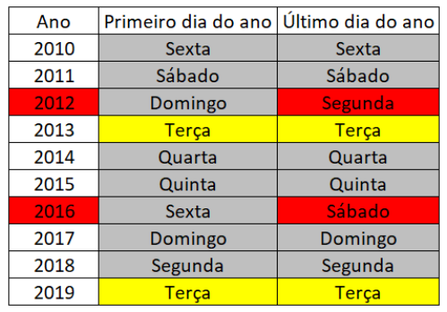

<!-- Start of picture text -->
==5460== <!-- End of picture text -->

Segundo a tabela, veja que **2019 começou em uma sexta-feira** , **assim como 2013** . Como **ambos os anos são normais** (não são bissextos) e **começam no mesmo dia da semana** , então eles apresentam calendários iguais. 

**Gabarito: Letra B.** 

## Intervalo inclusive × Intervalo exclusive 

Em **problemas que envolvem os dias da semana** , é **<u>muito comum</u>** os alunos errarem questões por se esquecerem de contabilizar um dia. **Exemplo** : o gabarito é " **quinta-feira** " e o concurseiro marca " **quartafeira** ". 

Para você não errar questões desse tipo, é importante que você entenda os conceitos de **intervalo inclusive** e **intervalo exclusive** . 

### Intervalo inclusive 

#### **Definição de intervalo inclusive** 

O **intervalo inclusive** é o número de dias transcorridos entre duas datas em que se considera na contagem o **<u>dia inicial</u>** e o **<u>dia final</u>** <u>.</u> 

Para as datas 02/setembro e 09/setembro, temos os dias **<u>02/set</u>** <u>, 03/set, 04/set, 05/set, 06/set, 07/set,</u> 08/set e **<u>09/set</u>** <u>. Logo, o</u> **intervalo inclusive** entre as datas 02/setembro e 09/setembro é de **8 dias** .

---

<!-- pagina: 14 -->

**Equipe Exatas Estratégia Concursos Aula 07** 

#### **Intervalo inclusive entre datas de um mesmo mês** 

**<u>Para dias de um mesmo mês</u>** <u>, o</u> **intervalo inclusive** é obtido da seguinte forma: 

**Intervalo inclusive** = ( **Dia Final** − **Dia Inicial** ) + 1 

Para o exemplo em questão, temos: 

**Intervalo inclusive entre 02/setembro e 09/setembro** = ( **9** − **2** ) + 1 = **8 dias** 

Vamos a alguns exemplos. 

**No mês de abril, Joaquim estudou do dia 5 ao dia 6, inclusive. Quantos dias Joaquim estudou?** 

Não há dúvidas que a questão se refere ao **intervalo inclusive** , pois Joaquim estudou tanto no dia 5 quanto no dia 6. Portanto, ele estudou: 

− **Intervalo inclusive** = ( **Dia Final Dia Inicial** ) + 1 **Intervalo inclusive** = (6 − 5) + 1 = **2 dias** 

Vamos a um novo exemplo. 

**No mês de setembro, Joaquim estudou do dia 8 ao dia 27,** **<u>inclusive. Quantos dias Joaquim</u> estudou?** 

− **Intervalo inclusive** = ( **Dia Final Dia Inicial** ) + 1 

**Intervalo inclusive** = (27 − 8) + 1 = **20 dias** 

#### **Intervalo inclusive entre datas de meses diferentes** 

E se quisermos saber o **intervalo inclusive** entre duas datas de meses diferentes? Nesse caso, devemos nos recordar do número de dias de cada mês. 

**Joaquim estudou do dia 15/abril ao dia 28/out, inclusive. Quantos dias Joaquim estudou?** 

Para resolver esse problema, devemos nos lembrar de quantos dias temos em cada mês. Recomenda-se o uso do "mnemônico das mãos". 

- 

- • Em **abril** , Joaquim estudou do dia 15 ao dia 30, inclusive. Logo, estudou (30 15) + 1 = **16 dias** . 

- 

- • Em **maio** , Joaquim estudou (31 1) + 1 = **31 dias** . Observe que o cálculo aqui foi feito com base na data final de maio (31/maio) e na data inicial de maio (01/maio).

---

<!-- pagina: 15 -->

**Equipe Exatas Estratégia Concursos Aula 07** 

- Em <mark>junho, julho, agosto</mark> e <mark>setembro</mark> podemos proceder da mesma forma. O **intervalo inclusive** **<u>referente a esses meses</u>** é: 

<mark>(30</mark> **<mark>−</mark>** <mark>1) + 1</mark> + <mark>(31 − 1) + 1</mark> + <mark>(31 − 1) + 1</mark> + <mark>(30 − 1) + 1</mark> = 30 + 31 + 31 + 30 = 

**122 dias** 

- 

- • Em **outubro** , Joaquim estudou do dia 1 ao dia 28: (28 1) + 1 = **28 dias** . 

Logo, o **intervalo inclusive** , que é número total de dias de estudo, é dado por: 

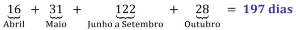

A partir de agora, ao somar meses ou anos completos para se obter o **intervalo inclusive** , vamos simplesmente somar o número de dias do mês ou do ano em questão ao invés de realizar as operações "30 − 1 + 1", "31 − 1 + 1", "365 − 1 + 1", etc. 

#### **Intervalo inclusive entre datas de anos diferentes** 

E se as datas forem entre anos diferentes? O raciocínio é o mesmo. 

**Joaquim estudou do dia 11/abril/2015 ao dia 28/out/2020,** **<u>inclusive. Quantos dias Joaquim</u> estudou?** 

Para resolver esse problema, devemos nos lembrar de quantos dias temos em cada mês. 

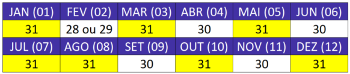

- 

- • Em **abril de 2015** , Joaquim estudou do dia 11 ao dia 30, inclusive: (30 11) + 1 = **20 dias.** 

- Nos **demais meses de 2015 (maio a dezembro)** , ele estudou: 

31 + 30 + 31 + 31 + 30 + 31 + 30 + 31 = **245 dias** . 

- Como **2016** é **bissexto** , Joaquim estudou **366** dias nesse ano. 

- Em **2017** , **2018** e **2019** , Joaquim estudou 365 dias em cada um dos anos: 3 × 365 = **1095 dias** . 

- Em **2020** , que é um ano **bissexto** , Joaquim estudou **até o fim de setembro** o seguinte número de dias: 

31 + **29** + 31 + 30 + 31 + 30 + 31 + 31 + 30 = **274 dias** 

- 

- • Por fim, em **outubro de 2020** <u>, ele estudou (28</u> 1) + 1 = **28 dias** .

---

<!-- pagina: 16 -->

**Equipe Exatas Estratégia Concursos Aula 07** 

O **intervalo inclusive** , que é número total de dias de estudo, é dado por: 

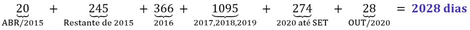

### Intervalo exclusive 

#### **Definição de intervalo exclusive** 

O **intervalo exclusive** é o número de dias que se deve somar à **<u>data inicial</u>** para se obter a **<u>data final</u>** <u>.</u> 

Considere as datas 02/setembro e 09/setembro. Note que, se somarmos 7 dias à data inicial, obtemos a data final, pois 2 + 7 = 9. Logo, o **intervalo exclusive** entre 02/setembro e 09/setembro é 7. 

#### **Intervalo exclusive entre datas de um mesmo mês** 

**<u>Para dias de um mesmo mês</u>** <u>, o</u> **intervalo exclusive** é obtido da seguinte forma: 

− **Intervalo exclusive** = ( **Dia Final Dia Inicial** ) 

Para o exemplo em questão, temos: 

− **Intervalo exclusive entre 02/setembro e 09/setembro** = ( **9 2** ) = **7 dias** 

#### **Intervalo exclusive entre datas de meses ou anos diferentes** 

Quando o **intervalo exclusive** a ser obtido não é entre datas de um mesmo mês, devemos **obter o intervalo inclusive** e **subtrair uma unidade** . Isso porque **intervalo exclusive** é o número de dias entre duas datas sem <u>considerar a</u> **<u>data inicial</u>** <u>. Portanto:</u> 

**Intervalo exclusive** = **Intervalo inclusive** − 1 

**Qual é o número de dias que devemos somar a 11/abril/2015 para se obter 28/out/2020?** 

Veja que o problema pede o **intervalo exclusive** , que pela definição é o número de dias que se deve somar à **<u>data inicial</u>** para se obter a **<u>data final</u>** <u>.</u> 

Para resolver esse problema, devemos **obter o intervalo inclusive** e **subtrair um dia** . 

No exercício anterior, obtemos que o intervalo inclusive entre 11/abril/2015 e 28/out/2020 é 2028 dias. Logo: 

**Intervalo exclusive** = **Intervalo inclusive** − 1 

**Intervalo exclusive** = **2028** − 1 

**Intervalo exclusive** = **2027** 

Logo, devemos somar 2027 à data original para se obter 28/out/2020.

---

<!-- pagina: 17 -->

**Equipe Exatas Estratégia Concursos Aula 07** 

## Problemas envolvendo dias da semana 

Esse tópico dará a você uma **ferramenta** que resolve um **problema específico** de **orientação temporal** . Tratase de problemas em que é dado o **<u>dia da semana</u>** (segunda-feira, terça-feira ...) de uma data específica e <u>pede-se o</u> **<u>dia da semana</u>** <u>de outra data anterior ou posterior.</u> 

Essa teoria não resolve todos os problemas de **orientação temporal** e, portanto, deve ser utilizada somente no seu contexto. A resolução de outros problemas requer uma experiência que só se adquire com a resolução de muitos exercícios. 

A teoria que será apresentada a seguir resolve um **problema específico** de **orientação temporal** . Trata-se de problemas em que é dado o **<u>dia da semana</u>** <u>de uma data específica e pede-se o</u> **<u>dia da semana</u>** <u>de outra data anterior ou posterior.</u> 

### Dia da semana da data inicial é dado 

Existem problemas que apresentam o **dia da semana** de uma **<u>data inicial</u>** e pedem o dia da semana de uma **<u>data final</u>** <u>. Exemplos:</u> 

- Dia 04/junho/2019 foi uma **terça-feira** . Qual dia da semana será dia 05/setembro/2025? 

- Joaquim tomou a primeira dose de um remédio na **sexta-feira** . **<u>500 dias depois</u>** , tomou a última dose. Em qual dia da semana foi tomada a última dose? 

- O médico de Joaquim determinou que ele tomasse um remédio **<u>por 500 dias</u>** . Se ele tomou a primeira dose em uma **terça-feira** , em qual dia da semana ele tomou a última? 

Para resolver esse tipo de problema, devemos seguir os seguintes passos: 

- Identificar o **intervalo exclusive** ; 

- Dividir o **intervalo exclusive** por 7 e obter o **resto** ; 

- Obter o dia da semana da **<u>data final somando</u>** o resto ao dia da semana da **<u>data inicial</u>** . 

Vamos resolver os três exemplos apresentados, mostrando suas peculiaridades. 

---

<!-- pagina: 18 -->

**Equipe Exatas Estratégia Concursos Aula 07** 

##### **Dia 04/junho/2019 foi uma terça-feira. Qual dia da semana será dia 05/setembro/2025?** 

##### **<u>Identificar o intervalo exclusive</u>** 

Para obter o **intervalo exclusive** entre duas datas, devemos obter o **intervalo inclusive** e subtrair uma unidade. 

Lembre-se de quantos dias temos em cada mês: 

O **intervalo inclusive** total é a soma dos seguintes intervalos: 

- 

- • Junho/2019: (30 4) + 1 = **27 dias** ; 

- Julho a dezembro de 2019: 31+ 31 + 30 + 31 + 30 + 31 = **184 dias** ; 

- Ano de 2020 (bissexto): **366 dias** ; 

- Ano de 2021 a 2023:  3 × 365 = **1095 dias** ; 

- Ano de 2024 (bissexto): **366 dias** ; 

- Janeiro a agosto de 2025: 31 + 28 + 31 + 30 + 31 + 30 + 31 + 31 = **243 dias** . 

- Setembro de 2025: (05 − 1) + 1 = **5 dias** . 

**Intervalo inclusive** : 27 + 184 + 366 + 1095 + 366 + 243 + 5 = **2286 dias** . − **Intervalo exclusive** : 2286 1 = **2285 dias** . 

##### **<u>Dividir o intervalo exclusive por 7 e obter o resto</u>** 

2285 dividido por 7 nos dá um quociente 326 e **resto 3** . 

##### **<u>Obter o dia da semana da data final somando o resto ao dia da semana da data inicial</u>** 

Ao **<u>somarmos</u>** 3 dias à terça-feira, obtemos **<u>sexta-feira</u>** <u>, que é o dia da semana correspondente à</u> data de 05/setembro/2025. 

Vamos ao segundo exemplo: 

**Joaquim tomou a primeira dose de um remédio na sexta-feira. 500 dias depois, tomou a última dose. Qual dia da semana foi tomada a última dose?** 

##### **<u>Identificar o intervalo exclusive</u>** 

O **intervalo exclusive** é o número de dias que se deve somar à **<u>data inicial</u>** para se obter a **<u>data final</u>** <u>.</u> 

Observe que os **500 dias é um intervalo exclusive** , pois o último dia em que Joaquim tomou remédio é obtido somando 500 dias à **<u>data inicial.</u>** A **<u>data inicial</u>** em que Joaquim tomou o remédio **<u>não está</u>** inclusa nesses 500 dias. 

##### **<u>Dividir o intervalo exclusive por 7 e obter o resto</u>** 

Se dividirmos 500 por 7, obtemos o quociente 71 e resto 3. 

##### **<u>Obter o dia da semana da data final somando o resto ao dia da semana da data inicial</u>** 

Ao **<u>somarmos</u>** 3 dias à sexta-feira, obtemos **<u>segunda-feira</u>** <u>. Este é o dia da semana em que a</u> última dose foi tomada, **500 dias depois** da primeira.

---

<!-- pagina: 19 -->

**Equipe Exatas Estratégia Concursos Aula 07** 

O terceiro exemplo apresenta uma peculiaridade interessante. Vejamos: 

**O médico de Joaquim determinou que ele tomasse um remédio por 500 dias. Se ele tomou a primeira dose em uma terça-feira, em qual dia da semana ele tomou a última?** **<u>Identificar o intervalo exclusive</u>** 

Observe agora que os **500 dias é um intervalo inclusive** , pois o **<u>dia inicial</u>** e o **<u>dia final</u>** em que Joaquim tomou o remédio estão inclusos nesses 500 dias. Isso porque ele tomou remédio **por 500 dias** . 

**Intervalo exclusive** = **Intervalo inclusive** − 1 

**Intervalo exclusive** = **500** − 1 

**Intervalo exclusive** = **499** 

##### **<u>Dividir o intervalo exclusive por 7 e obter o resto</u>** 

Se dividirmos 499 por 7, obtemos o quociente 71 e **resto 2** . 

**<u>Obter o dia da semana da data final somando o resto ao dia da semana da data inicial</u>** 

Ao **<u>somarmos</u>** 2 dias à terça-feira, obtemos **<u>quinta-feira</u>** <u>. Este é o dia da semana em que a última</u> dose foi tomada. 

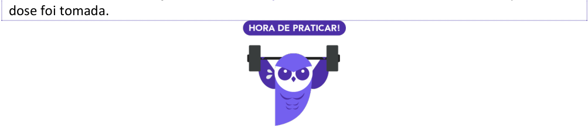

<!-- Start of picture text -->
dose foi tomada. <!-- End of picture text -->

**(PC RN/2021)** Uma delegacia de polícia atende aos cidadãos todos os dias. O novo escrivão foi designado para fazer um relatório das atividades da delegacia de 4 em 4 dias. 

Em cada relatório ele deve registrar as ocorrências do dia e dos três dias anteriores, e o primeiro relatório que ele fez foi num sábado. 

O novo escrivão fez seu 40º relatório em uma: 

a) segunda-feira; 

b) terça-feira; 

c) quarta-feira; 

d) quinta-feira; 

e) sexta-feira. 

##### **Comentários:** 

Temos aqui um problema clássico envolvendo dias da semana em que o " _dia da semana da data inicial é dado_ ".  O dia da semana da data inicial, nesse caso, é um **<u>sábado</u>** <u>.</u> 

Para resolver esse tipo de problema, devemos seguir os seguintes passos: 

- Identificar o **intervalo exclusive** ; 

- Dividir o **intervalo exclusive** por 7 e obter o **resto** ; 

- Obter o dia da semana da **<u>data final somando</u>** o resto ao dia da semana da **<u>data inicial</u>** .

---

<!-- pagina: 20 -->

**Equipe Exatas Estratégia Concursos Aula 07** 

##### **<u>Identificar o intervalo exclusive</u>** 

Como "hoje" o escrivão acaba de fazer um relatório, **restam ainda 39 relatórios** para se chegar ao quadragésimo. 

Como cada relatório é feito após 4 dias, os 39 relatórios serão feitos após: 

39 × 4 = 156 dias 

Devemos, portanto, **<u>somar 156 dias</u>** ao dia da semana da **<u>data inicial</u>** para se obter o dia da semana da **<u>data final</u>** <u>. Logo, o</u> **intervalo exclusive é 156 dias** . 

##### **<u>Dividir o intervalo exclusive por 7 e obter o resto</u>** 

156 dividido por 7 nos dá quociente 22 e **resto 2** . **<u>Obter o dia da semana da data final somando o resto ao dia da semana da data inicial</u>** 

Ao **<u>somarmos</u>** 2 dias ao sábado, obtemos uma **segunda-feira** . 

**Gabarito: Letra A.** 

**(IPSM SJC/2018)** Hoje, dia 28.01.2018, é um domingo. O dia 31.01.2023 será 

a) uma segunda-feira. b) uma terça-feira. c) uma quarta-feira. d) uma quinta-feira. e) um domingo. **Comentários:** 

Temos aqui um problema clássico envolvendo dias da semana em que o " _dia da semana da data inicial é dado_ ". O dia da semana da data inicial, nesse caso, é um **<u>domingo</u>** <u>.</u> Para resolver esse tipo de problema, devemos seguir os seguintes passos: 

- Identificar o **intervalo exclusive** ; 

- Dividir o **intervalo exclusive** por 7 e obter o **resto** ; 

- Obter o dia da semana da **<u>data final somando</u>** o resto ao dia da semana da **<u>data inicial</u>** . 

##### **<u>Identificar o intervalo exclusive</u>** 

Vamos obter o **intervalo inclusive** entre 28.01.2018 e 31.01.2023.

---

<!-- pagina: 21 -->

**Equipe Exatas Estratégia Concursos Aula 07** 

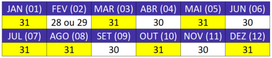

- 

- • Em janeiro de 2018, temos (31 28) + 1 = **4 dias** 

- Em 2018, os meses de fevereiro a dezembro correspondem a: 

28 + 31 + 30 + 31 + 30 + 31 + 31 + 30 + 31 + 30 + 31 = **334 dias** 

- Em 2019 temos **365 dias** . 

- Em 2020, um ano bissexto, temos **366 dias** . 

- De 2021 a 2022, temos 2 × 365 = **730 dias** . 

- Em 2023, até o dia 31.01.2023, temos **31 dias** . 

O **intervalo inclusive** é: 

4 + 334 + 365 + 366 + 730 + 31 = **1830 dias** 

− Logo, o **intervalo exclusive** é **1830** 1 = **1829** . 

**<u>Dividir o intervalo exclusive por 7 e obter o resto</u>** 

1829 dividido por 7 nos dá um quociente 261 e **resto 2** . 

**<u>Obter o dia da semana da data final somando o resto ao dia da semana da data inicial</u>** 

Ao **<u>somarmos</u>** 2 dias ao domingo, obtemos **<u>terça-feira</u>** <u>.</u> 

**Gabarito: Letra B.** 

### Dia da semana da data final é dado 

Um outro tipo de problema que pode aparecer é o seguinte: a questão apresenta o **dia da semana** de uma **<u>data final</u>** e pede o dia da semana de uma **<u>data inicial</u>** . Exemplos **:** 

- Dia 26/abril/2021 foi uma segunda-feira. Qual dia da semana foi 05/agosto/2010? 

- Joaquim tomou a primeira dose de um remédio em um determinado dia. **500 dias depois** , em uma sexta-feira, tomou a última dose. Qual dia da semana foi tomada a primeira dose? 

- O médico de Joaquim determinou que ele tomasse um remédio **por 500 dias** . Se ele tomou a última dose em uma terça-feira, em qual dia da semana ele tomou a primeira? 

Para resolver esse tipo de problema, devemos seguir os seguintes passos: 

- Identificar o **intervalo exclusive** ; 

- Dividir o **intervalo exclusive** por 7 e obter o resto; 

- Obter o dia da semana da **<u>data inicial subtraindo</u>** o resto do dia da semana da **<u>data final</u>** <u>.</u> 

Vamos resolver os três exemplos apresentados, mostrando suas peculiaridades.

---

<!-- pagina: 22 -->

**Equipe Exatas Estratégia Concursos Aula 07** 

**Dia 26/abril/2021 foi uma segunda-feira. Qual dia da semana foi 05/agosto/2010?** 

##### **<u>Identificar o intervalo exclusive</u>** 

Para obter o **intervalo exclusive** entre duas datas, devemos obter o **intervalo inclusive** e subtrair uma unidade. 

Lembre-se de quantos dias temos em cada mês: 

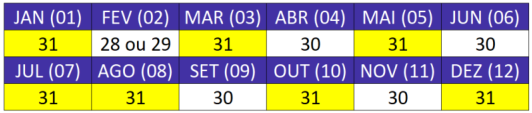

O **intervalo inclusive** total é a soma dos seguintes intervalos: 

- 

- • Agosto/2010: (31 5) + 1 = **27 dias** ; 

- Setembro a dezembro de 2010: 30 + 31 + 30 + 31 = **122 dias** ; 

- Ano de 2011: **365 dias** . 

- Ano de 2012 (bissexto): **366 dias** ; 

- Ano de 2013 a 2015: 3 × 365 = **1095 dias** ; 

- Ano de 2016 (bissexto): **366 dias** ; 

- Ano de 2017 a 2019: 3 × 365 = **1095 dias** ; 

- Ano de 2020 (bissexto): **366 dias** ; 

- Janeiro a março de 2021: 31 + 28 + 31 = **90 dias** . 

- Abril de 2021: (26 − 1) + 1 = **26 dias** . 

**Intervalo inclusive** : = 27 + 122 + 365 + 366 + 1095 + 366 + 1095 + 366 + 90 + 26 = **3918 dias** . − **Intervalo exclusive** : 3918 1 = **3917 dias** . 

##### **<u>Dividir o intervalo exclusive por 7 e obter o resto</u>** 

3917 dividido por 7 nos dá um quociente 559 e **resto 4** . 

##### **<u>Obter o dia da semana da data inicial subtraindo o resto do dia da semana da data final</u>** 

Ao **<u>subtrair</u>** 4 dias da segunda-feira, obtemos **<u>quinta-feira</u>** <u>, que é o dia da semana correspondente</u> à data de 05/agosto/2010. 

Vamos ao segundo exemplo: 

**Joaquim tomou a primeira dose de um remédio em um determinado dia. 500 dias depois, em uma sexta-feira, tomou a última dose. Qual dia da semana foi tomada a primeira dose?** 

##### **<u>Identificar o intervalo exclusive</u>** 

O **intervalo exclusive** é o número de dias que se deve somar à **<u>data inicial</u>** para se obter a **<u>data final</u>** <u>.</u> 

Observe que os **500 dias é um intervalo exclusive** , pois o último dia em que Joaquim tomou remédio é obtido somando 500 dias à **<u>data inicial.</u>** A **<u>data inicial</u>** em que Joaquim tomou o remédio **<u>não está</u>** inclusa nesses 500 dias.

---

<!-- pagina: 23 -->

**Equipe Exatas Estratégia Concursos Aula 07** 

##### **<u>Dividir o intervalo exclusive por 7 e obter o resto</u>** 

Se dividirmos 500 por 7, obtemos o quociente 71 e **resto 3** . 

**<u>Obter o dia da semana da data inicial subtraindo o resto do dia da semana da data final</u>** 

Ao **<u>subtrair</u>** 3 dias da sexta-feira, obtemos **<u>terça-feira</u>** <u>, que é o dia da semana em que foi tomada</u> a primeira dose. 

O terceiro exemplo apresenta uma peculiaridade interessante. Vejamos: 

**O médico de Joaquim determinou que ele tomasse um remédio por 500 dias. Se ele tomou a** **<u>última</u> dose em uma terça-feira, em qual dia da semana ele tomou a primeira?** 

##### **<u>Identificar o intervalo exclusive</u>** 

Observe agora que os **500 dias é um intervalo inclusive** , pois o **<u>dia inicial</u>** e o **<u>dia final</u>** em que 

Joaquim tomou o remédio estão inclusos nesses 500 dias. Isso porque ele tomou remédio **por 500 dias** . 

**Intervalo exclusive** = **Intervalo inclusive** − 1 **Intervalo exclusive** = **500** − 1 **Intervalo exclusive** = **499** 

##### **<u>Dividir o intervalo exclusive por 7 e obter o resto;</u>** 

Se dividirmos 499 por 7, obtemos o quociente 71 e **resto 2** . 

**<u>Obter o dia da semana da data final somando o resto ao dia da semana da data inicial</u>** 

Ao **<u>subtrair</u>** 2 dias da terça-feira, obtemos **<u>domingo</u>** <u>, que é o dia da semana em que foi tomada a primeira dose. rimeira dose.</u> 

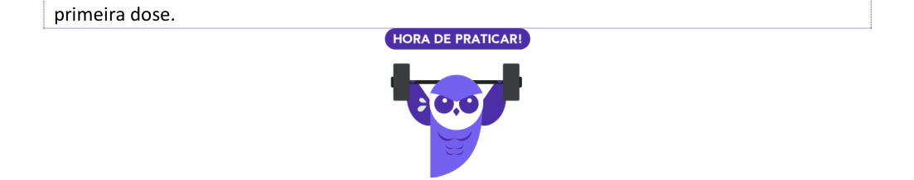

<!-- Start of picture text -->
primeira dose. rimeira dose. <!-- End of picture text -->

**(Pref Salvador/2017)** A cidade de Salvador foi fundada em 29 de março de 1549, uma sexta-feira. Nesse ano, o dia 1º de janeiro foi 

a) uma segunda-feira. 

b) uma terça-feira. 

c) uma quarta-feira. 

d) uma quinta-feira. 

e) um sábado. 

##### **Comentários:** 

Temos aqui um problema clássico envolvendo dias da semana em que o " _dia da semana da_ **_<u>data final</u>_** _é dado_ ". 

Para resolver esse tipo de problema, devemos seguir os seguintes passos:

---

<!-- pagina: 24 -->

**Equipe Exatas Estratégia Concursos Aula 07** 

- Identificar o **intervalo exclusive** ; 

- Dividir o **intervalo exclusive** por 7 e obter o **resto** ; 

- Obter o dia da semana da **<u>data inicial subtraindo</u>** o resto do dia da semana da **<u>data final</u>** . 

##### **<u>Identificar o intervalo exclusive</u>** 

Primeiramente, vamos calcular o **intervalo inclusive** 01/janeiro a 29/março. 

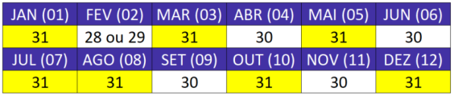

- Em janeiro, temos **31 dias** ; 

- Em fevereiro, temos **28 dias** (ano não bissexto); 

- Em março, temos **29 dias** . 

Logo, o **intervalo inclusive** de 01/janeiro a 29/março do ano em questão é: 

31 + 28 + 29 = 88 

O **intervalo exclusive** é dado por: **88 − 1** = **87 dias** . 

##### **<u>Dividir o intervalo exclusive por 7 e obter o resto</u>** 

87 dividido por 7 nos dá um quociente 12 e **resto 3** . 

**<u>Obter o dia da semana da data inicial subtraindo o resto do dia da semana da data final</u>** 

Ao **<u>subtrairmos</u>** 3 dias de sexta-feira, obtemos **<u>terça-feira</u>** <u>.</u> 

**Gabarito: Letra B.** 

Datas com o mesmo dia da semana 

Duas datas apresentam o mesmo dia da semana quando a divisão do **intervalo exclusive** por 7 der **resto zero** . 

##### **Assinale como CERTO ou ERRADO.** 

**Considere que, em um determinado ano, dia 9 de novembro era uma sexta-feira. Nesse caso, dia 28 de dezembro desse ano também será uma sexta-feira.**

---

<!-- pagina: 25 -->

**Equipe Exatas Estratégia Concursos Aula 07** 

##### **<u>Identificar o intervalo exclusive</u>** 

Para obter o **intervalo exclusive** entre duas datas, devemos obter o **intervalo inclusive** e subtrair uma unidade. 

O **intervalo inclusive** é a soma dos seguintes intervalos: 

- 

- • Novembro: (30 9) + 1 = 22 dias; 

- 

- • Dezembro: (28 1) +1 dias = 28 dias. 

**Intervalo inclusive** : 22 + 28 = **50 dias** . 

**Intervalo exclusive:** 50 − 1 = **49 dias** . 

##### **<u>Dividir o intervalo exclusive por 7 e obter o resto</u>** 

Ao dividir 49 por 7, obtemos o quociente 7 e o resto 0. Logo, 09/novembro e 28/dezembro desse ano apresentam o mesmo dia da semana, isto é, sexta-feira. **Gabarito: CERTO.** 

Como o intervalo entre as datas do problema anterior é pequeno, a questão poderia ter sido resolvida de modo "manual". Para resolver desse modo, deve-se observar o seguinte: 

Ao **somarmos** múltiplos de 7 dias (7, 14, 21, etc.) a uma **<u>data inicial</u>** <u>, a</u> **<u>data final</u>** obtida apresenta o **<u>mesmo dia da semana</u>** do que a **<u>data inicial</u>** <u>.</u> 

Ao **subtrairmos** múltiplos de 7 dias (7, 14, 21, etc.) de uma **<u>data final</u>** <u>, a</u> **<u>data inicial</u>** obtida apresenta o **<u>mesmo dia da semana</u>** do que a **<u>data final</u>** <u>.</u> 

Voltemos à questão: 

**Assinale como CERTO ou ERRADO.** 

**Considere que, em um determinado ano, dia 9 de novembro era uma sexta-feira. Nesse caso, dia 28 de dezembro desse ano também será uma sexta-feira.** 

##### **<u>Resolução manual</u>** 

Como temos duas datas próximas, podemos resolver o problema manualmente. **Nem sempre essa resolução é viável em provas, pois as datas apresentadas poderiam estar muito distantes** . Lembre-se que, ao somar múltiplos de 7 dias a uma data, a nova data obtida recai sobre o mesmo dia da semana. 

- **09/novembro** é uma **<u>sexta-feira</u>** . Somando 21 (3 × 7), temos: **30/novembro** . 

- **30/novembro** é uma **<u>sexta-feira</u>** . Somando 28 (4 × 7), temos: **28/dezembro** . 

- **28/dezembro** é uma **<u>sexta-feira</u>** . 

- **Gabarito: CERTO.**

---

<!-- pagina: 26 -->

**Equipe Exatas Estratégia Concursos Aula 07** 

**(SEFAZ AM/2022)** Ana arruma o seu armário toda segunda sexta-feira de cada mês. Se Ana arrumou o seu armário no dia 11 de março, a arrumação seguinte ocorreu no dia 

a) 6 de abril. 

b) 7 de abril. 

c) 8 de abril. 

d) 9 de abril. 

e) 10 de abril. 

##### **Comentários:** 

Para resolver essa questão, é estritamente necessário você saber que o **mês de março** apresenta **31 dias** . Conforme visto na teoria da aula, temos que: 

Ao **somarmos** múltiplos de 7 dias (7, 14, 21, etc.) a uma **<u>data inicial</u>** <u>, a</u> **<u>data final</u>** obtida apresenta o **<u>mesmo dia da semana</u>** do que a **<u>data inicial</u>** <u>.</u> 

Para o problema em questão: 

- Sabemos que **11 de março** é uma **sexta-feira** . 

- Ao somar 7 dias, chegamos em **18 de março** , uma **sexta-feira** . 

- Ao somar mais 7 dias, chegamos em **25 de março** , uma **sexta-feira** . 

- Como o **mês de março** apresenta **31 dias** , ao somar mais 7 dias a partir de 25 de março, chegamos em **01 de abril** , uma **sexta-feira** . Trata-se da primeira sexta-feira de abril. 

- Ao somar mais 7 dias, chegamos em **08 de abril** , uma **sexta-feira** . Essa é **segunda sexta-feira do mês de abril** . 

**Gabarito: Letra C.**

---

<!-- pagina: 27 -->

**Equipe Exatas Estratégia Concursos Aula 07** 

# **ORIENTAÇÃO ESPACIAL** 

###### **Orientação Espacial** 

**Pontos cardeais e colaterais** A direção **Leste** , também conhecida por **Este** ( **E** ), aponta para a direita. A direção **Oeste** aponta para a esquerda. 

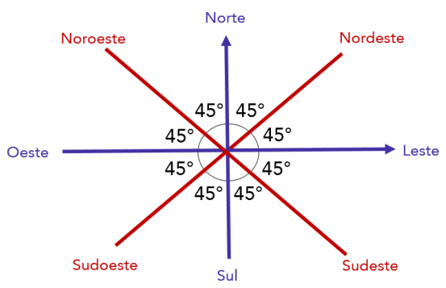

<!-- Start of picture text -->
Vistas de um sólido <!-- End of picture text -->

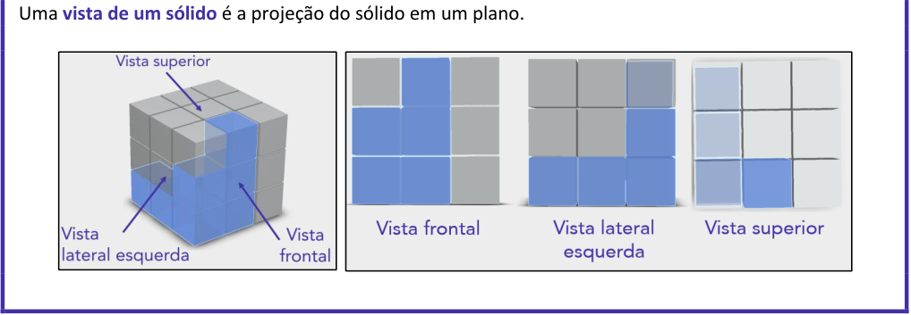

<!-- Start of picture text -->
Uma  vista de um sólido  é a projeção do sólido em um plano. <!-- End of picture text -->

---

<!-- pagina: 28 -->

**Equipe Exatas Estratégia Concursos Aula 07** 

## Introdu ão <u>ç</u> 

Problemas de **orientação espacial** envolvem raciocínios sobre ordenação e posicionamento no espaço. Não há uma teoria específica sobre essa matéria, de modo que a **resolução de questões é fundamental para o entendimento do assunto** . Apesar de não haver teoria própria para o tópico, vamos apresentar brevemente dois conceitos que podem aparecer: 

- **Pontos cardeais e colaterais** ; e 

- **Vistas de um sólido** . 

## Pontos cardeais e colaterais 

Um conhecimento necessário para resolver algumas questões é a direção dos **pontos cardeais: Norte** ( **N** ), **Sul** ( **S** ), **Leste** ( **L** ) e **Oeste** ( **O** ). 

Observe que a direção **Leste** , também conhecida por **Este** ( **E** ), aponta para a direita. A direção **Oeste** aponta para a esquerda. 

Os **pontos colaterais** são aqueles que se situam entre os pontos cardeais. São eles: **Nordeste** ( **NE** ), **Sudeste** ( **SE** ), **Noroeste** ( **NO** ) e **Sudoeste** ( **SO** ). 

Uma observação importante quanto aos pontos cardeais e colaterais é os ângulos em que as direções **Sul** − **Norte** , **Oeste** − **Leste** , **Sudoeste** − **Nordeste** e **Sudeste** − **Noroeste** formam entre si: 

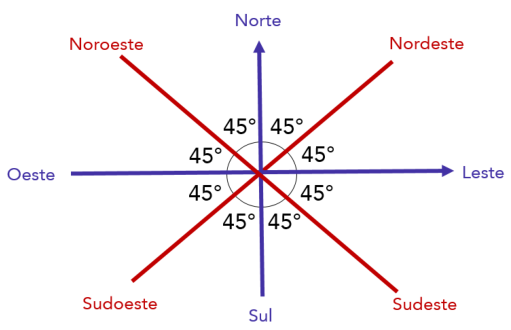

---

<!-- pagina: 29 -->

**Equipe Exatas Estratégia Concursos Aula 07** 

## Vistas de um sólido 

Um mesmo sólido pode parecer diferente **a depender da localização de quem está observando** . Observe o cilindro abaixo: 

Note que, se colocarmos um observador na **<u>vista lateral esquerda</u>** <u>, ele verá um retângulo.</u> 

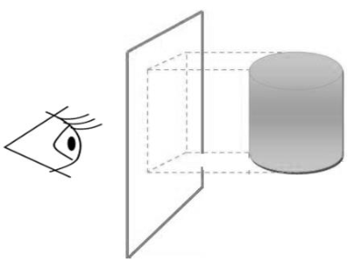

Por outro lado, se colocarmos o observador na **<u>vista superior</u>** <u>, ele verá uma circunferência.</u> 

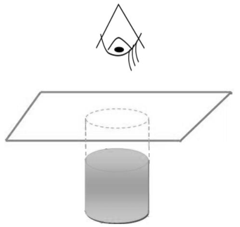

Uma **vista de um sólido** , portanto, nada mais é do que a projeção do sólido em um plano. 

Observe agora o sólido em azul na figura a seguir. Nele estão indicadas as perspectivas pelas quais serão obtidas a **vista frontal** , a **vista superior** e a **vista lateral direita** .

---

<!-- pagina: 30 -->

**Equipe Exatas Estratégia Concursos Aula 07** 

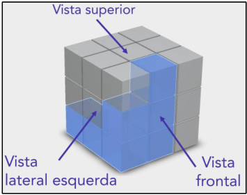

As **vistas** obtidas por meio dessas perspectivas são as seguintes: 

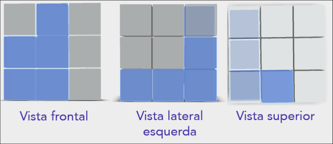

<!-- Start of picture text -->
==5460== <!-- End of picture text -->

==5460== Vale observar podemos definir a " **vista lateral esquerda** " anterior como " **vista frontal** ". Nesse caso, a " **vista frontal** " anterior será a " **vista lateral direita** ". 

**(CMR/2022)** Ao empilhar blocos, João formou um sólido geométrico cujas vistas (frontal, lateral direita e superior) estão representadas na figura abaixo. 

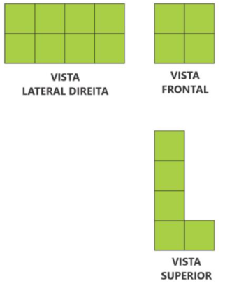

---

<!-- pagina: 31 -->

**Equipe Exatas Estratégia Concursos Aula 07** 

Sabe-se que todos os blocos empilhados por João são idênticos. 

Considerando o exposto acima, marque a alternativa que melhor representa o sólido construído por João. 

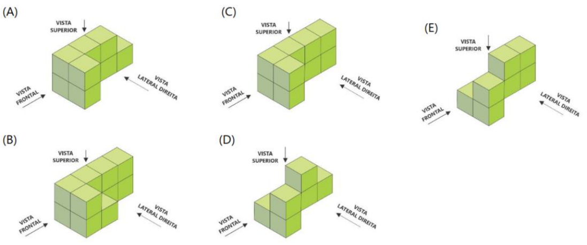

##### **Comentários:** 

Note que a **vista superior** do sólido deve corresponder a um " **L** " com **4 blocos de altura** e **2 blocos de comprimento** . 

Ao observar as alternativas fornecidas, é possível perceber que **somente as alternativas A e C apresentam essa vista superior** . 

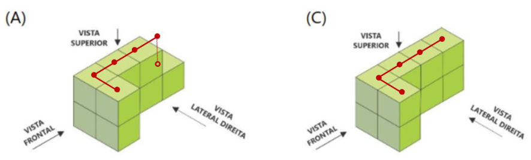

Portanto, **podemos eliminar as alternativas B** , **D e E** . 

Veja que as alternativas A e C apresentam a mesma vista frontal, que corresponde ao quadrado apresentado no enunciado: 

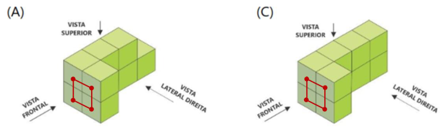

---

<!-- pagina: 32 -->

**Equipe Exatas Estratégia Concursos Aula 07** 

Por fim, observe que **somente a alternativa C** apresenta a vista lateral direita sugerida: 

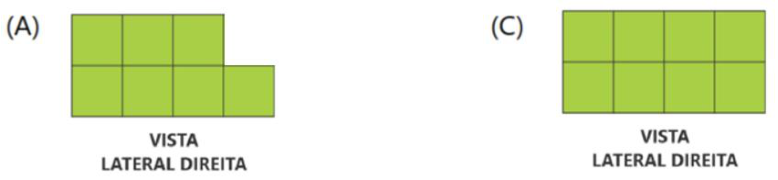

Portanto, o sólido construído por João pode ser representado pela alternativa C. 

**Gabarito: Letra C.**

---

<!-- pagina: 33 -->

**Equipe Exatas Estratégia Concursos Aula 07** 

# **PRINCÍPIO DA CASA DOS POMBOS** 

|Princípio da Casa dos Pombos Tradicional Se tivermos**n**pombos para serem distribuídos em**n**−**1**casas,**pelo menos uma casa**deverá abrigar**no** **mínimo 2 pombos**. Princípio da Casa dos Pombos Generalizado Se tivermos**n**pombos para serem distribuídos em**k**casas,**pelo menos uma casa** deverá abrigar**no** **mínimo** ⌈**n/k**⌉ **pombos**. Obs.:⌈**n/k**⌉representa o arredondamento para o primeiro inteiro maior do que**n/k**. Outros casos de aplicação do princípio **Princípio da Casa dos Pombos**|
|---|
|Nem sempre questões relacionadas ao**Princípio da Casa dos Pombos**ou**Princípio do Azarado**se apresentam nos formatos clássicos. Para essas questões, devemos sempre testar o **caso limite**, ou seja, o “**caso azarado**”.|

---

<!-- pagina: 34 -->

**Equipe Exatas Estratégia Concursos Aula 07** 

## Princípio da Casa dos Pombos Tradicional 

O **Princípio da Casa dos Pombos** em sua forma tradicional é relativamente intuitivo. Para entendê-lo, veja a seguinte situação: 

Temos **<u>10 pombos</u>** e devemos abrigar <u>todos eles em</u> **9 gaiolas (ou casas)** . A conclusão que se pode tirar é: 

##### **<u>Pelo menos uma</u> casa deverá abrigar** **<u>no mínimo 2</u> pombos** . 

Vamos ver com calma como podemos chegar nessa conclusão. 

Inicialmente, veja que uma possibilidade de abrigar os 10 pombos em 9 casas seria colocar todos em uma única casa. Ficaríamos, nesse caso, com 8 casas vazias e com uma casa abrigando todos os 10 pombos. Veja que nesse caso específico é verdade que: 

##### **<u>Pelo menos uma</u> casa** abriga **<u>no mínimo 2</u> pombos** . 

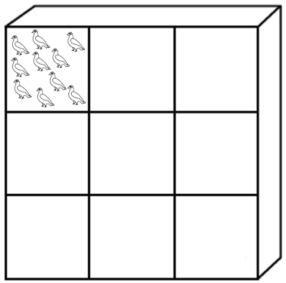

Outra possibilidade de abrigar os 10 pombos em 9 casas seria colocar três pombos em três casas, um pombo em uma casa e deixar as outras 5 casas vazias. Veja que nesse caso específico também é verdade que: 

**<u>Pelo menos uma</u> casa** abriga **<u>no mínimo 2</u> pombos** . 

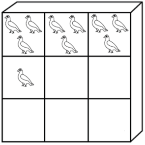

---

<!-- pagina: 35 -->

**Equipe Exatas Estratégia Concursos Aula 07** 

Existem diversas maneiras de abrigar os 10 pombos em 9 casas. **Vamos agora testar o** **<u>caso limite,</u> em que tentamos ocupar todas as casas com um número igual de pombos** . Perceba que se colocarmos um pombo em cada uma das 9 casas, um pombo vai ficar desabrigado. 

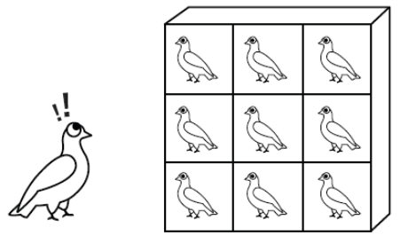

Nesse **<u>caso limite</u>** <u>, o último pombo que restou deve ser abrigado necessariamente em uma casa</u> já ocupada. A consequência disso é que: 

**<u>Pelo menos uma</u> casa deverá abrigar** **<u>no mínimo 2</u> pombos** . 

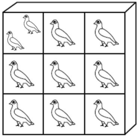

Veja que a conclusão de que " **<u>pelo menos uma casa</u> deverá abrigar** **<u>no mínimo 2</u> pombos** " é uma conclusão que vale para todos os casos particulares do problema. **Essa conclusão é obtida ao se testar o caso limite, ou seja, o caso em que se tenta deixar todas as casas ocupadas com um número igual de pombos** . 

Na aplicação do Princípio da Casa dos Pombos, deve-se identificar o **<u>caso limite</u>** em que tentamos ocupar todas as casas com um número igual de pombos. 

Esqueçamos os 10 pombos e as 9 casas! Podemos enunciar uma regra para quando temos **n** pombos e **n−1** casas:

---

<!-- pagina: 36 -->

**Equipe Exatas Estratégia Concursos Aula 07** 

Se tivermos **n pombos** para serem distribuídos em **n−1 casas** , **<u>pelo menos uma</u> casa** deverá abrigar **<u>no mínimo 2 pombos</u>** . 

## Princípio da Casa dos Pombos Generalizado 

Os problemas relacionados ao Princípio da Casa dos Pombos raramente apresentam o formato de **n** pombos e **n−1** casas. Veja essa nova situação: 

Temos **<u>19 pombos</u>** e devemos abrigar <u>todos eles em</u> **9 gaiolas (ou casas)** . A conclusão que se pode tirar é: 

##### **<u>Pelo menos uma</u> casa** deverá abrigar **<u>no mínimo 3 pombos</u>** . 

Novamente, essa conclusão é obtida ao se testar o **<u>caso limite</u>** <u>, ou seja, o caso em que se tenta</u> deixar todas as casas ocupadas com um número igual de pombos. Vamos tentar colocar 2 pombos em cada uma das 9 casas. 

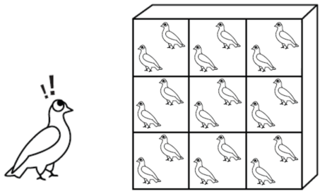

Nesse novo **<u>caso limite</u>** em que ocupamos todas as 9 casas com 2 pombos, o último pombo que restou dos 19 deve ser abrigado necessariamente em uma casa já ocupada. Nesse caso, a conclusão que se chega é: 

##### **<u>Pelo menos uma</u> casa** deverá abrigar **<u>no mínimo 3 pombos</u>** . 

No novo caso limite acima, tivemos apenas um pombo restando sem casa. O que aconteceria se tivéssemos um número um pouco maior de pombos? Vamos verificar uma nova situação:

---

<!-- pagina: 37 -->

**Equipe Exatas Estratégia Concursos Aula 07** 

Temos **<u>22 pombos</u>** e devemos abrigar todos eles em **9 casas** . A conclusão que se pode tirar é exatamente a mesma do caso em que tínhamos 19 pombos e 9 casas: 

##### **<u>Pelo menos uma</u> casa** deverá abrigar **<u>no mínimo 3 pombos</u>** . 

Novamente, no **<u>caso limite</u>** , vamos tentar deixar todas as casas ocupadas com um número igual de pombos. Isso significa que devemos colocar 2 pombos em cada uma das 9 casas. 

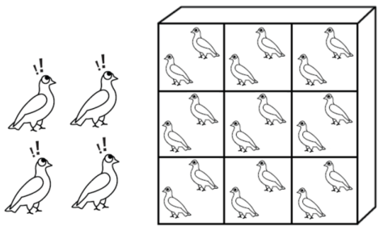

Observe que restaram temos todas as 9 casas com 2 pombos e ficamos com 4 pombos desabrigados. 

Existem várias maneiras de abrigar esses últimos 4 pombos. Poderíamos, por exemplo, colocar 2 na primeira casa e 2 na segunda casa: 

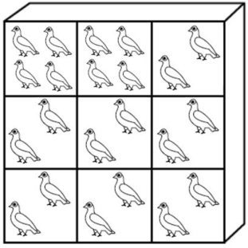

Apesar das diversas maneiras de se colocar os 4 pombos restantes nas 9 casas, temos a garantia do seguinte: 

**<u>Pelo menos uma</u> casa** deverá abrigar **<u>no mínimo 3 pombos</u>** . 

Essa conclusão fica explícita quando colocamos os 4 pombos restantes em casas diferentes. Veja:

---

<!-- pagina: 38 -->

**Equipe Exatas Estratégia Concursos Aula 07** 

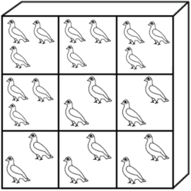

Podemos generalizar o Princípio da Casa dos Pombos para quaisquer números de pombos e casas: 

##### **<u>Princípio da Casa dos Pombos Generalizado</u>** 

Se tivermos **n pombos** para serem distribuídos em **k casas** , **<u>pelo menos uma</u> casa** deverá abrigar **<u>no mínimo</u>** ⌈ **n/k** ⌉ **pombos** . 

**<u>Obs.</u>** <u>:</u> ⌈ **n/k** ⌉ representa o arredondamento para o primeiro inteiro **<u>maior</u>** do que **n/k** . 

Vamos utilizar essa generalização para o exemplo que acabamos de ver: 

**Temos 22 pombos e devemos abrigar todos eles em 9 casas. Qual é a conclusão que se pode obter?** 

A generalização do Princípio da Casa dos Pombos nos diz que: 

Se tivermos **n pombos** para serem distribuídos em **k casas** , **<u>pelo menos uma</u> casa** deverá abrigar **<u>no mínimo</u>** ⌈ **n/k** ⌉ **pombos** . 

Para o exemplo em questão, **n = 22** e **k = 9** . Vamos obter ⌈ **n/k** ⌉ **.** 

<u>⌈</u> **n/k** <u>⌉</u> **=** <u>⌈</u> **22/9** <u>⌉</u> **=** <u>⌈</u> **2,44** <u>⌉</u>

---

<!-- pagina: 39 -->

**Equipe Exatas Estratégia Concursos Aula 07** 

Qual é o valor de ⌈ **2,44** ⌉ ? Simples! É o primeiro inteiro maior do que 2,44, ou seja, é 3. 

##### ⌈ **n/k** ⌉ **=** ⌈ **2,44** ⌉ **= 3** 

Perceba que, com a aplicação direta da "fórmula", chegamos na mesma conclusão: 

Se tivermos **22** pombos para serem distribuídos em **9** casas, **<u>pelo menos uma</u> casa** deverá abrigar **<u>no mínimo 3 pombos</u>** . 

As questões de concurso público no geral não costumam apresentar o problema em forma de "casas" e de "pombos", de modo que se faz necessário **identificar quais são as "casas" e quais são os "pombos"** do problema **.** Vejamos dois exemplos: 

**(BANESTES/2021)** Um escritório de investimentos possui 86 clientes que são atendidos por 6 consultores. Cada consultor deve atender a no mínimo 9 e no máximo 20 clientes. 

É correto concluir que: 

a) pelo menos 1 consultor atende a mais de 14 clientes; 

b) um consultor atende a 16 clientes; 

c) é possível que todos os consultores atendam a um mesmo número de clientes; 

d) é possível que 3 dos consultores atendam o número máximo de clientes por consultor; 

e) não é possível que 3 dos consultores atendam o número mínimo de clientes por consultor. 

##### **Comentários:** 

Veja que esse é um caso típico de **Princípio da Casa dos Pombos generalizado** . Devemos atribuir os 86 clientes (“pombos”) aos 6 consultores (“casas”). 

“Se tivermos **n pombos** para serem distribuídos em **k casas** , **<u>pelo menos uma casa</u>** deverá abrigar **<u>no mínimo</u>** ⌈ **n/k** ⌉ **pombos** .” 

Para o exemplo em questão, **n** = 86 e **k** = 6. Vamos obter ⌈ **n/k** ⌉ . 

⌈ **n/k** ⌉ **=** ⌈ **86/6** ⌉ **=** ⌈ **14,33** ⌉ **= 15** 

Perceba que a conclusão, contextualizando para o problema em tela, fica: 

“Se tivermos **86 clientes** para serem atendidos por **6 consultores** , **<u>pelo menos um</u> consultor** atende a **<u>no mínimo</u> 15 clientes** .”

---

<!-- pagina: 40 -->

**Equipe Exatas Estratégia Concursos Aula 07** 

Como “ **<u>pelo menos um consultor</u>** atende a **<u>no mínimo</u> 15 clientes”** , é correto afirmar que “ **pelo menos 1 consultor atende a mais de 14 clientes** ”. 

**Gabarito: Letra A.** 

**(FunSaúde CE/2021)** Em uma mesa de bar, 7 amigos tomaram 24 latas de cerveja. É correto afirmar que: 

a) um deles tomou exatamente 4 latas. 

b) todos tomaram, pelo menos, 2 latas. 

c) alguém ficou sem beber. 

d) um dos amigos tomou exatamente 3 latas. 

e) um dos amigos tomou, no mínimo, 4 latas. 

##### **Comentários:** 

Veja que esse é um caso típico de **Princípio da Casa dos Pombos generalizado** . Devemos atribuir as 24 latas de cerveja (“pombos”) aos 7 amigos (“casas”). 

- “Se tivermos **n pombos** para serem distribuídos em **k casas** , **<u>pelo menos uma casa</u>** deverá abrigar **<u>no mínimo</u>** ⌈ **n/k** ⌉ **pombos** .” 

Para o exemplo em questão, **n** = 24 e **k** = 7. Vamos obter ⌈ **n/k** ⌉ . 

- ⌈ **n/k** ⌉ **=** ⌈ **24/7** ⌉ **=** ⌈ **3,43** ⌉ **= 4** 

Perceba que a conclusão, contextualizando para o problema em tela, fica: 

- “Se tivermos **24 latas de cerveja** para serem tomadas por **7 amigos** , **<u>pelo menos um</u> amigo** tomou **<u>no mínimo</u> 4 latas de cerveja** .” 

Logo, é correto afirmar que “ **um dos amigos tomou, no mínimo, 4 latas** ”. 

**Gabarito: Letra E.** 

Outros casos de aplicação do princípio 

A **aplicação clássica** do Princípio da Casa dos Pombos ocorre quando são **dados** o número de **<u>pombos</u> (n)** e de **<u>casas</u> (k)** e, em seguida, **pede-se a conclusão** de que "pelo menos uma casa deverá abrigar no mínimo ⌈ **n/k** ⌉ pombos." 

Muitas vezes esse princípio é cobrado de maneira indireta nas questões de concurso público. Um exemplo disso é quando é pedido **o número mínimo de pombos para garantirmos a conclusão** quando são dados **o número de casas** e a **conclusão do caso** . Veja um exemplo de enunciado:

---

<!-- pagina: 41 -->

**Equipe Exatas Estratégia Concursos Aula 07** 

Temos disponíveis **9 casas** para os pombos. Qual o **número mínimo de pombos para garantirmos** que **três pombos estarão em uma mesma casa** ? 

Observe que, nesse exemplo, é **dado** o número de **<u>casas</u>** (9) e é dada a **<u>conclusão</u>** (três pombos estarão em uma mesma casa). Pede-se **o número mínimo de pombos para garantirmos a conclusão** . 

Para esse tipo de questão exemplificado, bem como para outras questões que fogem da aplicação clássica, devemos usar a regra básica de se identificar o **<u>caso limite</u>** (" **caso azarado** ") do problema. 

Vale ressaltar que o Princípio da Casa dos Pombos também é conhecido por **Princípio do Azarado** . Para ilustrar essa nova forma de se chamar o Princípio da Casa dos Pombos, bem como para exemplificar formas não clássicas de se cobrar o princípio, vamos a um exemplo resolvido: ==5460== **Em uma festa compareceram muitas pessoas. Qual o número mínimo de pessoas na festa para garantirmos que ao menos três pessoas fazem aniversário no mesmo dia? Considere que um ano tem 365 dias.** 

Observe que nesse exemplo é **dado** o número de dias: 365 dias. Também é **dada** a conclusão: **ao menos três pessoas fazem aniversário no mesmo dia** . Pergunta-se **o número mínimo de pessoas que devemos alocar nos dias para garantirmos a conclusão** . 

Digamos que nessa festa tenha 365 pessoas. Podemos ter a **<u>garantia</u>** de que ao menos três pessoas fazem aniversário no mesmo dia? **Não** , pois podemos ter o “ **azar** ” de todas as 365 pessoas terem nascido uma em cada um dos 365 dias do ano. 

Vamos supor então que tenhamos 600 pessoas na festa. Nesse caso, podemos ter a **<u>garantia</u>** de que ao menos três pessoas fazem aniversário no mesmo dia? **Não** , pois podemos ter o “ **azar** ”, por exemplo, de termos nos primeiros 235 dias do ano sempre 2 pessoas fazendo aniversário e nos 130 dias restantes termos sempre uma pessoa fazendo aniversário. 

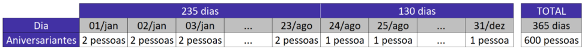

Observe que, mesmo que tenhamos 730 pessoas nessa festa, não temos a **<u>garantia</u>** de que ao menos três pessoas fazem aniversário no mesmo dia, pois podemos ter o “ **azar** ” de que em cada um dos 365 dias apenas 2 pessoas fazem aniversário.

---

<!-- pagina: 42 -->

**Equipe Exatas Estratégia Concursos Aula 07** 

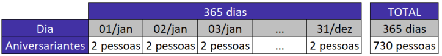

Note, então, que o **<u>caso limite</u>** (" **caso azarado** ") **do problema** ocorre quando temos **730 pessoas** na festa de modo que **em cada um dos 365 dias apenas 2 pessoas fazem aniversário** . 

Veja que, ao **adicionar uma pessoa** , **<u>temos a garantia</u>** de que <u>ao menos três pessoas fazem</u> aniversário no mesmo dia. Isso porque, **mesmo considerado o caso mais azarado** , **a** **<mark>pessoa de número 7</mark> 31 fará aniversário em um dia em que já temos ao menos duas pessoas fazendo aniversário** . 

Logo, **para garantirmos** que três pessoas fazem aniversário no mesmo dia, **devemos ter no mínimo 731 pessoas** na festa. 

Boa parte das questões de concurso público não se apresentam nos formatos tradicional ou generalizado do Princípio da Casa dos Pombos. Nessas questões, também devemos encontrar o **<u>caso limite</u>** , ou seja, o “ **<u>caso azarado</u>** ”. Vejamos dois exemplos: 

**(MPE GO/2022)** Em uma urna há 3 bolas brancas, 4 amarelas, 5 vermelhas e 6 pretas. São retiradas ao acaso dessa urna N bolas. 

Se há certeza de que, entre as bolas retiradas há, pelo menos, uma bola amarela ou uma bola preta, o menor valor possível de N é a ~~)~~ 8. b) 9. c) 10. d) 11. e) 12. **Comentários:** Nessa questão, devemos testar o **<u>caso limite</u>** <u>, ou seja, o "</u> **<u>caso azarado</u>** ". Ao retirar as bolas do saco, poderíamos ter um " **<u>caso azarado</u>** " em que retiramos **3 bolas brancas** e **5 vermelhas** . Nesse caso, temos um total de **8 bolas retiradas sem que se tenha uma bola amarela ou uma** **<u>bola preta</u>** <u>.</u> Note que, **mesmo no caso mais azarado possível** , **ao retirar a 9ª bola** teremos retirado uma bola amarela ou uma bola preta. 

Logo, ao retirarmos **9 bolas, obrigatoriamente** teremos uma bola da cor amarela ou preta. O **gabarito** , portanto, é **letra B** . 

**Gabarito: Letra B.**

---

<!-- pagina: 43 -->

**Equipe Exatas Estratégia Concursos Aula 07** 

# **– QUESTÕES COMENTADAS FGV** 

## Orientação Temporal 

**<mark>(FGV/ALE TO/2024) Certo programa de rádio tem 1 hora e 55 minutos de duração. A partir do momento em que o programa é iniciado, há blocos temáticos de 7 minutos intercalados por blocos de propagandas de 2 minutos.</mark>** 

**Em todos os blocos de propaganda, ouve-se o comercial do restaurante R, que sempre dura 18 segundos.** 

**Se o programa começa e termina com um bloco temático, então, o tempo total do programa dedicado ao anúncio do restaurante R é** 

a) 3 minutos e 54 segundos. 

b) 3 minutos e 36 segundos. 

c) 3 minutos e 18 segundos. 

d) 3 minutos. 

e) 2 minutos e 48 segundos. 

##### **Comentários:** 

Para resolver a questão, inicialmente vamos **calcular quantos blocos de propaganda são transmitidos durante o programa.** 

Sabemos que o programa tem **1 hora e 55 minutos** de duração, ou seja, **1** × **60 + 55 = 115 minutos** . Também sabemos que o programa começa e termina com um bloco temático de 7 minutos, e que entre cada dois blocos temáticos há um bloco de propaganda de 2 minutos. 

Sendo 𝑇 é um bloco temático e 𝑃 é um bloco de propaganda, podemos representar o programa da seguinte forma: 

Observe que um bloco temático e um bloco de propaganda ( 𝐓𝐏 ) duram, quando considerados em conjunto, 7 + 2 = **9 minutos** . 

Considere que 𝑛 é o número de blocos de propaganda. Como a duração total do programa é 115 minutos, podemos escrever: 

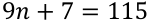

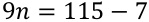

---

<!-- pagina: 44 -->

**Equipe Exatas Estratégia Concursos Aula 07** 

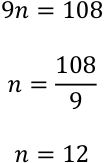

<!-- Start of picture text -->
9𝑛= 108 𝑛=  108 9 𝑛= 12 <!-- End of picture text -->

Logo, **há 12 blocos de propaganda** durante o programa. 

Em cada bloco de propaganda, **o comercial do restaurante R apresenta 18 segundos** de duração. Logo,  o tempo total do programa dedicado ao anúncio do restaurante R, em segundos, é: 

##### 12 × 18 = 216 segundos 

Sabemos que 1 minuto corresponde a 60 segundos. Ao dividir 216 por 60, obtemos **quociente 3** e **resto 36** . Logo, o tempo total do programa dedicado ao anúncio do restaurante R é **3 minutos** e **36 segundos** . 

##### **Gabarito: Letra B.** 

**<mark>(FGV/CMSP/2024) Na cidade suíça de Solothurn cada dia é dividido em 22 horas e cada hora é dividida em 60 minutos. Nessa cidade, a metade de um dia possui 11 horas como mostra o relógio abaixo.</mark>** 

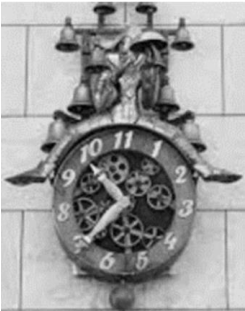

**As unidades hora e minuto da cidade de Solothurn são abreviadas por hS e mS, respectivamente.** 

**Hans mora nessa cidade e, certo dia, entrou na empresa em que trabalha às 9 hS 40 mS e saiu da empresa às 16 hS 27 mS.** 

**O tempo, medido nas unidades de tempo adotadas em nosso país, que Hans permaneceu na empresa foi de:** 

a) 6 horas e 47 minutos. 

b) 6 horas e 56 minutos. 

c) 7 horas e 07 minutos. 

d) 7 horas e 16 minutos. 

e) 7 horas e 24 minutos.

---

<!-- pagina: 45 -->

**Equipe Exatas Estratégia Concursos Aula 07** 

##### **Comentários:** 

Inicialmente, vamos obter o **tempo em** " **horas e minutos Solothurn** " **que Hans trabalhou** . Trata-se da diferença entre o horário de saída e o horário de chegada: 

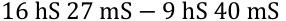

Para subtrairmos os "minutos Solothurn" ( **mS** ), devemos utilizar a relação de que **1 hS = 60 mS** . Logo, podemos escrever **16 hS 27 mS** como **15hS 87mS** . Portanto, ficamos com a seguinte diferença: 

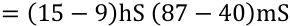

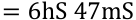

Como **1 hS = 60 mS** , o tempo trabalhado em "minutos Solothurn" ( **mS** ) é: 

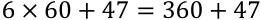

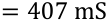

A relação que temos entre a medida "normal" e a medida "Solothurn" corresponde ao dia. Um dia corresponde a **24h** e também corresponde a **22hS** . 

Em termos de minutos e de "minutos Solothurn", temos que um dia corresponde a **24×60 min** e também corresponde a **22×60 mS** . 

Para obter o tempo trabalhado em minutos, podemos realizar a seguinte regra de três simples: 

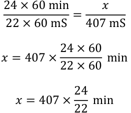

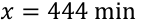

Sabemos que **1 h = 60 min** . Ao dividir **444** por **60** , obtemos **quociente 7** e **resto 24.** Logo, o tempo que Hans permaneceu na empresa foi de **7h 24min** . 

##### **Gabarito: Letra E.**

---

<!-- pagina: 46 -->

**Equipe Exatas Estratégia Concursos Aula 07** 

**<mark>(FGV/CM Fortaleza/2024) Todos os dias, de segunda a sexta, João faz exatamente 20 flexões de braço</mark> como parte de um treinamento físico. Aos sábados e domingos, o treinamento continua, mas ele faz** **<mark>apenas 10 flexões a cada dia.</mark>** 

**Esse treinamento acaba quando ele fizer, ao todo, 3200 flexões. Se o treinamento começa em uma segunda-feira, o último dia de treinamento cairá em** 

a) uma quarta-feira. 

b) uma quinta-feira. 

c) uma sexta-feira. 

d) um sábado. 

e) um domingo. 

##### **Comentários:** 

Vamos calcular quantas flexões João faz em uma semana. 

De **segunda a sexta** , ele faz **20** × **5** = **100 flexões** . Aos **sábados e domingos** , ele faz **10** × **2 = 20 flexões** . Portanto, **em uma semana** , ele faz **100+20 = 120 flexões** . 

Para saber quantas semanas ele leva para completar o treinamento, basta dividir o total de flexões pelo número de flexões por semana. **Ao dividir 3200 por 120** , obtemos **quociente 26** e **resto 80** . Isso significa que ele precisa de **26 semanas completas** e **mais alguns dias para realizar as 80 flexões restantes** . 

Como João inicia o treinamento na segunda-feira, **após 26 semanas ele se encontra em um domingo** , **restando 80 flexões** . 

Uma vez que João faz 20 flexões por dia de segunda a sexta, **ele precisa de 80/20 = 4 dias na última semana** : **segunda-feira** , **terça-feira** , **quarta-feira** e **quinta-feira** . 

Logo, o último dia de treinamento cairá em uma **quinta-feira** . 

##### **Gabarito: Letra B.** 

**<mark>(FGV/ALE TO/2024) Ana trabalha em sistema de home-office, mas precisa comparecer ao escritório de</mark> sua empresa em intervalos regulares.** 

**Se Ana comparece ao escritório em determinado dia, ela precisa comparecer de novo três dias úteis depois, isto é, descontando-se os sábados e os domingos. Assim, se ela compareceu em uma quinta-feira, deverá voltar ao escritório na terça-feira da semana seguinte.** 

**Hoje é sexta-feira e Ana está no escritório; assim, a penúltima vez em que ela esteve lá, foi uma** 

a) segunda-feira. 

b) terça-feira. 

c) quarta-feira.

---

<!-- pagina: 47 -->

**Equipe Exatas Estratégia Concursos Aula 07** 

d) quinta-feira. 

e) sexta-feira. 

##### **Comentários:** 

Para resolver essa questão, podemos fazer uma contagem regressiva a partir do dia da semana em que Ana está no escritório, que é uma **sexta-feira** . 

Retornando 3 dias úteis a partir de **sexta-feira** , temos a seguinte contagem regressiva: **quinta-feira** , **quartafeira** e **terça-feira** . Logo, a **última vez** que ela esteve no escritório foi uma **<u>terça-feira</u>** 

Retornando novamente 3 dias úteis, partindo-se de **terça-feira** , temos a seguinte contagem regressiva: **segunda-feira** , **sexta** e **quinta-feira** . Logo, a **penúltima vez** que ela esteve no escritório foi uma **<u>quinta-feira</u>** <u>.</u> 

##### **Gabarito: Letra D.** 

**<mark>(FGV/ALE TO/2024) Em certo ano, o dia 1º de agosto cai em um domingo. Logo, o dia 1º de novembro cairá em</mark>** 

a) um sábado. 

b) um domingo. 

c) uma segunda-feira. 

d) uma quarta-feira. 

e) uma sexta-feira. 

##### **Comentários:** 

Temos aqui um problema clássico envolvendo dias da semana em que o " _dia da semana da data inicial é dado_ ". 

Para resolver esse tipo de problema, devemos seguir os seguintes passos: 

- Identificar o **intervalo exclusive** ; 

- Dividir o **intervalo exclusive** por 7 e obter o **resto** ; 

- Obter o dia da semana da **<u>data final somando</u>** o resto ao dia da semana da **<u>data inicial</u>** . 

##### **<u>Identificar o intervalo exclusive</u>** 

Primeiramente, vamos calcular o **intervalo inclusive** 01/agosto a 01/novembro. 

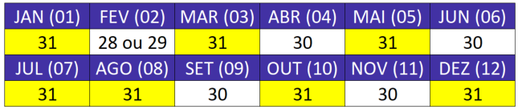

---

<!-- pagina: 48 -->

**Equipe Exatas Estratégia Concursos Aula 07** 

- Em agosto, temos **31 dias** ; 

- Em setembro, temos **30 dias** ; 

- Em outubro, temos **31 dias** ; 

- Em novembro, temos **1 dia** ; 

Logo, o **intervalo inclusive** de 01/agosto a 01/novembro é: 

31 + 30 + 31 + 1 = 93 

O **intervalo exclusive** é dado por **93 − 1 = 92 dias** . 

##### **<u>Dividir o intervalo exclusive por 7 e obter o resto</u>** 

92 dividido por 7 nos dá um quociente 13 e **resto 1** . 

##### **<u>Obter o dia da semana da data final somando o resto ao dia da semana da data inicial</u>** 

Ao **<u>somarmos</u>** 1 dia ao domingo, obtemos **<u>segunda-feira</u>** <u>.</u> 

##### **Gabarito: Letra C.** 

**<mark>(FGV/DNIT/2024) Priscila deve fazer um tratamento recomendado pelo seu médico que consiste em</mark> tomar 1 comprimido de certo remédio dia sim, dia não. A caixa desse remédio tem 100 comprimidos e** **<mark>Priscila tomou o primeiro comprimido em uma segunda-feira.</mark>** 

##### **Seguindo as instruções do médico, Priscila tomará o último comprimido dessa caixa** 

a) em uma quarta-feira. 

b) em uma quinta-feira. 

c) em uma sexta-feira. 

d) em um sábado. 

e) em um domingo. 

##### **Comentários:** 

Temos aqui um problema clássico envolvendo dias da semana em que o " _dia da semana da data inicial é dado_ ". A data inicial, nesse caso, é uma segunda-feira. 

Para resolver esse tipo de problema, devemos seguir os seguintes passos: 

- Identificar o **intervalo exclusive** ; 

- Dividir o **intervalo exclusive** por 7 e obter o **resto** ; 

- Obter o dia da semana da **<u>data final somando</u>** o resto ao dia da semana da **<u>data inicial</u>** .

---

<!-- pagina: 49 -->

**Equipe Exatas Estratégia Concursos Aula 07** 

##### **<u>Identificar o intervalo exclusive</u>** 

Note que **Priscila tomou um comprimido na segunda-feira** . **Restam 99 comprimidos** para serem tomados. 

Quanto a esses 99 comprimidos, temos a seguinte contagem de dias: 

- No **primeiro dia** após a segunda-feira inicial, **não** se toma comprimido; 

- No **<u>segundo dia</u>** após a segunda-feira inicial, **toma-se o primeiro comprimido dos 99 restantes** ; 

- No **terceiro dia** após a segunda-feira inicial, **não** se toma comprimido; 

- No **<u>quarto dia</u>** após a segunda-feira inicial, **toma-se o segundo comprimido dos 99 restantes** ; 

- Etc. 

Note, portanto, que Regina tomará os outros 99 comprimidos **<u>após 198 dias</u>** : 

2 × 99 = 198 dias 

Portanto, **198 é o intervalo exclusive** , pois é o número de dias que se deve somar à **<u>data inicial</u>** para se obter a **<u>data final</u>** <u>.</u> 

##### **<u>Dividir o intervalo exclusive por 7 e obter o resto</u>** 

198 dividido por 7 nos dá quociente 28 e **resto 2** . 

##### **<u>Obter o dia da semana da data final somando o resto ao dia da semana da data inicial</u>** 

Ao **<u>somarmos</u>** 2 dias à segunda-feira, obtemos **quarta-feira** . 

**Gabarito: Letra A.** 

**<mark>(FGV/Câmara dos Deputados/2023) Em uma certa galáxia distante, a civilização dos Vascões tem um sistema de contagem de tempo diferente do nosso. Uma hora do nosso sistema corresponde a 0,8 hora vascão (hv). Além disso, 1 hv é igual a 50 minutos vascões (mv) e 1 mv corresponde a 30 segundos vascões (sv). Assim, 1h 27min 3s (uma hora, 27 minutos e 3 segundos) do nosso sistema é medido no sistema Vascão como</mark>** 

a) 1hv 18mv 13sv. 

b) 2hv 4mv 5sv. 

c) 2hv 10mv 2sv. 

d) 1hv 8mv 1sv. 

e) 1hv 20mv 8sv. 

**Comentários:**

---

<!-- pagina: 50 -->

**Equipe Exatas Estratégia Concursos Aula 07** 

**Conhecemos somente a relação entre** " **horas normais** " **(h)** e " **horas vascão** " **(hv)** : **1h = 0,8hv** . Portanto, para resolver o problema, vamos seguir o seguinte procedimento: 

- Converter **1h 27min 3s** em **horas (h)** ; 

- Converter o tempo em **horas (h)** para " **horas vascões** " **(hv)** ; e 

- Converter o tempo em " **horas vascões** " **(hv)** para " **horas vascões** " **(hv)** , " **minutos vascões** " **(mv)** e " **segundos vascões** " **(sv)** . 

##### **<u>Converter 1h 27min 3s em horas (h)</u>** 

𝟏 𝟏 Sabemos que **60min = 1h** e, portanto, **1min =** **~~h~~** . Além disso, **3.600s = 1h** e, portanto, **1s =** 𝐬 . Logo: 𝟔𝟎 𝟑𝟔𝟎𝟎 

##### **<u>Converter o tempo em horas (h) para "horas vascões" (hv)</u>** 

𝟖 Sabemos que **1h = 0,8hv** , ou seja, **1h =** 𝐡𝐯 . Logo, o tempo em "horas vascões" é: 𝟏𝟎 

##### **<u>Converter o tempo em "horas vascões" (hv) para "horas vascões" (hv), "minutos vascões" (mv) e</u>** 

##### **"segundos vascões" (sv)** 

Inicialmente, vamos obter a parte inteira da fração:

---

<!-- pagina: 51 -->

**Equipe Exatas Estratégia Concursos Aula 07** 

Sabemos que **1hv = 50mv** . Logo: 

Vamos agora obter a parte inteira da fração: 

Sabemos que **1mv = 30sv** . Logo: 

Portanto, **1h 27min 3s** corresponde a **1hv 8mv 1sv** . 

**Gabarito: Letra D.** 

**<mark>(FGV/Câmara dos Deputados/2023) Um relógio digital mostra as horas, de 0 a 23, e os minutos, de 0 a 59. Ele é posto a funcionar em um certo dia, na hora certa, ao meio-dia. No entanto, o relógio atrasa 40 segundos a cada hora. Assim, o relógio voltará a marcar meio-dia corretamente após</mark>** 

a) 90 dias. 

b) 85 dias.

---

<!-- pagina: 52 -->

**Equipe Exatas Estratégia Concursos Aula 07** 

c) 72 dias. 

d) 60 dias. 

e) 56 dias. 

##### **Comentários:** 

A cada hora, o relógio atrasa 40 segundos. Portanto, a cada dia, o relógio atrasa: 

Como **1min = 60s** , o tempo que o relógio atrasa por dia, em minutos, é: 

Para que o relógio volte a marcar meio-dia, **é necessário que o atraso total seja de 24 horas** , ou seja, é necessário que o atraso total seja de: 

Como o relógio atrasa **16 minutos por dia** , **o número de dias necessários para atrasar 1.140 minutos é** : 

##### **Gabarito: Letra A.** 

**<mark>(FGV/TRT PB/2022) Três amigos, A, B e C, trabalham juntos. Certo dia, os três almoçaram no refeitório da empresa. Sabe-se que:</mark>** 

- **A chegou no refeitório às 12h05min e permaneceu por 44 min.** 

- **B chegou no refeitório às 12h13min e permaneceu por 47 min.** 

- **C chegou no refeitório às 12h09min e permaneceu por 38 min.** 

##### **O tempo em que os três amigos estiveram juntos no refeitório foi de** 

a) 34 min. 

b) 36 min. 

c) 38 min. 

d) 40 min. 

e) 42 min. 

##### **Comentários:**

---

<!-- pagina: 53 -->

**Equipe Exatas Estratégia Concursos Aula 07** 

Inicialmente, vamos **obter o horário em que A, B e C saíram do refeitório** somando o tempo de permanência ao horário de chegada. 

Observe que, sempre que um tempo em minutos for superior a 60min, vamos transformar esse tempo em horas, levando em consideração o fato de que **1h = 60min** . 

**• A chegou no refeitório às 12h05min e permaneceu por 44 min.** Logo, a **saída de A** ocorreu no seguinte horário: 

= 12h (05 + 44)min 

= 𝟏𝟐𝐡 𝟒𝟗𝐦𝐢𝐧 

**• B chegou no refeitório às 12h13min e permaneceu por 47 min.** Logo, a **saída de B** ocorreu no seguinte horário: 

12h 13min + 47min = 12h (13 + 47)min = 12h 60min = 𝟏𝟑𝐡 

• **C chegou no refeitório às 12h09min e permaneceu por 38 min.** Logo, a **saída de C** ocorreu no seguinte horário: 

Em resumo, temos os seguintes horários de permanência dos amigos: 

- **Amigo A** : 12h 05min às 12h 49min; 

- **Amigo B** : **12h 13min** às 13h; 

- **Amigo C** : 12h 09min às **12h 47min** ; 

Como o último horário de chegada foi **12h 13min** e o primeiro horário de saída foi **12h 47min** , os três amigos estiveram juntos durante o período de **12h 13min** às **12h 47min** . Logo, o tempo em que eles estiveram juntos foi de: 

##### **Gabarito: Letra A.**

---

<!-- pagina: 54 -->

**Equipe Exatas Estratégia Concursos Aula 07** 

**<mark>(FGV/Senado Federal/2022) Paulo termina seus estudos na faculdade às 16h. Nessa mesma hora, Dora</mark> sai de casa para buscá-lo de carro. Ela demora 1 hora para ir até a faculdade e 1 hora para voltar da** **<mark>faculdade à casa, andando sempre à mesma velocidade.</mark>** 

**Certo dia, ao final das aulas, Paulo resolveu alugar uma bicicleta e tomar o caminho de casa, para ganhar tempo. Com isso, ele se encontrou com Dora após 35 minutos e os dois voltaram para casa de carro.** 

##### **Paulo e Dora chegaram em casa no seguinte horário:** 

a) 17h. 

b) 17h05min. 

c) 17h10min. 

d) 17h15min. 

e) 17h20min. 

##### **Comentários:** 

Temos a seguinte representação gráfica do problema, sendo C a representação da casa, PE a representação do ponto de encontro, e F a representação da faculdade: 

##### **[C]                                [PE]                [F]** 

Note que o ponto de encontro está mais próximo da faculdade, pois em 35 minutos o carro percorre mais do que a metade do trajeto de ida. 

Ocorre que essa representação gráfica e a consideração sobre o ponto de encontro é irrelevante. Isso porque, **se Dora gastou 35 minutos de sua casa até o ponto de encontro** , **ela irá gastar o mesmo tempo para voltar.** Portanto, temos a seguinte sequência temporal: 

- **Dora sai de casa** : **16h 00min** ; 

- **Dora encontra Paulo no ponto de encontro** : 16h 00min + 35min = **16 35min** ; 

- **Paulo e Dora chegam a casa** : 16 35min + 35min = **17h 10min** . 

##### **Gabarito: Letra C.** 

**<mark>(FGV/SEFAZ AM/2022) Ângela, Bárbara e Carla marcaram de se encontrar às 18h30min. Ana foi a</mark> primeira a chegar e esperou 23 minutos até a chegada da segunda; Bárbara chegou 12 minutos antes de** **<mark>Carla e Carla chegou 17 minutos atrasada.</mark>** 

##### **Ana chegou às** 

a) 18h07min. 

b) 18h12min. 

c) 18h14min. 

d) 18h17min.

---

<!-- pagina: 55 -->

**Equipe Exatas Estratégia Concursos Aula 07** 

e) 18h23min. 

##### **Comentários:** 

Vamos resolver o exercício "de trás para frente". 

##### **_"Carla chegou 17 minutos atrasada."_** 

Como o horário marcado era **18h 30min** , **Carla** , que estava 17 minutos atrasada, chegou às **18h 47min** . 

##### **_"Bárbara chegou 12 minutos antes de Carla"_** 

Como **Carla** chegou às **18h 47min** , **Bárbara** , que chegou 12 minutos antes dela, chegou **18h 35min** . 

##### **"Ana foi a primeira a chegar e esperou 23 minutos até a chegada da segunda."** 

Como Bárbara chegou às **18h 35min** , **Ana** , que esperou 23 minutos até a chegada de Bárbara, chegou às **18h 12min** . O **gabarito** , portanto, é **letra B** . 

##### **Gabarito: Letra B.** 

**<mark>(FGV/SEFAZ AM/2022) Ana arruma o seu armário toda segunda sexta-feira de cada mês. Se Ana arrumou o seu armário no dia 11 de março, a arrumação seguinte ocorreu no dia</mark>** 

a) 6 de abril. 

b) 7 de abril. 

c) 8 de abril. 

d) 9 de abril. 

e) 10 de abril. 

##### **Comentários:** 

Para resolver essa questão, é estritamente necessário você saber que o **mês de março** apresenta **31 dias** . 

Conforme visto na teoria da aula, temos que: 

Ao **somarmos** múltiplos de 7 dias (7, 14, 21, etc.) a uma **<u>data inicial</u>** <u>, a</u> **<u>data final</u>** obtida apresenta o **<u>mesmo dia da semana</u>** do que a **<u>data inicial</u>** <u>.</u> 

Para o problema em questão: 

- Sabemos que **11 de março** é uma **sexta-feira** . 

- Ao somar 7 dias, chegamos em **18 de março** , uma **sexta-feira** . 

- Ao somar mais 7 dias, chegamos em **25 de março** , uma **sexta-feira** .

---

<!-- pagina: 56 -->

**Equipe Exatas Estratégia Concursos Aula 07** 

Como o **mês de março** apresenta **31 dias** , ao somar mais 7 dias a partir de 25 de março, chegamos em **01 de abril** , uma **sexta-feira** . Trata-se da primeira sexta-feira de abril. 

Ao somar mais 7 dias, chegamos em **08 de abril** , uma **sexta-feira** . Essa é **segunda sexta-feira do mês de abril** . 

##### **Gabarito: Letra C.** 

**<mark>(FGV/CM Taubaté/2022) Um calendário é uma tabela em que cada dia do ano está associado a um dia da semana. Os calendários se repetem. Por exemplo, no ano de 1842, Taubaté recebeu o título de cidade e o calendário daquele ano era exatamente o mesmo do calendário deste ano de 2022.</mark>** 

##### **O número de calendários distintos que existem é** 

a) 7. 

b) 14. 

c) 21. 

d) 28. 

e) 49. 

##### **Comentários:** 

Para termos dois anos com calendários iguais é necessário que: 

- O primeiro dia de ambos os anos devem começar no mesmo dia da semana; e 

- Ambos os anos devem ser normais ou bissextos, não podendo um ser normal e o outro ser bissexto. 

Note que um calendário **pode começar em 7 dias da semana diferentes** : **segunda-feira** , **terça-feira** , **quartafeira** , **quinta-feira** , **sexta-feira** , **sábado** ou **domingo** . Além disso, **para cada possibilidade de dia para iniciar o ano** , temos que **o ano pode ser de 2 tipos** : **normal** ou **bissexto** . 

Logo, o número de calendários distintos que se pode ter é: 

##### **Gabarito: Letra B.** 

**<mark>(FGV/CM Taubaté/2022) Regina iniciou um tratamento médico que consiste em tomar 1 comprimido de certo medicamento dia sim, dia não. Ela precisava tomar todos os comprimidos de uma embalagem que continha 60 comprimidos.</mark>** 

**Se ela tomou o primeiro comprimido em uma segunda-feira então ela tomou o último comprimido em** 

a) uma quarta-feira.

---

<!-- pagina: 57 -->

**Equipe Exatas Estratégia Concursos Aula 07** 

b) uma quinta-feira. 

c) uma sexta-feira. 

d) um sábado. 

e) um domingo. 

##### **Comentários:** 

Temos aqui um problema clássico envolvendo dias da semana em que o " _dia da semana da data inicial é dado_ ". A data inicial, nesse caso, é uma segunda-feira. 

Para resolver esse tipo de problema, devemos seguir os seguintes passos: 

- Identificar o **intervalo exclusive** ; 

- Dividir o **intervalo exclusive** por 7 e obter o **resto** ; 

- Obter o dia da semana da **<u>data final somando</u>** o resto ao dia da semana da **<u>data inicial</u>** . 

##### **<u>Identificar o intervalo exclusive</u>** 

Note que **Regina tomou um comprimido na segunda-feira** . **Restam 59 comprimidos** para serem tomados. 

Quanto a esses 59 comprimidos, temos a seguinte contagem de dias: 

- No **primeiro dia** após a segunda-feira inicial, **não** se toma comprimido; 

- No **<u>segundo dia</u>** após a segunda-feira inicial, **toma-se o primeiro comprimido dos 59 restantes** ; 

- No **terceiro dia** após a segunda-feira inicial, **não** se toma comprimido; 

- No **<u>quarto dia</u>** após a segunda-feira inicial, **toma-se o segundo comprimido dos 59 restantes** ; 

- Etc. 

Note, portanto, que Regina tomará os outros 59 comprimidos **<u>após 118 dias</u>** : 

2 × 59 = 118 dias 

Portanto, **118 é o intervalo exclusive** , pois é o número de dias que se deve somar à **<u>data inicial</u>** para se obter a **<u>data final</u>** <u>.</u> 

##### **<u>Dividir o intervalo exclusive por 7 e obter o resto</u>** 

118 dividido por 7 nos dá quociente 16 e **resto 6** . 

##### **<u>Obter o dia da semana da data final somando o resto ao dia da semana da data inicial</u>** 

Ao **<u>somarmos</u>** 6 dias à segunda-feira, obtemos um **domingo** . 

##### **Gabarito: Letra E.**

---

<!-- pagina: 58 -->

**Equipe Exatas Estratégia Concursos Aula 07** 

**<mark>(FGV/TRT MA/2022) No Brasil, o Dia das Mães é comemorado no segundo domingo de maio. Em um</mark> determinado ano bissexto, o dia 1****o** **de janeiro ocorreu em uma terça-feira.** 

**Lembrando que, em ano bissexto, fevereiro tem 29 dias, concluímos que, nesse ano, o Dia das Mães foi comemorado no dia** 

a) 9 de maio. 

b) 10 de maio. 

c) 11 de maio. 

d) 12 de maio. 

e) 13 de maio. 

##### **Comentários:** 

Para obter o dia correspondente ao segundo domingo de maio, vamos obter, inicialmente, o **dia da semana correspondente a 1****o** **de maio** , sabendo-se que **1****o** **de janeiro** ocorreu em uma **terça-feira** . 

− 

Temos aqui um problema clássico envolvendo dias da semana em que o " _dia da semana da data inicial é dado_ ". O **dia da semana da data inicial** ( **1º de janeiro** ), nesse caso, é **terça-feira** . Queremos determinar o **dia da semana** da seguinte data final: **1****o** **de maio** . 

Para resolver esse tipo de problema, devemos seguir os seguintes passos: 

- Identificar o **intervalo exclusive** ; 

- Dividir o **intervalo exclusive** por 7 e obter o **resto** ; 

- Obter o dia da semana da **<u>data final somando</u>** o resto ao dia da semana da **<u>data inicial</u>** . 

##### **<u>Identificar o intervalo exclusive</u>** 

Primeiramente, vamos calcular o **intervalo inclusive** 01/janeiro a 01/maio. 

- Em janeiro, temos **31 dias** ; 

- Em fevereiro, temos **29 dias** (ano bissexto); 

- Em março, temos **31 dias** ; 

- Em abril, temos **30 dias** ; 

- Em maio, temos **01 dia** .

---

<!-- pagina: 59 -->

**Equipe Exatas Estratégia Concursos Aula 07** 

Logo, o **intervalo inclusive** de 01/janeiro a 01/maio é: 

31 + 29 + 31 + 30 + 1 = 122 

O **intervalo exclusive** é dado por **122 − 1 = 121 dias** . 

##### **<u>Dividir o intervalo exclusive por 7 e obter o resto</u>** 

121 dividido por 7 nos dá um quociente 17 e **resto 2** . 

##### **<u>Obter o dia da semana da data final somando o resto ao dia da semana da data inicial</u>** 

Ao **<u>somarmos</u>** 2 dias à terça-feira, obtemos **<u>quinta-feira</u>** <u>.</u> 

− 

Note, portanto, que em **1****o** **de maio** temos uma **<u>quinta-feira</u>** <u>. Isso significa que o</u> **primeiro domingo de maio** ocorre dia **4 de maio** . 

Ao somar 7 dias, obtemos o **dia em que ocorre o segundo domingo de maio** : 

- 4 + 7 = 𝟏𝟏 **de maio** 

**Gabarito: Letra C.**

---

<!-- pagina: 60 -->

**Equipe Exatas Estratégia Concursos Aula 07** 

# **– QUESTÕES COMENTADAS FGV** 

## Orientação Espacial 

**<mark>(FGV/ALESC/2024) Cinco carros (V, W, X, Y e Z) disputam uma corrida em um autódromo. Dada a largada,</mark>** <mark>`– – – –`</mark> **<mark>no final da primeira volta a ordem dos carros era V W X Y Z.</mark>** 

**Durante a corrida ocorreram, em sequência, as seguintes ultrapassagens:** 

- **O 3****o** **fez uma ultrapassagem;** 

- **O 5****o** **fez duas ultrapassagens;** 

- **O 3****o** **fez duas ultrapassagens;** 

- **O 4****o** **fez duas ultrapassagens.** 

**Depois disso, nenhuma outra ultrapassagem ocorreu e a corrida terminou.** 

**Portanto, o único carro que chegou na mesma posição de partida foi:** 

a) V. 

b) W. 

c) X. 

d) Y. 

e) Z. 

##### **Comentários:** 

Para resolver essa questão, vamos acompanhar as mudanças de posição dos carros a cada ultrapassagem. Inicialmente, temos o seguinte esquema: 

##### • **O 3****o** **fez uma ultrapassagem.** 

Isso significa que o carro X ultrapassou o carro W, ficando assim: 

##### `º` • **O 5 fez duas ultrapassagens.** 

Isso significa que o carro Z ultrapassou os carros Y e W, ficando assim: 

##### `º` • **O 3 fez duas ultrapassagens:**

---

<!-- pagina: 61 -->

**Equipe Exatas Estratégia Concursos Aula 07** 

Isso significa que o carro Z ultrapassou os carros X e V, ficando assim: 

##### `º` • **O 4 fez duas ultrapassagens.** 

Isso significa que o carro W ultrapassou os carros X e V, ficando assim: 

Essa foi a ordem final da corrida, pois nenhuma outra ultrapassagem ocorreu. Comparando com a ordem inicial, vemos que **o único carro que chegou na mesma posição de partida foi o carro W** , **que permaneceu** `º` **em 2 lugar** . 

##### **Gabarito: Letra B.** 

<!-- Start of picture text -->
==5460== <!-- End of picture text -->

**<mark>(FGV/ALE TO/2024) Marcelo está parado de frente para uma das paredes de uma sala quadrada. Nesta posição, ele está a 1m e 20cm da parede que se encontra à sua direita e a 1m e 70cm da parede que está às suas costas.</mark>** 

**Ele, então, se desloca paralelamente às paredes da sala sendo 40cm para a frente e 80cm para a direita. Nessa nova posição, ele passou a distar 1m e 90cm da parede que antes estava à sua esquerda.** 

**Desprezando-se as dimensões de Marcelo, a sua atual distância à parede que, antes dos movimentos, estava à sua frente, é** 

a) 20cm. 

b) 30cm. 

c) 40cm. 

d) 50cm. 

e) 60cm. 

##### **Comentários:** 

Considere que a sala quadrada apresenta lado de comprimento 𝑙 . 

Sabendo-se que **1m = 100cm** , vamos representar todas as medidas do problema em centímetros, para facilitar a resolução. 

Inicialmente, Marcelo está a **120cm** (1m e 20cm) **da parede que se encontra à sua direita** e a **170cm** (1m e 70cm) **da parede que está às suas costas** . Temos a seguinte representação:

---

<!-- pagina: 62 -->

**Equipe Exatas Estratégia Concursos Aula 07** 

Na sequência, ele se desloca **40cm para a frente** . Logo, **a distância de Marcelo com relação à parede que estava às suas costas passou a ser 170cm + 40cm = 210cm** . 

Além disso, Marcelo se deslocou **80cm para a direita** . Logo, **a distância de Marcelo com relação à parede que estava à sua direita passou a ser 120cm – 80cm = 40cm** . 

Segundo o enunciado, na nova posição, **Marcelo passou a distar 190cm** (1m e 90cm) **da parede que antes estava à sua esquerda** : 

---

<!-- pagina: 63 -->

**Equipe Exatas Estratégia Concursos Aula 07** 

Portanto, **o lado da sala quadrada é** 𝒍 **= 190cm + 40cm = 230cm.** 

Logo, **a atual distância de Marcelo à parede que** , antes dos movimentos, **estava à sua frente** , é 𝒍 **−210cm = 230cm−210cm = 20cm** . 

##### **Gabarito: Letra A.** 

**<mark>(FGV/CMSP/2024) Ana, Beto, Carla, Danilo e Elisa participaram de uma corrida com outros 5 participantes. Ana chegou 4 posições atrás de Carla. Carla chegou uma posição à frente de Beto. Danilo chegou 4 posições atrás de Elisa e Elisa chegou 2 posições atrás de Beto.</mark>** 

**Ana chegou na 6ª posição.** 

##### **Nesse caso, é correto afirmar que** 

a) Ana chegou atrás de Danilo. 

b) Beto chegou na 2ª posição. 

c) Carla chegou na 1ª posição. 

d) Danilo chegou na 9ª posição. 

e) Elisa chegou na 7ª posição. 

##### **Comentários:** 

Vamos inserir Ana (A), Beto (B), Carla (C), Danilo (D) e Elisa (E) em um esquema, considerando que a pessoa mais à esquerda está na primeira posição. 

Note que na corrida temos um total de 10 participantes, sendo cinco deles Ana (A), Beto (B), Carla (C), Danilo (D) e Elisa (E).

---

<!-- pagina: 64 -->

**Equipe Exatas Estratégia Concursos Aula 07** 

Sabemos que **Ana chegou na 6ª posição:** 

Além disso, **Ana chegou 4 posições atrás de Carla** . Logo, Carla chegou em 2º: 

**Carla chegou uma posição à frente de Beto** . Logo, Beto chegou em 3º: 

**Elisa chegou 2 posições atrás de Beto** . Logo, Elisa chegou em 5º: 

**Danilo chegou 4 posições atrás de Elisa.** Logo, Danilo chegou em 9º: 

Portanto, é correto afirmar que **Danilo chegou na 9ª posição** . 

##### **Gabarito: Letra C.** 

**<mark>(FGV/PMSJC/2024) Cinco pessoas, A, B, C, D, E, formaram uma fila. Sabe-se que:</mark>** 

- **A tem como vizinhos D e E.** 

- **Nem E nem C são vizinhos de B.** 

- **D não é o 4º da fila.** 

##### **Nesse caso, é correto concluir que** 

a) A é a segunda pessoa da fila. 

b) B é a última pessoa da fila. 

c) C é a terceira pessoa da fila. 

d) D é a primeira pessoa da fila. 

e) E é a quarta pessoa da fila. 

##### **Comentários:**

---

<!-- pagina: 65 -->

**Equipe Exatas Estratégia Concursos Aula 07** 

Vamos inserir as pessoas em um esquema, considerando que a pessoa mais à esquerda é a primeira da fila. 

##### • **A tem como vizinhos D e E.** 

A partir dessa informação, temos as seguintes possibilidades de esquema: 

𝑫−𝑨−𝑬 ou 𝑬−𝑨−𝑫 

##### • **Nem E nem C são vizinhos de B.** 

Com base nessa informação, ficamos com as seguintes possibilidades para inserir 𝐵 e 𝐶 : 

𝑩− 𝑫−𝑨−𝑬 −𝑪 ou 𝑪− 𝑬−𝑨−𝑫 −𝑩 

##### • **D não é o 4º da fila.** 

Nesse caso, eliminamos a seguinte possibilidade, em que D é o 4º da fila: 

𝑪− 𝑬−𝑨−𝑫⏟ −𝑩 𝟒º 

Ficamos com a seguinte ordenação: 

𝑩− 𝑫−𝑨−𝑬 −𝑪 

Nesse caso, é correto concluir que **E é a quarta pessoa da fila** . 

##### **Gabarito: Letra E.** 

**<mark>(FGV/CMSP/2024) Um estacionamento possui uma fila de 100 vagas, uma ao lado da outra, numeradas</mark>** 

##### **<mark>de 1 a 100. Em certo momento várias vagas estão ocupadas e João chega para estacionar seu carro.</mark>** 

##### **João diz ao atendente:** 

**– Gostaria de uma vaga que não tivesse carro estacionado ao lado.** 

##### **O atendente verifica o mapa do estacionamento e diz:** 

**– Impossível atendê-lo. No momento, qualquer vaga vazia terá, pelo menos, um carro já estacionado ao lado.** 

**No mínimo, o número de vagas do estacionamento já ocupadas é** 

a)  33. 

b) 34. 

c) 40. 

d) 49. 

e) 50.

---

<!-- pagina: 66 -->

**Equipe Exatas Estratégia Concursos Aula 07** 

##### **Comentários:** 

Considere a seguinte ilustração das 100 vagas de estacionamento: 

Queremos **<u>minimizar o número de vagas ocupadas</u>** de modo que não seja possível estacionar sem que haja um carro estacionado ao lado. Em outras palavras, queremos **<u>maximizar o número de vagas vazias</u>** de modo que não seja possível estacionar sem que haja um carro estacionado ao lado. 

Inicialmente, vamos observar os extremos do estacionamento. Caso o primeiro carro estacionado esteja na vaga 3 e o último carro esteja na vaga 98, seria possível estacionar o carro na vaga 1 ou na vaga 100: 

Logo, de modo a **<u>maximizar o número de vagas vazias</u>** de modo que não seja possível estacionar sem que haja um carro estacionado ao lado, o primeiro carro deve estar na posição 2 e o último carro deve estar na posição 99. 

Note que, entre a vaga 2 e a vaga 99, restam 100−4 = 96 vagas para serem preenchidas ou não com carros. 

Para **<u>maximizar o número de vagas vazias</u>** de modo que não seja possível estacionar sem que haja um carro estacionado ao lado, essas vagas restantes devem ser preenchidas na seguinte sequência: **duas vagas vazias** , **uma com carro** , **duas vazias** , **uma com carro** , etc. 

Portanto, **dentre as 96 vagas restantes** , teremos **1 carro a cada 3 vagas** . Logo, **o número de vagas com carro nessas 96 vagas é 96÷3 =** **<u>32 carros</u>** . 

Considerando os carros das vagas 2 e 99, o número mínimo de vagas do estacionamento já ocupadas é: 

32 + 2 = 34 

##### **Gabarito: Letra B.**

---

<!-- pagina: 67 -->

**Equipe Exatas Estratégia Concursos Aula 07** 

**<mark>(FGV/PMSJC/2024) No parque municipal de uma cidade há exatamente 5 bebedouros identificados com</mark> as letras A, B, C, D e E e 8 caminhos interligando-os da seguinte forma:** 

- **o caminho 1 liga A e B;** 

- **o caminho 2 liga A e C;** 

- **os caminhos 3 e 4, distintos, ligam A e D;** 

- **o caminho 5 liga B e D;** 

- **o caminho 6 liga C e D;** 

- **o caminho 7 liga C e E;** 

- **o caminho 8 liga D e E.** 

**Um percurso é qualquer sequência de caminhos escolhidos entre esses 8 existentes, não importando se há ou não repetição de caminho. Ordenações distintas de caminhos implicam percursos distintos. Assim, (1 – 5) e (5 – 1) são percursos diferentes formados pelos mesmos 2 caminhos.** 

**O número total de percursos, formados por exatamente 3 caminhos, que começam no bebedouro B e terminam no bebedouro C é igual a** 

a) 5. 

b) 6. 

c) 8. 

d) 9. 

e) 10. 

##### **Comentários:** 

Podemos representar os cinco bebedouros (de A até E) e os oito caminhos conforme o seguinte esquema: 

Devemos percorrer **exatamente 3 caminhos para sair de B e chegar em C** . Note que: 

- O **primeiro caminho** , saindo de B, deve ser o **caminho 1** ou o **caminho 5** ; e 

- O **último caminho** , chegando em C, deve ser o **caminho 2** , o **caminho 6** ou o **caminho 7** . 

Vejamos os possíveis percursos:

---

<!-- pagina: 68 -->

**Equipe Exatas Estratégia Concursos Aula 07** 

- **Se o primeiro caminho for o 1** , note que: 

   - Não podemos **chegar em C pelo caminho 2** percorrendo exatamente 3 caminhos. 

   - Podemos **chegar em C pelo caminho 6** percorrendo 3 caminhos por meio dos seguintes percursos: ( **1** −3− **6** ) e ( **1** −4− **6** ); 

   - Não podemos **chegar em C pelo caminho 7** percorrendo exatamente 3 caminhos. 

- **Se o primeiro caminho for o 5** , note que: 

   - Podemos **chegar em C pelo caminho 2** percorrendo 3 caminhos por meio dos seguintes percursos: ( **5** −3− **2** ) e ( **5** −4− **2** ); 

   - Não podemos **chegar em C pelo caminho 6** percorrendo exatamente 3 caminhos. 

   - Podemos **chegar em C pelo caminho 7** percorrendo 3 caminhos por meio do seguinte percurso: ( **5** −8− **7** ); 

<mark>Logo, temos</mark> **<u><mark>5 percursos</mark></u>** <mark>formados por exatamente 3 caminhos, que começam no bebedouro B e terminam</mark> no bebedouro C: 

##### **(1−3−6) ; (1−4−6) ; (5−3−2) ; (5−4−2) ; (5−8−7)** 

##### **<mark>Gabarito: Letra A.</mark>** 

**<mark>(FGV/SEFAZ AM/2022) Em uma sala de reuniões há uma mesa circular com cadeiras em volta. Nessa sala estão Abel, Daniel e Rafael que esperam Pedro, um amigo comum. Um dos três presentes diz:</mark>** 

**“Vamos nos sentar de forma a deixar para Pedro apenas um lugar que não tenha um de nós como vizinho.” Para cumprir o que foi dito, o número máximo de cadeiras em volta dessa mesa deve ser** 

a) 6. 

b) 7. 

c) 8. 

d) 9. 

e) 10. 

##### **Comentários:** 

É necessário **<u>deixar apenas um lugar</u>** que não tenha algum dos amigos como vizinho. Isso significa que **precisamos deixar três cadeiras livres consecutivas** . 

Vamos supor que essas **três cadeiras livres consecutivas** são limitadas de cada lado por Abel e Daniel. Temos a seguinte representação:

---

<!-- pagina: 69 -->

**Equipe Exatas Estratégia Concursos Aula 07** 

Vamos agora inserir na mesa **Rafael** . Devemos inserir o número máximo de cadeiras entre Abel e **<u>Rafael</u>** e <u>entre Daniel e</u> **<u>Rafael</u>** de modo que, **entre as cadeiras inseridas** , **não seja possível ter uma cadeira em que Pedro poderia sentar sem ter um dos três amigos como vizinho** . 

Consequentemente, deverá haver duas cadeiras entre Abel e **<u>Rafael</u>** e duas cadeiras entre Daniel e **<u>Rafael</u>** <u>.</u> 

Portanto, o **número máximo de cadeiras** que respeita as condições do enunciado é **10** . 

Note que, **se inserirmos uma cadeira extra em qualquer lugar da mesa** , **haverá um lugar a mais que Pedro poderia sentar sem ter um dos três amigos como vizinho** . Exemplo: 

**Gabarito: Letra E.**

---

<!-- pagina: 70 -->

**Equipe Exatas Estratégia Concursos Aula 07** 

**<mark>(FGV/SEFAZ ES/2022) Na espera pela abertura de um posto de saúde há uma fila com 30 pessoas, entre</mark> as quais Gilda e Laura.** 

##### **Sabe-se que:** 

**– Gilda está na frente de Laura e há três pessoas entre elas.** 

**– O número de pessoas que estão atrás de Gilda é o dobro do número de pessoas que estão à frente de Laura.** 

##### **A posição de Laura na fila é a** 

a) 7ª. 

b) 8ª. 

c) 12ª. 

d) 15ª. 

e) 19ª. 

##### **Comentários:** 

Vamos resolver o problema inserindo os dados do enunciado em um esquema. 

##### **_"Gilda está na frente de Laura e há três pessoas entre elas."_** 

Representando Gilda pela letra G e Laura pela letra L, considerando que a fila tem seu início na esquerda, temos a seguinte representação: 

##### **_"O número de pessoas que estão atrás de Gilda é o dobro do número de pessoas que estão à frente de Laura."_** 

Considere que temos 𝑥 pessoas <u>na frente de Gilda</u> e 𝑦 pessoas <u>atrás de Laura. Temos a seguinte</u> representação: 

##### (𝒙 𝐩𝐞𝐬𝐬𝐨𝐚𝐬) −𝑮−(𝟑 𝐩𝐞𝐬𝐬𝐨𝐚𝐬) −𝑳−(𝒚 𝐩𝐞𝐬𝐬𝐨𝐚𝐬) 

**Temos 30 pessoas** na fila. Considerando Gilda e Laura, temos que: 

Note que o **<u>número de pessoas que estão atrás de Gilda</u>** , considerando a Laura, é 𝑦+ 4 : 

⏟ Pessoas atrás de Gilda: 𝑦+4

---

<!-- pagina: 71 -->

**Equipe Exatas Estratégia Concursos Aula 07** 

Além disso, o **<u>número de pessoas que estão à frente de Laura</u>** <u>, considerando a Gilda, é</u> 𝑥+ 4 : 

Como o **<u>número de pessoas que estão atrás de Gilda</u>** é o **dobro** do **<u>número de pessoas que estão à frente de Laura</u>** <u>, temos a seguinte equação:</u> 

Portanto: 

Substituindo esse valor de 𝑦 em 𝒙+ 𝒚= 𝟐𝟓 , temos: 

Apesar de não ser necessário para resolver o problema, podemos obter o valor de 𝑦 : 

Precisamos obter a posição de Laura na fila. Como 𝑥= 7 , existem **11 pessoas na frente dela** , de modo que ela é a **12ª pessoa da fila** . 

**Gabarito: Letra C.** 

**<mark>(FGV/SEJUSP-MG/2022) Sobre uma reta, a partir de um ponto inicial, uma pessoa faz a seguinte sequência de movimentos: 1 passo para frente, 2 para trás, 3 para frente, 4 para trás, e assim por diante. O último movimento dessa pessoa foi de 29 passos para frente.</mark>**

---

<!-- pagina: 72 -->

**Equipe Exatas Estratégia Concursos Aula 07** 

##### **A distância em passos que essa pessoa está do ponto inicial é** 

a) 17. 

b) 14. 

c) 16. 

d) 13. 

e) 15. 

##### **Comentários:** 

Considere que todo **passo para frente** percorre uma **distância positiva** e que todo o **passo para trás** percorre uma **distância negativa** . 

Perceba que, **a cada dois movimentos** , a pessoa acaba por andar **um passo para trás** : 

- **1****o** **e 2****o** **movimentos** : +1 −2 = −𝟏 **passo** ( **1 passo para trás** ); 

- **3****o** **e 4****o** **movimentos** : +3 −4 = −𝟏 **passo** ( **1 passo para trás** ); 

- **5****o** **e 6****o** **movimentos** : +5 −6 = −𝟏 **passo** ( **1 passo para trás** ); 

- Etc. 

Até o 28o movimento, temos **14 conjuntos** de **dois movimentos** . Logo, o saldo de passos para trás até o 28o movimento é: 

14 × (−1 passo) = −𝟏𝟒 𝐩𝐚𝐬𝐬𝐨𝐬 ( **14 passos para trás** ) 

**Ao realizar o 29****o** **movimento** , **a pessoa andou 29 passos para frente** . Logo, considerando todos os 29 movimentos, a distância em passos que essa pessoa está do ponto inicial é: 

29 −14 = +𝟏𝟓 𝐩𝐚𝐬𝐬𝐨𝐬 **(15 passos para frente)** 

##### **Gabarito: Letra E.** 

**<mark>(FGV/TRT-PB/2022) Carlos e Alberto estão em uma fila. Carlos está na frente de Alberto, mas há 3 pessoas entre eles. Há 7 pessoas depois de Alberto e a pessoa que está imediatamente à frente de Alberto</mark> ocupa o centro da fila.** 

##### **O número de pessoas que estão à frente de Carlos é** 

a) 4. 

b) 5. 

c) 6. 

d) 7. 

e) 8.

---

<!-- pagina: 73 -->

**Equipe Exatas Estratégia Concursos Aula 07** 

##### **Comentários:** 

Vamos representar as informações do enunciado em um esquema, considerando que a ordem da fila é da esquerda para a direita. 

##### **"Carlos e Alberto estão em uma fila. Carlos está na frente de Alberto, mas há 3 pessoas entre eles."** 

Representando Carlos pela letra C e Alberto pela letra A, temos o seguinte esquema: 

##### **"Há 7 pessoas depois de Alberto..."** 

Ficamos com o seguinte esquema: 

##### **"...e a pessoa que está imediatamente à frente de Alberto ocupa o centro da fila."** 

Vamos representar a pessoa que está imediatamente à frente de Alberto pela letra P, **desmembrando as três pessoas que estão entre Carlos e Alberto** . 

Considere, ainda, que temos 𝑥 pessoas na frente de Carlos: 

Como a pessoa P ocupa o centro da fila, o número de pessoas antes dela é igual ao número de pessoas depois dela. 

Logo, temos que: 

Portanto, existem **x = 5 pessoas antes de Carlos na fila** . 

##### **Gabarito: Letra B.** 

**<mark>(FGV/TRT MA/2022) Cinco pessoas formam uma fila. Essa fila será modificada com a seguinte sequência de trocas de posição: o 2º com o 4º, o 1º com o 3º, o 2º com o 5º e o 1º com o 4º.</mark>**

---

<!-- pagina: 74 -->

**Equipe Exatas Estratégia Concursos Aula 07** 

##### **A pessoa que estava no 3º lugar na fila inicial estará, na fila final, no** 

a) 1º lugar. 

b) 2º lugar. 

c) 3º lugar. 

d) 4º lugar. 

e) 5º lugar. 

##### **Comentários:** 

Vamos identificar a primeira pessoa da fila inicial por 𝑃1 , a segunda pessoa da fila inicial por 𝑃2 , e assim sucessivamente, até a quinta pessoa da fila inicial. 

Temos o seguinte esquema da fila inicial, sendo o primeiro colocado mais à direita: 

A partir desse esquema, vamos realizar as trocas. 

##### **Trocar o 2º com o 4º** 

Nesse caso, devemos trocar 𝑃2 com 𝑃4 . Ficamos com o seguinte esquema: 

##### **Trocar o 1º com o 3º** 

Nesse caso, devemos trocar 𝑃1 com 𝑃3 . Ficamos com o seguinte esquema: 

##### **Trocar o 2º com o 5º** 

Veja que o segundo colocado na fila é o 𝑃4 , e o quinto colocado é o 𝑃5 . Trocando de posição, ficamos com o seguinte esquema: 

##### **Trocar o 1º com o 4º** 

Veja que o primeiro colocado na fila é o 𝑃3 , e o quarto colocado é o 𝑃2 . Trocando de posição, ficamos com o seguinte esquema: 

Perceba que a pessoa que estava no 3º lugar na fila inicial estará, na fila final, no 4º lugar.

---

<!-- pagina: 75 -->

**Equipe Exatas Estratégia Concursos Aula 07** 

𝑃4 − 𝑃3 −𝑃1 −𝑃5 −𝑃2 ⏟ 4º lugar 

O **gabarito** , portanto, é **letra D** . 

##### **Gabarito: Letra D.** 

**<mark>(FGV/TRT MA/2022) Cinco amigos, A, B, C, D e E, marcaram um encontro em data e hora determinados, mas todos chegaram em horários diferentes.</mark>** 

##### **Sabe-se que** 

- **A chegou depois de B.** 

- **C chegou antes de A.** 

- **Quando D chegou, C já estava, mas B não.** 

- **Quando E chegou somente 2 amigos já haviam chegado.** 

##### **É correto concluir que** 

a) A não foi o último a chegar. 

b) E chegou antes de D. 

c) C foi o 2º a chegar. 

d) D chegou depois de B. 

e) B foi o 4º a chegar. 

##### **Comentários:** 

A partir das informações apresentadas, vamos inserir os cinco amigos em um esquema de modo a representar as suas posições relativas. 

##### **• A chegou depois de B.** 

Considerando que quem chegou antes está representado à esquerda, temos a seguinte representação: 

𝐵−𝐴 

##### **• C chegou antes de A.** 

Nesse caso, **devemos representar o C antes do A** . Ocorre que essa representação pode ocorrer de duas formas, pois nesse momento não sabemos se o C chegou antes do B ou não: 

𝑪 −𝐵−𝐴 ou 𝐵− 𝑪 −𝐴 

##### **• Quando D chegou, C já estava, mas B não.**

---

<!-- pagina: 76 -->

**Equipe Exatas Estratégia Concursos Aula 07** 

Veja que, com essa informação, temos a garantia de que C chegou antes de B. Logo, a representação correta referente à situação anterior é: 

Podemos agora inserir D no nosso esquema. Quando D chegou, C já estava no local e B não estava. Logo, D chegou em uma colocação depois de C e antes de B. Temos a seguinte representação: 

##### **• Quando E chegou somente 2 amigos já haviam chegado.** 

Nesse caso, E deve ser representado como o terceiro que chegou. Ficamos com a seguinte representação: 

Veja que essa representação obedece a todas as condições do enunciado sendo, portanto, a ordem de chegada correta. Logo, é correto concluir que **B foi o 4º a chegar** . 

##### **Gabarito: Letra E.** 

**<mark>(FGV/SEJUSP-MG/2022) A figura a seguir mostra 11 pontos numerados sobre uma circunferência.</mark>** 

**Percorrendo a circunferência no sentido anti-horário 9 desses pontos serão apagados de acordo com a seguinte regra: “Após um ponto ser apagado, pule dois pontos (ainda não apagados) e apague o seguinte”.** 

**Comece apagando o ponto de número 3 e siga a regra.** 

##### **A soma dos números dos dois últimos pontos que não foram apagados é** 

a) 9. 

b) 10. 

c) 11.

---

<!-- pagina: 77 -->

**Equipe Exatas Estratégia Concursos Aula 07** 

d) 12. 

e) 13. 

##### **Comentários:** 

Pessoal, essa questão não tem mistério. Após apagar o número 3, devemos seguir no **sentido anti-horário** **<u>pulando dois pontos</u>** e **<u>apagando o seguinte</u>** . 

Inicialmente, apagamos o número 3. 

Seguindo o sentido anti-horário, pulamos os números 4 e 5 e apagamos o 6: 

Na sequência, pulamos os números 7 e 8 e apagamos o 9: 

Depois, pulamos os números 10 e 11 e apagamos o 1:

---

<!-- pagina: 78 -->

**Equipe Exatas Estratégia Concursos Aula 07** 

Seguindo com o raciocínio, pulamos os números 2 e 4 e apagamos o 5: 

Depois, pulamos os números 7 e 8 e apagamos o 10: 

Na sequência, pulamos os números 11 e 2 e apagamos o 4: 

Depois, pulamos os números 7 e 8 e apagamos o 11:

---

<!-- pagina: 79 -->

**Equipe Exatas Estratégia Concursos Aula 07** 

Por fim, pulamos os números 2 e 7 e apagamos o número 8: 

A soma dos números dos dois últimos pontos que não foram apagados é: 

##### **Gabarito: Letra A.** 

**<mark>(FGV/SEJUSP-MG/2022) Uma cidade possui 3 unidades prisionais chamadas de A, B e C. As distâncias rodoviárias em quilômetros para ir de uma das unidades (linha da matriz) a qualquer outra (coluna da matriz) estão na matriz abaixo. Observa-se que, entre duas unidades quaisquer, as distâncias de ida e de volta são diferentes pois os caminhos são diferentes.</mark>** 

**Um diretor pretende vistoriar as três unidades começando em uma delas e, em seguida, visitando as outras duas e terminando na terceira.** 

##### **A menor distância que ele poderá percorrer é de** 

a) 10 km. 

b) 11 km. 

c) 12 km.

---

<!-- pagina: 80 -->

**Equipe Exatas Estratégia Concursos Aula 07** 

#### d) 13 km. 

#### e) 14 km 

##### **Comentários:** 

Note que as três unidades prisionais podem ser vistoriadas de 6 maneiras distintas. Utilizando os dados do problema, temos as seguintes distâncias totais: 

Portanto, **a menor distância que o diretor poderá percorrer é de 11km** , fato que ocorre ao vistoriar as unidades na ordem 𝐶→𝐵→𝐴 . 

#### **Gabarito: Letra B.** 

**<mark>(FGV/MPE GO/2022) João foi a pé de sua casa até a casa de Maria. Para isso, ele caminhou duas quadras para o norte (N), uma quadra para o leste (L), mais uma quadra para o norte (N) e, finalmente, duas quadras para oeste (O). O caminho percorrido por João pode ser representado por: NNLNOO.</mark>** 

**João voltou para casa percorrendo o mesmo caminho em sentido contrário.** 

**Usando o mesmo tipo de representação (use S para representar sul, se necessário), o caminho de volta para casa de João é representado por** 

a) SSOSLL. 

b) OONLNN. 

c) OOSLSS. 

d) LLNLNN. 

e) LLSOSS. 

**Comentários:**

---

<!-- pagina: 81 -->

**Equipe Exatas Estratégia Concursos Aula 07** 

A sequência percorrida por João até a casa de Maria é **NNLNOO** . Para retornar à origem percorrendo o mesmo caminho: 

- A última quadra para o **<u>Oeste</u>** deve ser para o Leste ( **L** ); 

- A penúltima quadra para o **<u>Oeste</u>** deve ser para o Leste ( **L** ); 

- A antepenúltima quadra para o **<u>Norte</u>** deve ser para o Sul ( **S** ); 

- O movimento original para o **<u>Leste</u>** deve ser para o Oeste  ( **O** ); 

- Os **<u>dois primeiros movimentos</u>** originalmente para o **<u>Norte</u>** devem ser para o Sul ( **SS** ). 

Ficamos com a seguinte sequência de movimentos: **LLSOSS** . O **gabarito** , portanto, é **Letra E** . 

Graficamente, temos a seguinte **representação da ida** da casa de João para a casa de Maria. 

Note que a **<u>volta</u>** seguindo o mesmo caminho em sentido contrário deverá ser **LLSOSS** : 

##### **Gabarito: Letra E**

---

<!-- pagina: 82 -->

**Equipe Exatas Estratégia Concursos Aula 07** 

# **– QUESTÕES COMENTADAS FGV** 

## Princípio da Casa dos Pombos 

**<mark>(FGV/TRT MA/2022) Em uma caixa há 18 bolas. A bola mais leve pesa 20 gramas e a mais pesada, 24 gramas. O peso de cada bola é um número inteiro de gramas. É correto concluir que:</mark>** 

a) pelo menos uma bola pesa 22 gramas. 

b) nenhuma bola pesa 22 gramas. 

c) a média dos pesos de todas as bolas é 22 gramas. 

- d) pelo menos 4 bolas têm o mesmo peso. 

e) a soma dos pesos de todas as bolas é maior do que 396 gramas. 

##### **Comentários:** 

Note que o peso de cada bola deve ser um número inteiro entre 20 e 24 gramas. Isso significa que temos **cinco diferentes possibilidades de peso** : **20g** , **21g** , **22g** , **23g** e **24g** . 

Veja que esse é um caso típico de **Princípio da Casa dos Pombos generalizado** . Devemos atribuir as 18 bolas (“pombos”) às 5 diferentes possibilidades de peso (“casas”). 

“Se tivermos **n pombos** para serem distribuídos em **k casas** , **<u>pelo menos uma casa</u>** deverá abrigar **<u>no mínimo</u>** ⌈ **n/k** ⌉ **pombos** .” 

Para o exemplo em questão, **n** = 18 e **k** = 5. Vamos obter ⌈ **n/k** ⌉ . 

⌈ **n/k** ⌉ **=** ⌈ **18/5** ⌉ **=** ⌈ **3,6** ⌉ **= 4** 

Perceba que a conclusão, contextualizando para o problema em tela, fica: 

“Se tivermos **18 bolas** para serem distribuídas em **5 possibilidades pesos** , **<u>pelo menos uma</u> possibilidade de peso** deverá atender **<u>no mínimo</u> 4 bolas** .” 

Em outras palavras, é correto afirmar que **pelo menos 4 bolas têm o mesmo peso** . 

##### **Gabarito: Letra D.** 

**<mark>(FGV/TRT MA/2022) Uma urna tem 15 bolas. Sobre essas bolas, sabe-se que:</mark>** 

- **Pelo menos 3 delas são azuis.** 

- **Dadas 4 quaisquer dessas bolas, pelo menos uma não é azul.** 

**É correto concluir que**

---

<!-- pagina: 83 -->

**Equipe Exatas Estratégia Concursos Aula 07** 

- a) exatamente 11 dessas bolas são azuis. 

- b) exatamente 11 dessas bolas não são azuis. 

- c) pelo menos 4 dessas bolas são azuis. 

- d) exatamente 12 dessas bolas não são azuis. 

- e) no máximo 4 dessas bolas não são azuis. 

##### **Comentários:** 

Temos um total de 15 bolas na urna. Inicialmente, temos a seguinte informação: 

##### **• Pelo menos 3 delas são azuis.** 

<u>Com base somente nessa informação, note que</u> **podemos ter 3, 4, 5, ... , até 15 bolas azuis** . 

Vejamos agora a próxima informação: 

##### **• Dadas 4 quaisquer dessas bolas, pelo menos uma não é azul.** 

Note que, para garantir que dentre 4 bolas quaisquer pelo menos uma não é azul, é possível que tenhamos, <u>com base somente nessa informação,</u> **3, 2, 1 ou nenhuma bola azul** . 

Veja que, com base nas duas informações apresentadas, **é necessário que tenhamos exatamente 3 bolas** **<u>azuis</u>** <u>.</u> 

− Como temos um total de 15 bolas, é correto afirmar que **<u>exatamente</u>** 15 3 = **<u>12 bolas não são azuis</u>** . 

##### **Gabarito: Letra D.** 

**<mark>(FGV/SEFAZ ES/2022) Em um grupo de 70 pessoas, há 50 capixabas e 40 torcedores do Vasco.</mark>** 

**Em relação a esse grupo de pessoas, é correto concluir que** 

a) no máximo 20 são capixabas torcedores do Vasco. 

b) no mínimo 20 não são nem capixabas nem torcedores do Vasco. 

- c) exatamente 30 são capixabas não torcedores do Vasco. 

- d) no máximo 40 são capixabas torcedores do Vasco. 

- e) é possível que nenhuma delas seja capixaba torcedor do Vasco. 

##### **Comentários:** 

Temos um grupo de 70 pessoas, em que há 50 capixabas e 40 torcedores do Vasco. 

Vamos analisar as alternativas, verificando aquela que apresenta uma **conclusão inequívoca** . Em cada análise, é interessante testar sempre o **<u>caso limite</u>** <u>.</u>

---

<!-- pagina: 84 -->

**Equipe Exatas Estratégia Concursos Aula 07** 

Antes de verificarmos as alternativas, cumpre destacar que **o enunciado da questão** **<u>não impede</u> que tenhamos pessoas que não são capixabas** **<u>nem torcedores do Vasco</u>** . 

##### **a) no máximo 20 são capixabas torcedores do Vasco. ERRADO** . 

Como não há impedimento de que tenhamos pessoas que **<u>não são capixabas nem torcedores do Vasco</u>** , **é possível que todos os 40 torcedores do Vasco sejam capixabas** . 

Nesse caso, teremos **20 pessoas** que **não são nem capixabas nem torcedores do Vasco** . 

##### **b) no mínimo 20 não são nem capixabas nem torcedores do Vasco. ERRADO** . 

Na alternativa anterior, ao testar **<u>caso limite</u>** em que todos os torcedores do Vasco são capixabas, obtivemos que **<u>no máximo 20 pessoas não são nem capixabas nem torcedores do Vasco</u>** . 

**Podemos** , por exemplo, **ter uma situação em que não existem pessoas que não são nem capixabas nem torcedores do Vasco** . Essa situação é obtida minimizando a intersecção entre capixabas e torcedores do Vasco. 

##### **c) exatamente 30 são capixabas não torcedores do Vasco. ERRADO** . 

Como não há impedimento de que tenhamos pessoas que **<u>não são capixabas nem torcedores do Vasco</u>** , é possível que todos os 40 torcedores do Vasco sejam capixabas. Assim, **dentre os 50 capixabas** , **é possível que tenhamos apenas 10 que não são torcedores do Vasco** .

---

<!-- pagina: 85 -->

**Equipe Exatas Estratégia Concursos Aula 07** 

##### **d) no máximo 40 são capixabas torcedores do Vasco. CERTO** . Esse é o **gabarito** . 

Temos um total de 40 torcedores do Vasco. **Ao fazer com que todos eles sejam capixabas** , temos que no <u>máximo 40 são capixabas torcedores do Vasco.</u> 

##### **e) é possível que nenhuma delas seja capixaba torcedor do Vasco. ERRADO** . 

Note que, se nenhum capixaba for torcedor do Vasco, **o universo total de pessoas não poderia ser 70** . Isso porque seria necessário termos um universo de no mínimo 40 + 50 = 90 pessoas, caso em que teríamos 0 pessoas que não são capixabas nem torcedores do Vasco. 

**Gabarito: Letra D.**

---

<!-- pagina: 86 -->

**Equipe Exatas Estratégia Concursos Aula 07** 

**<mark>(FGV/MPE GO/2022) Em uma urna há 3 bolas brancas, 4 amarelas, 5 vermelhas e 6 pretas. São retiradas</mark> ao acaso dessa urna N bolas.** 

**Se há certeza de que, entre as bolas retiradas há, pelo menos, uma bola amarela ou uma bola preta, o menor valor possível de N é** 

a) 8. 

b) 9. 

c) 10. 

d) 11. 

e) 12. 

##### **Comentários:** 

Nessa questão, devemos testar o **<u>caso limite</u>** <u>, ou seja, o "</u> **<u>caso azarado</u>** ". 

Ao retirar as bolas do saco, poderíamos ter um " **<u>caso azarado</u>** " em que retiramos **3 bolas brancas** e **5 vermelhas** . Nesse caso, temos um total de **8 bolas retiradas sem que se tenha uma bola amarela ou uma** **<u>bola preta</u>** <u>.</u> 

Note que, **mesmo no caso mais azarado possível** , **ao retirar a 9ª bola** teremos retirado uma bola amarela ou uma bola preta. 

<mark>Logo, ao retirarmos</mark> **<mark>9 bolas, obrigatoriamente</mark>** <mark>teremos uma bola da cor amarela ou preta. O</mark> **<mark>gabarito</mark>** <mark>, portanto, é</mark> **<mark>letra B</mark>** <mark>.</mark> 

##### **Gabarito: Letra B.** 

**<mark>(FGV/TJ TO/2022) Em um grupo de 40 advogados, 30 estão inscritos para um Concurso A e 25 estão inscritos para um Concurso B. É correto concluir que:</mark>** 

a) no máximo 15 deles estão inscritos nos dois concursos; 

b) no máximo 10 deles não estão inscritos nem no Concurso A nem no Concurso B; 

c) no máximo 10 deles estão inscritos apenas no Concurso A; 

d) no mínimo 15 deles estão inscritos apenas no Concurso B; 

e) no mínimo 5 deles não estão inscritos nem no Concurso A nem no Concurso B. 

##### **Comentários:** 

Temos um grupo de 40 advogados, em que há <u>30 inscritos para um Concurso A</u> e <u>25 inscritos para um Concurso B.</u> 

Vamos analisar as alternativas, verificando aquela que apresenta uma **conclusão inequívoca** . Em cada análise, é interessante testar sempre o **<u>caso limite</u>** <u>.</u>

---

<!-- pagina: 87 -->

**Equipe Exatas Estratégia Concursos Aula 07** 

Antes de verificarmos as alternativas, cumpre destacar que **o enunciado da questão** **<u>não impede</u> que tenhamos advogados que não estejam inscritos no Concurso A nem no concurso B** . 

##### **a) no máximo 15 deles estão inscritos nos dois concursos. ERRADO** . 

Como não há impedimento de que tenhamos advogados que **<u>não estejam inscritos no Concurso A nem no</u> concurso B** , **é possível que todos os 25 que se inscreveram no Concurso B estejam inscritos no Concurso A** . Nesse caso, teremos **10 advogados** que **não estão inscritos no Concurso A nem no concurso B.** 

**b) no máximo 10 deles não estão inscritos nem no Concurso A nem no Concurso B. CERTO** . Esse é o **gabarito** . 

Para **<u>maximizarmos</u>** o número de advogados que **não estão inscritos nem no Concurso A nem no Concurso B** , devemos **<u>maximizar</u>** o número de advogados que fazem os dois concursos. Essa situação ocorre justamente quando todos aqueles que fazem o concurso B também fazem o concurso A. 

Assim, é correto afirmar que **no máximo 10 advogados não estão inscritos nem no Concurso A nem no Concurso B** . 

##### **c) no máximo 10 deles estão inscritos apenas no Concurso A. ERRADO** . 

Para **<u>maximizar</u>** o número de pessoas inscritas apenas no Concurso A, devemos **<u>minimizar</u>** o número de pessoas que estão inscritas nos dois concursos.

---

<!-- pagina: 88 -->

**Equipe Exatas Estratégia Concursos Aula 07** 

Para melhor compreensão, suponha que 𝑥 advogados estão inscritos nos dois concursos e 𝑦 advogados **não estão inscritos nem no Concurso A nem no Concurso B** . Temos a seguinte representação: 

Veja que o número de advogados que estão inscritos apenas no Concurso A é (30 −𝑥) . Para maximizar (30 −𝑥) , devemos minimizar o valor de 𝑥 . 

Sabemos que a soma das regiões do diagrama é igual a 40. Logo: 

A situação em que 𝑥 é mínimo ocorre quando 𝑦= 0 , isto é, quando **zero advogados não estão inscritos nem no Concurso A nem no Concurso B** . Ficamos com a seguinte situação: 

Logo, **no máximo** **<u>15</u> advogados estão inscritos apenas no Concurso A.** 

##### **d) no mínimo 15 deles estão inscritos apenas no Concurso B. ERRADO** . 

É possível que nenhuma pessoa esteja inscrita apenas no Concurso B. Esse caso ocorre quando todos que se inscreveram no Concurso B também se inscreveram no Concurso A.

---

<!-- pagina: 89 -->

**Equipe Exatas Estratégia Concursos Aula 07** 

##### **e) no mínimo 5 deles não estão inscritos nem no Concurso A nem no Concurso B. ERRADO** . 

É possível que tenhamos **zero advogados que não estão inscritos nem no Concurso A nem no Concurso B** , ==5460== conforme diagrama apresentado na alternativa C. 

##### **Gabarito: Letra B.** 

**<mark>(FGV/BANESTES/2021) Um escritório de investimentos possui 86 clientes que são atendidos por 6 consultores. Cada consultor deve atender a no mínimo 9 e no máximo 20 clientes.</mark>** 

##### **É correto concluir que:** 

a) pelo menos 1 consultor atende a mais de 14 clientes; 

b) um consultor atende a 16 clientes; 

c) é possível que todos os consultores atendam a um mesmo número de clientes; 

d) é possível que 3 dos consultores atendam o número máximo de clientes por consultor; 

e) não é possível que 3 dos consultores atendam o número mínimo de clientes por consultor. 

##### **Comentários:** 

Veja que esse é um caso típico de **Princípio da Casa dos Pombos generalizado** . Devemos atribuir os 86 clientes (“pombos”) aos 6 consultores (“casas”).

---

<!-- pagina: 90 -->

**Equipe Exatas Estratégia Concursos Aula 07** 

“Se tivermos **n pombos** para serem distribuídos em **k casas** , **<u>pelo menos uma casa</u>** deverá abrigar **<u>no mínimo</u>** ⌈ **n/k** ⌉ **pombos** .” 

Para o exemplo em questão, **n** = 86 e **k** = 6. Vamos obter ⌈ **n/k** ⌉ . 

Perceba que a conclusão, contextualizando para o problema em tela, fica: 

“Se tivermos **86 clientes** para serem atendidos por **6 consultores** , **<u>pelo menos um</u> consultor** atende a **<u>no mínimo</u> 15 clientes** .” 

Como “ **<u>pelo menos um consultor</u>** atende a **<u>no mínimo</u> 15 clientes”** , é correto afirmar que “ **pelo menos 1 consultor atende a mais de 14 clientes** ”. 

##### **Gabarito: Letra A.** 

**<mark>(FGV/FunSaúde CE/2021) Em uma mesa de bar, 7 amigos tomaram 24 latas de cerveja. É correto afirmar que:</mark>** 

a) um deles tomou exatamente 4 latas. 

b) todos tomaram, pelo menos, 2 latas. 

c) alguém ficou sem beber. 

d) um dos amigos tomou exatamente 3 latas. 

e) um dos amigos tomou, no mínimo, 4 latas. 

##### **Comentários:** 

Veja que esse é um caso típico de **Princípio da Casa dos Pombos generalizado** . Devemos atribuir as 24 latas de cerveja (“pombos”) aos 7 amigos (“casas”). 

“Se tivermos **n pombos** para serem distribuídos em **k casas** , **<u>pelo menos uma casa</u>** deverá abrigar **<u>no mínimo</u>** ⌈ **n/k** ⌉ **pombos** .” 

Para o exemplo em questão, **n** = 24 e **k** = 7. Vamos obter ⌈ **n/k** ⌉ . 

Perceba que a conclusão, contextualizando para o problema em tela, fica: 

“Se tivermos **24 latas de cerveja** para serem tomadas por **7 amigos** , **<u>pelo menos um</u> amigo** tomou **<u>no mínimo</u> 4 latas de cerveja** .” 

Logo, é correto afirmar que “ **um dos amigos tomou, no mínimo, 4 latas** ”. 

**Gabarito: Letra E.**

---

<!-- pagina: 91 -->

**Equipe Exatas Estratégia Concursos Aula 07** 

**<mark>(FGV/CM Aracaju/2021) Em uma sala há N pessoas. Uma dessas pessoas afirma: “Pelo menos 4 pessoas</mark> dessa sala fazem aniversário no mesmo mês”.** 

##### **Para que essa afirmativa seja obrigatoriamente verdadeira, o valor mínimo de N é:** 

a) 15; 

b) 16; 

c) 36; 

d) 37; 

e) 48. 

##### **Comentários:** 

Nessa questão, devemos testar o **<u>caso limite</u>** <u>, ou seja, o "</u> **<u>caso azarado</u>** ". 

Temos um total de 12 meses no ano. Veja que, se por " **azar** " tivermos 3 pessoas fazendo aniversário em cada um dos 12 meses, temos um total de 3 × 12 = 36 pessoas **sem que 4 pessoas façam aniversário no mesmo mês** . 

Partindo-se desse " **<u>caso azarado</u>** ", ao adicionar mais uma pessoa, necessariamente teremos um mês em que 4 pessoas fazem aniversário. 

Logo, o valor mínimo de pessoas para que pelo menos 4 façam aniversário no mesmo mês é: 

##### **Gabarito: Letra D.** 

**<mark>(FGV/FunSaúde CE/2021) Em uma sala há 10 pessoas: 4 advogados, 3 engenheiros, 2 técnicos administrativos e 1 auditor.</mark>** 

##### **É correto afirmar que:** 

a) sorteando 4 pessoas ao acaso, 2 serão advogados. 

b) sorteando 5 pessoas ao acaso, pelo menos uma delas será um engenheiro. 

c) sorteando 6 pessoas ao acaso, teremos pessoas de três profissões diferentes. 

d) sorteando 7 pessoas ao acaso, pelo menos uma será um advogado. 

e) sorteando 8 pessoas ao acaso, pelo menos uma será um técnico administrativo. 

##### **Comentários:**

---

<!-- pagina: 92 -->

**Equipe Exatas Estratégia Concursos Aula 07** 

Vamos analisar as alternativas, verificando aquela que apresenta uma **conclusão necessariamente verdadeira** . 

##### **a) sorteando 4 pessoas ao acaso, 2 serão advogados. ERRADO** . 

Essa conclusão não é necessariamente verdadeira. Isso porque, ao sortear 4 pessoas, podemos obter <u>3 engenheiros e 1 técnico administrativo, por exemplo.</u> 

##### **b) sorteando 5 pessoas ao acaso, pelo menos uma delas será um engenheiro. ERRADO** . 

Essa conclusão não é necessariamente verdadeira. Isso porque, ao sortear 5 pessoas, podemos obter <u>4 advogados e 1 técnico administrativo, por exemplo.</u> 

##### **c) sorteando 6 pessoas ao acaso, teremos pessoas de três profissões diferentes. ERRADO** . 

Essa conclusão não é necessariamente verdadeira. Isso porque, ao sortear 6 pessoas, podemos obter <u>4 advogados e 2 engenheiros, por exemplo.</u> 

##### **d) sorteando 7 pessoas ao acaso, pelo menos uma será um advogado. CERTO.** Esse é o **gabarito** . 

Veja que essa conclusão é **<u>necessariamente verdadeira</u>** . Podemos pensar em um **<u>caso limite</u> em que se evita obter advogados** . Nesse caso, veja que **podemos obter somente 6 pessoas** : **3 engenheiros** , **2 técnicos administrativos** e **1 auditor** . 

Ao sortear a **sétima pessoa** , note que ela necessariamente ela **será um advogado** . Portanto, sorteando 7 pessoas, é necessariamente verdadeiro que pelo menos uma será um advogado. 

##### **e) sorteando 8 pessoas ao acaso, pelo menos uma será um técnico administrativo. ERRADO** . 

Essa conclusão não é necessariamente verdadeira. Isso porque, ao sortear 8 pessoas, podemos obter <u>4 advogados e 3 engenheiros e 1 auditor, por exemplo.</u> 

##### **Gabarito: Letra D.** 

**<mark>(FGV/PM CE/2021) Uma urna A contém 20 bolas vermelhas e uma urna B contém 21 bolas azuis. Essas são as únicas bolas nas duas urnas.</mark>** 

**Transferem-se, aleatoriamente, 5 bolas da urna A para a urna B.** 

**A seguir, também aleatoriamente, transferem-se 6 bolas da urna B para a urna A.** 

**É correto concluir que, ao final,** 

a) há exatamente uma bola azul na urna A. 

b) há exatamente 15 bolas azuis na urna B. 

- c) não há bolas vermelhas na urna B.

---

<!-- pagina: 93 -->

**Equipe Exatas Estratégia Concursos Aula 07** 

d) há, no mínimo, uma bola vermelha na urna B. 

e) há, no máximo, 6 bolas azuis na urna A. 

##### **Comentários:** 

Inicialmente, temos **20 bolas vermelhas** na **urna A** e **21 bolas azuis** na **urna B** . 

Na sequência, realiza-se uma transferência de **5 bolas (que necessariamente são vermelhas)** da **urna A** para a **urna B** . Ficamos com a seguinte configuração: 

- **Urna A** : **15 bolas vermelhas** . 

- **Urna B** : **21 bolas azuis** e **5 bolas vermelhas** . 

Depois dessa transferência, são transferidas **6 bolas quaisquer** da **urna B** para a **urna A** . Com base nessa informação, vamos avaliar as alternativas, assinalando aquela que apresenta uma **conclusão necessariamente verdadeira** . 

##### **a) há exatamente uma bola azul na urna A. ERRADO.** 

Essa conclusão não é necessariamente verdadeira. Isso porque, ao transferir **6 bolas quaisquer** da **urna B** para a **urna A** , <u>podemos transferir 6 bolas azuis, por exemplo. Nesse caso, ficamos com a seguinte</u> configuração: 

- **Urna A** : **6 bolas azuis** e **15 bolas vermelhas** . 

- **Urna B** : **15 bolas azuis** e **5 bolas vermelhas** . 

##### **b) há exatamente 15 bolas azuis na urna B. ERRADO.** 

Essa conclusão não é necessariamente verdadeira. Isso porque, ao transferir **6 bolas quaisquer** da **urna B** para a **urna A** , podemos transferir 1 bola azul e 5 bolas vermelhas, por exemplo. Nesse caso, ficamos com a seguinte configuração: 

- **Urna A** : **1 bola azul** e **20 bolas vermelhas** . 

- **Urna B** : **20 bolas azuis** . 

##### **c) não há bolas vermelhas na urna B. ERRADO.** 

Essa conclusão não é necessariamente verdadeira. Isso porque, ao transferir **6 bolas quaisquer** da **urna B** para a **urna A** , <u>podemos transferir 6 bolas azuis, por exemplo. Nesse caso, ficamos com a seguinte</u> configuração: 

- **Urna A** : **6 bolas azuis** e **15 bolas vermelhas** . 

- **Urna B** : **15 bolas azuis** e **5 bolas vermelhas** . 

##### **d) há, no mínimo, uma bola vermelha na urna B. ERRADO.**

---

<!-- pagina: 94 -->

**Equipe Exatas Estratégia Concursos Aula 07** 

Essa conclusão não é necessariamente verdadeira. Isso porque, ao transferir **6 bolas quaisquer** da **urna B** para a **urna A** , podemos transferir 1 bola azul e 5 bolas vermelhas, por exemplo. Nesse caso, ficamos com a seguinte configuração: 

- **Urna A** : **1 bola azul** e **20 bolas vermelhas** . 

- **Urna B** : **20 bolas azuis** . 

**e) há, no máximo, 6 bolas azuis na urna A. CERTO.** Esse é o **gabarito** . 

Conforme já vimos antes de avaliarmos as alternativas, a primeira transferência nos traz a seguinte configuração: 

- **Urna A** : **15 bolas vermelhas** . 

- **Urna B** : **21 bolas azuis** e **5 bolas vermelhas** . 

Ao transferir **6 bolas quaisquer** da **urna B** para a **urna A** , perceba que, para maximizar o número de bolas <u>azuis na</u> **urna A** , é necessário que essa transferência ocorra com as **6 bolas azuis** . Nesse caso, ficamos com a seguinte configuração final: 

- **Urna A** : **6 bolas azuis** e **15 bolas vermelhas** . 

- **Urna B** : **15 bolas azuis** e **5 bolas vermelhas** . 

Portanto, é necessariamente verdadeiro que após as transferências **há, no máximo, 6 bolas azuis na urna A** . 

##### **Gabarito: Letra E.** 

**<mark>(FGV/IMBEL/2021) No tabuleiro representado a seguir, são colocadas 26 fichas. Cada ficha ocupa uma</mark> casa e cada casa ocupada só contém uma ficha.** 

##### **É correto afirmar que** 

a) todas as colunas têm pelo menos 3 casas ocupadas. 

b) alguma linha tem, pelo menos, 6 casas ocupadas. 

- c) alguma coluna não tem casas ocupadas. 

- d) nenhuma coluna tem mais de 3 casas ocupadas. 

- e) todas as linhas têm, pelo menos, 4 casas ocupadas. 

##### **Comentários:**

---

<!-- pagina: 95 -->

**Equipe Exatas Estratégia Concursos Aula 07** 

Note que, no tabuleiro em questão, temos 5 linhas e 7 colunas. Vamos analisar as alternativas, verificando aquela que apresenta uma **conclusão necessariamente verdadeira** . 

##### **a) todas as colunas têm pelo menos 3 casas ocupadas. ERRADO** . 

Essa conclusão não é necessariamente verdadeira. Veja que, com as 26 fichas, podemos ocupar o tabuleiro do seguinte modo, por exemplo. 

|**X**|**X**|**X**|**X**|**X**|**X**|
|---|---|---|---|---|---|
|**X**|**X**|**X**|**X**|**X**||
|**X**|**X**|**X**|**X**|**X**||
|**X**|**X**|**X**|**X**|**X**||
|**X**|**X**|**X**|**X**|**X**||

##### **b) alguma linha tem, pelo menos, 6 casas ocupadas. CERTO.** Esse é o **gabarito** . 

Nessa alternativa, devemos testar o **<u>caso limite</u>** <u>.</u> 

Temos 5 linhas. Veja que, se **evitarmos a possibilidade de ocupar 6 casas em uma linha** , podemos ocupar, no máximo, 5 × 5 = 25 casas. 

|**X**|**X**|**X**|**X**|**X**|
|---|---|---|---|---|
|**X**|**X**|**X**|**X**|**X**|
|**X**|**X**|**X**|**X**|**X**|
|**X**|**X**|**X**|**X**|**X**|
|**X**|**X**|**X**|**X**|**X**|

Partindo-se desse **<u>caso limite</u>** <u>, ao se adicionar mais uma ficha</u> no tabuleiro, de modo a totalizar 26, **necessariamente teremos uma linha com 6 casas ocupadas** . 

|**X**|**X**|**X**|**X**|**X**||
|---|---|---|---|---|---|
|**X**|**X**|**X**|**X**|**X**||
|**X**|**X**|**X**|**X**|**X**||
|**X**|**X**|**X**|**X**|**X**|**X**|
|**X**|**X**|**X**|**X**|**X**||

Logo, é correto afirmar que necessariamente **alguma linha tem, pelo menos, 6 casas ocupadas** . 

##### **c) alguma coluna não tem casas ocupadas. ERRADO** . 

Essa conclusão não é necessariamente verdadeira. Veja que, com as 26 fichas, podemos ocupar o tabuleiro do seguinte modo, por exemplo. 

|**X**|**X**|**X**|**X**|**X**|**X**|**X**|
|---|---|---|---|---|---|---|
|**X**|**X**|**X**|**X**|**X**|**X**|**X**|
|**X**|**X**|**X**|**X**|**X**|**X**||
|**X**|**X**|**X**|**X**|**X**|**X**||

---

<!-- pagina: 96 -->

**Equipe Exatas Estratégia Concursos Aula 07** 

##### **d) nenhuma coluna tem mais de 3 casas ocupadas. ERRADO** . 

Essa conclusão não é necessariamente verdadeira. O exemplo da alternativa C mostra que podemos ter colunas com 3 casas ocupadas. 

##### **e) todas as linhas têm, pelo menos, 4 casas ocupadas. ERRADO** . 

Essa conclusão não é necessariamente verdadeira. O exemplo da alternativa C mostra que podemos ter linhas sem nenhuma casa ocupada. 

##### **Gabarito: Letra B.** 

**<mark>(FGV/Pref. Salvador/2019) Gisele quer guardar seus 101 mangás (histórias em quadrinhos japonesas) em um pequeno gaveteiro com 7 gavetas. Em cada gaveta cabem, no máximo, 20 mangás.</mark>** 

##### **É correto concluir que** 

a) uma gaveta ficará vazia. 

b) cinco gavetas ficarão com 20 mangás. 

- c) cada gaveta terá pelo menos um mangá. 

- d) pelo menos uma gaveta ficará com mais de 14 mangás. 

- e) nenhuma gaveta ficará vazia. 

##### **Comentários:** 

Veja que esse é um caso típico de **Princípio da Casa dos Pombos generalizado** . Devemos atribuir os 101 mangás (“pombos”) às 7 gavetas (“casas”). 

“Se tivermos **n pombos** para serem distribuídos em **k casas** , **<u>pelo menos uma casa</u>** deverá abrigar **<u>no mínimo</u>** ⌈ **n/k** ⌉ **pombos** .” 

Para o exemplo em questão, **n** = 101 e **k** = 7. Vamos obter ⌈ **n/k** ⌉ . 

##### ⌈ **n/k** ⌉ **=** ⌈ **101/7** ⌉ **=** ⌈ **14,43** ⌉ **= 15** 

Perceba que a conclusão, contextualizando para o problema em tela, fica: 

“Se tivermos **101 mangás** para serem distribuídos em **7 gavetas** , **<u>pelo menos uma gaveta</u>** deverá conter **<u>no mínimo</u> 15 mangás** .” 

Logo, é correto afirmar que “ **pelo menos uma gaveta ficará com mais de 14 mangás** ”. 

**Gabarito: Letra D.**

---

<!-- pagina: 97 -->

**Equipe Exatas Estratégia Concursos Aula 07** 

**<mark>(FGV/Pref Angra/2019) Uma urna X contém apenas 17 bolas azuis e uma urna Y contém apenas 13</mark> bolas vermelhas. Treze bolas são passadas da urna X para a urna Y e, a seguir, onze bolas escolhidas** **<mark>aleatoriamente são passadas da urna Y para a urna X.</mark>** 

##### **Após essas transferências, é correto afirmar que** 

a) há treze bolas azuis na urna Y. 

b) há onze bolas vermelhas na urna X. 

c) há, no mínimo, quatro bolas azuis na urna X. 

d) há, no mínimo, seis bolas vermelhas na urna Y. 

e) o número de bolas vermelhas na urna X é igual ao número de bolas azuis na urna Y. 

##### **Comentários:** 

Inicialmente, temos **17 bolas azuis** na **urna X** e **13 bolas vermelhas** na **urna Y** . 

Na sequência, realiza-se uma transferência de **13 bolas (que necessariamente são azuis)** da **urna X** para a **urna Y** . Ficamos com a seguinte configuração: 

- **Urna X** : **4 bolas azuis** . 

- **Urna Y** : **13 bolas azuis** e **13 bolas vermelhas** . 

Depois dessa transferência, são transferidas **11 bolas quaisquer** da **urna Y** para a **urna X** . Com base nessa informação, vamos avaliar as alternativas, assinalando aquela que apresenta uma **conclusão necessariamente verdadeira** . 

##### **a) há treze bolas azuis na urna Y. ERRADO** . 

##### **b) há onze bolas vermelhas na urna X. ERRADO** . 

Essas duas conclusões não são necessariamente verdadeiras. Isso porque, ao transferir **11 bolas quaisquer** da **urna Y** para a **urna X** , podemos transferir 11 bolas azuis, por exemplo. Nesse caso, ficamos com a seguinte configuração: 

- **Urna X** : **15 bolas azuis** . 

- **Urna Y** : **2 bolas azuis** e **13 bolas vermelhas** . 

##### **c) há, no mínimo, quatro bolas azuis na urna X. CERTO.** Esse é o **gabarito** . 

Ao transferir **11 bolas quaisquer** da **urna Y** para a **urna X** , perceba que, para minimizar o número de bolas <u>azuis na</u> **urna X** , é necessário que essa transferência ocorra com **11 bolas vermelhas** . Nesse caso, ficamos com a seguinte configuração final: 

- **Urna X** : **4 bolas azuis** e **11 bolas vermelhas** . 

- **Urna Y** : **13 bolas azuis** e **2 bolas vermelhas** .

---

<!-- pagina: 98 -->

**Equipe Exatas Estratégia Concursos Aula 07** 

Portanto, é necessariamente verdadeiro que após as transferências **há, no mínimo, quatro bolas azuis na urna X** . 

##### **d) há, no mínimo, seis bolas vermelhas na urna Y. ERRADO** . 

##### **e) o número de bolas vermelhas na urna X é igual ao número de bolas azuis na urna Y. ERRADO** . 

Essas duas conclusões não são necessariamente verdadeiras. Conforme visto na alternativa C, se a última transferência ocorrer com **11 bolas vermelhas** , por exemplo, ficaremos com a seguinte configuração possível: 

- **Urna X** : **4 bolas azuis 11 bolas vermelhas** . 

- **Urna Y** : **13 bolas azuis** e **2 bolas vermelhas** . 

##### **Gabarito: Letra C.** 

**<mark>(FGV/Pref. Salvador/2019) Um baralho contém 13 cartas de cada um dos naipes: ouros, copas, espadas e paus. Ao todo, são 52 cartas (13</mark>** <mark>×</mark> **<mark>4).</mark>** 

**Com as cartas embaralhadas e, sem ver qualquer uma delas, o número mínimo de cartas que devem ser retiradas desse baralho para que se tenha a certeza que existam, entre elas, pelo menos 5 cartas do mesmo naipe é** 

a) 6. 

b) 17. 

c) 25. 

d) 26. 

e) 31. 

##### **Comentários:** 

Nessa questão, devemos testar o **<u>caso limite</u>** <u>, ou seja, o "</u> **<u>caso azarado</u>** ". 

Ao retirar as cartas do baralho, poderíamos ter um " **<u>caso azarado</u>** " em que retiramos **4 cartas de ouros** , **4 de copas** , **4 de espadas** e **4 de paus** . Nesse caso, temos um total de **16 cartas retiradas sem que se tenha pelo** **<u>menos 5 cartas do mesmo naipe</u>** <u>.</u> 

Note que, **mesmo no caso mais azarado possível** , **ao retirar a 17ª carta** teremos pelo menos 5 cartas do mesmo naipe. 

Logo, ao retirarmos **17 cartas, com certeza** teremos pelo menos 5 cartas do mesmo naipe. O **gabarito** , portanto, é **letra B** . 

##### **Gabarito: Letra B.**

---

<!-- pagina: 99 -->

**Equipe Exatas Estratégia Concursos Aula 07** 

**<mark>(FGV/ALERO/2018) Em uma gaveta há 4 meias brancas, 6 meias pretas e 8 meias azuis.</mark>** 

**O número mínimo de meias que deve ser retirado da gaveta, sem lhes ver a cor, para ter certeza de haver retirado pelo menos duas meias azuis é** 

a) 4. 

b) 6. 

c) 8. 

d) 10. 

e) 12. 

##### **Comentários:** 

Nessa questão, devemos testar o **<u>caso limite</u>** <u>, ou seja, o "</u> **<u>caso azarado</u>** ". 

Ao retirar as meias da gaveta, poderíamos ter um " **<u>caso azarado</u>** " em que retiramos **4 meias brancas** , **6 meias pretas** e **1 meia azul** . Nesse caso, temos um total de **11 meias retiradas** **<u>sem que se tenha duas meias azuis</u>** . 

Note que, **mesmo no caso mais azarado possível** , **ao retirar a 12ª meia** teremos duas meias azuis. 

<mark>Logo, ao retirarmos</mark> **<mark>12 meias, com certeza</mark>** <mark>teremos duas meias azuis. O</mark> **<mark>gabarito</mark>** <mark>, portanto, é</mark> **<mark>letra E</mark>** <mark>.</mark> 

##### **Gabarito: Letra E.**

---

<!-- pagina: 100 -->

**Equipe Exatas Estratégia Concursos Aula 07** 

# **– LISTA DE QUESTÕES FGV** 

## Orientação Temporal 

**<mark>(FGV/ALE TO/2024) Certo programa de rádio tem 1 hora e 55 minutos de duração. A partir do momento em que o programa é iniciado, há blocos temáticos de 7 minutos intercalados por blocos de propagandas de 2 minutos.</mark>** 

**Em todos os blocos de propaganda, ouve-se o comercial do restaurante R, que sempre dura 18 segundos.** 

**Se o programa começa e termina com um bloco temático, então, o tempo total do programa dedicado ao anúncio do restaurante R é** 

a) 3 minutos e 54 segundos. 

b) 3 minutos e 36 segundos. 

c) 3 minutos e 18 segundos. 

d) 3 minutos. 

e) 2 minutos e 48 segundos. 

**<mark>(FGV/CMSP/2024) Na cidade suíça de Solothurn cada dia é dividido em 22 horas e cada hora é dividida em 60 minutos. Nessa cidade, a metade de um dia possui 11 horas como mostra o relógio abaixo.</mark>** 

**As unidades hora e minuto da cidade de Solothurn são abreviadas por hS e mS, respectivamente.** 

**Hans mora nessa cidade e, certo dia, entrou na empresa em que trabalha às 9 hS 40 mS e saiu da empresa às 16 hS 27 mS.** 

**O tempo, medido nas unidades de tempo adotadas em nosso país, que Hans permaneceu na empresa foi de:** 

a) 6 horas e 47 minutos. 

b) 6 horas e 56 minutos. 

c) 7 horas e 07 minutos.

---

<!-- pagina: 101 -->

**Equipe Exatas Estratégia Concursos Aula 07** 

d) 7 horas e 16 minutos. 

e) 7 horas e 24 minutos. 

**<mark>(FGV/CM Fortaleza/2024) Todos os dias, de segunda a sexta, João faz exatamente 20 flexões de braço como parte de um treinamento físico. Aos sábados e domingos, o treinamento continua, mas ele faz apenas 10 flexões a cada dia.</mark>** 

**Esse treinamento acaba quando ele fizer, ao todo, 3200 flexões. Se o treinamento começa em uma segunda-feira, o último dia de treinamento cairá em** 

a) uma quarta-feira. 

b) uma quinta-feira. 

c) uma sexta-feira. 

d) um sábado. 

e) um domingo. 

**<mark>(FGV/ALE TO/2024) Ana trabalha em sistema de home-office, mas precisa comparecer ao escritório de sua empresa em intervalos regulares.</mark>** 

**Se Ana comparece ao escritório em determinado dia, ela precisa comparecer de novo três dias úteis depois, isto é, descontando-se os sábados e os domingos. Assim, se ela compareceu em uma quinta-feira, deverá voltar ao escritório na terça-feira da semana seguinte.** 

**Hoje é sexta-feira e Ana está no escritório; assim, a penúltima vez em que ela esteve lá, foi uma** 

a) segunda-feira. 

b) terça-feira. 

c) quarta-feira. 

d) quinta-feira. 

e) sexta-feira. 

**<mark>(FGV/ALE TO/2024) Em certo ano, o dia 1º de agosto cai em um domingo. Logo, o dia 1º de novembro</mark> cairá em** 

a) um sábado. 

b) um domingo. 

c) uma segunda-feira. 

d) uma quarta-feira. 

e) uma sexta-feira.

---

<!-- pagina: 102 -->

**Equipe Exatas Estratégia Concursos Aula 07** 

**<mark>(FGV/DNIT/2024) Priscila deve fazer um tratamento recomendado pelo seu médico que consiste em</mark> tomar 1 comprimido de certo remédio dia sim, dia não. A caixa desse remédio tem 100 comprimidos e** **<mark>Priscila tomou o primeiro comprimido em uma segunda-feira.</mark>** 

**Seguindo as instruções do médico, Priscila tomará o último comprimido dessa caixa** 

a) em uma quarta-feira. 

b) em uma quinta-feira. 

c) em uma sexta-feira. 

d) em um sábado. 

e) em um domingo. 

**<mark>(FGV/Câmara dos Deputados/2023) Em uma certa galáxia distante, a civilização dos Vascões tem um sistema de contagem de tempo diferente do nosso. Uma hora do nosso sistema corresponde a 0,8 hora vascão (hv). Além disso, 1 hv é igual a 50 minutos vascões (mv) e 1 mv corresponde a 30 segundos vascões (sv). Assim, 1h 27min 3s (uma hora, 27 minutos e 3 segundos) do nosso sistema é medido no sistema Vascão como</mark>** 

a) 1hv 18mv 13sv. 

b) 2hv 4mv 5sv. 

c) 2hv 10mv 2sv. 

d) 1hv 8mv 1sv. 

e) 1hv 20mv 8sv. 

**<mark>(FGV/Câmara dos Deputados/2023) Um relógio digital mostra as horas, de 0 a 23, e os minutos, de 0 a 59. Ele é posto a funcionar em um certo dia, na hora certa, ao meio-dia. No entanto, o relógio atrasa 40 segundos a cada hora. Assim, o relógio voltará a marcar meio-dia corretamente após</mark>** 

a) 90 dias. 

b) 85 dias. 

c) 72 dias. 

d) 60 dias. 

e) 56 dias. 

**<mark>(FGV/TRT PB/2022) Três amigos, A, B e C, trabalham juntos. Certo dia, os três almoçaram no refeitório da empresa. Sabe-se que:</mark>** 

**• A chegou no refeitório às 12h05min e permaneceu por 44 min.**

---

<!-- pagina: 103 -->

**Equipe Exatas Estratégia Concursos Aula 07** 

- **B chegou no refeitório às 12h13min e permaneceu por 47 min.** 

- **C chegou no refeitório às 12h09min e permaneceu por 38 min.** 

**O tempo em que os três amigos estiveram juntos no refeitório foi de** 

a) 34 min. 

b) 36 min. 

c) 38 min. 

d) 40 min. 

e) 42 min. 

**<mark>(FGV/Senado Federal/2022) Paulo termina seus estudos na faculdade às 16h. Nessa mesma hora, Dora sai de casa para buscá-lo de carro. Ela demora 1 hora para ir até a faculdade e 1 hora para voltar da faculdade à casa, andando sempre à mesma velocidade.</mark>** 

**Certo dia, ao final das aulas, Paulo resolveu alugar uma bicicleta e tomar o caminho de casa, para ganhar tempo. Com isso, ele se encontrou com Dora após 35 minutos e os dois voltaram para casa de carro.** 

**Paulo e Dora chegaram em casa no seguinte horário:** 

a) 17h. 

b) 17h05min. 

c) 17h10min. 

d) 17h15min. 

e) 17h20min. 

**<mark>(FGV/SEFAZ AM/2022) Ângela, Bárbara e Carla marcaram de se encontrar às 18h30min. Ana foi a primeira a chegar e esperou 23 minutos até a chegada da segunda; Bárbara chegou 12 minutos antes de Carla e Carla chegou 17 minutos atrasada.</mark>** 

##### **Ana chegou às** 

a) 18h07min. 

b) 18h12min. 

c) 18h14min. 

d) 18h17min. 

e) 18h23min. 

**<mark>(FGV/SEFAZ AM/2022) Ana arruma o seu armário toda segunda sexta-feira de cada mês. Se Ana arrumou o seu armário no dia 11 de março, a arrumação seguinte ocorreu no dia</mark>** 

a) 6 de abril.

---

<!-- pagina: 104 -->

**Equipe Exatas Estratégia Concursos Aula 07** 

b) 7 de abril. 

c) 8 de abril. 

d) 9 de abril. 

e) 10 de abril. 

**<mark>(FGV/CM Taubaté/2022) Um calendário é uma tabela em que cada dia do ano está associado a um dia da semana. Os calendários se repetem. Por exemplo, no ano de 1842, Taubaté recebeu o título de cidade e o calendário daquele ano era exatamente o mesmo do calendário deste ano de 2022.</mark>** 

**O número de calendários distintos que existem é** a) 7. b) 14. ==5460== c) 21. 

d) 28. 

e) 49. 

**<mark>(FGV/CM Taubaté/2022) Regina iniciou um tratamento médico que consiste em tomar 1 comprimido de certo medicamento dia sim, dia não. Ela precisava tomar todos os comprimidos de uma embalagem</mark> que continha 60 comprimidos.** 

**Se ela tomou o primeiro comprimido em uma segunda-feira então ela tomou o último comprimido em** 

a) uma quarta-feira. 

b) uma quinta-feira. 

c) uma sexta-feira. 

d) um sábado. 

e) um domingo. 

**<mark>(FGV/TRT MA/2022) No Brasil, o Dia das Mães é comemorado no segundo domingo de maio. Em um determinado ano bissexto, o dia 1</mark>****o** **<mark>de janeiro ocorreu em uma terça-feira.</mark>** 

**Lembrando que, em ano bissexto, fevereiro tem 29 dias, concluímos que, nesse ano, o Dia das Mães foi comemorado no dia** 

a) 9 de maio. 

b) 10 de maio. 

c) 11 de maio.

---

<!-- pagina: 105 -->

**Equipe Exatas Estratégia Concursos Aula 07** 

##### d) 12 de maio. 

##### e) 13 de maio.

---

<!-- pagina: 106 -->

**Equipe Exatas Estratégia Concursos Aula 07** 

# **<mark>– G</mark> ABARITO** **<mark>FGV</mark>** 

## Orientação Temporal 

LETRA B LETRA E LETRA B LETRA D LETRA C LETRA A LETRA D LETRA A LETRA A LETRA C LETRA B LETRA C LETRA B LETRA E LETRA C 

---

<!-- pagina: 107 -->

**Equipe Exatas Estratégia Concursos Aula 07** 

# **– LISTA DE QUESTÕES FGV** 

## Orientação espacial 

**<mark>(FGV/ALESC/2024) Cinco carros (V, W, X, Y e Z) disputam uma corrida em um autódromo. Dada a largada,</mark>** <mark>`– – – –`</mark> **<mark>no final da primeira volta a ordem dos carros era V W X Y Z.</mark>** 

**Durante a corrida ocorreram, em sequência, as seguintes ultrapassagens:** 

- **O 3****o** **fez uma ultrapassagem;** 

- **O 5****o** **fez duas ultrapassagens;** 

- **O 3****o** **fez duas ultrapassagens;** 

- **O 4****o** **fez duas ultrapassagens.** 

**Depois disso, nenhuma outra ultrapassagem ocorreu e a corrida terminou.** 

**Portanto, o único carro que chegou na mesma posição de partida foi:** 

a) V. 

b) W. 

c) X. 

d) Y. 

e) Z. 

**<mark>(FGV/ALE TO/2024) Marcelo está parado de frente para uma das paredes de uma sala quadrada. Nesta posição, ele está a 1m e 20cm da parede que se encontra à sua direita e a 1m e 70cm da parede que está às suas costas.</mark>** 

**Ele, então, se desloca paralelamente às paredes da sala sendo 40cm para a frente e 80cm para a direita. Nessa nova posição, ele passou a distar 1m e 90cm da parede que antes estava à sua esquerda.** 

**Desprezando-se as dimensões de Marcelo, a sua atual distância à parede que, antes dos movimentos, estava à sua frente, é** 

a) 20cm. 

b) 30cm. 

c) 40cm. 

d) 50cm. 

e) 60cm.

---

<!-- pagina: 108 -->

**Equipe Exatas Estratégia Concursos Aula 07** 

**<mark>(FGV/CMSP/2024) Ana, Beto, Carla, Danilo e Elisa participaram de uma corrida com outros 5</mark> participantes. Ana chegou 4 posições atrás de Carla. Carla chegou uma posição à frente de Beto. Danilo** **<mark>chegou 4 posições atrás de Elisa e Elisa chegou 2 posições atrás de Beto.</mark>** 

**Ana chegou na 6ª posição.** 

**Nesse caso, é correto afirmar que** 

a) Ana chegou atrás de Danilo. 

b) Beto chegou na 2ª posição. 

c) Carla chegou na 1ª posição. 

d) Danilo chegou na 9ª posição. 

e) Elisa chegou na 7ª posição. 

**<mark>(FGV/PMSJC/2024) Cinco pessoas, A, B, C, D, E, formaram uma fila. Sabe-se que:</mark>** 

- **A tem como vizinhos D e E.** 

- **Nem E nem C são vizinhos de B.** 

- **D não é o 4º da fila.** 

**Nesse caso, é correto concluir que** 

a) A é a segunda pessoa da fila. 

b) B é a última pessoa da fila. 

c) C é a terceira pessoa da fila. 

d) D é a primeira pessoa da fila. 

e) E é a quarta pessoa da fila. 

**<mark>(FGV/CMSP/2024) Um estacionamento possui uma fila de 100 vagas, uma ao lado da outra, numeradas de 1 a 100. Em certo momento várias vagas estão ocupadas e João chega para estacionar seu carro.</mark> João diz ao atendente:** 

**– Gostaria de uma vaga que não tivesse carro estacionado ao lado.** 

**O atendente verifica o mapa do estacionamento e diz:** 

**– Impossível atendê-lo. No momento, qualquer vaga vazia terá, pelo menos, um carro já estacionado ao lado.** 

**No mínimo, o número de vagas do estacionamento já ocupadas é** 

a)  33. 

b) 34. 

c) 40. 

d) 49. 

e) 50.

---

<!-- pagina: 109 -->

**Equipe Exatas Estratégia Concursos Aula 07** 

**<mark>(FGV/PMSJC/2024) No parque municipal de uma cidade há exatamente 5 bebedouros identificados com</mark> as letras A, B, C, D e E e 8 caminhos interligando-os da seguinte forma:** 

- **o caminho 1 liga A e B;** 

- **o caminho 2 liga A e C;** 

- **os caminhos 3 e 4, distintos, ligam A e D;** 

- **o caminho 5 liga B e D;** 

- **o caminho 6 liga C e D;** 

- **o caminho 7 liga C e E;** 

- **o caminho 8 liga D e E.** 

**Um percurso é qualquer sequência de caminhos escolhidos entre esses 8 existentes, não importando se há ou não repetição de caminho. Ordenações distintas de caminhos implicam percursos distintos. Assim, (1 – 5) e (5 – 1) são percursos diferentes formados pelos mesmos 2 caminhos.** ==5460== 

**O número total de percursos, formados por exatamente 3 caminhos, que começam no bebedouro B e terminam no bebedouro C é igual a** 

a) 5. 

b) 6. 

c) 8. 

d) 9. 

e) 10. 

**<mark>(FGV/SEFAZ AM/2022) Em uma sala de reuniões há uma mesa circular com cadeiras em volta. Nessa sala estão Abel, Daniel e Rafael que esperam Pedro, um amigo comum. Um dos três presentes diz:</mark>** 

**“Vamos nos sentar de forma a deixar para Pedro apenas um lugar que não tenha um de nós como vizinho.” Para cumprir o que foi dito, o número máximo de cadeiras em volta dessa mesa deve ser** 

a) 6. 

b) 7. 

c) 8. 

d) 9. 

e) 10. 

**<mark>(FGV/SEFAZ ES/2022) Na espera pela abertura de um posto de saúde há uma fila com 30 pessoas, entre as quais Gilda e Laura.</mark>** 

##### **Sabe-se que:** 

**– Gilda está na frente de Laura e há três pessoas entre elas.** 

**– O número de pessoas que estão atrás de Gilda é o dobro do número de pessoas que estão à frente de Laura.**

---

<!-- pagina: 110 -->

**Equipe Exatas Estratégia Concursos Aula 07** 

**A posição de Laura na fila é a** 

a) 7ª. b) 8ª. c) 12ª. 

d) 15ª. e) 19ª. 

**<mark>(FGV/SEJUSP-MG/2022) Sobre uma reta, a partir de um ponto inicial, uma pessoa faz a seguinte sequência de movimentos: 1 passo para frente, 2 para trás, 3 para frente, 4 para trás, e assim por diante.</mark> O último movimento dessa pessoa foi de 29 passos para frente.** 

**A distância em passos que essa pessoa está do ponto inicial é** 

a) 17. 

b) 14. 

c) 16. 

d) 13. 

e) 15. 

**<mark>(FGV/TRT-PB/2022) Carlos e Alberto estão em uma fila. Carlos está na frente de Alberto, mas há 3 pessoas entre eles. Há 7 pessoas depois de Alberto e a pessoa que está imediatamente à frente de Alberto ocupa o centro da fila.</mark>** 

**O número de pessoas que estão à frente de Carlos é** 

a) 4. 

b) 5. 

c) 6. 

d) 7. 

e) 8. 

**<mark>(FGV/TRT MA/2022) Cinco pessoas formam uma fila. Essa fila será modificada com a seguinte sequência de trocas de posição: o 2º com o 4º, o 1º com o 3º, o 2º com o 5º e o 1º com o 4º.</mark>** 

**A pessoa que estava no 3º lugar na fila inicial estará, na fila final, no** 

a) 1º lugar. 

b) 2º lugar. 

c) 3º lugar.

---

<!-- pagina: 111 -->

**Equipe Exatas Estratégia Concursos Aula 07** 

d) 4º lugar. 

e) 5º lugar. 

**<mark>(FGV/TRT MA/2022) Cinco amigos, A, B, C, D e E, marcaram um encontro em data e hora determinados, mas todos chegaram em horários diferentes.</mark>** 

##### **Sabe-se que** 

- **A chegou depois de B.** 

- **C chegou antes de A.** 

- **Quando D chegou, C já estava, mas B não.** 

- **Quando E chegou somente 2 amigos já haviam chegado.** 

**É correto concluir que** 

a) A não foi o último a chegar. 

b) E chegou antes de D. 

c) C foi o 2º a chegar. 

d) D chegou depois de B. 

e) B foi o 4º a chegar. 

**<mark>(FGV/SEJUSP-MG/2022) A figura a seguir mostra 11 pontos numerados sobre uma circunferência.</mark>** 

**Percorrendo a circunferência no sentido anti-horário 9 desses pontos serão apagados de acordo com a seguinte regra: “Após um ponto ser apagado, pule dois pontos (ainda não apagados) e apague o seguinte”. Comece apagando o ponto de número 3 e siga a regra.** 

**A soma dos números dos dois últimos pontos que não foram apagados é** 

a) 9. 

b) 10. 

c) 11. 

d) 12. 

e) 13.

---

<!-- pagina: 112 -->

**Equipe Exatas Estratégia Concursos Aula 07** 

**<mark>(FGV/SEJUSP-MG/2022) Uma cidade possui 3 unidades prisionais chamadas de A, B e C. As distâncias</mark> rodoviárias em quilômetros para ir de uma das unidades (linha da matriz) a qualquer outra (coluna da** **<mark>matriz) estão na matriz abaixo. Observa-se que, entre duas unidades quaisquer, as distâncias de ida e de volta são diferentes pois os caminhos são diferentes.</mark>** 

**Um diretor pretende vistoriar as três unidades começando em uma delas e, em seguida, visitando as outras duas e terminando na terceira.** 

**A menor distância que ele poderá percorrer é de** 

a) 10 km. 

b) 11 km. 

c) 12 km. 

d) 13 km. 

e) 14 km 

**<mark>(FGV/MPE GO/2022) João foi a pé de sua casa até a casa de Maria. Para isso, ele caminhou duas quadras para o norte (N), uma quadra para o leste (L), mais uma quadra para o norte (N) e, finalmente, duas quadras para oeste (O). O caminho percorrido por João pode ser representado por: NNLNOO.</mark>** 

**João voltou para casa percorrendo o mesmo caminho em sentido contrário.** 

**Usando o mesmo tipo de representação (use S para representar sul, se necessário), o caminho de volta para casa de João é representado por** 

a) SSOSLL. 

b) OONLNN. 

c) OOSLSS. 

d) LLNLNN. 

e) LLSOSS.

---

<!-- pagina: 113 -->

**Equipe Exatas Estratégia Concursos Aula 07** 

# **– GABARITO FGV** 

## Orientação espacial 

LETRA B LETRA A LETRA C LETRA E LETRA B LETRA A LETRA E LETRA C LETRA E LETRA B LETRA D LETRA E LETRA A LETRA B LETRA E 

---

<!-- pagina: 114 -->

**Equipe Exatas Estratégia Concursos Aula 07** 

# **– LISTA DE QUESTÕES FGV** 

## Princípio da Casa dos Pombos 

**<mark>(FGV/TRT MA/2022) Em uma caixa há 18 bolas. A bola mais leve pesa 20 gramas e a mais pesada, 24 gramas. O peso de cada bola é um número inteiro de gramas. É correto concluir que:</mark>** 

a) pelo menos uma bola pesa 22 gramas. 

b) nenhuma bola pesa 22 gramas. 

c) a média dos pesos de todas as bolas é 22 gramas. 

d) pelo menos 4 bolas têm o mesmo peso. 

e) a soma dos pesos de todas as bolas é maior do que 396 gramas. 

**<mark>(FGV/TRT MA/2022) Uma urna tem 15 bolas. Sobre essas bolas, sabe-se que:</mark>** 

- **Pelo menos 3 delas são azuis.** 

- **Dadas 4 quaisquer dessas bolas, pelo menos uma não é azul.** 

**É correto concluir que** 

a) exatamente 11 dessas bolas são azuis. 

b) exatamente 11 dessas bolas não são azuis. 

c) pelo menos 4 dessas bolas são azuis. 

d) exatamente 12 dessas bolas não são azuis. 

e) no máximo 4 dessas bolas não são azuis. 

**<mark>(FGV/SEFAZ ES/2022) Em um grupo de 70 pessoas, há 50 capixabas e 40 torcedores do Vasco.</mark>** 

**Em relação a esse grupo de pessoas, é correto concluir que** 

a) no máximo 20 são capixabas torcedores do Vasco. 

b) no mínimo 20 não são nem capixabas nem torcedores do Vasco. 

c) exatamente 30 são capixabas não torcedores do Vasco. 

d) no máximo 40 são capixabas torcedores do Vasco. 

e) é possível que nenhuma delas seja capixaba torcedor do Vasco. 

**<mark>(FGV/MPE GO/2022) Em uma urna há 3 bolas brancas, 4 amarelas, 5 vermelhas e 6 pretas. São retiradas ao acaso dessa urna N bolas.</mark>** 

---

<!-- pagina: 115 -->

**Equipe Exatas Estratégia Concursos Aula 07** 

**Se há certeza de que, entre as bolas retiradas há, pelo menos, uma bola amarela ou uma bola preta, o menor valor possível de N é** 

a) 8. 

b) 9. 

c) 10. 

d) 11. 

e) 12. 

**<mark>(FGV/TJ TO/2022) Em um grupo de 40 advogados, 30 estão inscritos para um Concurso A e 25 estão inscritos para um Concurso B. É correto concluir que:</mark>** 

a) no máximo 15 deles estão inscritos nos dois concursos; 

b) no máximo 10 deles não estão inscritos nem no Concurso A nem no Concurso B; 

c) no máximo 10 deles estão inscritos apenas no Concurso A; 

d) no mínimo 15 deles estão inscritos apenas no Concurso B; 

e) no mínimo 5 deles não estão inscritos nem no Concurso A nem no Concurso B. 

**<mark>(FGV/BANESTES/2021) Um escritório de investimentos possui 86 clientes que são atendidos por 6 consultores. Cada consultor deve atender a no mínimo 9 e no máximo 20 clientes.</mark>** 

**É correto concluir que:** 

a) pelo menos 1 consultor atende a mais de 14 clientes; 

b) um consultor atende a 16 clientes; 

c) é possível que todos os consultores atendam a um mesmo número de clientes; 

d) é possível que 3 dos consultores atendam o número máximo de clientes por consultor; 

e) não é possível que 3 dos consultores atendam o número mínimo de clientes por consultor. 

**<mark>(FGV/FunSaúde CE/2021) Em uma mesa de bar, 7 amigos tomaram 24 latas de cerveja. É correto afirmar que:</mark>** 

a) um deles tomou exatamente 4 latas. 

b) todos tomaram, pelo menos, 2 latas. 

c) alguém ficou sem beber. 

d) um dos amigos tomou exatamente 3 latas. 

e) um dos amigos tomou, no mínimo, 4 latas.

---

<!-- pagina: 116 -->

**Equipe Exatas Estratégia Concursos Aula 07** 

**<mark>(FGV/CM Aracaju/2021) Em uma sala há N pessoas. Uma dessas pessoas afirma: “Pelo menos 4 pessoas</mark> dessa sala fazem aniversário no mesmo mês”.** 

**Para que essa afirmativa seja obrigatoriamente verdadeira, o valor mínimo de N é:** 

a) 15; 

b) 16; 

c) 36; 

d) 37; 

e) 48. 

**<mark>(FGV/FunSaúde CE/2021) Em uma sala há 10 pessoas: 4 advogados, 3 engenheiros, 2 técnicos administrativos e 1 auditor.</mark>** 

**É correto afirmar que:** 

a) sorteando 4 pessoas ao acaso, 2 serão advogados. 

b) sorteando 5 pessoas ao acaso, pelo menos uma delas será um engenheiro. 

c) sorteando 6 pessoas ao acaso, teremos pessoas de três profissões diferentes. 

d) sorteando 7 pessoas ao acaso, pelo menos uma será um advogado. 

e) sorteando 8 pessoas ao acaso, pelo menos uma será um técnico administrativo. 

**<mark>(FGV/PM CE/2021) Uma urna A contém 20 bolas vermelhas e uma urna B contém 21 bolas azuis. Essas são as únicas bolas nas duas urnas.</mark>** 

**Transferem-se, aleatoriamente, 5 bolas da urna A para a urna B.** 

**A seguir, também aleatoriamente, transferem-se 6 bolas da urna B para a urna A.** 

**É correto concluir que, ao final,** 

a) há exatamente uma bola azul na urna A. 

b) há exatamente 15 bolas azuis na urna B. 

c) não há bolas vermelhas na urna B. 

- d) há, no mínimo, uma bola vermelha na urna B. 

e) há, no máximo, 6 bolas azuis na urna A. 

**<mark>(FGV/IMBEL/2021) No tabuleiro representado a seguir, são colocadas 26 fichas. Cada ficha ocupa uma</mark> casa e cada casa ocupada só contém uma ficha.**

---

<!-- pagina: 117 -->

**Equipe Exatas Estratégia Concursos Aula 07** 

##### **É correto afirmar que** 

a) todas as colunas têm pelo menos 3 casas ocupadas. 

b) alguma linha tem, pelo menos, 6 casas ocupadas. 

c) alguma coluna não tem casas ocupadas. 

d) nenhuma coluna tem mais de 3 casas ocupadas. 

e) todas as linhas têm, pelo menos, 4 casas ocupadas. ==5460== 

**<mark>(FGV/Pref. Salvador/2019) Gisele quer guardar seus 101 mangás (histórias em quadrinhos japonesas) em um pequeno gaveteiro com 7 gavetas. Em cada gaveta cabem, no máximo, 20 mangás.</mark>** 

##### **É correto concluir que** 

a) uma gaveta ficará vazia. 

b) cinco gavetas ficarão com 20 mangás. 

c) cada gaveta terá pelo menos um mangá. 

d) pelo menos uma gaveta ficará com mais de 14 mangás. 

e) nenhuma gaveta ficará vazia. 

**<mark>(FGV/Pref Angra/2019) Uma urna X contém apenas 17 bolas azuis e uma urna Y contém apenas 13 bolas vermelhas. Treze bolas são passadas da urna X para a urna Y e, a seguir, onze bolas escolhidas aleatoriamente são passadas da urna Y para a urna X.</mark>** 

##### **Após essas transferências, é correto afirmar que** 

a) há treze bolas azuis na urna Y. 

b) há onze bolas vermelhas na urna X. 

c) há, no mínimo, quatro bolas azuis na urna X. 

d) há, no mínimo, seis bolas vermelhas na urna Y. 

e) o número de bolas vermelhas na urna X é igual ao número de bolas azuis na urna Y. 

**<mark>(FGV/Pref. Salvador/2019) Um baralho contém 13 cartas de cada um dos naipes: ouros, copas, espadas e paus. Ao todo, são 52 cartas (13</mark>** <mark>×</mark> **<mark>4).</mark>**

---

<!-- pagina: 118 -->

**Equipe Exatas Estratégia Concursos Aula 07** 

**Com as cartas embaralhadas e, sem ver qualquer uma delas, o número mínimo de cartas que devem ser retiradas desse baralho para que se tenha a certeza que existam, entre elas, pelo menos 5 cartas do mesmo naipe é** 

a) 6. 

b) 17. 

c) 25. 

d) 26. 

e) 31. 

**<mark>(FGV/ALERO/2018) Em uma gaveta há 4 meias brancas, 6 meias pretas e 8 meias azuis.</mark>** 

**O número mínimo de meias que deve ser retirado da gaveta, sem lhes ver a cor, para ter certeza de haver retirado pelo menos duas meias azuis é** 

a) 4. 

b) 6. 

c) 8. 

d) 10. 

e) 12.

---

<!-- pagina: 119 -->

**Equipe Exatas Estratégia Concursos Aula 07** 

# **– GABARITO FGV** 

## Princípio da Casa dos Pombos 

LETRA D LETRA D LETRA D LETRA B LETRA B LETRA A LETRA E LETRA D LETRA D LETRA E LETRA B LETRA D LETRA C LETRA B LETRA E 

---

<!-- pagina: 120 -->

