---
fonte_pdf: "Raciocínio Lógico - Aula 08.pdf"
paginas: 113
conversao: texto-e-imagens
---

<!-- pagina: 2 -->

**Equipe Exatas Estratégia Concursos Aula 08** 

# **Índice** 

|.............................................................................................................................................. 1) Associação Lógica|................................................ 3|
|---|---|
|.............................................................................................................................................. 2) Verdades e Mentiras|................................................ 7|
|.............................................................................................................................................. 3) Outros Problemas de Lógica|................................................ 16|
|.............................................................................................................................................. 4) Princípio da Reversão|................................................ 31|
|.............................................................................................................................................. 5) Questões Comentadas - Associação Lógica - FGV|................................................ 37|
|.............................................................................................................................................. 6) Questões Comentadas - Verdades e Mentiras - FGV|................................................ 62|
|.............................................................................................................................................. 7) Questões Comentadas - Outros Problemas de Lógica - FGV|................................................ 82|
|.............................................................................................................................................. 8) Lista de Questões - Associação Lógica - FGV|................................................ 94|
|.............................................................................................................................................. 9) Lista de Questões - Verdades e Mentiras - FGV|................................................ 101|
|.............................................................................................................................................. 10) Lista de Questões - Outros Problemas de Lógica - FGV|................................................ 108|

---

<!-- pagina: 3 -->

**Equipe Exatas Estratégia Concursos Aula 08** 

# **PROBLEMAS DE LÓGICA II** 

## Associação Lógica 

**O assunto Associação Lógica não possui uma teoria formalizada** . No entanto, ele aparece muito frequentemente nas provas de Raciocínio Lógico dos mais variados concursos. Diante disso, como conseguimos identificar uma questão que envolve Associação Lógica? Normalmente, ela será uma questão que **envolverá uma série de afirmações sobre um grupo de pessoas e que você precisará associar todas essas informações para definir o que está sendo falado sobre quem** . Vamos ver um exemplo? 

**(BANRISUL/2019) Pedro, José e Antônio têm alturas diferentes, praticam esportes diferentes** **<mark>(um deles pratica futebol, outro, natação e o terceiro, voleibol, não necessariamente nessa ordem) e têm cores de cabelos diferentes (um deles é ruivo, outro, loiro e o terceiro, moreno, não necessariamente nessa ordem). Sabendo que Pedro é o mais baixo e não pratica natação, que o que pratica voleibol é o mais alto, que o ruivo pratica natação e que Antônio é loiro, então,</mark>** 

<mark>A) Pedro é moreno e José pratica voleibol.</mark> 

<mark>B) José é ruivo e Antônio pratica futebol.</mark> 

<mark>C) Antônio é o mais alto e Pedro é moreno.</mark> 

<mark>D) Antônio pratica natação e José é ruivo.</mark> 

E) Pedro é ruivo e Antônio pratica voleibol. 

Perceba que são várias características que precisamos associar a cada um dos amigos. Para conseguir responder esse tipo de questão com tranquilidade, **é necessária uma estratégia** . Observe que a quantidade de informações fornecidas pelo enunciado é muito grande, se tentarmos ir guardando-as na cabeça, **é muito provável que vamos nos atrapalhar** . 

No intuito de sanar essa dificuldade, **usaremos tabelas simples** . Por exemplo, do enunciado acima, temos **quatro parâmetros que queremos associar** : o amigo, a altura, o esporte que pratica e a cor do cabelo. _Como ficaria a tabela correspondente?_

---

<!-- pagina: 4 -->

**Equipe Exatas Estratégia Concursos Aula 08** 

|**Amigo** **Esporte** **Cabelo** **Altura**|
|---|

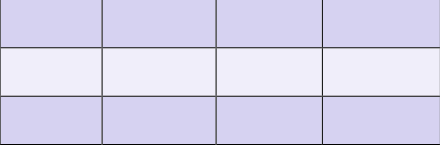

Cada linha da tabela representa o esporte, o cabelo e a altura associados ao amigo que está na linha. Vamos exemplificar usando uma informação do enunciado: **Pedro é o mais baixo** . 

|**Amigo**|**Esporte**|**Cabelo**|**Altura**|
|---|---|---|---|
|Pedro|||Mais baixo|

É assim que associaremos o fato de Pedro ser o mais baixo, colocando as informações na mesma linha. Sabemos também que **Pedro não faz natação** , como representamos isso? Simplesmente **colocando natação em uma linha diferente da de Pedro** . 

|**Amigo**|**Esporte**|**Cabelo**|**Altura**|
|---|---|---|---|
|Pedro|||Mais baixo|
||Natação|||

A próxima informação do enunciado é que **quem pratica voleibol é o mais alto** . Note que **Pedro não pode praticar voleibol pois ele é o mais baixo** . Como a segunda linha da tabela já está reservada para a natação, **temos que incluir esse fato na terceira linha** . 

|**Amigo**|**Esporte**|**Cabelo**|**Altura**|
|---|---|---|---|
|Pedro|||Mais baixo|
||Natação|||
||Voleibol||Mais alto|

Perceba que **o único esporte que sobrou para Pedro é o futebol** e **a única altura que sobrou para quem faz natação é a média** . Não se esqueçam de preencher esses casos, pois são consequências das próprias informações do enunciado. **Essas características que "sobram", nós vamos estar sempre destacando de vermelho em nossas resoluções** , conforme a seguir.

---

<!-- pagina: 5 -->

**Equipe Exatas Estratégia Concursos Aula 08** 

|**Amigo**|**Esporte**|**Cabelo**|**Altura**|
|---|---|---|---|
|Pedro|Futebol||Mais baixo|
||Natação||Média|
||Voleibol||Mais alto|

A próxima afirmativa é que **o ruivo pratica natação** . Na linha da natação, acrescentaremos o cabelo ruivo. 

|**Amigo**|**Esporte**|**Cabelo**|**Altura**|
|---|---|---|---|
|Pedro|Futebol||Mais baixo|
||Natação|Ruivo|Média|
||Voleibol ==5460==||Mais alto|

Por fim, a última informação dada é que **Antônio é loiro** . Veja que a primeira linha já está preenchida com Pedro, a segunda linha está preenchida com o ruivo, só sobra a terceira linha para dizer que Antônio é loiro. 

|**Amigo**|**Esporte**|**Cabelo**|**Altura**|
|---|---|---|---|
|Pedro|Futebol|Moreno|Mais baixo|
|José|Natação|Ruivo|Média|
|Antônio|Voleibol|Loiro|Mais alto|

Também preenchemos "José" e "moreno" pois foram **os dois que sobraram** após termos preenchido "Antônio" e "loiro". Se a tabela está completa, é possível analisar com precisão os itens do enunciado. 

A) Pedro é moreno e José pratica voleibol. 

**<mark>Alternativa incorreta.</mark>** <mark>Pedro é moreno mas</mark> **<mark>José pratica natação</mark>** <mark>e não voleibol.</mark> 

<mark>B) José é ruivo e Antônio pratica futebol.</mark> 

**<mark>Alternativa incorreta.</mark>** <mark>José é ruivo mas</mark> **<mark>Antônio pratica voleibol</mark>** <mark>e não natação.</mark> 

<mark>C) Antônio é o mais alto e Pedro é moreno.</mark> **<mark>Alternativa correta.</mark>** <mark>É exatamente o que encontramos ao montar a tabela.</mark>

---

<!-- pagina: 6 -->

**Equipe Exatas Estratégia Concursos Aula 08** 

<mark>D) Antônio pratica natação e José é ruivo.</mark> 

**<mark>Alternativa incorreta.</mark>** <mark>Antônio</mark> **<mark>pratica voleibol</mark>** <mark>.</mark> 

<mark>E) Pedro é ruivo e Antônio pratica voleibol.</mark> 

**<mark>Alternativa incorreta.</mark>** <mark>Pedro</mark> **<mark>é moreno</mark>** <mark>.</mark> 

**Gabarito:** Letra C. 

A tabela é uma ótima estratégia para resolver a grande maioria das questões que tratam desse assunto. Não se esqueça que **a resolução das questões a seguir é de fundamental importância** para sua evolução na matéria e consequente ganho de velocidade na prova. **Não deixe de fazê-las!**

---

<!-- pagina: 7 -->

**Equipe Exatas Estratégia Concursos Aula 08** 

## Verdades e Mentiras 

O tópico **"verdades e mentiras" é muito cobrado!** Sempre **está presente nos editais das mais diversas bancas** . As questões sobre o tema são identificadas de modo bem direto. Na maioria dos vezes, teremos alguns indivíduos que falam a verdade e outros que falam mentiras. Ademais, o enunciado fornece alguns condições e **pede uma conclusão** baseada nas informações dadas. Vamos ver um exemplo? 

**(MPE-RJ/2019)** Chico, Serafim, Juvenal e Dirceu trabalham juntos e, em certo momento, Dirceu pergunta: Que dia do mês é hoje? As respostas dos outros três foram: Chico: hoje não é dia 15. Serafim: ontem foi dia 13. Juvenal: hoje é dia 15. Sabe-se que um deles mentiu e os outros disseram a verdade. O dia em que Dirceu fez a pergunta foi dia: 

A) 13 B) 14 C) 15 D) 16 E) 17 

Esse é um **exemplo clássico** de uma questão de "verdade e mentira". Note que **apenas um** dos colegas de trabalho mente e os demais falam a verdade. Essa condição do enunciado estará sempre presente e é fundamental para o desenrolar da questão, pois, **assim que encontrarmos quem mentiu, automaticamente já saberemos quem falou a verdade** . 

Ao descobrir quem é o mentiroso (nas questões em que apenas um mentiu) ou o honesto (nas questões em que apenas um disse a verdade), basicamente **sua questão estará resolvida** . Mas então, como devemos começar essa busca? 

A **primeira dica** é: tente encontrar duas pessoas que fazem afirmativas que não podem ser verdadeiras **simultaneamente** . Vamos devagar! Do nosso exemplo, podemos retirar as seguintes afirmações: 

**Chico:** hoje não é dia 15.

---

<!-- pagina: 8 -->

**Equipe Exatas Estratégia Concursos Aula 08** 

**Serafim:** ontem foi dia 13. 

**Juvenal:** hoje é dia 15. 

Atente-se ao que Chico e Juvenal afirmam. Um informa que **hoje não é dia 15** , o outro diz que **hoje é dia 15** . 

Os dois poderão estar falando a verdade simultaneamente? **Com certeza não** ! Essa nossa conclusão implica que **um dos dois é o mentiroso** . Perceba que, rapidamente, "livramos a barra" do Serafim! Agora, devemos usar uma outra estratégia para descobrir se o mentiroso foi Chico ou Juvenal. 

Pessoal, **nem sempre** nos exercícios haverá dois personagens que possuem falas incompatíveis. De todo modo, recomendo que **sempre procure por essas pessoas** , pois, caso existam, **poupará um precioso tempo** da sua prova, principalmente em exercícios mais complexos. Dito isso, vamos a próxima dica: 

**Devemos supor que um deles está mentindo** ! Você pode se perguntar: _mas e se quem eu supor não for o mentiroso?_ **As implicações da sua escolha serão incoerentes e você notará** . Se o seu "chute" sobre quem é o mentiroso gerar uma **situação que foge** <u>do que é passado no enunciado, então</u> **sua suposição não estará certa** e o mentiroso é outra pessoa. Vamos aplicar isso no nosso exemplo? 

Estamos em dúvida entre Chico e Juvenal. Quem mentiu? <u>Suponha</u> que Chico é o mentiroso. Quais as implicações disso? 

1. Se Chico mente quando fala que hoje não é dia 15, **então hoje é dia 15 sim** . 

2. **Se hoje é dia 15, então ontem foi dia 14** . 

Note que **Serafim afirma que ontem foi dia 13,** isso implica que ele está mentindo também. Nesse ponto, percebemos que **nossa escolha de Chico como mentiroso não foi adequada** , pois implica que Serafim **também não está falando a verdade** e o enunciado deixa claro que **apenas um deles mentiu** . 

Ora, se Chico não pode ser o mentiroso, então **o único que pode ser é o Juvenal** ! Mesmo através de uma suposição equivocada, é possível encontrar o mentiroso logo na sequência! **Não seja receoso em apenas supor e observar o que acontece a partir disso** . É uma estratégia super válida e vai te ajudar bastante nesse tipo de exercício. 

Se Juvenal é nosso mentiroso, então **hoje não é dia 15** . 

Lembre-se: para tornar uma afirmativa falsa em uma afirmativa verdadeira, basta negá-la! 

Se hoje não é dia 15, então estamos confirmando o que Chico está dizendo. Além disso, Serafim também fala a verdade e nos informa que **ontem foi dia 13** . Se ontem foi dia 13, então **hoje só pode ser 14** . Logo, podemos marcar **a alternativa B** como resposta. 

Vamos organizar um pouco melhor essa **linha de raciocínio** ?

---

<!-- pagina: 9 -->

**Equipe Exatas Estratégia Concursos Aula 08** 

**1.** Procure por afirmações que **não podem ser verdadeiras simultaneamente** . Exemplos para desconfiar: 

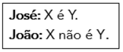

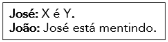

**2a.** Caso **você encontre** esse tipo de afirmação na sua questão: 

- **Suponha** que um dos dois está mentindo. 

- Observe as **implicações** que isso acarretará. 

**-** Julgue se as implicações estão **dentro do que foi proposto no enunciado** . Se não estão, você fez uma **suposição equivocada** e o suposto mentiroso na realidade está dizendo a verdade. Se estão, você fez uma **suposição correta** , o mentiroso é realmente quem você selecionou para ser. 

- Sabendo quem falou a verdade e quem mentiu, faça as conclusões pertinente à questão. 

**2b** . Caso **você não encontre** : 

- Sem perda de generalidade, **escolha qualquer pessoa** para ser o mentiroso. 

- Observe as **implicações** que isso acarretará. 

**-** Julgue se as implicações estão **dentro do que foi proposto no enunciado** . Se não estão, você fez uma **suposição equivocada** e quem era mentiroso na realidade está dizendo a verdade. Se estão, você fez uma **suposição correta** , o mentiroso é realmente quem você selecionou para ser. 

- Faça as conclusões pertinentes e **observe se já é possível marcar uma alternativa** . Caso não seja possível, 

- **faça uma nova suposição e repita os passos acima** . 

Não é preciso fazer resumo disso, nem se preocupar em decorar o passo a passo. **A meta será fazer bastante exercícios para que essa abordagem se torne automática!** Selecionei alguns exemplos para destrinchar um pouco mais com vocês! Vamos lá?! 

**(SSP-AM/2022)** Eva, Bia e Gal encontraram-se para almoçar e estavam com bolsas parecidas, mas com cores diferentes. Uma bolsa era cinza, outra era marrom e outra era preta. 

Das afirmativas seguintes, somente uma é verdadeira: 

- Eva está com a bolsa preta. 

- Bia não está com a bolsa marrom. 

- Gal não está com a bolsa preta.

---

<!-- pagina: 10 -->

**Equipe Exatas Estratégia Concursos Aula 08** 

É correto afirmar que 

A) Eva tem a bolsa marrom. 

B) Bia tem a bolsa preta. 

C) Gal tem a bolsa marrom. 

D) Eva tem a bolsa cinza. 

E) Bia não tem a bolsa cinza. 

**Comentários:** 

Sabemos que **<u>apenas uma das afirmativas é verdadeira</u>** . 

**<u>Suponha</u>** que seja a primeira: **Eva está com a bolsa preta.** 

Ora, se Eva é quem está com a bolsa preta, então **Gal não está com a bolsa preta** . _Concorda?_ 

Sendo assim, isso faz com que a terceira afirmativa também seja verdade! 

_Opa, peraí!!_ Agora temos **<u>duas afirmativas verdadeiras</u>** , quando o enunciado disse que temos apenas uma! 

Dessa forma, nossa suposição inicial de que "Eva está com a bolsa preta" é verdade, no fim, foi incorreta. Já sabemos, portanto, que a primeira afirmativa só pode ser falsa. 

Vamos repetir esse procedimento, considerando que **a segunda afirmativa é a verdadeira** , ou seja, **Bia não está com a bolsa marrom.** 

Como **<u>apenas uma afirmativa pode ser verdade</u>** , então temos que as outras afirmativas devem ser falsas: 

**- Eva está com a bolsa preta.** 

**- Gal não está com a bolsa preta.** 

Como a primeira alternativa é falsa, então **Eva não está com a bolsa preta** . 

Como a terceira afirmativa é falsa, então **Gal está com a bolsa preta** . 

Vamos criar uma tabela com essas informações. 

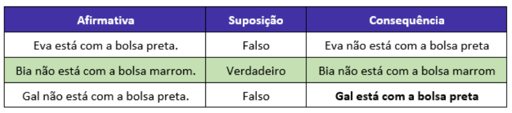

---

<!-- pagina: 11 -->

###### **Equipe Exatas Estratégia Concursos Aula 08** 

Já sabemos **a bolsa da Gal! É a preta** . Como a da Bia não pode ser a marrom, a dela só poderá ser a cinza. Consequentemente, **a bolsa marrom sobra para Eva.** 

Observe que quando supomos que a segunda afirmativa é a verdadeira, chegamos a um cenário **super plausível e coerente com as condições do enunciado** . Sendo assim, é a resposta procurada. 

Caso queira, você pode testar o cenário em que a terceira afirmativa é a única verdadeira. Se fizer isso, você chegará obterá uma **incoerência** : **Bia estará com a bolsa marrom e com a preta** , configurando-se assim uma situação que foge das condições do enunciado. Com isso, podemos marcar a letra A, **Eva tem a bolsa marrom** . 

**Gabarito:** LETRA A. 

==5460== 

Note que usamos nossa abordagem de uma **forma bem sútil** , apenas como uma **estrela guia no nosso raciocínio** . Você não precisa se amarrar a ela! Cada questão traz a **sua peculiaridade** que deve ser levada em conta na hora de resolvê-la. 

**(SEFAZ-ES/2022)** Na mesa de Antônio há três gavetas: A, B e C. Uma gaveta contém documentos, outra contém chocolates e a terceira contém dinheiro. Sabe-se que das afirmativas a seguir sobre as gavetas somente uma é verdadeira. 

- A tem dinheiro. 

- B não tem chocolates. 

- C não tem dinheiro. 

Assim, é correto afirmar que A) A tem chocolates. 

B) B tem dinheiro. 

C) C tem chocolates. 

D) A tem documentos. 

E) B não tem documentos. 

#### **Comentários:** 

Inicialmente, vamos **<u>supor</u>** que a primeira afirmativa é verdadeira, isto é, "A tem dinheiro". 

#### Ora, se A tem dinheiro, então **C não pode ter dinheiro** , concorda?  Afinal, cada gaveta deve ter um dos itens (documento, chocolate ou dinheiro). 

Diante dessa situação, a terceira afirmativa **"C não tem dinheiro" também seria verdadeira** . Como o enunciado foi categórico ao afirmar que **<u>apenas uma das afirmativas é verdadeira</u>** , a situação proposta não 

###### **DataPrev - Raciocínio Lógico - 2026 (Pós-Edital)** <mark>11</mark> **_www.estrategiaconcursos.com.br_** <mark>113</mark> 

###### <mark>113</mark> https://t.me/KakashiAssinaturasBot

---

<!-- pagina: 12 -->

**Equipe Exatas Estratégia Concursos Aula 08** 

poderia ocorrer. Com isso, **"A tem dinheiro" tem que ser falsa** (pois caso ela seja verdadeira, outra também será e o enunciado veda isso). 

A nossa primeira suposição foi frustrada! Vamos partir para a próxima! Suponha que a afirmativa verdadeira é a segunda: "B não tem chocolates". Sendo assim, **em B só pode ter dinheiro ou documento** . 

Se a segunda é a verdadeira, a primeira e a terceira afirmativa são falsas (lembre-se que só podemos ter uma verdadeira). Se "C não tem dinheiro" é falsa, então podemos concluir que **"C tem dinheiro"** . 

Se "C tem dinheiro", só sobra a opção de **"documento" para a gaveta B** e de **"chocolate" para a gaveta A.** 

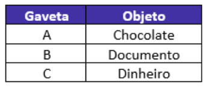

Observe que essa configuração **atende aos requisitos do enunciado** ! Com isso, podemos marcar letra A. 

**Gabarito:** LETRA A. 

Pessoal, a realidade é que **algumas bancas gostam de inovar** e nem sempre “verdades e mentiras” aparecerão dessa forma. Estudaremos alguns exemplos, cuja **abordagem pode diferir** dessa que vimos até agora, para que você fique ainda mais preparado e confiante para enfrentar o tema. 

**(MPE-AL/2018)** Em certo dia útil da semana (de segunda a sexta-feira) Mário e Jorge fizeram duas declarações cada um. Um deles disse a verdade nas duas declarações e o outro mentiu nas duas: - Mário: anteontem foi sábado. - Jorge: depois de amanhã não será sábado. - Mário: amanhã será quarta-feira. - Jorge: ontem não foi quinta-feira. O dia da semana em que eles fizeram essas declarações foi A) segunda-feira 

B) terça-feira 

C) quarta-feira 

D) quinta-feira 

#### **Comentários:** 

Extraindo do enunciado as informações ditas por cada um, obtemos:

---

<!-- pagina: 13 -->

**Equipe Exatas Estratégia Concursos Aula 08** 

**Mário:** - anteontem foi sábado. 

**Jorge:** - depois de amanhã não será sábado. 

**Mário:** - amanhã será quarta-feira. 

**Jorge:** - ontem não foi quinta-feira. 

Sabemos ainda que quem falou a verdade, falou a verdade nas duas afirmações que disse. Ademais, quem mentiu, mentiu nas duas informações que deu. Vamos supor que Mário falou a verdade, então fica assim: 

**Mário:** - anteontem foi sábado. **(V) Implica que hoje é uma segunda-feira. Jorge:** - depois de amanhã não será sábado. **(F) Mário:** - amanhã será quarta-feira. **(V) Implica que hoje é uma terça-feira. Jorge:** - ontem não foi quinta-feira. **(F)** 

Percebemos que se as duas informações dada por Mário são verdadeiras, **vamos obter conclusões conflitantes** . Uma me diz que hoje é segunda-feira e a outra me diz que hoje é terça-feira. O que podemos concluir disso? Que **Mário não está falando a verdade** ! Devemos inverter a situação, agora Mário é o mentiroso e Jorge é aquele que falou a verdade: 

**Mário:** - anteontem foi sábado. **(F) Implica que hoje não é segunda-feira. Jorge:** - depois de amanhã não será sábado. **(V) Implica que hoje não é quinta-feira. Mário:** - amanhã será quarta-feira. **(F) Implica que hoje não é terça-feira. Jorge:** - ontem não foi quinta-feira. **(V) Implica que não é sexta-feira.** 

Logo, **o único dia útil** que estava disponível para eles terem realizado essas afirmações foi **a quarta-feira** . 

**Gabarito:** A alternativa correta é a **letra C** . 

Apesar da abordagem da questão ter mudado, uma coisa permaneceu constante: a necessidade de realizar suposições. Isso **dificilmente não estará presente** em uma questão de "verdades e mentiras". _Vamos para a próxima?!_ 

**(SEFAZ-RS/2019)** No exercício de suas atribuições profissionais, auditores fiscais sempre fazem afirmações verdadeiras, ao passo que sonegadores sempre fazem proposições falsas. Em uma audiência para tratar de autuações, formou-se uma fila de 200 pessoas, constituída apenas de auditores fiscais e sonegadores. A primeira pessoa da fila afirma que todos os que estão atrás dela são sonegadores. Todas as demais pessoas da fila afirmam que a pessoa que está imediatamente à sua frente é sonegadora. Nessa situação hipotética, de acordo com o texto, a quantidade de sonegadores que estão nessa fila é igual a 

A) 0 B) 99 C) 100

---

<!-- pagina: 14 -->

**Equipe Exatas Estratégia Concursos Aula 08** 

D) 199 E) 200 

#### **Comentários:** 

Vamos extrair do texto as principais informações: 

1. A fila tem 200 pessoas e é constituída de **auditores** e **sonegadores** ; 

2. Auditores falam sempre a verdade e sonegadores falam sempre mentira; 

3. A **primeira pessoa** da fila afirma que todos que estão atrás dela são sonegadores; 

4. As **demais pessoas** na fila afirmam que a pessoa que está imediatamente à sua frente é sonegadora. 

Não sabemos se as afirmações das pessoas que estão na fila são verdadeiras ou falsas. Logo, devemos **supor uma situação e observar as implicações** . Imagine que a primeira pessoa na fila é um auditor. Se um auditor está dizendo que todos os que estão atrás dele são sonegadores, então ele contará um fato verdadeiro, pois **todo auditor diz a verdade** . A situação será a seguinte: 

Além disso, observe que as demais pessoas falam que quem está **imediatamente à sua frente** é um sonegador. Um sonegador não poderia dizer que na sua frente tem um outro sonegador, pois estaria contando a verdade e **sonegadores mentem** ! Logo, essa suposição de que a primeira pessoa é um auditor **não é adequada** , pois implica em uma situação que não condiz com o que é estabelecido no enunciado da questão. Como só existem auditores e sonegadores nessa fila, concluímos que **o primeiro da fila é um sonegador** : 

Lembre-se que todas **as outras pessoas da fila** falam que a pessoa na sua frente é um sonegador. Então, a segunda pessoa na fila acertou! **Ela está falando a verdade e, por esse motivo, é um auditor** . 

---

<!-- pagina: 15 -->

**Equipe Exatas Estratégia Concursos Aula 08** 

A terceira pessoa da fila mentiu, pois **quem está na frente dela é um auditor e não um sonegador** . Logo, essa pessoa só pode ser um sonegador (pois mentiu). A quarta pessoa da fila estará falando a verdade pois quem estará na frente dela será um sonegador. **Se fala a verdade, então é um auditor** . Veja que esse revezamento continua acontecendo até o final da fila **. Como temos 200 pessoas, 100 deles serão auditores e outros 100 serão sonegadores** . 

**Gabarito:** LETRA C.

---

<!-- pagina: 16 -->

**Equipe Exatas Estratégia Concursos Aula 08** 

## Outros Problemas de Lógica 

Fala, pessoal! Vamos conversar um pouco! Nem sempre as questões de lógica se limitam aos temas que vimos anteriormente (estruturas e equivalências lógicas, diagramas lógicos, lógica de argumentação...). Às vezes, a banca traz questões que não se encaixam em uma teoria formalizada, mas que exigem razoável raciocínio lógico para sua resolução. Quando isso acontece, o aluno que já teve contato com um problema similar durante sua jornada, consegue se sair melhor e economiza preciosos minutos na prova. 

Dito isso, a intenção dessa aula é prepará-los para essas situações. Nesse intuito, apresentarei diferentes tipos de problemas que frequentemente estão nas provas. Com esse contato inicial, vocês ganharão mais bagagem e certamente ficarão mais preparados para enfrentar problemas aparentemente desafiadores. 

### Sudoku e similares 

Para quem não conhece, o **Sudoku "tradicional"** é um quadro 9 × 9 com o seguinte aspecto: 

O objetivo desse jogo é preencher os espaços vazios do quadro com **os números de 1 a 9** de forma que **nenhum número pode se repetir** dentro de uma mesma linha, coluna ou quadro 3 × 3 . Observe a seguinte disposição parcial correta:

---

<!-- pagina: 17 -->

**Equipe Exatas Estratégia Concursos Aula 08** 

|1|2|3|4|5|6|7|8|9|
|---|---|---|---|---|---|---|---|---|
|4|5|6|7|8|9|1|2|3|
|9|8|7|1|2|3|4|5|6|

Quando observamos cada uma das três linhas individualmente, **não há números repetidos** . Nos blocos 3 × 3 também **não há repetições** : 

|1|2|3|4|5|6|7|8|9|
|---|---|---|---|---|---|---|---|---|
|4|5|6|7|8|9|1|2|3|
|9|8|7|1|2|3|4|5|6|

A mesma coisa deve acontecer para cada coluna! **Os números não devem se repetir** . 

#### _Professor, vou ter que pensar em todos esses números na hora da prova?_ 

Muitas vezes as questões trazem Sudoku menores (quadro 4 × 4 ) ou derivados mais fáceis. Além disso, o **Sudoku sempre vem parcialmente preenchido** . Quanto mais preenchido, mais fácil é (normalmente) de preencher o restante. Antes da nossa questão, observe um exemplo de Sudoku completamente preenchido:

---

<!-- pagina: 18 -->

**Equipe Exatas Estratégia Concursos Aula 08** 

|5|3|4|6|7|8|9|1|2|
|---|---|---|---|---|---|---|---|---|
|6|7|2|1|9|5|3|4|8|
|1|9|8|3|4|2|5|6|7|
|8|5|9|7|6|1|4|2|3|
|4|2|6|8|5|3|7|9|1|
|7|1|3|9|2|4|8|5|6|
|9|6|1|5|3|7|2|8|4|
|2|8|7|4|1|9|6|3|5|
|3|4|5|2|8|6|1|7|9|

**(TJ-SC/2021)** Um tabuleiro de Sudoku de dimensão 4 é um quadrado 4 × 4 subdividido em quatro quadrados 2 × 2 demarcados. Observe na figura abaixo um tabuleiro desse tipo parcialmente preenchido. 

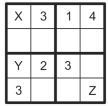

Para terminar de preenchê-lo, é preciso colocar os números de 1 a 4, sem repetição, em cada linha, em cada coluna e em cada quadrado 2 × 2 demarcado. Preenchido corretamente o tabuleiro na figura, obtém-se que X + Y + Z é igual a: 

A) 9. 

B) 7. 

C) 8. 

D) 6. E) 10. 

#### **Comentários:** 

Um primeiro passo no Sudoku é procurar aquela linha / coluna / bloco **que mais esteja completa** .

---

<!-- pagina: 19 -->

**Equipe Exatas Estratégia Concursos Aula 08** 

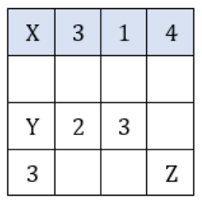

Observe que na linha destacada **falta apenas o 2** ! Sendo assim: 

Agora, vamos observar o número "3". Note que temos o número "3" em três colunas e em três linhas. 

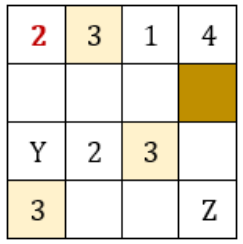

Com isso, a única posição possível para o próximo número "3" é o quadradinho mais escuro. 

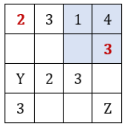

Observe o quadrado destacado, **está faltando apenas o número 2** . Vamos completá-lo. 

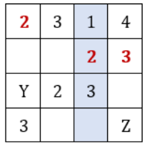

---

<!-- pagina: 20 -->

**Equipe Exatas Estratégia Concursos Aula 08** 

Com o "2" no lugar, ficamos com uma coluna quase completa (destacada em azul na imagem acima). Observe que nessa coluna **está faltando apenas o 4** . 

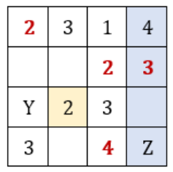

Agora, vamos olhar para a coluna destacada. Nela, **estão faltando os números "1" e "2"** . Observe que o número "2" **<u>não</u> pode estar na terceira linha** , pois já temos o "2" nela (em amarelo). Sendo assim, só podemos ter que: 

Ficamos com a seguinte situação: 

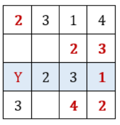

Por último, vamos olhar a terceira linha. **O único número faltando é o 4** . Sendo assim: 

Com os valores de 𝑋 , 𝑌 e 𝑍 , podemos determinar **a soma** : 

<u>𝑿+ 𝒀+ 𝒁</u> = 𝟖 

**Gabarito:** LETRA C.

---

<!-- pagina: 21 -->

**Equipe Exatas Estratégia Concursos Aula 08** 

### Árvore Genealógica 

Questões que envolvem parentesco costumam ser mais tranquilas, mas podem causar confusão! Para evitar isso, vamos dar uma olhada em uma árvore genealógica. 

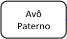

<!-- Start of picture text -->
Avô Paterno <!-- End of picture text -->

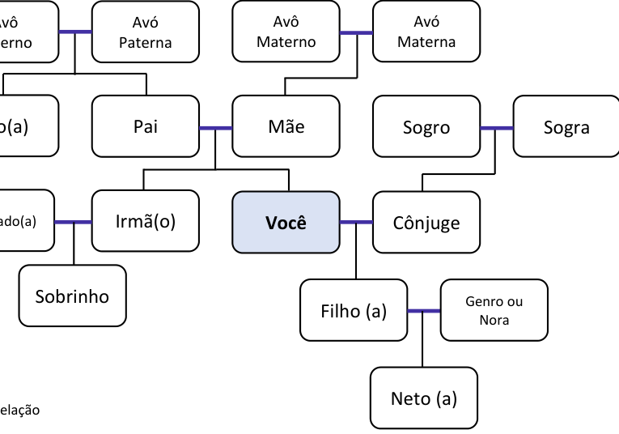

<!-- Start of picture text -->
Avó  Avô  Avó Paterna  Materno  Materna Pai  Mãe  Sogro  Sogra Irmã(o)  Você  Cônjuge Sobrinho  Genro ou Filho (a)  Nora Neto (a) <!-- End of picture text -->

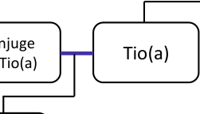

<!-- Start of picture text -->
Tio(a) <!-- End of picture text -->

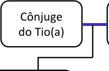

<!-- Start of picture text -->
Cônjuge do Tio(a) <!-- End of picture text -->

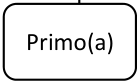

<!-- Start of picture text -->
Primo(a) <!-- End of picture text -->

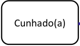

<!-- Start of picture text -->
Cunhado(a) <!-- End of picture text -->

<!-- Start of picture text -->
indica união, casamento, relação <!-- End of picture text -->

Pessoal, a árvore acima está resumida. Claro que podemos ir além. Faltaram os bisavós/bisavôs, os tios/tias por parte de mãe... Além disso, tomei a liberdade de adicionar o filho (a), o genro/nora, o sogro e a sogra. Trata-se de uma **árvore para efeitos didáticos** . Com isso, a intenção é que você consiga enxergar melhor as relações de parentesco que eventualmente apareçam nas questões de sua prova. 

**(BADESUL/2022)** Renata é irmã da prima do irmão de Felipe. Sabe-se que Felipe tem um único irmão, Miguel. E Renata, uma única irmã, Flávia. Portanto, pode-se afirmar que: 

A) Renata não é prima de Felipe. 

B) Felipe é irmão de Renata. 

C) Felipe tem só uma prima. 

D) Felipe tem pelo menos duas primas. 

E) Renata tem apenas uma prima. 

#### **Comentários:**

---

<!-- pagina: 22 -->

**Equipe Exatas Estratégia Concursos Aula 08** 

Nessas questões de parentesco, é muito recomendável ter calma (rsrs). Às vezes, pode ser que uma análise apressada nos leve a uma conclusão equivocada, pois é bem fácil fazer confusão aqui. 

A primeira informação que o enunciado trouxe foi que "Renata é irmã da prima do irmão de Felipe". Ora, se Renata é irmã da prima, então Renata também é prima do irmão de Felipe (Miguel). Por sua vez, se elas são primas do irmão de Felipe, então elas são primas do próprio Felipe!  Dito isso, vamos analisar as alternativas. 

A) Renata não é prima de Felipe. 

**Errado.** Como Renata é **irmã da prima** , ela também é prima sim. 

B) Felipe é irmão de Renata. 

**Errado.** Felipe é irmão de Miguel (seu **<u>único</u>** irmão), conforme enunciado. 

C) Felipe tem só uma prima. 

**Errado.** Felipe tem pelo menos duas primas: **Renata e Flávia** . 

D) Felipe tem pelo menos duas primas. 

**Correto.** Foi exatamente a conclusão que chegamos! Renata e Flávia são primas de Felipe. 

E) Renata tem apenas uma prima. 

**Errado.** Renata tem pelo menos dois primos (Felipe e Miguel). 

**Gabarito:** LETRA D. 

### Palitos 

Outro tipo de questão que aparece bastante é aquela envolvendo palitos! Em algumas vezes, precisaremos apenas reorganizá-los, outras vezes precisaremos trabalhar como se estivessem em sequência. Com isso, vamos direto para uma exemplo. 

**(SEE-MG/2018)** Brincando com palitos, Luiza percebeu que, com 6 palitos, só era possível formar um retângulo, conforme a figura a seguir.

---

<!-- pagina: 23 -->

**Equipe Exatas Estratégia Concursos Aula 08** 

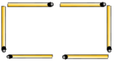

Se ela conseguir mais 8 palitos, quantos retângulos diferentes podem ser formados usando os palitos? 

A) 3 

B) 6 

C) 7 

D) 11 

E) 14 

#### **Comentários:** 

Temos mais **8 palitos** e queremos formar a maior quantidade de retângulos possíveis. Observe que para isso, podemos aproveitar o maior lado do retângulo da figura. 

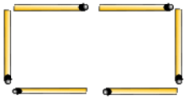

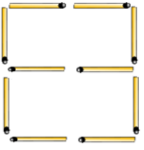

<!-- Start of picture text -->
1 <!-- End of picture text -->

<!-- Start of picture text -->
2 <!-- End of picture text -->

<!-- Start of picture text -->
3 <!-- End of picture text -->

**Gabarito:** LETRA A. 

## Balan a de Pratos <u>ç</u> 

O último tipo de problema que estudaremos e que costuma frequentar as provas é aquele envolvendo balança de pratos. O ponto chave aqui é saber que uma balança de pratos está equilibrada **quando o peso do lado esquerdo for igual ao peso do lado de direito** . Com isso, sempre conseguiremos equacionar o problema e determinar o que está sendo pedido.

---

<!-- pagina: 24 -->

**Equipe Exatas Estratégia Concursos Aula 08** 

**(SEMSA-MANAUS/2022)** A figura abaixo mostra uma balança de pratos equilibrada. 

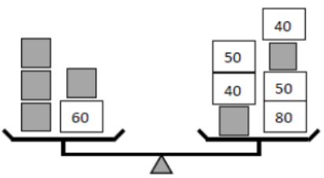

As caixas escuras têm todas o mesmo peso e as caixas claras estão com seus pesos, em gramas, marcados em cada uma delas. O peso de cada caixa escura, em gramas, é 

A) 60. 

B) 70. 

C) 80. 

D) 90. 

E) 100. 

#### **Comentários:** 

Vamos chamar o peso da caixa escura de "x". Como a balança está equilibrada, o peso do lado esquerdo deve <u>igual ao peso do lado direito. Com isso, podemos equacionar:</u> 

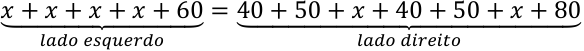

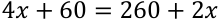

<u>𝒙</u> = 𝟏𝟎𝟎 

**Gabarito:** LETRA E.

---

<!-- pagina: 25 -->

**Equipe Exatas Estratégia Concursos Aula 08** 

### Outros exemplos de problemas 

**(BANESTES/2023)** Um material didático usado para ensinar crianças sobre sólidos é composto por 30 peças entre esferas, cubos e cilindros. Cada uma dessas peças tem cor única. A distribuição de peças e cores é apresentada no quadro a seguir. 

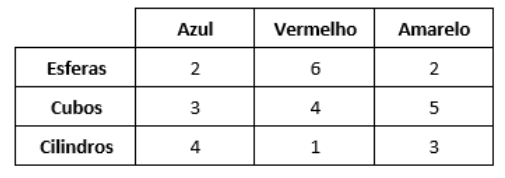

A quantidade de peças que não são vermelhas ou são cilindros é ==5460== A) 19. B) 20. 

C) 23. 

D) 24. 

E) 27. 

#### **Comentários:** 

Queremos a quantidade de peças que **<u>não são vermelhas (NV)</u>** , ou seja, a quantidade que está na primeira e na terceira coluna. 

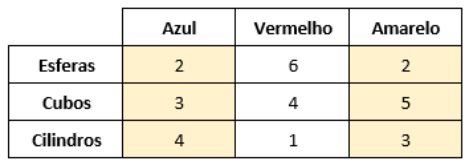

Assim: 

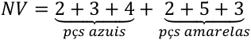

Beleza. Agora, vamos contar **quantas peças são cilindros** (C). É a nossa terceira linha. 

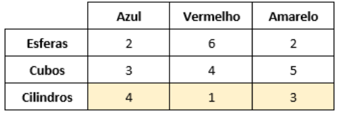

---

<!-- pagina: 26 -->

**Equipe Exatas Estratégia Concursos Aula 08** 

Assim: 

Beleza! O aluno desavisado somaria 𝑁𝑉 com 𝐶 : 

𝑆= 𝑁𝑉+ 𝐶         →          𝑆= 19 + 8        →        𝑆= 27 

**Muito cuidado, galera!** Pois há peças que **contamos duas vezes** . 

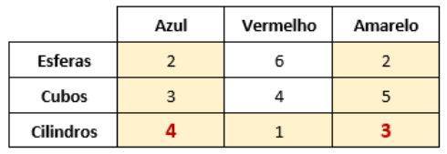

#### Observe que **os cilindros azuis e os cilindros amarelos foram contados duas vezes** . 

Dessa forma, devemos **<u>subtraí-los</u>** da nossa soma inicial. 

𝑆′ = 27 −4 −3        → <u>𝑺</u>′ = 𝟐𝟎 

**Gabarito:** LETRA B. 

### Formação de Conceitos 

Apesar das bancas trazerem esse tópico em seus editais, **o seu aparecimento em prova ainda é tímido** . Para entender como esse tópico costuma cair, segue uma questão: 

**(TCE-GO/2009)** Na sentença seguinte falta a última palavra. Você deve escolher a alternativa que apresenta a palavra que MELHOR completa a sentença. 

_Devemos saber empregar nosso tempo vago; podemos, assim,_ 

_desenvolver hábitos agradáveis e evitar os perigos da..._ 

a) pobreza. b) ociosidade.

---

<!-- pagina: 27 -->

**Equipe Exatas Estratégia Concursos Aula 08** 

c) bebida. d) doença. e) desdita. 

Você deve estar se perguntando se o professor enlouqueceu. Calma, moçada! Acredite ou não, **essa questão estava em uma prova de Raciocínio Lógico e não de Português** . Antigamente, cobranças assim eram mais frequentes. Hoje, no entanto, **elas estão com uma incidência bastante reduzida** , mas o tópico continua presente nos editais. Por esse motivo, sinto-me na obrigação de comentá-lo, **pelo menos um pouco,** com vocês. 

O objetivo da questão era que soubéssemos relacionar que **quando temos tempo vago, estamos ociosos** . Dessa maneira, quando tentamos fazer um bom uso desse tempo, estamos **fugindo da ociosidade** <u>.</u> 

Não existe um raciocínio muito claro para marcar a questão. É cobrado o conhecimento direto dos conceitos. Uma maneira, caso haja dúvidas no significado, **é optar pela eliminação de alternativas** . Por exemplo, as expressões chaves da sentença são: 

"empregar nosso tempo vago" - "desenvolver hábitos agradáveis" - "evitar os perigos" 

Você deve eliminar as palavras que, aparentemente, **estão fora do contexto dessas expressões** . Por exemplo, "pobreza" e "desdita (infortúnio; desgraça)" não parecem relacionadas às expressões e poderiam ser descartadas. 

Depois disso **, tentamos fazer uma análise mais profunda das alternativas que sobraram e marcar uma resposta** . Não é o cenário ideal para resolver o exercício, mas **quando não conhecemos os conceitos, realmente fica mais difícil** . Vamos ver mais uma questão desse estilo? 

**(BACEN/2006)** A questão apresenta sentenças, em cada uma das quais falta a última palavra. Você deve procurar, entre as alternativas apresentadas, a palavra que melhor completa a sentença dada. 

Novas ideias e invenções criam necessidades de expressão, novas palavras para denominar os inventos da ciência e da tecnologia. Surgem, então, os chamados 

a) neologismos. 

b) modernismos. 

c) silogismos. 

d) neocíclicos.

---

<!-- pagina: 28 -->

**Equipe Exatas Estratégia Concursos Aula 08** 

e) neófitos. 

**Comentários:** 

A **Oxford Languages** define **neologismo** como: 

_"emprego de palavras novas, derivadas ou formadas de outras já existentes, na mesma língua ou não."_ 

Pessoal, parece brincadeira, mas não é. Reforço que esse estilo de questão é antigo, mas, fiquem espertos! O tópico ainda aparece em editais. 

**Gabarito:** LETRA A 

### Discriminação de Elementos 

Nas questões desse tema, muitas vezes será exigido que sejamos capazes de encontrar **qual elemento não compartilha uma característica comum a um determinado grupo** . Vamos checar na prática? 

**(TRF-2/2012)** Sabe-se que exatamente quatro dos cinco grupos de letras abaixo têm uma característica comum. 

#### BCFE − HILK − JKNM − PQTS − RSUV 

Considerando que a ordem alfabética adotada é a oficial, o único grupo de letras que NÃO apresenta a característica comum dos demais é: 

a) BCFE 

b) HILK 

c) JKNM 

d) PQTS e) RSUV 

Percebeu como faz sentido o nome ser discriminação de elementos? Além disso, devemos usar um certo grau de **raciocínio sequencial para resolvê-la** e essa exigência vai se repetir bastante em questões do gênero. Chega de papo e vamos à resolução!

---

<!-- pagina: 29 -->

**Equipe Exatas Estratégia Concursos Aula 08** 

Pessoal, o primeiro passo aqui é descobrir **qual é essa característica comum** . Devemos pegar um elemento a nossa escolha e "dissecá-lo". O enunciado ainda fala para **considerar a ordem alfabética oficial** , o que já **um bom ponto de partida** para nossa análise. Pegue, por exemplo, o primeiro grupo de letras BCFE. 

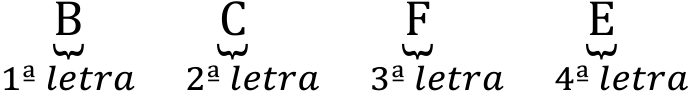

Observe que a segunda letra "C" **é a letra seguinte** a primeira letra "B". Além disso, a quarta letra "E" **é uma letra antes** da terceira letra "F". Por fim, **falta encontrarmos como chegamos na terceira letra** . 

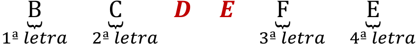

Note que existe duas letras entre a 2ª e a 3ª. Vamos ver se isso se repete para as demais letras do grupo? 

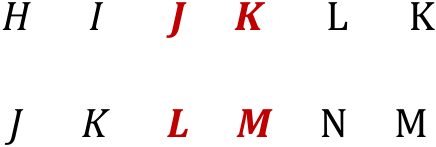

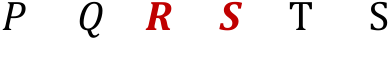

Fazendo essa checagem, nós já percebemos que **o último grupo de letras está meio estranho** . Mas, antes de falarmos nele, vamos definir a como os grupos estão organizados. 

**1ª letra:** É escolhido, definido. **2ª letra:** É a letra seguinte a 1ª letra. 

**3ª letra:** Em ordem alfabética, existem duas letras entre a 2ª e a 3ª letra. 

**4ª letra:** É a letra anterior a 3ª letra. 

Observe que essa sequência se repete para todos os grupos, **menos para o último** . 

R⏟ S⏟ 𝑻 U⏟ V⏟ 1ª 𝑙𝑒𝑡𝑟𝑎 2ª 𝑙𝑒𝑡𝑟𝑎 3ª 𝑙𝑒𝑡𝑟𝑎 4ª 𝑙𝑒𝑡𝑟𝑎 

https://t.me/KakashiAssinaturasBot

---

<!-- pagina: 30 -->

**Equipe Exatas Estratégia Concursos Aula 08** 

Entre a terceira letra e a segunda letra, só existe uma letra e não duas. O jeito certo seria: 

R⏟ S⏟ 𝑻      𝑼 V⏟ U⏟ 1ª 𝑙𝑒𝑡𝑟𝑎 2ª 𝑙𝑒𝑡𝑟𝑎 3ª 𝑙𝑒𝑡𝑟𝑎 4ª 𝑙𝑒𝑡𝑟𝑎 

Por esse motivo, podemos marcar a letra E sem medo. Vamos praticar mais um pouco? 

**(IBGE/2020)** Considere os seguintes pares de números: 

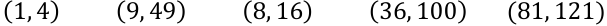

Observe que quatro desses pares têm uma característica comum. Qual o par que não apresenta tal característica? 

a) (1, 4) 

b) (9, 49) 

c) (8, 16) d) (36, 100) e) (81, 121) 

#### **Comentários:** 

Observe que os pares são formados por quadrados de números inteiros. 

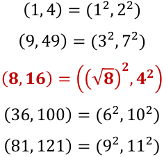

Apenas o par (𝟖, 𝟏𝟔) contém um número que não é um inteiro elevado ao quadrado: **8.** Por esse motivo, é o par que não apresenta a característica comum aos demais. 

**Gabarito:** LETRA C.

---

<!-- pagina: 31 -->

**Equipe Exatas Estratégia Concursos Aula 08** 

## Princípio da Reversão (ou Regressão) 

Pessoal, o "Princípio da Reversão", que algumas bancas colocam em seus editais, não envolve uma teoria propriamente dita. Trata-se de **um método** para resolver um tipo de problema bem específico. Vocês podem ter se deparado com o assunto e ter resolvido uma questão sem nem pensar que estava usando esse tal princípio. Para começar, **veja abaixo um exemplo** de exercício que envolve o tema. 

**(IDIB/PREF. FARROUPILHA/2018)** Leandra tinha alguns chocolates, comeu dois e doou <mark>dois para sua vizinha. Depois deu a metade que sobrou pro seu primo. Se o primo ficou com 5 chocolates, quantos tinha Leandro no início?</mark> 

<mark>(A) 12.</mark> 

<mark>(B) 14.</mark> 

<mark>(C) 16. (D) 18.</mark> (E) 20 

Galera, como resolvemos isso? Considere que **Leandra tinha** 𝒙 **chocolates** inicialmente. Além disso, veja que o problema pode ser dividido em algumas etapas. 

- 1) Leandra come dois chocolates; 

- 2) Leandra doa dois chocolates para a vizinha; 

- 3) Leandra dá metade do que sobra para seu primo; 

- 4) O primo fica com 5 chocolates (Leandra também fica com 5, pois ela divide na metade). 

#### Vamos na ordem. 

- 1) Se Leandra tinha 𝑥 chocolates e **comeu dois** , então **ela ficou com** 𝒙−𝟐 **chocolates** . 

- 2) Se Leandra **doa dois** chocolates para a vizinha, então **ela fica com** 𝒙−𝟒 **chocolates** . 

𝒙−𝟒 

- 3) Se Leandra **dá metade** do que tinha para seu primo, então **ela fica com** ~~.~~ 𝟐 

- 4) Se o primo fica com 5 chocolates, então **ela fica também com 5 chocolates** , já que ela deu metade. 

Assim,

---

<!-- pagina: 32 -->

**Equipe Exatas Estratégia Concursos Aula 08** 

𝑥−4 = 5      →      𝑥−4 = 10      →      𝑥= 14 2 

Logo, **Leandra tinha 14 chocolates no início** . Observe que resolvemos a questão **sem falar de Princípio da Reversão** . Isso sempre será possível. Tal princípio é apenas **um método que nos auxiliará** na resolução desse tipo de problema, tudo bem? 

Pessoal, antes de explicar o Princípio da Reversão, gostaria de esclarecer alguns pontos com vocês. 

<!-- Start of picture text -->
==5460== <!-- End of picture text -->

**1º Ponto)** Imagine que você tem R$ 1.000,00. Quando você gasta um quarto dessa quantia, então sobra com você três quartos dela. Veja: 

Se você tem R$ 1.000,00 e gasta 1/4, então **você gastou R$ 250,00** . Portanto, você ficou com R$ 1.000,00 - R$ 250,00 = **R$ 750,00** . Note que R$ 750,00 corresponde a 3/4 da quantia que você tinha inicialmente. Essas noções precisamos ter bem claras na mente. 

3 𝑅$ 1.000,00 × = 𝑅$ 750,00 4 

Se você ficou com R$ 750,00 e sua irmã te pediu 1/3 dessa quantia, você ficará com quanto? Ora, você ficará com **2/3 de R$ 750,00, isto é, R$ 500,00** . Assim, para obter a quantia que ficará com você, basta **multiplicar a fração pela quantidade que você tem** : 

2 𝑅$ 750,00 × = 𝑅$ 500,00 3 

Minha intenção é fazer você perceber que para encontrar quanto teremos de determinada quantidade ao final, basta **<u>MULTIPLICARMOS</u>** o quanto temos no início pela fração resultante. Usaremos bastante isso quando formos aplicar o Princípio da Reversão! 

**2º Ponto)** Galera, vocês lembram como **dividir um número por uma fração** ? Mantemos o primeiro e multiplicamos pelo inverso da fração. Vamos ver alguns exemplos.

---

<!-- pagina: 33 -->

**Equipe Exatas Estratégia Concursos Aula 08** 

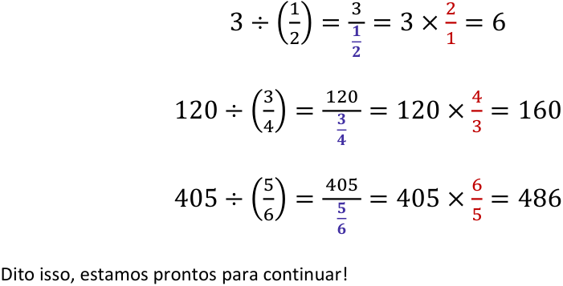

_Vamos ver como ficaria a resolução do problema anterior utilizando esse tal princípio?_ Bora! 

Considere, mais uma vez, que a quantidade de chocolates que Leandra possui inicialmente é 𝑥 . Lembre-se das etapas. 

#### 1) Leandra come dois chocolates; 

- 2) Leandra doa dois chocolates para a vizinha; 

- 3) Leandra dá metade do que sobra para seu primo; 

- 4) O primo fica com 5 chocolates (Leandra também fica com 5, pois ela divide na metade). 

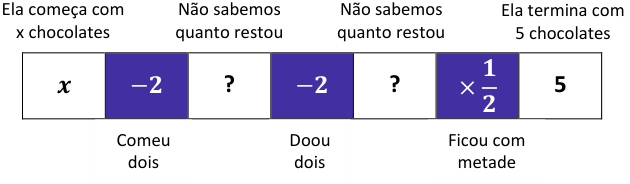

<!-- Start of picture text -->
Ela começa com  Não sabemos  Não sabemos  Ela termina com x chocolates  quanto restou  quanto restou  5 chocolates 𝒙 −𝟐 ? −𝟐 ? ×  𝟏 5 𝟐 Comeu  Doou  Ficou com dois  dois  metade <!-- End of picture text -->

Galera, agora vai entrar o Princípio da Reversão. Vamos fazer a conta do fim para o início. Para isso, devemos reverter o diagrama acima. 

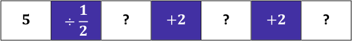

<!-- Start of picture text -->
𝟓 ÷  𝟏 ? +𝟐 ? +𝟐 ? 𝟐 <!-- End of picture text -->

O primeiro passo que fazemos é esse. **Invertemos nosso diagrama** , agora com os **sinais trocados** . 

- Onde estava somando, vai ficar subtraindo. 

- Onde estava subtraindo, vai ficar somando. 

- Onde estava multiplicando, vai ficar dividindo. 

- Onde estava dividindo, vai ficar multiplicando.

---

<!-- pagina: 34 -->

**Equipe Exatas Estratégia Concursos Aula 08** 

Está percebendo que revertemos tudo? Esse é **o princípio da reversão** . Bem intuitivo o nome, concorda?! Agora, basta fazermos as operações. 

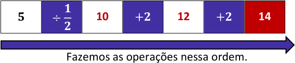

<!-- Start of picture text -->
𝟓 ÷  𝟏 10 +𝟐 12 +𝟐 14 𝟐 Fazemos as operações nessa ordem. <!-- End of picture text -->

Fizemos o seguinte: 5 dividido por 1/2 é 10. Depois, pegamos 10 e somamos 2, que deu 12. Depois, pegamos 12 e somamos mais 2, que deu os 14. Veja que continuamos a obter 14 chocolates ( _ora, era pra bater as duas soluções!)._ E aí?! O que acharam? Pode parecer um pouco estranho. 

Na prática, **estamos resolvendo o problema começando pelo fim** (rsrs) e não na ordem direta (que é a que utilizamos normalmente). Há alunos que acham melhor resolver montando a equação e outros que acham melhor resolver utilizando o princípio. Vai de cada um. É ao gosto de freguês! 

Para terminar nossa breve "teoria", vamos fazer mais um exemplo. Dessa vez, detalharemos o método ainda mais para você. Caso não tenha ficado claro ainda, agora é a hora de ficar! 

Um aluno do Estratégia passou em seu concurso dos sonhos e, logo no primeiro mês, <mark>recebeu seu salário de R$ 15.000,00. Imediatamente, transferiu 1/4 do que tinha para sua mãe. Depois, transferiu 1/5 do que sobrou para seu pai e, por fim, recebeu da sua irmã 2/3 do que tinha na conta. No final do dia, ele entrou no aplicativo do banco para verificar seu saldo e constatou que possuía R$ 21.500,00. Quanto o aluno tinha na conta antes de</mark> receber seu primeiro salário? 

Bom, a primeira coisa é separar os momentos. 

1) Recebeu R$ 15.000,00; 

2) Transferiu 1/4 do que tinha para mãe (ele fica com 3/4); 

3) Transferiu 1/5 do que tinha para o pai (ele fica com 4/5); 

* Para entender melhor por que ele fica com 5/3, imagine que, naquele momento, ele tinha y reais. Assim, 

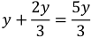

<!-- Start of picture text -->
𝑦+  2𝑦 =  5𝑦 3 3 <!-- End of picture text -->

- 4) Recebeu 2/3 do que tinha da irmã (ele fica com 5/3 do que tinha) *. 

- 5) Ficou com R$ 21.500,00. 

Vamos resolver utilizando **o Princípio da Reversão (ou Regressão)** , afinal, é o nosso foco de estudo hoje. O primeiro passo é **desenhar o diagrama** seguindo as etapas que separamos acima. Suponha que o saldo inicial seja 𝑥 .

---

<!-- pagina: 35 -->

**Equipe Exatas Estratégia Concursos Aula 08** 

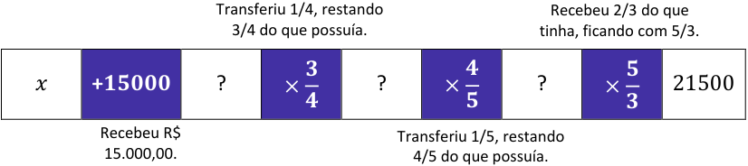

<!-- Start of picture text -->
Transferiu 1/4, restando  Recebeu 2/3 do que 3/4 do que possuía.  tinha, ficando com 5/3. 𝑥 + 𝟏𝟓𝟎𝟎𝟎 ?  ×  𝟑 ?  ×  𝟒 ?  ×  𝟓 21500 𝟒 𝟓 𝟑 Recebeu R$  Transferiu 1/5, restando 15.000,00.  4/5 do que possuía. <!-- End of picture text -->

Ok! Com o diagrama feito, **basta agora invertê-lo, trocando os sinais** <u>.</u> 

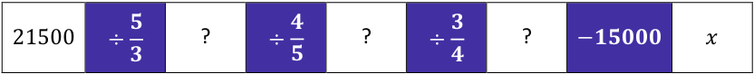

<!-- Start of picture text -->
21500 ÷  𝟓 ?  ÷  𝟒 ?  ÷  𝟑 ?  −𝟏𝟓𝟎𝟎𝟎 𝑥 𝟑 𝟓 𝟒 <!-- End of picture text -->

Vamos fazer as contas! 

1º) 

2º) 

3º) 

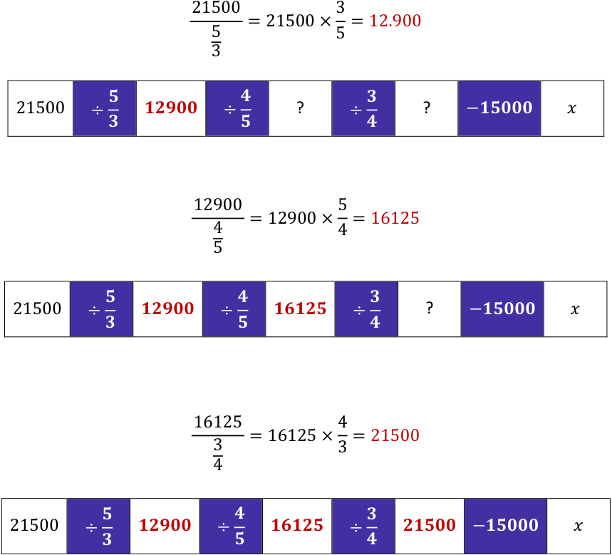

<!-- Start of picture text -->
21500 = 21500 ×  3 = 12.900 5 5 3 21500 ÷  𝟓 𝟏𝟐𝟗𝟎𝟎 ÷  𝟒 ?  ÷  𝟑 ?  −𝟏𝟓𝟎𝟎𝟎 𝑥 𝟑 𝟓 𝟒 12900 = 12900 ×  5 = 16125 4 4 5 21500 ÷  𝟓 𝟏𝟐𝟗𝟎𝟎 ÷  𝟒 𝟏𝟔𝟏𝟐𝟓 ÷  𝟑 ?  −𝟏𝟓𝟎𝟎𝟎 𝑥 𝟑 𝟓 𝟒 16125 = 16125 ×  4 = 21500 3 3 4 21500 ÷  𝟓 𝟏𝟐𝟗𝟎𝟎 ÷  𝟒 𝟏𝟔𝟏𝟐𝟓 ÷  𝟑 𝟐𝟏𝟓𝟎𝟎 −𝟏𝟓𝟎𝟎𝟎 𝑥 𝟑 𝟓 𝟒 <!-- End of picture text -->

---

<!-- pagina: 36 -->

**Equipe Exatas Estratégia Concursos Aula 08** 

4º) 

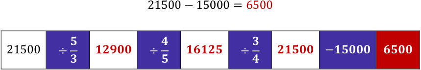

<!-- Start of picture text -->
21500 −15000 = 6500 21500 ÷  𝟓 𝟏𝟐𝟗𝟎𝟎 ÷  𝟒 𝟏𝟔𝟏𝟐𝟓 ÷  𝟑 𝟐𝟏𝟓𝟎𝟎 −𝟏𝟓𝟎𝟎𝟎 𝟔𝟓𝟎𝟎 𝟑 𝟓 𝟒 <!-- End of picture text -->

Portanto, o aluno tinha R$ 6.500,00 antes de receber seu primeiro salário. 

Galera, esse é o Princípio da Reversão! Pratique ele nas questões que separei a seguir. Na dúvida, consulte os comentários que estão logo após. O mais importante é treinar!

---

<!-- pagina: 37 -->

**Equipe Exatas Estratégia Concursos Aula 08** 

# **- QUESTÕES COMENTADAS FGV** 

## **Associação Lógica** 

**1. (FGV/CVM/2024) Alberto, Bernardo e Cláudio têm idades diferentes e vestem camisetas de cores diferentes. Um está com camiseta branca, outro com camiseta verde e um terceiro com camiseta azul. Sabe-se que:** 

- **quem veste camiseta branca é o mais velho;** 

- **Alberto não está com camiseta branca;** 

- **Bernardo é mais jovem que Alberto e não está com camiseta azul.** 

#### **É correto concluir que:** 

A) Alberto é o mais velho dos três; 

- B) Bernardo está com camiseta verde; 

- C) Cláudio está com camiseta azul; 

- D) Alberto está com camiseta verde; 

- E) Cláudio é o mais jovem dos três. 

#### **Comentários:** 

Vamos desenhar uma tabela para organizarmos as afirmações do enunciado. 

|**Nome** **Camiseta** **Idade**|
|---|

#### Como **quem veste camiseta branca é o mais velho** , podemos escrever: 

|**Nome**|**Camiseta**|**Idade**|
|---|---|---|
||Branca|Mais Velho|

#### Sabemos também que **Alberto não está com camiseta branca** , logo:

---

<!-- pagina: 38 -->

**Equipe Exatas Estratégia Concursos Aula 08** 

|**Nome**|**Camiseta**|**Idade**|
|---|---|---|
||Branca|Mais Velho|
|Alberto|||

Por fim, temos que **Bernardo é mais jovem que Alberto** e não está com camiseta azul. Sendo assim: 

|**Nome**|**Camiseta**|**Idade**|
|---|---|---|
||Branca|Mais Velho|
|Alberto|||
|Bernardo|Verde|Mais Jovem|

Pronto, agora completamos nossa tabela com as informações que faltam! 

|**Nome**|**Camiseta**|**Idade**|
|---|---|---|
|Cláudio|Branca|Mais Velho|
|Alberto|Azul|Intermediária|
|Bernardo|Verde|Mais Jovem|

Vamos analisar as alternativas. 

A) Alberto é o mais velho dos três; 

**Errado.** Alberto tem idade intermediária. 

B) Bernardo está com camiseta verde; 

**Correto!** Bernardo está com camiseta verde e é o mais jovem. 

C) Cláudio está com camiseta azul; 

**Errado.** Cláudio está com camiseta branca. 

D) Alberto está com camiseta verde; 

**Errado.** Alberto está com camiseta azul. 

E) Cláudio é o mais jovem dos três. 

**Errado.** Claúdio é o mais velho. 

**Gabarito:** LETRA B.

---

<!-- pagina: 39 -->

**Equipe Exatas Estratégia Concursos Aula 08** 

#### **2. (FGV/ALESC/2024)** 

**Cinco carros (V, W, X, Y e Z) disputam uma corrida em um autódromo. Dada a largada, no final da primeira volta a ordem dos carros era V – W – X – Y – Z. Durante a corrida ocorreram, em sequência, as seguintes ultrapassagens:** 

- **o 3º fez uma ultrapassagem;** 

- **o 5º fez duas ultrapassagens;** 

- **o 3º fez duas ultrapassagens;** 

- **o 4º fez duas ultrapassagens.** 

#### **Depois disso, nenhuma outra ultrapassagem ocorreu e a corrida terminou.** 

#### **Portanto, o único carro que chegou na mesma posição de partida foi:** 

A) V. 

B) W. 

C) X D) Y. E) Z. 

#### **Comentários:** 

Para acompanhar a posição dos carros, vamos desenhar uma tabela em que registramos a posição de cada um. 

|**1º**|**2º**|**3º**|**4º**|**5º**|
|---|---|---|---|---|
|V|W|X|Y|Z|

Inicialmente, tem-se que **o 3º fez uma ultrapassagem** . A nova ordem é: 

|**1º**|**2º**|**3º**|**4º**|**5º**|
|---|---|---|---|---|
|V|X|W|Y|Z|

Depois, o **5º fez duas ultrapassagens** : 

|**1º**|**2º**|**3º**|**4º**|**5º**|
|---|---|---|---|---|
|V|X|Z|W|Y|

---

<!-- pagina: 40 -->

**Equipe Exatas Estratégia Concursos Aula 08** 

Depois, o **3º fez duas ultrapassagens** : 

|**1º**|**2º**|**3º**|**4º**|**5º**|
|---|---|---|---|---|
|Z|V|X|W|Y|

Por fim, o **4º fez duas ultrapassagens** : 

|**1º**|**2º**|**3º**|**4º**|**5º**|
|---|---|---|---|---|
|Z|W|V|X|Y|

Essa é a configuração final! A questão pede aquele que, após todas essas ultrapassagens, permaneceu na mesma posição. Ora, comparando nossa primeira tabela e a última, vemos **que o “W” é o único que terminou na mesma posição, 2ª** . 

#### **Gabarito:** LETRA B 

**3. (FGV/PMERJ/2024) Quatro objetos, A, B, C e D, possuem pesos diferentes. Sabe-se que:** 

- **A é mais pesado que B.** 

- **C é mais leve que A.** 

- **D é mais leve que B, mas não é o mais leve de todos.** 

#### **É correto concluir que:** 

A) A não é o mais pesado de todos; 

B) B é mais leve que D; 

C) C é mais pesado que B; 

D) C é mais leve que D; 

E) B é mais leve que C. 

#### **Comentários:** 

Começamos com a afirmação de que **A é mais pesado que B e C é mais leve que A** . Isso nos dá a seguinte ordem parcial: 

Em seguida, usamos a informação de que **D é mais leve que B, mas não é o mais leve de todos** . Isso significa que D deve estar entre C e B, ou seja:

---

<!-- pagina: 41 -->

**Equipe Exatas Estratégia Concursos Aula 08** 

𝐶 < 𝐷 < 𝐵 

Agora, temos a ordem completa dos quatro objetos: 

Com essa ordem, a alternativa correta é a **letra D** . 

#### **Gabarito:** LETRA D. 

**4. (FGV/CM-SP/2024) Ana, Beto, Carla, Danilo e Elisa participaram de uma corrida com outros 5 participantes. Ana chegou 4 posições atrás de Carla. Carla chegou uma posição à frente de Beto. Danilo chegou 4 posições atrás de Elisa e Elisa chegou 2 posições atrás de Beto. Ana chegou na 6ª posição. Nesse caso, é correto afirmar que** 

A) Ana chegou atrás de Danilo. 

B) Beto chegou na 2ª posição. 

C) Carla chegou na 1ª posição. 

D) Danilo chegou na 9ª posição. 

E) Elisa chegou na 7ª posição. 

#### **Comentários:** 

Para simplificar, vamos chamar cada um dos 5 participantes principais de uma letra do alfabeto: 

#### **Ana (A), Beto (B), Carla (C), Danilo (D) e Elisa (E).** 

Agora, vamos preparar uma pequena tabela para organizarmos as informações. 

|**1ª** **2ª** **3ª** **4ª** **5ª** **6ª** **7ª** **8ª** **9ª** **10ª**|
|---|

Uma informação bem direta que temos é sobre Ana. **Ela chegou na 6ª posição** . Vamos começar daí. 

|**1ª**|**2ª**|**3ª**|**4ª**|**5ª**|**6ª**|**7ª**|**8ª**|**9ª**|**10ª**|
|---|---|---|---|---|---|---|---|---|---|
||||||A|||||

Note que **Ana chegou 4 posições atrás de Carla** . Logo, podemos concluir que Carla foi a 2ª.

---

<!-- pagina: 42 -->

**Equipe Exatas Estratégia Concursos Aula 08** 

|**1ª**|**2ª**|**3ª**|**4ª**|**5ª**|**6ª**|**7ª**|**8ª**|**9ª**|**10ª**|
|---|---|---|---|---|---|---|---|---|---|
||C||||A|||||

Por sua vez, **Carla chegou uma posição a frente de Beto** . Logo, Beto ficou na 3ª. 

|**1ª**|**2ª**|**3ª**|**4ª**|**5ª**|**6ª**|**7ª**|**8ª**|**9ª**|**10ª**|
|---|---|---|---|---|---|---|---|---|---|
||C|B|||A|||||

Ainda, **Elisa chegou 2 posições atrás de Beto** , ou seja, na 5ª posição. 

|**1ª**|**2ª**|**3ª**|**4ª**|**5ª**|**6ª**|**7ª**|**8ª**|**9ª**|**10ª**|
|---|---|---|---|---|---|---|---|---|---|
||C|B||E|A|||||

Por fim, **Danilo chegou 4 posições atrás de Elisa** , ou seja, na 9ª posição. 

|**1ª**|**2ª**|**3ª**|**4ª**|**5ª**|**6ª**|**7ª**|**8ª**|**9ª**|**10ª**|
|---|---|---|---|---|---|---|---|---|---|
|-|C|B|-|E|A|-|-|D|-|

Pronto! Tabela esquematiza, agora é só irmos nas alternativas. 

A) Ana chegou atrás de Danilo. 

**Errado.** Ana chegou na 5ª posição e Danilo na 9ª. 

B) Beto chegou na 2ª posição. **Errado.** Beto chegou na 3ª posição. 

C) Carla chegou na 1ª posição. **Errado.** Carla chegou na 2ª posição. 

D) Danilo chegou na 9ª posição. **Correto!** Nosso gabarito. 

E) Elisa chegou na 7ª posição. **Errado.** Elisa chegou na 5ª posição. 

**Gabarito:** LETRA D.

---

<!-- pagina: 43 -->

**Equipe Exatas Estratégia Concursos Aula 08** 

**5. (FGV/CM-SP/2024) Na prateleira de uma cozinha há três potes: A, B e C. Um deles contém arroz, outro contém feijão e outro contém farinha. Das afirmativas seguintes, somente uma é verdadeira:** 

#### **- A contém farinha.** 

#### **- B não contém feijão.** 

#### **- C não contém farinha.** 

#### **Nesse caso, é correto afirmar que:** 

A) o pote A contém feijão. 

B) o pote B contém farinha. 

C) o pote C contém feijão. 

D)o pote A contém arroz. 

E) o pote B não contém arroz. 

#### **Comentários:** 

#### **Somente uma das afirmações é verdadeira** !! Devemos ficar com isso em mente. 

Se apenas uma das afirmativas é verdadeira, então a afirmativa "A contém farinha" não pode ser verdadeira. 

Ora, se "A contém farinha" fosse verdadeira, estaria correta também a afirmativa "C não contém farinha". 

#### Sendo assim, **"A contém farinha" é falsa** . 

Agora, suponha como única verdadeira a segunda afirmação: "B não contém feijão". Como consequência, a afirmativa **"C não contém farinha" é falsa** <u>. Isso implica que</u> **C contém farinha sim** !! Ora, se C contém farinha e B não contém feijão, então **o feijão só pode estar em A** ! 

Sobrou o pote B para o arroz. 

Observe que nossa suposição inicial está correta! Afinal, não encontramos inconsistências com as conclusões geradas a partir dela. Nosso resultado foi: 

A - feijão. 

B - arroz. 

C - farinha. 

**Gabarito:** LETRA A.

---

<!-- pagina: 44 -->

**Equipe Exatas Estratégia Concursos Aula 08** 

**6. (FGV/CÂMARA DOS DEPUTADOS/2023) Ângelo, Bernardo, Cássio, Duílio e Evandro são cinco irmãos. Bernardo e Duílio são mais velhos do que Evandro, Bernardo é mais novo do que Cássio, Ângelo é mais novo do que Evandro e Cássio não é o mais velho. O irmão do meio é o** 

A)   Ângelo 

- B)   Bernardo. 

- C)   Cássio. 

- D)  Duílio. 

- E)   Evandro. 

#### **Comentários:** 

Vamos organizar esses irmãos em uma fila, **do mais novo para o mais velho** . A primeira informação que temos é que **Bernardo e Duílio são mais velhos do que Evandro** . Sendo assim: 

<!-- Start of picture text -->
Mais velho <!-- End of picture text -->

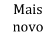

<!-- Start of picture text -->
Mais novo <!-- End of picture text -->

<!-- Start of picture text -->
Evandro <!-- End of picture text -->

<!-- Start of picture text -->
Bernardo, Duílio <!-- End of picture text -->

Além disso, temos que **Bernardo é mais novo do que Cássio.** 

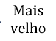

<!-- Start of picture text -->
Mais velho <!-- End of picture text -->

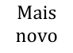

<!-- Start of picture text -->
Mais novo <!-- End of picture text -->

|Mais||||Mais|
|---|---|---|---|---|
|novo|Evandro|Bernardo,|Cássio|velho|
|||Duílio|||

<!-- Start of picture text -->
Bernardo, Duílio <!-- End of picture text -->

<!-- Start of picture text -->
Cássio <!-- End of picture text -->

**Ângelo é mais novo do que Evandro.** 

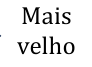

<!-- Start of picture text -->
Mais velho <!-- End of picture text -->

|Mais novo|Ângelo|Evandr|Bernardo,|Cássio|Mais velho|
|---|---|---|---|---|---|
|||o|Duílio|||

<!-- Start of picture text -->
Bernardo, Duílio <!-- End of picture text -->

**Cássio não é o mais velho.** 

Mais Mais novo velho Ângelo - Evandro - Bernardo - Cássio - Duílio 

<!-- Start of picture text -->
Ângelo - Evandro -  Bernardo  - Cássio - Duílio <!-- End of picture text -->

Logo, o irmão do meio é o **<u>Bernardo</u>** . 

**Gabarito:** LETRA B.

---

<!-- pagina: 45 -->

**Equipe Exatas Estratégia Concursos Aula 08** 

**7. (FGV/CÂMARA DOS DEPUTADOS/2023) O Professor Goodear tem como alunas de música Ana, Beth, Cecília, Débora e Elisa. Ele dá aulas às segundas, terças, quartas, quintas e sextas-feiras. Das cinco alunas, três estudam violão e duas estudam flauta. Em certa semana, cada uma delas foi à aula em um dia diferente, sendo que três delas foram no período da manhã e duas no período da tarde. Sabemos que Ana e Débora estudam o mesmo instrumento, enquanto Cecília e Elisa estudam instrumentos distintos. Além disso, Beth e Elisa tiveram aula no mesmo período, ao passo que Ana e Cecília estudaram em períodos diferentes. Houve um dia com aula de flauta à tarde. Nesse dia, quem teve aula foi** 

A)  Ana. 

- B)   Beth. 

- C)   Cecília. 

- D)  Débora. 

- E)   Elisa. 

#### **Comentários:** 

Pessoal, temos dois pares de informações que devemos analisar com muita atenção. 

Sobre o instrumento: 

- **Ana e Débora estudam o mesmo instrumento.** 

- **Cecília e Elisa estudam instrumentos distintos.** 

Sobre o período: 

- **Beth e Elisa tiveram aula no mesmo período.** 

- **Ana e Cecília estudaram em períodos diferentes.** 

Vamos começar pelo par de informações sobre o instrumento. 

Se Cecília e Elisa estudam instrumentos distintos, então uma estuda o violão e a outra estuda flauta. 

Com isso, a conclusão que chegamos é **Ana e Débora estudam violão** . 

_Professor, como assim? De onde você concluiu isso?_ 

Aluno, note que **apenas duas alunas estudam flauta** . Se essa vaga da flauta já está com Cecília ou Elisa, só **sobra apenas uma vaga para outra pessoa** . Portanto, se Ana e Débora estudassem flauta, teríamos três pessoas no instrumento, o que não pode acontecer. 

Ora, podemos usar esse mesmo raciocínio para as informações sobre o período. 

Se Ana e Cecília estudam em períodos distintos, então uma estuda de manhã e a outra a tarde.

---

<!-- pagina: 46 -->

**Equipe Exatas Estratégia Concursos Aula 08** 

Com isso, podemos concluir **Beth e Elisa estudam pela manhã!** Afinal, Ana ou Cecília já ocupa uma das vagas da tarde (então só sobra mais uma nesse período). 

Agora, com algumas informações certas, vamos organizar uma tabela. 

|**Aluna**|**Instrumento**|**Período**|
|---|---|---|
|Ana|Violão||
|Beth||Manhã|
|Cecília|||
|Débora|Violão||
|Elisa||Manhã|

De acordo com o enunciado, **houve um dia com flauta à tarde** . Ora, vamos olhar para a tabela acima, a única pessoa em que podemos encaixar uma flauta à tarde é Cecília. 

|**Aluna**|**Instrumento**|**Período**|
|---|---|---|
|Ana|Violão||
|Beth||Manhã|
|Cecília|Flauta|Tarde|
|Débora|Violão||
|Elisa||Manhã|

Ora, **<u>Ana</u> e** **<u>Débora</u> estudam violão** , enquanto **<u>Beth</u> e** **<u>Elisa</u> estudam pela manhã** . Logo, nenhuma delas poderá ser a que estuda **flauta à tarde** . A única opção correta é Cecília. 

#### **Gabarito:** LETRA C. 

**8. (FGV/PM-SP/2023) Pereira, Rodrigues, Santos e Tavares são soldados que disputam uma corrida. Em certo momento da competição, as suas posições são tais que:** 

- **Se Tavares ultrapassar 2 soldados, passará a ser o 1º colocado;** 

- **Pereira não é o último colocado;** 

- **Santos não pode ultrapassar ninguém.** 

**Se apenas essas quatro pessoas estão disputando a corrida, conclui-se que** 

A) Santos está em primeiro e Rodrigues está em terceiro. 

B) Pereira está em primeiro e Tavares está em terceiro. 

C) Pereira está em segundo e Rodrigues está em quarto.

---

<!-- pagina: 47 -->

**Equipe Exatas Estratégia Concursos Aula 08** 

D) Rodrigues está em segundo e Tavares está em terceiro. 

#### **Comentários:** 

Temos **<u>4 soldados</u>** disputando uma corrida. 

Sabemos que se Tavares ultrapassar 2 soldados, passará a ser o primeiro colocado. Isso indica que **Tavares está em 3º lugar** . Por sua vez, como Santos não pode ultrapassar ninguém, então ele só pode estar em **1º lugar** . Por fim, como Pereira não é o último colocado, **só temos 2º lugar disponível para alocá-lo** . Podemos resumir essas informações em uma pequena tabela: 

|**Posição**|**Soldado**|
|---|---|
|**1º**|Santos|
|**2º**|Pereira|
|**3º**|Tavares|
|**4º**|Rodrigues|

Assim, a alternativa que contempla corretamente as posições dos soldados é a C. 

#### **Gabarito:** LETRA C. 

**9. (FGV/MPE-SP/2023) Considere uma das sequências formadas pelas letras do conjunto** {𝑨, 𝑩, 𝑪, 𝑫, 𝑬} **. Sabe-se que nessa sequência:** 

- **B vem depois do D;** 

- **C vem antes do A;** 

- **E vem depois do D;** 

- **E vem antes do A;** 

- **C vem depois do B.** 

**Com base nessas informações, é possível garantir que, nessa sequência, a letra A ocupa a** 

A) 1ª posição. 

B) 2ª posição. 

C) 3ª posição. 

D) 4ª posição. 

E) 5ª posição. 

#### **Comentários:** 

Vamos começar com uma tabela vazia e preenchê-la à medida que cada uma das informações é analisada.

---

<!-- pagina: 48 -->

**Equipe Exatas Estratégia Concursos Aula 08** 

|**Posição** **Letra**|
|---|
|**1º**|
|**2º**|
|**3º**|
|**4º**|
|**5º**|

#### **- B vem depois do D;** 

|**Posição** **Letra**|
|---|
|**1º** D|
|**2º** B|
|**3º**|
|**4º**|
|**5º**|

_Professor, como você sabe que o D está na 1º posição e o B na 2ª? Não podia ser um na 2ª e outro na 3ª?_ 

É verdade que ainda não sabemos as posições, mas precisamos **supor uma posição inicial** para começarmos a preencher essa tabela. Não se preocupe, pois **a tabela é dinâmica** e as posições serão ajustadas sempre que analisarmos nova informação! Vamos prosseguir! 

#### **- C vem antes do A;** 

|**Posição** **Letra**|
|---|
|**1º** D|
|**2º** B|
|**3º** C|
|**4º** A|
|**5º**|

#### **- E vem depois do D;** 

|**Posição** **Letra**|
|---|
|**1º** D|
|**2º** B|
|**3º** C|
|**4º** A|
|**5º** E|

---

<!-- pagina: 49 -->

**Equipe Exatas Estratégia Concursos Aula 08** 

#### **- E vem antes do A;** 

|**Posição** **Letra**|
|---|
|**1º** D|
|**2º** B|
|**3º** C|
|**4º** E|
|**5º** A|

#### **- C vem depois do B.** 

|**Posição** **Letra**|
|---|
|**1º** D|
|**2º** B|
|**3º** C|
|**4º** E|
|**5º** A|

Nem precisamos alterar nada! A tabela já estava obedecendo a esse último fato. 

Com isso, verificamos que **a letra A ocupa a última posição (5ª)** . 

#### **Gabarito:** LETRA E. 

**10. (FGV/MPE-SP/2023) Agnes, Bianca e Cíntia são irmãs. Duas delas são gêmeas. Apenas uma das três não tem bicho de estimação. Cada uma delas estuda um idioma diferente. A que estuda alemão é gêmea da que tem um cachorro. A mais velha das três estuda francês. A que estuda italiano tem 15 anos. Agnes nasceu 2 anos antes da irmã que tem um gato. Bianca não estuda italiano. Nesse caso, é correto afirmar que** 

#### A) Agnes tem 13 anos. 

- B) Agnes não tem bicho de estimação. 

- C) Bianca estuda italiano. 

- D) Bianca tem um cachorro. 

- E) Cíntia estuda francês. 

#### **Comentários:** 

Questão boa! Vamos organizar todas essas informações em uma tabela.

---

<!-- pagina: 50 -->

**Equipe Exatas Estratégia Concursos Aula 08** 

|**Nome** **Irmã** **Pet** **Idioma** **Idade**|
|---|

A primeira informação que podemos colocar na nossa tabela é **: a que estuda alemão é gêmea da que tem um cachorro** . 

|**Nome**|**Irmã**|**Pet**|**Idioma**|**Idade**|
|---|---|---|---|---|
||Gêmea||Alemão||
||Gêmea|Cachorro|||

Depois, temos que a mais velha das três, estuda francês. Ora, **se essa é a mais velha, então é essa que não é gêmea** (fica difícil falar de quem é mais velho/velha entre gêmeos). 

|**Nome**|**Irmã**|**Pet**|**Idioma**|**Idade**|
|---|---|---|---|---|
||Gêmea||Alemão||
||Gêmea|Cachorro|Italiano||
||Não||Francês||

Observe que já conseguimos **completar com "italiano"** a linha central, pois foi a última que sobrou. Ademais, temos que a que estuda italiano tem 15 anos. Como ela é gêmea, **a outra irmã também terá 15 anos** . 

|**Nome**|**Irmã**|**Pet**|**Idioma**|**Idade**|
|---|---|---|---|---|
||Gêmea||Alemão|15|
||Gêmea|Cachorro|Italiano|15|
||Não||Francês||

Como Agnes nasceu dois anos antes da irmã que tem um gato, podemos concluir que **ela tem 17 anos e não possui pet** .

---

<!-- pagina: 51 -->

**Equipe Exatas Estratégia Concursos Aula 08** 

|**Nome**|**Irmã**|**Pet**|**Idioma**|**Idade**|
|---|---|---|---|---|
||Gêmea|Gato|Alemão|15|
||Gêmea|Cachorro|Italiano|15|
|**Agnes**|Não|Não tem|Francês|17|

Com a informação que **Bianca não estuda italiano** , podemos fechar a tabela: 

|**Nome**|**Irmã**|**Pet**|**Idioma**|**Idade**|
|---|---|---|---|---|
|**Bianca**|Gêmea|Gato|Alemão|15|
|**Cíntia**|Gêmea|Cachorro|Italiano|15|
|**Agnes**|Não|Não tem|Francês|17|

Com a tabela preenchida, vamos analisar as alternativas. 

#### A) Agnes tem 13 anos. 

**Errado.** Cuidado, pessoal! **Agnes nasceu dois anos antes** . Sendo assim, ela é mais velha 2 anos. 

B) Agnes não tem bicho de estimação. 

**Correto!** Chegamos nessa conclusão. Os pets são da Bianca e da Cíntia. 

C) Bianca estuda italiano. 

**Errado.** Bianca estuda Alemão. 

D) Bianca tem um cachorro. 

**Errado.** Bianca tem um gato. 

#### E) Cíntia estuda francês. 

**Errado.** Cíntia estuda italiano. 

#### **Gabarito:** LETRA B. 

**11. (FGV/AGENERSA/2023) Em uma caixa há cartas verdes e cartas azuis, cada uma delas com um número inteiro positivo. Não há outras cartas na caixa. Além disso, sabe-se que:** 

**- A quantidade de cartas com números ímpares é igual à quantidade de cartas com números pares.** 

- **Há 38 cartas azuis, das quais 24 têm números pares.** 

- **Há 20 cartas verdes com números ímpares.**

---

<!-- pagina: 52 -->

**Equipe Exatas Estratégia Concursos Aula 08** 

**Assinale a opção que indica a quantidade de cartas verdes com números pares somada à quantidade de cartas azuis com números ímpares.** 

A) 20. 

B) 22. 

C) 24. 

D) 26. 

E) 28. 

#### **Comentários:** 

Questão um pouco mais numérica e que envolve também a **associação de informações** . 

==5460== Para resolvê-la, vamos contar com o auxílio de uma tabela! 

|Verdes|Ímpares|Pares|**Total**|
|---|---|---|---|
|Azuis||||
|**Total**||||

Sabemos que há 38 cartas azuis, das quais 24 têm números pares. Portanto, **14 são ímpares** . 

||Ímpares|Pares|**Total**|
|---|---|---|---|
|Verdes||||
|Azuis|14|24|38|
|**Total**||||

Ademais, sabemos ainda que **há 20 cartas verdes com números ímpares.** 

||Ímpares|Pares|**Total**|
|---|---|---|---|
|Verdes|20|||
|Azuis|14|24|38|
|**Total**|34|||

Observe que obtemos um **total de 34 cartas ímpares** . Como o número de cartas pares é o mesmo, devemos ter **10 cartas pares verdes** .

---

<!-- pagina: 53 -->

**Equipe Exatas Estratégia Concursos Aula 08** 

||Ímpares|Pares|**Total**|
|---|---|---|---|
|Verdes|20|10|30|
|Azuis|14|24|38|
|**Total**|34|34|68|

A questão quer a soma da quantidade de cartas verdes com números pares com a quantidade de cartas azuis com números ímpares. Assim: 

𝑇= 14 + 10       → <u>𝑻</u> = 𝟐𝟒 

#### **Gabarito:** LETRA C. 

**12. (FGV/CBM-AM/2022) Os amigos Abel, Breno e Caio são casados e suas esposas chamam-se Manuela, Nina e Paula. Sabe-se que:** 

- **Duas dessas três moças são irmãs.** 

- **Paula não é esposa de Abel.** 

- **Breno é casado com a irmã de Paula.** 

- **O casamento de Manuela ocorreu depois do casamento de Abel.** 

#### **É correto concluir que** 

A) Caio é casado com Nina. 

- B) Manuela não é esposa de Breno. 

- C) Abel é casado com Nina. 

- D) Nina é a irmã de Paula. 

- E) Nina é esposa de Breno. 

#### **Comentários:** 

Pessoal, é superinteressante esquematizarmos uma tabela, pois ela nos ajuda a não nos perdermos com as informações. Vamos esquematizar uma! 

|**Marido**|**Esposa**|**Irmãs?**|
|---|---|---|
|Abel|||
|Breno|||
|Caio|||

Com a tabela desenhada, começamos a analisar as informações que o enunciado passou. 

A primeira coisa que podemos notar é o seguinte:

---

<!-- pagina: 54 -->

**Equipe Exatas Estratégia Concursos Aula 08** 

#### **- Paula não é esposa de Abel.** 

#### **- Breno é casado com a irmã de Paula.** 

Ora, se **<u>Paula não é esposa de Abel</u>** e **Breno é casado com a irmã de Paula** <u>, então Paula só pode ser a esposa</u> de Caio! Ademais, também percebemos que Paula tem uma irmã. Na tabela, ficamos com: 

|**Marido**|**Esposa**|**Irmãs?**|
|---|---|---|
|Abel|||
|Breno|||
|Caio|Paula|Sim|

Por fim, temos que: 

#### **- O casamento de Manuela ocorreu depois do casamento de Abel.** 

Ora, se Manuela se casou depois de Abel, ela não pode ser a esposa do Abel! Sendo assim, a **Manuela só pode ser esposa do Breno** uma vez que já sabemos que Paula é a esposa do Caio. 

|**Marido**|**Esposa**|**Irmãs?**|
|---|---|---|
|Abel|||
|Breno|Manuela||
|Caio|Paula|Sim|

Note que **a esposa de Abel só pode ser a Nina** <u>. Ademais, como sabemos que Breno é casado com a irmã de</u> Paula, então **Manuela e Paula são irmãs** . 

|**Marido**|**Esposa**|**Irmãs?**|
|---|---|---|
|Abel|Nina|Não|
|Breno|Manuela|Sim|
|Caio|Paula|Sim|

Com a tabela esquematizada, podemos ir para a alternativas! 

A) Caio é casado com Nina. **Errado.** Caio é casado com **<u>Paula</u>** . 

B) Manuela não é esposa de Breno. 

**Errado.** Manuela **é esposa** de Breno.

---

<!-- pagina: 55 -->

**Equipe Exatas Estratégia Concursos Aula 08** 

#### C) Abel é casado com Nina. 

**Opa, é essa mesmo!** Abel e Nina são casados. 

D) Nina é a irmã de Paula. 

**Errado.** Nina não é irmã de ninguém. **Manuela e Paula são as irmãs.** 

E) Nina é esposa de Breno. 

**Errado.** Nina **é esposa** de Abel. 

**Gabarito:** LETRA C. 

**<mark>13. (FGV/TRT-PB/2022) Miguel, Artur e Heitor possuem idades diferentes e nasceram em cidades diferentes; um nasceu em Patos, outro em Cabedelo e outro em Santa Rita. As três afirmações seguintes sobre eles são verdadeiras:</mark>** 

- **Miguel é mais velho que o cabedelense.** 

- **Artur nasceu em Patos.** 

- **Heitor não é o mais novo.** 

**É correto concluir que** 

a) Miguel é mais novo que Artur. 

- b) Heitor nasceu em Santa Rita. 

c) o santa-ritense é o mais velho. 

- d) o cabedelense é mais velho que Miguel. 

- e) Artur é mais velho que o patoense. 

**Comentários:** 

Vamos **esquematizar uma tabela** para facilitar as associações. 

|Pessoa Cidade Idade|
|---|

Pronto. Agora, vamos analisar as informações (todas verdadeiras). 

- **Miguel é mais velho que o cabedelense.** 

Ora, se Miguel é mais velho que o cabedelense, então Miguel não pode ser o cabedelense (rsrs). Assim, colocaremos em uma das linhas o nome "Miguel" e **em uma outra linha** a cidade Cabedelo.

---

<!-- pagina: 56 -->

**Equipe Exatas Estratégia Concursos Aula 08** 

|Pessoa|Cidade|Idade|
|---|---|---|
|Miguel|||
||Cabedelo||

#### **- Artur nasceu em Patos.** 

Bem direto! É só jogar a informação na linha que ainda tem espaço! 

|Pessoa|Cidade|Idade|
|---|---|---|
|Miguel|||
||Cabedelo||
|Artur|Patos||

Faltou apenas completar **o nome de uma pessoa** e **de uma cidade** <u>. Completaremos com quem sobrou!</u> 

|Pessoa|Cidade|Idade|
|---|---|---|
|Miguel|Santa Rita||
|Heitor|Cabedelo||
|Artur|Patos||

Por fim, vamos usar a última informação que o enunciado trouxe: 

#### **- Heitor não é o mais novo.** 

Ora, Heitor é o cabedelense e ele não é o mais novo. Sabemos ainda que Miguel é mais velho que o cabedelense. Logo, **Miguel é o mais velho** de todos, **Heitor é o do meio** e **Artur é o mais novo** . 

|Pessoa|Cidade|Idade|
|---|---|---|
|Miguel|Santa Rita|Mais velho|
|Heitor|Cabedelo|Do meio|
|Artur|Patos|Mais novo|

Fechamos! Agora é só analisarmos as alternativas.

---

<!-- pagina: 57 -->

**Equipe Exatas Estratégia Concursos Aula 08** 

a) Miguel é mais novo que Artur. 

**Errado.** Miguel é o mais velho. 

b) Heitor nasceu em Santa Rita. 

**Errado.** Heitor nasceu em Cabedelo. 

c) o santa-ritense é o mais velho. 

**Certo!** Miguel nasceu em Santa Rita e é o mais velho. 

d) o cabedelense é mais velho que Miguel. 

**Errado.** Miguel é mais velho que o cabedelense. 

e) Artur é mais velho que o patoense. 

**Errado.** Artur é o mais novo. 

#### **Gabarito:** Letra C 

**14. (FGV/SEMSA-MANAUS/2022) Três amigos, Gael, Miguel e Gabriel moram em três bairros diferentes de Manaus. Um mora no Centro, outro mora em Flores e outro, em Aleixo. Considere as seguintes informações:** 

- **Gael é casado com a irmã de Gabriel e é mais velho do que quem mora em Aleixo.** 

- **Quem mora em Flores é filho único e é o mais novo dos três amigos.** 

#### **É correto concluir que** 

A) Gael mora em Flores. 

B) quem mora no Centro é mais novo que Miguel. 

C) Gabriel mora em Aleixo. 

- D) quem mora no Centro é mais novo que Gabriel. 

- E) o mais velho não mora no Centro. 

#### **Comentários:** 

Mais uma questão em que devemos fazer associações! Para isso, prefira sempre usar tabelas, pois elas nos ajudam a não fazer confusão com as informações. Para essa questão, podemos esquematizar uma assim: 

|**Amigo**|**Bairro**|**"Senioridade"**|
|---|---|---|
|Gael|||
|Miguel|||
|Gabriel|||

---

<!-- pagina: 58 -->

**Equipe Exatas Estratégia Concursos Aula 08** 

Agora, vamos analisar o que nos foi passado. 

#### **1) Gael é casado com a irmã de Gabriel.** 

Essa primeira informação nos permite concluir que **Gabriel não é o filho único** , pois ele tem uma irmã. 

#### **2) Gael é mais velho do que quem mora em Aleixo.** 

Essa segunda informação nos permite concluir que **Gael não mora em Aleixo** . 

#### **3) Quem mora em Flores é filho único** 

Essa terceira informação nos permite concluir que **Gabriel não mora em Flores** , pois já vimos que ele não é filho único. 

#### **4) Quem mora em Flores é o mais novo dos três amigos.** 

Ora, se é o mais novo que mora em Flores, então podemos concluir que **não é Gael que mora lá** , já que ele é mais velho do que alguém (do que mora em Aleixo). Ademais, já sabemos que **Gabriel não pode morar em Flores** . Quem sobrou para morar lá?! **O Miguel.** 

|**Amigo**|**Bairro**|**"Senioridade"**|
|---|---|---|
|Gael|||
|Miguel|Flores|Mais novo|
|Gabriel|||

Ademais, se **Gael não mora em Aleixo** e já sabemos que **Miguel é quem mora em Flores** , então **Gael só pode morar no Centro** . 

|**Amigo**|**Bairro**|**"Senioridade"**|
|---|---|---|
|Gael|Centro||
|Miguel|Flores|Mais novo|
|Gabriel|||

O bairro que sobra para **Gabriel é o Aleixo** . 

|**Amigo**|**Bairro**|**"Senioridade"**|
|---|---|---|
|Gael|Centro|Mais velho|
|Miguel|Flores|Mais novo|
|Gabriel|Aleixo|Do meio|

---

<!-- pagina: 59 -->

**Equipe Exatas Estratégia Concursos Aula 08** 

Vamos para as alternativas. 

A) Gael mora em Flores. 

**Errado.** Gael mora no Centro! 

B) quem mora no Centro é mais novo que Miguel. 

**Errado.** Quem mora no Centro é o mais velho. 

C) Gabriel mora em Aleixo. 

**Opa, aqui está!** É o nosso gabarito. 

D) quem mora no Centro é mais novo que Gabriel. 

**Errado.** Quem mora no Centro é o mais velho. 

E) o mais velho não mora no Centro. 

**Errado.** O mais velho mora no centro. 

#### **Gabarito:** LETRA C. 

**15. (FGV/SEFAZ-AM/2022) Há 5 pessoas sentadas em volta de uma mesa circular, e as iniciais de seus nomes são A, B, C, D e E Dessas pessoas, 2 são médicos e 3 são professores.** 

#### **Sabe-se que:** 

- **Os dois médicos não são vizinhos.** 

- **C tem um médico à esquerda e um professor à direita.** 

- **A tem vizinhos da mesma profissão.** 

- **B tem médico à direita.** 

- **C e D não são vizinhos.** 

#### **A partir de A, a sequência das pessoas no sentido anti-horário é** 

A) A D B E C 

B) A E C B D 

C) A E B D C 

D) A B D C E 

E) A B C D E

---

<!-- pagina: 60 -->

**Equipe Exatas Estratégia Concursos Aula 08** 

#### **Comentários:** 

Questão bem interessante! Vamos abordá-la de uma forma diferente! A primeira informação que chama a atenção é a seguinte: **C e D não são vizinhos.** Com ela, podemos eliminar todas as alternativas em que "C" e "D" aparecem vizinhos. São elas: C, D e E. Note que com essa análise, já cortamos três alternativas e aumentamos nossas chances de acertar para 50%. 

A segunda informação que podemos analisar é a seguinte: **A tem vizinhos da mesma profissão.** Ora, se A tem vizinhos da mesma profissão, então A não pode ser médico. Observe que só temos dois médicos. Se A fosse médico, seu vizinho poderia ser um médico, mas o outro não poderia ser. **Afinal só são dois médicos!!** Com isso, guarde a informação que **A é professor** ! Vamos esquematizar 

<!-- Start of picture text -->
MED <!-- End of picture text -->

<!-- Start of picture text -->
PROF <!-- End of picture text -->

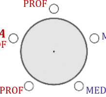

<!-- Start of picture text -->
PROF PROF  MED <!-- End of picture text -->

<!-- Start of picture text -->
PROF <!-- End of picture text -->

<!-- Start of picture text -->
𝑨 PROF <!-- End of picture text -->

<!-- Start of picture text -->
MED <!-- End of picture text -->

<!-- Start of picture text -->
PROF <!-- End of picture text -->

<!-- Start of picture text -->
OU <!-- End of picture text -->

<!-- Start of picture text -->
PROF <!-- End of picture text -->

<!-- Start of picture text -->
MED <!-- End of picture text -->

<!-- Start of picture text -->
MED <!-- End of picture text -->

<!-- Start of picture text -->
PROF <!-- End of picture text -->

A terceira informação que cabe bem nesse momento é: **Os dois médicos não são vizinhos.** Ora, se os dois médicos não são vizinhos, então ficamos com a seguinte configuração: 

<!-- Start of picture text -->
MED <!-- End of picture text -->

<!-- Start of picture text -->
PROF <!-- End of picture text -->

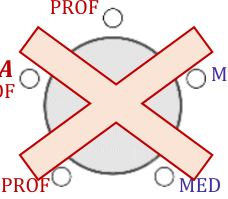

<!-- Start of picture text -->
PROF 𝑨 PROF  MED <!-- End of picture text -->

<!-- Start of picture text -->
PROF <!-- End of picture text -->

<!-- Start of picture text -->
𝑨 PROF <!-- End of picture text -->

<!-- Start of picture text -->
MED <!-- End of picture text -->

<!-- Start of picture text -->
PROF <!-- End of picture text -->

<!-- Start of picture text -->
OU <!-- End of picture text -->

<!-- Start of picture text -->
MED <!-- End of picture text -->

<!-- Start of picture text -->
PROF <!-- End of picture text -->

<!-- Start of picture text -->
Médicos não são vizinhos <!-- End of picture text -->

Pronto, sabemos a configuração válida é a da direita! Falta descobrir quem é médico e quem é professor. 

<!-- Start of picture text -->
MED <!-- End of picture text -->

<!-- Start of picture text -->
𝑨 PROF <!-- End of picture text -->

<!-- Start of picture text -->
PROF <!-- End of picture text -->

<!-- Start of picture text -->
MED <!-- End of picture text -->

<!-- Start of picture text -->
PROF <!-- End of picture text -->

---

<!-- pagina: 61 -->

**Equipe Exatas Estratégia Concursos Aula 08** 

Agora, vamos usar a informação: **C tem um médico à esquerda e um professor à direita.** 

<!-- Start of picture text -->
MED <!-- End of picture text -->

<!-- Start of picture text -->
PROF <!-- End of picture text -->

<!-- Start of picture text -->
𝑨 PROF <!-- End of picture text -->

<!-- Start of picture text -->
Professor à DIREITA 𝑪 <!-- End of picture text -->

<!-- Start of picture text -->
MED  PROF Médico à ESQUERDA <!-- End of picture text -->

Vejamos agora: **B tem médico à direita.** 

<!-- Start of picture text -->
Médico à direita <!-- End of picture text -->

<!-- Start of picture text -->
𝑨 𝑪 <!-- End of picture text -->

<!-- Start of picture text -->
𝑩 <!-- End of picture text -->

<!-- Start of picture text -->
PROF <!-- End of picture text -->

<!-- Start of picture text -->
𝑪 <!-- End of picture text -->

<!-- Start of picture text -->
MED <!-- End of picture text -->

Por fim, como C não pode ser vizinho de D, então D só pode ser o médico que está entre A e B. 

<!-- Start of picture text -->
𝐃 MED <!-- End of picture text -->

<!-- Start of picture text -->
MED 𝑨 𝑪 𝐄 <!-- End of picture text -->

<!-- Start of picture text -->
𝑩 <!-- End of picture text -->

<!-- Start of picture text -->
PROF <!-- End of picture text -->

<!-- Start of picture text -->
𝑪 <!-- End of picture text -->

<!-- Start of picture text -->
𝐄 MED <!-- End of picture text -->

Pronto! A resposta é a lista das iniciais, a partir de A, no sentido anti-horário: **AECBD** . 

**Gabarito:** LETRA B.

---

<!-- pagina: 62 -->

**Equipe Exatas Estratégia Concursos Aula 08** 

# **- QUESTÕES COMENTADAS FGV** 

## Verdades e Mentiras 

**1. (FGV/CÂMARA DOS DEPUTADOS/2023) Ana, Bianca, Carmen, Daniela e Elza foram as 5 finalistas no concurso de melhor cantora do colégio. Antes da divulgação do resultado do concurso, cada uma se manifestou sobre a classificação final. Eis as suas opiniões:** 

**Ana - Eu acho que a ordem será: eu, Carmen, Daniela, Elza e Bianca.** 

**Bianca - Eu acho que ficarei em primeiro e a Daniela em segundo.** 

**Carmen - Eu acho que eu ou a Elza ficaremos em primeiro. Acho também que a Carmen foi a pior, e a Ana foi a quarta colocada.** 

**Daniela - Eu acho que a Ana ou a Elza ficaram em terceiro lugar.** 

**Elza - Eu acho que fui a pior e a Bianca foi a quarta colocada.** 

**Um membro da comissão julgadora, sabendo das opiniões das candidatas, revelou que nenhuma delas acertou qualquer resultado. Então, a colocação da Elza foi a de número** 

A) 1. 

B) 2. 

C) 3. 

D) 4. E) 5. 

#### **Comentários:** 

Pessoal, vamos desenhar uma tabela para organizar as informações. 

|Posição |||Finalistas|||
|---|---|---|---|---|---|
|1º lugar|Ana|Bianca|Carmen|Daniela|Elza|
|2º lugar|Ana|Bianca|Carmen|Daniela|Elza|
|3º lugar|Ana|Bianca|Carmen|Daniela|Elza|
|4º lugar|Ana|Bianca|Carmen|Daniela|Elza|
|5º lugar|Ana|Bianca|Carmen|Daniela|Elza|

Nossa estratégia vai ser a seguinte: como **as candidatas erraram todos os palpites** <u>, vamos pegar o que cada</u> candidata falou e **"riscar"** na nossa tabela. No final, **veremos quem sobrou e sua respectiva posição** .

---

<!-- pagina: 63 -->

**Equipe Exatas Estratégia Concursos Aula 08** 

**Ana - Eu acho que a ordem será: eu, Carmen, Daniela, Elza e Bianca.** 

|Posição |||Finalistas|||
|---|---|---|---|---|---|
|1º lugar|~~Ana~~|Bianca|Carmen|Daniela|Elza|
|2º lugar|Ana|Bianca|~~Carmen~~|Daniela|Elza|
|3º lugar|Ana|Bianca|Carmen|~~Daniela~~|Elza|
|4º lugar|Ana|Bianca|Carmen|Daniela|~~Elza~~|
|5º lugar|Ana|~~Bianca~~|Carmen|Daniela|Elza|

Observe que risquei a ordem proposta por Ana, pois sabemos que **ela não acertou nada** ! Dessa forma, Ana não pode ficar em primeiro, nem Carmem em segundo... Vamos repetir esse raciocínio para as demais falas... 

**Bianca - Eu acho que ficarei em primeiro e a Daniela em segundo.** 

|Posição |||Finalistas|||
|---|---|---|---|---|---|
|1º lugar|~~Ana~~|~~Bianca~~|Carmen|Daniela|Elza|
|2º lugar|Ana|Bianca|~~Carmen~~|~~Daniela~~|Elza|
|3º lugar|Ana|Bianca|Carmen|~~Daniela~~|Elza|
|4º lugar|Ana|Bianca|Carmen|Daniela|~~Elza~~|
|5º lugar|Ana|~~Bianca~~|Carmen|Daniela|Elza|

**Carmen - Eu acho que eu ou a Elza ficaremos em primeiro. Acho também que a Carmen foi a pior, e a Ana foi a quarta colocada.** 

|Posição |||Finalistas |||
|---|---|---|---|---|---|
|1º lugar|~~Ana~~|~~Bianca~~|~~Carmen~~|Daniela|~~Elza~~|
|2º lugar|Ana|Bianca|~~Carmen~~|~~Daniela~~|Elza|
|3º lugar|Ana|Bianca|Carmen|~~Daniela~~|Elza|
|4º lugar|~~Ana~~|Bianca|Carmen|Daniela|~~Elza~~|
|5º lugar|Ana|~~Bianca~~|~~Carmen~~|Daniela|Elza|

**Daniela - Eu acho que a Ana ou a Elza ficaram em terceiro lugar.** 

|Posição |||Finalistas |||
|---|---|---|---|---|---|
|1º lugar|~~Ana~~|~~Bianca~~|~~Carmen~~|Daniela|~~Elza~~|
|2º lugar|Ana|Bianca|~~Carmen~~|~~Daniela~~|Elza|
|3º lugar|~~Ana~~|Bianca|Carmen|~~Daniela~~|~~Elza~~|
|4º lugar|~~Ana~~|Bianca|Carmen|Daniela|~~Elza~~|
|5º lugar|Ana|~~Bianca~~|~~Carmen~~|Daniela|Elza|

---

<!-- pagina: 64 -->

**Equipe Exatas Estratégia Concursos Aula 08** 

#### **Elza - Eu acho que fui a pior e a Bianca foi a quarta colocada.** 

|Posição |||Finalistas |||
|---|---|---|---|---|---|
|1º lugar|~~Ana~~|~~Bianca~~|~~Carmen~~|Daniela|~~Elza~~|
|2º lugar|Ana|Bianca|~~Carmen~~|~~Daniela~~|Elza|
|3º lugar|~~Ana~~|Bianca|Carmen|~~Daniela~~|~~Elza~~|
|4º lugar|~~Ana~~|~~Bianca~~|Carmen|Daniela|~~Elza~~|
|5º lugar|Ana|~~Bianca~~|~~Carmen~~|Daniela|~~Elza~~|

Levando em consideração o que foi falado, concluímos que **Daniela ficou em primeiro lugar** ! 

Ora, se Daniela ficou em primeiro lugar, podemos riscá-la das demais opções. 

|Posição |||Finalistas |||
|---|---|---|---|---|---|
|1º lugar|~~Ana~~|~~Bianca~~|~~Carmen~~|Daniela|~~Elza~~|
|2º lugar|Ana|Bianca|~~Carmen~~|~~Daniela~~|Elza|
|3º lugar|~~Ana~~|Bianca|Carmen|~~Daniela~~|~~Elza~~|
|4º lugar|~~Ana~~|~~Bianca~~|Carmen|~~Daniela~~|~~Elza~~|
|5º lugar|Ana|~~Bianca~~|~~Carmen~~|~~Daniela~~|~~Elza~~|

Riscando Daniela, percebemos que **Ana ficou em 5º lugar** e **Carmem em 4º lugar** . 

|Posição |||Finalistas |||
|---|---|---|---|---|---|
|1º lugar|~~Ana~~|~~Bianca~~|~~Carmen~~|Daniela|~~Elza~~|
|2º lugar|~~Ana~~|~~Bianca~~|~~Carmen~~|~~Daniela~~|**Elza**|
|3º lugar|~~Ana~~|Bianca|~~Carmen~~|~~Daniela~~|~~Elza~~|
|4º lugar|~~Ana~~|~~Bianca~~|Carmen|~~Daniela~~|~~Elza~~|
|5º lugar|Ana|~~Bianca~~|~~Carmen~~|~~Daniela~~|~~Elza~~|

Por fim, chegamos à conclusão de que **<u>Elza ficou em 2º lugar</u>** . 

**<mark>Gabarito:</mark>** <mark>LETRA B.</mark> 

**<mark>2. (FGV/CM Taubaté/2022) José, Lúcio e Miguel são advogados e trabalham no mesmo escritório. Um deles trabalha na sala A, outro na sala B e o outro na sala C.  Das afirmativas abaixo, somente uma é verdadeira:</mark>** 

- **José trabalha na sala B.** 

- **Lúcio não trabalha na sala B**

---

<!-- pagina: 65 -->

**Equipe Exatas Estratégia Concursos Aula 08** 

− **Miguel não trabalha na sala C.** 

#### **É correto afirmar que** 

a) José trabalha na sala C. 

b) José trabalha na sala B. 

c) Lucio trabalha na sala A. 

d) Lucio trabalha na sala C. 

e) Miguel trabalha na sala B. 

#### **Comentários:** 

Para fazer a análise desse tipo questão, devemos **<u>supor que uma das afirmativas é verdadeira</u>** . Depois disso, **verificamos as** **<u>consequências</u>** dessa suposição. Se entre as consequências estiver alguma situação que o enunciado proibiu, então nossa suposição estará errada e aquela afirmativa era, no fim, falsa. 

Vamos aplicar esse raciocínio na questão em tela! 

A primeira afirmativa que a questão trouxe é: **José trabalha na sala B** . Vamos **<u>supor</u>** que isso é verdade. 

Agora, vamos olhar a segunda afirmativa: **Lúcio não trabalha na sala B** . 

Observe que, da nossa suposição, é **José que trabalha na sala B** . Portanto, é também correto quando afirmamos que Lúcio não trabalha lá! O problema é: o enunciado fala que **<u>apenas uma das afirmativas é</u> verdadeira!** Logo, nossa suposição inicial só pode estar equivocada, já que gera duas afirmativas verdadeiras. 

Com isso, podemos concluir **que a primeira afirmativa é falsa** <u>. Logo,</u> **José não trabalha na sala B** . 

Finda a análise da primeira afirmativa, vamos para a segunda! 

Suponha que a segunda afirmativa que é a verdadeira: **Lúcio não trabalha na B.** 

Nesse cenário, observe que **nem José nem Lúcio trabalham na sala B** . Logo, a sala B sobraria para Miguel. 

Com isso, a próxima afirmativa que diz que “Miguel não trabalha na sala C” também está correta! Mais uma vez, por meio da nossa suposição, **terminamos com duas afirmativas corretas** . O enunciado diz que temos apenas uma! Logo, podemos concluir que **a segunda afirmativa é falsa** <u>!!!</u> 

Ora, se a segunda afirmativa é falsa, então podemos concluir que **<u>Lúcio trabalha na sala B</u>** ! 

A única possibilidade agora é que a afirmativa verdadeira seja a terceira: Miguel não trabalha na sala C.

---

<!-- pagina: 66 -->

**Equipe Exatas Estratégia Concursos Aula 08** 

Galera, vamos bem com calma! Observe que **Lúcio já está na sala B** e **Miguel não trabalha na C** . _Qual a única sala que sobra para Miguel trabalhar?_ A sala A! Com isso, conseguimos esquematizar uma tabela: 

|**Advogado**|**Sala**|
|---|---|
|José|C|
|Lúcio|B|
|Miguel|A|

Pronto! Vemos que **a sala C sobra para José** , conforme aponta a alternativa A. 

**Gabarito:** Letra A 

**3. (FGV/SSP-AM/2022) Eva, Bia e Gal encontraram-se para almoçar e estavam com bolsas parecidas, mas com cores diferentes. Uma bolsa era cinza, outra era marrom e outra era preta. Das afirmativas seguintes, somente uma é verdadeira:** 

- **Eva está com a bolsa preta.** 

- **Bia não está com a bolsa marrom.** 

- **Gal não está com a bolsa preta.** 

#### **É correto afirmar que** 

A) Eva tem a bolsa marrom. 

B) Bia tem a bolsa preta. 

C) Gal tem a bolsa marrom. 

D) Eva tem a bolsa cinza. 

- E) Bia não tem a bolsa cinza. 

#### **Comentários:** 

Nesse tipo de questão, devemos fazer hipóteses e testá-las. Vamos reescrever as afirmativas. 

#### Sabemos que **<u>apenas uma das afirmativas é verdadeira</u>** . 

**<u>Suponha</u>** que seja a primeira: **Eva está com a bolsa preta.** 

Ora, se Eva é quem está com a bolsa preta, então **Gal não está com a bolsa preta** . _Concorda?_ 

Sendo assim, isso faz com que **a terceira afirmativa também seja verdade** ! 

_Opa, peraí!!_ Agora temos **<u>duas afirmativas verdadeiras</u>** , quando o enunciado disse que temos apenas uma!

---

<!-- pagina: 67 -->

**Equipe Exatas Estratégia Concursos Aula 08** 

Dessa forma, nossa suposição inicial de que "Eva está com a bolsa preta" é verdade, no fim, foi incorreta. Já sabemos, portanto, que a primeira afirmativa só pode ser falsa. 

Vamos repetir esse procedimento, considerando que **a segunda afirmativa é a verdadeira** , ou seja, **Bia não está com a bolsa marrom.** 

Como **<u>apenas uma afirmativa pode ser verdade</u>** , então temos que as outras afirmativas devem ser falsas: 

- Eva está com a bolsa preta. 

- Gal não está com a bolsa preta. 

Como a primeira alternativa é falsa, então **Eva não está com a bolsa preta** . 

Como a terceira afirmativa é falsa, então **Gal está com a bolsa preta** . 

Vamos criar uma tabela com essas informações. 

|**Afirmativa**|**Suposição**|**Consequência**|
|---|---|---|
|Eva está com a bolsa preta.|Falso|Eva não está com a bolsa preta|
|Bia não está com a bolsa marrom.|Verdadeiro|Bia não está com a bolsa marrom|
|Gal não está com a bolsa preta.|Falso|**Gal está com a bolsa preta**|

Já sabemos **a bolsa da Gal! É a preta** <u>. Como</u> **a da Bia** não pode ser a marrom, a dela só poderá ser **a cinza** <u>.</u> Consequentemente, **a bolsa marrom sobra para Eva** . 

Observe que quando supomos que a segunda afirmativa é a verdadeira, chegamos a um cenário **super** **<u>plausível e coerente com as condições do enunciado</u>** . Sendo assim, é a resposta procurada. 

Caso queira, você pode testar o cenário em que a terceira afirmativa é a única verdadeira. Se fizer isso, você chegará obterá uma **<u>incoerência</u>** : **Bia estará com a bolsa marrom e com a preta** , configurando-se assim uma situação que foge das condições do enunciado. 

Com isso, podemos marcar a letra A, **Eva tem a bolsa marrom** . 

**Gabarito:** LETRA A. 

**4. (FGV/SEFAZ-ES/2022) Na mesa de Antônio há três gavetas: A, B e C. Uma gaveta contém documentos, outra contém chocolates e a terceira contém dinheiro. Sabe-se que das afirmativas a seguir sobre as gavetas somente uma é verdadeira.**

---

<!-- pagina: 68 -->

**Equipe Exatas Estratégia Concursos Aula 08** 

#### **- A tem dinheiro.** 

#### **- B não tem chocolates.** 

- **C não tem dinheiro.** 

**Assim, é correto afirmar que** 

A) A tem chocolates. 

B) B tem dinheiro. 

C) C tem chocolates. 

D) A tem documentos. 

E) B não tem documentos. 

#### **Comentários:** 

Inicialmente, vamos **<u>supor</u>** que a primeira afirmativa é verdadeira, isto é, "A tem dinheiro". 

Ora, se A tem dinheiro, então **C não pode ter dinheiro** , concorda? 

Afinal, cada gaveta deve ter um dos itens (documento, chocolate ou dinheiro). 

Diante dessa situação, a terceira afirmativa **"C não tem dinheiro"** **<u>também</u> seria verdadeira** . Como o enunciado foi categórico ao afirmar que **<u>apenas uma das afirmativas é verdadeira</u>** , a situação proposta não poderia ocorrer. Com isso, **"A tem dinheiro" tem que ser falsa** (pois caso ela seja verdadeira, outra também será e o enunciado veda isso). 

A nossa primeira suposição foi frustrada! Vamos partir para a próxima! Suponha que a afirmativa verdadeira é a segunda: "B não tem chocolates". Sendo assim, **em B só pode ter dinheiro ou documento** . 

Se a segunda é a verdadeira, a primeira e a terceira afirmativa são falsas (lembre-se que só podemos ter uma verdadeira). Se "C não tem dinheiro" é falsa, então podemos concluir que **"C tem dinheiro"** . Se "C tem dinheiro", só sobra a opção de **"documento" para a gaveta B** e de **"chocolate" para a gaveta A** . 

|**Gaveta**|**Objeto**|
|---|---|
|A|Chocolate|
|B|Documento|
|C|Dinheiro|

Observe que essa configuração **<u>atende aos requisitos do enunciado</u>** ! Com isso, podemos marcar letra A. 

**Gabarito:** LETRA A.

---

<!-- pagina: 69 -->

**Equipe Exatas Estratégia Concursos Aula 08** 

**5. (FGV/SEMSA-MANAUS/2022) José, Lucas, Caio, Pedro e Túlio são crianças e brincam na casa de um deles. Certo momento, a dona da casa ouve algo se quebrar, vai até onde eles estão e pergunta: “quem quebrou o vaso?”** 

- **José disse: não fui eu nem Caio.** 

- **Lucas disse: foi Caio ou Túlio.** 

- **Caio disse: foi Pedro.** 

- **Pedro disse: Lucas mente.** 

- **Túlio disse: foi Pedro ou José.** 

#### **Sabe-se que apenas um deles mentiu e que os outros disseram a verdade. Quem quebrou o vaso foi** 

A) José. 

B) Lucas. 

C) Caio. 

D) Pedro. 

E) Túlio. 

#### **Comentários:** 

Informação crucial: apenas um deles mentiu e os outros disseram a verdade. 

Sabendo disso, nossa estratégia será fazer suposições sobre quem mentiu. Observaremos as consequências dessas suposições e, sempre que essas consequências irem de encontro ao que foi falado no enunciado, poderemos eliminá-las. Eventualmente, **uma dessas suposições estará 100% alinhada com as informações** passadas no texto da questão e, nesse momento, estaremos com nossa resposta! 

Para ganharmos tempo na prova, podemos **mirar naquelas afirmativas "mais suspeitas"** e que podem gerar mais consequências. Assim, conseguimos fazer menos suposições e acertar a questão mais rapidamente. 

Note que Caio fala: foi Pedro. 

Se Caio falar a verdade, então já teremos a resposta sobre quem quebrou o vaso. 

Se Caio mentir, então **todos os demais falam a verdade** (uma vez que apenas um mente). 

No entanto, se Caio mentir, Pedro terá dito a verdade e **Pedro fala que Lucas mente** . Percebe aí que teremos então **dois mentirosos** ? O enunciado proíbe isso! Apenas um pode mentir! 

Com efeito, **Caio deve falar a verdade** ! Se Caio fala a verdade, então **quem quebrou o vaso foi o Pedro** <u>.</u> 

**Gabarito:** LETRA D.

---

<!-- pagina: 70 -->

**Equipe Exatas Estratégia Concursos Aula 08** 

**6. (FGV/IMBEL/2021) Dulce vê seus três netos reunidos e pergunta:** 

- **Que dia do mês é hoje?** 

#### **Para brincar com a avó eles responderam:** 

- **Hoje não é dia 14.** 

- **Ontem foi dia 12.** 

- **Amanhã será dia 15.** 

#### **Sabe-se que um deles mentiu e que os outros dois falaram a verdade. Dulce fez a pergunta no dia** 

A) 11. 

B) 12. 

C) 13. 

D) 14. 

E) 15. 

#### **Comentários:** 

Vamos fazer suposições! Sempre lembrando que apenas um deles mente, e os outros dois falam a verdade. 

Nossa estratégia será fazer suposições sobre quem mentiu. Observaremos as consequências dessas suposições e, sempre que essas consequências irem de encontro ao que foi falado no enunciado, poderemos eliminá-las. Eventualmente, **uma dessas suposições estará 100% alinhada com as informações** passadas no texto da questão e, nesse momento, estaremos com nossa resposta! 

Primeiramente, note que as afirmativas: "Hoje não é dia 14" e "Amanhã será dia 15" **não podem ser verdadeiras** **<u>simultaneamente</u>** . Ora, se hoje não é dia 14, então amanhã poderá ser dia 15. Logo, nossa afirmação falsa só poderá ser uma das duas. 

- 1) Vamos **supor que a primeira afirmativa é mentira** : hoje não é dia 14. 

Se a primeira afirmativa é mentira, então **hoje só pode ser dia 14** . Como hoje é 14, então **<u>ontem foi dia 13</u>** <u>.</u> Note que essa conclusão implica que a segunda afirmativa também é incorreta, pois está afirmando que **<u>ontem foi dia 12</u>** <u>. Temos um problema aqui!</u> **Duas afirmações "mentirosas** ". Nossa suposição falhou. 

- 2) Dessa vez, vamos **supor que a terceira afirmativa é mentira:** amanhã será dia 15. 

Se essa afirmativa é mentira, então podemos concluir que **amanhã** **<u>não</u> será dia 15** . Além disso, como consequência da nossa suposição, temos que as outras duas afirmativas devem ser verdadeiras: "hoje não é dia 14" e " **ontem foi dia 12** ". Ora, se ontem foi dia 12, então **hoje só pode ser dia 13** .

---

<!-- pagina: 71 -->

**Equipe Exatas Estratégia Concursos Aula 08** 

Observe que **<u>não existem conflitos</u>** com as informações do enunciado, de forma que temos nossa resposta. 

#### **Gabarito:** LETRA C. 

**7. (FGV/BANESTES/2021) Hugo, Lauro e Mário são funcionários de um escritório de investimentos e trabalham com áreas diferentes: um trabalha com mercado de ações, outro com previdência e outro com multimercado. Dentre as afirmativas abaixo, somente uma é verdadeira:** 

- **Hugo trabalha com previdência.** 

- **Lauro não trabalha com previdência.** 

- **Mário não trabalha com multimercado.** 

#### **Assim, é correto afirmar que:** 

A) Hugo trabalha com multimercado; 

B) Hugo trabalha com previdência; 

- C) Lauro trabalha com ações; 

- D) Lauro trabalha com multimercado; 

- E) Mário trabalha com previdência. 

#### **Comentários:** 

Nessas questões, temos que apenas uma das afirmativas é verdadeira. 

Se "Hugo trabalha com previdência" for a verdadeira, então "Lauro não trabalha com previdência" também será verdadeira! No entanto, lembre-se que **<u>apenas uma pode ser verdadeira</u>** ! Observe, portanto, que já eliminamos a possibilidade de Hugo trabalhar com previdência. 

Se "Lauro não trabalha com previdência" for a verdadeira, então as outras duas devem ser falsas, de forma que **Hugo não trabalha com previdência** e **Mario trabalha com multimercado** . Ora, aqui temos um impasse. Nessa nossa suposição, **nem Hugo nem Lauro podem trabalhar com previdência** , mas sobram "ações" e "previdência" para os dois, uma vez que "multimercados" ficou para o Mario. Não vamos ter saída aqui, sendo assim, é uma **suposição falha** . 

Se "Mário não trabalha com multimercado" for a verdadeira, então as outras duas devem ser falsas. Dessa forma, **Hugo não trabalha com previdência** e **Lauro trabalha com previdência** ! Se Mário não trabalha com multimercado e já sabemos que Lauro trabalha com previdência, então **só sobra "ações" para o Mário** . Consequentemente, **Hugo é quem trabalha com multimercados** <u>.</u> 

|**Funcionário**|**Área**|
|---|---|
|Hugo|Multimercado|

---

<!-- pagina: 72 -->

**Equipe Exatas Estratégia Concursos Aula 08** 

|Lauro|Previdência|
|---|---|
|Mário|Ações|

#### **Gabarito:** LETRA A. 

**8. (FGV/SEFAZ-ES/2021) Hugo não conseguiu assistir ao último episódio de sua série televisa favorita. No capítulo anterior, o protagonista, Ned, estava em vias de enfrentar uma guerra sangrenta que poderia levá-lo à morte. Sabendo que seus amigos Bernardo, Fernando e Ronaldo tinham visto o final do seriado, Hugo pediu, explicitamente, que não lhe contassem o que havia ocorrido. Por diversão, os colegas resolveram escrever, cada um, uma mensagem anônima para Hugo. Os bilhetes foram recebidos na seguinte ordem:** 

**1º: “A guerra foi evitada”;** 

**2º: “A guerra não foi evitada”;** 

**3º: “Ned morreu na guerra”.** 

**Hugo sabe que:** 

#### **(I) Bernardo sempre fala a verdade;** 

#### **(II) Fernando sempre mente; e** 

- **(III) Ronaldo às vezes fala a verdade e, outras vezes, mente.** 

**Analisando as três mensagens, Hugo conseguiu identificar, pela caligrafia, a que havia sido escrita por Ronaldo. Tal constatação levou Hugo a concluir corretamente o final do seriado. Diante disso, responda: a primeira, a segunda e a terceira mensagem foram enviadas, respectivamente, por** 

- (A) Bernardo, Fernando e Ronaldo. 

- (B) Bernardo, Ronaldo e Fernando. 

- (C) Fernando, Bernardo e Ronaldo. 

- (D) Ronaldo, Bernardo e Fernando. 

- (E) Fernando, Ronaldo e Bernardo. 

##### **Comentários:** 

Essa questão exige bastante! A primeira coisa que devíamos observar é o fato de **Hugo ter identificado a caligrafia de Ronaldo** . Com isso, ele foi capaz de determinar quem tinha escrito o quê. Caso tentássemos buscar apenas quem falou a verdade e quem mentiu, chegaríamos a várias situações possíveis. Por isso, minha dica nessa questão é que **você se coloque no lugar do Hugo** ! Vamos lá?! 

Vamos supor que Hugo tenha identificado que **<u>Ronaldo escreveu o primeiro bilhete</u>** : “A guerra foi evitada”. 

Nesse momento, Hugo fica com duas opções:

---

<!-- pagina: 73 -->

**Equipe Exatas Estratégia Concursos Aula 08** 

- Na primeira opção, **Fernando escreve “A guerra não foi evitada”** e **Bernardo, “Ned morreu na guerra”** . 

Como Fernando mente, podemos concluir que a guerra foi evitada. 

No entanto, **se a guerra foi evitada, Ned não pode ter morrido na guerra** . Mas Ned sempre fala a verdade e ele falou que Ned morreu na guerra. _Percebe que chegamos a um impasse?_ Logo, essa situação não é possível. 

- Na segunda opção, invertemos quem falou o quê. **Bernardo escreve “A guerra não foi evitada”** e **Fernando, “Ned morreu na guerra”** . 

Como Bernardo fala a verdade, podemos concluir que a guerra realmente aconteceu. Além disso, como Fernando sempre mente, podemos concluir que Ned não morreu na guerra. 

É importante notar que o enunciado apenas diz que **há a** **<u>possibilidade</u> de Ned morrer na guerra** , **<u>não significa necessariamente que ele morrerá caso haja uma</u>** . Com isso, a segunda situação descrita é plenamente possível. 

Note que a primeira opção que Hugo analisa leva a um impasse. Por sua vez, **a segunda opção leva a uma conclusão viável** , não deixando dúvidas para Hugo sobre quem escreveu o quê. Esse pensamento leva a marcarmos a letra D. 

Agora, vamos esgotar as possibilidades! 

Suponha que Hugo tenha descoberto que **<u>Ronaldo escreveu o segundo bilhete</u>** <u>: “a guerra não foi evitada”.</u> 

Com isso, Hugo fica novamente com duas opções. 

Na primeira, **Fernando escreve “A guerra foi evitada”** e **Bernardo, “Ned morreu na guerra”.** 

Como Fernando mente, podemos concluir que a guerra não foi evitada, ou seja, teve guerra. Ademais, como Bernardo escreveu “Ned morreu na guerra”, sabemos então que Ned realmente morreu na guerra. **Essa é uma opção totalmente possível!!** Ora, **teve guerra e Ned morreu nela** . Pode ter acontecido. 

Já na segunda situação, **Bernardo escreve “A guerra foi evitada”** e **Fernando, “Ned morreu na guerra”** . 

Como Bernardo fala a verdade, sabemos que a guerra foi evitada, de fato. Além disso, como Fernando mente, Ned não morreu na guerra. Ora, essa é mais outra situação possível!! Se não teve guerra, Ned não morreu na guerra. 

Veja que caso Hugo se deparasse com essas duas situações, ele não conseguiria concluir nada!! Pois as duas situações são possíveis!! Logo, caso Ronaldo tivesse escrito o segundo bilhete, **isso não ajudaria Hugo a concluir sobre quem escreveu o quê** . 

Por fim, suponha que Hugo tenha descoberto que **<u>Ronaldo escreveu o terceiro bilhete</u>** <u>: “Ned morreu na guerra”.</u> 

Com isso, Hugo ficaria novamente com duas opções.

---

<!-- pagina: 74 -->

**Equipe Exatas Estratégia Concursos Aula 08** 

Na primeira, **Fernando escreve “A guerra foi evitada”** e **Bernardo, “A guerra não foi evitada”** . 

Como Fernando mente, a guerra não foi evitada. Note que **isso é exatamente o que Bernardo escreveu** , que sabemos ser verdade _. É uma situação super coerente, concorda?_ Não há problemas. 

Na segunda, **Bernardo escreve “A guerra foi evitada”** e **Fernando escreve “A guerra não foi evitada”** . 

É uma situação análoga a anterior. Como Bernardo fala a verdade, podemos concluir que a guerra foi evitada, de fato. Com isso, Fernando mente quando escreve que “a guerra não foi evitada”. Novamente, sem problemas aqui, pois sabemos que **<u>Fernando mente mesmo.</u>** 

Com isso, caso Hugo tivesse descoberto que Ronaldo escreveu o terceiro bilhete **<u>, isso de nada o ajudaria a determinar quem escreveu o quê</u>** <u>, pois</u> **ele continuaria na dúvida** . Sendo assim, após toda essa análise, podemos concluir que **Ronaldo escreveu o primeiro bilhete, Bernardo escreveu o segundo e Fernando, o terceiro** . 

##### **Gabarito:** LETRA D. 

**9. (FGV/PREF. ANGRA/2019) Daniel, Ledo e Paulo moram, cada um, em um bairro de Angra dos Reis: um mora no Frade, outro mora em Monsuaba e, o outro, em Camorim. Das afirmações a seguir apenas uma é verdadeira.** 

- **Ledo mora no Frade.** 

- **Paulo não mora em Monsuaba.** 

- **Ledo não mora em Camorim.** 

#### **É correto afirmar que:** 

a) Paulo mora no Frade. 

- b) Ledo mora em Monsuaba. 

- c) Daniel mora em Camorim. 

- d) Ledo mora no Frade. 

- e) Daniel não mora em Monsuaba. 

#### **Comentários:** 

Vamos tentar identificar qual é a **única afirmação verdadeira** . Primeiro, observe as duas afirmações sobre Ledo: 

- Ledo mora no Frade; 

- Ledo não mora em Camorim. 

Vocês conseguem perceber que **se a primeira for verdade, a segunda também será?!** . Ora, se Ledo morar no Frade, então ele não pode morar em Camorim. Portanto, já conseguimos dizer que **“Ledo mora no Frade” é uma mentira** . Ficamos com duas afirmativas:

---

<!-- pagina: 75 -->

**Equipe Exatas Estratégia Concursos Aula 08** 

- Paulo não mora em Monsuaba; 

- Ledo não mora em Camorim. 

Agora, considere que “Ledo não mora em Camorim” seja a verdade. Já sabemos que Ledo não mora no Frade, **se ele também não mora em Camorim** , ele só pode morar em Monsuaba. No entanto, se ele mora em Monsuaba, _Paulo não poderia morar lá também_ . 

Com isso, “Paulo não mora em Monsuaba” seria também uma verdade. Temos uma situação idêntica a anterior, com duas afirmativas sendo verdade. Concluímos que **“Ledo não mora em Camorim” tem que ser mentira** e, consequentemente, **“Paulo não mora em Monsuaba” é a única afirmativa verdade** . Esquematizando: 

- Ledo mora no Frade (mentira). 

**Implicação:** Ledo não mora no Frade. 

- Paulo não mora em Monsuaba (verdade). 

**Implicação:** Paulo mora em Frade ou Camorim. 

- Ledo não mora em Camorim (mentira). **Implicação:** Ledo mora em Camorim. 

Ora, se Ledo mora em Camorim, e Paulo não mora em Monsuaba, então **a única cidade disponível para Paulo será Frade** . Ficamos, portanto, com a letra A. 

#### **Gabarito:** LETRA A. 

**10. (FGV/CGM Niterói/2018) Entre os amigos Alberto, Rodrigo e Marcelo, um deles é flamenguista, outro é tricolor e, outro, vascaíno. Entre as afirmações a seguir, somente uma é verdadeira:** 

- **Alberto é tricolor.** 

- **Rodrigo não é vascaíno.** 

- **O tricolor não é Marcelo.** 

#### **É correto afirmar que** 

a) Alberto é vascaíno. 

b) Rodrigo é tricolor. 

c) Marcelo é flamenguista. 

d) Alberto é tricolor. 

e) Rodrigo não é flamenguista.

---

<!-- pagina: 76 -->

**Equipe Exatas Estratégia Concursos Aula 08** 

#### **Comentários:** 

O modo de pensar parece muito com o da questão anterior. Considere as duas afirmações: 

#### - Alberto é tricolor. 

- O tricolor não é Marcelo. 

Se “Alberto é tricolor” for verdade, então “O tricolor não é Marcelo” **também será verdade** . Concorda?! Afinal, o Alberto que será tricolor... Como **não podemos ter duas afirmações verdadeiras** , já podemos dizer que a oração **“Alberto é tricolor” é uma mentira** . Sabendo disso, vamos analisar as duas restantes: 

#### - O tricolor não é Marcelo. 

- Rodrigo não é vascaíno. 

Dessa vez, considere que o “O tricolor não é Marcelo” seja verdade. Já sabemos que **Alberto não é tricolor** , se Marcelo também não for, então **Rodrigo terá que ser o amigo tricolor** . No entanto, se isso for verdade, a segunda afirmativa que diz “Rodrigo não é vascaíno” também será verdade. Afinal, Rodrigo será tricolor... _Perceberam que chegamos a outro impasse?_ 

Temos, novamente, duas informações aparentemente verdadeiras, mas, de acordo com o enunciado, isso não acontece. Logo, **nossa hipótese inicial não pode ser verdade** . Essa conclusão nos leva ao fato que **“O tricolor não é Marcelo” é uma mentira** . Com isso, a única afirmativa que pode ser verdade é “Rodrigo não é vascaíno”. Vamos organizar essas informações. 

#### - Alberto é tricolor. (mentira) 

**Implicação:** Alberto não é tricolor. Ele pode ser vascaíno ou flamenguista. 

- Rodrigo não é vascaíno. (verdade) 

**Implicação:** Rodrigo pode ser flamenguista ou tricolor. 

#### - O tricolor não é Marcelo. (mentira) 

**Implicação:** O tricolor é Marcelo. 

Conseguimos deduzir que **o tricolor é Marcelo** . Dessa forma, se Rodrigo não é vascaíno, **só sobra pra ele ser o flamenguista** . Por fim, **Alberto é o vascaíno** . 

#### **Gabarito:** LETRA A. 

**11. (FGV/SEPOG-RO/2017) João voltou de um passeio na floresta com seus amigos e, ao chegar em casa, disse: “Eu matei a cobra e mostrei o pau”. Pedro, um dos amigos, disse: “isso não foi verdade”. O significado do que Pedro disse é que João**

---

<!-- pagina: 77 -->

**Equipe Exatas Estratégia Concursos Aula 08** 

a) matou a cobra, mas não mostrou o pau. 

b) não matou a cobra, mas mostrou o pau. 

c) não matou a cobra e não mostrou o pau. 

d) não matou a cobra ou não mostrou o pau. 

e) matou a cobra ou mostrou o pau. 

#### **Comentários:** 

Se o que João falou foi uma mentira, para “transformar” o que ele disse em uma verdade, **basta negarmos a sentença** . Observe que temos uma conjunção: _duas proposições simples conectadas por “e”_ . Observe: 

Eu matei a cobra **e** mostrei o pau. 

Aqui, você deveria lembrar de uma das leis de De Morgan: ao negar uma conjunção, devemos **negar as proposições individualmente** e **substituir o “e” pelo “ou”** . Ficamos com: 

#### Eu **<u>não</u>** matei a cobra **ou** **<u>não</u>** mostrei o pau. 

As alternativas escrevem em terceira pessoa, ficamos então com: 

Ele (João) **<u>não</u>** matou a cobra **ou** **<u>não</u>** mostrou o pau. 

#### **Gabarito:** LETRA D. 

**12. (FGV/SSP-AM/2015) Maria mantém um livro de anotações e, quando escreve, identifica o dia do mês através de uma “situação de lógica”. Certo dia, Maria escreveu no seu livro quatro frases:** 

- **ontem foi dia 12;** 

- **hoje não é dia 14;** 

- **amanhã será dia 15;** 

- **das frases anteriores uma delas é falsa e as outras são verdadeiras.** 

**Maria escreveu essas frases no dia** : 

A) 11 

B) 12 

C) 13 

D) 14 

E) 15 

#### **Comentários:** 

Temos a seguinte "situação lógica" com algumas implicações:

---

<!-- pagina: 78 -->

**Equipe Exatas Estratégia Concursos Aula 08** 

**1.** ontem foi dia 12 ; 

#### **[Implica que hoje é 13.]** 

**2.** hoje não é dia 14; 

**3.** amanhã será dia 15; **[Implica que hoje é 14.]** 

Guarde o fato **que apenas uma é falsa e as outras são verdadeiras** . Veja que **as afirmações 1 e 3 não podem** 

**ser verdadeiras ao mesmo tempo** , pois cada uma afirma que hoje é um dia diferente. Logo, podemos concluir que **apenas uma das duas é verdadeira** . 

**<u>Suponha que a afirmativa falsa seja a 1</u>** <u>. Com isso,</u> **2 e 3 são verdadeiras** . Perceba que 2 e 3 também não podem ser verdadeiras ao mesmo, pois enquanto uma diz que hoje não é dia 14, a outra afirma que hoje é dia 14. Portanto, **a suposição de que a afirmativa falsa é a 1 não é válida** pois conduz a uma conclusão absurda. 

Como a afirmativa 1 não pode ser falsa, então ela é verdadeira e, de fato, ontem foi dia 12. Como ontem foi dia 12, hoje é 13. 

#### **Gabarito:** LETRA C. 

**13. (FGV/SSP-AM/2015) Ângela, Beatriz e Carla estavam em uma academia de ginástica e foram se pesar. Quando Ângela e Beatriz se pesaram, somente elas mesmas viram o próprio peso, mas quando Carla se pesou, Ângela e Beatriz também viram o peso de Carla. Ângela disse: “Eu não sou a mais pesada” e Beatriz disse: “Eu não sou a mais leve”. As duas disseram a verdade, baseadas nas informações que possuíam. A ordem das três, da mais leve para a mais pesada, é:** 

A) Ângela, Beatriz, Carla; 

B) Carla, Ângela, Beatriz; 

- C) Ângela, Carla, Beatriz; 

- D) Beatriz, Carla, Ângela; 

E) Beatriz, Ângela, Carla. 

#### **Comentários:** 

Extraindo as falas de cada uma e fazendo algumas conclusões temos: 

#### • **Ângela:** - Eu não sou a mais pesada. 

Lembre-se que **Ângela só sabe o próprio peso e o peso de Carla** . Sendo assim, ela não é a mais pesada pois o peso de Carla deve ter dado maior que o dela e ela sabe. 

- **Beatriz:** - Eu não sou a mais leve. 

Da mesma forma que Ângela, **Beatriz só sabe o próprio peso e o peso de Carla** . Sendo assim, ela não ser a mais leve significa dizer que ela está pesando mais que Carla, somente.

---

<!-- pagina: 79 -->

**Equipe Exatas Estratégia Concursos Aula 08** 

Das considerações feitas acima, podemos concluir: **Carla é mais pesada que Ângela** e **Beatriz é mais pesada que Carla** . A ordem, da mais leve para a mais pesada, é: 

#### **Ângela / Carla / Beatriz** 

#### **Gabarito:** LETRA C. 

**14. (FGV/CM CARUARU/2015) Roberto, Sérgio e Tiago estão com bonés de cores diferentes: azul, vermelho e amarelo, não necessariamente nessa ordem. Das afirmativas a seguir, somente uma é verdadeira.** 

- **O boné de Roberto é azul.** 

- **O boné de Sérgio não é azul.** 

- **O boné de Tiago não é vermelho. As cores dos bonés de Roberto, Sérgio e Tiago são, respectivamente,** 

a) vermelho, amarelo e azul. 

b) vermelho, azul e amarelo. 

- c) amarelo, vermelho e azul. 

- d) amarelo, azul e vermelho. 

- e) azul, amarelo e vermelho. 

#### **Comentários:** 

Moçada, é o mesmo raciocínio que viemos aplicando em questões anteriores. Extraia as duas primeiras afirmativas para analisá-las. 

- O boné de Roberto é azul. 

- O boné de Sérgio não é azul. 

A primeira coisa que devemos perceber é que, **se a primeira for verdade, a segunda também será.** Ora, se o boné de Roberto for, de fato, azul, então o boné de Sérgio não será azul (pois é Roberto que tem o boné dessa cor!!!). 

Veja que, portanto, que **a primeira afirmativa não pode ser verdade** , pois isso acarretaria em duas verdades e **o enunciado só permite uma** !! Logo, **“O boné de Roberto é azul” é uma mentira** . Ok! Esclarecido essa primeira parte, vamos analisar as afirmações restantes. 

- O boné de Sérgio não é azul. 

- O boné de Tiago não é vermelho. 

Agora, considere que a afirmativa verdadeira seja “o boné de Sérgio não é azul”. Já sabemos que o boné de Roberto também não é azul. Logo, **o boné azul sobraria para Tiago** . Se Tiago tem o boné azul, então é

---

<!-- pagina: 80 -->

**Equipe Exatas Estratégia Concursos Aula 08** 

verdade a afirmativa que diz “o boné de Tiago não é vermelho”. Ora, de novo, nos deparamos com duas afirmativas verdadeiras! **Isso não pode.** 

Diante essa situação, **“o boné de Sérgio não é azul” tem que ser uma mentira** . Consequentemente, a única afirmativa possível de ser verdadeira será **“o boné de Tiago não é vermelho”** . Vamos organizar essas afirmações. 

- O boné de Roberto é azul. (mentira) 

**Implicação:** O boné de Roberto não é azul. Logo, ele pode ser vermelho ou amarelo. 

- O boné de Sérgio não é azul. (mentira) 

**Implicação:** O boné de Sérgio é azul. 

- ==5460== 

- - O boné de Tiago não é vermelho. (verdade) **Implicação:** O boné de Tiago é azul ou amarelo. 

Devemos nos atentar às implicações. Se **o boné de Sérgio é azul** , o único boné possível para **Tiago é o amarelo** (já que não pode ser o vermelho). Com isso, **o boné vermelho fica com Roberto** . 

#### **Gabarito:** LETRA B. 

**15. (FGV/AL-BA/2014) Adriano, Benedito e Cláudio são amigos e estão com camisetas de cores diferentes: verde, azul e branca. Dentre as afirmativas a seguir, somente uma é verdadeira:** 

- **Adriano está com camiseta azul.** 

- **Benedito não está com camiseta azul.** 

- **Cláudio não está com camiseta branca.** 

#### **É correto concluir que** 

a) Adriano está com camiseta branca. 

b) Adriano está com camiseta azul. 

c) Benedito está com camiseta verde. 

d) Benedito está com camiseta branca. 

e) Cláudio está com camiseta azul. 

#### **Comentários:** 

Vamos lá galera, força!! (rsrs) Uma dica é **analisar as afirmativas aos pares** . 

- Adriano está com a camiseta azul. 

- Benedito não está com camiseta azul.

---

<!-- pagina: 81 -->

**Equipe Exatas Estratégia Concursos Aula 08** 

Perceba que **se a primeira afirmativa for verdadeira, então a segunda também será** . Se Adriano está com a camiseta azul, Benedito não poderá estar com ela, uma vez que **cada um dos amigos veste uma camiseta de cor diferente** . Tudo bem?! 

Diante disso, conseguimos concluir que **a primeira afirmativa deve ser uma mentira** . Tudo bem?! Lembrese que **não podemos ter duas verdades** , apenas uma! Vamos analisar agora: 

- Benedito não está com camiseta azul; 

- Cláudio não está com camiseta branca. 

Considere, _hipoteticamente_ , que a afirmativa “Benedito não está com camiseta azul” seja a afirmativa verdadeira. Nós já sabemos que **Adriano também não está com a camiseta azul** (pois a primeira afirmativa é uma mentira). Logo, **a camiseta azul sobrou para Cláudio** . 

No entanto, se Cláudio está vestido de azul, então a afirmativa “Cláudio não está com a camiseta branca” será verdadeira também!! Assim, “ **Benedito não está com camiseta azul” não pode ser verdade** . Caso fosse, assim como no primeiro caso, teríamos duas sentenças verdadeiras, o que não é admitido pelo enunciado. 

Com isso, **a única afirmativa possível de ser verdade é a última** : “Cláudio não está com camiseta branca”. Vamos organizar todas essas afirmações: 

- Adriano está com camiseta azul; (mentira) 

**Implicação:** Adriano não está com camiseta azul. Ele pode estar com a verde ou com a branca. 

- Benedito não está com camiseta azul; (mentira) 

**Implicação:** Benedito está com camiseta azul. 

- Cláudio não está com camiseta branca. (verdade) 

**Implicação:** Cláudio está com camiseta azul ou verde. 

Devemos nos ater agora às implicações. Veja que **Benedito está com camiseta azul** . Sendo isso verdade, **Cláudio deve estar com a camiseta verde** (pois sabemos que ele não está com a branca). Sendo assim, sobra **a camiseta branca para Adriano** . 

**Gabarito:** LETRA A.

---

<!-- pagina: 82 -->

**Equipe Exatas Estratégia Concursos Aula 08** 

# **- QUESTÕES COMENTADAS FGV** 

## **Outros Problemas de Lógica** 

**1. (FGV/PM-SP/2024) João, Carlos, Pedro, Manoel e Francisco estão sentados em torno de uma mesa hexagonal regular e um lugar ficou vazio.** 

#### **Sabe-se que:** 

- **Pedro é o vizinho à esquerda de Carlos.** 

- **Carlos não está em lugar oposto a Francisco.** 

- **João é o vizinho à direita de Manoel.** 

- **O lugar à direita de Francisco está vazio.** 

#### **Assim, é correto afirmar que** 

A) o lugar à esquerda de Pedro não está vazio. 

- B) Manoel está em lugar oposto a Pedro. 

- C) O vizinho à direita de Carlos é João. 

- D) Pedro e Francisco estão em lugares opostos. 

- E) o vizinho à direita de João não é Pedro. 

#### **Comentários:** 

Para resolver esse problema, vamos pegar as informações do enunciado e usá-las para preencher os lugares da mesa hexagonal. 

- **Pedro é o vizinho à esquerda de Carlos.** 

<!-- Start of picture text -->
Pedro Carlos <!-- End of picture text -->

Pessoal, podemos começar de qualquer lugar da mesa, desde que Pedro seja o vizinho à esquerda de Carlos. 

Agora, vamos combinar duas informações importantes:

---

<!-- pagina: 83 -->

**Equipe Exatas Estratégia Concursos Aula 08** 

- **Carlos não está em lugar oposto a Francisco.** 

- **O lugar à direita de Francisco está vazio.** 

Essas duas informações nos possibilitam eliminar dois lugares que Francisco não pode estar. 

##### Francisco **<u>não</u>** pode estar aqui pois 

<!-- Start of picture text -->
Pedro <!-- End of picture text -->

<!-- Start of picture text -->
Francisco não pode estar aqui pois estaria em lugar oposto a Carlos. <!-- End of picture text -->

<!-- Start of picture text -->
Carlos <!-- End of picture text -->

Como sobrou duas possibilidades para Francisco, vamos colocá-lo em uma delas. 

<!-- Start of picture text -->
Pedro Carlos <!-- End of picture text -->

<!-- Start of picture text -->
Francisco <!-- End of picture text -->

Por fim, temos que **João é o vizinho à direita de Manoel.** Só existe **uma possibilidade** para alocarmos esses dois: 

<!-- Start of picture text -->
João Pedro  Manoe Carlos <!-- End of picture text -->

<!-- Start of picture text -->
Francisco <!-- End of picture text -->

Lembre-se que **a direita de Francisco está vazia** . Logo, não podemos colocar ninguém lá. 

Nesse momento, podemos perceber que se tivéssemos colocado Francisco naquela outra posição possível para ele, não poderíamos alocar João e Manoel da forma como ordena o enunciado. 

<!-- Start of picture text -->
Pedro <!-- End of picture text -->

<!-- Start of picture text -->
Carlos <!-- End of picture text -->

<!-- Start of picture text -->
Francisco <!-- End of picture text -->

---

<!-- pagina: 84 -->

**Equipe Exatas Estratégia Concursos Aula 08** 

Observe que se Francisco estivesse nessa outra posição, **não haveria como João e Manoel serem vizinhos** , uma vez que a direita de Francisco deve ficar vazia. Então acertamos quando colocamos Francisco ao lado de Carlos. A configuração final foi: 

<!-- Start of picture text -->
João Pedro  Manoe Carlos <!-- End of picture text -->

<!-- Start of picture text -->
Francisco <!-- End of picture text -->

Agora, vamos analisar as alternativas. 

A) o lugar à esquerda de Pedro não está vazio. 

**Correto** . É o gabarito. O lugar à esquerda de Pedro não está vazio pois está ocupado por João. 

B) Manoel está em lugar oposto a Pedro. 

**Errado** . O lugar oposto a Pedro está vazio. 

C) O vizinho à direita de Carlos é João. 

**Errado** . O vizinho à direita de Carlos é Francisco. 

D) Pedro e Francisco estão em lugares opostos. 

**Errado** . João e Francisco estão em lugares opostos. 

E) o vizinho à direita de João não é Pedro. 

**Errado** , o vizinho à direta de João é Pedro. 

#### **Gabarito:** LETRA A. 

**2. (FGV/ALE-TO/2024) Marcelo é filho de Alberto. Pedro é filho de Luiz. Se Marcelo e Luiz são irmãos por parte de pai, então** 

- A) Alberto é pai de Pedro. 

B) Alberto é tio de Pedro. 

- C) Pedro é irmão de Marcelo. 

D) Pedro é sobrinho de Marcelo. 

- E) Pedro é neto de Marcelo. 

#### **Comentários:** 

Precisamos identificar as relações de parentesco entre os personagens! Para isso, podemos usar as seguintes definições:

---

<!-- pagina: 85 -->

**Equipe Exatas Estratégia Concursos Aula 08** 

- Irmãos por parte de pai são aqueles que têm o mesmo pai, mas não necessariamente a mesma mãe. 

- Sobrinho é o filho do irmão ou da irmã de alguém. 

Sendo assim, como **Marcelo e Luiz são irmãos por parte de pai** , eles possuem o mesmo pai (Alberto). 

Por sua vez, como **Pedro é filho de Luiz** , então ele **é sobrinho de Marcelo** . 

**Gabarito:** LETRA D. 

**3. (FGV/BANESTES/2023) Um material didático usado para ensinar crianças sobre sólidos é composto por 30 peças entre esferas, cubos e cilindros. Cada uma dessas peças tem cor única. A distribuição de peças e cores é apresentada no quadro a seguir.** 

||**Azul**|**Vermelho**|**Amarelo**|
|---|---|---|---|
|**Esferas**|2|6|2|
|**Cubos**|3|4|5|
|**Cilindros**|4|1|3|

**A quantidade de peças que não são vermelhas ou são cilindros é** 

A) 19. 

B) 20. 

C) 23. 

D) 24. E) 27. 

#### **Comentários:** 

Queremos a quantidade de peças que **<u>não são vermelhas (NV)</u>** , ou seja, a quantidade que está na primeira e na terceira coluna. 

||**Azul**|**Vermelho**|**Amarelo**|
|---|---|---|---|
|**Esferas**|2|6|2|
|**Cubos**|3|4|5|
|**Cilindros**|4|1|3|

Assim:

---

<!-- pagina: 86 -->

**Equipe Exatas Estratégia Concursos Aula 08** 

𝑁𝑉= 2 + 3 + 4 + 2 + 5 + 3 ⏟ ⏟ 𝑝ç𝑠 𝑎𝑧𝑢𝑖𝑠 𝑝ç𝑠 𝑎𝑚𝑎𝑟𝑒𝑙𝑎𝑠 

#### 𝑁𝑉= 19 

Beleza. Agora, vamos contar **quantas peças são cilindros** (C). É a nossa terceira linha. 

||**Azul**|**Vermelho**|**Amarelo**|
|---|---|---|---|
|**Esferas**|2|6|2|
|**Cubos**|3|4|5|
|**Cilindros**|4|1|3|

Assim: 

Beleza! O aluno desavisado somaria 𝑁𝑉 com 𝐶 : 

**Muito cuidado, galera!** Pois há peças que **contamos duas vezes** . 

||**Azul**|**Vermelho**|**Amarelo**|
|---|---|---|---|
|**Esferas**|2|6|2|
|**Cubos**|3|4|5|
|**Cilindros**|**4**|1|**3**|

#### Observe que **os cilindros azuis e os cilindros amarelos foram contados duas vezes** . 

Dessa forma, devemos **<u>subtraí-los</u>** da nossa soma inicial. 

#### **Gabarito:** LETRA B. 

**4. (FGV/SEMSA-MANAUS/2022) A figura abaixo mostra uma balança de pratos equilibrada.**

---

<!-- pagina: 87 -->

**Equipe Exatas Estratégia Concursos Aula 08** 

**As caixas escuras têm todas o mesmo peso e as caixas claras estão com seus pesos, em gramas, marcados em cada uma delas. O peso de cada caixa escura, em gramas, é** 

A) 60. 

B) 70. 

C) 80. 

D) 90. 

E) 100. 

#### **Comentários:** 

Vamos chamar o peso da caixa escura de "x". Como a balança está equilibrada, o peso do lado esquerdo deve **<u>igual</u>** ao peso do lado direito. Com isso, podemos equacionar: 

2𝑥= 200 

#### **Gabarito:** LETRA E. 

**5. (FGV/SEFAZ-AM/2022) Em um evento esportivo de uma empresa, 30 funcionários vestiam camiseta branca, 20 vestiam camiseta preta e, os demais, camiseta amarela. Nesse grupo, havia 12 membros da diretoria. Sabe-se, ainda, que 42 funcionários vestiam camisetas brancas ou pretas e não eram da diretoria. O número de funcionários da diretoria com camiseta amarela era** 

A) 4 

B) 5 

C) 6 

D) 8 

E) 10

---

<!-- pagina: 88 -->

**Equipe Exatas Estratégia Concursos Aula 08** 

#### **Comentários:** 

Questão um pouco parecida com a anterior. Vamos tentar tabelar as informações do enunciado. 

||**Branca**|**Preta**|**Amarela**|
|---|---|---|---|
|**Funcionários** **(não diretoria)**|𝑎|𝑏|𝑐|
|**Funcionários** **(diretoria)**|𝑥|𝑦|𝑧|

Agora, vamos começar a equacionar de acordo com as informações que são passadas pelo enunciado. 

- **30 funcionários** vestiam camiseta branca. 

𝑎+ 𝑥= 30           (1) 

- **20 funcionários** vestiam camiseta preta: 

𝑏+ 𝑦= 20          (2) 

- Havia **12 membros da diretoria** . 

𝑥+ 𝑦+ 𝑧= 12       (3) 

- **42 funcionários** vestiam camisetas brancas ou pretas e **<u>não</u>** eram da diretoria. 

𝑎+ 𝑏= 42             (4) 

Queremos determinar **o número de funcionários da diretoria** com camiseta amarela, ou seja, "z". 

Para isso, vamos somar (1) e (2). 

Observe que podemos usar (4) para substituirmos o (𝑎+ 𝑏) . 

---

<!-- pagina: 89 -->

**Equipe Exatas Estratégia Concursos Aula 08** 

Pronto! Podemos **usar o valor da soma** 𝒙+ 𝒚 em (3) e determinar "z". 

8 + 𝑧= 12     → <u>𝒛</u> = 𝟒 

**Gabarito:** LETRA A. 

**6. (FGV/CGU/2022) A figura abaixo mostra um encanamento com entrada de água em X e saída em Y com registros A, B e C.** 

**Cada registro pode estar aberto (deixando a água passar) ou fechado (bloqueando a passagem da água). Para que a água que entra em X saia por Y é necessário que:** 

A) o registro A esteja aberto; 

B) os registros A e B estejam abertos; 

C) os registros B ou C estejam abertos; 

D) os três registros estejam abertos; 

E) os registros A ou B estejam abertos. 

#### **Comentários:** 

Questão interessante, vamos analisar a figura! 

Galera, para que a água passe de X até Y, ela pode percorrer dois caminhos: aquele passando por A ou aquele passando por B e C. No primeiro caso, o registro A deve estar aberto. No segundo caso, o registro B e o registro C devem estar abertos. Com isso em mente, vamos analisar as alternativas. 

A) o registro A esteja aberto; 

**Errado!** Observe que não é preciso (necessariamente) que o registro A esteja aberto para que a água faça o percurso desejado. Ele pode estar fechado e os **outros dois registros abertos** que a água entrará por X e sairá por Y.

---

<!-- pagina: 90 -->

**Equipe Exatas Estratégia Concursos Aula 08** 

B) os registros A e B estejam abertos; 

**Errado!** Para que a água flua de X até Y, não é necessário que A e B estejam abertos. 

#### C) os registros B ou C estejam abertos; 

**Errado.** Para que a água flua de X até Y, uma das possibilidades é que **B e C estejam abertos** . 

#### D) os três registros estejam abertos; 

**Errado.** Não é preciso que os três registros estejam abertos. Por exemplo, observe que se apenas A estiver aberto, a água fluirá de X até Y. 

#### E) os registros A ou B estejam abertos. 

**Correto!** É o gabarito procurado. Se a água fluir por cima, o registro A deve necessariamente estar aberto. Por sua vez, se a água for fluir por baixo, o registro B também deve estar aberto. 

#### **Gabarito:** LETRA E. 

**7. (FGV/SEMSA-MANAUS/2022) A figura a seguir foi desenhada sobre um papel quadriculado (o papel não aparece na figura).** 

#### **Assinale a opção que indica o número de quadrados que aparece nessa figura.** 

A) 13. 

B) 14. 

C) 15. 

D) 16. 

E) 17. 

#### **Comentários:** 

Questão para contar quadrados! Vamos fazer isso. 

---

<!-- pagina: 91 -->

**Equipe Exatas Estratégia Concursos Aula 08** 

Visualizando dessa forma, observe que contamos **8 quadrados** . 4 amarelos e 4 azuis. 

Visualizando dessa forma, contamos mais **2 quadrados** . 1 amarelo e 1 azul. 

Visualizando os quadrinhos menores, temos **4 quadrados** . 2 amarelos e 2 azuis. 

Visualizando os quadrados grandes, temos **2 quadrados** . 1 amarelo e 1 azul. 

Por fim, temos ainda **mais 1 quadrado** : 

Pronto, agora vamos somar essas quantidades. 

𝑇= 8 + 2 + 4 + 2 + 1          → <u>𝑻</u> = 𝟏𝟕 

**Gabarito:** LETRA E.

---

<!-- pagina: 92 -->

**Equipe Exatas Estratégia Concursos Aula 08** 

**8. (FGV/PREF. PAULÍNIA/2021) Os 16 números inteiros de −4 até 11 são colocados em uma tabela 4 x 4, sem repetição, de modo que a soma dos números de cada coluna seja sempre a mesma. O valor dessa soma é** 

A) 16 

B) 15 

C) 14 

D) 13 

#### **Comentários:** 

Já fizemos uma bem parecida com essa! O primeiro passo é **somar esses 16 números** . 

<!-- Start of picture text -->
==5460== <!-- End of picture text -->

Essa é a soma total do quadrado! Como cada linha/coluna **deve ter a mesma soma** , devemos pegar esse resultado e **dividir por 4** . 

**Gabarito:** LETRA C. 

**9. (FGV/SEFIN-RO/2018) Carlos, brincando com palitos, formou uma sequência de triângulos e quadrados, da esquerda para a direita, como na figura a seguir:** 

**Ele construiu o primeiro quadrado, colocou o triângulo em cima, construiu o segundo quadrado, colocou o triângulo em cima, e assim por diante. Tendo construído o 50º quadrado, seus palitos acabaram. Assinale a opção que indica o número de palitos que Carlos tinha.** 

A) 249 

B) 251 

C) 298

---

<!-- pagina: 93 -->

**Equipe Exatas Estratégia Concursos Aula 08** 

D) 301 

E) 347 

#### **Comentários:** 

Vamos lá. Para construir o primeiro quadrado com o triângulo em cima, usamos **6 palitos** . A partir dele, os demais usam **5 palitos** (pois um palito é sempre aproveitado). No entanto, como no último objeto apenas o quadrado foi formado, tem-se o uso de apenas **3 palitos** . Vamos tabelar essas informações. 

|1º obj|2º obj.|3º obj.|4º obj.|5º obj.|6º obj.|...|48º obj.|49º obj.|50º obj.|
|---|---|---|---|---|---|---|---|---|---|
|**6**|5|5|5|5|5|...|5|5|**3**|

Com isso, o número de palitos que Carlos tinha é: 

𝑆= 6 + 5 + 5 + 5 + ⋯+ 5 + 5 + 3 ⏟ 48 𝑣𝑒𝑧𝑒𝑠 𝑆= 6 + 48 ⋅5 + 3 𝑆= 6 + 240 + 3 

<u>𝑺</u> = 𝟐𝟒𝟗 

#### **Gabarito:** LETRA A. 

**10. (FGV/CODEBA/2016) Júlio tem 5 irmãs e 6 irmãos. Júlia, uma das irmãs de Júlio, tem x irmãs e y irmãos. O produto** 𝒙𝒚 **é:** 

A) 36. 

B) 30. 

C) 28. 

D) 25. 

E) 24. 

#### **Comentários:** 

Galera, se Júlio tem 5 irmãs e 6 irmãos, então **Júlia terá 7 irmãos** (pois Júlio estará incluso agora) e **<u>4 irmãs</u>** (pois é Júlia nossa referência). Logo, o **produto** 𝒙𝒚 será: 

𝑥𝑦 = 4 ⋅7 = 28 

**Gabarito:** LETRA C.

---

<!-- pagina: 94 -->

**Equipe Exatas Estratégia Concursos Aula 08** 

# **- LISTA DE QUESTÕES FGV** 

## Associação Lógica 

**1. (FGV/CVM/2024) Alberto, Bernardo e Cláudio têm idades diferentes e vestem camisetas de cores diferentes. Um está com camiseta branca, outro com camiseta verde e um terceiro com camiseta azul. Sabe-se que:** 

- **quem veste camiseta branca é o mais velho;** 

- **Alberto não está com camiseta branca;** 

- **Bernardo é mais jovem que Alberto e não está com camiseta azul.** 

#### **É correto concluir que:** 

A) Alberto é o mais velho dos três; 

B) Bernardo está com camiseta verde; 

C) Cláudio está com camiseta azul; 

D) Alberto está com camiseta verde; 

- E) Cláudio é o mais jovem dos três. 

#### **2. (FGV/ALESC/2024)** 

**Cinco carros (V, W, X, Y e Z) disputam uma corrida em um autódromo. Dada a largada, no final da primeira volta a ordem dos carros era V – W – X – Y – Z. Durante a corrida ocorreram, em sequência, as seguintes ultrapassagens:** 

**• o 3º fez uma ultrapassagem;** 

- **o 5º fez duas ultrapassagens;** 

- **o 3º fez duas ultrapassagens;** 

- **o 4º fez duas ultrapassagens.** 

**Depois disso, nenhuma outra ultrapassagem ocorreu e a corrida terminou.** 

#### **Portanto, o único carro que chegou na mesma posição de partida foi:** 

A) V. 

B) W. 

C) X D) Y. E) Z.

---

<!-- pagina: 95 -->

**Equipe Exatas Estratégia Concursos Aula 08** 

**3. (FGV/PMERJ/2024) Quatro objetos, A, B, C e D, possuem pesos diferentes. Sabe-se que:** 

#### **- A é mais pesado que B.** 

#### **- C é mais leve que A.** 

- **D é mais leve que B, mas não é o mais leve de todos.** 

#### **É correto concluir que:** 

A) A não é o mais pesado de todos; 

B) B é mais leve que D; 

C) C é mais pesado que B; 

D) C é mais leve que D; 

E) B é mais leve que C. 

**4. (FGV/CM-SP/2024) Ana, Beto, Carla, Danilo e Elisa participaram de uma corrida com outros 5 participantes. Ana chegou 4 posições atrás de Carla. Carla chegou uma posição à frente de Beto. Danilo chegou 4 posições atrás de Elisa e Elisa chegou 2 posições atrás de Beto. Ana chegou na 6ª posição. Nesse caso, é correto afirmar que** 

A) Ana chegou atrás de Danilo. 

B) Beto chegou na 2ª posição. 

C) Carla chegou na 1ª posição. 

D) Danilo chegou na 9ª posição. 

E) Elisa chegou na 7ª posição. 

**5. (FGV/CM-SP/2024) Na prateleira de uma cozinha há três potes: A, B e C. Um deles contém arroz, outro contém feijão e outro contém farinha. Das afirmativas seguintes, somente uma é verdadeira:** 

#### **- A contém farinha.** 

#### **- B não contém feijão.** 

- **C não contém farinha.** 

#### **Nesse caso, é correto afirmar que:** 

A) o pote A contém feijão. B) o pote B contém farinha. C) o pote C contém feijão. D)o pote A contém arroz. E) o pote B não contém arroz.

---

<!-- pagina: 96 -->

**Equipe Exatas Estratégia Concursos Aula 08** 

**6. (FGV/CÂMARA DOS DEPUTADOS/2023) Ângelo, Bernardo, Cássio, Duílio e Evandro são cinco irmãos. Bernardo e Duílio são mais velhos do que Evandro, Bernardo é mais novo do que Cássio, Ângelo é mais novo do que Evandro e Cássio não é o mais velho. O irmão do meio é o** 

A)   Ângelo 

- B)   Bernardo. 

- C)   Cássio. 

- D)  Duílio. 

- E)   Evandro. 

**7. (FGV/CÂMARA DOS DEPUTADOS/2023) O Professor Goodear tem como alunas de música Ana, Beth, Cecília, Débora e Elisa. Ele dá aulas às segundas, terças, quartas, quintas e sextas-feiras. Das cinco alunas, três estudam violão e duas estudam flauta. Em certa semana, cada uma delas foi à aula em um dia** ==5460== **diferente, sendo que três delas foram no período da manhã e duas no período da tarde. Sabemos que Ana e Débora estudam o mesmo instrumento, enquanto Cecília e Elisa estudam instrumentos distintos. Além disso, Beth e Elisa tiveram aula no mesmo período, ao passo que Ana e Cecília estudaram em períodos diferentes. Houve um dia com aula de flauta à tarde. Nesse dia, quem teve aula foi** 

A)  Ana. 

B)   Beth. 

- C)   Cecília. 

- D)  Débora. 

- E)   Elisa. 

**8. (FGV/PM-SP/2023) Pereira, Rodrigues, Santos e Tavares são soldados que disputam uma corrida. Em certo momento da competição, as suas posições são tais que:** 

- **Se Tavares ultrapassar 2 soldados, passará a ser o 1º colocado;** 

- **Pereira não é o último colocado;** 

- **Santos não pode ultrapassar ninguém.** 

**Se apenas essas quatro pessoas estão disputando a corrida, conclui-se que** 

A) Santos está em primeiro e Rodrigues está em terceiro. 

- B) Pereira está em primeiro e Tavares está em terceiro. 

- C) Pereira está em segundo e Rodrigues está em quarto. 

- D) Rodrigues está em segundo e Tavares está em terceiro. 

**9. (FGV/MPE-SP/2023) Considere uma das sequências formadas pelas letras do conjunto {A, B, C, D, E}. Sabe-se que nessa sequência:** 

- **B vem depois do D;** 

- **C vem antes do A;**

---

<!-- pagina: 97 -->

**Equipe Exatas Estratégia Concursos Aula 08** 

#### **- E vem depois do D;** 

#### **- E vem antes do A;** 

- **C vem depois do B.** 

**Com base nessas informações, é possível garantir que, nessa sequência, a letra A ocupa a** 

A) 1ª posição. 

B) 2ª posição. 

C) 3ª posição. 

D) 4ª posição. 

E) 5ª posição. 

**10. (FGV/MPE-SP/2023) Agnes, Bianca e Cíntia são irmãs. Duas delas são gêmeas. Apenas uma das três não tem bicho de estimação. Cada uma delas estuda um idioma diferente. A que estuda alemão é gêmea da que tem um cachorro. A mais velha das três estuda francês. A que estuda italiano tem 15 anos. Agnes nasceu 2 anos antes da irmã que tem um gato. Bianca não estuda italiano. Nesse caso, é correto afirmar que** 

A) Agnes tem 13 anos. 

B) Agnes não tem bicho de estimação. 

C) Bianca estuda italiano. 

D) Bianca tem um cachorro. 

- E) Cíntia estuda francês. 

**11. (FGV/AGENERSA/2023) Em uma caixa há cartas verdes e cartas azuis, cada uma delas com um número inteiro positivo. Não há outras cartas na caixa. Além disso, sabe-se que:** 

- **A quantidade de cartas com números ímpares é igual à quantidade de cartas com números pares.** 

- **Há 38 cartas azuis, das quais 24 têm números pares.** 

- **Há 20 cartas verdes com números ímpares.** 

**Assinale a opção que indica a quantidade de cartas verdes com números pares somada à quantidade de cartas azuis com números ímpares.** 

A) 20. 

B) 22. 

C) 24. 

D) 26. 

E) 28. 

**12. (FGV/CBM-AM/2022) Os amigos Abel, Breno e Caio são casados e suas esposas chamam-se Manuela, Nina e Paula. Sabe-se que:**

---

<!-- pagina: 98 -->

**Equipe Exatas Estratégia Concursos Aula 08** 

- **Duas dessas três moças são irmãs.** 

- **Paula não é esposa de Abel.** 

- **Breno é casado com a irmã de Paula.** 

- **O casamento de Manuela ocorreu depois do casamento de Abel.** 

#### **É correto concluir que** 

A) Caio é casado com Nina. 

B) Manuela não é esposa de Breno. 

- C) Abel é casado com Nina. 

D) Nina é a irmã de Paula. 

- E) Nina é esposa de Breno. 

**<mark>13. (FGV/TRT-PB/2022) Miguel, Artur e Heitor possuem idades diferentes e nasceram em cidades diferentes; um nasceu em Patos, outro em Cabedelo e outro em Santa Rita. As três afirmações seguintes sobre eles são verdadeiras:</mark>** 

- **Miguel é mais velho que o cabedelense.** 

- **Artur nasceu em Patos.** 

- **Heitor não é o mais novo.** 

#### **É correto concluir que** 

a) Miguel é mais novo que Artur. 

b) Heitor nasceu em Santa Rita. 

c) o santa-ritense é o mais velho. 

d) o cabedelense é mais velho que Miguel. 

- e) Artur é mais velho que o patoense. 

**14. (FGV/SEMSA-MANAUS/2022) Três amigos, Gael, Miguel e Gabriel moram em três bairros diferentes de Manaus. Um mora no Centro, outro mora em Flores e outro, em Aleixo. Considere as seguintes informações:** 

- **Gael é casado com a irmã de Gabriel e é mais velho do que quem mora em Aleixo.** 

- **Quem mora em Flores é filho único e é o mais novo dos três amigos.** 

#### **É correto concluir que** 

A) Gael mora em Flores. 

B) quem mora no Centro é mais novo que Miguel. 

C) Gabriel mora em Aleixo. 

D) quem mora no Centro é mais novo que Gabriel. 

E) o mais velho não mora no Centro.

---

<!-- pagina: 99 -->

**Equipe Exatas Estratégia Concursos Aula 08** 

**15. (FGV/SEFAZ-AM/2022) Há 5 pessoas sentadas em volta de uma mesa circular, e as iniciais de seus nomes são A, B, C, D e E Dessas pessoas, 2 são médicos e 3 são professores.** 

#### **Sabe-se que:** 

- **Os dois médicos não são vizinhos.** 

- **C tem um médico à esquerda e um professor à direita.** 

- **A tem vizinhos da mesma profissão.** 

- **B tem médico à direita.** 

- **C e D não são vizinhos.** 

#### **A partir de A, a sequência das pessoas no sentido anti-horário é** 

A) A D B E C 

B) A E C B D 

C) A E B D C 

D) A B D C E 

E) A B C D E

---

<!-- pagina: 100 -->

**Equipe Exatas Estratégia Concursos Aula 08** 

||**GABARITO** ||
|---|---|---|
|**1. **LETRA B|**6. **LETRA B|**11. **LETRA C|
|**2. **LETRA B|**7. **LETRA C|**12. **LETRA C|
|**3. **LETRA D|**8. **LETRA C|**13. **LETRA C|
|**4. **LETRA D|**9. **LETRA E|**14. **LETRA C|
|**5. **LETRA A|**10. **LETRA B|**15. **LETRA B|

---

<!-- pagina: 101 -->

**Equipe Exatas Estratégia Concursos Aula 08** 

# **- LISTA DE QUESTÕES FGV** 

## Verdades e Mentiras 

**(FGV/CÂMARA DOS DEPUTADOS/2023) Ana, Bianca, Carmen, Daniela e Elza foram as 5 finalistas no concurso de melhor cantora do colégio. Antes da divulgação do resultado do concurso, cada uma se manifestou sobre a classificação final. Eis as suas opiniões:** 

**Ana - Eu acho que a ordem será: eu, Carmen, Daniela, Elza e Bianca.** 

**Bianca - Eu acho que ficarei em primeiro e a Daniela em segundo.** 

**Carmen - Eu acho que eu ou a Elza ficaremos em primeiro. Acho também que a Carmen foi a pior, e a Ana foi a quarta colocada.** 

**Daniela - Eu acho que a Ana ou a Elza ficaram em terceiro lugar.** 

**Elza - Eu acho que fui a pior e a Bianca foi a quarta colocada.** 

**Um membro da comissão julgadora, sabendo das opiniões das candidatas, revelou que nenhuma delas acertou qualquer resultado. Então, a colocação da Elza foi a de número** 

A) 1. 

B) 2. 

C) 3. 

D) 4. E) 5. 

**<mark>(FGV/CM Taubaté/2022) José, Lúcio e Miguel são advogados e trabalham no mesmo escritório. Um deles trabalha na sala A, outro na sala B e o outro na sala C.  Das afirmativas abaixo, somente uma é verdadeira:</mark>** 

− **José trabalha na sala B.** 

− **Lúcio não trabalha na sala B** 

- **Miguel não trabalha na sala C.** 

**É correto afirmar que** 

a) José trabalha na sala C. 

b) José trabalha na sala B. c) Lucio trabalha na sala A. d) Lucio trabalha na sala C. 

e) Miguel trabalha na sala B.

---

<!-- pagina: 102 -->

**Equipe Exatas Estratégia Concursos Aula 08** 

**(FGV/SSP-AM/2022) Eva, Bia e Gal encontraram-se para almoçar e estavam com bolsas parecidas, mas com cores diferentes. Uma bolsa era cinza, outra era marrom e outra era preta. Das afirmativas seguintes, somente uma é verdadeira:** 

- **Eva está com a bolsa preta.** 

- **Bia não está com a bolsa marrom.** 

- **Gal não está com a bolsa preta.** 

#### **É correto afirmar que** 

A) Eva tem a bolsa marrom. 

B) Bia tem a bolsa preta. 

C) Gal tem a bolsa marrom. 

D) Eva tem a bolsa cinza. 

- E) Bia não tem a bolsa cinza. 

**(FGV/SEFAZ-ES/2022) Na mesa de Antônio há três gavetas: A, B e C. Uma gaveta contém documentos, outra contém chocolates e a terceira contém dinheiro. Sabe-se que das afirmativas a seguir sobre as gavetas somente uma é verdadeira.** 

#### **- A tem dinheiro.** 

- **B não tem chocolates.** 

- **C não tem dinheiro.** 

**Assim, é correto afirmar que** 

A) A tem chocolates. 

B) B tem dinheiro. 

C) C tem chocolates. 

D) A tem documentos. 

E) B não tem documentos. 

**(FGV/SEMSA-MANAUS/2022) José, Lucas, Caio, Pedro e Túlio são crianças e brincam na casa de um deles. Certo momento, a dona da casa ouve algo se quebrar, vai até onde eles estão e pergunta: “quem quebrou o vaso?”** 

- **José disse: não fui eu nem Caio.** 

- **Lucas disse: foi Caio ou Túlio.** 

- **Caio disse: foi Pedro.** 

- **Pedro disse: Lucas mente.** 

- **Túlio disse: foi Pedro ou José.**

---

<!-- pagina: 103 -->

**Equipe Exatas Estratégia Concursos Aula 08** 

**Sabe-se que apenas um deles mentiu e que os outros disseram a verdade. Quem quebrou o vaso foi** 

A) José. 

B) Lucas. 

C) Caio. 

D) Pedro. 

E) Túlio. 

**(FGV/IMBEL/2021) Dulce vê seus três netos reunidos e pergunta:** 

- **Que dia do mês é hoje?** 

**Para brincar com a avó eles responderam:** 

- **Hoje não é dia 14.** 

- **Ontem foi dia 12.** 

- **Amanhã será dia 15.** 

**Sabe-se que um deles mentiu e que os outros dois falaram a verdade. Dulce fez a pergunta no dia** 

A) 11. 

B) 12. 

C) 13. 

D) 14. 

E) 15. 

**(FGV/BANESTES/2021) Hugo, Lauro e Mário são funcionários de um escritório de investimentos e trabalham com áreas diferentes: um trabalha com mercado de ações, outro com previdência e outro com multimercado. Dentre as afirmativas abaixo, somente uma é verdadeira:** 

- **Hugo trabalha com previdência.** 

- **Lauro não trabalha com previdência.** 

- **Mário não trabalha com multimercado.** 

**Assim, é correto afirmar que:** 

A) Hugo trabalha com multimercado; 

B) Hugo trabalha com previdência; 

C) Lauro trabalha com ações; 

D) Lauro trabalha com multimercado; 

- E) Mário trabalha com previdência.

---

<!-- pagina: 104 -->

**Equipe Exatas Estratégia Concursos Aula 08** 

**(FGV/SEFAZ-ES/2021) Hugo não conseguiu assistir ao último episódio de sua série televisa favorita. No capítulo anterior, o protagonista, Ned, estava em vias de enfrentar uma guerra sangrenta que poderia levá-lo à morte. Sabendo que seus amigos Bernardo, Fernando e Ronaldo tinham visto o final do seriado, Hugo pediu, explicitamente, que não lhe contassem o que havia ocorrido. Por diversão, os colegas resolveram escrever, cada um, uma mensagem anônima para Hugo. Os bilhetes foram recebidos na seguinte ordem:** 

**1º: “A guerra foi evitada”;** 

**2º: “A guerra não foi evitada”;** 

**3º: “Ned morreu na guerra”.** 

#### **Hugo sabe que:** 

#### **(I) Bernardo sempre fala a verdade;** 

#### **(II) Fernando sempre mente; e** 

- **(III) Ronaldo às vezes fala a verdade e, outras vezes, mente.** 

**Analisando as três mensagens, Hugo conseguiu identificar, pela caligrafia, a que havia sido escrita por Ronaldo. Tal constatação levou Hugo a concluir corretamente o final do seriado. Diante disso, responda: a primeira, a segunda e a terceira mensagem foram enviadas, respectivamente, por** 

(A) Bernardo, Fernando e Ronaldo. 

- (B) Bernardo, Ronaldo e Fernando. 

- (C) Fernando, Bernardo e Ronaldo. 

- (D) Ronaldo, Bernardo e Fernando. 

- (E) Fernando, Ronaldo e Bernardo. 

**(FGV/PREF. ANGRA/2019) Daniel, Ledo e Paulo moram, cada um, em um bairro de Angra dos Reis: um mora no Frade, outro mora em Monsuaba e, o outro, em Camorim. Das afirmações a seguir apenas uma é verdadeira.** 

- **Ledo mora no Frade.** 

- **Paulo não mora em Monsuaba.** 

- **Ledo não mora em Camorim.** 

#### **É correto afirmar que:** 

a) Paulo mora no Frade. 

b) Ledo mora em Monsuaba. 

c) Daniel mora em Camorim. 

- d) Ledo mora no Frade. 

- e) Daniel não mora em Monsuaba.

---

<!-- pagina: 105 -->

**Equipe Exatas Estratégia Concursos Aula 08** 

**(FGV/CGM Niterói/2018) Entre os amigos Alberto, Rodrigo e Marcelo, um deles é flamenguista, outro é tricolor e, outro, vascaíno. Entre as afirmações a seguir, somente uma é verdadeira:** 

#### **- Alberto é tricolor.** 

- **Rodrigo não é vascaíno.** 

- **O tricolor não é Marcelo.** 

#### **É correto afirmar que** 

a) Alberto é vascaíno. 

b) Rodrigo é tricolor. 

c) Marcelo é flamenguista. 

d) Alberto é tricolor. 

- e) Rodrigo não é flamenguista. 

**(FGV/SEPOG-RO/2017) João voltou de um passeio na floresta com seus amigos e, ao chegar em casa, disse: “Eu matei a cobra e mostrei o pau”. Pedro, um dos amigos, disse: “isso não foi verdade”. O significado do que Pedro disse é que João** 

a) matou a cobra, mas não mostrou o pau. 

b) não matou a cobra, mas mostrou o pau. 

c) não matou a cobra e não mostrou o pau. 

d) não matou a cobra ou não mostrou o pau. 

e) matou a cobra ou mostrou o pau. 

**(FGV/SSP-AM/2015) Maria mantém um livro de anotações e, quando escreve, identifica o dia do mês através de uma “situação de lógica”. Certo dia, Maria escreveu no seu livro quatro frases:** 

- **ontem foi dia 12;** 

- **hoje não é dia 14;** 

- **amanhã será dia 15;** 

- **das frases anteriores uma delas é falsa e as outras são verdadeiras.** 

**Maria escreveu essas frases no dia** : 

A) 11 

B) 12 

C) 13 

D) 14 

E) 15 

**(FGV/SSP-AM/2015) Ângela, Beatriz e Carla estavam em uma academia de ginástica e foram se pesar. Quando Ângela e Beatriz se pesaram, somente elas mesmas viram o próprio peso, mas quando Carla se**

---

<!-- pagina: 106 -->

**Equipe Exatas Estratégia Concursos Aula 08** 

**pesou, Ângela e Beatriz também viram o peso de Carla. Ângela disse: “Eu não sou a mais pesada” e Beatriz disse: “Eu não sou a mais leve”. As duas disseram a verdade, baseadas nas informações que possuíam. A ordem das três, da mais leve para a mais pesada, é:** 

A) Ângela, Beatriz, Carla; 

- B) Carla, Ângela, Beatriz; 

- C) Ângela, Carla, Beatriz; 

- D) Beatriz, Carla, Ângela; 

- E) Beatriz, Ângela, Carla. 

**(FGV/CM CARUARU/2015) Roberto, Sérgio e Tiago estão com bonés de cores diferentes: azul, vermelho e amarelo, não necessariamente nessa ordem. Das afirmativas a seguir, somente uma é verdadeira.** 

- **O boné de Roberto é azul.** 

<!-- Start of picture text -->
==5460== <!-- End of picture text -->

- **O boné de Sérgio não é azul.** 

- **O boné de Tiago não é vermelho.** 

**As cores dos bonés de Roberto, Sérgio e Tiago são, respectivamente,** 

a) vermelho, amarelo e azul. 

- b) vermelho, azul e amarelo. 

- c) amarelo, vermelho e azul. 

- d) amarelo, azul e vermelho. 

- e) azul, amarelo e vermelho. 

**(FGV/AL-BA/2014) Adriano, Benedito e Cláudio são amigos e estão com camisetas de cores diferentes: verde, azul e branca. Dentre as afirmativas a seguir, somente uma é verdadeira:** 

- **Adriano está com camiseta azul.** 

- **Benedito não está com camiseta azul.** 

- **Cláudio não está com camiseta branca.** 

#### **É correto concluir que** 

a) Adriano está com camiseta branca. 

- b) Adriano está com camiseta azul. 

- c) Benedito está com camiseta verde. 

- d) Benedito está com camiseta branca. 

- e) Cláudio está com camiseta azul.

---

<!-- pagina: 107 -->

**Equipe Exatas Estratégia Concursos Aula 08** 

# **GABARITO** 

**1.** LETRA B **9.** LETRA A **2.** LETRA A **10.** LETRA A **3.** LETRA A **11.** LETRA D **4.** LETRA A **12.** LETRA C **5.** LETRA D **13.** LETRA C **6.** LETRA C **14.** LETRA B **7.** LETRA A **15.** LETRA A 

**8.** LETRA D

---

<!-- pagina: 108 -->

**Equipe Exatas Estratégia Concursos Aula 08** 

# **- LISTA DE QUESTÕES FGV** 

## **Outros Problemas de Lógica** 

**1. (FGV/PM-SP/2024) João, Carlos, Pedro, Manoel e Francisco estão sentados em torno de uma mesa hexagonal regular e um lugar ficou vazio.** 

#### **Sabe-se que:** 

- **Pedro é o vizinho à esquerda de Carlos.** 

- **Carlos não está em lugar oposto a Francisco.** 

- **João é o vizinho à direita de Manoel.** 

- **O lugar à direita de Francisco está vazio.** 

#### **Assim, é correto afirmar que** 

A) o lugar à esquerda de Pedro não está vazio. 

B) Manoel está em lugar oposto a Pedro. 

C) O vizinho à direita de Carlos é João. 

- D) Pedro e Francisco estão em lugares opostos. 

E) o vizinho à direita de João não é Pedro. 

**2. (FGV/ALE-TO/2024) Marcelo é filho de Alberto. Pedro é filho de Luiz. Se Marcelo e Luiz são irmãos por parte de pai, então** 

A) Alberto é pai de Pedro. 

B) Alberto é tio de Pedro. 

C) Pedro é irmão de Marcelo. 

D) Pedro é sobrinho de Marcelo. 

- E) Pedro é neto de Marcelo. 

**3. (FGV/BANESTES/2023) Um material didático usado para ensinar crianças sobre sólidos é composto por 30 peças entre esferas, cubos e cilindros. Cada uma dessas peças tem cor única. A distribuição de peças e cores é apresentada no quadro a seguir.**

---

<!-- pagina: 109 -->

**Equipe Exatas Estratégia Concursos Aula 08** 

||**Azul**|**Vermelho**|**Amarelo**|
|---|---|---|---|
|**Esferas**|2|6|2|
|**Cubos**|3|4|5|
|**Cilindros**|4|1|3|

**A quantidade de peças que não são vermelhas ou são cilindros é** 

A) 19. 

B) 20. 

C) 23. 

D) 24. 

E) 27. 

**4. (FGV/SEMSA-MANAUS/2022) A figura abaixo mostra uma balança de pratos equilibrada.** 

**As caixas escuras têm todas o mesmo peso e as caixas claras estão com seus pesos, em gramas, marcados em cada uma delas. O peso de cada caixa escura, em gramas, é** 

A) 60. 

B) 70. 

C) 80. 

D) 90. 

E) 100. 

**5. (FGV/SEFAZ-AM/2022) Em um evento esportivo de uma empresa, 30 funcionários vestiam camiseta branca, 20 vestiam camiseta preta e, os demais, camiseta amarela. Nesse grupo, havia 12 membros da diretoria. Sabe-se, ainda, que 42 funcionários vestiam camisetas brancas ou pretas e não eram da diretoria. O número de funcionários da diretoria com camiseta amarela era** 

A) 4 

B) 5 

C) 6 

D) 8 

E) 10

---

<!-- pagina: 110 -->

**Equipe Exatas Estratégia Concursos Aula 08** 

**6. (FGV/CGU/2022) A figura abaixo mostra um encanamento com entrada de água em X e saída em Y com registros A, B e C.** 

**Cada registro pode estar aberto (deixando a água passar) ou fechado (bloqueando a passagem da água). Para que a água que entra em X saia por Y é necessário que:** 

A) o registro A esteja aberto; ==5460== B) os registros A e B estejam abertos; C) os registros B ou C estejam abertos; 

D) os três registros estejam abertos; 

E) os registros A ou B estejam abertos. 

**7. (FGV/SEMSA-MANAUS/2022) A figura a seguir foi desenhada sobre um papel quadriculado (o papel não aparece na figura).** 

**Assinale a opção que indica o número de quadrados que aparece nessa figura.** 

A) 13. 

B) 14. 

C) 15. 

D) 16. 

E) 17. 

**8. (FGV/PREF. PAULÍNIA/2021) Os 16 números inteiros de −4 até 11 são colocados em uma tabela 4 x 4, sem repetição, de modo que a soma dos números de cada coluna seja sempre a mesma. O valor dessa soma é** 

A) 16 

B) 15 

C) 14 

D) 13

---

<!-- pagina: 111 -->

**Equipe Exatas Estratégia Concursos Aula 08** 

**9. (FGV/SEFIN-RO/2018) Carlos, brincando com palitos, formou uma sequência de triângulos e quadrados, da esquerda para a direita, como na figura a seguir:** 

**Ele construiu o primeiro quadrado, colocou o triângulo em cima, construiu o segundo quadrado, colocou o triângulo em cima, e assim por diante. Tendo construído o 50º quadrado, seus palitos acabaram. Assinale a opção que indica o número de palitos que Carlos tinha.** 

A) 249 

B) 251 

C) 298 

D) 301 

E) 347 

**10. (FGV/CODEBA/2016) Júlio tem 5 irmãs e 6 irmãos. Júlia, uma das irmãs de Júlio, tem x irmãs e y irmãos. O produto** 𝒙𝒚 **é:** 

A) 36. 

B) 30. 

C) 28. 

D) 25. 

E) 24.

---

<!-- pagina: 112 -->

**Equipe Exatas Estratégia Concursos Aula 08** 

# **GABARITO** 

|1. LETRA A|
|---|
|2. LETRA D|

|3. LETRA B|
|---|

|4. LETRA E|
|---|

5. LETRA A 

|6. LETRA E|
|---|

7. LETRA E 8. LETRA C 

9. LETRA A 10. LETRA C

---

<!-- pagina: 113 -->

