---
fonte_pdf: "Raciocínio Lógico - Aula 09.pdf"
paginas: 178
conversao: texto-e-imagens
---

<!-- pagina: 2 -->

**Equipe Exatas Estratégia Concursos Aula 09** 

## **Índice** 

|....................................................................................................................................... 1) Operações Básicas|....................................................... 3|
|---|---|
|....................................................................................................................................... 2)  MMC e MDC|....................................................... 34|
|....................................................................................................................................... 3) Razão e Proporção|....................................................... 51|
|....................................................................................................................................... 4) Regra de Três|....................................................... 74|
|....................................................................................................................................... 5) Porcentagem|....................................................... 81|
|....................................................................................................................................... 6) Questões Comentadas - Operações Básicas - FGV|....................................................... 92|
|....................................................................................................................................... 7) Questões Comentadas - MMC e MDC - FGV|....................................................... 100|
|......................................................................................**.**................................................ 8) Questões Comentadas - Razão e Proporção - FGV|....................................................... 110|
|....................................................................................................................................... 9) Questões Comentadas - Regra de Três - FGV|....................................................... 131|
|....................................................................................................................................... 10) Questões Comentadas - Porcentagem - FGV|....................................................... 142|
|....................................................................................................................................... 11) Lista de Questões - Operações Básicas - FGV|....................................................... 155|
|....................................................................................................................................... 12) Lista de Questões - MMC e MDC - FGV|....................................................... 159|
|................................................................................**.**...................................................... 13) Lista de Questões - Razão e Proporção - FGV|....................................................... 163|
|....................................................................................................................................... 14) Lista de Questões - Regra de Três - FGV|....................................................... 170|
|....................................................................................................................................... 15) Lista de Questões - Porcentagem - FGV|....................................................... 174|

---

<!-- pagina: 3 -->

**Equipe Exatas Estratégia Concursos Aula 09** 

# **PROBLEMAS ARITMÉTICOS** 

### **Operações Fundamentais** 

#### **Introdução** 

Galera, vou ser sincero aqui. Se você tem facilidade com as operações básicas, sugiro pular diretamente para os exercícios ou ir para a parte da teoria que julgar que tem mais dificuldade.  A proposta dessa parte inicial da teoria é abordar conceitos elementares. No entanto, caso queira revisar, sinta-se à vontade! Vamos lá?! 

Acredito que todos nós, em algum momento da vida, já tivemos que utilizar as operações básicas algumas (muitas) vezes. Nos dias atuais, em que precisamos trabalhar com dinheiro constantemente, atos como **somar, subtrair, multiplicar e dividir** estão sempre presentes. 

Imagine que você tem R$ 100,00 na sua conta bancária e ganhou seu primeiro salário como **servidor** , no valor de **<u>R$ 3.000,00</u>** <u>. É capaz de, sem nem perceber, você realizar uma soma e concluir que ficou com o</u> saldo de R$ 3.100,00. 

Com o seu primeiro salário, você vai no centro da cidade e decide comprar um novo celular. Entra em algumas lojas, acha aquele que tanto queria e consegue comprá-lo por R$ 1.500,00. Observe que se você tinha R$ 3.100,00 e gastou R$ 1.500,00, agora ficou com **R$ 1.600,00 de saldo** . 

Quando chega em casa, seu pai lembra que você prometeu metade da quantia que sobrasse após a compra do celular, para ajudar nas despesas domésticas. Você pega e **divide R$ 1.600,00 por 2** e entrega R$ 800,00 para ele. 

Observe que corriqueiramente estamos trabalhando com as operações básicas e nem nos damos conta. Acontece que nem sempre as "continhas" vão fluir assim. Por vezes, **elas podem se tornar complexas** e acabam exigindo o conhecimento de algumas regras. Vamos conhecer esse assunto um pouco melhor? 

#### **Soma** 

Em uma soma, nós pegamos dois ou mais números e os combinamos para formar um único número. **Essa combinação é feita adicionando (daí também o nome "adição") um número ao outro** . Particularmente, eu acho muito difícil entender a soma pensando apenas em números. Lembre-se que tudo se originou com **a necessidade de contar coisas** . Por exemplo, se você compra **duas maçãs** e ganha **<u>mais três de brinde</u>** <u>. Com</u> quantas maçãs você ficará?

---

<!-- pagina: 4 -->

**Equipe Exatas Estratégia Concursos Aula 09** 

Veja que você tinha duas maçãs (representamos a quantidade com o número "2") ganhou mais três ("3"), resultando em cinco ("5") maçãs. Portanto, 2 + 3 = 5 . O sinal que usamos para denotar a operação da soma é o **"mais" (+)** . Sempre que a intenção for somar dois números, usaremos ele. Tudo bem? 

Uma vez entendida essa noção elementar de soma, vamos fazer alguns exemplos para explicar o método que usamos para somar quaisquer dois números ou mais. 

##### **Exemplo 1)** 45 + 7 

O primeiro passo é **colocar um número abaixo do outro** , lembrando que o algarismo da unidade fica abaixo do algarismo da unidade, o da dezena abaixo do da dezena e assim sucessivamente. 

**III -** Esse número " **1** " veio do " **1** 2" **I -** Começamos somando os que obtivemos na primeira1 4 5 algarismos das unidades. soma. Vamos somá-lo com o 4, + 7 Note que 5 + 7 = 1𝟐 . para obter o algarismo "5". 5 𝟐 **II -** Abaixo da linha **IV** - O resultado ficará aqui. No caso, escrevemos o algarismo da temos que 45 + 7 = 52 . unidade da soma de cima. 

Caso não lembre bem quais são os algarismos das unidades, das dezenas, das centenas etc. segue abaixo **uma tabela que resume bem os principais grupos** . 

|**Número**|**Unidade** **de milhão**|**Centena** **de milhar**|**Dezena de** **milhar**|**Unidade** **de milhar**|**Centena**|**Dezena**|**Unidade**|
|---|---|---|---|---|---|---|---|
|𝟏𝟒𝟓𝟐𝟓𝟕|-|1|4|5|2|5|7|
|𝟑𝟓𝟐𝟎|-|-|-|3|5|2|0|
|𝟐𝟓𝟔|-|-|-|-|2|5|6|

##### **Exemplo 2)** 2450 + 731 

Mesma coisa aqui, pessoal! Colocaremos um abaixo do outro e somaremos algarismo por algarismo! 

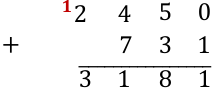

---

<!-- pagina: 5 -->

**Equipe Exatas Estratégia Concursos Aula 09** 

##### **Exemplo 3)** 120 + 13,25 

E agora que temos vírgula? Prosseguiremos quase igual! Veja como ficaria: 

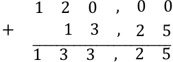

**120 é um número inteiro** . Sendo assim, para fazer o famoso "vírgula abaixo da vírgula", podemos completar com dois zeros à direita, tudo bem? Vamos fazer uma questão! 

**(PREF. TURILÂNDIA/2024)** Realizando a decomposição de um número de um número, encontramos 10000 + 900 + 70 + 3. O número decomposto foi: 

A) 10970 

B) 10973 

C) 10993 

D) 19703 

E) 19790 

###### **Comentários:** 

Pessoal, nessa questão, para encontrarmos o número decomposto, devemos realizar a soma indicada. 

10000 900 70 +            3 𝟏𝟎𝟗𝟕𝟑 

<!-- Start of picture text -->
𝟏𝟎𝟗𝟕𝟑 <!-- End of picture text -->

**Gabarito:** LETRA B 

Pessoal, a soma possui algumas propriedades. Elas não costumam cair muito em prova e muitas vezes usamos elas sem mesmo perceber. Vamos ver quais são! 

###### **1) Propriedade do Elemento Neutro** 

O elemento neutro da adição é o número tal que, somado a qualquer outro número, **não produzirá efeito prático algum** (terá uma ação neutra). Imagine que 𝑥 representa um número qualquer.

---

<!-- pagina: 6 -->

**Equipe Exatas Estratégia Concursos Aula 09** 

Veja que tínhamos um número 𝑥 e somamos ele com o número zero. _Qual o resultado?_ **O próprio** 𝒙 . Isso ocorre pois **o zero é o elemento neutro da adição** <u>.</u> _Tudo bem, galera?!_ 

Usamos o "x" para indicar que pode ser qualquer número. Vamos exemplificar! 

Observe que quando somamos o "0", nada acontece com o "10"! 

###### **2) Propriedade da Comutatividade** 

Essa propriedade serve para nos dizer que, **<u>NA SOMA</u>** <u>,</u> **não importa a ordem dos fatores** , o resultado será o mesmo. Observe: 

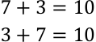

**Não importa a ordem!** Tanto faz: "sete mais três" ou "três mais sete", o resultado será sempre 10. Genericamente, representamos essa propriedade assim: 

###### **3) Propriedade da Associatividade** 

Por sua vez, a propriedade associativa fornece para nós uma **certa flexibilidade na hora de somarmos mais de dois termos** . Por exemplo, imagine que você quer fazer a seguinte soma: 

Primeiro, você soma 7 + 3 ou deve fazer 3 + 10 ? A propriedade vai nos dizer que **tanto faz** . Em uma soma de mais de dois termos, **você pode escolher a ordem que for melhor para trabalhar** . 

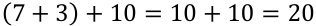

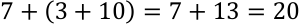

De um modo geral, representamos essa propriedade assim:

---

<!-- pagina: 7 -->

**Equipe Exatas Estratégia Concursos Aula 09** 

###### 𝑎+ (𝑏+ 𝑐) = (𝑎+ 𝑏) + 𝑐 

###### **4) Propriedade do Fechamento** 

A propriedade do fechamento indica que a soma de dois números naturais é um número natural. Ela também é válida para o conjunto dos inteiros, dos racionais e dos reais. **O único conjunto numérico que fica de fora é o dos irracionais.** 

|**Propriedade do Elemento Neutro**|𝑎+ 0 = 𝑎   |   0 + 𝑎= 𝑎|
|---|---|
|**Propriedade da Comutatividade**|𝑎+ 𝑏= 𝑏+ 𝑎|
|**Propriedade da Associatividade**|(𝑎+ 𝑏) + 𝑐= 𝑎+ (𝑏+ 𝑐)|
||𝑎, 𝑏∈ℕ →𝑎+ 𝑏∈ℕ|
|**Propriedade do Fechamento**|𝑎, 𝑏∈ℤ→𝑎+ 𝑏∈ℤ 𝑎, 𝑏∈ℚ →𝑎+ 𝑏∈ℚ|
||𝑎, 𝑏∈ℝ→𝑎+ 𝑏∈ℝ|

#### **Subtração** 

A subtração vai ser o oposto da soma. Se ao somar, nós adicionamos determinada quantidade em outra; **na subtração, nós vamos retirar essa quantidade** . Mais uma vez, imagine que você tinha aquelas 5 maçãs. Aconteceu que, seu cachorro conseguiu comer 4 delas sem você ver. Ele foi lá e, sorrateiramente, devorou quase todas as suas maçãs. _Com quantas maçãs você ficou?_ 

Veja, portanto, que 5 −4 = 1 . Representamos a subtração com o sinal de (−) **"menos"** . _Tem algum método para subtrair quaisquer dois números?_ Tem e ele é muito parecido com o que já desenvolvemos na soma. Vamos continuar **escrevendo um algarismo abaixo do outro** (respeitando: unidade abaixo de unidade, dezena abaixo de dezena...) e sempre **começando a subtrair pelo algarismo mais à direita** . 

###### **Exemplo 4)** 39 −17 

**II -** Vamos fazendo a subtração "coluna por coluna" e o resultado colocamos abaixo da linha. 

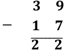

**I -** Começamos subtraindo os algarismos mais a direta. No caso, 9 −7 = 2

---

<!-- pagina: 8 -->

**Equipe Exatas Estratégia Concursos Aula 09** 

Um detalhe da subtração é que os termos ganham nomes! **O primeiro termo é chamado de "minuendo"** (ou "diminuendo") e **o segundo termo de "subtraendo"** . Olhando para o nosso exemplo, o minuendo seria o 39, enquanto o subtraendo é o 17. 

###### **Exemplo 5)** 152 −35 

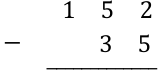

Aqui iremos com mais calma. Quando olhamos para a coluna de algarismo mais à direita, temos que fazer a subtração 2 −5 . Note que **2 é menor do que 5** , e, portanto, o resultado seria um número negativo. Nessa situação, devemos "pegar emprestado" do vizinho, **para que o número não fique negativo** . 

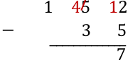

Veja que quando pegamos esse número "emprestado", o número que antes era 2, vira 12 e agora é possível efetuar a subtração: 12 −5 = 7 . **Como pegamos um número do vizinho, o "5" acaba virando o 4 para efeitos da subtração.** Daí, fazemos 4 −3 = 1 . 

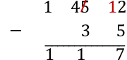

Portanto, 152 −35 = 117 . Esse negócio de "pegar do vizinho" **pode confundir** muita gente, por isso tenha bastante atenção. Para ver como cai em prova, vamos fazer uma questão. 

**(PREF. P. BERNARDES/2024)** Resolva: 

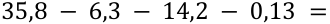

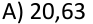

---

<!-- pagina: 9 -->

**Equipe Exatas Estratégia Concursos Aula 09** 

B) 15,17 C) 17,13 D) 14,43 

###### **Comentários:** 

Podemos **reescrever a expressão** do enunciado da seguinte forma: 

35,8 −(6,3 + 14,2 + 0,13) 

Sendo assim, vamos realizar primeiro **a soma entre parênteses** . 

Agora, ficamos com a seguinte **subtração** : 

14,2 6,3 +      0,13 𝟐𝟎, 𝟔𝟑 35,8 −20,63 

<!-- Start of picture text -->
𝟐𝟎, 𝟔𝟑 <!-- End of picture text -->

Resolvendo: 

<!-- Start of picture text -->
35,8 <!-- End of picture text -->

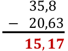

<!-- Start of picture text -->
𝟏𝟓, 𝟏𝟕 <!-- End of picture text -->

**Gabarito:** LETRA B. 

Agora, vamos fazer alguns comentários sobre as propriedades **. Na subtração, não vamos ter propriedade associativa, comutativa ou do elemento neutro.** Para começar, observe que: 

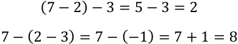

Portanto, temos que (7 −2) −3 ≠ 7 −(2 −3) . Podemos concluir que **a propriedade associativa não se aplica aqui** . Além disso, veja que 7 −3 ≠3 −7 , mostrando que **a comutatividade também não vale** . Você deve estar se perguntando sobre o elemento neutro, né? 

De fato, quando temos 𝑥−0 = 𝑥 , o zero não vai ter efeito algum. No entanto, quando fazemos 0 −𝑥= −𝑥 , o zero tem um pequeno efeito. É como se ele agisse **invertendo o sinal do subtraendo** . Tudo bem? Por isso, dizemos que **na subtração, não temos elemento neutro** .

---

<!-- pagina: 10 -->

**Equipe Exatas Estratégia Concursos Aula 09** 

#### **Multiplicação** 

Na prática, **multiplicar é fazer a adição de um mesmo número repetidas vezes** . Por exemplo, 

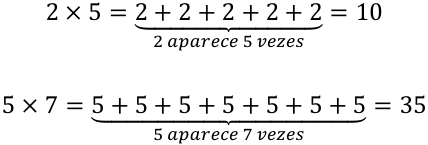

É bem mais "compacto" expressar várias somas de um mesmo número na forma de uma multiplicação. Ao invés de escrever 5 + 5 + 5 + 5 + 5 + 5 + 5 = 35 , simplesmente dizemos que 5 × 7 = 35 . 

Para conseguirmos ir bem nessa parte da matéria, é muito importante que você tenha facilidade com a tabuada. Vamos relembrá-la? 

|𝟏|𝟐|𝟑|𝟒|𝟓|
|---|---|---|---|---|
|1 × 1 = 1|2 × 1 = 2|3 × 1 = 3|4 × 1 = 4|5 × 1 = 5|
|1 × 2 = 2|2 × 2 = 4|3 × 2 = 6|4 × 2 = 8|5 × 2 = 10|
|1 × 3 = 3|2 × 3 = 6|3 × 3 = 9|4 × 3 = 12|5 × 3 = 15|
|1 × 4 = 4|2 × 4 = 8|3 × 4 = 12|4 × 4 = 16|5 × 4 = 20|
|1 × 5 = 5|2 × 5 = 10|3 × 5 = 15|4 × 5 = 20|5 × 5 = 25|
|1 × 6 = 6|2 × 6 = 12|3 × 6 = 18|4 × 6 = 24|5 × 6 = 30|
|1 × 7 = 7|2 × 7 = 14|3 × 7 = 21|4 × 7 = 28|5 × 7 = 35|
|1 × 8 = 8|2 × 8 = 16|3 × 8 = 24|4 × 8 = 32|5 × 8 = 40|
|1 × 9 = 9|2 × 9 = 18|3 × 9 = 27|4 × 9 = 36|5 × 9 = 45|
|1 × 10 = 10|2 × 10 = 20|3 × 10 = 30|4 × 10 = 40|5 × 10 = 50|
|𝟔|𝟕|𝟖|𝟗|𝟏𝟎|
|6 × 1 = 6|7 × 1 = 7|8 × 1 = 8|9 × 1 = 9|10 × 1 = 10|
|6 × 2 = 12|7 × 2 = 14|8 × 2 = 16|9 × 2 = 18|10 × 2 = 20|
|6 × 3 = 18|7 × 3 = 21|8 × 3 = 24|9 × 3 = 27|10 × 3 = 30|
|6 × 4 = 24|7 × 4 = 28|8 × 4 = 32|9 × 4 = 36|10 × 4 = 40|
|6 × 5 = 30|7 × 5 = 35|8 × 5 = 40|9 × 5 = 45|10 × 5 = 50|
|6 × 6 = 36|7 × 6 = 42|8 × 6 = 48|9 × 6 = 54|10 × 6 = 60|
|6 × 7 = 42|7 × 7 = 49|8 × 7 = 56|9 × 7 = 63|10 × 7 = 70|
|6 × 8 = 48|7 × 8 = 56|8 × 8 = 64|9 × 8 = 72|10 × 8 = 80|
|6 × 9 = 54|7 × 9 = 63|8 × 9 = 72|9 × 9 = 81|10 × 9 = 90|
|6 × 10 = 60|7 × 10 = 70|8 × 10 = 80|9 × 10 = 90|10 × 10 = 100|

Assim como na soma e na subtração, também temos um método para calcular o produto de dois números. Quanto seria, por exemplo, 731 × 12? Note que **não é uma conta que normalmente temos na cabeça** . Como calculá-la, então?

---

<!-- pagina: 11 -->

**Equipe Exatas Estratégia Concursos Aula 09** 

7 3 1 ×                 1 2 ̅̅̅̅̅̅̅̅̅̅̅̅ 

Fazemos o esquema acima, pois **multiplicaremos algarismo por algarismo** . Com isso, transformamos nosso problema de multiplicar números "estranhos" em multiplicações da tabuada. Observe. 

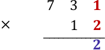

Multiplicamos 2 × 1 = 2 . Colocamos o resultado abaixo da linha. Depois, fazemos o seguinte: 

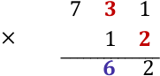

Diferentemente da soma e da subtração, aqui não vamos coluna por coluna. O "2" multiplicará o algarismo das dezenas do número de cima. Assim, 3 × 2 = 6 . 

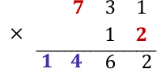

Faremos a multiplicação do "2" pelo "7" . O resultado é 2 × 7 = 14 . Note que multiplicamos todos os algarismos de 731 por 2 . Agora, vamos fazer a mesma coisa, mas multiplicando todos os algarismos de 731 por "1". 

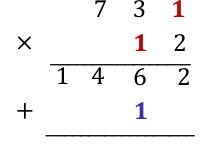

Nesse momento, temos mais novidades. Como vamos fazer novas multiplicações, **iniciamos uma nova linha** e colocamos o resultado da primeira multiplicação **deslocado de uma coluna para esquerda** . Essas duas linhas de resultado **serão somadas ao final** . 

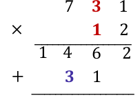

Dessa vez, fizemos 1 × 3 = 3 .

---

<!-- pagina: 12 -->

**Equipe Exatas Estratégia Concursos Aula 09** 

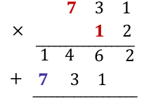

Agora, vamos **somar as duas linhas de resultado** , coluna por coluna. 

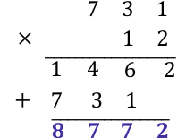

Portanto, 731 × 12 = 8772 . 

**(PREF. BOM JARDIM/2023)** O produto da multiplicação 253 x 56 é? 

A) 14.168. 

B) 13.409. C) 14.188. D) 14.421. 

###### **Comentários:** 

Vamos executar os passos que aprendemos na teoria! Primeiro, esquematizamos a multiplicação. 

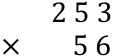

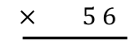

<!-- Start of picture text -->
×       5 6 <!-- End of picture text -->

Agora, começamos multiplicando seis vezes três. O resultado é 18. Sendo assim, colocamos o oito embaixo e subimos o um: 

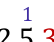

<!-- Start of picture text -->
1 <!-- End of picture text -->

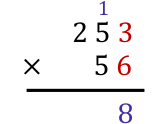

<!-- Start of picture text -->
8 <!-- End of picture text -->

---

<!-- pagina: 13 -->

**Equipe Exatas Estratégia Concursos Aula 09** 

Agora, multiplicamos seis vezes cinco. O resultado é 30. No entanto, como temos o 1 lá em cima, somamos 30 com 1. O resultado fica 31. Assim, colocamos o um embaixo e subimos o três: 

<!-- Start of picture text -->
3  1 <!-- End of picture text -->

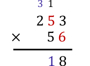

<!-- Start of picture text -->
1 8 <!-- End of picture text -->

Para encerrar a primeira parte, multiplicamos seis vezes dois. O resultado é 12. No entanto, como temos o 3 lá em cima, somamos 12 com 3. O resultado fica 15: 

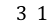

<!-- Start of picture text -->
3  1 <!-- End of picture text -->

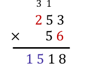

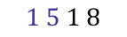

<!-- Start of picture text -->
1 5 1 8 <!-- End of picture text -->

Na segunda parte, começamos multiplicando cinco por três. O resultado é 15. Descemos o cinco e subimos o um: 

<!-- Start of picture text -->
1 <!-- End of picture text -->

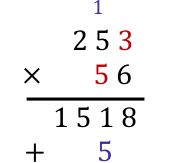

<!-- Start of picture text -->
+        5 <!-- End of picture text -->

Agora, multiplicamos cinco vezes cinco. O resultado é 25. No entanto, como temos o 1 lá em cima, somamos 25 com 1. O resultado é 26. Descemos o seis e subimos o dois: 

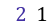

<!-- Start of picture text -->
2  1 <!-- End of picture text -->

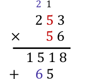

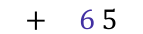

<!-- Start of picture text -->
+     6 5 <!-- End of picture text -->

Para encerrar a multiplicação propriamente dita, multiplicamos o cinco por dois. O resultado é 10. Como temos o 2 lá em cima, fazemos a soma. O resultado é 12.

---

<!-- pagina: 14 -->

**Equipe Exatas Estratégia Concursos Aula 09** 

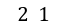

<!-- Start of picture text -->
2  1 <!-- End of picture text -->

<!-- Start of picture text -->
2 5 3 <!-- End of picture text -->

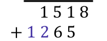

<!-- Start of picture text -->
 1 5 1 8 + 1 2 6 5 <!-- End of picture text -->

Agora, devemos realizar a soma indicada. 

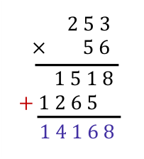

<!-- Start of picture text -->
2 5 3 ×       5 6  1 5 1 8 + 1 2 6 5 1 4 1 6 8 <!-- End of picture text -->

<!-- Start of picture text -->
Gabarito: LETRA A. <!-- End of picture text -->

Beleza, agora vamos ver algumas propriedades dessa operação tão importante! Na multiplicação, teremos aquelas quatro propriedades que vimos na adição e ainda duas a mais! 

###### **1) Propriedade do Elemento Neutro** 

Adianto para vocês que **o elemento neutro da multiplicação** **<u>não é o zero</u>** . Afinal, quando multiplicamos qualquer número por 0, o resultado será zero. O zero acaba tendo uma ação bem característica. Por sua vez, veja o que acontece quando multiplicamos um número 𝑥 por 1. 

Veja que a multiplicação de um número 𝑥 por 1, não acarreta mudanças. Terminamos com o número 𝑥 . Logo, o **"1" é o nosso elemento neutro** da multiplicação. 

###### **2) Propriedade do Elemento Inverso** 

O elemento inverso é aquele que, ao multiplicarmos um número por ele, **resultará no 1** . 

---

<!-- pagina: 15 -->

**Equipe Exatas Estratégia Concursos Aula 09** 

###### Observe que **o inverso multiplicativo de qualquer número** 𝒙 **será sempre a fração de "** 𝟏/𝒙 **".** 

###### **3) Propriedade Associativa** 

A propriedade da associatividade garante que **podemos fazer uma sequência de multiplicações na ordem mais conveniente para nós** . Por exemplo, em uma multiplicação 2 × 3 × 5 , nós multiplicamos primeiro o 2 com o 3? ou o 3 com o 5? A resposta é: você escolhe. Veja: 

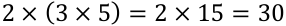

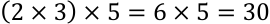

De uma forma **<u>genérica</u>** , representamos essa propriedade assim: 

###### **4) Propriedade Comutativa** 

A comutatividade nos garante que **a ordem dos fatores não altera o produto** ! Particularmente, lembro de ter ouvido bastante isso na escola (rsrs). De um modo geral, representamos esse fato assim: 

𝑎× 𝑏= 𝑏× 𝑎 

###### **5) Propriedade do Fechamento** 

Garante que **a multiplicação de dois números racionais será sempre um racional** (o mesmo vale para os naturais e os inteiros). O único conjunto em que **a multiplicação** **<u>não será</u> "fechada" é o conjuntos dos** **<u>irracionais</u>** <u>.</u> 

###### **6) Propriedade Distributiva** 

É aqui que justificamos a famosa multiplicação "chuveirinho". Representamos assim: 

Ela será muito útil quando estivermos estudando **expressões algébricas** , último tópico dessa aula! O inverso dela é o que chamamos de colocar em "evidência". Observe. 

Podemos colocar um número "em evidência", quando tivermos uma soma e/ou subtração de produtos e houver um ou mais termos em comum. Explico melhor, observe a expressão abaixo. 

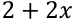

---

<!-- pagina: 16 -->

**Equipe Exatas Estratégia Concursos Aula 09** 

Perceba que o número "2" é comum as duas parcelas da soma. 

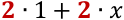

Por mais que o número "2" não esteja expressamente em um produto, podemos considerá-lo como " 2 ∙1 ". 

É possível colocá-lo em evidência e escrevendo-o apenas uma vez. 

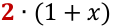

Observe que é justamente o inverso da multiplicação chuveirinho. 

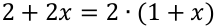

Não se preocupe! Voltaremos para aplicarmos essa propriedade em breve! No momento, vamos avançar um pouco mais no conteúdo! 

#### **Divisão** 

A grande maioria dos alunos tem algum problema com a divisão. Existem muitas regrinhas que podem dificultar a vida do concurseiro. Não se preocupe! Depois de hoje, garanto que não terá mais medo de enfrentar uma divisão. O primeiro passo nesse objetivo é ter uma **noção intuitiva do que significa dividir** . Imagine que você colheu 12 maçãs em sua fazenda. 

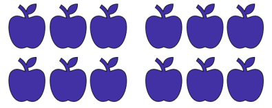

Você resolve repartir, em quantidades iguais, as **12 maçãs para 4 amigos** que foram te visitar. _Quantas maçãs cada amigo levará pra casa?_ 

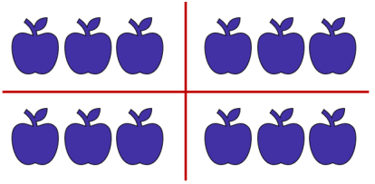

Observe que, para fornecer **<u>a mesma quantidade para</u>** os amigos, **cada um deverá ficar com 3 maçãs** . Assim, escrevemos 12 ÷ 4 = 3 . O **símbolo** " ÷ " é o que usamos para representar a divisão. As frações são usadas com esse objetivo também, mas teremos uma aula especial só para elas. Portanto, não se preocupe agora.

---

<!-- pagina: 17 -->

**Equipe Exatas Estratégia Concursos Aula 09** 

Para resolver divisões, normalmente utilizamos um algoritmo específico. Podemos esquematizá-lo assim: 

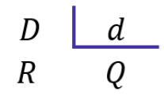

- 𝐷: dividendo (é o número que será dividido); 

- 𝑑 : divisor (é o número que dividirá o dividendo); 

- 𝑄 : quociente (é o resultado da divisão); 

- 𝑅 : resto (às vezes, não conseguimos dividir o número em partes inteiras iguais, forma-se, então, o "resto"). 

Existe uma expressão que relaciona essas quatro quantidades. É a **"Relação Fundamental da Divisão".** 

###### 𝐷= 𝑄× 𝑑+ 𝑅 

ou 

###### DIVIDENDO = DIVISOR × QUOCIENTE + RESTO 

**(PREF. PIRASSUNUNGA/2023)** Ao dividir 719 por “a”, onde “a” é um número natural e diferente de zero, obteve-se o quociente igual a 79 e o resto igual a 8. É correto afirmar que o valor de “a” é igual a: 

A) 6. 

B) 7. C) 8. D) 9. E) 11. 

**Comentários:**

---

<!-- pagina: 18 -->

**Equipe Exatas Estratégia Concursos Aula 09** 

Questão para aplicarmos o que acabamos de ver. Vamos identificar cada um dos números. 

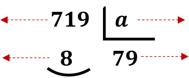

<!-- Start of picture text -->
𝟕𝟏𝟗     𝒂     𝟖        𝟕𝟗 <!-- End of picture text -->

<!-- Start of picture text -->
Divisor <!-- End of picture text -->

<!-- Start of picture text -->
Dividendo <!-- End of picture text -->

<!-- Start of picture text -->
Quociente <!-- End of picture text -->

<!-- Start of picture text -->
Resto <!-- End of picture text -->

Usando a Relação Fundamental da Divisão: 

DIVIDENDO = DIVISOR × QUOCIENTE + RESTO 

719 = 𝑎× 79 + 8 

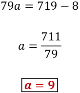

**Gabarito:** LETRA D. 

Agora, vamos resolver algumas divisões para pegar o jeito. 

**Exemplo 6)** 635 ÷ 5 

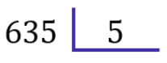

Ao contrário do que vínhamos fazendo anteriormente, na divisão, **começaremos do algarismo mais à esquerda, ou seja, pelo "6"** . Vamos nos fazer a pergunta: _que número devemos multiplicar o 5 de modo que o resultado seja o mais próximo possível de 6 (sem ultrapassá-lo)?_ **É o número 1** , pois 5 × 1 = 5 . 

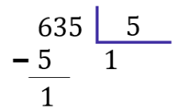

Colocamos o "1" no quociente e o "5" abaixo do 6. Após esse passo, **devemos efetuar a subtração dos elementos que estão na coluna** . No caso 6 −5 = 1 . Agora, descemos o próximo algarismo.

---

<!-- pagina: 19 -->

**Equipe Exatas Estratégia Concursos Aula 09** 

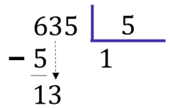

Como descemos um número, devemos nos perguntar novamente: _qual número devemos multiplicar o 5, de modo que o resultado seja o mais próximo possível de 13 (sem ultrapassá-lo)?_ **Ora, é o 2!** Veja que 5 × 2 = 10 . Assim, ficamos com: 

Não podemos esquecer de fazer a subtração do resultado: 13 −10 = 3 . Agora, vamos descer o "5". 

_Qual número que devemos multiplicar o 5, que vai resultar no número mais próximo de 35 (sem ultrapassálo?_ **Ora, é o 7** , pois 5 × 7 = 35 . O número pode ser igual, só não pode ser maior!! 

Pronto, finalizamos nossa divisão. Veja que **o resto deu 0** . Nessas situações, dizemos que **<u>a divisão é exata</u>** <u>.</u> Já quando obtemos um **resto diferente de zero, temos uma divisão não exata** . Para finalizar, vamos fazer um exemplo com alguns detalhes diferentes. 

###### **Exemplo 6)** 14563 ÷ 18 

---

<!-- pagina: 20 -->

**Equipe Exatas Estratégia Concursos Aula 09** 

Observe que, quando olhamos para os dois algarismos mais à esquerda, temos apenas "14", que é menor do que "18". Nesses casos, podemos pegar mais um algarismo, ou seja, considerar "145". Vamos fazer a pergunta: _qual número devemos multiplicar 18, que resulta no número mais próximo possível de 145?_ Ora, **é o número 8** , pois, 18 × 8 = 144 . Assim, 

Uma vez que fizemos a subtração, podemos descer o "6". 

Note que "16" é menor do que "18". **Temos que baixar o próximo número** . No entanto, para isso, **devemos que acrescentar um zero no quociente** . 

Pronto. A pergunta da vez é: _que número multiplicamos o 18 que dará um resultado mais próximo de 163 (lembrando sempre que não pode ultrapassá-lo)?_ **É o 9!** Veja que 18 × 9 = 162 . Assim, 

Terminamos a divisão! Note que **o resto foi diferente de zero** . É o caso de uma divisão não exata. **O quociente foi de 809** . Observe que: 

---

<!-- pagina: 21 -->

**Equipe Exatas Estratégia Concursos Aula 09** 

#### **Potenciação e Radiciação** 

Você já deve ter ouvido falar da **potenciação e da radiciação** . Na potenciação, temos números que estão elevados a um outro número, como 23 , 210 , 105 e 37 . Mas você sabe o que significa isso? Esse tipo de operação nada mais é do que **<u>uma multiplicação escrita de uma forma simplificada</u>** . Imagine que, por algum motivo, você se depare com a multiplicação 2 × 2 × 2 × 2 × 2 × 2 × 2 . Note que é uma notação extensa e tem o número 2 repetido 7 vezes. 

Para evitar isso, **você pode condensar toda essa expressão em um único número:** 𝟐𝟕 . É um jeito melhor de representar, não concorda? Observe mais alguns exemplos. 

- 33 = 3 × 3 × 3 = 27 

- 210 = 2 × 2 × 2 × 2 × 2 × 2 × 2 × 2 × 2 × 2 = 1024 

- 105 = 10 × 10 × 10 × 10 × 10 = 100000 

- 52 = 5 × 5 = 25 

Muitas vezes vocês irão encontrar o termo **exponenciação** , que pode ser utilizado no lugar de potenciação. Eles significam exatamente a mesma coisa! De modo geral, nós podemos representar uma potência da seguinte forma: 

<!-- Start of picture text -->
Expoente <!-- End of picture text -->

<!-- Start of picture text -->
𝑏= 𝑎 𝑛 <!-- End of picture text -->

<!-- Start of picture text -->
Base <!-- End of picture text -->

<!-- Start of picture text -->
Potência <!-- End of picture text -->

E a radiciação? Vocês lembram da famosa raiz quadrada? **Ela é um exemplo clássico dessa operação** . Mas o que significa tirar a raiz de um número? Nós sabemos, por exemplo, que 92 = 9 × 9 = 81 . Quando queremos calcular <u>√81</u> , **estamos fazendo uma operação inversa da potenciação** . Você deve se perguntar: **qual número que multiplicado por ele mesmo dá 81? Ora, é o 9!** Logo, <u>√81</u> = √92 = 9 . 

Isso é válido se for uma raiz quadrada. No entanto, podemos ter raízes cúbicas, raízes quartas, etc. Acompanhe mais alguns exemplos. 

- 𝟑 

- • Para calcular <u>√𝟖</u> , você deve se perguntar: qual número que multiplicado por ele mesmo três vezes dá 8? 𝟑 𝟑 

- Ora, é o 2! Veja: 23 = 2 × 2 × 2 = 8 . Com isso, <u>√𝟖</u> = <u>√𝟐</u>𝟑 = 𝟐 **;** 

- 𝟒 

- • Para calcular <u>√𝟏𝟎𝟎𝟎𝟎</u> , você deve se perguntar: qual número que multiplicado por ele mesmo quatro 𝟒 𝟒 

- vezes vai fornecer 10000 ? Veja: 104 = 10 × 10 × 10 × 10 = 10000 . Logo, <u>√𝟏𝟎𝟎𝟎𝟎</u> = <u>√𝟏𝟎</u>𝟒 = 𝟏𝟎 .

---

<!-- pagina: 22 -->

**Equipe Exatas Estratégia Concursos Aula 09** 

Note que, nos nossos exemplos, os resultados foram números inteiros. Acontece que, nem sempre isso ocorrerá. Por exemplo, a raiz quadrada de 2: <u>√2.</u> **Qual número que multiplicado por ele mesmo fornece 2?** A resposta para essa pergunta é um número irracional: 1,41421356237309504880168872420969 … Isso significa que: 

- 1,142135623730950488016887242 … × 1,142135623730950488016887242 … = 2 

**O processo de determinar raízes não é trivial** <u>! O quadro a seguir traz as principais potências e raízes que</u> **você deve ter na ponta da língua** . Galera, anotem esses valores em um papel e durmam com ele. Ter esses valores decorados vai fazer com que economizem muito tempo durante a prova. Além disso, tenha a certeza de que eles aparecerão! 

|**Resultados I** |**mportantes** |**Potências** |
|---|---|---|
|**Potências**|**Raízes**|**de 2**|
|22 = 4|√4 = 2|20 = 1|
|32 = 9|√9 = 3|21 = 2|
|42 = 16|√16 = 4|22 = 4|
|52 = 25|√25 = 5|23 = 8|
|62 = 36|√36 = 6|24 = 16|
|72 = 49|√49 = 7|25 = 32|
|82 = 64|√64 = 8|26 = 64|
|92 = 81|√81 = 9|27 = 128|
|102 = 100|√100 = 10|28 = 256|
|112 = 121|√121 = 11|29 = 512|
|122 = 144|√144 = 12|210 = 1024|
|132 = 169|√169 = 13|211 = 2048|
|142 = 196|√196 = 14|212 = 4096|
|152 = 225|√225 = 15|213 = 8192|

---

<!-- pagina: 23 -->

**Equipe Exatas Estratégia Concursos Aula 09** 

**(FAZPREV/2023)** Assinale o resultado CORRETO da seguinte operação: 

210 −29 

A) 29 

B) 2³ 

C) 2² 

D) 21 

E) 25 

###### **Comentários:** 

Pessoal, é muito importante conhecer **as potências de 2** . Elas sempre estão nas provas! Para essa questão, temos o seguinte: 

No caso de o aluno não lembrar, ele teria que **fazer manualmente** mesmo: 

29 = 2 ⋅2 ⋅2 ⋅2 ⋅2 ⋅2 ⋅2 ⋅2 ⋅2 = 512 

210 = 2 ⋅2 ⋅2 ⋅2 ⋅2 ⋅2 ⋅2 ⋅2 ⋅2 ⋅2 = 1024 

E isso pode custar um **pouquinho de tempo** . Muito cuidado! 

Mais na frente, você notará que também é possível resolver essa questão usando algumas das **propriedades da potenciação** ! 

**Gabarito:** LETRA A. 

#### **Propriedades da Potenciação** 

Agora que começamos a ter uma noção intuitiva do que é potenciação, é importante fazer algumas definições e mostrar algumas propriedades. 

- 1) 𝒂𝟎 = 𝟏 

- 2) 𝒂𝒏 = 𝒂⋅𝒂⋅𝒂⋅𝒂⋅… ⋅𝒂⋅𝒂 ⏟ 

𝒏 𝒗𝒆𝒛𝒆𝒔

---

<!-- pagina: 24 -->

###### **Equipe Exatas Estratégia Concursos Aula 09** 

Pessoal, lembre-se que qualquer número elevado a 0 é igual a 1! Isso é uma definição, não há demonstrações. _Quanto é_ 20 ? É 𝟏! _Quanto é_ 10000 ? É 𝟏! _Quanto é_ 100000000000000 ? É 𝟏! **Não importa quão grande o número seja, se ele está elevado a zero, então essa potência vale 1!** E as propriedades, quais são? 

###### **P1)** Quando multiplicamos duas potências de mesma base, **mantemos a base e somamos os expoentes** . 

#### 𝑎𝑚 ⋅𝑎𝑛 = 𝑎𝑚+𝑛 

==5460== 

<!-- Start of picture text -->
2 2 ∙2 3 = 2 2+3 = 2 5 3 4 ∙3 5 = 3 4+5 = 3 9 5 1 ∙5 10 = 5 1+10 = 5 11 <!-- End of picture text -->

###### **P2)** Quando dividimos duas potências de mesma base, **mantemos a base e subtraímos os expoentes** . 

#### 𝑎𝑚 = 𝑎𝑚−𝑛 𝑎𝑛 

<!-- Start of picture text -->
2 2 = 2 2−3 = 2 −1 2 3 3 10 = 3 10−5 = 3 5 3 5 5 1 = 5 1−10 = 5 −9 5 10 <!-- End of picture text -->

###### **P3)** Quando calculamos uma potência de potência, **mantemos a base e multiplicamos os expoentes** . 

#### (𝑎𝑚 )𝑛 = 𝑎𝑚⋅𝑛 

https://t.me/KakashiAssinaturasBot

---

<!-- pagina: 25 -->

**Equipe Exatas Estratégia Concursos Aula 09** 

(22 )3 = 22∙3 = 26 (34 )5 = 34∙5 = 320 (51 )10 = 51∙10 = 510 

**P4)** Quando queremos elevar a determinado expoente uma multiplicação, **o expoente entra em cada um dos fatores** . 

<!-- Start of picture text -->
(𝑎∙𝑏) 𝑛 = 𝑎 𝑛 ∙𝑏 𝑛 <!-- End of picture text -->

**P5)** Quando queremos elevar a determinado expoente uma divisão, **o expoente entra no denominador e no numerador normalmente** . 

Existem **<u>duas pequenas consequências</u>** do que vimos até aqui que vocês devem ter em mente: 

- Ao elevar o número 0 a qualquer expoente, **o resultado será sempre zero** !

---

<!-- pagina: 26 -->

**Equipe Exatas Estratégia Concursos Aula 09** 

- Ao elevar o número 1 a qualquer expoente, **o resultado será sempre um** ! 

**(CM ITAMARANDIBA/2022)** Considerando a propriedade (𝑎𝑛 )𝑚 = 𝑎𝑛.𝑚 , é CORRETO afirmar que (169)1/2 é igual a: 

A) 6. 

B) 9. 

C) 11. 

D) 13. 

E) 43. 

**Comentários:** 

O primeiro passo é perceber que 𝟏𝟔𝟗= 𝟏𝟑𝟐 . Dessa forma, podemos reescrever a expressão do enunciado: 

Usando a **propriedade** indicada, temos: 

**Gabarito:** LETRA D. 

Para finalizarmos essa primeira parte, é importante fazermos mais algumas considerações. Até agora vimos **apenas potências com expoentes naturais** . O que acontece **se o expoente for um número inteiro negativo** <u>?</u> Lembre-se que a propriedade 𝑃2 diz o seguinte: 

---

<!-- pagina: 27 -->

**Equipe Exatas Estratégia Concursos Aula 09** 

Vamos fazer 𝑚= 0? 

Perceba, então, que **quando tivermos expoentes negativos, basta invertemos a potência!** Acompanhe. 

**Todas as propriedades que vimos** **<u>continuam válidas</u>** <u>, independentemente se o expoente é um número</u> positivo ou negativo. 

**(PREF. QUARAÍ/2019)** Todas as operações fundamentais possuem propriedades que facilitam o seu desenvolvimento e tornam o resultado mais confiável. Dentre todas as operações, a potenciação tem diversas propriedades que ajudam na resolução de suas operações. Sobre a resolução da operação (2³. 2²)² , assinale a alternativa correta. 

A) Basta conservar a base e somar os expoentes. 

B) Basta conservar os expoentes e somar as bases. 

C) Deve-se conservar a base, multiplicar os expoentes de dentro dos parênteses e, então, somar com o de fora. 

D) Deve-se conservar a base, somar os expoentes de dentro dos parênteses e, então, multiplicar o resultado pelo expoente de fora dos parênteses. 

E) O resultado final, independentemente da forma de resolução, será 512. 

###### **Comentários:** 

Veja que temos que resolver a expressão (2³. 2²)² .  Para isso, utilizaremos as seguintes propriedades:

---

<!-- pagina: 28 -->

**Equipe Exatas Estratégia Concursos Aula 09** 

P1)    𝑎𝑚 ∙𝑎𝑛 = 𝑎𝑚+𝑛 

P3)   (𝑎𝑚 )𝑛 = 𝑎𝑚∙𝑛 

Iniciamos com **a multiplicação dentro dos parênteses** . Sabemos que, na multiplicação de potências de mesma base, **mantemos a base e somamos os expoentes** (P1) . Logo, 

Agora temos **uma potência de potência** . Nesse caso, devemos multiplicar os expoentes (P3) . 

Esse raciocínio que seguimos é o que está descrito exatamente na alternativa D. 

**Gabarito:** Letra D. 

#### **Propriedades da Radiciação** 

Antes de entrarmos nas propriedades da radiciação, é fundamental definirmos alguns elementos das raízes. 

<!-- Start of picture text -->
índice <!-- End of picture text -->

<!-- Start of picture text -->
𝑛√𝑎 <!-- End of picture text -->

<!-- Start of picture text -->
Radicando <!-- End of picture text -->

Note que **cada raiz possui dois elementos principais** : **<u>o índice</u>** <u>, que vai dizer se estamos lidando com uma</u> raiz quadrada, uma raiz cúbica, etc. e **<u>o radicando</u>** que é o número que está envolvido na operação em si. A raiz acima é lida da seguinte forma: **raiz enésima de a** . 

𝑃5) **Toda raiz pode ser escrita na forma de uma potência** , em que **o expoente é uma fração** . 

Pessoal, essa é **<u>a propriedade mais importante</u>** em se tratando de raízes. Uma vez que a transformamos em uma potência, **todas as propriedades que vimos anteriormente também valem para ela** . Isso facilita muito a compreensão das próximas propriedades que veremos. Confira alguns exemplos.

---

<!-- pagina: 29 -->

**Equipe Exatas Estratégia Concursos Aula 09** 

Existe uma frase que ajuda a **lembrar quem vira numerador e quem vira denominador** na conversão de uma raiz para a forma de uma potência. 

**(PREF. PIÊN/2023)** Assinale a alternativa que apresente CORRETAMENTE o valor de 8√216 : A) 40 

B) 21 

C) 42 

D) 23 

E) 41 

###### **Comentários:** 

Pessoal, devemos aplicar o que vimos acima! **Escrever a raiz na forma de uma potência** . 

**Gabarito:** LETRA E. 

𝑷𝟔) Na multiplicação de raízes com índices iguais, **conservamos o índice e multiplicamos os radicandos** . 

𝑷𝟕) Na divisão de raízes com índices iguais, **conservamos o índice e dividimos os radicandos** . 

---

<!-- pagina: 30 -->

**Equipe Exatas Estratégia Concursos Aula 09** 

𝑷𝟖) Na potência de raízes, **o expoente pode ser levado para o radicando** 

. 

𝑷𝟗) Quando precisamos tirar uma raiz de uma raiz, **mantemos o radical e multiplicamos os índices** . 

**(PREF. SJ BELA VISTA/2023)** Dentre as opções a seguir, assinale a que apresenta corretamente o resultado 3 3 da operação√ <u>√19683</u> : 

A) 1. B) 2. C) 3. D) 4.

---

<!-- pagina: 31 -->

**Equipe Exatas Estratégia Concursos Aula 09** 

###### **Comentários:** 

Inicialmente, vamos usar **a propriedade P9** para transformar a expressão em uma única raiz. 

Sendo assim, 

Agora, talvez a parte mais c **omplicada** . Devemos perceber que 𝟏𝟗𝟔𝟖𝟑 = 𝟑𝟗 . 

_Professor, como eu iria saber disso?_ 

Galera, perceba que o resultado dessa raiz é um número inteiro que está nas alternativas! Sendo assim, você pode **testá-las** ! 

Sendo assim: 

**Gabarito:** LETRA C. 

#### **Detalhes Importantes** 

Vamos fazer algumas observações sobre aspectos da matéria que os alunos confundem bastante. Observe. 

Note que (2 + 3)2 ≠22 + 32 . O expoente não entra **em cada membro da soma individualmente** . Primeiro **resolva o que está dentro do parênteses e, em seguida, resolva a potenciação** . O mesmo raciocínio vale para a subtração. Já quando estamos lidando com raízes, um **<u>erro comum</u>** entre os alunos é esse: 

Galera, **isso está muito errado** . Observe que: 

---

<!-- pagina: 32 -->

**Equipe Exatas Estratégia Concursos Aula 09** 

Com isso, veja que <u>√2</u> + √3 = 1,4142 … + 1,7320 … = 3,1462 … ≠ 2,2360 … 

Não podemos cometer esse tipo de erro. **Quando somamos duas raízes que possuem índices iguais mais radicandos diferentes, não temos o que fazer** . Devemos deixar do jeito que está. Então, da próxima vez, por exemplo, que você chegar ao resultado <u>√𝟐</u> + √𝟑 **,** esse será o resultado. Não há mais o que fazer, **você representará sua resposta como uma soma de duas raízes e estará correto!** Agora, você poderá somar duas raízes que são iguais. 

- √2 + √2 = 2√2 

A **<u>racionalização de denominadores</u>** pode gerar um pouco de ansiedade nos alunos, apesar de ser simples. Galera, _o que seria racionalizar um denominador?_ É apenas " **tirar" a raiz da parte de baixo de uma fração** . Mas não é tirar de qualquer jeito! Devemos obter uma fração equivalente. 

1 Observe que multiplicamos a fração por<u>√2</u> ~~,~~ mas note que<u>√2</u> = 1 . Então, no fim, você multiplicou sua <u>√2 √2 √2</u> fração por 1! **Quando multiplicamos por 1, não alteramos o resultado** . Logo, 

Essa é a chamada **<u>racionalização de denominadores</u>** no seu caso mais simples. Acompanhe mais alguns racionalizações. 

A racionalização que fizemos acima é para quando o denominador for uma raiz quadrada. E quando não for? 

---

<!-- pagina: 33 -->

**Equipe Exatas Estratégia Concursos Aula 09** 

𝟑 𝟑 Continue notando que <u>√𝟑</u>𝟐 /√𝟑𝟐 = 𝟏 . Ou seja, **<u>continuamos multiplicando a nossa fração pelo número 1</u>** <u>.</u> Veja que o radicando das raízes do numerador e denominador da fração equivalente a 1 possui o expoente 2. Isso acontece, pois **, precisamos obter o expoente 3 para cortar com o índice do radical e eliminar assim a raiz** ! Acompanhe mais alguns exemplos para melhor entendimento. 

**(PREF. CAMBÉ/2023)** Assinale a alternativa que apresenta um número igual a <u>√𝟑/√𝟔</u> **:** 

A) <u>√3/3</u> 

B) <u>√2/2</u> C) <u>√6/6</u> D) <u>√3/18</u> E) <u>√6/18</u> 

###### **Comentários:** 

Vamos lá! O primeiro passo é tentar simplificar essa fração! 

Agora, observe que temos uma **raiz no denominador** . É necessário **racionaliza** r. 

Logo, temos que: 

**Gabarito:** LETRA B.

---

<!-- pagina: 34 -->

**Equipe Exatas Estratégia Concursos Aula 09** 

#### Mínimo Múltiplo Comum (MMC) 

Uma primeira dúvida pode surgir assim que lemos o título dessa seção. _O que é o múltiplo de um número?_ Bem, o múltiplo de um número **x** nada mais é do que **um número resultante da multiplicação de x por qualquer número natural** . Explico! Os múltiplos de 2 são: 0, 2, 4, 6, 8, 10, 12 .. . Agora, deixa eu escrever melhor: 

∙ ∙ ∙ ∙ ∙ ∙ ∙ Os múltiplos de 2 são: 𝟎 𝟐,    𝟏 𝟐,      𝟐 𝟐,     𝟑 𝟐,     𝟒 𝟐,     𝟓 𝟐,     𝟔 𝟐, …. 

Conseguiu perceber? Para achar os múltiplos de um determinado número, basta multiplicá-lo por qualquer natural. Você lembra qual é **o conjunto dos números naturais** que vimos no começo dessa aula? 

##### ℕ= {𝟎, 𝟏, 𝟐, 𝟑, 𝟒, 𝟓, 𝟔, … } 

Quais são as consequências disso? 

- O número zero (0) sempre **será múltiplo de qualquer número** , pois 0 ∙𝑥= 0 . 

- O próprio número sempre será um **múltiplo de si mesmo** , pois 1 ∙𝑥= 𝑥 . 

- **Existem infinitos múltiplos de um número** , uma vez que existem infinitos números naturais. 

Formalmente, nós representamos os múltiplos de 2 da seguinte forma: 

𝑀(2) = {0, 2, 4, 6, 8, 10, 12, … } 

Você já consegue me dizer quais são os múltiplos de 3? Ou de 5? 

Antes de avançarmos, vale uma observação importante. Alguns professores **podem estender a definição de múltiplos para o conjunto dos números inteiros** . Dessa forma, você já pode ter visto em algum livro a seguinte notação: 

Observe que, sob essa consideração, **também existiriam múltiplos negativos** . No entanto, vamos nos ater a definição que leva em conta **somente o conjunto dos números naturais** para a definição de múltiplos, tudo bem?! Vou pedir agora que você observe com atenção os múltiplos de 2 e os múltiplos de 3. 

---

<!-- pagina: 35 -->

**Equipe Exatas Estratégia Concursos Aula 09** 

Qual **o menor número positivo que é múltiplo de 2 e também de 3** ? Sei que você certamente disse 6! 

Pois é, você acabou de encontrar o MMC de 2 e 3! É o **menor múltiplo positivo que é comum aos dois** ! Logo, 

Conseguiu entender conceitualmente o que é esse tal de MMC? Preste atenção nas seguintes observações, elas precisam estar bem claras: 

- Todo número inteiro vai possuir múltiplos. Aqui, **o múltiplo é calculado em relação a um único número** , por exemplo, calculamos os múltiplos de 2, de 5, de 10, de 120, etc. 

- Quando estamos falando de **mínimo múltiplo comum** , **estamos envolvendo dois ou mais números** . Não faz sentido calcular MMC de um único número! Tudo ok?! 

Vamos calcular junto alguns MMCs! 

- **Calcule o MMC de 5 e 10.** 

Vamos listar os múltiplos de cada um desses números! 

𝑀(5) = {0, 5, 𝟏𝟎, 15, 20, 25, 30, … } 𝑀(10) = {0, 𝟏𝟎, 20, 30, 40, 50, … } 

Veja que o menor múltiplo positivo que é comum a 5 e a 10, **é o próprio número 10** . Como vimos um pouco mais cedo, **todo número é um múltiplo de si mesmo, pois** 𝟏∙𝒙= 𝒙 **.** Logo, **<u>não há problema algum</u>** que o mínimo múltiplo comum entre 5 e 10 seja o próprio número 10! 

- **Calcule o MMC de 12 e 25.** 

Vamos listar os múltiplos de cada um desses números! 

𝑀(12) = {0, 12, 24, 36, 48, 60, 72, 84, 96, 108, 120, 132, 144, 156,168, 180, 192, 204, 216, 228, 240, 252, 264, 276, 288, 𝟑𝟎𝟎, 312, 324, 336, … } 

𝑀(25) = {0, 25, 50, 75, 100, 125, 150, 175, 200, 225, 250, 275, 𝟑𝟎𝟎, 325, 350, 375, 400 … } 

Ufa! Veja quantos números tivemos que listar para encontrar o mínimo múltiplo comum de 12 e 25. Obviamente, na hora da prova, **não precisamos ter essa trabalheira toda** , uma vez que há métodos de

---

<!-- pagina: 36 -->

**Equipe Exatas Estratégia Concursos Aula 09** 

obtenção de MMC que fornecem esse resultado de uma forma mais imediata. Vamos aprendê-lo? Para começar, devemos lembrar o que é um número primo. 

Número primo é todo número natural que é **divisível apenas por 1 e por ele mesmo** . 

**Números primos:** 2, 3, 5, 7, 11, 13, 17, 19, ... 

Um fato que você deve guardar: _o número 2 é o único número primo que é par!_ 

Agora que você relembrou o que é um número primo, vamos avançar! Entender o que é um número primo é importante para descobrir MMCs, pois, **precisaremos decompor um número em seus fatores primos** ! Vamos primeiro ver alguns números que estão decompostos em seus fatores primos: 

- 10 = 21 ∙51 

- 36 = 22 ∙32 

- 600 = 23 ∙31 ∙52 

Quando estamos lidando com números naturais maiores do que 1, sempre poderemos fazer decomposições como essa. Esse fato é conhecido como **Teorema Fundamental da Aritmética** . 

###### **Teorema Fundamental da Aritmética** 

Todo número natural maior do que 1 pode ser escrito, de forma única, como um produto de números primos. 

A demonstração do teorema acima _foge do escopo do nosso curso_ , mas **vale a pena conhecer** e saber que alguém já dedicou um precioso tempo da vida para demonstrá-lo, de forma que **podemos usá-lo sem medo** . Vamos continuar e aprender como fazemos essas decomposições.

---

<!-- pagina: 37 -->

**Equipe Exatas Estratégia Concursos Aula 09** 

Minha primeira dica é: **lembre-se quais são os números primos** , principalmente os primeiros **: 2, 3, 5, 7, 11, 13, ....** Não adianta querer decompor em fatores primos se você não lembrar quais são os números primos! Anote **a definição e os primeiros números** em um algum canto de **fácil visualização** para sempre estar lembrando! Vamos usar seguinte procedimento para decompor um número em seus fatores primos: 

**1º)** Desenhamos uma espécie de tabela, com o número na esquerda e uma linha central. 

**2º)** Dividimos o número por 2 até não conseguirmos mais. Caso não consiga por 2, pular para o próximo número primo: 3. Se ainda não for divisível, pegar o próximo: 5 e assim sucessivamente. Vamos com calma. 

Veja que colocamos o número 2 na coluna da direita e o resultado da divisão de 600 por 2, logo abaixo dos 600. Continuamos fazendo isso até que o número na coluna da esquerda não seja mais divisível por 2. 

Veja que **75 não é divisível por 2** . Tentaremos então dividir por 3. 

Conseguimos dividir por 3 **<u>apenas uma vez</u>** . Vamos para o próximo primo: 5. 

---

<!-- pagina: 38 -->

**Equipe Exatas Estratégia Concursos Aula 09** 

Conseguimos dividir por 5 duas vezes. Note que chegamos ao valor "1" na coluna da esquerda. **É nesse momento que devemos parar** . Com isso, olhamos para a coluna da esquerda 

Quando multiplicamos esses números, vamos ter exatamente o 600 "decomposto". 

_Tudo ok até aqui, galera?_ Estamos sabendo decompor um número? Vamos ver mais alguns exemplos. 

|1720 860 430 215|𝟐 𝟐 𝟐 𝟓 43 é um número primo.|7700 3850 1925 385|𝟐 𝟐 𝟓 𝟓|3429 1143 381|𝟑 𝟑 𝟑|127 é um número primo.|
|---|---|---|---|---|---|---|
|43|𝟒𝟑|77|𝟕|127|𝟏𝟐𝟕||
|1|23 ∙5 ∙43|11 1|𝟏𝟏 22 ∙52 ∙7 ∙11|1|33 ∙127||

Pessoal, veja que nem sempre teremos números primos dos pequenos (rsrs). Nos exemplos acima, **43 e 127 não são números primos "triviais"** e é preciso um certo esforço para verificá-los. O melhor jeito de reconhecer rapidamente é **fazendo questões e tendo contato com eles na prática** . Segue abaixo uma tabela com os _100 primeiros números primos_ (a título de curiosidade e para primeiro contato, **não é para decorar** ) 

###### Os 100 primeiros números primos 

2, 3, 5, 7, 11, 13, 17, 19, 23, 29, 31, 37, 41, 43, 47, 53, 59, 61, 67, 71, 73, 79, 83, 89, 97, 101, 103, 107, 109, 113, 127, 131, 137, 139, 149, 151, 157, 163, 167, 173, 179, 181, 191, 193, 197, 199, 211, 223, 227, 229, 233, 239, 241, 251, 257, 263, 269, 271, 277, 281, 283, 293, 307, 311, 313, 317, 331, 337, 347, 349, 353, 359, 367, 373, 379, 383, 389, 397, 401, 409, 419, 421, 431, 433, 439, 443, 449, 457, 461, 463, 467, 479, 487, 491, 499, 503, 509, 521, 523, 541, 547.

---

<!-- pagina: 39 -->

**Equipe Exatas Estratégia Concursos Aula 09** 

**(CM Curitiba/2020) Na tabela abaixo, os números primos representam que percentual do total de números listados?** 

A) 100% 

B) 90% ==5460== C) 60% 

D) 50% 

E) 40% 

**Comentários:** 

Pessoal, questão recente que exigia do candidato conhecimentos sobre os números primos. Note que: 

- Os números **11, 31, 41, 61 e 71 são números primos** pois só são divisíveis por 1 e por eles mesmos. 

- O número **1 não é número primo** , pois a definição exige que seja um natural maior que 1. 

- O número **21 não é um número primo** , pois é divisível por 1, por 3, por 7 e por ele mesmo. 

- O número **51 não é um número primo** , pois é divisível por 1, por 3, por 17 e por ele mesmo. 

- O número **81 não é um número primo** , pois é divisível por 1, por 3, por 9, por 27 e por ele mesmo. 

- O número **91 não é um número primo** , pois é divisível por 1, por 7, por 13 e por ele mesmo. 

Assim, dentre os 10 números que o enunciado trouxe, 5 são primos e 5 não são primos. Logo, o percentual de primos é de 50%. 

**Gabarito:** LETRA D. 

Se chegamos até aqui, precisamos estar compreendendo os seguintes pontos: 

- O que é o **múltiplo** de um número? 

- O que é o **mínimo múltiplo comum** ? 

- O que é um **número primo** ? 

- **Como decompor** um número em seus fatores primos (fatoração)? 

Se você consegue responder com confiança essas quatros perguntas, então podemos prosseguir. Nós falamos bastante de números primos e aprendemos um pouco sobre fatoração. Agora, poderemos descobrir o MMC de qualquer número com uma certa rapidez. O primeiro fato que quero que você anote aí é: 

- O MMC de números primos **é o produto** entre os números.

---

<!-- pagina: 40 -->

**Equipe Exatas Estratégia Concursos Aula 09** 

Por exemplo, vimos que **o MMC de 2 e 3 é o número 6** . Observe que 2 e 3 são números primos e que 6 é igual a 2 × 3 . Agora, se eu te perguntar, _qual o MMC de 3 e 7?_ Basta lembrar que os dois são números primos e você acertará se dizer que é 21 (7 × 3) . Sabendo disso, calcular MMC começa a ficar mais fácil. 

- 𝑀𝑀𝐶(5,7) = 7 × 5 = 35 

- 𝑀𝑀𝐶(11,13) = 11 × 13 = 143 

_Professor, podemos calcular o MMC entre três números?_ Podemos calcular o MMC **entre dois ou mais números** . Se forem todos primos, usaremos o mesmo método para calcular, multiplicamos tudo! 

- 𝑀𝑀𝐶(11,13,17) = 11 × 13 × 17 = 2431 

- 𝑀𝑀𝐶(5, 11, 23, 31) = 5 × 11 × 23 × 31 = 39215 

No entanto, nem sempre os problemas serão assim, em que teremos números primos. Anteriormente, citamos que **o MMC entre 5 e 10 é o próprio número 10** . Note que não é possível apenas multiplicar os dois números para obter o MMC, pois 10 não é um número primo. 

_E nessas situações, como fazemos?_ **Vamos decompor os dois números ao mesmo tempo** ! _Como assim, professor?_ Siga a ordem de explicações no procedimento abaixo: 

|**1º)** Na primeira linha colocamos os números dos quais estamos procurando o MMC.|5|10|2|**2º)** Começamos com 2 pois é o primeiro primo que divide um dos dois números.|
|---|---|---|---|---|
|**3º)** Veja que o 5 não é divisível por 2, por esse motivo apenas repetimos ele. Já o 10 é divisível.|5|5|5|**4º)** Pulamos o 3, pois o 5 é divisível apenas por 1 por ele mesmo.|
|**5º)** Paramos quando ficamos com a última linha com apenas 1's.|1|1|𝟏𝟎|**6º)** É o nosso MMC!𝟐× 𝟓= 𝟏𝟎|

Moçada, uma observação importante é que **quando um dos números não for divisível pelo "primo da vez", nós devemos repeti-lo** . O MMC será igual ao produto de todos os primos que usamos para dividir. Vamos destrinchar esse método com mais alguns exemplos. O MMC de 12 e 15 ficaria assim: 

**1º)** Na primeira linha colocamos os números dos **2º)** Começamos com 2 pois é o primeiro primo que quais estamos procurando o MMC. 15 12 2 divide um dos dois números. **3º)** Veja que o 15 não é divisível por 2, por esse motivo, apenas repetimos ele. Já o 12 é divisível. 15 6 2 **4º)** Continuamos com 2, pois 6 ainda é divisível **5º)** Veja que o 15 não é divisível por 2, por esse **6º)** Nem 15 nem 3 são divisíveis por 2, por isso, pulamos motivo apenas repetimos ele. O 6 é divisível. 15 3 3 para o próximo primo: 3. **8º)** Veja que ainda temos um 5 para dividir, por isso, **7º)** Agora sim, 15 é divisível por 3! Logo, vamos 5 1 5 estamos usando o 5 aqui. ficar com 5 e 1. **9º)** Terminamos dividindo o 5 que faltou. 1 1 𝟔𝟎 **10º)** É o nosso MMC! 𝟐× 𝟐× 𝟑× 𝟓= 𝟔𝟎 Precisamos obter na última linha apenas 1's.

---

<!-- pagina: 41 -->

**Equipe Exatas Estratégia Concursos Aula 09** 

Agora, vou resolver com vocês mais três exemplos, sem detalhar tanto. Tentem fazer como exercício! 

<!-- Start of picture text -->
100 360 2 250 300 620 2 720 800 936 2 50 180 2 125 150 310 2 360 400 468 2 25 90 2 125 75 155 3 180 200 234 2 25 45 3 125 25 155 5 90 100 117 2 25 15 3 25 5 31 5 45 50 117 2 25 5 5 5 1 31 5 45 25 117 3 5 1 5 1 1 31 31 15 25 39 3 1 1 𝟏𝟖𝟎𝟎 1 1 1 𝟒𝟔𝟓𝟎𝟎 5 25 13 5 1 5 13 5 1 1 13 13 𝑀𝑀𝐶(100, 360) = 𝑀𝑀𝐶(250, 300, 620) = 2 3 ∙3 2 ∙5 2 = 1800 2 2 ∙3 ∙5 3 ∙31 = 46500 1 1 1 𝟗𝟑𝟔𝟎𝟎 <!-- End of picture text -->

**(MPE-TO/2006) A respeito dos números 72 e 108 é correto afirmar que o mínimo múltiplo comum entre eles é igual a 512.** 

###### **Comentários:** 

Vamos utilizar o procedimento que estamos aprendendo. 

Note que o 𝑀𝑀𝐶(72, 108) = 2 ∙2 ∙2 ∙3 ∙3 ∙3 = 23 ∙33 = 8 ∙27 = 216 . 

###### **Gabarito:** ERRADO. 

Infelizmente (ou felizmente), a maioria das questões mais atuais de MMC **não são tão objetivas assim** . Hoje, temos questões bem mais elaboradas, na maioria das vezes, que envolvem **um certo grau de contextualização** . A boa notícia é que, apesar de contextualizadas, elas são facilmente identificadas e se repetem bastante.

---

<!-- pagina: 42 -->

**Equipe Exatas Estratégia Concursos Aula 09** 

Minha dica para você, caro aluno, é que fique atento as seguintes expressões nos enunciados: _"partiram naquele momento/quando voltarão a se encontrar"_ , _"eles fizeram algo nesse instante/quando voltarão a fazer de novo"_ ... Elas certamente **indicarão** um problema que envolve **o cálculo de MMC** . 

**(IBGE/2020) Três objetos luminosos brilham em intervalos regulares. O primeiro a cada 15 segundos, o** 

**segundo a cada 20 segundos e o terceiro a cada 25 segundos. Em um dado momento os três brilharam no mesmo instante. Depois de quanto tempo os objetos voltarão a brilhar simultaneamente?** A) 3 minutos e 30 segundos 

B) 4 minutos C) 5 minutos D) 5 minutos e 45 segundos 

###### **Comentários:** 

Cada um dos objetivos brilha em um intervalo de tempo definido. Se eles acabaram de brilhar, então eles voltaram a brilhar **exatamente no mínimo múltiplo comum** deles. Vamos checar? 

O primeiro objeto brilha a cada 15 segundos. Vamos supor que assim que ele brilha, você dispara o cronômetro. A próxima vez que ele brilhar, o cronômetro vai marcar 15 segundos. Na terceira vez, o cronômetro marcará 30 segundos, na quarta, 45 segundos e assim sucessivamente. São exatamente **os múltiplos de 15** ! 

𝑀(15) = {0, 15, 30, 45, 60, 75, 90, 105, 120, 135, 150, 

165, 180, 195, 210, 225, 240, 255, 270, 285, 𝟑𝟎𝟎, 315, … } 

O segundo objeto brilha a cada 20 segundos. Logo, vai brilhar quando o cronômetro marcar **os múltiplos de 20** . 

𝑀(20) = {0, 20, 40, 60, 80, 100, 120,140, 160, 180, 200, 220, 240, 260, 280, 𝟑𝟎𝟎, 320, … } 

O terceiro objeto brilha a cada 25 segundos. Assim, vai brilhar quando o cronômetro estiver marcando **os múltiplos de 25** . 

𝑀(25) = {0, 25, 50, 75, 100, 125, 150, 175, 200, 225, 250, 275, 𝟑𝟎𝟎, 325, … } 

Veja que os três objetos brilharão juntos novamente **quando o cronômetro marcar 300 segundos** , que, não por acaso, **é o MMC entre os três números** . Como 300 segundos equivalem a 5 minutos. **Gabarito:** LETRA C.

---

<!-- pagina: 43 -->

**Equipe Exatas Estratégia Concursos Aula 09** 

Pessoal, na questão anterior, poderíamos ter utilizado o procedimento que aprendemos para calcular o mínimo múltiplo comum entre 15, 20 e 25. Entretanto, quis listar os múltiplos **para uma melhor compreensão** de porque a resposta é o MMC e espero que isso tenha ficado claro. 

**(FITO/2020) Gabriel e Adriana realizam atividades físicas: Gabriel faz ciclismo, a cada 4 dias, e Adriana faz natação, a cada 6 dias. No dia 02.10.2019, ambos realizaram suas atividades físicas e, daquele dia até o final daquele ano, ambos realizaram rigorosamente as suas atividades físicas, independentemente de os dias serem feriado ou final de semana. Sendo assim, do dia 02.10.2019, inclusive, até o final de 2019, o número de vezes em que Gabriel e Adriana realizaram as suas atividades físicas, em um mesmo dia, foi** A) 3 

B) 4 

C) 6 

D) 7 E) 8 

###### **Comentários:** 

Pessoal, **Gabriel faz ciclismo a cada 4 dias** . **Adriana faz natação a cada 6 dias** . Eles farão suas atividades juntos a cada 12 dias, que é o mínimo múltiplo comum de 4 e 6. Tudo bem? O procedimento ficaria assim: 

Para compreendermos melhor, veja o quadro abaixo. 

"G" está marcando os dias em que Gabriel praticou ciclismo e "A", os dias que Adriana fez natação. Note que teremos ciclos assim a cada 12 dias. Do dia 02/10 até o dia 31/12 **<u>são exatamente 90 dias</u>** . Para descobrir quantas vezes os dois praticam seus esportes juntos, basta dividir 90 por 12.

---

<!-- pagina: 44 -->

**Equipe Exatas Estratégia Concursos Aula 09** 

90 = 7,5 12 

**Muito cuidado aqui** . Nessa conta que estamos fazendo, entra apenas os encontros **entre esses dias** . Ou seja, entre dia 02/10 e 31/12, eles se encontraram 7 vezes e **estavam na metade do caminho para chegar na oitava vez** . No entanto, **esse cálculo não considera o encontro inicial** , do dia 02.10 (nosso dia 0). Veja que o enunciado fez questão de dizer _"do dia 02.10.2019,_ **_<u>inclusive</u>_** _<u>, até o final de 2019</u>_ ". Logo, foram 7 + 1 = 8 encontros. 

###### **Gabarito:** LETRA E. 

**(PREF. NOVO HORIZONTE/2019) Quando realizamos operações de adição ou subtração com frações de denominadores distintos, precisamos efetuar um procedimento que iguala os denominadores. Esse procedimento é conhecido como:** 

A) M. D. C. 

B) M. N. C. C) M. M. C. D) M. F. C. E) D. R. F. 

###### **Comentários:** 

Coloquei essa questão para comentar com vocês mais uma aplicação de mínimo múltiplo comum. Talvez, a mais corriqueira: **efetuar adição ou subtração de frações** . Por exemplo, 

Como fazemos para encontrar o valor de 𝐸 **na forma de uma única fração** ? Ora, devemos primeiro escolher um denominador comum apropriado. **Esse denominador será justamente o MMC** . Note que 2, 3 e 5 são números primos, portanto, **o mínimo múltiplo comum entre eles será o produto deles** . 

30 será o denominador da nova fração, resultado da soma das três anteriores. Logo, 

Definimos o denominador, mas, quem será o numerador? Para encontrar o denominador, procedemos da seguinte maneira (detalhamos muito mais na aula de frações): **Dividimos o novo denominador pelo denominador antigo** , depois **multiplicamos o resultado pelo numerador antigo** . Fazemos isso para cada fração, mantendo o sinal que havia entre as frações.

---

<!-- pagina: 45 -->

**Equipe Exatas Estratégia Concursos Aula 09** 

Fazemos a divisão de 30 (novo denominador) por 2 (denominador antigo). Logo após essa divisão, multiplicamos o resultado (que foi 15) pelo numerador (3), obtendo **45** . 

Fazemos a divisão de 30 (novo denominador) por 3 (denominador antigo). Logo após essa divisão, multiplicamos o resultado (que foi 10) pelo numerador (1), obtendo **10** . 𝐸=𝟒𝟓+ 𝟏𝟎+ 𝟏𝟐 30 𝐸=67 30 

O foco da aula de hoje não é aprender a somar/subtrair frações. Fiz apenas uma rápida revisão para aqueles que ainda têm uma certa dificuldade. Meu objetivo aqui é mostrar como o MMC está presente no nosso diaa-dia, até em contas simples e como isso é até cobrado em questões recentes de concurso. 

###### **Gabarito:** LETRA C. 

#### Máximo Divisor Comum (MDC) 

Desenvolvemos uma grande base no estudo do mínimo múltiplo comum! Com essa base construída, nós avançaremos bem mais rapidamente, durante o estudo do MDC. Vamos nessa?! O primeiro ponto que devemos esclarecer é: _o que é um divisor?_ Ora, um divisor, só pelo nome, parece ser um número que divide outro, correto? No entanto, esse número **não vai dividir de qualquer jeito** <u>. O resultado dessa divisão deve</u> ser um inteiro, **é a famosa "divisão exata"** . Tudo bem? Vamos ver alguns exemplos. 

- 12 

- • 6 é um divisor de 12, pois = 2 . 6 

- 12 

- • 5 não é um divisor de 12, pois = 2,4 . Note que 2,4 não é um número inteiro, por isso, mesmo que 5 

- 5 esteja dividindo 12, ele não é um divisor de 12 pois o resultado dessa divisão não é um inteiro! 

Lembre-se que **existem infinitos múltiplos de um número** , por esse motivo, falamos apenas de **<u>mínimo</u>** múltiplo comum. Aqui, teremos um **número finito de divisores** naturais associados a cada número. Como é uma quantidade finita, podemos falar de **<u>máximo</u>** divisor. Acompanhe. 

- Os divisores de 12 são: 1, 2, 3, 4, 6 e 12. 

- Os divisores de 20 são: 1, 2, 4, 5, 10 e 20. 

- Os divisores de 48 são: 1, 2, 3, 4, 6, 8, 12, 16, 24 e 48. 

O que podemos perceber apenas olhando para essa pequena lista que fizemos? 

- O número 1 é sempre divisor. 

- Um número 𝑥 é sempre divisor de si mesmo.

---

<!-- pagina: 46 -->

**Equipe Exatas Estratégia Concursos Aula 09** 

Imagine que você esteja procurando o Máximo Divisor Comum de 12 e 20. Olhe para a lista. 

- Os divisores de 12 são: 1, 2, 3, **4** , 6 e 12. 

- Os divisores de 20 são: 1, 2, **4** , 5, 10 e 20. 

Veja que 4 é o maior número que divide ao mesmo tempo 12 e 20. Por esse motivo, chamamos ele de máximo divisor comum. Tudo certo?! Podemos calcular o MDC de dois ou mais números. Por exemplo, qual seria o MDC de 18, 30 e 48? Vamos para a lista! 

- Os divisores de 18 são: 1, 2, 3, **6** , 9 e 18. 

- Os divisores de 30 são: 1, 2, 3, 5, **6** , 10, 15 e 30. 

- Os divisores de 48 são: 1, 2, 3, 4, **6** , 8, 12, 16, 24 e 48. 

O **6 é o maior número que divide os 18, 30 e 48** . Logo, o chamamos de MDC. Galera, só conseguiremos fazer essa lista **quando o número for pequeno** , pois conseguimos ir dividindo os valores na cabeça e vendo se é uma divisão exata ou não. No caso de número maiores, usaremos um procedimento específico, tudo bem? 

Por exemplo, para listar os divisores de 18, uso todos os números entre 1 e 18 e divido o 18 por eles. Se o resultado da divisão for um inteiro, seleciono esse número para a lista de divisores! Note que nunca teremos divisores maior do que o próprio número! Isso acontece, pois, quando **dividimos** **<u>um inteiro</u> por outro maior do que ele** , o resultado será, invariavelmente, **um número menor do que um** . 

É muito comum os alunos trocarem tudo e falarem, por exemplo, "máximo múltiplo comum" ou "mínimo divisor comum" (rsrs). Pessoal, **os múltiplos são infinitos** . Qual seria o máximo múltiplo, se eles são infinitos? Por sua vez, temos **um conjunto bastante limitado de divisores** , e, desse modo, podemos falar em máximo divisor, certo? Ok! Dito isso, vamos ver algumas questões. 

**(PREF. NOVA HAMBURGO/2020) Assinale a alternativa que contém o M.D.C. de 28 e 92.** 

A) 2 B) 3 C) 4 D) 6 E) 12 

**Comentários:**

---

<!-- pagina: 47 -->

**Equipe Exatas Estratégia Concursos Aula 09** 

Até aqui aprendemos a descobrir o MDC **listando os divisores de cada um dos números** . Como são números pequenos, podemos fazer essa lista sem problemas e procurar "manualmente" quem é o Máximo Divisor Comum. 

- Os divisores de 28 são: 1, 2, **4** , 7, 14 e 28. 

- Os divisores de 92 são: 1, 2, **4** , 23, 46 e 92. 

Veja que 4 é o maior número que divide, ao mesmo tempo, 28 e 92. Logo, é o nosso MDC. 

**Gabarito** : LETRA C. 

**(PREF. TRÊS PALMEIRAS/2020) A soma do M.D.C e do M.M.C. de 12, 18 e 27 é:** 

A) 108. 

B) 109. C) 111. 

D) 113. E) 115. 

###### **Comentários:** 

Questão em que precisaremos calcular o MDC e o MMC de três números. Começaremos pelo MDC. 

- Os divisores de 12 são: 1, 2, **3** , 4, 6 e 12. 

- Os divisores de 18 são: 1, 2, **3** , 6, 9 e 18. 

- Os divisores de 27 são: 1, **3** , 9 e 27. 

Logo, veja que o **três é o maior divisor comum a todos os números** . Logo, é o MDC. Para encontrar o MMC, podemos usar o procedimento que aprendemos na seção anterior, obtendo 108. 

Assim, a soma do MMC e do MDC é: 108 + 3 = 111. 

###### **Gabarito:** LETRA C. 

_Beleza, professor! Mas na minha prova não vai vir essas questões! Nela, o examinador vai pedir o MDC de números supergrandes que não vou conseguir listar todos os divisores! Nessa situação, o que eu faço?_

---

<!-- pagina: 48 -->

**Equipe Exatas Estratégia Concursos Aula 09** 

Se a tarefa de listar os divisores for inviável, faremos o mesmo procedimento que usamos para calcular o MMC! Igualzinho, não mudaremos nada! **Você só deverá ficar atento a um detalhe** . Vamos ver. 

Sendo assim, nesse primeiro exemplo, 3 é o MDC de 15 e 12. Vamos aumentar esses números. 

Dessa vez, encontramos dois números que conseguem dividir todo mundo ao mesmo tempo: 2 e 5. **O MDC será o produto deles dois.** 

𝑀𝐷𝐶(250, 300, 620) = 2 × 5 = 10 

###### Vamos mais uma?! 

E agora? O 2 conseguiu dividir todo mundo duas vezes! Além disso, o 5 dividiu também os dois números uma vez. Galera, basta multiplicar esses números para encontrar o MDC. 

𝑀𝐷𝐶(100, 360) = 2 × 2 × 5 = 20

---

<!-- pagina: 49 -->

**Equipe Exatas Estratégia Concursos Aula 09** 

No **cálculo do MMC** <u>, nós simplesmente vamos dividindo tudo, sem prestar atenção. Depois, pegávamos os</u> números que estavam na coluna da direita e multiplicava tudo. Agora, no **cálculo do MDC** <u>, devemos</u> **prestar atenção** e selecionar aqueles números que conseguem dividir todos "na mesma hora". Se isso acontecer, selecionamos ele e prosseguimos com os cálculos. No final, para obter o Máximo Divisor Comum, **faremos a multiplicação** , **NÃO DE TODOS** , mas **apenas daqueles que selecionamos** . 

A pergunta é: _por que esse procedimento funciona?_ Quando você pega o número que divide os dois ao mesmo tempo, **você está selecionando um divisor comum** . Concorda? No entanto, queremos o Máximo Divisor Comum. Esse máximo é obtido quando multiplicamos todos esses divisores comuns (que também **são fatores primos** dos números em questão). 

Se você chegou até aqui, quero que você verifique se está sabendo os seguintes pontos: 

- O que é **um divisor** de um número? 

- O que é o **Máximo Divisor Comum (MDC)** ? 

- Qual **as diferenças** entre MDC e MMC? 

- Como obtemos o MDC usando o mesmo procedimento do MMC? O que devo prestar atenção? 

Se você responder isso com uma certa tranquilidade, vamos avançar. Caso não, volte um pouquinho no texto! Garanto que eventualmente tudo fará mais sentido! Assim como o MMC, a grande maioria das questões vão exigir **uma aplicação mais contextualizada** ... Dessa forma, saber identificar uma questão de MDC é fundamental. 

Aqui, também existem expressões que **sinalizam** que podemos estar lidando com uma questão de MDC. Por exemplo, _"dividir em grupos de mesmo tamanho/maior quantidade por grupo"_ e coisas do gênero. Para entender melhor, só vendo na prática mesmo! 

**(FITO/2020) Duas cordas, uma com 1,2 m e a outra com 1,8 m de comprimento, serão divididas, sem desperdício, em pedaços de mesmo tamanho, sendo esse tamanho o maior possível. Após essa divisão, a soma dos comprimentos de 4 desses pedaços será igual a** 

A) 2,8 m B) 2,4 m C) 2,0 m D) 1,6 m E) 1,2 m

---

<!-- pagina: 50 -->

**Equipe Exatas Estratégia Concursos Aula 09** 

###### **Comentários:** 

Pessoal, o enunciado falou em **dividir** e em **tamanho máximo** ou **maior possível** . Questão bem clássica de MDC. Veja que 1,2 m e 1,8 m não estão inteiros, mas podemos convertê-los. Lembre-se que 1 metro = 100 cm. Assim, na verdade, estamos lidando com **120 cm e 180 cm** . 

Como queremos o maior tamanho possível e que os pedaços resultantes tenham o mesmo tamanho, **estamos falando do Máximo Divisor Comum de 120 e 180** . Ele é **Máximo** , pois estamos falando do **maior tamanho** possível. Ele é um **Divisor** , pois **estamos dividindo a corda** . Ele é **comum** , pois as duas cordas devem ter **o mesmo tamanho** . Vamos encontrá-lo. 

Agora, basta multiplicarmos os números que selecionamos. 

𝑀𝐷𝐶(120, 180) = 2 × 2 × 3 × 5 = 60 

Logo, **o MDC de 120 e 180 é 60** . Como estamos falando de tamanho de corda, o MDC também será um tamanho. O primeiro pedaço tem 120 cm e devemos dividi-lo **em pedaços de 60 cm** . Com isso, ficaremos com **dois pedaços resultantes** . Já o segundo pedaço tem 180 cm e devemos dividi-lo também em pedaços de 60 cm. Ficaremos com **três pedaços** . 

O enunciado não pede a quantidade total de pedaços, ele quer saber **qual o comprimento de 4 pedaços** <u>.</u> Como **cada um mede 60 cm** , basta fazermos: 

60 × 4 = 240 𝑐𝑚= 2,4 metros 

**Gabarito:** LETRA B.

---

<!-- pagina: 51 -->

**Equipe Exatas Estratégia Concursos Aula 09** 

#### Razão 

Sejam dois números **A** e **B** , com **B** diferente de zero. A **razão entre os números A e B é a divisão de A por B** , podendo ser expressa por: 

- Razão entre **A** e **B** ; 

- Razão de **A** para **B** ; 

- **A** está para **B;** 

- **A:B** ; 

- **A/B** ; 

- 𝑨 

- • 𝑩 **~~.~~** 

O conceito de razão nos permite fazer a comparação entre dois números. Se, por exemplo, tivermos em uma sala 10 adultos e 5 crianças, a razão entre o **número de adultos** e o **número de crianças** é: 

Número de adultos =10 = 2 Número de crianças 5 

Note, portanto, que a razão entre o número de adultos e o número de crianças **representa quantas vezes o número de adultos é maior do que o número de crianças** . Para o exemplo em questão, representa quantas vezes o número 10 é maior do que o 5: duas vezes. 

Se quisermos a razão entre o **número de crianças** e o **número de adultos** , temos: 

Número de crianças =5 = 0,5 Número de adultos 10 

Vamos exercitar esse conceito. 

**(SEFAZ-BA/2019)** Durante a campanha para eleições presidenciais em determinado país foram compartilhadas 30 milhões de vezes fakenews a favor do candidato A. Já fakenews a favor do candidato B foram compartilhadas 6 milhões de vezes. De acordo com esses dados, pode-se estimar que a razão entre a diferença entre o número de compartilhamentos de fakenews pró-A e pró-B em relação ao número de compartilhamentos de fakenews pró-B é igual a 

a) 4 

b) 3 

c) 2 

d) 5 

e) 6

---

<!-- pagina: 52 -->

**Equipe Exatas Estratégia Concursos Aula 09** 

###### **Comentários:** 

O número de compartilhamentos de fakenews pró-A é 𝑁𝐴 = 30 𝑚𝑖𝑙ℎõ𝑒𝑠. 

O número de compartilhamentos de fakenews pró-B é 𝑁𝐵 = 6 𝑚𝑖𝑙ℎõ𝑒𝑠. 

A diferença **D** entre o número de compartilhamentos de fakenews pró-A e pró-B é dada por: 

𝐷= 𝑁𝑎 −𝑁𝑏 = 24 𝑚𝑖𝑙ℎõ𝑒𝑠 

A questão pede **razão entre** <u>a diferença entre o número de compartilhamentos de fakenews pró-A e pró-B</u> **em relação ao** <u>número de compartilhamentos de fakenews pró-B.</u> 

Trata-se da **razão entre** 𝑫 **e** 𝑵𝒃 **:** 

𝐷 =24 𝑚𝑖𝑙ℎõ𝑒𝑠 =24 = 4 𝑁𝑏 6 𝑚𝑖𝑙ℎõ𝑒𝑠 6 

**Gabarito: Letra A.** 

− **(CREF 12/2013)** Se a razão A/B vale 3, sendo B diferente de 0, então a razão de (2A B)/2A vale: 

a) 1 

b) 1/2 

c) 4/5 

d) 3/5 

e) 5/6 

**Comentários:** 

Podemos escrever A em função de B. 

𝐴 = 3 𝐵 𝐴= 3𝐵 

− Substituindo **A = 3B** na razão **(2A B)/2A** , temos: 

2𝐴−𝐵 2𝐴 =2 × 3𝐵−𝐵 2 × 3𝐵 6𝐵−𝐵 6𝐵 5𝐵 =5 6𝐵 6 

O **<u>gabarito</u>** , portanto, é **Letra E** . 

Outra forma de se resolver a questão é "fazer aparecer" a razão **A/B** na razão **(2A** − **B)/2A** .

---

<!-- pagina: 53 -->

**Equipe Exatas Estratégia Concursos Aula 09** 

###### **Gabarito: Letra E.** 

Assim como ocorre em problemas envolvendo frações, um recurso importante para resolver exercícios envolvendo o conceito de razão consiste em **modelar o problema atribuindo uma incógnita a determinado valor que se desconhece** . Vejamos: 

**(CBM AM/2022)** Em um grupo de pessoas, o número de homens é igual ao número de mulheres. 2 3 Selecionam-se então dos homens das mulheres e forma-se um novo grupo. 5 4 Nesse novo grupo, em relação ao total de pessoas, as mulheres representam 2 a) 3 5 b) 9 7 c) 20 15 d) 23 17 e) 25 **Comentários:**

---

<!-- pagina: 54 -->

**Equipe Exatas Estratégia Concursos Aula 09** 

**Considere que originalmente** o número de **homens** e o número de **mulheres** seja **igual a** 𝑿 , **totalizando** 𝟐𝑿 **pessoas** . 

2 **No novo grupo** , temos dos homens. O total de homens nesse novo grupo é: 5 

3 **Ainda no novo grupo** , temos das mulheres. O total de mulheres nesse novo grupo é: 4 

**Nesse novo grupo** , **a razão entre o número de mulheres e o total de pessoas é** : 

||Mulheresnovo grupo|
|---|---|
||Homensnovo grupo + Mulheres novo grupo|
||3 4 𝑋|
||= 2 5 𝑋+3 4 𝑋|
||3 4 𝑋|
||= 8𝑋+ 15𝑋|
||20|
||3 4 𝑋|
||= 23 20 𝑋|
|Simplificando𝑋, temos:||
||3|
||4|
||23|
||20|
||3  20|
||= 4 × 23|
||𝟏𝟓|
||= 𝟐𝟑|
|**Gabarito: Letra D.**||

#### Proporção 

##### Conceito de proporção 

**Proporção** é a igualdade entre duas **<u>ou mais</u> razões** . 

Sejam as razões **A/B** e **C/D** . A proporção é dada pela igualdade:

---

<!-- pagina: 55 -->

**Equipe Exatas Estratégia Concursos Aula 09** 

𝑨 =𝑪 𝑩 𝑫 

Podemos representar uma proporção das seguintes formas: 

- **A** está para **B** assim como **C** está para **D** ; 

- **A:B::C:D** ; 

- **A/B = C/D** ; 

- 𝑨 𝑪 

- • 𝑩 = 𝑫 **.** 

Em uma proporção **A/B = C/D** , diz-se que: 

- **A** e **D** são os **extremos** ; e 

- **B** e **C** são os **meios** . 

##### Multiplicação cruzada 

A propriedade das proporções conhecida por **“multiplicação cruzada”** nos diz o seguinte: 

Em uma proporção, o **produto dos meios** é igual ao **produto dos extremos** . 

𝑨 𝑪 Em outras palavras, dada a proporção = , temos que 𝑪× 𝑩 = 𝑨× 𝑫 . 𝑩 𝑫 

Considere, por exemplo, a proporção: 

Note que o produto dos meios, 𝟏𝟎× 𝟐𝟎 , é igual ao produto dos extremos, 𝟓× 𝟒𝟎 , pois ambas as multiplicações nos retornam o resultado 200. 

Vamos a um exemplo. 

---

<!-- pagina: 56 -->

**Equipe Exatas Estratégia Concursos Aula 09** 

𝟑(𝒙−𝟐) 𝟗 (𝒙+𝟏) **Determine o valor de incógnita** 𝒙 **na proporção** = **~~.~~** 𝟒 𝟐𝟎 Realizando a **“multiplicação cruzada”** , obtemos: 4 × 9(𝑥+ 1) = 3(𝑥−2) × 20 36 × (𝑥+ 1) = 60 × (𝑥−2) 36𝑥+ 36 = 60𝑥−120 120 + 36 = 60𝑥−36𝑥 156 = 24𝑥 24𝑥= 156 𝑥=156 24 𝑥= 6,5 

Outra forma de entender a **“multiplicação cruzada”** é perceber que podemos rearranjar os **meios** e os **extremos** . Para exemplificar esse conceito, considere a mesma proporção: 

Os meios da proporção considerada são 𝟒 e 𝟗 (𝒙+ 𝟏) . 3(𝑥−2) =𝟗 (𝒙+ 𝟏) 𝟒 20 Podemos rearranjar os meios da proporção original da seguinte forma: 3(𝑥−2) =𝟒× 𝟗(𝒙+ 𝟏) 1 20 Também podemos rearranjar os meios da proporção original assim: 3(𝑥−2) =1 𝟒× 𝟗 (𝒙+ 𝟏) 20 Outra possibilidade é trocar os meios de posição: 3(𝑥−2) =𝟒 𝟗 (𝒙+ 𝟏) 20 A mesma ideia vale para os extremos da proporção. Os extremos da proporção considerada são 𝟑(𝒙−𝟐) e 𝟐𝟎 . 

𝟑(𝒙−𝟐) =9 (𝑥+ 1) 4 𝟐𝟎 Podemos rearranjar os extremos das seguintes formas: 𝟑(𝒙−𝟐) × 𝟐𝟎 =9 (𝑥+ 1) <u>4 1</u>

---

<!-- pagina: 57 -->

**Equipe Exatas Estratégia Concursos Aula 09** 

1 9 (𝑥+ 1) = 4 𝟑(𝒙−𝟐) × 𝟐𝟎 𝟐𝟎 =9 (𝑥+ 1) 4 𝟑(𝒙−𝟐) 

Vamos praticar o que aprendemos sobre **“multiplicação cruzada”** . 

𝑥 𝑥+7 **(Pref. P das Missões/2019)** O valor de “x” na proporção = é: 2 4 

a) 2. b) 5. c) 7. d) 9. e) 10. **Comentários:** 

Sabemos que: 

Para determinar o valor de "x", devemos utilizar a "multiplicação cruzada". 

𝑥× 4 = 2 × (𝑥+ 7) 4𝑥= 2𝑥+ 14 4𝑥−2𝑥= 14 2𝑥= 14 𝑥=14 2 𝑥= 7 

**Gabarito: Letra C.** 

**(CODESG/2019)** Considere que os números 0,6; 1,6; 0,3; e k formam, nessa ordem, uma proporção. Qual o valor de k? a) 0,8 b) 1,8

---

<!-- pagina: 58 -->

**Equipe Exatas Estratégia Concursos Aula 09** 

c) 2,4 

d) 2,6 

**Comentários:** 

Como os números 0,6; 1,6; 0,3; e k formam uma proporção na ordem indicada, então: 

Para determinar o valor de "k", devemos utilizar a "multiplicação cruzada". 

**Gabarito: Letra A.** 

**(Pref. Peruíbe/2019)** Em um experimento químico, a razão entre uma quantidade do produto A para 2/3 da quantidade do produto B é igual a 1/3. Para obter esse resultado é(são) necessário(s), do produto A, 

a) 1/6 da quantidade do produto B. 

b) 2/9 da quantidade do produto B. 

c) 1/3 da quantidade do produto B. 

d) 2/5 da quantidade do produto B. 

e) 1/2 da quantidade do produto B. 

###### **Comentários:** 

Seja 𝑄𝐴 a quantidade do produto A e 𝑄𝐵 a quantidade do produto B. 

2 A razão entre 𝑄𝐴 e 𝑄𝑏 é igual a 1/3. Logo: 3 

Rearranjando os meios, temos: 

<!-- Start of picture text -->
𝑄𝐴 =  1 3 (3 2 𝑄𝐵) 𝑄𝐴 (3 2 𝑄𝐵) = 1 3 𝑄𝐴 =  2𝑄𝐵 ×  1 3 3 𝑄𝐴 =  2 9 𝑄𝐵 <!-- End of picture text -->

Logo, são necessários do produto A 2/9 da quantidade do produto B. **Gabarito: Letra B.**

---

<!-- pagina: 59 -->

**Equipe Exatas Estratégia Concursos Aula 09** 

Um ponto muito importante na resolução de problemas é **não confundir a razão entre duas entidades com a razão entre uma entidade e a totalidade de casos do problema** . Vejamos o exemplo a seguir: 

**(Pref. Peruíbe/2019)** No ano de 2015, uma pesquisa revelou que, no Brasil, a razão entre o número de pessoas que apresentam algum tipo de deficiência e o número de pessoas que não apresentam deficiência é de 1/3. Com base nessa informação, é correto afirmar que, no Brasil, a cada 

a) seis pessoas, uma tem algum tipo de deficiência. 

b) cinco pessoas, uma tem algum tipo de deficiência. 

c) quatro pessoas, uma tem algum tipo de deficiência. 

d) três pessoas, uma tem algum tipo de deficiência. 

e) duas pessoas, uma tem algum tipo de deficiência. 

###### **Comentários:** 

Perceba que o problema pergunta sobre a razão entre as pessoas **com deficiência** (C) e a **totalidade da população** brasileira (T). 

A razão apresentada pelo enunciado é entre as pessoas **com deficiência** (C) e as pessoas **sem deficiência** (S): 

Ao realizar a " **multiplicação cruzada** ", obtemos que o número de pessoas sem deficiência é o triplo do número de pessoas com deficiência: 

O total de pessoas no Brasil (T) corresponde à soma das pessoas com e sem deficiência: 

T = C + S 

A **razão entre o número de pessoas com deficiência e a totalidade da população** é: 

Como **S = 3C** , temos: 

C 𝐶 = T 𝐶+ 𝑆 𝐶 = 𝐶+ 3𝐶 =𝐶 =1 <u>4𝐶 4</u>

---

<!-- pagina: 60 -->

**Equipe Exatas Estratégia Concursos Aula 09** 

Logo, no Brasil, **a cada quatro pessoas** , **uma tem algum tipo de deficiência** . 

**Gabarito: Letra C.** 

##### Propriedades fundamentais das proporções 

A seguir, aprenderemos algumas propriedades aplicáveis às proporções. 

###### **Propriedade fundamental soma** 

𝑎 𝑐 𝑎 𝑎+𝑐 𝑐 𝑎+𝑐 Considerando a proporção = ~~,~~ são válidas também as proporções = e = ~~.~~ Em resumo: 𝑏 𝑑 𝑏 𝑏+𝑑 𝑑 𝑏+𝑑 

𝐚 𝐜 𝐚 𝐜 𝐚+𝐜 Considerando a proporção = , temos = = 𝐛 𝐝 𝐛 𝐝 𝐛+𝐝 

Isso também vale para uma proporção composta por **mais de duas razões** : 

𝐚 𝐜 𝐞 𝐚 𝐜 𝐞 𝐚+𝐜+𝐞 Considerando a proporção = = , temos = = = 𝐛 𝐝 𝐟 𝐛 𝐝 𝐟 𝐛+𝐝+𝐟 

Vamos a um exemplo que mostra a utilidade dessa propriedade. 

𝒂 𝒃 𝒄 **Considere a proporção com três razões** = = **~~.~~ Determine** 𝒂 **,** 𝒃 **e** 𝒄 **, sabendo que** 𝒂+ 𝒃+ 𝒄= 𝟏𝟒𝟎 **.** 𝟓 𝟏𝟎 𝟐𝟎 

Utilizando a propriedade fundamental da soma, temos que: 

---

<!-- pagina: 61 -->

**Equipe Exatas Estratégia Concursos Aula 09** 

A sequência de igualdades acima significa que: 

###### **Propriedade fundamental da subtração** 

𝑎 𝑐 𝑎 𝑎−𝑐 𝑐 𝑎−𝑐 Considerando a proporção = ~~,~~ são válidas também as proporções = e = ~~.~~ Em resumo: 𝑏 𝑑 𝑏 𝑏−𝑑 𝑑 𝑏−𝑑 ==5460== 

<!-- Start of picture text -->
==5460== <!-- End of picture text -->

𝐚 𝐜 𝐚 𝐜 𝐚−𝐜 Considerando a proporção = , temos = = 𝐛 𝐝 𝐛 𝐝 𝐛−𝐝 

Vamos a um exemplo que mostra a utilidade dessa propriedade. 

𝒙+𝟏 𝒙−𝟒 **Considere a proporção** = . **Determine a incógnita "x".** 𝟏𝟎 𝟓 

Ao subtrair os numeradores, podemos eliminar a incógnita "x". Observe: 

---

<!-- pagina: 62 -->

**Equipe Exatas Estratégia Concursos Aula 09** 

𝑥−4 Poderíamos também utilizar a igualdade = 1: 5 𝑥−4 = 5 𝑥= 9 

###### **Uso conjunto das propriedades da soma e da subtração** 

Em uma mesma proporção composta por duas ou mais razões, podemos utilizar as duas propriedades anteriores em conjunto. Por exemplo, se tivermos a proporção: 

Podemos somar e subtrair os numeradores e denominadores seguindo a mesma lógica: 

Enfim, são diversas as possibilidades. O importante é não esquecer que, ao realizar uma operação (soma ou subtração) com o numerador de uma das razões, **devemos realizar a mesma operação** (soma ou subtração) **com o denominador dessa razão** . 

Vale ressaltar que não é estritamente necessário utilizar todas as razões apresentadas na proporção: 

#### Grandezas diretamente proporcionais 

##### Definição de grandezas diretamente proporcionais 

Uma grandeza A é **diretamente proporcional** a uma grandeza B quando, **para todos os valores que podem ser assumidos simultaneamente pelas duas grandezas** , a razão entre elas é sempre igual a uma constante **k** , denominada **constante de proporcionalidade** . 

𝐆𝐫𝐚𝐧𝐝𝐞𝐳𝐚 𝐀 = 𝐤 𝐆𝐫𝐚𝐧𝐝𝐞𝐳𝐚 𝐁 **Para todos os valores que podem ser assumidos simultaneamente por A e B.**

---

<!-- pagina: 63 -->

**Equipe Exatas Estratégia Concursos Aula 09** 

Esse conceito pode ser estendido para quando temos mais de uma grandeza. Uma <u>grandeza A</u> é **diretamente proporcional** às grandezas B, C e D quando: 

𝐆𝐫𝐚𝐧𝐝𝐞𝐳𝐚 𝐀 = 𝐤 (𝐆𝐫𝐚𝐧𝐝𝐞𝐳𝐚 𝐁)×(𝐆𝐫𝐚𝐧𝐝𝐞𝐳𝐚 𝐂)×(𝐆𝐫𝐚𝐧𝐝𝐞𝐳𝐚 𝐃) **Para todos os valores que podem ser assumidos simultaneamente por A, B, C e D.** 

##### Problemas com grandezas diretamente proporcionais 

Para resolver problemas com grandezas diretamente proporcionais, devemos utilizar os conceitos vistos anteriormente. Sem mais delongas, vamos a dois exemplos. 

Quando uma questão disser que duas ou mais grandezas são **proporcionais,** entenda que elas são **<u>diretamente proporcionais</u>** 

**Em uma pizzaria, a produção diária de pizzas é proporcional ao número de horas trabalhadas pelos seus funcionários.** 

**Em um determinado dia, foram produzidas 80 pizzas em 5 horas.** 

**Quantas pizzas foram produzidas em um dia em que os funcionários trabalharam 7 horas?** 

Veja que a grandeza "pizzas produzidas" é diretamente proporcional à grandeza "horas trabalhadas". 

pizzas produzidas = k horas trabalhadas 

Em um determinado dia, foram produzidas 80 pizzas em 5 horas. Logo: 

80 = 𝑘 5 

Suponha que, ao trabalhar 7 horas, foram produzidas 𝑥 pizzas. Então: 

Com as duas igualdades acima, podemos escrever: 

𝟖𝟎 =𝒙 = 𝒌 𝟓 𝟕 

https://t.me/KakashiAssinaturasBot

---

<!-- pagina: 64 -->

**Equipe Exatas Estratégia Concursos Aula 09** 

80 𝑥 = ~~.~~ Temos: 5 7 5𝑥= 80 × 7 𝑥=80 × 7 5 𝑥= 112 pizzas 

Podemos realizar a "multiplicação cruzada" na igualdade 

𝟖𝟎 𝒙 **<u>Observação</u>** <u>:</u> **a partir desse momento** , **vamos escrever diretamente a igualdade do tipo** = = 𝒌 . <u>𝟓 𝟕</u> 

##### Divisão em partes diretamente proporcionais 

Problemas de divisão em **partes proporcionais** (ou seja, em **partes diretamente proporcionais** ) tratam da divisão de uma quantia em partes proporcionais a alguns números. Para resolver esse tipo de problema, pode ser necessário utilizar as " **propriedades fundamentais das proporções** ". 

###### **Divida o número 2200 em partes proporcionais a 5, 7 e 10.** 

Se as partes proporcionais a 5, 7 e 10 forem respectivamente 𝑎 , 𝑏 e 𝑐 , então: 

A soma das partes é 2.200. Logo, 𝑎+ 𝑏+ 𝑐= 2.200 . 

𝑎 𝑏 𝑐 Utilizando a " **propriedade fundamental da soma** " na proporção = = ~~,~~ temos: 5 7 10 

Portanto, a nossa constante de proporcionalidade é 100. 

---

<!-- pagina: 65 -->

**Equipe Exatas Estratégia Concursos Aula 09** 

Logo, ao dividir o número 2.200 em partes proporcionais a 5, 7 e 10, obtemos, respectivamente, 500, 700 e 1.000. 

As questões de concurso público costumam apresentar uma contextualização. Vamos praticar: 

**(Pref. Buritizal/2018)** Três amigos fizeram um bolão para um jogo de loteria, sendo que um deles colaborou com R$ 13,00, outro com R$ 14,00 e o terceiro com R$ 22,00. Eles foram sorteados e receberam um prêmio de R$ 7.350,00, que será dividido em partes diretamente proporcionais ao que cada um contribuiu no bolão. O valor que receberá o amigo que contribuiu com a menor quantia será 

a) R$ 1.950,00. 

b) R$ 2.000,00. 

c) R$ 2.050,00. 

d) R$ 2.100,00. 

e) R$ 2.150,00. 

**Comentários:** 

Se as partes proporcionais a R$13 , R$14 e R$22 forem respectivamente 𝑎 , 𝑏 e 𝑐 , então: 

A soma das partes é o total do prêmio, isto é, 𝑎+ 𝑏+ 𝑐= 𝑅$ 7.350 . 

Portanto, a nossa constante de proporcionalidade é 100. O valor que receberá o amigo que contribuiu com a menor quantia é tal que: 

**Gabarito: Letra A.**

---

<!-- pagina: 66 -->

**Equipe Exatas Estratégia Concursos Aula 09** 

Algumas questões sobre divisões proporcionais podem ser mais complexas. Para resolvê-las, devemos nos ater aos princípios apresentados neste capítulo. 

**(SABESP/2019)** Um pai pretende dividir R$ 750,00 entre seus 3 filhos de tal forma que cada um receba uma quantia diretamente proporcional à sua própria idade. Se dois dos filhos receberão, respectivamente, R$ 225,00 e R$ 240,00, e se a soma das idades dos dois filhos mais novos é 31 anos, então a idade do filho mais velho é 

a) 15 

b) 21 

c) 19 

d) 20 

e) 16 

###### **Comentários:** 

Se as quantias recebidas por dois filhos foram R$225 e R$240, a quantia recebida pelo terceiro filho é o que restou do total de R$750: 

Como cada filho recebeu uma quantia proporcional à idade, os filhos mais novos, de idades 𝑁1 e 𝑁2 , receberam as duas menores quantias, ou seja, receberam R$225 e R$240. Se a idade do filho mais velho é 𝑉 , então temos a seguinte proporção: 

Lembre-se que a soma das idades dos dois filhos mais novos é 31. Logo, 𝑁1 + 𝑁2 = 31 . 

Utilizando a " **propriedade fundamental da soma** " com as **duas primeiras razões** da proporção acima, temos: 

Portanto, a nossa constante de proporcionalidade é 15. Vamos obter a idade do filho mais velho: 

###### **Gabarito: Letra C.**

---

<!-- pagina: 67 -->

**Equipe Exatas Estratégia Concursos Aula 09** 

#### Grandezas inversamente proporcionais 

Para trabalhar com **grandezas inversamente proporcionais** , devemos saber que as expressões a seguir querem dizer a mesma coisa: 

- A é **<u>inversamente proporcional</u>** a B; 

- A é **diretamente proporcional ao inverso de B** ; 

- 𝟏 

- • A é **diretamente proporcional a** 

   - 𝑩 ~~.~~ 

Essa breve introdução é suficiente para resolver todos os problemas sobre grandezas inversamente proporcionais: basta **converter o problema de** **<u>grandezas inversamente proporcionais</u> em um problema de** **<u>grandezas diretamente proporcionais</u>** <u>. Vamos entrar em detalhes.</u> 

##### Definição de grandezas inversamente proporcionais 

Uma <u>grandeza A</u> é **inversamente proporcional** a uma <u>grandeza B</u> quando, **para todos os valores que podem ser assumidos simultaneamente pelas duas grandezas** , **a razão entre a grandeza A e o inverso da grandeza B é sempre igual a uma constante k** , denominada **constante de proporcionalidade** . 

𝐆𝐫𝐚𝐧𝐝𝐞𝐳𝐚 𝐀 = 𝐤 𝟏 𝐆𝐫𝐚𝐧𝐝𝐞𝐳𝐚 𝐁 **Para todos os valores que podem ser assumidos simultaneamente por A e B.** 

Note que: 

###### 𝐆𝐫𝐚𝐧𝐝𝐞𝐳𝐚 𝐀 = (𝐆𝐫𝐚𝐧𝐝𝐞𝐳𝐚 𝐀) × (𝐆𝐫𝐚𝐧𝐝𝐞𝐳𝐚 𝐁) 𝟏 𝐆𝐫𝐚𝐧𝐝𝐞𝐳𝐚 𝐁 

Podemos, então, reescrever a definição assim: 

Uma <u>grandeza A</u> é **inversamente proporcional** a uma <u>grandeza B</u> quando, **para todos os valores que podem ser assumidos simultaneamente pelas duas grandezas** , **o produto da grandeza A pela grandeza B é sempre igual a uma constante k** , denominada **constante de proporcionalidade** . 

(𝐆𝐫𝐚𝐧𝐝𝐞𝐳𝐚 𝐀) × (𝐆𝐫𝐚𝐧𝐝𝐞𝐳𝐚 𝐁) = 𝒌 

###### **Para todos os valores que podem ser assumidos simultaneamente por A e B.** 

Esse conceito pode ser estendido para quando temos mais de uma grandeza. Uma <u>grandeza A</u> é **inversamente proporcional** às grandezas B, C e D quando: 

𝐆𝐫𝐚𝐧𝐝𝐞𝐳𝐚 𝐀 = 𝒌 𝟏 𝟏 𝟏 × ~~(~~ 𝐆𝐫𝐚𝐧𝐝𝐞𝐳𝐚 𝐁)× ~~(~~ 𝐆𝐫𝐚𝐧𝐝𝐞𝐳𝐚 𝐂 ~~) (~~ 𝐆𝐫𝐚𝐧𝐝𝐞𝐳𝐚 𝐃 ~~)~~ **Para todos os valores que podem ser assumidos simultaneamente por A, B, C e D.** 

https://t.me/KakashiAssinaturasBot

---

<!-- pagina: 68 -->

**Equipe Exatas Estratégia Concursos Aula 09** 

Novamente, podemos reescrever o conceito, dizendo que uma grandeza A é **inversamente proporcional** às <u>grandezas B, C e D quando:</u> 

(𝐆𝐫𝐚𝐧𝐝𝐞𝐳𝐚 𝐀) × (𝐆𝐫𝐚𝐧𝐝𝐞𝐳𝐚 𝐁) × (𝐆𝐫𝐚𝐧𝐝𝐞𝐳𝐚 𝐂) × (𝐆𝐫𝐚𝐧𝐝𝐞𝐳𝐚 𝐃) = 𝐤 

**Para todos os valores que podem ser assumidos simultaneamente por A, B, C e D.** 

##### Problemas com grandezas inversamente proporcionais 

Para resolver problemas com grandezas inversamente proporcionais, devemos utilizar os conceitos vistos anteriormente. Vamos a um exemplo. 

**Em uma fábrica de peças automotivas, o "custo fixo unitário da produção" é inversamente proporcional à quantidade de peças produzidas do tipo A e do tipo B.** 

**Em um determinado mês, foram produzidas 50 peças do tipo A e 100 peças do tipo B, gerando um custo fixo unitário de R$ 50.** 

**Determine o "custo fixo unitário da produção" em um mês em que foram produzidas 25 peças do tipo A e 250 peças do tipo B.** 

Veja que a grandeza "custo fixo unitário" é **<u>inversamente proporcional</u>** às grandezas "peças tipo A" e "peças tipo B". 

Logo, a grandeza "custo fixo unitário" é **<u>diretamente proporcional</u> ao inverso** da grandeza "peças tipo A" e **ao inverso** da grandeza "peças tipo B". 

Em um determinado mês, foram produzidas 50 peças do tipo A e 100 peças do tipo B, gerando um custo fixo unitário de R$50. Logo: 

Suponha que, no mês em que foram produzidas 25 peças do tipo A e 250 peças do tipo B, o custo fixo unitário seja C. Logo: 

Com as duas igualdades anteriores, podemos escrever:

---

<!-- pagina: 69 -->

**Equipe Exatas Estratégia Concursos Aula 09** 

##### Divisão em partes inversamente proporcionais 

Problemas de divisão em **partes inversamente proporcionais** tratam da divisão de uma quantia em partes inversamente proporcionais a alguns números. 

Para resolver esse tipo de problema, pode ser necessário utilizar as " **propriedades fundamentais das proporções** ". 

###### **Divida o número 700 em partes inversamente proporcionais a 5, 10 e 20.** 

Se as partes inversamente proporcionais a 5, 10 e 20 forem respectivamente 𝑎 , 𝑏 e 𝑐 , então: 

A soma das partes é 700. Logo, 𝑎+ 𝑏+ 𝑐= 700 . 

Portanto, a nossa constante de proporcionalidade é 2.000. 

5𝑎= 2.000 →𝑎= 400

---

<!-- pagina: 70 -->

**Equipe Exatas Estratégia Concursos Aula 09** 

10𝑏= 2.000 →𝑏= 200 

20𝑐= 2.000 →𝑐= 100 

Logo, ao dividir o número 700 em partes inversamente proporcionais a 5, 10 e 20, obtemos, respectivamente, 400, 200 e 100. 

As questões de concurso público costumam apresentar uma contextualização. Vamos praticar: 

**(BANESTES/2018)** Em um terminal de autoatendimento bancário há apenas cédulas de R$ 10,00, R$ 20,00 e R$ 50,00. 

As quantidades de cada um dos três tipos de cédula na máquina são inversamente proporcionais aos seus valores. 

Se há 272 cédulas ao todo, então a quantidade total de dinheiro armazenado no terminal é: 

a) R$ 3.600,00; 

b) R$ 3.960,00; 

c) R$ 4.050,00; 

d) R$ 4.240,00; 

e) R$ 4.800,00. 

###### **Comentários:** 

Se as quantidades de cédulas de R$10 , R$20 e R$50 forem respectivamente 𝑎 , 𝑏 e 𝑐 , então: 

A soma do número de cédulas é 272, isto é, 𝑎+ 𝑏+ 𝑐= 272 . 

Utilizando a " **propriedade fundamental da soma** " na proporção, temos: 

---

<!-- pagina: 71 -->

**Equipe Exatas Estratégia Concursos Aula 09** 

10𝑎= 20𝑏= 50𝑐= 1.600 

Portanto, a nossa constante de proporcionalidade é 1.600. O número de cédulas de cada tipo é: 

10𝑎= 1.600 →𝑎= 160 

20𝑏= 1.600 →𝑏= 80 

50𝑐= 1.600 →𝑐= 32 

Temos, portanto, 160 cédulas de R$10, 80 cédulas de R$20 e 32 cédulas de R$50. A quantidade total de dinheiro armazenado no terminal é: 

160 × 𝑅$10 + 80 × 𝑅$20 + 32 × 𝑅$ 50 

= 𝑅$ 4.800 

**Gabarito: Letra E.** 

#### Grandezas direta e inversamente proporcionais 

Quando se apresentam problemas em que uma grandeza A é diretamente proporcional a algumas grandezas e inversamente proporcional a outras grandezas, **devemos transformar tudo para grandezas** **<u>diretamente proporcionais.</u>** 

Se uma grandeza A for <u>diretamente proporcional às grandezas B e C</u> e <u>inversamente proporcional às grandezas D e E, então podemos dizer que</u> **a grandeza A é diretamente proporcional às grandezas B, C, 1/D e 1/E** . Logo: 

(grandeza A) = 𝐤 1 1 (grandeza B) × (grandeza C) × × (grandeza D) (grandeza E) 

Onde **k** é a constante de proporcionalidade. 

##### Problemas com grandezas direta e inversamente proporcionais 

Para entendermos como resolver problemas envolvendo grandezas direta e inversamente proporcionais, vamos a um exemplo: 

**Em uma fábrica de parafusos, a receita em reais obtida em um mês é diretamente proporcional ao número de parafusos produzidos e inversamente proporcional à cotação do dólar.** 

**Em um determinado mês, foram produzidos 1.000.000 de parafusos e a receita foi de R$ 10.000,00, sendo o dólar cotado a R$ 2,50.**

---

<!-- pagina: 72 -->

**Equipe Exatas Estratégia Concursos Aula 09** 

**Determine a receita em reais obtida ao se produzir 500.000 parafusos com o dólar cotado a R$ 5,00.** 

Veja que a grandeza "receita obtida" é <u>diretamente proporcional</u> a grandeza "número de parafusos" e <u>inversamente proporcional à grandeza "cotação do dólar".</u> 

(receita obtida) = 𝑘 1 (número de parafusos) × (cotação do dólar) 

Supondo que a receita em reais obtida ao se produzir 500.000 parafusos com o dólar a R$ 5,00 foi 𝑥 , então: 

10.000 𝑥 = = 𝑘 1.000.000 ×1 500.000 ×1 2,5 5 10.000 × 2,5 =𝑥 × 5 = 𝑘 1.000.000 500.000 10.000 ×2,5 𝑥 ×5 = Podemos simplificar a proporção para depois realizar a "multiplicação cruzada". 1.000.000 500.000 Simplificando os denominadores de lados diferentes da igualdade por 500.000, temos: 10.000 × 2,5 =𝑥 × 5 2 1 

Realizando a " **multiplicação cruzada** ", temos: 

Logo, a receita em reais obtida foi de R $ 2.500,00. 

##### Divisão em partes direta e inversamente proporcionais 

Problemas de divisão em **partes direta e inversamente proporcionais** tratam da divisão de uma quantia em partes proporcionais a alguns números e inversamente proporcionais a outros números. 

Para resolver esse tipo de problema, pode ser necessário utilizar as " **propriedades fundamentais das proporções** ". 

**Um pai quer dividir a quantia de R$ 15.000 a seus três filhos Arnaldo, Bernaldo e Cernaldo de modo diretamente proporcional às notas obtidas em uma prova de matemática e de modo inversamente proporcional ao tempo semanal que eles jogam videogame.** 

**Arnaldo obteve 10 em matemática e joga videogame durante 10h por semana.** 

**Bernaldo obteve 8 em matemática e joga videogame durante 2h por semana.** 

**Cernaldo obteve 5 em matemática e joga videogame durante 1h por semana.**

---

<!-- pagina: 73 -->

**Equipe Exatas Estratégia Concursos Aula 09** 

###### **Qual foi a quantia em reais que cada filho recebeu?** 

###### A quantia foi dividida em partes **<u>diretamente proporcionais à nota obtida em matemática</u>** e **<u>inversamente proporcionais</u>** ao **tempo dispendido com videogame** . 

Se Arnaldo recebeu a quantia A, Bernaldo recebeu a quantia B e Cernaldo recebeu a quantia C, temos a seguinte proporção: 

Temos que a soma das quantias recebidas é R$ 15.000. 

𝐴+ 𝐵+ 𝐶= 15.000 

Portanto, a nossa constante de proporcionalidade é 1.500. 

Logo, Arnaldo, Bernaldo e Cernaldo receberam, respectivamente, R$ 1.500, R$ 6.000 e R$ 7.500.

---

<!-- pagina: 74 -->

**Equipe Exatas Estratégia Concursos Aula 09** 

#### **Regra de Três Simples** 

Regra de três é um procedimento prático! Sendo assim, nada melhor do que começar a analisá-la por meio de uma questão bem recente. 

**(IMBEL/2024)** Em um hospital, quatro médicos atendem, em média, 54 pacientes por dia. Considerando seis médicos, com a mesma capacidade operacional dos primeiros, sejam capazes de atender, por dia: A) 61 B) 65 C) 85 D) 90 E) 81 

###### **Comentários:** 

Inicialmente, devemos determinar se estamos trabalhando com grandezas inversamente ou diretamente proporcionais. Note que **quanto** **<u>maior o número de médicos</u>** <u>,</u> **<u>maior</u> será a quantidade de pessoas atendidas por dia.** Logo, estamos diante de grandezas **diretamente** proporcionais. Se M representa a quantidade de médicos e P é a quantidade de pessoas atendidas, então podemos escrever: 

A questão afirma que 4 médicos atendem 54 pacientes por dia. Podemos substituir esses valores na relação acima e **encontrar o valor de k** . 

Vamos deixar na forma de fração mesmo! Não precisamos escrever o número "quebrado". A questão quer saber quantas pessoas podem ser atendidas por **seis médicos** . Dessa vez, conhecemos "k", sabemos "M" e vamos determinar "P". 

---

<!-- pagina: 75 -->

**Equipe Exatas Estratégia Concursos Aula 09** 

Observe que **os seis médicos poderão atender 81 pessoas** ! Logo, o gabarito é a alternativa E! 

Pessoal, até aqui nada de novo. Respondemos a questão **sem falar de regra de três** , apenas aplicando os conceitos de proporcionalidade já vistos. Saiba que a regra de três vem apenas como um **método facilitador** , ajudando a responder esse tipo de questão **de uma maneira mais direta** . 

Considere que temos uma quantidade de médicos 𝑀1 que atendem 𝑃1 pessoas. Assim: 

Agora, considere que temos uma outra quantidade de médico 𝑀2 e que essa quantidade atende 𝑃2 pessoas. 

Veja que **podemos igualar as duas expressões** acima, pois as duas valem o mesmo "k". 

_Por que mostrar para vocês nessa forma?_ Pois, na hora da prova, fazemos assim: 

###### **Multiplicando cruzado:** 

Ficamos com:

---

<!-- pagina: 76 -->

**Equipe Exatas Estratégia Concursos Aula 09** 

Observe que é exatamente a mesma expressão que obtivemos anteriormente. Só que, dessa vez, nada falamos sobre "k". Apenas esquematizamos, fizemos uma multiplicação cruzada e pronto! Já estamos com a expressão que resolverá nosso problema. Do enunciado, retiramos que: 

𝑃1 = 54                         𝑀1 = 4                       𝑀2 = 6 Substituindo: 54 ⋅6 = 𝑃2 ⋅4              →             𝑃2 =54 ⋅6 → 𝑷𝟐 = 𝟖𝟏 𝐩𝐞𝐬𝐬𝐨𝐚𝐬 ==5460== 4 **Gabarito:** LETRA E. _Concordam comigo que é bem mais rápido do que achar constante de proporcionalidade?_ Vocês devem ter percebido que devemos sempre nos perguntar se as grandezas são diretamente ou inversamente proporcionais. Isso acontece, pois, **o procedimento para quando elas forem inversamente proporcionais é um pouquinho diferente** . Vamos conferir. 

**(CAU BR/2024)** A respeito de regra de três, julgue o item subsequente. 

Certo dia, foi verificado que um estoque de alimentos era suficiente para alimentar um grupo de 200 pessoas por 30 dias. Nesse mesmo dia, 50 novas pessoas foram acrescentadas a esse grupo inicial. Nessa situação, conclui-se que o referido estoque de alimentos será suficiente para alimentar esse novo grupo por menos de 20 dias. 

###### **Comentários:** 

A primeira coisa que devemos perceber é: **quanto maior a quantidade de pessoas** <u>,</u> **<u>menor será o tempo em</u> que esse estoque poderá alimentar essas pessoas.** Logo, estamos diante de grandezas **inversamente** proporcionais.  Se P representa a quantidade de pessoas e T é o tempo que dura o estoque de alimentos, então podemos escrever: 

---

<!-- pagina: 77 -->

**Equipe Exatas Estratégia Concursos Aula 09** 

A questão afirma que 200 pessoas podem ser alimentadas por 30 dias. Podemos substituir esses valores na relação acima e **encontrar o valor de k** . 

Vamos guardar esse valor. A questão quer saber se o estoque durará menos de 20 dias para 250 pessoas. Para isso, vamos usar nossa relação novamente: 

Dessa vez, conhecemos "k", sabemos "P" e vamos determinar "T". 

Observe que, de acordo com nossas contas, **o estoque durará 24 dias** ! Observe que o estoque durará por mais de vinte dias, ao contrário do que afirma o item. Logo, o gabarito é item ERRADO! 

Agora, vamos repetir aquele passo que fizemos anteriormente. Isolar "k" e igualar as expressões. 

Considere que temos uma quantidade de pessoas 𝑃1 que fará o estoque de alimentos durar um tempo 𝑇1. 

Analogamente, considere que temos uma outra quantidade de pessoas 𝑃2 e que essa quantidade faz o estoque durar um tempo 𝑇2 . 

Veja que **podemos igualar as duas expressões** acima, pois as duas valem o mesmo "k". 

---

<!-- pagina: 78 -->

**Equipe Exatas Estratégia Concursos Aula 09** 

_Por que mostrar para vocês nessa forma?_ Pois, na hora da prova, fazemos assim: 

<!-- Start of picture text -->
Multiplicando direto: Ficamos com: <!-- End of picture text -->

<!-- Start of picture text -->
𝑃1                                       𝑇1 𝑃2                                      𝑇2 𝑃1                                       𝑇1 𝑃2                                      𝑇2 𝑃1𝑇1 = 𝑃2𝑇2 <!-- End of picture text -->

<!-- Start of picture text -->
Tudo bem, galera? É apenas um jeito de chegar na expressão . Do enunciado, retiramos que: 𝑃1 = 200                         𝑇1 = 30                       𝑃2 = 250 Substituindo: 200 ⋅30 = 250 ⋅𝑇2               →             𝑇2 =  6000             →             𝑻𝟐 = 𝟐𝟒 𝐝𝐢𝐚𝐬 250 Gabarito: ERRADO. Regra de Três Composta <!-- End of picture text -->

Nas questões anteriores, vimos a regra de três simples, que **relaciona duas grandezas** . Por sua vez, na regra de três composta, **relacionaremos três ou mais delas** e uma grande parte dos problemas cobrados em prova são nesse nível de complexidade. Falo em "complexidade", mas não se preocupe, você ficará fera. 

https://t.me/KakashiAssinaturasBot

---

<!-- pagina: 79 -->

**Equipe Exatas Estratégia Concursos Aula 09** 

**(PC-PE/2024)** Se, em uma delegacia, 6 servidores de plantão atendem 28 pessoas em 8 horas, então, para que 42 pessoas sejam atendidas em 6 horas durante um plantão nessa delegacia, a quantidade de servidores disponíveis deverá ser igual a 

A) 7. 

B) 8. C) 10. D) 12. 

E) 14. 

###### **Comentários:** 

Vamos lá, o primeiro passo é **identificar as grandezas envolvidas no problema** . Temos: 

- O número de servidores de plantão; 

- A quantidade de pessoas atendidas; 

- O tempo de atendimento. 

Note que são **três grandezas** ! Nessas situações, devemos lembrar que a regra de três composta é uma ótima saída! Mais uma vez, reafirmo que se trata apenas de um **método facilitador** ! Fará com que você economize preciosos minutos durante a sua prova. Dito isso, vamos a resolução. O segundo passo é **esquematizar uma tabela** em que organizamos as grandezas e os valores repassados no enunciado. 

A nossa tabela reflete exatamente o enunciado: 6 servidores atendem 28 pessoas em 8 horas. "x" servidores atendem 42 pessoas em 6 horas. Pessoal, sempre coloquem a **grandeza que você busca na primeira coluna** <u>.</u> Além disso, ela será nossa grandeza de "referência", pois precisaremos saber quem é diretamente ou inversamente proporcional a ela. Vamos fazer isso agora! 

- Note que **quanto maior** o número de servidores, **<u>maior</u>** será a quantidade de pessoas atendidas em um determinado tempo. Sendo assim, podemos concluir que são grandezas **<u>diretamente</u>** proporcionais. 

- Agora, note que **quanto maior** o número de servidores, **<u>menor</u>** será o tempo para atender determinada quantidade de pessoas. Isso nos mostra que são grandezas **<u>inversamente</u>** proporcionais. Esses dois fatos nos permitem esquematizar mais um pouco a tabela:

---

<!-- pagina: 80 -->

**Equipe Exatas Estratégia Concursos Aula 09** 

Pronto! Agora, podemos equacionar o problema. 

Observe que, como o tempo é inversamente proporcional à quantidade de servidores, nós também **<u>invertemos os valores associados a ele na hora de equacionarmos o problema</u>** . Agora é só resolver. 

###### **Gabarito:** LETRA D. 

Esse é o método, moçada! Lembre-se sempre que é possível resolver pela aplicação direta dos conceitos de proporcionalidade. Alguns acham mais fácil por essa via, outros acham mais fácil usar a regra de três composta (é uma receitinha de bolo). Cada um usa o que achar mais conveniente e se sentir mais seguro. Resolvam muitas questões, só assim para isso entrar na "massa do sangue".

---

<!-- pagina: 81 -->

**Equipe Exatas Estratégia Concursos Aula 09** 

#### Porcentagem 

O termo "porcento" é derivado do latim _per centum_ , que significa "por cem" ou "às centenas". Porcentagem, então, representa uma razão em que o denominador é igual a cem (100). 

Porcentagem representa **uma razão** em que o denominador é **igual a** 𝟏𝟎𝟎 

Então, k% será igual a: 

<!-- Start of picture text -->
𝑘 𝑘% = 100 <!-- End of picture text -->

Vejamos alguns exemplos: 

###### **Exemplo 1:** 

<!-- Start of picture text -->
Exemplo 2: <!-- End of picture text -->

**Exemplo 3:** 

<!-- Start of picture text -->
Exemplo 4: <!-- End of picture text -->

<!-- Start of picture text -->
15% = 15 = 0,15 100 36,3% =  36,3 = 0,363 100 100% =  100 = 1 100 235% =  235 = 2,35 100 <!-- End of picture text -->

Veja que **nada impede que uma porcentagem tenha um resultado numérico maior que 1** . 

Observe, nos exemplos acima, que podemos representar a Porcentagem em 3 tipologias diferentes. Veremos abaixo cada uma delas.

---

<!-- pagina: 82 -->

**Equipe Exatas Estratégia Concursos Aula 09** 

##### Formas de Representação 

Iremos tomar como base o primeiro exemplo (15%) e analisar as formas em que podemos representá-lo. 

###### **Forma Percentual** 

É apresentada com o **símbolo** representativo da operação (%). 

15% 

###### **Forma Fracionária** 

Nesta forma, iremos aprensentar a porcentagem através de uma **fração com denonimador 100** . 

15 100 

###### **Forma Unitária** 

Representada por **números decimais** . 

Perceba que a forma unitária, nada mais é, que **o resultado matemático da divisão da forma fracionária** . 15 divididos por 100, na forma unitária, é igual a 0,15. 

Então, para passar da forma fracionária para a forma unitária, dividimos por 100, ou, em uma linguagem decimal, "andamos" duas casas para a esquerda. 

#### Cálculo da Porcentagem de um número 

Para calcular a **Porcentagem de um valor** , multiplicamos a razão centesimal correspondente à Porcentagem por este valor. Vejamos alguns exemplos: 

**Exemplo 1:** 15% de 600. 

<!-- Start of picture text -->
15 × 600 =  9.000 = 90 100 100 <!-- End of picture text -->

---

<!-- pagina: 83 -->

**Equipe Exatas Estratégia Concursos Aula 09** 

Uma palavra muito importante que deve ser observada quando se resolve problemas envolvendo Porcentagem é a preposição " **de** ". Isso porque, via de regra, esse termo nos indica uma **multiplicação** . 

<!-- Start of picture text -->
"de" →  multiplicação <!-- End of picture text -->

Então, 15% de 600, como vimos acima, é igual a fração 15⁄100 vezes 600 . 

Poderíamos resolver também, multiplicando diretamente a Porcentagem na forma unitária vezes o número. 

Esta forma de resolução é mais utilizada na **Matemática Financeira** , pois nesta, a Taxa de Juros é inserida nas fórmulas na forma unitária. Todavia, em nada muda o resultado, uma vez que, como vimos, <u>a forma unitária nada mais é que o resultado matemático da divisão da forma fracionária. 15 divididos por 100, na</u> forma unitária, é igual a 0,15. 

**Exemplo 2:** 18,5% de 300 

Observe que simplificamos a fração e aceleramos os cálculos, assim como você fará na sua prova. 

**Exemplo 3:** 252% de 75 

https://t.me/KakashiAssinaturasBot

---

<!-- pagina: 84 -->

**Equipe Exatas Estratégia Concursos Aula 09** 

Vejamos algumas **questões de concursos** para praticarmos o cálculo da Porcentagem de um número. 

Antes de iniciarmos as questões, esclareceremos um ponto. 

Dificilmente, uma questão será direta perguntando o valor de uma porcentagem. A maioria das questões vai trazer o conceito de porcentagem dentro da solução dos problemas. 

Vamos, nas questões abaixo, resolver algumas questões que trazem, **não só o uso da porcentagem, mas também, uma ideia por trás da resolução** . As questões irão aumentar de nível uma a uma e vamos comentar o passo a passo de cada para que você possa entender perfeitamente a mecânica de resolução. 

###### **(Pref. Novo Hamburgo - 2020 - Adaptada) É correto afirmar que:** 

- a) 0,89% de 400 é igual a 356. 

- b) 1.700% de 18 é igual a 30.600. 

- c) 0,018 é igual a 12% de 0,15. 

- d) 95 é igual a 17% de 500. 

###### **Comentários:** 

Vamos resolver item a item. Questão bem interessante para gente treinar bem o conceito de porcentagem. 

###### _a) 0,89% de 400 é igual a 356._ 

Observe que, apesar de estar com vírgulas (casas decimais), o valor nos é fornecido na forma percentual. 

Então, o valor da letra 𝑎 será igual a:

---

<!-- pagina: 85 -->

**Equipe Exatas Estratégia Concursos Aula 09** 

Nesse ponto que deve residir nossa atenção. Vejamos o resultado que ocorreria caso inseríssemos na fórmula a representação percentual. 

E assim, marcaríamos a letra a como gabarito, pois o resultado teria batido. Mas isto está **ERRADO** . 

<!-- Start of picture text -->
==5460== <!-- End of picture text -->

Friso, mais uma vez que, quando trabalhamos com porcentagem e/ou taxa, inserimos estes valores na forma fracionária (ou na forma unitária). 

###### **ITEM ERRADO** 

_b) 1.700% de 18 é igual a 30.600._ 

Observe que esta passagem (da linha 1 para a linha 2) é feita automaticamente pela sua cabeça. Na hora da prova, você não vai nem escrever a primeira linha. Sua cabeça vai pensar no modo automático que 1.700% é igual a 17 e vai inserir diretamente este valor na fórmula. Foi muito rápido? Vejamos o passo a passo. 

###### **ITEM ERRADO** 

_c) 0,018 é igual a 12% de 0,15._ 

𝑐= 12% × 0,15

---

<!-- pagina: 86 -->

**Equipe Exatas Estratégia Concursos Aula 09** 

###### **ITEM CERTO** 

_d) 95 é igual a 17% de 500._ 

###### **ITEM ERRADO** 

Gabarito: Alternativa **C** 

**(Pref. de Porto de Moz / 2019) O Banco Popular paga uma taxa de juros de 0,38% ao mês para depósitos nas suas cadernetas de poupança. Marcelo tem uma caderneta de poupança no Banco Popular com um saldo R$ 1.000,00 reais. Qual o valor de juros que foi creditado na sua conta de poupança no final de um mês?** 

- a) R$ 38,00 

- b) R$ 380,00 

- c) R$ 0,38 

- d) R$ 3,80 

- e) R$ 4,20 

###### **Comentários:** 

Ao final de um mês será creditado 0,38% de 1.000 reais. 

Perceba que, apesar de estar com vírgulas (casas decimais), o valor nos é fornecido na forma percentual. A banca forneceu uma porcentagem com casas decimais justamente para tentar confundir o candidato. 

Então, será creditado o valor igual a: 

Gabarito: Alternativa **D** 

https://t.me/KakashiAssinaturasBot

---

<!-- pagina: 87 -->

**Equipe Exatas Estratégia Concursos Aula 09** 

Observe que o enunciado nos informa que **35% das mulheres são casadas** e não 35% do total. Atenção máxima ao comando da questão. 

Calculamos que havia 960 mulheres presentes. Logo, o número de mulheres casadas (𝑚𝑐𝑎𝑠𝑎𝑑𝑎𝑠) é igual a: 

###### Gabarito: Alternativa **B** 

**(CRECI RN - 2021) Uma mulher adquiriu um imóvel comercial por 400 mil reais, gastou 160 mil reais com reforma do prédio e o vendeu por 750 mil. Depois da venda, ela deverá calcular seu lucro deduzindo, do preço da venda, o preço de aquisição, o valor da reforma e a corretagem de 5% sobre o valor da venda.** 

Supondo que ela deve pagar 15% de imposto de renda sobre o lucro obtido na venda do imóvel, o valor do imposto devido é superior a R$ 22,5 mil. 

###### **Comentários:** 

O lucro da operação, segundo o enunciado, será igual ao **preço da venda** deduzidos: o preço de aquisição, o valor da reforma e a corretagem de 5% sobre o valor da venda. 

𝑙𝑢𝑐𝑟𝑜= $𝑉𝑒𝑛𝑑𝑎 −$𝑎𝑞𝑢𝑖𝑠𝑖çã𝑜 −$𝑟𝑒𝑓𝑜𝑟𝑚𝑎 −𝑐𝑜𝑟𝑟𝑒𝑡𝑎𝑔𝑒𝑚 

A mulher adquiriu um imóvel por 400 mil reais ($𝑎𝑞𝑢𝑖𝑠𝑖çã𝑜) , gastou 160 mil reais com reforma ($𝑟𝑒𝑓𝑜𝑟𝑚𝑎) do prédio e o vendeu por 750 mil ($𝑉𝑒𝑛𝑑𝑎) . Já a corretagem é igual a 5% sobre o valor da venda. Vamos substituir os valores na fórmula acima e calcular o lucro. 

𝑙𝑢𝑐𝑟𝑜= $𝑉𝑒𝑛𝑑𝑎 −$𝑎𝑞𝑢𝑖𝑠𝑖çã𝑜 −$𝑟𝑒𝑓𝑜𝑟𝑚𝑎 −𝑐𝑜𝑟𝑟𝑒𝑡𝑎𝑔𝑒𝑚 

---

<!-- pagina: 88 -->

**Equipe Exatas Estratégia Concursos Aula 09** 

𝑙𝑢𝑐𝑟𝑜= 750 −400 −160 −37,5   →     𝒍𝒖𝒄𝒓𝒐= 𝟏𝟓𝟐, 𝟓 𝒎𝒊𝒍 

A vendedora deve pagar **15% de imposto de renda** 𝑰𝑹 **sobre o lucro obtido** na venda do imóvel. Logo, 

Ou seja, o valor do imposto devido é **SUPERIOR** a R$ 22,5 mil. 

Gabarito: **CERTO** 

**(TJ SP - 2019) Após as filmagens, o tempo de duração de um filme era de 2 horas e 50 minutos. Os produtores queriam diminuir esse tempo em 20%, e o diretor achava que precisava aumentar esse tempo em 10%. A diferença de tempo da duração total do filme entre essas duas pretensões é de** 

- a) 30 minutos 

- b) 58 minutos 

- c) 45 minutos 

- d) 63 minutos 

- e) 51 minutos 

###### **Comentários:** 

Observe que todas as alternativas estão com a dimensão do tempo em "minutos". Então, o primeiro passo vai ser converter o tempo de horas e minutos para apenas minutos. 

Em 1h há 60 minutos. Logo, o tempo em minutos será igual a: 

Os produtores queriam diminuir esse tempo em 20%. 

O diretor achava que precisava aumentar esse tempo em 10%. 

---

<!-- pagina: 89 -->

**Equipe Exatas Estratégia Concursos Aula 09** 

Logo, a diferença de tempo da duração total do filme entre essas duas pretensões é de: 

Observe que poderíamos fazer direto esta diferença. Perceba que os produtores queriam diminuir o tempo em 20% e o diretor aumentar em 10%. Logo, a diferença seria de 30%, correto? 

Sendo assim, a diferença calculada diretamente seria: 

Gabarito: Alternativa **E** 

|Transformação de uma Fração Ordinária em Taxa Percentual|
|---|

Para transformar uma fração em uma Taxa Percentual, **multiplicamos esta fração por 100** e assim, encontramos o resultado na **forma percentual** . 

**Exemplo 1:** 4⁄5 em termos percentuais será igual a: 

Multiplicando a fração por 100. 

Ou seja, 

Poderíamos também, chegar nesta mesma resposta, efetuando a divisão da fração e obtendo o resultado na forma decimal.

---

<!-- pagina: 90 -->

**Equipe Exatas Estratégia Concursos Aula 09** 

4 = 0,8 = 80% 5 

Porém, acredito que é mais simples multiplicar a fração por 100. 

Observe que, quando **multiplicamos a fração por 100** , o resultado será diretamente na **forma percentual** . 

**Exemplo 2:** 7⁄8 em termos percentuais será igual a: 

**Exemplo 3:** 15⁄12 em termos percentuais será igual a: 

**(Pref. Cerquilho SP - 2019) Eliana fez uma avaliação física na academia, na qual foi apontado que seu peso atual é de 64 quilogramas. Sabendo-se que 16 quilogramas desse peso é gordura, a porcentagem de gordura de Eliana é de** 

a) 20% 

b) 24% 

c) 25% 

d) 28% 

e) 30% 

###### **Comentários:**

---

<!-- pagina: 91 -->

**Equipe Exatas Estratégia Concursos Aula 09** 

A porcentagem será igual ao valor do peso em gordura dividido pelo total do peso. 

Antes de multiplicarmos por 100, podemos simplificar a fração. 64 é múltiplo de 16. Simplificando a fração (dividindo o numerador e o denominador por 16) teremos: 

Multiplicando por 100 e calculando a porcentagem: 

Ou seja, 

Gabarito: Alternativa **C**

---

<!-- pagina: 92 -->

**Equipe Exatas Estratégia Concursos Aula 09** 

## **- QUESTÕES COMENTADAS FGV** 

#### Operações Básicas 

𝟏 **é igual a:** √𝟑+√𝟐 

**1. (FGV/ALEP-PR/2024) O número real** 

A) √3 −√2 

B) √3 + √2 

C) (√3 + √2)/5 

D) 1/√5 

E) 1/√6 

###### **Comentários:** 

Precisamos racionalizar o denominador! Para isso, devemos **multiplicar a fração por uma expressão equivalente a 1** que tenha o conjugado do denominador. O conjugado de uma soma ou diferença de raízes é obtido **trocando-se o sinal entre elas** . Assim, temos: 

Portanto, a alternativa correta é a letra A. 

###### **Gabarito:** LETRA A. 

###### **2. (FGV/ALEP-PR/2024) O número real** √𝟐 + √𝟖 **é igual a:** 

A) 4 

B) 8 

C) 3√2 

D) 4√8 

E) √10 

###### **Comentários:** 

Para resolver essa questão, podemos usar a seguinte **propriedade** : 

Assim, podemos **simplificar a expressão** √𝟐 + √𝟖 da seguinte forma:

---

<!-- pagina: 93 -->

**Equipe Exatas Estratégia Concursos Aula 09** 

√2 + √8 = √2 + √4 ∙2 = √2 + √4 ∙ √2 = √2 + 2√2 = 3√2 Portanto, **a alternativa correta é a letra C** . 

**Gabarito:** LETRA C. 

𝟑 𝟑 𝟑 **3. (FGV/PREF. SP/2023) Sendo** 𝑵 **um número real maior do que 1, o valor de**√ 𝑵<u>√</u> 𝑵𝟐 √𝑵 **é igual a:** 

1 A) 𝑁27 4 B) 𝑁27 8 C) 𝑁27 16 D) 𝑁27 1 E) 𝑁3 

###### **Comentários:** 

Nessa questão, utilizaremos **três importantes** propriedades da potenciação/radiciação. 

Agora, vamos escrever a expressão do enunciado usando **apenas expoentes** . 

Com isso, vamos começar a resolver do parênteses mais **interno para o mais externo** . 

**Gabarito:** LETRA D. 

**<mark>4. (FGV/AGENERSA/2023) Considere o conjunto</mark>** <mark>𝑨= {𝟐, 𝟑, 𝟓, 𝟔}</mark> **<mark>e a operação</mark>** <mark>&</mark> **<mark>entre números inteiros quaisquer a e b definida por</mark>** <u><mark>𝒂&𝒃</mark></u> <mark>= 𝟐𝒂+ 𝒃</mark> **<mark>. Seja agora o conjunto B definido como sendo o conjunto dos elementos y tais que</mark>** <u><mark>𝒚</mark></u> <mark>= 𝒙&𝟒</mark> **<mark>, para cada x pertencente ao conjunto A. A soma dos elementos de B é</mark>** A) 54. 

B) 48.

---

<!-- pagina: 94 -->

**Equipe Exatas Estratégia Concursos Aula 09** 

C) 44. 

D) 40. E) 36. 

###### **Comentários:** 

O enunciado define uma nova operação "&" tal que: 

<u>𝒂&𝒃</u> = 𝟐𝒂+ 𝒃 

Depois, ele fala que "B" é o conjunto dos elementos y tal que: 

<u>𝒚</u> = 𝒙&𝟒 

Em que "x" são os elementos de 𝑨= {𝟐, 𝟑, 𝟓, 𝟔} . Dessa forma, precisaremos usar essa nova operação para cada um dos elementos de A. 

i) Para 𝑥= 𝟐 : 

ii) Para 𝑥= 𝟑 : 

iii) Para 𝑥= 𝟓 : 

𝑦= 𝟐&4 𝑦= 2 ⋅ 𝟐 + 4 𝑦= 8 𝑦= 𝟑&4 𝑦= 2 ⋅ 𝟑 + 4 𝑦= 10 𝑦= 𝟓&4 𝑦= 2 ⋅ 𝟓 + 4 

𝑦= 14 

iv) Para 𝑥= 𝟔 :

---

<!-- pagina: 95 -->

**Equipe Exatas Estratégia Concursos Aula 09** 

𝑦= 𝟔&4 

𝑦= 2 ⋅ 𝟔 + 4 

𝑦= 16 

Pronto! Temos todos os elementos de B. 

𝐵= {8, 10, 14, 16} 

Queremos a soma (S) desses elementos. 

𝑆= 8 + 10 + 14 + 16 

<u>𝑆</u> = 48 

**Gabarito:** LETRA B. 

**<mark>5. (FGV/SEAD-AP/2022) Suponha que</mark>** <mark>𝒂#𝒃</mark> **<mark>signifique</mark>** <mark>𝟐𝒂 + 𝟑𝒃</mark> **<mark>. Se</mark>** <mark>𝟑#(𝟒#𝒙) = 𝟒𝟖</mark> **<mark>, então o valor de</mark>** <mark>𝑥</mark> **<mark>é</mark>** a) 0. 

b) 1. 

c) 2. 

d) 3. 

e) 4. 

###### **Comentários:** 

Esse tipo de questão anda recorrente nas provas da FGV! O enunciado informa que: 

𝑎#𝑏= 2𝑎+ 3𝑏 

O “#” é apenas um símbolo que o examinador escolheu para representar a operação que ele criou! **Ele poderia ter colocado um coração, uma casa, uma árvore.** Eu já vi vários alunos se confundirem nesse tipo de questão por acha que o “#” significa alguma coisa que ele não sabe. **É apenas um símbolo** . Se você tem que resolver 𝑎#𝑏 , então você deve fazer a operação 2𝑎+ 3𝑏 para obter o resultado. 

Dito isso, vamos resolver o problema! A questão informa também que: 

𝟑#(𝟒#𝒙) = 𝟒𝟖 

Nesse momento, devemos avaliar a expressão por partes.

---

<!-- pagina: 96 -->

**Equipe Exatas Estratégia Concursos Aula 09** 

Observe que 4#𝑥 é equivalente a: 

4#𝑥 = 2 ⋅ 4 + 3 ⋅ 𝑥 = 8 + 3𝑥 

Ou seja: 

3#(4#𝑥) = 3#(8 + 3𝑥) 

Assim: 

3#(4#𝑥)     =      𝟑#(𝟖+ 𝟑𝒙) =      2 ⋅ 𝟑 + 3 ⋅ (𝟖+ 𝟑𝒙) =      6 + 24 + 9𝑥     =     30 + 9𝑥 

Sabemos que **a expressão vale 48** . Portanto: 

30 + 9𝑥= 48        →          9𝑥= 18        → <u>𝒙</u> = 𝟐 

**Gabarito:** Letra C 

**<mark>6. (FGV/GCM-SJC/2024) Ângela e Beatriz resolveram ler o mesmo livro começando a leitura no mesmo dia. Ângela leu 20 páginas por dia e Beatriz leu 15 páginas por dia. Ângela levou 18 dias para ler todo o livro. Após Ângela terminar a leitura, o número de dias que Beatriz ainda levou para terminar a leitura do livro</mark> foi** 

A) 2. 

B) 3. 

C) 4. 

D) 6. 

E) 8. 

###### **Comentários:** 

Observe que o enunciado afirma que Ângela leu 20 páginas por dia e que demorou 18 dias para ela ler todo o livro. Sendo assim, o total de páginas desse livro é dado por: 

Com isso, concluímos que **o livro tem 360 páginas** . Como Beatriz lê 15 páginas por dia: 

Então **ela precisará de 24 dias para ler todo o livro** .

---

<!-- pagina: 97 -->

**Equipe Exatas Estratégia Concursos Aula 09** 

Sendo assim, após Ângela terminar o livro com 18 dias, **Beatriz ainda precisará de mais 6 dias** para terminálo. 

###### **Gabarito:** LETRA D. 

**<mark>7. (FGV/GCM-SJC/2024) Para discutir os detalhes de uma operação policial o tenente chamou para uma reunião 4 sargentos devendo, cada um deles, trazer 6 cabos como auxiliares para também participar da reunião. O número total de pessoas presentes nessa reunião foi:</mark>** 

A) 10. 

B) 11. 

C) 24. 

D) 25. 

E) 29. 

###### **Comentários:** 

Como cada sargento teve que trazer **6 cabos** , então o total de cabos que participaram da reunião foi: 

###### 4 ⋅6 = 24 cabos 

Logo, participaram da reunião: **1 tenente, 4 sargentos e 24 cabos,** totalizando **29 pessoas** . 

###### **Gabarito:** LETRA E. 

**<mark>8. (FGV/GCM-SJC/2024) Em um espaço retangular medindo 2m x 3m há 12 soldados formados, um soldado em cada vértice do retângulo e os demais alinhados paralelamente aos lados do retângulo, com um espaçamento de 1m entre eles, conforme ilustrado na figura a seguir.</mark>** 

**Em um espaço retangular medindo 5m x 6m, com o mesmo tipo de formação, o número de soldados será** 

A) 30. 

B) 36. 

C) 42. 

D) 48. 

E) 60. 

###### **Comentários:** 

Pessoal, podemos fazer o desenho de acordo com **as instruções do enunciado** .

---

<!-- pagina: 98 -->

###### **Equipe Exatas Estratégia Concursos Aula 09** 

==5460== 

<!-- Start of picture text -->
1 m <!-- End of picture text -->

<!-- Start of picture text -->
1 m <!-- End of picture text -->

Observe que ficamos com **6 filas de 7 soldados cada** . No total, temos: 

###### 𝑆= 6 ⋅7 

<u>𝑆</u> = 42 soldados 

**Gabarito:** LETRA C. 

**<mark>9. (FGV/CM TAUBATÉ/2022) Para ocupar a presidência de um clube de futebol foi realizada uma eleição em dois turnos. No primeiro turno, os três mais votados foram Antônio, Flávio e Renato. No segundo turno, cada eleitor deveria assinalar, na cédula contendo esses três nomes, 3 pontos para sua primeira opção, 2 pontos para sua segunda opção e 1 ponto para a opção restante.</mark>** 

**O regulamento determinava que as cédulas não preenchidas dessa forma seriam descartadas.  Terminado o segundo turno, a apuração revelou que Antônio teve 482 pontos, Flávio teve 563 pontos e Renato teve 479 pontos. Assim, Flávio será o novo presidente do clube. O número de cédulas válidas no segundo turno foi** 

a) 242. 

b) 250. 

c) 254. 

d) 260. e) 272. 

###### **Comentários:** 

###### **DataPrev - Raciocínio Lógico - 2026 (Pós-Edital)** **_www.estrategiaconcursos.com.br_** 

###### <mark>98</mark> 

###### https://t.me/KakashiAssinaturasBot

---

<!-- pagina: 99 -->

**Equipe Exatas Estratégia Concursos Aula 09** 

Em cada cédula válida são distribuídos **<u>6 pontos</u>** <u>:</u> **3** para a 1ª opção, **2** para a 2ª opção e **1** para a 3ª opção. Assim, para determinar o número de cédulas válidas, devemos somar todas as pontuações e dividir por 6. Seja "n" esse número procurado, então: 

###### **Gabarito:** LETRA C. 

**<mark>10. (FGV/CM TAUBATÉ/2022) As amigas Bia, Deca e Manu passaram o sábado treinando e jogaram várias partidas de tênis entre si. Nos jogos de tênis não há empate. Ao todo, Bia ganhou 5 jogos e perdeu 3, Deca</mark> ganhou 4 jogos e perdeu 4. Se Manu ganhou 5 jogos, então ela perdeu** a) 3. 

b) 4. 

c) 5. 

d) 6. e) 7. 

###### **Comentários:** 

Essa questão é bem legal, pois ao mesmo tempo que pode parecer complicada, ela envolve um pensamento bem simples para resolvê-la. Observe que como não há empate no jogo de tênis, se **um ganha, o outro perde** . Por exemplo, se 2 pessoas jogam diversas partidas e uma ganhou 10 jogos, **então a outra perdeu 10 jogos** . Vamos usar esse raciocínio para resolver a questão. Observe a tabela com as informações da questão. 

||Ganhou|Perdeu|
|---|---|---|
|Bia|5|3|
|Deca|4|4|
|Manu|5|𝑥|

Assim, a soma da coluna "ganhou" deve ser igual a soma da coluna "perdeu". 

**Gabarito:** LETRA E.

---

<!-- pagina: 100 -->

**Equipe Exatas Estratégia Concursos Aula 09** 

## **- QUESTÕES COMENTADAS FGV** 

#### MMC e MDC 

**<mark>(FGV/PMSP/2024) Um número N é tal que dividido por 6 deixa resto 2 e dividido por 8 também deixa</mark>** 

**<mark>resto 2. A soma dos algarismos do menor número N que satisfaz essas condições é</mark>** 

a) 8. 

b) 7. 

c) 6. 

d) 5. 

e) 4. 

###### **Comentários:** 

Segundo o enunciado, **ao dividir** 𝑵 **por 6 ou por 8** , sempre temos **resto 2** . Isso significa que, **ao dividir (** 𝑵 **−2) por 6 ou por 8** , sempre temos **resto zero** . Em outras palavras, **(** 𝑵 **−2) é múltiplo comum a 6 e 8** . 

Observe que o problema pergunta pelo menor valor de 𝑁 . Logo, **(** 𝑵 **−2) deve ter o menor valor possível** . Portanto, **(** 𝑵 **−2) é o mínimo múltiplo comum a 6 e 8** . 

Realizando a **decomposição simultânea para o MMC** , temos: 

Logo, MMC(6; 8) = 23 × 31 = 24 . Portanto: 

A **soma dos algarismos do menor número** 𝑵 **que satisfaz as condições do problema** é: 

**Gabarito:** Letra A

---

<!-- pagina: 101 -->

**Equipe Exatas Estratégia Concursos Aula 09** 

**<mark>(FGV/CMSP/2024) Utilizando apenas pesos de 200g e de 350g, o número mínimo de pesos que devem ser reunidos para que se obtenha exatamente 4kg é</mark>** 

a) 12 

b) 14 

c) 16 

d) 18 

e) 20 

###### **Comentários:** 

Fazendo uso apenas de pesos de **200g** e de **350g** devemos obter exatamente **4.000g** ( **4kg** ) com a menor quantidade de pesos. Note que, **se quantidade de gramas a ser obtida fosse múltipla de 200g e de 350g ao mesmo tempo, utilizaríamos somente pesos de 350g de modo a minimizar o número de pesos utilizados** . Nesse momento, vamos obter o **Menor Múltiplo Comum** ( **MMC** ) entre **200g** e **350g** : 

Logo, MMC (200,350) = 23 × 52 × 71 = 1.400. 

Note, portanto, que **para quantidades múltiplas de 1400g** : 

- 1400 

- • Poderíamos utilizar somente pesos de **200g** , utilizando = **7 pesos a cada 1400g** ; e 200 

- 1400 

- • Poderíamos usar somente pesos de **350g,** utilizando = **4 pesos a cada 1400g** . 350 

Como a ideia é minimizar o número de pesos utilizados, **vamos utilizar** , **a cada 1400g** , **4 pesos de 350g** . 

Note que o maior múltiplo de **1.400g** menor do que **4.000g** é 2 × 1.400 = **2.800g** . Logo, para obter 2.800g, vamos utilizar **2** × **4** = **8 pesos de 350g** . 

Observe que ainda faltam **4.000g−2.800 = 1.200g** para obtermos os **4kg.** Esses **1.200g** só podem ser obtidos com exatidão por meio de **6 pesos de 200g** . 

Logo, o número mínimo de pesos que devem ser reunidos para que se obtenha exatamente 4kg é: 

###### **8 pesos de 350g** + **6 pesos de 200g** = **<u>14 pesos</u>** 

**<mark>Gabarito:</mark>** <mark>Letra B.</mark>

---

<!-- pagina: 102 -->

**Equipe Exatas Estratégia Concursos Aula 09** 

**(FGV/TRT-PB/2022) Laura coleciona figurinhas. Ontem ela arrumou suas figurinhas em montinhos de 6** **<mark>figurinhas cada e não faltou nem sobrou figurinha alguma. Hoje ela fez uma nova arrumação com as mesmas figurinhas, dessa vez em montinhos de 10 figurinhas cada um e também não faltou nem sobrou figurinha alguma.  O número mínimo de figurinhas que Laura pode ter é M.  A soma dos algarismos de M é</mark>** 

a) 2. 

b) 3. 

c) 4. 

d) 5. 

e) 6. 

###### **Comentários:** 

Segundo o enunciado, ao arrumar as figurinhas em montinhos de 6 ou de 10 figurinhas, não resta nenhuma figurinha. Isso significa que o **total de figurinhas** é **<u>divisível por</u> 6 e por 10.** Em outras palavras, **o total de figurinhas** é **<u>múltiplo de</u> 6 e de 10** . 

Para resolver o problema, devemos determinar o **número** **<u>mínimo</u> de figurinhas M** que Laura pode ter. Logo, **M é o Mínimo Múltiplo Comum (MMC) entre 6 e 10** . 

Realizando a **decomposição simultânea para o MMC** , temos: 

Logo, 𝑀= MMC(6; 10) = 21 × 31 × 51 = 30 . 

Portanto, como **M = 30** , a **soma dos algarismos de M** é 3 + 0 = **3** . 

**Gabarito:** Letra B. 

**<mark>(FGV/CBM-RJ/2022) Max e Rubens estão andando de bicicleta em uma pista circular. Eles andam em sentidos opostos. Max dá uma volta na pista a cada 6 minutos e Rubens dá uma volta na pista a cada 10 minutos. Em um determinado momento eles se cruzam em um ponto P da pista.</mark> Eles voltarão a se cruzar pela primeira vez nesse mesmo ponto P após** 

a) 6 minutos. 

b) 10 minutos. 

c) 24 minutos. 

d) 30 minutos.

---

<!-- pagina: 103 -->

**Equipe Exatas Estratégia Concursos Aula 09** 

e) 60 minutos. 

###### **Comentários:** 

Considere que Max e Rubens se encontraram no seguinte ponto P da pista circular: 

Como Max dá uma volta na pista a cada 6 minutos, temos que, **a partir do primeiro encontro em P** , **Max estará no ponto P a cada 6 minutos** . 

Em outras palavras, **Max estará no ponto P sempre que o tempo transcorrido** , **a partir do primeiro encontro em P** , **for múltiplo de 6 minutos** . 

Além disso, como Rubens dá uma volta na pista a cada 10 minutos, temos que, **a partir do primeiro encontro em P** , **Rubens estará no ponto P a cada 10 minutos** . 

Em outras palavras, **Rubens estará no ponto P sempre que o tempo transcorrido** , **a partir do primeiro encontro em P** , **for múltiplo de 10 minutos** . 

Note que, sempre que o tempo transcorrido for **<u>múltiplo</u>** <u>,</u> **<u>ao mesmo tempo</u>** <u>, de</u> **6min** e **10min** , Max e Rubens se encontrarão no ponto P. 

Como queremos o momento em que eles **voltarão a se cruzar pela primeira vez** nesse mesmo ponto P, devemos obter o **<u>Mínimo Múltiplo Comum (MMC) a 6min e 10min</u>** . 

Realizando a **decomposição simultânea para o MMC** , temos: 

Logo, MMC(6; 10) = 21 × 31 × 51 = 30 .

---

<!-- pagina: 104 -->

**Equipe Exatas Estratégia Concursos Aula 09** 

Portanto, Max e Rubens voltarão a se cruzar pela primeira vez no ponto P após **30 minutos** . 

**Gabarito:** Letra D. 

**<mark>(FGV/PM SP/2022) Seja M o menor número inteiro, maior do que 2, que, dividido por 3, por 5, ou por 7, deixa sempre resto 2.  A soma dos algarismos de M é</mark>** 

a) 8. 

b) 9. 

c) 10. 

d) 12. 

e) 15. 

###### **Comentários:** 

Como **M** deixa resto 2 quando dividido por 3, por 5, ou por 7, o número **(M-2) deixa resto zero** quando dividido por 3, por 5, ou por 7. 

Isso significa que **(M-2) é divisível por 3, por 5 e por 7** . Em outras palavras, **(M-2) é múltiplo de 3, de 5 e de** 

**7.** Como estamos procurando o **menor número para M** , **M-2 é o Mínimo Múltiplo Comum (MMC) a 3, 5 e** 

**7.** Como 3, 5 e 7 são primos, o MMC entre esses números é 3 × 5 × 7 = 105. Portanto: 

A soma dos algarismos de 𝑀 é: 

**Gabarito:** Letra A. 

**<mark>(FGV/Receita Federal/2023) Um quadro-negro de forma retangular tem lados horizontais de 81,0cm e</mark> lados verticais de 70,2cm. Deseja-se traçar linhas horizontais e verticais igualmente espaçadas, de modo a** **<mark>cobrir inteiramente o quadro-negro de quadrados. O número mínimo de quadrados que se obtém dessa forma é igual a</mark>** 

a) 195. 

b) 209. 

c) 216. d) 252. e) 280.

---

<!-- pagina: 105 -->

**Equipe Exatas Estratégia Concursos Aula 09** 

###### **Comentários:** 

Inicialmente, para trabalhar com número inteiros, vamos converter as medidas de **cm** para **mm** : 

- 81,0 cm = **810 mm** . 

- 70,2 cm = **702 mm** . 

A questão pergunta pelo **<u>menor número de quadrados necessários</u>** para cobrir inteiramente o quadro-negro de **810 mm por 702 mm** , formando uma malha quadriculada conforme o exemplo a seguir: 

Considere que os quadrados tenham um **lado de** 𝒍 **milímetros** . Note que, para que tenhamos o **<u>menor</u> número de quadrados** cobrindo o quadro-negro, **os quadrados devem ter a maior área possível** . Logo, **o lado** 𝒍 **deve ser máximo** <u>. Observe, ainda, que:</u> 

- 𝟖𝟏𝟎 

- • Na **horizontal** , devemos ter **quadrados** ; e 𝒍 

- 𝟕𝟎𝟐 

- • Na **vertical** , devemos ter **quadrados** . 𝒍 

Como é necessário ter um número inteiro de quadrados tanto na horizontal quanto na vertical, 𝒍 **deve ser** **<u>divisor, ao mesmo tempo, de 702 e 810</u>** . Como 𝒍 **deve ser máximo** <u>, temos</u> que 𝒍 **é o Máximo Divisor Comum (MDC) entre 702 e 810** . 

Realizando a **decomposição simultânea para o MDC** , temos:

---

<!-- pagina: 106 -->

**Equipe Exatas Estratégia Concursos Aula 09** 

Logo, MDC(702; 810) = 21 × 33 = 54 . Portanto, **para que tenhamos o menor número de quadrados** , **o lado dos quadrados deve medir** 𝒍= 𝟓𝟒 𝐜𝐦 . 

Note que: 

𝟖𝟏𝟎 𝟖𝟏𝟎 • Na **horizontal** , devemos ter = = 𝟏𝟓 **quadrados** ; e 𝒍 𝟓𝟒 𝟕𝟎𝟐 𝟕𝟎𝟐 • Na **vertical** , devemos ter = = 𝟏𝟑 **quadrados** . 𝒍 𝟓𝟒 

Portanto, o menor número de quadrados necessários para cobrir o quadro negro é: 

15 × 13 = 195 

**Gabarito:** Letra A. 

**<mark>(FGV/IBGE/2017) João recebeu 32 relatórios verdes e 40 relatórios vermelhos. Ele deve colocar esses relatórios em envelopes da seguinte forma:</mark>** 

- **Todos os envelopes devem conter a mesma quantidade de relatórios.** 

- **Nenhum envelope pode misturar relatórios de cores diferentes.** 

**Cumprindo essas exigências, o menor número de envelopes que ele precisará utilizar é:** 

a) 8; 

b) 9; 

c) 12; 

d) 16; 

e) 18. 

###### **Comentários:** 

Considere que a **quantidade de relatórios em cada envelope é** 𝒙 . Como **nenhum envelope pode misturar relatórios de cores diferentes** , temos que 𝒙 **deve ser divisor de 32** , que é a quantidade de relatórios verdes, bem como 𝒙 **deve ser divisor de 40** , que é a quantidade de relatórios vermelhos. Isso porque a quantidade 32 40 de envelopes com relatórios verdes será ~~,~~ e a quantidade de envelopes com relatórios vermelhos será ~~.~~ 𝑥 𝑥

---

<!-- pagina: 107 -->

**Equipe Exatas Estratégia Concursos Aula 09** 

Portanto, 𝑥 é um **<u>divisor</u>** que é **<u>comum</u>** a **32** e **40** . Como se quer o menor número de envelopes, devemos **<u>maximizar</u> a quantidade de relatórios em cada envelope (** 𝒙 **).** Logo, 𝑥 é o **<u>Máximo Divisor Comum (MDC)</u>** de **32** e **40** . Realizando a **decomposição simultânea para o MDC** , temos: 

Logo, MDC(32; 40) = 23 = 8 . Portanto, **quantidade de relatórios em cada envelope é** 𝒙= 𝟖 . Note que a questão pergunta pelo **menor número de envelopes que João precisará utilizar** : ==5460== (Envelopes com relatórios verdes) + (Envelopes com relatórios vermelhos) 

**Gabarito:** Letra B. 

**<mark>(FGV/SEE PE/2016) A razão entre o mínimo múltiplo comum e o máximo divisor comum de 144 e 180 é</mark>** a) 10. 

b) 12. 

c) 15. 

d) 20. e) 24. 

###### **Comentários:** 

Para obter o **Mínimo Múltiplo Comum** ( **MMC** ) entre **144** e **180** , vamos realizar a **decomposição simultânea para o MMC** : 

Logo, MMC(144; 180) = 24 × 32 × 5 = 720

---

<!-- pagina: 108 -->

**Equipe Exatas Estratégia Concursos Aula 09** 

Para obter o **Máximo Divisor Comum** ( **MDC** ) entre **144** e **180** , vamos realizar a **decomposição simultânea para o MDC** : 

Logo, MDC(144; 180) = 22 × 32 = 36 

Portanto, a razão entre o **Mínimo Múltiplo Comum** e o **Máximo Divisor Comum** de **144** e **180** é: 

720 = 20 36 

**Gabarito:** Letra D. 

**<mark>(FGV/TCE-BA/2014) Em uma serraria há dez varas de madeira: cinco de 1,40m de comprimento, três de 1,80m e duas de 2,40m. Essas varas devem ser cortadas em pedaços iguais, com o maior comprimento possível e aproveitando toda a madeira. A quantidade de pedaços que será obtida é</mark>** a) 30. 

b) 43. 

c) 86. d) 172. e) 344. 

###### **Comentários:** 

Para evitar trabalhar com números decimais, vamos utilizar o **centímetro** como medida de comprimento. Considere que o tamanho dos pedaços seja 𝒙 **centímetros** . 

Observe que as varas de **140cm** , **180cm** e de **240cm** devem ser cortadas em pedaços de 𝑥 centímetros **aproveitando toda a madeira** . Logo, 𝑥 deve ser **<u>divisor, ao mesmo tempo,</u>** de **140** , **180** e **240** . 

Além disso, os pedaços devem apresentar o **<u>maior comprimento possível</u>** <u>. Portanto,</u> 𝑥 é o **<u>máximo divisor</u> comum** ( **MDC** ) entre **140** , **180** e **240** . 

Realizando a **decomposição simultânea para o MDC** , temos:

---

<!-- pagina: 109 -->

**Equipe Exatas Estratégia Concursos Aula 09** 

Logo, MDC(140; 180; 240) = 22 × 5 = 20 . Portanto, **o tamanho dos pedaços é** 𝒙= 𝟐𝟎 𝐜𝐦 . Temos **cinco** varas de **140cm** de comprimento, **três** de **180cm** e **duas** de **240cm** . Logo, a quantidade de pedaços que será obtida é: 

###### **Gabarito:** Letra C.

---

<!-- pagina: 110 -->

**Equipe Exatas Estratégia Concursos Aula 09** 

## **– QUESTÕES COMENTADAS FGV** 

#### Razão e proporção 

**<mark>(FGV/TCE PA/2024) Na cidade de Belém, o Bosque Rodrigues Alves tem a forma de um retângulo.</mark>** 

**Em um mapa na escala 1:20.000 esse retângulo possui lados medindo 2,5cm e 1,6cm.** 

**A área do Bosque em metros quadrados é** 

a) 4.000. 

b) 16.000. 

c) 40.000. d) 160.000. e) 400.000. 

###### **Comentários:** 

Pessoal, essa questão é interdisciplinar, pois envolve conhecimentos não só de **Razão e Proporção** , como também de **Unidades de Medida** (transformação de **cm** para **m** ) e de **Geometria Plana** (cálculo da área de um retângulo). 

Inicialmente, **vamos obter as medidas reais correspondentes aos lados do retângulo** . 

A **escala** é um tipo específico de razão. Trata-se da razão entre uma **<u>medida representada</u>** em um desenho e a **<u>medida real</u>** do objeto que se representa. 

Escala =Medida representada Medida real 

A escala do mapa é de 1:20.000. **Para medida representada de 2,5cm** , temos: 

Medida real × 1 = 20.000 × 2,5 cm 

Medida real = 50.000 cm

---

<!-- pagina: 111 -->

**Equipe Exatas Estratégia Concursos Aula 09** 

**Para medida representada de 1,6cm** , temos: 

Portanto, **as medidas reais dos lados do retângulo são de 50.000 cm e 32.000 cm** . 

A questão pergunta pela área em **metros quadrados** ( **m****2** ). Logo, devemos transformar as medidas dos lados em metros. 

Para transformar **cm** para **m** , deve-se realizar dois avanços para a esquerda. 

Logo, deve-se dividir o valor por 10 × 10 = 100. Portanto, as medidas em metros são: 

A área de um retângulo corresponde ao produto dos lados não paralelos. Portanto, a área do bosque, em metros quadrados, é: 

###### **<mark>Gabarito: Letra D.</mark>** 

**<mark>(FGV/PMSP/2024) Em um encontro de 57 Policiais Militares, há apenas sargentos, cabos e soldados.</mark> Para cada cabo, há 5 soldados, e para cada sargento, há 3 cabos.** 

###### **O número de soldados nesse encontro é igual a** 

a) 50. 

b) 48. 

c) 45. 

d) 42. 

e) 40.

---

<!-- pagina: 112 -->

**Equipe Exatas Estratégia Concursos Aula 09** 

###### **Comentários:** 

Considere que no encontro temos 𝑺𝒅 **soldados** , 𝑺𝒂 **sargentos** e 𝑪 **cabos** . 

Temos 5 **7 Policiais Militares no encontro** . Logo: 

Para obter o número de soldados, vamos escrever 𝑆𝑎 e 𝐶 em termos de 𝑆𝑑 e substituir as expressões encontradas nessa primeira equação. 

**Para cada cabo, há 5 soldados** . Logo: 

**Para cada sargento, há 3 cabos** . Logo: 

Para escrever 𝑆𝑎 em termos de 𝑆𝑑 , podemos substituir 𝑪 por 𝑺𝒅 no resultado anterior. Ficamos com: 𝟓 

Substituindo os valores de 𝑆𝑎 e de 𝐶 na primeira equação obtida, temos: 

**Gabarito: Letra C.**

---

<!-- pagina: 113 -->

**Equipe Exatas Estratégia Concursos Aula 09** 

**<mark>(FGV/ALEP PR/2024) As grandes distancias entre objetos astronômicos (estrelas, planetas, etc.) são,</mark> em geral, expressas por meio da distância que a luz percorre em determinada unidade de tempo no** **<mark>vácuo. Por exemplo, um ano-luz é a distância que a luz percorre em um ano, um minuto-luz é a distância que a luz percorre em um minuto no vácuo.</mark>** 

**Assim expressamos a distância média entre a Terra e Sol, que é de, aproximadamente, 8,3 minutos-luz. Já a distância média entre a Terra e Lua é de, aproximadamente, 1,3 segundos-luz.** 

**Considerando esses valores, assinale a o número que melhor aproxima a razão entre as distâncias entre a Terra e o Sol e entre a Terra e a Lua.** 

a) 6,38 

b) 70,00 

c) 100,79 

d) 283,70 

e) 383,07 

###### **Comentários:** 

Observe que **minuto-luz** e **segundo-luz** são unidades de distância: 

- Um **minuto-luz** é a **<u>distância que a luz percorre em um minuto</u>** no vácuo. 

- Um **segundo-luz** é a **<u>distância que a luz percorre em um segundo</u>** no vácuo. 

Para realizar a razão entre as distâncias, é necessário que ambas as distâncias estejam expressas em uma mesma unidade. Nesse momento, **vamos obter a distância entre a Terra e Sol em segundos-luz** . 

Segundo o problema, **a distância entre a Terra e Sol é de 8,3 minutos-luz** , ou seja, é a distância que a luz percorre em 8,3 minutos. 

Como **1 min = 60 segundos** , **a distância entre a Terra e o Sol é a distância que a luz percorre em 8,3** × **60 = 498 segundos** . Em outras palavras, **a distância entre a Terra e Sol é de 498 segundos-luz** . 

Segundo o enunciado, **a distância entre a Terra e a Lua é de 1,3 segundos-luz** . Logo, a razão entre as distâncias é: 

Distância entre a Terra e o Sol =498 segundos −luz ≅383,07 Distância entre a Terra e a Lua 1,3 segundos −luz 

###### **Gabarito: Letra E.** 

**<mark>(FGV/ALEP PR/2024) Marcela e Caio estão treinando para participar de uma meia maratona. Marcela consegue fazer um percurso próximo à sua casa em 45 minutos, a uma velocidade média de 20km/h.</mark> Caio faz o mesmo percurso em 1 hora e 15 minutos.** 

---

<!-- pagina: 114 -->

**Equipe Exatas Estratégia Concursos Aula 09** 

###### **Assinale a opção que indica a velocidade média de Caio nesse percurso.** 

a) 10km/h 

b) 12km/h 

c) 15km/h 

d) 16km/h 

e) 25km/h 

**Comentários:** 

Sabemos que **velocidade média** é a razão entre uma distância percorrida e o tempo em que se percorreu essa distância. 

Sabemos que Marcela realizou o percurso em **45min** . Como **1h = 60min** , o tempo que ela levou para fazer o percurso, em horas, é **45/60 = 0,75h.** 

Suponha que o percurso considerado tenha uma distância 𝑑 . Como Marcela tem uma velocidade média de **20 km/h** e leva **0,75h** horas para completar o percurso, podemos escrever: 

Portanto, **a distância do percurso considerado é de 15km** . 

Sabemos que Caio percorreu o mesmo percurso de 15km. Para encontrar a velocidade média de Caio em **km/h** , basta dividir essa distância em **km** pelo tempo que ele leva em horas ( **h** ). 

Sabemos que Caio fez o percurso em 1h15min. Como **1h = 60min** , o tempo que ele levou para fazer o percurso, em horas, é: 

Portanto, a **velocidade média de Caio** nesse percurso é: 

**Gabarito: Letra B.**

---

<!-- pagina: 115 -->

**Equipe Exatas Estratégia Concursos Aula 09** 

**<mark>(FGV/Câmara dos Deputados/2023) Álvaro e Léo correm em uma pista circular em sentido horário. Eles</mark> partem de pontos diametralmente opostos. Álvaro tem o triplo da velocidade de Léo, e dá 24 voltas na** **<mark>pista.</mark>** 

**O número de vezes que Álvaro ultrapassa Léo é igual a** 

a) 16. 

b) 18. 

c) 20. 

d) 22. 

e) 24. 

**Comentários:** 

Sabemos que uma **velocidade constante** corresponde a uma **velocidade média** , que é a razão entre uma <u>distância percorrida e o tempo em que se percorreu essa distância.</u> 

Considere que a velocidade constante de Álvaro é 𝑉𝐴 . Considerando que ele percorreu a distância de 24 voltas em um tempo 𝑡 , a sua velocidade pode ser escrita assim: 

Considere que a velocidade de Léo é 𝑉𝐿 e que ele tenha dado 𝑛 voltas no mesmo tempo considerado 𝑡 . Logo, a sua velocidade pode ser escrita assim: 

Segundo o problema, Álvaro tem o triplo da velocidade de Léo. Logo: 

Portanto, em um mesmo intervalo de tempo 𝑡 , **Álvaro deu 24 voltas** e **Léo deu** 𝒏= 𝟖 **voltas** . 

Segundo o problema, Álvaro e Léo correm no mesmo sentido horário. Observe que, a cada volta que Léo dá, Álvaro dá 3 voltas. Nesse caso, **a cada volta de Léo** , **Álvaro o ultrapassa** 3−1 = **2 vezes** . 

Portanto, o número de ultrapassagens é: 

- 2 ultrapassagens por volta do Léo × 8 voltas do Léo

---

<!-- pagina: 116 -->

**Equipe Exatas Estratégia Concursos Aula 09** 

###### = 16 ultrapassagens 

###### **Gabarito: Letra A.** 

**<mark>(FGV/Câmara dos Deputados/2023) Duas moscas partem ao mesmo tempo de um ponto do chão de uma sala e voam em linha vertical reta em direção ao teto. A primeira mosca, que tem o dobro da velocidade da segunda, bate no teto e volta pelo mesmo caminho.</mark>** 

###### **Quando elas se encontram, elas estão** 

a) a igual distância do teto e do chão. 

b) duas vezes mais perto do teto do que do chão. 

c) duas vezes mais perto do chão do que do teto. 

d) três vezes mais perto do teto do que do chão. 

e) três vezes mais perto do chão do que do teto. 

###### **Comentários:** 

Entende-se que a velocidade das moscas é uma **velocidade constante** , que corresponde a uma **velocidade média** , sendo a razão entre uma distância percorrida e o tempo em que se percorreu essa distância. 

Considere que distância entre o teto e o chão é 𝑑 e que as moscas se encontrarão a uma altura ℎ do chão, conforme o esquema a seguir: 

Após transcorrido um tempo que chamaremos de 𝑡 , a primeira mosca, ao bater no teto e encontrar a segunda mosca, percorreu uma distância 𝑑+ (𝑑−ℎ) = 2𝑑−ℎ . Logo, a sua velocidade é: 

A segunda mosca, por outro lado, percorreu a distância ℎ no tempo de encontro 𝑡 . Logo, a sua velocidade é:

---

<!-- pagina: 117 -->

**Equipe Exatas Estratégia Concursos Aula 09** 

Sabemos que **a primeira mosca tem o dobro da velocidade da segunda** . Logo: 

Logo, ficamos com o seguinte esquema: 

2𝑑 𝑑 Portanto, quando elas se encontram, elas estão **duas vezes mais longe do chão do que do teto** . ( 3 ) (2 ~~)~~ Em outras palavras, elas estão **duas vezes mais perto do teto do que do chão** <u>.</u> 

###### **Gabarito: Letra B.** 

**<mark>(FGV/TRT-PB/2022) Sobre 4 grandezas X, Y, Z e W sabe-se que:</mark>** 

**A razão de W para X é 4:3** 

**A razão de Y para Z é 3:2** 

**A razão de Z para X é 1:6** 

**A razão de X+Y para Z+W é** 

a) 5:6

---

<!-- pagina: 118 -->

**Equipe Exatas Estratégia Concursos Aula 09** 

b) 4:7 

c) 3:5 d) 6:11 

e) 8:11 

**Comentários:** 

O enunciado pergunta pela seguinte razão: 

Para obter o valor numérico dessa razão, **vamos escrever as incógnitas** 𝒀, 𝒁 **e** 𝑾 **em termos de** 𝑿 . 

Após realizar a substituição de 𝑌 , 𝑍 e 𝑊 na razão anterior, perceba que **a incógnita** 𝑿 **do numerador será simplificada com a incógnita** 𝑿 **do denominador** . 

Segundo o enunciado: 

𝟑 𝟏 Note que, como 𝒀= 𝒁 e 𝒁= 𝑿 , temos: 𝟐 𝟔 

**Agora que temos** 𝒀, 𝒁 **e** 𝑾 **em termos de** 𝑿 , vamos substituir os valores na razão procurada: 

Para a divisão de frações, podemos utilizar o recurso " **inverte e multiplica** ": 

---

<!-- pagina: 119 -->

**Equipe Exatas Estratégia Concursos Aula 09** 

Simplificando a incógnita 𝑋 , temos: 

<!-- Start of picture text -->
=  5 ×  2 4 3 =  5 ×  1 2 3 =  5 6 <!-- End of picture text -->

Logo, **a razão de X+Y para Z+W é 5:6** . 

###### **Gabarito: Letra A.** 

**<mark>(FGV/TRT-PB/2022) Em uma reunião de condomínio, há jovens com até 21 anos, adultos com mais de 21 e menos de 60 anos, e idosos com 60 anos ou mais. Para cada 2 jovens há 5 adultos e para cada 7 adultos há 3 idosos.</mark>** 

**A razão entre o número de jovens e o número total de pessoas presentes a essa reunião é** 

a) 2/15. 

b) 7/15. 

c) 3/14. 

d) 2/17. e) 7/32. 

###### **Comentários:** 

Considere que temos 𝐽 jovens, 𝐴 adultos e 𝐼 idosos. A questão pergunta pela razão entre o número de jovens e o total de pessoas: 

Para resolver o problema, **vamos escrever** 𝑨 **e** 𝑰 **em termos de** 𝑱 . 

Após realizar a substituição de 𝐴 e 𝐼 na razão anterior, perceba que **a incógnita** 𝑱 **do numerador será simplificada com a incógnita** 𝑱 **do denominador** . 

Segundo o enunciado, **para cada 2 jovens há 5 adultos** . Logo: 

---

<!-- pagina: 120 -->

**Equipe Exatas Estratégia Concursos Aula 09** 

Além disso, **para cada 7 adultos há 3 idosos** . Logo: 

𝟓 Note que 𝑰 **ainda não está escrito em termos de** 𝑱 . Porém, usando o fato de que 𝑨= 𝑱 , temos: 𝟐 

Agora que temos 𝐴 e 𝐼 em termos de 𝐽 , podemos calcular a razão solicitada: 

Simplificando o numerador e o denominador por 2, temos: 

###### **Gabarito: Letra E.** 

**<mark>(FGV/TRT MA/2022) Michael coleciona moedas brasileiras, americanas e francesas. Para cada 3 moedas americanas Michael tem 7 moedas brasileiras e para cada 5 moedas brasileiras, ele tem 2 francesas.</mark>** 

**Com relação às moedas de Michael, a razão entre a quantidade de moedas brasileiras e a quantidade de moedas não brasileiras é igual a** 

a) 7/5. 

b) 12/7. 

c) 25/19.

---

<!-- pagina: 121 -->

**Equipe Exatas Estratégia Concursos Aula 09** 

d) 30/23. 

e) 35/29. 

###### **Comentários:** 

Considere que Michael apresenta 𝐵 moedas brasileiras, 𝐴 moedas americanas e 𝐹 moedas francesas. 

Devemos obter a razão entre a quantidade de moedas brasileiras e a quantidade de moedas não brasileiras, isto é, devemos obter: 

Para obter essa razão, vamos escrever 𝐴 e 𝐹 em função da quantidade 𝐵 . 

Note que para cada 3 moedas americanas, Michael tem 7 moedas brasileiras. Logo: 

Além disso, para cada 5 moedas brasileiras, Michel tem 2 francesas. Logo: 

Portanto, a razão procurada é: 

###### **Gabarito: Letra E.** 

**<mark>(FGV/SEAD-AP/2022) Em uma urna há apenas bolas azuis, brancas e verdes. Para cada 2 bolas azuis há 5 bolas brancas. Para cada 3 bolas verdes há uma bola azul.</mark>** 

**A razão entre o número de bolas brancas e o número total de bolas nessa urna é igual a** 

a) 3/8. 

b) 4/9. 

c) 5/13.

---

<!-- pagina: 122 -->

**Equipe Exatas Estratégia Concursos Aula 09** 

d) 6/11. 

e) 7/15. 

**Comentários:** 

Considere que temos 𝑨 **bolas azuis** , 𝑩 **bolas brancas** e 𝑽 **bolas verdes** . 

Queremos obter a **razão** entre o **número de bolas brancas** e o **número total de bolas** da urna. Em outras palavras, queremos obter: 

Para resolver o problema, **vamos escrever** 𝑨 **e** 𝑽 **em termos de** 𝑩 . Nesse caso, ao inserir os valores de 𝐴 e ==5460== de 𝑉 na razão solicitada, a **incógnita** 𝑩 **será simplificada no numerador e no denominador** . 

**Para cada 2 bolas azuis, há 5 bolas brancas** . Logo: 

Além disso, pa **ra cada 3 bolas verdes** , **há uma bola azul** . Logo: 

Portanto, a razão procurada é: 

###### **Gabarito: Letra C.** 

**<mark>(FGV/SEAD-AP/2022) O Professor Manoel mora em Macapá e sabe que o índice pluviométrico de cada mês na região varia bastante ao longo do ano. Para facilitar seu estudo desse tema Manoel criou a Escala pluviométrica Amapaense cuja unidade é o “grau PA” (°PA). A escala é linear e o zero e o 100 dessa escala correspondem, respectivamente, ao menor e ao maior índice pluviométrico ocorrido em</mark>**

---

<!-- pagina: 123 -->

**Equipe Exatas Estratégia Concursos Aula 09** 

**<mark>algum mês, em milímetros de chuva. A relação entre a escala PA e o índice pluviométrico está no quadro</mark> abaixo.** 

**O mês de agosto do ano passado foi atípico tendo ocorrido mais chuvas que o esperado normalmente. Nesse mês, Manoel registrou em sua escala 55°PA. Nesse referido mês, a quantidade de chuvas em mm foi, aproximadamente,** 

a) 234. 

b) 245. 

c) 252. 

d) 264. 

e) 271. 

###### **Comentários:** 

Para resolver o problema, devemos pensar em uma **<u>correspondência</u>** entre a **<u>variação</u> da** " **escala PA** " e a **<u>variação da quantidade de chuva</u>** . 

Para uma variação de **30mm** para **400mm** de chuva, temos uma variação na escala de **0°PA** para **100°PA** . Logo, sendo a escala linear, podemos dizer que: 

Em outras palavras, cada **<u>aumento</u>** de **3,7mm de chuva** , há um **<u>aumento</u>** de **1°PA na escala** . 

Note que Manoel registrou em sua escala 55°PA. Isso significa que, **a partir de 0°PA** , **que corresponde a 30mm de chuva** , houve um **<u>aumento</u>** de **55°PA** . Esse aumento de 55°PA corresponde a um **<u>aumento</u> de** 3,7 × 55 = **203,5mm de chuva** <u>com relação aos 30mm de chuva correspondentes a 0°PA. Logo, no mês em</u> questão, a quantidade de chuvas foi de: 

30 + 203,5 = 233,5 mm 

Logo, no referido mês, a quantidade de chuvas em mm foi de, **<u>aproximadamente</u>** <u>,</u> **234mm** . 

###### **Gabarito: Letra A.** 

**<mark>(FGV/SEJUSP-MG/2022) Em um grupo de 120 pessoas, 50 são adultos (de 21 a 60 anos) e para cada 2 jovens (até 20 anos) há 5 idosos (acima de 60 anos).</mark>** 

**Nesse grupo, o número total de vacinados contra a COVID-19 é o triplo do número de não vacinados. Além disso, metade dos vacinados são idosos e 1/3 dos vacinados são adultos.**

---

<!-- pagina: 124 -->

**Equipe Exatas Estratégia Concursos Aula 09** 

###### **É correto concluir que nesse grupo de pessoas há** 

a) 20 adultos não vacinados. 

b) 20 jovens vacinados. 

c) 50 idosos vacinados. 

d) 10 idosos não vacinados. 

e) 10 jovens não vacinados. 

###### **Comentários:** 

No grupo de 120 pessoas, temos **<u>50 adultos</u>** <u>. Logo, o</u> **total de pessoas entre jovens e idosos** é: 

120 −50 = 𝟕𝟎 

Sabemos que para cada 2 jovens há 5 idosos. 

Note que, considerando apenas jovens e idosos, **a cada 7 pessoas** , **2 são jovens** e **5 são idosos** . Isso significa que, **dentre os 70 jovens e idosos** , **<u>20 são jovens</u>** e **<u>50 são idosos</u>** <u>.</u> 

Em resumo, temos: 

- **20 jovens;** 

- **50 adultos; e** 

- **50 idosos.** 

No grupo de 120 pessoas, o número total de vacinados é o triplo do número de não vacinados. Considere que o total de vacinados é 𝑉 e que o total de não vacinados é 𝑁 . Nesse caso: 

###### 𝑽= 𝟑𝑵 

Como a soma dos vacinados e não vacinados é 120, temos: 

Substituindo 𝑁= 30 em 𝑉= 3𝑁 , temos: 

𝑽 + 𝑁= 120 𝟑𝑵 + 𝑁= 120 4𝑁= 120 𝑁= 30 𝑉= 3𝑁 𝑉= 3 × 30 𝑉= 90

---

<!-- pagina: 125 -->

**Equipe Exatas Estratégia Concursos Aula 09** 

Em resumo, temos: 

- **90 vacinados; e** 

###### • **30 não vacinados.** 

Metade dos vacinados são idosos. Logo, 90/2 = **45 idosos são vacinados** . 

Além disso, 1/3 dos vacinados são adultos. Logo, 90/3 = **30 adultos são vacinados** . 

O restante dos vacinados são jovens. Logo, o total de jovens vacinados é: 

###### 90 −45 −30 

###### = 𝟏𝟓 **jovens são vacinados** 

Portanto, temos o seguinte quantitativo de pessoas: 

||**Total**|**Vacinados**|**Não vacinados**|
|---|---|---|---|
|**Jovens**|20|15|20−15 = 5|
|**Adultos**|50|30|**50**−**30 = 20**|
|**Idosos**|50|45|50−45 = 5|

Portanto, é correto concluir que nesse grupo de pessoas há 20 adultos não vacinados. 

###### **Gabarito: Letra A.** 

**<mark>(FGV/CBM AM/2022) Em um grupo de pessoas, o número de homens é igual ao número de mulheres.</mark>** 𝟐 𝟑 **Selecionam-se então dos homens das mulheres e forma-se um novo grupo.** 𝟓 𝟒 

###### **Nesse novo grupo, em relação ao total de pessoas, as mulheres representam** 

2 a) 3 

5 b) 9 

7 c) 20 

15 d) 23 

17 e) 25 

###### **Comentários:** 

Considere que **originalmente** o número de **homens** e o número de **mulheres** seja igual a 𝑿 , **totalizando** 𝟐𝑿 **pessoas** . 

2 **No novo grupo** , temos dos homens. O total de homens nesse novo grupo é: 5

---

<!-- pagina: 126 -->

**Equipe Exatas Estratégia Concursos Aula 09** 

3 **Ainda no novo grupo** , temos das mulheres. O total de mulheres nesse novo grupo é: 4 

**Nesse novo grupo** , **a razão entre o número de mulheres e o total de pessoas é** : 

###### **Gabarito: Letra D.** 

**<mark>(FGV/CBM AM/2022) Em uma Unidade Estudantil há 3 turmas de aprendizes: Turma A, Turma B e</mark>** 𝟔 **Turma C. A razão entre o número de aprendizes da Turma A e o número de aprendizes da Turma B é . A** 𝟓 𝟓 **razão entre o número de aprendizes da Turma A e o número de aprendizes da Turma C é** **~~.~~** 𝟒 

###### **O número mínimo de aprendizes nessa Unidade Estudantil é** 

a) 76. 

b) 77. 

c) 78. 

d) 79. e) 80. 

**Comentários:** 

Considere que o número de aprendizes das turmas A, B e C seja, respectivamente, 𝒂 , 𝒃 e 𝒄. 

Note que, nesse caso, o **total de aprendizes** da Unidade Estudantil é 𝒂+ 𝒃+ 𝒄 . **Devemos encontrar o número mínimo para essa soma** . 

𝟔 **"A razão entre o número de aprendizes da Turma A e o número de aprendizes da Turma B é ."** 𝟓

---

<!-- pagina: 127 -->

**Equipe Exatas Estratégia Concursos Aula 09** 

Logo: 

Consequentemente: 

𝟓 **"A razão entre o número de aprendizes da Turma A e o número de aprendizes da Turma C é** **~~.~~ "** 𝟒 

Logo: 

Consequentemente: 

Nesse momento, **vamos tentar montar uma proporção que relaciona as incógnitas** 𝒂 **,** 𝒃 **e** 𝒄 . 

𝟏 Multiplicando ambos os lados da **Equação 1** por ~~,~~ temos: 𝟓 

###### Utilizando a " **propriedade fundamental da soma** " na proporção, temos: 

---

<!-- pagina: 128 -->

**Equipe Exatas Estratégia Concursos Aula 09** 

Note que **o número mínimo para a soma** 𝒂+ 𝒃+ 𝒄 **é 79** pois, nesse caso, teremos uma constante de proporcionalidade inteira, bem como valores inteiros para os números de alunos 𝑎 , 𝑏 e 𝑐 . 

Nesse caso: 

Portanto, **o número mínimo de aprendizes da Unidade Estudantil é 79** . 

###### **Gabarito: Letra D.** 

**<mark>(FGV/IMBEL/2021) Duas urnas contêm a mesma quantidade de fichas. Nas duas urnas só há fichas vermelhas ou azuis. Na primeira urna, a razão do número de fichas vermelhas para o número de fichas</mark> azuis é de 5:1 e, na segunda urna, de 3:1.** 

**No total, há 45 fichas azuis.** 

**O total de fichas vermelhas é** 

a) 180. 

b) 175. 

c) 171. 

d) 165. 

e) 162. 

###### **Comentários:** 

Considere que o número de fichas vermelhas e azuis da **primeira urna** é, respectivamente, 𝑉1 e 𝐴1 . 

Além disso, considere que o número de fichas vermelhas e azuis da **primeira segunda** é, respectivamente, 𝑉2 e 𝐴2 . 

Queremos obter o total de fichas vermelhas, isto é, queremos obter 𝑉1 + 𝑉2 . 

Nesse momento, vamos modelar o problema, trazendo as informações do enunciado para a linguagem matemática.

---

<!-- pagina: 129 -->

**Equipe Exatas Estratégia Concursos Aula 09** 

###### **"Duas urnas contêm a mesma quantidade de fichas. Nas duas urnas só há fichas vermelhas ou azuis."** 

A partir dessa informação, temos: 

###### **"Na primeira urna, a razão do número de fichas vermelhas para o número de fichas azuis é de 5:1..."** 

A partir dessa informação, temos: 

**"...e, na segunda urna, de 3:1."** 

A partir dessa informação, temos: 

**"No total, há 45 fichas azuis."** 

A partir dessa informação, temos: 

Agora que modelamos o problema vamos substituir as Equações 2 e 3 na Equação 1. Temos: 

Veja que tanto nesse resultado obtido quanto na Equação 4 temos relações entre 𝐴1 e 𝐴2 . Substituindo esse resultado na Equação 4, temos: 

---

<!-- pagina: 130 -->

**Equipe Exatas Estratégia Concursos Aula 09** 

Agora que temos o número de fichas azuis de cada urna, podemos obter o número de fichas vermelhas por meio das Equações 2 e 3. 

Logo, o total de fichas vermelhas é: 

###### **Gabarito: Letra C.**

---

<!-- pagina: 131 -->

**Equipe Exatas Estratégia Concursos Aula 09** 

## **- QUESTÕES COMENTADAS FGV** 

#### Regra de Três 

**1. (FGV/PM-SP/2024) Uma máquina leva 2 minutos e 15 segundos (2min15s) para imprimir e encadernar certo livro. Para imprimir e encadernar 24 exemplares desse livro, trabalhando continuamente, a máquina levará** 

A) 50min. 

B) 51min45s. 

C) 52min30s. 

D) 53min15s. 

E) 54min. 

###### **Comentários:** 

Para resolver essa questão, podemos usar uma **regra de três simples** : se para imprimir 1 livro a máquina leva 2 min15s, então para imprimir 24 livros a máquina levará “x”. No entanto, antes de qualquer coisa, é indicado que o tempo esteja em apenas uma única unidade. Sendo assim, temos que **2 minutos e 15 segundos equivalem a 135 segundos** (1 minuto = 60 segundos). Feito isso, podemos esquematizar: 

1 livro                                    135 segundos 

24 livros                                      x segundos 

Ora, quanto mais livros, mais a máquina demorará. Sendo assim, **são grandezas diretamente proporcionais** e podemos fazer aquela **multiplicação cruzada** . 

**A impressão dos 24 livros levará 3240 segundos** . Como 1 minuto = 60 segundos, podemos concluir que: 

3240 segundos = 54 minutos 

###### **Gabarito:** LETRA E. 

**2. (FGV/PM-SP/2024) Três profissionais executam um determinado trabalho em 12 horas. Dois profissionais, com a mesma eficiência, executarão o mesmo trabalho em**

---

<!-- pagina: 132 -->

**Equipe Exatas Estratégia Concursos Aula 09** 

A) 8 horas. 

B) 9 horas. 

C) 15 horas. 

D) 16 horas. 

E) 18 horas. 

###### **Comentários:** 

Mais uma questão que envolve **regra de três simples** . Se três profissionais executam um trabalho em 12 horas, então 2 profissionais executarão em “x”. Vamos esquematizar. 

3 prof.                                   12 horas 

2 prof.                                    x horas 

Ora, quanto mais profissionais executando o trabalho, **<u>menos</u>** tempo levará para concluí-lo. Sendo assim, **são grandezas inversamente proporcionais** e, dessa vez, a multiplicação será direta. 

###### **Gabarito:** LETRA E. 

**3. (FGV/CGM-RJ/2023) O custo com bebidas de um evento com 120 pessoas foi de R$ 3.600,00. O custo com bebidas de um evento similar, mas com 90 pessoas, é de:** 

A)  R$ 2.400,00; 

B)  R$ 2.500,00; 

C)  R$ 2.600,00; 

D)  R$ 2.700,00; 

E)  R$ 2.800,00. 

###### **Comentários:** 

Questão com enunciado bem direto! Para resolvê-la, podemos usar uma regra de três simples. Assim, devemos dizer se as grandezas envolvidas são diretamente ou inversamente proporcionais. Observe que quanto maior o número de pessoas, maior será o custo com bebidas. Logo, são **grandezas diretamente proporcionais** e podemos fazer aquela multiplicação cruzada. Vamos esquematizar.

---

<!-- pagina: 133 -->

**Equipe Exatas Estratégia Concursos Aula 09** 

120 pessoas 𝑅$ 3.600,00 

<!-- Start of picture text -->
90 pessoas <!-- End of picture text -->

<!-- Start of picture text -->
x <!-- End of picture text -->

90 pessoas x 

Multiplicando cruzado. 

120𝑥= 3600 ⋅90 

<u>𝑥</u> = 2700 

**Gabarito:** LETRA D. 

**4. (FGV/CBM-AM/2022) Um avião de passageiros está voando a 11900 m de altitude quando inicia o procedimento de descida. A descida é feita a uma razão constante de 600 metros por minuto até a altitude de 2000 m quando estabiliza sua altitude. A duração dessa descida foi de:** 

A) 15min 3s. 

B) 15min 45s. 

C) 16min 5s. 

D) 16min 30s. 

E) 16min 50s. 

###### **Comentários:** 

O primeiro passo aqui é determinar o "tamanho" dessa descida. Se o avião está voando a **11900 metros** de altitude e ele desce até alcançar **2000 metros** , então ele deve descer: 

Ou seja, concluímos que **o avião deve fazer uma descida de 9900 metros** <u>. Preste atenção que o avião não</u> desce até o solo, essa é uma descida até a altura de 2000 metros! Cuidado! 

Agora, pense assim: se o avião desce **600 metros** em **1 minuto** , então ele descerá **9900 metros** em **"x" minutos** . Vamos esquematizar a regra de três. 

<!-- Start of picture text -->
x minutos <!-- End of picture text -->

<!-- Start of picture text -->
9900 m <!-- End of picture text -->

---

<!-- pagina: 134 -->

**Equipe Exatas Estratégia Concursos Aula 09** 

Note que quanto maior a descida, mais tempo essa levará. Logo, são **grandezas diretamente proporcionais** , o que nos possibilita multiplicar cruzado. 

600𝑥= 1 ⋅9900       →       𝑥=9900 600 →     x = 16,5 minutos 

Ou seja, a descida durará 16 minutos e meio! Ora, **meio minuto é trinta segundos** . Assim, 

###### **Gabarito:** LETRA D. 

**5. (FGVP/SSP-AM/2022) Caminhando em um ritmo constante de 2 passos por segundo, Alexandre foi de** ==5460== **sua casa ao colégio em 20 minutos. Com passos iguais aos anteriores, caminhando ao ritmo constante de 3 passos por segundo, Alexandre percorrerá o trajeto de sua casa ao colégio em** 

A) 12 minutos. 

B) 13 minutos e 20 segundos. 

C) 15 minutos e 10 segundos. 

D) 18 minutos e 30 segundos. 

E) 30 minutos. 

###### **Comentários:** 

É importante notar que quanto mais passos por segundo Alexandre der, menos tempo será necessário para que ele chegue até a escola. Logo, já conseguimos identificar que estamos trabalhando com **grandezas** **<u>inversamente proporcionais</u>** . 

Agora, pense comigo: se com **2 passos por segundo** ele demora **20 minutos** , então com **3 passos por segundo** ele demorará **x minutos** . Vamos esquematizar essa regra de três! 

<!-- Start of picture text -->
x minutos <!-- End of picture text -->

<!-- Start of picture text -->
3 p/s <!-- End of picture text -->

Como são grandezas inversamente proporcionais, não podemos aplicar aqui a multiplicação cruzada. **Multiplicaremos diretamente cada linha e as igualaremos** . 

Logo, o percurso demorará 13 minutos + 0,33 minutos (um terço de minuto). Lembre-se que **0,33 minutos são 20 segundos** .

---

<!-- pagina: 135 -->

**Equipe Exatas Estratégia Concursos Aula 09** 

###### 𝑥= 13 min 20 𝑠 

###### **Gabarito:** LETRA B. 

**6. (FGV/TRF-1/2024) Em um acampamento militar, o cozinheiro sabe que 50 soldados consomem 20 kg de feijão em 5 dias. A quantidade de feijão que 60 soldados consumirão em 15 dias é de:** 

A) 60 kg; 

B) 64 kg; 

C) 72 kg; 

D) 80 kg; 

E) 96 kg. 

###### **Comentários:** 

Vamos usar uma regra de três composta! Note que precisamos relacionar: a quantidade de soldados, a quantidade de feijão e o número de dias. Logo, podemos organizar a seguinte tabela: 

|Feijão (kg)|Soldados|Tempo (d)|
|---|---|---|
|20|50|5|
|X|60|15|

- Quanto maior a quantidade de feijão, mais soldados poderão ser alimentados em um mesmo período. Logo, são grandezas diretamente proporcionais. 

|Feijão (kg) Soldados Tempo (d)|
|---|
|20 50 5|
|X 60 15|

- Quanto maior a quantidade de feijão, por mais tempo uma determinada quantidade de soldados poderá ser alimentada. Logo, também temos grandezas diretamente proporcionais. 

|Feijão (kg) Soldados Tempo (d)|
|---|
|20 50 5|
|X 60 15|

https://t.me/KakashiAssinaturasBot

---

<!-- pagina: 136 -->

**Equipe Exatas Estratégia Concursos Aula 09** 

Com a tabela esquematizada, podemos equacionar o problema: 

Resolvendo: 

###### **Gabarito:** LETRA C. 

**7. (FGV/ALEP-PR/2024) André está reformando sua casa. Como parte da reforma, 3 pintores levaram 1 hora e 30 minutos para pintar uma parede 18 m². Ainda falta pintar outra parede de 24 m². Como a obra está atrasada, André quer que a outra parede seja pintada em 1 hora. Considerando que essa pintura ocorra na mesma proporção da outra parede, com relação ao número de pintores necessários para pintar determinada área de parede em determinado tempo, o número de pintores necessários para atingir a meta desejada, é:** 

A) 1 pintor. 

B) 3 pintores. 

C) 4 pintores. 

D) 6 pintores. 

E) 9 pintores. 

###### **Comentários:** 

Para resolver a questão, podemos usar a regra de três composta, uma vez que precisamos relacionar três grandezas: o número de pintores, a área e o tempo gasto. Com as informações do enunciado, podemos esquematizar a seguinte tabela: 

|Pintores|Área (m²)|Tempo (h)|
|---|---|---|
|3|18|1,5|
|x|24|1,0|

- Quanto **maior** o número de pintores, **maior** é a área possível de ser pintada em um determinado tempo. Logo, temos grandezas **diretamente** proporcionais. 

|Pintores Área (m²) Tempo (h)|
|---|
|3 18 1,5|
|x 24 1,0|

---

<!-- pagina: 137 -->

**Equipe Exatas Estratégia Concursos Aula 09** 

- Quanto **maior** o número de pintores, **menor** será o tempo em que uma determinada área da parede será pintada. Logo, são grandezas **inversamente** proporcionais. 

Equacionando: 

Resolvendo: 

|Pintores Área (m²) Tempo (h)|
|---|
|3 18 1,5|
|x 24 1|
|3 𝑥 = (18 24 ~~)~~ ~~( ~~𝟏 𝟏, 𝟓 ~~)~~|
|3 𝑥 =12 24 →3 𝑥 =1 2 →𝑥=6|

Portanto, André precisa de **6 pintores** para pintar a outra parede em 1 hora. 

###### **Gabarito:** LETRA D. 

**8. (FGV/CGM-RJ/2023) Sabe-se que 10 máquinas iguais operando por 10 minutos produzem 20 litros de sorvete a mais do que 8 máquinas operando por 8 minutos. São produzidos por 3 máquinas operando por 12 minutos:** 

A) 10 litros de sorvete; 

B) 16 litros de sorvete; 

- C) 20 litros de sorvete; 

D) 30 litros de sorvete; 

E) 36 litros de sorvete. 

###### **Comentários:** 

Pessoal, esse tipo de problema pode confundir o aluno! Para resolvê-lo, precisaremos usar duas regras de três compostas! Na primeira, determinaremos a quantidade de sorvete produzido na situação inicial. Depois, usaremos essa informação para determinar a quantidade produzida por três máquinas operando por 12 minutos. 

Note que precisamos relacionar o número de máquinas, o tempo de operação e a quantidade de sorvete produzida. Com as informações do enunciado, é possível esquematizar a seguinte tabela: 

|Qtd. Sorvete (L) Máquinas|Tempo (min)|
|---|---|

---

<!-- pagina: 138 -->

**Equipe Exatas Estratégia Concursos Aula 09** 

|𝑥+ 20|10|10|
|---|---|---|
|x|8|8|

- **Quanto maior** a quantidade de sorvete, **<u>maior</u>** é o número de máquinas necessárias, mantido o tempo de operação constante. Logo, são grandezas **diretamente** proporcionais. 

|Qtd. Sorvete (L) Máquinas Tempo (min)|
|---|
|𝑥+ 20 10 10|
|x 8 8|

- **Quanto maior** a quantidade de sorvete, **<u>maior</u>** é o tempo de operação necessário, mantido o número de máquinas constante. Logo, são grandezas **diretamente** proporcionais. 

|Qtd. Sorvete (L) Máquinas Tempo (min)|
|---|
|𝑥+ 20 10 10|
|x 8 8|

Com a tabela esquematizada, vamos equacionar o problema. 

Pronto! Com o valor de "x", podemos **<u>repetir</u>** a regra de três composta para determinar quanto será produzido com **três máquinas em doze minutos** . 

|Qtd. Sorvete (L)|Máquinas|Tempo (min)|
|---|---|---|
|1280 36|8|8|
|y|3|12|

Equacionando: 

|1280 36 |=8 ⋅|8 |→|1280 =64 |→         𝑦=1280 |→𝒚= 𝟐𝟎|
|---|---|---|---|---|---|---|
|𝑦 | 3|12 || 36𝑦   36 | 64 ||

---

<!-- pagina: 139 -->

**Equipe Exatas Estratégia Concursos Aula 09** 

**Gabarito:** LETRA C. 

**9. (FGV/CGM-RJ/2023) Sabe-se que 6 tratores operando por 6 horas são capazes de arar 8 hectares de terra a mais do que 4 tratores operando por 8 horas. Serão arados por 6 tratores operando por 6 horas:** A)  36 hectares; 

B)  42 hectares; 

- C)  56 hectares; 

- D)  68 hectares; 

- E)  72 hectares. 

###### **Comentários:** 

Questão muito semelhante com a anterior! Ótima para aplicarmos o que acabamos de ver! 

Precisamos relacionar o número de tratores, o tempo de operação e a quantidade de terra arada. Com as informações do enunciado, é possível esquematizar a seguinte tabela: 

|Qtd. Terra (hc)|Tratores|Tempo (h)|
|---|---|---|
|𝑥+ 8|6|6|
|x|4|8|

- **Quanto maior** a quantidade de terra para arar, **<u>maior</u>** é o número de tratores necessários, mantido o tempo de operação constante. Logo, são grandezas **diretamente** proporcionais. 

|Qtd. Terra (hc)|Tratores Tempo (h)|
|---|---|
|𝑥+ 8|6 6|
|x|4 8|

- **Quanto maior** a quantidade de terra para arar, **<u>maior</u>** é o tempo de operação necessário, mantido o número de tratores. Logo, são grandezas **diretamente** proporcionais. 

|Qtd. Terra (hc)|Tratores Tempo (h)|
|---|---|
|𝑥+ 8|6 6|
|x|4 8|

Com a tabela esquematizada, vamos equacionar o problema.

---

<!-- pagina: 140 -->

**Equipe Exatas Estratégia Concursos Aula 09** 

Pronto! Com o valor de "x", podemos **<u>repetir</u>** a regra de três composta para determinar quanto será produzido com **seis tratores por seis horas** . 

Equacionando: 

||Qtd. Terra (hc)|Tratores|Tempo (h)|
|---|---|---|---|
||64|4|8|
||y|6|6|
|64 𝑦 =|4 6 ⋅8 6 →|𝑦=64 ⋅36 32 |→𝒚= 𝟕𝟐|

**Gabarito:** LETRA E. 

**10. (FGV/TCE-ES/2023) O custo da matéria-prima da construção de um muro com 2 m de altura, 4 m de extensão e 20 cm de largura é de R$ 1.200,00. O custo com matéria-prima de mesma natureza da construção de 3 muros de 2 m de altura, 3 m de extensão e 20 cm de largura é de:** A) R$ 1.800,00; 

B) R$ 2.000,00; C) R$ 2.400,00; D) R$ 2.500,00; E) R$ 2.700,00. 

###### **Comentários:** 

Galera, essa questão envolve um pouco de **geometria espacial** . O motivo disso é que um muro tem o formato de paralelepípedo e precisaremos calcular o seu volume. 

<!-- Start of picture text -->
𝑎 𝑐 𝑏 <!-- End of picture text -->

<!-- Start of picture text -->
𝑎 <!-- End of picture text -->

<!-- Start of picture text -->
𝑐 <!-- End of picture text -->

<!-- Start of picture text -->
𝑏 <!-- End of picture text -->

O volume de um paralelepípedo é calculado pelo produto de suas dimensões.

---

<!-- pagina: 141 -->

**Equipe Exatas Estratégia Concursos Aula 09** 

O muro de **2 m de altura, 4 m de extensão e 20 cm de largura** tem o seguinte volume: 

O muro de **2 m de altura, 3 m de extensão e 20 cm de largura** tem o seguinte volume: 

Feito esse cálculo preliminar, note que devemos relacionar três grandezas: a quantidade muros, o volume do muro (que traduz o tamanho) e a custo com matéria prima. Dito isso, vamos esquematizar a tabela. 

|Custo (R$)|Qtd. Muros|Tamanho (m³)|
|---|---|---|
|1200|1|1,6|
|x|3|1,2|

Agora, vamos estabelecer quem é diretamente/inversamente proporcional ao custo. 

- Quanto maior o custo, maior é a quantidade muros construídos, mantido o tamanho constante. Sendo assim, são **grandezas diretamente proporcionais** . 

|Custo (R$) Qtd. Muros Tamanho (m³)|
|---|
|1200 1 1,6|
|x 3 1,2|

- Quanto maior o custo, maior é o tamanho do muro construído, mantido a quantidade constante. Logo, também são **grandezas diretamente proporcionais** . 

|Custo (R$) Qtd. Muros Tamanho (m³)|
|---|
|1200 1 1,6|
|x 3 1,2|

Pronto. Com a tabela esquematizada, equacionamos o problema. 

**Gabarito:** LETRA E.

---

<!-- pagina: 142 -->

**Equipe Exatas Estratégia Concursos Aula 09** 

## **– QUESTÕES COMENTADAS FGV** 

#### Porcentagem 

**1. (FGV / SSP AM - 2022) Em um saco há muitas bolinhas, todas do mesmo tamanho, algumas brancas,** 

**e as outras pretas. Dessas bolinhas, umas são mais leves e as outras, mais pesadas. Sabe-se que:** 

- **70% de todas as bolinhas são brancas.** 

- **25% das bolinhas leves são pretas.** 

- **60% das bolinhas pretas são pesadas.** 

**A porcentagem de bolinhas pesadas e brancas nesse saco é de** 

- a) 26% 

- b) 30% 

- c) 34% 

- d) 38% 

- e) 42% 

**Comentários:** 

A melhor maneira de se resolver esta questão é montando uma tabela com os dados fornecidos. Vamos preencher passo a passo. Vejamos: 

###### **_No saco há bolinhas brancas e pretas sendo umas mais leves e outras mais pesadas._** 

Vamos arbitrar um valor de 100 para o total de bolinhas no saco a fim de facilitar as contas. 

###### **_70% de todas as bolinhas são brancas._** 

Logo, o restante, isto é, 30% são pretas. Preenchemos na tabela.

---

<!-- pagina: 143 -->

**Equipe Exatas Estratégia Concursos Aula 09** 

Passamos para a última informação. 

###### **_60% das bolinhas pretas são pesadas._** 

Há 30 bolinhas pretas. E, dessas 30, 60% são pesadas. Logo, 

𝑝𝑟𝑒𝑡𝑎𝑠𝑝𝑒𝑠𝑎𝑑𝑎𝑠 =60 × 30   →   𝒑𝒓𝒆𝒕𝒂𝒔𝒑𝒆𝒔𝒂𝒅𝒂𝒔 = 𝟏𝟖 100 

Perceba que, se há 18 bolinhas pretas pesadas e o total de bolinhos pretas é de 30, é porque o restante, isto é, 12 bolinhas, é de bolinhas pretas e leves (conforme assinalado acima). 

Por fim, utilizamos a segunda informação. 

###### **_25% das bolinhas leves são pretas._** 

Sabemos que 12 bolinhas são leves e pretas. Então: 

Se 48 bolinhas são leves e 12 das leves são pretas é porque o restante das leves, isto é, 48 −12 = 36 , é de bolinhas brancas. 

Observe que com essas informações conseguimos preencher toda a tabela inicial.

---

<!-- pagina: 144 -->

**Equipe Exatas Estratégia Concursos Aula 09** 

- E assim, de posse da tabela, conseguimos responder o questionamento da banca. 

A porcentagem de bolinhas pesadas e brancas nesse saco é de: 

<!-- Start of picture text -->
𝑝𝑒𝑠𝑎𝑑𝑎𝑏𝑟𝑎𝑐𝑎𝑠 = 34    →    𝒑𝒆𝒔𝒂𝒅𝒂𝒃𝒓𝒂𝒄𝒂𝒔 = 𝟑𝟒% 100 <!-- End of picture text -->

###### **Gabarito:** Alternativa **C** 

**2. (FGV / CBM AM - 2022) Um clube possuía, certo ano, mais de uma centena de sócios. No ano seguinte recebeu 54 novos sócios que correspondiam a 30% do número de sócios do ano anterior. No ano seguinte a esse, o clube recebeu novamente 54 novos sócios.** 

**A porcentagem que esses últimos novos sócios representam do número de sócios do ano anterior é, aproximadamente,** 

- a) 30%. 

- b) 27%. 

- c) 25%. 

- d) 23%. 

- e) 21%. 

###### **Comentários:** 

Vamos chamar de 𝑥 a quantidade de sócios que o clube possuía.

---

<!-- pagina: 145 -->

**Equipe Exatas Estratégia Concursos Aula 09** 

No ano seguinte recebeu 54 novos sócios que correspondiam a 30% do número de sócios do ano anterior, isto é: 

Ou seja, a parte 54 dividida pelo todo do ano anterior 𝑥 , é igual a 30% (0,3). 

Calculando 𝑥: 

Então, inicialmente, havia 180 sócios no clube. No ano seguinte receber 54 sócios e ficou com 234 . E, no ano posterior a esse, recebeu mais 54. 

A banca nos questiona **o valor da porcentagem que esses últimos novos sócios** (𝟓𝟒) **representam do número de sócios do ano anterior** (𝟐𝟑𝟒) . Isto é, a parte 54 pelo todo 234. 

**Gabarito:** Alternativa **D** 

**3. (FGV / SSP AM - 2022) Em um saco há 180 bolinhas, umas brancas, outras pretas e não há bolinhas de outra cor. Das bolinhas do saco, 60% são pretas. São retiradas N bolinhas brancas do saco e, então a porcentagem de bolinhas pretas do saco passou a ser de 80%.** 

**O valor de N é** 

- a) 20 

- b) 25 

- c) 30 

- d) 40 

- e) 45 

###### **Comentários:** 

Em um saco há 180 bolinhas das quais 60% são pretas (𝑝) . 

O restante são bolas brancas (𝑏) uma vez que não há mais outras cores no saco. 

Então, inicialmente, há 108 bolas pretas e 72 bolas brancas no saco. 

<u>São retiradas N bolinhas brancas do saco e, então a porcentagem de bolinhas pretas do saco passou a ser de</u> 80%.

---

<!-- pagina: 146 -->

**Equipe Exatas Estratégia Concursos Aula 09** 

Tínhamos 180 bolas e N foram retiradas. Logo, a quantidade total final será igual a 180 −𝑁. 

A banca nos informa que após a retirada, a porcentagem de bolinhas pretas passou a ser de 80%. 

Perceba que **não foi retirada nenhuma bola preta** . Então a quantidade de bolas pretas continua sendo de 108. Calculando 𝑁: 

###### **Gabarito:** Alternativa **E** 

**4. (FGV / MPE GO - 2022) Antônio teve seu aluguel reajustado em 10%. O valor do aluguel reajustado é R$ 2.772,00. O valor do aluguel de Antônio antes do reajuste era** 

- a) R$ 2.072,00. 

- b) R$ 2.494,80. 

- c) R$ 2.520,00. 

- d) R$ 2.507,70. 

- e) R$ 2.527,20. 

###### **Comentários:** 

Vamos chamar o valor do aluguel antes do reajuste de 𝑥 . Antônio teve seu aluguel reajustado em 10% resultando em um valor de R$ 2.772,00. 

###### **Gabarito:** Alternativa **C** 

---

<!-- pagina: 147 -->

**Equipe Exatas Estratégia Concursos Aula 09** 

**5. (FGV - PM SP - 2021) Joana pagou uma conta vencida, com juros de 5%, no valor total (juros incluídos) de R$ 382,20. Se Joana tivesse pagado a conta até o vencimento, teria economizado** 

- a) R$ 18,20. 

- b) R$ 19,11. 

- c) R$ 20,32. 

- d) R$ 20,60. 

- e) R$ 21,22. 

###### **Comentários:** 

Podemos resolver esta questão montando uma equação ou por uma simples regra de três. Vejamos os dois modos. 

###### **Equação** 

Joana pagou uma conta vencida, com juros de 5%, desembolsando um total de R$ 382,20. Vamos chamar o valor da conta de 𝑥 . Então: 

Observe que **o valor da conta mais 5% de juros (que incide sobre o valor da conta) será igual ao total desembolsado** . Calculando 𝑥: 

Logo, Joana economizaria: 

###### **Regra de três** 

Joana pagou uma conta vencida, com juros de 5%, desembolsando um total de R$ 382,20. Logo, 105% do valor da conta correspondem a R$ 382,20. 

5% (que é o valor que ela teria economizado) corresponderá a 𝑒𝑐 . 

Fazendo o produto do meio sendo igual ao produto dos extremos (multiplicando cruzado) teremos:

---

<!-- pagina: 148 -->

**Equipe Exatas Estratégia Concursos Aula 09** 

###### 105 × 𝑒𝑐= 5 × 382,2 

###### **Gabarito:** Alternativa **A** 

**6. (FGV / Pref. Salvador - 2019) Em certo jogo, há fichas de apenas duas cores: brancas e pretas. Em cada uma das cores, algumas fichas são quadradas e as outras são redondas. Ronaldo está nesse jogo e, em certo momento, a quantidade de fichas que possui é tal que:** 

**60% das suas fichas são brancas.** 

- **25% das suas fichas quadradas são pretas.** 

###### **70% das suas fichas pretas são redondas.** 

**Em relação ao total de fichas de Ronaldo, a porcentagem de fichas redondas brancas é de** 

- a) 18% 

- b) 24% 

- c) 32% 

- d) 36% 

- e) 45% 

###### **Comentários:** 

A melhor maneira de se resolver esta questão é montando uma **tabela** com os dados fornecidos. Vamos preencher passo a passo. Vejamos: 

_Em certo jogo, há fichas de apenas duas cores: brancas e pretas. Em cada uma das cores, algumas fichas são quadradas e as outras são redondas._ 

Vamos arbitrar um valor de 100 para o total das bolas e começar a preencher nossa tabela. 

**Obs:** Na hora da prova, você (obviamente) vai desenhar **uma única tabela** e preencher passo a passo em cima dessa mesma tabela. Eu vou desenhar algumas para, justamente, te mostrar este passo a passo. 

###### **_60% das suas fichas são brancas._**

---

<!-- pagina: 149 -->

**Equipe Exatas Estratégia Concursos Aula 09** 

Se 60% são brancas, é porque o restante (40%) são pretas. 

Nesse ponto da questão, vamos inverter a ordem de análise. Iremos analisar a terceira afirmativa trazida pela banca. 

###### **_70% das suas fichas pretas são redondas._** 

Observe que 70% (0,7) das fichas pretas (há 40 fichas pretas) são redondas (o que equivale a 28). Como o total de fichas pretas é 40, restante são as **fichas pretas quadradas** (40 −28 = 12). Agora, voltamos à segunda afirmação. 

###### **_25% das suas fichas quadradas são pretas._** 

Já calculamos quantas são as fichas quadradas e pretas na passagem acima (12). Então, 25% do total das quadras é igual a 12. 

E assim preenchemos nossa tabela. 

E, por fim, podemos preencher os campos restantes já que temos as informações necessárias para tal.

---

<!-- pagina: 150 -->

**Equipe Exatas Estratégia Concursos Aula 09** 

Sendo assim, em relação ao total de fichas de Ronaldo, a porcentagem de fichas redondas brancas é de: 

<!-- Start of picture text -->
==5460== %𝑟𝑒𝑑𝑜𝑛𝑑𝑎𝑠 𝑏𝑟𝑎𝑛𝑐𝑎𝑠 = 24    →      %𝒓𝒆𝒅𝒐𝒏𝒅𝒂𝒔 𝒃𝒓𝒂𝒏𝒄𝒂𝒔 = 𝟐𝟒% 100 Alternativa  B <!-- End of picture text -->

**Gabarito:** Alternativa **B** 

**7. (FGV / SEFAZ RO - 2018) Para obter tonalidades diferentes de tintas de cor cinza misturam-se quantidades arbitrárias de tintas de cores branca e preta.** 

**José possui 150 ml de uma tinta cinza que contém apenas 10% de tinta branca.** 

**Assinale a opção que indica a quantidade de tinta branca que José deve acrescentar à tinta que possui, de forma que a nova mistura contenha 40% de tinta branca.** 

a) 45 ml 

- b) 60 ml 

- c) 75 ml 

- d) 90 ml 

e) 105 ml **Comentários:** 

José possui 150 ml de uma tinta cinza que contém apenas 10% de tinta branca. Logo, 

𝑏𝑟𝑎𝑛𝑐𝑎=~~10~~ × 1 ~~50~~ →     𝒃𝒓𝒂𝒏𝒄𝒂= 𝟏𝟓 𝒎𝒍 ~~100~~

---

<!-- pagina: 151 -->

**Equipe Exatas Estratégia Concursos Aula 09** 

José acrescenta 𝑥 𝑚𝑙 de tinta branca até obter um percentual de 40% de tinta branca na mistura final. Observe matematicamente a equação: 

Vejamos. 40% da mistura final é de tinta branca. 

Qual é o volume da mistura final? O volume final é igual ao volume inicial (150) mais o volume de tinta branca adicionado (𝑥). 

Desse volume final (150 + 𝑥) , 40% serão tinta branca. E quanto teremos de tinta branca? Tínhamos 15 𝑚𝑙 e adicionamos 𝑥 𝑚𝑙. Logo, teremos 15 + 𝑥 𝑚𝑙 . 

Acredito que agora, a equação tenha feito sentido. certo? 

Vamos resolver a equação e calcular o valor de 𝑥 . 

**Gabarito** : Alternativa **C** 

**8. (FGV / Pref. Salvador - 2019) Sabe-se que o número N é 50% maior do que o número M.** É correto afirmar que 

- a) 𝑀= 𝑁2⁄ 

- b) 𝑀= 2𝑁 

- c) 𝑀= 𝑁3⁄ d) 𝑀= 2𝑁3⁄ e) 𝑀= 3𝑁4⁄ 

###### **Comentários:** 

O enunciado nos afirmar que N é 50% maior do que o número M. Matematicamente temos: 

---

<!-- pagina: 152 -->

**Equipe Exatas Estratégia Concursos Aula 09** 

Observe que, conforme explicitado, **o número N será igual ao número M mais 50% de M** . Calculando M: 

Vamos isolar M: 

Simplificando por 5: 

**Gabarito:** Alternativa **D** 

**9. (FGV / Pref. Salvador - 2019) Arlindo pagou uma conta após a data de vencimento, com 10% de multa, no valor total de R$ 379,50. Se Arlindo tivesse pago essa conta até o vencimento teria pago a** 

**menos** 

- a) R$ 37,95. 

- b) R$ 37,50. 

- c) R$ 36,75. 

- d) R$ 35,50. 

- e) R$ 34,50. 

###### **Comentários:** 

Arlindo pagou uma conta após a data de vencimento, com multa de 10%, desembolsando um total de R$ 379,50. Vamos chamar o valor da conta de 𝑥 . Então: 

Observe que **o valor da conta mais 10% de multa (que inicide sobre o valor da conta) será igual ao total desembolsado** . Calculando 𝑥: 

---

<!-- pagina: 153 -->

**Equipe Exatas Estratégia Concursos Aula 09** 

<!-- Start of picture text -->
𝑥=  379,50    →      𝑥= 345 1,1 <!-- End of picture text -->

Ou seja, se Arlindo tivesse pago essa conta até o vencimento teria pago R$ 345,00. Porém, ele pagou R$ 379,50. 

Logo, Arlindo teria economizado: 

###### **Gabarito:** Alternativa **E** 

**10. (FGV / Pref. Salvador - 2019) Uma caixa tem apenas bolas azuis ou vermelhas, todas numeradas. Um terço das bolas vermelhas têm números pares e as demais bolas vermelhas têm números ímpares. Um quarto das bolas azuis têm números ímpares e as demais bolas azuis têm números pares. De todas as bolas da caixa, 48% são vermelhas. Do total de bolas da caixa, a porcentagem de bolas com números ímpares é** 

- a) 41% 

- b) 42% 

- c) 43% 

- d) 44% 

- e) 45% 

###### **Comentários:** 

A melhor maneira de se resolver esta questão é montando uma **tabela** com os dados fornecidos. Vamos preencher passo a passo. Vejamos: 

Uma caixa tem apenas bolas azuis ou vermelhas, todas numeradas (número par ou ímpar). 

###### **_De todas as bolas da caixa, 48% são vermelhas. Logo, 52% são azuis._** 

---

<!-- pagina: 154 -->

**Equipe Exatas Estratégia Concursos Aula 09** 

**_Um terço das bolas vermelhas têm números pares e as demais bolas vermelhas têm números ímpares._** 

Observe que 1/3 das 48 bolas vermelhas são pares, isto é, 16 bolas vermelhas pares e o restante (total de 48 menos essas 16 pares) são bolas vermelhas ímpares. 

Iremos fazer o mesmo procedimento com as informações das bolas azuis. 

###### **_Um quarto das bolas azuis têm números ímpares e as demais bolas azuis têm números pares._** 

Perceba que 1/4 das 52 bolas azuis são ímpares, isto é, 13 bolas azuis ímpares e o restante (total de 52 menos essas 13 ímpares) são bolas azuis pares. 

Completando a tabela: 

Observe que **há 45 bolas ímpares na caixa** . Então, do total de 100 bolas da caixa, a porcentagem de bolas com números ímpares é igual a: 

**Obs:** Obviamente, na hora da prova, você desenhar apenas **UMA TABELA** e preencher passo a passo em cima dessa única tabela desenhada. Eu desenhei algumas para, justamente, te mostrar este passo a passo. **Gabarito:** Alternativa **E.**

---

<!-- pagina: 155 -->

**Equipe Exatas Estratégia Concursos Aula 09** 

## **- LISTA DE QUESTÕES FGV** 

#### Operações Básicas 

𝟏 **1. (FGV/ALEP-PR/2024) O número real é igual a:** √𝟑+√𝟐 

A) √3 −√2 

B) √3 + √2 

C) (√3 + √2)/5 

D) 1/√5 

E) 1/√6 

**2. (FGV/ALEP-PR/2024) O número real** √𝟐 + √𝟖 **é igual a:** 

A) 4 B) 8 

C) 3√2 

D) 4√8 

E) √10 

𝟑 𝟑 𝟑 **3. (FGV/PREF. SP/2023) Sendo** 𝑵 **um número real maior do que 1, o valor de**√ 𝑵<u>√</u> 𝑵𝟐 √𝑵 **é igual a:** 

1 A) 𝑁27 4 B) 𝑁27 8 C) 𝑁27 16 D) 𝑁27 1 E) 𝑁3 

**<mark>4. (FGV/AGENERSA/2023) Considere o conjunto</mark>** <mark>𝑨= {𝟐, 𝟑, 𝟓, 𝟔}</mark> **<mark>e a operação</mark>** <mark>&</mark> **<mark>entre números inteiros quaisquer a e b definida por</mark>** <u><mark>𝒂&𝒃</mark></u> <mark>= 𝟐𝒂+ 𝒃</mark> **<mark>. Seja agora o conjunto B definido como sendo o conjunto dos</mark> elementos y tais que** <u>𝒚</u> = 𝒙&𝟒 **, para cada x pertencente ao conjunto A. A soma dos elementos de B é** 

A) 54. 

B) 48. 

C) 44. 

D) 40. 

E) 36. 

**<mark>5. (FGV/SEAD-AP/2022) Suponha que</mark>** <mark>𝒂#𝒃</mark> **<mark>signifique</mark>** <mark>𝟐𝒂 + 𝟑𝒃</mark> **<mark>. Se</mark>** <mark>𝟑#(𝟒#𝒙) = 𝟒𝟖</mark> **<mark>, então o valor de</mark>** <mark>𝑥</mark> **<mark>é</mark>** a) 0.

---

<!-- pagina: 156 -->

**Equipe Exatas Estratégia Concursos Aula 09** 

b) 1. 

c) 2. 

d) 3. 

e) 4. 

**<mark>6. (FGV/GCM-SJC/2024) Ângela e Beatriz resolveram ler o mesmo livro começando a leitura no mesmo dia. Ângela leu 20 páginas por dia e Beatriz leu 15 páginas por dia. Ângela levou 18 dias para ler todo o livro. Após Ângela terminar a leitura, o número de dias que Beatriz ainda levou para terminar a leitura do livro foi</mark>** 

A) 2. 

B) 3. 

C) 4. D) 6. ==5460== E) 8. 

**<mark>7. (FGV/GCM-SJC/2024) Para discutir os detalhes de uma operação policial o tenente chamou para uma reunião 4 sargentos devendo, cada um deles, trazer 6 cabos como auxiliares para também participar da reunião. O número total de pessoas presentes nessa reunião foi:</mark>** 

A) 10. 

B) 11. 

C) 24. 

D) 25. 

E) 29. 

**<mark>8. (FGV/GCM-SJC/2024) Em um espaço retangular medindo 2m x 3m há 12 soldados formados, um soldado em cada vértice do retângulo e os demais alinhados paralelamente aos lados do retângulo, com um espaçamento de 1m entre eles, conforme ilustrado na figura a seguir.</mark>** 

**Em um espaço retangular medindo 5m x 6m, com o mesmo tipo de formação, o número de soldados será** 

A) 30. 

B) 36. 

C) 42. 

D) 48. 

E) 60.

---

<!-- pagina: 157 -->

**Equipe Exatas Estratégia Concursos Aula 09** 

**<mark>9. (FGV/CM TAUBATÉ/2022) Para ocupar a presidência de um clube de futebol foi realizada uma eleição em dois turnos. No primeiro turno, os três mais votados foram Antônio, Flávio e Renato. No segundo turno, cada eleitor deveria assinalar, na cédula contendo esses três nomes, 3 pontos para sua primeira opção, 2 pontos para sua segunda opção e 1 ponto para a opção restante.</mark>** 

**O regulamento determinava que as cédulas não preenchidas dessa forma seriam descartadas.  Terminado o segundo turno, a apuração revelou que Antônio teve 482 pontos, Flávio teve 563 pontos e Renato teve 479 pontos. Assim, Flávio será o novo presidente do clube. O número de cédulas válidas no segundo turno foi** 

a) 242. 

b) 250. 

c) 254. 

d) 260. 

e) 272. 

**<mark>10. (FGV/CM TAUBATÉ/2022) As amigas Bia, Deca e Manu passaram o sábado treinando e jogaram várias partidas de tênis entre si. Nos jogos de tênis não há empate. Ao todo, Bia ganhou 5 jogos e perdeu 3, Deca ganhou 4 jogos e perdeu 4. Se Manu ganhou 5 jogos, então ela perdeu</mark>** 

a) 3. 

b) 4. 

c) 5. 

d) 6. 

e) 7.

---

<!-- pagina: 158 -->

**Equipe Exatas Estratégia Concursos Aula 09** 

## **GABARITO** 

1. LETRA A 

2. LETRA C 3. LETRA D 4. LETRA B 

5. LETRA C 9. LETRA C 

6. LETRA D 10. LETRA E 7. LETRA E 

8. LETRA C

---

<!-- pagina: 159 -->

**Equipe Exatas Estratégia Concursos Aula 09** 

## **- LISTA DE QUESTÕES FGV** 

#### MMC e MDC 

**<mark>(FGV/PMSP/2024) Um número N é tal que dividido por 6 deixa resto 2 e dividido por 8 também deixa resto 2. A soma dos algarismos do menor número N que satisfaz essas condições é</mark>** 

a) 8. 

b) 7. 

c) 6. 

d) 5. 

e) 4. 

**<mark>(FGV/CMSP/2024) Utilizando apenas pesos de 200g e de 350g, o número mínimo de pesos que devem ser reunidos para que se obtenha exatamente 4kg é</mark>** 

a) 12 

b) 14 

c) 16 d) 18 e) 20 

**<mark>(FGV/TRT-PB/2022) Laura coleciona figurinhas. Ontem ela arrumou suas figurinhas em montinhos de 6 figurinhas cada e não faltou nem sobrou figurinha alguma. Hoje ela fez uma nova arrumação com as mesmas figurinhas, dessa vez em montinhos de 10 figurinhas cada um e também não faltou nem sobrou figurinha alguma.  O número mínimo de figurinhas que Laura pode ter é M.  A soma dos algarismos de M é</mark>** 

a) 2. 

b) 3. 

c) 4. 

d) 5. 

e) 6. 

**<mark>(FGV/CBM-RJ/2022) Max e Rubens estão andando de bicicleta em uma pista circular. Eles andam em sentidos opostos. Max dá uma volta na pista a cada 6 minutos e Rubens dá uma volta na pista a cada 10 minutos. Em um determinado momento eles se cruzam em um ponto P da pista.</mark> Eles voltarão a se cruzar pela primeira vez nesse mesmo ponto P após** 

a) 6 minutos. 

b) 10 minutos. 

c) 24 minutos. 

d) 30 minutos.

---

<!-- pagina: 160 -->

**Equipe Exatas Estratégia Concursos Aula 09** 

e) 60 minutos. 

**<mark>(FGV/PM SP/2022) Seja M o menor número inteiro, maior do que 2, que, dividido por 3, por 5, ou por 7, deixa sempre resto 2.  A soma dos algarismos de M é</mark>** a) 8. 

b) 9. 

c) 10. 

d) 12. 

e) 15. 

**<mark>(FGV/Receita Federal/2023) Um quadro-negro de forma retangular tem lados horizontais de 81,0cm e</mark> lados verticais de 70,2cm. Deseja-se traçar linhas horizontais e verticais igualmente espaçadas, de modo a** **<mark>cobrir inteiramente o quadro-negro de quadrados. O número mínimo de quadrados que se obtém dessa forma é igual a</mark>** 

a) 195. 

b) 209. 

c) 216. d) 252. e) 280. 

**<mark>(FGV/IBGE/2017) João recebeu 32 relatórios verdes e 40 relatórios vermelhos. Ele deve colocar esses</mark> relatórios em envelopes da seguinte forma:** 

- **Todos os envelopes devem conter a mesma quantidade de relatórios.** 

- **Nenhum envelope pode misturar relatórios de cores diferentes.** 

**Cumprindo essas exigências, o menor número de envelopes que ele precisará utilizar é:** 

a) 8; 

b) 9; 

c) 12; 

d) 16; 

e) 18. 

**<mark>(FGV/SEE PE/2016) A razão entre o mínimo múltiplo comum e o máximo divisor comum de 144 e 180 é</mark>** a) 10. 

b) 12. 

c) 15. d) 20. 

e) 24.

---

<!-- pagina: 161 -->

**Equipe Exatas Estratégia Concursos Aula 09** 

**<mark>(FGV/TCE-BA/2014) Em uma serraria há dez varas de madeira: cinco de 1,40m de comprimento, três de 1,80m e duas de 2,40m. Essas varas devem ser cortadas em pedaços iguais, com o maior comprimento possível e aproveitando toda a madeira. A quantidade de pedaços que será obtida é</mark>** a) 30. 

b) 43. 

c) 86. d) 172. e) 344. 

<!-- Start of picture text -->
==5460== <!-- End of picture text -->

---

<!-- pagina: 162 -->

**Equipe Exatas Estratégia Concursos Aula 09** 

## **GABARITO** 

1. LETRA A 

2. LETRA B 

3. LETRA B 

4. LETRA D 

   6. LETRA A 

   7. LETRA B 

   8. LETRA D 

   9. LETRA C 

5. LETRA A

---

<!-- pagina: 163 -->

**Equipe Exatas Estratégia Concursos Aula 09** 

## **– LISTA DE QUESTÕES FGV** 

#### Razão e proporção 

**<mark>(FGV/TCE PA/2024) Na cidade de Belém, o Bosque Rodrigues Alves tem a forma de um retângulo.</mark>** 

**Em um mapa na escala 1:20.000 esse retângulo possui lados medindo 2,5cm e 1,6cm.** 

**A área do Bosque em metros quadrados é** 

a) 4.000. 

b) 16.000. c) 40.000. d) 160.000. e) 400.000. 

**<mark>(FGV/PMSP/2024) Em um encontro de 57 Policiais Militares, há apenas sargentos, cabos e soldados. Para cada cabo, há 5 soldados, e para cada sargento, há 3 cabos.</mark>** 

**O número de soldados nesse encontro é igual a** 

a) 50. 

b) 48. 

c) 45. 

d) 42. 

e) 40. 

**<mark>(FGV/ALEP PR/2024) As grandes distancias entre objetos astronômicos (estrelas, planetas, etc.) são, em geral, expressas por meio da distância que a luz percorre em determinada unidade de tempo no vácuo. Por exemplo, um ano-luz é a distância que a luz percorre em um ano, um minuto-luz é a distância que a luz percorre em um minuto no vácuo.</mark>** 

**Assim expressamos a distância média entre a Terra e Sol, que é de, aproximadamente, 8,3 minutos-luz. Já a distância média entre a Terra e Lua é de, aproximadamente, 1,3 segundos-luz.**

---

<!-- pagina: 164 -->

**Equipe Exatas Estratégia Concursos Aula 09** 

**Considerando esses valores, assinale a o número que melhor aproxima a razão entre as distâncias entre a Terra e o Sol e entre a Terra e a Lua.** 

a) 6,38 

b) 70,00 

c) 100,79 

d) 283,70 

e) 383,07 

**<mark>(FGV/ALEP PR/2024) Marcela e Caio estão treinando para participar de uma meia maratona. Marcela consegue fazer um percurso próximo à sua casa em 45 minutos, a uma velocidade média de 20km/h.</mark> Caio faz o mesmo percurso em 1 hora e 15 minutos.** ==5460== 

**Assinale a opção que indica a velocidade média de Caio nesse percurso.** 

a) 10km/h 

b) 12km/h 

c) 15km/h 

d) 16km/h 

e) 25km/h 

**<mark>(FGV/Câmara dos Deputados/2023) Álvaro e Léo correm em uma pista circular em sentido horário. Eles partem de pontos diametralmente opostos. Álvaro tem o triplo da velocidade de Léo, e dá 24 voltas na pista.</mark>** 

**O número de vezes que Álvaro ultrapassa Léo é igual a** 

a) 16. 

b) 18. 

c) 20. 

d) 22. 

e) 24. 

**<mark>(FGV/Câmara dos Deputados/2023) Duas moscas partem ao mesmo tempo de um ponto do chão de uma sala e voam em linha vertical reta em direção ao teto. A primeira mosca, que tem o dobro da velocidade da segunda, bate no teto e volta pelo mesmo caminho.</mark>** 

**Quando elas se encontram, elas estão** 

a) a igual distância do teto e do chão. 

b) duas vezes mais perto do teto do que do chão.

---

<!-- pagina: 165 -->

**Equipe Exatas Estratégia Concursos Aula 09** 

c) duas vezes mais perto do chão do que do teto. 

d) três vezes mais perto do teto do que do chão. 

e) três vezes mais perto do chão do que do teto. 

**<mark>(FGV/TRT-PB/2022) Sobre 4 grandezas X, Y, Z e W sabe-se que:</mark>** 

**A razão de W para X é 4:3** 

**A razão de Y para Z é 3:2** 

**A razão de Z para X é 1:6** 

**A razão de X+Y para Z+W é** 

a) 5:6 

b) 4:7 

c) 3:5 

d) 6:11 

e) 8:11 

**<mark>(FGV/TRT-PB/2022) Em uma reunião de condomínio, há jovens com até 21 anos, adultos com mais de 21 e menos de 60 anos, e idosos com 60 anos ou mais. Para cada 2 jovens há 5 adultos e para cada 7 adultos há 3 idosos.</mark>** 

**A razão entre o número de jovens e o número total de pessoas presentes a essa reunião é** 

a) 2/15. 

b) 7/15. 

c) 3/14. 

d) 2/17. 

e) 7/32. 

**<mark>(FGV/TRT MA/2022) Michael coleciona moedas brasileiras, americanas e francesas. Para cada 3</mark> moedas americanas Michael tem 7 moedas brasileiras e para cada 5 moedas brasileiras, ele tem 2** **<mark>francesas.</mark>** 

**Com relação às moedas de Michael, a razão entre a quantidade de moedas brasileiras e a quantidade de moedas não brasileiras é igual a** 

a) 7/5. 

b) 12/7. 

c) 25/19. d) 30/23.

---

<!-- pagina: 166 -->

**Equipe Exatas Estratégia Concursos Aula 09** 

e) 35/29. 

**<mark>(FGV/SEAD-AP/2022) Em uma urna há apenas bolas azuis, brancas e verdes. Para cada 2 bolas azuis há 5 bolas brancas. Para cada 3 bolas verdes há uma bola azul.</mark>** 

**A razão entre o número de bolas brancas e o número total de bolas nessa urna é igual a** 

a) 3/8. 

b) 4/9. 

c) 5/13. 

d) 6/11. 

e) 7/15. 

**<mark>(FGV/SEAD-AP/2022) O Professor Manoel mora em Macapá e sabe que o índice pluviométrico de cada mês na região varia bastante ao longo do ano. Para facilitar seu estudo desse tema Manoel criou a Escala pluviométrica Amapaense cuja unidade é o “grau PA” (°PA). A escala é linear e o zero e o 100 dessa escala correspondem, respectivamente, ao menor e ao maior índice pluviométrico ocorrido em algum mês, em milímetros de chuva. A relação entre a escala PA e o índice pluviométrico está no quadro abaixo.</mark>** 

**O mês de agosto do ano passado foi atípico tendo ocorrido mais chuvas que o esperado normalmente. Nesse mês, Manoel registrou em sua escala 55°PA. Nesse referido mês, a quantidade de chuvas em mm foi, aproximadamente,** 

a) 234. 

b) 245. 

c) 252. 

d) 264. 

e) 271. 

**<mark>(FGV/SEJUSP-MG/2022) Em um grupo de 120 pessoas, 50 são adultos (de 21 a 60 anos) e para cada 2 jovens (até 20 anos) há 5 idosos (acima de 60 anos).</mark>** 

**Nesse grupo, o número total de vacinados contra a COVID-19 é o triplo do número de não vacinados. Além disso, metade dos vacinados são idosos e 1/3 dos vacinados são adultos.** 

**É correto concluir que nesse grupo de pessoas há** 

a) 20 adultos não vacinados.

---

<!-- pagina: 167 -->

**Equipe Exatas Estratégia Concursos Aula 09** 

b) 20 jovens vacinados. 

c) 50 idosos vacinados. d) 10 idosos não vacinados. e) 10 jovens não vacinados. 

**<mark>(FGV/CBM AM/2022) Em um grupo de pessoas, o número de homens é igual ao número de mulheres.</mark>** 𝟐 𝟑 **Selecionam-se então dos homens das mulheres e forma-se um novo grupo.** 𝟓 𝟒 

**Nesse novo grupo, em relação ao total de pessoas, as mulheres representam** 

2 a) 3 5 b) 9 

7 c) 20 

15 d) 23 17 e) 25 

**<mark>(FGV/CBM AM/2022) Em uma Unidade Estudantil há 3 turmas de aprendizes: Turma A, Turma B e</mark>** 𝟔 **Turma C. A razão entre o número de aprendizes da Turma A e o número de aprendizes da Turma B é . A** 𝟓 𝟓 **razão entre o número de aprendizes da Turma A e o número de aprendizes da Turma C é** **~~.~~** 𝟒 

**O número mínimo de aprendizes nessa Unidade Estudantil é** 

a) 76. 

b) 77. 

c) 78. 

d) 79. 

e) 80. 

**<mark>(FGV/IMBEL/2021) Duas urnas contêm a mesma quantidade de fichas. Nas duas urnas só há fichas</mark> vermelhas ou azuis. Na primeira urna, a razão do número de fichas vermelhas para o número de fichas** **<mark>azuis é de 5:1 e, na segunda urna, de 3:1.</mark>** 

**No total, há 45 fichas azuis.** 

**O total de fichas vermelhas é** 

a) 180. b) 175. 

c) 171.

---

<!-- pagina: 168 -->

**Equipe Exatas Estratégia Concursos Aula 09** 

d) 165. 

e) 162.

---

<!-- pagina: 169 -->

**Equipe Exatas Estratégia Concursos Aula 09** 

## **– GABARITO FGV** 

#### Razão e proporção 

LETRA D LETRA C LETRA E LETRA B LETRA A LETRA B LETRA A LETRA E LETRA E LETRA C LETRA A LETRA A LETRA D LETRA D LETRA C 

---

<!-- pagina: 170 -->

**Equipe Exatas Estratégia Concursos Aula 09** 

## **- LISTA DE QUESTÕES FGV** 

#### Regra de Três 

**1. (FGV/PM-SP/2024) Uma máquina leva 2 minutos e 15 segundos (2min15s) para imprimir e encadernar certo livro. Para imprimir e encadernar 24 exemplares desse livro, trabalhando continuamente, a máquina levará** 

A) 50min. 

B) 51min45s. 

C) 52min30s. 

D) 53min15s. 

E) 54min. 

**2. (FGV/PM-SP/2024) Três profissionais executam um determinado trabalho em 12 horas. Dois profissionais, com a mesma eficiência, executarão o mesmo trabalho em** 

A) 8 horas. 

B) 9 horas. 

C) 15 horas. 

D) 16 horas. 

E) 18 horas. 

**3. (FGV/CGM-RJ/2023) O custo com bebidas de um evento com 120 pessoas foi de R$ 3.600,00. O custo com bebidas de um evento similar, mas com 90 pessoas, é de:** 

A)  R$ 2.400,00; 

B)  R$ 2.500,00; 

C)  R$ 2.600,00; 

D)  R$ 2.700,00; 

E)  R$ 2.800,00. 

**4. (FGV/CBM-AM/2022) Um avião de passageiros está voando a 11900 m de altitude quando inicia o procedimento de descida. A descida é feita a uma razão constante de 600 metros por minuto até a altitude de 2000 m quando estabiliza sua altitude. A duração dessa descida foi de:** 

A) 15min 3s. 

B) 15min 45s. 

C) 16min 5s. 

D) 16min 30s. 

E) 16min 50s.

---

<!-- pagina: 171 -->

**Equipe Exatas Estratégia Concursos Aula 09** 

**5. (FGVP/SSP-AM/2022) Caminhando em um ritmo constante de 2 passos por segundo, Alexandre foi de sua casa ao colégio em 20 minutos. Com passos iguais aos anteriores, caminhando ao ritmo constante de 3 passos por segundo, Alexandre percorrerá o trajeto de sua casa ao colégio em** 

A) 12 minutos. 

B) 13 minutos e 20 segundos. 

C) 15 minutos e 10 segundos. 

D) 18 minutos e 30 segundos. 

E) 30 minutos. 

**6. (FGV/TRF-1/2024) Em um acampamento militar, o cozinheiro sabe que 50 soldados consomem 20 kg de feijão em 5 dias. A quantidade de feijão que 60 soldados consumirão em 15 dias é de:** 

A) 60 kg; ==5460== B) 64 kg; C) 72 kg; 

D) 80 kg; 

E) 96 kg. 

**7. (FGV/ALEP-PR/2024) André está reformando sua casa. Como parte da reforma, 3 pintores levaram 1 hora e 30 minutos para pintar uma parede 18 m². Ainda falta pintar outra parede de 24 m². Como a obra está atrasada, André quer que a outra parede seja pintada em 1 hora. Considerando que essa pintura ocorra na mesma proporção da outra parede, com relação ao número de pintores necessários para pintar determinada área de parede em determinado tempo, o número de pintores necessários para atingir a meta desejada, é:** 

A) 1 pintor. 

B) 3 pintores. 

C) 4 pintores. 

D) 6 pintores. 

E) 9 pintores. 

**8. (FGV/CGM-RJ/2023) Sabe-se que 10 máquinas iguais operando por 10 minutos produzem 20 litros de sorvete a mais do que 8 máquinas operando por 8 minutos. São produzidos por 3 máquinas operando por 12 minutos:** 

A) 10 litros de sorvete; 

B) 16 litros de sorvete; 

C) 20 litros de sorvete; 

D) 30 litros de sorvete; 

E) 36 litros de sorvete. 

**9. (FGV/CGM-RJ/2023) Sabe-se que 6 tratores operando por 6 horas são capazes de arar 8 hectares de terra a mais do que 4 tratores operando por 8 horas. Serão arados por 6 tratores operando por 6 horas:**

---

<!-- pagina: 172 -->

**Equipe Exatas Estratégia Concursos Aula 09** 

A)  36 hectares; 

B)  42 hectares; 

C)  56 hectares; 

- D)  68 hectares; 

- E)  72 hectares. 

**10. (FGV/TCE-ES/2023) O custo da matéria-prima da construção de um muro com 2 m de altura, 4 m de extensão e 20 cm de largura é de R$ 1.200,00. O custo com matéria-prima de mesma natureza da construção de 3 muros de 2 m de altura, 3 m de extensão e 20 cm de largura é de:** 

A) R$ 1.800,00; 

B) R$ 2.000,00; 

C) R$ 2.400,00; 

D) R$ 2.500,00; E) R$ 2.700,00. 

---

<!-- pagina: 173 -->

**Equipe Exatas Estratégia Concursos Aula 09** 

## **GABARITO** 

|1. LETRA E|5. LETRA B|9. LETRA E|
|---|---|---|
|2. LETRA E|6. LETRA C|10. LETRA E|
|3. LETRA D|7. LETRA D||
|4. LETRA D|8. LETRA C||

---

<!-- pagina: 174 -->

**Equipe Exatas Estratégia Concursos Aula 09** 

## **– LISTA DE QUESTÕES FGV** 

#### Porcentagem 

**1. (FGV / SSP AM - 2022) Em um saco há muitas bolinhas, todas do mesmo tamanho, algumas brancas,** 

**e as outras pretas. Dessas bolinhas, umas são mais leves e as outras, mais pesadas. Sabe-se que:** 

- **70% de todas as bolinhas são brancas.** 

- **25% das bolinhas leves são pretas.** 

- **60% das bolinhas pretas são pesadas.** 

**A porcentagem de bolinhas pesadas e brancas nesse saco é de** 

- a) 26% 

- b) 30% 

- c) 34% 

- d) 38% 

- e) 42% 

**2. (FGV / CBM AM - 2022) Um clube possuía, certo ano, mais de uma centena de sócios. No ano seguinte recebeu 54 novos sócios que correspondiam a 30% do número de sócios do ano anterior. No ano seguinte a esse, o clube recebeu novamente 54 novos sócios.** 

**A porcentagem que esses últimos novos sócios representam do número de sócios do ano anterior é, aproximadamente,** 

- a) 30%. 

- b) 27%. 

- c) 25%. 

- d) 23%. 

- e) 21%. 

**3. (FGV / SSP AM - 2022) Em um saco há 180 bolinhas, umas brancas, outras pretas e não há bolinhas de outra cor. Das bolinhas do saco, 60% são pretas. São retiradas N bolinhas brancas do saco e, então a porcentagem de bolinhas pretas do saco passou a ser de 80%.** 

**O valor de N é** 

- a) 20 

- b) 25 

- c) 30 

- d) 40 

- e) 45

---

<!-- pagina: 175 -->

**Equipe Exatas Estratégia Concursos Aula 09** 

**4. (FGV / MPE GO - 2022) Antônio teve seu aluguel reajustado em 10%. O valor do aluguel reajustado é R$ 2.772,00. O valor do aluguel de Antônio antes do reajuste era** 

- a) R$ 2.072,00. 

- b) R$ 2.494,80. 

- c) R$ 2.520,00. 

- d) R$ 2.507,70. 

- e) R$ 2.527,20. 

**5. (FGV - PM SP - 2021) Joana pagou uma conta vencida, com juros de 5%, no valor total (juros incluídos) de R$ 382,20. Se Joana tivesse pagado a conta até o vencimento, teria economizado** 

- a) R$ 18,20. 

- b) R$ 19,11. 

- c) R$ 20,32. 

- d) R$ 20,60. 

- e) R$ 21,22. 

**6. (FGV / Pref. Salvador - 2019) Em certo jogo, há fichas de apenas duas cores: brancas e pretas. Em cada uma das cores, algumas fichas são quadradas e as outras são redondas. Ronaldo está nesse jogo e, em certo momento, a quantidade de fichas que possui é tal que:** 

**60% das suas fichas são brancas.** 

**25% das suas fichas quadradas são pretas.** 

**70% das suas fichas pretas são redondas.** 

**Em relação ao total de fichas de Ronaldo, a porcentagem de fichas redondas brancas é de** 

- a) 18% 

- b) 24% 

- c) 32% 

- d) 36% 

- e) 45% 

**7. (FGV / SEFAZ RO - 2018) Para obter tonalidades diferentes de tintas de cor cinza misturam-se quantidades arbitrárias de tintas de cores branca e preta.** 

**José possui 150 ml de uma tinta cinza que contém apenas 10% de tinta branca.** 

**Assinale a opção que indica a quantidade de tinta branca que José deve acrescentar à tinta que possui, de forma que a nova mistura contenha 40% de tinta branca.** 

- a) 45 ml 

- b) 60 ml 

- c) 75 ml 

- d) 90 ml 

- e) 105 ml

---

<!-- pagina: 176 -->

**Equipe Exatas Estratégia Concursos Aula 09** 

**8. (FGV / Pref. Salvador - 2019) Sabe-se que o número N é 50% maior do que o número M.** É correto afirmar que 

- a) 𝑀= 𝑁2⁄ 

- b) 𝑀= 2𝑁 

- c) 𝑀= 𝑁3⁄ d) 𝑀= 2𝑁3⁄ e) 𝑀= 3𝑁4⁄ 

**9. (FGV / Pref. Salvador - 2019) Arlindo pagou uma conta após a data de vencimento, com 10% de multa, no valor total de R$ 379,50. Se Arlindo tivesse pago essa conta até o vencimento teria pago a menos** 

- a) R$ 37,95. 

- b) R$ 37,50. 

- ==5460== 

- c) R$ 36,75. d) R$ 35,50. 

- e) R$ 34,50. 

**10. (FGV / Pref. Salvador - 2019) Uma caixa tem apenas bolas azuis ou vermelhas, todas numeradas. Um terço das bolas vermelhas têm números pares e as demais bolas vermelhas têm números ímpares. Um quarto das bolas azuis têm números ímpares e as demais bolas azuis têm números pares. De todas as bolas da caixa, 48% são vermelhas. Do total de bolas da caixa, a porcentagem de bolas com números ímpares é** 

- a) 41% 

- b) 42% 

- c) 43% 

- d) 44% 

- e) 45%

---

<!-- pagina: 177 -->

**Equipe Exatas Estratégia Concursos Aula 09** 

## **GABARITO** 

1. LETRA C 

2. LETRA D 

3. LETRA E 

4. LETRA C 

5. LETRA A 

6. LETRA B 

7. LETRA C 

8. LETRA D 

9. LETRA E 

10. LETRA E

---

<!-- pagina: 178 -->

