---
fonte_pdf: "Raciocínio Lógico - Aula 10.pdf"
paginas: 111
conversao: texto-e-imagens
---

<!-- pagina: 2 -->

**Equipe Exatas Estratégia Concursos Aula 10** 

# **Índice** 

|....................................................................................................................................... 1) Geometria Plana|....................................................... 3|
|---|---|
|....................................................................................................................................... 2) Geometria Espacial|....................................................... 34|
|....................................................................................................................................... 3) Questões Comentadas - Geometria Plana - FGV|....................................................... 56|
|....................................................................................................................................... 4) Questões Comentadas - Geometria Espacial - FGV|....................................................... 76|
|....................................................................................................................................... 5) Lista de Questões - Geometria Plana - FGV|....................................................... 98|
|....................................................................................................................................... 6) Lista de Questões - Geometria Espacial - FGV|....................................................... 104|

---

<!-- pagina: 3 -->

**Equipe Exatas Estratégia Concursos Aula 10** 

# PROBLEMAS GEOMÉTRICOS 

## Geometria Plana 

## Ponto 

O ponto, a reta e o plano são noções bem **primitivas** de geometria. Tente definir um ponto. Você vai perceber que existe uma certa dificuldade nisso (rsrs). Apesar de não ter uma definição "pra valer", sabemos algumas de suas propriedades, de forma que conseguimos identificá-lo e caracterizá-lo. 

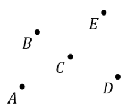

A figura acima mostra vários exemplos de pontos. Você pode notar que chamamos cada um deles de uma **letra maiúscula** . É a notação mais comum. Uma outra característica do ponto é que ele **não possui dimensão** . Dizemos que é um elemento adimensional. 

Esse fato permite usarmos o ponto para identificar uma localização com bastante acuracidade. Por fim, vale a pena você anotar aí que não podemos dividir um ponto. Isso mesmo, você não pode "quebrar" um ponto em dois pontos. 

## Reta 

##### Por sua vez, **a reta vai ser formada pela união de infinitos pontos** . 

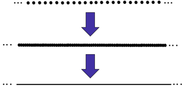

Na imagem acima, tentei representar vários pontos se aglomerando até formarem uma reta (rsrs). Vamos lá! _Quais são as características de uma reta?_ Primeiro: **ela é unidimensional** . Enquanto um ponto não possui dimensão (é adimensional), a reta agora é unidimensional.

---

<!-- pagina: 4 -->

**Equipe Exatas Estratégia Concursos Aula 10** 

Segundo: **ela é infinita para ambos os lados** ! Ou seja, ela segue indefinidamente para qualquer um dos lados (apesar de não ser obrigatório, usamos reticências nas "extremidades" da reta para expressar esse fato). 

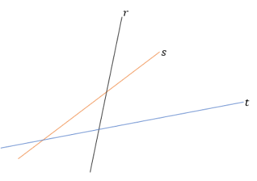

A imagem acima mostra a notação que usamos para as retas: **letras minúsculas** . Enquanto nos pontos usamos letras maiúsculas, nas retas são letras minúsculas! Vale ressaltar que o alfabeto que estamos utilizando de referência aqui é o latino (Aa, Bb, Cc, ..., Zz). 

Agora, vou contar para vocês uma novidade. Em algumas situações, a reta terá extremidade(s). Logo, ela não se prolongará até ao infinito nos dois lados. Quando ela tiver **uma extremidade** , a chamaremos de **semirreta** . Por sua vez, quando ela tiver as **duas extremidades** , será apenas um **segmento de reta** . 

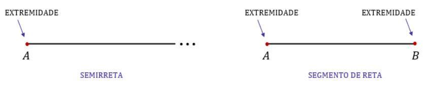

Normalmente, representamos o segmento de reta com extremidades A e B por 𝐴𝐵̅̅̅̅ . Além desse detalhe, existe mais uma classificação que leva em conta se duas ou mais retas estão se encontrando. _Como assim?!_ 

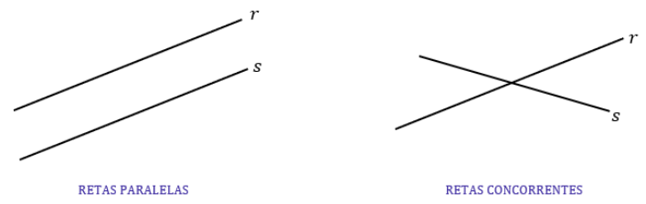

As **retas paralelas não se encontram** , enquanto as **retas concorrentes sim** . Essas últimas possuem **um único ponto em comum** . Duas retas que se encontram em mais de um ponto necessariamente vão se encontrar em todos os demais e serão chamadas retas coincidentes!

---

<!-- pagina: 5 -->

**Equipe Exatas Estratégia Concursos Aula 10** 

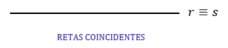

##### **É como se uma reta estivesse em cima da outra** !! 

Para finalizar essa parte introdutória de retas, anote aí a seguinte propriedade: 

- Sempre conseguiremos traçar uma reta por quaisquer dois pontos. Essa reta será única. 

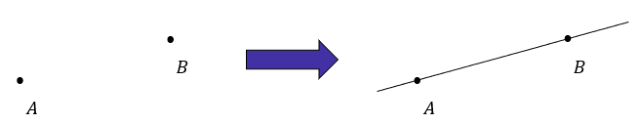

## Ângulos 

Um ângulo é formado pelo **encontro de duas semirretas** . Esse encontro pode se dar de várias formas. Veja. 

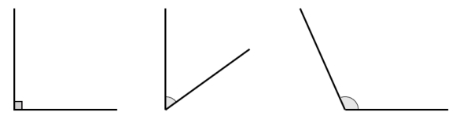

Perceba que dependendo de como arranjamos as semirretas, vamos ter aberturas diferentes. Nós podemos **quantificar essa abertura e expressar o resultado em graus (°) ou radianos (rad)** . 

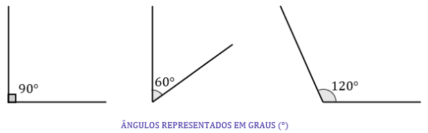

Agora olhe os mesmos ângulos, mas expressados em radianos. 

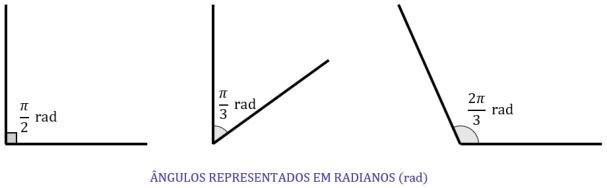

---

<!-- pagina: 6 -->

**Equipe Exatas Estratégia Concursos Aula 10** 

São duas maneiras bem diferentes de expressarmos os ângulos, concorda? Muitos alunos possuem facilidade quando estão trabalhando com graus (°), mas quando aparece um ângulo em radianos (rad), já ficam assustados. Moçada, apenas uma regra de três simples separa um ângulo em radiano de um ângulo em grau (ou vice-versa). Para isso, lembre-se sempre do seguinte: 

##### 𝟏𝟖𝟎° equivalem a 𝝅 rad. 

Sabendo disso, é só usar uma regra de três para converter um em outro. Vamos fazer alguns exemplos. 

##### **1) Converter 60° em radianos.** 

Você pensa assim: se 180° equivalem a 𝜋 rad, então 60° equivalem a 𝑥 . Com isso, podemos esquematizar: 

Multiplicando cruzado. 

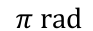

<!-- Start of picture text -->
𝜋 rad <!-- End of picture text -->

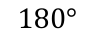

<!-- Start of picture text -->
180° <!-- End of picture text -->

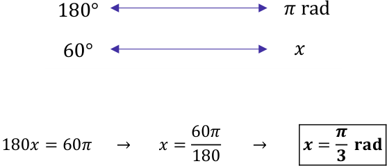

<!-- Start of picture text -->
180° 𝜋 rad 60°  𝑥 180𝑥= 60𝜋     →      𝑥=  60𝜋        →       𝒙=  𝝅  𝐫𝐚𝐝 180 𝟑 <!-- End of picture text -->

Logo, podemos dizer que 60° equivalem a 𝜋/3 rad. 

𝟓𝝅 **2) Converter rad em graus.** 𝟔 

5𝜋 Pensamento muito semelhante, moçada! Se 180° equivalem a 𝜋 rad, então 𝑥 equivalem a rad. 6

---

<!-- pagina: 7 -->

**Equipe Exatas Estratégia Concursos Aula 10** 

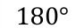

<!-- Start of picture text -->
180° <!-- End of picture text -->

180° 𝜋 rad 5𝜋 𝑥 rad 6 

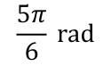

<!-- Start of picture text -->
5𝜋  rad 6 <!-- End of picture text -->

<!-- Start of picture text -->
𝑥 <!-- End of picture text -->

Multiplicando cruzado. 

𝑥∙𝜋= 180 ∙5𝜋 →      𝑥= 30 ∙5     → <u>𝑥</u> = 150° 6 𝟓𝝅 **Logo, rad equivalem a 150°.** 𝟔 

**(CBM-RO/2022)** <mark>O ângulo de 1 radiano equivale, em graus, a um ângulo</mark> 

<mark>A) menor que 15°. B) maior ou igual a 60°. C) maior ou igual a 15° e menor que 30°. D) maior ou igual a 30° e menor que 45°. E) maior ou igual a 45° e menor que 60°</mark> 

##### **Comentários:** 

Para treinar, moçada! Ora, se 180° equivalem a 𝜋 rad, então x graus equivalem a 1 rad. 

𝜋 rad 180° 𝑥 1 rad Multiplicando cruzado. 𝑥∙𝜋= 180 ∙1           →           𝑥=180 →            𝑥≅57,29° 𝜋 **Gabarito:** LETRA E. 

Agora que sabemos o que é um ângulo e suas unidades, vamos entrar nas nomenclaturas e classificações. 

- **Ângulo Raso:** É o ângulo de 180° ( 𝜋 rad ). 

- **Ângulo Reto:** É o ângulo de 90° ( 𝜋/2 rad )

---

<!-- pagina: 8 -->

**Equipe Exatas Estratégia Concursos Aula 10** 

- **Ângulo Agudo:** Todo ângulo maior que 0° e menor que 90°. 

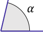

<!-- Start of picture text -->
𝛼 <!-- End of picture text -->

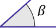

<!-- Start of picture text -->
𝛽 <!-- End of picture text -->

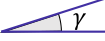

<!-- Start of picture text -->
𝛾 <!-- End of picture text -->

α, β e γ são ângulos agudos. 

- **Ângulo Obtuso:** Todo ângulo maior que 90° e menor que 180°. 

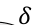

<!-- Start of picture text -->
𝛿 <!-- End of picture text -->

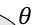

<!-- Start of picture text -->
𝜃 <!-- End of picture text -->

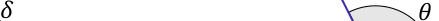

<!-- Start of picture text -->
𝛿 𝜃 <!-- End of picture text -->

𝛿e 𝜃 são ângulos obtusos. 

- **Ângulos Complementares** : Dois ângulos são chamados de complementares quando sua soma é igual a 90°. 

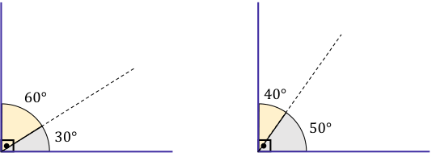

<!-- Start of picture text -->
60°   40° 50° 30° <!-- End of picture text -->

Por exemplo, 60° e 30° são ângulos complementares, já que 30° + 60° = 90° . Da mesma forma, 40° e 50° também são. Beleza?!! 

- **Ângulos Suplementares** : Dois ângulos são chamados de suplementares quando sua soma é igual a 180°. 

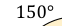

<!-- Start of picture text -->
150° <!-- End of picture text -->

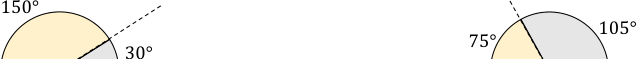

<!-- Start of picture text -->
150° 105° 75° 30° <!-- End of picture text -->

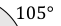

<!-- Start of picture text -->
105° <!-- End of picture text -->

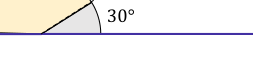

<!-- Start of picture text -->
30° <!-- End of picture text -->

Observe que 150° e 30° são ângulos suplementares, uma vez que sua soma é igual a 180°. Da mesma forma, 75° e 105° também são. 

- **Ângulos Replementares:** Dois ângulos são chamados de replementares quando sua soma é 360°.

---

<!-- pagina: 9 -->

**Equipe Exatas Estratégia Concursos Aula 10** 

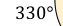

<!-- Start of picture text -->
330° <!-- End of picture text -->

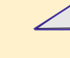

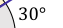

<!-- Start of picture text -->
30° <!-- End of picture text -->

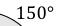

<!-- Start of picture text -->
150° <!-- End of picture text -->

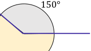

<!-- Start of picture text -->
150° <!-- End of picture text -->

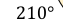

<!-- Start of picture text -->
210° <!-- End of picture text -->

- 330° e 30° são ângulos replementares pois 330° + 30° = 360°. 

- 210° e 150° também são ângulos replementares, já que 210° + 150° = 360° . 

## Circunferência 

A primeira figura geométrica que estudaremos na aula de hoje será a circunferência. Particularmente, acho ela bem interessante, já que é uma **forma bem corriqueira** . Lembre-se de uma pizza, de um pneu, de uma moeda... todos eles possuem um formato circular (circunferencial). Com um pouco mais de rigor, nós definimos uma circunferência como sendo **o conjunto dos pontos equidistantes de um centro (C)** . 

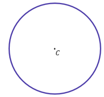

## **Raio, Diâmetro e Cordas** 

Quando estamos falando do raio (R) de uma circunferência, estamos falando da **distância entre seus pontos e o centro** . Por sua vez, corda é o segmento de reta que une dois pontos quaisquer de uma circunferência. 

Acontece que **quando essa corda passa pelo centro da circunferência** , **nós a chamamos de diâmetro** <u>. Para</u> um melhor entendimento, vamos dar uma olhada nas figuras abaixo! 

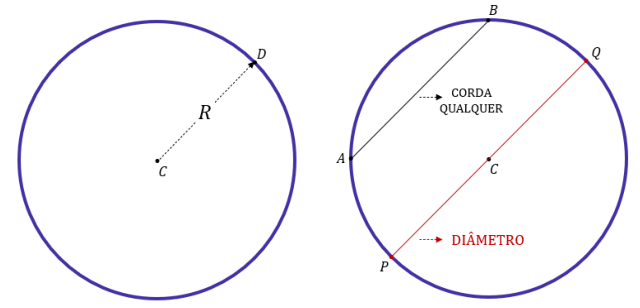

---

<!-- pagina: 10 -->

**Equipe Exatas Estratégia Concursos Aula 10** 

A figura de esquerda ilustra **o raio** . É exatamente a distância entre o centro e um ponto da circunferência. Na situação retratada, chamamos esse ponto de D. Já na circunferência da direita, quero mostrar pra você a diferença entre o diâmetro e uma corda qualquer. 

Pessoal, para ser diâmetro, **o segmento de reta precisa passar pelo centro da circunferência** . Caso não passe (como o segmento AB), teremos uma corda. É verdade que o diâmetro não deixa de ser uma corda, mas é uma "corda especial", pois ela **é a corda de maior comprimento** ! 

Se olharmos com atenção para a figura, vemos que o comprimento do diâmetro (ou simplesmente diâmetro a partir de agora) vale exatamente **duas vezes o raio** . Por esse motivo, escrevemos que: 

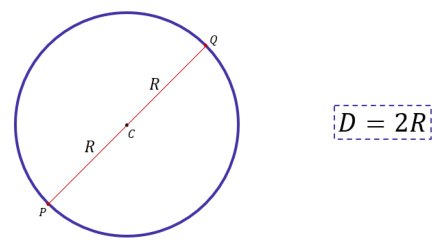

**Raio:** distância do centro até um ponto da circunferência. 

**Corda:** segmento de reta que liga dois pontos quaisquer da circunferência. 

**Diâmetro:** corda que passa pelo centro da circunferência. **Mede o dobro do raio (2R).** 

**(PREF. PACUJÁ/2019)** Qual o diâmetro de uma circunferência cuja soma do raio com o diâmetro e 37,5 cm? A) 24 cm. 

B) 27 cm. C) 25 cm. D) 26 cm. E) 28 cm.

---

<!-- pagina: 11 -->

**Equipe Exatas Estratégia Concursos Aula 10** 

##### **Comentários:** 

De acordo com o enunciado, temos que 𝐑+ 𝐃= 𝟑𝟕, 𝟓 . 

Como sabemos que o **D = 2R** , ou, **R = D/2** , podemos substituir: 

𝐷 + 𝐷= 37,5       →      3𝐷= 75       → <u>𝑫</u> = 𝟐𝟓 2 

**Gabarito:** LETRA C 

## **Comprimento de uma Circunferência** 

Lembra que no tópico passado eu falei sobre comprimento do arco?  Que era tipo a medida da borda da fatia da pizza. Aqui, no comprimento da circunferência, estamos nos referindo **a medida da borda de toda a pizza** e não apenas da fatia! _Eita, tanta pizza que já tá dando fome! (rsrs)._ Existe uma figura que eu gosto bastante para explicar o comprimento da circunferência, veja: 

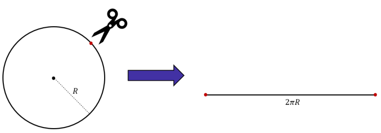

Ficou um pouco melhor de visualizar? Para tentar explicar de uma outra forma, imagine uma formiga no ponto vermelho, onde a tesoura vai cortar! **A distância que ela andaria para completar a volta** (andando apenas sobre a linha preta) é exatamente igual ao comprimento da circunferência (C). Esse valor é dado por uma fórmula bem conhecida que já adiantei um pouco na imagem acima, anota aí! 

𝐶= 2𝜋𝑅 ou 𝐶= 𝜋𝐷 

---

<!-- pagina: 12 -->

**Equipe Exatas Estratégia Concursos Aula 10** 

**(PREF. NOVA HAMBURGO/2024)** A solução da equação de primeiro grau 5x – 21 = 2x + 15 representa o diâmetro de uma circunferência. Qual é o comprimento dessa circunferência? Utilize π = 3. 

A) 12. 

B) 36. 

C) 72. 

D) 108. 

E) 432. 

##### **Comentários:** 

Inicialmente, temos que **resolver a equação de 1º grau** . Para isso, precisamos isolar o x em um dos lados: 

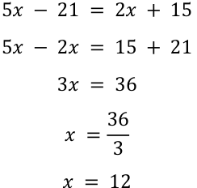

Logo, o diâmetro da circunferência é **12 unidades de medida** . Para calcular o comprimento da circunferência, basta **multiplicar o diâmetro pelo valor de π** , que é dado como 3. Portanto, temos: 

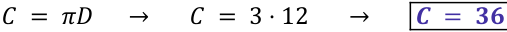

Logo, a alternativa correta é a letra B. 

**Gabarito:** LETRA B. 

## **Área de uma Circunferência** 

Quando calculamos a área de uma figura plana, estamos tentando **quantificar o tamanho da região delimitada por ela** . Pode ser um conceito meio abstrato, mas sempre usamos no dia a dia. Se conhecemos o raio da circunferência, podemos calcular sua área. 

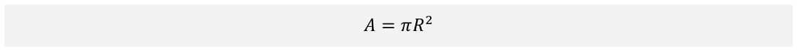

Sugiro muito que guardem essa fórmula no coração. Além disso, a dica suprema é: **faça muitos exercícios** que envolvam cálculos de áreas de circunferência.

---

<!-- pagina: 13 -->

**Equipe Exatas Estratégia Concursos Aula 10** 

**(CIGA-SC/2023)** A prefeitura de uma cidade do interior está projetando uma praça circular com brinquedos para as crianças, além de bancos e árvores. A praça terá um diâmetro de 700 metros, logo o valor da área da praça, em quilômetros quadrados, será aproximadamente de: Utilize 𝜋 = 3,14 . A) 3,850 km². 

B) 0,385 km². C) 38,465 km². ==5460== D) 1,539 km². E) 15,386 km². 

##### **Comentários:** 

Note que ele deu **o diâmetro da circunferência** (700 m). Lembre-se que **o raio é metade do diâmetro** . Logo, 

𝑅= 350 m = 0,35 km 

Sendo assim, **a área da praça** será: 

𝐴= 𝜋𝑅2 →       𝐴= 3,14 ∙0,352 →      𝐴= 3,14 ∙ 0,1225    → 𝑨= 𝟎, 𝟑𝟖𝟒𝟔𝟓 𝐤𝐦² 

O resultado mais próximo do resultado encontrado está na alternativa C. 

**Gabarito:** LETRA B. 

Para finalizar essa parte de circunferência, gostaria de comentar com vocês sobre **a área de uma coroa** ! É um tipo de problema envolvendo áreas de circunferências bem comum! Por isso, é bom estarmos atentos. Imagine a seguinte situação: 

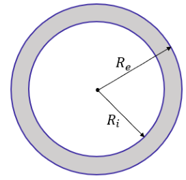

---

<!-- pagina: 14 -->

**Equipe Exatas Estratégia Concursos Aula 10** 

A região destacada acima é o que chamamos de **coroa circular** . _Como fazemos para calcular sua área?_ Note que temos uma **circunferência externa de raio** 𝑹𝒆 e uma **circunferência interna de raio** 𝑹𝒊 . Podemos esquematizar a situação da seguinte forma: 

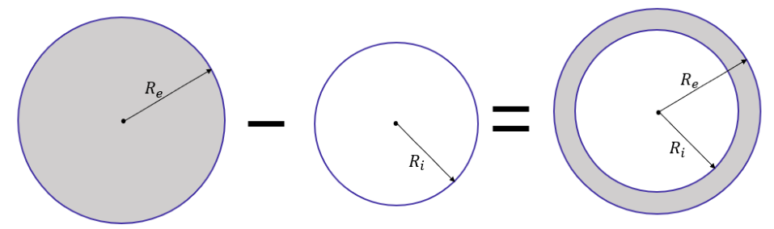

Assim, para calcular a área da coroa, devemos subtrair a área do círculo maior (externo) da área do círculo menor (interno), tudo bem?! Assim, 

𝐴𝑐𝑜𝑟𝑜𝑎 = 𝐴𝑒𝑥𝑡𝑒𝑟𝑛𝑜 −𝐴𝑖𝑛𝑡𝑒𝑟𝑛𝑜 →      𝐴𝑐𝑜𝑟𝑜𝑎 = 𝜋𝑅𝑒2 −𝜋𝑅𝑖2 → 𝑨𝒄𝒐𝒓𝒐𝒂 = 𝝅(𝑹𝟐𝒆 −𝑹𝟐𝒊 ) 

**(PREF. JOAO PESSOA/2024** ) Uma piscina no formato circular será construída em um clube e no centro dela terá uma ilha, também circular, como ilustrado na imagem abaixo. 

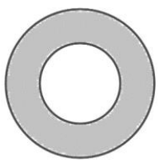

Sabendo que o círculo maior possui 20 metros de diâmetro e o menor 10 metros de diâmetro. A área da piscina (parte cinza) será de: (Use π = 3,14) 

A) 75 m² 

B) 31,4 m² C) 235,5 m² D) 942 m² 

**Comentários:**

---

<!-- pagina: 15 -->

**Equipe Exatas Estratégia Concursos Aula 10** 

Questão para calcular **a área da coroa** ! Vamos lá! Primeiro, identificando as informações do enunciado: 

𝜋= 3,14            ;           𝑅𝑒 = 10 cm         ;         𝑅𝑖 = 5 cm Assim, 𝐴𝑐𝑜𝑟𝑜𝑎 = 𝐴𝑒𝑥𝑡𝑒𝑟𝑛𝑜 −𝐴𝑖𝑛𝑡𝑒𝑟𝑛𝑜 →      𝐴𝑐𝑜𝑟𝑜𝑎 = 𝜋𝑅𝑒2 −𝜋𝑅𝑖2 →      𝐴𝑐𝑜𝑟𝑜𝑎 = 3,14 ∙102 −3,14 ∙52 𝐴𝑐𝑜𝑟𝑜𝑎 = 314 −78,5        →        𝑨𝒄𝒐𝒓𝒐𝒂 = 𝟐𝟑𝟓, 𝟓 𝐦² **Gabarito:** LETRA C. 

## Triângulos 

Agora falaremos um pouco sobre os triângulos. De modo simplificado, podemos definir um triângulo como uma **figura plana formada por três segmentos de reta** . Acontece que esses segmentos de reta não são dispostos de qualquer maneira. Eles devem formar três lados e três ângulos bem definidos, tudo bem? 

Assim como na circunferência, nesse tópico falaremos sobre perímetros e áreas, mas tudo no seu devido tempo! Primeiro, devemos aprender **quais os tipos de triângulo existem** e suas características. Vamos?! 

## **Classificações** 

Quando estamos olhando apenas para o lado, podemos classificar os triângulos de três maneiras. 

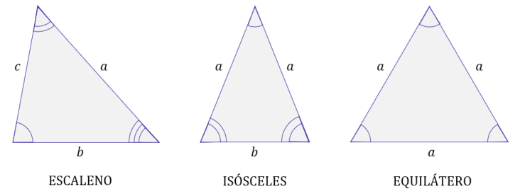

- **Escaleno:** todo triângulo que possui os **três lados distintos** ! 𝑎≠𝑏≠𝑐 . Como consequência, os ângulos opostos a cada um desses lados também serão diferentes. 

- **Isósceles:** triângulo que possui **dois lados iguais** . Os ângulos opostos a esses lados também serão idênticos. 

- **Equilátero:** triângulo com **todos os lados iguais** . Assim, todos os ângulos internos desse tipo de triângulo também são congruentes, medindo exatamente 60°.

---

<!-- pagina: 16 -->

**Equipe Exatas Estratégia Concursos Aula 10** 

Já quando estamos olhando para os ângulos internos, podemos classificar os triângulos da seguinte forma: 

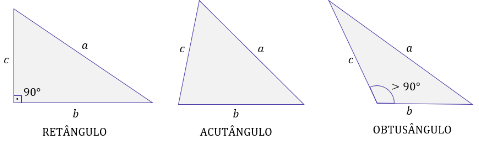

- **Retângulo: um dos ângulos do triângulo é um ângulo reto, isto é, de 90°** . Talvez, esse é o triângulo mais comum em provas. Afinal, é nele que utilizamos o famoso "Teorema de Pitágoras". Estudaremos esse triângulo com mais detalhes em breve. 

- **Acutângulo: todos os ângulos do triângulo são agudos** <u>, isto é, maiores que 0° e menores que 90°.</u> 

- **Obtusângulo: um dos ângulos do triângulo é um ângulo obtuso** <u>, isto é, maior que 90° e menor que 180°.</u> 

## **Ângulos Internos e Externos** 

Feito esse parêntese para o estudo dos triângulos retângulos, vamos voltar a analisar os triângulos em geral. Pessoal, guardem aí com vocês o seguinte: **a soma dos ângulos internos de um triângulo é sempre 180°.** 

#### **A soma dos ângulos internos de um triângulo é sempre 180°!** 

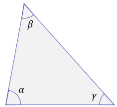

𝜶+ 𝜷+ 𝜸= 𝟏𝟖𝟎°

---

<!-- pagina: 17 -->

**Equipe Exatas Estratégia Concursos Aula 10** 

Lembre-se que no triângulo equilátero, todos os lados são iguais e que, com isso, temos que **todos os ângulos internos também são** ! Em uma imagem, podemos representar assim: 

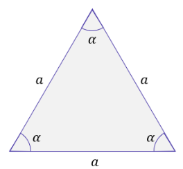

Como **a soma dos ângulos internos de um triângulo é sempre 180°** , temos que: 

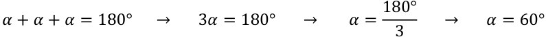

É por esse motivo que, sempre que estamos trabalhando com triângulos equiláteros, qualquer um de seus **° ângulos internos** **<u>valerá 60</u>** <u>. Por vezes, também falamos de</u> **ângulos externos** <u>. Existe um resultado bastante</u> interessante que podemos obter tendo em mente o que discutimos até aqui. Veja a figura abaixo. 

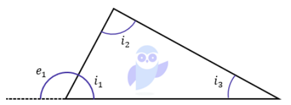

𝑖1, 𝑖2 e 𝑖3 representam os três ângulos internos do triângulo e 𝑒1 é um ângulo externo. Sabemos que a soma dos ângulos internos de um triângulo é 180°. Assim, 

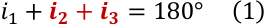

Além disso, se você olhar bem para o ângulo interno 1 (𝑖1) e para o ângulo externo 1 (𝑒1) , é possível ver que eles formam um **ângulo raso** <u>. Dessa forma,</u> 

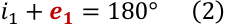

Quando comparamos as duas expressões, percebemos que a parte vermelha em (1) deve ser igual a parte vermelha em (2) . 

---

<!-- pagina: 18 -->

**Equipe Exatas Estratégia Concursos Aula 10** 

**Conclusão:** em todo triângulo, **a medida de um ângulo externo é igual à soma das medidas dos ângulos internos não adjacentes a ele** . Já que estamos falando de ângulos externos, qual seria a soma dos ângulos externos de um triângulo? 

Lembre-se que um ângulo externo em um triângulo sempre será igual à soma dos dois ângulos internos não adjacentes a ele. Assim, podemos escrever: 

Somando as três equações acima membro a membro (e chamando essa soma de 𝑆𝑒 ), ficamos com: 

Reorganizando: 

Pessoal, 𝑖1 + 𝑖2 + 𝑖3 é a soma dos ângulos internos. Quanto vale essa soma?! Oras, vale 180°!! 

Note, portanto, que **a soma dos ângulos externos de um triângulo vale 360°.** No final da nossa aula, veremos que podemos generalizar esse resultado para qualquer polígono convexo. No entanto, nesse momento, quero que você guarde apenas que: 

---

<!-- pagina: 19 -->

**Equipe Exatas Estratégia Concursos Aula 10** 

**(PREF. CONDADO/2023)** Um triângulo acutângulo é aquele que apresenta: 

A) um lado maior que os outros dois. 

B) dois lados que formam um ângulo agudo. 

C) dois lados que formam um ângulo obtuso. 

D) três ângulos agudos. 

E) três ângulos obtusos. 

##### **Comentários:** 

Lembre-se que um triângulo acutângulo é todo triângulo que possui **três ângulos agudos** ! Isto é, são todos **maiores que 0° e menores que 90°.** 

**Gabarito:** LETRA D. 

## **Área de um Triângulo** 

Pessoal, esse é **um dos tópicos mais importantes dessa aula** . Há diversas maneiras de calcularmos a área de um triângulo. De acordo com as informações que tivermos, usaremos uma fórmula ou outra. 

##### **- Quando temos a base e a altura do triângulo.** 

<!-- Start of picture text -->
ℎ <!-- End of picture text -->

<!-- Start of picture text -->
𝑏 <!-- End of picture text -->

- **"h" representa a medida da** **<u>altura</u>** , enquanto **"b" representa a medida da** **<u>base</u>** . Quando tivermos essas informações, podemos calcular a área de um triângulo por meio da seguinte fórmula: 

<!-- Start of picture text -->
𝐴=  𝑏∙ℎ 2 <!-- End of picture text -->

##### - **Quando o triângulo é retângulo**

---

<!-- pagina: 20 -->

**Equipe Exatas Estratégia Concursos Aula 10** 

<!-- Start of picture text -->
𝑎 <!-- End of picture text -->

<!-- Start of picture text -->
𝑎 𝑐 𝑏 <!-- End of picture text -->

<!-- Start of picture text -->
𝑐 <!-- End of picture text -->

<!-- Start of picture text -->
𝑏 <!-- End of picture text -->

Perceba que quando o triângulo é retângulo, a altura relativa à base "b" é o próprio cateto "c". Assim, 

##### **- Quando o triângulo é equilátero** 

<!-- Start of picture text -->
𝐿 <!-- End of picture text -->

<!-- Start of picture text -->
𝐿 2 <!-- End of picture text -->

<!-- Start of picture text -->
𝐿 <!-- End of picture text -->

<!-- Start of picture text -->
ℎ <!-- End of picture text -->

<!-- Start of picture text -->
𝐿 2 <!-- End of picture text -->

Quando o triângulo é equilátero, **a altura relativa a qualquer um dos lados, vai sempre dividir esse lado ao** **<u>meio</u>** <u>. Agora, observe o triângulo retângulo em destaque. Com o teorema de Pitágoras, podemos determinar</u> a altura "h" em função do lado "L". 

Com isso, podemos usar a fórmula que vimos anteriormente, substituindo o valor da altura "h" por esse que acabamos de encontrar. 

Portanto, observe que existe uma fórmula "pronta" para calcularmos a área de um triângulo equilátero. **Se você sabe apenas o lado, já pode calcular a área** . No entanto, na prática, você não precisa memorizá-la. Se conhece a fórmula 𝐴= 𝑏ℎ/2 e o Teorema de Pitágoras, **poderá deduzi-la a qualquer tempo** . 

##### **- Quanto temos apenas os lados do triângulo.**

---

<!-- pagina: 21 -->

**Equipe Exatas Estratégia Concursos Aula 10** 

<!-- Start of picture text -->
𝑐 <!-- End of picture text -->

<!-- Start of picture text -->
𝑏 <!-- End of picture text -->

<!-- Start of picture text -->
𝑎 <!-- End of picture text -->

Nessas situações, usaremos a famosa **<u>fórmula de Heron</u>** <u>. Não é tão comum à sua cobrança em provas, mas</u> é bom estarmos espertos. Quando você tiver todos os lados, mas não souber os ângulos nem as alturas, a fórmula abaixo resolve sua vida: 

Não é uma fórmula muito amigável, eu sei. Sorte nossa que **ela cai muito pouco** . Aqui, o **"p" representa o semiperímetro** , que pode ser determinado por meio da fórmula abaixo! 

Peço que não se preocupe com a demonstração, pois **o custo-benefício de fazê-la aqui é quase nulo** . Nessas horas, vamos tentar ser o mais prático e objetivo possível. 

**(PREF. SJC/2023)** Um triângulo equilátero tem perímetro igual a 36 dm. A área da região interior a esse triângulo mede A) 6√2 dm² B) 36√2 dm² C) 36√3 dm² D) 72√2 dm² E) 72√3 dm² 

##### **Comentários:** 

Um triângulo equilátero é um triângulo com **os três lados iguais** . Se **o perímetro desse triângulo é 36 dm** , podemos escrever: 

3𝐿= 36       →      𝐿= 12 dm 

Pronto. "L" é o lado do nosso triângulo. 

Vimos que **a área de um triângulo equilátero** pode ser encontrada por:

---

<!-- pagina: 22 -->

**Equipe Exatas Estratégia Concursos Aula 10** 

<!-- Start of picture text -->
𝐴=  𝐿2√3 4 Substituindo "L", ficamos com: 𝐴=  122 ⋅√3          →           𝐴=  144√3          →          𝑨= 𝟑𝟔√𝟑 4 4 Gabarito:  LETRA C. <!-- End of picture text -->

## **Triângulo Retângulo** 

O triângulo retângulo é tão importante que estudaremos ele em separado! Lembrem-se que chamamos de 𝜋 triângulo retângulo qualquer triângulo que possua **um de seus ângulos igual a 90 graus** ou radianos. 2 

- O lado c é chamado de **hipotenusa** . **Ele é o maior dos lados** e está oposto ao ângulo de 90°. 

- Os lados 𝒂 **e** 𝒃 **são os catetos** . 

   - Com relação ao ângulo 𝛼 , 𝑎 é o cateto oposto e 𝑏 é o cateto adjacente. 

   - Com relação ao ângulo 𝛽 , 𝑏 é o cateto oposto e 𝑎 é o cateto adjacente. 

## **Relações Trigonométricas - Seno, Cosseno e Tangente** 

Moçada, eu sei que essa é uma parte da trigonometria e por isso não vou me aprofundar muito, mas vale a pena você saber as seguintes relações trigonométricas para a sua prova de geometria plana! 

- **Seno** 

<!-- Start of picture text -->
sen α =  cateto oposto hipotenusa • Cosseno cos α =  cateto adjacente hipotenusa <!-- End of picture text -->

---

<!-- pagina: 23 -->

**Equipe Exatas Estratégia Concursos Aula 10** 

- **Tangente** 

cateto oposto tan α = cateto adjacente 

- **Relação Fundamental** 

sen2 α + cos2 α = 1 

## **Teorema de Pitágoras** 

O Teorema de Pitágoras é um grande clássico dos nossos estudos, não é verdade? Desde muito cedo, quando crianças, escutamos falar desse teorema. Vamos rever o que ele diz! 

#### **A soma dos quadrados dos catetos é igual ao quadrado da hipotenusa.** 

Matematicamente, podemos escrever: 

𝑐2 = 𝑎2 + 𝑏2 

**(PREF. PIRASSUNUNGA/2023)** Um espaço reservado para uma exposição de quadros possui o formato de um triângulo retângulo, cujos catetos medem 30 decímetros e 40 decímetros. Dessa forma, o perímetro do espaço reservado para essa exposição, em metros, é igual a: 

A) 10. B) 12. C) 15. D) 17.

---

<!-- pagina: 24 -->

**Equipe Exatas Estratégia Concursos Aula 10** 

E) 19. 

##### **Comentários:** 

Temos um triângulo retângulo em que **os catetos são 30 e 40 dm** . Para o cálculo do perímetro, precisamos também da hipotenusa. Sendo assim, podemos usar o **Teorema de Pitágoras** para encontrá-la: 

𝑐2 = 302 + 402 →         𝑐2 = 900 + 1600      →       𝑐2 = 2500        → <u>𝑐</u> = 50 dm 

Temos todos os lados, **o perímetro é dado pela soma deles** . 

Perímetro = 𝑎+ 𝑏+ 𝑐 

Perímetro = 30 + 40 + 50 

<u>𝐏𝐞𝐫í𝐦𝐞𝐭𝐫𝐨</u> = 𝟏𝟐𝟎 𝐝𝐦 

Como queremos o resultado em metros, devemos dividir o resultado por 10. 𝐏𝐞𝐫í𝐦𝐞𝐭𝐫𝐨= 𝟏𝟐 𝐝𝐦 . 

**Gabarito:** LETRA B. 

## **Lei do Senos e a Lei dos Cossenos** 

Para aproveitar que falamos um pouco de seno e cosseno nessa aula, quero conversar com vocês sobre duas leis que relacionam as medidas dos lados de um triângulo com os senos e cossenos dos ângulos internos. Considere o triângulo genérico abaixo. 

<!-- Start of picture text -->
𝐴 <!-- End of picture text -->

<!-- Start of picture text -->
𝐵 <!-- End of picture text -->

<!-- Start of picture text -->
𝑐 <!-- End of picture text -->

<!-- Start of picture text -->
𝑎 <!-- End of picture text -->

<!-- Start of picture text -->
𝑏 <!-- End of picture text -->

<!-- Start of picture text -->
𝐶 <!-- End of picture text -->

De acordo com a lei dos senos, a razão entre o lado e o seno do ângulo oposto é uma constante no triângulo. Dessa forma, podemos escrever que:

---

<!-- pagina: 25 -->

**Equipe Exatas Estratégia Concursos Aula 10** 

|𝑎|𝑏||𝑐|
|---|---|---|---|
|sen  |= sen|𝐵 |= sen 𝐶|

Para entender melhor como pode ser a cobrança desse tema, vamos fazer uma questão. 

**(PREF. PATROCÍNIO/2023)** Considere o triângulo ABC na figura, cuja medida do lado BC é 9 cm. Utilizando os valores aproximados de seno dos ângulos agudos dados na tabela, indique a alternativa que contém a medida aproximada do lado AB. 

A) 6,8 cm. B) 7,6 cm. C) 8,5 cm. D) 10,3 cm. 

##### **Comentários:** 

Observe que podemos usar a **Lei dos Senos** para encontrar a medida do lado AB. 

Substituindo com as informações que temos: 

**Gabarito:** LETRA B.

---

<!-- pagina: 26 -->

**Equipe Exatas Estratégia Concursos Aula 10** 

Por sua vez, **a lei dos cossenos** vai relacionar os lados de um triângulo qualquer com o cosseno de um dos ângulos. Guarde com você o seguinte: 

<!-- Start of picture text -->
𝐵 <!-- End of picture text -->

<!-- Start of picture text -->
𝐴 <!-- End of picture text -->

<!-- Start of picture text -->
𝑐 <!-- End of picture text -->

<!-- Start of picture text -->
𝑏 <!-- End of picture text -->

<!-- Start of picture text -->
𝑎 <!-- End of picture text -->

<!-- Start of picture text -->
𝐶 <!-- End of picture text -->

<!-- Start of picture text -->
𝑎 2 = 𝑏 2 + 𝑐 2 −2𝑏𝑐∙ cos  𝑏 2 = 𝑎 2 + 𝑐 2 −2𝑎𝑐∙ cos B ෡ 𝑐 2 = 𝑎 2 + 𝑏 2 −2𝑎𝑏∙ cos Ĉ <!-- End of picture text -->

Observe o esquema abaixo para entender melhor as expressões. 

<!-- Start of picture text -->
"a" é o lado oposto ao ângulo  <!-- End of picture text -->

<!-- Start of picture text -->
𝑎 2 = 𝑏 2 + 𝑐 2 −2𝑏𝑐∙ 𝑐𝑜𝑠 Â <!-- End of picture text -->

<!-- Start of picture text -->
b e c são os demais lados <!-- End of picture text -->

Eu sei que pode estar pairando a dúvida sobre de onde vem essa expressão. A demonstração tanto da lei dos senos quanto da dos cossenos tem custo-benefício mínimo. Para sua prova de concurso, precisará apenas aplicá-la. Por isso, vamos ver uma questão para sentir na prática como funciona essa tal de lei dos cossenos. 

**(PREF. CATURITÉ/2023)** O professor Pitagorisvaldo estava revisando Geometria quando se deparou com a seguinte situação: Num plano, seja ABC um triângulo tal que 𝐵Â𝐶= 150° , 𝐴𝐶̅̅̅̅ =√3 u.c. e 𝐴𝐵̅̅̅̅ = 1 u.c. Qual 2 a medida, em unidades de comprimento, do lado BC? A) √13/2 B) √11/2 C) √15/2 D) √17/2 E) √19/2 

**Comentários:** Vamos desenhar o triângulo do enunciado! 

<!-- Start of picture text -->
𝐵 <!-- End of picture text -->

<!-- Start of picture text -->
𝐴 √3 150° 2 𝐶 <!-- End of picture text -->

<!-- Start of picture text -->
1 <!-- End of picture text -->

<!-- Start of picture text -->
𝑥 <!-- End of picture text -->

---

<!-- pagina: 27 -->

**Equipe Exatas Estratégia Concursos Aula 10** 

Essa é uma situação clássica em que podemos aplicar a **Lei dos Cossenos** ! 

**Gabarito:** LETRA A. 

## Quadriláteros 

Nessa seção, mostrarei para vocês os quadriláteros mais conhecidos. Serei bem objetivo e quero que vocês deem especial atenção para as fórmulas de área. Combinado?! 

## **Retângulo** 

<!-- Start of picture text -->
𝑏 <!-- End of picture text -->

<!-- Start of picture text -->
𝑎 <!-- End of picture text -->

<!-- Start of picture text -->
𝑎 <!-- End of picture text -->

<!-- Start of picture text -->
ÁREA = 𝑎∙𝑏 <!-- End of picture text -->

<!-- Start of picture text -->
𝑏 <!-- End of picture text -->

#### **Características Principais:** 

- Comprimento: "b"; Largura: "a"; 

- Ângulos internos são iguais a 90°; 

- Lados opostos são iguais

---

<!-- pagina: 28 -->

**Equipe Exatas Estratégia Concursos Aula 10** 

**(CBM-PA/2024)** “...e, graças à atuação do corpo de bombeiros, apenas 5% da reserva florestal foi perdida no incêndio”. 

Considerando-se que o formato da reserva florestal citada no trecho da reportagem precedente corresponda a um retângulo de 800 metros de largura por 1.200 metros de comprimento, conclui-se que a área queimada no incêndio, em m², corresponde a 

A) 760. 

B) 1.140. 

C) 48.000. 

D) 192.000. 

E) 480.000. 

##### **Comentários:** 

O primeiro passo é calcular a área da reserva florestal. Como o formato dela é **<u>retangular</u>** , basta multiplicar a largura pelo comprimento. 

De acordo com os bombeiros, **5% da reserva foi perdida no incêndio** . 

𝐴 = 960.000 ⋅5%     →     𝐴 = 960.000 ⋅5 → 𝑨 = 𝟒𝟖. 𝟎𝟎𝟎 𝑝 𝑝 100 𝒑 

**Gabarito:** LETRA C. 

## **Quadrado** 

<!-- Start of picture text -->
𝑎 <!-- End of picture text -->

<!-- Start of picture text -->
𝑎 <!-- End of picture text -->

<!-- Start of picture text -->
𝑎 <!-- End of picture text -->

<!-- Start of picture text -->
ÁREA = 𝑎 2 <!-- End of picture text -->

<!-- Start of picture text -->
𝑎 <!-- End of picture text -->

---

<!-- pagina: 29 -->

**Equipe Exatas Estratégia Concursos Aula 10** 

#### **Características Principais:** 

- Todos os lados são iguais; 

- Todos os ângulos internos são iguais a 90°; 

- É um polígono regular. 

**(PREF. SP/2024)** Para efeito didático, um quadrado com área de 0,36 m² precisará ser representado na lousa, com suas medidas dadas em centímetros. O perímetro desse quadrado deverá ser igual a 

A) 24 cm. 

B) 60 cm. 

C) 6 cm. 

D) 240 cm. 

E) 180 cm. 

**Comentários:** 

Inicialmente, lembre-se que: 

- A **área de um quadrado** é igual ao produto da medida do lado pelo próprio lado: 𝐴 = 𝑙² . 

- O **perímetro de um quadrado** é igual à soma dos quatro lados: 𝑃 = 4𝑙 . 

Pela **fórmula da área** , podemos encontrar a medida do lado do quadrado: 

Portanto, **o lado do quadrado mede 0,6 m** .  Agora, usando a **fórmula do perímetro** , temos: 

Como queremos o perímetro em cm, vamos multiplicar o resultado acima por 100, já que **1 m = 100 cm** . 

**Gabarito:** LETRA D.

---

<!-- pagina: 30 -->

**Equipe Exatas Estratégia Concursos Aula 10** 

## **Paralelogramo** 

<!-- Start of picture text -->
𝑏 <!-- End of picture text -->

<!-- Start of picture text -->
𝑎 <!-- End of picture text -->

<!-- Start of picture text -->
𝑎 <!-- End of picture text -->

<!-- Start of picture text -->
ℎ <!-- End of picture text -->

<!-- Start of picture text -->
Á𝑅𝐸𝐴= 𝑏∙ℎ <!-- End of picture text -->

<!-- Start of picture text -->
𝑏 <!-- End of picture text -->

#### **Características Principais:** 

- Lados opostos são iguais (congruentes) e paralelos; 

- Ângulos opostos são iguais (congruentes) 

- A área é dada em função da altura "h" e esse "h" nem sempre vai estar disponível para nós. Na maioria das vezes, teremos que usar um pouco dos conhecimentos sobre triângulos retângulos, tudo bem? 

**(SAAE - INDAIATUBA/2023)** Observe a imagem abaixo e assinale a alternativa que apresenta a área deste paralelogramo. 

A) 320 m². B) 712 m². C) 318 m². D) 520 m². E) 608 m². 

##### **Comentários:**

---

<!-- pagina: 31 -->

**Equipe Exatas Estratégia Concursos Aula 10** 

Questão bem direta para **aplicarmos a fórmula** que acabamos de ver. De acordo com a figura, podemos concluir que: 

<!-- Start of picture text -->
𝑏= 32            ℎ= 19 A  área do paralelogramo  é: 𝐴 = 𝑏ℎ 𝑝𝑎𝑟𝑎𝑙𝑒𝑙𝑜𝑔𝑟𝑎𝑚𝑜 Substituindo os valores: 𝐴 = 32 ⋅19     →       𝑨 = 𝟔𝟎𝟖 𝑝𝑎𝑟𝑎𝑙𝑒𝑙𝑜𝑔𝑟𝑎𝑚𝑜 𝒑𝒂𝒓𝒂𝒍𝒆𝒍𝒐𝒈𝒓𝒂𝒎𝒐 <!-- End of picture text -->

**Gabarito:** LETRA E. 

## **Losango** 

<!-- Start of picture text -->
𝑑 <!-- End of picture text -->

<!-- Start of picture text -->
𝑎 <!-- End of picture text -->

<!-- Start of picture text -->
𝑎 <!-- End of picture text -->

<!-- Start of picture text -->
𝑎  𝑎 𝐷 <!-- End of picture text -->

<!-- Start of picture text -->
Á𝑅𝐸𝐴= 𝐷∙𝑑 2 <!-- End of picture text -->

#### **Características Principais:** 

- O losango é um paralelogramo com todos os lados iguais; 

- É também chamado de paralelogramo equilátero; 

- Ângulos opostos iguais; 

- "D" é a medida da diagonal maior, enquanto "d" é a medida da diagonal menor. 

- **(PREF. INÁCIO MARTINS/2023)** Determine a área do losango da figura a seguir. 

https://t.me/KakashiAssinaturasBot

---

<!-- pagina: 32 -->

**Equipe Exatas Estratégia Concursos Aula 10** 

<!-- Start of picture text -->
9 14 <!-- End of picture text -->

<!-- Start of picture text -->
9 <!-- End of picture text -->

<!-- Start of picture text -->
14 <!-- End of picture text -->

A) 32 m² 

B) 52 m² C) 63√2 m² D) 52√2 m² E) 63 m² 

##### **Comentários:** 

Observe que a figura aponta diretamente as **duas diagonais do losango** . 

Sendo assim, podemos aplicar **a fórmula da área** : 

<!-- Start of picture text -->
𝐴 =  𝐷𝑑       →       𝐴 =  14 ⋅9        →         𝑨 = 𝟔𝟑  m ² 𝑙𝑜𝑠𝑎𝑛𝑔𝑜 𝑙𝑜𝑠𝑎𝑛𝑔𝑜 𝒍𝒐𝒔𝒂𝒏𝒈𝒐 2 2 <!-- End of picture text -->

**Gabarito:** LETRA E. 

## **Trapézio** 

<!-- Start of picture text -->
𝑏 <!-- End of picture text -->

<!-- Start of picture text -->
ℎ <!-- End of picture text -->

<!-- Start of picture text -->
𝐵 <!-- End of picture text -->

<!-- Start of picture text -->
Á𝑅𝐸𝐴= (𝐵+ 𝑏) ∙ℎ 2 <!-- End of picture text -->

#### **Características Principais:** 

- "B" representa a medida da base maior, "b" é a medida da base menor; 

- As bases são paralelas; 

- "h" é a altura do trapézio. 

#### **Tipos de Trapézios:**

---

<!-- pagina: 33 -->

**Equipe Exatas Estratégia Concursos Aula 10** 

<!-- Start of picture text -->
𝑏 <!-- End of picture text -->

<!-- Start of picture text -->
𝐿 <!-- End of picture text -->

<!-- Start of picture text -->
𝐿 <!-- End of picture text -->

<!-- Start of picture text -->
𝐵 Trapézio Isósceles <!-- End of picture text -->

<!-- Start of picture text -->
𝑏 <!-- End of picture text -->

<!-- Start of picture text -->
𝐵 Trapézio Retângulo <!-- End of picture text -->

<!-- Start of picture text -->
𝑏 <!-- End of picture text -->

<!-- Start of picture text -->
𝐿2 <!-- End of picture text -->

<!-- Start of picture text -->
𝐿1 <!-- End of picture text -->

<!-- Start of picture text -->
𝐵 Trapézio Escaleno <!-- End of picture text -->

- **Trapézio Isósceles:** Os lados não paralelos possuem a mesma medida. Além disso, são simétricos. 

- **Trapézio Retângulo:** Um dos lados não paralelos faz um ângulo de 90° com as bases. 

- **Trapézio Escaleno:** É o trapézio que apresenta todos os seus lados distintos. 

**(PREF. CAUCAIA/2023)** Guilherme possui um terreno trapezoidal com as seguintes medidas: 28 m de base maior, 22 m de base menor e 15 m de distância entre as bases. Dessa forma, o valor da área desse trapézio é 

A) 100 m². 

B) 250 m². 

C) 375 m². 

D) 550 m². 

E) 750 m². 

##### **Comentários:** 

Mais uma questão para aplicarmos **fórmula** ! O enunciado deu todas as informações que precisamos. 

- Base Maior (𝐵) = 28 cm ;                    - Base Menor (𝑏) = 22 cm; - Altura (ℎ) = 15 cm 

Lembre-se da **fórmula** : 

Agora, **substituindo** as informações: 

**Gabarito:** LETRA E.

---

<!-- pagina: 34 -->

**Equipe Exatas Estratégia Concursos Aula 10** 

## Geometria Espacial 

### Poliedros 

O primeiro passo na Geometria Espacial é **entender o que é um poliedro** . Para isso, é preciso que você tenha feito a aula de Geometria Plana, pois usaremos muitos conceitos vistos lá. Vamos lá! 

Poliedro é um sólido geométrico limitado por uma quantidade finita de polígonos. Além disso, é importante ressaltar que cada um desses polígonos divide um lado com um outro, vizinho a ele. 

Vamos visualizar alguns poliedros. 

Talvez o poliedro mais conhecido seja **o cubo** (que é o primeiro da esquerda na figura acima). Note que o cubo tem seis faces e cada uma dessas faces é um **quadrado** . Aproveitando esse cubo, vamos estudar alguns elementos que estão presentes nos poliedros de modo geral. 

<!-- Start of picture text -->
ARESTA <!-- End of picture text -->

<!-- Start of picture text -->
FACE <!-- End of picture text -->

<!-- Start of picture text -->
VÉRTICE <!-- End of picture text -->

- A **face** normalmente é conhecida como o "lado" do poliedro. Uma observação importante é que ela sempre será um polígono.

---

<!-- pagina: 35 -->

**Equipe Exatas Estratégia Concursos Aula 10** 

- A **aresta** é a intersecção de duas dessas faces. Ademais, também podemos defini-la como sendo o segmento de reta que une dois vértices. 

- O **vértice** é o ponto de encontro das arestas. Ele forma um "cantinho" no referido sólido geométrico. 

Esclarecido isso, podemos notar que **o cubo tem 6 faces, 12 arestas e 8 vértices** . Vocês também chegaram nesses números?! 

**(PREF. AREIAL/2021)** As figuras representam uma pirâmide de base hexagonal e um prisma de base pentagonal. Analise as afirmações e coloque (V) para as verdadeiras e (F) para as falsas. 

(  ) Somando as arestas da pirâmide e do prisma obtemos 27 arestas. 

(  ) O prisma possui 2 vértices a mais que a pirâmide. 

(  ) O prisma possui 10 arestas. 

(  ) A pirâmide e o prisma possuem a mesma quantidade de faces. 

Marque a alternativa que contém a sequência CORRETA de preenchimento dos parênteses. 

A) V, F, F e V. 

B) V, F, V e F. 

C) F, V, F e F. 

D) V, V, F e V. 

E) F, V, V e F. 

##### **Comentários:** 

(V) Somando as arestas da pirâmide e do prisma obtemos 27 arestas. 

Lembre-se que uma **aresta é o segmento de reta que liga dois vértices** . Na pirâmide de base hexagonal que o enunciado trouxe, temos **12 arestas** . Por sua vez, no prisma de base pentagonal teremos mais **15 arestas** . Com isso, realmente **a soma das quantidades de arestas será 27** . 

(F) O prisma possui 2 vértices a mais que a pirâmide.

---

<!-- pagina: 36 -->

**Equipe Exatas Estratégia Concursos Aula 10** 

**O vértice é o ponto de encontro de duas arestas** , ele forma um "canto" na nossa figura. Na pirâmide, perceba que temos 6 vértices na base e mais um no topo. Com isso, **contamos sete vértice** . Já no prisma, temos 5 vértices em cada base (superior e inferior). Com isso, totalizamos **10 vértices no prisma analisado** . Assim, note que **o prisma possui 3 vértices (e não 2) a mais que a pirâmide** . 

##### (F) O prisma possui 10 arestas. 

Como já havíamos contado na primeira afirmação, **o prisma possui 15 arestas e não 10** . 

##### (V) A pirâmide e o prisma possuem a mesma quantidade de faces. 

**A face é o que chamamos de "lado" do poliedro.** E é sempre um polígono (triângulo, retângulo, pentágono, por exemplo). No prisma que o enunciado trouxe, temos 5 faces laterais e 2 bases (que também contam como faces). Com isso, **são 7 faces no prisma** . Por sua vez, na pirâmide, temos 6 faces laterais e uma base (como falamos, também é uma face), **totalizando sete faces também** <u>. Logo, afirmação correta.</u> 

##### **Gabarito:** LETRA A. 

Agora, quero contar para vocês que podemos classificar os poliedros em convexos ou não convexos. 

- **Poliedro Convexo:** todo poliedro em que qualquer segmento de reta com extremidades nas faces está 

- inteiramente contido dentro do poliedro. Para melhor entendimento, veja alguns poliedros convexos. 

Note que as retas que traçamos unindo pontos nas faces ficam totalmente dentro do poliedro!! Quando isso acontece para qualquer segmento de reta com essas características, o poliedro é convexo! 

- **Poliedro Não Convexo (ou côncavo):** qualquer poliedro que não seja convexo. 

---

<!-- pagina: 37 -->

**Equipe Exatas Estratégia Concursos Aula 10** 

### Prisma 

O prisma é um poliedro convexo que possui **duas bases paralelas distintas** (que são polígonos). **As faces laterais são paralelogramos** . Vamos conhecer alguns. 

O prisma da esquerda é chamado de **<u>prisma quadrangular</u>** <u>, pois sua base é um quadrilátero. Por sua vez, o</u> prisma da direita é um **<u>prisma pentagonal</u>** , pois sua base é um pentágono. Vamos conhecer seus elementos. 

<!-- Start of picture text -->
BASE <!-- End of picture text -->

<!-- Start of picture text -->
ARESTA LATERAL <!-- End of picture text -->

<!-- Start of picture text -->
FACE LATERAL <!-- End of picture text -->

<!-- Start of picture text -->
ARESTA DA BASE <!-- End of picture text -->

<!-- Start of picture text -->
BASE <!-- End of picture text -->

Todos os prismas terão os elementos acima. _Especial atenção nas duas bases paralelas, ok?!_ Dito isso, quero apresentar para dois prismas bem famosos. 

<!-- Start of picture text -->
𝐏𝐀𝐑𝐀𝐋𝐄𝐋𝐄𝐏Í𝐏𝐄𝐃𝐎 <!-- End of picture text -->

<!-- Start of picture text -->
𝑎 <!-- End of picture text -->

<!-- Start of picture text -->
𝑐 <!-- End of picture text -->

<!-- Start of picture text -->
𝑏 <!-- End of picture text -->

<!-- Start of picture text -->
𝑎  𝐂𝐔𝐁𝐎 <!-- End of picture text -->

<!-- Start of picture text -->
𝑎 𝑎 <!-- End of picture text -->

Esses dois sólidos geométricos **são os mais comuns em prova** !! Todos dois são prismas quadrangulares. A principal diferença entre os dois é que, no cubo, **todas as arestas possuem a mesma medida** . Normalmente, as questões vão nos perguntar sobre áreas e volumes. Vamos falar sobre isso!

---

<!-- pagina: 38 -->

**Equipe Exatas Estratégia Concursos Aula 10** 

### Áreas 

A **área total da superfície de um prisma** é calculada por meio da seguinte soma: 

|𝐴𝑡𝑜𝑡𝑎𝑙= 𝐴𝑙𝑎𝑡𝑒𝑟𝑎𝑙+ 2𝐴𝑏𝑎𝑠𝑒|
|---|

Observe que a área total é composta de duas parcelas. A área lateral e a área da base. 

- **Área Lateral (** 𝑨𝒍𝒂𝒕𝒆𝒓𝒂𝒍 **):** soma das áreas das faces laterais. No prisma, as faces laterais são paralelogramos (mais especificamente, serão retângulos quando os prismas forem retos). 

- **Área da Base (** 𝑨𝒃𝒂𝒔𝒆 **):** É a área do polígono que está na base. Se a base for um quadrado, será a área do quadrado, se for um pentágono, será a área do pentágono etc. 

<!-- Start of picture text -->
𝑐 𝑏 𝑎 <!-- End of picture text -->

<!-- Start of picture text -->
𝑐 <!-- End of picture text -->

<!-- Start of picture text -->
𝑏 <!-- End of picture text -->

<!-- Start of picture text -->
𝑎 <!-- End of picture text -->

No paralelepípedo acima, vemos que **as bases são retângulos de lados "a" e "b"** , enquanto **as faces são dois retângulos de lados "b" e "c"** e **outros dois de lados "a" e "c".** Podemos visualizar isso com a planificação. 

<!-- Start of picture text -->
𝑏 <!-- End of picture text -->

<!-- Start of picture text -->
BASE <!-- End of picture text -->

<!-- Start of picture text -->
𝑎 <!-- End of picture text -->

<!-- Start of picture text -->
FACE 𝑐 LATERAL <!-- End of picture text -->

<!-- Start of picture text -->
FACE LATERAL <!-- End of picture text -->

<!-- Start of picture text -->
𝑎 <!-- End of picture text -->

<!-- Start of picture text -->
FACE LATERAL <!-- End of picture text -->

<!-- Start of picture text -->
𝑏 <!-- End of picture text -->

<!-- Start of picture text -->
BASE <!-- End of picture text -->

---

<!-- pagina: 39 -->

**Equipe Exatas Estratégia Concursos Aula 10** 

##### **- Cálculo da Área Lateral:** 

Temos quatro faces laterais. Nos prismas retos, elas serão retângulos. Aprendemos na aula de Geometria Plana que a área de retângulos é calculada pelo produto de suas duas dimensões. Assim: 

##### **- Cálculo da Área da Base:** 

A base é um retângulo de lados "a" e "b". Assim: 

##### **- Cálculo da Área Total:** 

Vamos substituir o que achamos. 

𝐴𝑡𝑜𝑡𝑎𝑙 = 2𝑎𝑐+ 2𝑏𝑐+ 2𝑎𝑏 

Essa é **a área superficial de um paralelepípedo** . Ela aparece em provas com uma certa frequência! Nos cubos, todas as arestas são iguais a "a", podemos fazer o seguinte: 

𝑨𝒕𝒐𝒕𝒂𝒍 = 𝟔𝒂𝟐 

Essa é **a área superficial de um cubo** ! Vamos praticar um pouco essa teoria. 

**(PREF. CARAGUATATUBA/2024)** A figura a seguir apresenta uma caixa no formato de um paralelepípedo com as medidas de suas dimensões registradas. 

https://t.me/KakashiAssinaturasBot

---

<!-- pagina: 40 -->

**Equipe Exatas Estratégia Concursos Aula 10** 

<!-- Start of picture text -->
𝑥 10 15 <!-- End of picture text -->

<!-- Start of picture text -->
𝑥 <!-- End of picture text -->

<!-- Start of picture text -->
10 <!-- End of picture text -->

<!-- Start of picture text -->
15 <!-- End of picture text -->

Assinale a opção que apresenta a expressão algébrica referente à área da superfície de toda a caixa. A) 50x + 300. 

B) 50x + 150. 

C) 25x + 300. 

D) 25x + 150. 

E) 10x + 150. 

##### **Comentários:** 

Para resolver essa questão, devemos lembrar que **a área da superfície de um paralelepípedo** é a soma das áreas de todas as suas faces. **Cada face é um retângulo** , então a sua área é o produto dos comprimentos dos seus lados. No caso da caixa, temos: 

- Duas faces com dimensões 15 e 10, que têm área igual a 15 ⋅10 = 150 cada uma. 

- Duas faces com dimensões 15 e x, que têm área igual a 15 ⋅𝑥= 15𝑥 cada uma. 

- Duas faces com dimensões 10 e x, que têm área igual a 10 ⋅𝑥= 10𝑥 cada uma. 

**Somando as áreas de todas as faces** , obtemos a expressão algébrica para a área da superfície da caixa: 

Portanto, a alternativa correta é a letra A. 

**Obs.:** Podemos aplicar diretamente os valores das dimensões na fórmula que deduzimos anteriormente. 

**Gabarito:** LETRA A.

---

<!-- pagina: 41 -->

**Equipe Exatas Estratégia Concursos Aula 10** 

### Volume 

Quando calculamos o volume de algum sólido, estamos **quantificando o espaço que está sendo ocupado por ele** . Considere o prisma abaixo, como exemplo, 

<!-- Start of picture text -->
𝐴𝑏 <!-- End of picture text -->

<!-- Start of picture text -->
𝐻 <!-- End of picture text -->

Para calcular o volume de prismas, usamos a seguinte expressão: 

### 𝑽= 𝑨𝒃𝑯 

Em que 𝑨𝒃 **é a área da base** e 𝑯 **é a altura** . No caso do paralelepípedo, vamos ter o seguinte: 

<!-- Start of picture text -->
𝑐 𝑏 𝑎 <!-- End of picture text -->

<!-- Start of picture text -->
𝑐 <!-- End of picture text -->

<!-- Start of picture text -->
𝑏 <!-- End of picture text -->

<!-- Start of picture text -->
𝑎 <!-- End of picture text -->

**A base é um retângulo de lados "a" e "b".** Assim, sua área é dada por: 𝐴𝑏 = 𝑎𝑏 . Por sua vez, temos **uma altura de medida "c"** . O volume fica: 

#### 𝑽= 𝒂𝒃𝒄 

Esse é o volume de um paralelepípedo! Cai demais em questões! Ele é dado pelo produto das três dimensões! No caso do cubo, lembre-se que todas as arestas medem "a". Logo, 

https://t.me/KakashiAssinaturasBot

---

<!-- pagina: 42 -->

**Equipe Exatas Estratégia Concursos Aula 10** 

**(PREF. PAULO BENTO/2024)** A caixa d’água de um prédio com formato de paralelepípedo retângulo tem as seguintes medidas: 2,8 m; 3 m; 1,5 m. Sua capacidade, em litros, é de: 

A) 7.300. 

B) 8.900. 

C) 10.500. 

D) 11.200. 

E) 12.600. 

##### **Comentários:** 

**A capacidade da caixa d'água corresponde ao seu volume** . Sendo assim, para encontrá-lo, basta multiplicar as dimensões do paralelepípedo retângulo. 

𝑉= 2,8 ∙3 ∙1,5     →     𝑉= 12,6 m³ 

Lembrando que **1 m³ equivale a 1000 litros** , temos: 

𝑉= 12.600 L 

Portanto, a alternativa correta é a letra E. 

<!-- Start of picture text -->
2,8 m <!-- End of picture text -->

<!-- Start of picture text -->
1,5 m <!-- End of picture text -->

<!-- Start of picture text -->
3,0 m <!-- End of picture text -->

**Gabarito:** LETRA E.

---

<!-- pagina: 43 -->

**Equipe Exatas Estratégia Concursos Aula 10** 

### Pirâmide 

Chegou a vez de falarmos das pirâmides! **Elas são poliedros** ! Aqui, faces laterais serão triângulos!! Observe algumas. 

<!-- Start of picture text -->
𝑷𝑰𝑹Â𝑴𝑰𝑫𝑬 𝑻𝑹𝑰𝑨𝑵𝑮𝑼𝑳𝑨𝑹 <!-- End of picture text -->

<!-- Start of picture text -->
𝑷𝑰𝑹Â𝑴𝑰𝑫𝑬 𝑸𝑼𝑨𝑫𝑹𝑨𝑵𝑮𝑼𝑳𝑨𝑹 <!-- End of picture text -->

<!-- Start of picture text -->
𝑷𝑰𝑹Â𝑴𝑰𝑫𝑬 𝑷𝑬𝑵𝑻𝑨𝑮𝑶𝑵𝑨𝑳 <!-- End of picture text -->

Note que nas pirâmides, **vamos ter uma única base** . Ademais, algumas arestas que partem da base se encontram em um ponto superior, que vamos chamar de **vértice da pirâmide** . 

### Áreas 

A área superficial total de uma pirâmide é calculada de maneira muito semelhante à que vimos a ~~n~~ teriormente para prismas. A diferença é que **não multiplicaremos a área da base por 2** , afinal, **aqui só temos uma única base mesmo** . 

<!-- Start of picture text -->
𝐴𝑡𝑜𝑡𝑎𝑙 = 𝐴𝑙𝑎𝑡𝑒𝑟𝑎𝑙 + 𝐴𝑏𝑎𝑠𝑒 <!-- End of picture text -->

**(PREF. CANDIOTA/2023)** Uma pirâmide regular com base hexagonal tem altura igual a 5 u.c., e as arestas da base medem 3 u.c.. A área total (área da base mais área lateral) dessa pirâmide é: 

A) (27√3 + 9√127)/2 B) 36√3/2 C) 36√127/2 D) (10√3 + 15√5)/2 E) (36√2 + 4√5)/2

---

<!-- pagina: 44 -->

**Equipe Exatas Estratégia Concursos Aula 10** 

##### **Comentários:** 

Vamos encontrar a área da base e a área lateral da pirâmide. Sabemos que a base é um **hexágono regular** , ou seja, tem **seis lados iguais** . A área de um hexágono regular é dada pela fórmula: 

Onde L é o comprimento do lado do hexágono. Substituindo L por 3, temos: 

Essa é **a área da base da pirâmide** . Agora, vamos encontrar a área lateral. Para isso, precisamos calcular a altura de uma face triangular da pirâmide. Podemos usar **o teorema de Pitágoras** para isso, pois temos um triângulo retângulo formado pela altura da pirâmide, pela altura do triângulo da face e pelo apótema da base. Veja a figura abaixo: 

<!-- Start of picture text -->
𝐻  ℎ 𝑎 <!-- End of picture text -->

<!-- Start of picture text -->
𝑎 <!-- End of picture text -->

O apótema da base "a" corresponde a altura do triângulo equilátero que "compõe" o hexágono da base. 

<!-- Start of picture text -->
𝑎 60° <!-- End of picture text -->

Podemos **relacionar o apótema com o lado do hexágono por meio da tangente de 60** °: 

---

<!-- pagina: 45 -->

**Equipe Exatas Estratégia Concursos Aula 10** 

Substituindo L = 3: 

Agora, voltando para **o triângulo retângulo destacado na pirâmide** , temos: 

Substituindo os valores conhecidos, temos: 

Agora podemos calcular a área lateral da pirâmide, que **é a soma das áreas dos seis triângulos** que formam as faces laterais. A área de um triângulo é dada pela fórmula: 

Onde b é a base do triângulo e h é a altura. Nesse caso, a base do triângulo é o lado da base da pirâmide, que vale 3 u.c., e a altura vale √127/2 . Então, a área de um triângulo é: 

Como temos seis triângulos, a área lateral da pirâmide é: 

Finalmente, para encontrar a área total da pirâmide, basta **somar a área da base com a área lateral** : 

**Gabarito:** LETRA A.

---

<!-- pagina: 46 -->

**Equipe Exatas Estratégia Concursos Aula 10** 

### Volume 

Por sua vez, o volume de uma pirâmide é calculado por meio da seguinte expressão: 

Em que 𝑨𝒃 **é a área da base** e 𝑯 **é a altura** . Uma observação importante é que **há a divisão por 3** , fato que não acontece para os prismas. 

<!-- Start of picture text -->
==5460== <!-- End of picture text -->

**(PREF. RIO BONITO/2024)** Nilton esculpiu uma pirâmide de madeira com 8 cm de altura. Se a base dessa pirâmide é um quadrado de 12 cm de perímetro, então o volume total dessa pirâmide é igual a: A) 96 cm³ 

B) 72 cm³ 

C) 32 cm³ D) 24 cm³ 

##### **Comentários:** 

Nessa questão, usaremos a fórmula do **volume da pirâmide** : 

onde 𝑉 é o volume, 𝐴𝑏 é a área da base e 𝐻 é a altura. A base da pirâmide é um **quadrado de perímetro 12 cm** . Isso significa que cada lado do quadrado mede: 

Logo, a área da base é: 

**A altura da pirâmide é 8 cm** . Substituindo esses valores na fórmula, temos:

---

<!-- pagina: 47 -->

**Equipe Exatas Estratégia Concursos Aula 10** 

<!-- Start of picture text -->
𝑉 =  9 ⋅8 3 𝑽  =  𝟐𝟒 𝐜𝐦³ <!-- End of picture text -->

Portanto, **o volume total da pirâmide é igual a 24 cm³** , que corresponde à alternativa D. 

**Gabarito:** LETRA D. 

### Cilindro 

Nesse ponto, deixamos de falar de poliedros. O cilindro, o cone e a esfera são exemplos dos **corpos redondos** . A partir desse ponto, não precisaremos mais falar de vértices, arestas ou faces. Observe os elementos de um cilindro. 

<!-- Start of picture text -->
𝑅 <!-- End of picture text -->

<!-- Start of picture text -->
𝑅 R: raio da base h: altura do cilindro ℎ e: eixo do cilindro 𝑅  g: geratriz 𝑒 <!-- End of picture text -->

<!-- Start of picture text -->
ℎ <!-- End of picture text -->

<!-- Start of picture text -->
𝑒 <!-- End of picture text -->

Esse é um cilindro circular reto. Chamamos o cilindro de reto quando **a geratriz for perpendicular ao plano das bases** . Agora, observe um exemplo de cilindro circular oblíquo. 

<!-- Start of picture text -->
𝑅 <!-- End of picture text -->

<!-- Start of picture text -->
𝑅 R: raio da base h: altura do cilindro ℎ e: eixo do cilindro g: geratriz 𝑅 𝑒 <!-- End of picture text -->

<!-- Start of picture text -->
ℎ <!-- End of picture text -->

##### Na maioria das vezes, **lidaremos com cilindros retos** . 

No entanto, vale a pena saber que também existem os cilindros oblíquos, tudo bem?

---

<!-- pagina: 48 -->

**Equipe Exatas Estratégia Concursos Aula 10** 

### Áreas 

Para calcular a área superficial, é interessante planificarmos o cilindro circular reto. 

<!-- Start of picture text -->
h <!-- End of picture text -->

Observe que quando planificamos um cilindro, a sua lateral é um retângulo de lados " 2𝜋𝑅 " e "h". Logo, 

Por sua vez, as bases são círculos. Com isso, a área da base fica: 

Como temos duas bases, devemos considerar essa área duas vezes. Assim, a área superficial total fica: 

Colocando 2𝜋𝑅 em evidência: 

𝐴𝑡𝑜𝑡𝑎𝑙 = 2𝜋𝑅(ℎ+ 𝑅) 

https://t.me/KakashiAssinaturasBot

---

<!-- pagina: 49 -->

**Equipe Exatas Estratégia Concursos Aula 10** 

**(CM VENÂNCIO AIRES/2024)** No cilindro apresentado na figura abaixo, a altura e o diâmetro da base medem, 

respectivamente, 16 e 12 metros. Nessas condições, qual é (em metros quadrados) a área lateral do cilindro? (Considere π =3,1) 

A) 297,6. B) 595,2. 

C) 892,8. D) 1.190,4. E) 1.785,6. 

##### **Comentários:** 

A área lateral de um cilindro é dada pelo produto da circunferência da base pela altura. Ou seja: 

Onde R é o raio da base e h é a altura do cilindro. 

No caso, temos que o diâmetro da base é 12, então **o raio é metade disso, ou seja, 6** . **A altura é 16.** Substituindo na fórmula, temos: 

𝐴𝑙𝑎𝑡𝑒𝑟𝑎𝑙 = 2 ⋅3,1 ⋅6 ⋅16       →        𝐴𝑙𝑎𝑡𝑒𝑟𝑎𝑙 = 595,2 

Portanto, a alternativa correta é a letra B. 

**Gabarito:** LETRA B. 

### Volume 

O volume de um cilindro é calculado da mesma forma que fizemos para o prisma. 

𝑉= 𝐴𝑏ℎ 

Como sabemos que a área da base é 𝜋𝑅2 , podemos substituir: 

#### 𝑉= 𝜋𝑅2 ℎ

---

<!-- pagina: 50 -->

**Equipe Exatas Estratégia Concursos Aula 10** 

**(PREF. ADUSTINA/2024)** Uma lata de doce de coco cremoso tem formato cilíndrico, com 9 cm de diâmetro 

e 10 cm de altura. Qual é, aproximadamente, a capacidade dessa lata? Use 3,14 como aproximação para π. A) 500,25 cm³. 

B) 540,75 cm³. C) 600,80 cm³. D) 635,85 cm³. E) 675,50 cm³. 

##### **Comentários:** 

Precisamos usar a fórmula do volume do cilindro: 

onde R é o raio da base e h é a altura. 

O enunciado nos dá o diâmetro da lata, que é 9 cm, mas precisamos dividir por 2 para obter **o raio, que é 4,5** cm. **A altura da lata é 10 cm** . Substituindo esses valores na fórmula, temos: 

Portanto, **a capacidade aproximada da lata é 635,85 cm** ³. 

**Gabarito:** LETRA D. 

### Cone 

Nosso próximo corpo redondo **é o cone** ! É a forma da casquinha de sorvete! Assim como nos cilindros, temos a _"versão reta"_ e a _"versão oblíqua"_ . Vamos analisá-las.

---

<!-- pagina: 51 -->

**Equipe Exatas Estratégia Concursos Aula 10** 

<!-- Start of picture text -->
ℎ <!-- End of picture text -->

<!-- Start of picture text -->
ℎ <!-- End of picture text -->

<!-- Start of picture text -->
𝑔 <!-- End of picture text -->

<!-- Start of picture text -->
𝑔 <!-- End of picture text -->

<!-- Start of picture text -->
𝑅 <!-- End of picture text -->

<!-- Start of picture text -->
𝑅 <!-- End of picture text -->

<!-- Start of picture text -->
𝑒 <!-- End of picture text -->

<!-- Start of picture text -->
𝑒 CONE OBLÍQUO <!-- End of picture text -->

<!-- Start of picture text -->
CONE RETO <!-- End of picture text -->

<!-- Start of picture text -->
R: raio da base <!-- End of picture text -->

<!-- Start of picture text -->
h: altura do cilindro <!-- End of picture text -->

<!-- Start of picture text -->
e: eixo do cilindro <!-- End of picture text -->

<!-- Start of picture text -->
g: geratriz <!-- End of picture text -->

Observe que, no cone reto, **o eixo é perpendicular ao plano da base** . Por sua vez, no cone oblíquo, o eixo não será perpendicular. _Apresentados ao cone?!_ Vamos aprender como calcular sua área superficial e seu volume. 

### Áreas 

Assim como fizemos anteriormente, é interessante **planificarmos o cone** para entendermos como sua área superficial é calculada. 

<!-- Start of picture text -->
𝑔  𝛼 𝑔 2𝜋𝑅 <!-- End of picture text -->

<!-- Start of picture text -->
𝑅 <!-- End of picture text -->

Observe que **a área lateral é a área de setor circular cujo ângulo central é** 𝜶 **e raio é igual a geratriz** . Por meio de uma regra de três, podemos encontrar que: 

Por sua vez, a base é um círculo. Sua área sai mais rapidamente: 

A área superficial total é a soma das duas.

---

<!-- pagina: 52 -->

**Equipe Exatas Estratégia Concursos Aula 10** 

𝐴𝑡𝑜𝑡𝑎𝑙 = 𝐴𝑙𝑎𝑡𝑒𝑟𝑎𝑙 + 𝐴𝑏𝑎𝑠𝑒 

𝐴𝑡𝑜𝑡𝑎𝑙 = 𝜋𝑅𝑔+ 𝜋𝑅2 

𝐴𝑡𝑜𝑡𝑎𝑙 = 𝜋𝑅∙(𝑔+ 𝑅) 

**(IFC/2023)** A superfície lateral de um cone de raio 2 e geratriz 4 é dada por: 

A) 4π 

B) 6π 

C) 8π 

D) 10π E) 12π 

##### **Comentários:** 

A área lateral de um cone é dada por 𝐴𝑙𝑎𝑡𝑒𝑟𝑎𝑙 = 𝜋𝑟𝑔 . Perceba que **temos a geratriz e o raio do cone** . Sendo assim, podemos aplicar tais valores diretamente na fórmula para encontrarmos a superfície lateral. 

<!-- Start of picture text -->
4 <!-- End of picture text -->

<!-- Start of picture text -->
2 <!-- End of picture text -->

**Gabarito:** LETRA C.

---

<!-- pagina: 53 -->

**Equipe Exatas Estratégia Concursos Aula 10** 

### Volume 

Já o volume de cone é semelhante ao que vimos para a pirâmide. 

𝑉=𝐴𝑏ℎ 3 

Como sabemos que a base de um cone é um círculo, podemos usar que 𝐴𝑏 = 𝜋𝑅2 . 

𝑉=𝜋𝑅2ℎ 3 

**(FIEC/2023)** Assinale a alternativa que corresponde ao volume do cone ilustrado abaixo. 

<!-- Start of picture text -->
18 <!-- End of picture text -->

<!-- Start of picture text -->
18 7 <!-- End of picture text -->

(Considere π = 3,14) 

A) 912,22 m³. B) 864,13 m³. C) 923,16 m³. D) 886,20 m³. E) 916,18 m³. 

##### **Comentários:** 

Questão bem direta em que devemos aplicar a fórmula do **volume de um cone** . 

𝑉=𝜋𝑅2ℎ 3 

https://t.me/KakashiAssinaturasBot

---

<!-- pagina: 54 -->

**Equipe Exatas Estratégia Concursos Aula 10** 

De acordo com o enunciado, temos que 𝜋= 3,14 , 𝑅= 7 e ℎ= 18 . Substituindo: 

**Gabarito:** LETRA C. 

### Esfera 

Chegamos ao nosso último sólido e corpo redondo! **A esfera!** Acredito que é o que temos mais familiaridade e a abordaremos de forma bem direta nessa aula. Observe o seu formato. 

<!-- Start of picture text -->
𝑅 <!-- End of picture text -->

Sobre a esfera, as questões **gostam de explorar a sua área superficial** . Para calculá-la, utilizamos a fórmula: 

Essa é uma outra fórmula em que o custo-benefício de a demonstrar é praticamente nulo. 

**(PREF. SR CANAÃ/2019)** A área da superfície de uma esfera de diâmetro 6 m é: (dado: 𝜋= 3 ) A) 18 m². 

B) 36 m². C) 81 m². D) 108 m².

---

<!-- pagina: 55 -->

**Equipe Exatas Estratégia Concursos Aula 10** 

E) 212 m². 

##### **Comentários:** 

Galera, a área superficial de uma esfera é dada: 

O enunciado nos forneceu o diâmetro. Sabemos que **o diâmetro é o dobro do raio** . Assim, 

O raio da esfera é 3 m. Podemos substituir na fórmula, não esquecendo que a questão pediu para considerar 𝜋= 3 . 

**Gabarito:** LETRA D. 

Por fim, também devemos saber como calculamos o seu volume. Anote aí o volume da esfera: 

𝑉=4𝜋𝑅3 3 

**(MARINHA/2023)** Qual o volume de uma esfera cujo diâmetro mede 6 dm? (utilize π=3,1) 

A) 37,20 dm³ 

B) 111,6 dm³ 

C) 487,1 dm³ 

D) 519,0 dm³ 

E) 892,8 dm³ 

##### **Comentários:** 

Questão apenas para **treinar a fórmula do volume!** 

Como o diâmetro mede 6 dm, podemos concluir que **o raio é igual a 3 dm** . Sendo assim: 

**Gabarito:** LETRA A.

---

<!-- pagina: 56 -->

**Equipe Exatas Estratégia Concursos Aula 10** 

# **- QUESTÕES COMENTADAS FGV** 

## Geometria Plana 

**1. (FGV/CBM-RJ/2024) A figura a seguir mostra o triângulo equilátero ABC, um ponto M do lado CA e um ponto N do lado CB.** 

**São dadas as medidas: MA = 2, AB = 10 e BN = 4.  A medida do segmento MN é** A) 2√10 . 

B) 4√3 . 

C) 2√13 . D) 2√15 . E) 5√2 . 

##### **Comentários:** 

Mais uma vez, precisamos **esquematizar o triângulo** com as informações! 

<!-- Start of picture text -->
C <!-- End of picture text -->

<!-- Start of picture text -->
8 <!-- End of picture text -->

<!-- Start of picture text -->
60°  6 <!-- End of picture text -->

<!-- Start of picture text -->
N <!-- End of picture text -->

<!-- Start of picture text -->
𝑥 <!-- End of picture text -->

<!-- Start of picture text -->
M <!-- End of picture text -->

<!-- Start of picture text -->
2 <!-- End of picture text -->

<!-- Start of picture text -->
A <!-- End of picture text -->

<!-- Start of picture text -->
10 <!-- End of picture text -->

<!-- Start of picture text -->
4 <!-- End of picture text -->

<!-- Start of picture text -->
B <!-- End of picture text -->

Lembre-se que **o triângulo é equilátero** . Sendo assim, todos os seus lados devem medir 10 (pois o enunciado afirma que AB = 10) e **todos os ângulos internos são iguais a 60°** . Do esquema acima, podemos ver que é possível usar a lei dos cossenos para determinar "x".

---

<!-- pagina: 57 -->

**Equipe Exatas Estratégia Concursos Aula 10** 

##### **Gabarito:** LETRA C. 

<!-- Start of picture text -->
2. (FGV/PM-SP/2024) Um terreno tem a forma de um quadrilátero ABCD em que os ângulos de vértices A e D são retos. São dadas as medidas de três lados: AB = 30 m, BC = 20 m e CD = 18 m. A área desse terreno em metros quadrados é igual a  ==5460== A) 360. B) 384. C) 418. D) 436. E) 460. Comentários: O quadrilátero descrito no enunciado é um trapézio. Vamos desenhá-lo. D 18 m C x 20 m A  30 m B <!-- End of picture text -->

<!-- Start of picture text -->
A <!-- End of picture text -->

<!-- Start of picture text -->
30 m <!-- End of picture text -->

Observe que **não temos a altura do trapézio** . Para encontrá-la, precisamos visualizar o seguinte triângulo retângulo: 

<!-- Start of picture text -->
D 18 m C <!-- End of picture text -->

<!-- Start of picture text -->
20 m <!-- End of picture text -->

<!-- Start of picture text -->
x <!-- End of picture text -->

<!-- Start of picture text -->
12 m  B <!-- End of picture text -->

<!-- Start of picture text -->
18 m <!-- End of picture text -->

<!-- Start of picture text -->
A <!-- End of picture text -->

---

<!-- pagina: 58 -->

**Equipe Exatas Estratégia Concursos Aula 10** 

Agora, podemos usar o teorema de Pitágoras para determinarmos “x”. 

Pronto! Temos tudo para o cálculo da área do trapézio. 

##### **Gabarito:** LETRA B. 

**<mark>3. (FGV/CBM-RJ/2024) Uma parede retangular de 5,2 m de comprimento por 2,4 m de altura deve ser coberta com azulejos quadrados de 20 cm de lado. O número de azulejos necessários para cobrir inteiramente essa parede é igual a</mark>** 

A) 286. 

B) 312. 

C) 324. 

D) 338. 

E) 350. 

##### **Comentários:** 

Inicialmente, devemos calcular a área da parede retangular e a área de um azulejo quadrado. Em seguida, devemos dividir a área da parede pela área do azulejo para obter o número de azulejos necessários. Para facilitar os cálculos, podemos converter as medidas em centímetros. A área da parede retangular é dada pelo produto das medidas do comprimento e da altura: 

---

<!-- pagina: 59 -->

**Equipe Exatas Estratégia Concursos Aula 10** 

A área de um azulejo quadrado é dada pelo quadrado da medida do lado: 

O número de azulejos necessários é dado pelo **quociente** entre a área da parede e a área do azulejo: 

Portanto, o número de azulejos necessários para cobrir inteiramente a parede é igual a 312. 

**Gabarito:** LETRA B. 

**4. (FGV/CBM-RJ/2024) Em um triângulo retângulo cuja hipotenusa mede 39 cm, a tangente de um dos ângulos agudos é 5/12. A soma das medidas dos catetos desse triângulo é igual a:** 

A) 13 cm. 

B) 17 cm. 

C) 34 cm. 

D) 43 cm. 

E) 51 cm. 

##### **Comentários:** 

Vamos começar por identificar os dados do triângulo retângulo. Sabemos que **a hipotenusa mede 39 cm** e que **a tangente de um dos ângulos agudos é 5/12** . Chamemos esse ângulo de x. Usando a definição de tangente, temos que: 

Substituindo os valores conhecidos, obtemos: 

Isolando o cateto oposto, temos: 

Agora, vamos usar o **teorema de Pitágoras** , que diz que: 

hipotenusa2 = cateto oposto2 + cateto adjacente2

---

<!-- pagina: 60 -->

**Equipe Exatas Estratégia Concursos Aula 10** 

Substituindo os valores conhecidos, temos: 

Simplificando a equação: 

Colocando tudo em um só lado: 

Resolvendo a **equação do segundo grau** , encontramos duas raízes possíveis para o cateto adjacente: 

cateto adjacente = 36      ou        cateto adjacente = −4 

Como **o cateto adjacente não pode ser negativo** , descartamos a segunda raiz e ficamos com: 

cateto adjacente = 36 cm 

Usando a relação que encontramos anteriormente, podemos **calcular o cateto oposto** : 

Finalmente, para encontrar a soma das medidas dos catetos, basta **somar os dois valores** : 

soma dos catetos = cateto oposto + cateto adjacente 

<u>𝐬𝐨𝐦𝐚 𝐝𝐨𝐬 𝐜𝐚𝐭𝐞𝐭𝐨𝐬</u> = <u>𝟓𝟏 𝐜𝐦</u> 

Portanto, a alternativa correta é a letra E. 

**Gabarito:** LETRA E.

---

<!-- pagina: 61 -->

**Equipe Exatas Estratégia Concursos Aula 10** 

**<mark>5. (FGV/ALE-TO/2024) De uma placa quadrada de madeira, foram recortados e, em seguida, descartados dois pedaços: o primeiro, em forma de um quadrado de lado 12 dm; o outro, em forma de retângulo, tendo comprimento igual a 27 dm. A imagem a seguir ilustra o aspecto da placa após os descartes. Nela, estão indicadas as medidas, em decímetros, de alguns dos segmentos.</mark>** 

##### **O menor lado do retângulo recortado dessa placa mede** 

A)   11 dm. 

B)   10 dm. 

C)   9 dm. 

D)  8 dm. 

E)   7 dm. 

##### **Comentários:** 

Vamos esquematizar um pouco sobre o desenho fornecido! 

<!-- Start of picture text -->
𝑥 12 <!-- End of picture text -->

<!-- Start of picture text -->
68 <!-- End of picture text -->

A questão deseja o valor de "x". Como a placa é quadrada, **os lados são iguais** ! Logo, podemos escrever:

---

<!-- pagina: 62 -->

**Equipe Exatas Estratégia Concursos Aula 10** 

10 + 𝑥+ 51 = 68 

𝑥+ 61 = 68 

<u>𝑥</u> = 7 

Logo, **o menor lado do retângulo recortado mede 7 dm** . 

##### **Gabarito:** LETRA E. 

**<mark>6. (FGV/PMERJ/2024) Em um novo loteamento, Paulo comprou um lote retangular de 540 metros quadrados medindo 18 metros de frente para a rua. Para a segurança de seu terreno, ele pretende cercálo com três voltas de arame farpado, e a loja de materiais vende o arame em rolos de comprimentos múltiplos de 50 metros. Para realizar seu objetivo, o rolo de arame farpado mais econômico que Paulo deve comprar tem:</mark>** 

- A)   200 m; 

B)   250 m; 

- C)   300 m; 

- D)  350 m; 

- E)   400 m. 

##### **Comentários:** 

Inicialmente, devemos encontrar as dimensões do lote retangular de Paulo. Sabemos que **a área é 540 m² e a frente para a rua é 18 m** , então podemos usar a fórmula da área do retângulo: 

Substituindo os valores dados, temos: 

540 = 18𝑏 

Portanto, **o lote de Paulo tem 18 m de largura e 30 m de comprimento** . Agora, para cercar o lote com três voltas de arame farpado, precisamos calcular o perímetro total do retângulo **multiplicado por três** . O perímetro de um retângulo é dado pela soma dos comprimentos de todos os seus lados, ou seja:

---

<!-- pagina: 63 -->

**Equipe Exatas Estratégia Concursos Aula 10** 

Substituindo os valores encontrados, temos: 

O **perímetro total do lote é 96 m** , então para cercá-lo com três voltas de arame farpado, precisamos de 3 x 

96 = 288 m de arame. Como a loja de materiais vende o arame em rolos de comprimentos múltiplos de 50 m, devemos escolher o **menor múltiplo de 50 que seja maior ou igual a 288** . Esse múltiplo é 300, pois 300 / 50 = 6 e 288 / 50 = 5,76. 

Portanto, o rolo de arame farpado mais econômico que Paulo deve comprar **tem 300 m** . 

**Gabarito:** LETRA C. 

##### **<mark>7. (FGV/ALEP-PR/2024) Um retângulo com 24 cm de perímetro tem um dos lados com o triplo do comprimento do outro. A medida da área desse retângulo, é:</mark>** 

A) 6 cm². 

B) 8 cm². 

C) 27 cm². 

D) 48 cm². 

E) 72 cm². 

##### **Comentários:** 

Para resolver o problema, podemos usar as seguintes informações: 

- A área do retângulo é dada pelo produto dos lados: 𝐴= 𝑎𝑏 . 

- O perímetro do retângulo é dado pela soma dos lados: 𝑃= 2𝑎+ 2𝑏 . 

- Um dos lados do retângulo tem o triplo do comprimento do outro: 𝑎= 3𝑏 . 

Substituindo a terceira informação na **fórmula da área** , temos: 

Substituindo a terceira informação na **fórmula do perímetro** , temos: 

---

<!-- pagina: 64 -->

**Equipe Exatas Estratégia Concursos Aula 10** 

Como **o perímetro é dado como 24 cm** , podemos isolar o valor de b: 

𝑃= 8𝑏     →        24 = 8𝑏        →         𝑏=24 →        𝑏= 3 8 

Agora que sabemos o valor de b, podemos encontrar o valor de a: 

Com os valores de a e b, podemos calcular **a área do retângulo** : 

𝐴= 𝑎𝑏        →           𝐴= 9 ⋅3         →           𝐴 = 27 

Portanto, **a medida da área do retângulo é 27 cm²** . 

##### **Gabarito:** LETRA C. 

**8. (FGV/TCE-BA/2023) Em uma empresa 40% dos funcionários trabalham na sede e os demais, nas filiais. Para representar visualmente essa informação, a empresa fez o infográfico a seguir. A figura mostra duas circunferências concêntricas, sendo que as áreas da região interna e do anel externo são respectivamente proporcionais aos números de funcionários que trabalham na sede e nas filiais. O raio da circunferência interna mede 4 cm.** 

**A medida, em centímetros, do raio da circunferência externa é:** 

A) 4√2 B) 4√3 

C) 3√5 

D) 3√6 

E) 2√10 

##### **Comentários:** 

Vamos desenhar novamente as circunferências, destacando algumas informações importantes.

---

<!-- pagina: 65 -->

**Equipe Exatas Estratégia Concursos Aula 10** 

<!-- Start of picture text -->
60% <!-- End of picture text -->

<!-- Start of picture text -->
𝑟𝑖 40% <!-- End of picture text -->

<!-- Start of picture text -->
Sede <!-- End of picture text -->

<!-- Start of picture text -->
Filiais <!-- End of picture text -->

Sabemos que **a área do círculo interno é 40% da área total** . Com isso, podemos escrever: 

**Gabarito:** LETRA E. 

**9. (FGV/PREF. SJC/2023) Um triângulo equilátero tem perímetro igual a 36 dm. A área da região interior a esse triângulo mede** 

A) 6√2 dm² 

B) 36√2 dm² 

C) 36√3 dm² 

D) 72√2 dm² 

E) 72√3 dm² 

##### **Comentários:** 

Um triângulo equilátero é um triângulo com **os três lados iguais** . 

##### Se **o perímetro desse triângulo é 36 dm** , podemos escrever: 

3𝐿= 36       →      𝐿= 12 dm 

Pronto. "L" é **o lado** do nosso triângulo.

---

<!-- pagina: 66 -->

**Equipe Exatas Estratégia Concursos Aula 10** 

Vimos na teoria que **a área de um triângulo equilátero** pode ser encontrada por: 

Substituindo "L", ficamos com: 

##### **Gabarito:** LETRA C. 

**10. (FGV/TCE-BA/2023) É dado um retângulo ABCD com AB = 6 e BC = 4. Duas circunferências de mesmo raio estão no interior desse retângulo. Uma é tangente aos lados DA e DC e outra é tangente aos lados BA e BC. A distância entre os centros dessas circunferências é igual a 4. O diâmetro de cada circunferência mede:** 

A) 4 −√2 

B) 4 −√3 

C) 5 −√5 

D) 5 −√7 

E) 6 −√10 

##### **Comentários:** 

Mais uma vez, vamos desenhar! 

<!-- Start of picture text -->
A <!-- End of picture text -->

<!-- Start of picture text -->
R <!-- End of picture text -->

<!-- Start of picture text -->
y <!-- End of picture text -->

<!-- Start of picture text -->
R <!-- End of picture text -->

<!-- Start of picture text -->
B <!-- End of picture text -->

<!-- Start of picture text -->
R <!-- End of picture text -->

<!-- Start of picture text -->
4 <!-- End of picture text -->

<!-- Start of picture text -->
D <!-- End of picture text -->

<!-- Start of picture text -->
E <!-- End of picture text -->

<!-- Start of picture text -->
4 <!-- End of picture text -->

<!-- Start of picture text -->
6 <!-- End of picture text -->

<!-- Start of picture text -->
F <!-- End of picture text -->

<!-- Start of picture text -->
G <!-- End of picture text -->

<!-- Start of picture text -->
x <!-- End of picture text -->

<!-- Start of picture text -->
R <!-- End of picture text -->

<!-- Start of picture text -->
C <!-- End of picture text -->

---

<!-- pagina: 67 -->

**Equipe Exatas Estratégia Concursos Aula 10** 

O primeiro passo é nos atentar **que EGF forma um triângulo retângulo de catetos "x" e "y" e hipotenusa "4".** Para determinarmos "x" e "y", devemos observar os lados do retângulo! 

Ora, como estamos procurando **o diâmetro das circunferências (D)** , podemos substituir o "2R" por "D". 

Com "x" e "y" em função de "D", podemos aplicar **o Teorema de Pitágoras** no triângulo EGF e determinar D. 

##### **- Cálculo do Discriminante** 

##### **- Cálculo das Raízes** 

Observe que a única raiz comtemplada nas alternativas é D'', portanto, nosso gabarito. 

##### _Professor, e D'?_ 

##### Galera, **D' é um diâmetro maior do que o maior lado do retângulo!** Veja:

---

<!-- pagina: 68 -->

**Equipe Exatas Estratégia Concursos Aula 10** 

𝐷′ = 5 + √7 ≅5 + 2,64 = 7,64 

Dessa forma, **essas circunferências** **<u>não</u> seriam internas** como afirma o enunciado. Elas extrapolariam as dimensões do retângulo, fugindo das condições propostas. Portanto, nossa resposta só pode ser D''. 

##### **Gabarito:** LETRA D. 

**<mark>11. (FGV/DPE-RS/2023) A roda de certa bicicleta tem 60 cm de diâmetro externo. A bicicleta tem um contador de voltas, ou seja, um aparelho que registra o número de voltas dadas pela roda em determinado percurso. Jair testou essa bicicleta e fez um percurso onde o contador registrou 500 voltas da roda. Considere a aproximação</mark>** <mark>𝝅= 𝟑, 𝟏𝟒</mark> **<mark>. A distância percorrida por Jair nesse teste foi de, aproximadamente:</mark>** 

A) 840 m; 

B) 940 m; 

C) 1060 m; 

D) 1120 m; 

E) 1200 m. 

##### **Comentários:** 

A cada volta da roda, a bicicleta percorre uma distância equivalente ao **<u>comprimento da circunferência</u>** . Assim, podemos aplicar a fórmula que vimos na teoria: 

Ora, como **o raio da roda é 30 cm** (metade do diâmetro) e o enunciado pede para considerar que 𝝅= 𝟑, 𝟏𝟒 **:** 

Essa é a distância percorrida quando a roda dá uma volta. Em **500 voltas** , temos: 

Observe que o enunciado pede **a distância aproximada** <u>. Com isso, podemos marcar a alternativa B.</u> 

**Gabarito:** LETRA B.

---

<!-- pagina: 69 -->

**Equipe Exatas Estratégia Concursos Aula 10** 

**<mark>12. (FGV/CGM-RJ/2023) Certa pizzaria vende uma pizza média, que é circular com raio de 10 cm, por R$ 20,00. Supondo que o preço da pizza é proporcional à sua área, o preço da pizza grande, que também é circular e tem raio de 15 cm, é de:</mark>** 

A)  R$ 30,00; 

B)  R$ 35,00; 

C)  R$ 40,00; 

D)  R$ 42,00; E)  R$ 45,00. 

##### **Comentários:** 

Ora, como o preço da pizza é proporcional à sua área, vamos começar calculando as áreas das duas pizzas. 

##### - **Pizza com raio de 10 cm:** 

##### - **Pizza com raio de 15 cm:** 

Pronto! Agora, como sabemos que **o preço da pizza menor é R$ 20,00** , podemos usar uma **regra de três simples** para determinar o preço da pizza maior. 

<!-- Start of picture text -->
225𝜋 <!-- End of picture text -->

<!-- Start of picture text -->
𝑥 <!-- End of picture text -->

Vamos multiplicar **cruzado** . 

Sendo assim, a pizza com 15 cm de raio custará **45 reais** . 

**Gabarito:** LETRA E. 

**13. (FGV/RFB/2023) Um triângulo equilátero feito de cartolina tem vértices A, B e C. Corta-se o triângulo em linha reta com uma tesoura, indo de A até o ponto D situado no lado oposto BC e tal que a distância de D a B é o triplo da distância de D a C. Se a área do triângulo ABC vale 24 cm², então a área do triângulo restante ABD vale** 

A) 16. B) 17.

---

<!-- pagina: 70 -->

**Equipe Exatas Estratégia Concursos Aula 10** 

C) 18. 

D) 19. 

E) 20. 

##### **Comentários:** 

Inicialmente, é fundamental desenharmos a situação. 

<!-- Start of picture text -->
B <!-- End of picture text -->

<!-- Start of picture text -->
A <!-- End of picture text -->

<!-- Start of picture text -->
h <!-- End of picture text -->

<!-- Start of picture text -->
D  x <!-- End of picture text -->

<!-- Start of picture text -->
3x <!-- End of picture text -->

Observe que chamamos a distância 𝐷𝐶 de "x". Como 𝑫𝑩 **é o triplo de** 𝑫𝑪 , temos que sua medida vale "3x". Com isso, **toda a base** 𝑩𝑪 **do triângulo mede "4x"** . Ademais, destacamos no desenho a altura "h" do triângulo. Essa altura é importante pois sabemos a área do triângulo ABC. Vejamos! 

##### Como **a área do triângulo ABC vale 24 cm²** : 

A questão pede **a área do triângulo ABD** . Vamos dar uma olhada nesse triângulo. 

<!-- Start of picture text -->
A <!-- End of picture text -->

<!-- Start of picture text -->
h <!-- End of picture text -->

<!-- Start of picture text -->
D  x <!-- End of picture text -->

<!-- Start of picture text -->
B <!-- End of picture text -->

<!-- Start of picture text -->
3x <!-- End of picture text -->

Observe que **a altura "h" é a altura relativa à base BD do triângulo ABD** . Sendo assim, a área de ABD é:

---

<!-- pagina: 71 -->

**Equipe Exatas Estratégia Concursos Aula 10** 

Opa, sabemos quanto vale o produto " 𝑥ℎ ". Vamos usar (1) em (2). 

Note que não precisamos determinar "x" ou "h" individualmente, mas apenas o produto deles. Essa sacada faz a questão sair mais rapidamente e economiza preciosos minutos de prova! 

**Gabarito:** LETRA C. 

**<mark>14. (FGV/SEAD-AP/2022) Um quadrado está inscrito em um círculo de raio</mark>** 𝑅 **<mark>. Cada um dos menores arcos do círculo determinado por um lado do quadrado é refletido no respectivo lado. A área da região delimitada por esses 4 arcos refletidos é:</mark>** 

a) ( 𝜋 − 1) 𝑅 ². 

b) ( 𝜋 − √2) 𝑅 ². 

c) (3√2 − 𝜋 ) 𝑅 ². 

d) (4 − 𝜋 ) 𝑅 ². 

e) (4√2 − 𝜋 ) 𝑅 ². 

##### **Comentários:** 

Vamos desenhar a situação proposta pelo enunciado! 

Pronto, esse é um quadrado inscrito em um círculo de R. Observe que a diagonal do quadrado (d) é igual ao diâmetro do círculo (2R). Sendo assim, podemos encontrar o lado do quadrado (L) em função de R. 

Vamos guardar esse resultado. Agora, devemos refletir os menores arcos do círculo no respectivo lado.

---

<!-- pagina: 72 -->

**Equipe Exatas Estratégia Concursos Aula 10** 

A área procurada é a área delimitada por esses arcos refletidos. Vamos destacá-la! 

Pronto, queremos essa área interna (que está pintada de roxo claro). Observe que ela é igual a área do quadrado (𝐴𝑞) **<u>menos</u>** a área dos quatro arcos (𝐴𝑎) . 

Inicialmente, já podemos calcular **a área do quadrado** : 

Agora, observe que a área dos arcos é a área do círculo menos a área do quadrado! 

_Professor, mas não queremos as áreas dos arcos refletidos?_

---

<!-- pagina: 73 -->

**Equipe Exatas Estratégia Concursos Aula 10** 

Queremos! Mas **os arcos refletidos possuem a mesma área dos arcos “originais”!** Sendo assim: 

Pronto! Agora devemos fazer: 

**Gabarito:** Letra D. 

**15. (FGV/CM TAUBATÉ/2022) Na figura abaixo aparecem um quadrado e um triângulo equilátero (sombreados), cada um deles com um vértice na reta r, e um lado fazendo 20° com a reta r.** 

**O ângulo assinalado com a letra θ mede** 

a) 40°. 

b) 45°. 

c) 50°. 

d) 55°. 

e) 60°. 

##### **Comentários:** 

Vamos fazer algumas anotações na imagem do enunciado.

---

<!-- pagina: 74 -->

**Equipe Exatas Estratégia Concursos Aula 10** 

<!-- Start of picture text -->
𝜃 <!-- End of picture text -->

<!-- Start of picture text -->
y 60° x <!-- End of picture text -->

Agora, vamos fazer algumas considerações sobre o desenho. Note que temos (em cinza) um **quadrado** e um **triângulo equilátero** . Com isso, seus ângulos internos são 90° e 60°, respectivamente. Além disso, o triângulo que está abaixo deles **é um triângulo isósceles** <u>, pois possui dois ângulos iguais a 20°.</u> 

O fato do triângulo inferior ser isósceles nos informa que **o lado do quadrado é igual ao lado do triângulo** . Sendo assim, **os ângulos internos opostos a esses lados devem ser iguais** . Observe que desenhei mais um ângulo 𝜃 no triângulo superior. 

<!-- Start of picture text -->
𝜃 L L y 60° L  x  L <!-- End of picture text -->

Com essas considerações, vamos para os cálculos. Sabemos que a soma dos ângulos internos de um triângulo é igual a 180°. Sendo assim, para o **triângulo inferior** temos: 

Com o valor de "x", conseguimos determinar "y", pois sabemos que em uma volta completa temos 360°. 

---

<!-- pagina: 75 -->

**Equipe Exatas Estratégia Concursos Aula 10** 

Agora, com o valor de "y", finalmente conseguimos determinar 𝜃 . Para isso, devemos usar novamente o seguinte fato: **a soma dos ângulos internos de um triângulo é igual a 180°** . No **triângulo superior** <u>, ficamos:</u> 

**Gabarito:** LETRA D.

---

<!-- pagina: 76 -->

**Equipe Exatas Estratégia Concursos Aula 10** 

# **- QUESTÕES COMENTADAS FGV** 

## **Geometria Espacial** 

**1. (FGV/PM-SP/2024) Uma caixa tem dimensões internas de 8 cm x 8 cm x 15 cm. A capacidade dessa caixa em litros é** 

A) 960. 

B) 96. 

C) 9,6. 

D) 0,96. 

E) 0,096. 

##### **Comentários:** 

Nessa questão, devemos calcular **o volume de um paralelepípedo** . Para isso, vimos na teoria que devemos multiplicar as dimensões. 

V = abc             →               V = 8 ⋅8 ⋅15             →               V = 960 cm³ 

Como as alternativas estão em litros, devemos **converter esse resultado para litros** . Lembre-se que: 

Sendo assim: 

##### **Gabarito:** LETRA D. 

**2. (FGV/ALEP-PR/2024/ADAPTADA) João tem uma piscina na forma de um paralelepípedo reto retângulo, com 250 cm de comprimento, 220 cm de largura e 180 cm de altura. Sabe-se que a cada 1 m³ tem-se 1000 kg de água. Assinale a opção que indica a massa da água na piscina, em quilogramas, se ela estiver totalmente cheia, apenas com esse líquido.** 

A) 650,0. 

B) 6500,0. 

C) 9,9. 

D) 990,0. 

E) 9900,0. 

##### **Comentários:**

---

<!-- pagina: 77 -->

**Equipe Exatas Estratégia Concursos Aula 10** 

Inicialmente, vamos converter as medidas da piscina para metros. Assim, temos que: 

O volume da piscina é dado pelo **produto das dimensões** do paralelepípedo reto retângulo, ou seja: 

##### V = comprimento ⋅ largura ⋅ altura 

Como **cada metro cúbico de água equivale a 1000 kg** , a massa da água na piscina é: 

_Obs.: Na questão original, o enunciado afirmava que em 1 m³ tinha 1 kg de água. Por ser uma afirmação errada, a questão foi anulada. De todo modo, fiz as adaptações necessárias para que pudéssemos aproveitar a questão._ 

##### **Gabarito:** LETRA E. 

**3. (FGV/CBM-RJ/2024) Uma panela cilíndrica, como a representada abaixo, possui 30 cm de diâmetro e 20 cm de altura.** 

##### **O volume dessa panela é de, aproximadamente,** 

A)   6 litros. 

B)   9 litros. 

C)   12 litros. 

D)  14 litros. 

E)   18 litros. 

##### **Comentários:**

---

<!-- pagina: 78 -->

**Equipe Exatas Estratégia Concursos Aula 10** 

Para resolver esse problema, devemos usar a fórmula do volume de um cilindro, que é 𝑉= 𝜋𝑅2 𝐻 , onde **R é o raio da base** e **H é a altura** . Como o diâmetro da panela é 30 cm, **o raio é metade disso, ou seja, 15 cm** . A altura é 20 cm. Substituindo na fórmula, temos: 

**O valor aproximado de** 𝝅 **é 3,14** , então: 

Esse é o volume em **centímetros cúbicos** . Para converter em litros, devemos **dividir por 1000** , pois 1 litro equivale a 1000 cm³. Assim: 

A alternativa que mais se aproxima desse valor é a letra D, 14 litros. 

**Gabarito:** LETRA D. 

**<mark>4. (FGV/TCE-SP/2023) A, B, C e D são os vértices da base de um paralelepípedo reto. A aresta AB mede 8, a aresta BC mede 3 e a aresta vertical CG mede 4. A área do triângulo ABG vale:</mark>** 

A) 10 

B) 15 

C) 18 

D) 20 

E) 24 

##### **Comentários:** 

Vamos pegar as informações do enunciado e transformá-las em um desenho. 

<!-- Start of picture text -->
G 4 D  C 3 A  8  B <!-- End of picture text -->

<!-- Start of picture text -->
4 <!-- End of picture text -->

<!-- Start of picture text -->
8 <!-- End of picture text -->

---

<!-- pagina: 79 -->

**Equipe Exatas Estratégia Concursos Aula 10** 

Observe que destaquei de verde o triângulo cuja área procuramos. 

Nesse intuito, o primeiro passo é perceber que **BCG forma um triângulo retângulo** . Dessa forma, podemos determinar o lado BG por meio do **Teorema de Pitágoras** . 

Feito isso, perceba que **ABG também forma um triângulo retângulo** . Como temos os dois catetos, 𝐴𝐵̅̅̅̅ e 𝐵𝐺̅̅̅̅ , podemos calcular a área do triângulo. 

**Gabarito:** LETRA D. 

**<mark>5. (FGV/TCE-SP/2023) Marcelo deseja construir um depósito na forma de um cubo de lado igual a 3 m. Ele dispõe de tijolos de formato cúbico, com arestas iguais a 20 cm. Todas as 6 paredes, incluindo o teto e o chão, deverão ser completamente fechadas. Assim, cada parede terá 20 cm de espessura. O número de tijolos que Marcelo deverá usar é igual a</mark>** 

A) 1350; 

B) 1242; C) 1236; 

D) 1178; E) 1170. 

##### **Comentários:** 

Inicialmente, vamos desenhar o depósito e o tijolo. 

<!-- Start of picture text -->
0,2 3 0,2 3 <!-- End of picture text -->

<!-- Start of picture text -->
3 <!-- End of picture text -->

<!-- Start of picture text -->
0,2 <!-- End of picture text -->

<!-- Start of picture text -->
3 <!-- End of picture text -->

Como temos dois **<u>cubos</u>** <u>, sabemos calcular os volumes de cada um (em metros cúbicos).</u>

---

<!-- pagina: 80 -->

**Equipe Exatas Estratégia Concursos Aula 10** 

𝑉 = 33 →             𝑉 = 27 m³ depósito depósito 

𝑉tijolo = 0,23 →             𝑉depósito = 0,008 m³ 

Vamos guardar esses volumes. 

Nesse momento, vamos **visualizar "de cima"** , como ficaria essa parede de tijolos do depósito. 

<!-- Start of picture text -->
0,2 <!-- End of picture text -->

<!-- Start of picture text -->
2,6 <!-- End of picture text -->

<!-- Start of picture text -->
0,2 <!-- End of picture text -->

<!-- Start of picture text -->
3 <!-- End of picture text -->

Observe que o volume vazio dentro do depósito equivale ao volume de um **cubo de 2,6 metros de aresta** . Dessa forma, também conseguimos calcular esse volume. 

Pronto! Com esse volume, podemos calcular **quanto do depósito estará realmente ocupado por tijolos** . 

Para saber quantos tijolos (n) precisamos para ocupar esse volume, fazemos: 

**Gabarito:** LETRA D. 

**6. (FGV/MPE-SP/2023) Um recipiente tem forma de paralelepípedo reto-retângulo com arestas medindo 2 dm, 3,5 dm e 4 dm. Em seu interior, há 21 dm³ de um líquido. Como o prisma é totalmente fechado, não há como ocorrer vazamentos, qualquer que seja a sua posição. Se esse recipiente for colocado sobre uma**

---

<!-- pagina: 81 -->

**Equipe Exatas Estratégia Concursos Aula 10** 

**mesa horizontal, apoiado sobre uma das duas faces de maior área, é certo que o líquido em seu interior corresponderá a uma coluna de altura** 

A) 1,5 dm. 

B) 1,8 dm. 

C) 2,5 dm. 

D) 4,0 dm. E) 7,0 dm. 

##### **Comentários:** 

Temos um paralelepípedo e vamos apoiá-lo sobre sua maior face, ou seja, **a face** 𝟑, 𝟓 dm × 𝟒 dm . 

<!-- Start of picture text -->
H <!-- End of picture text -->

<!-- Start of picture text -->
3,5 dm <!-- End of picture text -->

<!-- Start of picture text -->
4,0 dm <!-- End of picture text -->

Para encontrar "H", devemos usar a **fórmula do volume** , considerando que 𝑽= 𝟐𝟏 dm³ **.** 

𝑉= 𝑎𝑏𝑐 

21 = 4 ⋅3,5 ⋅𝐻        →         21 = 14𝐻       → 𝑯= 𝟏, 𝟓 dm 

**Gabarito:** LETRA A. 

**<mark>7. (FGV/TCE-SP/2023) Um cilindro e um cone têm o mesmo volume. O cilindro tem 60 cm de altura e o raio da base do cone é o dobro do raio da base do cilindro. A altura do cone mede:</mark>** 

A) 15 cm 

B) 30 cm 

C) 45 cm 

D) 60 cm 

E) 75 cm 

##### **Comentários:** 

Usando as informações dadas, vamos **desenhar o cone e o cilindro** .

---

<!-- pagina: 82 -->

**Equipe Exatas Estratégia Concursos Aula 10** 

<!-- Start of picture text -->
60 <!-- End of picture text -->

<!-- Start of picture text -->
60 h r  2r <!-- End of picture text -->

<!-- Start of picture text -->
h <!-- End of picture text -->

<!-- Start of picture text -->
r <!-- End of picture text -->

<!-- Start of picture text -->
2r <!-- End of picture text -->

Como **os dois volumes são iguais** , podemos escrever: 

##### **Gabarito:** LETRA C. 

**8. (FGV/PREF. SP/2023) A figura abaixo é a planificação de um sólido geométrico, formada por polígonos regulares; o perímetro da planificação mede 48 cm.** 

**O volume do sólido geométrico formado é então igual a** 

A) 18√2 cm³ 

B) 27 cm³ 

C) 36 cm³ D) 3√2 cm³ E) 36√2 cm³

---

<!-- pagina: 83 -->

**Equipe Exatas Estratégia Concursos Aula 10** 

##### **Comentários:** 

O primeiro passo é ter atenção ao enunciado. Ele fala que a planificação é formada por polígonos regulares. Sendo assim, os triângulos são **<u>equiláteros</u>** e quadrilátero central é um **<u>quadrado</u>** <u>. Dito isso, todas as arestas</u> medem "L". 

<!-- Start of picture text -->
𝐿 𝐿 𝐿 <!-- End of picture text -->

<!-- Start of picture text -->
𝐿 𝐿 <!-- End of picture text -->

<!-- Start of picture text -->
𝐿 𝐿 <!-- End of picture text -->

<!-- Start of picture text -->
𝐿 <!-- End of picture text -->

<!-- Start of picture text -->
𝐿 <!-- End of picture text -->

De acordo com a questão, **o perímetro da planificação mede 48 cm** <u>. Sendo assim:</u> 

Nesse momento, perceba que temos uma planificação de uma **pirâmide de base quadrada** . Portanto, para calcular seu volume, precisaremos usar: 

A área da base é a **área do quadrado** , ou seja: 

Por fim, precisaremos da altura dessa pirâmide também! Vamos colocá-la no seu formato original. 

<!-- Start of picture text -->
6 H D x <!-- End of picture text -->

<!-- Start of picture text -->
6 <!-- End of picture text -->

<!-- Start of picture text -->
6 <!-- End of picture text -->

---

<!-- pagina: 84 -->

**Equipe Exatas Estratégia Concursos Aula 10** 

Para encontrar H, será preciso encontrar "x" primeiro. Ora, **"x" é metade da diagonal da base** , ou seja: 

Com "x", podemos aplicar o **Teorema de Pitágoras** no triângulo destacado e encontrar "H". 

Pronto! Temos tudo para a **fórmula do volume** . 

**Gabarito:** LETRA E. 

**9. (FGV/SSP-AM/2022) Uma pirâmide de base retangular tem volume igual a 36. As arestas da base da pirâmide são então duplicadas e a altura, triplicada. O volume da nova pirâmide é** A) 108. 

B) 216. 

C) 324. 

D) 396. 

E) 432. 

##### **Comentários:** 

Vamos desenhar uma pirâmide de altura "H" e arestas da base "a" e "b". 

<!-- Start of picture text -->
H <!-- End of picture text -->

<!-- Start of picture text -->
b <!-- End of picture text -->

<!-- Start of picture text -->
a <!-- End of picture text -->

O **volume dessa pirâmide é igual a 36** . Sendo assim, podemos escrever que: 

Quando **as arestas são duplicadas** e **a altura triplicada** , a nova pirâmide passa a ter o seguinte volume:

---

<!-- pagina: 85 -->

**Equipe Exatas Estratégia Concursos Aula 10** 

Usando (1) em (2), conseguimos obter o volume da nova pirâmide. 

**Gabarito:** LETRA E. 

**10. (FGV/SEAD-AP/2022) Considere a pirâmide quadrangular regular cuja planificação está abaixo.** 

**Cada face lateral é um triângulo cujos lados medem 8 cm, 9 cm e 9 cm. O volume dessa pirâmide em cm³ é, aproximadamente,** 

a) 150. 

b) 180. 

c) 260. 

d) 320. 

e) 450. 

##### **Comentários:** 

O primeiro passo é relembrar a fórmula do volume de uma pirâmide: 𝑉= 𝐴𝑏𝐻 3 

“ 𝐴𝑏 ” representa a área da base e “H” representa a altura do pirâmide. Note que **a base dessa pirâmide é um** **<u>quadrado de lado igual a 8</u>** . Sendo assim, sua área é: 

Pronto! Já encontramos a base. Agora, **precisamos determinar a** **<u>altura da pirâmide</u>** . É nesse ponto que precisaremos de um pouco mais de atenção. Observe o desenho.

---

<!-- pagina: 86 -->

**Equipe Exatas Estratégia Concursos Aula 10** 

<!-- Start of picture text -->
9 H D x <!-- End of picture text -->

<!-- Start of picture text -->
8 <!-- End of picture text -->

<!-- Start of picture text -->
8 <!-- End of picture text -->

Observe o triângulo retângulo destacado em amarelo. **É dele que tiraremos a altura H.** 

Antes disso, é importante que você perceba que “x” é metade da diagonal do quadrado da base. Ora, lembrese que para encontrar a diagonal de um quadrado, nós fazemos o seguinte: 

<!-- Start of picture text -->
𝑑 <!-- End of picture text -->

<!-- Start of picture text -->
L <!-- End of picture text -->

<!-- Start of picture text -->
L <!-- End of picture text -->

Observe que **a diagonal (d) do quadrado é a hipotenusa do triângulo retângulo destacado em roxo** . “L” é o lado do quadrado. Com isso, podemos **usar o teorema de Pitágoras** . 

Como o quadrado da base da pirâmide tem lado igual a **8 cm** , podemos substituir: 

No entanto, observe novamente a figura: 

<!-- Start of picture text -->
9 H D x <!-- End of picture text -->

<!-- Start of picture text -->
8 <!-- End of picture text -->

<!-- Start of picture text -->
8 <!-- End of picture text -->

---

<!-- pagina: 87 -->

**Equipe Exatas Estratégia Concursos Aula 10** 

Antes de determinar o “H”, queremos o “x”. O **“x” é metade da diagonal do quadrado** , ou seja: 

Pronto, temos um cateto e a hipotenusa do triângulo retângulo em amarelo. Podemos **usar o teorema de Pitágoras** para determinar H. 

Pronto! Com **a área da base** e **a altura** , conseguimos calcular o volume dessa pirâmide. 

Observe que a alternativa que **mais se aproxima** desse valor é a **A** . 

##### **Gabarito:** LETRA A. 

**11. (FGV/MPE-SP/2023) A figura a seguir ilustra um sólido obtido a partir de um paralelepípedo retoretângulo maciço, com arestas medindo 6 dm, 7 dm e 12 dm, do qual foi recortado e removido um outro paralelepípedo reto-retângulo de base quadrada e cujas arestas são paralelas às arestas do sólido original.** 

##### **O volume desse sólido é** 

A) 432 dm³. B) 456 dm³. C) 465 dm³. D) 484 dm³.

---

<!-- pagina: 88 -->

**Equipe Exatas Estratégia Concursos Aula 10** 

E) 504 dm³. 

##### **Comentários:** 

A estratégia para resolver essa questão será a seguinte: calcularemos **o volume do paralelepípedo maior** e do **paralelepípedo que foi removido** . O volume do sólido resultante será a subtração desses dois volumes. 

Como o paralelepípedo maior possui arestas 𝟕 𝐝𝐦 **,** 𝟏𝟐 𝐝𝐦 **e** 𝟔 𝐝𝐦 , seu volume é: 

Como o paralelepípedo que foi removido tem base quadrada, sua arestas são: 𝟐 𝐝𝐦 **,** 𝟐 𝐝𝐦 **e** 𝟏𝟐 **dm** . 

Pronto! O volume do sólido resultante é: 

**Gabarito:** LETRA B. 

**12. (FGV/IBGE/2022) Uma caixa com o formato de um paralelepípedo tem dimensões iguais a 25 cm, 36 cm e 20 cm. A capacidade volumétrica dessa caixa, em litros, é** 

A) 1,8. 

B) 18. 

C) 180. 

D) 1800. 

E) 18000. 

##### **Comentários:** 

Aqui, precisamos calcular o volume dessa caixa.  Vimos que **o volume de um paralelepípedo é o produto de suas dimensões** . 

Muito cuidado **! O resultado que encontramos está em cm³** . A questão pede o resultado em litros. Nessa parte da questão, você teria que lembrar que **1 cm³ = 1 mL** . Dessa forma, podemos escrever: 

---

<!-- pagina: 89 -->

**Equipe Exatas Estratégia Concursos Aula 10** 

Para converter de mililitro (mL) para litros (L), devemos **dividir o resultado por 1.000** . 

**Gabarito:** LETRA B. 

**13. (FGV/TJ-TO/2022) Um prisma possui 13 faces. O número de arestas desse prisma é:** 

A) 27. 

B) 30. 

C) 33. 

D) 36. 

##### **Comentários:** 

O primeiro passo é lembrar que **o prisma tem 2 bases** ! Sendo assim, dessas 13 faces que a questão comenta, **11 serão faces laterais e 2 serão bases** . Ademais, em uma prisma, **todas as faces laterais são quadrangulares** e, como temos 11 faces laterais, **as bases serão undecágonos** (polígonos com 11 lados). Resumindo: 

|**Faces**|**Arestas**|
|---|---|
|11 faces quadrangulares|4 arestas em cada face|
|2 faces (bases) undecagonais|11 arestas em cada base|

Lembre-se sempre que **uma aresta é "compartilhada" por duas faces** . Logo, após contabilizarmos as arestas, devemos **dividir o resultado por dois** , para excluir as duplicidades. 

##### **Gabarito:** LETRA C. 

**14. (FGV/PM-CE/2021) O raio de uma esfera aumentou 1/3 de seu valor. Sendo V o volume inicial da esfera, é correto afirmar que o novo volume** 

A) é menor do que V. 

B) está entre V e (4/3)V. 

C) está entre (4/3)V e 2V. 

D) está entre 2V e 3V. 

E) é maior que 3V. 

##### **Comentários:** 

Considere uma esfera de raio R. O volume dessa esfera é dado por:

---

<!-- pagina: 90 -->

**Equipe Exatas Estratégia Concursos Aula 10** 

Se **o raio dessa esfera aumenta de 1/3** , então seu novo raio é: 

O **<u>volume</u>** dessa nova esfera é dado por: 

Substituindo 𝑅′ : 

Note então que **o novo volume está entre 2V e 3V** . 

##### **Gabarito:** LETRA D 

**15. (FGV/PREF. PAULÍNIA/2021) Um recipiente cônico invertido, com altura 27cm e raio da base 24cm, está cheio de água. A água é, então, totalmente transferida para um recipiente cilíndrico com raio da base 18cm e altura suficiente para conter, com sobras, toda a água. A altura, em centímetros, que a água atinge no cilindro é** 

A) 9. 

B) 12. 

C) 16. 

D) 18. E) 24. 

##### **Comentários:** 

Opa! O primeiro passo aqui é **calcular o volume do cone** . Temos a altura (H = 27 cm) e o raio (R = 24 cm). 

Lembre-se da fórmula: 

Vamos substituir os valores. 

https://t.me/KakashiAssinaturasBot

---

<!-- pagina: 91 -->

**Equipe Exatas Estratégia Concursos Aula 10** 

Esse volume vai totalmente para o cilindro! O volume de um cilindro é dado por: 

Dessa vez, temos o volume (V) e o raio da base (R = 18 cm). Com isso, conseguimos determinar H. 

5.184π = π ⋅182 ⋅H          →        H =5.184 → <u>𝐇</u> = 𝟏𝟔 𝐜𝐦 324 

**Gabarito:** LETRA C. 

**16. (FGV/PREF. SALVADOR/2019) Em um cone de revolução, cada geratriz mede 12 cm e faz 30° com o eixo do cone. A área lateral desse cone em cm² é** 

A) 24𝜋 . 

B) 36𝜋 . 

C) 48𝜋 . 

D) 60𝜋 . 

E) 72𝜋 . 

##### **Comentários:** 

Lembre-se que a área lateral de um cone é dada por: 

Temos o valor da geratriz, mas **<u>não</u> temos o valor do raio (R)** . Para encontrá-lo, vamos esquematizar a situação descrita no enunciado. 

<!-- Start of picture text -->
Eixo <!-- End of picture text -->

<!-- Start of picture text -->
30° <!-- End of picture text -->

<!-- Start of picture text -->
12 cm <!-- End of picture text -->

<!-- Start of picture text -->
R <!-- End of picture text -->

---

<!-- pagina: 92 -->

**Equipe Exatas Estratégia Concursos Aula 10** 

Note que olhando para o "interior" do cone, temos uma triângulo retângulo em **que a geratriz é a hipotenusa e o raio é cateto oposto ao ângulo de 30°** . Assim, 

1 Substituindo 𝑔= 12 e sen 30° = ~~:~~ 2 

Com o valor da geratriz e do raio, podemos usar a fórmula da área lateral do cone. 

**Gabarito:** LETRA E. 

**17. (FGV/PREF. ANGRA/2019) Certa embalagem tem a forma de um prisma triangular regular como o representado na figura a seguir.** 

**O comprimento da embalagem é de 20 cm e cada lado do triângulo mede 6cm. O volume dessa embalagem, em cm³, é de, aproximadamente,** 

**Obs.:** utilize √3 = 1,73. 

A) 250. 

B) 270. 

C) 290. 

D) 310. E) 330. 

##### **Comentários:** 

Devemos calcular o volume de um prisma. Na teoria, vimos que: 𝑉= 𝐴𝑏𝐻

---

<!-- pagina: 93 -->

**Equipe Exatas Estratégia Concursos Aula 10** 

Como a base é um **triângulo equilátero de lado igual a 6** , podemos calcular sua área da seguinte forma: 

Usando a informação do enunciado que √𝟑 = 𝟏, 𝟕𝟑 : 

Observe que **o comprimento da embalagem corresponde à altura do prisma** , logo, 𝐻= 20 cm. 

Entre as alternativas, o volume que mais se aproxima do que acabamos de encontrar é o da letra D. 

##### **Gabarito:** LETRA D. 

**18. (FGV/BANESTES/2018) Uma torneira aberta esvazia um tanque cúbico, completamente cheio, de 1,5 m de aresta em 8 horas. Com a mesma vazão, para esvaziar outro tanque cúbico, completamente cheio, com 3 m de aresta, uma torneira igual à primeira levaria:** 

A) 16 horas. 

B) 24 horas. 

C) 32 horas. 

D) 48 horas. 

E) 64 horas. 

##### **Comentários:** 

Vamos esquematizar a primeira situação. 

<!-- Start of picture text -->
1,5 m <!-- End of picture text -->

<!-- Start of picture text -->
1,5 m <!-- End of picture text -->

<!-- Start of picture text -->
8 horas depois <!-- End of picture text -->

<!-- Start of picture text -->
1,5 m <!-- End of picture text -->

Com as informações acima, **devemos determinar qual a vazão com que o tanque está sendo esvaziado** . O primeiro passo para isso é calcular seu volume. Como estamos lidando com um cubo: 

---

<!-- pagina: 94 -->

**Equipe Exatas Estratégia Concursos Aula 10** 

Logo, como **o tanque demorou 8 horas para esvaziar todo** , podemos concluir que a vazão média (z) foi de: 

O tanque esvaziou a uma taxa de **0,42 m³ por hora** . Em uma nova situação, temos um outro tanque, dessa vez maior. Queremos determinar em quanto tempo ele vai esvaziar **usando a mesma torneira** do tanque anterior (ou seja, esvaziando a mesma taxa). 

<!-- Start of picture text -->
3 m <!-- End of picture text -->

<!-- Start of picture text -->
? ? horas depois <!-- End of picture text -->

<!-- Start of picture text -->
3 m <!-- End of picture text -->

<!-- Start of picture text -->
3 m <!-- End of picture text -->

Vamos calcular o volume desse novo tanque. Como ele continua com o formato cúbico: 

Com o novo volume, podemos encontrar o tempo decorrido usando a fórmula da vazão média. 

Como o tanque esvaziou, ∆𝑉= 27 𝑚³ . Por sua vez, **a vazão média (z) não mudou** , pois, a torneira utilizada está sendo a mesma. Logo, 

Observe que a alternativa que traz o valor aproximado de quanto tempo seria necessário para esvaziar esse segundo tanque é a alternativa E. 

##### **Gabarito:** LETRA E. 

**19. (FGV/ALE-RO/2018) Uma pirâmide quadrangular regular tem altura 30 e aresta da base também igual a 30. A distância do centro da base dessa pirâmide a uma das suas faces laterais é** 

A) 10√2 

B) 8√2 

C) 10√3

---

<!-- pagina: 95 -->

**Equipe Exatas Estratégia Concursos Aula 10** 

D) 4√5 

E) 6√5 

##### **Comentários:** 

Uma pirâmide quadrangular regular é uma **pirâmide de base quadrada** . 

<!-- Start of picture text -->
E <!-- End of picture text -->

<!-- Start of picture text -->
30 <!-- End of picture text -->

<!-- Start of picture text -->
A <!-- End of picture text -->

<!-- Start of picture text -->
C <!-- End of picture text -->

<!-- Start of picture text -->
D <!-- End of picture text -->

<!-- Start of picture text -->
𝑂 <!-- End of picture text -->

<!-- Start of picture text -->
30 <!-- End of picture text -->

<!-- Start of picture text -->
B <!-- End of picture text -->

<!-- Start of picture text -->
30 <!-- End of picture text -->

Primeiramente, vamos observar o seguinte triângulo retângulo: 

<!-- Start of picture text -->
E <!-- End of picture text -->

<!-- Start of picture text -->
A <!-- End of picture text -->

<!-- Start of picture text -->
30 D <!-- End of picture text -->

<!-- Start of picture text -->
C <!-- End of picture text -->

<!-- Start of picture text -->
𝜃 𝐹 <!-- End of picture text -->

<!-- Start of picture text -->
𝑂 <!-- End of picture text -->

<!-- Start of picture text -->
30 <!-- End of picture text -->

<!-- Start of picture text -->
B <!-- End of picture text -->

<!-- Start of picture text -->
30 <!-- End of picture text -->

Temos o triângulo retângulo OFE. É importante observarmos o seguinte: 

i) O ponto "F" é o **ponto médio** da aresta "AD"; 

ii) A medida do cateto "OF" é **<u>metade da aresta</u>** do quadrado. 

Vamos procurar a tangente do ângulo 𝜃 (precisaremos desse valor mais na frente). 

---

<!-- pagina: 96 -->

**Equipe Exatas Estratégia Concursos Aula 10** 

Ok! Com esse valor, podemos ir para o próximo passo. Queremos **a distância do ponto O até uma das faces** . Devemos visualizar um outro triângulo retângulo. 

<!-- Start of picture text -->
E <!-- End of picture text -->

<!-- Start of picture text -->
30 <!-- End of picture text -->

<!-- Start of picture text -->
G y F <!-- End of picture text -->

<!-- Start of picture text -->
C <!-- End of picture text -->

<!-- Start of picture text -->
x  C y F 𝑂  30 A 30 B <!-- End of picture text -->

Estamos procurando **a distância "x"** ! Como temos o ângulo em F, podemos escrever: 

Por fim, devemos aplicar o **Teorema de Pitágoras** no triângulo GFO. 

𝑂𝐹2 = 𝑥2 + 𝑦2 

**Gabarito:** LETRA E. 

**20. (FGV/PREF. SALVADOR/2019) O caldeirão da figura abaixo tem 40 cm de diâmetro e 36 cm de altura.** 

**A capacidade desse caldeirão é de, aproximadamente,** 

A) 25 litros. 

B) 30 litros. 

C) 36 litros. 

D) 40 litros. 

E) 45 litros.

---

<!-- pagina: 97 -->

**Equipe Exatas Estratégia Concursos Aula 10** 

##### **Comentários:** 

O caldeirão tem um formato cilíndrico. Lembre-se que o volume de um cilindro é dado por: 

O enunciado disse que **o diâmetro da base é 40 cm** . Logo, 

Ademais, **temos que** 𝐇= 𝟑𝟔 𝐜𝐦 . Vamos substituir essas informações na fórmula. 

𝑉= 𝜋∙202 ∙36     →       𝑉= 𝜋∙400 ∙36      →       𝑉= 14400𝜋 

Usando 𝜋≅3,14 

𝑉= 14400 ∙3,14     →      𝑉= 45216 𝑐𝑚³ 

Ora, lembre-se que **1 cm³ = 1 mL** . 

𝑉= 45216 𝑚𝐿      →      𝑉≅45,2 𝐿 

A alternativa que traz o valor mais próximo é a E. 

**Gabarito:** LETRA E.

---

<!-- pagina: 98 -->

**Equipe Exatas Estratégia Concursos Aula 10** 

# **- LISTA DE QUESTÕES FGV** 

## Geometria Plana 

**1. (FGV/CBM-RJ/2024) A figura a seguir mostra o triângulo equilátero ABC, um ponto M do lado CA e um ponto N do lado CB.** 

**São dadas as medidas: MA = 2, AB = 10 e BN = 4.  A medida do segmento MN é** 

A) 2√10 . 

B) 4√3 . 

C) 2√13 . 

D) 2√15 . E) 5√2 . 

**<mark>2. (FGV/PM-SP/2024) Um terreno tem a forma de um quadrilátero ABCD em que os ângulos de vértices A e D são retos. São dadas as medidas de três lados: AB = 30 m, BC = 20 m e CD = 18 m. A área desse terreno em metros quadrados é igual a</mark>** 

A) 360. 

B) 384. 

C) 418. 

D) 436. E) 460. 

**<mark>3. (FGV/CBM-RJ/2024) Uma parede retangular de 5,2 m de comprimento por 2,4 m de altura deve ser coberta com azulejos quadrados de 20 cm de lado. O número de azulejos necessários para cobrir inteiramente essa parede é igual a</mark>** 

A) 286. 

B) 312. 

C) 324. 

D) 338. 

E) 350.

---

<!-- pagina: 99 -->

**Equipe Exatas Estratégia Concursos Aula 10** 

**4. (FGV/CBM-RJ/2024) Em um triângulo retângulo cuja hipotenusa mede 39 cm, a tangente de um dos ângulos agudos é 5/12. A soma das medidas dos catetos desse triângulo é igual a:** A) 13 cm. 

B) 17 cm. 

C) 34 cm. 

D) 43 cm. E) 51 cm. 

**<mark>5. (FGV/ALE-TO/2024) De uma placa quadrada de madeira, foram recortados e, em seguida, descartados dois pedaços: o primeiro, em forma de um quadrado de lado 12 dm; o outro, em forma de retângulo, tendo comprimento igual a 27 dm. A imagem a seguir ilustra o aspecto da placa após os descartes. Nela, estão indicadas as medidas, em decímetros, de alguns dos segmentos.</mark>** 

**O menor lado do retângulo recortado dessa placa mede** 

A)   11 dm. 

B)   10 dm. 

C)   9 dm. 

D)  8 dm. 

E)   7 dm. 

**<mark>6. (FGV/PMERJ/2024) Em um novo loteamento, Paulo comprou um lote retangular de 540 metros quadrados medindo 18 metros de frente para a rua. Para a segurança de seu terreno, ele pretende cercálo com três voltas de arame farpado, e a loja de materiais vende o arame em rolos de comprimentos múltiplos de 50 metros. Para realizar seu objetivo, o rolo de arame farpado mais econômico que Paulo deve comprar tem:</mark>** 

A)   200 m; 

B)   250 m; 

C)   300 m; 

D)  350 m; 

E)   400 m.

---

<!-- pagina: 100 -->

**Equipe Exatas Estratégia Concursos Aula 10** 

**<mark>7. (FGV/ALEP-PR/2024) Um retângulo com 24 cm de perímetro tem um dos lados com o triplo do comprimento do outro. A medida da área desse retângulo, é:</mark>** 

A) 6 cm². 

B) 8 cm². 

C) 27 cm². 

D) 48 cm². 

E) 72 cm². 

**8. (FGV/TCE-BA/2023) Em uma empresa 40% dos funcionários trabalham na sede e os demais, nas filiais. Para representar visualmente essa informação, a empresa fez o infográfico a seguir. A figura mostra duas circunferências concêntricas, sendo que as áreas da região interna e do anel externo são respectivamente proporcionais aos números de funcionários que trabalham na sede e nas filiais. O raio da circunferência interna mede 4 cm.** ==5460== 

**A medida, em centímetros, do raio da circunferência externa é:** 

A) 4√2 

B) 4√3 

C) 3√5 

D) 3√6 

E) 2√10 

**9. (FGV/PREF. SJC/2023) Um triângulo equilátero tem perímetro igual a 36 dm. A área da região interior a esse triângulo mede** 

A) 6√2 dm² 

B) 36√2 dm² 

C) 36√3 dm² 

D) 72√2 dm² 

E) 72√3 dm² 

**10. (FGV/TCE-BA/2023) É dado um retângulo ABCD com AB = 6 e BC = 4. Duas circunferências de mesmo raio estão no interior desse retângulo. Uma é tangente aos lados DA e DC e outra é tangente aos lados BA e BC. A distância entre os centros dessas circunferências é igual a 4. O diâmetro de cada circunferência mede:**

---

<!-- pagina: 101 -->

**Equipe Exatas Estratégia Concursos Aula 10** 

A) 4 −√2 B) 4 −√3 C) 5 −√5 D) 5 −√7 E) 6 −√10 

**<mark>11. (FGV/DPE-RS/2023) A roda de certa bicicleta tem 60 cm de diâmetro externo. A bicicleta tem um contador de voltas, ou seja, um aparelho que registra o número de voltas dadas pela roda em determinado percurso. Jair testou essa bicicleta e fez um percurso onde o contador registrou 500 voltas da roda. Considere a aproximação</mark>** <mark>𝝅= 𝟑, 𝟏𝟒</mark> **<mark>. A distância percorrida por Jair nesse teste foi de, aproximadamente:</mark>** A) 840 m; 

B) 940 m; 

C) 1060 m; 

D) 1120 m; E) 1200 m. 

**<mark>12. (FGV/CGM-RJ/2023) Certa pizzaria vende uma pizza média, que é circular com raio de 10 cm, por R$ 20,00. Supondo que o preço da pizza é proporcional à sua área, o preço da pizza grande, que também é circular e tem raio de 15 cm, é de:</mark>** 

A)  R$ 30,00; B)  R$ 35,00; C)  R$ 40,00; D)  R$ 42,00; E)  R$ 45,00. 

**13. (FGV/RFB/2023) Um triângulo equilátero feito de cartolina tem vértices A, B e C. Corta-se o triângulo em linha reta com uma tesoura, indo de A até o ponto D situado no lado oposto BC e tal que a distância de D a B é o triplo da distância de D a C. Se a área do triângulo ABC vale 24 cm², então a área do triângulo restante ABD vale** 

A) 16. B) 17. 

C) 18. 

D) 19. 

E) 20. 

**<mark>14. (FGV/SEAD-AP/2022) Um quadrado está inscrito em um círculo de raio</mark>** 𝑅 **<mark>. Cada um dos menores arcos do círculo determinado por um lado do quadrado é refletido no respectivo lado. A área da região delimitada por esses 4 arcos refletidos é:</mark>** 

a) ( 𝜋 − 1) 𝑅 ².

---

<!-- pagina: 102 -->

**Equipe Exatas Estratégia Concursos Aula 10** 

b) ( 𝜋 − √2) 𝑅 ². 

c) (3√2 − 𝜋 ) 𝑅 ². 

d) (4 − 𝜋 ) 𝑅 ². 

e) (4√2 − 𝜋 ) 𝑅 ². 

**15. (FGV/CM TAUBATÉ/2022) Na figura abaixo aparecem um quadrado e um triângulo equilátero (sombreados), cada um deles com um vértice na reta r, e um lado fazendo 20° com a reta r.** 

**O ângulo assinalado com a letra θ mede** 

a) 40°. 

b) 45°. 

c) 50°. 

d) 55°. 

e) 60°.

---

<!-- pagina: 103 -->

**Equipe Exatas Estratégia Concursos Aula 10** 

# **GABARITO** 

|1. LETRA C|6. LETRA C|11. LETRA B|
|---|---|---|
|2. LETRA B|7. LETRA C|12. LETRA E|
|3. LETRA B|8. LETRA E|13. LETRA C|
|4. LETRA E|9. LETRA C|14. LETRA D|
|5. LETRA E|10. LETRA D|15. LETRA D|

---

<!-- pagina: 104 -->

**Equipe Exatas Estratégia Concursos Aula 10** 

# **- LISTA DE QUESTÕES FGV** 

## **Geometria Espacial** 

**1. (FGV/PM-SP/2024) Uma caixa tem dimensões internas de 8 cm x 8 cm x 15 cm. A capacidade dessa caixa em litros é** 

A) 960. 

B) 96. 

C) 9,6. 

D) 0,96. 

E) 0,096. 

**2. (FGV/ALEP-PR/2024/ADAPTADA) João tem uma piscina na forma de um paralelepípedo reto retângulo, com 250 cm de comprimento, 220 cm de largura e 180 cm de altura. Sabe-se que a cada 1 m³ tem-se 1000 kg de água. Assinale a opção que indica a massa da água na piscina, em quilogramas, se ela estiver totalmente cheia, apenas com esse líquido.** 

A) 650,0. 

B) 6500,0. 

C) 9,9. 

D) 990,0. 

E) 9900,0. 

**3. (FGV/CBM-RJ/2024) Uma panela cilíndrica, como a representada abaixo, possui 30 cm de diâmetro e 20 cm de altura.** 

##### **O volume dessa panela é de, aproximadamente,** 

A)   6 litros. 

B)   9 litros. 

C)   12 litros. 

D)  14 litros. 

- E)   18 litros. 

**<mark>4. (FGV/TCE-SP/2023) A, B, C e D são os vértices da base de um paralelepípedo reto. A aresta AB mede 8, a aresta BC mede 3 e a aresta vertical CG mede 4. A área do triângulo ABG vale:</mark>** 

A) 10

---

<!-- pagina: 105 -->

**Equipe Exatas Estratégia Concursos Aula 10** 

B) 15 

C) 18 

D) 20 

E) 24 

**<mark>5. (FGV/TCE-SP/2023) Marcelo deseja construir um depósito na forma de um cubo de lado igual a 3 m. Ele dispõe de tijolos de formato cúbico, com arestas iguais a 20 cm. Todas as 6 paredes, incluindo o teto e o chão, deverão ser completamente fechadas. Assim, cada parede terá 20 cm de espessura. O número de tijolos que Marcelo deverá usar é igual a</mark>** 

A) 1350; B) 1242; C) 1236; D) 1178; E) 1170. 

**6. (FGV/MPE-SP/2023) Um recipiente tem forma de paralelepípedo reto-retângulo com arestas medindo 2 dm, 3,5 dm e 4 dm. Em seu interior, há 21 dm³ de um líquido. Como o prisma é totalmente fechado, não há como ocorrer vazamentos, qualquer que seja a sua posição. Se esse recipiente for colocado sobre uma mesa horizontal, apoiado sobre uma das duas faces de maior área, é certo que o líquido em seu interior corresponderá a uma coluna de altura** 

A) 1,5 dm. 

B) 1,8 dm. C) 2,5 dm. D) 4,0 dm. E) 7,0 dm. 

**<mark>7. (FGV/TCE-SP/2023) Um cilindro e um cone têm o mesmo volume. O cilindro tem 60 cm de altura e o raio da base do cone é o dobro do raio da base do cilindro. A altura do cone mede:</mark>** A) 15 cm 

B) 30 cm C) 45 cm 

D) 60 cm 

E) 75 cm 

**8. (FGV/PREF. SP/2023) A figura abaixo é a planificação de um sólido geométrico, formada por polígonos regulares; o perímetro da planificação mede 48 cm.** 

---

<!-- pagina: 106 -->

**Equipe Exatas Estratégia Concursos Aula 10** 

**O volume do sólido geométrico formado é então igual a** 

A) 18√2 cm³ 

B) 27 cm³ 

C) 36 cm³ 

D) 3√2 cm³ 

E) 36√2 cm³ 

**9. (FGV/SSP-AM/2022) Uma pirâmide de base retangular tem volume igual a 36. As arestas da base da pirâmide são então duplicadas e a altura, triplicada. O volume da nova pirâmide é** A) 108. 

B) 216. 

C) 324. D) 396. E) 432. 

**10. (FGV/SEAD-AP/2022) Considere a pirâmide quadrangular regular cuja planificação está abaixo.** 

**Cada face lateral é um triângulo cujos lados medem 8 cm, 9 cm e 9 cm. O volume dessa pirâmide em cm³ é, aproximadamente,** 

a) 150. 

b) 180. 

c) 260. 

d) 320. 

e) 450. 

**11. (FGV/MPE-SP/2023) A figura a seguir ilustra um sólido obtido a partir de um paralelepípedo retoretângulo maciço, com arestas medindo 6 dm, 7 dm e 12 dm, do qual foi recortado e removido um outro paralelepípedo reto-retângulo de base quadrada e cujas arestas são paralelas às arestas do sólido original.**

---

<!-- pagina: 107 -->

**Equipe Exatas Estratégia Concursos Aula 10** 

**O volume desse sólido é** ==5460== A) 432 dm³. B) 456 dm³. C) 465 dm³. D) 484 dm³. E) 504 dm³. 

**12. (FGV/IBGE/2022) Uma caixa com o formato de um paralelepípedo tem dimensões iguais a 25 cm, 36 cm e 20 cm. A capacidade volumétrica dessa caixa, em litros, é** 

A) 1,8. 

B) 18. 

C) 180. D) 1800. E) 18000. 

**13. (FGV/TJ-TO/2022) Um prisma possui 13 faces. O número de arestas desse prisma é:** A) 27. 

B) 30. C) 33. D) 36. 

**14. (FGV/PM-CE/2021) O raio de uma esfera aumentou 1/3 de seu valor. Sendo V o volume inicial da esfera, é correto afirmar que o novo volume** 

A) é menor do que V. B) está entre V e (4/3)V. 

C) está entre (4/3)V e 2V. D) está entre 2V e 3V. E) é maior que 3V.

---

<!-- pagina: 108 -->

**Equipe Exatas Estratégia Concursos Aula 10** 

**15. (FGV/PREF. PAULÍNIA/2021) Um recipiente cônico invertido, com altura 27cm e raio da base 24cm, está cheio de água. A água é, então, totalmente transferida para um recipiente cilíndrico com raio da base 18cm e altura suficiente para conter, com sobras, toda a água. A altura, em centímetros, que a água atinge no cilindro é** 

A) 9. 

B) 12. 

C) 16. 

D) 18. 

E) 24. 

**16. (FGV/PREF. SALVADOR/2019) Em um cone de revolução, cada geratriz mede 12 cm e faz 30° com o eixo do cone. A área lateral desse cone em cm² é** 

A) 24𝜋 . 

B) 36𝜋 . 

C) 48𝜋 . 

D) 60𝜋 . 

E) 72𝜋 . 

**17. (FGV/PREF. ANGRA/2019) Certa embalagem tem a forma de um prisma triangular regular como o representado na figura a seguir.** 

**O comprimento da embalagem é de 20 cm e cada lado do triângulo mede 6cm. O volume dessa embalagem, em cm³, é de, aproximadamente,** 

**Obs.:** utilize √3 = 1,73. 

A) 250. 

B) 270. 

C) 290. 

D) 310. E) 330. 

**18. (FGV/BANESTES/2018) Uma torneira aberta esvazia um tanque cúbico, completamente cheio, de 1,5 m de aresta em 8 horas. Com a mesma vazão, para esvaziar outro tanque cúbico, completamente cheio, com 3 m de aresta, uma torneira igual à primeira levaria:** 

A) 16 horas.

---

<!-- pagina: 109 -->

**Equipe Exatas Estratégia Concursos Aula 10** 

B) 24 horas. 

C) 32 horas. 

D) 48 horas. 

E) 64 horas. 

**19. (FGV/ALE-RO/2018) Uma pirâmide quadrangular regular tem altura 30 e aresta da base também igual a 30. A distância do centro da base dessa pirâmide a uma das suas faces laterais é** 

A) 10√2 B) 8√2 C) 10√3 D) 4√5 E) 6√5 

**20. (FGV/PREF. SALVADOR/2019) O caldeirão da figura abaixo tem 40 cm de diâmetro e 36 cm de altura.** 

**A capacidade desse caldeirão é de, aproximadamente,** 

A) 25 litros. 

B) 30 litros. C) 36 litros. D) 40 litros. E) 45 litros.

---

<!-- pagina: 110 -->

**Equipe Exatas Estratégia Concursos Aula 10** 

# **GABARITO** 

|1. LETRA D|8. LETRA E|15. LETRA C|
|---|---|---|
|2. LETRA E|9. LETRA E|16. LETRA E|
|3. LETRA D|10. LETRA A|17. LETRA D|
|4. LETRA D|11. LETRA B|18. LETRA E|
|5. LETRA D|12. LETRA B|19. LETRA E|
|6. LETRA A|13. LETRA C|20. LETRA E|
|7. LETRA C|14. LETRA D||

---

<!-- pagina: 111 -->

