---
fonte_pdf: "Segurança da Informação - Aula 00.pdf"
paginas: 272
conversao: texto-e-imagens
---

<!-- pagina: 2 -->

**André Castro Aula 00** 

# **Índice** 

|................................................................................................................................................................. 1) Princípios de Segurança - Teoria|............................. 4|
|---|---|
|................................................................................................................................................................. 2) Princípios de Segurança - Questões Comentadas - Cebraspe|............................. 13|
|................................................................................................................................................................. 3) Princípios de Segurança - Questões Comentadas - FCC|............................. 29|
|................................................................................................................................................................. 4) Princípios de Segurança - Questões Comentadas - FGV|............................. 34|
|................................................................................................................................................................. 5) Princípios de Segurança - Lista de Questões - Cebraspe|............................. 40|
|................................................................................................................................................................. 6) Princípios de Segurança - Lista de Questões - FCC|............................. 49|
|................................................................................................................................................................. 7) Princípios de Segurança - Lista de Questões - FGV|............................. 53|
|................................................................................................................................................................. 8) Segurança Física, Lógica e Controle de Acesso - Teoria|............................. 59|
|................................................................................................................................................................. 9) Segurança Física, Lógica e Controle de Acesso - Questões Comentadas - Cebraspe|............................. 71|
|................................................................................................................................................................. 10) Segurança Física, Lógica e Controle de Acesso - Questões Comentadas - FCC|............................. 78|
|................................................................................................................................................................. 11) Segurança Física, Lógica e Controle de Acesso - Questões Comentadas - FGV|............................. 81|
|................................................................................................................................................................. 12) Segurança Física, Lógica e Controle de Acesso - Lista de Questões - Cebraspe|............................. 83|
|................................................................................................................................................................. 13) Segurança Física, Lógica e Controle de Acesso - Lista de Questões - FCC|............................. 88|
|................................................................................................................................................................. 14) Segurança Física, Lógica e Controle de Acesso - Lista de Questões - FGV|............................. 91|
|................................................................................................................................................................. 15) Autenticação e seus Mecanismos - Teoria|............................. 94|
|................................................................................................................................................................. 16) Autenticação e seus Mecanismos - Questões Comentadas - Cebraspe|............................. 127|
|................................................................................................................................................................. 17) Autenticação e seus Mecanismos - Questões Comentadas - FCC|............................. 137|
|................................................................................................................................................................. 18) Autenticação e seus Mecanismos - Questões Comentadas - FGV|............................. 141|
|................................................................................................................................................................. 19) Autenticação e seus Mecanismos - Lista de Questões - Cebraspe|............................. 149|
|................................................................................................................................................................. 20) Autenticação e seus Mecanismos - Lista de Questões - FCC|............................. 155|
|................................................................................................................................................................. 21) Autenticação e seus Mecanismos - Lista de Questões - FGV|............................. 159|
|................................................................................................................................................................. 22) Noções de Gestão de Riscos - Teoria|............................. 164|
|................................................................................................................................................................. 23) Noções de Gestão de Riscos - Questões Comentadas - FCC|............................. 167|
|................................................................................................................................................................. 24) Noções de Gestão de Riscos - Lista de Questões - FCC|............................. 168|
|................................................................................................................................................................. 25) Desenvolvimento Seguro de Aplicações - Teoria|............................. 170|
|................................................................................................................................................................. 26) Desenvolvimento Seguro de Aplicações - Questões Comentadas - Cebraspe|............................. 202|
|................................................................................................................................................................. 27) Desenvolvimento Seguro de Aplicações - Questões Comentadas - FCC|............................. 206|
|................................................................................................................................................................. 28) Desenvolvimento Seguro de Aplicações - Lista de Questões - Cebraspe|............................. 208|

---

<!-- pagina: 3 -->

**André Castro Aula 00** 

# **Índice** 

|............................................................................................................................................................... 29) Desenvolvimento Seguro de Aplicações - Lista de Questões Comentadas - FCC|............................... 211|
|---|---|
|............................................................................................................................................................... 30) SAST, DAST, IAST e SCA - Teoria|............................... 213|
|............................................................................................................................................................... 31) OWASP Top 10 - Teoria|............................... 222|
|............................................................................................................................................................... 32) OWASP Top 10 - Questões Comentadas - CEBRASPE|............................... 248|
|............................................................................................................................................................... 33) OWASP Top 10 - Questões Comentadas - FGV|............................... 254|
|............................................................................................................................................................... 34) OWASP Top 10 - Questões Comentadas - FCC|............................... 258|
|............................................................................................................................................................... 35) OWASP Top 10 - Lista de Questões - CEBRASPE|............................... 259|
|............................................................................................................................................................... 36) OWASP Top 10 - Lista de Questões - FGV|............................... 263|
|............................................................................................................................................................... 37) OWASP Top 10 - Lista de Questões - FCC|............................... 267|
|............................................................................................................................................................... 38) X.800|............................... 269|

---

<!-- pagina: 4 -->

**André Castro Aula 00** 

# **PRINCÍPIOS DE S EGURANÇA** 

Considerando a era da Informação em que nos encontramos atualmente, aspectos de **Segurança da Informação** são **fundamentais** em **qualquer ambiente.** 

Diversas são as empresas e organizações que mantêm toda a sua vantagem competitiva, base de negócios, investimentos, entre outros pontos extremamente importantes ancorados em suas informações ou dados. A informação e seus ativos são, de fato, os elementos mais importantes de uma organização. 

Desse modo, tais instituições necessariamente devem se resguardar de diversas formas de possíveis problemas relacionados a esse tópico. 

Nesse sentido, aplicam-se muitos conceitos e padrões de segurança que visam amenizar os problemas atrelados de alguma forma a esse assunto. 

Para iniciarmos, de fato, o referido assunto, vamos definir os três principais pilares que compõem a base da Segurança da Informação, quais sejam: 

- **Confidencialidade** – Aqui temos o princípio que visa zelar pela **privacidade** e sigilo dos dados de tal modo que estes devem ser acessados e visualizados somente por aqueles de 

- direito, ou seja, a informação só deve estar disponível para aqueles com a devida autorização. 

Desse modo, a título de analogia, caso alguém envie uma carta dentro de um envelope e alguma pessoa indevidamente tenha acesso ao envelope, até então não temos problemas. 

Referenciamos tal fato como interceptação dos dados. Entretanto, caso a pessoa mal-intencionada coloque o envelope contra a luz e verifique o conteúdo da carta, aí sim teremos a violação do princípio da confidencialidade. 

---

<!-- pagina: 5 -->

**André Castro Aula 00** 

**Ano: 2021 Banca: CESPE Órgão: UFES Prova: Analista em TI** 

**Segundo Machado (2014), o princípio fundamental de segurança da informação que é definido como a capacidade de garantir que o nível necessário de sigilo seja aplicado aos dados, tratando-se da prevenção contra a divulgação não autorizada desses dados** 

- A) integridade. 

- B) disponibilidade. 

- C) criptografia. 

- D) privacidade. 

- E) confidencialidade. 

###### **Comentários:** 

Primeira questão da nossa sequência de conteúdo a ser abordado. Pessoal, percebam que o foco no enunciado é justamente o sigilo e prevenção contra a divulgação não autorizada. Vimos que duas palavras chaves do princípio da confidencialidade são SIGILO e PRIVACIDADE. 

Muito cuidado, pois, a privacidade é uma característica do princípio da CONFIDENCIALIDADE. 

**Gabarito** : E 

- **Integridade** ( **Confiabilidade)** – No segundo princípio, temos como objetivo garantir que os **dados trafegados** sejam **os mesmos** do início ao fim de um determinado trecho, ou seja, que a mesma mensagem gerada na origem chegue ao destino de forma intacta. 

Ora, considerando o exemplo anterior, após a leitura indevida dos dados, a pessoa mal-intencionada poderia entregar o envelope com a carta para o destinatário. Logo, a mensagem é a mesma que foi gerada pela origem, certo? Exato! Dessa forma, não tivemos violação do princípio da integridade. 

Agora, caso a pessoa altere a mensagem, teremos sim um problema de integridade dos dados. 

Importante destacar que também há a perspectiva dos dados em repouso, isto é, armazenado em algum local. Nessa condição, também deverá ser observado o princípio da integridade. Na prática, caso este arquivo armazenado sofra algum tipo de modificação não autorizada, também teremos uma violação do princípio. 

Um exemplo que gosto de citar para materializar um pouco algum interesse difuso nesse aspecto seria alguém conseguir acessar os dados e arquivos de um contador. Nos referidos documentos, consta uma planilha de controle com a relação de empresas e referidas contas bancárias gerenciadas pelo profissional. Na ocasião, o usuário que está com má intenção realizará a alteração das contas no documento para que ele possa se beneficiar de alguma forma nesse processo. 

- **Disponibilidade** – Neste princípio, temos como principal objetivo o fato de determinado **recurso** poder ser **utilizado** quando este for requisitado em um determinado momento,

---

<!-- pagina: 6 -->

**André Castro Aula 00** 

considerando a devida autorização do usuário requisitante. Desse modo, quando tentamos acessar o site da Receita Federal, por exemplo, no primeiro dia de declaração de Imposto de Renda, teremos a experiência por diversos usuários da violação do princípio da disponibilidade caso estes não consigam acessar o site ou enviar suas requisições por falha no sistema ou volume de acesso que consomem todos os recursos disponíveis, impedindo a utilização por novos usuários. 

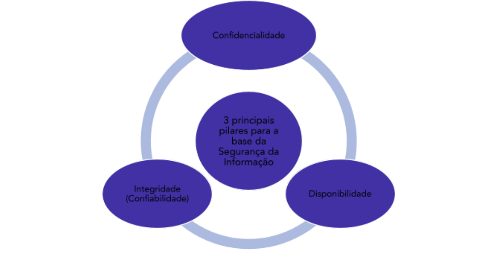

Ademais, outros conceitos também surgem com grande relevância, senão vejamos: 

- **Autenticidade** – O princípio da autenticidade busca garantir que determinada pessoa ou sistema é, de fato, quem ela diz ser. Ou seja, quando utilizamos o simples recurso de inserir as informações de login e senha em um computador, estamos dizendo ao computador que **realmente somos o usuário, pois** ele assume que somente o usuário legítimo em questão possui a informação de login e senha. 

Importante informar que nesse processo, para a devida realização da autenticação, é necessário cumprir a etapa preliminar de identificação, onde será possível coletar as informações necessárias sobre o usuário para posteriormente, validá-lo.

---

<!-- pagina: 7 -->

**André Castro Aula 00** 

Nesta etapa de identificação, temos muitos exemplos de cunho mais prático do nosso dia a dia, seja pela utilização de uma **impressão digital ou reconhecimento facial, logins e senhas tradicionais, utilização de cartões físicos ou digitais de acesso, entre muitos outros.** 

###### **CESPE-2020 - SEFAZ/AL - Auditor de Finanças e Controle** 

**Identificação e autenticação são requisitos de segurança da informação que consistem em identificar usuários do sistema e verificar as suas identidades, como pré-requisito para permitir o acesso desses usuários ao sistema.** 

###### **Comentários:** 

Tranquilo, certo pessoal? Mencionamos a importância do processo de identificação preliminarmente, para posterior realização do processo de autenticação. Um peque destaque deixo nessa abordaremos mais à frente da nossa aula é a das que questão, que questão permissões e autorizações de acesso. Vejam que a questão não tratou a identificação e autenticação como garantidores dessa permissão, mas como pré-requisitos apenas. 

Veremos mais à frente que o processo de autenticação é complementado pela etapa de autorização, que será responsável por gerenciar as credenciais e permissões de acesso. 

**Gabarito** : C 

- **Não-Repúdio (Irretratabilidade) –** Neste princípio, busca-se garantir que o usuário não tenha condições de negar ou contrariar o fato de que foi ele quem gerou determinado **conteúdo ou informação** , ou ainda que determinado receptor tenha, de fato, recebido certa mensagem. Tal princípio se aplica, por exemplo, na geração de uma autorização para compra de determinado produto e depois, o gestor responsável queira negar a autorização. Entretanto, utiliza-se mecanismos para que não haja possibilidade de haver a referida negação. 

Stallings traz ainda a seguinte definição: 

“A **irretratabilidade** impede que o **emissor** ou o **receptor negue** uma **mensagem transmitida.** Assim, quando uma mensagem é enviada, o receptor pode provar que o emissor alegado de fato enviou a mensagem. De modo semelhante, quando uma mensagem é recebida, o emissor pode provar que o receptor alegado de fato recebeu a mensagem.”

---

<!-- pagina: 8 -->

**André Castro Aula 00** 

**(Ano: 2022 Banca: FGV Órgão: TJDFT Prova: Suporte em TI) Lucas é um trader profissional que trabalha em uma corretora de valores. Ele efetua muitas operações durante o período em que a bolsa negocia seus ativos. Após fazer uma revisão em suas operações do dia, não validou, como sendo efetuadas por ele, algumas das operações que obtiveram prejuízo. Lucas, então, entrou em contato com a corretora e esta demonstrou, a partir de registros de auditoria e garantia de identidade, que as operações em questão realmente foram executadas por ele.** 

**Para que a corretora prove que foi Lucas quem realmente executou as operações, ela deve fazer uso do conceito de segurança chamado:** 

A) confidencialidade; 

B) autenticidade; 

C) integridade; 

D) disponibilidade; 

E) irretratabilidade. 

###### **Comentários:** 

Exatamente como vimos na nossa explanação. Tenham muito cuidado na leitura da questão, pois, conforme este caso, o aluno poderia marcar a opção autenticidade por observar as menções no enunciado de reconhecer o usuário. Mas o percebam que foco é justamente na incapacidade de Lucas negar que tenha realizado tal operação. 

**Gabarito** : E 

- **Irretroatividade** – Um outro princípio importante diretamente associado ao processo de autenticidade, integridade e não repúdio é a Irretroatividade, ou seja, não é possível reverter o ato ou questionar a data/momento da sua realização. Na prática, ela estabelece 

- que **<u>não é possível reverter um evento ou ação uma vez que ele tenha sido executado e registrado.</u>** <u>Este</u> princípio é importante para garantir a integridade dos dados e a confiabilidade dos sistemas de informação. 

###### Podemos citar como exemplos: 

- Uma vez que uma transação é registrada em um blockchain, não é possível alterá-la ou excluí-la. 

- Uma vez que um certificado digital é emitido, não é possível revogá-lo retroativamente. 

- Uma vez que um documento é assinado com certificado digital e assinatura digital, não é possível revertê-lo em termos do ato e do tempo.

---

<!-- pagina: 9 -->

**André Castro Aula 00** 

- **Legalidade** – O aspecto de legislação e normatização é fundamental nos processos relacionados à Segurança da Informação. Desse modo, respeitar a **legislação vigente** é um aspecto **fundamental** e serve, inclusive, como base para o **aprimoramento e robustez** dos **ambientes.** 

**FGV - 2021 - IMBEL - Supervisor - Tecnologia da Informação** 

**Segundo padrões internacionais, a Segurança da Informação distingue quatro atributos básicos que orientam a implementação de políticas e procedimentos de proteção. Assinale o atributo que não é parte desse grupo.** 

- A) Autenticidade. 

- B) Completude. 

- C) Confidencialidade. 

- D) Disponibilidade. 

- E) Integridade. 

###### **Comentários:** 

Sem muito segredo até aqui, certo? Acabamos de destacar as características dos principais princípios: Autenticidade; Confidencialidades; Disponibilidade; Integridade. 

**Gabarito** : B 

Tranquilo até aqui pessoal? Esses conceitos são extremamente importantes. Quero aproveitar para registrar alguns conceitos complementares previstos na norma de referência X.800 que trata da Segurança de arquiteturas, principalmente no que tange a soluções de rede distribuídas. Vamos conhecê-los: 

- **Autenticação de entidade Parceiras** o Usada em associação com uma conexão lógica com a capacidade de prover confiabilidade a respeito da identidade das entidades conectadas. 

- **Autenticação da origem dos Dados**

---

<!-- pagina: 10 -->

**André Castro Aula 00** 

   - Considerando uma transferência sem conexão entre as partes, visa assegurar que a origem dos dados recebidos é quem ela afirma ser. 

- **Confidencialidade de campo seletivo** 

   - Busca-se manter a confidencialidade de campos específicos dentro do volume de dados de um usuário em uma conexão. 

- **Confidencialidade do fluxo de tráfego** 

   - Busca-se gerar a confidencialidade sob a perspectiva do fluxo, ou seja, a simples análise do fluxo de dados não deve ser capaz de gerar informações indevidas. 

- **Integridade de conexão com recuperação** 

   - Como o próprio nome diz, é capaz de detectar qualquer modificação, inserção, deleção ou repetição de quaisquer dados dentro de uma sequência de dado. Além disso, é capaz de recuperar a intervenção realizada. 

- **Integridade de conexão sem recuperação** 

   - Como vimos, neste caso, não há capacidade de recuperação, mas tão somente de detecção. 

- **Integridade de conexão de campo seletivo** 

   - Assim como a confidencialidade seletiva, aqui, busca-se garantir a integridade de áreas e dados específicos. Assim, busca-se avaliar se houve modificação, inserção, eliminação ou repetição dessa parcela. 

- **Integridade sem conexão** 

   - Considera a capacidade de prover a integridade de dados em um ambiente sem conexão. Possui o foco na detecção de modificações e uma capacidade limitada de detectar repetições. 

- **Integridade de campo seletivo sem conexão** 

- Mesma condição do tipo acima, porém, de áreas de dados específicos ou seletivos. 

- **● Irretratabilidade de origem** 

   - É o padrão que vimos, uma vez que é possível provar que a mensagem foi enviada por determinada parte. 

- **Irretratabilidade de destino** 

   - A perspectiva aqui é diferente. Consegue-se provar que o destinatário recebeu determinada mensagem. 

## **Segurança de Redes** 

O Cert.br, principal órgão do Brasil responsável pelo fomento à **Segurança da Informação** , nos traz alguns conceitos que são constantemente explorados pelas bancas examinadoras. Nesse sentido, vamos conhecê-los: 

---

<!-- pagina: 11 -->

**André Castro Aula 00** 

- **Furto de dados:** informações pessoais e outros dados podem ser obtidos tanto pela interceptação de tráfego como pela exploração de possíveis vulnerabilidades existentes em seu computador; 

- **Uso indevido de recursos:** um atacante pode ganhar acesso a um computador conectado à rede e utilizá-lo para a prática de atividades maliciosas, como obter arquivos, disseminar spam, propagar códigos maliciosos, desferir ataques e esconder a real identidade do atacante; 

- **Varredura:** um atacante pode fazer varreduras na rede, a fim de descobrir outros computadores e, então, tentar executar ações maliciosas, como ganhar acesso e explorar vulnerabilidades; 

- **Interceptação de tráfego:** um atacante, que venha a ter acesso à rede, pode tentar interceptar o tráfego e, então, coletar dados que estejam sendo transmitidos sem o uso de criptografia; 

- **Exploração de vulnerabilidades:** por meio da exploração de vulnerabilidades, um computador pode ser infectado ou invadido e, sem que o dono saiba, participar de ataques, ter dados indevidamente coletados e ser usado para a propagação de códigos maliciosos. Além disso, equipamentos de rede (como modems e roteadores) vulneráveis também podem ser invadidos, terem as configurações alteradas e fazerem com que as conexões dos usuários sejam redirecionadas para sites fraudulentos; 

- **Ataque de negação de serviço:** um atacante pode usar a rede para enviar grande volume de mensagens para um computador, até torná-lo inoperante ou incapaz de se comunicar; 

- ● **Ataque de força bruta:** computadores conectados à rede e que usem senhas como métodos de autenticação estão expostos a ataques de força bruta. Muitos computadores, infelizmente, utilizam, por padrão, senhas de tamanho reduzido e/ou de conhecimento geral dos atacantes; 

- **Ataque de personificação** : um atacante pode introduzir ou substituir um dispositivo de rede para induzir outros a se conectarem a este, ao invés do dispositivo legítimo, permitindo a captura de senhas de acesso e informações que por ele passem a trafegar.

---

<!-- pagina: 12 -->

**André Castro Aula 00** 

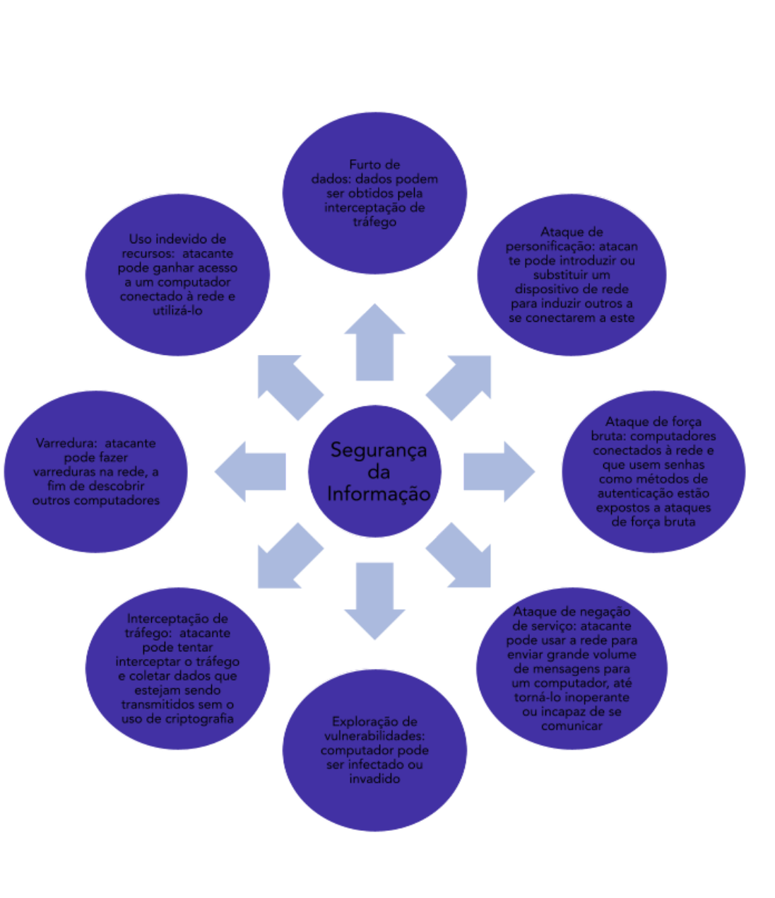

---

<!-- pagina: 13 -->

**André Castro Aula 00** 

# **<mark>Q</mark> UESTÕES** **<mark>C</mark> OMENTADAS** **<mark>- P</mark> RINCÍPIOS DE** **<mark>S</mark> EGURANÇA** **<mark>CESPE</mark>** 

**1. CESPE / CEBRASPE - 2025 - TRF - 6ª REGIÃO - Analista Judiciário – Área: Apoio Especializado – Especialidade: Tecnologia da Informação** 

**Em segurança da informação, a disponibilidade é um princípio que garante, aos usuários, a capacidade de acessar sistemas e(ou) informações quando necessário, mesmo que o sistema ou a infraestrutura esteja sob pressão.** 

###### **Comentários:** 

Essa é a ideia. Seja o sistema em condições normais ou sob grande volume, estresse ou pressão, ele deve continuar acessível. 

**Gabarito: C** 

**2. CESPE / CEBRASPE - 2025 - TRF - 6ª REGIÃO - Analista Judiciário – Área: Apoio Especializado – Especialidade: Tecnologia da Informação** 

**A integridade é um princípio de segurança da informação que garante que um dado ou uma informação tenham sido alterados sem o registro da ação correspondente, mesmo sob necessidade de auditoria.** 

###### **Comentários:** 

Ele não deve ser alterado sob qualquer situação, muito menos com a ausência de registro da ação correspondente. 

**Gabarito: E** 

**3. CESPE / CEBRASPE - 2025 - PC-DF - Gestor de Apoio as Atividades Policiais Civis - Especialidade: Analista de Informática: Rede de Computadores** 

**A integridade relaciona-se com a veracidade da informação durante todo o seu ciclo de vida.** 

###### **Comentários:** 

A integridade está relacionada à veracidade e precisão das informações durante todo o seu ciclo de vida, garantindo que não sejam alteradas de forma indevida. Lembrando que se aplica aos dados em repouso, em trânsito ou em transporte. 

**Gabarito: C**

---

<!-- pagina: 14 -->

**André Castro Aula 00** 

**4. CESPE / CEBRASPE - 2025 - PC-DF - Gestor de Apoio as Atividades Policiais Civis - Especialidade: Analista de Informática: Rede de Computadores** 

**A integridade relaciona-se com a veracidade da informação durante todo o seu ciclo de vida.** 

###### **Comentários:** 

Exatamente pessoal. É a base para esse e diversos outros controles das normas de segurança existentes. 

**Gabarito: C** 

**5. CESPE / CEBRASPE - 2025 - PC-DF - Gestor de Apoio as Atividades Policiais Civis - Especialidade: Analista de Informática: Rede de Computadores** 

**Conforme o princípio da disponibilidade, as informações devem estar disponíveis 24 horas por dia, todos os dias da semana.** 

###### **Comentários:** 

A disponibilidade deve levar em consideração a realidade da organização. O período apresentado pode ou não ser a realidade. Então não se pode extrapolar para todo caso. 

**Gabarito: E** 

**6. CESPE / CEBRASPE - 2025 - TRF - 6ª REGIÃO - Analista Judiciário – Área: Apoio Especializado – Especialidade: Tecnologia da Informação** 

**A criptografia de chave simétrica é a mais indicada no que diz respeito à segurança da informação voltada à confidencialidade.** 

###### **Comentários:** 

Ela é na prática a mais utilizada. Importante lembrar e tomar cuidado pois, se formos avaliar à luz do algoritmo específico, os de criptografia assimétrica implementam recursos com chaves maiores, o que, em tese, traz uma segurança maior. Fica a observação… 

**Gabarito: C** 

**7. CESPE / CEBRASPE - 2025 - TRF - 6ª REGIÃO - Analista Judiciário – Área: Apoio Especializado – Especialidade: Tecnologia da Informação**

---

<!-- pagina: 15 -->

**André Castro Aula 00** 

**Os objetivos básicos da criptografia são a confidencialidade, o sigilo, a autenticação, a integridade, o não repúdio e o anonimato.** 

###### **Comentários:** 

**Essa questão é polêmica, pois anonimato não é um princípio base, e a integridade não é garantida por criptografia, mas sim funções HASH. Entretanto, vejam a resposta da banca sobre a questão:** 

**“ Justifica do CESPE:** 

**A assertiva reproduz os objetivos previstos na legislação para garantir que os dados criptografados sejam seguros tanto em relação ao conteúdo (confidencialidade, sigilo, autenticidade, integridade) e quanto ao emissor (não repúdio e anonimato). “** 

**Gabarito: C (Professor: E ou Anulação)** 

**8. CESPE / CEBRASPE - 2024 - STJ - Analista Judiciário - Área: Apoio Especializado - Especialidade: Suporte em Tecnologia da Informação** 

**Na segurança da informação, a autenticidade é conceituada como a propriedade pela qual se assegura que a informação não foi modificada ou destruída de maneira não autorizada ou acidental.** 

###### **Comentários:** 

A questão descreve integridade, não autenticidade. Autenticidade garante que o emissor de uma informação é quem diz ser. Já a integridade protege contra modificações não autorizadas. 

**Gabarito: E** 

**9. CEBRASPE (CESPE) - Tec (CNMP)/CNMP/Apoio Técnico Administrativo/Segurança Institucional/2023** 

**São princípios da segurança da informação, entre outros, a confidencialidade, a integridade e a disponibilidade.** 

###### **Comentários:** 

Questão bem básica, e que traz, de fato, alguns dos principais princípios. Da base principal, ficou de fora apenas a autenticidade. 

**Gabarito: C**

---

<!-- pagina: 16 -->

**André Castro Aula 00** 

**10. CEBRASPE (CESPE) - Ana (SERPRO)/SERPRO/Tecnologia/2023** 

**A integridade é uma propriedade que visa aplicar conhecimentos e habilidades para garantir a assinatura digital.** 

###### **Comentários:** 

Temos uma inversão de conceitos. Na prática, a assinatura digital é que garante a autenticidade e integridade. 

**Gabarito: E** 

**11. CEBRASPE (CESPE) - Per Crim (POLC AL)/POLC AL/Análise de Sistemas, Ciências da Computação, Informática. Processamento de Dados ou Sistemas da Informação/2023** 

**A confidencialidade trata da proteção de dados contra ataques passivos e envolve mecanismos de controle de acesso e criptografia.** 

###### **Comentários:** 

Importante a gente lembrar que os ataques passivos são aqueles que não alteram ou interferem no fluxo de dados. Ou seja, escutas ou interceptações apenas para coleta e leitura das informações, sem sua alteração, caracteriza esse tipo de ataque. 

Já a confidencialidade é aquele princípio que justamente visa garantir o sigilo dos dados. Então, a questão está adequada em seus conceitos, e também na referência a práticas de segurança como os controles de acesso e criptografia, que visam restringir o acesso às informações e/ou, ainda que alguém tenha acesso, não consiga interpretá-las. 

Alguns exemplos de ataques passivos: 

Exemplos: 

- Eavesdropping: Interceptação de dados em redes sem fio ou com fio. 

- Análise de tráfego: Monitoramento de pacotes de rede para identificar informações confidenciais. 

- Ataques de sniffing: Captura de dados em redes utilizando ferramentas específicas. 

**Gabarito: C** 

**12. CEBRASPE (CESPE) - Tec (CNMP)/CNMP/Apoio Técnico Administrativo/Segurança Institucional/2023** 

**Para determinar o grau de sigilo da informação, é necessário que sejam observados o interesse público da informação e a utilização do critério menos restritivo possível.** 

###### **Comentários:**

---

<!-- pagina: 17 -->

**André Castro Aula 00** 

Muita atenção e cuidado nessa questão. Na prática, temos aqui uma referência a prática de classificação da informação, ou seja, quando se define níveis de acesso e, quem pode ou não acessar as informações. 

Mas vejam que a questão traz a perspectiva de acesso amplo, ou seja, direito público de acesso. Logo, se há interesse público, há o princípio da transparência. Isso é preconizado na LEI DE ACESSO À INFORMAÇÃO, no artigo 24: 

§ 5º Para a classificação da informação em determinado grau de sigilo, deverá ser observado o interesse público da informação e utilizado o critério menos restritivo possível, 

Então vejam que, evitar estabelecer critérios restritivos para os casos de informações abertas e públicas é sim uma prática recomendada. Muito cuidado pois em alguma medida entra em conflito com tudo que trabalhamos sobre sigilo e restrição. Mas nesses casos, as informações, de fato, são restritas, e por isso, deve-se aumentar o grau de restrição. 

São duas perspectivas distintas. 

**Gabarito: C** 

###### **13. CEBRASPE (CESPE) - Ana TI (DATAPREV)/DATAPREV/Segurança Cibernética/2023** 

###### **Em uma conexão criptografada, o princípio da disponibilidade é, de fato, atingido.** 

###### **Comentários:** 

A criptografia está majoritariamente associada ao princípio da confidencialidade. Lembrando que ela também poderá estar associada ao princípio da autenticidade ao considerar a ordem das chaves a ser utilizada. 

**Gabarito: E** 

**14. CEBRASPE (CESPE) - Ana (SERPRO)/SERPRO/Tecnologia/2023** 

**A confidencialidade é uma propriedade segundo a qual as informações não podem ser disponibilizadas a indivíduos, entidades ou processos que não estejam previamente autorizados.** 

###### **Comentários:** 

Sem muito o que acrescentar pessoal. A autorização de acesso é o recurso chave para garantir a restrição de acesso às informações confidenciais. 

**Gabarito: C** 

**15. CEBRASPE (CESPE) - Ana Reg (AGER MT)/AGER MT/Ciências da Computação e Sistemas de Informação/2023**

---

<!-- pagina: 18 -->

**André Castro Aula 00** 

**Funções de hash são muito utilizadas para verificação da propriedade básica da segurança da informação denominada** 

a) disponibilidade. 

###### b) confidencialidade. 

c) não-repúdio. 

d) integridade. 

e) perímetro. 

###### **Comentários:** 

O HASH sem dúvida está associado ao princípio da integridade. Lembrando que, por exemplo, na assinatura digital, temos a combinação da criptografia assimétrica com o HASH, onde a primeira técnica garante a autenticidade e a segunda, o HASH, garante a integridade. Por isso temos que a assinatura digital garante a autenticidade e a integridade. 

###### **Gabarito: D** 

**16. CESPE / CEBRASPE - 2022 - APEX Brasil - Perfil 5: Tecnologia da Informação e Comunicação (TIC) - Especialidade: Infraestrutura e Operações de TIC** 

**A característica de servidores de alta disponibilidade que permite a alternância imediata para uma rede em espera quando a rede principal falha denomina-se** 

A) balanceamento de carga. 

B) failover. 

C) nuvem privada escalável. 

###### D) cluster. 

###### **Comentários:** 

A disponibilidade da informação é um dos princípios da segurança que vimos. E para isso, os sistemas e serviços, bem como o acesso à informação não pode deixar de acontecer. 

Como prática de continuidade de negócios, sem dúvida, a técnica de FAILOVER é uma das principais. Ela diz respeito justamente à capacidade de um novo serviço, recurso, sistema, ou um DATACENTER completo começar a funcionar de forma subsidiária a partir do momento que a estrutura principal parou de funcionar. 

**Gabarito: B**

---

<!-- pagina: 19 -->

**André Castro Aula 00** 

###### **17. Ano: 2021 Banca: CESPE Órgão: UFES Prova: Analista em TI** 

**Segundo Machado (2014), o princípio fundamental de segurança da informação que é definido como a capacidade de garantir que o nível necessário de sigilo seja aplicado aos dados, tratando-se da prevenção contra a divulgação não autorizada desses dados** 

###### A) integridade. 

B) disponibilidade. 

C) criptografia. 

D) privacidade. 

###### E) confidencialidade. 

###### **Comentários:** 

Primeira questão da nossa sequência de conteúdo a ser abordado. Pessoal, percebam que o foco ==5460== no enunciado é justamente o sigilo e prevenção contra a divulgação não autorizada. Vimos que duas palavras chaves do princípio da confidencialidade são SIGILO e PRIVACIDADE. 

Muito cuidado, pois, a privacidade é uma característica do princípio da CONFIDENCIALIDADE. 

**Gabarito** : E 

###### **18. CESPE-2020 - SEFAZ/AL - Auditor de Finanças e Controle** 

**Identificação e autenticação são requisitos de segurança da informação que consistem em identificar usuários do sistema e verificar as suas identidades, como pré-requisito para permitir o acesso desses usuários ao sistema.** 

###### **Comentários:** 

Tranquilo, certo pessoal? Mencionamos a importância do processo de identificação preliminarmente, para posterior realização do processo de autenticação. Um peque destaque que deixo nesta questão, que abordaremos mais à frente da nossa aula é a questão das permissões e autorizações de acesso. Vejam que a questão não tratou a identificação e autenticação como garantidores dessa permissão, mas como pré-requisitos apenas. 

Veremos mais à frente que o processo de autenticação é complementado pela etapa de autorização, que será responsável por gerenciar as credenciais e permissões de acesso. 

###### **Gabarito** : C 

###### **19. CESPE – Banco da Amazônia/Técnico Científico – Segurança da Informação/2013** 

**A segurança da informação pode ser entendida como uma atividade voltada à preservação de princípios básicos, como confidencialidade, integridade e disponibilidade da informação** 

###### **Comentários:**

---

<!-- pagina: 20 -->

**André Castro Aula 00** 

Como vimos, estes são os principais pilares da Segurança da Informação. 

**Gabarito:** **<u>C</u>** 

**20. (CESPE – TCE-PR/Analista de Controle – Área TI/2016) A integridade de dados que detecta modificação, inserção, exclusão ou repetição de quaisquer dados em sequência, com tentativa de recuperação, é a integridade** 

a) conexão com recuperação. 

- b) autenticação da origem de dados. 

c) entidade par a par. 

- d) conexão com campo selecionado. 

e) fluxo de tráfego. 

###### **Comentários:** 

**Pessoal, os únicos itens que tratam da integridade são as letras “A” e “D”. As letras “B” e “C” tratam do princípio da autenticidade, enquanto a letra “E” de confidencialidade.** 

**Assim, para a letra “A”, temos o grande diferencial que é a capacidade de detecção e recuperação de todos os dados. Para a letra “D”, temos que será aplicado o princípio de monitoramento em uma parcela específica, ou seja, uma área selecionada dos dados. Percebam que nesse caso não há recuperação, mas tão somente detecção.** 

**Gabarito:** **<u>A</u>** 

**21. (CESPE – TJDFT/Analista Judiciário – Análise de Sistemas/2015) Possíveis dificuldades apresentadas por colaboradores para acessar as informações do sistema da organização por mais de dois dias indicam violação da autenticidade das informações.** 

**Comentários:** 

**O princípio descrito está relacionado à disponibilidade e não à autenticidade.** 

**Gabarito: E** 

https://t.me/KakashiAssinaturasBot

---

<!-- pagina: 21 -->

**André Castro Aula 00** 

**22. (CESPE – TJDFT/Analista Judiciário – Análise de Sistemas/2015) Se, para cometer o incidente, um colaborador usou software sem licenciamento regular e sem autorização formal da política de segurança da organização, então houve violação da integridade das informações da organização.** 

###### **Comentários:** 

**O princípio da integridade visa garantir que os dados originados de um determinado ponto chegaram ao destino sem serem violados e adulterados. Uma típica utilização para essa finalidade é por intermédio de funções HASH.** 

**Gabarito: E** 

**23. (CESPE – TJDFT/Analista Judiciário – Análise de Sistemas/2015) Se um colaborador conseguiu visualizar informações das quais ele não possuía privilégios, então houve violação da confidencialidade das informações.** 

###### **Comentários:** 

**Temos aqui um exemplo de acesso a dados que não deveriam ser acessados pelo usuário em tela. Ou seja, se o dado foi acessado de forma indevida por algum ente sem autorização, nitidamente temos a violação do princípio da confidencialidade.** 

**Gabarito:** **<u>C</u>** 

**24. (CESPE – ANTAQ/Analista Administrativo – Infraestrutura de TI/2013) Confidencialidade diz respeito à propriedade da informação que não se encontra disponível a pessoas, entidades ou processos não autorizados.** 

###### **Comentários:** 

Pessoal, muita atenção aqui. Se devemos garantir que a informação não esteja disponível para aqueles que não possuem autorização, queremos garantir que a informação não seja acessada de forma indevida, logo, estamos falando da propriedade da confidencialidade.

---

<!-- pagina: 22 -->

**André Castro Aula 00** 

**Gabarito:** **<u>C</u>** 

**25. (CESPE – TCE-RO/Analista de Informática/2013) Considere que um arquivo que esteja sendo transferido entre dois usuários tenha sido interceptado e seu conteúdo tenha sido visualizado e encaminhado a outros usuários. Nessa situação, caracterizou-se a ocorrência do comprometimento da integridade do arquivo** 

###### **Comentários:** 

**Mais uma questão bacana do CESPE. Temos descrito aqui a violação do princípio da confidencialidade quando a assertiva afirma que “o seu conteúdo tenha sido visualizado”. Entretanto, a informação se manteve íntegra pois não houve alteração de seu conteúdo, não havendo, portanto, a violação do princípio da integridade.** 

**Gabarito: E** 

**26. (CESPE – TCE-RO/Analista de Informática/2013) Se um sítio da web sofrer comprometimento devido a problemas de hardware no servidor, impossibilitando a visualização do conteúdo pelos usuários, esse fato poderá ser considerado como comprometimento da disponibilidade do serviço.** 

###### **Comentários:** 

**Se usuários legítimos não estão conseguindo usufruir dos serviços oferecidos, temos, de fato, a violação do princípio da disponibilidade.** 

**Gabarito:** **<u>C</u>** 

**27. (CESPE – CNJ/Técnico Judiciário – Programação de Sistemas/2013)A proteção aos recursos computacionais inclui desde aplicativos e arquivos de dados até utilitários e o próprio sistema operacional.** 

###### **Comentários:** 

**Sem dúvida, todos esses elementos devem ser protegidos no que tange à proteção de recursos computacionais, pois, todos podem ser vetores de ataques ou de vazamento de dados.**

---

<!-- pagina: 23 -->

**André Castro Aula 00** 

**Gabarito:** **<u>C</u>** 

**28. (CESPE – CNJ/Técnico Judiciário – Programação de Sistemas/2013) O princípio da autenticidade é garantido quando o acesso à informação é concedido apenas a pessoas explicitamente autorizadas.** 

**Comentários:** 

**Não, né pessoal? Se restringimos o acesso somente às pessoas autorizadas, temos o princípio da confidencialidade.** 

**Gabarito: E** 

**29. (CESPE – TRE-RJ/Analista Judiciário – Análise de Sistemas/2012)Na atualidade, os ativos físicos de uma organização são mais importantes para ela do que os ativos de informação.** 

###### **Comentários:** 

**A informação é a base para qualquer organização, sendo ela e seus ativos de informação, sem dúvida, os elementos mais importantes.** 

**Gabarito:** **<u>E</u>** 

**30. (CESPE – TRE-RJ/Analista Judiciário – Análise de Sistemas/2012)O termo de confidencialidade, de acordo com norma NBR ISO/IEC, representa a propriedade de salvaguarda da exatidão e completude de ativos.** 

**Comentários:** 

###### **Temos aqui a descrição de Integridade, certo?** 

**Gabarito:** **<u>E</u>** 

**31. (CESPE – TRE-RJ/Analista Judiciário – Análise de Sistemas/2012) Considere que um usuário armazenou um arquivo nesse servidor e, após dois dias, verificou que o arquivo**

---

<!-- pagina: 24 -->

**André Castro Aula 00** 

**está modificado, de forma indevida, uma vez que somente ele tinha privilégios de gravação na área em que armazenou esse arquivo. Nessa situação, houve problema de segurança da informação relacionado à disponibilidade do arquivo.** 

###### **Comentários:** 

**Houve violação do princípio da integridade e não da disponibilidade, considerando que o arquivo, ainda que alterado, esteja disponível.** 

**Gabarito: E** 

**32. (CESPE – TRE-RJ/Analista Judiciário – Análise de Sistemas/2012) Se as mídias das cópias de segurança são enviadas para outro local, fisicamente distante do servidor de arquivos, pelo menos uma vez a cada cinco dias úteis e tendo em vista que o transporte desses dados é feito por uma empresa terceirizada, uma forma de aumentar a segurança dessa informação é efetuar procedimento para criptografar os dados armazenados nas mídias.** 

###### **Comentários:** 

**Ora, com a criptografia, temos que os dados poderão até ser acessados, porém, não poderão ser lidos ou interpretados de forma não autorizada. Assim, temos a garantia do princípio da confidencialidade, que é uma forma de aumentar a segurança da informação.** 

**Gabarito:** **<u>C</u>** 

**33. (CESPE - TCE-ES/Informática/2013) Tendo em vista que a segurança da informação tem importância estratégica, contribuindo para garantir a realização dos objetivos da organização e a continuidade dos negócios, assinale a opção correta.** 

a) Os principais atributos da segurança da informação são a autenticidade, a irretratabilidade e o não repúdio. 

b) No contexto atual do governo e das empresas brasileiras, a segurança da informação tem sido tratada de forma eficiente, não permitindo que dados dos cidadãos ou informações estratégicas sejam vazados. 

c) A privacidade constitui uma preocupação do comércio eletrônico e da sociedade da informação, não estando inserida como atributo de segurança da informação, uma vez que é prevista no Código Penal brasileiro.

---

<!-- pagina: 25 -->

**André Castro Aula 00** 

d) A área de segurança da informação deve preocupar-se em proteger todos os ativos de informação de uma organização, governo, indivíduo ou empresa, empregando, em todas as situações, o mesmo nível de proteção. 

e) Entre as características básicas da segurança da informação estão a confidencialidade, a disponibilidade e a integridade. 

**Comentários:** 

###### **Vamos aos itens:** 

- **a) Temos que os principais princípios ou atributos da Segurança da Informação são a disponibilidade, integridade e confidencialidade. Muitos já complementam com a autenticidade, formando a nossa DICA. INCORRETO** 

- **b) À época, diversas foram a ocorrência de vulnerabilidade e invasões a sites do Governo e de empresas brasileiras. INCORRETO** 

- **c) A privacidade é um conceito diretamente ligada ao aspecto da confidencialidade e que muitas vezes são tratados como sinônimos para fins de comunicação dos dados. INCORRETO** 

- **d) Não né pessoal? Temos aí uma violação à classificação da informação ou da diferenciação de níveis de acesso considerando o grau de sigilo ou proteção dos dados ou ativos em um determinado ambiente. INCORRETO** 

- **e) Ainda que tivéssemos dúvida em algum dos itens acima, essa questão nos traz a tranquilidade na resposta, certo? Temos os três princípios relacionados à Segurança da Informação. CORRETO** 

**Gabarito: E** 

**34. (CESPE - TCE-RO/Ciências da Computação/2013) As ações referentes à segurança da informação devem focar estritamente a manutenção da confidencialidade e a integridade e disponibilidade da informação.** 

**Comentários:** 

**Lembremos sempre de ficarmos atentos a essas afirmações restritivas. No caso em questão, temos o termo “ESTRITAMENTE”. Não né pessoal? O simples princípio da autenticidade ficou de fora da lista.** 

**Gabarito: E**

---

<!-- pagina: 26 -->

**André Castro Aula 00** 

**35. (CESPE - SUFRAMA/Analista de Sistemas/2014) A utilização de algoritmos de criptografia garante a disponibilidade e a autenticidade de informações em ambientes de tecnologia da informação.** 

**Comentários:** 

**Podemos usar o mesmo exemplo que demos logo acima. O fato de você criptografar um disco com dados não impede que ele seja destruído e os dados sejam perdidos. Assim, apesar de usar a criptografia, os dados não estarão mais disponíveis.** 

**Gabarito: E** 

**36. (CESPE - SUFRAMA/Analista de Sistemas/2014) A lentidão e a paralisação do funcionamento de um sítio de comércio eletrônico que provê transações para venda de produtos é considerado incidente que viola a confidencialidade das informações do sítio.** 

###### **Comentários:** 

**Se tivermos problemas com acessos gerando dificuldades no acesso e utilização dos recursos da página, temos um problema de disponibilidade e não confidencialidade.** 

**O problema de confidencialidade existiria se alguém invadisse a página e conseguisse acesso às informações de usuário e senha de outros usuários, por exemplo.** 

**Gabarito: E** 

**37. (CESPE - TRT8/Analista Judiciário - Tecnologia da Informação/2013) Considere que, em uma organização, uma planilha armazenada em um computador (o servidor de arquivos) tenha sido acessada indevidamente por usuários que visualizaram as informações contidas na planilha, mas não as modificaram. O princípio da segurança da informação comprometido com esse incidente foi** 

###### a) a disponibilidade 

b) a autenticidade 

###### c) o não repúdio 

###### d) a confidencialidade 

###### e) a integridade

---

<!-- pagina: 27 -->

**André Castro Aula 00** 

###### **Comentários:** 

**Quando falamos de acesso indevido a informações ou dados, estamos falando de violação do princípio da confidencialidade. Atenção para o fato de que a questão deixou claro que o invasor não fez qualquer alteração no conteúdo da planilha, ou seja, não houve prejuízo à integridade desta planilha.** 

**Gabarito: D** 

**38. (CESPE – ANCINE/Analista Administrativo/2013) No que tange à autenticação, a confiabilidade trata especificamente da proteção contra negação, por parte das entidades envolvidas em uma comunicação, de ter participado de toda ou parte desta comunicação.** 

**Comentários:** 

###### **Temos aí a descrição do princípio da irretratabilidade ou não repúdio pessoal.** 

**Gabarito: E** 

**39. (CESPE – ANTAQ/Analista de Infraestrutura/2014) A utilização adequada dos mecanismos de criptografia permite que se descubra qualquer alteração em um documento por partes não autorizadas, o que garante a confidencialidade do documento.** 

###### **Comentários:** 

**Duas observações nessa questão. Primeiro, se estamos falando de alteração de documento, estamos falando da integridade e não confidencialidade. Em relação ao tópico de criptografia, na prática se utiliza funções HASH que possuem um caráter um pouco diferente. Veremos isso com mais calma em um outro momento.** 

**Gabarito: E** 

**40. (CESPE – DEPEN/Área 07/2015) O principal objetivo da segurança da informação é preservar a confidencialidade, a autenticidade, a integridade e a disponibilidade da informação.** 

**Comentários:** 

**Temos aí a simples apresentação dos princípios que formam o nosso principal mnemônico: DICA.**

---

<!-- pagina: 28 -->

**André Castro Aula 00** 

**Gabarito:** **<u>C</u>** 

**41. (CESPE – TCU/Auditor Federal de Controle Externo – TI/2015) Confidencialidade é a garantia de que somente pessoas autorizadas tenham acesso à informação, ao passo que integridade é a garantia de que os usuários autorizados tenham acesso, sempre que necessário, à informação e aos ativos correspondentes.** 

###### **Comentários:** 

**Questão bem tranquila por ser do TCU.  O erro da questão se encontra no segundo trecho ao se descrever o princípio da disponibilidade e não integridade. Gostaria apenas de destacar o trecho de “usuários autorizados tenham acesso”. Qual é a ideia aqui pessoal?** 

**Se eu tenho um sistema interno que somente os usuários de gestão devem acessar, caso esse sistema fique fora do ar e ninguém tente acessar nesse período ou caso um técnico financeiro não autorizado tente acessar e verifique o sistema fora do ar, não poderemos dizer que houve indisponibilidade, pois não houve pessoas autorizadas tentando acessar o sistema no período de indisponibilidade. Certo?** 

**Gabarito: E** 

**42. (CESPE - 2018 - EBSERH - Analista de Tecnologia da Informação) Uma auditoria no plano de continuidade de negócios de uma organização precisa verificar se o plano é exequível e se o pessoal está treinado para executá-lo.** 

###### **Comentários:** 

Como mencionamos, a auditoria pode atuar em qualquer etapa, fase ou tipo de processo, recurso (inclusive humano) ou documento. 

Desta feita, é recomendado que se avalie a exequibilidade dos planos gerados na empresa, bem como se as equipes estão aptas a executarem os mesmos. 

**Gabarito:** **<u>C</u>**

---

<!-- pagina: 29 -->

**André Castro Aula 00** 

# **QUESTÕES COMENTADAS - PRINCÍPIOS DE SEGURANÇA - FCC** 

**1. (FCC - AM (MPE PB)/MPE PB/Analista de Sistemas/Administrador de Banco de Dados/2023)** 

**No âmbito da segurança da informação em bancos de dados, as dimensões privacidade de comunicação, armazenamento seguro de dados sensíveis, autenticação de usuários e controle de acesso granular são pertinentes ao aspecto** 

- a) confidencialidade. 

- b) rastreabilidade. 

- c) integridade. 

- d) permissibilidade. 

- e) disponibilidade. 

###### **Comentários:** 

Vejam que todos os itens estão preocupados em garantir a restrição e eventual sigilo dos dados. Logo, o princípio associado é o da confidencialidade. Cuidado para não vincular autenticação a autenticidade de forma imediata. Nesse caso, a autenticação está associada ao requisito necessário para um acesso controlado. 

**Gabarito: A** 

###### **2. (FCC – TRE-RR/Analista Judiciário/2015)** 

**O processo de proteção da informação das ameaças caracteriza-se como Segurança da Informação. O resultado de uma gestão de segurança da informação adequada deve oferecer suporte a cinco aspectos principais:** 

###### **I. Somente as pessoas autorizadas terão acesso às informações.** 

**II. As informações serão confiáveis e exatas. Pessoas não autorizadas não podem alterar os dados.** 

**III. Garante o acesso às informações, sempre que for necessário, por pessoas autorizadas.** 

**IV. Garante que em um processo de comunicação os remetentes não se passem por terceiros e nem que a mensagem sofra alterações durante o envio.** 

**V. Garante que as informações foram produzidas respeitando a legislação vigente.** 

**Os aspectos elencados de I a V correspondem, correta e respectivamente, a:**

---

<!-- pagina: 30 -->

**André Castro Aula 00** 

a) autenticidade -integridade -disponibilidade - legalidade -confidencialidade. 

b) autenticidade -confidencialidade -integridade - disponibilidade -legalidade. 

c) integridade -disponibilidade -confidencialidade - autenticidade -legalidade. 

d) disponibilidade -confidencialidade -integridade - legalidade -autenticidade. 

e) confidencialidade -integridade -disponibilidade - autenticidade -legalidade. 

#### **<u>Comentário:</u>** 

**Vimos todas essas características no início do** ==5460== **nosso conteúdo de princípios de segurança. Vale mencionar que no item IV, temos a descrição tanto da autenticidade quanto da integridade.** 

#### **<u>Gabarito: E</u>** 

##### **3. (FCC – TRE-RR/Analista Judiciário/2015)** 

**O processo de proteção da informação das ameaças caracteriza-se como Segurança da Informação. O resultado de uma gestão de segurança da informação adequada deve oferecer suporte a cinco aspectos principais:** 

###### **I. Somente as pessoas autorizadas terão acesso às informações.** 

**II. As informações serão confiáveis e exatas. Pessoas não autorizadas não podem alterar os dados.** 

**III. Garante o acesso às informações, sempre que for necessário, por pessoas autorizadas.** 

**IV. Garante que em um processo de comunicação os remetentes não se passem por terceiros e nem que a mensagem sofra alterações durante o envio.** 

**V. Garante que as informações foram produzidas respeitando a legislação vigente.** 

###### **Os aspectos elencados de I a V correspondem, correta e respectivamente, a:** 

a) autenticidade -integridade -disponibilidade - legalidade -confidencialidade. 

b) autenticidade -confidencialidade -integridade - disponibilidade -legalidade. 

c) integridade -disponibilidade -confidencialidade - autenticidade -legalidade. 

d) disponibilidade -confidencialidade -integridade - legalidade -autenticidade.

---

<!-- pagina: 31 -->

**André Castro Aula 00** 

e) confidencialidade -integridade -disponibilidade - autenticidade -legalidade. 

#### **<u>Comentário:</u>** 

Vimos todas essas características no início do nosso conteúdo de princípios de segurança. Vale mencionar que no item IV, temos a descrição tanto da autenticidade quanto da integridade. 

#### **<u>Gabarito: E</u>** 

**4. (FCC – TRE-CE/Analista Judiciário – Análise de Sistemas/2015) Em relação à segurança da informação, considere:** 

**I. Capacidade do sistema de permitir que alguns usuários acessem determinadas informações, enquanto impede que outros, não autorizados, sequer as consultem.** 

**II. Informação exposta, sob risco de manuseio (alterações não aprovadas e fora do controle do proprietário da informação) por pessoa não autorizada.** 

**III. O sistema deve ter condições de verificar a identidade dos usuários, e este ter condições de analisar a identidade do sistema.** 

**Os itens I, II e III, associam-se, direta e respectivamente, aos princípios de** 

**a) confidencialidade, integridade e autenticidade.** 

**b) autenticidade, confidencialidade e irretratabilidade.** 

**c) confidencialidade, confidencialidade e irretratabilidade.** 

**d) autenticidade, confidencialidade e autenticidade.** 

**e) integridade, confidencialidade e integridade.** 

#### **<u>Comentário:</u>** 

Reforçando os conceitos que vimos previamente. Observemos que, no item II, o examinador destaca o aspecto de alteração não autorizada, ou seja, impactando o princípio de integridade. 

#### **<u>Gabarito: A</u>**

---

<!-- pagina: 32 -->

**André Castro Aula 00** 

   **5. (FCC – TRE-CE/Técnico Judiciário – Programação de Sistemas/2012) A propriedade que garante que nem o emissor nem o destinatário das informações possam negar a sua transmissão, recepção ou posse é conhecida como** 

- a) autenticidade. 

- b) integridade. 

- c) irretratabilidade. 

- d) confidenciabilidade. 

- e) acessibilidade. 

#### **<u>Comentário:</u>** 

**Pessoal, temos aqui uma abordagem um pouco mais ampla do conceito de não-repúdio ou irretratabilidade.** 

**<u>Gabarito: C</u>** 

   **6. (FCC – TJ-AP/Analista Judiciário – Banco de Dados/2014) O controle de acesso à informação é composto por diversos processos, dentre os quais, aquele que identifica quem efetua o acesso a uma dada informação. Esse processo é denominado** 

- A) autenticação. 

B) auditoria. 

- C) autorização. 

- D) identificação. 

- E) permissão. 

**<u>Comentário:</u>**

---

<!-- pagina: 33 -->

**André Castro Aula 00** 

Lembrando que o controle de acesso envolve tanto a autenticação quanto a autorização. Entretanto, o processo de identificação está relacionado à autenticação. 

**<u>Gabarito: A</u>** 

---

<!-- pagina: 34 -->

**André Castro Aula 00** 

# **QUESTÕES COMENTADAS - PRINCÍPIOS DE SEGURANÇA - FGV** 

###### **1. 2025 - FGV - TCE-PI - Auditor de Controle Externo** 

A equipe de TI do TCE-PI constatou que um sistema corporativo, durante a hora de maior movimento, tornava-se instável, pois o servidor não processava todas as requisições que recebia naquele período. Assinale a opção que indica o principal aspecto de segurança da informação que não está sendo plenamente atendido por esse sistema. 

A) Integridade. 

B) Não repúdio. 

C) Autenticidade. 

D) Disponibilidade. 

E) Confidencialidade. 

###### **Comentário:** 

**Questão bem objetiva sobre o princípio da disponibilidade. Como o sistema fica instável, há prejuízo no acesso aos recursos. Logo, se torna indisponível, ainda que parcialmente.** 

**Gabarito: D** 

###### **2. 2025 - FGV – SEFAZ-RS – Auditor do Estado** 

A segurança da informação abarca um conjunto de práticas para proteger informações das organizações. 

Relacione os princípios básicos da segurança da informação a seguir às suas respectivas definições. 

1. Confidencialidade. 2. Disponibilidade. 3. Autenticidade. 4. Integridade. 

( ) Trata-se da garantia de que a informação não será manipulada e nem alterada e que é possível contar em seu conteúdo. 

( ) Trata-se de uma garantia de não repúdio pela correta identificação, assegurando que apenas as pessoas envolvidas em determinadas ações sejam identificadas de modo incontestável por meios distintos, tais como biometria ou assinaturas digitais. 

( ) Garante que somente pessoas autorizadas tenham acesso à informação e, no caso de dados pessoais ou dados sensíveis, isso somente ocorrerá por meio de aplicações de controle, tais como permissões NTFS, permissões de acesso aos bancos de dados ou criptografadas.

---

<!-- pagina: 35 -->

**André Castro Aula 00** 

( ) Garante que a informação está acessível sempre que necessário. É importante principalmente na implementação de sistemas distribuídos e nos planos de recuperação de falhas e de continuidade de negócios. A relação correta, na ordem apresentada, é 

A) 3 – 4 – 1 – 2. 

B) 2 – 1 – 3 – 4. 

C) 3 – 2 – 4 – 1 

D) 4 – 1 – 2 – 3. E) 1 – 3 – 4 – 2. 

###### **Comentário:** 

==5460== 

Pessoal, essa teve como gabarito preliminar a letra A. Entretanto, não vejo como gabarito adequado aqui. 

A primeira opção trata da integridade, onde foca na mensagem e na garantia de que ela não foi alterada. 

A segunda opção, em conjunto com Não Repúdio, se associa à Autenticidade. 

A terceira opção, quando associada ao controle de acesso e restrição de visualização ao conteúdo, traz a perspectiva da confidencialidade. 

Por fim, o último item, fala da informação acessível, logo, estamos diante da DISPONIBILIDADE. 

**Gabarito: A (Professor: Anulação)** 

**3. (FGV - Ana (DPE RS)/DPE RS/Apoio Especializado (TI)/Infraestrutura e Redes/2023)** 

**A empresa Progseg foi contratada via processo licitatório para a modernização das aplicações utilizadas no Tribunal de Justiça do Rio Grande do Norte. Aurélio, chefe do Departamento de Tecnologia, conduzirá junto à empresa o retrofit, que terá como foco a melhoria na segurança dos sistemas.** 

**Os requisitos mandatórios dessa modernização são:** 

**- Assegurar que informações privadas e confidenciais não estejam disponíveis nem sejam reveladas para indivíduos não autorizados; e** 

- **Verificar que os usuários são quem dizem ser.** 

**O requisito desejável dessa modernização é:** 

- **Ser capaz de associar uma violação de segurança a uma parte responsável.** 

###### **DataPrev (Perfil 3: Desenvolvimento de Software) Segurança da Informação - 2026 (Pós-Edital)** **_www.estrategiaconcursos.com.br_**

---

<!-- pagina: 36 -->

**André Castro Aula 00** 

###### **Com base nos requisitos citados, a Progseg deverá implementar, respectivamente:** 

- a)  confidencialidade, autenticidade, responsabilização; 

- b)  disponibilidade, autenticidade, privacidade; 

- c)  não repúdio, integridade de sistemas, confidencialidade; 

- d)  integridade, disponibilidade, responsabilização; 

- e)  autenticidade, integridade de dados, integridade de sistemas. 

###### **Comentários:** 

Questão bem prática e tranquila a respeito dos conceitos, certo? 

O primeiro, tem foco no sigilo, logo, confidencialidade. Aqui, já teríamos resolvido a questão. O ponto de atenção fica pelo item de accountability ou responsabilização. Que é justamente você conseguir associar alguém a determinado ato para fins de registro. 

**Gabarito: A** 

**4. (FGV - Aud Est (CGE SC)/CGE SC/Ciências da Computação/2023)** 

**Para o caso hipotético descrito a seguir, somente informações corretas são consideradas disponíveis.** 

**Um determinado funcionário atende um pedido por telefone de alguém que se identifica como o cliente A. Essa pessoa explica que seus dados cadastrais estão errados e pede que seja feito um novo cadastro com as informações que ela está passando. O funcionário atende ao pedido e atualiza o sistema da empresa removendo o cadastro antigo e criando um novo.** 

**Dias depois, ao tentar emitir uma fatura, a empresa nota que os dados do cliente A não estão completos e resolve abrir uma investigação. Durante a investigação descobre-se que os dados passados pela pessoa ao telefone eram falsos e que é portanto necessário refazer o cadastro.** 

**Neste caso, avalie se, durante o processo de atendimento mencionado, ocorreu um incidente com quebra da** 

- **I. Confidencialidade dos dados do cliente A.** 

- **II. Disponibilidade dos dados do cliente A.** 

- **III. Integridade dos dados do cliente A.** 

**Está correto o que se afirma em** 

a)  I, apenas. 

b)  II, apenas.

---

<!-- pagina: 37 -->

**André Castro Aula 00** 

c)  III, apenas. 

d)  I e II, apenas. 

e)  II e III, apenas. 

###### **Comentários:** 

Essa questão traz uma visão moderna, e que eu gosto muito, a respeito da associação entre a integridade e disponibilidade. Vejam que houve alteração indevida dos dados gravados, o que, por si só, afetou a integridade. O ponto adicional é que, em momento posterior, houve necessidade de consumo da informação, e esta estava com problema de integridade, o que acabou gerando indisponibilidade do dado. 

Ainda, em nenhum momento, conforme enunciado, as informações originais que foram sobrescritas foram vazadas ou informadas sem autorização, o que não gerou problema com a confidencialidade. 

**Gabarito: E** 

###### **5. (FGV - Ana (DPE RS)/DPE RS/Apoio Especializado (TI)/Infraestrutura e Redes/2023)** 

**Tânia trabalha em uma prestadora de serviços de Internet. Equivocadamente, ela enviou ao servidor um comando UPDATE, o qual alterou indevidamente a base de dados, não permitindo mais seu acesso. De forma a ocultar seu erro, Tânia descobriu um post-it sob o teclado com a senha de um dos técnicos que trabalhava com ela. Então, utilizando a senha, entrou no sistema e efetuou novas modificações, de forma que a culpa recaísse sobre o técnico.** 

###### **No incidente relatado, houve a quebra do(a):** 

a)  confidencialidade e autenticidade; 

b)  integridade e autenticidade; 

c)  irretratabilidade e disponibilidade; 

d)  não repúdio e confidencialidade; 

e)  confidencialidade e integridade. 

###### **Comentários:** 

Com o comando UPDATE, houve a alteração do dado indevidamente, o que gerou problema de integridade. 

O segundo ponto, houve quebra da autenticidade, pois houve vazamento de senha e agora não é possível garantir a autoria da ação, pois estará associado ao usuário que nem sequer estava no local. 

**Gabarito: B**

---

<!-- pagina: 38 -->

**André Castro Aula 00** 

**6. FGV - 2022 - SEFAZ-AM - Analista de Tecnologia da Informação da Fazenda Estadual - Manhã** 

**A administração de dados deve observar princípios básicos que são largamente adotados pela comunidade segurança da informação. Além da Confidencialidade, Integridade, Disponibilidade e Autenticidade, o princípio da Irretratabilidade completa a lista.** 

**Assinale o significado do princípio da Irretratabilidade.** 

**A Garantia de que os usuários que originam as informações são conhecidos e autorizados, de modo que não possam se passar por terceiros.** 

**B Impossibilidade de negação de que uma pessoa tenha sido autora de uma determinada informação.** 

**C Obrigatoriedade dos agentes pelo zelo com todas as informações coletadas.** 

**D Preservação fidedigna das informações.** 

**E Restrição de acesso às informações apenas aos autorizados.** 

#### **<u>Comentário:</u>** 

**Vamos aos itens:** 

**a) Estamos falando aqui da prática de controle de acesso com autenticação e autorização. INCORRETO** 

**b) Exatamente pessoal. Lembrando que a irretratabilidade também se aplica ao destinatário, no sentido dele não ser capaz de negar o recebimento da informação. CORRETO** 

**c) Estamos falando aqui de processo de cultura organizacional. INCORRETO** 

**d) Temos o princípio da integridade. INCORRETO** 

**e) Novamente, controle de acesso, associado à confidencialidade. INCORRETO** 

#### **<u>Gabarito: B</u>** 

**7. (Ano: 2022 Banca: FGV Órgão: TJDFT Prova: Suporte em TI)** 

**Lucas é um trader profissional que trabalha em uma corretora de valores. Ele efetua muitas operações durante o período em que a bolsa negocia seus ativos. Após fazer uma revisão em suas operações do dia, não validou, como sendo efetuadas por ele, algumas das operações que obtiveram prejuízo. Lucas, então, entrou em contato com a corretora e esta demonstrou, a partir**

---

<!-- pagina: 39 -->

**André Castro Aula 00** 

**de registros de auditoria e garantia de identidade, que as operações em questão realmente foram executadas por ele.** 

**Para que a corretora prove que foi Lucas quem realmente executou as operações, ela deve fazer uso do conceito de segurança chamado:** 

A) confidencialidade; 

B) autenticidade; 

C) integridade; 

D) disponibilidade; 

E) irretratabilidade. 

###### **Comentários:** 

Exatamente como vimos na nossa explanação. Tenham muito cuidado na leitura da questão, pois, conforme este caso, o aluno poderia marcar a opção autenticidade por observar as menções no enunciado de reconhecer o usuário. Mas percebam que o foco é justamente na incapacidade de Lucas negar que tenha realizado tal operação. 

**Gabarito** : E 

**8. FGV - 2021 - IMBEL - Supervisor - Tecnologia da Informação** 

**Segundo padrões internacionais, a Segurança da Informação distingue quatro atributos básicos que orientam a implementação de políticas e procedimentos de proteção. Assinale o atributo que não é parte desse grupo.** 

A) Autenticidade. 

B) Completude. 

C) Confidencialidade. 

D) Disponibilidade. 

E) Integridade. 

###### **Comentários:** 

Sem muito segredo até aqui, certo? Acabamos de destacar as características dos principais princípios: Autenticidade; Confidencialidades; Disponibilidade; Integridade. 

**Gabarito** : B

---

<!-- pagina: 40 -->

**André Castro Aula 00** 

# **LISTA DE QUESTÕES - PRINCÍPIOS DE SEGURANÇA - CESPE** 

**1. CESPE / CEBRASPE - 2025 - TRF - 6ª REGIÃO - Analista Judiciário – Área: Apoio Especializado – Especialidade: Tecnologia da Informação** 

**Em segurança da informação, a disponibilidade é um princípio que garante, aos usuários, a capacidade de acessar sistemas e(ou) informações quando necessário, mesmo que o sistema ou a infraestrutura esteja sob pressão.** 

**2. CESPE / CEBRASPE - 2025 - TRF - 6ª REGIÃO - Analista Judiciário – Área: Apoio Especializado – Especialidade: Tecnologia da Informação** 

**A integridade é um princípio de segurança da informação que garante que um dado ou uma informação tenham sido alterados sem o registro da ação correspondente, mesmo sob necessidade de auditoria.** 

**3. CESPE / CEBRASPE - 2025 - PC-DF - Gestor de Apoio as Atividades Policiais Civis - Especialidade: Analista de Informática: Rede de Computadores** 

**A integridade relaciona-se com a veracidade da informação durante todo o seu ciclo de vida.** 

**4. CESPE / CEBRASPE - 2025 - PC-DF - Gestor de Apoio as Atividades Policiais Civis - Especialidade: Analista de Informática: Rede de Computadores** 

**A integridade relaciona-se com a veracidade da informação durante todo o seu ciclo de vida.** 

**5. CESPE / CEBRASPE - 2025 - PC-DF - Gestor de Apoio as Atividades Policiais Civis - Especialidade: Analista de Informática: Rede de Computadores** 

**Conforme o princípio da disponibilidade, as informações devem estar disponíveis 24 horas por dia, todos os dias da semana.** 

**6. CESPE / CEBRASPE - 2025 - TRF - 6ª REGIÃO - Analista Judiciário – Área: Apoio Especializado – Especialidade: Tecnologia da Informação** 

**A criptografia de chave simétrica é a mais indicada no que diz respeito à segurança da informação voltada à confidencialidade.**

---

<!-- pagina: 41 -->

**André Castro Aula 00** 

###### **7. CESPE / CEBRASPE - 2025 - TRF - 6ª REGIÃO - Analista Judiciário – Área: Apoio Especializado – Especialidade: Tecnologia da Informação** 

**Os objetivos básicos da criptografia são a confidencialidade, o sigilo, a autenticação, a integridade, o não repúdio e o anonimato.** 

**8. CESPE / CEBRASPE - 2024 - STJ - Analista Judiciário - Área: Apoio Especializado - Especialidade: Suporte em Tecnologia da Informação Na segurança da informação, a autenticidade é conceituada como a propriedade pela qual se assegura que a informação não foi modificada ou destruída de maneira não autorizada ou** ==5460== **acidental. 9. CEBRASPE (CESPE) - Tec (CNMP)/CNMP/Apoio Técnico Administrativo/Segurança Institucional/2023** 

**São princípios da segurança da informação, entre outros, a confidencialidade, a integridade e a disponibilidade.** 

**10. CEBRASPE (CESPE) - Ana (SERPRO)/SERPRO/Tecnologia/2023** 

**A integridade é uma propriedade que visa aplicar conhecimentos e habilidades para garantir a assinatura digital.** 

**11. CEBRASPE (CESPE) - Per Crim (POLC AL)/POLC AL/Análise de Sistemas, Ciências da Computação, Informática. Processamento de Dados ou Sistemas da Informação/2023** 

**A confidencialidade trata da proteção de dados contra ataques passivos e envolve mecanismos de controle de acesso e criptografia.** 

**12. CEBRASPE (CESPE) - Tec (CNMP)/CNMP/Apoio Técnico Administrativo/Segurança Institucional/2023** 

**Para determinar o grau de sigilo da informação, é necessário que sejam observados o interesse público da informação e a utilização do critério menos restritivo possível.**

---

<!-- pagina: 42 -->

**André Castro Aula 00** 

###### **13. CEBRASPE (CESPE) - Ana TI (DATAPREV)/DATAPREV/Segurança Cibernética/2023** 

**Em uma conexão criptografada, o princípio da disponibilidade é, de fato, atingido.** 

###### **14. CEBRASPE (CESPE) - Ana (SERPRO)/SERPRO/Tecnologia/2023** 

**A confidencialidade é uma propriedade segundo a qual as informações não podem ser disponibilizadas a indivíduos, entidades ou processos que não estejam previamente autorizados.** 

**15. CEBRASPE (CESPE) - Ana Reg (AGER MT)/AGER MT/Ciências da Computação e Sistemas de Informação/2023** 

**Funções de hash são muito utilizadas para verificação da propriedade básica da segurança da informação denominada** 

a) disponibilidade. 

b) confidencialidade. 

c) não-repúdio. 

d) integridade. 

e) perímetro. 

**16. CESPE / CEBRASPE - 2022 - APEX Brasil - Perfil 5: Tecnologia da Informação e Comunicação (TIC) - Especialidade: Infraestrutura e Operações de TIC** 

**A característica de servidores de alta disponibilidade que permite a alternância imediata para uma rede em espera quando a rede principal falha denomina-se** 

A) balanceamento de carga. 

B) failover. 

C) nuvem privada escalável. 

D) cluster. 

**17. Ano: 2021 Banca: CESPE Órgão: UFES Prova: Analista em TI** 

**Segundo Machado (2014), o princípio fundamental de segurança da informação que é definido como a capacidade de garantir que o nível necessário de sigilo seja aplicado aos dados, tratando-se da prevenção contra a divulgação não autorizada desses dados**

---

<!-- pagina: 43 -->

**André Castro Aula 00** 

###### A) integridade. 

###### B) disponibilidade. 

C) criptografia. 

D) privacidade. 

###### E) confidencialidade. 

**18. CESPE-2020 - SEFAZ/AL - Auditor de Finanças e Controle Identificação e autenticação são requisitos de segurança da informação que consistem em identificar usuários do sistema e verificar as suas identidades, como pré-requisito para permitir o acesso desses usuários ao sistema.** 

**19. CESPE – Banco da Amazônia/Técnico Científico – Segurança da Informação/2013** 

**A segurança da informação pode ser entendida como uma atividade voltada à preservação de princípios básicos, como confidencialidade, integridade e disponibilidade da informação.** 

**20. (CESPE – TCE-PR/Analista de Controle – Área TI/2016) A integridade de dados que detecta modificação, inserção, exclusão ou repetição de quaisquer dados em sequência, com tentativa de** 

**recuperação, é a integridade** 

###### a) conexão com recuperação. 

b) autenticação da origem de dados. 

c) entidade par a par. 

d) conexão com campo selecionado. 

e) fluxo de tráfego. 

**21. (CESPE – TJDFT/Analista Judiciário – Análise de Sistemas/2015) Possíveis dificuldades apresentadas por colaboradores para acessar as informações do sistema da organização por mais de dois dias indicam violação da autenticidade das informações.** 

**22. (CESPE – TJDFT/Analista Judiciário – Análise de Sistemas/2015) Se, para cometer o incidente, um colaborador usou software sem licenciamento regular e sem autorização formal da**

---

<!-- pagina: 44 -->

**André Castro Aula 00** 

**política de segurança da organização, então houve violação da integridade das informações da organização.** 

**23. (CESPE – TJDFT/Analista Judiciário – Análise de Sistemas/2015) Se um colaborador conseguiu visualizar informações das quais ele não possuía privilégios, então houve violação da confidencialidade das informações.** 

**24. (CESPE – ANTAQ/Analista Administrativo – Infraestrutura de TI/2013) Confidencialidade diz respeito à propriedade da informação que não se encontra disponível a pessoas, entidades ou processos não autorizados.** 

**25. (CESPE – TCE-RO/Analista de Informática/2013) Considere que um arquivo que esteja sendo transferido entre dois usuários tenha sido interceptado e seu conteúdo tenha sido visualizado e encaminhado a outros usuários. Nessa situação, caracterizou-se a ocorrência do comprometimento da integridade do arquivo** 

**26. (CESPE – TCE-RO/Analista de Informática/2013) Se um sítio da web sofrer comprometimento devido a problemas de hardware no servidor, impossibilitando a visualização do conteúdo pelos usuários, esse fato poderá ser considerado como comprometimento da disponibilidade do serviço.** 

**27. (CESPE – CNJ/Técnico Judiciário – Programação de Sistemas/2013)A proteção aos recursos computacionais inclui desde aplicativos e arquivos de dados até utilitários e o próprio sistema operacional.** 

**28. (CESPE – CNJ/Técnico Judiciário – Programação de Sistemas/2013) O princípio da autenticidade é garantido quando o acesso à informação é concedido apenas a pessoas explicitamente autorizadas.** 

**29. (CESPE – TRE-RJ/Analista Judiciário – Análise de Sistemas/2012)Na atualidade, os ativos físicos de uma organização são mais importantes para ela do que os ativos de informação.**

---

<!-- pagina: 45 -->

**André Castro Aula 00** 

**30. (CESPE – TRE-RJ/Analista Judiciário – Análise de Sistemas/2012)O termo de confidencialidade, de acordo com norma NBR ISO/IEC, representa a propriedade de salvaguarda da exatidão e completude de ativos.** 

**31. (CESPE – TRE-RJ/Analista Judiciário – Análise de Sistemas/2012) Considere que um usuário armazenou um arquivo nesse servidor e, após dois dias, verificou que o arquivo está modificado, de forma indevida, uma vez que somente ele tinha privilégios de gravação na área em que armazenou esse arquivo. Nessa situação, houve problema de segurança da informação relacionado à disponibilidade do arquivo.** 

**32. (CESPE – TRE-RJ/Analista Judiciário – Análise de Sistemas/2012) Se as mídias das cópias de segurança são enviadas para outro local, fisicamente distante do servidor de arquivos, pelo menos uma vez a cada cinco dias úteis e tendo em vista que o transporte desses dados é feito por uma empresa terceirizada, uma forma de aumentar a segurança dessa informação é efetuar procedimento para criptografar os dados armazenados nas mídias.** 

**33. (CESPE - TCE-ES/Informática/2013) Tendo em vista que a segurança da informação tem importância estratégica, contribuindo para garantir a realização dos objetivos da organização e a continuidade dos negócios, assinale a opção correta.** 

a) Os principais atributos da segurança da informação são a autenticidade, a irretratabilidade e o não repúdio. 

b) No contexto atual do governo e das empresas brasileiras, a segurança da informação tem sido tratada de forma eficiente, não permitindo que dados dos cidadãos ou informações estratégicas sejam vazados. 

c) A privacidade constitui uma preocupação do comércio eletrônico e da sociedade da informação, não estando inserida como atributo de segurança da informação, uma vez que é prevista no Código Penal brasileiro. 

d) A área de segurança da informação deve preocupar-se em proteger todos os ativos de informação de uma organização, governo, indivíduo ou empresa, empregando, em todas as situações, o mesmo nível de proteção. 

e) Entre as características básicas da segurança da informação estão a confidencialidade, a disponibilidade e a integridade.

---

<!-- pagina: 46 -->

**André Castro Aula 00** 

**34. (CESPE - TCE-RO/Ciências da Computação/2013) As ações referentes à segurança da informação devem focar estritamente a manutenção da confidencialidade e a integridade e disponibilidade da informação.** 

**35. (CESPE - SUFRAMA/Analista de Sistemas/2014) A utilização de algoritmos de criptografia garante a disponibilidade e a autenticidade de informações em ambientes de tecnologia da informação.** 

**36. (CESPE - SUFRAMA/Analista de Sistemas/2014) A lentidão e a paralisação do funcionamento de um sítio de comércio eletrônico que provê transações para venda de produtos é considerado incidente que viola a confidencialidade das informações do sítio.** 

**37. (CESPE - TRT8/Analista Judiciário - Tecnologia da Informação/2013) Considere que, em uma organização, uma planilha armazenada em um computador (o servidor de arquivos) tenha sido acessada indevidamente por usuários que visualizaram as informações contidas na planilha, mas não as modificaram. O princípio da segurança da informação comprometido com esse incidente foi** 

###### a) a disponibilidade 

###### b) a autenticidade 

###### c) o não repúdio 

###### d) a confidencialidade 

e) a integridade 

**38. (CESPE – ANCINE/Analista Administrativo/2013) No que tange à autenticação, a confiabilidade trata especificamente da proteção contra negação, por parte das entidades envolvidas em uma comunicação, de ter participado de toda ou parte desta comunicação.** 

**39. (CESPE – ANTAQ/Analista de Infraestrutura/2014) A utilização adequada dos mecanismos de criptografia permite que se descubra qualquer alteração em um documento por partes não autorizadas, o que garante a confidencialidade do documento.**

---

<!-- pagina: 47 -->

**André Castro Aula 00** 

**40. (CESPE – DEPEN/Área 07/2015) O principal objetivo da segurança da informação é preservar a confidencialidade, a autenticidade, a integridade e a disponibilidade da informação.** 

**41. (CESPE – TCU/Auditor Federal de Controle Externo – TI/2015) Confidencialidade é a garantia de que somente pessoas autorizadas tenham acesso à informação, ao passo que integridade é a garantia de que os usuários autorizados tenham acesso, sempre que necessário, à informação e aos ativos correspondentes.** 

**42. (CESPE - 2018 - EBSERH - Analista de Tecnologia da Informação) Uma auditoria no plano de continuidade de negócios de uma organização precisa verificar se o plano é exequível e se o pessoal está treinado para executá-lo.**

---

<!-- pagina: 48 -->

**André Castro Aula 00** 

# **GABARITO** 

1. C 

2. E 

3. C 

4. C 

5. E 

6. C 

37. D 38. E 39. E 40. C 41. E 42. C 

7. C (Professor: E ou Anulação) 

8. E 

9. C 

10. E 

11. C 

12. C 

13. E 14. C 15. D 

16. B 

17. E 

18. C 

19. C 

20. A 

21. E 

22. E 

23. C 

24. C 

25. E 

26. C 

27. C 

28. E 

29. E 

30. E 

31. E 

32. C 

33. E 

34. E 

35. E 36. E

---

<!-- pagina: 49 -->

**André Castro Aula 00** 

# **LISTA DE QUESTÕES - PRINCÍPIOS DE SEGURANÇA - FCC** 

**1. (FCC - AM (MPE PB)/MPE PB/Analista de Sistemas/Administrador de Banco de Dados/2023)** 

**No âmbito da segurança da informação em bancos de dados, as dimensões privacidade de comunicação, armazenamento seguro de dados sensíveis, autenticação de usuários e controle de acesso granular são pertinentes ao aspecto** 

a) confidencialidade. 

- b) rastreabilidade. 

- c) integridade. 

- d) permissibilidade. 

- e) disponibilidade. 

###### **2. (FCC – TRE-RR/Analista Judiciário/2015)** 

**O processo de proteção da informação das ameaças caracteriza-se como Segurança da Informação. O resultado de uma gestão de segurança da informação adequada deve oferecer suporte a cinco aspectos principais:** 

###### **I. Somente as pessoas autorizadas terão acesso às informações.** 

**II. As informações serão confiáveis e exatas. Pessoas não autorizadas não podem alterar os dados.** 

**III. Garante o acesso às informações, sempre que for necessário, por pessoas autorizadas.** 

**IV. Garante que em um processo de comunicação os remetentes não se passem por terceiros e nem que a mensagem sofra alterações durante o envio.** 

**V. Garante que as informações foram produzidas respeitando a legislação vigente.** 

###### **Os aspectos elencados de I a V correspondem, correta e respectivamente, a:** 

a) autenticidade -integridade -disponibilidade - legalidade -confidencialidade. 

b) autenticidade -confidencialidade -integridade - disponibilidade -legalidade. 

c) integridade -disponibilidade -confidencialidade - autenticidade -legalidade. 

- d) disponibilidade -confidencialidade -integridade - legalidade -autenticidade.

---

<!-- pagina: 50 -->

**André Castro Aula 00** 

e) confidencialidade -integridade -disponibilidade - autenticidade -legalidade. 

###### **3. (FCC – TRE-RR/Analista Judiciário/2015)** 

**O processo de proteção da informação das ameaças caracteriza-se como Segurança da Informação. O resultado de uma gestão de segurança da informação adequada deve oferecer suporte a cinco aspectos principais:** 

**I. Somente as pessoas autorizadas terão acesso às informações.** 

**II. As informações serão confiáveis e exatas. Pessoas não autorizadas não podem alterar os dados.** 

<!-- Start of picture text -->
==5460== <!-- End of picture text -->

**III. Garante o acesso às informações, sempre que for necessário, por pessoas autorizadas.** 

**IV. Garante que em um processo de comunicação os remetentes não se passem por terceiros e nem que a mensagem sofra alterações durante o envio.** 

**V. Garante que as informações foram produzidas respeitando a legislação vigente.** 

**Os aspectos elencados de I a V correspondem, correta e respectivamente, a:** 

**a) autenticidade -integridade -disponibilidade - legalidade -confidencialidade.** 

**b) autenticidade -confidencialidade -integridade - disponibilidade -legalidade.** 

**c) integridade -disponibilidade -confidencialidade - autenticidade -legalidade.** 

**d) disponibilidade -confidencialidade -integridade - legalidade -autenticidade.** 

**e) confidencialidade -integridade -disponibilidade - autenticidade -legalidade.** 

**4. (FCC – TRE-CE/Analista Judiciário – Análise de Sistemas/2015) Em relação à segurança da informação, considere:** 

**I. Capacidade do sistema de permitir que alguns usuários acessem determinadas informações, enquanto impede que outros, não autorizados, sequer as consultem.** 

**II. Informação exposta, sob risco de manuseio (alterações não aprovadas e fora do controle do proprietário da informação) por pessoa não autorizada.** 

**III. O sistema deve ter condições de verificar a identidade dos usuários, e este ter condições de analisar a identidade do sistema.** 

**Os itens I, II e III, associam-se, direta e respectivamente, aos princípios de**

---

<!-- pagina: 51 -->

**André Castro Aula 00** 

###### **a) confidencialidade, integridade e autenticidade.** 

###### **b) autenticidade, confidencialidade e irretratabilidade.** 

###### **c) confidencialidade, confidencialidade e irretratabilidade.** 

**d) autenticidade, confidencialidade e autenticidade.** 

**e) integridade, confidencialidade e integridade.** 

**5. (FCC – TRE-CE/Técnico Judiciário – Programação de Sistemas/2012) A propriedade que garante que nem o emissor nem o destinatário das informações possam negar a sua transmissão, recepção ou posse é conhecida como** 

###### **a) autenticidade.** 

**b) integridade.** 

**c) irretratabilidade.** 

###### **d) confidenciabilidade.** 

###### **e) acessibilidade.** 

**6. (FCC – TJ-AP/Analista Judiciário – Banco de Dados/2014) O controle de acesso à informação é composto por diversos processos, dentre os quais, aquele que identifica quem efetua o acesso a uma dada informação. Esse processo é denominado** 

###### **A) autenticação.** 

**B) auditoria.** 

###### **C) autorização.** 

**D) identificação.** 

**E) permissão.**

---

<!-- pagina: 52 -->

**André Castro Aula 00** 

# **GABARITO** 

1. A 

2. E 

3. E 

4. A 

5. C 

6. A

---

<!-- pagina: 53 -->

**André Castro Aula 00** 

# **LISTA DE QUESTÕES - PRINCÍPIOS DE SEGURANÇA - FGV** 

###### **1. 2025 - FGV - TCE-PI - Auditor de Controle Externo** 

A equipe de TI do TCE-PI constatou que um sistema corporativo, durante a hora de maior movimento, tornava-se instável, pois o servidor não processava todas as requisições que recebia naquele período. Assinale a opção que indica o principal aspecto de segurança da informação que não está sendo plenamente atendido por esse sistema. 

###### A) Integridade. 

B) Não repúdio. 

C) Autenticidade. 

D) Disponibilidade. 

E) Confidencialidade. 

###### **2. 2025 - FGV – SEFAZ-RS – Auditor do Estado** 

A segurança da informação abarca um conjunto de práticas para proteger informações das organizações. 

Relacione os princípios básicos da segurança da informação a seguir às suas respectivas definições. 

1. Confidencialidade. 2. Disponibilidade. 3. Autenticidade. 4. Integridade. 

( ) Trata-se da garantia de que a informação não será manipulada e nem alterada e que é possível contar em seu conteúdo. 

( ) Trata-se de uma garantia de não repúdio pela correta identificação, assegurando que apenas as pessoas envolvidas em determinadas ações sejam identificadas de modo incontestável por meios distintos, tais como biometria ou assinaturas digitais. 

( ) Garante que somente pessoas autorizadas tenham acesso à informação e, no caso de dados pessoais ou dados sensíveis, isso somente ocorrerá por meio de aplicações de controle, tais como permissões NTFS, permissões de acesso aos bancos de dados ou criptografadas. 

( ) Garante que a informação está acessível sempre que necessário. É importante principalmente na implementação de sistemas distribuídos e nos planos de recuperação de falhas e de continuidade de negócios. A relação correta, na ordem apresentada, é 

A) 3 – 4 – 1 – 2.

---

<!-- pagina: 54 -->

**André Castro Aula 00** 

B) 2 – 1 – 3 – 4. 

C) 3 – 2 – 4 – 1 

D) 4 – 1 – 2 – 3. E) 1 – 3 – 4 – 2. 

3. **(FGV - Ana (DPE RS)/DPE RS/Apoio Especializado (TI)/Infraestrutura e Redes/2023)** 

**A empresa Progseg foi contratada via processo licitatório para a modernização das aplicações utilizadas no Tribunal de Justiça do Rio Grande do Norte. Aurélio, chefe do Departamento de Tecnologia, conduzirá junto à empresa o retrofit, que terá como foco a melhoria na segurança** ==5460== **dos sistemas.** 

**Os requisitos mandatórios dessa modernização são:** 

**- Assegurar que informações privadas e confidenciais não estejam disponíveis nem sejam reveladas para indivíduos não autorizados; e** 

**- Verificar que os usuários são quem dizem ser.** 

**O requisito desejável dessa modernização é:** 

**- Ser capaz de associar uma violação de segurança a uma parte responsável.** 

**Com base nos requisitos citados, a Progseg deverá implementar, respectivamente:** 

a)  confidencialidade, autenticidade, responsabilização; 

b)  disponibilidade, autenticidade, privacidade; 

c)  não repúdio, integridade de sistemas, confidencialidade; 

- d)  integridade, disponibilidade, responsabilização; 

- e)  autenticidade, integridade de dados, integridade de sistemas. 

   4. **(FGV - Aud Est (CGE SC)/CGE SC/Ciências da Computação/2023)** 

**Para o caso hipotético descrito a seguir, somente informações corretas são consideradas disponíveis.** 

**Um determinado funcionário atende um pedido por telefone de alguém que se identifica como o cliente A. Essa pessoa explica que seus dados cadastrais estão errados e pede que seja feito um novo cadastro com as informações que ela está passando. O funcionário atende ao pedido e atualiza o sistema da empresa removendo o cadastro antigo e criando um novo.**

---

<!-- pagina: 55 -->

**André Castro Aula 00** 

**Dias depois, ao tentar emitir uma fatura, a empresa nota que os dados do cliente A não estão completos e resolve abrir uma investigação. Durante a investigação descobre-se que os dados passados pela pessoa ao telefone eram falsos e que é portanto necessário refazer o cadastro.** 

**Neste caso, avalie se, durante o processo de atendimento mencionado, ocorreu um incidente com quebra da** 

- **I. Confidencialidade dos dados do cliente A.** 

- **II. Disponibilidade dos dados do cliente A.** 

- **III. Integridade dos dados do cliente A.** 

**Está correto o que se afirma em** 

a)  I, apenas. 

- b)  II, apenas. 

c)  III, apenas. 

- d)  I e II, apenas. 

- e)  II e III, apenas. 

5. **(FGV - Ana (DPE RS)/DPE RS/Apoio Especializado (TI)/Infraestrutura e Redes/2023)** 

**Tânia trabalha em uma prestadora de serviços de Internet. Equivocadamente, ela enviou ao servidor um comando UPDATE, o qual alterou indevidamente a base de dados, não permitindo mais seu acesso. De forma a ocultar seu erro, Tânia descobriu um post-it sob o teclado com a senha de um dos técnicos que trabalhava com ela. Então, utilizando a senha, entrou no sistema e efetuou novas modificações, de forma que a culpa recaísse sobre o técnico.** 

**No incidente relatado, houve a quebra do(a):** 

a)  confidencialidade e autenticidade; 

- b)  integridade e autenticidade; 

- c)  irretratabilidade e disponibilidade; 

- d)  não repúdio e confidencialidade; 

- e)  confidencialidade e integridade. 

**6. FGV - 2022 - SEFAZ-AM - Analista de Tecnologia da Informação da Fazenda Estadual - Manhã**

---

<!-- pagina: 56 -->

**André Castro Aula 00** 

**A administração de dados deve observar princípios básicos que são largamente adotados pela comunidade segurança da informação. Além da Confidencialidade, Integridade, Disponibilidade e Autenticidade, o princípio da Irretratabilidade completa a lista.** 

###### **Assinale o significado do princípio da Irretratabilidade.** 

A) Garantia de que os usuários que originam as informações são conhecidos e autorizados, de modo que não possam se passar por terceiros. 

B) Impossibilidade de negação de que uma pessoa tenha sido autora de uma determinada informação. 

C) Obrigatoriedade dos agentes pelo zelo com todas as informações coletadas. 

D) Preservação fidedigna das informações. 

E) Restrição de acesso às informações apenas aos autorizados. 

**7. (Ano: 2022 Banca: FGV Órgão: TJDFT Prova: Suporte em TI)** 

**Lucas é um trader profissional que trabalha em uma corretora de valores. Ele efetua muitas operações durante o período em que a bolsa negocia seus ativos. Após fazer uma revisão em suas operações do dia, não validou, como sendo efetuadas por ele, algumas das operações que obtiveram prejuízo. Lucas, então, entrou em contato com a corretora e esta demonstrou, a partir de registros de auditoria e garantia de identidade, que as operações em questão realmente foram executadas por ele.** 

**Para que a corretora prove que foi Lucas quem realmente executou as operações, ela deve fazer uso do conceito de segurança chamado:** 

A) confidencialidade; 

B) autenticidade; 

C) integridade; 

D) disponibilidade; 

- E) irretratabilidade. 

**8. FGV - 2021 - IMBEL - Supervisor - Tecnologia da Informação** 

**Segundo padrões internacionais, a Segurança da Informação distingue quatro atributos básicos que orientam a implementação de políticas e procedimentos de proteção. Assinale o atributo que não é parte desse grupo.** 

A) Autenticidade. 

B) Completude. 

- C) Confidencialidade.

---

<!-- pagina: 57 -->

**André Castro Aula 00** 

D) Disponibilidade. 

E) Integridade.

---

<!-- pagina: 58 -->

**André Castro Aula 00** 

# **GABARITO** 

**1. D** 

**2. A (Professor: Anulada)** 

**3. A** 

**4. E** 

**5. B** 

**6. B** 

**7. E** 

**8. B**

---

<!-- pagina: 59 -->

**André Castro Aula 00** 

# **SEGURANÇA FÍSICA, LÓGICA E CONTROLE DE ACESSO** 

Quando falamos de Segurança da Informação, há uma diferenciação clássica no que tange às características dos elementos e ferramentas utilizadas para esta finalidade. 

Seguimos aqui o mesmo princípio visto na nossa aula de topologia de redes em que diferenciamos os conceitos de implementação física e lógica. 

Lembrando que a **física** diz respeito aos **aspectos tangíveis** e que, de fato, podem ser tocados, enquanto a **lógica** está relacionada aos dados em seu formato **analógico ou digital** , tanto no aspecto de transmissão, processamento e armazenamento. 

## **Segurança Física** 

Podemos citar diversos elementos que são considerados como recursos para a segurança física. Vamos conhecer alguns: 

- **Unidade de Alimentação Ininterrupta (UPS) –** São sistemas munidos de baterias que são capazes de **armazenar energia** e fornecer **corrente elétrica** aos demais equipamentos por um **período limitado.** Assim, em caso de ausência de energia, esses equipamentos possibilitam o funcionamento dos equipamentos por um período suficiente em que os administradores da rede podem atuar com vistas a mitigar perdas. 

- **Gerador –** Seguindo a mesma linha do IPS, o gerador também tem como propósito manter o sistema em **operação** frente à eventual **falta de energia** . Entretanto, estamos falando de um período muito mais de sustentação podendo ser prolongado facilmente, uma vez que se utiliza combustível como fonte de energia.

---

<!-- pagina: 60 -->

**André Castro Aula 00** 

- **Site físico redundante –** Busca-se criar outro ambiente que seja capaz de **assumir a operação** em caso de **catástrofe** que prejudique o **ambiente principal** . Para tanto, é muito importante que os dados sejam armazenados e replicados, seja online, ou em fitas e equipamentos disponibilizados em outro local. 

- **CFTV –** Temos aqui a utilização de câmeras para registro e visualização dos ambientes de uma organização. É um meio eminentemente reativo, uma vez que, na maioria das vezes, é utilizado para **gravar o vídeo** e ser utilizado posteriormente para **análise e auditoria.** 

- **Travas de Equipamentos –** As referidas travas podem ser utilizadas tanto para impedir a utilização de determinados recursos, como bloqueio de portas USB ou unidades de DVD, de forma física, como também no intuito de não possibilitar o furto de notebooks, por exemplo, através das conhecidas chaves **kensington,** que, literalmente, “prendem” o equipamento em uma localidade. 

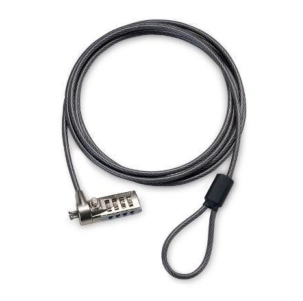

- **Alarmes –** Temos aqui um sistema de aviso que pode ser considerado no seu aspecto físico, como **alarmes de incêndio** , como no **aspecto lógico** , como **alarmes lógicos de rede** .

---

<!-- pagina: 61 -->

**André Castro Aula 00** 

- **Catracas –** A partir da utilização de senhas, crachás, smart cards, entre outros, pode-se restringir o acesso somente a **pessoas autorizadas** em determinados locais. 

- **Sala Cofre –** As Salas Cofre são criadas para serem um ambiente seguro para datacenters, 

- implementando diversos tipos de **controles de segurança** , de acesso, mecanismos de reação a catástrofes, entre outros. 

<!-- Start of picture text -->
==5460== <!-- End of picture text -->

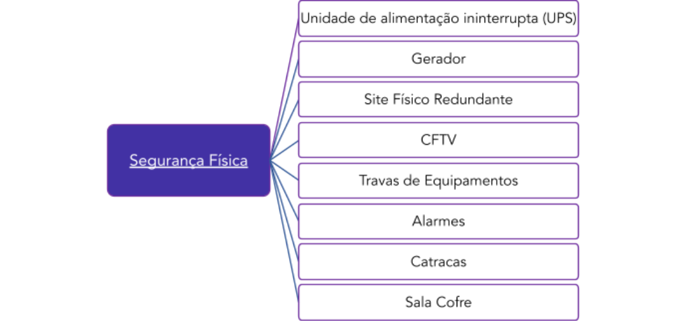

**FGV - 2023 - Banco do Brasil - Técnico Atendimento** 

**A catraca de controle de acesso é um dispositivo de segurança utilizado para dificultar o acesso não-autorizado a determinadas áreas de uma empresa, bem como possibilita monitorar o próprio fluxo de pessoal nessas áreas restritas.** 

**O controle do acesso propriamente dito pode ser feito a partir da checagem de algum dado do usuário, como, por exemplo, a aproximação do seu crachá de identificação.** 

**O mecanismo de detecção por aproximação em crachás está baseado em A radiofrequência.** 

**B infravermelho.**

---

<!-- pagina: 62 -->

**André Castro Aula 00** 

**C ultravioleta. D raio-X. E ultrassom.** 

#### **Comentários:** 

O mecanismo de detecção por aproximação em crachás, como o descrito, está baseado em radiofrequência. Essa tecnologia é comumente conhecida como RFID (Radio-Frequency Identification). Os crachás de identificação são equipados com uma pequena antena e um chip que emite sinais de radiofrequência quando aproximados de um leitor compatível. O leitor, que está integrado à catraca ou ao sistema de controle de acesso, captura esses sinais e autentica o usuário, permitindo ou negando o acesso com base nas informações contidas no crachá 

**Gabarito** : A

---

<!-- pagina: 63 -->

**André Castro Aula 00** 

## **Segurança Lógica** 

A segurança lógica possui diversas vertentes que podem ser consideradas. Podemos considerar a segurança a nível de um servidor de rede e serviços, por exemplo, em que devemos considerar a proteção dos recursos computacionais em todas as suas camadas, desde a **linguagem de máquina** e **Kernel do SO** , passando pelo próprio sistema operacional, arquivos, aplicações, dados, entre outros. 

Podemos considerar a segurança lógica a nível da rede em que devemos inserir elementos que visam controlar o tráfego e impedir o acesso indevido aos dados trafegados ou ainda impedir que determinados tipos de fluxos passem pela rede. Neste cenário, pode-se utilizar **firewalls, IDS, IPS, Proxies, entre outros elementos.** 

Podemos contemplar ainda as autorizações de usuários específicos e sistemas que podem acessar e utilizar determinados recursos na rede, sendo esse mecanismo **conhecido como autorização.** 

Mencionamos ainda os registros e logs dos diversos equipamentos, sistemas e aplicações em um parque tecnológico. Tais registros são fundamentais para processos de auditoria, sendo, portanto, um recurso de segurança lógica. 

###### **Ano: 2021 Banca: CESPE / CEBRASPE Órgão: PG-DF** 

**As boas práticas da gestão dos controles de acesso lógico de uma organização incluem atribuir direitos de acesso aos usuários, conforme necessidades reais de seu trabalho ou cargo, disponibilizar contas de usuários apenas a pessoas autorizadas, armazenar senhas criptografadas e usar técnicas visíveis de identificação.** 

#### **Comentários:** 

Muito cuidado pessoal. A questão traz uma boa narrativa que convence. Mas nem todos os itens elencados são boas práticas. O item que fica fora dessa lista é a técnica de armazenamento de senhas criptografadas. Na prática, uma forma de deixar os servidores e os dados armazenados neste equipamento mais seguros é por meio do armazenamento dos HASHES das senhas. O HASH, nada mais é do que uma função unidirecional que gera um resumo do conteúdo de entrada com tamanho físico. 

Nosso objetivo não é aprender sobre HASH nessa aula, mas saber que ele é uma boa prática associada ao armazenamento de senhas. 

#### Os demais itens, lembrando, estão aderentes às boas práticas a serem adotadas. 

**Gabarito** : E 

Outro conceito interessante que surge a esse respeito é o de **HARDENING.** A ideia do HARDENING é, de fato, **“endurecer”** um servidor de tal modo a deixá-lo mais robusto e seguro.

---

<!-- pagina: 64 -->

**André Castro Aula 00** 

Diversos são os métodos ou regras a serem implementadas. Buscarei elencar algumas e complementaremos, eventualmente, nos exercícios: 

- **Acesso de ROOT** – Não se deve possibilitar a utilização do usuário ROOT de forma direta, ou seja, logando-se como **ROOT** . Para tanto, deve-se utilizar apenas o método de escalação de privilégios, ou seja, deve-se logar como determinado usuário para posterior mudança de privilégio e consequente execução de comandos ou aplicações. Isto possibilita a geração de lastros e trilhas de auditorias, além de ser mais uma camada de segurança. 

- **Redução de Serviços** – Deve-se **minimizar ao máximo** a quantidade de serviços que estejam rodando em determinado servidor. Isto tem o intuito de reduzir a possibilidade de vulnerabilidades existentes nas aplicações e serviços, bem como aumentar o desempenho do servidor. Portanto, deve-se manter apenas os serviços e aplicações necessárias, nada mais. 

- **Limitação de Acesso Remoto** – Pode-se configurar o servidor de tal modo que este possibilite acesso remoto de forma segura, ou seja, utilizando protocolos seguros como **SSH** . Além disso, pode-se restringir a máquinas ou redes específicas que poderão acessar o referido servidor. 

- **Atualização do Sistema** – É um procedimento fundamental com vistas a reduzir falhas de segurança existentes no sistema operacional e aplicações. Assim, deve-se manter e instalar as **últimas versões e mais atualizadas.** 

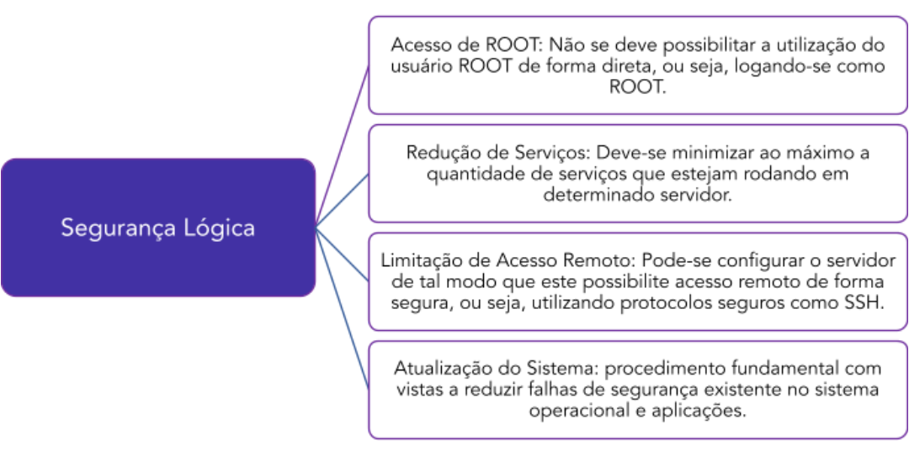

---

<!-- pagina: 65 -->

**André Castro Aula 00** 

|**Ano: 2021 Banca: CESPE Órgão: PG-DF Prova: Técnico Jurídico – TI**|
|---|

**Suponha que um Analista do Tribunal Regional Federal da 4ª Região – TRF4 se depare com uma situação em que deve implantar mecanismos de proteção interna voltados à segurança física e lógica das informações no ambiente do Tribunal. Para isso, ele levantou os seguintes requisitos: I. Não instalar em áreas de acesso público equipamentos que permitam o acesso à rede interna do Tribunal.** 

**II. Os usuários não podem executar transações de TI incompatíveis com sua função.** 

**III. Apenas usuários autorizados devem ter acesso de uso dos sistemas e aplicativos.** 

**IV. Proteger o local de armazenamento das unidades de backup e restringir o acesso a computadores e impressoras que possam conter dados confidenciais.** 

**O Analista classificou correta e respectivamente os requisitos de I a IV como segurança** 

A) física, física, lógica e física. 

B) física, lógica, lógica e física. 

C) lógica, física, lógica e física. 

D) lógica, física, física e lógica. 

E) física, lógica, física e lógica. 

###### **Comentários:** 

Pessoal, lembrem-se da dica no sentido de entenderem se o item é tangível, ou seja, algo que se toca, ou não. Caso seja o primeiro, estamos falando de segurança física. Caso seja o segundo, estamos falando de segurança lógica. 

I – Trata-se se segurança física, pois a itenção é não permitir o acesso direto ao equipamento, no caso, o Access Point. 

II – Estamos falando de transações, ou seja, operações nos sistemas. Neste aspecto, estamos no mundo lógico. 

III – Novamente, estamos falando de acesso lógicos, em sistemas e aplicativos. E não acesso a equipamentos. Logo, também é lógico. 

IV – Vejam que o interesse é em proteção de local, além de acesso aos computadores e impressoras, que também são itens materiais. Logo, segurança física. 

**Gabarito** : B

---

<!-- pagina: 66 -->

**André Castro Aula 00** 

**Ano: 2021 Banca: CESPE Órgão: PG-DF Prova: Técnico Jurídico – TI O conceito de hardening caracteriza-se principalmente por medidas e ações que visam:** A) permitir a recuperação de sistemas computacionais na sequência de um desastre natural; B) criar ambientes similares ao de servidores físicos, de modo que sistemas computacionais operem independentes do hardware; 

C) mapear ameaças, mitigar riscos e tornar sistemas computacionais preparados para enfrentar tentativas de ataque; 

D) distribuir a carga de trabalho uniformemente entre dois ou mais computadores para aumentar a confiabilidade através da redundância; 

E) construir sistemas computacionais sem preocupação com a infraestrutura em que esses sistemas estão rodando. 

###### **Comentários:** 

Vejam que a questão traz alguns pontos que devem ser observados previamente à realização das ações de HARDENING propriamente dito. Então, quando se fala em mapear ameaças para mitigar riscos, naturalmente devemos realizar ações que tornarão os sistemas computacionais mais seguros e isso quer dizer que eles precisam ter maior robustez frente às suas configurações e serviços habilitados. 

**Gabarito** : C

---

<!-- pagina: 67 -->

**André Castro Aula 00** 

## **Controle de Acesso** 

Temos aqui um método aplicado tanto no contexto físico e lógico, com vistas a estabelecer barreiras que podem restringir determinados acessos a locais, equipamentos, serviços e dados **a pessoas.** O controle de acesso está diretamente ligado ao princípio da **autenticidade e autorização.** 

1. Considerando o controle de acesso físico, temos então a primeira barreira a ser implementada. Nessa etapa pode-se diferenciar funcionários que são da organização ou não, usuários da organização que possuem autorização para acessar determinadas localidades, entre outros. 

Assim, como exemplo, para um usuário acessar **fisicamente o ambiente** de datacenter de uma empresa, ele necessitará passar por diversos fatores de controle de acesso, como a cancela de entrada para o veículo, portaria e catraca na entrada do edifício, autenticação e autorização por algum mecanismo, como o de biometria para a sala, possuir alguma chave específica para acessar determinado rack com os servidores, e por aí vai. 

Além disso, pode-se implementar recursos para controle de acesso lógico. Entre eles podemos citar a restrição de acesso por IP a determinado serviço, necessidade de login e senha, tanto para o usuário quanto para o root, entre outros. 

Existem **quatro técnicas** de controle e gerenciamento de acesso que são amplamente utilizadas nos ambientes de tecnologia da informação. 

1. **Mandatory Access Control (MAC)** – O administrador do sistema é responsável por atribuir as devidas permissões para os usuários. Este modelo utiliza o conceito de “label” para identificar o nível de sensibilidade a um determinado objeto. O label do usuário é verificado pelo gerenciador de acesso e através desta avaliação, é verificado o nível de acesso do usuário e quais recursos ele é capaz de usar. 

2. **Discretionary Access Control (DAC)** – Este é um modelo mais flexível quando comparado com o MAC e considerando o usuário que necessita compartilhar o recurso com outros usuários. Nesta técnica, o usuário tem o controle de garantir privilégios de acesso a recursos aos que estão sob seu domínio. Como exemplo desta técnica, podemos citar o próprio sistema de permissão do linux ou windows, por exemplo, em que o próprio usuário pode determinar as permissões do arquivo em que ele tem a posse.

---

<!-- pagina: 68 -->

**André Castro Aula 00** 

3. **Role-Based Access Control (RBAC)** – Também conhecido como controle baseado em papéis. Nesta técnica, o administrador garante privilégios de acordo com a função exercida pelo usuário. Esta estratégia simplifica o gerenciamento das permissões dadas aos usuários. Algumas questões têm trazido uma perspectiva mais aprofundada desse modelo. Portanto, vejamos os níveis de configuração que são possíveis com diferentes níveis de gerenciamento e atribuições: 

   - **<u>RBAC 0:</u>** Esse modelo não possui hierarquia de papéis, o que significa que cada usuário teria que ter permissões específicas configuradas individualmente. Isso seria inviável em um ambiente com muitos usuários e diferentes níveis de acesso. 

   - **<u>RBAC 1:</u>** Esse modelo introduz a hierarquia de papéis, permitindo que os administradores definam conjuntos de permissões que podem ser atribuídos a diferentes grupos de usuários. No entanto, o RBAC 1 não permite a delegação de permissões, o que pode ser uma limitação em ambientes complexos 

   - **<u>RBAC 2:</u>** <u>Esse</u> modelo é o mais adequado para ambientes corporativos em geral. Ele permite a definição de hierarquias de papéis, a delegação de permissões e a restrição de acesso a recursos específicos. Isso oferece maior flexibilidade e granularidade no controle de acesso. 

   - **<u>RBAC 3:</u>** Esse modelo é uma extensão do RBAC 2 que inclui suporte para controle de acesso baseado em tempo e em contexto. Estamos diante de um recurso de maior e complexidade que envolve um contexto corporativo mais 

   - maduro e gerenciável. 

   - **<u>RBAC 4:</u>** <u>Esse modelo é uma proposta recente que ainda não está totalmente</u> implementada. Ele oferece recursos adicionais de segurança e flexibilidade, mas pode ser mais complexo de gerenciar. 

4. **Attribute-Based Access Control (ABAC)** – É uma técnica de controle de acesso que concede ou nega acesso a recursos com base em atributos do sujeito, objeto e contexto. A principal diferença entre ABAC e RBAC é que ABAC é mais flexível e granular do que RBAC. ABAC permite que os administradores de segurança atribuam direitos de acesso com base em uma ampla gama de atributos, incluindo: Identidade do sujeito; Função do sujeito; Localização do sujeito; Tempo ; Tipo de recurso ; Critérios de segurança 

Por exemplo, imagine um sistema de gerenciamento de documentos com ABAC. Uma política ABAC poderia ser: "Permitir que usuários do departamento de vendas acessem documentos de vendas durante horário comercial e a do apenas partir escritório". Nesse caso, os atributos seriam a identidade do usuário, o departamento, o horário e a localização, e a decisão de acesso dependerá de como esses atributos se relacionam com a política.

---

<!-- pagina: 69 -->

**André Castro Aula 00** 

**Aurélio está implementando o controle de acesso à rede wi-fi da Defensoria Pública do Estado do Rio Grande do Sul (DPE/RS). Ele se baseou no modelo de referência do RBAC (Role Based Access Control) para a definição dos perfis. O perfil mais restrito possui as permissões básicas para cada servidor e, a partir dele, o acesso vai se incrementando. Os servidores do Departamento de Segurança devem ter as permissões mais básicas, além de acrescentar restrições, que restringem os modos de configuração possíveis.** 

**Com base nesse modelo de referência, Aurélio deverá atribuir para o Departamento de Segurança o modelo RBAC:** 

**a) 0;** 

**b) 1;** 

**c) 2;** 

**d) 3;** 

**e) 4.** 

###### **Comentários:** 

Conforme vimos em nossa teoria, estamos mais próximos da configuração tipo 2, que é, de fato, o modelo mais usual e que traz um equilíbrio entre controle, segurança e esforço para consolidar e implantar. 

**Gabarito** : C 

**Ano: 2019 Banca: CESPE / CEBRASPE Órgão: TCE-RO** 

**O modelo de controle de acesso que permite níveis de interação e acesso aos recursos dos sistemas de acordo com as funções que os usuários desempenham na organização é o** 

A) discricionário. 

B) embasado em papéis. 

C) em matriz. 

D) embasado em regras. 

E) mandatório. 

###### **Comentários:** 

Vejam a palavra chave, pessoal. De acordo com as suas funções ou papeis. Logo, temos o modelo RBAC, que é embasado em papéis. 

**Gabarito** : B 

**(Ano: 2021 Banca: CESPE Órgão: PG-DF Prova: Técnico Jurídico – TI)** 

https://t.me/KakashiAssinaturasBot

---

<!-- pagina: 70 -->

**André Castro Aula 00** 

**Para o controle de acesso a sistemas de informação, podem ser adotadas diferentes formas de controle de acesso lógico, com vistas à segurança de um recurso. Quanto a essas formas de controle, assinale a opção correta.** 

A) Do ponto de vista do usuário, um controle discricionário é, em geral, menos flexível que um mandatório. B) Em geral, é mais difícil auditar sistemas que operam com controle de acesso discricionário do que sistemas com controle de acesso mandatório. C) Como regra geral, no controle de acesso mandatório, os donos e usuários de recursos podem conceder acesso além dos limites declarados pela política da empresa. D) No controle discricionário, podem ser transferidos para terceiros os direitos de acesso, mas não a propriedade de um recurso. 

E) Em um sistema mandatório, o acesso é concedido com base na avaliação das funções dos sujeitos em relação às reivindicações relacionadas ao seu papel no sistema de informação. **Comentários:** 

Cobrança direta do conteúdo que acabamos de ver. Vamos aos itens: 

A) Vimos que o controle mandatório é o mais rígido, logo, menos flexível, e não o discricionário como apresenta o item. B) Exatamente pessoal. Como o mandatório tem a visão centralizada, a partir do admin da rede, há menos variação nas pastas e objetos. Logo, de fato, é mais fácil de se auditar. C) Questão invertida. Tem-se a descrição do controle discricionário. D) O erro está em afirmar que não se pode transferir a propriedade. Ela é possível também de ser transferida. E) Aqui, temos o descritivo do modelo RBAC, dado o trecho focado nas funções ou papeis dos sujeitos. 

**Gabarito** : B

---

<!-- pagina: 71 -->

**André Castro Aula 00** 

# **<mark>Q</mark> UESTÕES** **<mark>C</mark> OMENTADAS** **<mark>- SEGURANÇA FÍSICA, LÓGICA E CONTROLE DE ACESSO - CESPE</mark> Órgão: PG-DF** 

**1. CESPE / CEBRASPE - 2025 - TRF - 6ª REGIÃO - Analista Judiciário – Área: Apoio Especializado – Especialidade: Tecnologia da Informação** 

**O controle de acesso baseado em função (RBAC) atribui direitos de acesso ao usuário com base na função que ele executa dentro da organização.** 

###### **Comentário:** 

Exatamente conforme vimos, em nossa palavra chave “Função”. 

###### **Gabarito: C** 

**2. CESPE / CEBRASPE - 2025 - TRF - 6ª REGIÃO - Analista Judiciário – Área: Apoio Especializado – Especialidade: Tecnologia da Informação** 

**Listas de controle de acesso (ACLs) é um tipo de controle de acesso lógico, no qual as permissões anexadas a um objeto devem ser verificadas para permitir ou negar o controle ao objeto.** 

###### **Comentário:** 

Trata-se de um dos controles mais básicos e muito utilizados nos firewalls mais antigos. 

**Gabarito: C** 

**3. CEBRASPE (CESPE) - Ana (SERPRO)/SERPRO/Tecnologia/2023** 

**Acerca de conceitos relacionados a controle de acesso, julgue o item a seguir.** 

**Para reduzir vulnerabilidades, os controles de acesso devem liberar a propriedade do registro para que usuário possa criar, ler, atualizar ou excluir qualquer registro.** 

###### **Comentários:** 

Os controles de acesso devem restringir as permissões dos usuários, permitindo apenas as operações necessárias para suas funções. Liberar a propriedade do registro para criar, ler, atualizar ou excluir qualquer registro aumenta as vulnerabilidades. 

**Gabarito: E**

---

<!-- pagina: 72 -->

**André Castro Aula 00** 

###### **4. CEBRASPE (CESPE) - Ana (SERPRO)/SERPRO/Tecnologia/2023** 

**Acerca de conceitos relacionados a controle de acesso, julgue o item a seguir.** 

**O uso de processos e ferramentas para criar, atribuir, gerenciar e revogar credenciais de acesso para usuários é considerado uma boa prática de segurança da informação.** 

###### **Comentários:** 

O uso de processos e ferramentas para gerenciar credenciais de acesso é uma boa prática de segurança da informação, pois garante que apenas usuários autorizados tenham acesso aos recursos e que as credenciais sejam gerenciadas de forma segura. 

**Gabarito: E** 

###### **5. CEBRASPE (CESPE) - Ana Sist (EMPREL)/EMPREL/2023** 

**O emprego de controles apropriados para o acesso físico de pessoas a ambientes seguros de processamento de informações tem como principal finalidade** 

a)  organizar a emissão de identidades funcionais permanentes e credenciais temporárias para o público externo. 

b)  criar um banco de dados de clientes, com foco em relacionamento corporativo. 

c)  assegurar que somente pessoas autorizadas tenham acesso permitido. 

d)  viabilizar e acelerar o acesso de fornecedores e prestadores de serviços em emergências. 

e)  estabelecer um histórico de todos os acessos, para fins logísticos e estatísticos. 

###### **Comentários:** 

Conforme vimos, o foco não se trata de aspectos de identificação, mas sim, indicar quem pode fazer algo nesse contexto. Essa é a essência da autorização e controle de acesso. 

**Gabarito: C** 

###### **6. CEBRASPE (CESPE) - Ana TI (DATAPREV)/DATAPREV/Segurança Cibernética/2023** 

**Em função de sua codificação mais robusta, os firmwares de IoT são mais sofisticados que os sistemas operacionais executados em computadores e smartphones, o que os torna imunes a falhas consequentes das vulnerabilidades conhecidas.**

---

<!-- pagina: 73 -->

**André Castro Aula 00** 

###### **Comentários:** 

Os sistemas operacionais tradicionais são muito mais robustos do que os firmware que operam nesses hardwares de IoT. Lembrando que IoT é Internet das Coisas, ou seja, aquele conceito onde praticamente tudo se torna digital, e portanto, controlável e acessado pelas redes de computadores. 

Esse novo contexto e realidade gera desafios imensos de segurança, justamente porque todo dispositivo conectado na rede ou internet passa a ser alvo de atacantes, e pode, inclusive, virar vetor para realização de outros ataques. 

**Gabarito: E** 

###### **7. Ano: 2021 Banca: CESPE / CEBRASPE Órgão: PG-DF** 

**As boas práticas da gestão dos controles de acesso lógico de uma organização incluem atribuir direitos de acesso aos usuários, conforme necessidades reais de seu trabalho ou cargo, disponibilizar contas de usuários apenas a pessoas autorizadas, armazenar senhas criptografadas e usar técnicas visíveis de identificação.** 

###### **Comentários:** 

Muito cuidado pessoal. A questão traz uma boa narrativa que convence. Mas nem todos os itens elencados são boas práticas. O item que fica fora dessa lista é a técnica de armazenamento de senhas criptografadas. Na prática, uma forma de deixar os servidores e os dados armazenados neste equipamento mais seguros é por meio do armazenamento dos HASHES das senhas. O HASH, nada mais é do que uma função unidirecional que gera um resumo do conteúdo de entrada com tamanho físico. 

Nosso objetivo não é aprender sobre HASH nessa aula, mas saber que ele é uma boa prática associada ao armazenamento de senhas. 

Os demais itens, lembrando, estão aderentes as boas práticas a serem adotadas. 

**Gabarito: E** 

###### **8. (CESPE – TJ-ES/Analista Judiciário – Análise de Sistemas/2012)** 

**Para o controle lógico do ambiente computacional, deve-se considerar que medidas de segurança devem ser atribuídas aos sistemas corporativos e aos bancos de dados, formas de proteção ao código-fonte, preservação de arquivos de log de acesso ao sistema, incluindo-se o sistema de autenticação de usuários.** 

###### **Comentários:**

---

<!-- pagina: 74 -->

**André Castro Aula 00** 

Dos elementos apresentados, o que não apresentamos como recurso de segurança lógica na nossa teoria é a proteção de código fonte. Existem algumas ferramentas, como ofuscadores de código ou a própria criptografia que visam tornar o código fonte mais seguro, impossibilitando o acesso ou visualização por parte de usuários mal intencionados. 

**Gabarito: C** 

**9. (Ano: 2021 Banca: CESPE  Órgão: PG-DF Prova: Técnico Jurídico – TI)** 

**Suponha que um Analista do Tribunal Regional Federal da 4ª Região – TRF4 se depare com uma situação em que deve implantar mecanismos de proteção interna voltados à segurança física e lógica das informações no ambiente do Tribunal. Para isso, ele levantou os seguintes requisitos:** 

**I. Não instalar em áreas de acesso público equipamentos que permitam o acesso à rede interna do Tribunal.** 

**II. Os usuários não podem executar transações de TI incompatíveis com sua função.** 

**III. Apenas usuários autorizados devem ter acesso de uso dos sistemas e aplicativos.** 

**IV. Proteger o local de armazenamento das unidades de backup e restringir o acesso a computadores e impressoras que possam conter dados confidenciais.** 

**O Analista classificou correta e respectivamente os requisitos de I a IV como segurança** 

A) física, física, lógica e física. 

B) física, lógica, lógica e física. 

C) lógica, física, lógica e física. 

- D) lógica, física, física e lógica. 

E) física, lógica, física e lógica. 

###### **Comentários:** 

Pessoal, lembrem-se da dica no sentido de entenderem se o item é tangível, ou seja, algo que se toca, ou não. Caso seja o primeiro, estamos falando de segurança física. Caso seja o segundo, estamos falando de segurança lógica. 

I – Trata-se se segurança física, pois a itenção é não permitir o acesso direto ao equipamento, no caso, o Access Point. 

II – Estamos falando de transações, ou seja, operações nos sistemas. Neste aspecto, estamos no mundo lógico.

---

<!-- pagina: 75 -->

**André Castro Aula 00** 

III – Novamente, estamos falando de acesso lógicos, em sistemas e aplicativos. E não acesso a equipamentos. Logo, também é lógico. 

IV – Vejam que o interesse é em proteção de local, além de acesso aos computadores e impressoras, que também são itens materiais. Logo, segurança física. 

**Gabarito: B** 

###### **10. (Ano: 2021 Banca: CESPE  Órgão: PG-DF Prova: Técnico Jurídico – TI)** 

###### **O conceito de hardening caracteriza-se principalmente por medidas e ações que visam:** 

A) permitir a recuperação de sistemas computacionais na sequência de um desastre natural; ==5460== 

B) criar ambientes similares ao de servidores físicos, de modo que sistemas computacionais operem independentes do hardware; 

C) mapear ameaças, mitigar riscos e tornar sistemas computacionais preparados para enfrentar tentativas de ataque; 

D) distribuir a carga de trabalho uniformemente entre dois ou mais computadores para aumentar a confiabilidade através da redundância; 

E) construir sistemas computacionais sem preocupação com a infraestrutura em que esses sistemas estão rodando. 

###### **Comentários:** 

Vejam que a questão traz alguns pontos que devem ser observados previamente à realização das ações de HARDENING propriamente dito. Então, quando se fala em Mapear ameaças para mitigar riscos, naturalmente devemos realizar ações que tornarão os sistemas computacionais mais seguros e isso quer dizer que eles precisam ter maior robustez frente às suas configurações e serviços habilitados. 

**Gabarito: C** 

**11. Ano: 2019 Banca: CESPE / CEBRASPE Órgão: TCE-RO** 

**O modelo de controle de acesso que permite níveis de interação e acesso aos recursos dos sistemas de acordo com as funções que os usuários desempenham na organização é o** 

A) discricionário. 

B) embasado em papéis.

---

<!-- pagina: 76 -->

**André Castro Aula 00** 

C) em matriz. 

D) embasado em regras. 

E) mandatório. 

###### **Comentários:** 

Vejam a palavra chave, pessoal. De acordo com as suas funções ou papeis. Logo, temos o modelo RBAC, que é embasado em papéis. 

###### **Gabarito: B** 

**12. (Ano: 2021 Banca: CESPE  Órgão: PG-DF Prova: Técnico Jurídico – TI)** 

**Para o controle de acesso a sistemas de informação, podem ser adotadas diferentes formas de controle de acesso lógico, com vistas à segurança de um recurso. Quanto a essas formas de controle, assinale a opção correta.** 

A) Do ponto de vista do usuário, um controle discricionário é, em geral, menos flexível que um mandatório. 

B) Em geral, é mais difícil auditar sistemas que operam com controle de acesso discricionário do que sistemas com controle de acesso mandatório. 

C) Como regra geral, no controle de acesso mandatório, os donos e usuários de recursos podem conceder acesso além dos limites declarados pela política da empresa. 

D) No controle discricionário, podem ser transferidos para terceiros os direitos de acesso, mas não a propriedade de um recurso. 

E) Em um sistema mandatório, o acesso é concedido com base na avaliação das funções dos sujeitos em relação às reivindicações relacionadas ao seu papel no sistema de informação. 

###### **Comentários:** 

Cobrança direta do conteúdo que acabamos de ver. Vamos aos itens: 

A) Vimos que o controle mandatório é o mais rídigo, logo, menos flexível, e não o discricionário como a presenta o item. 

B) Exatamente pessoal. Como o mandatório tem a visão centralizada, a partir do admin da rede, há menos variação nas pastas e objetos. Logo, de fato, é mais fácil de se auditar. 

C) Questão invertida. Tem-se a descrição do controle discricionário.

---

<!-- pagina: 77 -->

**André Castro Aula 00** 

D) O erro está em afirmar que não se pode transferir a propriedade. Ela é possível também de ser transferida. 

E) Aqui, temos o descritivo do modelo RBAC, dado o trecho focado nas funções ou papeis dos sujeitos. 

**Gabarito: B** 

**13. (CESPE – TJ-AC/Técnico Judiciário – Informática/2012)** 

**Para garantir a segurança da informação, é recomendável não apenas a instalação de procedimentos relacionados a sistemas e manipulação de dados eletrônicos, mas também daqueles pertinentes ao controle de acesso físico.** 

###### **Comentários:** 

Nada mais é do que implementar de fato os aspectos de segurança física e lógica, certo pessoal? 

**Gabarito: C**

---

<!-- pagina: 78 -->

**André Castro Aula 00** 

# **<mark>Q</mark> UESTÕES** **<mark>C</mark> OMENTADAS** **<mark>- SEGURANÇA FÍSICA, LÓGICA E CONTROLE DE ACESSO - FCC</mark>** 

   **1. (FCC – TRF 4ª Região / Analista Judiciário – Informática/2014) José deve estabelecer uma política de segurança e implantar os mecanismos de segurança para o TRF da 4a Região. Dentre os mecanismos para a segurança física, José deve escolher o uso de** 

- **A) senha de acesso ao computador do TRF.** 

**B) Token criptográfico para autenticar os dados acessados no computador do TRF.** 

- **C) senha de acesso às páginas web do TRF.** 

- **D) cartão de acesso para as pessoas que entram no TRF.** 

- **E) criptografia na troca de informações entre os computadores do TRF.** 

#### **<u>Comentário:</u>** 

**Pessoal, o problema nessa questão está nos itens “B” e “D”, pois, ambos são itens utilizados para segurança física. Entretanto, no item “B”, temos a descrição incorreta pois não se objetiva autenticar os dados e sim a pessoa.** 

#### **<u>Gabarito: D</u>** 

**2. (FCC – SABESP/Analista de Gestão – Sistemas/2014) Todos os procedimentos de segurança listados abaixo referem-se a controles de acesso lógico, EXCETO:** 

**A) utilizar mecanismos de time-out automático, isto é, desativar a sessão após um determinado tempo sem qualquer atividade no terminal ou computador. Para restaurá-la, o usuário é obrigado a fornecer novamente seu ID e senha.** 

**B) definir o controle de acesso nas entradas e saídas através de travas, alarmes, grades, vigilante humano, vigilância eletrônica, portas com senha, cartão de acesso e registros de entrada e saída de pessoas e objetos.** 

**C) utilizar logs como medidas de detecção e monitoramento, registrando atividades, falhas de acesso (tentativas frustradas de logon ou de acesso a recursos protegidos) ou uso do sistema operacional, utilitários e aplicativos, e detalhando o que foi acessado, por quem e quando.**

---

<!-- pagina: 79 -->

**André Castro Aula 00** 

**D) definir as permissões e os privilégios de acesso para cada recurso ou arquivo no sistema. Quando um usuário tenta acessar um recurso, o sistema operacional verifica se as definições de acesso desse usuário e do recurso desejado conferem. O usuário só conseguirá o acesso se essa verificação for positiva.** 

**E) limitar o número de tentativas de logon sem sucesso e limitar o horário de uso dos recursos computacionais de acordo com a real necessidade de acesso aos sistemas. Pode-se, por exemplo, desabilitar o uso dos recursos nos fins de semana ou à noite.** 

#### **<u>Comentário:</u>** 

**O item “B” nos traz uma lista de itens que fazem parte da segurança física de** ==5460== **qualquer ambiente. Questão bem extensa, porém, bem tranquila.** 

#### **<u>Gabarito: B</u>** 

   **3. (FCC – TRT – 6ª Região (PE)/Analista Judiciário - TI/2018) A gerência de riscos na segurança da informação inclui o uso de diversos tipos e recursos de segurança. Um recurso de segurança categorizado como mecanismo de controle de acesso lógico é** 

- **a) a função hash.** 

- **b) o sistema biométrico.** 

- **c) a catraca eletrônica.** 

- **d) o sistema de detecção de intrusão.** 

**e) o sniffer.** 

#### **<u>Comentários:</u>** 

**Questão bem tranquila, certo pessoal? Vimos que um dos mecanismos de controle de acesso é o sistema biométrico. Nele podemos controlar o acesso a partir de ALGO QUE VOCÊ É.** 

- **a) Algoritmo utilizado para fins de integridade. ERRADO** 

- **c) Controle de acesso físico. ERRADO**

---

<!-- pagina: 80 -->

**André Castro Aula 00** 

- **d) Ferramenta para gerenciamento de segurança de redes de computadores. ERRADO** 

- **e) Ferramenta utilizada para capturar e analisar dados lógicos (pacotes) que trafegam na rede. ERRADO** 

#### **<u>Gabarito: B</u>** 

##### **4. (FCC - 2013 - SEFAZ-SP - Agente Fiscal de Rendas - Gestão Tributária - Prova 3)** 

**A auditoria da segurança da informação avalia a política de segurança e os controles relacionados adotados em cada organização. Nesse contexto, muitas vezes, as organizações não se preocupam, ou até negligenciam, um aspecto básico da segurança que é a localização dos equipamentos que podem facilitar a intrusão. Na auditoria de segurança da informação, esse aspecto é avaliado no Controle de :** 

- **a) acesso lógico.** 

- **b) acesso físico.** 

- **c) programas.** 

- **d) conteúdo.** 

- **e) entrada e saída de dados.** 

#### **<u>Comentários:</u>** 

**Percebam que a questão aborda a questão da “Localização dos equipamentos”. Ora, estamos falando, portanto, das questões atreladas ao controle físico.** 

#### **<u>Gabarito: B</u>**

---

<!-- pagina: 81 -->

**André Castro Aula 00** 

# **<mark>Q</mark> UESTÕES** **<mark>C</mark> OMENTADAS** **<mark>- SEGURANÇA FÍSICA, LÓGICA E CONTROLE DE ACESSO - FGV</mark>** 

###### **1. (FGV - Ana (DPE RS)/DPE RS/Apoio Especializado (TI)/Infraestrutura e Redes/2023)** 

**Aurélio está implementando o controle de acesso à rede wi-fi da Defensoria Pública do Estado do Rio Grande do Sul (DPE/RS). Ele se baseou no modelo de referência do RBAC (Role Based Access Control) para a definição dos perfis. O perfil mais restrito possui as permissões básicas para cada servidor e, a partir dele, o acesso vai se incrementando. Os servidores do Departamento de Segurança devem ter as permissões mais básicas, além de acrescentar restrições, que restringem os modos de configuração possíveis.** 

**Com base nesse modelo de referência, Aurélio deverá atribuir para o Departamento de Segurança o modelo RBAC:** 

a) 0; 

b) 1; 

- c) 2; 

- d) 3; 

e) 4. 

###### **Comentários:** 

Estamos mais próximos da configuração tipo 2, que é, de fato, o modelo mais usual e que traz um equilíbrio entre controle, segurança e esforço para consolidar e implantar. 

**<u>RBAC 2:</u>** <u>Esse</u> modelo é o mais adequado para ambientes corporativos em geral. Ele permite a definição de hierarquias de papéis, a delegação de permissões e a restrição de acesso a recursos específicos. Isso oferece maior flexibilidade e granularidade no controle de acesso. 

###### **Gabarito: C** 

###### **2. FGV - 2023 - Banco do Brasil - Técnico Atendimento** 

**A catraca de controle de acesso é um dispositivo de segurança utilizado para dificultar o acesso não-autorizado a determinadas áreas de uma empresa, bem como possibilita monitorar o próprio fluxo de pessoal nessas áreas restritas.** 

**O controle do acesso propriamente dito pode ser feito a partir da checagem de algum dado do usuário, como, por exemplo, a aproximação do seu crachá de identificação.** 

###### **O mecanismo de detecção por aproximação em crachás está baseado em** 

A radiofrequência. 

B infravermelho.

---

<!-- pagina: 82 -->

**André Castro Aula 00** 

C ultravioleta. 

D raio-X. 

E ultrassom. 

###### **Comentários:** 

O mecanismo de detecção por aproximação em crachás, como o descrito, está baseado em radiofrequência. Essa tecnologia é comumente conhecida como RFID (Radio-Frequency Identification). Os crachás de identificação são equipados com uma pequena antena e um chip que emite sinais de radiofrequência quando aproximados de um leitor compatível. O leitor, que está integrado à catraca ou ao sistema de controle de acesso, captura esses sinais e autentica o usuário, permitindo ou negando o acesso com base nas informações contidas no crachá 

**Gabarito** : A 

==5460== 

**3. FGV - 2018 - AL-RO - Analista Legislativo - Infraestrutura de Redes e** 

**No contexto da Segurança da Informação, o primeiro controle de acesso a ser estabelecido, isto é, a primeira barreira de segurança deve ser o controle de acesso** 

A lógico. 

B físico. 

C por nome de usuário (login) e senha. 

D por DMZ. 

E por criptografia. 

###### **<u>Comentário:</u>** 

**Pessoal, sem dúvida, a boa prática traz a primeira camada física de proteção como referência. Estamos falando aqui de controles em portarias, hall de entrada, garagens, seja com estruturas que envolvem pessoas ou não. Todas as demais são recursos a serem implantados em novas camadas de segurança.** 

###### **<u>Gabarito: B</u>**

---

<!-- pagina: 83 -->

**André Castro Aula 00** 

# **<mark>L</mark> ISTA DE** **<mark>Q</mark> UESTÕES** **<mark>- SEGURANÇA FÍSICA, LÓGICA E CONTROLE DE ACESSO - CESPE Órgão: PG-DF</mark>** 

**1. CESPE / CEBRASPE - 2025 - TRF - 6ª REGIÃO - Analista Judiciário – Área: Apoio Especializado – Especialidade: Tecnologia da Informação** 

**O controle de acesso baseado em função (RBAC) atribui direitos de acesso ao usuário com base na função que ele executa dentro da organização.** 

**2. CESPE / CEBRASPE - 2025 - TRF - 6ª REGIÃO - Analista Judiciário – Área: Apoio Especializado – Especialidade: Tecnologia da Informação** 

**Listas de controle de acesso (ACLs) é um tipo de controle de acesso lógico, no qual as permissões anexadas a um objeto devem ser verificadas para permitir ou negar o controle ao objeto.** 

###### **3. CEBRASPE (CESPE) - Ana (SERPRO)/SERPRO/Tecnologia/2023** 

**Acerca de conceitos relacionados a controle de acesso, julgue o item a seguir.** 

**Para reduzir vulnerabilidades, os controles de acesso devem liberar a propriedade do registro para que usuário possa criar, ler, atualizar ou excluir qualquer registro.** 

###### **4. CEBRASPE (CESPE) - Ana (SERPRO)/SERPRO/Tecnologia/2023** 

**Acerca de conceitos relacionados a controle de acesso, julgue o item a seguir.** 

**O uso de processos e ferramentas para criar, atribuir, gerenciar e revogar credenciais de acesso para usuários é considerado uma boa prática de segurança da informação.** 

###### **5. CEBRASPE (CESPE) - Ana Sist (EMPREL)/EMPREL/2023** 

**O emprego de controles apropriados para o acesso físico de pessoas a ambientes seguros de processamento de informações tem como principal finalidade** 

a)  organizar a emissão de identidades funcionais permanentes e credenciais temporárias para o público externo. 

b)  criar um banco de dados de clientes, com foco em relacionamento corporativo. 

- c)  assegurar que somente pessoas autorizadas tenham acesso permitido.

---

<!-- pagina: 84 -->

**André Castro Aula 00** 

d)  viabilizar e acelerar o acesso de fornecedores e prestadores de serviços em emergências. 

e)  estabelecer um histórico de todos os acessos, para fins logísticos e estatísticos. 

**6. CEBRASPE (CESPE) - Ana TI (DATAPREV)/DATAPREV/Segurança Cibernética/2023** 

**Em função de sua codificação mais robusta, os firmwares de IoT são mais sofisticados que os sistemas operacionais executados em computadores e smartphones, o que os torna imunes a falhas consequentes das vulnerabilidades conhecidas.** 

**7. Ano: 2021 Banca: CESPE / CEBRASPE Órgão: PG-DF** 

**As boas práticas da gestão dos controles de acesso lógico de uma organização incluem atribuir** ==5460== **direitos de acesso aos usuários, conforme necessidades reais de seu trabalho ou cargo, disponibilizar contas de usuários apenas a pessoas autorizadas, armazenar senhas criptografadas e usar técnicas visíveis de identificação.** 

**8. (CESPE – TJ-ES/Analista Judiciário – Análise de Sistemas/2012)** 

**Para o controle lógico do ambiente computacional, deve-se considerar que medidas de segurança devem ser atribuídas aos sistemas corporativos e aos bancos de dados, formas de proteção ao código-fonte, preservação de arquivos de log de acesso ao sistema, incluindo-se o sistema de autenticação de usuários.** 

###### **9. (Ano: 2021 Banca: CESPE  Órgão: PG-DF Prova: Técnico Jurídico – TI)** 

**Suponha que um Analista do Tribunal Regional Federal da 4ª Região – TRF4 se depare com uma situação em que deve implantar mecanismos de proteção interna voltados à segurança física e lógica das informações no ambiente do Tribunal. Para isso, ele levantou os seguintes requisitos:** 

**I. Não instalar em áreas de acesso público equipamentos que permitam o acesso à rede interna do Tribunal.** 

**II. Os usuários não podem executar transações de TI incompatíveis com sua função.** 

**III. Apenas usuários autorizados devem ter acesso de uso dos sistemas e aplicativos.** 

**IV. Proteger o local de armazenamento das unidades de backup e restringir o acesso a computadores e impressoras que possam conter dados confidenciais.** 

**O Analista classificou correta e respectivamente os requisitos de I a IV como segurança** 

A) física, física, lógica e física. 

B) física, lógica, lógica e física.

---

<!-- pagina: 85 -->

**André Castro Aula 00** 

C) lógica, física, lógica e física. 

D) lógica, física, física e lógica. 

E) física, lógica, física e lógica. 

**10. (Ano: 2021 Banca: CESPE  Órgão: PG-DF Prova: Técnico Jurídico – TI)** 

**O conceito de hardening caracteriza-se principalmente por medidas e ações que visam:** 

A) permitir a recuperação de sistemas computacionais na sequência de um desastre natural; 

B) criar ambientes similares ao de servidores físicos, de modo que sistemas computacionais operem independentes do hardware; 

C) mapear ameaças, mitigar riscos e tornar sistemas computacionais preparados para enfrentar tentativas de ataque; 

D) distribuir a carga de trabalho uniformemente entre dois ou mais computadores para aumentar a confiabilidade através da redundância; 

E) construir sistemas computacionais sem preocupação com a infraestrutura em que esses sistemas estão rodando. 

**11. Ano: 2019 Banca: CESPE / CEBRASPE Órgão: TCE-RO** 

**O modelo de controle de acesso que permite níveis de interação e acesso aos recursos dos sistemas de acordo com as funções que os usuários desempenham na organização é o** 

A) discricionário. 

B) embasado em papéis. 

C) em matriz. 

D) embasado em regras. 

E) mandatório. 

###### **12. (Ano: 2021 Banca: CESPE  Órgão: PG-DF Prova: Técnico Jurídico – TI)** 

**Para o controle de acesso a sistemas de informação, podem ser adotadas diferentes formas de controle de acesso lógico, com vistas à segurança de um recurso. Quanto a essas formas de controle, assinale a opção correta.**

---

<!-- pagina: 86 -->

**André Castro Aula 00** 

A) Do ponto de vista do usuário, um controle discricionário é, em geral, menos flexível que um mandatório. 

B) Em geral, é mais difícil auditar sistemas que operam com controle de acesso discricionário do que sistemas com controle de acesso mandatório. 

C) Como regra geral, no controle de acesso mandatório, os donos e usuários de recursos podem conceder acesso além dos limites declarados pela política da empresa. 

D) No controle discricionário, podem ser transferidos para terceiros os direitos de acesso, mas não a propriedade de um recurso. 

E) Em um sistema mandatório, o acesso é concedido com base na avaliação das funções dos sujeitos em relação às reivindicações relacionadas ao seu papel no sistema de informação. 

###### **13. (CESPE – TJ-AC/Técnico Judiciário – Informática/2012)** 

**Para garantir a segurança da informação, é recomendável não apenas a instalação de procedimentos relacionados a sistemas e manipulação de dados eletrônicos, mas também daqueles pertinentes ao controle de acesso físico.**

---

<!-- pagina: 87 -->

**André Castro Aula 00** 

# **GABARITO** 

1. C 2. C 3. E 4. E 5. C 6. E 7. E 8. C 9. B 10. C 11. B 12. B 13. C

---

<!-- pagina: 88 -->

**André Castro Aula 00** 

# **<mark>L</mark> ISTA DE** **<mark>Q</mark> UESTÕES** **<mark>- SEGURANÇA FÍSICA, LÓGICA E CONTROLE DE ACESSO - FCC</mark>** 

**1. (FCC – TRF 4ª Região / Analista Judiciário – Informática/2014) José deve estabelecer uma política de segurança e implantar os mecanismos de segurança para o TRF da 4a Região. Dentre os mecanismos para a segurança física, José deve escolher o uso de** 

A) senha de acesso ao computador do TRF. 

B) Token criptográfico para autenticar os dados acessados no computador do TRF. 

C) senha de acesso às páginas web do TRF. 

D) cartão de acesso para as pessoas que entram no TRF. 

E) criptografia na troca de informações entre os computadores do TRF. 

**2. (FCC – SABESP/Analista de Gestão – Sistemas/2014) Todos os procedimentos de segurança listados abaixo referem-se a controles de acesso lógico, EXCETO:** 

A) utilizar mecanismos de time-out automático, isto é, desativar a sessão após um determinado tempo sem qualquer atividade no terminal ou computador. Para restaurá-la, o usuário é obrigado a fornecer novamente seu ID e senha. 

B) definir o controle de acesso nas entradas e saídas através de travas, alarmes, grades, vigilante humano, vigilância eletrônica, portas com senha, cartão de acesso e registros de entrada e saída de pessoas e objetos. 

C) utilizar logs como medidas de detecção e monitoramento, registrando atividades, falhas de acesso (tentativas frustradas de logon ou de acesso a recursos protegidos) ou uso do sistema operacional, utilitários e aplicativos, e detalhando o que foi acessado, por quem e quando. 

D) definir as permissões e os privilégios de acesso para cada recurso ou arquivo no sistema. Quando um usuário tenta acessar um recurso, o sistema operacional verifica se as definições de acesso desse usuário e do recurso desejado conferem. O usuário só conseguirá o acesso se essa verificação for positiva. 

E) limitar o número de tentativas de logon sem sucesso e limitar o horário de uso dos recursos computacionais de acordo com a real necessidade de acesso aos sistemas. Pode-se, por exemplo, desabilitar o uso dos recursos nos fins de semana ou à noite.

---

<!-- pagina: 89 -->

**André Castro Aula 00** 

**3. (FCC – TRT – 6ª Região (PE)/Analista Judiciário - TI/2018) A gerência de riscos na segurança da informação inclui o uso de diversos tipos e recursos de segurança. Um recurso de segurança categorizado como mecanismo de controle de acesso lógico é** 

A) a função hash. 

B) o sistema biométrico. 

C) a catraca eletrônica. 

D) o sistema de detecção de intrusão. 

E) o sniffer. 

==5460== 

**4. (FCC - 2013 - SEFAZ-SP - Agente Fiscal de Rendas - Gestão Tributária - Prova 3)** 

**A auditoria da segurança da informação avalia a política de segurança e os controles relacionados adotados em cada organização. Nesse contexto, muitas vezes, as organizações não se preocupam, ou até negligenciam, um aspecto básico da segurança que é a localização dos equipamentos que podem facilitar a intrusão. Na auditoria de segurança da informação, esse aspecto é avaliado no Controle de :** 

- A) acesso lógico. 

- B) acesso físico. 

- C) programas. 

- D) conteúdo. 

- E) entrada e saída de dados.

---

<!-- pagina: 90 -->

**André Castro Aula 00** 

# **GABARITO** 

1. D 

2. B 

3. B 

4. B 

---

<!-- pagina: 91 -->

**André Castro Aula 00** 

# **<mark>L</mark> ISTA DE** **<mark>Q</mark> UESTÕES** **<mark>- SEGURANÇA FÍSICA, LÓGICA E CONTROLE DE ACESSO - FGV</mark>** 

###### **1. (FGV - Ana (DPE RS)/DPE RS/Apoio Especializado (TI)/Infraestrutura e Redes/2023)** 

**Aurélio está implementando o controle de acesso à rede wi-fi da Defensoria Pública do Estado do Rio Grande do Sul (DPE/RS). Ele se baseou no modelo de referência do RBAC (Role Based Access Control) para a definição dos perfis. O perfil mais restrito possui as permissões básicas para cada servidor e, a partir dele, o acesso vai se incrementando. Os servidores do Departamento de Segurança devem ter as permissões mais básicas, além de acrescentar restrições, que restringem os modos de configuração possíveis.** 

**Com base nesse modelo de referência, Aurélio deverá atribuir para o Departamento de Segurança o modelo RBAC:** 

a) 0; 

- b) 1; 

- c) 2; 

- d) 3; 

- e) 4. 

###### **2. FGV - 2023 - Banco do Brasil - Técnico Atendimento** 

**A catraca de controle de acesso é um dispositivo de segurança utilizado para dificultar o acesso não-autorizado a determinadas áreas de uma empresa, bem como possibilita monitorar o próprio fluxo de pessoal nessas áreas restritas.** 

**O controle do acesso propriamente dito pode ser feito a partir da checagem de algum dado do usuário, como, por exemplo, a aproximação do seu crachá de identificação.** 

###### **O mecanismo de detecção por aproximação em crachás está baseado em** 

A) radiofrequência. 

B)infravermelho. 

C) ultravioleta. 

D ) raio-X. 

E ultrassom. 

###### **3. FGV - 2018 - AL-RO - Analista Legislativo - Infraestrutura de Redes e**

---

<!-- pagina: 92 -->

**André Castro Aula 00** 

**No contexto da Segurança da Informação, o primeiro controle de acesso a ser estabelecido, isto é, a primeira barreira de segurança deve ser o controle de acesso** 

A) lógico. 

B) físico. 

C) por nome de usuário (login) e senha. 

D) por DMZ. 

E) por criptografia. 

<!-- Start of picture text -->
==5460== <!-- End of picture text -->

---

<!-- pagina: 93 -->

**André Castro Aula 00** 

# **GABARITO** 

**1. C 2. A 3. B** 

---

<!-- pagina: 94 -->

**André Castro Aula 00** 

# **AUTENTICAÇÃO E SEUS MECANISMOS** 

Os mecanismos de autenticação são procedimentos, rotinas, ferramentas ou soluções que implementam, de fato, **o princípio de autenticação** com o devido **controle de acesso.** Estes podem ser subdivididos em três grandes grupos, quais sejam: 

###### **● Algo que você sabe** 

Nesta categoria, busca-se determinar a autenticidade dos usuários baseado em alguma informação que seja de **conhecimento único** daquele **usuário** . Podemos utilizar, como exemplo clássico, a nossa senha de acesso à rede corporativa do local onde trabalhamos. Ora, assume-se que a informação de senha seja de conhecimento apenas do dono da conta. 

###### **● Algo que você tem** 

Quando se vincula a autenticação a alguma coisa que esteja sob a **posse exclusiva** do **usuário** , temos a aplicação desta categoria. Temos diversos exemplos, entre eles, a utilização de um token, crachá, smart card. 

###### **● Algo que você é** 

Temos aqui, em regra, o mecanismo mais robusto na garantia do princípio da autenticidade. Aqui, uma característica **específica e exclusiva** dos **usuários** é utilizada como **parâmetro.** Os exemplos clássicos que se aplicam aqui é a utilização da biometria. 

Um detalhe importante a se mencionar é que a **biometria** não se restringe à **impressão digital.** Pode-se utilizar a informação da Íris, padrão de voz, imagem da face, entre outros. 

Avançando a nossa discussão, temos ainda que o serviço de autenticação traz consigo outras funções e recursos muito importantes, como a **autorização** e a **auditabilidade.** O primeiro corresponde ao fato de que determinado usuário ou serviço dependerá da devida validação de suas credenciais para verificar se este pode ou não acessar determinado recurso. Ou seja, agora, não basta simplesmente ser um usuário válido no sentido de autenticação, mas deve-se ter autorização para tal recurso. 

Como exemplo, podemos citar o fato de se ter permissão para ler informações de um diretório, porém, não há permissão para modificar ou criar informações em um diretório. 

Conforme mencionamos, temos ainda o aspecto da auditabilidade que permite o registro das ações dos usuários de tal forma que permita o rastreamento para identificação de falhas ou atos indevidos com seus respectivos responsáveis. 

O conjunto dessas três características conceitua o termo **AAA (authentication, authorization e accounting).**

---

<!-- pagina: 95 -->

**André Castro Aula 00** 

É pacífica a ideia de que a segurança não é 100% confiável. Entretanto, utilizam-se meios diversos para tentar se aproximar desse percentual, ou seja, de dificultar o processo de quebra. No aspecto da autenticação não é diferente. 

Nesse sentido surge o **conceito de autenticação forte** ou de **dois fatores** (duas etapas) ou ainda, **duplo fator de autenticação** (2FA). Como o próprio nome sugere, nada mais é do que dividir a fase de autenticação em duas etapas. Destaca-se que esse processo deve, necessariamente, envolver a combinação de ALGO QUE VOCÊ SABE, ALGO QUE VOCÊ TEM ou ALGO QUE VOCÊ É. 

###### Muito cuidado com essa combinação **.** 

Um exemplo que temos é: na primeira etapa, em regra, tem-se a inserção das informações de usuário e senha. Em seguida, utilizando-se de algum outro meio (sms, email, aplicativo de celular), o usuário receberá uma outra senha aleatória ou código que deverá ser inserido na aplicação inicial para acessar o recurso, sendo esta a segunda etapa. 

Percebam que esse código funciona como se fosse uma chave de sessão, ou seja, servirá para aquele acesso durante um período específico. Se você tentar, em um segundo momento, acessar de novo a sua conta, um novo código será gerado. Esse exemplo contemplou os fatores de ALGO QUE VOCÊ SABE com ALGO QUE VOCÊ TEM. 

Algumas aplicações utilizam esse recurso: BB CODE do banco do Brasil; Steam Guard para Games; Gmail quando se habilita a funcionalidade. Basicamente as principais aplicações WEB suportam esse recurso. 

Reparem que nesse caso, assumindo que sua senha foi violada, o invasor não conseguirá acessar sua conta uma vez que dependerá do código aleatório que será enviado na segunda etapa de autenticação. 

Por fim, merece destacar também a existência do **MULTIFATOR de autenticação** , ou MFA, que segue o mesmo princípio, e pode ter 2 ou mais fatores. 

Ainda no contexto do MFA, temos a Autenticação Multifator Adaptativa (MFA Adaptativa), que é uma forma avançada de autenticação multi fator que ajusta dinamicamente os requisitos de autenticação com base no contexto e no comportamento do usuário. Em vez de aplicar os mesmos fatores de autenticação para todos os usuários em todas as situações, a MFA adaptativa analisa diversos parâmetros para determinar o nível apropriado de segurança necessário para cada tentativa de login. 

A MFA adaptativa utiliza informações contextuais e padrões de comportamento do usuário para avaliar o risco associado a uma tentativa de login. Alguns dos fatores considerados incluem: 

1. **Localização:** Onde o usuário está tentando se conectar.

---

<!-- pagina: 96 -->

**André Castro Aula 00** 

2. **Dispositivo:** O dispositivo usado para fazer login. 

3. **Horário:** O horário em que a tentativa de login está sendo feita. 

4. **Rede:** Se a conexão está sendo feita a partir de uma rede privada ou pública. 

5. **Tentativas de Login:** O número de tentativas de login falhadas. 

Com base nesses parâmetros, a MFA adaptativa pode exigir diferentes níveis de autenticação. Por exemplo, se um usuário tenta fazer login de um local desconhecido ou em um horário incomum, o sistema pode solicitar uma verificação adicional, como um código enviado por SMS ou uma autenticação biométrica. 

**CESPE / CEBRASPE - 2022 - TCE-SC - Auditor Fiscal de Controle Externo - Ciência da Computação** 

**No controle de acesso, somente os usuários que tenham sido especificamente autorizados podem usar e receber acesso às redes e aos seus serviços.** 

###### **Comentários:** 

Exatamente pessoal. É importante sempre lembrar essa diferença básica da autenticação e autorização. 

**Gabarito** : C 

**Ano: 2021 Banca: CESPE / CEBRASPE Órgão: SEFAZ-CE** 

**Códigos de verificação de um sistema de autenticação de dois fatores podem ser enviados por email ou gerados por um aplicativo autenticador instalado no dispositivo móvel do usuário.** 

###### **Comentários:** 

Exatamente pessoal. Típica questão conceito. Veremos mais à frente algumas questões mais práticas sobre o funcionamento desses aplicativos? Mas tenho certeza que muitos de vocês já usaram, como o Google Authenticator, por exemplo, ou algum serviço semelhante, onde são geradas senhas para cada usuário. Agora é importante destacar que aqui nós temos o modelo de algo que você sabe, com algo que você possui. 

**Gabarito** : C 

**Ano: 2021 Banca: CESPE / CEBRASPE Órgão: PG-DF** 

**Para acessar a intranet corporativa, um colaborador informa seu CPF, senha pessoal e um código enviado para o seu celular cadastrado.**

---

<!-- pagina: 97 -->

**André Castro Aula 00** 

**O mecanismo de reforço implementado nessa intranet para confirmar a identidade do usuário contra acessos indevidos é a autenticação:** 

A) biométrica; 

B) Kerberos; 

C) Oauth2; 

D) 2FA; 

E) Openid. 

###### **Comentários:** 

Conforme nós vimos pessoal, há a necessidade de conhecimento de algo que VOCÊ SABE (CPF + senha), com ALGO QUE VOCÊ POSSUI (celular). Logo, temos aí o 2FA. 

**Gabarito** : D 

Um outro tópico que surge ainda no mundo da autenticação é o conceito de **Single Sign On (SSO).** A ideia básica e simplista aqui é possibilitar a determinado usuário consumir recursos de diversos sistemas e serviços a partir de uma única camada de autenticação. 

Ou seja, no seu serviço por exemplo, uma vez que você chegou e acessou a sua máquina com login e senha, a partir de então, você será capaz acessar os recursos de ponto eletrônico, email, serviço de diretórios, outros sistemas internos, sem ser necessário digitar novamente o login e a senha. Importante destacar que é um serviço que permite a integração de sistemas independentes. 

O principal protocolo que roda por trás desse recurso é o LDAP, no âmbito corporativo. Uma implementação mais simples é por intermédio dos cookies dos browsers dos dispositivos. O conceito de Single Sign OFF também se aplica no sentido inverso. 

###### **Ano: 2020 Banca: CESPE / CEBRASPE Órgão: SEFAZ-AL** 

**Identificação e autenticação são requisitos de segurança da informação que consistem em identificar usuários do sistema e verificar as suas identidades, como pré-requisito para permitir o acesso desses usuários ao sistema.**

---

<!-- pagina: 98 -->

**André Castro Aula 00** 

###### **Comentários:** 

A dinâmica é sempre essa pessoal. A autenticação é o ato final de reconhecimento do usuário ou sistema. Fato é que, para autenticar, devemos identificar. E esse processo pode acontecer de diferentes formas. Ainda, após o processo de identificação e autenticação, temos a autorização, recebendo esses dois pré-requisitos. 

**Gabarito** : C

---

<!-- pagina: 99 -->

**André Castro Aula 00** 

## **SAML - Security Assertion Markup Language** 

Avançando um pouco mais na nossa conversa a respeito de processos de identificação e acesso, é importante falarmos sobre o **SAML.** Esse assunto tem sido cobrado cada vez mais em provas, trazendo um contexto de aplicação para ambientes corporativos com alta e média complexidade. 

Importante destacar que o SAML não é uma tecnologia em si, mas sim, um **padrão aberto** que permite com que provedores de serviços e recursos de identidade passe **credenciais de autorização** para **provedores de serviços** . Vejam que na sua própria definição, há instância e regimes de competências a serem observados. Então se aplica aqui o contexto de simplicidade de implementação quando falamos de logins centralizados e unificados. 

A título de referência sobre esse serviço e o Single-Sign-On, temos a própria camada de login único criado pelo Governo Federal, conhecido como **Acesso.gov** , da plataforma Gov.br. Basicamente, a partir deste serviço, busca-se eliminar a múltiplas instâncias de identidade de diferentes órgãos e serviços, passando a responsabilidade pelo processo de gestão de identidade de forma centralizada, e, a partir daí, uma vez que o usuário é reconhecido, cabe a **cada serviço** ou **dono do produto** (no caso os ministérios), definirem se o mesmo **possui ou não acesso** para tal. 

Importante destacar ainda que tal gestão de identidade pode alcançar diferentes níveis de abordagem. Podemos ter, a partir dessa estrutura centralizada, usuários com processos de validação e credenciamento que foram mais criteriosos ou não, e isso determinar o nível de acesso a soluções. Novamente, vou trazer um contexto muito prático do nosso dia a dia, no mesmo regime de serviços do Governo Federal. 

Atualmente, os serviços do Acesso.Gov, que atua com instância de login único, se utilizam de processos variados de reconhecimento de credenciais dos usuários para compor sua base. Nesse aspecto, há **três formas básicas** (espécie de categoria). Elas são **bronze, prata e ouro.** Tal definição reside basicamente do nível de confiabilidade que foi gerado no cadastramento e reconhecimento do usuário. 

O **nível bronze** contempla usuários que cadastraram seu **e-mail** , responderam algumas **perguntas básicas** derivadas de uma inteligência de cruzamento de bases do Governo Federal, tendo gerado **login e senha.** Exemplo, no ato do cadastro, são perguntas de registro do último emprego, data de nascimento, nome da mãe, e outras informações que o Governo Federal possui para reconhecer um cidadão. Caso todas essas **perguntas** sejam respondidas durante o **processo de validação** , tem-se um **cadastro nível bronze.** 

Percebam que há um modelo federado no fornecimento de informações e bases para a gestão de identidades. Seguindo esse raciocínio, tem-se ainda o **nível prata** , que basicamente utiliza o conceito de **reconhecimento do usuário** por meio da **comprovação de documentos** , sejam **físicos**

---

<!-- pagina: 100 -->

**André Castro Aula 00** 

**ou digitais.** Assim, caso haja esse reconhecimento em alguma medida, o usuário terá sua credencial nível prata. 

Por fim, o **nível Ouro** , que envolve **reconhecimento biométrico** . Basicamente, o principal provedor dessa informação atualmente é o Tribunal Superior Eleitoral, que disponibiliza sua base biométrica para todo o Governo Federal. 

Dessa forma, a partir dessa base centralizada de gestão de acesso e credenciais, os demais serviços do Governo Federal podem realizar seus critérios para definição do nível desejado para determinado tipo de serviço. A **sensibilidade** fica por conta do órgão, ao considerar o tipo de transação que pode ser feita. A título de exemplo, caso seja um serviço de consulta a informações de cunho social ou ainda o status de alguma requisição, pode-se aceitar o nível bronze. 

Agora, caso seja um serviço por exemplo, de declaração de Imposto de Renda, com alta sensibilidade e criticidade, exige-se o nível Ouro, e por aí vai. Ficou claro pessoal a lógica da gestão de identidades? 

Nesse contexto, as definições e padrões são fundamentais nesse processo. E aí onde o **SAML** exerce um papel fundamental. Suas **transações** geralmente usam **XML** . Assim, por meio do SMAL, é possível prover serviços como SaaS, com um ambiente gerenciável e seguro, integrando e ativando recursos diversos de SSO, com logins únicos e sessões compartilhadas, a partir de sua reutilização. 

O SAML trabalha transmitindo informações sobre **usuários, logins e atributos** entre o provedor de identidade e os provedores de serviços. Cada usuário efetua **login** uma **única vez** com o provedor de identificação e, em seguida, o provedor de identificação pode passar os atributos de SAML para o provedor de serviços, que solicita a autorização e a autenticação. Como ambos os sistemas falam a mesma linguagem – SAML -, o usuário só precisa efetuar login uma vez. 

O **SAML** está na versão 2.0, e, em suas especificações, define basicamente 3 papéis: 

**1. O principal (tipicamente um humano);** 

**2. O Provedor de Identidades (Identity Provider - IDP)** 

**3. O Provedor de Serviços (Service Provider - SP)** 

Em uma rotina básica de fluxo, tem-se que o Principal, portanto, acessa ou solicita os recursos ao **Provedor de Serviços.** Este então, precisa reconhecer o usuário a partir de sua autorização. Tal processo é feito com uma chamada do Provedor de Serviços ao Provedor de Identidades. Este último, solicita então ao Principal, que insira suas informações de Login e Senha, no mínimo, para ser reconhecido, e liberar acesso aos recursos. 

Importante destacar que o **SAML** não especifica ou define um método específico de autenticação no âmbito do **Provedor de Identidade** . Pode usar o modelo de Login e Senha mencionado anteriormente, ou qualquer outro modo de autenticação, inclusive, incorporando as técnicas de

---

<!-- pagina: 101 -->

**André Castro Aula 00** 

múltiplo fator de autenticação (MFA). Então, para cada serviço que se deseje utilizar, todo o processo do MFA deve ser realizado, ou, no mínimo, a confirmação da segunda camada de segurança. Ainda, a título de exemplo, pode-se utilizar serviços como RADIUS, LDAP ou ainda Active Directory da Microsoft. Nesse aspecto, já começamos a introduzir também a capacidade de autenticação por meio de serviços de terceiros, como Google, Facebook, Twitter, o qual detalharemos a seguir no padrão OAuth. 

A imagem a seguir representa em fluxo, de forma simplificada, esse processo: 

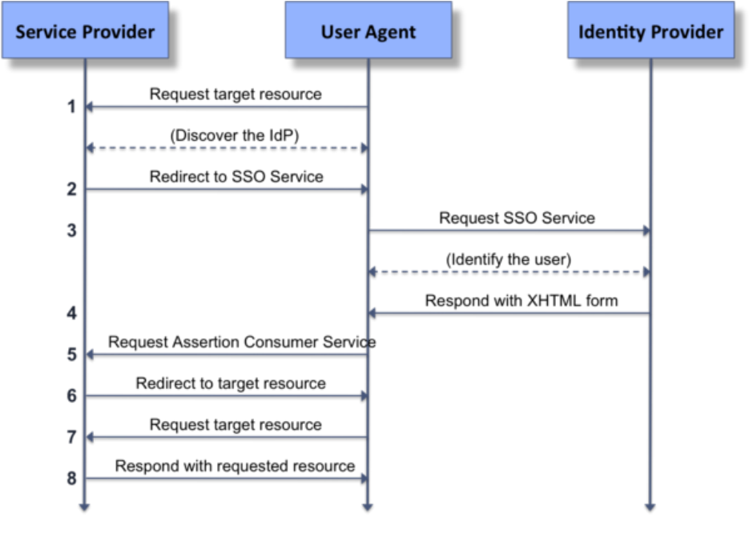

---

<!-- pagina: 102 -->

**André Castro Aula 00** 

## **OAuth** 

Seguindo a nossa estrutura de gestão de identidade e credenciais, temos agora o Oauth. Tal padrão foi concebido no nicho privado, em conjunto pela Google e pelo Twitter, permitindo assim **logins simplificados e integrados** a múltiplos serviços na **Internet** . O processo por trás é muito semelhante ao SAML que mencionamos. 

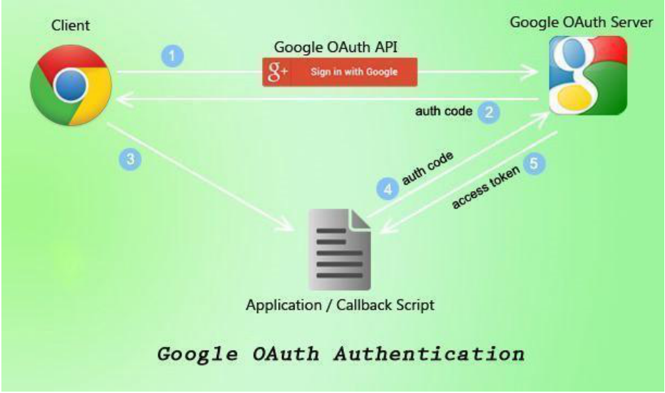

A figura acima ilustra um processo base de quando efetuamos logins por meio do **OAuth** da Google. Creio que muitos estão familiarizados com a imagem vermelha do centro, certo? Basicamente, estamos autorizando a aplicação ou serviço que estamos consumindo a realizar troca de informações com os servidores e provedores de credenciais da Google para reconhecimento da nossa identidade. A partir da chamada do serviço, no passo 2, a aplicação recebe o código de **autenticação** gerado pelo **servidor** Oauth do Google e por meio de processos em background e serviços próprios, realiza o processo de checagem para liberação de acesso com o recebimento de um token. 

Nosso intuito não é entrar no detalhe de implementação do OAuth, por ser um aspecto de cobrança mais associado a itens de desenvolvimento ao considerar bibliotecas JWT e outros. Aqui, estamos focando nos conceitos das soluções e ferramentas, além de processos que garantem a gestão de identidade e credenciais. 

O OAuth atualmente está em sua versão 2.0 e possui compatibilidade completa com sua versão 1.0. Nesse processo, são definidos 4 papéis básicos. São eles: 

**1. Resource Owner -** Basicamente é a pessoa que concede acesso aos seus dados. Quando clicamos na opção de login integrado com o Google, por exemplo, teremos que incluir nosso login e senha do google, a partir da chamada de serviço. Caso você tenha uma sessão já aberta do serviço, essa etapa não será necessária. O ponto é, após a inclusão das informações de login

---

<!-- pagina: 103 -->

**André Castro Aula 00** 

e senha, tem-se um processo de autorização, em que você autoriza a aplicação ou serviço, a obter suas informações do servidor OAuth. Na prática, temos aqui o **DONO DO RECURSO.** 

**2. Resource Server -** Em resumo, é a camada de serviço/integração disponibilizada pelo provedor de identidades. Este serviço, com as devidas camadas de segurança, está exposto para a Internet, caso seja uma API Pública, a exemplo da Google, Twitter, Facebook, ou pode estar em um contexto mais restrito, como foi o caso do serviço do Acesso.Gov que mencionamos, que pode ser utilizado apenas por órgãos de Governo. O que importa é que, nesse processo, é necessário que o serviço que realiza chamada a essa API tenha um token emitido pelo servidor de autorização, que mencionaremos a seguir. 

**3. Authorization Server** - Responsável por autenticação e emissão dos tokens de acesso (Access Token) para os Clients (aplicação requisitante). Estes recursos possuem informações dos **Resource Owner (Usuários)** e expõe no formato de Claims através do Bearer Token. Autentica e interage com o usuário após identificar e autorizar o client. Não vamos entrar em detalhes técnicos de implementação, mas registro apenas que o Bearer Token é referenciado em chamadas nos cabeçalhos HTTP e pode ser implementado de diferentes formas. No caso, tais chamadas são sempre realizadas por meio de HTTPS, uma vez que o token é passado de forma aberta no cabeçalho HTTP. Esse ponto é fundamental para garantir a segurança do Oauth2.0. 

**4. Client** - É a aplicação que interage com o **Resource Owner** . No caso de uma App Web, seria a aplicação do Browser. Na prática, é a camada que oferece os serviços requisitados pelos usuários. 

A imagem a seguir representa bem a execução desses papéis e respectivos fluxos, vejamos: 

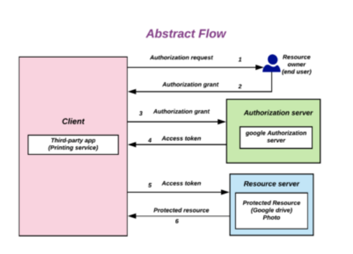

A partir do momento, portanto, que um usuário acessa um site e solicita o acesso ou tenta realizar o login, inicia-se o processo 

**ETAPA 1** - A aplicação (cliente) solicita autorização para o usuário, para que a aplicação possa interagir e solicitar informações de suas credenciais junto ao provedor de identidade. 

**ETAPA 2** - O Dono do Recurso (resource owner) realiza a autorização. 

**ETAPA 3** - De posse da autorização, esta é encaminhada pelo cliente ao Servidor de Autorização, responsável por viabilizar a passagem das credenciais de acesso aos serviços do provedor.

---

<!-- pagina: 104 -->

**André Castro Aula 00** 

**ETAPA 4** - O provedor de credenciais passa o TOKEN, por meio de uma comunicação segura. De posse desse token, a aplicação poderá acessar os recursos do usuário requisitante. Aqui é onde temos a referência ao nosso BEARER TOKEN, que também será utilizado na etapa 5. São as credenciais em si usadas para acessar os recursos protegidos. 

**ETAPA 5** - Passa-se o token aos provedores de serviços que detêm os recursos protegidos dos usuários. Na imagem em questão, temos exemplos de serviços da google como o Google Drive ou Google Photo, que passa a ser acessado pelo Client com a devida autorização do usuário Dono do Recurso, realizado no passo 2. 

**ETAPA 6** - As informações e recursos protegidos são compartilhados com o Cliente. É nessa etapa que é possível, por exemplo, já ter a sua foto integrada com o serviço web requisitado, outras informações, como e-mail, dados de telefone, recursos específicos no Drive, lista de amigos e contatos, entre muitos outros. 

**Ano: 2024 Banca: CESPE / CEBRASPE Órgão: TCDF** 

**Os tokens de acesso devem ser lidos e interpretados pelo cliente OAuth, que é o público-alvo do token.** 

###### **Comentários:** 

Há uma série de propriedades de tokens de acesso que são fundamentais para o modelo de segurança do OAuth. Os tokens de acesso não devem ser lidos ou interpretados pelo cliente OAuth. O cliente OAuth não é o público-alvo do token. 

**Gabarito** : E 

Algumas bancas começam a trazer uma visão mais técnica para o conteúdo do OAUTH, exigindo do candidato um conhecimentos mais aprofundados de parâmetros, bibliotecas e itens de configuração, de uma forma geral. Esse mesmo assunto também é abordado pela nossa equipe de professores de desenvolvimento. 

Entretanto, vou trazer alguns pontos relevantes aqui nesse contexto para garantir a visibilidade de vocês desses temas. 

###### **1.** **<u>Tipos de Clientes:</u>** 

No OAuth 2.0, existem dois tipos de clientes: **<u>confdenciais e públicos.</u>** Vamos entender as diferenças:

---

<!-- pagina: 105 -->

**André Castro Aula 00** 

###### a) Clientes Confidenciais: 

Estes tipos de clientes são registrados com um segredo do cliente. Com isso, podem manter a confidencialidade de suas credenciais. 

Como exemplos, podemos citar as integrações entre serviços da organização ou aplicativos que consomem APIs internas. Esses clientes podem armazenar e proteger suas credenciais de acesso. 

###### b) Clientes Públicos: 

Em uma outra perspectiva, estes não conseguem manter a confidencialidade de suas credenciais. Por isso, são usados em cenários como aplicativos móveis ou baseados em navegador, justamente por não possuírem um segredo do cliente. 

Assim, como requisito, temos que as credenciais do cliente não precisam ser mantidas em sigilo. 

###### **2.** **<u>TIPOS DE TOKENS</u>** 

###### **a) Bearer Tokens:** 

São usados para acessar recursos protegidos em nome de um usuário. Neste contexto, o portador apresenta um token válido para obter acesso. Tem como vulnerabilidade ou ponto de atenção o fato de não haver verificação da legitimidade do remetente. Logo, pode ser vulnerável se cair em mãos não autorizadas. 

###### **b) Sender-Constrained Tokens (Mutual TLS):** 

Garantem que o remetente seja legítimo. Para tanto, são vinculados à conexão TLS mútua entre cliente e servidor de autorização. O servidor de recursos verifica o certificado do cliente, o que, na prática, traz uma burocracia para o processo justamente pela necessidade da Infraestrutura de chaves públicas e certificados do cliente. 

O token inclui o hash do certificado (por exemplo, no JWT). O remetente deve provar que possui a chave privada do certificado vinculado. 

###### **c) ID Tokens:** 

Fornecem informações sobre o usuário autenticado. Como o próprio nome já diz, o ID, vem justamente de Identificação, sendo essas informações emitidas pelo provedor de identidade. 

Contêm detalhes como ID do usuário e escopo. Justamente por tratar somente da camada de identificação e não de autenticação/autorização, propriamente ditos, acabam por não serem usados para acessar recursos protegidos. 

###### **d) Refresh Tokens:** 

Permitem obter novos access tokens sem novo login. São mais duradouros que os access tokens e geralmente são usados para renovar tokens expirados. Falaremos mais dele no tópico a seguir.

---

<!-- pagina: 106 -->

**André Castro Aula 00** 

###### **3.** **<u>REFRESH TOKEN</u>** 

Um Refresh Token é uma sequência (string) que o cliente OAuth pode usar para obter um novo access token sem a interação do usuário, tendo como premissa a autorização inicial que ele obteve na primeira requisição ao usuário. 

Tanto clientes públicos quanto confidenciais podem usar refresh tokens. Se um refresh token emitido para um cliente público for roubado, o atacante pode se passar pelo cliente e usar o refresh token sem ser detectado. 

Quando inicialmente se recebe o access token, **<u>ele pode incluir um refresh token e um tempo de expiração. Vejam que é um item opcional e confgurável.</u>** 

Com isso, é possível atualizar o conteúdo ou o recurso sem nova solicitação ou interação com o Dono do Recurso, sendo processado tudo em background dos sistemas envolvidos. 

O valor “expires_in” indica quantos segundos o access token será válido. 

É possível usar esse timestamp para atualizar os access tokens antes que eles expirem, evitando falhas em chamadas de API. 

Para fins práticos, caso queira utilizar o refresh token, basta fazer uma solicitação POST para o endpoint de token com grant_type=refresh_token, incluindo o refresh token e as credenciais do cliente, se necessário: 

POST /oauth/token HTTP/1.1 

Host: authorization-server.com 

grant_type=refresh_token 

&refresh_token=xxxxxxxxxxx 

&client_id=xxxxxxxxxx 

&client_secret=xxxxxxxxxx 

A resposta incluirá um novo access token e, opcionalmente, um novo refresh token. 

A imagem abaixo nos traz essa dinâmica em diagrama de fluxos de mensagens, extraído diretamente da documentação oficial do OAUTH. Reparem que, após o acesso ao recurso protegido, na etapa D, uma nova tentativa de uso do Token anterior é feita em E, porém, o token não é mais válido em F. Com isso, pode-se utilizar o Refresh Token em G para a geração de um novo TOKEN em H sem a interação com o usuário, bastante a interação com o Authorization Server.

---

<!-- pagina: 107 -->

**André Castro Aula 00** 

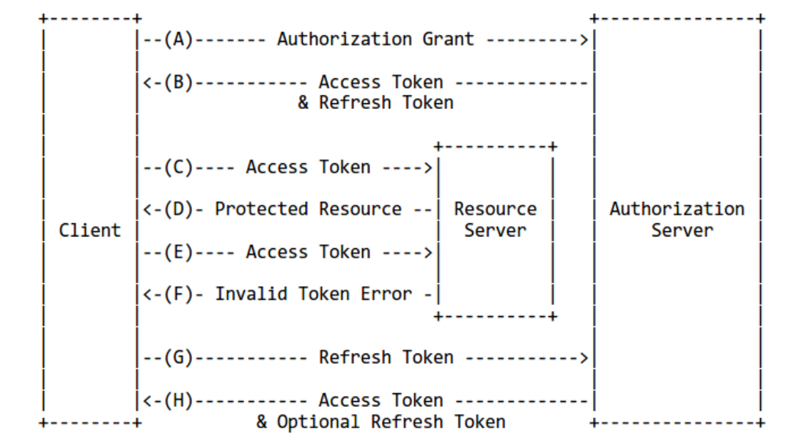

<!-- Start of picture text -->
==5460== <!-- End of picture text -->

==5460== **Ano: 2024 Banca: CESPE / CEBRASPE Órgão: TCDF Os tokens Sender-constrained exigem que, para usar o token de acesso, o cliente OAuth prove, de alguma forma, a posse de uma chave privada, de modo que o token de acesso por si só não seja utilizável.** 

###### **Comentários:** 

Exatamente a camada adicional de segurança que comentamos em nossa teoria, que incorpora a infraestrutura de chaves públicas e certificados digitais, com a posse da chave privada.. 

**Gabarito** : C 

Um ponto importante que tem aparecido em prova dentro deste tópico são as abordagens de boas práticas de configuração e perspectivas de segurança. Dessa forma, vamos trabalhar ainda alguns conceitos:

---

<!-- pagina: 108 -->

**André Castro Aula 00** 

#### **<u>Boas Práticas de Segurança para JWT</u>** 

1. Use Algoritmos Seguros: 

   - Prefira algoritmos como HS256 ou RS256 para assinar seus tokens. 

2. Mantenha as Chaves Secretas Seguras: 

   - Armazene as chaves secretas em locais seguros e nunca as exponha no código-fonte. 

3. Defina um Tempo de Expiração Curto: 

   - Configure um tempo de expiração curto para os tokens (exp claim) para minimizar o impacto de um token comprometido. 

4. Revogação de Tokens: 

   - Implemente um mecanismo para revogar tokens, como uma lista de tokens revogados. 

5. Validação de Tokens: 

   - Sempre valide o token no servidor, verificando a assinatura e as claims. 

6. Use HTTPS: 

   - Transmita tokens apenas por conexões seguras (HTTPS) para evitar ataques de interceptação. 

7. Minimize as Claims: 

   - Inclua apenas as informações necessárias nas claims do token para reduzir o risco de exposição de dados sensíveis. 

8. Verificação de Origem: 

   - Verifique a origem do token (iss claim) para garantir que ele foi emitido por uma fonte confiável. 

#### **<u>Boas Práticas de Confguração para JWT</u>** 

1. Configuração de Claims: 

   - Defina claims padrão como iss (issuer), sub (subject), aud (audience) e exp (expiration). 

2. Uso de Bibliotecas Confiáveis: 

   - Utilize bibliotecas bem mantidas e confiáveis para a geração e validação de JWTs. 

3. Rotação de Chaves: 

   - Implemente a rotação periódica de chaves para aumentar a segurança. 

4. Escopo e Permissões: 

   - Defina escopos e permissões claras dentro do token para controlar o acesso aos recursos.

---

<!-- pagina: 109 -->

**André Castro Aula 00** 

5. Monitoramento e Logs: 

   - Monitore e registre o uso de tokens para detectar e responder a atividades suspeitas. 

6. Política de Renovação de Tokens: 

   - Estabeleça uma política clara para a renovação de tokens, garantindo que os usuários obtenham novos tokens antes que os antigos expirem. 

#### **Manipulação de Tokens Sem Estado de Curta Duração** 

1. Tokens de Curta Duração: 

   - Utilize tokens de curta duração para minimizar o impacto de um token comprometido. Tokens de curta duração são ideais para aplicações sem estado, onde o servidor não mantém informações sobre o estado do cliente entre as requisições. 

2. Renovação de Tokens: 

   - Implemente um mecanismo de renovação de tokens, onde um token de curta duração pode ser trocado por um novo token antes de expirar. Isso pode ser feito através de um endpoint de renovação seguro. 

3. Tokens de Atualização (Refresh Tokens): 

   - Utilize tokens de atualização para emitir novos tokens de curta duração. Os tokens de atualização devem ser armazenados de forma segura e transmitidos apenas por conexões seguras. 

4. Verificação de Expiração: 

   - Sempre verifique a expiração (exp claim) dos tokens de curta duração no servidor para garantir que apenas tokens válidos sejam aceitos. 

5. Desempenho e Escalabilidade: 

   - Tokens sem estado de curta duração são leves e não requerem armazenamento no servidor, o que melhora o desempenho e a escalabilidade da aplicação.

---

<!-- pagina: 110 -->

**André Castro Aula 00** 

## **Biometria** 

Algumas questões tratam os aspectos de **BIOMETRIA** de uma maneira mais detalhada. Por esse motivo, reservamos essa seção para isso 

Para balizarmos o nosso princípio, ao analisarmos a etimologia da palavra temos: **BIO (VIDA) + METRIA (MEDIDA).** Podemos traduzir isso também como a forma de identificar de maneira única um indivíduo por meio de suas características físicas ou comportamentais. 

Trazendo um pouco mais de história em nosso estudo, é importante citar a importância de FRANCIS DALTON, considerado um dos fundadores do processo de biometria. Seu estudo era baseado na identificação de características e traços genéticos. Em 1982, GALTON inventou o primeiro sistema moderno de **IMPRESSÕES DIGITAIS** , e que fora amplamente utilizado nos departamentos de polícia. 

Como vimos anteriormente, o processo de biometria está atrelado à fase de autenticação e autorização, principalmente, para fins de controle de acesso. 

Desse modo, quando falamos de **ALGO QUE VOCÊ É,** podemos utilizar alguns recursos para tal finalidade, como por exemplo: 

**1. Impressão Digital** 

**2. Palma da mão** 

**3. Imagem da Face** 

**4. Retina ou íris dos olhos (a retina analisa o fundo do olho, enquanto a retina analisa os anéis coloridos do olho, sendo este mais rápido que aquele)** 

**5. Reconhecimento de voz** 

Desse modo, os filmes futuristas, bem como aqueles que retratam assaltos a cofres muito seguros, necessariamente passam pelo processo de biometria. 

A imagem abaixo nos traz uma visão agregada das principais técnicas de biometria:

---

<!-- pagina: 111 -->

**André Castro Aula 00** 

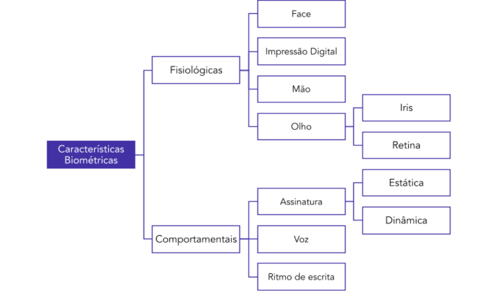

Fonte: http://www.sinfic.pt 

Nesse sentido, a biométrica zela pelos princípios de unicidade abaixo: 

**1. Universalidade** – Significa que todas as pessoas devem possuir a característica; 

**2. Singularidade** – Indica que esta característica não pode ser igual em pessoas diferentes; 

**3. Permanência** – Significa que a característica não deve variar com o tempo; 

**4. Mensurabilidade** – Indica que a característica pode ser medida quantitativamente; 

Analisando a estrutura de um sistema biométrico, podemos elencar ainda as etapas desses sistemas: 

**1. Captura** – Aquisição da amostra biométrica; 

**2. Extração** – Remoção da amostra com informações únicas para posterior análise; 

**3. Comparação** – Comparação com as informações armazenadas em uma base de dados. Caso a comparação seja positiva, tem-se um “match”, dando o resultado como positivo.

---

<!-- pagina: 112 -->

**André Castro Aula 00** 

###### **Ano: 2021 Banca: CESPE / CEBRASPE Órgão: SEFAZ-AL** 

**O uso de senhas ou a adoção de identificação física, como biometrias, são formas de autenticação para fins de identificação única e exclusiva de usuários.** 

###### **Comentários:** 

Pessoal, a questão retrata, de fato, as finalidades de senhas associadas a biometrias. A exclusividade, como vimos é um princípio da biometria. No trecho, vimos o termo SINGULARIDADE. **Gabarito** : C 

###### **Ano: 2021 Banca: CESPE / CEBRASPE Órgão: PG-DF** 

**Uma das condições para a autenticação é que o sinal biométrico apresenta correspondência exata entre o sinal biométrico recebido pelo sistema e o gabarito armazenado.** 

###### **Comentários:** 

Pessoal, vimos que existem os modelos comportamentais, certo? Esses modelos, também são sinais biométricos e trabalham com referências variáveis, mas dentro de um padrão aceitável, com taxa de similaridade e equivalência alto. Agora, dizer que o gabarito tem que ser exato, não é uma verdade para sua generalização. **Gabarito** : E 

###### **CESPE – TJ-SE/Analista Judiciário – Segurança da Informação/2014** 

**Os métodos de autenticação comumente empregados fundamentam-se na clássica divisão entre o que você sabe (senha ou número PIN); o que você tem (token ou um smart card); e o que você é (íris, retina e digitais).** 

###### **Comentários:** 

Conforme vimos, de fato, estes são os três principais métodos. 

**Gabarito** : C

---

<!-- pagina: 113 -->

**André Castro Aula 00** 

Um outro mecanismo interessante que surge é por meio de autenticadores em dispositivos móveis. Por vezes, também conhecidos como tokens de segurança ou chaves de sessão, conforme mencionaremos a seguir sobre HOTP e TOTP, podem ser efetivados por meio de aplicativos próprios que permitem a vinculação a determinados serviços e seus usuários. 

Antes de explicarmos seu funcionamento, vamos citar alguns deles: 

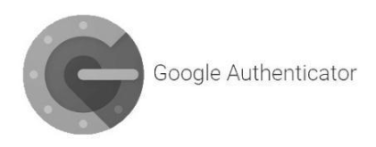

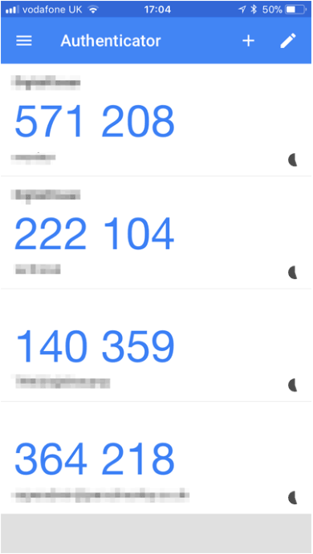

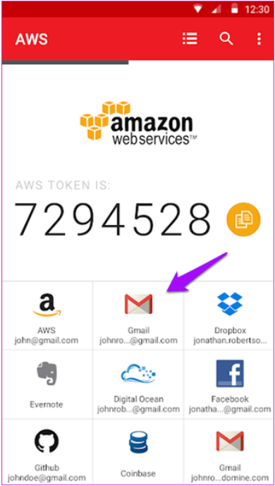

---

<!-- pagina: 114 -->

**André Castro Aula 00** 

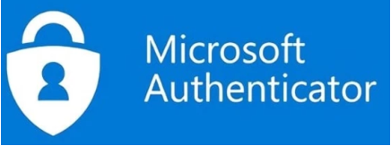

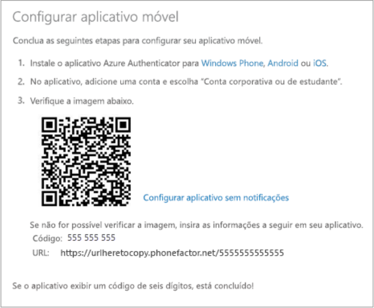

Apresentei uma lista de três aplicativos distintos. O fluxo base de configuração é o mesmo. O site específico do serviço gerará um QRCODE para que seja lido pelo aplicativo. Neste momento, haverá a vinculação da conta e site, junto ao aplicativo. A partir deste instante, todo acesso dependerá de algum nível de aprovação no aplicativo como segundo fator de autenticação, ou ainda, será necessária a extração de uma informação dos códigos de cada aplicativo gerado no aplicativo. Esses códigos são dinâmicos e de tempos em tempos, geralmente 30 segundos, são alterados.

---

<!-- pagina: 115 -->

**André Castro Aula 00** 

## **HOTP (HMAC-Based One-Time Password) e TOTP (Time-Based One-Time Password)** 

A autenticação multifator (MFA) frequentemente recorre a códigos descartáveis para comprovar posse de um segredo. Nesse universo, HOTP (HMAC-Based One-Time Password) e TOTP (Time-Based One-Time Password) são mecanismos de OTP que derivam um código curto (normalmente 6 a 8 dígitos) a partir de um segredo compartilhado (seed) e de um parâmetro variável. O objetivo é gerar uma “chave de uso efêmero” que valide a sessão sem expor o segredo de longo prazo. 

No HOTP, o parâmetro variável é um contador de eventos. Cada vez que usuário e servidor “avançam” o contador, ambos aplicam HMAC (SHA-1/256/512) sobre o par {segredo, contador}, fazem a truncagem dinâmica e produzem o código. **<u>Por ser orientado a evento, o HOTP não depende de relógio; ele depende de sincronização de contadores.</u>** O servidor aceita o valor do contador atual ou dentro de uma “janela” de avanço para tolerar usos fora de ordem, ajustando-se depois. Essa janela, se muito larga, aumenta a superfície de ataque por guessing; se muito estreita, aumenta rejeições legítimas. 

**<u>No TOTP, o parâmetro variável é o tempo</u>** , discretizado em passos (tipicamente 30 segundos). O código resulta de HMAC sobre {segredo, time-step}, seguido da mesma truncagem. Aqui a sincronização é de relógio: pequenas diferenças entre cliente e servidor são acomodadas aceitando o passo atual e, opcionalmente, passos adjacentes. Isso reduz a necessidade de “resincronizar estado”, mas introduz riscos se relógios estiverem muito desalinhados ou se o time-step for configurado de forma imprudente. 

Conceitualmente, o “segredo” (seed) é o fator de posse real e persistente; o código HOTP/TOTP é um artefato transitório que funciona como uma “chave de sessão” de curtíssima duração. Por isso, políticas de rate-limiting, bloqueio progressivo e detecção de tentativas devem acompanhar qualquer implementação, pois a força bruta online é a ameaça primária. 

Em termos operacionais, HOTP brilha em cenários offline ou de acionamento assíncrono (tokens físicos com botão, fluxos que não garantem conectividade contínua). Sua principal fragilidade prática é a perda de sincronização de contador: se o usuário gerar muitos códigos sem validá-los, o servidor pode “ficar para trás” e precisar de uma janela maior ou de um processo de resincronização, o que tem implicações de segurança e suporte. 

Já o TOTP é preferido em aplicativos móveis e integradores modernos por sua simplicidade de uso (“abra o app e leia o código”) e pela ausência de estado mutável no servidor além do

---

<!-- pagina: 116 -->

**André Castro Aula 00** 

relógio. Ele, contudo, herda riscos de sincronização temporal: dispositivos com hora incorreta, drift de relógio ou mudanças bruscas de fuso podem levar a rejeições. Boas práticas incluem NTP confiável no servidor, tolerância a um passo anterior/posterior e telemetria para detectar padrões anômalos de expiração. 

Do ponto de vista criptográfico, ambos utilizam HMAC como função de derivação, com chave = segredo e mensagem = contador (HOTP) ou time-step (TOTP). No ciclo de vida do segredo, HOTP e TOTP são iguais: o seed é provisionado, armazenado de modo seguro no aplicativo/token e no servidor, e deve ter rotação e revogação planejadas. Backups de seed exigem cautela, pois sincronizar o mesmo segredo em múltiplos dispositivos amplia a superfície de comprometimento. Para ambientes corporativos, políticas de inscrição guiada, proteção por biometria/local secure enclave e inventário de fatores ativos ajudam a manter governança. 

Quanto a usabilidade e suporte, TOTP tende a gerar menos chamados que HOTP por não exigir resincronização de contador. Em contrapartida, ataques por phishing-relay afetam ambos: como o código é “algo que você tem” porém legível, um invasor que o obtenha em janela válida pode reutilizá-lo. Mitigações incluem rate-limiting, vinculação de contexto (origem do login, device binding), push MFA com number matching e, idealmente, adoção progressiva de métodos resistentes a phishing (FIDO2/WebAuthn) para contas de maior risco. 

Em síntese, HOTP e TOTP resolvem o mesmo problema com ancoragens distintas: evento versus tempo. HOTP é robusto sem relógio, mas exige gestão de estado; TOTP é stateless do ponto de vista do servidor, mas depende de sincronização temporal. Em ambos, a segurança efetiva vem menos do algoritmo e mais das proteções de tentativa, do manejo do segredo e das defesas contra phishing. Para novas implantações, TOTP costuma ser a escolha padrão por simplicidade operacional, com trilha de evolução para fatores resistentes a phishing em contas críticas. 

Focando nas palavras chaves: 

- (i) HOTP = contador; TOTP = tempo; 

(ii) ambos derivam o código de um segredo via HMAC e truncagem; 

(iii) o espaço de códigos é pequeno, portanto políticas de tentativa e janelas de aceitação são tão importantes quanto o algoritmo; 

(iv) o OTP é um comprovante efêmero de posse, não o segredo em si; 

(v) resistência a phishing não é garantida — para isso, considere FIDO2/WebAuthn.

---

<!-- pagina: 117 -->

**André Castro Aula 00** 

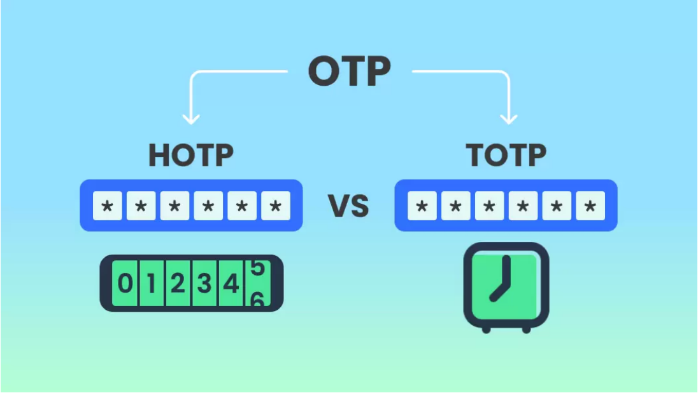

---

<!-- pagina: 118 -->

**André Castro Aula 00** 

## **OPENID Connect - OIDC** 

Aqui temos um conceito associado à criação da camada que atua sobre as soluções de gestão de identidade (OAUTH). 

Ela permite aos clientes/aplicações a verificação da identidade do usuário final integrado aos recursos do Servidor de Autorização. 

O OpenID Connect (OIDC) é um protocolo de autenticação que permite que usuários se autentiquem em um serviço usando suas credenciais de um provedor de identidade (IDP). O OIDC é um protocolo leve e flexível que pode ser integrado a uma ampla gama de serviços. 

As principais características do OIDC são: 

- **Autenticação baseada em tokens:** O OIDC usa tokens para autenticar usuários. Esses tokens são emitidos pelo IDP e são usados pelo serviço para verificar a identidade do usuário. 

- **Autorização baseada em declarações:** O OIDC usa declarações para autorizar usuários a acessar recursos. Essas declarações são emitidas pelo IDP e são usadas pelo serviço para determinar quais recursos o usuário pode acessar. 

- **Descentralização:** O OIDC é um protocolo descentralizado. Isso significa que não há um único ponto de falha ou controle. 

Ainda, o OIDC oferece uma série de vantagens em relação a outras tecnologias de autenticação, incluindo: 

- **Simplicidade:** O OIDC é um protocolo simples e fácil de implementar. 

- **Flexibilidade:** O OIDC pode ser integrado a uma ampla gama de serviços. 

- **Segurança:** O OIDC usa criptografia para proteger os dados do usuário. 

- **Interoperabilidade:** O OIDC é um protocolo interoperável que pode ser usado com uma ampla gama de IDPs. Opera por meio de API/RESTFULL e tem como característica o fato de ser Multiplataforma. 

## **KeyCloak** 

Na mesma linha, temos aqui uma ferramenta muito importante e de código aberto (opensource) de Gerenciamento de Acesso e Identidade. 

Sendo muito fácil de configurar e implantar a gestão de identidade, o KeyCloak vem sendo usado cada vez mais pelas instituições. 

A ferramenta, assim como o OPENID Connect é baseada em API-Restfull, tendo as seguintes características: 

- Fornece telas de login personalizáveis 

- Recursos de Recuperação de Senhas 

- Termos de uso 

- Ausência de necessidade de codificação

---

<!-- pagina: 119 -->

**André Castro Aula 00** 

- Recurso de MFA 

- Isolamento da aplicação com a camada de autenticação 

- Visualização dos tokens do KeyCloak 

- Recursos de SSO 

- Utiliza OAUTH2.0 + OpenID 

- Possui banco de dados próprio 

- Pode integrar com AD ou LDAP 

A seguir, temos uma tela exemplo da ferramenta e seu painel de gerenciamento e configuração: 

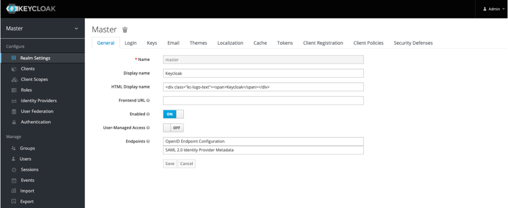

**FGV - 2022 - TRT - 13ª Região (PB) - Técnico Judiciário - Tecnologia da Informação** 

**Marcia decidiu padronizar o mecanismo de autenticação de suas APIs RESTful e armazenar com segurança as credenciais de usuários e suas respectivas permissões. Para isso, ela deseja utilizar uma ferramenta de código aberto.** 

**A ferramenta que tem por principal finalidade o gerenciamento de identidade e acesso que Márcia deve escolher é** 

**A JBoss.** 

**B Keycloak.** 

**C Kibana.** 

**D RabbitMQ.** 

**E Wildfly.**

---

<!-- pagina: 120 -->

**André Castro Aula 00** 

###### **<u>Comentários:</u>** 

Temos aí pessoal uma questão que traz a forma de abordagem da solução KeyCloak. Apenas para validarmos as outras tecnologias/ferramentas: 

**JBoss -** Um servidor de aplicação Java EE de código aberto, desenvolvido pela Red Hat. Oferece uma plataforma para construir, implementar e executar aplicações empresariais. Suporte a diversas tecnologias, como EJB, CDI, JPA e JSF. 

**Kibana:** Uma ferramenta de visualização de dados e interface de usuário do Elastic Stack. Permite explorar, analisar e visualizar dados armazenados no Elasticsearch. Utilizada para monitoramento, análise de logs e business intelligence. 

**RabbitMQ:** Um message broker de código aberto que implementa o protocolo Advanced Message Queuing Protocol (AMQP). Facilita a comunicação entre aplicações através de mensagens assíncronas. Oferece alta disponibilidade e escalabilidade. 

**Wildfly:** Anteriormente conhecido como JBoss AS, é um servidor de aplicação Java EE de código aberto. Desenvolvido pela Red Hat, permite a criação e implantação de aplicações empresariais. Suporta diversas tecnologias, como EJB, CDI, JPA e JSF. 

###### **Gabarito: B**

---

<!-- pagina: 121 -->

**André Castro Aula 00** 

# **PROTOCOLOS DE AUTENTICAÇÃO SEM SENHA** 

Nos editais mais recentes surgem dois grupos de protocolos que dispensam **senhas digitadas** : 

|**Categoria**|**Ponto-chave**|**Exemplos que caem em** **prova**|
|---|---|---|
|**Autenticação forte ao** **serviço**|Cria um par de chaves assimétricas para o usuário; a privada nunca sai do dispositivo.|**FIDO2 / WebAuthn** (passkeys, CTAP2)|
|**Autenticação + sigilo** **ponta-a-ponta em** **mensagens**|Estabelece chaves efêmeras e faz ratchet contínuo; nenhuma senha precisa ser trocada.|**Protocolo Signal** (X3DH/PQXDH + Double Ratchet)|

## **FIDO2 / WebAuthn** 

Uma primeira definição importante é que FIDO2 nada mais é do que o WebAuthn (API W3C) + CTAP2 (Client-to-Authenticator Protocol) sob a égide da FIDO Alliance. 

Como já antecipamos, ele tem a perspectiva de Substituir senhas e OTP por — passkeys credenciais públicas criadas no dispositivo do usuário e liberadas via biometria/PIN. Atualmente, o WebAuthn Level 3 está em rascunho desde 2025, acrescentando autenticação empresarial e suporte nativo a carteira digital de credenciais

---

<!-- pagina: 122 -->

**André Castro Aula 00** 

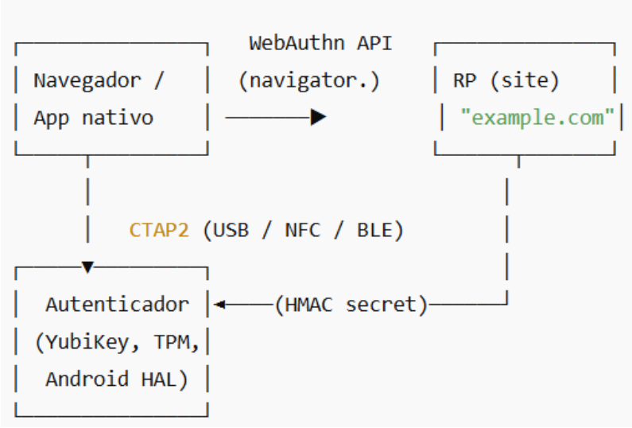

---

<!-- pagina: 123 -->

**André Castro Aula 00** 

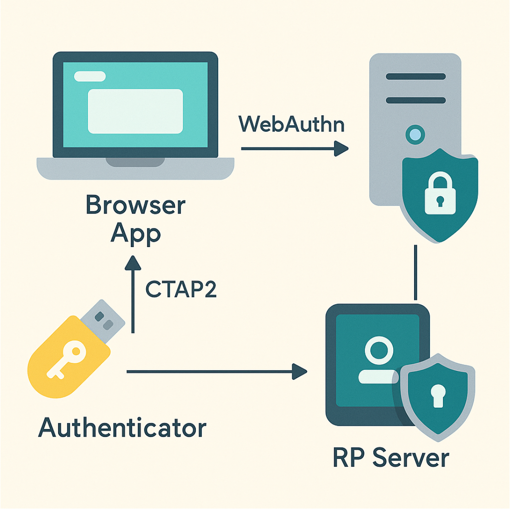

- **Autenticadores** podem ser **roaming** (chave USB/NFC) ou **plataforma** (TPM, Secure Enclave). 

- **Passkey residente** = chave privada armazenada no dispositivo; **não residente** = armazenada no servidor em formato “credential ID” criptografado. 

- **Attestation** comprova a procedência do hardware (AAGUID).

---

<!-- pagina: 124 -->

**André Castro Aula 00** 

Assim, toda autenticação, na prática, é um MFA com algo que você tem (par de chaves) + algo que você é/sabe (biometria ou PIN local). 

A primeira fase do processo é o CADASTRA (CREATE), o RP envia o desafio (challenge); autenticador gera par de chaves e assinatura de attestation; RP grava publicKeyCredential. 

Em seguida, temos o processo de AUTENTICAÇÃO (GET), onde o RP emite novo challenge; autenticador assina com chave privada; navegador devolve assertion. 

Esse tipo de recurso traz algumas vantagens abordadas em diferentes perspectivas pelas bancas. A saber: 

|**Tema**|**O que a banca cobra**|
|---|---|
|**Phishing** **resistance**|Chave privada só assina o domínio que gerou orpId; ataque de phishing falha.|
|**Comparação com** **MFA**|“Por que FIDO2 é mais seguro que SMS‐OTP?”→Sem canal legível, sem man-in-the-middle.|
|**CTAP vs** **WebAuthn**|CTAP fala com o autenticador; WebAuthn fala com a aplicação.|
|**Passkeys**|Adesão maciça em 2024: > 15 bi contas aptas a usar passkeys, Apple/Google/MS integrados. (fdoalliance.org,microsoft.com)|

## **Protocolo Signal** 

Novamente estamos diante do objetivo de se viabilizar uma autenticação mútua sem senha, que se traduz em (chaves de longo prazo + QR code para safety numbers). 

Por meio do SIGNAL busca-se a confidencialidade e integridade das mensagens. Traz-se ainda uma visão de segurança passada constante, o que isso quer dizer, que se a chave de hoje vazar, ontem continua segura. Um termo técnico para isso é o Forward & post-compromise secrecy. 

Isso naturalmente está associado ao processo de DENIABILITY que quer dizer a inexistência de assinaturas persistentes.

---

<!-- pagina: 125 -->

**André Castro Aula 00** 

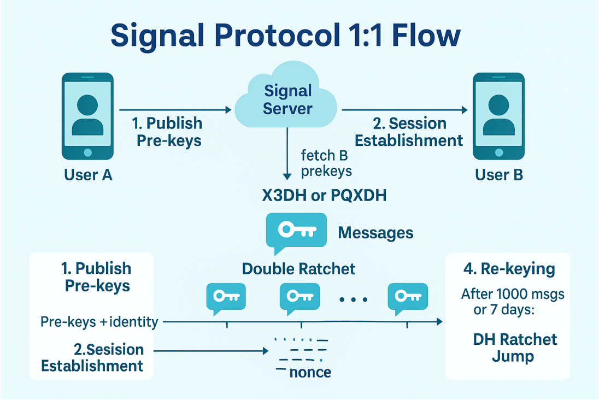

De forma simplificada, temos o seguinte fluxo: 

1. **<u>Publish prekeys:</u>** cada usuário envia ao servidor chaves “one-time” + identidade. 

2. **<u>Sessão: USER</u>** <u>A obtém prekeys de USER B, roda X3DH/PQXDH</u> → chave master. 

3. **<u>Mensagens:</u>** execução do **Double Ratchet (elemento que garante o encaminhamento** → 

**seguro)** para cada mensagem, nova chave de chain, novo nonce. 

4. **<u>Re-chaveamento</u>** <u>: a cada 1000 mensagens ou 7 dias, pula DH ratchet para limitar janela de</u> comprometimento. 

Trazendo uma visão comparativa entre o SIGNAL e FIDO2, temos: 

|**Propriedade**|**Signal**|**FIDO2**|
|---|---|---|
|**Camada OSI**|Aplicação (mensageria)|Aplicação + Autenticador|

---

<!-- pagina: 126 -->

**André Castro Aula 00** 

|**Tipo de segredo**|Efêmero ratcheteado|Chave privada fxa protegida por hardware|
|---|---|---|
|**Alvo de phishing**|Não se aplica (QR/emoji)|Barra endereço; domínio assinado|
|**Resistência** **pós-quântica**|Parcial (PQXDH)|A ser defnido (FIDO Alliance estuda PQC-CTAP)|

- **<u>FIDO2 / WebAuthn</u>** eliminam senhas no login a serviços, baseados em chaves assimétricas e autenticação local do usuário. 

- **<u>Signal</u>** aplica autenticação sem senha + criptografia ponta-a-ponta em mensageria, combinando protocolos X3DH/PQXDH e Double Ratchet para garantir sigilo, autenticidade e rotatividade de chaves. 

Referências: 

1. <u>https://www.varonis.com</u> 

2. <u>www.akamai.com</u> 

3. <u>www.cloudfare.com</u> 

4. <u>https://www.oracle.com</u> 

5. <u>https://fdoalliance.org/fdo2/</u> 

6. <u>https://www.w3.org/TR/webauthn-3</u>

---

<!-- pagina: 127 -->

**André Castro Aula 00** 

# **<mark>Q</mark> UESTÕES** **<mark>C</mark> OMENTADAS** **<mark>- A</mark> UTENTICAÇÃO E SEUS** **<mark>M</mark> ECANISMOS** **<mark>- CESPE</mark>** 

**1. CESPE / CEBRASPE - 2025 - TRF - 6ª REGIÃO - Analista Judiciário – Área: Apoio Especializado – Especialidade: Tecnologia da Informação** 

**A estrutura de autorização do OAuth 2.0 permite que uma aplicação obtenha acesso ilimitado a um serviço HTTP se houver token válido, mas não permite que uma aplicação de terceiros obtenha acesso por conta própria.** 

###### **Comentários:** 

A estrutura de autorização do OAuth 2.0 permite que aplicações de terceiros obtenham acesso limitado a recursos em nome de um usuário, mas não acesso ilimitado. 

**Gabarito: E** 

**2. CESPE / CEBRASPE - 2025 - TRF - 6ª REGIÃO - Analista Judiciário – Área: Apoio Especializado – Especialidade: Tecnologia da Informação** 

**Em Keycloak, a troca de token é o processo pelo qual um cliente pode trocar um token Keycloak existente por um token externo.** 

###### **Comentários:** 

Em Keycloak, a troca de token permite que um token válido seja trocado por um token de outro sistema, facilitando a integração com sistemas externos. Isso quer dizer que é possível integrar com sistemas de tokens como do Google, Microsoft e outros. 

**Gabarito: C** 

**3. CESPE / CEBRASPE - 2025 - TRF - 6ª REGIÃO - Analista Judiciário – Área: Apoio Especializado – Especialidade: Tecnologia da Informação** 

**De acordo com a especificação OAuth 2.0, o token de acesso, credencial utilizada para acessar recursos protegidos, é uma string que representa uma autorização emitida para o cliente.** 

###### **Comentários:** 

No OAuth 2.0, o token de acesso é a credencial usada para acessar recursos protegidos. Ele é uma string gerada pelo servidor de autorização e associada a um conjunto de permissões

---

<!-- pagina: 128 -->

**André Castro Aula 00** 

(escopos) definidas para o cliente. Esse token representa uma autorização concedida para um cliente, e é essencial para autenticar a comunicação entre o cliente e os servidores de recursos. 

###### **Gabarito: C** 

**4. CESPE / CEBRASPE - 2025 - TRF - 6ª REGIÃO - Analista Judiciário – Área: Apoio Especializado – Especialidade: Tecnologia da Informação** 

**Segundo o OAuth 2.0, o SSO (single sign-on) ocorre quando um usuário, ao fazer login em um aplicativo, automaticamente faz login em outros aplicativos.** 

###### **Comentários:** 

No OAuth 2.0, o conceito de Single Sign-On (SSO) permite que o usuário faça login em um aplicativo e, automaticamente, seja autenticado em outros aplicativos conectados. Isso proporciona uma experiência mais fluida para o usuário e é amplamente utilizado em ambientes corporativos para facilitar a gestão de múltiplas autenticações. 

###### **Gabarito: C** 

**5. CESPE / CEBRASPE - 2025 - TRF - 6ª REGIÃO - Analista Judiciário – Área: Apoio Especializado – Especialidade: Tecnologia da Informação** 

**Conforme o OAuth 2.0, o single sign-on é possível mediante a implementação de sessões, entretanto o single logout deve ser realizado individualmente.** 

###### **Comentários:** 

Embora o OAuth 2.0 permita a implementação de Single Sign-On, o conceito de Single Logout não é trivial e precisa ser tratado separadamente, uma vez que o logout de um serviço pode não afetar outros serviços. O OAuth 2.0 não define explicitamente um método para implementar o logout único entre todos os serviços, o que requer soluções adicionais. 

###### **Gabarito: E** 

**6. CESPE / CEBRASPE - 2025 - PC-DF - Gestor de Apoio as Atividades Policiais Civis - Especialidade: Analista de Informática: Rede de Computadores** 

**No contexto do protocolo OpenID Connect, um identity token representa o resultado de um processo de autenticação, com assinatura digital, que contém declarações descritoras do usuário e os detalhes da autenticação, como, por exemplo, informações sobre como e quando o usuário foi autenticado.**

---

<!-- pagina: 129 -->

**André Castro Aula 00** 

###### **Comentários:** 

O identity token no OpenID Connect representa um resultado de autenticação, assinado digitalmente, contendo informações sobre o usuário e detalhes da autenticação, como método e tempo de autenticação. 

###### **Gabarito: C** 

**7. CESPE / CEBRASPE - 2024 - TSE - Analista Judiciário – Área: Apoio Especializado – Especialidade: Tecnologia da Informação** 

**A autenticação multifatorial, um dos controles listados no Microsoft SDL (security development lifecycle), adiciona uma segunda camada crítica de segurança aos logins, a fim de proteger todos** ==5460== **os usuários, especialmente os administradores.** 

###### **Comentários:** 

Essa é a base do princípio funcional esperado para o MFA. 

**Gabarito: C** 

**8. CESPE / CEBRASPE - 2024 - STJ - Analista Judiciário - Área: Apoio Especializado - Especialidade: Suporte em Tecnologia da Informação** 

**O OAuth 2.0 utiliza refresh tokens para obter novos tokens de acesso, sem pedir ao usuário para fazer login novamente, e serve de base para o OpenID Connect, que adiciona uma camada de autenticação sobre o protocolo de autorização.** 

###### **Comentários:** 

O OAuth 2.0 permite que aplicações acessem recursos sem expor credenciais do usuário. O refresh token renova o token de acesso sem precisar autenticar novamente. O OpenID Connect usa o OAuth 2.0 como base, adicionando autenticação ao modelo de autorização. 

###### **Gabarito: C** 

**9. CESPE / CEBRASPE - 2024 - TC-DF - Auditor de Controle Externo - Área Especializada - Especialidade: Tecnologia da Informação - Orientação Microinformática de TI** 

**JWT (JSON web tokens) é um método de token criptografado com chave pública baseada em biometria de autenticação e, portanto, pode funcionar integrado ao celular de um usuário.** 

###### **Comentários:**

---

<!-- pagina: 130 -->

**André Castro Aula 00** 

O JWT não é criptografado por padrão, mas assinado digitalmente para garantir sua autenticidade. Além disso, não está diretamente relacionado à biometria, sendo usado para autenticação baseada em tokens, não credenciais biométricas. 

###### **Gabarito: E** 

**10. CESPE / CEBRASPE - 2024 - TC-DF - Auditor de Controle Externo - Área Especializada - Especialidade: Tecnologia da Informação - Orientação Microinformática de TI** 

**Usar SMS para envio de tokens de acesso e de autenticação é uma técnica que garante sigilo contra interceptação do token por terceiros, já que o SMS trafega cifrado fim a fim, logo, mesmo que o token consiga ser interceptado, ele será inútil para um atacante, por estar criptografado.** 

###### **Comentários:** 

SMS não é seguro para autenticação, pois trafega sem criptografia ponta a ponta e pode ser interceptado por ataques como SIM Swap. A recomendação é usar aplicativos autenticadores ou chaves físicas em vez de SMS para MFA. 

###### **Gabarito: E** 

**11. CESPE / CEBRASPE - 2025 - TRF - 6ª REGIÃO - Técnico Judiciário – Área: Apoio Especializado – Especialidade: Suporte Técnico** 

**Em OAuth 2.0, um servidor de recursos que aceita apenas solicitações assinadas exige que cada solicitação assinada seja identificável de maneira exclusiva e seja processada uma única vez.** 

###### **Comentários:** 

Essas são as garantias esperadas de todo processo de troca de tokens. 

**Gabarito: C** 

**12. CESPE / CEBRASPE - 2024 - TCE-AC - Analista de Tecnologia da Informação - Área: Segurança da Informação** 

**O MFA pode utilizar o fator de inerência, conhecido como autenticação por biometria, por ser uma das opções mais seguras disponíveis, considerando a sua dificuldade de ser contornada.** 

###### **Comentários:** 

O termo inerente está associado a algo intrínseco da pessoa, ou seja, algo como característica biométrica.

---

<!-- pagina: 131 -->

**André Castro Aula 00** 

**Gabarito: C** 

**13. CESPE / CEBRASPE - 2024 - TCE-AC - Analista de Tecnologia da Informação - Área: Segurança da Informação** 

**A especificação do OpenID Connect determina que a autenticação pode ocorrer, entre outras formas, em fluxo implícito, no qual tokens são devolvidos diretamente para a parte confiável, em um URI (Uniform Resource Identifier) de redirecionamento.** 

###### **Comentários:** 

A especificação do OpenID Connect define múltiplos fluxos de autenticação, entre eles o fluxo implícito. Nesse fluxo, os tokens (como o ID token e, eventualmente, o access token) são retornados diretamente para a parte confiável, embutidos em um URI de redirecionamento, sem a necessidade de uma troca adicional de código. Essa abordagem permite que o cliente receba os tokens de forma imediata após a autenticação. 

###### **Gabarito: C** 

**14. CESPE / CEBRASPE - 2024 - TCE-AC - Analista de Tecnologia da Informação - Área: Segurança da Informação** 

**O OAuth é um protocolo que fornece aos aplicativos a capacidade de acesso designado seguro por transmitir dados de autenticação entre consumidores e provedores de serviços.** 

###### **Comentários:** 

Ele não trafega dados de autenticação. Todo processo é feito via Tokens de autorização sem a necessidade de compartilhamento das credenciais. Ao final, o recurso também é trafegado de forma protegida. 

**Gabarito: E** 

###### **15. CEBRASPE (CESPE) - Ana Sist (EMPREL)/EMPREL/2023** 

**Em situações de gerenciamento de acesso de usuários a sistemas críticos, o uso de ferramentas de segundo fator de autenticação e gerenciamento de acesso privilegiado é restrito aos administradores do sistema.** 

**Comentários:**

---

<!-- pagina: 132 -->

**André Castro Aula 00** 

O uso de ferramentas de segundo fator de autenticação e gerenciamento de acesso privilegiado não se restringe apenas aos administradores do sistema, mas pode ser estendido a outros usuários que acessam sistemas críticos, dependendo da política de segurança da organização. 

###### **Gabarito: E** 

**16. CEBRASPE (CESPE) - Ana Sist (EMPREL)/EMPREL/2023** 

**No Single Sign-On, a funcionalidade em que as informações de login e senha permitem um melhor controle da equipe de TI é** 

###### **a)  a autenticação multifator.** 

- **b)  o gerenciamento interno de credenciais.** 

- **c)  a velocidade na recuperação de senhas.** 

- **d)  o ponto único para reinserir senha.** 

- **e)  a melhor aplicação da política de senha.** 

###### **Comentários:** 

No Single Sign-On, o gerenciamento interno de credenciais é a funcionalidade que permite um melhor controle da equipe de TI, pois centraliza o gerenciamento das credenciais dos usuários, facilitando o controle de acesso e a revogação de permissões. Vejam que a questão não restringe qualquer aspecto de função ou privilégio. 

**Gabarito: B** 

**17. CESPE / CEBRASPE - 2022 - TCE-SC - Auditor Fiscal de Controle Externo - Ciência da Computação** 

**No controle de acesso, somente os usuários que tenham sido especificamente autorizados podem usar e receber acesso às redes e aos seus serviços.** 

###### **Comentários:** 

Exatamente pessoal. É importante sempre lembrar essa diferença básica da autenticação e autorização. 

**Gabarito** : C 

**18. Ano: 2021 Banca: CESPE / CEBRASPE Órgão: SEFAZ-CE**

---

<!-- pagina: 133 -->

**André Castro Aula 00** 

**Códigos de verificação de um sistema de autenticação de dois fatores podem ser enviados por email ou gerados por um aplicativo autenticador instalado no dispositivo móvel do usuário.** 

###### **Comentários:** 

Exatamente pessoal. Típica questão conceito. Veremos mais à frente algumas questões mais práticas sobre o funcionamento desses aplicativos? Mas tenho certeza que muitos de vocês já usaram, como o Google Authenticator, por exemplo, ou algum serviço semelhante, onde são geradas senhas para cada usuário. Agora é importante destacar que aqui nós temos o modelo de algo que você sabe, com algo que você possui. 

**Gabarito** : C 

###### **19. Ano: 2021 Banca: CESPE / CEBRASPE Órgão: PG-DF** 

**Para acessar a intranet corporativa, um colaborador informa seu CPF, senha pessoal e um código enviado para o seu celular cadastrado.** 

**O mecanismo de reforço implementado nessa intranet para confirmar a identidade do usuário contra acessos indevidos é a autenticação:** 

A) biométrica; 

B) Kerberos; 

C) Oauth2; 

D) 2FA; 

E) Openid. 

###### **Comentários:** 

Conforme nós vimos, há a necessidade de conhecimento de algo que VOCÊ SABE (CPF + senha), com ALGO QUE VOCÊ POSSUI (celular). Logo, temos aí o 2FA. 

**Gabarito** : D 

###### **20. Ano: 2020 Banca: CESPE / CEBRASPE Órgão: SEFAZ-AL** 

**Identificação e autenticação são requisitos de segurança da informação que consistem em identificar usuários do sistema e verificar as suas identidades, como pré-requisito para permitir o acesso desses usuários ao sistema.** 

**Comentários:**

---

<!-- pagina: 134 -->

**André Castro Aula 00** 

A dinâmica é sempre essa pessoal. A autenticação é o ato final de reconhecimento do usuário ou sistema. Fato é que, para autenticar, devemos identificar. E esse processo pode acontecer de diferentes formas. Ainda, após o processo de identificação e autenticação, temos a autorização, recebendo esses dois pré-requisitos. 

**Gabarito** : C 

###### **21. Ano: 2021 Banca: CESPE / CEBRASPE Órgão: SEFAZ-AL** 

**O uso de senhas ou a adoção de identificação física, como biometrias, são formas de autenticação para fins de identificação única e exclusiva de usuários.** 

###### **Comentários:** 

Pessoal, a questão retrata, de fato, as finalidades de senhas associadas a biometrias. A exclusividade, como vimos, é um princípio da biometria. No trecho, vimos o termo SINGULARIDADE. 

**Gabarito** : C 

###### **22. Ano: 2021 Banca: CESPE / CEBRASPE Órgão: PG-DF** 

**Uma das condições para a autenticação é que o sinal biométrico apresente correspondência exata entre o sinal biométrico recebido pelo sistema e o gabarito armazenado.** 

###### **Comentários:** 

Pessoal, vimos que existem os modelos comportamentais, certo? Esses modelos, também são sinais biométricos e trabalham com referências variáveis, mas dentro de um padrão aceitável, com taxa de similaridade e equivalência alto. Agora, dizer que o gabarito tem que ser exato, não é uma verdade para sua generalização. 

**Gabarito** : E 

###### **23. CESPE – TJ-SE/Analista Judiciário – Segurança da Informação/2014** 

**Os métodos de autenticação comumente empregados fundamentam-se na clássica divisão entre o que você sabe (senha ou número PIN); o que você tem (token ou um smart card); e o que você é (íris, retina e digitais).** 

###### **Comentários:** 

Conforme vimos, de fato, estes são os três principais métodos. 

**Gabarito** : C

---

<!-- pagina: 135 -->

**André Castro Aula 00** 

**24. (CESPE – TJ-SE/Analista Judiciário – Segurança da Informação/2014)** 

**Considere que uma empresa tenha introduzido sistema de autenticação biométrica como controle de acesso de seus funcionários às suas instalações físicas. Nessa situação, o uso desse tipo de controle é um procedimento de segurança da informação.** 

###### **Comentários:** 

Lembremos que autenticação biométrica está baseada no mecanismo de “algo que você é”. Como sabemos, esse é um procedimento de segurança da informação. 

**Gabarito: C** 

###### **25. (CESPE – TJ-SE/Analista Judiciário – Segurança da Informação/2014)** 

**Separação de tarefas, privilégio mínimo e necessidade de saber são conceitos que identificam os três principais tipos de controle de acesso.** 

###### **Comentários:** 

Vimos que os três principais tipos de autenticação e também de controle de acesso estão amparados em: algo que você sabe (necessidade de saber), algo que você tem (necessidade de ter) e algo que você é (necessidade de ser). 

**Gabarito: E** 

**26. (CESPE – TJ-SE/Analista Judiciário – Segurança da Informação/2014)** 

**Os métodos de autenticação comumente empregados fundamentam-se na clássica divisão entre o que você sabe (senha ou número PIN); o que você tem (token ou um smart card); e o que você é (íris, retina e digitais).** 

###### **Comentários:** 

Conforme vimos, de fato, estes são os três principais métodos. 

**Gabarito: C** 

###### **27. (CESPE – SUFRAMA/Analista de Sistemas – Desenvolvimento/2014)** 

**O controle de acesso refere-se à verificação da autenticidade de uma pessoa ou de dados. As técnicas utilizadas, geralmente, formam a base para todas as formas de controle de acesso a sistemas ou dados da organização.**

---

<!-- pagina: 136 -->

**André Castro Aula 00** 

###### **Comentários:** 

Duas observações nessa questão. Primeiro, que o controle de acesso se aplica a pessoas de uma organização. E segundo, que se deve considerar também, além da autenticidade, a autorização. 

**Gabarito: C**

---

<!-- pagina: 137 -->

**André Castro Aula 00** 

# **<mark>Q</mark> UESTÕES** **<mark>C</mark> OMENTADAS** **<mark>- A</mark> UTENTICAÇÃO E SEUS** **<mark>M</mark> ECANISMOS** **<mark>- FCC</mark>** 

1. **(FCC - Ana (COPERGÁS)/COPERGÁS/Sistemas/2023)** 

**Considere as seguintes medidas de segurança:** 

**I. Centralizar o controle de acesso para todos os ativos corporativos por meio de um serviço de diretório ou provedor de SSO, onde houver suporte.** 

**II. Usar Single-Factor Authentication (SFA) para todas as contas de acesso administrativo, em todos os ativos corporativos, sejam estes gerenciados no site local ou por meio de um provedor terceirizado, pois esta é a medida de acesso seguro mais usada atualmente nas organizações.** 

**III. Definir e manter o controle de acesso baseado em funções, determinando e documentando os direitos de acesso necessários para cada função dentro da organização para cumprir com sucesso suas funções atribuídas.** 

**IV. Estabelecer e seguir um processo, de preferência manual, para manter o acesso aos ativos corporativos, por meio da ativação de contas antigas imediatamente após o encerramento, revogação de direitos ou mudança de função de um usuário.** 

**São medidas recomendadas e adequadas para a gestão do controle de acesso o que se afirma APENAS em** 

a) I e III. 

b) II e IV. 

c) I. 

d) III e IV. 

e) II. 

**Comentários:** 

Vamos aos itens: 

I - Correto. Conforme vimos, o SSO é, sem dúvida, uma boa prática a ser implantada. 

II - Incorreto. A recomendação é o MFA e não o SFA. 

III - Correto. Estamos falando do RBAC. Lembrando que atualmente já temos o ABAC que é ainda mais recomendado. 

IV- Incorreto. Processo manual? Forçando a barra. Ainda, deve-se desativar as contas antigas, e não ativar.

---

<!-- pagina: 138 -->

**André Castro Aula 00** 

**Gabarito: A** 

###### 2. **(FCC - TJ TRT18/TRT 18/Apoio Especializado/Tecnologia da Informação/2023)** 

**Um serviço da web RESTful autentica solicitações antes de enviar uma resposta, usando métodos de autenticação. O método que combina senhas e tokens para acesso de login seguro, no qual primeiro o servidor solicita uma senha e, depois, um token adicional para concluir o processo de autorização, é o** 

- a) API Key Security. 

- b) RSA Authentication. 

- c) Webhook. ==5460== d) Swagger SSO. 

- e) OAuth. 

###### **Comentários:** 

Vimos que o processo de troca de tokens (Bearer Token), é característico do OAUTH, correto? Apenas para validarmos os demais: 

a) A autenticação por chave de API é um método que utiliza uma chave única (token) para autenticar um usuário ou aplicativo. No entanto, ela não combina senhas e tokens para acesso de login seguro. A chave de API é geralmente usada para identificar o aplicativo que faz a chamada da API, mas não é considerada segura para autenticação de usuários. 

b) A autenticação RSA é um método de autenticação que utiliza criptografia de chave pública para autenticar usuários. Ela não combina senhas e tokens para acesso de login seguro. Em vez disso, usa um par de chaves pública e privada para autenticação. 

c)Webhook é uma função de callback baseada em HTTP que viabiliza a comunicação entre duas interfaces de programação de aplicações (APIs). Ele não é um método de autenticação, mas sim um meio de enviar dados em tempo eal entre dois sistemas ou aplicativos distintos. 

d) Swagger SSO (Single Sign-On) é um recurso do SwaggerHub On-Premise que suporta autenticação de usuários via Okta (SAML 2.0), Active Directory, OpenLDAP e GitHub. No entanto, ele não combina senhas e tokens para acesso de login seguro. Em vez disso, ele permite que os usuários façam login usando suas contas existentes nesses provedores de identidade. 

**Gabarito: E** 

3. **(FCC - AM (MPE PB)/MPE PB/Analista de Sistemas/Administrador de Banco de Dados/2023)**

---

<!-- pagina: 139 -->

**André Castro Aula 00** 

**Um Analista está utilizando o protocolo OAuth2 (RFC 6749) e, após realizar todos os passos para obtenção e geração de um access token em condições ideais, recebeu o seguinte retorno:** 

**{** 

**"access_token": "57f10f0e-3d2e-311f-a797-4011f66e1cbf",** 

- **" I ": "ca81cb16-43e4-3e96-aaea-4861e7791dc7",** 

- **"token_type": "access_token",** 

- **"expires_in": 3600** 

###### **}** 

**Considerando que a lacuna I se refere ao campo que poderá ser utilizado para atualizar um access token que tenha expirado, esta é corretamente denominada:** 

a) refresh_token 

- b) redirect_uri 

- c) extraInfo 

- d) expired_token 

- e) redirect_token 

###### **Comentários:** 

Vejam que a estrutura da questão assusta, pode imaginarmos que temos que saber codificar. Mas aqui o nosso conhecimento dos conceitos da base teórica são suficientes. Vimos que na Etapa 4 do fluxo do OAUTH, há o envio do TOKEN e do REFRESH TOKEN, este último sendo útil para geração de um novo TOKEN caso o primeiro expire. 

Além disso, os demais parâmetros basicamente indicam o tipo de TOKEN e o prazo de validade. Em relação aos tipos de token temos: 

Bearer: Este é o tipo de token mais comum. Qualquer parte que possua o token (um “portador”) pode usar o token da mesma maneira que qualquer outra parte que o possua. Usar um token do tipo “Bearer” não requer que o portador prove a posse de material criptográfico (prova de posse). 

MAC: Se você escolher o tipo MAC e sign_type (padrão hmac-sha-1 na maioria das implementações), o token de acesso é gerado e mantido como segredo no gerenciador de chaves como um atributo, e um segredo criptografado é enviado de volta como access_token. 

Em relação aos outros itens: 

b) redirect_uri: Este é o URI para o qual o cliente é redirecionado após a conclusão da autorização. Não é usado para atualizar um access_token.

---

<!-- pagina: 140 -->

**André Castro Aula 00** 

c) extraInfo: Este não é um campo padrão no OAuth2. Pode ser usado para informações adicionais, mas não para atualizar um access_token. 

d) expired_token: Este não é um campo padrão no OAuth2. O access_token expirado é inútil e não pode ser usado para obter um novo access_token. 

e) redirect_token: Este não é um campo padrão no OAuth2. O redirect_uri do item B é usado no fluxo de autorização, mas não há redirect_token no OAuth2. 

**Gabarito: A** 

   **4. (FCC – TRF – 4ª Região/Técnico Judiciário/2014) Os sistemas de identificação biométricos funcionam através da comparação de características físicas apresentadas por um usuário com as correspondentes armazenadas em um determinado banco de dados, identificando-o ou não como um dos usuários cadastrados, dificultando sobremaneira as fraudes praticadas contra as várias formas de verificação de identidades. O sistema de identificação biométrica que utiliza a parte do fundo do olho como identificador é conhecido como identificação** 

- **a) datiloscópica ou fingerprint.** 

**b) da íris** 

**c) da retina.** 

**d) cognitiva.** 

**e) teclar.** 

#### **<u>Comentários:</u>** 

**Como vimos em nossa teoria:** 

**1. Retina – Analisa os vasos sanguíneos do fundo do olho;** 

**2. Íris – Analise os anéis coloridos do olho;** 

**<u>Gabarito: C</u>**

---

<!-- pagina: 141 -->

**André Castro Aula 00** 

# **<mark>Q</mark> UESTÕES** **<mark>C</mark> OMENTADAS** **<mark>- A</mark> UTENTICAÇÃO E SEUS** **<mark>M</mark> ECANISMOS** **<mark>- FGV</mark>** 

**1. FGV - 2024 - TJ-RR - Analista Judiciário - Infraestrutura de Tecnologia da Informação** 

**( ) Um dos principais objetivos do SAML é proporcionar Single-Sign On (SSO), isto é, permitir que um usuário se autentique uma vez e tenha acesso a outros sistemas sem a necessidade de fornecer novamente suas credenciais.** 

**( ) No protocolo MQTT do RabbitMQ, a publicação de mensagens acontece dentro do contexto de um link.** 

**( ) Keycloak permite a implementação de Single-Sign On (SSO) e fornece suporte para OpenID Connect e OAuth 2.0.** 

###### **As afirmativas são, respectivamente,** 

A) V – F – F. 

B) V – F – V. 

C) V – V – F. 

D) F – F – V. 

E) F – V – V. 

###### **Comentário:** 

I - A utilização do SAML para proporcionar SSO é um dos seus principais objetivos, permitindo que o usuário se autentique uma única vez e acesse múltiplos sistemas sem repetir as credenciais. 

II - O protocolo MQTT, mesmo implementado no RabbitMQ, utiliza o modelo pub/sub baseado em tópicos e não a publicação de mensagens dentro do contexto de um link. 

III - O Keycloak suporta a implementação de SSO e oferece suporte para OpenID Connect e OAuth 2.0. 

**Gabarito: B** 

###### **2. FGV - 2024 - DATAPREV - Analista de Processamento** 

**Uma empresa de médio porte decide migrar parte de sua infraestrutura de TI para a computação em nuvem com o objetivo de reduzir custos e aumentar a flexibilidade no uso de recursos. No entanto, durante o processo de migração, a empresa se preocupa com questões**

---

<!-- pagina: 142 -->

**André Castro Aula 00** 

**relacionadas à identidade, privacidade, conformidade e segurança dos dados armazenados na nuvem.** 

###### **Assinale a opção que garante a segurança e a privacidade dos dados na nuvem da empresa.** 

A) Habilitar a autenticação multifator (MFA) para todas as contas de usuários, garantindo uma camada adicional de proteção contra acessos não autorizados. 

B) Utilizar senhas fortes e únicas para cada conta de usuário, eliminando a necessidade de outros mecanismos de segurança. 

C) Armazenar dados sensíveis em servidores de backup sem criptografia, a fim de aumentar a velocidade de recuperação em caso de falhas. 

D) Transferir toda a responsabilidade de conformidade regulatória para o provedor de nuvem, pois ele é o principal responsável pela segurança dos dados. 

E) Utilizar configurações padrão oferecidas pelo provedor de nuvem para garantir que os dados estarão protegidos conforme as melhores práticas do mercado. 

###### **Comentário:** 

Como já discutimos anteriormente, o MFA adiciona uma camada extra de segurança que dificulta o acesso indevido, mesmo que senhas sejam comprometidas. Essa abordagem é essencial para proteger a identidade e os dados na nuvem, atendendo às demandas de privacidade e conformidade. 

Sobre os demais itens, temos: 

- B: Embora senhas fortes sejam importantes, depender apenas delas não garante proteção suficiente contra ataques sofisticados. 

- C: Armazenar dados sensíveis sem criptografia compromete a privacidade e a segurança dos dados, mesmo que isso melhore a velocidade de recuperação. 

- D: A responsabilidade pela conformidade e segurança é compartilhada entre a empresa e o provedor de nuvem; transferir toda a responsabilidade pode deixar lacunas de segurança. 

- E: Configurações padrão podem não ser suficientes para atender às melhores práticas ou necessidades específicas de segurança da empresa. 

**Gabarito: A** 

**3. FGV - 2024 - TRF - 1ª REGIÃO - Analista Judiciário - Área Apoio Especializado - Especialidade: Tecnologia da Informação**

---

<!-- pagina: 143 -->

**André Castro Aula 00** 

**A analista Ana implementou o fluxo Authorization Code do OAuth2, conforme a RFC 6749. Ela está realizando sessões de debug na execução do fluxo, a fim de constatar inconsistências. Durante a sessão de debug 31, Ana pausou a execução do fluxo logo após o servidor retornar um código de autorização.** 

**Com base na RFC 6749, Ana sabe que o próximo passo esperado no fluxo da sessão 31 é:** 

A) o servidor autenticar o cliente; 

B) o cliente solicitar um token de acesso; 

C) o servidor autenticar o dono do recurso; 

D) o cliente direcionar o dono do recurso ao endpoint de autorização; 

E) o servidor solicitar ao dono do recurso a concessão de acesso do cliente ao recurso. 

###### **Comentário:** 

Forma bem ruim da banca apresentar a questão. Mas ela está seguindo o fluxo de autorização do OAUTH, e a próxima etapa é justamente a solicitação e obtenção do token de acesso. 

**Gabarito: B** 

**4. FGV - 2024 - TRF - 1ª REGIÃO - Analista Judiciário - Área Apoio Especializado - Especialidade: Segurança da Informação** 

**Para incrementar o processo de autenticação em seus sistemas, um órgão está adotando uma solução de multifator de autenticação. Esse tipo de autenticação é implementado em camadas, utilizando vários fatores de autenticação.** 

**O fator de posse do usuário, ou seja, aquilo que ele tem, pode ser implementado com:** 

A)  senha complexa; 

B) single sign-on (SSO); 

C) pergunta pessoal; 

D) senhas de uso único (One-Time Password – OTP); 

E) biometria. 

###### **Comentário:** 

**O OTP é gerado a partir de um dispositivo de acesso e uso pessoal, ou seja, algo que você tem.** 

###### **Sobre os outros itens:**

---

<!-- pagina: 144 -->

**André Castro Aula 00** 

###### **A - Algo que você Sabe** 

###### **B - Sistema de integração de Acesso** 

###### **C - Algo que você Sabe** 

###### **E - Algo que você é** 

###### **Gabarito: D** 

**5. FGV - 2022 - TRT - 13ª Região (PB) - Técnico Judiciário - Tecnologia da Informação** 

**Marcia decidiu padronizar o mecanismo de autenticação de suas APIs RESTful e armazenar com segurança as credenciais de usuários e suas respectivas permissões. Para isso, ela deseja utilizar uma ferramenta de código aberto.** 

**A ferramenta que tem por principal finalidade o gerenciamento de identidade e acesso que Márcia deve escolher é** 

**A JBoss.** 

**B Keycloak.** 

**C Kibana.** 

**D RabbitMQ.** 

**E Wildfly.** 

**Comentários:** 

Temos aí pessoal uma questão que traz a forma de abordagem da solução KeyCloak. Apenas para validarmos as outras tecnologias/ferramentas: 

**JBoss -** Um servidor de aplicação Java EE de código aberto, desenvolvido pela Red Hat. Oferece uma plataforma para construir, implementar e executar aplicações empresariais. Suporte a diversas tecnologias, como EJB, CDI, JPA e JSF. 

**Kibana:** Uma ferramenta de visualização de dados e interface de usuário do Elastic Stack. Permite explorar, analisar e visualizar dados armazenados no Elasticsearch. Utilizada para monitoramento, análise de logs e business intelligence. 

**RabbitMQ:** Um message broker de código aberto que implementa o protocolo Advanced Message Queuing Protocol (AMQP). Facilita a comunicação entre aplicações através de mensagens assíncronas. Oferece alta disponibilidade e escalabilidade.

---

<!-- pagina: 145 -->

**André Castro Aula 00** 

**Wildfly:** Anteriormente conhecido como JBoss AS, é um servidor de aplicação Java EE de código aberto. Desenvolvido pela Red Hat, permite a criação e implantação de aplicações empresariais. Suporta diversas tecnologias, como EJB, CDI, JPA e JSF. 

**Gabarito: B** 

**6. FGV - 2021 - Banestes - Analista em Tecnologia da Informação - Segurança da Informação** 

**Um pequeno dispositivo que contém um código de proteção precisa necessariamente ficar conectado à porta USB do computador para que determinado software possa ser utilizado.** 

==5460== **Esse dispositivo utilizado para prevenir o uso não autorizado de determinado software é conhecido como:** 

**A Vault;** 

**B Keycloak;** 

**C KeePass;** 

**D Keylogger;** 

**E Hardlock.** 

**Comentário:** 

**Um dongle (HARDLOCK) de proteção de software é um dispositivo de proteção eletrônica contra cópia e proteção de conteúdo. Quando conectados a um computador ou outros eletrônicos, eles desbloqueiam a funcionalidade do software ou decodificam o conteúdo. Ele funciona como uma "chave" que autentica o usuário e protege o software contra cópias e uso não autorizado.** 

###### **Vamos aos demais itens:** 

**A) INCORRETO. "Vault" geralmente se refere a um local seguro para armazenar informações sensíveis, como senhas e chaves criptográficas.** 

**B) INCORRETO. "Keycloak" é um software de gerenciamento de identidade e acesso de código aberto, que fornece serviços de autenticação e autorização.** 

**C) INCORRETO. "KeePass" é um gerenciador de senhas de código aberto que armazena credenciais de usuário criptografadas. Embora possa ajudar a proteger informações de acesso, não se refere a um dispositivo físico que precisa ser conectado à porta USB para utilizar um software específico.**

---

<!-- pagina: 146 -->

**André Castro Aula 00** 

**D) INCORRETO. "Keylogger" é um tipo de software ou hardware malicioso que registra as teclas pressionadas pelos usuários, com o objetivo de roubar informações confidenciais, como senhas e números de cartão de crédito.** 

**Gabarito: E** 

**7. FGV - 2020 - IBGE - Agente Censitário Operacional - Reaplicação** 

**Considere as seguintes regras para a composição de senhas de 4 caracteres:** 

**I. Dois dígitos numéricos + duas letras maiúsculas;** 

**II. Quatro letras minúsculas;** 

**III. Quatro dígitos numéricos;** 

**IV. Três letras minúsculas + um dígito numérico;** 

**V. Uma letra minúscula + três dígitos numéricos.** 

**A regra que permite a criação de senhas mais fortes é:** 

**A I;** 

**B II;** 

**C III;** 

**D IV;** 

**E V.** 

**Comentário:** 

**Temos aqui muito mais uma questão de probabilidade e estatística, do que de segurança em si.** 

**Pessoal, quanto mais possibilidade temos de gerar caracteres diferentes e na combinação deles, senhas diferentes, teremos maior robustez.** 

**Sendo assim, quando indicamos que um campo suporta apenas números, temos 10 opções (0 a 10). Quando falamos de letras, temos 26 possibilidades de minúsculas e outras 26 de maiúsculas, a depender do alfabeto suportado. Sendo assim, quando colocamos quatro opções de letras minúsculas, teremos 26x26x26x26 como total de combinações possíveis.** 

**Gabarito: B**

---

<!-- pagina: 147 -->

**André Castro Aula 00** 

**8. FGV - 2018 - MPE-AL - Técnico do Ministério Público - Tecnologia da Informação** 

**Em muitas transações financeiras realizadas pela Internet é necessário que o usuário, além de fornecer o seu e-mail e senha, digite um código gerado ou recebido em seu celular. Essa tecnologia é conhecida como** 

**A biometria.** 

**B cartão inteligente.** 

**C certificado digital.** 

**D criptografia.** 

**E token de segurança.** 

**Comentário:** 

**Estamos falando dos recursos associados aos múltiplos fatores de segurança da informação. Assim, quando se tem uma mensagem enviada ao celular, estamos tratando de uma camada de segurança de algo que você tem, sendo também referenciado como token de segurança para validação do usuário.** 

**Gabarito: E** 

**9. FGV - 2017 - SEPOG - RO - Analista em Tecnologia da Informação e Comunicação** 

**O reconhecimento biométrico consiste em reconhecer um indivíduo com base nas suas características físicas ou comportamentais.** 

**A técnica adotada pelo sistema de identificação biométrico que implica em detectar e comparar a posição das minúcias (minutiae), também conhecida como características de Galton, é utilizada no reconhecimento da** 

**A impressão digital.** 

**B íris.** 

**C retina.** 

**D face.** 

**E voz.** 

**Comentário:** 

**Vamos aos itens:**

---

<!-- pagina: 148 -->

**André Castro Aula 00** 

**A) CORRETO. A técnica que detecta e compara a posição das minúcias (minutiae) ou características de Galton é utilizada no reconhecimento de impressões digitais. As minúcias são pontos específicos das impressões digitais, como bifurcações e terminações de cristas, que são únicos para cada indivíduo e podem ser utilizados para identificá-los de forma confiável.** 

**B) INCORRETO. O reconhecimento da íris se baseia na análise das características únicas da íris de um indivíduo, como padrões de cores, estruturas e texturas. Essa técnica não utiliza minúcias para realizar a identificação.** 

**C) INCORRETO. O reconhecimento de retina envolve a análise dos padrões de vasos sanguíneos da retina, que são únicos para cada indivíduo. A técnica de minúcias não é aplicada nesse método de reconhecimento biométrico.** 

**D) INCORRETO. O reconhecimento facial analisa características faciais específicas, como distâncias entre os olhos, formato do nariz e contorno dos lábios. A técnica de minúcias não é empregada nesse tipo de reconhecimento biométrico.** 

**E) INCORRETO. O reconhecimento de voz utiliza características comportamentais, como a frequência, tom e ritmo da fala, para identificar um indivíduo. A técnica de minúcias não é relevante para o reconhecimento de voz.** 

**Gabarito: B**

---

<!-- pagina: 149 -->

**André Castro Aula 00** 

# **<mark>L</mark> ISTA DE UESTÕES** **<mark>- A</mark> E SEUS** **<mark>M</mark> ECANISMOS** **<mark>- Q</mark> UTENTICAÇÃO** **<mark>CESPE</mark>** 

**1. CESPE / CEBRASPE - 2025 - TRF - 6ª REGIÃO - Analista Judiciário – Área: Apoio Especializado – Especialidade: Tecnologia da Informação** 

**A estrutura de autorização do OAuth 2.0 permite que uma aplicação obtenha acesso ilimitado a um serviço HTTP se houver token válido, mas não permite que uma aplicação de terceiros obtenha acesso por conta própria.** 

**2. CESPE / CEBRASPE - 2025 - TRF - 6ª REGIÃO - Analista Judiciário – Área: Apoio Especializado – Especialidade: Tecnologia da Informação** 

**Em Keycloak, a troca de token é o processo pelo qual um cliente pode trocar um token Keycloak existente por um token externo.** 

**3. CESPE / CEBRASPE - 2025 - TRF - 6ª REGIÃO - Analista Judiciário – Área: Apoio Especializado – Especialidade: Tecnologia da Informação** 

**De acordo com a especificação OAuth 2.0, o token de acesso, credencial utilizada para acessar recursos protegidos, é uma string que representa uma autorização emitida para o cliente.** 

**4. CESPE / CEBRASPE - 2025 - TRF - 6ª REGIÃO - Analista Judiciário – Área: Apoio Especializado – Especialidade: Tecnologia da Informação** 

**Segundo o OAuth 2.0, o SSO (single sign-on) ocorre quando um usuário, ao fazer login em um aplicativo, automaticamente faz login em outros aplicativos.** 

**5. CESPE / CEBRASPE - 2025 - TRF - 6ª REGIÃO - Analista Judiciário – Área: Apoio Especializado – Especialidade: Tecnologia da Informação** 

**Conforme o OAuth 2.0, o single sign-on é possível mediante a implementação de sessões, entretanto o single logout deve ser realizado individualmente.** 

**6. CESPE / CEBRASPE - 2025 - PC-DF - Gestor de Apoio as Atividades Policiais Civis - Especialidade: Analista de Informática: Rede de Computadores**

---

<!-- pagina: 150 -->

**André Castro Aula 00** 

**No contexto do protocolo OpenID Connect, um identity token representa o resultado de um processo de autenticação, com assinatura digital, que contém declarações descritoras do usuário e os detalhes da autenticação, como, por exemplo, informações sobre como e quando o usuário foi autenticado.** 

**7. CESPE / CEBRASPE - 2024 - TSE - Analista Judiciário – Área: Apoio Especializado – Especialidade: Tecnologia da Informação** 

**A autenticação multifatorial, um dos controles listados no Microsoft SDL (security development lifecycle), adiciona uma segunda camada crítica de segurança aos logins, a fim de proteger todos os usuários, especialmente os administradores.** 

<!-- Start of picture text -->
==5460== <!-- End of picture text -->

**8. CESPE / CEBRASPE - 2024 - STJ - Analista Judiciário - Área: Apoio Especializado - Especialidade: Suporte em Tecnologia da Informação** 

**O OAuth 2.0 utiliza refresh tokens para obter novos tokens de acesso, sem pedir ao usuário para fazer login novamente, e serve de base para o OpenID Connect, que adiciona uma camada de autenticação sobre o protocolo de autorização.** 

**9. CESPE / CEBRASPE - 2024 - TC-DF - Auditor de Controle Externo - Área Especializada - Especialidade: Tecnologia da Informação - Orientação Microinformática de TI** 

**JWT (JSON web tokens) é um método de token criptografado com chave pública baseada em biometria de autenticação e, portanto, pode funcionar integrado ao celular de um usuário.** 

**10. CESPE / CEBRASPE - 2024 - TC-DF - Auditor de Controle Externo - Área Especializada - Especialidade: Tecnologia da Informação - Orientação Microinformática de TI** 

**Usar SMS para envio de tokens de acesso e de autenticação é uma técnica que garante sigilo contra interceptação do token por terceiros, já que o SMS trafega cifrado fim a fim, logo, mesmo que o token consiga ser interceptado, ele será inútil para um atacante, por estar criptografado.** 

###### **11. CESPE / CEBRASPE - 2025 - TRF - 6ª REGIÃO - Técnico Judiciário – Área: Apoio Especializado – Especialidade: Suporte Técnico** 

**Em OAuth 2.0, um servidor de recursos que aceita apenas solicitações assinadas exige que cada solicitação assinada seja identificável de maneira exclusiva e seja processada uma única vez.**

---

<!-- pagina: 151 -->

**André Castro Aula 00** 

**12. CESPE / CEBRASPE - 2024 - TCE-AC - Analista de Tecnologia da Informação - Área: Segurança da Informação** 

**O MFA pode utilizar o fator de inerência, conhecido como autenticação por biometria, por ser uma das opções mais seguras disponíveis, considerando a sua dificuldade de ser contornada.** 

###### **13. CESPE / CEBRASPE - 2024 - TCE-AC - Analista de Tecnologia da Informação - Área: Segurança da Informação** 

**A especificação do OpenID Connect determina que a autenticação pode ocorrer, entre outras formas, em fluxo implícito, no qual tokens são devolvidos diretamente para a parte confiável, em um URI (Uniform Resource Identifier) de redirecionamento.** 

###### **14. CESPE / CEBRASPE - 2024 - TCE-AC - Analista de Tecnologia da Informação - Área: Segurança da Informação** 

**O OAuth é um protocolo que fornece aos aplicativos a capacidade de acesso designado seguro por transmitir dados de autenticação entre consumidores e provedores de serviços.** 

###### **15. CEBRASPE (CESPE) - Ana Sist (EMPREL)/EMPREL/2023** 

**Em situações de gerenciamento de acesso de usuários a sistemas críticos, o uso de ferramentas de segundo fator de autenticação e gerenciamento de acesso privilegiado é restrito aos administradores do sistema.** 

###### **16. CEBRASPE (CESPE) - Ana Sist (EMPREL)/EMPREL/2023** 

**No Single Sign-On, a funcionalidade em que as informações de login e senha permitem um melhor controle da equipe de TI é** 

###### **a)  a autenticação multifator.** 

###### **b)  o gerenciamento interno de credenciais.** 

- **c)  a velocidade na recuperação de senhas.** 

- **d)  o ponto único para reinserir senha.** 

###### **e)  a melhor aplicação da política de senha.**

---

<!-- pagina: 152 -->

**André Castro Aula 00** 

**17. CESPE / CEBRASPE - 2022 - TCE-SC - Auditor Fiscal de Controle Externo - Ciência da Computação** 

**No controle de acesso, somente os usuários que tenham sido especificamente autorizados podem usar e receber acesso às redes e aos seus serviços.** 

###### **18. Ano: 2021 Banca: CESPE / CEBRASPE Órgão: SEFAZ-CE** 

**Códigos de verificação de um sistema de autenticação de dois fatores podem ser enviados por email ou gerados por um aplicativo autenticador instalado no dispositivo móvel do usuário.** 

###### **19. Ano: 2021 Banca: CESPE / CEBRASPE Órgão: PG-DF** 

**Para acessar a intranet corporativa, um colaborador informa seu CPF, senha pessoal e um código enviado para o seu celular cadastrado.** 

**O mecanismo de reforço implementado nessa intranet para confirmar a identidade do usuário contra acessos indevidos é a autenticação:** 

###### A) biométrica; 

###### B) Kerberos; 

C) Oauth2; 

D) 2FA; 

###### E) Openid. 

###### **20. Ano: 2020 Banca: CESPE / CEBRASPE Órgão: SEFAZ-AL** 

**Identificação e autenticação são requisitos de segurança da informação que consistem em identificar usuários do sistema e verificar as suas identidades, como pré-requisito para permitir o acesso desses usuários ao sistema.** 

###### **21. Ano: 2021 Banca: CESPE / CEBRASPE Órgão: SEFAZ-AL** 

**O uso de senhas ou a adoção de identificação física, como biometrias, são formas de autenticação para fins de identificação única e exclusiva de usuários.**

---

<!-- pagina: 153 -->

**André Castro Aula 00** 

###### **22. Ano: 2021 Banca: CESPE / CEBRASPE Órgão: PG-DF** 

**Uma das condições para a autenticação é que o sinal biométrico apresente correspondência exata entre o sinal biométrico recebido pelo sistema e o gabarito armazenado.** 

###### **23. CESPE – TJ-SE/Analista Judiciário – Segurança da Informação/2014** 

**Os métodos de autenticação comumente empregados fundamentam-se na clássica divisão entre o que você sabe (senha ou número PIN); o que você tem (token ou um smart card); e o que você é (íris, retina e digitais).** 

###### **24. (CESPE – TJ-SE/Analista Judiciário – Segurança da Informação/2014)** 

**Considere que uma empresa tenha introduzido sistema de autenticação biométrica como controle de acesso de seus funcionários às suas instalações físicas. Nessa situação, o uso desse tipo de controle é um procedimento de segurança da informação.** 

###### **25. (CESPE – TJ-SE/Analista Judiciário – Segurança da Informação/2014)** 

**Separação de tarefas, privilégio mínimo e necessidade de saber são conceitos que identificam os três principais tipos de controle de acesso.** 

###### **26. (CESPE – TJ-SE/Analista Judiciário – Segurança da Informação/2014)** 

**Os métodos de autenticação comumente empregados fundamentam-se na clássica divisão entre o que você sabe (senha ou número PIN); o que você tem (token ou um smart card); e o que você é (íris, retina e digitais).** 

###### **27. (CESPE – SUFRAMA/Analista de Sistemas – Desenvolvimento/2014)** 

**O controle de acesso refere-se à verificação da autenticidade de uma pessoa ou de dados. As técnicas utilizadas, geralmente, formam a base para todas as formas de controle de acesso a sistemas ou dados da organização.**

---

<!-- pagina: 154 -->

**André Castro Aula 00** 

# **GABARITO** 

1. E 2. C 3. C 4. C 5. E 6. C 7. C 8. C 9. E 10. E 11. C 12. C 13. C 14. E 15. E 16. B 17. C 18. C 19. D 20. C 21. C 22. E 23. C 24. C 25. E 26. C 27. C

---

<!-- pagina: 155 -->

**André Castro Aula 00** 

# **<mark>L</mark> ISTA DE UESTÕES** **<mark>- A</mark> E SEUS** **<mark>M</mark> ECANISMOS** **<mark>- Q</mark> UTENTICAÇÃO** **<mark>FCC</mark>** 

###### 1. **(FCC - Ana (COPERGÁS)/COPERGÁS/Sistemas/2023)** 

**Considere as seguintes medidas de segurança:** 

**I. Centralizar o controle de acesso para todos os ativos corporativos por meio de um serviço de diretório ou provedor de SSO, onde houver suporte.** 

**II. Usar Single-Factor Authentication (SFA) para todas as contas de acesso administrativo, em todos os ativos corporativos, sejam estes gerenciados no site local ou por meio de um provedor terceirizado, pois esta é a medida de acesso seguro mais usada atualmente nas organizações.** 

**III. Definir e manter o controle de acesso baseado em funções, determinando e documentando os direitos de acesso necessários para cada função dentro da organização para cumprir com sucesso suas funções atribuídas.** 

**IV. Estabelecer e seguir um processo, de preferência manual, para manter o acesso aos ativos corporativos, por meio da ativação de contas antigas imediatamente após o encerramento, revogação de direitos ou mudança de função de um usuário.** 

**São medidas recomendadas e adequadas para a gestão do controle de acesso o que se afirma APENAS em** 

a) I e III. 

b) II e IV. 

c) I. 

d) III e IV. 

e) II. 

###### 2. **(FCC - TJ TRT18/TRT 18/Apoio Especializado/Tecnologia da Informação/2023)** 

**Um serviço da web RESTful autentica solicitações antes de enviar uma resposta, usando métodos de autenticação. O método que combina senhas e tokens para acesso de login seguro, no qual primeiro o servidor solicita uma senha e, depois, um token adicional para concluir o processo de autorização, é o** 

a) API Key Security. 

- b) RSA Authentication.

---

<!-- pagina: 156 -->

**André Castro Aula 00** 

c) Webhook. 

- d) Swagger SSO. 

e) OAuth. 

3. **(FCC - AM (MPE PB)/MPE PB/Analista de Sistemas/Administrador de Banco de Dados/2023)** 

**Um Analista está utilizando o protocolo OAuth2 (RFC 6749) e, após realizar todos os passos para obtenção e geração de um access token em condições ideais, recebeu o seguinte retorno:** 

**{** 

**"access_token": "57f10f0e-3d2e-311f-a797-4011f66e1cbf",** 

- **" I ": "ca81cb16-43e4-3e96-aaea-4861e7791dc7",** 

- **"token_type": "access_token",** 

- **"expires_in": 3600** 

**}** 

**Considerando que a lacuna I se refere ao campo que poderá ser utilizado para atualizar um access token que tenha expirado, esta é corretamente denominada:** 

a) refresh_token 

b) redirect_uri 

c) extraInfo 

d) expired_token 

- e) redirect_token 

**4. (FCC – TRF – 4ª Região/Técnico Judiciário/2014) Os sistemas de identificação biométricos funcionam através da comparação de características físicas apresentadas por um usuário com as correspondentes armazenadas em um determinado banco de dados, identificando-o ou não como um dos usuários cadastrados, dificultando sobremaneira as fraudes praticadas contra as várias formas de verificação de identidades. O sistema de identificação biométrica que utiliza a parte do fundo do olho como identificador é conhecido como identificação** 

a) datiloscópica ou fingerprint. 

b) da íris

---

<!-- pagina: 157 -->

**André Castro Aula 00** 

c) da retina. 

d) cognitiva. e) teclar. 

<!-- Start of picture text -->
==5460== <!-- End of picture text -->

---

<!-- pagina: 158 -->

**André Castro Aula 00** 

# **GABARITO** 

1. A 2. E 3. A 4. C

---

<!-- pagina: 159 -->

**André Castro Aula 00** 

# **<mark>L</mark> ISTA DE UESTÕES** **<mark>- A</mark> E SEUS** **<mark>M</mark> ECANISMOS** **<mark>- Q</mark> UTENTICAÇÃO** **<mark>FGV</mark>** 

**1. FGV - 2024 - TJ-RR - Analista Judiciário - Infraestrutura de Tecnologia da Informação** 

**( ) Um dos principais objetivos do SAML é proporcionar Single-Sign On (SSO), isto é, permitir que um usuário se autentique uma vez e tenha acesso a outros sistemas sem a necessidade de fornecer novamente suas credenciais.** 

**( ) No protocolo MQTT do RabbitMQ, a publicação de mensagens acontece dentro do contexto de um link.** 

**( ) Keycloak permite a implementação de Single-Sign On (SSO) e fornece suporte para OpenID Connect e OAuth 2.0.** 

**As afirmativas são, respectivamente,** 

A) V – F – F. 

B) V – F – V. 

C) V – V – F. 

D) F – F – V. 

E) F – V – V. 

**2. FGV - 2024 - DATAPREV - Analista de Processamento** 

**Uma empresa de médio porte decide migrar parte de sua infraestrutura de TI para a computação em nuvem com o objetivo de reduzir custos e aumentar a flexibilidade no uso de recursos. No entanto, durante o processo de migração, a empresa se preocupa com questões relacionadas à identidade, privacidade, conformidade e segurança dos dados armazenados na nuvem.** 

###### **Assinale a opção que garante a segurança e a privacidade dos dados na nuvem da empresa.** 

A) Habilitar a autenticação multifator (MFA) para todas as contas de usuários, garantindo uma camada adicional de proteção contra acessos não autorizados. 

B) Utilizar senhas fortes e únicas para cada conta de usuário, eliminando a necessidade de outros mecanismos de segurança. 

C) Armazenar dados sensíveis em servidores de backup sem criptografia, a fim de aumentar a velocidade de recuperação em caso de falhas.

---

<!-- pagina: 160 -->

**André Castro Aula 00** 

D) Transferir toda a responsabilidade de conformidade regulatória para o provedor de nuvem, pois ele é o principal responsável pela segurança dos dados. 

E) Utilizar configurações padrão oferecidas pelo provedor de nuvem para garantir que os dados estarão protegidos conforme as melhores práticas do mercado. 

**3. FGV - 2024 - TRF - 1ª REGIÃO - Analista Judiciário - Área Apoio Especializado - Especialidade: Tecnologia da Informação** 

**A analista Ana implementou o fluxo Authorization Code do OAuth2, conforme a RFC 6749. Ela está realizando sessões de debug na execução do fluxo, a fim de constatar inconsistências. Durante a sessão de debug 31, Ana pausou a execução do fluxo logo após o servidor retornar um código de autorização.** 

**Com base na RFC 6749, Ana sabe que o próximo passo esperado no fluxo da sessão 31 é:** 

A) o servidor autenticar o cliente; 

B) o cliente solicitar um token de acesso; 

C) o servidor autenticar o dono do recurso; 

D) o cliente direcionar o dono do recurso ao endpoint de autorização; 

E) o servidor solicitar ao dono do recurso a concessão de acesso do cliente ao recurso. 

**4. FGV - 2024 - TRF - 1ª REGIÃO - Analista Judiciário - Área Apoio Especializado - Especialidade: Segurança da Informação** 

**Para incrementar o processo de autenticação em seus sistemas, um órgão está adotando uma solução de multifator de autenticação. Esse tipo de autenticação é implementado em camadas, utilizando vários fatores de autenticação.** 

**O fator de posse do usuário, ou seja, aquilo que ele tem, pode ser implementado com:** 

A)  senha complexa; 

B) single sign-on (SSO); 

C) pergunta pessoal; 

D) senhas de uso único (One-Time Password – OTP); 

E) biometria.

---

<!-- pagina: 161 -->

**André Castro Aula 00** 

###### **5. FGV - 2022 - TRT - 13ª Região (PB) - Técnico Judiciário - Tecnologia da Informação** 

**Marcia decidiu padronizar o mecanismo de autenticação de suas APIs RESTful e armazenar com segurança as credenciais de usuários e suas respectivas permissões. Para isso, ela deseja utilizar uma ferramenta de código aberto.** 

**A ferramenta que tem por principal finalidade o gerenciamento de identidade e acesso que Márcia deve escolher é** 

A) JBoss. 

B) Keycloak. 

C) Kibana. 

D) RabbitMQ. 

###### E) Wildfly. 

**6. FGV - 2021 - Banestes - Analista em Tecnologia da Informação - Segurança da Informação** 

**Um pequeno dispositivo que contém um código de proteção precisa necessariamente ficar conectado à porta USB do computador para que determinado software possa ser utilizado.** 

**Esse dispositivo utilizado para prevenir o uso não autorizado de determinado software é conhecido como:** 

###### A) Vault; 

B) Keycloak; 

C) KeePass; 

D) Keylogger; 

E) Hardlock. 

**7. FGV - 2020 - IBGE - Agente Censitário Operacional - Reaplicação** 

**Considere as seguintes regras para a composição de senhas de 4 caracteres:** 

- **I. Dois dígitos numéricos + duas letras maiúsculas;** 

- **II. Quatro letras minúsculas;**

---

<!-- pagina: 162 -->

**André Castro Aula 00** 

**III. Quatro dígitos numéricos;** 

**IV. Três letras minúsculas + um dígito numérico;** 

**V. Uma letra minúscula + três dígitos numéricos.** 

**A regra que permite a criação de senhas mais fortes é:** 

A) I; 

B) II; 

C) III; 

D) IV; 

==5460== E) V. 

**8. FGV - 2018 - MPE-AL - Técnico do Ministério Público - Tecnologia da Informação** 

**Em muitas transações financeiras realizadas pela Internet é necessário que o usuário, além de fornecer o seu e-mail e senha, digite um código gerado ou recebido em seu celular. Essa tecnologia é conhecida como** 

A) biometria. 

B) cartão inteligente. 

C) certificado digital. 

- D) criptografia. 

E) token de segurança. 

**9. FGV - 2017 - SEPOG - RO - Analista em Tecnologia da Informação e Comunicação** 

**O reconhecimento biométrico consiste em reconhecer um indivíduo com base nas suas características físicas ou comportamentais.** 

**A técnica adotada pelo sistema de identificação biométrico que implica em detectar e comparar a posição das minúcias (minutiae), também conhecida como características de Galton, é utilizada no reconhecimento da** 

A) impressão digital.

---

<!-- pagina: 163 -->

**André Castro Aula 00** 

B) íris. 

C) retina. 

D) face. 

E) voz. 

# **GABARITO** 

1. B 2. A 3. B 4. D 5. B 6. E 7. B 8. E 9. B

---

<!-- pagina: 164 -->

**André Castro Aula 00** 

# **NOÇÕES DE GESTÃO DE RISCOS** 

Costumeiramente ouvimos falar dessa palavrinha tão comum no meio de segurança da informação, que é RISCO! Sem dúvida, considerá-la é fundamental na implantação de qualquer ambiente que trate a informação de alguma forma. 

Entretanto, o que vem a ser, de fato, risco? Antes de definirmos propriamente o risco, vamos trabalhar alguns conceitos prévios. 

Primeiramente, vamos falar da **VULNERABILIDADE** . A vulnerabilidade, segundo a norma ISO 27002, “é a fragilidade de um ativo ou grupo de ativos que pode ser explorada por uma ou mais ameaças”. Portanto, temos uma situação ou condição que poderá ser um meio, um vetor, uma entrada para um eventual problema de segurança. Como exemplo, podemos citar o fato de não termos uma rede estabilizada e aterrada. 

Surge então um segundo conceito, que é o **de AMEAÇA.** Este conceito nada mais é do que um fator, elemento, causa que poderá explorar uma determinada vulnerabilidade. Segundo a ISO 27002, temos que a ameaça é a causa potencial de um incidente indesejado, que pode resultar em dano para um sistema ou organização. 

Percebam, portanto, que não devemos vincular o conceito de AMEAÇA a alguém mal-intencionado com o objetivo de vazar informações ou gerar algum dano. A simples existência de períodos chuvosos com raios pode ser uma ameaça para a vulnerabilidade que utilizamos como exemplo anteriormente, pois, neste caso, poderá gerar descarga nos equipamentos e queimá-los, gerando indisponibilidade dos serviços. 

Avançando um pouco mais, temos o conceito de **IMPACTO,** que considera o resultado gerado decorrente da verificação de um determinado evento de segurança sobre um ou mais recursos. Na maioria das vezes, este resultado está atrelado a algum dano ou prejuízo gerado quando uma ameaça explora determinada vulnerabilidade. 

Culminou então **no conceito de RISCO** que é a probabilidade potencial associada à exploração de uma ou mais vulnerabilidades por parte de uma ou mais ameaças, capazes de gerar determinado IMPACTO para a organização. Percebam que o RISCO está atrelado a todos os demais conceitos que vimos anteriormente. 

Resumindo, portanto, temos: 

- **RISCO** :  probabilidade de uma fonte de ameaça explorar uma vulnerabilidade, resultando em um impacto para a organização; 

- **AMEAÇA:** Causa potencial de um incidente indesejado. 

- **VULNERABILIDADE:** Fragilidade de um ativo que pode ser explorada por uma ou mais ameaças 

- **IMPACTO:** Resultado gerado por uma ameaça ao explorar uma vulnerabilidade.

---

<!-- pagina: 165 -->

**André Castro Aula 00** 

É importante aproveitarmos o contexto para definir, segundo a ISO 27001, o **conceito de incidente:** 

“Incidente de segurança da informação é indicado por um simples ou por uma série de **eventos** de segurança da informação **indesejados ou inesperados** , que tenham uma grande probabilidade de comprometer as operações do negócio e ameaçar a segurança da informação". 

Muita atenção para o fato de ser indesejado e inesperado, pois são esses elementos que o diferenciam do evento, como veremos em algumas questões. 

==5460== 

Existem algumas formas básicas de como a organização deve reagir aos riscos. Pode-se tomar basicamente quatro tipos de ação, quais sejam: 

- **Evitar –** Busca-se ações com vistas a prevenir a ocorrência de determinado risco. Como exemplo, pode-se bloquear o acesso de determinado usuário à internet. Isso poderia evitar que este acesse serviços remotamente e vaze dados pela Internet. 

- **Transferir –** Busca-se transferir o risco para uma terceira parte. Nesse caso, a terceira parte assume a responsabilidade das ações frente ao risco, bem como custos e outros fatores. Analogia simples ao seguro de carro que fazemos, passando o risco de acidente e roubo para a seguradora. 

- **Mitigar –** Objetiva-se atuar em prol da minimização dos riscos. Como exemplo, pode-se restringir o acesso de determinados usuários a sites controlados. 

- **Aceitar ou Reter –** Determinados riscos não valem a penas ser evitados, mitigados ou transferidos por agregar custos ou esforços extremamente elevados que, em termos quantitativos, são maiores que os dados ou informação em análise. Desse modo, aceita-se o risco em caso de ocorrência. 

###### **DataPrev (Perfil 3: Desenvolvimento de Software) Segurança da Informação - 2026 (Pós-Edital)** <mark>165</mark> **_www.estrategiaconcursos.com.br_** <mark>272</mark>

---

<!-- pagina: 166 -->

**André Castro Aula 00** 

**(FCC – TCE-GO/Analista de Controle Externo/2014) Pedro trabalha na área que cuida da Segurança da Informação de uma empresa. Frente ao risco de indisponibilidade de uma aplicação, criou um servidor de backup para tentar garantir que as informações sejam replicadas, automaticamente, do servidor principal para o servidor backup de forma redundante. A estratégia utilizada por Pedro para tratar o risco é considerada como** 

A) aceitação do risco. 

B) transferência do risco. 

C) eliminação do risco. 

D) especificação do risco. 

E) mitigação do risco. 

###### **Comentários:** 

Quando se criar um ambiente replicado, temos uma redução do risco de perda de dados em caso de falhas ou catástrofes. Entretanto, pessoal, isso não evita ou elimina o risco, pois, ainda assim, pode-se ter uma catástrofe que impacte os dois ambientes. 

**Gabarito** : E

---

<!-- pagina: 167 -->

**André Castro Aula 00** 

# **<mark>Q</mark> UESTÕES** **<mark>C</mark> OMENTADAS** **<mark>- N</mark> OÇÕES** **<mark>B</mark> ÁSICAS DE** **<mark>G</mark> ESTÃO DE** **<mark>R</mark> ISCOS** **<mark>- FCC</mark>** 

**1. (FCC – TCE-GO/Analista de Controle Externo/2014) Pedro trabalha na área que cuida da Segurança da Informação de uma empresa. Frente ao risco de indisponibilidade de uma aplicação, criou um servidor de backup para tentar garantir que as informações sejam replicadas, automaticamente, do servidor principal para o servidor backup de forma redundante. A estratégia utilizada por Pedro para tratar o risco é considerada como** 

###### A) aceitação do risco. 

- B) transferência do risco. 

- C) eliminação do risco. 

- D) especificação do risco. 

- E) mitigação do risco. 

###### **Comentários:** 

Quando se cria um ambiente replicado, temos uma redução do risco de perda de dados em caso de falhas ou catástrofes. Entretanto, pessoal, isso não evita ou elimina o risco, pois, ainda assim, pode-se ter uma catástrofe que impacte os dois ambientes. 

**Gabarito** : E

---

<!-- pagina: 168 -->

**André Castro Aula 00** 

# **<mark>L</mark> ISTA DE** **<mark>Q</mark> UESTÕES** **<mark>- N</mark> OÇÕES** **<mark>B</mark> ÁSICAS DE** **<mark>G</mark> ESTÃO DE** **<mark>R</mark> ISCOS** **<mark>- FCC</mark>** 

**1. (FCC – TCE-GO/Analista de Controle Externo/2014) Pedro trabalha na área que cuida da Segurança da Informação de uma empresa. Frente ao risco de indisponibilidade de uma aplicação, criou um servidor de backup para tentar garantir que as informações sejam replicadas, automaticamente, do servidor principal para o servidor backup de forma redundante. A estratégia utilizada por Pedro para tratar o risco é considerada como** 

A) aceitação do risco. 

B) transferência do risco. 

==5460== C) eliminação do risco. 

- D) especificação do risco. 

- E) mitigação do risco.

---

<!-- pagina: 169 -->

**André Castro Aula 00** 

# **GABARITO** 

1. E

---

<!-- pagina: 170 -->

**André Castro Aula 00** 

# **DIRETRIZES PARA O DESENVOLVIMENTO DE SOFTWARE SEGURO** 

Quando falamos de Segurança da Informação, devemos nos preocupar com todas as camadas, objetos, recursos, locais, entre outros, que de alguma forma tratará os dados em uma comunicação, ou seja, que manipulará a informação em algum momento. 

Desse modo, **aplicações** e **softwares** estão **diretamente envolvidos** nesse **processo** . Portanto, é fundamental estabelecer diretrizes, regras, rotinas e boas práticas que de alguma forma visam tornar o processo de desenvolvimento das aplicações mais seguro e consequentemente obter um software mais seguro 

Esses softwares devem ser capazes de aplicar regras de controle de acesso, gerar registros e logs que possibilitem verificar as trilhas de auditoria e, obviamente, serem robustos com vistas a manter a disponibilidade dos recursos. 

É importante destacar que os aspectos de segurança da informação, em um modelo ideal, devem ser incorporados aos requisitos de desenvolvimento, além de participar em todas as fases de desenvolvimento do software, desde a modelagem, passando pela etapa de desenvolvimento, testes, instalação e homologação. 

Veremos então neste tópico diversos aspectos que devem ser considerados para tal finalidade. 

###### **● Senhas Fortes** 

A utilização de senhas fortes é **amplamente difundida** no mundo da **Segurança da Informação.** Entretanto, é extremamente negligenciado pelos usuários. Quantos de vocês realmente têm essa preocupação? Buscam utilizar senhas diferentes para cada aplicação? Utilizam números, letras maiúsculas e minúsculas, caracteres especiais, entre outros 

Creio que a maioria reconheceu que não.. e acabam por estar na lista daqueles que negligenciam esse ponto. 

Desse modo, as aplicações atuais buscam “obrigar” o usuário a cadastrar senhas que tenham parâmetros mínimos de segurança, conforme elencamos, além de considerar os tamanhos das senhas. Recomenda-se um tamanho mínimo de 8 caracteres, apesar de diversas aplicações aceitarem como quantidade razoável 6 caracteres. 

Atualmente, existem diversas soluções de mercado que permite a utilização de cofres de senhas. Tais cofres podem ser instalados em uma máquina ou servidor e gerenciar as diversas senhas do usuário, além de prover um armazenamento seguro e criptografado na máquina. Além disso, são capazes também de gerar senhas extremamente fortes para os usuários. 

###### **● Atualização de aplicações** 

Temos aqui mais um ponto amplamente difundido, entretanto, mais uma vez, negligenciado pelos usuários. É importante lembrar que as atualizações disponibilizadas pelos fabricantes não se restringem ao acréscimo de novas funcionalidades e recursos, mas também contemplam **correções de bugs, falhas de segurança, entre outros** .

---

<!-- pagina: 171 -->

**André Castro Aula 00** 

Assim, não basta que o software seja seguro por si próprio se softwares complementares e integrados ou sistemas operacionais não se encontram atualizados, com diversas brechas de segurança. 

- **Fuzzing** 

Esta é uma técnica utilizada para testar erros em aplicações. É amplamente utilizado no processo de **desenvolvimento de softwares seguros** devido sua capacidade de detectar defeitos que usuários não descobrem com facilidade. Assim, caso este seja descoberto em ambiente de produção, pode gerar grandes danos aos usuários de determinada aplicação. 

A referida técnica consiste, basicamente, em enviar **entradas randômicas** para a **aplicação** . Por este motivo, também é conhecida como injeção de falhas, teste de validação robusta, teste de sintaxe ou teste de negação. 

Como exemplo, podemos citar um formulário que foi criado com a expectativa de receber determinado conjunto de caracteres e dados, como informações de telefone, CEP, entre outros. 

Assim, o Fuzzing injetará informações incomuns como tamanhos diferenciados, caracteres não utilizados e, paralelamente, monitorará o comportamento da aplicação, pois esta poderá travar ou vazar dados de forma indevida. 

- **Boas práticas de Código Seguro** 

Diversas aplicações necessitam ser desenvolvidas dentro de prazos específicos e muitas vezes, arrojados. Assim, cumprir prazo e entregar o produto é a principal prioridade e, por muitas vezes, amplifica o surgimento de novas falhas, vulnerabilidades, entre outros. Neste sentido, temos diversas boas práticas que podem ser seguidas no desenvolvimento dessas aplicações, quais sejam: 

**Documentação** – A documentação pode ser extremamente importante no diagnóstico e resolução de forma mais fácil e rápida de problemas. 

**Validação de Entrada** – Este processo consiste em inserir dados em pontos de entrada da aplicação e verificar se o comportamento está de acordo com o esperado pelo desenvolvedor, documentando todo o processo. Um típico exemplo é a utilização de máscaras que obrigam o usuário de inserir dados no formato esperado, como o CPF. 

**Manipulação de Erros** – O tratamento de erros é um ponto muito importante no desenvolvimento de aplicações seguras. Essas aplicações sempre estarão sujeitas a erros e, por medida de segurança, é importante que haja um padrão de mensagem de erro para o usuário que não vaze informações a respeito da aplicação, evitando assim que um atacante obtenha essas informações para aprimorar seus ataques. Sob a perspectiva do desenvolvedor em utilizar tais mensagens para correção, recomenda-se que este utilize logs das aplicações e controle de forma segura em um ambiente seguro. 

- **Baseline de Configuração de Aplicação**

---

<!-- pagina: 172 -->

**André Castro Aula 00** 

As aplicações podem utilizar diversos componentes pelos quais possuem dependências para seu funcionamento. É importante **identificar** esses **componentes e entender** como as **aplicações** fazem **uso dessas.** A partir de então, pode-se trabalhar em cima dessas aplicações com configurações seguras que darão a devida base e sustentação da aplicação principal. 

- **Segurança e Privacidade por Padrão e no Desenho** 

Dentro das práticas de referência que são adotadas como basilares no processo de desenvolvimento seguro temos a Segurança e Privacidade por padrão e no desenho, em tradução livre. Esse ponto é importante pois guarda relação direta com os movimento de se aproximar a segurança para a fase de planejamento e arquitetura, garantindo o conceito do Shift-Left para segurança e privacidade. 

**1.** **<u>Security by Design</u>** é o princípio de projetar sistemas com segurança como requisito fundamental desde a concepção, não como adendo. Implica modelagem de ameaças, minimização de superfície de ataque, princípios de menor privilégio, segregação de funções, defesa em profundidade e padrões de codificação segura, cobrindo todo o ciclo de vida: requisitos, arquitetura, implementação, testes e operação. 

**2.** **<u>Security by Default</u>** <u>garante que, ao sair da caixa, o sistema já esteja no estado mais</u> seguro possível, exigindo ação explícita para afrouxar controles. Isso inclui configurações padrão restritivas, credenciais iniciais inexistentes ou aleatórias, criptografia habilitada, logs e alertas ativos, portas/serviços mínimos e atualizações automáticas configuradas. 

**3.** **<u>Privacy by Design</u>** trata a proteção de dados pessoais como atributo arquitetural, integrando princípios como minimização de dados, limitação de finalidade, retenção mínima, anonimização/pseudonimização, transparência e controle pelo titular. O desenho do processo deve evitar coleta excessiva, reduzir correlações indevidas e embutir mecanismos de consentimento e de atendimento a direitos (acesso, portabilidade, eliminação). 

**4.** **<u>Privacy by Default</u>** assegura que as configurações iniciais favoreçam a privacidade sem exigir perícia do usuário. Perfis públicos desabilitados, rastreamento e compartilhamento opt-in, retenção curta como padrão, granularidade fina de permissões e dashboards claros para gestão de preferências são exemplos práticos. 

Em conjunto, “by design” foca na arquitetura e no processo; “by default” foca na configuração e na experiência inicial. A verificação efetiva pode ser observada por evidências: matrizes de risco e de dados, revisões de arquitetura, security/privacy gates no CI/CD, testes de abuso e de reidentificação, métricas de endurecimento, além de reviews periódicos de telemetria para detectar desvios. 

Indo um pouco mais a fundo, algumas bancas também já estão explorando os 7 princípios do “privacy by design”, que foram definidos por Ann Cavoukian. São eles:

---

<!-- pagina: 173 -->

**André Castro Aula 00** 

1. **<u>Proativo, não reativo; preventivo, não corretivo</u>** — Antecipe riscos de privacidade antes de escrever código por meio de privacy threat modeling (ex.: LINDDUN) e defina critérios de aceitação mensuráveis. Estabeleça gates no backlog e no CI/CD que bloqueiem features sem análise de privacidade. Projete salvaguardas para abusos previsíveis (scraping, linkage attacks, função de busca excessiva). Revise riscos periodicamente com dados de telemetria e incidentes quase-ocorridos. A ideia central é evitar remediação tardia e custos de retrabalho. 

2. **<u>Privacidade como confguração padrão</u>** — Garanta que, sem qualquer ação do usuário, o sistema já opere com coleta mínima, sensores e rastreamentos desativados e retenção curta. Adote opt-in granular e genuíno, com explicações contextuais sobre cada permissão e sem dark patterns. Desative por padrão perfis públicos e compartilhamentos com terceiros, habilitando-os apenas mediante escolha explícita. Automatize exclusão/anonimização ao fim da finalidade. Assim, o caminho de menor atrito favorece a proteção de dados. 

3. **<u>Privacidade embutida no design</u>** — Trate privacidade como requisito arquitetural: segregue domínios de dados, aplique criptografia em trânsito e repouso com gestão de chaves robusta e imponha least privilege via RBAC/ABAC. Minimize respostas de APIs (filtragem por campo, data minimization) e registre acessos em trilhas imutáveis auditáveis. Desenhe desde o início fluxos para direitos do titular (acesso, correção, portabilidade, eliminação) com autosserviço e SLA. Privacidade deixa de ser adendo jurídico e vira propriedade do sistema. 

4. **<u>Funcionalidade completa</u> — soma positiva** — Busque “privacidade e utilidade” simultaneamente, evitando falsas trocas entre experiência, segurança e negócio. Empregue técnicas privacy-preserving como pseudonimização, processamento on-device, federated analytics e differential privacy para reter valor analítico com baixo risco de reidentificação. Meça sucesso em duas frentes: KPIs de produto (relevância, conversão, latência) e KPIs de privacidade (coleta evitada, incidentes, tempo de atendimento a direitos). Uma boa UX reduz coleta sem sacrificar objetivos. 

5. **<u>Segurança de ponta a ponta</u> — proteção ao longo do ciclo de vida** — Proteja a informação desde a coleta até o descarte com secure ingestion, segmentação de ambientes, hardening, criptografia forte, rotação de chaves e backups criptografados testados. Monitore e investigue acessos via logs e detecção de anomalias, mantendo evidências auditáveis. Aplique políticas de retenção por finalidade e eliminação verificável (data shredding) ao término. O foco é continuidade de proteção, não apenas “em repouso” ou “em trânsito”. 

6. **<u>Visibilidade e transparência — mantenha aberto</u>** — Documente finalidades, bases legais e fluxos de dados em linguagem clara; publique records of processing, DPIAs e acordos com terceiros relevantes. Ofereça dashboards de privacidade e, quando viável, histórico de acessos para o titular. Permita auditorias independentes e mantenha changelogs de políticas que expliquem impactos práticos. Transparência útil é a que torna verificável o que o sistema faz, não um texto jurídico opaco.

---

<!-- pagina: 174 -->

**André Castro Aula 00** 

7. **<u>Respeito pela privacidade do usuário</u> — foco no usuário** — Priorize consentimento informado, específico e revogável, com controles simples, acessíveis e inclusivos (acessibilidade by design). Evite coerção por dark patterns e facilite dizer “não” ou “só o necessário”. Atenda direitos do titular com prazos definidos e autosserviço sempre que possível. Em incidentes, comunique com honestidade e instruções práticas de mitigação. O objetivo é empoderar o usuário, não transferir-lhe a responsabilidade pela proteção. 

###### **CESPE / CEBRASPE - 2025 - SUSEP - Desenvolvimento de Sistemas** 

**O princípio da funcionalidade completa da privacidade por padrão (privacy by default) estabelece a busca por acomodar os interesses e objetivos legítimos dos produtos tecnológicos de forma positiva e vantajosa para todos, de forma a se evitar a pretensão de falsas dicotomias como, por exemplo, privacidade versus segurança.** 

###### **Comentários:** 

Conforme acabamos de ver, é exatamente o conceito da SOMA POSITIVA. Jamais se deve sustentar uma visão de confrontação entre as práticas de segurança e privacidade, e muito mais com o negócio institucional. 

**Gabarito** : C 

###### **Referência:** 

**<u>https://www.onetrust.com/blog/principles-of-privacy-by-design/</u>** 

## **SDL (Security Development Lifecycle)** 

Falando um pouco mais sobre segurança no processo de desenvolvimento, vamos abordar agora o **SDL** (Security Development Lifecycle ou Ciclo de Vida do Desenvolvimento Seguro). 

É uma metodologia criada pela Microsoft para o desenvolvimento de softwares que precisam suportar ataques de usuários mal-intencionados. 

O processo engloba a adição de uma série de atividades e produtos concentrados na segurança em cada fase do processo de **desenvolvimento de software** da Microsoft. Essas atividades e esses produtos incluem o desenvolvimento de modelos de ameaças durante o design do software, o uso de ferramentas de verificação de código de análise estática durante a implementação e a realização de revisões de código e testes de segurança durante um "esforço de segurança" direcionado.

---

<!-- pagina: 175 -->

**André Castro Aula 00** 

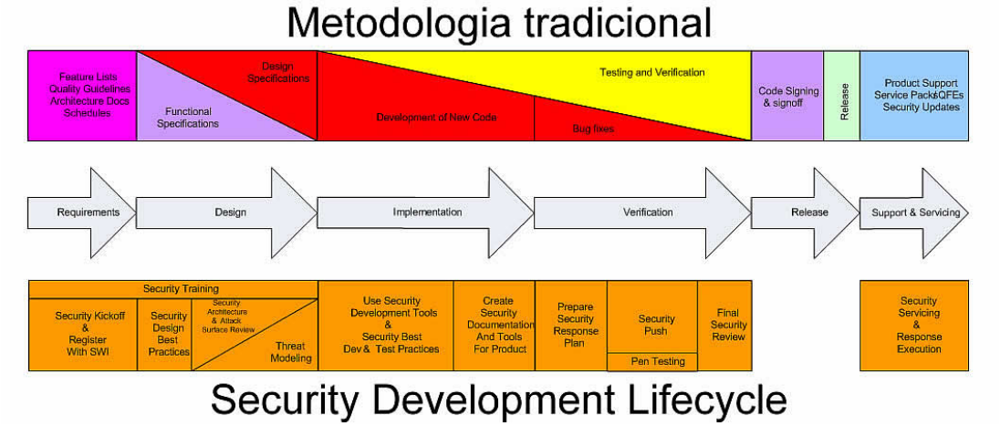

SDL tem relação direta com as fases do ciclo de vida para desenvolvimento de software. Esse processo segue o modelo espiral para aqueles que já estudaram metodologias de desenvolvimento de software. 

Nesse modelo, a **MICROSOFT** criou os princípios de segurança no desenvolvimento conhecido como SD3 + C: 

- **a) Secure by Design (Seguro por Desenho)** 

A arquitetura, o design e a implementação do software devem ser executados de forma a protegê-lo e proteger as informações que ele processa, além de resistir a ataques. 

###### **b) Secure by Default (Seguro por Padrão)** 

Na prática, o software não atingirá uma segurança perfeita; portanto, os designers devem considerar a possibilidade de haver falhas de segurança. Para minimizar os danos que ocorrem quando invasores miram nessas falhas restantes, o estado padrão do software deve aumentar a segurança. 

Por exemplo, o software deve ser executado com o privilégio mínimo necessário, e os serviços e os recursos que não sejam amplamente necessários devem ser desabilitados por padrão ou ficar acessíveis apenas para uma pequena parte dos usuários. 

###### **c) Secure by Deployment (Seguro na Implantação)**

---

<!-- pagina: 176 -->

**André Castro Aula 00** 

O software deve conter ferramentas e orientação que ajudem os usuários finais e/ou administradores a usá-lo com segurança. Além disso, a implantação das atualizações deve ser fácil. 

###### **d) Communications (Comunicações)** 

Os desenvolvedores de software devem estar preparados para a descoberta de **vulnerabilidades do produto** e devem comunicar-se de maneira aberta e responsável com os usuários finais e/ou com os administradores para ajudá-los a tomar medidas de proteção (como instalar patches ou implantar soluções alternativas). 

Destes, considera-se que os dois primeiros são os que possuem a maior capacidade de agregar segurança no software. 

Vamos explorar um pouco mais os aspectos de segurança considerados em cada uma das fases. 

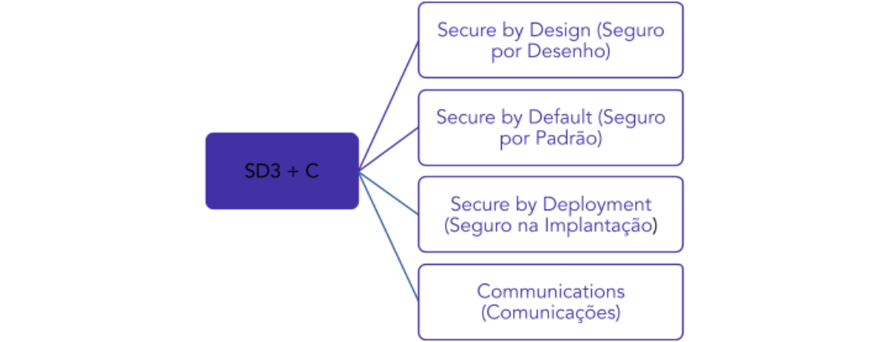

###### **1. FASE DE REQUISITOS** 

Durante a fase de requisitos, a equipe de produto entra em contato com a equipe de segurança central para solicitar a designação **de um supervisor de segurança** (chamado de o "cara da segurança" na implementação do SDL na Microsoft) que serve como um ponto de contato, pesquisa e orientação durante o planejamento. 

O supervisor de segurança também serve como ponto de contato entre a equipe de segurança e a gerência da equipe de produto, e aconselha a gerência da equipe quanto ao controle do elemento de segurança de seus projetos, de forma a evitar surpresas relacionadas à segurança posteriormente durante o processo. 

A fase de requisitos é a oportunidade para a equipe de produto considerar como a **segurança** será **integrada** no **processo de desenvolvimento,** identificar os objetivos-chave de segurança e maximizar a segurança de software, minimizando a quebra de planos e cronogramas. 

Como parte desse processo, a equipe precisa considerar como os recursos de segurança e as medidas de controle de seu software serão integrados com outros softwares que provavelmente serão usados com ele.

---

<!-- pagina: 177 -->

**André Castro Aula 00** 

A perspectiva geral da equipe de produto sobre os objetivos, os desafios e os planos de segurança devem se refletir nos documentos de planejamento produzidos durante a fase de requisitos. Embora os planos estejam sujeitos a alterações conforme o andamento do projeto, a articulação precoce desses planos ajuda a garantir que nenhum requisito seja desconsiderado ou estabelecido na última hora. 

###### **2. FASE DE DESIGN** 

Nesta fase, tem-se a identificação da estrutura e os requisitos gerais do software. Na perspectiva de segurança, os elementos-chave dessa fase são: 

- Definir as diretivas de design e arquitetura de segurança; 

- Documentar os elementos da superfície de ataque do software; 

- Realizar a modelagem de ameaças; 

- Definir critérios de fornecimento complementar. 

###### **3. FASE DE IMPLEMENTAÇÃO** 

Durante a fase de implementação, a equipe de produto gera o código, testa e integra o software. 

Os resultados da modelagem de ameaças fornecem uma orientação particularmente importante durante a fase de implementação. Os desenvolvedores dedicam atenção especial em corrigir o código de modo a atenuar as ameaças de alta prioridade e os testadores concentram seus testes na garantia de que essas ameaças estejam de fato bloqueadas ou atenuadas. 

Os elementos do SDL considerados nessa fase são: 

- Aplicar padrões de codificação e teste. 

- Aplicar ferramentas de testes de segurança, incluindo ferramentas de difusão. 

- Aplicar ferramentas de verificação de código de análise estática. 

- Realizar revisões de código. 

A atenção especial fica em relação ao fato de que não se considera a aplicação de ferramentas de verificação de código de análise dinâmica nessa fase. 

###### **4. FASE DE VERIFICAÇÃO** 

A fase de verificação é o ponto em que o software está funcionalmente concluído e entra em testes beta por usuários. Durante essa fase, enquanto o software passa por **testes beta** , a equipe de produto realiza um **"esforço de segurança"** que inclui revisões do código de segurança além das concluídas na fase de implementação, bem como testes de segurança direcionados. 

###### **5. FASE DE SUPORTE E MANUTENÇÃO** 

Apesar da aplicação do SDL durante o desenvolvimento, as práticas de desenvolvimento mais avançadas ainda não dão suporte ao fornecimento de software completamente livre de vulnerabilidades, e há bons motivos para acreditarmos que isso nunca acontecerá.

---

<!-- pagina: 178 -->

**André Castro Aula 00** 

Mesmo que o processo de desenvolvimento pudesse eliminar todas as vulnerabilidades do software fornecido, novos ataques seriam descobertos e o software que era "seguro" estaria vulnerável. Assim, as equipes de produto devem se preparar para responder a vulnerabilidades recém-descobertas no software fornecido aos clientes. 

Parte do processo de resposta envolve a preparação para avaliar relatórios de vulnerabilidades e lançar orientações e atualizações de segurança quando apropriado. O outro componente do processo de resposta é a condução de um post-mortem das vulnerabilidades relatadas e a adoção de medidas, conforme necessário. 

As medidas em resposta a uma vulnerabilidade variam de emitir uma **atualização** para um **erro isolado** até atualizar as ferramentas de **verificação de código** e iniciar revisões do código dos principais subsistemas. 

O objetivo durante a fase de resposta é aprender a partir dos erros e utilizar as informações fornecidas em relatórios de vulnerabilidade para ajudar a detectar e eliminar mais vulnerabilidades antes que sejam descobertas no campo e utilizadas para colocar os clientes em risco. 

O processo de resposta também ajuda a equipe de produto e a equipe de segurança a adaptar processos de forma que erros semelhantes não sejam introduzidos no futuro 

Referência: 

<u>https://learn.microsoft.com/pt-br/compliance/assurance/assurance-microsoft-security-developme nt-lifecycle</u> 

## **CLASP (Comprehensive, Lightweight Application Security Process)** 

O CLASP (Comprehensive, Lightweight Application Security Process) é uma metodologia de desenvolvimento **seguro de software** orientada a atividades e papéis, que descreve melhores práticas para projetos novos ou em andamento. 

São propostas 24 atividades divididas em componentes de processos discretos ligados a um ou mais papéis de um projeto. Desta forma, o **CLASP** provê um guia para participantes de um projeto: gerentes, auditores de segurança, desenvolvedores, arquitetos e testadores, entre outros.

---

<!-- pagina: 179 -->

**André Castro Aula 00** 

A estrutura do processo é dividida em **cinco perspectivas** , denominadas Visões CLASP. Cada Visão, por sua vez, é dividida em atividades, que contém os componentes do processo.  São as Visões: 

- **Visão Conceitual** 

- **Visão de Papéis** 

- **Visão de Avaliação de Atividade** 

- **Visão de Implementação de Atividade** 

- **Visão de Vulnerabilidades** 

As visões também são referenciadas como Conjuntos de Taxonomias de vulnerabilidades a serem consideradas no desenvolvimento do software. 

**A Visão Conceitual** apresenta uma visão geral de como funciona o processo CLASP e como seus componentes interagem. São introduzidas as melhores práticas, a interação entre o CLASP e as políticas de segurança, alguns conceitos de segurança e os componentes do processo. 

**A Visão de Papéis** introduz as responsabilidades básicas de cada membro do projeto (gerente, arquiteto, especificador de requisitos, projetista, implementador, analista de testes e auditor de segurançA) relacionando-os com as atividades propostas, além de especificar quais são os requerimentos básicos para que cada função seja desempenhada. 

**A Visão de Avaliação de Atividades** descreve o propósito de cada atividade, bem como os responsáveis, contribuidores, a aplicabilidade, o impacto relativo, os riscos em caso de omissão da atividade, a frequência da atividade e sugere uma aproximação do valor para homens/hora. 

**<u>A</u> Visão de Implementação** descreve o conteúdo das 24 atividades de segurança definidas pelo CLASP e identifica os responsáveis pela implementação, bem como as atividades relacionadas. 

**A Visão de Vulnerabilidades** possui um catálogo que descreve 104 tipos de vulnerabilidades no desenvolvimento de software, divididas em 5 categorias: 

- Erros de Tipo e Limites de Tamanho 

- Problemas do Ambiente 

- Erros de Sincronização e Temporização 

- Erros de Protocolo 

- Erros lógicos em geral.

---

<!-- pagina: 180 -->

**André Castro Aula 00** 

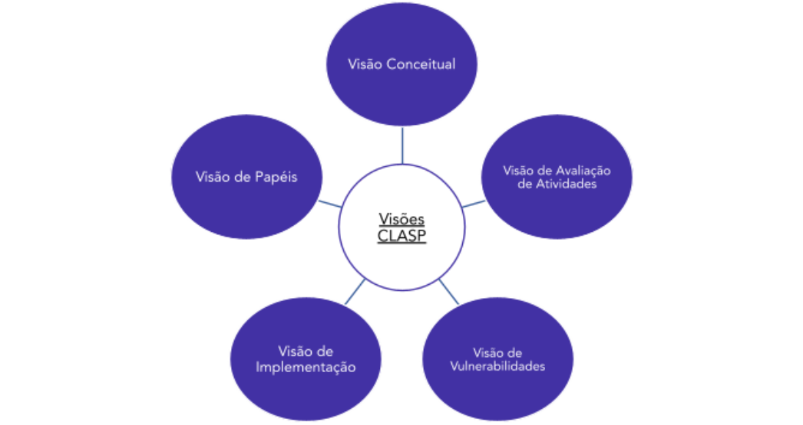

###### Referência(s): 

1. <u>https://www.fremountaingems.com/learn/categories/jewelry-medium/bead-stringing/abou t-bead-stringing/8B6H-article.html</u> 

2. <u>https://github.com/google/clasp</u>

---

<!-- pagina: 181 -->

**André Castro Aula 00** 

## **DEVSECOPS** 

DevSecOps é a extensão natural de DevOps que insere segurança (“Sec”) no mesmo fluxo contínuo de desenvolvimento (Dev) e operações (Ops). A premissa central é que controles de segurança — análise de dependências, verificação de configuração, testes de vulnerabilidade e governança de segredos — sejam incorporados desde o primeiro commit até a observabilidade em produção. Isso elimina o antigo modelo gatekeeper, no qual a equipe de segurança ficava no fim da esteira e gerava retrabalho, atrasos e atrito entre áreas. 

A importância do DevSecOps decorre de três pressões simultâneas: (1) ciclos de release cada vez mais curtos, que tornam inviável a auditoria manual; (2) superfícies de ataque ampliadas por nuvem, contêineres, APIs e IaC; (3) exigências regulatórias e de mercado que punem vazamentos de dados e indisponibilidade. Ao introduzir segurança como requisito funcional do pipeline, as organizações reduzirem risco sem sacrificar agilidade, reforçando confiança junto a clientes e acionistas. 

Na prática, o ciclo DevSecOps começa com o **shift-left** : static code analysis (SAST), secret scanning e checagem de licenças já no pull request (solicitação de deploy). 

Na etapa de build, ferramentas de Software Bill of Materials (SBOM) e de análise de dependências (SCA) previnem vulnerabilidades conhecidas. 

Durante o deploy, políticas declarativas (OPA/Rego, AWS SCPs, Azure Policy) e scanners de IaC garantem configurações mínimas de rede, criptografia e identidade. 

No runtime, camadas como eBPF security ou service mesh aplicam controle de tráfego, enquanto observabilidade alimenta SIEM/SOAR para resposta automatizada. 

A adoção sustentável requer mudança cultural: desenvolvedores assumem parte da responsabilidade, equipes de segurança oferecem guardrails (templates, terraform modules, repositórios curados) em vez de bloqueios, e Site Reliability Engineers integram métricas de risco aos níveis operacionais. Métricas típicas incluem “tempo até correção de CVE crítica”, “porcentagem de builds bloqueados por falha de segurança” e “taxa de falsos positivos”, acompanhados em painéis compartilhados. 

Por fim, boas práticas de DevSecOps são iterativas. Deve-se começar pequeno — por exemplo, habilitar secret scanning no repositório principal —, medir ganhos, ampliar para SCA, IaC scanning e, gradualmente, incorporar threat-modeling automatizado e validação contínua de permissões. Com ciclos de feedback curtos, a segurança deixa de ser gargalo e passa a ser vantagem competitiva, sustentando inovação sem abrir brechas de integridade, confidencialidade ou disponibilidade. 

Neste contexto moderno, com o avanço da Inteligência artificial, temos visto práticas de IA associadas a diversos contextos de produtos. E na segurança, não é diferente… 

Aqui, surgem dois termos importantes, o MLops e AIops.

---

<!-- pagina: 182 -->

**André Castro Aula 00** 

- **<u>MLOps (Machine-Learning Operations)</u>** é o conjunto de práticas que tornam modelos de ML repetíveis, auditáveis e escaláveis desde a coleta de dados até o monitoramento em produção. 

- **<u>AIOps (AI for IT Operations)</u>** aplica algoritmos a grandes volumes de telemetria para automatizar detecção de anomalias, correlação de eventos e remediação em infraestruturas de TI. Apesar de focos diferentes, ambos compartilham ameaças como supply-chain de software, vazamento de dados e permissões excessivas, exigindo uma abordagem **DevSecOps** estendida. 

Existem referências no mercado que trazer os principais controles a serem adotados no contexto de MLOPS para cada uma das etapas do ciclo de vida de desenvolvimento. Vejamos: 

|**Fase do pipeline**|**Riscos típicos**|**Controles recomendados**|
|---|---|---|
|**Aquisição & preparo** **de dados**|Dados sensíveis não mascarados, dataset poisoning|Catalogar e versionar dados; criptografa at-rest/in-transit; testes de qualidade; data lineage.|
|**Experimentação** **&** **treino**|Bibliotecas com CVEs, scripts maliciosos|Dependency scanning, SBOM, ambientes isolados (Docker/Conda) e policy-as-code que bloqueia dependências não assinadas.|
|**Registro de modelos**|Artefatos adulterados ou não rastreáveis|Registro imutável (MLfow, SageMaker Model Registry) com hash, assinatura digital e metadados de procedência.|
|**CI/CD de modelos**|Segredos embutidos no código, erros de confguração|Static Analysis + Secret Scanning no checkout; gates de segurança no pipeline (OWASP, MITRE ATLAS); revisão de pull-request.|
|**Implantação**|Perímetro amplo, IAM excessivo|“Zero-trust por função”: service account dedicada, network policies, limitação de saída na VPC.|

---

<!-- pagina: 183 -->

**André Castro Aula 00** 

|**Runtime** **monitoramento**|**&**|Model drift, ataques adversariais|Telemetria em tempo real (latência, acurácia, outliers), canary release, alerta de comportamento anômalo, feature logging para auditoria.|
|---|---|---|---|
|**Governança** **compliance**|**&**|Falta de trilha de auditoria, regulatórios|Relatórios contínuos (ISO 42001, NIST AI RMF), versionamento de políticas e aprovação automática/semiautomática de mudanças.|

Já na perspectiva do AIOps, podemos segmentar o processo de proteção e automação de TI da seguinte forma: 

###### **1. Ingestão de dados confiável** 

- Coletar somente de agentes autenticados; TLS 1.3; message signing. 

- Sanitizar logs para evitar vazamento de credenciais. <u>eWEEK</u> 

###### **2. Plataforma de análise protegida** 

- Cluster Kubernetes ou SaaS gerenciado com node hardening, imagens escaneadas, runtime eBPF para bloquear chamadas suspeitas. 

###### **3. Modelos explicáveis e íntegros** 

- XAI (SHAP, LIME) para justificar ações corretivas; assinatura digital do modelo e verificação a cada carregamento. 

###### **4. Automação segura de resposta** 

- Playbooks SOAR com revisão humana em alterações críticas (ex.: regras de firewall); rate-limit e circuit-breakers impedem loops automáticos de alto impacto. 

###### **5. Gestão de identidade e acesso (IAM)** 

- Privilégios mínimos para bots, APIs e usuários; just-in-time elevation para tarefas de manutenção. 

###### **6. Observabilidade & auditoria** 

- Trilhas imutáveis em data lake separado; alertas de tentativas de evasão ou alteração de logs.

---

<!-- pagina: 184 -->

**André Castro Aula 00** 

Nessas perspectivas de uso intensivo de IA em aplicações, surgem diversas preocupações, que estão sendo tratados como desafios emergentes e pontos de atenção. 

- **Ameaças adversariais** — dados de treino e inferência podem ser manipulados; técnicas de robust training e input sanitization ganham espaço. 

- **Custo da observabilidade** — telemetria detalhada encarece clusters; sampling adaptativo e telemetry-as-code ajudam a balancear. 

- **Convergência GenAI** — modelos fundacionais exigem controles de direitos autorais, prompt audit e guardrails anti-jailbreak. 

Um **MLOps seguro** garante que cada modelo chegue em produção rastreável, íntegro e monitorado. Um **AIOps seguro** assegura que a automação de TI seja confiável e auditável. Juntos, formam a espinha dorsal das operações inteligentes, sustentando inovação sem abrir brechas de segurança.

---

<!-- pagina: 185 -->

**André Castro Aula 00** 

## **OWASP SAMM (Software Assurance Maturity Model)** 

O OWASP SAMM (Software Assurance Maturity Model) é um modelo aberto que auxilia organizações a formular e implementar uma estratégia para a segurança de software, adaptada aos riscos específicos enfrentados pela organização. O modelo é agnóstico em relação a tecnologias e processos, orientado por riscos e evolução, apoiando o ciclo de vida completo do desenvolvimento e aquisição de software. 

Como já vimos em diferentes contextos, a segurança de software é um componente crítico no desenvolvimento de sistemas confiáveis. O OWASP SAMM oferece um caminho estruturado para organizações melhorarem suas práticas de segurança de software. 

Observando as suas principais características, portanto, vale destacar que o SAMM permite que as organizações: 

- Avaliem suas práticas existentes de segurança de software. 

- Construam um programa equilibrado de garantia de segurança em iterações bem definidas. 

- Demonstrem melhorias concretas no programa de garantia de segurança. 

- Definam e meçam atividades relacionadas à segurança em toda a organização. 

O SAMM é dividido em cinco áreas de negócio, cada uma com três objetivos de segurança. 

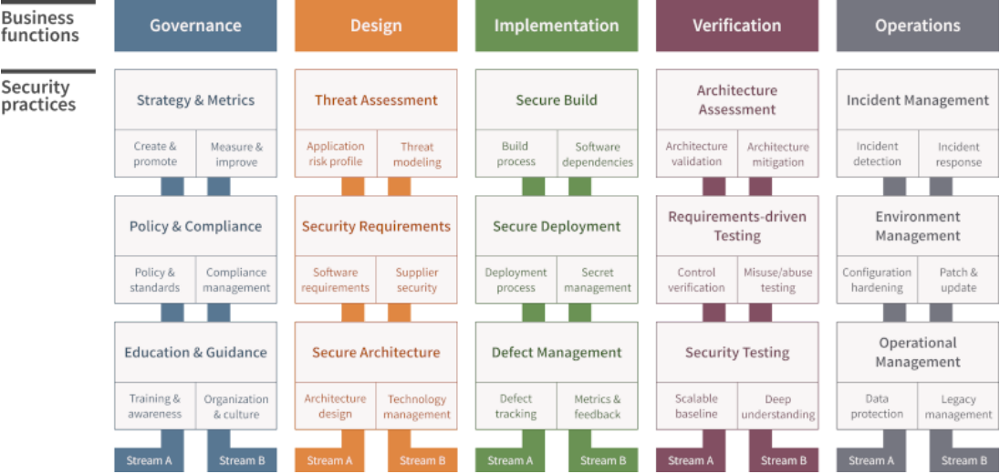

Para cada objetivo, há três níveis de maturidade, fornecendo um total de 45 atividades de segurança. As organizações podem usar o SAMM para criar um roteiro de melhorias incrementais, medindo o progresso ao longo do tempo.

---

<!-- pagina: 186 -->

**André Castro Aula 00** 

Trazendo uma perspectiva de vantagens a respeito do seu uso, destaca-se a capacidade de personalizar a abordagem de segurança para atender às necessidades específicas da organização e a possibilidade de medir a maturidade da segurança de software de forma eficaz. Os desafios podem incluir a necessidade de comprometimento organizacional e recursos para implementar e manter o programa. 

Comparado a outros modelos como o BSIMM, que é descritivo e baseado em práticas observadas, o SAMM é prescritivo, oferecendo um caminho estruturado para melhorar a segurança de software. Enquanto o BSIMM pode ser usado para benchmarking e referência, o SAMM fornece um roteiro para ação. 

###### **●** **<u>ESTRUTURA DE FUNCIONAMENTO</u>** 

Conforme já vimos na introdução, o OWASP SAMM (Software Assurance Maturity Model) é estruturado em torno de cinco pilares de negócio, cada um abrangendo práticas de segurança específicas. Vamos trazer um resumo dos principais pontos em cada um deles: 

###### **1.** **<u>Governança (Governance):</u>** 

- **Estratégia e Métricas:** Estabelecer e manter uma estratégia de segurança de software alinhada com os objetivos de negócio. 

- **Educação e Orientação:** Assegurar que todos os envolvidos compreendam suas responsabilidades relacionadas à segurança de software. 

- **Política e Conformidade:** Desenvolver e aplicar políticas de segurança de software que estejam em conformidade com os requisitos legais e regulatórios. 

###### **2.** **<u>Desenho (Design):</u>** 

- **Requisitos de Segurança:** Identificar e incorporar requisitos de segurança durante a fase de design. 

- **Arquitetura de Segurança:** Definir e manter uma arquitetura de software que suporte os requisitos de segurança. 

- **Modelagem de Ameaças:** Realizar análises de ameaças para identificar e mitigar riscos potenciais. 

###### **3.** **<u>Implementação (Implementation):</u>** 

- **Padrões de Codificação Segura:** Utilizar e aplicar padrões de codificação segura para reduzir vulnerabilidades. 

- **Revisão de Código de Segurança:** Realizar revisões de código para identificar e corrigir problemas de segurança. 

- **Teste de Segurança do Software:** Testar o software para garantir que os requisitos de segurança sejam atendidos.

---

<!-- pagina: 187 -->

**André Castro Aula 00** 

###### **4.** **<u>Verifcação (Verifcation):</u>** 

- **Revisão de Requisitos de Segurança** : Verificar se todos os requisitos de segurança foram atendidos. 

- **Teste de Segurança:** Executar testes de segurança abrangentes para identificar e mitigar vulnerabilidades. 

- **Análise de Segurança Operacional:** Avaliar a segurança do software em seu ambiente operacional. 

###### **5.** **<u>Operações (Operations):</u>** 

- **Gerenciamento de Incidentes:** Estabelecer e manter um processo eficaz para a detecção e resposta a incidentes de segurança. 

- **Gerenciamento de Ambiente:** Proteger o ambiente operacional contra ameaças de segurança. 

- **Melhoria Operacional:** Implementar processos para garantir a melhoria contínua da segurança do software. 

Cada pilar e seus respectivos objetivos são fundamentais para a construção de um programa de segurança de software robusto e eficaz. 

###### **●** **<u>NÍVEIS DE MATURIDADE</u>** 

O OWASP SAMM define três níveis de maturidade para cada prática de segurança, que são generalizados como **<u>fundacional, maduro e avançado. Esses três níveis são divididos para cada um dos objetivos, conforme um dos exemplos abaixo:</u>**

---

<!-- pagina: 188 -->

**André Castro Aula 00** 

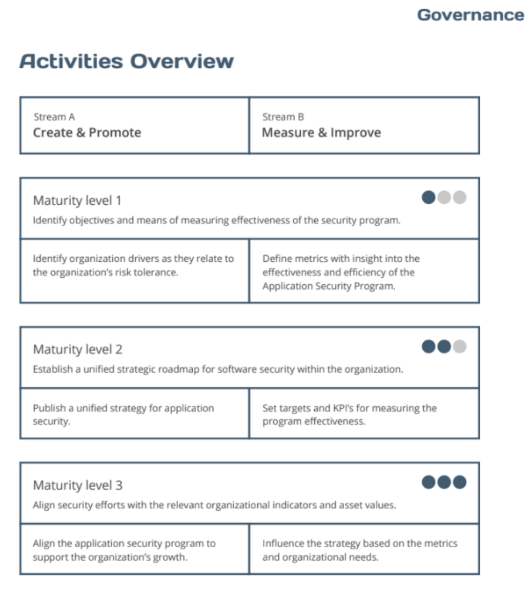

**<u>Sendo assim, para um conhecimento aprofundado e detalhados, não há outra alternativa a não ser ler o documento em sua íntegra no link:</u>** 

###### **<u>https://owaspsamm.org/model/</u>** 

**- =** **<u>https://drive.google.com/fle/d/1cI3Qzfrly_X89z7StLWI5p_Jfqs0 OZv/view?usp sharing</u>**

---

<!-- pagina: 189 -->

**André Castro Aula 00** 

Trazendo um resumo sobre os diferentes níveis, podemos dizer que cada nível possui objetivos progressivamente mais sofisticados, atividades específicas e métricas de sucesso mais rigorosas. Assim são os três níveis de maturidade: 

###### 1. **<u>Nível Fundacional (Nível 1):</u>** 

   - **Objetivo:** Estabelecer as bases para a segurança de software. 

   - **Atividades:** Implementar práticas básicas de segurança e conscientização. 

   - **Métricas:** Foco em alcançar a conformidade com requisitos mínimos de segurança. 

2. **<u>Nível Maduro (Nível 2):</u>** 

   - **Objetivo:** Desenvolver e aprimorar processos de segurança de software. 

   - **Atividades:** Integrar segurança de forma mais profunda no ciclo de vida do desenvolvimento. 

   - **Métricas:** Medir a eficácia das práticas de segurança e fazer melhorias contínuas. 

3. **<u>Nível Avançado (Nível 3):</u>** 

   - **Objetivo:** Otimizar e liderar com práticas de segurança inovadoras. 

   - **Atividades:** Implementar processos de segurança sofisticados e proativos. 

   - **Métricas:** Buscar a excelência em segurança e ser um modelo para outras organizações. 

Esses níveis de maturidade ajudam as organizações a avaliar onde estão em termos de segurança de software e a planejar melhorias incrementais para alcançar uma postura de segurança mais robusta e eficaz. 

Referência: 

<u>https://owasp.org/www-project-samm/</u>

---

<!-- pagina: 190 -->

**André Castro Aula 00** 

## **BSIMM - Building Security in Maturity Model** 

O BSIMM, ou Building Security in Maturity Model, atualmente em sua versão 14, é um modelo descritivo que fornece uma linha de base de atividades observadas para iniciativas de segurança de software. Este modelo não é um padrão ou uma lista de verificação, mas sim um reflexo das práticas atuais observadas em programas reais de segurança de software. Tal análise é composta por diferentes perfis, mas há um destaque de centenas de milhares de desenvolvedores e algumas dezenas de milhares de profissionais de segurança da informação. 

No mundo do desenvolvimento de software, o BSIMM ajuda a a **nalisar e comparar programas de segurança de software** contra mais de 130 organizações em vários setores industriais, **fornecendo uma análise objetiva e baseada em dados para tomar decisões sobre recursos, tempo, orçamento e prioridades na melhoria da postura de segurança** . 

O BSIMM mede a maturidade de um programa de segurança de software contra 126 atividades específicas, **permitindo que as organizações avaliem seu nível de maturidade e comparem suas necessidades e capacidades de segurança com outros programas de segurança de software** . Diferentemente de outros frameworks, o BSIMM é descritivo, não prescritivo, documentando práticas atuais em vez de prescrever o que um pequeno grupo de especialistas acredita que deveria ser feito. 

Conforme já antecipamos, o BSIMM ajuda as organizações a entenderem seus pontos fortes e fracos e quais áreas priorizar com base em riscos e capacidades específicas da organização. O próximo passo é desenvolver um Plano de Ação de Maturidade (MAP) com etapas detalhadas para atender aos objetivos de segurança de software da organização. 

As vantagens do BSIMM incluem a capacidade de compartilhar rapidamente a postura de segurança de software com as partes interessadas, oferecendo detalhes concretos para mostrar a executivos, membros do conselho, clientes, parceiros e reguladores como os esforços estão fazendo a diferença na postura de segurança da organização. Os desafios podem incluir a necessidade de adaptar as práticas observadas às necessidades específicas da organização e garantir que as atividades de segurança sejam integradas ao ciclo de vida do desenvolvimento de software. 

Enquanto o BSIMM fornece um modelo baseado em dados para iniciativas de segurança de software, outras tecnologias e frameworks, como o OWASP SAMM (Software Assurance Maturity Model), também oferecem abordagens para avaliar e melhorar a segurança de software. O OWASP SAMM, por exemplo, é um framework prescritivo que fornece um caminho para organizações implementarem práticas de segurança de software de acordo com os melhores padrões da indústria. 

Caso você ainda esteja se perguntando a diferença prática de frameworks descritivos e prescritivos,temos que os frameworks descritivos focam sobre entender e relatar o que acontece, com base em análise de contextos e focos de observação, sem julgamentos e com capacidade dinâmica e rápida de atualização. Já os prescritivos são sobre estabelecer como as coisas devem ser feitas, trazendo uma visão de normatização ou padronização melhores definidas, e por esse motivo, são mais rígidas no processo. Ambas as abordagens têm suas vantagens e são escolhidas com base nos objetivos e necessidades específicas

---

<!-- pagina: 191 -->

**André Castro Aula 00** 

Trazendo uma questão mais específica do framework e do relatório, observamos: 

1. **<u>SBOMs - Software Bill of Materials:</u>** <u>Também pode ser entendido como componentes que</u> são utilizados na estrutura de desenvolvimento de código como bibliotecas e dependências de software em geral. O relatório aponta um crescimento de 22% deste tipo de recurso, o que implica em uma necessidade de tratamento desse tipo de solução, e buscar um amplo domínio de seu inventário de software. 

2. **<u>Gestão de Risco de OSS:</u>** <u>Crescimento de 10% nas atividades de gestão de risco de</u> software de código aberto. Isso traz ações específicas de gestão de riscos com softwares abertos para identificação e controle destes riscos como camada básica. 

3. **<u>Segurança na Nuvem:</u>** Ferramentas de segurança na nuvem são essenciais para melhorar a postura de segurança. 

4. **<u>Testes Contínuos:</u>** Importância de testes contínuos em múltiplos pontos do pipeline, totalmente aderentes à evolução do produto junto ao negócio a ser aplicado. Espera-se a utilização de ferramentas para escalar esses testes conforme necessidade, com recursos de automação e orquestração das soluções. 

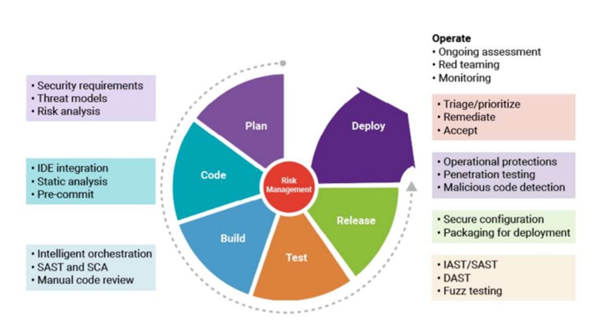

Referência(a): 

https://www.synopsys.com

---

<!-- pagina: 192 -->

**André Castro Aula 00** 

## **OWASP Secure Coding Practices** 

Antes de iniciarmos esse bloco, é importante conceituar o que vem a ser o OWASP (Open Web Application Security Project). O OWASP é uma fundação sem fins lucrativos que trabalha para melhorar a segurança de softwares. É uma referência global em vários eixos de atuação, e tem sido referenciado diretamente e explicitamente em provas, e também em questões. Suas atuações são diversas frente ao escopo de atuação. Sem dúvida, seu grande destaque é o monitoramento e geração de relatórios dos conhecidos TOP 10 ataques e vulnerabilidades exploradas, ano após ano. 

Entretanto, este não será o assunto do bloco, mas sim, as suas referências práticas para desenvolvimento de códigos seguros. 

A OWASP, reforçando, é uma comunidade aberta dedicada a permitir que as organizações concebam, desenvolvam, adquiram, operem e mantenham aplicativos confiáveis. Todos os projetos, ferramentas, documentos, fóruns e capítulos são gratuitos e abertos a qualquer pessoa interessada em melhorar a segurança de aplicativos. A Fundação OWASP foi lançada em 1º de dezembro de 2001, tornando-se uma instituição de caridade sem fins lucrativos dos Estados Unidos em 21 de abril de 2004. 

Voltando o nosso foco às práticas seguras de desenvolvimento, destacamos primeiramente a sua característica agnóstica, ou seja, não há vínculo ou restrição com tecnologias específicas. Trata-se de um checklist que pode ser integrado em qualquer ciclo de desenvolvimento. Na sua concepção, o objetivo foi gerar um documento simples e enxuto, capaz de ser facilmente compreendido e absorvido pelas instituições. 

Abaixo, você encontra o link com todas as práticas que são recomendadas nesse escopo. 

https://www.owasp.org/index.php/Testing_Guide_Introduction#Principles_of_Testing 

###### Referência(a): 

<u>https://www.owasp.org/index.php/Testing_Guide_Introduction#Principles_of_Testing</u>

---

<!-- pagina: 193 -->

**André Castro Aula 00** 

## **NIST SSDF - Secure Software Development Framework** 

O NIST SSDF é um conjunto de práticas recomendadas para desenvolvimento de software seguro, publicado pelo NIST. Ele visa ajudar os desenvolvedores a reduzir vulnerabilidades em software, mitigando os riscos de exploração e abordando as causas raízes dessas vulnerabilidades. 

O SSDF é organizado em **<u>quatro grupos principais de práticas</u>** : 

1. **Prepare the Organization (PO) - Prepare sua Organização** 

   - **Objetivo** : Preparar a organização, seus processos e tecnologias para desenvolvimento de software seguro. 

   - **Práticas** : Treinamento de pessoal, definição de políticas de segurança, configuração de ferramentas de segurança. ==5460== 

2. **Protect the Software (PS) - Proteja o Software** 

   - **Objetivo** : Proteger todos os componentes do software contra adulteração e acesso não autorizado. 

   - **Práticas** : Uso de ferramentas de análise estática e dinâmica, implementação de controles de segurança, proteção de dados sensíveis. 

3. **Produce Well-Secured Software (PW) - Produza um software seguro** 

   - **Objetivo** : Produzir software bem protegido com mínimas vulnerabilidades. 

   - **Práticas** : Revisão de código, testes de segurança, integração contínua e entrega contínua (CI/CD). 

4. **Respond to Vulnerabilities (RV) - Responda às vulnerabilidades** 

   - **Objetivo** : Identificar vulnerabilidades residuais e responder adequadamente para prevenir futuras ocorrências. 

   - **Práticas** : Monitoramento contínuo, resposta a incidentes, atualização e manutenção de software.

---

<!-- pagina: 194 -->

**André Castro Aula 00** 

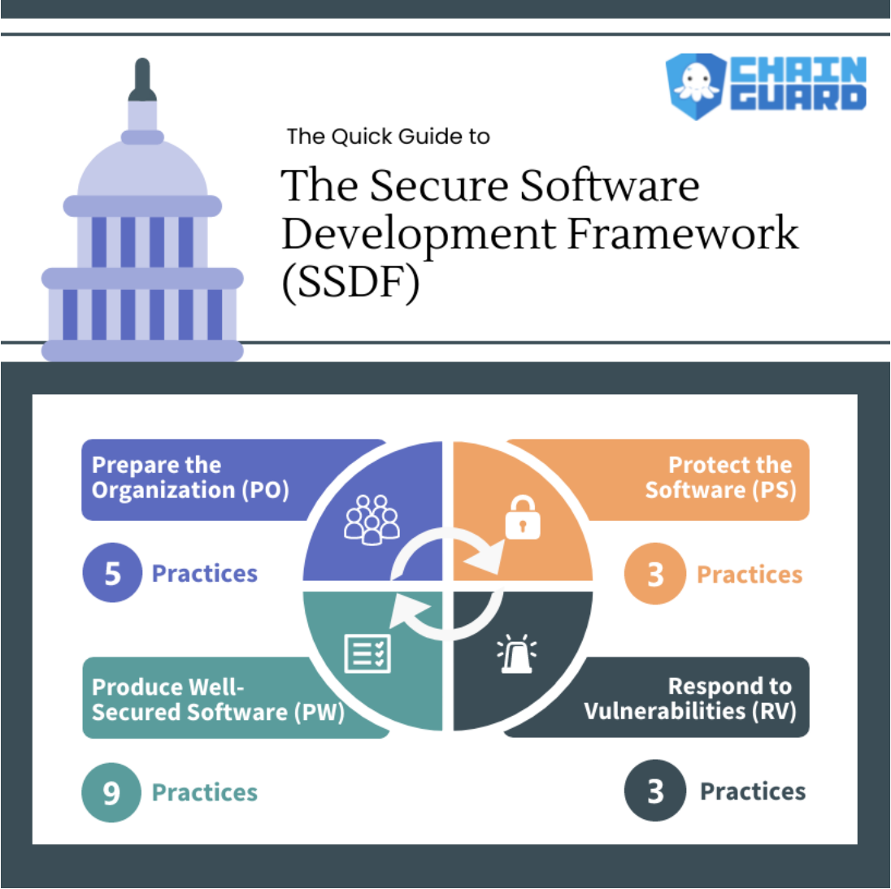

**Conforme já vimos, há diversas práticas distribuídas em cada área. Ainda, dentro de cada área, a norma estrutura as práticas em:** 

1. **<u>Prática: Uma frase curta resumindo Objetivos, Formas de alcançá-los, Papéis e Responsabilidades</u>** 

2. **<u>Tarefas: Descrever as ações necessárias para cumprir a prática</u>** 

3. **<u>Exemplos de Implementação: Descreve como implementar as tarefas com todas as possibilidades</u>** 

4. **Referências: Referências e links para documentação relacionada aos exemplos de implementação listados**

---

<!-- pagina: 195 -->

**André Castro Aula 00** 

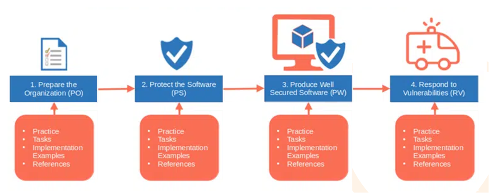

**A imagem a seguir nos dá um exemplo desse processo:** 

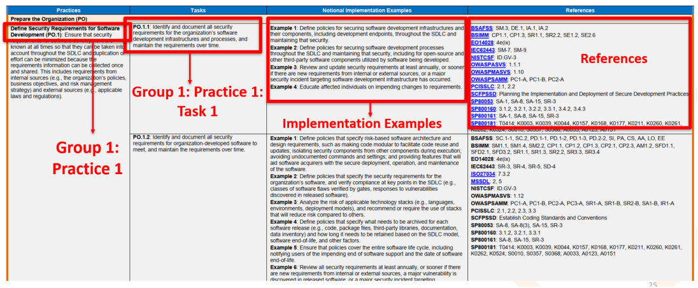

###### **Tentando destacar alguns benefícios do SSDF, podemos citar:** 

- **Redução de Vulnerabilidades** : Seguindo as práticas do SSDF, os desenvolvedores podem reduzir significativamente o número de vulnerabilidades em software. 

- **Mitigação de Impacto** : As práticas ajudam a mitigar o impacto de vulnerabilidades não detectadas ou não tratadas. 

- **Comunicação Melhorada** : O SSDF fornece uma linguagem comum para descrever práticas de desenvolvimento seguro, facilitando a comunicação entre desenvolvedores e compradores de software. 

- **Redução de custos:** Identificar e corrigir vulnerabilidades no início do ciclo de desenvolvimento é mais barato do que lidar com as consequências de um ataque após o lançamento do software. 

- **Melhoria da Qualidade do Software:** O SSDF promove a criação de software mais robusto e confiável, reduzindo o número de falhas e vulnerabilidades. 

- **Proteção da Reputação:** Softwares seguros protegem a reputação da organização, evitando incidentes de segurança que podem prejudicar a confiança dos clientes.

---

<!-- pagina: 196 -->

**André Castro Aula 00** 

- **Conformidade com Regulamentações:** O SSDF ajuda as organizações a cumprir os requisitos de conformidade, como a Lei Geral de Proteção de Dados (LGPD). 

**Considerando ainda as boas práticas de utilização de esteiras de desenvolvimento, ele pode ser integrado com Modelos de Ciclo de Vida de Desenvolvimento de Software (SDLC), isto é, o SSDF pode ser integrado a qualquer modelo de SDLC, como Agile, DevOps, Waterfall, etc. Isso garante que práticas de segurança sejam incorporadas em todas as fases do desenvolvimento.** 

Bom, mergulhando um pouco mais, portanto, vamos conhecer as principais atividades de cada um dos grupos: 

### _<u>Grupo 1: Preparar a Organização (PO)</u>_ 

**O primeiro grupo de práticas (Grupo 1) no NIST SSDF é conhecido como POs, que se refere a pessoas, processos e ferramentas, e foca na capacidade organizacional de produzir software seguro. Há cinco práticas no Grupo 1, de PO.1 a PO.5, conforme segue:** 

### **<u>1. PO.1: Defnir Requisitos de Segurança para o Desenvolvimento de Software</u>** 

**PO.1 considera as necessidades de segurança ao longo de todo o ciclo de vida do desenvolvimento de software (SDLC). Inclui fatores internos, como as políticas da organização, metas de negócios e estratégias de gerenciamento de riscos, assim como quaisquer fatores externos, como leis e regulamentos relevantes. Ao seguir o PO.1, as equipes de desenvolvimento podem minimizar a duplicação de esforços, pois as informações sobre os requisitos podem ser coletadas uma única vez e compartilhadas.** 

### **<u>PO.2: Implementar Papéis e Responsabilidades</u>** 

**PO.2 foca na definição dos papéis necessários, revisão, manutenção e atualização periódica dos papéis definidos. Fornece diretrizes sobre o treinamento de pessoal baseado em papéis, para garantir que todos os envolvidos no SDLC estejam prontos para desempenhar suas funções e responsabilidades.** 

### **<u>PO.3: Implementar Cadeias de Ferramentas de Suporte</u>**

---

<!-- pagina: 197 -->

**André Castro Aula 00** 

**PO.3 se destina ao uso de cadeias de ferramentas e ferramentas automatizadas em diferentes níveis, como em toda a organização ou específicas de um projeto, e aborda uma parte particular do SDLC. O principal objetivo é reduzir o esforço humano e os erros humanos, ao mesmo tempo em que melhora a precisão, reprodutibilidade, usabilidade e abrangência das práticas de segurança ao longo do SDLC.** 

### **<u>PO.4: Defnir e Usar Critérios para Verifcações de Segurança de Software</u>** 

**A segurança do software deve ser verificada durante o desenvolvimento, e os desenvolvedores de software devem definir e usar critérios para verificar a segurança do software, a fim de garantir que ele atenda às expectativas da organização. O PO.4 foca em fornecer diretrizes para verificações de segurança de software.** 

### **<u>PO.5: Implementar e Manter Ambientes Seguros para o Desenvolvimento de Software</u>** 

**O PO.5 garante que todos os componentes dos ambientes para o desenvolvimento de software (ambientes de construção, desenvolvimento, teste e distribuição) estejam fortemente protegidos contra ameaças internas e externas. Ele mitiga o risco de comprometimento do ambiente de desenvolvimento, aderindo a melhores práticas, como o princípio do menor privilégio.** 

### _<u>2. Grupo 2: Proteger o Software (PS)</u>_ 

**O segundo grupo de práticas (Grupo 2) no NIST SSDF é conhecido como PSs, que foca na integridade do software e em garantir que os produtos sejam feitos de forma segura em todas as etapas do processo de desenvolvimento de software. Há três práticas no Grupo 2, de PS.1 a PS.3, conforme segue:** 

### **<u>PS.1: Proteger Todas as Formas de Código Contra Acesso Não Autorizado e Manipulação</u>** 

**PS.1 foca na proteção do código-fonte contra alterações não autorizadas, que podem ser acidentais ou intencionais, com o objetivo de prevenir furtos e reduzir ao mínimo as vulnerabilidades no software. O PS.1 recomenda ter avisos como "não destinado a ser acessível publicamente" para código privado ou proprietário.**

---

<!-- pagina: 198 -->

**André Castro Aula 00** 

### **<u>PS.2: Fornecer um Mecanismo para Verifcar a Integridade da Liberação de Software</u>** 

**PS.2 visa apoiar os adquirentes de software (por exemplo, o Governo Federal) a verificar a autenticidade e a integridade do software que compram. Ele garante que o software esteja livre de quaisquer modificações não autorizadas ou manipulações** . 

### **<u>PS.3: Arquivar e Proteger Cada Liberação de Software</u>** 

**PS.3 foca na preservação das liberações de software para ajudar a identificar, analisar e eliminar vulnerabilidades descobertas no software após a liberação.** 

### _<u>3. Grupo 3: Produzir Software Bem Protegido (PW)</u>_ 

**O terceiro grupo de práticas (Grupo 3) no NIST SSDF é conhecido como PWs, que se concentra em projetar, escrever e testar software seguro. Inclui técnicas relacionadas a revisão de código, revisão de design e seleção de componentes. Além disso, fornece orientações sobre a manutenção da cadeia de ferramentas. Há nove práticas no Grupo 3, de PW.1 a PW.9, conforme segue:** 

### **<u>PW.1: Projetar Software para Atender aos Requisitos de Segurança e Mitigar Riscos de Segurança</u>** 

**Abordar os requisitos de segurança e riscos durante o design do software (seguro por design) é fundamental para melhorar a segurança do software e também ajuda a aumentar a eficiência do desenvolvimento. O PW.1 visa identificar e avaliar os requisitos de segurança para o software. Ele determina quais riscos de segurança o software provavelmente enfrentará durante a operação e como o design e a arquitetura do software devem mitigar esses riscos. Além disso, fornece justificativa para quaisquer casos em que a análise baseada em riscos indique que os requisitos de segurança devem ser relaxados ou dispensados.** 

### **<u>PW.2: Revisar o Design do Software para Verifcar a Conformidade com os Requisitos de Segurança e Informações de Risco</u>** 

**PW.2 garante que o software atenda aos requisitos de segurança e aborde adequadamente as informações de risco identificadas. Ele cria uma lista de materiais de software para ajudar a auditar cada componente incluído quanto às informações de risco.**

---

<!-- pagina: 199 -->

**André Castro Aula 00** 

### **<u>PW.3: Verifcar se o Software de Terceiros Está em Conformidade com os Requisitos de Segurança</u>** 

**As tarefas do PW.3 foram transferidas para o PO.1 e PW.4.** 

### **<u>PW.4: Reutilizar Software Existente e Bem Protegido Sempre que Viável, em vez de Duplicar Funcionalidades</u>** 

**PW.4 tem como objetivo reduzir o custo de desenvolvimento de software, aumentar a velocidade de desenvolvimento e diminuir a probabilidade de introduzir vulnerabilidades de segurança adicionais no software, reutilizando seus módulos e serviços de software que já passaram por avaliações de segurança. Minimizar exposições é importante para software que implementa funcionalidades de segurança, como módulos e protocolos criptográficos.** 

### **-** **<u>PW.5: Criar Código Fonte Adotando Práticas de Codifcação Segura</u>** 

**PW.5 foca em diminuir o número de vulnerabilidades de segurança no software e reduzir custos, minimizando vulnerabilidades introduzidas durante a criação do código-fonte que atendem ou excedem os critérios de severidade de vulnerabilidade definidos pela organização, aderindo às Práticas de Codificação Segura.** 

### **<u>PW.6: Confgure a Compilação, o Interpretador e os Processos de Construção para Melhorar a Segurança dos Executáveis</u>** 

**PW.6 foca em diminuir o número de vulnerabilidades de segurança nos compiladores e interpretadores e reduzir custos ao eliminar vulnerabilidades antes da fase de testes.** 

**<u>PW.7: Revisar e Analisar Código Legível por Humanos para Identifcar Vulnerabilidades e Verifcar Conformidade com os Requisitos de Segurança</u>** 

**PW.7 busca identificar vulnerabilidades em códigos legíveis por humanos para que as equipes de desenvolvimento possam corrigi-las antes de lançar o software, a fim de prevenir explorações. Código legível por humanos inclui código-fonte, scripts e qualquer outra forma que uma organização considere legível por humanos. PW.7 incentiva o uso de métodos automatizados, que reduzem o esforço e os recursos necessários para detectar vulnerabilidades.** 

### **<u>PW.8: Testar Código Executável para Identifcar Vulnerabilidades e Verifcar Conformidade com os Requisitos de Segurança</u>**

---

<!-- pagina: 200 -->

**André Castro Aula 00** 

**PW.8 busca identificar vulnerabilidades em códigos executáveis para que os desenvolvedores possam corrigi-las antes de lançar o software, a fim de prevenir explorações. Código executável inclui binários, bytecode executado diretamente e código-fonte, além de qualquer outra forma que uma organização considere executável.** 

### **<u>PW.9: Confgurar Software para Ter Confgurações Seguras por Padrão</u>** 

**PW.9 foca em melhorar a segurança do software no momento da instalação para reduzir a probabilidade de que o software seja implantado com configurações de segurança fracas, colocando-o em maior risco de comprometimento.** 

### 4. Grupo 4: Responder às Vulnerabilidades (RV) 

O quarto grupo de práticas (Grupo 4) no NIST SSDF é conhecido como RVs, e foca em responder às vulnerabilidades, incluindo mitigar, reduzir o impacto e recuperar. Existem três práticas no Grupo 4, de RV.1 a RV.3, conforme descrito a seguir: 

### **<u>RV.1: Identifcar e Confrmar Vulnerabilidades de Forma Contínua</u>** 

**RV.1 destaca a importância de identificar continuamente as vulnerabilidades de forma rápida e abordá-las de acordo com o nível de risco. Isso garante um prazo mais curto para a remediação, ao mesmo tempo em que reduz a janela de oportunidade para potenciais ataques.** 

### **<u>RV.2: Avaliar, Priorizar e Remediar Vulnerabilidades</u>** 

**RV.2 assegura que as organizações remediem as vulnerabilidades de software de acordo com o nível de risco, para reduzir a janela de oportunidade para os atacantes.** 

### **<u>RV.3: Analisar Vulnerabilidades para Identifcar suas Causas Raiz</u>** 

**RV.3 visa reduzir a frequência de vulnerabilidades no futuro, refinando iterativamente o processo de desenvolvimento de software. Isso ajudará a organização a prevenir que a mesma exposição ocorra novamente e a ajustar o processo de gerenciamento de vulnerabilidades.**

---

<!-- pagina: 201 -->

**André Castro Aula 00** 

Ainda, o NIST traz algumas práticas transversais recomendadas a serem observadas: 

- **Treinamento em Codificação Segura:** Desenvolvedores devem receber treinamento sobre práticas de codificação segura, incluindo como evitar vulnerabilidades comuns, como injeção de SQL, cross-site scripting (XSS) e estouro de buffer. 

- **Revisão de Código:** Revisões de código devem ser realizadas para identificar potenciais vulnerabilidades e garantir a conformidade com os padrões de codificação segura. Ferramentas de análise estática podem auxiliar nesse processo. 

- **Testes de Segurança:** Diferentes tipos de testes de segurança, como testes de penetração, testes de fuzzing e testes de unidade de segurança, devem ser realizados para identificar e corrigir vulnerabilidades. 

- **Gerenciamento de Dependências:** As dependências de software devem ser gerenciadas cuidadosamente para garantir que estejam atualizadas e livres de vulnerabilidades conhecidas. 

- **Análise de Arquitetura:** A arquitetura do software deve ser analisada para identificar potenciais riscos de segurança e garantir que os controles de segurança adequados sejam implementados. 

- **Proteção de Dados:** Dados sensíveis devem ser protegidos usando técnicas como criptografia e controle de acesso. 

- **Monitoramento de Segurança:** O software deve ser monitorado continuamente para detectar atividades suspeitas e responder a incidentes de segurança.

---

<!-- pagina: 202 -->

**André Castro Aula 00** 

# **<mark>Q</mark> UESTÕES** **<mark>C</mark> OMENTADAS** **<mark>- D</mark> ESENVOLVIMENTO** **<mark>S</mark> EGURO DE** **<mark>A</mark> PLICAÇÕES** **<mark>- CESPE</mark>** 

**1. CESPE / CEBRASPE - 2025 - TRF - 6ª REGIÃO - Analista Judiciário – Área: Apoio Especializado – Especialidade: Tecnologia da Informação** 

**O designer é responsável por identificar a superfície de ataque de uma aplicação, a qual abrange todas as partes expostas do sistema que sejam suscetíveis a ataques.** 

###### **Comentário:** 

O responsável pelo desenho do sistema deve mapear toda a área exposta a possíveis investidas, identificando portas e interfaces vulneráveis para reduzir o risco de incidentes.. 

**Gabarito: C** 

**2. CESPE / CEBRASPE - 2025 - TRF - 6ª REGIÃO - Analista Judiciário – Área: Apoio Especializado – Especialidade: Tecnologia da Informação** 

**É recomendado que as organizações realizem revisões e testes de segurança focados apenas nos testes finais, pois essa conduta permite identificar e mitigar vulnerabilidades antes que o software seja lançado, aumentando a segurança do produto final.** 

###### **Comentário:** 

A abordagem recomendada não é focar apenas nos testes finais, mas realizar testes de segurança durante todo o ciclo de vida. 

**Gabarito: E** 

**3. CESPE / CEBRASPE - 2025 - TRF - 6ª REGIÃO - Analista Judiciário – Área: Apoio Especializado – Especialidade: Tecnologia da Informação** 

**Na implementação desse framework, é recomendado utilizar técnicas avançadas para assegurar a integridade do código e dos dados durante o desenvolvimento de software seguro, como o isolamento de componentes e o uso de mecanismos de controle de fluxo.** 

###### **Comentário:** 

O uso de técnicas avançadas para garantir a integridade do código, como isolamento e controle de fluxo, fortalece a proteção contra falhas de segurança desde o início do processo de desenvolvimento.

---

<!-- pagina: 203 -->

**André Castro Aula 00** 

O isolamento de componentes é uma técnica que separa os módulos de um sistema, garantindo que cada um opere de forma independente. Essa abordagem reduz o impacto de falhas, pois problemas em um componente não afetam diretamente os demais. Já os mecanismos de controle de fluxo regulam o movimento de dados dentro do sistema, permitindo apenas acessos e interações autorizadas. Isso impede fluxos inadequados ou excessivos que podem comprometer a segurança ou o desempenho. Juntos, esses métodos reforçam a confiabilidade e proteção do software. 

**Gabarito: C** 

###### **4. CESPE / CEBRASPE - 2025 - TRF - 6ª REGIÃO - Analista Judiciário – Área: Apoio Especializado – Especialidade: Tecnologia da Informação** 

**Enfatiza-se a importância crítica de se estabelecer mecanismos robustos de monitoramento contínuo e de atualização rigorosa de bibliotecas e componentes de terceiros.** 

###### **Comentário:** 

A manutenção de monitoramento contínuo e a atualização regular de dependências são cruciais para evitar falhas existentes, garantindo que componentes externos sejam corrigidos ou substituídos quando necessário. 

**Gabarito: C** 

**5. CESPE / CEBRASPE - 2024 - TSE - Analista Judiciário – Área: Apoio Especializado – Especialidade: Tecnologia da Informação** 

**Conforme o OWASP SAMM (software assurance maturity model), o processo formal de gerenciamento de incidentes em vigor deve seguir uma sequência estabelecida e bem documentada para detecção de incidentes, com ênfase na avaliação automatizada de logs.** 

###### **Comentários:** 

**Não adianta apagar o fogo sem saber como começou! O OWASP SAMM exige um processo formal e bem documentado para detectar incidentes, priorizando a avaliação automatizada de logs. Isso garante respostas rápidas e reduz danos causados por ataques.** 

**Gabarito: C** 

**6. CESPE / CEBRASPE - 2024 - TSE - Analista Judiciário – Área: Apoio Especializado – Especialidade: Tecnologia da Informação**

---

<!-- pagina: 204 -->

**André Castro Aula 00** 

**A autenticação multifatorial, um dos controles listados no Microsoft SDL (security development lifecycle), adiciona uma segunda camada crítica de segurança aos logins, a fim de proteger todos os usuários, especialmente os administradores.** 

###### **Comentários:** 

Essa é a base do princípio funcional esperado para o MFA. 

###### **Gabarito: C** 

**7. (CESPE – CNJ/Técnico Judiciário – Programação de Sistemas/2013) Para aumentar a segurança de um programa, deve-se evitar o uso de senhas consideradas frágeis, como o próprio nome e identificador de usuário, sendo recomendada a criação de senhas consideradas fortes, ou seja, aquelas que incluem, em sua composição, letras (maiúsculas e minúsculas), números e símbolos embaralhados, totalizando, preferencialmente, mais de seis caracteres.** ==5460== 

###### **Comentários:** 

**Conforme vimos, a segurança e controle dos formatos de senhas permitidas pelos usuários faz parte de um processo seguro de uma aplicação. Mencionamos ainda que na prática, utiliza-se oito caracteres como uma quantidade segura, entretanto, algumas aplicações e examinadores consideram seis como uma quantidade suficiente.** 

**Gabarito: C** 

**8. (CESPE – TCE-PA/Auditor de Controle Externo – Informática/2016) Na metodologia de desenvolvimento seguro de software SDL (Security Development Lifecycle), a modelagem de ameaças é realizada na fase de requisitos.** 

###### **Comentários:** 

**A modelagem de ameaças se dá na fase de DESIGN. Lembremos os principais aspectos considerados nessa fase:** 

- **Definir as diretivas de design e arquitetura de segurança;** 

- **Documentar os elementos da superfície de ataque do software;** 

- 

- 

- **Realizar a modelagem de ameaças;** 

- **Definir critérios de fornecimento complementar.** 

###### **Gabarito: E** 

**9. (CESPE – CNJ/Analista Judiciário – Análise de Sistemas/2013) O SDL é um processo de desenvolvimento de software seguro, que envolve a adição de produtos e atividades, como o desenvolvimento de modelos de ameaças.**

---

<!-- pagina: 205 -->

**André Castro Aula 00** 

###### **Comentários:** 

###### **Essa é a definição básica do processo contemplado pelo SDL.** 

###### **Gabarito: C** 

**10. (CESPE – Polícia Federal/Perito Criminal Federal – Cargo 3/2013) O CLASP (Comprehensive, Lightweight Application Security Process) fornece uma taxonomia de vulnerabilidades que podem ocorrer no código-fonte e que podem ser verificadas com o uso de ferramentas automatizadas para análise estática de código.** 

###### **Comentários:** 

**É uma das definições apresentadas para o CLASP, complementada por suas VISÕES do software, conforme vimos em nossa teoria.** 

**Gabarito: C**

---

<!-- pagina: 206 -->

**André Castro Aula 00** 

# **<mark>Q</mark> UESTÕES** **<mark>C</mark> OMENTADAS** **<mark>- D</mark> ESENVOLVIMENTO** **<mark>S</mark> EGURO DE** **<mark>A</mark> PLICAÇÕES** **<mark>- FCC</mark>** 

**1. (CESPE – CNJ/Técnico Judiciário – Programação de Sistemas/2013) Para aumentar a segurança de um programa, deve-se evitar o uso de senhas consideradas frágeis, como o próprio nome e identificador de usuário, sendo recomendada a criação de senhas consideradas fortes, ou seja, aquelas que incluem, em sua composição, letras (maiúsculas e minúsculas), números e símbolos embaralhados, totalizando, preferencialmente, mais de seis caracteres.** 

#### **<u>Comentários:</u>** 

==5460== 

**Conforme vimos, a segurança e controle dos formatos de senhas permitidas pelos usuários faz parte de um processo seguro de uma aplicação. Mencionamos ainda que na prática, utiliza-se oito caracteres como uma quantidade segura, entretanto, e examinadores consideram seis como uma algumas aplicações quantidade suficiente.** 

#### **<u>Gabarito: C</u>** 

**2. (CESPE – TCE-PA/Auditor de Controle Externo – Informática/2016) Na metodologia de desenvolvimento seguro de software SDL (Security Development Lifecycle), a modelagem de ameaças é realizada na fase de requisitos.** 

**<u>Comentários:</u>** 

**A modelagem de ameaças se dá na fase de DESIGN. Lembremos os principais aspectos considerados nessa fase:** 

- **Definir as diretivas de design e arquitetura de segurança;** 

- **Documentar os elementos da superfície de ataque do software;** 

- **Realizar a modelagem de ameaças;** 

- **Definir critérios de fornecimento complementar.** 

###### **DataPrev (Perfil 3: Desenvolvimento de Software) Segurança da Informação - 2026 (Pós-Edital)** 206 **_www.estrategiaconcursos.com.br_** 272 

###### https://t.me/KakashiAssinaturasBot

---

<!-- pagina: 207 -->

**André Castro Aula 00** 

#### **<u>Gabarito: E</u>** 

**3. (CESPE – CNJ/Analista Judiciário – Análise de Sistemas/2013) O SDL é um processo de desenvolvimento de software seguro, que envolve a adição de produtos e atividades, como o desenvolvimento de modelos de ameaças.** 

#### **<u>Comentários:</u>** 

**Essa é a definição básica do processo contemplado pelo SDL.** 

#### **<u>Gabarito: C</u>** 

**4. (CESPE – Polícia Federal/Perito Criminal Federal – Cargo 3/2013) O CLASP (Comprehensive, Lightweight Application Security Process) fornece uma taxonomia de vulnerabilidades que podem ocorrer no código-fonte e que podem ser verificadas com o uso de ferramentas automatizadas para análise estática de código.** 

#### **<u>Comentários:</u>** 

**É uma das definições apresentadas para o CLASP, complementada por suas VISÕES do software, conforme vimos em nossa teoria.** 

#### **<u>Gabarito: C</u>**

---

<!-- pagina: 208 -->

**André Castro Aula 00** 

# **<mark>L</mark> ISTA DE** **<mark>Q</mark> UESTÕES** **<mark>- D</mark> ESENVOLVIMENTO** **<mark>S</mark> EGURO DE** **<mark>A</mark> PLICAÇÕES** **<mark>- CESPE</mark>** 

**1. CESPE / CEBRASPE - 2025 - TRF - 6ª REGIÃO - Analista Judiciário – Área: Apoio Especializado – Especialidade: Tecnologia da Informação** 

**O designer é responsável por identificar a superfície de ataque de uma aplicação, a qual abrange todas as partes expostas do sistema que sejam suscetíveis a ataques.** 

**2. CESPE / CEBRASPE - 2025 - TRF - 6ª REGIÃO - Analista Judiciário – Área: Apoio Especializado – Especialidade: Tecnologia da Informação** 

**É recomendado que as organizações realizem revisões e testes de segurança focados apenas nos testes finais, pois essa conduta permite identificar e mitigar vulnerabilidades antes que o software seja lançado, aumentando a segurança do produto final.** 

**3. CESPE / CEBRASPE - 2025 - TRF - 6ª REGIÃO - Analista Judiciário – Área: Apoio Especializado – Especialidade: Tecnologia da Informação** 

**Na implementação desse framework, é recomendado utilizar técnicas avançadas para assegurar a integridade do código e dos dados durante o desenvolvimento de software seguro, como o isolamento de componentes e o uso de mecanismos de controle de fluxo.** 

**4. CESPE / CEBRASPE - 2025 - TRF - 6ª REGIÃO - Analista Judiciário – Área: Apoio Especializado – Especialidade: Tecnologia da Informação** 

**Enfatiza-se a importância crítica de se estabelecer mecanismos robustos de monitoramento contínuo e de atualização rigorosa de bibliotecas e componentes de terceiros.** 

**5. CESPE / CEBRASPE - 2024 - TSE - Analista Judiciário – Área: Apoio Especializado – Especialidade: Tecnologia da Informação** 

**Conforme o OWASP SAMM (software assurance maturity model), o processo formal de gerenciamento de incidentes em vigor deve seguir uma sequência estabelecida e bem documentada para detecção de incidentes, com ênfase na avaliação automatizada de logs.**

---

<!-- pagina: 209 -->

**André Castro Aula 00** 

**6. CESPE / CEBRASPE - 2024 - TSE - Analista Judiciário – Área: Apoio Especializado – Especialidade: Tecnologia da Informação** 

**A autenticação multifatorial, um dos controles listados no Microsoft SDL (security development lifecycle), adiciona uma segunda camada crítica de segurança aos logins, a fim de proteger todos os usuários, especialmente os administradores.** 

###### **7. (CESPE – CNJ/Técnico Judiciário – Programação de Sistemas/2013)** 

**Para aumentar a segurança de um programa, deve-se evitar o uso de senhas consideradas frágeis, como o próprio nome e identificador de usuário, sendo recomendada a criação de senhas consideradas fortes, ou seja, aquelas que incluem, em sua composição, letras (maiúsculas e** ==5460== **minúsculas), números e símbolos embaralhados, totalizando, preferencialmente, mais de seis caracteres.** 

**8. (CESPE – TCE-PA/Auditor de Controle Externo – Informática/2016)** 

**Na metodologia de desenvolvimento seguro de software SDL (Security Development Lifecycle), a modelagem de ameaças é realizada na fase de requisitos.** 

**9. (CESPE – CNJ/Analista Judiciário – Análise de Sistemas/2013)** 

**O SDL é um processo de desenvolvimento de software seguro, que envolve a adição de produtos e atividades, como o desenvolvimento de modelos de ameaças.** 

**10. (CESPE – Polícia Federal/Perito Criminal Federal – Cargo 3/2013)** 

**O CLASP (Comprehensive, Lightweight Application Security Process) fornece uma taxonomia de vulnerabilidades que podem ocorrer no código-fonte e que podem ser verificadas com o uso de ferramentas automatizadas para análise estática de código.**

---

<!-- pagina: 210 -->

**André Castro Aula 00** 

# **GABARITO** 

1. C 2. E 3. C 4. C 5. C 6. C 7. C 8. E 9. C 10. C 

---

<!-- pagina: 211 -->

**André Castro Aula 00** 

# **<mark>Q</mark> UESTÕES** **<mark>C</mark> OMENTADAS** **<mark>- D</mark> ESENVOLVIMENTO** **<mark>S</mark> EGURO DE** **<mark>A</mark> PLICAÇÕES** **<mark>- FCC</mark>** 

**1. (CESPE – CNJ/Técnico Judiciário – Programação de Sistemas/2013) Para aumentar a segurança de um programa, deve-se evitar o uso de senhas consideradas frágeis, como o próprio nome e identificador de usuário, sendo recomendada a criação de senhas consideradas fortes, ou seja, aquelas que incluem, em sua composição, letras (maiúsculas e minúsculas), números e símbolos embaralhados, totalizando, preferencialmente, mais de seis caracteres.** 

**<u>Comentários:</u>** 

**Conforme vimos, a segurança e controle dos formatos de senhas permitidas pelos usuários faz parte de um processo seguro de uma aplicação. Mencionamos ainda que na prática, utiliza-se oito caracteres como uma quantidade segura, entretanto, e examinadores consideram seis como uma algumas aplicações quantidade suficiente.** 

#### **<u>Gabarito: C</u>** 

**2. (CESPE – TCE-PA/Auditor de Controle Externo – Informática/2016) Na metodologia de desenvolvimento seguro de software SDL (Security Development Lifecycle), a modelagem de ameaças é realizada na fase de requisitos.** 

#### **<u>Comentários:</u>** 

**A modelagem de ameaças se dá na fase de DESIGN. Lembremos os principais aspectos considerados nessa fase:** 

- **Definir as diretivas de design e arquitetura de segurança;** 

- **Documentar os elementos da superfície de ataque do software;** 

- **Realizar a modelagem de ameaças;** 

- **Definir critérios de fornecimento complementar.**

---

<!-- pagina: 212 -->

**André Castro Aula 00** 

#### **<u>Gabarito: E</u>** 

**3. (CESPE – CNJ/Analista Judiciário – Análise de Sistemas/2013) O SDL é um processo de desenvolvimento de software seguro, que envolve a adição de produtos e atividades, como o desenvolvimento de modelos de ameaças.** 

#### **<u>Comentários:</u>** 

**Essa é a definição básica do processo contemplado pelo SDL.** 

#### **<u>Gabarito: C</u>** 

==5460== 

**4. (CESPE – Polícia Federal/Perito Criminal Federal – Cargo 3/2013) O CLASP (Comprehensive, Lightweight Application Security Process) fornece uma taxonomia de vulnerabilidades que podem ocorrer no código-fonte e que podem ser verificadas com o uso de ferramentas automatizadas para análise estática de código.** 

#### **<u>Comentários:</u>** 

**É uma das definições apresentadas para o CLASP, complementada por suas VISÕES do software, conforme vimos em nossa teoria.** 

#### **<u>Gabarito: C</u>**

---

<!-- pagina: 213 -->

**André Castro Aula 00** 

# **SAST (STATIC APPLICATION SECURITY TESTING)** 

Avançando na nossa discussão a respeito da criação de softwares seguros, vamos conversar um pouco a respeito de ferramentas de testes que podem ser utilizadas para tais finalidades. 

O primeiro agrupamento deste tipo de solução é conhecido como **SAST,** ou em sua tradução literal, “aplicação estática para teste de segurança”. 

Quando nos remetemos ao conceito de estático, imediatamente vinculamos o código gerado para as aplicações e softwares em geral. Essas ferramentas de análise também são conhecidas como **“Ferramentas de análise de Código Fonte”.** 

Então até aqui não temos muito segredo. O seu propósito é avaliar o código fonte e as diversas versões compiladas para buscar identificar brechas de segurança. 

A utilização dessas ferramentas na fase de implementação e codificação reduz drasticamente o risco de se propagar um código de produto que possua falhas de implementação. Então, pensando no ciclo de vida de desenvolvimento, utilizá-las de maneira contínua ao longo das fases tende a evitar possíveis retrabalhos futuros, resolvendo o problema diretamente com os desenvolvedores envolvidos. 

###### Podemos considerar como **VANTAGENS** desse tipo de ferramenta: 

- a) Pode ser executado sucessivamente em versões de software ou agrupamento destes, de maneira repetitiva e baixo custo; 

- b) Pode ser utilizado para verificar aspectos de segurança na parcela de código considerada sensível e, por vezes, altamente confidencial, como capacidades de buffer (prevendo estouro de buffers da aplicação), bem como outras regras de banco de dados, por exemplo; 

- c) Resultados são ótimos para os desenvolvedores considerando ainda a fase de desenvolvimento. É de exatamente o de falha ou vulnerabilidade capaz apontar ponto 

- (linha de código ou seção do código), cabendo ao desenvolvedor corrigir de maneira precisa e objetiva. 

###### Como **DESVANTAGENS** , podemos considerar: 

- a) Possui capacidade limitada de identificação de falhas, uma vez que os principais ataques são feitos sobre falhas no contexto de funcionamento da solução (aspectos dinâmicos). Desse modo, acabam por atuar sobre uma pequena parcela de todo o rol de vulnerabilidades possíveis; 

- b) Gera bastante falso-positivo. (Alerta de falha, porém, na prática, não é uma falha); 

- c) Não abrange falhas de segurança referentes a configurações do software, uma vez que extrapolam simplesmente o código-fonte; 

- d) Dificuldade em lidar com versões não compiláveis ou ainda, com as diversas bibliotecas utilizadas para desenvolvimento do software; 

Todos esses aspectos são definidos diretamente pela OWASP (Open Application Security Project). Trata-se de uma **comunidade aberta** dedicada a permitir que as organizações concebem,

---

<!-- pagina: 214 -->

**André Castro Aula 00** 

desenvolvam, adquiram, operem e mantenham aplicativos confiáveis, fornecendo conhecimento para aprendizado e compartilhamento contínuo. 

Um ponto de observação a ser considerado diz respeito aos critérios a serem considerados na escolha de uma ferramenta do tipo **SAST:** 

- **1)** Deve ser aderente à linguagem de desenvolvimento utilizada; 

- **2)** Quais os principais tipos de vulnerabilidades que a ferramenta é capaz de detectar; **3)** Qual o nível de acurácia e precisão dos resultados? Quais as taxas de falsos positivos/falsos negativos registrados? 

- **4)** Possui consolidado adequado às diversas bibliotecas e frameworks utilizados? 

- **5)** Depende de versões completas e compiladas para processamento? 

- **6)** Suporta análise do código binário e código fonte? 

- **7)** Quão complexo é seu processo de configuração e ajuste para análise? 

- **8)** Possui suporte a implementação de regras de automatização e análise contínua? 

- **9)** Custos de licença envolvidos; 

A imagem abaixo nos dá uma perspectiva de comparação quando se considera a performance em termos de resultados das diversas ferramentas:

---

<!-- pagina: 215 -->

**André Castro Aula 00** 

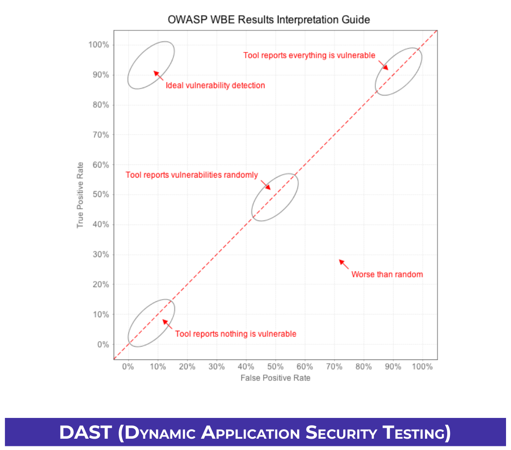

<!-- Start of picture text -->
DAST (DYNAMIC APPLICATION SECURITY TESTING) <!-- End of picture text -->

Dando continuidade à nossa discussão, quando falamos de ferramentas dinâmicas, basicamente consideramos o software em operação, ou seja, em funcionamento com as diversas operações e interações que são geradas. 

Esse tipo de teste é amplamente utilizado para fins de verificação de **compliance de segurança e padrões internacionais** da indústria, bem como para geração de releases e evoluções do software após seu lançamento. 

Pode ser chamado também de **TESTE DE COMPORTAMENTO.** Ou seja, a falha pode não estar relacionada diretamente ao código fonte, mas são comportamentos gerados durante sua utilização. Assim, a partir de um comportamento que gere risco, deve-se fazer o processo reverso para buscar mapear uma forma de evitar o devido comportamento. 

Um outro viés que se constrói com esse tipo de ferramenta é o teste de penetração. Assim, utiliza-se de diversas ferramentas com características e capacidades diferentes de maneira complementar para avaliar as vulnerabilidades comportamentais do software.

---

<!-- pagina: 216 -->

**André Castro Aula 00** 

Podemos elencar como **VANTAGENS:** 

- **a)** Geralmente é rápido em termos de análise e possui custo reduzido; **b)** Geralmente exige um conhecimento técnico menor quando comparado com as ferramentas SAST; 

- **c)** Testa os códigos que já estão expostos e em produção; 

###### Como **DESVANTAGENS:** 

- **a)** Atuação tardia no processo do Ciclo de Vida de Desenvolvimento; 

- **b)** Testa apenas o impacto na abordagem frontal e direta da aplicação; 

Na prática, o que se busca é a utilização conjugada das aplicações de teste que possuem os dois recursos. 

# **IAST (INTERACTIVE APPLICATION SECURITY TESTING)** 

Trata-se de uma abordagem de teste de segurança de software que ocorre durante o ciclo de desenvolvimento de um aplicativo. **Ao contrário de outras técnicas de teste de segurança, o IAST se integra diretamente ao código do aplicativo e monitora sua execução em busca de vulnerabilidades em tempo real.** 

O IAST combina elementos de SAST (Static Application Security Testing) e DAST (Dynamic Application Security Testing). Ele examina o código-fonte em busca de problemas potenciais e simula ataques reais em tempo de execução para identificar vulnerabilidades que podem não ser detectadas apenas durante a análise estática. 

Essa abordagem ajuda as equipes de desenvolvimento a identificar e corrigir vulnerabilidades de segurança de maneira mais eficaz e precoce no processo de desenvolvimento. Isso ocorre porque o IAST fornece informações detalhadas sobre onde as vulnerabilidades foram encontradas e como elas podem ser exploradas. 

Há ainda algumas classificações derivadas do IAST como PASSIVO e ATIVO. Basicamente o PASSIVO faz referência de quando o IAST é incorporado às ferramentas SAST. Ele permite que esses scanners confirmem alguns dos falsos positivos, compilando e testando o código. Portanto, a taxa de falsos positivos é reduzida. 

As ferramentas passivas do IAST geralmente pesquisam vulnerabilidades em partes de código atualmente analisadas pela parte estática da solução. Isso significa que o aplicativo inteiro não é compilado e testado como um todo, o que pode causar a perda de certas vulnerabilidades. 

Já o IAST ativo é quando os DAST’s incorporam os IAST’s em sua função. O seu foco é na identificação da origem dos problemas para facilitar a interação e reação dos desenvolvedores. Estas acabam por fornecer resultados mais precisos e reduzem o número de falsos positivos. 

No caso de linguagens como PHP, uma ferramenta IAST ativa pode realmente identificar a linha exata de código que causa a vulnerabilidade. No caso de linguagens pré-compiladas, ele pode identificar o problema no código de bytes, o que acelera sua localização no código-fonte.

---

<!-- pagina: 217 -->

**André Castro Aula 00** 

Quero fechar esse bloco trazendo um compilado de práticas e benefícios que são informados por fabricantes diversos deste produto. Faço isso pois, infelizmente, as bancas têm se valido desse recurso para cobrar em prova, uma vez que não há referências bibliográficas e teóricas para esses assuntos mais atuais. 

Análise durante a Execução: Ao contrário das ferramentas estáticas que analisam o código-fonte ou das ferramentas dinâmicas que simulam ataques, as ferramentas IAST examinam a aplicação em tempo de execução. Isso permite a detecção de vulnerabilidades reais à medida que a aplicação interage com dados, APIs e usuários reais. 

1. **Inteligência Contextual:** As ferramentas IAST têm a capacidade de entender o contexto da aplicação em execução. Elas podem entender os fluxos de dados, como os dados são manipulados, e como eles fluem através das diferentes camadas da aplicação. Isso ajuda a identificar vulnerabilidades relacionadas ao fluxo de dados e contexto específico. 

2. **Mínima Falsa Positividade:** Uma das vantagens das ferramentas IAST é a redução de falsos positivos. Como elas examinam a aplicação em tempo de execução, podem determinar com mais precisão se uma vulnerabilidade é explorável ou se é apenas um cenário teórico. 

3. **Cobertura Profunda:** Ferramentas IAST podem fornecer uma cobertura de testes mais profunda, pois interagem diretamente com a aplicação em execução. Elas podem examinar as interações entre componentes e partes da aplicação que podem ser difíceis de analisar com outras abordagens. 

4. **Integração com o Ciclo de Desenvolvimento:** As ferramentas IAST podem ser integradas ao processo de desenvolvimento, permitindo que as vulnerabilidades sejam identificadas e corrigidas durante o desenvolvimento, em vez de apenas no final do ciclo. 

5. **Baixo Impacto no Desempenho:** Em comparação com algumas abordagens dinâmicas, as ferramentas IAST geralmente têm um impacto menor no desempenho da aplicação, já que operam em segundo plano e coletam informações enquanto a aplicação é executada. 

6. **Detecção em Tempo Real:** As vulnerabilidades são identificadas em tempo real, à medida que a aplicação é usada, permitindo a correção imediata e a mitigação de riscos. 

7. **Suporte a Diferentes Tecnologias:** Boas ferramentas IAST têm suporte para uma ampla gama de tecnologias, linguagens de programação e estruturas de desenvolvimento, o que as torna versáteis para uso em diferentes tipos de aplicações. 

8. **Aprendizado Contínuo:** Algumas ferramentas IAST podem aprender com os padrões de comportamento da aplicação, melhorando sua capacidade de identificar anomalias e vulnerabilidades à medida que a aplicação evolui. 

9. **Integração com Ferramentas de Gerenciamento de Vulnerabilidades:** As descobertas das ferramentas IAST podem ser integradas em sistemas de gerenciamento de vulnerabilidades para rastreamento e correção eficientes. 

# **OFTWARE COMPOSITION ANALYSIS SCA (S )** 

O SCA (Software Composite Analysis) é uma técnica utilizada para analisar a composição de softwares. Ele examina o código-fonte, bibliotecas e componentes para identificar vulnerabilidades, problemas de licenciamento e dependências. Geralmente, esse processo é manual, o que onera sobremaneira as equipes, e acaba por não fornecer uma visão completa e

---

<!-- pagina: 218 -->

**André Castro Aula 00** 

robusta, prejudicando a segurança, celeridade e confiabilidade nos processos de deploy de aplicações. 

Lembremos o contexto moderno de mais e com maior nível de que aplicações complexas dependências e integrações, em contextos de nuvem e multi-cloud, por exemplo, reforçam essa problemática. Tudo isso associado a esteiras produtivas de DEVOPS, ou melhor dizendo, DEVSECOPS. 

Uma imagem para nossa reflexão do desafio: 

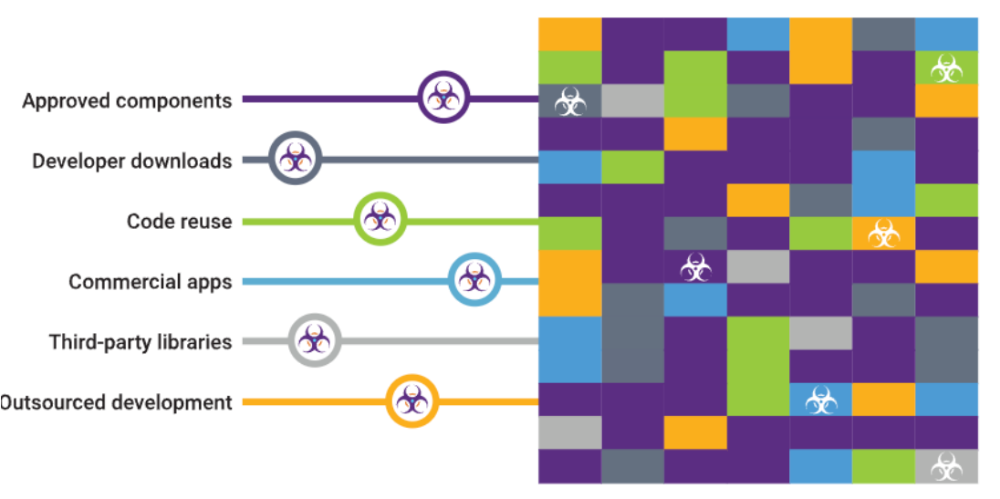

O SCA, geralmente é dividido nas seguintes etapas em seu processamento: 

**1. Escaneamento:** O software escaneia o código-fonte e as bibliotecas utilizadas no projeto. 

**2. Identificação:** Ele identifica todas as dependências e componentes de terceiros. 

**3. Análise:** O SCA analisa esses componentes para verificar a existência de vulnerabilidades conhecidas, questões de conformidade de licenciamento e outros riscos de segurança. 

**4. Relatório:** Ele gera relatórios detalhados com as vulnerabilidades encontradas, sugerindo correções ou atualizações necessárias. 

O objetivo é garantir que o software seja seguro e conforme as licenças de uso, ajudando a evitar problemas legais e de segurança.

---

<!-- pagina: 219 -->

**André Castro Aula 00** 

Em termos de capacidades de detecção e recursos associados, há um desafio por envolver múltiplos fabricantes em diferentes categorias de oferta. Mas trago aqui uma lista de possibilidades a serem ofertadas no âmbito de um SCA: 

- **Varredura multifatorial:** com varredura de dependência, binária e assinatura, tem-se abordagens de varredura multifacetada do mercado, com capacidades de identificar código aberto que oferta dependência singulares. Isso inclui dependências encontradas em código-fonte, imagens de contêiner, binários, firmware e código gerado por IA . 

- Base de dados Proprietárias - KnowledgeBase: Aqui temos um dos principais valores e capacidades das ferramentas de mercado, ao considerar os seus repositórios mais abrangentes do que os setores de informações de código aberto, licença e segurança, alcançando muito além das informações padrão encontradas em feeds gratuitos como o NVD. 

- **Alertas e Avisos pró-ativos :** Esses avisos ==5460== oferecem notificações de segurança priorizadas e selecionadas. Basicamente busca-se antecipar informações qualificadas quando comparadas às publicações oficiais e abertas das principais fontes públicas.Sabemos que um dos principais desafios da segurança é a antecipação e prevenção. 

- **Identificação de licença** : Rastreamento de licenças de código aberto, ajudando os usuários a evitar violações de licença que podem resultar em litígios dispendiosos ou comprometer a propriedade intelectual. 

- **Configurações de política:** possibilidades de customização da configuração de política tornando-a mais personalizável e detalhada, permitindo a simplificação das atividades de segurança. 

- **Inserções nas esteiras de CI/CD:** Necessidade de se integrar às cadeias de ferramentas SDLC e CI/CD existentes , minimizando o atrito e ajudando a manter a velocidade de desenvolvimento. 

- ● **Software Bills of Materials (SBOMs):** Simplificação do gerenciamento de SBOM, com a capacidade de importação de SBOMs de terceiros com o objetivo de mapear automaticamente conhecidos e criar novos dependências para componentes 

- componentes para dependências personalizadas ou comerciais. Também possui a capacidade de exportar SBOMs em diferentes formatos para diferentes necessidades. 

Ainda, trazendo uma visão dos desafios nesse gerenciamento de riscos na cadeia de fornecimento de software, podemos citar: 

- **Dependências indiretas:** as dependências de um aplicativo podem ter suas próprias dependências. Essas cadeias podem atingir vários níveis de profundidade, dificultando a visibilidade total. 

- **Identificação de Dependências:** Diferentes linguagens de programação e ecossistemas lidam com dependências de maneira diferente. As soluções SCA devem compreender todas as maneiras pelas quais o código-fonte aberto pode ser importado para um aplicativo. 

- **Gerenciamento de vulnerabilidade:** Novas vulnerabilidades são descobertas a cada dia e as fontes de gerenciamento de vulnerabilidade nem sempre estão atualizadas. Como resultado, o SCA pode perder vulnerabilidade e as equipes de desenvolvimento podem ter dificuldades para acompanhar o backlog.

---

<!-- pagina: 220 -->

**André Castro Aula 00** 

- **Complexidade de Implantação:** Implementação complexa e trabalhosa que pode levar meses até ficar totalmente operacional 

- **Diferentes formatos e estruturas de base de dados:** Cada produto usa seu próprio banco de dados proprietário de componentes OSS que podem variar drasticamente em termos de tamanho e cobertura 

- **Limitação de base de dados públicas:** Limitar os dados de vulnerabilidade apenas aos relatórios sobre vulnerabilidades oficialmente reportadas no NVD (o que pode ocorrer meses após a vulnerabilidade ter sido descoberta originalmente) 

- **Falta de ação e orientação:** Falta de orientação automatizada sobre as ações a tomar com base nos relatórios e dados da SCA e falta de orientação sobre os requisitos legais das licenças OSS que são detectadas 

O SCA (Software Composite Analysis) pode ser aplicado tanto a códigos open source quanto a códigos proprietários. Ele analisa qualquer tipo de código-fonte e seus componentes, independentemente da licença, para identificar vulnerabilidades, problemas de conformidade e dependências. O foco é garantir a segurança e a conformidade do software, seja ele open source ou proprietário. 

Importante lembrar que tanto o SCA, SAST, DAST e IAST são todas tecnologias usadas para garantir a segurança e a qualidade do software, mas elas se focam em aspectos diferentes. 

Então, enquanto o SCA foca na análise de componentes de terceiros, SAST e DAST focam no código próprio e na execução do software, respectivamente. 

Apenas para termos no radar a respeito de algumas das principais ferramentas de Software Composition Analysis (SCA) disponíveis hoje, pois, muitas das vezes, as bancas extraem conceitos e informações diretamente dos sites desses fabricantes: 

**1. Black Duck:** Oferecida pela Synopsys, é conhecida por sua capacidade de analisar componentes open source e gerenciar vulnerabilidades e licenças. 

**2. Snyk:** Foca na segurança de código open source, ajudando a identificar e corrigir vulnerabilidades em bibliotecas de terceiros. 

**3. WhiteSource:** Fornece soluções para gerenciamento de vulnerabilidades e conformidade de licenciamento em componentes open source. 

**4. FOSSA:** É uma ferramenta que automatiza a descoberta de componentes open source, gerenciando licenças e detectando vulnerabilidades.

---

<!-- pagina: 221 -->

**André Castro Aula 00** 

**5. Jfrog Xray:** Parte do ecossistema Jfrog, Xray oferece análise profunda de artefatos para detectar vulnerabilidades e problemas de licenciamento. 

**6. Sonatype Nexus Lifecycle:** Ajuda a monitorar e gerenciar a segurança de componentes open source ao longo do ciclo de vida do software. 

Mergulhando um pouco mais na dinâmica de funcionamento do SCA, temos que eles inspecionam gerenciadores de pacotes, arquivos manifestos, código-fonte, arquivos binários, imagens de contêiner e muito mais. O código-fonte aberto identificado é compilado em uma Lista de Materiais (Bill of Materials - BOM), que é então comparada com uma variedade de bancos de dados, incluindo o National Vulnerability Database (NVD). Basicamente um banco de dados com CVE’s e vulnerabilidades conhecidas mantida pelo Governo Americano. 

Além disso, cada uma dessas ferramentas também possuem suas bases próprias com inteligências específicas geradas e outros regimes de parceria para cruzamento de dados e troca de informações.

---

<!-- pagina: 222 -->

**André Castro Aula 00** 

# **<mark>OWASP TOP 10 - R</mark> ISCOS DE** **<mark>S</mark> DE** **<mark>A</mark> EGURANÇA PLICAÇÕES** **<mark>WEB</mark>** 

Pessoal, para iniciar nossa conversa sobre o assunto, não tem como fugirmos da definição do próprio site sobre o assunto, vejamos: 

O OWASP Top 10 é um documento de conscientização padrão para desenvolvedores e segurança de aplicativos da web. Ele representa um amplo consenso sobre os riscos de segurança mais críticos para aplicativos da web. 

Reconhecido globalmente pelos desenvolvedores como o primeiro passo para uma codificação mais segura. 

As empresas devem adotar este documento e iniciar o processo de garantir que suas aplicações web minimizem esses riscos. Usar o OWASP Top 10 talvez seja o primeiro passo mais eficaz para mudar a cultura de desenvolvimento de software em sua organização para uma que produza um código mais seguro. 

O OWASP Top 10 é baseado, essencialmente, em submissões de dados de empresas especializadas na área da segurança aplicacional e em inquéritos realizados a profissionais individuais do setor. Estes dados refletem as vulnerabilidades identificadas em centenas de organizações, aplicações e APIs reais. Os tópicos do Top 10 são selecionados e ordenados de acordo com a sua prevalência, combinada com uma estimativa ponderada do potencial de abuso, detecção e impacto. 

O principal objetivo do OWASP Top 10 é o de educar programadores, desenhadores e arquitetos de aplicações, bem como gestores e as próprias organizações sobre as consequências dos problemas de segurança mais comuns e mais importantes no contexto das aplicações web. O Top 10 oferece não só técnicas básicas para proteção nestas áreas problemáticas e de elevado risco, mas também direções sobre onde encontrar informação adicional sobre estes assuntos. 

**CESPE / CEBRASPE - 2022 - TCE-RJ - Analista de Controle Externo** 

**Classificação de Risco para o Top 10 é uma metodologia baseada na OWASP Risk Rating Methodology e consiste em estimar, para cada categoria do Top 10, o risco peculiar que cada falha introduz em uma aplicação web típica e, posteriormente, ordenar o Top 10 de acordo com as falhas que tipicamente introduzem o risco mais significativo para uma aplicação.**

---

<!-- pagina: 223 -->

**André Castro Aula 00** 

###### **Comentários:** 

Típica questão conceito pessoal, que aborda a metodologia de classificação de riscos da própria OWASP para se chegar à referida classificação. 

Esse é um exemplo para o TOP 1 da lista: 

CWEs mapeados - 34 

Taxa de incidência máxima – 55,97% 

Taxa média de incidência – 3,81% 

Exploração média ponderada – 6,92 

Impacto médio ponderado – 5,93 Cobertura máxima – 94,55% Cobertura média – 47,72% Total de Ocorrências – 318,487 Total de CVEs – 19,13 

**Gabarito** : C 

Nesse sentido, temos a classificação direta e objetiva da lista, trazendo inclusive o histórico de evolução e mudança das classificações. 

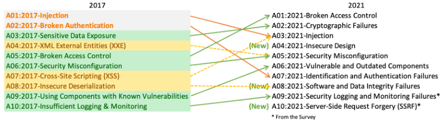

Nesse contexto, é importante verificar as evoluções da análise, pois é justamente onde as bancas gostam de tentar trabalhar com o candidato. Três categorias anteriores deixaram de existir, e foram incorporadas em estruturas mais genéricas, então é um ponto que a banca pode querer explorar, ao referenciá-los, pois estavam em 2017, a saber: 

**A04:2017 - XML External Entities (XXE)** 

**A07:2017 - Cross-Site Scripting (XSS)** 

**A08:2017 -Insecure Deserialization** 

Ainda, importante ter no radar o surgimento de três novas categorias nesse processo, a saber: 

**A04:2021 - Security Misconfiguration** 

**A08:2021 - Software and Data Integrity Failures** 

**A10:2021 - Server-Side Request Forgery (SSRF)**

---

<!-- pagina: 224 -->

**André Castro Aula 00** 

Bom pessoal, avançando, infelizmente, não temos para onde correr agora a não ser percorrer todos os itens das 10 categorias previstas no OWASP. As bancas estão cobrando itens específicos dentro de cada controle, conforme veremos a seguir. 

Basicamente, cada categoria apresenta uma visão geral da vulnerabilidade, com uma descrição associada, e contramedidas/prevenções que devem ser aplicadas ou realizadas. Por fim, tem-se exemplos práticos com cenários específicos para cada um. Não passaremos pelos exemplos, nos atendo até as medidas de prevenção. Desta feita, vamos avançar… 

## **A01:2021 - Quebra de Controle de Acesso** 

###### 1. **Descrição** 

- Restrição de ações com base em suas permissões 

- Falhas nesse processo levam a divulgação, modificação ou destruição não autorizadas da informação 

###### 2. **Vulnerabilidades** 

- I. **Violação do princípio de privilégio mínimo ou negação por padrão,** onde o acesso deve ser concedido apenas para recursos, funções ou usuários específicos, mas está disponível para qualquer pessoa. 

- II. Ignorando as verificações de controle de acesso modificando a URL (alteração de parâmetro ou navegação forçada), o estado interno do aplicativo ou a página HTML, ou usando uma ferramenta de ataque modificando solicitações de API. 

- III. **Permitir a visualização ou edição da conta de outra pessoa,** fornecendo seu identificador exclusivo (referências de objetos diretos inseguros) 

- **IV. Acessando API com controles de acesso ausentes para POST, PUT e DELETE.** 

- V. Elevação de privilégio. Atuar como usuário sem estar conectado ou atuar como administrador quando estiver conectado como usuário. 

- VI. Manipulação de metadados, como **reproduzir ou adulterar um token de controle de acesso JSON Web Token (JWT), ou um cookie ou campo oculto manipulado para elevar privilégios ou abusar da invalidação de JWT.** 

- VII. A configuração incorreta do Cross-Origin Resource Sharing - CORS - permite o acesso à API de origens não autorizadas/não confiáveis. 

- VIII. Força a navegação em páginas autenticadas como usuário não autenticado ou em páginas privilegiadas como usuário padrão. 

Pessoal, então o que tenho a acrescentar aqui é sempre no horizonte de quebra de autenticação e utilização indevida desses acessos para interação com domínios não autorizados ou restritos. Tenham isso em mente no que tange às vulnerabilidades geradas dentro desta categoria. 

###### 3. **Prevenção** 

- **I. Exceto para recursos públicos, negar por padrão.**

---

<!-- pagina: 225 -->

**André Castro Aula 00** 

- II. Implemente mecanismos de controle de acesso uma vez e reutilize-os em todo o aplicativo, inclusive minimizando o uso do Cross-Origin Resource Sharing (CORS). 

- III. Os controles de acesso do modelo devem impor a propriedade do registro em vez de aceitar que o usuário possa criar, ler, atualizar ou excluir qualquer registro. 

- IV. Os requisitos exclusivos de limite de negócios do aplicativo devem ser impostos por modelos de domínio. 

- V. Desative a listagem de diretórios do servidor web e certifique-se de que os metadados do arquivo (por exemplo, .git) e os arquivos de backup não estejam presentes nas raízes da web. 

- VI. Registre falhas de controle de acesso, alerte os administradores quando apropriado (por exemplo, falhas repetidas). 

- VII. Taxa de limite de acesso à API e ao controlador para minimizar os danos das ferramentas de ataque automatizadas. 

- VIII. Os identificadores de sessão com estado devem ser invalidados no servidor após o logout. Os tokens JWT sem estado devem ser de curta duração para que a janela de oportunidade para um invasor seja minimizada. Para JWTs de vida mais longa, é altamente recomendável seguir os padrões OAuth para revogar o acesso. 

Meu destaque aqui vai sempre para exceções... Então tem-se um princípio de Arquitetura Zero-Trust aqui, ao se negar por padrão, exceto aqueles recursos públicos. Chamo sua atenção para isso. 

Um outro ponto que quero trazer ainda nesse contexto é um aprofundamento do procedimento do CORS. Algumas bancas estão indicando esse conteúdo expresso no edital. 

O CORS é uma política de segurança implementada nos navegadores que protege contra acessos indevidos entre domínios distintos via JavaScript. 

O processo ocorre associado à requisição Fetch(). A função fetch() é uma API nativa do JavaScript usada para realizar requisições HTTP assíncronas a recursos externos — normalmente APIs RESTful ou qualquer serviço web.vEla substitui, de forma mais moderna e promissora, o antigo XMLHttpRequest, oferecendo uma sintaxe mais simples. 

Ao fazer uma requisição fetch() de um domínio A para um domínio B, o navegador exige que o servidor B permita explicitamente a origem A. Isso é feito com cabeçalhos HTTP: 

- Access-Control-Allow-Origin: https://dominio-a.com 

- Access-Control-Allow-Methods: GET, POST 

- Access-Control-Allow-Headers: Authorization 

- Access-Control-Allow-Credentials: true 

Para métodos como PUT, DELETE ou cabeçalhos personalizados, o navegador realiza uma requisição OPTIONS automática antes da real: 

- OPTIONS /api/dados HTTP/1.1 

- Origin: https://dominio-a.com 

- Access-Control-Request-Method: POST 

- Access-Control-Request-Headers: X-Custom-Header

---

<!-- pagina: 226 -->

**André Castro Aula 00** 

Um dos riscos mais comuns é na configuração do Access-Control-Allow-Origin. 

- Access-Control-Allow-Origin: * em APIs que usam cookies: permite que qualquer site acesse recursos autenticados. Isso gera permissão irrestrita de métodos ou cabeçalhos sensíveis. 

###### **Então, na prática, algumas boas práticas podem ser adotadas, como:** 

- Validar origem no backend. 

- Configurar CORS via middleware (Ex: Express, Flask, Spring Boot) limitando domínios autorizados. 

- Bloquear uso de credentials: true com * como origem. 

###### **CESPE - 2025 - SEFAZ-RJ** 

**De acordo com o OWASP TOP 10, o risco de falha de controle de acesso permite que invasores** 

**A falsifiquem solicitações a um servidor remoto.** 

**B desconsiderem autorizações e executem tarefas como se fossem usuários privilegiados.** 

**C obtenham acesso a dados confidenciais e não criptografados.** 

**D explorem vulnerabilidades em bibliotecas compartilhadas.** 

**E injetem código malicioso por meio de uma entrada de formulário.** 

###### **Comentários:** 

Vejam que todos os outros itens estão relacionados a diversas consequências de exploração de vulnerabilidades. Entretanto, especificamente falando, a quebra de controle de acesso está associada a execuções com usuário privilegiados indevidos. 

**Gabarito** : B 

**FGV - 2022 - TRT - 13ª Região (PB) - Técnico Judiciário - Tecnologia da Informação** 

**A falha ou quebra de controle de acesso ("Broken Access Control") é um risco de segurança crítico para aplicações Web.** 

**Para prevenir essa vulnerabilidade, o OWASP recomenda que** 

**A a listagem de diretórios do servidor web seja desativada.** 

**B os tokens JWT stateless sejam de longa duração.** 

**C as sessões stateful sejam mantidas no servidor após o logout.** 

226 

https://t.me/KakashiAssinaturasBot

---

<!-- pagina: 227 -->

**André Castro Aula 00** 

**D evite reutilizar os mecanismos de controle de acesso.** 

**E utilize APIs sem taxa limite de requisições.** 

###### **Comentários:** 

Exatamente conforme o item V previsto na prevenção: 

**V. Desative a listagem de diretórios do servidor web e certifique-se de que os metadados do arquivo (por exemplo, .git) e os arquivos de backup não estejam presentes nas raízes da web.** 

**Gabarito** : A 

**FGV - 2022 - TJ-DFT - Analista Judiciário - Análise de Sistemas** 

**PedidosSemEstresse é uma aplicação Web destinada a digitalizar o processo de pedidos de serviços de um órgão da administração pública. A interface de PedidosSemEstresse utilizada pelos usuários faz chamadas a uma API RESTful e não utiliza facilidades de login único (single sign-on – SSO). Recentemente, o usuário interno João utilizou suas próprias credenciais com privilégios somente de execução de métodos GET para explorar vulnerabilidades e teve acesso direto a API RESTful. Assim, João fez chamadas a métodos POST com sucesso.** 

**Com base no OWASP Top Ten, a vulnerabilidade explorada por João é da categoria:** 

**A Injection;** 

**B Broken Access Control;** 

**C Software and Data Integrity Failures;** 

**D Vulnerable and Outdated Components;** 

**E Identification and Authentication Failures** 

###### **Comentários:** 

Vejam que estamos na mesma linha da questão anterior, onde há uma falha de autorização, uma vez que um usuário, que tinha permissão somente para determinada ação, consegue realizar outra ação. 

**Gabarito** : B 

## **A02:2021 - Falhas criptográficas** 

1. **Descrição**

---

<!-- pagina: 228 -->

**André Castro Aula 00** 

- Falhas relacionadas à criptografia ou falta dela 

- Exposição de dados sensíveis ou confidenciais 

- Necessidade de determinação de segurança de dados em trânsito ou repouso 

- Destaques a dados privados suscetíveis a regulações próprias 

Meu destaque pessoal fica por conta do fortalecimento e necessidade de uso da criptografia, tanto para dados em repousou, como em trânsito. Veremos mais alguns detalhes a seguir, que merecem também sua atenção. 

###### 2. **Vulnerabilidades** 

- I. Algum dado é transmitido em texto simples? **Isso diz respeito a protocolos como HTTP, SMTP, FTP também usando atualizações TLS como STARTTLS.** O tráfego externo da Internet é perigoso. Verifique todo o tráfego interno, por exemplo, entre balanceadores de carga, servidores web ou sistemas back-end. 

- II. Algum algoritmo ou **protocolo criptográfico antigo ou fraco** é usado por padrão ou em código mais antigo? 

- III. As chaves criptográficas padrão estão em uso, as chaves criptográficas fracas são geradas ou reutilizadas ou o gerenciamento ou rotação de chaves está ausente? As chaves criptográficas são verificadas nos repositórios de código-fonte? 

- IV. A criptografia não é aplicada. Por exemplo, há alguma diretiva de segurança de cabeçalhos HTTP (navegador) ou cabeçalhos ausentes? 

- **V. O certificado do servidor recebido e a cadeia de confiança estão devidamente validados?** 

- VI. Os vetores de inicialização são ignorados, reutilizados ou não gerados suficientemente seguros para o modo de operação criptográfico? Está em uso um modo de operação inseguro, como o BCE? A criptografia é usada quando a criptografia autenticada é mais apropriada? 

- VII. As senhas estão sendo usadas como chaves criptográficas na ausência de uma função de derivação de chave de base de senha? 

- VIII. A aleatoriedade é usada para fins criptográficos que não foram projetados para atender aos requisitos criptográficos? Mesmo que a função correta seja escolhida, ela precisa ser propagada pelo desenvolvedor e, caso contrário, o desenvolvedor sobrescreveu a funcionalidade de propagação forte incorporada a ela com uma semente que não possui entropia/imprevisibilidade suficiente? 

- IX. **As funções de hash obsoletas, como MD5 ou SHA1, estão em uso** ou as funções de hash não criptográficas são usadas quando as funções de hash criptográficas são necessárias? 

- X. Estão em uso métodos de preenchimento criptográfico obsoletos, como PKCS número 1 v1.5? 

- XI. As mensagens de erro criptográficas ou informações de canal lateral podem ser exploradas, por exemplo, na forma de ataques oracle de preenchimento? 

Pessoal, então o que tenho a acrescentar aqui é sempre no horizonte de quebra de autenticação e utilização indevida desses acessos para interação com domínios não autorizados ou restritos. Tenham isso em mentes no que tange às vulnerabilidades geradas dentro desta categoria. 

###### 3. **Prevenção**

---

<!-- pagina: 229 -->

**André Castro Aula 00** 

- I. Classifique os dados processados, armazenados ou transmitidos por um aplicativo. Identifique quais dados são confidenciais de acordo com as leis de privacidade, requisitos regulatórios ou necessidades de negócios. 

- II. Não armazene dados confidenciais desnecessariamente. Descarte-o o mais rápido possível ou use tokenização compatível com PCI DSS ou até mesmo truncamento. Os dados que não são retidos não podem ser roubados. 

- **III. Certifique-se de criptografar todos os dados confidenciais em repouso.** 

- IV. Garantir que algoritmos, protocolos e chaves padrão atualizados e fortes estejam em vigor; use o gerenciamento de chaves adequado. 

- **V. Criptografe todos os dados em trânsito com protocolos seguros, como TLS com cifras de sigilo de encaminhamento (FS), priorização de cifras pelo servidor e parâmetros seguros. Imponha a criptografia usando diretivas como HTTP Strict Transport Security (HSTS).** 

- **VI. Desabilite o armazenamento em cache para respostas que contenham dados confidenciais.** 

- VII. Aplique os controles de segurança necessários de acordo com a classificação dos dados. 

- VIII. **Não use protocolos legados, como FTP e SMTP, para transportar dados confidenciais** . 

- IX. Armazene senhas usando funções de hashing adaptáveis e salgadas fortes com um fator de trabalho (fator de atraso), como Argon2, scrypt, bcrypt ou PBKDF2. 

- **X. Os vetores de inicialização devem ser escolhidos de acordo com o modo de operação. Para muitos modos, isso significa usar um CSPRNG (gerador de números pseudo-aleatórios criptograficamente seguro). Para modos que exigem um nonce, o vetor de inicialização (IV) não precisa de um CSPRNG. Em todos os casos, o IV nunca deve ser usado duas vezes para uma chave fixa.** 

- XI. Sempre use criptografia autenticada em vez de apenas criptografia. 

- XII. As chaves devem ser geradas criptograficamente aleatoriamente e armazenadas na memória como arrays de bytes. Se uma senha for usada, ela deverá ser convertida em uma chave por meio de uma função de derivação de chave de base de senha apropriada. 

- XIII. Certifique-se de que a aleatoriedade criptográfica seja usada quando apropriado e que não tenha sido propagada de maneira previsível ou com baixa entropia. A maioria das APIs modernas não exige que o desenvolvedor semeie o CSPRNG para obter segurança. 

- XIV. Evite funções criptográficas obsoletas e esquemas de preenchimento, como MD5, SHA1, PKCS número 1 v1.5 . 

- XV. Verifique de forma independente a eficácia da configuração e configurações. 

Vejamos uma questão sobre o assunto: 

###### **CESPE / CEBRASPE - 2022 - BANRISUL - Desenvolvimento de Sistemas** 

**No que se refere a falhas de criptografia, recomenda-se desabilitar o cache para respostas que contenham dados sensíveis.** 

###### **Comentários:** 

Exatamente pessoal. Típica questão que demonstra que não temos para onde correr, a não ser passar por todas as medidas e prevenções do OWASP. Este item está previsto na prevenção de nº 6 do Controle A02:2021 - Falhas Criptográficas. 

**Gabarito** : C

---

<!-- pagina: 230 -->

**André Castro Aula 00** 

###### **CESPE / CEBRASPE - 2022 - BANRISUL - Desenvolvimento de Sistemas** 

**No que se refere a falhas de criptografia, recomenda-se desabilitar o cache para respostas que contenham dados sensíveis.** 

###### **Comentários:** 

Novamente, vejam que quando é para colocar a assertiva como CORRETA, a banca pega exatamente o texto apresentado. 

**Gabarito** : C 

## **A03:2021 - Injeção** 

###### 1. **Descrição** 

- Congrega diversas técnicas de ataque, **incluindo XSS e CSRF, por exemplo, além dos clássicos SQL Injection** 

- A revisão constante dos códigos e scripts é fundamental para tentar identificar as vulnerabilidades 

- Pode-se utilizar ferramentas como SAST, DAST e IAST 

Pessoal, para este item, é importante vocês terem em mente que houve uma agragação de tipos de ataques que possuem como premissa básica o ato de injeção de código ou scripts. Dito isso, tivemos os ataques de XSS e CSRF em conjunto com o "famoso" SQL Injection. Em que pese tenham característica semelhantes de entrada, os impactos e consequência, bem como cada ataque é derivado posteriormente à injeção, é diferente, inclusive no que tange à sua finalidade. 

Ainda, merece destacar a importância do uso de ferramentas automatizadas que buscam avaliar a qualidade do código em torno dos aspectos de segurança. Nesse quesito, tem-se o SAST (que olha código estático, basicamente, seu código fonte), o DAST (que foca nas funcionalidades do sistema, simulando a ótica do usuário), e o IAST (que traz uma perspectiva das interações do código e produto). 

###### 2. **Vulnerabilidades** 

- I. Os dados fornecidos pelo usuário não são validados, filtrados ou higienizados pelo aplicativo. 

- **II. Consultas dinâmicas ou chamadas não parametrizadas sem escape sensível ao contexto são usadas diretamente no interpretador.** 

- III. Dados hostis são usados em parâmetros de pesquisa de mapeamento relacional de objeto (ORM) para extrair registros confidenciais adicionais. 

- IV. Dados hostis são usados diretamente ou concatenados. **O SQL ou comando contém a estrutura e os dados maliciosos em consultas dinâmicas, comandos ou procedimentos armazenados.** 

Importante termos em mente, como principal característica, as vulnerabilidades associadas à entrada de dados diretamente nas páginas, por parte de áreas dinâmica e chamadas diversas ao código por parte do usuário.

---

<!-- pagina: 231 -->

**André Castro Aula 00** 

###### 3. **Prevenção** 

- I. Manter os dados separados de comandos e consultas 

- II. A opção preferencial é usar uma API segura, que evite totalmente o uso do interpretador, forneça uma interface parametrizada ou migre para Object Relational Mapping Tools (ORMs). 

   - i. Nota: Mesmo quando parametrizados, os procedimentos armazenados ainda podem introduzir injeção de SQL se PL/SQL ou T-SQL concatenando consultas e dados ou executar dados hostis com EXECUTE IMMEDIATE ou exec(). 

- **III. Use validação de entrada positiva do lado do servidor. Essa não é uma defesa completa, pois muitos aplicativos exigem caracteres especiais, como áreas de texto ou APIs para aplicativos móveis.** 

- IV. Para quaisquer consultas dinâmicas residuais, escape caracteres especiais usando a sintaxe de escape específica para esse interpretador. 

   - i. Nota: Estruturas SQL, como nomes de tabelas, nomes de colunas e assim por diante, não podem ser escapadas e, portanto, os nomes de estrutura fornecidos pelo usuário são perigosos. Este é um problema comum em software de redação de relatórios. 

- **V.** Use LIMIT e outros controles SQL nas consultas para evitar a divulgação em massa de registros em caso de injeção de SQL. 

**Aqui, o que imaginamos a banca realizando, é justamente permutar itens de vulnerabilidades e prevenção do injection com outras categorias. Então é importante ficarem atentos a essa** **~~di~~ nâmica.** 

**CESPE - 2025 - SEFAZ-RJ - Analista de Tecnologia da Informação da Fazenda Estadual** 

**Um sistema de consulta a registros de rede, disponível em uma intranet corporativa, recebe parâmetros de entrada a partir de requisições HTTP e utiliza-os na composição de comandos de** 

**consulta ao seu repositório de dados. Durante um teste de vulnerabilidades relacionadas a ataques contra aplicações, a seguinte entrada foi fornecida por um programa testador no** 

**parâmetro de consulta de endereço IP da aplicação:** 

**10.0.0.1'; DELETE FROM registros; --** 

**Após o envio da requisição, um comportamento indesejado ocorreu e verificou-se que o artifício poderia ser objetivamente usado em um ataque real.** 

**Em relação à situação hipotética apresentada, assinale a opção correta.** 

**A O ataque foi viabilizado por uma falha do sistema operacional relacionada ao controle de permissões de arquivos temporários, o que permitiu a execução arbitrária de comandos de manipulação de dados pelo usuário remoto.** 

**B A vulnerabilidade decorre do uso de interpolação textual sem mecanismos de separação lógica entre dados e comandos, o que permite a injeção de código no interpretador de consultas.**

---

<!-- pagina: 232 -->

**André Castro Aula 00** 

**C O ataque caracteriza uma parametrização adicional indevida, viabilizada pela ausência de isolamento entre a camada de rede e o sistema operacional.** 

**D O uso do método HTTP para envio de dados é incorreto, o que impede o tratamento seguro de entradas potencialmente maliciosas.** 

**E A entrada fornecida manipula a lógica booleana da cláusula de filtragem, o que resulta em uma condição sempre falsa e instrui incorretamente o sistema sobre como manusear os dados.** 

###### **Comentários:** 

A entrada 10.0.0.1'; DELETE FROM registros; -- fecha a string do filtro, injeta um segundo comando SQL (DELETE) e comenta o restante. Isso só é possível porque a aplicação interpolou texto diretamente na query, sem usar queries parametrizadas/prepared statements, misturando dados e comandos — exatamente o cenário de SQL Injection. 

As demais não se tratam de permissão de SO, isolamento rede-SO, método HTTP “incorreto”, nem apenas manipulação booleana; é injeção de comando no interpretador SQL. 

**Gabarito** : B 

**FGV - 2022 - SEFAZ-AM - Analista de Tecnologia da Informação da Fazenda Estadual** 

**De modo a prevenir falhas de injeção de dados maliciosos, recomenda-se não usar, para o transporte de dados confidenciais, protocolos legados, como FTP e SMTP.** 

###### **Comentários:** 

Pessoal, a descrição em tela se refere a recomendações de prevenção da categoria de FALHAS CRIPTOGRÁFICAS e não de INJEÇÃO DE DADOS. Vejam justamente a dinâmica que comentei com vocês sobre troca de características. 

**Gabarito** : E 

## **A04:2021 - Design inseguro** 

###### 1. **Descrição** 

- Trata-se de uma nova categoria. 

- Foca nos aspectos voltados a problemas de arquitetura e design (desenho) do produto 

- Possui foco na pré codificação, isto é, antes do código ser desenvolvido 

- Pode-se ter problemas de ausência de controles ou este ser ineficaz durante o período de design 

- Deve-se fortalecer as ações associadas ao proecsso de coleta de requisitos e ao Ciclo de Desenvolvimento Seguro 

Um design seguro ainda pode ter defeitos de implementação levando a vulnerabilidades que podem ser exploradas. Um design inseguro não pode ser corrigido por uma implementação perfeita, pois, por definição, os controles de segurança necessários nunca foram criados para se defender contra ataques específicos.

---

<!-- pagina: 233 -->

**André Castro Aula 00** 

Por este motivo pessoal, é de suma importância ter um processo bem definido e desenhado na construção de uma solução, incorporando, ainda antes do desenvolvimento, essas questões e segurança. Importante lembrar como se fosse a fundação de uma casa. Se ela sair com problema, a casa sempre terá problemas estruturais independentemente do que faça por cima, ou seja, da qualidade do código que será desenvolvido. 

###### 2. **Prevenção** 

- I. Estabeleça e use um ciclo de vida de desenvolvimento seguro com profissionais da AppSec para ajudar a avaliar e projetar controles relacionados à segurança e privacidade 

- II. Estabeleça e use uma biblioteca de padrões de projeto seguros ou componentes prontos para uso de estradas pavimentadas 

- III. Use a modelagem de ameaças para autenticação crítica, controle de acesso, lógica de negócios e fluxos de chaves 

- IV. Integre linguagem e controles de segurança em histórias de usuários 

- V. Integre verificações de plausibilidade em cada camada do seu aplicativo (do front-end ao back-end) 

- VI. Escreva testes de unidade e integração para validar se todos os fluxos críticos são resistentes ao modelo de ameaça. Compile casos de uso e casos de uso indevido para cada camada de seu aplicativo. 

- VII. Segregar camadas de camadas no sistema e nas camadas de rede, dependendo das necessidades de exposição e proteção 

- VIII. Separe os locatários de forma robusta por design em todas as camadas 

**FGV - 2022 - SEFAZ-AM - Analista de Tecnologia da Informação da Fazenda Estadual** 

**De acordo com a OWASP TOP 10 2021, para o risco design inseguro, são medidas de prevenção para o desenvolvimento seguro o uso da modelagem de ameaças para autenticações críticas, controle de acesso e lógica de negócios.** 

###### **Comentários:** 

Exatamente na linha do que conversamos pessoal. 

**Gabarito** : C 

## **A05:2021 - Configuração incorreta de segurança** 

###### 1. **Descrição** 

Envolve a configuração de ambientes e servidores, bem como ausências de baselines seguras e ferramentas de compliance. 

Importante reforçar o conceito de baseline, que trata justamente daquela configuração de referência que poderá ser incorporada e espelhada, com todas as diretrizes e padrões de segurança já conhecidos e mapeados. 

2. **Vulnerabilidades**

---

<!-- pagina: 234 -->

**André Castro Aula 00** 

- I. Falta de proteção de segurança apropriada em qualquer parte da pilha de aplicativos ou permissões configuradas incorretamente em serviços de nuvem. 

- **II. Recursos desnecessários são ativados ou instalados (por exemplo, portas, serviços, páginas, contas ou privilégios desnecessários).** 

- **III. As contas padrão e suas senhas ainda estão habilitadas e inalteradas.** 

- IV. O tratamento de erros revela rastreamentos de pilha ou outras mensagens de erro excessivamente informativas aos usuários. 

- V. Para sistemas atualizados, os recursos de segurança mais recentes são desabilitados ou não configurados com segurança. 

- VI. As configurações de segurança nos servidores de aplicativos, estruturas de aplicativos (por exemplo, Struts, Spring, ASP.NET), bibliotecas, bancos de dados etc., não são definidas para valores seguros. 

- VII. O servidor não envia cabeçalhos ou diretivas de segurança ou eles não estão configurados para valores seguros. 

- VIII. O software está desatualizado ou vulnerável (consulte A06:2021-Componentes vulneráveis e desatualizados). Importante termos em mente, como principal característica, as vulnerabilidades associadas a entrada de dados diretamente nas páginas, por parte de áreas dinâmica e chamadas diversas ao código por parte do usuário. 

###### 3. **Prevenção** 

- I. **Um processo de proteção repetível torna rápido e fácil a implantação de outro ambiente devidamente bloqueado.** Os ambientes de desenvolvimento, controle de qualidade e produção devem ser configurados de forma idêntica, com credenciais diferentes usadas em cada ambiente. Esse processo deve ser automatizado para minimizar o esforço necessário para configurar um novo ambiente seguro. 

- II. Uma plataforma mínima sem recursos, componentes, documentação e amostras desnecessários. Remova ou não instale recursos e estruturas não utilizados. 

- III. Uma tarefa para revisar e atualizar as configurações apropriadas para todas as notas de segurança, atualizações e patches como parte do processo de gerenciamento de patches (consulte A06:2021-Componentes vulneráveis e desatualizados). Revise as permissões de armazenamento em nuvem (por exemplo, permissões de bucket do S3). 

- IV. Uma arquitetura de aplicativo segmentada fornece separação eficaz e segura entre componentes ou locatários, com segmentação, conteinerização ou grupos de segurança de nuvem (ACLs). 

- V. Envio de diretivas de segurança para clientes, por exemplo, Cabeçalhos de Segurança. 

- **VI.** Um processo automatizado para verificar a eficácia das configurações e ajustes em todos os ambientes. 

Nesta seção, queria destacar um pouco as medidas de prevenção de diretivas de Segurança nos Cabeçalhos HTTP. Cabeçalhos bem configurados protegem o navegador de diversos ataques client-side, como XSS, clickjacking e exposição de conteúdo inseguro.

---

<!-- pagina: 235 -->

**André Castro Aula 00** 

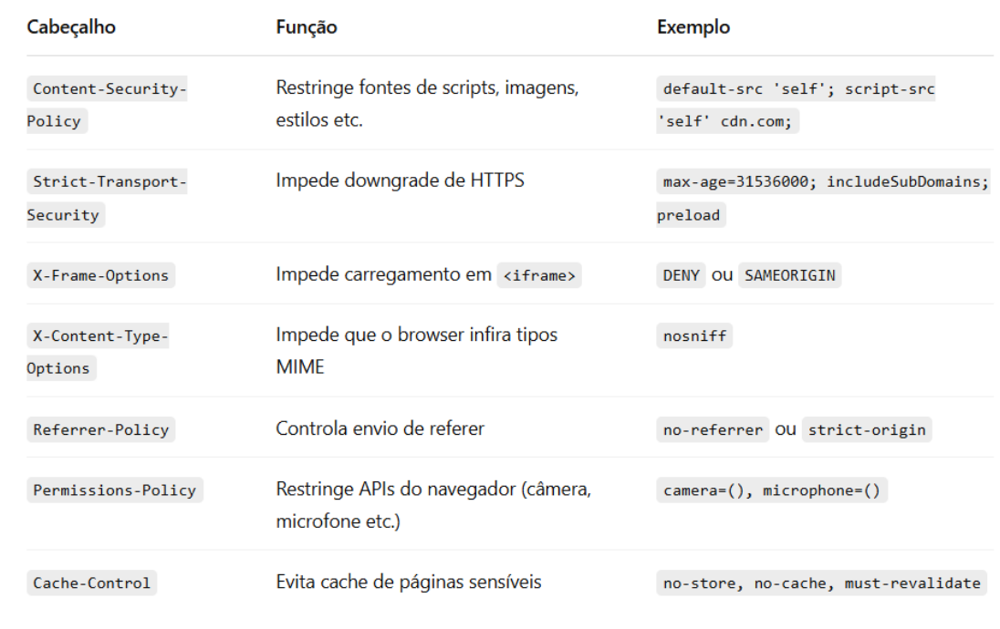

Algumas implementações mais práticas podem fazer sentido, como em NGINX: 

###### <u>nginx</u> 

- add_header Content-Security-Policy "default-src 'self'"; 

- add_header X-Frame-Options "DENY"; 

- add_header X-Content-Type-Options "nosniff"; 

- add_header Strict-Transport-Security "max-age=31536000; includeSubDomains; preload"; 

Ou ainda, em Express.js (Node.js): 

- const helmet = require("helmet"); 

- app.use(helmet());

---

<!-- pagina: 236 -->

**André Castro Aula 00** 

**CESPE / CEBRASPE - 2021 - SEFAZ-CE - Auditor Fiscal de Tecnologia da Informação da Receita Estadual** 

**A inadequada configuração de segurança, um dos riscos da OWASP Top 10, pode ocorrer em qualquer nível de serviço de uma aplicação; em razão disso, o uso de scanners e testes automatizados é ineficaz na tarefa de detectar falhas de configuração.** 

###### **Comentários:** 

Estamos falando do tipo de Controle A05 - Security Misconfiguration. Então, a primeira parte da questão está correta, pois, de fato, pode ocorrer em qualquer nível de serviço. Agora o erro está na segunda parte, ao afirmar que o uso de scanners e testes são ineficazes. Muito pelo contrário, esses testes ajudam, e muito nesse processo. 

**Gabarito** : E 

## **A06:2021 - Componentes Vulneráveis  e Desatualizados** 

###### 1. **Descrição** 

Basicamente essa família está associada ao processo de inventário de software. A partir de então, conhecendo-se o parque, é possível entender possíveis vulnerabilidades, bem como ações de mitigação. 

Uma das referências é a utilização das atualizações automáticas. Entretanto, nem sempre atualizar é simples, e pode gerar quebras na aplicação utilizada, exigindo retrabalho por parte dos atores. 

###### 2. **Vulnerabilidades** 

- I. Se você não conhece as versões de todos os componentes que usa (tanto do lado do cliente quanto do lado do servidor). **Isso inclui componentes que você usa diretamente, bem como dependências aninhadas.** 

- II. Se o software for vulnerável, sem suporte ou desatualizado. Isso inclui o sistema operacional, servidor de aplicativos/web, sistema de gerenciamento de banco de dados (DBMS), aplicativos, APIs e todos os componentes, ambientes de tempo de execução e bibliotecas. 

- III. Se você não verificar vulnerabilidades regularmente e assinar boletins de segurança relacionados aos componentes que usa. 

- IV. Se você não corrigir ou atualizar a plataforma, estruturas e dependências subjacentes de maneira oportuna e baseada em risco. Isso geralmente acontece em ambientes em que a correção é uma tarefa mensal ou trimestral sob controle de alterações, deixando as organizações abertas a dias ou meses de exposição desnecessária a vulnerabilidades corrigidas. 

- V. Se os desenvolvedores de software não testarem a compatibilidade de bibliotecas atualizadas, atualizadas ou corrigidas. 

- VI. Se você não proteger as configurações dos componentes (consulte A05:2021-Configuração incorreta de segurança).

---

<!-- pagina: 237 -->

**André Castro Aula 00** 

###### 3. **Prevenção** 

- I. Remova dependências não utilizadas, recursos, componentes, arquivos e documentação desnecessários. 

- II. Faça um inventário contínuo das versões de componentes do lado do cliente e do lado do servidor (por exemplo, estruturas, bibliotecas) e suas dependências usando ferramentas como versões, verificação de dependência OWASP, retire.js etc. Monitore continuamente fontes como Vulnerabilidade e exposições comuns (CVE) e National Vulnerability Database (NVD) para vulnerabilidades nos componentes. Use ferramentas de análise de composição de software para automatizar o processo. Assine alertas por e-mail para vulnerabilidades de segurança relacionadas aos componentes que você usa. 

- III. **Obtenha apenas componentes de fontes oficiais em links seguros.** Prefira pacotes assinados para reduzir a chance de incluir um componente mal-intencionado modificado (consulte A08:2021-Falhas de integridade de software e dados). 

- **IV. Monitore bibliotecas e componentes que não são mantidos ou não criam patches de segurança para versões mais antigas.** Se a aplicação de patches não for possível, considere a implantação de um patch virtual para monitorar, detectar ou proteger contra o problema descoberto. 

## **ão e Autentica ão A07:2021 - Falhas de Identificaç** **<u>ç</u>** 

###### 1. **Descrição** 

Na versão de 2017, aparecia como Quebra de Autenticação. Importante, desde já, diferenciar do grupo A01, pois lá naquela categoria, estávamos falando de autorização. Já nesse item, estamos focados no processo de identificação e autenticação. 

Não há dúvidas quanto à importância e necessidade de se identificar, autenticar e gerenciar as sessões desses usuários com vistas a proteger contra ataques de personificação ou falsificação de identidade. 

###### 2. **Vulnerabilidades** 

- **I. Permite ataques automatizados, como preenchimento de credenciais, em que o invasor possui uma lista de nomes de usuários e senhas válidos.** 

- **II. Permite força bruta ou outros ataques automatizados.** 

- **III. Permitir senhas padrão, fracas ou conhecidas, como "Password1" ou "admin/admin".** 

- IV. Usa recuperação de credenciais fraca ou ineficaz e processos de esquecimento de senha, como "respostas baseadas em conhecimento", que não podem ser seguras. 

- V. Usa armazenamentos de dados de senhas de texto simples, criptografados ou com hash fraco (consulte A02:2021-Falhas de criptografia ). 

- **VI. Não tem autenticação multifator ou é ineficaz.** 

- VII. Expõe o identificador de sessão na URL. 

- VIII. Reutilize o identificador de sessão após o login bem-sucedido. 

- IX. Não invalida corretamente os IDs de sessão. Sessões de usuário ou tokens de autenticação (principalmente tokens de logon único (SSO)) não são invalidados corretamente durante o logout ou um período de inatividade.

---

<!-- pagina: 238 -->

**André Castro Aula 00** 

Já falamos bastante sobre estes aspectos ao longo da nossa aula. Sem dúvida, a utilização de uma estrutura de autenticação robusta no lado corporativo, é fundamental. Entretanto, aqui entram itens relativos aos controles de usuários, pois as senhas destes podem ser violadas e gerar dano à organização. 

Por isso, os itens relativos à política de senhas e procedimentos de renovação é fundamental. 

###### 3. **Prevenção** 

- **I. Sempre que possível, implemente a autenticação multifator para evitar ataques automatizados de preenchimento de credenciais, força bruta e reutilização de credenciais roubadas.** 

- **II. Não envie ou implante com credenciais padrão, principalmente para usuários administradores.** 

- III. Implemente verificações de senhas fracas, como testar senhas novas ou alteradas na lista das 10.000 piores senhas. 

- IV. Alinhe as políticas de comprimento, complexidade e rotação de senha com as diretrizes do Instituto Nacional de Padrões e Tecnologia (NIST) 800-63b na seção 5.1.1 para Segredos Memorizados ou outras políticas de senha modernas baseadas em evidências. 

- V. Garanta que os caminhos de registro, recuperação de credenciais e API sejam protegidos contra ataques de enumeração de conta usando as mesmas mensagens para todos os resultados. 

- VI. Limite ou retarde cada vez mais as tentativas de login com falha, mas tome cuidado para não criar um cenário de negação de serviço. Registre todas as falhas e alerte os administradores quando forem detectados preenchimento de credenciais, força bruta ou outros ataques. 

- **VII.** Use um gerenciador de sessão integrado, seguro e do lado do servidor que gera um novo ID de sessão aleatório com alta entropia após o login. O identificador de sessão não deve estar no URL, ser armazenado com segurança e invalidado após o logout, inatividade e tempos limites absolutos. 

**FGV - 2022 - SEFAZ-AM - Analista de Tecnologia da Informação da Fazenda Estadual** 

**Códigos de verificação de um sistema de autenticação de dois fatores podem ser enviados por email ou gerados por um aplicativo autenticador instalado no dispositivo móvel do usuário.** 

###### **Comentários:** 

Certo pessoal. Ambos são viáveis, e não são as únicas hipóteses. 

**Gabarito** : C

---

<!-- pagina: 239 -->

**André Castro Aula 00** 

## **A08:2021 - Falhas de integridade de software e dados** 

###### 1. **Descrição** 

Mais uma nova categoria no OWASP. Basicamente, este item está associado ao processo de deploy ou disponibilização em produção, alcançando as esteiras de Integração Contínua e Entrega contínua, quando não há verificações de integridades no processo. 

Deve-se estar atento aos códigos e à infraestrutura quando ambos não protegem contra violações de integridade do código. 

Um exemplo disso é quando um aplicativo depende de plugins, bibliotecas ou módulos de fontes não confiáveis, repositórios e redes de entrega de conteúdo (CDNs). Um pipeline de CI/CD inseguro pode introduzir o potencial de acesso não autorizado, código malicioso ou comprometimento do sistema. 

###### 2. **Prevenção** 

- **I. Use assinaturas digitais ou mecanismos semelhantes para verificar se o software ou os dados são da fonte esperada e não foram alterados.** 

- II. Garanta que bibliotecas e dependências, como npm ou Maven, estejam consumindo repositórios confiáveis. Se você tiver um perfil de risco mais alto, considere hospedar um repositório interno em boas condições que seja verificado. 

- III. Certifique-se de que uma ferramenta de segurança da cadeia de suprimentos de software, como OWASP Dependency Check ou OWASP CycloneDX, seja usada para verificar se os componentes não contêm vulnerabilidades conhecidas 

- IV. Certifique-se de que haja um processo de revisão para alterações de código e configuração para minimizar a chance de que código ou configuração mal-intencionados possam ser introduzidos em seu pipeline de software. 

- **V. Certifique-se de que seu pipeline de CI/CD tenha segregação, configuração e controle de acesso adequados para garantir a integridade do código que flui pelos processos de compilação e implantação.** 

- VI. Certifique-se de que os dados serializados não assinados ou não criptografados não sejam enviados para clientes não confiáveis sem alguma forma de verificação de integridade ou assinatura digital para detectar adulteração ou repetição dos dados serializados 

## **a A09:2021 - Falhas de registro e monitoramento de seguranç** 

###### 1. **Descrição** 

Aqui temos o foco na detecção, escalação e resposta às violações ativas. Quando não há registro e monitoramento, as violações não podem ser detectadas, tratadas e conhecidas de forma eficiente. 

###### 2. **Vulnerabilidades**

---

<!-- pagina: 240 -->

**André Castro Aula 00** 

- **I. Eventos auditáveis, como logins, logins com falha e transações de alto valor, não são registrados.** 

- II. Avisos e erros geram mensagens de log inexistentes, inadequadas ou pouco claras. 

- III. Os logs de aplicativos e APIs não são monitorados quanto a atividades suspeitas. 

- **IV. Os logs são armazenados apenas localmente.** 

- V. Limites de alerta apropriados e processos de escalação de resposta não estão em vigor ou não são eficazes. 

- VI. Testes de penetração e varreduras por ferramentas de teste de segurança de aplicativos dinâmicos (DAST) (como OWASP ZAP) não acionam alertas. 

Neste item, temos um apelo muito forte às práticas de registros e logs da ISO 27002. 

###### 3. **Prevenção** 

- **I. Garanta que todas as falhas de login, controle de acesso e validação de entrada do lado do servidor possam ser registradas com contexto de usuário suficiente para identificar contas suspeitas ou maliciosas e mantidas por tempo suficiente para permitir análises forenses atrasadas.** 

- II. Certifique-se de que os logs sejam gerados em um formato que as soluções de gerenciamento de log possam consumir facilmente. 

- III. Certifique-se de que os dados de log sejam codificados corretamente para evitar injeções ou ataques nos sistemas de log ou monitoramento. 

- IV. Garanta que as transações de alto valor tenham uma trilha de auditoria com controles de integridade para evitar adulteração ou exclusão, como tabelas de banco de dados somente anexadas ou similares. 

- V. As equipes de DevSecOps devem estabelecer monitoramento e alertas eficazes para que atividades suspeitas sejam detectadas e respondidas rapidamente. 

- **VI.** Estabeleça ou adote um plano de resposta e recuperação de incidentes, como o Instituto Nacional de Padrões e Tecnologia (NIST) 800-61r2 ou posterior. 

## **A10:2021 - Falsificação de solicitação do lado do servidor (SSRF)** 

###### 1. **Descrição** 

Aqui, temos uma categoria nova também na lista, que traz um ataque diferenciado no sentido de que o servidor WEB envolvido na condição de vítima, nada mais é do que um vetor para um outro ataque. Já comentamos sobre isso. 

Assim, de forma resumida, temos que são criadas requisições no lado do servidor para URL’s ou serviços de terceiros indevidamente 

Um dos destaques dessa categoria é a possibilidade de conseguir burlar firewalls internos na rede. 

###### 2. **Prevenção**

---

<!-- pagina: 241 -->

**André Castro Aula 00** 

###### **Da camada de rede** 

- I. Segmente a funcionalidade de acesso remoto a recursos em redes separadas para reduzir o impacto do SSRF 

- II. Aplique políticas de firewall “negar por padrão” ou regras de controle de acesso à rede para bloquear todo o tráfego de intranet, exceto o essencial. 

- III. Dicas: 

   - ~ Estabeleça uma propriedade e um ciclo de vida para regras de firewall baseadas em aplicativos. 

   - **~** Registre todos os fluxos de rede aceitos e bloqueados em firewalls (consulte A09:2021-Registro de segurança e falhas de monitoramento ). 

###### **Da camada de aplicação:** 

- I. Higienize e valide todos os dados de entrada fornecidos pelo cliente 

- **II. Aplique o esquema de URL, a porta e o destino com uma lista de permissões positiva** 

- III. Não envie respostas brutas aos clientes 

- IV. Desabilitar redirecionamentos HTTP 

- V. Esteja ciente da consistência do URL para evitar ataques como religação de DNS e condições de corrida "tempo de verificação, tempo de uso" (TOCTOU) 

- VI. Não reduza o SSRF por meio do uso de uma lista de negação ou expressão regular. Os invasores têm listas de carga útil, ferramentas e habilidades para contornar as listas de negação. 

- VII. Não implante outros serviços relevantes de segurança em sistemas frontais (por exemplo, OpenID). Controle o tráfego local nesses sistemas (por exemplo, localhost) 

- **VIII.** Para frontends com grupos de usuários dedicados e gerenciáveis, use criptografia de rede (por exemplo, VPNs) em sistemas independentes para considerar necessidades de proteção muito altas 

Percebam que muito mais do que tratar as regras padrões de entradas positivas, tal qual fora feito na categoria de injeção, tem-se ainda procedimentos para colocar uma regra relativo ao usuário, na perspectiva de identificação e autorização. 

**FGV - 2022 - SEFAZ-AM - Analista de Tecnologia da Informação da Fazenda Estadual** 

**Ao analisar uma aplicação web, um auditor verificou que ela estava vulnerável a um ataque conhecido como SSRF, uma das vulnerabilidades Top Ten 2021 do OWASP.** 

**Caso um invasor consiga explorar tal vulnerabilidade, ele poderá** 

A) ler os conteúdos dos cookies que um navegador armazenou relativos a um dado domínio. 

B) executar scripts no navegador da vítima, podendo inclusive realizar um sequestro de sessão do usuário. 

C) injetar dados maliciosos no banco de dados da aplicação. 

D) realizar requisições não autorizadas a outras localidades por meio do lado servidor dessa aplicação web vulnerável.

---

<!-- pagina: 242 -->

**André Castro Aula 00** 

E) realizar uma desfiguração em qualquer página da aplicação web vulnerável. 

###### **Comentários:** 

Com taxa de incidência relativamente baixa, as vulnerabilidades da família Server-Side Request Forgery (SSRF), ou Falsificação de Solicitação no Lado do Servidor ocorrem sempre que uma aplicação busca um recurso remoto, sem validar a URL fornecida pelo usuário. 

**Gabarito** : D 

**<u>À luz das 10 categorias, vamos ver algumas questões adicionais:</u>** 

**FGV – Auditor de Controle Externo – Tecnologia da Informação (TCE-TO)/2022** 

**A aplicação Web SiCONTA viabiliza a recuperação de credenciais de acesso por meio da conferência de respostas previamente cadastradas pelo usuário a questionamentos realizados a ele no processo de criação da credencial.** 

**Considerando a metodologia Open Web Application Security Project (OWASP), a aplicação Web SiCONTA possui uma vulnerabilidade classificada na categoria:** 

**a) Broken Access Control; ¬** 

###### **b) Insecure Identification;** 

**c) Security Misconfiguration;** 

**d) Insecure Design and Implementation;** 

**e) Identification and Authentication Failures.** 

###### **Comentários:** 

Pessoal, questão bem tranquila né? Veja que a vulnerabilidade está associada ao processo de autenticação e identificação do usuário. Muito cuidado pois, o controle de acesso, trata-se de autorização e será a próxima fase do acesso ao serviço. 

Reforço, a questão narra um problema associado ao usuário e senha, ou seja, ainda não se chegou na etapa de autorização, mas tão somente identificação e autenticação. 

Muita atenção nesses detalhes. 

**Gabarito** : E 

**CESPE / CEBRASPE Órgão: SERPRO Prova: CESPE / CEBRASPE - 2021 - SERPRO - Analista - Especialização: Desenvolvimento de Sistemas** 

**Quanto aos riscos de segurança derivados da exposição de dados sensíveis contidos na lista OWASP Top 10, é recomendável que o tráfego de dados confidenciais seja criptografado e que**

---

<!-- pagina: 243 -->

**André Castro Aula 00** 

**o seu armazenamento interno seja feito sem criptografia, de modo a viabilizar as funções de auditoria dos sistemas.** 

###### **Comentários:** 

Pessoal, não há essa segregação do uso de criptografia, conforme a questão apresenta. Deve-se usar em toda a rede, na medida do possível, pois nunca se sabe onde o ataque pode ocorrer ou invasor possa estar. 

**Gabarito** : E 

**CESPE / CEBRASPE - 2020 - Ministério da Economia - Tecnologia da Informação - Segurança da Informação e Proteção de Dados** 

**O guia de testes do OWASP enumera verificações para cerca de setenta vulnerabilidades, agrupadas em classes, como a de gerenciamento de sessões, que trata de erros na implementação das regras de negócio.** 

**Comentários:** 

Não há mais a categoria de gerenciamento de sessões. 

**Gabarito** : E 

# **<mark>S</mark> DE** **<mark>API</mark> S** **<mark>– OWASP API S</mark> ECURITY** **<mark>T</mark> OP** **<mark>10</mark> EGURANÇA** **<mark>(2023)</mark>** 

APIs (Application Programming Interfaces) são um dos principais alvos de ataques modernos, especialmente em arquiteturas orientadas a microserviços, mobile e aplicações front-end desacopladas (SPA). A OWASP criou um guia específico para APIs, pois seus riscos, embora compartilhem fundamentos com aplicações web, possuem características distintas. 

##### **A01:2023 – Quebra de Autorização a Nível de Objeto (BOLA – Broken Object Level Authorization)** 

###### **Descrição** 

Falha ocorre quando a API não valida corretamente se o usuário autenticado tem permissão para acessar um determinado recurso (ex.: /api/users/1234). 

###### **Vulnerabilidades** 

- Usuário acessa dados de outros usuários modificando parâmetros na URL ou payload. 

- Ausência de verificação contextual por recurso no backend.

---

<!-- pagina: 244 -->

**André Castro Aula 00** 

###### **Prevenção** 

- Verificações de autorização devem ser implementadas no backend para cada operação e objeto. 

- Não confiar apenas no controle no front-end. 

##### **A02:2023 – Autenticação Quebrada** 

###### **Descrição** 

Erros na implementação do processo de autenticação, permitindo ataques como brute force, credential stuffing ou reutilização de tokens. 

###### **Vulnerabilidades** 

- Tokens de longa duração sem expiração. 

- Falta de verificação de identidade em endpoints sensíveis. 

- Mecanismos de login previsíveis. 

###### **Prevenção** 

- Uso de **OAuth 2.0 com PKCE** , autenticação multifator (MFA) e rotação de tokens JWT. 

- Monitoramento e limitação de tentativas de login. 

##### **A03:2023 – Quebra de Autorização por Propriedade de Objeto** 

###### **Descrição** 

Mesmo que o usuário possa acessar um objeto, ele acessa atributos que não deveria visualizar. 

###### **Prevenção** 

- Controle granular por atributo (field-level access control). 

- Serialização/DTOs com escopo de visibilidade bem definido.

---

<!-- pagina: 245 -->

**André Castro Aula 00** 

##### **Outras categorias notáveis:** 

- **A04: Resource Consumption** : Limitar chamadas, tamanhos de payload e estabelecer cotas por cliente. 

- **A08: Security Misconfiguration** : Aplicação de regras CORS adequadas, headers de segurança e validação de entrada. 

###### **Ferramentas úteis** : 

- **Postman** com scripts de segurança. 

- **OWASP ZAP** e **Burp Suite** com plugins para APIs. 

<!-- Start of picture text -->
==5460== <!-- End of picture text -->

- **API Gateways** com suporte a rate limiting, autenticação e logging (Ex: **Kong** , **Apigee** , **AWS API Gateway** ). 

# **S MOBILE – OWASP MOBILE TOP EGURANÇA 10 (2023)** 

Aplicações móveis requerem controles de segurança próprios, pois os binários rodam em dispositivos fora do controle do desenvolvedor e estão sujeitos a engenharia reversa, root/jailbreak, interceptação de tráfego, entre outros vetores. 

##### **M01 – Uso Indevido de Credenciais** 

###### **Vulnerabilidades** 

- Armazenar tokens, senhas ou certificados em SharedPreferences, UserDefaults, arquivos de texto ou banco local. 

- Injeção de credenciais em binário. 

###### **Prevenção** 

- Uso do **Android Keystore** e **iOS Keychain** . 

- Zero armazenamento de segredos no código fonte. 

##### **M02 – Armazenamento Inseguro de Dados**

---

<!-- pagina: 246 -->

**André Castro Aula 00** 

###### **Vulnerabilidades** 

- Dados sensíveis armazenados sem criptografia em cache, SQLite, arquivos ou preferências. 

- Falta de proteção a arquivos mesmo em sandbox. 

###### **Prevenção** 

- Criptografia com **AES-256** usando chaves derivadas de forma segura (PBKDF2, bcrypt). 

- Uso de bibliotecas como **SQLCipher** e **EncryptedSharedPreferences** . 

##### **M03 – Segurança Inadequada na Cadeia de Suprimentos** 

###### **Descrição** 

- Uso de bibliotecas de terceiros não auditadas ou comprometidas. 

###### **Prevenção** 

- Aplicar SCA (Software Composition Analysis). 

- Preferir repositórios internos e certificados digitais. 

##### **Outras categorias:** 

- **M06: Comunicação Insegura** : Falta de HTTPS com TLS 1.2+ e ausência de SSL Pinning. 

- **M09: Proteções Binárias Insuficientes** : Código não ofuscado; ausência de checks contra root/jailbreak. 

###### **Ferramentas úteis** : 

- **MobSF (Mobile Security Framework)** : análise estática e dinâmica. 

- **Frida, Objection** : para engenharia reversa controlada e fuzzing. 

- **OWASP MASVS** : guia de verificação detalhado para apps móveis.

---

<!-- pagina: 247 -->

**André Castro Aula 00** 

## **Comparativo Geral:  Web x API x Mobile (Resumo Didático)** 

|**Categoria OWASP**|**Web (Top 10)**|**API (Top 10)**|**Mobile (Top 10)**|
|---|---|---|---|
|**Autenticação**|A07:2021|A02:2023|M01, M04|
|**Autorização**|A01:2021|A01, A03, A05:2023|M04|
|**Criptografa**|A02:2021|A06, A10:2023|M02, M06|
|**Confguração**|A05:2021|A08:2023|M06, M10|
|**Atualizações**|A06:2021|A10:2023|M03|
|**Integridade/CI-CD**|A08:2021|A10:2023|M03, M08|
|**Logs** **e** **Monitoramento**|A09:2021|A09:2023|M10|

Referência: 

https://owasp.org/Top10/

---

<!-- pagina: 248 -->

**André Castro Aula 00** 

# **QUESTÕES COMENTADAS - OWASP TOP 10 - CESPE** 

**1. CESPE / CEBRASPE - 2025 - TRF - 6ª REGIÃO - Analista Judiciário – Área: Apoio Especializado – Especialidade: Tecnologia da Informação** 

**Acerca de ameaças e vulnerabilidades em aplicações, julgue o item a seguir.** 

**Considere a seguinte URL.** 

**https://prova.com/prova_seguranca?id=1332** 

**Se nenhum outro controle estiver em vigor, um atacante pode simplesmente modificar o valor id para visualizar outros registros da aplicação em questão, sendo esse um exemplo de referência insegura a objetos que leva ao escalonamento horizontal de privilégios.** 

###### **Comentários:** 

O exemplo dado é um caso de referência insegura a objetos, onde um atacante pode modificar o parâmetro "id" na URL para acessar dados de outro usuário. Esse tipo de vulnerabilidade é um exemplo clássico de escalonamento horizontal de privilégios, onde um usuário não autorizado consegue acessar informações de outros usuários ao manipular parâmetros da URL, sem controles adequados. 

**Gabarito: C** 

**2. CESPE / CEBRASPE - 2025 - TRF - 6ª REGIÃO - Analista Judiciário – Área: Apoio Especializado – Especialidade: Tecnologia da Informação** 

**Uma das consequências de um ataque de CSRF (cross-site request forgery) bem-sucedido é que o atacante consegue levar o usuário vítima a executar uma ação involuntariamente, podendo causar prejuízos variados, conforme a aplicação explorada.** 

###### **Comentários:** 

Em um ataque de CSRF (Cross-Site Request Forgery), o atacante engana o usuário legítimo para que ele execute ações indesejadas em uma aplicação web. Isso pode resultar em danos como modificações em configurações, ações financeiras ou alterações em dados do usuário, dependendo da aplicação explorada. CSRF é uma vulnerabilidade que pode ser explorada em sistemas sem proteção adequada contra ataques desse tipo. 

**Gabarito: C**

---

<!-- pagina: 249 -->

**André Castro Aula 00** 

**3. CESPE / CEBRASPE - 2025 - TRF - 6ª REGIÃO - Analista Judiciário – Área: Apoio Especializado – Especialidade: Tecnologia da Informação** 

**O SSRF (server-side request forgery) só pode ser explorado se o atacante tiver credenciais administrativas no servidor de destino, pois ele depende de permissões elevadas para realizar requisições internas e externas.** 

###### **Comentários:** 

O ataque parte de um servidor intermediário com privilégios suficientes para acessar o servidor de destino. Por esse motivo, não há necessidade do acesso privilegiado mencionado. 

###### **Gabarito: E** 

**4. CESPE / CEBRASPE - 2025 - TRF - 6ª REGIÃO - Analista Judiciário – Área: Apoio Especializado – Especialidade: Tecnologia da Informação** 

**Na execução de uma aplicação web, a possibilidade de um usuário não autenticado agir como um usuário autenticado ou de um usuário comum autenticado agir como um administrador representa falha de segurança de elevação de privilégios relacionada ao controle de acesso da aplicação.** 

###### **Comentários:** 

A falha descrita é um caso típico de elevação de privilégios, onde um usuário não autorizado adquire permissões indevidas devido a falhas no controle de acesso da aplicação. 

###### **Gabarito: C** 

**5. CESPE / CEBRASPE - 2024 - TSE - Analista Judiciário – Área: Apoio Especializado – Especialidade: Tecnologia da Informação** 

**A autenticação multifatorial, um dos controles listados no Microsoft SDL (security development lifecycle), adiciona uma segunda camada crítica de segurança aos logins, a fim de proteger todos os usuários, especialmente os administradores.** 

###### **Comentários:** 

Essa é a base do princípio funcional esperado para o MFA. 

**Gabarito: C** 

**6. CESPE / CEBRASPE - 2024 - TC-DF - Auditor de Controle Externo - Área Especializada - Especialidade: Tecnologia da Informação - Orientação Microinformática de TI**

---

<!-- pagina: 250 -->

**André Castro Aula 00** 

**Um ataque do tipo SQL injection requer a existência de uma falha na aplicação relacionada com a sanitização de parâmetros, de modo que um hacker possa enviar comandos SQL para o banco de dados por meio da aplicação exposta.** 

###### **Comentários:** 

O SQL Injection ocorre quando a aplicação não trata adequadamente entradas de usuários, permitindo que um invasor insira comandos SQL maliciosos para manipular o banco de dados. A prevenção envolve uso de consultas parametrizadas e validação de entrada. 

###### **Gabarito: C** 

**7. CESPE / CEBRASPE - 2025 - TRF - 6ª REGIÃO - Técnico Judiciário – Área: Apoio Especializado – Especialidade: Desenvolvimento de Sistemas de Informação** 

**Um ataque LDAP injection bem-sucedido pode resultar na execução de comandos arbitrários, como a concessão de permissões para consultas não autorizadas e a modificação de conteúdo dentro da árvore LDAP.** 

###### **Comentários:** 

Segue o princípio de qualquer ataque do tipo injection, onde é possível executar comandos do serviço ou protocolo envolvido, com vistas a manipular ou expor informações de alguma forma. Especificamente falando do LDAP, por fazer toda a gestão de objetos, é possível atuar nas funcionalidades descritas na questão. 

###### **Gabarito: C** 

**8. CESPE / CEBRASPE - 2025 - TRF - 6ª REGIÃO - Técnico Judiciário – Área: Apoio Especializado – Especialidade: Desenvolvimento de Sistemas de Informação** 

**A metodologia OWASP (open web application security project) propõe um modelo de escopo de segurança restrito às etapas finais do desenvolvimento de software, focando principalmente na detecção e na mitigação de vulnerabilidades em produtos já prontos.** 

###### **Comentários:** 

O OWASP preconiza durante todo o ciclo de desenvolvimento, não só nas etapas finais. 

**Gabarito: E** 

**9. CESPE / CEBRASPE - 2025 - TRF - 6ª REGIÃO - Técnico Judiciário – Área: Apoio Especializado – Especialidade: Desenvolvimento de Sistemas de Informação**

---

<!-- pagina: 251 -->

**André Castro Aula 00** 

**Enquanto método de prevenção contra ataques DDoS em redes corporativas, a redução da superfície de ataque concentra-se em restringir o número de portas abertas no firewall, sem a necessidade de outros controles adicionais ou de monitoramento contínuo, sendo uma abordagem eficaz para evitar sobrecarga de tráfego malicioso.** 

###### **Comentários:** 

Podemos associar essas práticas ao HARDENING, que vai muito além do mero filtro de portas, mas inclui outras liberações e configurações, atualizações de sistemas operacionais, entre outros. 

###### **Gabarito: E** 

###### **10. CESPE / CEBRASPE - 2024 - Companhia de Desenvolvimento do Vale do Parnaíba** ==5460== 

**Nos golpes cibernéticos promovidos com base em engenharia social, em geral, os invasores têm como objetivos a interrupção ou corrupção de dados para causar danos ou incômodos e obtenção de algum valor, tal como dinheiro ou acesso a informações ou a dados pessoais ou sigilosos.** 

###### **Comentários:** 

Primeiro, reforçar que discordo do gabarito. Tudo bem que a engenharia social é um meio para uma finalidade maior, mas a forma como está escrita dá a entender que ela é um fim em si mesmo com os objetivos apresentados. 

Os golpes cibernéticos baseados em engenharia social têm como principal objetivo enganar usuários para obter vantagens ilícitas, como acesso a informações sensíveis, credenciais ou dinheiro. No entanto, a interrupção ou corrupção de dados não é, necessariamente, o foco principal desse tipo de ataque. 

A engenharia social explora vulnerabilidades humanas, como confiança excessiva, medo ou urgência, para induzir a vítima a fornecer dados, clicar em links maliciosos ou executar ações prejudiciais. 

###### **Gabarito: C (Gabarito do professor: Anulação)** 

###### **11. CESPE / CEBRASPE - 2022 - TCE-RJ - Analista de Controle Externo** 

**Classificação de Risco para o Top 10 é uma metodologia baseada na OWASP Risk Rating Methodology e consiste em estimar, para cada categoria do Top 10, o risco peculiar que cada falha introduz em uma aplicação web típica e, posteriormente, ordenar o Top 10 de acordo com as falhas que tipicamente introduzem o risco mais significativo para uma aplicação.** 

###### **Comentários:** 

###### **DataPrev (Perfil 3: Desenvolvimento de Software) Segurança da Informação - 2026 (Pós-Edital)** **_www.estrategiaconcursos.com.br_**

---

<!-- pagina: 252 -->

**André Castro Aula 00** 

Típica questão conceito pessoal, que aborda a metodologia de classificação de riscos da própria OWASP para se chegar à referida classificação. 

Esse é um exemplo para o TOP 1 da lista: 

CWEs mapeados - 34 

Taxa de incidência máxima – 55,97% 

Taxa média de incidência – 3,81% 

Exploração média ponderada – 6,92 

Impacto médio ponderado – 5,93 

Cobertura máxima – 94,55% 

Cobertura média – 47,72% 

Total de Ocorrências – 318,487 

Total de CVEs – 19,13 

**Gabarito** : C 

**12. CESPE / CEBRASPE - 2022 - BANRISUL - Desenvolvimento de Sistemas** 

**No que se refere a falhas de criptografia, recomenda-se desabilitar o cache para respostas que contenham dados sensíveis.** 

###### **Comentários:** 

Exatamente pessoal. Típica questão que demonstra que não temos para onde correr, a não ser passar por todas as medidas e prevenções do OWASP. Este item está previsto na prevenção de nº 6 do Controle A02:2021 - Falhas Criptográficas. 

**Gabarito** : C 

**13. CESPE / CEBRASPE - 2022 - BANRISUL - Desenvolvimento de Sistemas** 

**No que se refere a falhas de criptografia, recomenda-se desabilitar o cache para respostas que contenham dados sensíveis.** 

###### **Comentários:** 

Novamente, vejam que quando é para colocar a assertiva como CORRETA, a banca pega exatamente o texto apresentado. 

**Gabarito** : C 

**14. CESPE / CEBRASPE - 2021 - SEFAZ-CE - Auditor Fiscal de Tecnologia da Informação da Receita Estadual**

---

<!-- pagina: 253 -->

**André Castro Aula 00** 

**A inadequada configuração de segurança, um dos riscos da OWASP Top 10, pode ocorrer em qualquer nível de serviço de uma aplicação; em razão disso, o uso de scanners e testes automatizados é ineficaz na tarefa de detectar falhas de configuração.** 

###### **Comentários:** 

Estamos falando do tipo de Controle A05 - Security Misconfiguration. Então, a primeira parte da questão está correta, pois, de fato, pode ocorrer em qualquer nível de serviço. Agora o erro está na segunda parte, ao afirmar que o uso de scanners e testes são ineficazes. Muito pelo contrário, esses testes ajudam, e muito nesse processo. 

**Gabarito** : E 

**15. CESPE / CEBRASPE Órgão: SERPRO Prova: CESPE / CEBRASPE - 2021 - SERPRO - Analista - Especialização: Desenvolvimento de Sistemas** 

**Quanto aos riscos de segurança derivados da exposição de dados sensíveis contidos na lista OWASP Top 10, é recomendável que o tráfego de dados confidenciais seja criptografado e que o seu armazenamento interno seja feito sem criptografia, de modo a viabilizar as funções de auditoria dos sistemas.** 

###### **Comentários:** 

Pessoal, não há essa segregação do uso de criptografia, conforme a questão apresenta. Deve-se usar em toda a rede, na medida do possível, pois nunca se sabe onde o ataque pode ocorrer ou invasor possa estar. 

**Gabarito** : E 

**16. CESPE / CEBRASPE - 2020 - Ministério da Economia - Tecnologia da Informação - Segurança da Informação e Proteção de Dados** 

**O guia de testes do OWASP enumera verificações para cerca de setenta vulnerabilidades, agrupadas em classes, como a de gerenciamento de sessões, que trata de erros na implementação das regras de negócio.** 

**Comentários:** 

Não há mais a categoria de gerenciamento de sessões. 

**Gabarito** : E

---

<!-- pagina: 254 -->

**André Castro Aula 00** 

# **QUESTÕES COMENTADAS - OWASP TOP 10 - FGV** 

###### **1. (FGV - AJ (TJ RN)/TJ RN/Apoio Especializado/Análise de Sistemas/2023)** 

**O COLABORA é um sistema que apoia atividades da gestão de recursos humanos de uma empresa e, por isso, mantém alguns dados sensíveis sobre pessoas. O COLABORA faz uso do módulo pgcrypto do PostgreSQL para criptografar colunas que armazenam os dados sensíveis.** 

**Com base no OWASP Top Tem, a solução de criptografia adotada pelo COLABORA apresenta uma vulnerabilidade categorizada como:** 

a) A01:2021 – Data Exposure; 

- b) A02:2021 – Cryptographic Failures; 

c) A03:2021 – Broken or Risky Crypto Algorithm; 

d) A05:2021 – Security Misconfiguration; 

e) A08:2021 – Software and Data Integrity Failures. 

###### **Comentários:** 

Estamos observando um recurso associado aos aspectos de criptografia aplicada a banco de dados, e que se a criptografia falhar, podemos ter problemas. Vejam um exemplo do próprio OWASP: 

Cenário #1 : Um aplicativo criptografa números de cartão de crédito em um banco de dados usando criptografia automática de banco de dados. No entanto, esses dados são automaticamente descriptografados quando recuperados, permitindo que uma falha de injeção de SQL recupere números de cartão de crédito em texto não criptografado. 

**Gabarito: B** 

###### **2. FGV - 2022 - TRT - 13ª Região (PB) - Técnico Judiciário - Tecnologia da Informação** 

**A falha ou quebra de controle de acesso ("Broken Access Control") é um risco de segurança crítico para aplicações Web.** 

**Para prevenir essa vulnerabilidade, o OWASP recomenda que** 

**A a listagem de diretórios do servidor web seja desativada.** 

**B os tokens JWT stateless sejam de longa duração.** 

**C as sessões stateful sejam mantidas no servidor após o logout.** 

**D evite reutilizar os mecanismos de controle de acesso.** 

**E utilize APIs sem taxa limite de requisições.**

---

<!-- pagina: 255 -->

**André Castro Aula 00** 

###### **Comentários:** 

Exatamente conforme o item V previsto na prevenção: 

**V. Desative a listagem de diretórios do servidor web e certifique-se de que os metadados do arquivo (por exemplo, .git) e os arquivos de backup não estejam presentes nas raízes da web.** 

**Gabarito** : A 

###### **3. FGV - 2022 - TJ-DFT - Analista Judiciário - Análise de Sistemas** 

**PedidosSemEstresse é uma aplicação Web destinada a digitalizar o processo de pedidos de serviços de um órgão da administração pública.** ==5460== **A interface de PedidosSemEstresse utilizada pelos usuários faz chamadas a uma API RESTful e não utiliza facilidades de login único (single sign-on – SSO). Recentemente, o usuário interno João utilizou suas próprias credenciais com privilégios somente de execução de métodos GET para explorar vulnerabilidades e teve acesso direto a API RESTful. Assim, João fez chamadas a métodos POST com sucesso.** 

**Com base no OWASP Top Ten, a vulnerabilidade explorada por João é da categoria:** 

**A Injection;** 

**B Broken Access Control;** 

**C Software and Data Integrity Failures;** 

**D Vulnerable and Outdated Components;** 

**E Identification and Authentication Failures** 

###### **Comentários:** 

Vejam que estamos na mesma linha da questão anterior, onde há uma falha de autorização, uma vez que um usuário, que tinha permissão somente para determinada ação, consegue realizar outra ação. 

**Gabarito** : B 

###### **4. FGV - 2022 - SEFAZ-AM - Analista de Tecnologia da Informação da Fazenda Estadual** 

**De modo a prevenir falhas de injeção de dados maliciosos, recomenda-se não usar, para o transporte de dados confidenciais, protocolos legados, como FTP e SMTP.** 

###### **Comentários:** 

Pessoal, a descrição em tela se refere a recomendações de prevenção da categoria de FALHAS CRIPTOGRÁFICAS e não de INJEÇÃO DE DADOS. Vejam justamente a dinâmica que comentei com vocês sobre troca de características.

---

<!-- pagina: 256 -->

**André Castro Aula 00** 

**Gabarito** : E 

###### **5. FGV - 2022 - SEFAZ-AM - Analista de Tecnologia da Informação da Fazenda Estadual** 

**De acordo com a OWASP TOP 10 2021, para o risco design inseguro, são medidas de prevenção para o desenvolvimento seguro o uso da modelagem de ameaças para autenticações críticas, controle de acesso e lógica de negócios.** 

###### **Comentários:** 

Exatamente na linha do que conversamos pessoal. 

**Gabarito** : C 

###### **6. FGV - 2022 - SEFAZ-AM - Analista de Tecnologia da Informação da Fazenda Estadual** 

**Códigos de verificação de um sistema de autenticação de dois fatores podem ser enviados por email ou gerados por um aplicativo autenticador instalado no dispositivo móvel do usuário.** 

###### **Comentários:** 

Certo pessoal. Ambos são viáveis, e não são as únicas hipóteses. 

**Gabarito** : C 

###### **7. FGV - 2022 - SEFAZ-AM - Analista de Tecnologia da Informação da Fazenda Estadual** 

**Ao analisar uma aplicação web, um auditor verificou que ela estava vulnerável a um ataque conhecido como SSRF, uma das vulnerabilidades Top Ten 2021 do OWASP.** 

###### **Caso um invasor consiga explorar tal vulnerabilidade, ele poderá** 

A) ler os conteúdos dos cookies que um navegador armazenou relativos a um dado domínio. 

B) executar scripts no navegador da vítima, podendo inclusive realizar um sequestro de sessão do usuário. 

C) injetar dados maliciosos no banco de dados da aplicação. 

D) realizar requisições não autorizadas a outras localidades por meio do lado servidor dessa aplicação web vulnerável. 

E) realizar uma desfiguração em qualquer página da aplicação web vulnerável. 

###### **Comentários:** 

Com taxa de incidência relativamente baixa, as vulnerabilidades da família Server-Side Request Forgery (SSRF), ou Falsificação de Solicitação no Lado do Servidor ocorrem sempre que uma aplicação busca um recurso remoto, sem validar a URL fornecida pelo usuário. 

**Gabarito** : D

---

<!-- pagina: 257 -->

**André Castro Aula 00** 

###### **8. FGV – Auditor de Controle Externo – Tecnologia da Informação (TCE-TO)/2022** 

**A aplicação Web SiCONTA viabiliza a recuperação de credenciais de acesso por meio da conferência de respostas previamente cadastradas pelo usuário a questionamentos realizados a ele no processo de criação da credencial.** 

**Considerando a metodologia Open Web Application Security Project (OWASP), a aplicação Web SiCONTA possui uma vulnerabilidade classificada na categoria:** 

###### **a) Broken Access Control; ¬** 

###### **b) Insecure Identification;** 

- **c) Security Misconfiguration;** 

- **d) Insecure Design and Implementation;** 

- **e) Identification and Authentication Failures.** 

###### **Comentários:** 

Pessoal, questão bem tranquila né? Veja que a vulnerabilidade está associada ao processo de autenticação e identificação do usuário. Muito cuidado pois, o controle de acesso, trata-se de autorização e será a próxima fase do acesso ao serviço. 

Reforço, a questão narra um problema associado ao usuário e senha, ou seja, ainda não se chegou na etapa de autorização, mas tão somente identificação e autenticação. 

Muita atenção nesses detalhes. 

**Gabarito** : E

---

<!-- pagina: 258 -->

**André Castro Aula 00** 

# **QUESTÕES COMENTADAS - OWASP TOP 10 - FCC** 

**1. (FCC - Ana (COPERGÁS)/COPERGÁS/Sistemas/2023)** 

**O OWASP Top 10 2021 elenca os problemas de segurança mais comuns e mais importantes no contexto das aplicações web. O problema de segurança que ocupa a primeira posição é:** 

- a) Falha criptográfica. 

- b) Injeção. 

- c) Quebra de controle de acesso. 

- d) Design inseguro. 

- e) Server-Side Request Forgery. 

###### **Comentários:** 

Mais uma típica questão decoreba da FCC. 

**Gabarito: C**

---

<!-- pagina: 259 -->

**André Castro Aula 00** 

# **LISTA DE QUESTÕES - OWASP TOP 10 - CESPE** 

**1. CESPE / CEBRASPE - 2025 - TRF - 6ª REGIÃO - Analista Judiciário – Área: Apoio Especializado – Especialidade: Tecnologia da Informação** 

**Acerca de ameaças e vulnerabilidades em aplicações, julgue o item a seguir.** 

**Considere a seguinte URL.** 

**https://prova.com/prova_seguranca?id=1332** 

**Se nenhum outro controle estiver em vigor, um atacante pode simplesmente modificar o valor id para visualizar outros registros da aplicação em questão, sendo esse um exemplo de referência insegura a objetos que leva ao escalonamento horizontal de privilégios.** 

###### **2. CESPE / CEBRASPE - 2025 - TRF - 6ª REGIÃO - Analista Judiciário – Área: Apoio Especializado – Especialidade: Tecnologia da Informação** 

**Uma das consequências de um ataque de CSRF (cross-site request forgery) bem-sucedido é que o atacante consegue levar o usuário vítima a executar uma ação involuntariamente, podendo causar prejuízos variados, conforme a aplicação explorada.** 

**3. CESPE / CEBRASPE - 2025 - TRF - 6ª REGIÃO - Analista Judiciário – Área: Apoio Especializado – Especialidade: Tecnologia da Informação** 

**O SSRF (server-side request forgery) só pode ser explorado se o atacante tiver credenciais administrativas no servidor de destino, pois ele depende de permissões elevadas para realizar requisições internas e externas.** 

###### **4. CESPE / CEBRASPE - 2025 - TRF - 6ª REGIÃO - Analista Judiciário – Área: Apoio Especializado – Especialidade: Tecnologia da Informação** 

**Na execução de uma aplicação web, a possibilidade de um usuário não autenticado agir como um usuário autenticado ou de um usuário comum autenticado agir como um administrador representa falha de segurança de elevação de privilégios relacionada ao controle de acesso da aplicação.** 

**5. CESPE / CEBRASPE - 2024 - TSE - Analista Judiciário – Área: Apoio Especializado – Especialidade: Tecnologia da Informação**

---

<!-- pagina: 260 -->

**André Castro Aula 00** 

**A autenticação multifatorial, um dos controles listados no Microsoft SDL (security development lifecycle), adiciona uma segunda camada crítica de segurança aos logins, a fim de proteger todos os usuários, especialmente os administradores.** 

###### **6. CESPE / CEBRASPE - 2024 - TC-DF - Auditor de Controle Externo - Área Especializada - Especialidade: Tecnologia da Informação - Orientação Microinformática de TI** 

**Um ataque do tipo SQL injection requer a existência de uma falha na aplicação relacionada com a sanitização de parâmetros, de modo que um hacker possa enviar comandos SQL para o banco de dados por meio da aplicação exposta.** 

==5460== 

###### **7. CESPE / CEBRASPE - 2025 - TRF - 6ª REGIÃO - Técnico Judiciário – Área: Apoio Especializado – Especialidade: Desenvolvimento de Sistemas de Informação** 

**Um ataque LDAP injection bem-sucedido pode resultar na execução de comandos arbitrários, como a concessão de permissões para consultas não autorizadas e a modificação de conteúdo dentro da árvore LDAP.** 

###### **8. CESPE / CEBRASPE - 2025 - TRF - 6ª REGIÃO - Técnico Judiciário – Área: Apoio Especializado – Especialidade: Desenvolvimento de Sistemas de Informação** 

**A metodologia OWASP (open web application security project) propõe um modelo de escopo de segurança restrito às etapas finais do desenvolvimento de software, focando principalmente na detecção e na mitigação de vulnerabilidades em produtos já prontos.** 

###### **9. CESPE / CEBRASPE - 2025 - TRF - 6ª REGIÃO - Técnico Judiciário – Área: Apoio Especializado – Especialidade: Desenvolvimento de Sistemas de Informação** 

**Enquanto método de prevenção contra ataques DDoS em redes corporativas, a redução da superfície de ataque concentra-se em restringir o número de portas abertas no firewall, sem a necessidade de outros controles adicionais ou de monitoramento contínuo, sendo uma abordagem eficaz para evitar sobrecarga de tráfego malicioso.** 

###### **10. CESPE / CEBRASPE - 2024 - Companhia de Desenvolvimento do Vale do Parnaíba** 

**Nos golpes cibernéticos promovidos com base em engenharia social, em geral, os invasores têm como objetivos a interrupção ou corrupção de dados para causar danos ou incômodos e** 

###### **DataPrev (Perfil 3: Desenvolvimento de Software) Segurança da Informação - 2026 (Pós-Edital)** **_www.estrategiaconcursos.com.br_**

---

<!-- pagina: 261 -->

**André Castro Aula 00** 

**obtenção de algum valor, tal como dinheiro ou acesso a informações ou a dados pessoais ou sigilosos.** 

###### **11. CESPE / CEBRASPE - 2022 - TCE-RJ - Analista de Controle Externo** 

**Classificação de Risco para o Top 10 é uma metodologia baseada na OWASP Risk Rating Methodology e consiste em estimar, para cada categoria do Top 10, o risco peculiar que cada falha introduz em uma aplicação web típica e, posteriormente, ordenar o Top 10 de acordo com as falhas que tipicamente introduzem o risco mais significativo para uma aplicação.** 

**12. CESPE / CEBRASPE - 2022 - BANRISUL - Desenvolvimento de Sistemas** 

**No que se refere a falhas de criptografia, recomenda-se desabilitar o cache para respostas que contenham dados sensíveis.** 

**13. CESPE / CEBRASPE - 2022 - BANRISUL - Desenvolvimento de Sistemas** 

**No que se refere a falhas de criptografia, recomenda-se desabilitar o cache para respostas que contenham dados sensíveis.** 

**14. CESPE / CEBRASPE - 2021 - SEFAZ-CE - Auditor Fiscal de Tecnologia da Informação da Receita Estadual** 

**A inadequada configuração de segurança, um dos riscos da OWASP Top 10, pode ocorrer em qualquer nível de serviço de uma aplicação; em razão disso, o uso de scanners e testes automatizados é ineficaz na tarefa de detectar falhas de configuração.** 

**15. CESPE / CEBRASPE Órgão: SERPRO Prova: CESPE / CEBRASPE - 2021 - SERPRO - Analista - Especialização: Desenvolvimento de Sistemas** 

**Quanto aos riscos de segurança derivados da exposição de dados sensíveis contidos na lista OWASP Top 10, é recomendável que o tráfego de dados confidenciais seja criptografado e que o seu armazenamento interno seja feito sem criptografia, de modo a viabilizar as funções de auditoria dos sistemas.** 

**16. CESPE / CEBRASPE - 2020 - Ministério da Economia - Tecnologia da Informação - Segurança da Informação e Proteção de Dados** 

**O guia de testes do OWASP enumera verificações para cerca de setenta vulnerabilidades, agrupadas em classes, como a de gerenciamento de sessões, que trata de erros na implementação das regras de negócio.**

---

<!-- pagina: 262 -->

**André Castro Aula 00** 

# **GABARITO** 

1. C 2. C 3. E 4. C 5. C 6. C 7. C 8. E 9. E 

10. C (Gabarito do Professor: Anulação) 11. C 

12. C 13. C 14. E 15. E 16. E

---

<!-- pagina: 263 -->

**André Castro Aula 00** 

# **LISTA DE QUESTÕES - OWASP TOP 10 - FGV** 

###### **1. (FGV - AJ (TJ RN)/TJ RN/Apoio Especializado/Análise de Sistemas/2023)** 

**O COLABORA é um sistema que apoia atividades da gestão de recursos humanos de uma empresa e, por isso, mantém alguns dados sensíveis sobre pessoas. O COLABORA faz uso do módulo pgcrypto do PostgreSQL para criptografar colunas que armazenam os dados sensíveis.** 

**Com base no OWASP Top Tem, a solução de criptografia adotada pelo COLABORA apresenta uma vulnerabilidade categorizada como:** 

a) A01:2021 – Data Exposure; 

- b) A02:2021 – Cryptographic Failures; 

- c) A03:2021 – Broken or Risky Crypto Algorithm; 

d) A05:2021 – Security Misconfiguration; 

- e) A08:2021 – Software and Data Integrity Failures. 

###### **2. FGV - 2022 - TRT - 13ª Região (PB) - Técnico Judiciário - Tecnologia da Informação** 

**A falha ou quebra de controle de acesso ("Broken Access Control") é um risco de segurança crítico para aplicações Web.** 

**Para prevenir essa vulnerabilidade, o OWASP recomenda que** 

**A a listagem de diretórios do servidor web seja desativada.** 

**B os tokens JWT stateless sejam de longa duração.** 

**C as sessões stateful sejam mantidas no servidor após o logout.** 

**D evite reutilizar os mecanismos de controle de acesso.** 

**E utilize APIs sem taxa limite de requisições.** 

**3. FGV - 2022 - TJ-DFT - Analista Judiciário - Análise de Sistemas** 

**PedidosSemEstresse é uma aplicação Web destinada a digitalizar o processo de pedidos de serviços de um órgão da administração pública. A interface de PedidosSemEstresse utilizada pelos usuários faz chamadas a uma API RESTful e não utiliza facilidades de login único (single sign-on – SSO). Recentemente, o usuário interno João utilizou suas próprias credenciais com privilégios somente de execução de métodos GET para explorar vulnerabilidades e teve acesso direto a API RESTful. Assim, João fez chamadas a métodos POST com sucesso.** 

**Com base no OWASP Top Ten, a vulnerabilidade explorada por João é da categoria: A Injection;** 

**B Broken Access Control;**

---

<!-- pagina: 264 -->

**André Castro Aula 00** 

###### **C Software and Data Integrity Failures;** 

###### **D Vulnerable and Outdated Components;** 

**E Identification and Authentication Failures** 

**4. FGV - 2022 - SEFAZ-AM - Analista de Tecnologia da Informação da Fazenda Estadual** 

**De modo a prevenir falhas de injeção de dados maliciosos, recomenda-se não usar, para o transporte de dados confidenciais, protocolos legados, como FTP e SMTP.** 

###### **5. FGV - 2022 - SEFAZ-AM - Analista de Tecnologia da Informação da Fazenda Estadual** 

**De acordo com a OWASP TOP 10 2021, para o risco design inseguro, são medidas de prevenção para o desenvolvimento seguro o uso da modelagem de ameaças para autenticações críticas, controle de acesso e lógica de negócios.** 

**6. FGV - 2022 - SEFAZ-AM - Analista de Tecnologia da Informação da Fazenda Estadual** 

**Códigos de verificação de um sistema de autenticação de dois fatores podem ser enviados por email ou gerados por um aplicativo autenticador instalado no dispositivo móvel do usuário.** 

**7. FGV - 2022 - SEFAZ-AM - Analista de Tecnologia da Informação da Fazenda Estadual** 

**Ao analisar uma aplicação web, um auditor verificou que ela estava vulnerável a um ataque conhecido como SSRF, uma das vulnerabilidades Top Ten 2021 do OWASP.** 

**Caso um invasor consiga explorar tal vulnerabilidade, ele poderá** 

A) ler os conteúdos dos cookies que um navegador armazenou relativos a um dado domínio. 

B) executar scripts no navegador da vítima, podendo inclusive realizar um sequestro de sessão do usuário. 

C) injetar dados maliciosos no banco de dados da aplicação. 

D) realizar requisições não autorizadas a outras localidades por meio do lado servidor dessa aplicação web vulnerável. 

E) realizar uma desfiguração em qualquer página da aplicação web vulnerável. 

**8. FGV – Auditor de Controle Externo – Tecnologia da Informação (TCE-TO)/2022** 

**A aplicação Web SiCONTA viabiliza a recuperação de credenciais de acesso por meio da conferência de respostas previamente cadastradas pelo usuário a questionamentos realizados a ele no processo de criação da credencial.** 

**Considerando a metodologia Open Web Application Security Project (OWASP), a aplicação Web SiCONTA possui uma vulnerabilidade classificada na categoria:** 

###### **a) Broken Access Control; ¬**

---

<!-- pagina: 265 -->

**André Castro Aula 00** 

###### **b) Insecure Identification;** 

- **c) Security Misconfiguration;** 

- **d) Insecure Design and Implementation;** 

- **e) Identification and Authentication Failures.** 

<!-- Start of picture text -->
==5460== <!-- End of picture text -->

---

<!-- pagina: 266 -->

**André Castro Aula 00** 

# **GABARITO** 

1. B 2. A 3. B 4. E 5. C 6. C 7. D 8. E

---

<!-- pagina: 267 -->

**André Castro Aula 00** 

# **LISTA DE QUESTÕES - OWASP TOP 10 - FCC** 

**1. (FCC - Ana (COPERGÁS)/COPERGÁS/Sistemas/2023)** 

**O OWASP Top 10 2021 elenca os problemas de segurança mais comuns e mais importantes no contexto das aplicações web. O problema de segurança que ocupa a primeira posição é:** 

- a) Falha criptográfica. 

- b) Injeção. 

- c) Quebra de controle de acesso. 

- d) Design inseguro. 

- e) Server-Side Request Forgery.

---

<!-- pagina: 268 -->

**André Castro Aula 00** 

# **GABARITO** 

###### 1. C 

<!-- Start of picture text -->
==5460== <!-- End of picture text -->

---

<!-- pagina: 269 -->

**André Castro Aula 00** 

# **X.800** 

A Recomendação **ITU-T X.800** (equivalente à ISO 7498-2) é o documento de referência que estende a arquitetura OSI para incorporar requisitos de **segurança da informação** de forma sistemática. 

Publicada inicialmente em 1991 e mantida, ela estabelece um framework conceitual que continua atual porque descreve **o que** precisa ser protegido e **como** proteger, independentemente de protocolos ou tecnologias específicas. O texto parte da premissa de que qualquer sistema interconectado está sujeito a ataques de perda de confidencialidade, integridade, disponibilidade e legitimidade, e propõe uma taxonomia composta por **serviços de segurança** , **mecanismos de segurança** e **campos de aplicação** . 

No nível de **serviços** , X.800 define seis categorias fundamentais, as quais vemos sua própria definição: 

(1) **Autenticação** (da entidade e da origem dos dados), que garante que quem envia é quem diz ser e que cada mensagem vem de onde proclama; 

(2) **Controle de acesso** , restringindo que usuários ou processos não autorizados acessem recursos; 

(3) **Confidencialidade** , assegurando que a informação só possa ser lida por sujeitos autorizados; 

(4) **Integridade de dados** , protegendo contra alterações não autorizadas, perda ou inserção de informações; 

(5) **Não-repúdio** , oferecendo provas irrefutáveis das ações de emissor e receptor; e 

(6) **Disponibilidade / serviço confiável** , que busca manter recursos operacionais mesmo sob falhas ou ataques. 

Para viabilizar esses serviços, a norma elenca dois conjuntos de **mecanismos de segurança** . O primeiro grupo, chamado de **específicos de serviço** , contém oito mecanismos diretamente mapeados aos serviços anteriores: 

- **Encipherment** – uso de criptografia simétrica, assimétrica ou híbrida para prover confidencialidade e, indiretamente, integridade e autenticação;

---

<!-- pagina: 270 -->

**André Castro Aula 00** 

- **Assinatura digital** – vinculação criptográfica que permite verificação de integridade e autenticidade, além de constituir prova para não-repúdio; 

- **Mecanismos de controle de acesso** – listas de controle, capacidades e políticas mandatórias ou discricionárias que determinam permissões de uso de recursos; 

- **Integridade de dados** – códigos de autenticação (MAC), funções hash e checksums protegidos que detectam ou evitam modificações; 

- **Troca de autenticação** – protocolos de desafio-resposta, Kerberos, EAP, certificados X.509, que corroboram a identidade das entidades; 

- **Preenchimento de tráfego (traffic padding)** – inserção deliberada de dados inúteis para mascarar padrões de comunicação e dificultar análise de tráfego; 

<!-- Start of picture text -->
==5460== <!-- End of picture text -->

- **Controle de roteamento** – seleção de rotas seguras, filtragem e isolamento de caminhos a fim de evitar interceptação ou ataques de repetição; 

- **Notarização** – uso de terceiros confiáveis (timestamps, carimbos de tempo, autoridades de registro) para comprovar a existência ou o conteúdo de dados em determinado momento. 

O segundo grupo, denominado **mecanismos onipresentes (pervasive)** , sustenta a arquitetura como um todo e inclui: 

- **funcionalidade confiável (trusted functionality)** no projeto dos sistemas, 

- **rótulos de segurança (security labels)** para classificação de objetos/dados, 

- **detecção de eventos de segurança** , 

- **trilhas de auditoria (security audit trails), e** 

- **recuperação** (planos e procedimentos para restaurar estados seguros após falhas ou violações). 

Esses mecanismos impõem disciplina de engenharia e governança, garantindo que as defesas não dependam apenas de implementações pontuais. 

Entender o porquê de cada serviço e o como de cada mecanismo permite enxergar a segurança não como coleção aleatória e avulsa de ferramentas, mas como uma camada lógica que permeia todo o ciclo de vida da informação e cada camada da pilha de protocolos.

---

<!-- pagina: 271 -->

**André Castro Aula 00** 

**FGV - 2025 - DATAPREV - ATI - DESENVOLVIMENTO DE SOFTWARE** 

**A arquitetura de segurança X.800 para o modelo OSI define mecanismos de segurança próprios, que podem ser incorporados à uma camada de protocolo específica com o objetivo de oferecer** 

**serviços de segurança OSI, ou mecanismos de segurança disseminados, que não são específicos de uma camada ou serviço. Assinale a opção que indica um mecanismo de segurança específico.** 

**(A) Detecção de evento.** 

- **(B) Funcionalidade confiável.** 

- **(C) Preenchimento de tráfego.** 

- **(D) Rótulo de segurança.** 

- **(E) Trilha de auditoria de segurança.** 

###### **Comentários:** 

Conforme vimos, temos os dois grandes grupos. Veja que a questão busca um mecanismos específico, logo, temos o preenchimento de tráfego nesta lista. 

**Gabarito** : C

---

<!-- pagina: 272 -->

