---
fonte_pdf: "Segurança da Informação - Aula 01.pdf"
paginas: 117
conversao: texto-e-imagens
---

<!-- pagina: 2 -->

**André Castro Aula 01** 

# **Índice** 

|..................................................................................................................................... 1) HTTP - Teoria|......................................................... 3|
|---|---|
|..................................................................................................................................... 2) HTTP - Questões Comentadas - Cebraspe|......................................................... 34|
|..................................................................................................................................... 3) HTTP - Questões Comentadas - FCC|......................................................... 46|
|..................................................................................................................................... 4) HTTP - Questões Comentadas - FGV|......................................................... 53|
|..................................................................................................................................... 5) HTTP - Questões Comentadas - Cesgranrio|......................................................... 55|
|..................................................................................................................................... 6) HTTP - Lista de Questões - Cebraspe|......................................................... 56|
|..................................................................................................................................... 7) HTTP - Lista de Questões - FCC|......................................................... 62|
|..................................................................................................................................... 8) HTTP - Lista de Questões - FGV|......................................................... 67|
|..................................................................................................................................... 9) HTTP - Lista de Questões - Cesgranrio|......................................................... 69|
|..................................................................................................................................... 10) SSL e TLS - Teoria|......................................................... 71|
|..................................................................................................................................... 11) SSL e TLS - Questões Comentadas - Cebraspe|......................................................... 89|
|..................................................................................................................................... 12) SSL e TLS - Questões Comentadas - FCC|......................................................... 96|
|..................................................................................................................................... 13) SSL e TLS - Questões Comentadas - FGV|......................................................... 99|
|..................................................................................................................................... 14) SSL e TLS - Lista de Questões - Cebraspe|......................................................... 106|
|..................................................................................................................................... 15) SSL e TLS - Lista de Questões - FCC|......................................................... 110|
|..................................................................................................................................... 16) SSL e TLS - Lista de Questões - FGV|......................................................... 113|

---

<!-- pagina: 3 -->

**André Castro Aula 01** 

# **<mark>P</mark> ROTOCOLOS E** **<mark>T</mark> ECNOLOGIAS DA** **<mark>C</mark> AMADA DE** **<mark>A</mark> PLICAÇÃO** 

Chegamos na etapa que será uma verdadeira sopa de letrinhas com diversos protocolos vinculados aos diversos tipos de serviços oferecidos via rede. As bancas cobram recorrentemente detalhes de cada tipo desses protocolos e por esse motivo, vamos esmiuçar um por um com vistas a termos um aprendizado completo sobre os assuntos. 

## **PROTOCOLO HTTP** 

O protocolo HTTP (Hypertext Transfer Protocol) foi criado sob a perspectiva de ser utilizado de uma arquitetura CLIENTE-SERVIDOR. É um protocolo chave para a comunicação de dados na Internet que permite a navegação WEB. 

Algumas questões trazem a definição crua do HTTP: 

Protocolo para a troca ou transferência de hipertexto utilizado em sistemas de hipermídia, distribuídos e colaborativos. 

Outra característica é a padronização de mensagens que os clientes enviam aos servidores e vice-versa. 

Por ser baseado na arquitetura CLIENTE-SERVIDOR, utiliza o modelo de REQUISIÇÃO-RESPOSTA. Utiliza ainda o conceito de sessão a nível de aplicação. O seu procedimento básico ocorre nas seguintes etapas: 

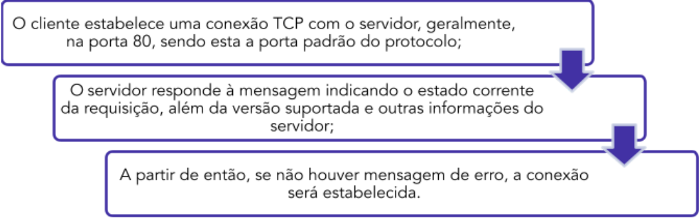

---

<!-- pagina: 4 -->

**André Castro Aula 01** 

Utiliza codificação dos dados em textos ASCII, para que possam ser devidamente interpretados pelos servidores e clientes. 

Para efeito de concurso, o HTTP possui 2 versões: 

● **HTTPv1.0** – **Não realiza conexões persistentes** . Isto é, para cada troca de informação entre cliente e servidor, necessita-se estabelecer e encerrar uma nova conexão TCP; 

● **HTTPv1.1** – **Realiza conexões persistentes** . Estabelece-se apenas uma requisição TCP para a troca de diversas mensagens entre o cliente e servidor. Além disso, pode-se enviar mais de uma requisição sem necessariamente aguardar a confirmação da requisição anterior. 

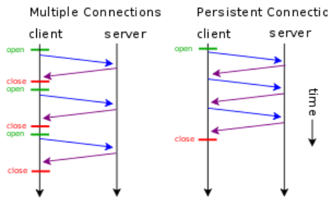

Além disso, é importante destacar que o HTTP em sua versão persistente pode trabalhar ainda de forma sequencial ou paralela. No primeiro caso, troca-se mensagens de requisição e resposta sempre par a par, ou seja, só se envia uma nova requisição depois do recebimento da referida resposta. 

Já no modo paralelo (também conhecido como modo pipelining), pode-se apresentar várias requisições independentemente do recebimento das respostas. A figura abaixo representa todas as possibilidades.

---

<!-- pagina: 5 -->

**André Castro Aula 01** 

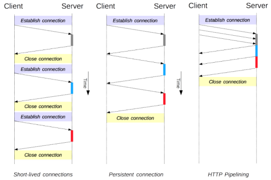

Além disso, o protocolo **HTTP é considerado um protocolo sem estado (stateless),** pois não armazena informações do usuário. 

Um ponto importante a mencionar é que o servidor pode enviar informações ao usuário com vistas a manter a sessão entre eles aberta, além de poder recuperar certas informações futuramente. Esse recurso pode ser provido com o uso de COOKIES, que podem ser armazenados no browser do cliente. 

Assim tem-se um ambiente statefull, porém, vale lembrar que isso é um recurso complementar. **O HTTP nativamente é stateless.** 

**(CESPE - TJ TRT10/Apoio Especializado/Tecnologia da Informação/2013) O protocolo HTTP, que não armazena informações sobre o estado do cliente, classifica-se como do tipo stateless.** 

**<u>Comentários:</u>** 

Vimos que essa é uma característica nativa do protocolo HTTP. 

**Gabarito: C** 

## **ESTRUTURA DA MENSAGEM HTTP** 

Como vimos, existem dois tipos de mensagem HTTP: requisição e resposta. Vamos verificar a estrutura de cada uma delas:

---

<!-- pagina: 6 -->

**André Castro Aula 01** 

- **Requisição:** Pode ser dividida em 3 partes: **linha de requisição, cabeçalho e corpo da** 

- **entidade** 

O método utilizado, o caminho do objeto e a versão do protocolo fazem parte da linha de requisição. Outras informações referentes ao nome da página, estado corrente da conexão, informações de navegador (User Agent) e línguas aceitas ficam por conta do cabeçalho. 

Na requisição, o Corpo da Entidade é utilizado com o método POST uma vez que o cliente envia informações ao servidor para preenchimento do objeto de resposta. 

A figura abaixo é um exemplo de composição da mensagem HTTP: 

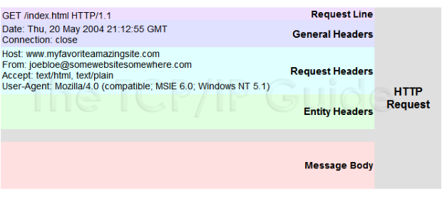

- **Resposta:** Pode ser dividida em 3 partes: linha de estado, cabeçalho e corpo da entidade 

A versão do protocolo e o estado da conexão são apresentados na linha de estado. Os demais campos são semelhantes às mensagens de Requisição. Abaixo temos o exemplo: 

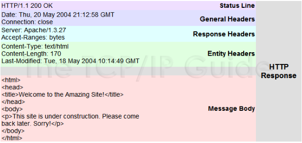

Nesse contexto, é importante também termos no radar que há tipos de mensagens e parâmetros que são utilizados para troca de mensagens direta entre os nós, conhecidos como End-to-End, e aqueles que consideram os nós intermediários, inclusive na presença de Proxies, que são o Hop-by-Hop.

---

<!-- pagina: 7 -->

**André Castro Aula 01** 

Vamos detalhes um pouco mais essas duas categorias: 

### **End-to-end headers** 

Esses cabeçalhos devem ser transmitidos para o destinatário final da mensagem, isso é, o servidor em caso de solicitação ou o cliente caso resposta. **Proxies intermediários devem reenviar cabeçalhos de end-to-end sem alterações e caches devem armazená-los.** 

### **Hop-by-hop headers** 

Esses cabeçalhos são significativos apenas para **uma única conexão a nível de transporte e não devem ser reenviados por proxies ou armazenados em cache.** Tais cabeçalhos são: Connection, Keep-Alive, Proxy-Authenticate, Proxy-Authorization, TE, Trailer, Transfer-Encoding and Upgrade (en-US). **Observe que apenas cabeçalhos hop-by-hop podem ser definidos utilizando o cabeçalho genérico Connection.** 

Vejamos a seguir uma lista dos principais cabeçalhos e seus parâmetros. 

## **TIPOS DE CABEÇALHOS E PARÂMETROS** 

Aprofundando um pouco mais o nosso estudo, vamos conhecer agora alguns parâmetros e tipos de sintaxes que podem ser utilizados nos cabeçalhos. Esses parâmetros permitem a troca de uma série de informações nas requisições e respostas HTTP. 

A sua sintaxe básica para qualquer parâmetro é da seguinte forma, sendo ele case-insensitive (maiúscula ou minúscula): 

_nome : <diretiva>_ 

A relação completa e seus detalhes podem ser acessadas por meio do link <u>https://developer.mozilla.org/pt-BR/docs/Web/HTTP/Headers</u> 

Recomendo que dêem uma olhada por alto, uma vez que a banca, na prática, pode cobrar qualquer item da lista. 

Vamos tentar trazer aqui alguns destaques para que facilite a sua jornada de absorção e aprendizagem: 

- **Authorization** - Contém as credenciais para autenticar um User-Agent com o servidor. 

- **Proxy-Authenticate** - Define o método de autenticação que deve ser utilizado para conseguir acesso ao recurso por trás de um servidor Proxy. 

- **Proxy-Authorization** - Contém as credenciais para autenticar um User-Agent com o servidor Proxy. 

- **Age -** O tempo em segundos em que o objeto esteve em um cache de proxy.

---

<!-- pagina: 8 -->

**André Castro Aula 01** 

- **Connection -** Controla se uma conexão de rede continua ou não aberta após o término da transação atual. 

- **Keep-Alive -** Controla por quanto tempo uma conexão persistente deve permanecer aberta. 

- **Cookie -** Contém cookies HTTP armazenados previamente enviados pelo servidor com o cabeçalho Set-Cookie. 

- **Set-Cookie** - Envia cookies do servidor para o agente de usuário. 

- **Cookie2 -** Contém um cookie HTTP enviado anteriormente pelo servidor com o cabeçalho Set-Cookie2, mas se tornou obsoleto pela especificação. Use Cookie em vez disso. 

- **Set-Cookie2 -** Envia cookies do servidor para o agente-usuário, mas se tornou obsoleto pela especificação. Use Set-Cookie em vez disso. 

- **Location -** Indica a URL para redirecionar uma página. 

- **From -** Contém um endereço de e-mail da internet para um usuário humano que controla o agente do usuário solicitante. 

- **Host -** Especifica o nome de domínio do servidor (para hospedagem virtual), e (opcionalmente) o número da porta TCP na qual o servidor está ouvindo. 

- **Referer** – O Endereço da página anterior pelo qual o acesso foi realizado. 

- **Server -** Contém informações a respeito do programa utilizado pelo servidor de origem para lidar com a requisição 

- **X-XSS-Protection** – Habilita filtro de cross-site scripting 

**Cebraspe – Analista Judiciário – Tecnologia da Informação (TRT-AP/PA)/2022** 

**O cabeçalho do protocolo HTTP que contém o DNS do servidor é o** 

**a) host.** 

**b) authorization.** 

**c) referer.** 

**d) location.** 

**e) server.** 

#### **<u>Comentários:</u>** 

O HOST indica justamente o nome de DNS do servidor, com a possibilidade de indicação da porta. 

Assim, é a sintaxe do parâmetro genérico: 

Host: <host>:<port>

---

<!-- pagina: 9 -->

**André Castro Aula 01** 

Agora com exemplo: 

Host: developer.mozilla.org 

b) O cabeçalho de requisição HTTP Authorization contém as credenciais para autenticar o agente de usuário com o servidor, geralmente o servidor responderá com um status 401 Unauthorized se não for possível fazer a autenticação, e com o cabeçalho WWW-Authenticate. 

c) O cabeçalho de requisição HTTP Referer contém o endereço da página web anterior do qual a página atual requerida foi chamada. O Referer permite aos servidores identificar de onde as pessoas estão visitando-os e pode usar esses dados para análise, log e cacheamento otimizado, por exemplo. 

d) O cabeçalho de resposta Location indica o URL para qual página deve-se ser redirecionada. Ele só tem significado quando é enviado junto a uma resposta de status 3xx (redirecionamento) ou 201 (criado). 

e) O cabeçalho Server contém informação sobre o software usado pelo servidor de origem para manipular a solicitação. 

**Gabarito: A** 

## **MÉTODOS HTTP** 

Cada método é responsável por determinar o tipo de requisição feita e a forma como o dado será tratado. Atenção para o fato de que todos devem ser escritos em letras maiúsculas. O protocolo faz a devida diferenciação. Vamos conhecê-los: 

- **GET – Solicitação de leitura de determinado objeto** . A requisição de páginas WEB pode ser feita através desse método; 

- **PUT –** Solicitação de gravação de determinado objeto. Pode-se enviar **páginas para um servidor remoto através desse método;** 

- **POST –** Método utilizado para anexar informações ou enviar arquivos de dados ou formulários como complemento de uma requisição de leitura. Dessa forma, a

---

<!-- pagina: 10 -->

**André Castro Aula 01** 

resposta dependerá da informação enviada. **Basicamente trata a criação/atualização de um objeto ou recurso existente** . 

- **HEAD –** Mesma lógica do GET. Entretanto, **solicita a leitura apenas do cabeçalho de um objeto ou página WEB.** Tranquilo quando você vincula o nome do método com a estrutura do dado, certo? HEAD = CABEÇALHO. Com isso pode-se obter informações como a data da última modificação da página. 

- **DELETE –** Remove o objeto ou página no servidor; 

- **OPTIONS –** Realiza a consulta de determinadas opções; 

- **TRACE –** Utilizado para teste com mensagens do tipo loopback; 

- **CONNECT –** Utilizado para comunicação com servidores PROXY; 

- **PATCH –** Utilizado para aplicar modificações parciais a um recurso; 

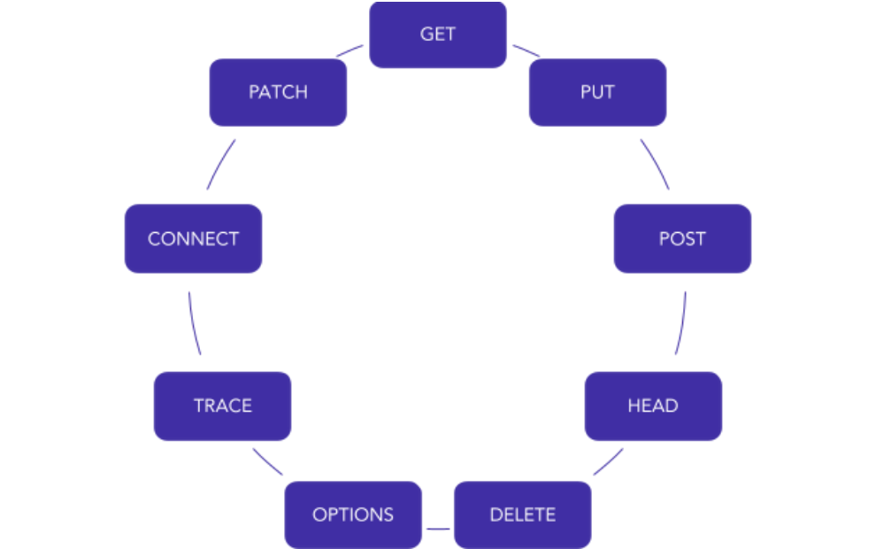

Um outro aspecto importante a ser citado sobre os métodos HTTP **é a classificação de IDEMPOTENTE e NÃO IDEMPOTENTE. Esses métodos são muito úteis na programação e na construção de sistemas que precisam ser resilientes a falhas e erros de processamento.** 

Um método idempotente é aquele que, ao ser executado várias vezes com os mesmos parâmetros, produz o mesmo resultado **, sem efeitos colaterais ou alterações no estado do sistema. Em** outras palavras, ele não tem efeito cumulativo ou dependente do número de vezes que é executado.

---

<!-- pagina: 11 -->

**André Castro Aula 01** 

**Alguns exemplos de métodos idempotentes são os métodos HTTP GET, PUT e DELETE.** O método GET é idempotente porque, ao solicitar uma página web, a resposta será sempre a mesma, independente de quantas vezes a requisição for feita. O método PUT é idempotente porque, ao enviar dados para serem atualizados em um servidor, as informações serão sempre as mesmas, não importa quantas vezes a requisição seja feita. O método DELETE é idempotente porque, ao solicitar a exclusão de um recurso, o resultado será sempre o mesmo, mesmo que a requisição seja enviada várias vezes. 

Em resumo, métodos idempotentes são úteis na construção de sistemas confiáveis e resilientes, que precisam lidar com falhas e erros de processamento sem comprometer o estado do sistema. Saber identificar esses métodos e utilizá-los corretamente pode ajudar a evitar problemas de processamento e a garantir que o sistema funcione corretamente mesmo em situações de alta carga e demanda. 

Além dos métodos idempotentes **, existem também os métodos não idempotentes** , **que podem ter efeitos colaterais e alterar o estado do sistema a cada vez que são executados com os mesmos parâmetros.** 

Um exemplo de método não idempotente é o método HTTP POST. Esse método é comumente utilizado para enviar dados para um servidor e criar um recurso. **No entanto, se o mesmo POST for executado duas vezes com os mesmos dados, ele criará dois recursos idênticos no servidor, o que pode causar problemas de duplicação e inconsistência no sistema.** 

Outro exemplo de método não idempotente é o método HTTP PATCH, que é utilizado para atualizar parcialmente um recurso existente no servidor. Como as atualizações são parciais, a cada PATCH executado com os mesmos parâmetros, o estado do recurso é alterado, o que pode levar a resultados diferentes a cada requisição. 

Em geral, métodos não idempotentes devem ser utilizados com cuidado, e é importante entender como eles podem afetar o estado do sistema e quais precauções devem ser tomadas para evitar problemas. Em casos em que a execução de um método não idempotente é inevitável, pode ser necessário implementar mecanismos de controle de duplicação e verificação de integridade para garantir a consistência do sistema. 

**FGV - 2021 - Banestes - Analista em Tecnologia da Informação - Suporte e Infraestrutura**

---

<!-- pagina: 12 -->

**André Castro Aula 01** 

**O protocolo HTTP define um conjunto de métodos de requisição responsáveis por indicar a ação a ser executada para um dado recurso.** 

**Um método HTTP é denominado idempotente se:** 

**A as requisições em algum momento causam danos ou efeitos colaterais irreversíveis no servidor;** 

**B as requisições com cabeçalhos e parâmetros diferentes causam uma mesma mudança no estado do recurso;** 

**C toda requisição estabelecer um túnel para o servidor identificado pelo recurso de destino;** 

**D o código de status for o mesmo entre requisições que aplicam modificações parciais em um recurso;** 

**E uma requisição idêntica puder ser feita uma ou mais vezes em sequência com o mesmo efeito enquanto deixa o servidor no mesmo estado.** 

#### **<u>Comentários:</u>** 

Na linha do que vimos, ao serem mantidos os parâmetros, não haverá alteração do estado do servidor. 

#### **Gabarito: E** 

**(CESPE - TJ TRE MS/Apoio Especializado/Programação de Sistemas/2013) Com referência ao Hyper Text Transfer Protocol (HTTP) — protocolo de aplicação utilizado para o tratamento de pedidos e respostas entre cliente e servidor na Internet e com o qual, normalmente, são desenvolvidas as aplicações para a Web —, assinale a opção em que todas as expressões identificam métodos de requisição HTTP que devem ser implementados por um servidor HTTP 1.1 usado pelo cliente.** 

a) SOAP, WS, WSDL, UDDI 

b) TCP, IP, NETBIOS, UDP, IPX 

c) NFS, SMB, IPP, SMTP, POP3, IMAP,XMPP, SIP 

d) SET, GET, CONSTRUCTOR, DESTRUCTOR 

e) GET, HEAD, POST, PUT, DELETE, TRACE, OPTIONS

---

<!-- pagina: 13 -->

**André Castro Aula 01** 

#### **<u>Comentários:</u>** 

A alternativa “E” descreve 7 dos 9 existentes. Faltam ainda os métodos CONNECT e PATCH. Os mais utilizados sem dúvida são os 3 primeiros. 

**Gabarito: E** 

|**CÓDIGOS DE ESTADO**|
|---|

Os códigos de estado são definidos em classes, conforme a seguir, com a descrição dos principais códigos: 

<!-- Start of picture text -->
==5460== <!-- End of picture text -->

- **1xx - Classe informacional -** Esta classe indica uma resposta provisória, que consiste de 

- informações do estado da requisição e cabeçalhos opcionais. 

- **2xx - Classe de Sucesso -** Indica que a requisição foi recebida, entendida, aceita e 

- processada. 

- **3xx - Classe de Redirecionamento -** Indica a necessidade de atuação por parte do cliente 

- HTTP para completar a requisição. Pode ou não ser o caso de atuação direta do usuário. 

- **4xx - Classe de Erro de Cliente -** Indica a possibilidade de que houve um erro na 

- requisição por parte do cliente. Caso não seja uma requisição com método HEAD, o servidor enviará uma explicação da situação do erro e se esta é permanente ou temporária. 

**400 (BAD REQUEST) -** A requisição não pode ser entendida pelo servidor devido erro de sintaxe. 

**401 (UNAUTHORIZED) -** A requisição depende de autenticação por parte do usuário. 

**403 (FORBIDDEN) -** O servidor entendeu a requisição, mas se recusa a atendê-la. Pode ser enviado a descrição do motivo da recusa. 

**404 (NOT FOUND) -** O servidor não encontrou nenhum documento que coincida com a URI informada. 

● **5xx - Classe de Erro de Servidor -** Indica que o servidor reconheceu um erro interno ou a incapacidade de atender a requisição. 

**500 (INTERNAL SERVER ERROR) -** Erro inesperado que impediu o atendimento a requisição. 

**503 (SERVICE UNAVAILABLE) -** Servidor está incapacitado de atender as requisições devido à sobrecarga ou manutenção. Indica uma condição temporária.

---

<!-- pagina: 14 -->

**André Castro Aula 01** 

**505 (VERSION NOT SUPPORTED) -** O servidor não suporta ou não está habilitado a responder para a versão requisitada. O servidor indica o motivo do erro, além de informar as versões que são suportadas e permitidas. 

Esses códigos são característicos das mensagens de resposta de um servidor WEB qualquer. 

**(CESPE - TJ TRT10/Apoio Especializado/Tecnologia da Informação/2013) Ao receber uma requisição, o servidor procura pelo recurso requisitado e envia, ao cliente, uma resposta com um código, que pode iniciar-se por 1xx, que indica sucesso no recebimento da requisição; 2xx, que indica redirecionamento da requisição; 3xx, que informa erros acontecidos no cliente; e 4xx, que informa erros no servidor.** 

**<u>Comentários:</u>** 

Pessoal, a ordem correta é: 1xx – Classe informacional 2xx – Classe de sucesso 3xx – Classe de redirecionamento 4xx – Erros no lado do cliente 5xx – Erros no lado do servidor **Gabarito: E** 

## **CONCEITO DE CACHE WEB** 

O funcionamento do CACHE WEB reside na possibilidade de otimização do procedimento de Requisição e Resposta entre o cliente e o servidor. Esse CACHE WEB busca evitar que novas consultas que sejam idênticas a consultas anteriores consumam recursos do servidor de destino, além de diminuir o tempo de resposta. 

Sua implementação pode se dar:

---

<!-- pagina: 15 -->

**André Castro Aula 01** 

● **Servidor Proxy –** Pode-se adicionar um elemento intermediário entre o cliente e o servidor, de tal forma que as consultas necessariamente passem pelo nó intermediário antes de chegar ao destino. Esse nó, é chamado de Proxy e armazena as últimas informações requisitas pelos clientes aos servidores. 

Dessa forma, caso haja uma nova requisição em que o proxy possua as informações necessárias para resposta, este não repassará a consulta ao servidor, atendendo a requisição imediatamente. É importante ressaltar que a presença do PROXY implica em duas conexões a serem estabelecidas: Cliente e PROXY; PROXY e Servidor. 

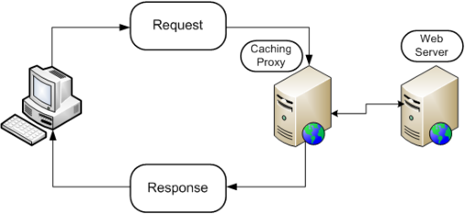

● **Proxy reverso –** Esse conceito gera alguns benefícios na implementação de serviços HTTP no lado do servidor. Entre eles temos os recursos de proteção, balanceamento e distribuição de requisições e armazenamento em cache das informações estáticas. Dessa forma, quando há uma requisição a um objeto estático, o proxy reverso é capaz de responder diretamente à requisição. 

Já quando há uma requisição a objetos dinâmicos, este repassa a requisição aos servidores internos conforme a porta utilizada do serviço específico. A figura abaixo nos apresenta o modelo comentado: 

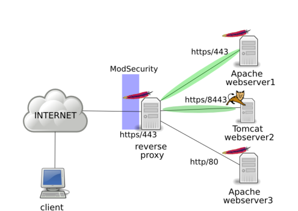

● **Cache Local –** Os browsers possuem a capacidade de armazenar as informações recebidas do servidor de tal forma que uma nova requisição idêntica à anterior não enseje uma nova consulta ao servidor. Desse modo, a requisição será atendida diretamente pelo Browser.

---

<!-- pagina: 16 -->

**André Castro Aula 01** 

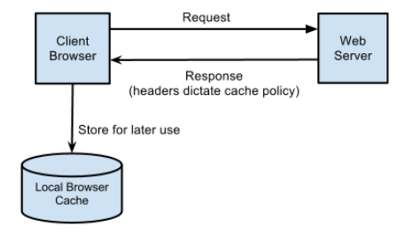

Acrescento ainda a informação de que o protocolo HTTP pode ser utilizado de forma segura com a nomenclatura HTTPS, operando na porta 443/TCP. 

A definição do tipo de criptografia a ser utilizado fica por conta dos protocolos SSL e TLS. Estes serão responsáveis por estabelecer uma camada de segurança para que o HTTP possa trafegar de forma segura. 

Dessa forma, quando temos uma navegação em HTTPS, **dizemos que os dados serão cifrados para uma comunicação segura, além da capacidade de se verificar a autenticidade do servidor** através de recursos de certificados digitais. Acrescido a isso, temos também a possibilidade de autenticação do usuário de forma opcional. Essa é a diferença da versão de tunelamento: simples e mútua. 

A primeira, autentica apenas o servidor, enquanto a segunda, também autentica o cliente. Desse modo, deve haver uma intervenção no cliente para que se implemente a configuração e instalação de certificado digital para que este possa ser usado no processo de autenticação do cliente. 

Esse ponto gerou uma polêmica com a banca CESPE ao afirmar que o HTTPS necessariamente tratará os aspectos de autenticação do servidor e cliente, quando na prática, isso não acontece. 

Quando acessamos os serviços da GOOGLE por exemplo, não enviamos nosso certificado digital para a devida autenticação, utilizando, portanto, o modo simples do SSL/TLS. 

A Imagem abaixo nos dá uma visão das fases envolvidas no processo de conexão, troca de chaves e, finalmente, troca dos dados:

---

<!-- pagina: 17 -->

**André Castro Aula 01** 

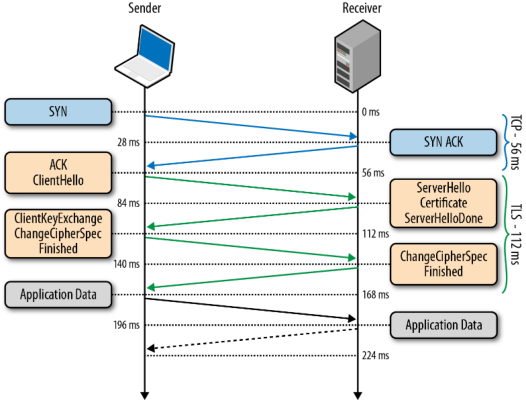

As três primeiras mensagens são de estabelecimento da conexão TCP. Entretanto, a terceira mensagem indicada por “ACK/CLIENTHELLO” já congrega a última mensagem de ACK do TCP e a primeira do HTTPS (Hello). Em seguida, tem-se o reconhecimento e a definição dos algoritmos suportados com a devida troca de chaves, para, enfim, iniciar a troca de informação, de fato! 

Algumas bancas em provas mais técnicas cobram as características de alguns campos dos cabeçalhos do protocolo HTTP. Dessa forma, recomendo a leitura do link: **<u>http://www.w3.org/Protocols/rfc2616/rfc2616-sec14.html</u>** 

**(CESPE - TJ TRT10/Apoio Especializado/Tecnologia da Informação/2013) As estratégias usadas para diminuir o tráfego causado pelo grande número de acessos a páginas web podem ser do tipo cache web, que é implementado no cliente, no GET condicional ou na rede servidor Proxy Web.** 

**<u>Comentários:</u>** 

Pessoal, vimos que o cache pode estar localizado tanto no cliente, em um browser por exemplo ou em um servidor Proxy. Complemento ainda o fato da existência da utilização do método GET de forma condicional. Na requisição GET, o cliente envia informações de data do objeto

---

<!-- pagina: 18 -->

**André Castro Aula 01** 

desejado em um cache web. Caso o objeto não tenha sido modificado a partir da data, extrai-se a informação do cache. Caso tenha havido mudança, o servidor envia o objeto atualizado. 

#### **Gabarito: C** 

## **HTTP 2.0** 

Aprofundando um pouco mais a nossa conversa a respeito do HTTP, gostaria de comentar com vocês diversas características do protocolo HTTP em sua versão 2.0.  Algumas bancas já estão apresentando questões que exigem conhecimento da referida versão e como o nosso objetivo é sempre estar atualizado, nada mais certo do que abordarmos tal assunto. 

O surgimento dessa versão veio com o objetivo de contemplar a nova forma de navegação web. Temos um cenário com sites mais elaborados com um grande volume de dados, regras e protocolos que visam garantir princípios de segurança, navegação em dispositivos móveis, muitos outros. 

A empresa GOOGLE buscou largar na frente nessa jornada e apresentou um novo protocolo próprio conhecido como SPDY.  Foi uma camada de complementação de serviços e recursos ao HTTP padrão. Essa camada torna diversos recursos obrigatórios, entre eles o fato de se compactar e criptografar os dados e os cabeçalhos HTTP. Outro recurso interessante que surge para otimizar a utilização da banda é a multiplexação no HTTP. Tal recurso possibilitar gerar diversas requisições ao mesmo tempo em uma mesma conexão. 

Mas porque estamos falando desse protocolo Professor? 

Devido aos excelentes resultados apresentados, ele tem servido como base para a elaboração da versão 2.0 do HTTP. 

Desse modo, a versão 2.0 suporta todos os recursos básicos das versões anteriores, porém, com grande foco na eficiência da comunicação em termos de velocidade e racionamento de recursos.

---

<!-- pagina: 19 -->

**André Castro Aula 01** 

A versão 2.0 incluiu outros tipos de quadros além dos padrões já conhecidos que são o HEADER e DATA, conforme versão anterior. Nesse contexto, surge quadros do tipo SETTINGS, WINDOW_UPDATE e PUSH_PROMISSE, com vistas a implementação de novos recursos no HTTPv2.0. 

Surge ainda o conceito de STREAMS ou fluxos independentes e bidirecionais em uma mesma conexão. Desse modo, um problema de bloqueio ou congestionamento em algum desses fluxos não impacta os demais. Devido a essa característica, busca-se ainda implementar controles de fluxo e priorização de STREAMS. 

Há de se mencionar que todas as conexões do HTTPv2.0 são persistentes. Desse modo, os clientes não devem ser capazes de abrir mais de uma conexão para o mesmo host/porta. Entretanto, pode-se estabelecer novas conexões em detrimento da anteriormente estabelecida para algumas finalidades, entre elas, a renegociação de chaves para uma conexão TLS ou conexões que estão com erros. 

Vamos abordar então os diversos pontos que são mais relevantes a respeito da implementação do HTTPv2.0, inclusive em conjunto com protocolos auxiliares como o TLS. 

#### **● Compressão Automática** 

Nas implementações padrões das versões anteriores do HTTP, quando se almejava incremento do desempenho, utiliza-se a ferramenta GZIP no lado do servidor que era responsável pela compressão dos dados que serviam como respostas às requisições dos clientes. 

Na versão 2.0, tal implementação é utilizada como padrão e de forma obrigatória. Além disso, utiliza-se um algoritmo conhecido como HPACK para compressão de todos os HEADERS, sejam aqueles destinados às requisições ou a respostas, diminuindo bastante o volume de dados trafegados nos HEADERS. 

#### **● Criptografia e Segurança** 

Para comunicações seguras, tem-se a utilização do HTTPS de forma obrigatória com vistas a tratar os diversos aspectos de segurança da informação. É importante mencionar que tal recurso implica em uma difusão global de certificados digitais para que tenhamos ambientes mais robustos e seguros nas comunicações com HTTPS. 

Desse modo, o SSL é um protocolo fundamental na implementação e transição do HTTPS para o HTTP2.0. 

#### **● Paralelização de Fluxos com Multiplexing**

---

<!-- pagina: 20 -->

**André Castro Aula 01** 

Como vimos anteriormente, o HTTP em suas versões anteriores utiliza o conceito de envio de recursos de forma sequencial. Assim, ao se abrir a conexão, envia-se um request e espera-se uma resposta para o referido request antes de enviar a nova requisição. 

A evolução desse recurso, ainda implementado para as versões anteriores, era abrir diversas conexões e cada uma ter o seu próprio fluxo. Percebam que aqui tínhamos uma paralelização de conexões, algo em torno de 4 a 8 conexões para um host comum. 

O HTTP2.0 surge então com uma nova abordagem, a de paralelização de fluxos ou de requisições e respostas em uma mesma conexão, totalmente independentes entre si, assíncronos e bidirecionais. 

Como já vimos e reforçamos, tal recurso é conhecido como MULTIPLEXING. A imagem abaixo nos traz essa representação em que não é necessário aguardar a resposta específica para uma requisição, antes de enviar uma nova requisição: 

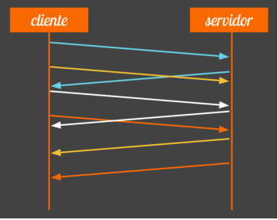

Diante do modelo proposto, o controle de fluxo em cada um desses streams é fundamental, devendo ser garantido esse aspecto. O HTTP2.0 utiliza o quadro WINDOW_UPDATE para tal funcionalidade. Ele pode ser aplicado tanto para controle de fluxo de cada stream como da conexão como um todo. 

Outro recurso interessante que surge no HTTP2.0 é a otimização de tráfego com vistas a não enviar informações redundantes que já foram trafegadas. Ou seja, por padrão, o HTTP em sua versão anterior manda informações idênticas a cada requisição ou resposta, como é o caso do parâmetro “User-Agent” que informa características do Browser do cliente. 

Na nova versão, envia-se apenas informações de cabeçalho que são diferentes das informações já enviadas, reduzindo, assim, o fluxo de dados desnecessários. 

#### **● Priorização de Requests**

---

<!-- pagina: 21 -->

**André Castro Aula 01** 

O HTTPv2.0 possui a capacidade de distinguir as respostas a serem enviadas e categorizá-las conforme a necessidade de montagem da página. Desse modo, pode-se enviar, por exemplo, de forma prioritária, o arquivo base da página “index.html” e posteriormente, complementá-la com as demais informações. 

Assim, busca-se dar agilidade e trazer um caráter mais ágil na construção da página no lado do cliente. 

A figura a seguir nos traz essa representação: 

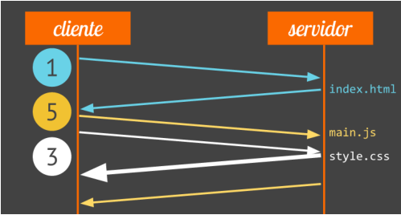

#### **● Server-Push** 

A ideia desse recurso é identificar a necessidade do cliente de tal modo que ele não necessite fazer a requisição para cada recurso. Na figura acima, verificamos que para cada resposta, houve uma requisição. Ora, o servidor entende que sempre que há o pedido de envio da página index.html, necessariamente virá pedidos para as demais páginas. Desse modo, ele antecipa tal questão e já envia os recursos independentemente da requisição do cliente. 

#### **● HTTP2.0 com TLS 1.2** 

Para implementação do HTTP em sua versão 2.0, deve-se utilizar a extensão do TLS conhecida como Server Name Indication (SNI). Para as versões do TLS 1.3 ou superior, a implementação e suporte do SNI é suficiente. 

Já a versão 1.2 apresenta uma série de requisitos que devem ser seguidos para que seja possível a sua implantação. Caso esses requisitos não sejam atendidos, pode-se ter problemas de diversos, principalmente no que concerne à troca de chaves e estabelecimento da sessão TLS na fase de negociação. 

Nesses casos, utiliza-se mensagens do tipo INADEQUATE_SECURITY ou categoriza-se como erro de conexão. 

Dessa forma, vamos checar quais são os requisitos que devem ser atendidos:

---

<!-- pagina: 22 -->

**André Castro Aula 01** 

**Desabilitar a COMPRESSÃO -** A compressão pode gerar problemas de vazamento de dados ou exposição indevida. É importante lembrar que compressões genéricas são desnecessárias uma vez que o HTTPv2 apresenta recurso de compressão intrínseca criada e configurada para uma operação plena no HTTPv2 em termos de desempenho, seguranças e outros pontos. 

**Desabilitar a RENEGOCIAÇÃO -** Por motivo da troca de chaves e certificados no estabelecimento da conexão, os terminais devem tratar a renegociação como um erro de conexão. A renegociação deve ser utilizada exclusivamente para fins de confidencialidade na troca de informações de credenciais no estabelecimento da conexão e não conectividade. 

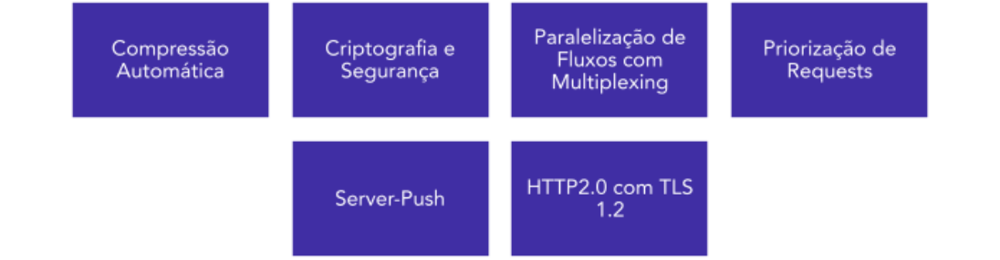

**(CESPE – TJDFT/Analista Judiciário – Suporte em TI/2015) A técnica de compressão não é recomendada ao se utilizar a versão 2 do HTTP sobre o protocolo TLS 1.2.** 

#### **<u>Comentários:</u>** 

Vimos que essa é uma das recomendações apresentadas a respeito do HTTP 2.0. 

**Gabarito: C**

---

<!-- pagina: 23 -->

**André Castro Aula 01** 

## **HTTP 3.0** 

HTTP/3 transporta **HTTP sobre QUIC, protocolo baseado em UDP que integra o handshake de transporte e a negociação de TLS 1.3.** Com isso, reduz a latência inicial e elimina round-trips extras necessários no TCP, permitindo inclusive 0-RTT em reconexões com session tickets válidos. 

Ao invés de uma única fila por conexão (como em HTTP/2 sobre TCP), QUIC fornece múltiplos fluxos independentes dentro da mesma sessão. Perdas em um fluxo não bloqueiam os demais, mitigando head-of-line blocking e melhorando desempenho em redes com perda, jitter ou mobilidade. 

**Head-of-line blocking (HoL)** é quando a perda ou atraso de um pacote bloqueia tudo que vem “atrás” dele na mesma fila. Em TCP/HTTP/2, um único pacote perdido faz a conexão esperar a retransmissão antes de entregar dados subsequentes, atrasando todos os fluxos multiplexados. Em QUIC/HTTP/3, cada fluxo é independente, então a perda em um não impede o avanço dos demais. 

Para compressão de cabeçalhos, HTTP/3 usa QPACK, desenhado para funcionar quando a entrega pode ocorrer fora de ordem. QPACK separa a evolução dos dicionários estático e dinâmico, evitando bloqueios entre quem produz e quem consome cabeçalhos. 

Outro ganho prático é a migração de conexão: a sessão persiste mesmo que o endereço IP do cliente mude (ex.: troca de Wi-Fi para 4G), mantendo fluxos longos sem renegociação completa. 

O QUIC implementa controle de congestionamento e de fluxo no espaço do usuário, permitindo adoção ágil de algoritmos modernos (Cubic, BBR) e limites por fluxo e por conexão. Isso dá granularidade para priorização e evita buffer bloat. 

**CUBIC** é um algoritmo de controle de congestionamento orientado a **perda** (loss-based), sucessor do Reno, por anos padrão no Linux. Ele faz o congestion window crescer segundo uma função **cúbica** do tempo desde a última perda: acelera em enlaces de alta banda-latência (alto BDP), é relativamente agressivo na busca por throughput e reduz a janela multiplicativamente quando detecta perda. Funciona bem em muitos cenários, mas tende a formar filas grandes e aumentar latência sob disputa, além de ser pouco “justo” entre fluxos com RTTs diferentes. 

**BBR (Bottleneck Bandwidth and RTT)** é um controle de congestionamento **model-based** (não guiado por perda) criado pelo Google. Ele estima continuamente a **largura de banda do gargalo** e o **RTT mínimo** , e regula envio por pacing para operar próximo ao produto banda×RTT sem encher filas. Trabalha por fases (Startup, Drain, ProbeBW, ProbeRTT) para descobrir e manter a taxa ideal, buscando alto throughput **com baixa latência** . A versão **BBR v2** melhora equidade com CUBIC/Reno e lida melhor com perdas/policers. 

**Em contraste,** o CUBIC aumenta até perder e então recua; BBR tenta **evitar** enfileiramento medindo a rede e ajustando a taxa. CUBIC é simples e amplamente compatível; BBR entrega latência menor e boa vazão, mas depende de estimativas estáveis e pode exigir tuning para convivência justa em certos ambientes.

---

<!-- pagina: 24 -->

**André Castro Aula 01** 

Na implantação, HTTP/3 já conta com amplo suporte em navegadores e CDNs, mas pode sofrer em redes que filtram UDP ou fazem inspeção profunda. Por isso é comum manter fallback transparente para HTTP/2, garantindo continuidade de acesso. 

Operacionalmente, recomenda-se ajustar idle timeouts, limites de tamanho de quadro/mensagem e parâmetros de retransmissão do QUIC. Além disso, monitorar métricas específicas como RTT de handshake, perdas por fluxo, atualizações de janela. Com essas práticas, exploram-se os ganhos de latência, resiliência e mobilidade que distinguem o HTTP/3 das versões anteriores. 

Na imagem a seguir, reparem justamente na chamada direta do QUIC em conjunto com o TLS no fechamento da conexão. 

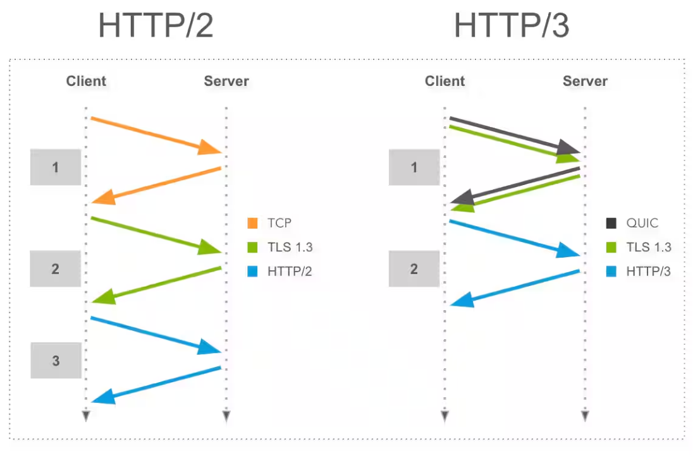

_Fonte:_ _<u>Akamai.com</u>_ 

Agora, na imagem a seguir, verificamos justamente o fortalecimento da capacidade de multiplexação encapsulado no QUIC junto com outros recursos de transporte e segurança.

---

<!-- pagina: 25 -->

**André Castro Aula 01** 

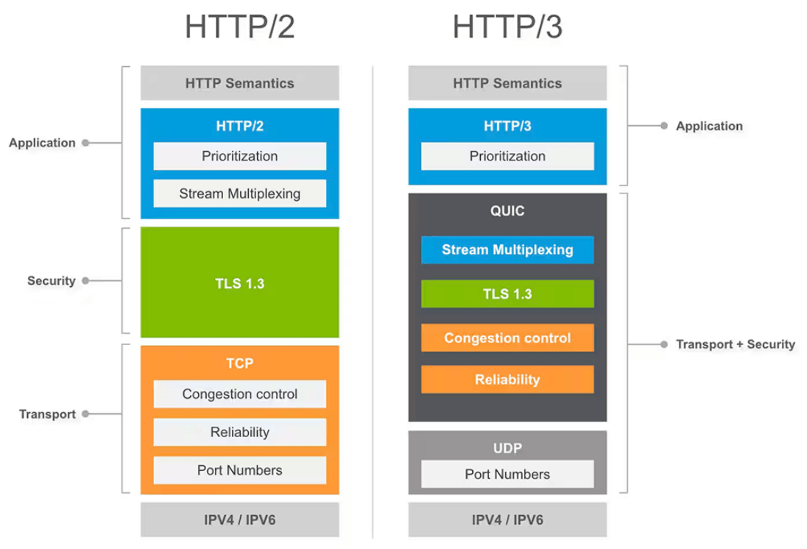

_Fonte:_ _<u>https://blog.saninternet.com/http3</u>_

---

<!-- pagina: 26 -->

**André Castro Aula 01** 

## **ARQUITETURA WEB** 

Vou tratar deste assunto de forma complementar ao tema que é tratado primariamente e majoritariamente em Engenharia de Software. Portanto, alguns tópicos podem parecer confusos, pois meu objetivo aqui, não é explicar todo o contexto das tecnologias de arquitetura na ótica da aplicação. Entretanto, há alguns pontos que envolvem nossas políticas de redes de computadores e outras capacidades que estamos estudando que merecem destaques. 

Arquitetura Web é o arranjo de componentes e protocolos que permitem que clientes e servidores troquem informações com desempenho, segurança e confiabilidade. Vista pelo ângulo de redes, ela organiza camadas — rede (IP), transporte (TCP/UDP/QUIC), segurança (TLS), aplicação (HTTP/1.1, HTTP/2, HTTP/3) — e elementos de borda (CDNs, proxies reversos, balanceadores L4/L7) para viabilizar padrões de comunicação como requisição–resposta, streaming e outros. Em vez de discutir apenas padrões de código como na disciplina de engenharia de software, vamos buscar observar como as escolhas de protocolos, políticas de retry, idempotência, caching e flow control moldam latência, throughput, consistência e resiliência do sistema. 

#### ● **<u>Camadas de rede e transporte: TCP, UDP e QUIC</u>** 

TCP oferece confiabilidade, ordenação e controle de congestionamento, sendo a base tradicional da Web (HTTP/1.1 e HTTP/2). UDP é não confiável por definição, mas serve de alicerce para protocolos que implementam confiabilidade na aplicação. 

QUIC, por sua vez, roda sobre UDP, integra criptografia (TLS 1.3), multiplexação sem head-of-line blocking entre streams independentes e migração de conexão, reduzindo latência em cenários com perda de pacotes e handoffs móveis. 

A escolha do transporte afeta handshakes, latência inicial, keep-alives, backpressure e sensibilidade a perdas. 

#### ● **<u>HTTP/1.1, HTTP/2 e HTTP/3 (sobre QUIC)</u>** 

Conforme já comentamos, mas apenas para manter na estrutura de arquitetura WEB, o HTTP/1.1 usa conexões persistentes, porém sofre com head-of-line blocking no nível da conexão, o que estimulou soluções alternativas como domain sharding e spriting. 

- **Domain sharding** é a prática de distribuir os recursos estáticos de um site (imagens, CSS, JS) por vários subdomínios (ex.: a.cdn.exemplo.com, b.cdn.exemplo.com) para contornar o limite de conexões simultâneas por host imposto por navegadores no HTTP/1.1. 

- **Spriting** (image spriting) é combinar múltiplas imagens pequenas em um único arquivo (um “sprite sheet”) e usar CSS para exibir apenas a área desejada via background-position. O objetivo, na era do HTTP/1.1, era reduzir o número de requisições HTTP e o overhead por recurso.

---

<!-- pagina: 27 -->

**André Castro Aula 01** 

HTTP/2 introduz multiplexação de streams numa mesma conexão TCP, HPACK para compressão de cabeçalhos e server push (pouco usado na prática), mas ainda herda head-of-line do TCP sob perda. 

HTTP/3 move o protocolo para QUIC/UDP, oferecendo multiplexação com perdas isoladas por stream, melhorando tempo de carregamento e estabilidade de conexões long-lived. 

Em qualquer versão, diretrizes críticas incluem timeouts, keepalives, limites de tamanho de mensagem e respeito ao controle de fluxo. 

#### ● **TLS e identidade de extremos** 

TLS provê confidencialidade e integridade em trânsito; certificados e cadeias de confiança autenticam o servidor (e, em mTLS, o cliente). Em arquiteturas distribuídas, o data plane costuma exigir mTLS, certificate rotation automatizada e session resumption para reduzir handshakes. Políticas de cipher suites modernas (TLS 1.3), OCSP stapling e perfect forward secrecy mitigam riscos sem punir a latência. 

- **Modelos de comunicação: requisição–resposta, streaming e pub/sub** 

- a) O padrão requisição–resposta é simples e domina REST/HTTP. 

- b) Streaming mantém conexões abertas para fluxos contínuos. 

- c) pub/sub desacopla produtores e consumidores com filas e topics. 

A decisão depende de requisitos de latência, ordenação, reprocessamento e acoplamento. 

#### ● **gRPC com streaming bidirecional (sobre HTTP/2)** 

gRPC é um framework de RPC de alto desempenho que usa HTTP/2 como transporte e Protocol Buffers como IDL/serialização por padrão. Ele modela contratos entre serviços por meio de services e methods tipados, gera stubs em múltiplas linguagens e aproveita recursos nativos do HTTP/2 como multiplexação de streams, compressão de cabeçalhos (HPACK), controle de fluxo e uma única conexão TLS por destino. 

Em comparação com REST/JSON, tende a entregar menor latência, payloads menores e semântica clara de chamadas remotas, mantendo compatibilidade com práticas modernas: deadlines/cancellation, retries controlados, interceptors para observabilidade e políticas de segurança consistentes (mTLS/OAuth2). 

O contrato começa em um arquivo _.proto_ com mensagens e serviços; o compilador (protoc) gera clients e servers. Uma chamada gRPC é um stream HTTP/2 identificado dentro de uma conexão. O cliente envia headers (com metadata), possivelmente mensagens (dependendo do tipo de RPC), e recebe headers/trailers e mensagens de resposta. Deadlines evitam travamentos em cascata, pois se o prazo expira, o servidor cancela o processamento e libera recursos. 

Ele possui 4 estilos ou tipos de comunicação:

---

<!-- pagina: 28 -->

**André Castro Aula 01** 

1. **Unary RPC** é o “request–response” clássico: uma mensagem de requisição, uma de resposta, sobre um stream curto. É o padrão para operações pontuais, idempotentes ou não, com deadline e retries bem definidos (idealmente apenas para métodos idempotentes). 

2. **Server streaming** envia uma requisição e recebe múltiplas mensagens do servidor ao longo do tempo no mesmo stream. É útil para feeds ordenados, exportações e relatórios progressivos; requer atenção a backpressure do lado do cliente e limites de janela do HTTP/2. 

3. **Client streaming** permite ao cliente enviar várias mensagens e, ao sinalizar half-close, receber uma resposta única. Serve a cargas agregáveis (telemetria, batch upserts); demanda idempotência ou marcações de lote para lidar com retries sem duplicar efeitos. 

4. **Bidirectional streaming** habilita troca de múltiplas mensagens por ambos os lados, de forma assíncrona, reutilizando um único stream. É apropriado para chat, colaboração em tempo real, order books e controle interativo; pede políticas claras de ordenação (garantida apenas dentro do stream), controle de fluxo, enfileiramento e keepalives calibrados para atravessar proxies. 

O HTTP/2 provê controle de fluxo por conexão e por stream. O runtime gRPC expõe APIs para não saturar buffers. 

#### ● **Tecnologias equivalentes/alternativas ao gRPC** 

#### **De forma objetiva, para termos algumas referências:** 

1. Para navegadores, **gRPC-Web** contorna proxies HTTP/1.1; 

2. **WebSockets** viabilizam canais full-duplex simples para push em tempo real; 

3. **SSE** (Server-Sent Events) é leve para feeds unidirecionais. 

4. **HTTP/3/QUIC** e **WebTransport** reduzem head-of-line em redes adversas. 

5. Se o requisito é desacoplamento e replay, usar mensageria: **MQTT** (IoT), **AMQP/RabbitMQ** , **NATS** ou **Kafka** (fluxos duráveis, consumer groups). 

#### ● **Caching e consistência: Cache-Aside** 

No padrão Cache-Aside, a aplicação consulta primeiro o cache e, em caso de miss, busca no banco, popula o cache e retorna. Em cenários de alta concorrência, múltiplas requisições para a mesma chave podem observar o miss simultaneamente e disparar leituras redundantes no banco, gerando o chamado cache stampede (ou dogpile effect). Além do custo, há riscos de inconsistência temporal: uma atualização em andamento pode ser sobreposta por dados antigos que chegaram “por último” ao cache. O problema se agrava quando se aplica invalidação agressiva ou TTLs curtos, pois os misses se tornam sincronizados. 

Mitigar requer sincronização por chave para coalescer requisições concorrentes. Uma abordagem prática é usar locks distribuídos de curta duração no próprio cache para garantir que apenas um processo faça o backfill enquanto os demais aguardam ou retornam degradado.

---

<!-- pagina: 29 -->

**André Castro Aula 01** 

Alternativas mais robustas incluem singleflight/request coalescing em memória por nó, semaphores por hot key, e leases (o produtor de cache recebe um arrendamento com prazo; ao expirar, o valor não pode ser sobrescrito sem renovar o lease). É recomendável aplicar jitter a TTLs para evitar expirações simultâneas, negative caching para misses frequentes e backoff com circuit breaker quando o banco estiver sob pressão. 

Em escritas, o padrão Cache-Aside exige disciplina: após atualizar o banco, é necessário invalidar a chave no cache; não regravar diretamente o novo valor a menos que controle a ordenação com versões. 

Versão lógica ou ETag no valor ajuda a evitar write races: a aplicação só popula o cache se a versão ainda for a mais recente. Em leituras críticas, um read-through controlado pelo provider pode simplificar a sincronização; já write-through/write-behind reduzem janelas de inconsistência à custa de acoplamento e complexidade operacional. 

Por fim, aceitar a realidade de consistência eventual no Cache-Aside e projetar tolerância a dados “pouco defasados” quando o domínio permitir. Para domínios estritos, combinar versões, leases e comparações atômicas (CAS) no cache, além de idempotência no caminho de povoamento. 

A meta é transformar stampedes em um único carregamento controlado, mantendo o banco protegido e o cache coerente o bastante para o uso. 

- **Padrões e tecnologias alternativas de cache** 

**Do mesmo modo que vimos alternativas ao gRPC, vamos entender também algumas alternativas ao Cache-Aside:** 

1. **Read-Through** delega ao provedor de cache o backfill; 

2. **Write-Through/Write-Behind** simplificam coerência em troca de acoplamento; 

3. **Stale-While-Revalidate** e **Refresh-Ahead** estabilizam latência servindo valor obsoleto por uma soft TTL enquanto a atualização ocorre. 

4. Para dados quentes, **near cache** local (Caffeine/Guava) com invalidação via pub/sub, **CDNs** com cache keys bem definidas, e scripts atômicos (Lua no Redis) ajudam a manter a coerência. 

5. No plano de leitura, **CQRS** , **event sourcing** , visões materializadas e tabelas de resumo deslocam carga e dão previsibilidade. 

#### ● **Proxies, CDNs e balanceadores (L4/L7)** 

Proxies reversos e CDNs amortecem latência, terminam TLS e aplicam políticas de cache na borda. O edge compute permite validações e personalizações leves sem voltar à origem. Balanceadores L4 distribuem por conexão (TCP/UDP), enquanto L7 inspeciona HTTP/gRPC para decisões por rota, cabeçalho ou cookie. Em meshes (Istio/Linkerd), sidecars padronizam mTLS, retries, timeouts e circuit breaking, além de telemetry coerente. 

#### ● **Idempotência, retries e controle de fluxo**

---

<!-- pagina: 30 -->

**André Castro Aula 01** 

Operações devem declarar idempotência para que retries automáticos (por clientes, proxies ou meshes) não causem efeitos colaterais. Em gRPC/HTTP, usar idempotency keys para POSTs sensíveis, expor retry budgets e trate backoff exponencial com jitter. Respeitar sinais de flow control (HTTP/2/3) e impor limites de buffer para evitar buffer bloat e latência explosiva sob carga. 

#### ● **Segurança de transporte e de aplicação** 

Em trânsito, deve-se buscar o TLS 1.3 e mTLS como serviços e certificate rotation automatizada. Na aplicação, combinar OAuth 2.1/OIDC, scopes e claims mínimos, token binding e políticas de segredo (KMS/HSM). Todos esses recursos são detalhados especificamente em aula de segurança da informação no contexto de mecanismos de autorização. 

Para proteção contra phishing e sequestro de sessão, considerar fatores resistentes (FIDO2/WebAuthn) e device binding. Em streams de longa duração, validar credenciais periodicamente e tratar revogação. 

Sendo assim pessoal, entendemos que a Arquitetura Web eficiente deriva de escolhas conscientes na pilha de redes e protocolos. Ao dominar esses fundamentos, você complementa as aulas de Engenharia de Software com a capacidade de prever o comportamento do sistema como um todo e evitar eventuais extrapolações das bancas ou focos diversos que venham a prejudicar a sua avaliação na hora da prova. 

#### **CESPE – SUSEP/2025 - Desenvolvimento de Sistemas** 

**O padrão Cache-Aside (Lazy Loading) pode sofrer race conditions em cenários de alta concorrência, a menos que sejam adotadas técnicas de sincronização.** 

#### **<u>Comentários:</u>** 

Vimos justamente este problema da alta concorrência e múltiplas visões dos impactos e práticas derivadas deste problema, e nesse cenário, dentre as diversas medidas, a sincronização é uma delas. 

#### **Gabarito: C** 

#### **CESPE – SUSEP/2025 - Desenvolvimento de Sistemas** 

**O gRPC oferece suporte a streaming bidirecional, permitindo que cliente e servidor troquem múltiplas mensagens de forma assíncrona na mesma conexão, por meio da multiplexação do HTTP/2.** 

#### **<u>Comentários:</u>**

---

<!-- pagina: 31 -->

**André Castro Aula 01** 

Vimos que é justamente o quarto tipo de comunicação ofertado pelo gRPC. 

#### **Gabarito: C** 

## **QUIC** 

QUIC é um protocolo de transporte sobre UDP, seguro por padrão (TLS 1.3 embutido), com múltiplos fluxos (streams) confiáveis por conexão, estabelecimento rápido (0-RTT/1-RTT), detecção de perdas e controle de congestionamento próprios e migração de conexão (a sessão continua mesmo se o IP/rota do cliente mudar, graças aos Connection IDs). 

É padronizado pela IETF em RFC 9000 (transporte), RFC 9001 (QUIC+TLS 1.3) e RFC 9002 (perdas e CC). 

Como já citamos, ele o HTTPv3 roda em cima do QUIC. A semântica do HTTP é mapeada para **streams QUIC** (cada requisição/resposta em um fluxo independente), com **framing binário** parecido com o do HTTP/2, mas sem depender de TCP — livrando-se do **Head-of-Line (HoL) blocking** entre fluxos. 

Com isso, é possível obter alguns ganhos: 

- **Menos latência:** handshake criptográfico acoplado ao transporte ( **TLS 1.3** ) permite **1-RTT** e, em reuso de credenciais, **0-RTT** 

- **Sem HoL entre streams:** perda de um pacote afeta só o **fluxo** correspondente (no HTTP/2/TCP, uma perda trava todos os fluxos) 

- **Robustez em mobilidade: Connection IDs** preservam a sessão ao trocar de Wi-Fi para 4G/5G 

- **Seguro por padrão: TLS 1.3 obrigatório** dentro do QUIC 

#### **Possui uma estrutura de HANDSHAKE padrão, com:** 

**1. ClientHello (QUIC+TLS1.3)** **_→_ servidor;** 

   - **_→_** 

   - **2. servidor responde, chaves estabelecidas dados de aplicação em 1-RTT;** 

   **3. em conexões repetidas, 0-RTT pode liberar envio imediato (com cautelas de replay).** 

#### **Então, novamente, se formos pensar num comparativo para efeito de prova, temos:** 

- **a) HTTP/2 sobre TCP+TLS:** multiplexação + compressão de cabeçalhos, mas HoL no TCP entre fluxos. 

- **b) HTTP/3 sobre QUIC:** multiplexação sem HoL entre streams, TLS 1.3 embutido, 0/1-RTT, migração.

---

<!-- pagina: 32 -->

**André Castro Aula 01** 

**Alguns sites mais técnicos trazem aplicações práticas que merecem destaque, pois por vezes as bancas gostam de consumir diretamente essas informações. Vamos ver:** 

#### **—** **<u>Exemplo 1 página com muitos objetos</u>** 

**Com HTTP/2/TCP, uma perda trava a fila de respostas. Em HTTP/3/QUIC, apenas o stream afetado é atrasado; a página monta mais rápido em redes ruidosas.** 

#### **<u>Exemplo 2 — mobilidade do cliente</u>** 

**Ao sair do Wi-Fi e cair no 5G, o Connection ID mantém a sessão — sem full handshake de novo e sem quebrar downloads/streams em curso.** 

#### **—** **<u>Exemplo 3 serviços de borda/CDN</u>** 

**CDNs habilitam HTTP/3 no edge para reduzir latência em última milha. Algumas ainda mantêm HTTP/2 para o back-end; ganho já aparece no trajeto usuário ↔ CDN.** 

#### **CESPE – SUSEP/2025 - Analista Técnico (TI)** 

**A terceira versão do HTTP — HTTP/3 — roda sobre o UDP, sendo mais eficiente e segura que a versão HTTP/2.** 

**<u>Comentários:</u>** 

HTTP/3 usa QUIC sobre UDP e impõe TLS 1.3, mitigando HoL entre fluxos e reduzindo latência, especialmente em redes com perda. 

**Gabarito: C** 

**FGV – AGESAN/RS – Agente – 2024/2025** 

**A respeito da transferência de arquivos, avalie as afirmativas a seguir.** 

**I. FTP usa porta 21 para controle e 20 para dados.** 

**II. HTTP/3 reduz latência usando QUIC sobre UDP.** 

**III. Torrents aceleram downloads usando P2P com múltiplas fontes.** 

**Está correto o que se afirma em** 

**a)  I, apenas.** 

**b)  I e II, apenas.** 

**c)  I e III, apenas.** 

**d)  II e III, apenas.**

---

<!-- pagina: 33 -->

**André Castro Aula 01** 

**e) I, II e III.** 

**<u>Comentários:</u>** 

Pessoal, vamos por partes e sem pegadinhas. 

I. Isso vale para o modo ativo (TCP 21 = controle; TCP 20 = dados). No modo passivo, o canal de dados não usa a 20: o servidor abre uma porta efêmera (>1023) e informa ao cliente. Como a afirmativa generaliza sem citar o modo, fica imprecisa → considera-se incorreta. 

II. Correta. HTTP/3 roda sobre QUIC/UDP, com TLS 1.3 embutido, 1-RTT/0-RTT e sem head-of-line entre fluxos, reduzindo latência. 

III. Correta. BitTorrent baixa pedaços do arquivo de vários peers em paralelo (e envia para outros), aumentando a vazão efetiva. 

**Gabarito: D** 

#### <u>Referências:</u> 

1. Kurose - Redes de Computadores e a Internet - Uma abordagem Top  Down - 6ª Edição - Oficial 

2. Tanenbaum - Redes de Computadores - 5ª Edição 

3. Forouzan - Comunicação de Dados e Redes de Computadores 4ª Edição 

4. teleco.com.br 

5. <u>https://cert.br/</u> 

6. <u>gta.ufrj.br</u> 

7. <u>https://learn.microsoft.com/pt-br/dotnet/fundamentals/networking/quic/quic-overview</u> 

8. <u>https://www.cloudflare.com/learning/performance/what-is-http3</u> 

9. <u>https://datatracker.ietf.org/doc/html/rfc9000</u> 10.https://datatracker.ietf.org/doc/html/rfc9114 11.https://datatracker.ietf.org/doc/html/rfc9001

---

<!-- pagina: 34 -->

**André Castro Aula 01** 

# **QUESTÕES COMENTADAS – HTTP - CESPE** 

**1. CESPE / CEBRASPE - 2025 - PC-DF - Gestor de Apoio as Atividades Policiais Civis - Especialidade: Analista de Informática: Rede de Computadores** 

**Sítios HTTPS requerem a emissão de um certificado SSL/TLS por uma autoridade certificadora (CA), o qual é compartilhado com o navegador para estabelecer confiança e permitir a troca segura de dados criptografados.** 

#### **Comentários:** 

Toda navegação HTTPS vai depender de um certificado digital associado. O que traz a garantia é a validade desse certificado, que deve estar inserido em alguma cadeia de certificados pertencente a uma infraestrutura de chaves públicas confiável. A partir desse ponto, é possível criar esse modelo de confiança e comunicação segura. 

**Gabarito: C** 

**2. CESPE / CEBRASPE - 2025 - TRF - 6ª REGIÃO - Técnico Judiciário – Área: Apoio Especializado – Especialidade: Desenvolvimento de Sistemas de Informação** 

**Os sites web que utilizam o protocolo HTTPS fazem uso de criptografia de chave pública, de forma que os dados transmitidos na rede não possam ser lidos por quem os intercepte.** 

#### **Comentários:** 

Por trás do HTTPS, temos o TLS, que se vale de recursos de certificação digital e criptografia para criar o túnel seguro que possibilita a comunicação privada em meios inseguros, como a Internet. 

#### **Gabarito: C** 

**3. CESPE / CEBRASPE - 2024 - TSE - Técnico Judiciário – Área: Apoio Especializado – Especialidade: Programação de Sistemas** 

**O HTTP usa o UDP como protocolo de transporte subjacente; assim, o cliente HTTP primeiro inicia uma conexão UDP com o servidor e, uma vez estabelecida tal conexão, os processos do navegador e do servidor acessam o TCP por meio de suas interfaces de socket para garantir a entrega dos pacotes.** 

#### **Comentários:** 

A descrição estaria correta se fosse indicado o protocolo TCP desde o início. Isto é, o HTTP usa o TCP e todo seu processo de conexão.

---

<!-- pagina: 35 -->

**André Castro Aula 01** 

**Gabarito: E** 

**4. CEBRASPE (CESPE) - AFM (Pref Fortaleza)/Pref Fortaleza/Ciência da Computação, Informática, Processamento de Dados/2023** 

**HTPPs é a combinação do HTTP sobre a camada SSP (secure sockets layer), que é colocada entre a camada de aplicação e a camada de transporte, aceitando solicitações do navegador e enviando-as ao TCP (trasmission control protocol) para transmissão ao servidor.** 

#### **Comentários:** 

A intenção da banca era citar o HTTPS sobre a camada SSL. Porém, ela literalmente bagunçou as siglas. Originalmente a questão foi dada como CERTA, e posteriormente, anulada. 

<!-- Start of picture text -->
==5460== <!-- End of picture text -->

Caso as siglas estivessem corretas, temos, de fato, a descrição do HTTPS em conjunto com o SSL. 

#### **Gabarito: Anulada** 

**5. CESPE / CEBRASPE - 2023 - MPE-RO - Analista de Suporte Computacional** 

#### **A respeito de Internet e intranet, assinale a opção correta.** 

A) O dynamic HTML permite interatividade rápida, mas não permite modificação do conteúdo na página sem precisar recarregá-la. 

B) Navegadores web permitem, nativamente, a leitura de vários tipos de arquivo; em alguns casos, por meio de plug-ins, permitem também a leitura de arquivos que não são suportados nativamente. 

C) Os navegadores web se comunicam, geralmente, com servidores web usando o FTP. 

D) A principal diferença entre páginas da Internet e da intranet é o protocolo de acesso aos dados. 

E) A maioria dos navegadores web necessita de plug-ins para que o HTTPS seja suportado. 

#### **Comentários:** 

Vamos aos itens: 

a) O dynamic traz, justamente como diferencial, a capacidade de modificação sem precisar recarregar. Sendo assim, o  DHTML é um conjunto de ingredientes que proporcionam um maior controle sobre a apresentação do conteúdo de páginas da Web, além de possibilitar a inclusão de componentes multimídia, como animações, diretamente no código HTML, sem a necessidade de plug-ins ou de recarregar a página. ERRADO

---

<!-- pagina: 36 -->

**André Castro Aula 01** 

b) Exato pessoal. Temos aí a descrição dos nossos recursos e usos da Internet diariamente. CORRETO 

c) Conforme vimos, o principal protocolo para navegação web é o HTTP, e não o FTP. ERRADO 

d) Não há diferença nos protocolos, mas sim, os tipos de acesso e restrições de segurança. ERRADO 

e) O HTTPS é um recurso nativo da arquitetura TCP/IP e, portanto, dos browsers. ERRADO 

**Gabarito: B** 

#### **6. CESPE / CEBRASPE - 2022 - BNB - Analista de Sistemas - Desenvolvimento de Sistemas** 

**Usuários que recebem um código de status HTTP 4XX podem refazer a solicitação mesmo sem alterar nada e ter sucesso na próxima resposta.** 

#### **Alternativas** 

#### **Comentários:** 

A questão estaria correta se fosse a categoria de erro HTTP 5XX, pois essa faz referência a um problema no lado do servidor. Logo, ele poderia manter a requisição, e o servidor, tendo sido corrigido, passaria a receber e processar a requisição. Agora um erro 4XX indica problema no lado do cliente. Logo, ele tem que verificar as formas da consulta e refazer a requisição com algum tipo de mudança. 

Lembremos as categorias: 

1xx – Informativo 

2xx – Sucesso 

3xx – Redirecionamento 

4xx – Erro no cliente 

5xx – Erro no servidor 

**Gabarito: Errado** 

#### **7. Cebraspe – Analista Judiciário – Tecnologia da Informação (TRT-AP/PA)/2022 O cabeçalho do protocolo HTTP que contém o DNS do servidor é o**

---

<!-- pagina: 37 -->

**André Castro Aula 01** 

a) host. 

b) authorization. 

c) referer. 

d) location. 

e) server. 

#### **<u>Comentários:</u>** 

O HOST indica justamente o nome de DNS do servidor, com a possibilidade de indicação da porta. 

Assim, é a sintaxe do parâmetro genérico: 

Host: <host>:<port> 

Agora com exemplo: 

Host: developer.mozilla.org 

b) O cabeçalho de requisição HTTP Authorization contém as credenciais para autenticar o agente de usuário com o servidor, geralmente o servidor responderá com um status 401 Unauthorized se não for possível fazer a autenticação, e com o cabeçalho WWW-Authenticate. 

c) O cabeçalho de requisição HTTP Referer contém o endereço da página web anterior do qual a página atual requerida foi chamada. O Referer permite aos servidores identificar de onde as pessoas estão visitando-os e pode usar esses dados para análise, log e cacheamento otimizado, por exemplo. 

d) O cabeçalho de resposta Location indica o URL para qual página deve-se ser redirecionada. Ele só tem significado quando é enviado junto a uma resposta de status 3xx (redirecionamento) ou 201 (criado). 

e) O cabeçalho Server contém informação sobre o software usado pelo servidor de origem para manipular a solicitação. 

**Gabarito: A** 

**8. (CESPE – STJ/Analista Judiciário – Suporte em TI/2015) Uma forma de se melhorar o desempenho do acesso a páginas web frequentemente visitadas é armazenar-se o conteúdo dessas páginas para que sejam rapidamente carregadas em solicitações futuras, estando, entre**

---

<!-- pagina: 38 -->

**André Castro Aula 01** 

**os possíveis processos para executar essa tarefa, o proxy, ao qual serão encaminhadas todas as requisições de acesso a páginas web.** 

#### **Comentários:** 

De fato, um proxy poderá ser utilizado para este fim. Entretanto, é importante lembrarmos que a funcionalidade mencionada na questão é o recurso do cache. Através do cache, pode-se armazenar conteúdos estáticos das páginas web e disponibilizar tais recursos diretamente aos hosts requisitantes sem necessariamente consultar o servidor. Isso possibilidade um incremento de desempenho em tempo de resposta e alivia a carga de consultas ao servidor. 

**Gabarito** : C 

**9. (CESPE - TJ TRE MS/Apoio Especializado/Programação de Sistemas/2013) O elemento em que uma das partes de uma informação é armazenada como cadeia de texto na máquina do usuário e cuja função principal é a de manter a persistência de sessões HTTP é denominado** 

#### A) frame. 

#### B) Java Script. 

C) tag. 

D) cookie. 

E) XML. 

#### **Comentários:** 

Uma das funções do cookie é exatamente a apresentada na questão, além da possibilidade de ser armazenar informações específicas de cada host para agilizar consultas ou fornecer um serviço personalizado. 

**Gabarito** : D 

**10. (CESPE - TJ TRE MS/Apoio Especializado/Programação de Sistemas/2013) Com referência ao Hyper Text Transfer Protocol (HTTP) — protocolo de aplicação utilizado para o tratamento de pedidos e respostas entre cliente e servidor na Internet e com o qual, normalmente, são desenvolvidas as aplicações para a Web —, assinale a opção em que todas as expressões identificam métodos de requisição HTTP que devem ser implementados por um servidor HTTP 1.1 usado pelo cliente.** 

#### A) SOAP, WS, WSDL, UDDI 

#### B) TCP, IP, NETBIOS, UDP, IPX

---

<!-- pagina: 39 -->

**André Castro Aula 01** 

C) NFS, SMB, IPP, SMTP, POP3, IMAP,XMPP, SIP 

- D) SET, GET, CONSTRUCTOR, DESTRUCTOR 

- E) GET, HEAD, POST, PUT, DELETE, TRACE, OPTIONS 

#### **Comentários:** 

A alternativa “E” descreve 7 dos 9 existentes. Faltam ainda os métodos CONNECT e PATCH. Os mais utilizados sem dúvida são os 3 primeiros. 

**Gabarito** : E 

**11. (CESPE - TJ TRT10/Apoio Especializado/Tecnologia da Informação/2013) O protocolo HTTP, que não armazena informações sobre o estado do cliente, classifica-se como do tipo stateless.** 

#### **Comentários:** 

Vimos que essa é uma característica nativa do protocolo HTTP. 

**Gabarito** : C 

**12. (CESPE - TJ TRT10/Apoio Especializado/Tecnologia da Informação/2013) Um servidor HTTP consiste em um servidor de aplicações.** 

#### **Comentários:** 

Um servidor HTTP é considerado um servidor WEB e não um servidor de aplicações completo com muito mais recursos. Dizemos que um servidor WEB integra um servidor um servidor de aplicações. 

**Gabarito** : E 

**13. (CESPE - TJ TRT10/Apoio Especializado/Tecnologia da Informação/2013) Ao receber uma requisição, o servidor procura pelo recurso requisitado e envia, ao cliente, uma resposta com um código, que pode iniciar-se por 1xx, que indica sucesso no recebimento da requisição; 2xx, que indica redirecionamento da requisição; 3xx, que informa erros acontecidos no cliente; e 4xx, que informa erros no servidor.** 

#### **Comentários:** 

Pessoal, a ordem correta é:

---

<!-- pagina: 40 -->

**André Castro Aula 01** 

1xx – Classe informacional 

2xx – Classe de sucesso 

3xx – Classe de redirecionamento 

4xx – Erros no lado do cliente 

5xx – Erros no lado do servidor 

**Gabarito** : E 

**14. (CESPE - TJ TRT10/Apoio Especializado/Tecnologia da Informação/2013) As estratégias usadas para diminuir o tráfego causado pelo grande número de acessos a páginas web podem ser do tipo cache web, que é implementado no cliente, no GET condicional ou na rede servidor Proxy Web.** 

#### **Comentários:** 

Pessoal, vimos que o cache pode estar localizado tanto no cliente, em um browser por exemplo ou em um servidor Proxy. Complemento ainda o fato da existência da utilização do método GET de forma condicional. Na requisição GET, o cliente envia informações de data do objeto desejado em um cache web. Caso o objeto não tenha sido modificado a partir da data, extrai-se a informação do cache. Caso tenha havido mudança, o servidor envia o objeto atualizado. 

**Gabarito** : C 

**15. (CESPE – MPU/Analista Judiciário – Suporte e Infraestrutura/2013) Os servidores proxy criam um cache com as solicitações de cada usuário, de forma a otimizar consultas futuras de um mesmo usuário, sendo esse cache de uso exclusivo de seu respectivo usuário.** 

#### **Comentários:** 

Pessoal, vimos que o cache pode ser utilizado para armazenar informações de páginas para acesso geral de qualquer usuário desse servidor Proxy. Além disso, em relação às informações para customização do acesso, armazena-se informações em cache de cada usuário para uso de cada um no momento adequado. 

**Gabarito** : E 

**16. (CESPE - TJ TRT10/Apoio Especializado/Tecnologia da Informação/2013) O código abaixo ilustra uma resposta de um servidor web.**

---

<!-- pagina: 41 -->

**André Castro Aula 01** 

**GET /internet/index.html HTTP/1.0 User-agente: Mozilla /4.5 [en] (WinNT; I) AcceptP: text/plain, text/html, image/gif, image/x-xbitmap, image/jpeg, image/pjpeg, image/png, */* Accept-Charset: isso-8859-1, *, utf-8 Accept-Enconding: gzip Accept-Language: em** 

#### **Comentários:** 

O lado que se utiliza dos métodos é o cliente e logo na primeira linha vemos o método GET, logo, o trecho é um tipo de requisição. As respostas são iniciadas com os códigos que vimos anteriormente. 

**Gabarito** : E 

**17. (CESPE - TJ TRT10/Apoio Especializado/Tecnologia da Informação/2013) O protocolo HTTP utiliza, por padrão, a porta 80 para tráfego seguro de dados, sendo o pacote de sincronismo da conexão o responsável por indicar o tipo de cifra que será utilizado na sessão.** 

#### **Comentários:** 

A porta 80 é utilizada pelo protocolo HTTP padrão. A implementação segura fica a carga do protocolo HTTPS na porta TCP/443. A definição de critérios de criptografia ocorre no momento do estabelecimento da conexão. 

**Gabarito** : E 

**18. (CESPE - TJ TRT17/Apoio Especializado/Tecnologia da Informação/2013) Como maneira de se evitar o desenvolvimento de novos protocolos de camada de aplicação, diversas aplicações usam o HTTP como forma de transferir dados fim a fim na camada de aplicação.** 

#### **Comentários:** 

De fato. Por sem um protocolo amplamente consolidado, simples e eficiente, diversos protocolos acabam usando sua estrutura para reaproveitar o modelo na transferência de dados simples. 

**Gabarito** : C 

**19. (CESPE - Tec MPU/Técnico Administrativo/Tecnologia da Informação e Comunicação/2013) O serviço HTTP é implementado sem estado, enquanto o HTTPS é sua versão stateful (com estado).**

---

<!-- pagina: 42 -->

**André Castro Aula 01** 

#### **Comentários:** 

O HTTPS nada mais é do que uma implementação segura do protocolo HTTP. Os princípios do protocolo são mantidos os mesmos. 

**Gabarito** : E 

**20. (CESPE - Ana MPU/Tecnologia da Informação e Comunicação/Suporte e Infraestrutura/2013) A primeira versão do serviço HTTP utiliza conexões não persistentes; a persistência foi acrescentada na versão subsequente desse serviço.** 

#### **Comentários:** 

Exatamente como vimos não é pessoal. Somente a partir da versão 1.1 é que foi implementado o recurso de conexões persistentes. 

**Gabarito** : C 

**21. (CESPE – TRT(DF e GO)/Técnico Judiciário – Tecnologia da Informação/2013) Os servidores de HTTP mais utilizados atualmente são Apache HTTP Server, Internet Information Server e Enterprise Server.** 

#### **Comentários:** 

Pessoal, de fato os dois principais são o Apache (Sun Microsystems) e o Internet Information Server (IIS – Microsoft). O Enterprise Server, entendo que a banca tentou nos trazer um conceito mais geral de servidores coorporativos, sendo essa uma verdade, com diversas possibilidades de implementações. Trazendo então uma visão mais genérica, não vejo problema em considerarmos a questão como correta. 

**Gabarito** : C 

**22. (CESPE – CNJ/Técnico Judiciário – Programação de Sistemas/2013) Se o endereço de página inicia com HTTPS, então os dados serão transmitidos por meio de uma conexão cifrada e a autenticidade do servidor e do cliente será verificada com o uso de certificados digitais.** 

#### **Comentários:** 

Temos aqui a questão problemática de autenticação via HTTPS que mencionei. Percebam que o enunciado afirma que será realizado o método de autenticação mútua, o que não é bem verdade. É um recurso opcional que depende de configuração no lado do cliente. Desse modo, fiquemos com o aprendizado da forma de intepretação do CESPE para não errarmos esse mesmo ponto em provas futuras.

---

<!-- pagina: 43 -->

**André Castro Aula 01** 

**Gabarito** : C **(Gabarito do Professor** : E **)** 

**23. (CESPE – TCU/Analista de Controle Externo – TI/2007) O protocolo HTTP, definido nas RFCs 1945 e 2616, não permite a utilização de conexões persistentes.** 

#### **Comentários:** 

A versão 1.1 do HTTP suporta conexões persistentes. 

**Gabarito** : E 

**24. (CESPE – TRT – 17ª Região (ES)/Técnico Judiciário – TI/2013) HTTPS usa certificados digitais, requer o uso de TLS e utiliza a porta 443 por padrão.** 

#### **Comentários:** 

Questão bem tranquila, certo pessoal? Muito cuidado para não ficar buscando problemas onde não há. Atualmente, o SSL/TLS é considerado como sendo um mesmo protocolo apesar de suas pequenas diferenças e de não serem compatíveis entre si. Desse modo, não devemos encrencar com esse aspecto para essa questão, dizendo que seria possível a utilização de SSL ao invés do TLS. 

**Gabarito** : C 

**25. (CESPE – TRE-GO/Técnico Judiciário/2015) Na busca de um produto em uma loja virtual por meio de um webservice, quando o produto é encontrado, o protocolo HTTP retorna um HTTP/1.1 404, o que facilita o tratamento do pedido no programa cliente.** 

#### **Comentários:** 

Vimos na nossa lista de códigos que a família 4xx corresponde a erros do lado do cliente. Mais especificamente o 404, temos que o recurso não foi encontrado, retornando uma mensagem “not found”, ou seja, tem-se um URI inválida. 

**Gabarito** : E 

**26. (CESPE – TRE-GO/Técnico Judiciário – Programação de Sistemas/2015) Por meio do protocolo chave HTTP, é possível utilizar o método PUT para se criar um novo recurso de um webservice.** 

#### **Comentários:**

---

<!-- pagina: 44 -->

**André Castro Aula 01** 

Vimos que o método PUT permite submeter um arquivo ou recurso no servidor a partir de um cliente. Pode-se enviar uma nova página sem maiores dificuldades. 

**Gabarito** : C 

**27. (CESPE – TRE-GO/Técnico Judiciário – Programação de Sistemas/2015) Uma conexão entre um computador cliente a um computador considerado servidor, para visualizar uma página web, através do protocolo HTTP, é possível afirmar que será utilizado o protocolo de transporte TCP (transmission control protocol).** 

#### **Comentários:** 

Pessoal, tenham cuidado para não confundir a obrigatoriedade de se usar o protocolo TCP como o fato do HTTP ser stateless. Lembremos que o primeiro está relacionado ao estabelecimento da conexão necessária para envio e recebimento dos dados, enquanto o segundo diz respeito ao armazenamento do estado da sessão, sendo que este último não é fornecido pelo HTTP. 

**28. (CESPE – TJDFT/Analista Judiciário – Suporte em TI/2015) A técnica de compressão não é recomendada ao se utilizar a versão 2 do HTTP sobre o protocolo TLS 1.2.** 

#### **Comentários:** 

Vimos que essa é uma das recomendações apresentadas a respeito do HTTP 2.0. 

**Gabarito** : C 

**29. (CESPE – TJDFT/Analista Judiciário – Suporte em TI/2015) Na implementação do HTTP versão 2 sobre o protocolo TLS 1.2, é mandatório desabilitar a renegociação da conexão.** 

#### **Comentários:** 

Esse é um ponto necessário para o funcionamento do HTTP em conjunto com o TLS 1.2. 

**Gabarito** : C 

**30. (CESPE – TJDFT/Analista Judiciário – Suporte em TI/2015) No HTTP, a técnica geral do controle de fluxo garante que não haja interferência entre as conexões independentes. Entretanto essa técnica foi abandonada na versão 2 do HTTP, que criou o conceito de WINDOW_UPDATE frame.**

---

<!-- pagina: 45 -->

**André Castro Aula 01** 

#### **Comentários:** 

Muito pelo contrário. O WINDOW_UPDATE foi criado para tal funcionalidade. 

**Gabarito** : E

---

<!-- pagina: 46 -->

**André Castro Aula 01** 

# **– - QUESTÕES COMENTADAS HTTP FCC** 

**1. (FCC – TRT – 15ª Região/Analista Judiciário – TI/2015) Um serviço da internet utiliza diferentes protocolos, por exemplo, protocolos relacionados com a função de roteamento, transmissão de dados e transferência de hipertexto para efetivar a comunicação. Os respectivos protocolos, do conjunto (suitE) de protocolos TCP/IP, relacionados com as funções apresentadas, são:** 

A) IP, TCP e HTTP. 

B) TCP, FTP e HTML. 

C) IP, FTP e HTML. 

D) ARP, FTP e HTTP. 

E) TCP, IP e HTTP. 

#### **Comentários:** 

Temos três aspectos para considerar. 

1. Protocolo relacionado com roteamento nos leva a considerar a camada de rede e o principal protocolo para encaminhamento de pacotes entre redes, que é o IP. 

2. Quando se fala de transmissão de dados, devemos remeter à capacidade de transportar a informação fim a fim. Isso nos leva à camada de transporte, logo, temos os protocolos TCP ou UDP como principais opções. 

3. E por último, o protocolo de transferência de hipermídia, sendo essa a palavra chave para referenciarmos o protocolo HTTP. 

**Gabarito** : A 

**<mark>2. (</mark> FCC – TRT – 16ª Região (MA) /Técnico Judiciário – TI/2014)** **<mark>Os diversos protocolos do conjunto (suitE) TCP/IP são organizados em camadas de funcionalidade. Quando um usuário da internet realiza um acesso à página Web, ele está utilizando o protocolo da camada de Aplicação denominado</mark>** 

<mark>A) W W W.</mark> 

<mark>B) IMAP.</mark> 

<mark>C) HTTP.</mark> 

<mark>D) TCP.</mark> 

<mark>E) IP.</mark>

---

<!-- pagina: 47 -->

**André Castro Aula 01** 

#### **Comentários:** 

Pessoal, vimos que as requisições WEB estão debaixo da operação e funcionamento do protocolo HTTP. 

**Gabarito** : C 

**<mark>3. (</mark> FCC – TRT – 2ª Região (SP)/Técnico Judiciário – TI/2014)** **<mark>No modelo de referência de 4 camadas da suíte de protocolos TCP/IP, os protocolos Ethernet, HTTP e ICMP localizam-se, respectivamente, nas camadas</mark>** 

<mark>A) Internet, Apresentação e Interface de rede</mark> 

<mark>B) Interface de rede, Aplicação e Internet.</mark> 

<mark>C) Transporte, Internet e Interface de rede.</mark> 

<mark>D) Transporte, Aplicação e Enlace de dados.</mark> 

<mark>E) Física, Transporte e Enlace de dados.</mark> 

#### **Comentários:** 

Mais uma questão que aborda o posicionamento dos diversos protocolos nas camadas da arquitetura TCP/IP. Bem tranquilo, certo? Vemos que a camada de Acesso à Rede está sendo referenciada como Interface de Rede. Vimos que o protocolo Ethernet está na camada 2 do modelo OSI, logo, faz parte da camada Interface de Rede. Já o HTTP atua na camada de aplicação, inclusive atuando na porta 80 conforme vimos. E por último o protocolo ICMP que atua de forma complementar ao IP na camada de rede. 

**Gabarito** : B 

**<mark>4. (</mark> FCC – TRF – 4ª Região/Técnico Judiciário – TI/2014)** **<mark>Pedro, técnico em informática do TRF da 4ª Região, deve comprovar os seus conhecimentos sobre o modelo OSI identificando os protocolos às respectivas camadas do modelo. Assim, um correto relacionamento identificado por Pedro é:</mark>** 

<mark>A) FTP - Camada de Transporte.</mark> 

<mark>B) HTTP - Camada de Transporte.</mark> 

<mark>C) ICMP - Camada de Aplicação.</mark> 

<mark>D) HTTP - Camada de Aplicação.</mark> 

<mark>E) SNMP - Camada de Rede.</mark> 

#### **Comentários:** 

Questão típica das provas de técnico judiciário em vincular os protocolos às camadas do modelo OSI. FTP, HTTP e SNMP são da camada de aplicação, enquanto o ICMP da camada de rede.

---

<!-- pagina: 48 -->

**André Castro Aula 01** 

**Gabarito** : D 

**5. (FCC – TRF – 2ª Região/Analista Judiciário – Informática/2012) Sobre o protocolo HTTP, é correto afirmar:** 

A) Usa o TCP e o UDP como seus protocolos de transporte e presta serviço por default na porta 80. 

B) Em uma mensagem de requisição HTTP, a linha de cabeçalho User-agent: especifica o agente de usuário, isto é, o browser que está fazendo a requisição ao servidor. 

C) Quando utiliza conexões persistentes, cada conexão TCP é encerrada após o servidor enviar o objeto resposta ao cliente que fez a requisição. Cada conexão TCP transporta exatamente uma mensagem de requisição e uma mensagem de resposta. 

D) A resposta do servidor a uma requisição HTTP é dividida em três seções. A primeira é denominada cabeçalho (header) e contém informações do servidor sobre o recurso solicitado. A segunda seção é denominada corpo (body) e contém o recurso propriamente dito. A terceira seção, denominada rodapé (footer), contém informações de status da requisição e o relatório de erros, quando houver. 

E) Os únicos métodos (comandos) de requisição do protocolo HTTP são GET e POST. O status de retorno de número 404 do método HTTP indica que o serviço está indisponível. 

#### **Comentários:** 

Vamos aos itens: 

A) Para efeito de prova, ficamos com a afirmação de que o HTTP utiliza somente o protocolo TCP na porta 80. **INCORRETO** 

B) Vimos que as informações referentes ao nome da página, estado corrente da conexão, informações do navegador (User Agent) e língua aceitas, entre outros, fazem parte da estrutura do cabeçalho HTTP. **CORRETO** 

C) Essa é uma característica das conexões não persistentes, ou seja, da versão 1.0. As conexões persistentes abrem uma única conexão para transporte de todos os dados da comunicação. **INCORRETO** 

D) A resposta à requisição é dividida em três partes: linha de estado, cabeçalho e corpo da entidade. **INCORRETO** 

E) Diversos são os métodos suportados pelo HTTP, não se restringindo ao GET e POST. **INCORRETO** 

**Gabarito** : B 

#### **6. (FCC – TCE-SP/Auxiliar de Fiscalização Financeira/2012) Sobre o protocolo HTTP, é correto afirmar:** 

A) Se um cliente solicita ao servidor o mesmo objeto duas vezes em um período de poucos segundos, o servidor responde dizendo que acabou de enviar o objeto ao cliente e não envia novamente o objeto.

---

<!-- pagina: 49 -->

**André Castro Aula 01** 

B) É implementado em dois programas: um programa cliente e outro servidor. Os dois programas, implementados em sistemas finais diferentes, conversam um com o outro por meio da troca de mensagens HTTP. O HTTP não define a estrutura dessas mensagens, mas define o modo como cliente e servidor as trocam. 

C) O HTTP usa o TCP como seu protocolo de transporte subjacente. O cliente HTTP primeiramente inicia uma conexão TCP com o servidor. Uma vez estabelecida a conexão, os processos do browser e do servidor acessam o TCP por meio de suas interfaces socket. 

D) Os servidores web implementam apenas o lado cliente do HTTP e abrigam objetos web, cada um endereçado por um URL. O Apache e o IIS são servidores web populares. 

E) O HTTP define como clientes web requisitam páginas web aos servidores, mas não define como eles as transferem aos clientes. 

#### **Comentários:** 

Vamos aos itens: 

A) O protocolo HTTP é um protocolo sem estado. Ou seja, toda requisição recebida, ainda que do mesmo host a respeito do mesmo objeto, será interpretado como uma nova requisição. **INCORRETO** 

B) O HTTP define muito bem a estrutura das mensagens de requisição e resposta. **INCORRETO** 

C) Temos aí um exemplo de funcionamento do HTTP. **CORRETO** 

D) Servidores WEB implementam o lado do servidor e não do cliente. O resto da questão está conforme esperado. **INCORRETO** 

E) Conforme já conversamos, o HTTP possui uma estrutura completa de requisição e resposta. **INCORRETO** 

**Gabarito** : C 

**7. (FCC – MPE-AM/Agente de Apoio – Manutenção e Suporte de Informática/2013) HTTPS (HyperText Transfer Protocol SecurE) é um protocolo que combina o uso do HTTP com o** 

A) SSL e o TLS, a fim de prover conexões seguras. 

B) DES e AES, a fim de prover criptografia assimétrica. 

C) RSA, a fim de prover certificação digital por meio de criptografia simétrica. 

D) IDS e IPS, a fim de prover segurança contra invasores. 

E) IMAP e POP, a fim de prover comunicação segura. 

#### **Comentários:**

---

<!-- pagina: 50 -->

**André Castro Aula 01** 

Conforme vimos, o HTTPS utiliza a porta 443 para uma implementação de uma camada de segurança abaixo do HTTP. Utiliza-se basicamente os protocolos SSL e TLS para o estabelecimento dessa camada de segurança. 

**Gabarito** : A 

**8. (FCC – TRF – 1ª Região/Analista Judiciário – Área de Apoio Especializado/2014) O ...... recebe os pedidos HTTP na porta configurada e processa todos os pedidos da web que chegam, podendo distribuí-los. Os pedidos de objetos que podem ser armazenados no cache (informações estáticas que não mudam com frequência como páginas em HTML e imagens GIF) são processados pelo proxy. Os pedidos de objetos que não podem ser armazenados no cache (informações dinâmicas que mudam com frequênciA) são processados pelo servidor web de origem na porta configurada. Essa configuração pode ser feita para proteger um servidor intranet da Internet e reduzir a carga nos servidores web públicos mantidos na intranet, por exemplo, criando um front end para um servidor web. A lacuna é** ==5460== **corretamente preenchida por** A) cache HTTP. 

B) acelerador HTTPS. 

C) proxy estático-dinâmico. 

D) filtro de logs. 

E) proxy reverso. 

#### **Comentários:** 

Vimos que essas são as características do proxy reverso, conforme figura abaixo: 

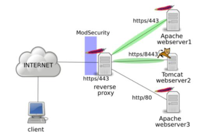

**Gabarito** : E 

**9. (FCC – TRT – 6ª Região (PE)/Analista Judiciário – TI/2012) Protocolos de rede podem ser classificados como "sem estados" (stateless) ou "com estado" (stateful). A este respeito é correto afirmar que** 

A) protocolos sem estados exigem que tanto cliente como servidor mantenham um histórico da conexão. 

B) o uso de cookies é uma maneira de contornar o fato de que HTTP é um protocolo com estados.

---

<!-- pagina: 51 -->

**André Castro Aula 01** 

C) protocolos sem estados têm a desvantagem de não admitir encapsulamento criptográfico. 

D) o uso de cookies é uma maneira de contornar o fato de que HTTP é um protocolo sem estados. 

E) protocolos com estados exigem que cada mensagem trocada entre cliente e servidor contenha informação respectiva ao estado da transação. 

#### **Comentários:** 

Vimos que o HTTP é um protocolo sem estados. Vale lembrar que o conceito de persistência é diferente do fato de não armazenar estado. Nesse sentido, uma alternativa é a utilização de cookies no lado do cliente para que o servidor possa obter algumas informações e tentar retomar alguns aspectos ou características do usuário com vistas a “simular” uma condição com estados. 

**Gabarito** : D 

**10. (FCC – TJ-AP/Analista Judiciário – TI/2014) O protocolo HTTPS (HyperText Transfer Protocol SecurE) é uma implementação elaborada a partir do protocolo HTTP, na qual se incorporou uma camada de segurança. O protocolo de segurança originalmente utilizado nessa camada é o** 

A) POP3 (Post Office Protocol). 

B) SMTP (Simple Mail Transfer Protocol). 

C) IMAP (Internet Message Access Protocol). 

D) SSL (Secure Sockets Layer). 

E) SSH (Secure Shell). 

#### **Comentários:** 

Conforme vimos, pode ser tanto SLL quanto TLS. 

**Gabarito** : D 

**11. (FCC – Câmara Municipal de São Paulo – SP/Consultor Técnico Legislativo – Informática/2014) Quando há incompatibilidade entre as versões do protocolo HTTP instaladas no cliente e no servidor, é retornado um código de estado 5xx, com uma mensagem como “O servidor não é compatível com a versão do protocolo HTTP usada na solicitação”.** 

#### **Comentários:** 

Entrando mais no detalhe, o código específico é o de número 505. Lembrando que o grupo 5xx corresponde a erros ou negativa por parte do servidor. 

**Gabarito** : C 

**12. (FCC – TRE-CE/Técnico Judiciário – Operação de Computador/2012) O protocolo HTTPS é uma implementação do protocolo HTTP utilizando um meio de comunicação seguro entre dois**

---

<!-- pagina: 52 -->

**André Castro Aula 01** 

**computadores, como por exemplo TLS/SSL. Por padrão, a porta TCP utilizada para a comunicação HTTPS é a porta** 

A) 80. 

B) 443. 

C) 993. 

D) 465. 

E) 512. 

#### **Comentários:** 

Mais uma questão bem tranquila, certo? A porta padrão do HTTP é 80 e a sua utilização de modo seguro se dá através da porta 443, ambos no protocolo TCP. 

**Gabarito** : B 

**13. (FCC – AL-SP/Agente Técnico Legislativo Especializado – Segurança de Redes/2010) Protocolos de rede podem ser classificados como "sem estados" (stateless) ou "com estado" (stateful). Um exemplo de protocolo "sem estados" é o protocolo** 

A) HTTP. 

B) FTP. 

C) SMTP. 

D) DHCP. 

E) NFS. 

#### **Comentários:** 

Pessoal, muito cuidado para não confundir o critério de ser com ou sem estados com o fato de ser persistente ou não (conexão). O HTTP, seja ele persistente ou não, sempre será sem estados ou stateless. 

**Gabarito** : A

---

<!-- pagina: 53 -->

**André Castro Aula 01** 

# **QUESTÕES COMENTADAS – HTTP - FGV** 

**1. FGV - 2024 - DATAPREV - ATI - Segurança Cibernética e Proteção de Dados** 

**O protocolo HTTP (HyperText Transfer Protocol) é utilizado para a comunicação na World Wide Web, permitindo a troca de informações entre clientes (navegadores) e servidores.** 

**Em uma correspondência do protocolo HTTP e o modelo OSI (Open Systems Interconnection), o HTTP poderá ser associado à camada** 

A) aplicação. 

B) enlace. 

C) eede. 

D) sessão. 

E) transporte. 

#### **Comentários:** 

Questão bem objetiva sobre a posição do HTTP no modelo OSI ou arquitetura TCP. 

**Gabarito: A** 

**2. (FGV - Tec (DPE RS)/DPE RS/Apoio Especializado/Suporte de TI/2023)** 

**Uma aplicação Web consiste em muitos componentes, entre eles navegadores e servidores. No contexto de transferência de informação e arquivos na Web, o protocolo de camada de aplicação que define o formato e a sequência das mensagens que são passadas entre o navegador e o servidor é o:** 

a)  RIP; 

b)  ARP; 

c)  DHCP; 

d)  NAT; 

e)  HTTP. 

#### **Comentários:** 

Questão introdutória sobre o HTTP. Sem muito o que acrescentar aqui, meus amigos.

---

<!-- pagina: 54 -->

**André Castro Aula 01** 

**Gabarito: E** 

**3. FGV - 2021 - Banestes - Analista em Tecnologia da Informação - Suporte e Infraestrutura** 

**O protocolo HTTP define um conjunto de métodos de requisição responsáveis por indicar a ação a ser executada para um dado recurso.** 

#### **Um método HTTP é denominado idempotente se:** 

A) as requisições em algum momento causam danos ou efeitos colaterais irreversíveis no servidor; 

==5460== 

B) as requisições com cabeçalhos e parâmetros diferentes causam uma mesma mudança no estado do recurso; 

C) toda requisição estabelecer um túnel para o servidor identificado pelo recurso de destino; 

D) o código de status for o mesmo entre requisições que aplicam modificações parciais em um recurso; 

E) uma requisição idêntica puder ser feita uma ou mais vezes em sequência com o mesmo efeito enquanto deixa o servidor no mesmo estado. 

#### **<u>Comentários:</u>** 

Na linha do que vimos, ao serem mantidos os parâmetros, não haverá alteração do estado do servidor. 

**Gabarito: E**

---

<!-- pagina: 55 -->

**André Castro Aula 01** 

# **QUESTÕES COMENTADAS – HTTP - CESGRANRIO** 

#### **1. CESGRANRIO - 2024 - UNEMAT - Analista de Sistemas** 

**Um desenvolvedor web está trabalhando em um projeto que envolve a transferência de dados do usuário através de um formulário on-line. Por questões de privacidade e segurança, ele precisa garantir que os dados submetidos pelos usuários não sejam expostos na URL do navegador.** 

**Nesse contexto, o método de requisição definido no protocolo HTTP que deve ser utilizado durante a transferência é o** ==5460== 

A) GET 

B) HEAD 

C) POST 

D) QUERY 

E) SUBMIT 

#### **Comentários:** 

Vimos que os dois principais métodos do HTTP são justamente o GET e o POST. O primeiro traz os parâmetros diretamente na URL, tendo uma abertura e exposição da informação. Enquanto o POST, faz as chamadas diretamente ao servidor e backend sem a devida exposição. 

**Gabarito:** C

---

<!-- pagina: 56 -->

**André Castro Aula 01** 

# **LISTA DE QUESTÕES – HTTP - CESPE** 

**1. CESPE / CEBRASPE - 2025 - PC-DF - Gestor de Apoio as Atividades Policiais Civis - Especialidade: Analista de Informática: Rede de Computadores** 

**Sítios HTTPS requerem a emissão de um certificado SSL/TLS por uma autoridade certificadora (CA), o qual é compartilhado com o navegador para estabelecer confiança e permitir a troca segura de dados criptografados.** 

**2. CESPE / CEBRASPE - 2025 - TRF - 6ª REGIÃO - Técnico Judiciário – Área: Apoio Especializado – Especialidade: Desenvolvimento de Sistemas de Informação** 

**Os sites web que utilizam o protocolo HTTPS fazem uso de criptografia de chave pública, de forma que os dados transmitidos na rede não possam ser lidos por quem os intercepte.** 

**3. CESPE / CEBRASPE - 2024 - TSE - Técnico Judiciário – Área: Apoio Especializado – Especialidade: Programação de Sistemas** 

**O HTTP usa o UDP como protocolo de transporte subjacente; assim, o cliente HTTP primeiro inicia uma conexão UDP com o servidor e, uma vez estabelecida tal conexão, os processos do navegador e do servidor acessam o TCP por meio de suas interfaces de socket para garantir a entrega dos pacotes.** 

**4. CEBRASPE (CESPE) - AFM (Pref Fortaleza)/Pref Fortaleza/Ciência da Computação, Informática, Processamento de Dados/2023** 

**HTPPs é a combinação do HTTP sobre a camada SSP (secure sockets layer), que é colocada entre a camada de aplicação e a camada de transporte, aceitando solicitações do navegador e enviando-as ao TCP (trasmission control protocol) para transmissão ao servidor.** 

#### **5. CESPE / CEBRASPE - 2023 - MPE-RO - Analista de Suporte Computacional** 

#### **A respeito de Internet e intranet, assinale a opção correta.** 

A) O dynamic HTML permite interatividade rápida, mas não permite modificação do conteúdo na página sem precisar recarregá-la. 

B) Navegadores web permitem, nativamente, a leitura de vários tipos de arquivo; em alguns casos, por meio de plug-ins, permitem também a leitura de arquivos que não são suportados nativamente.

---

<!-- pagina: 57 -->

**André Castro Aula 01** 

C) Os navegadores web se comunicam, geralmente, com servidores web usando o FTP. 

D) A principal diferença entre páginas da Internet e da intranet é o protocolo de acesso aos dados. 

E) A maioria dos navegadores web necessita de plug-ins para que o HTTPS seja suportado. 

**6. CESPE / CEBRASPE - 2022 - BNB - Analista de Sistemas - Desenvolvimento de Sistemas** 

**Usuários que recebem um código de status HTTP 4XX podem refazer a solicitação mesmo sem alterar nada e ter sucesso na próxima resposta.** 

**7. Cebraspe – Analista Judiciário – Tecnologia da Informação (TRT-AP/PA)/2022** 

#### **O cabeçalho do protocolo HTTP que contém o DNS do servidor é o** 

a) host. 

b) authorization. 

c) referer. 

d) location. 

e) server. 

**8. (CESPE – STJ/Analista Judiciário – Suporte em TI/2015) Uma forma de se melhorar o desempenho do acesso a páginas web frequentemente visitadas é armazenar-se o conteúdo dessas páginas para que sejam rapidamente carregadas em solicitações futuras, estando, entre os possíveis processos para executar essa tarefa, o proxy, ao qual serão encaminhadas todas as requisições de acesso a páginas web.** 

**9. (CESPE - TJ TRE MS/Apoio Especializado/Programação de Sistemas/2013) O elemento em que uma das partes de uma informação é armazenada como cadeia de texto na máquina do usuário e cuja função principal é a de manter a persistência de sessões HTTP é denominado** 

#### A) frame. 

B) Java Script. 

C) tag. 

D) cookie.

---

<!-- pagina: 58 -->

**André Castro Aula 01** 

#### E) XML. 

**10. (CESPE - TJ TRE MS/Apoio Especializado/Programação de Sistemas/2013) Com referência ao Hyper Text Transfer Protocol (HTTP) — protocolo de aplicação utilizado para o tratamento de pedidos e respostas entre cliente e servidor na Internet e com o qual, normalmente, são desenvolvidas as aplicações para a Web —, assinale a opção em que todas as expressões identificam métodos de requisição HTTP que devem ser implementados por um servidor HTTP 1.1 usado pelo cliente.** 

#### A) SOAP, WS, WSDL, UDDI 

B) TCP, IP, NETBIOS, UDP, IPX 

==5460== C) NFS, SMB, IPP, SMTP, POP3, IMAP,XMPP, SIP 

D) SET, GET, CONSTRUCTOR, DESTRUCTOR 

E) GET, HEAD, POST, PUT, DELETE, TRACE, OPTIONS 

**11. (CESPE - TJ TRT10/Apoio Especializado/Tecnologia da Informação/2013) O protocolo HTTP, que não armazena informações sobre o estado do cliente, classifica-se como do tipo stateless.** 

**12. (CESPE - TJ TRT10/Apoio Especializado/Tecnologia da Informação/2013) Um servidor HTTP consiste em um servidor de aplicações.** 

**13. (CESPE - TJ TRT10/Apoio Especializado/Tecnologia da Informação/2013) Ao receber uma requisição, o servidor procura pelo recurso requisitado e envia, ao cliente, uma resposta com um código, que pode iniciar-se por 1xx, que indica sucesso no recebimento da requisição; 2xx, que indica redirecionamento da requisição; 3xx, que informa erros acontecidos no cliente; e 4xx, que informa erros no servidor.** 

**14. (CESPE - TJ TRT10/Apoio Especializado/Tecnologia da Informação/2013) As estratégias usadas para diminuir o tráfego causado pelo grande número de acessos a páginas web podem ser do tipo cache web, que é implementado no cliente, no GET condicional ou na rede servidor Proxy Web.**

---

<!-- pagina: 59 -->

**André Castro Aula 01** 

**15. (CESPE – MPU/Analista Judiciário – Suporte e Infraestrutura/2013) Os servidores proxy criam um cache com as solicitações de cada usuário, de forma a otimizar consultas futuras de um mesmo usuário, sendo esse cache de uso exclusivo de seu respectivo usuário.** 

**16. (CESPE - TJ TRT10/Apoio Especializado/Tecnologia da Informação/2013) O código abaixo ilustra uma resposta de um servidor web.** 

**GET /internet/index.html HTTP/1.0 User-agente: Mozilla /4.5 [en] (WinNT; I) AcceptP: text/plain, text/html, image/gif, image/x-xbitmap, image/jpeg, image/pjpeg, image/png, */* Accept-Charset: isso-8859-1, *, utf-8 Accept-Enconding: gzip Accept-Language: em** 

**17. (CESPE - TJ TRT10/Apoio Especializado/Tecnologia da Informação/2013) O protocolo HTTP utiliza, por padrão, a porta 80 para tráfego seguro de dados, sendo o pacote de sincronismo da conexão o responsável por indicar o tipo de cifra que será utilizado na sessão.** 

**18. (CESPE - TJ TRT17/Apoio Especializado/Tecnologia da Informação/2013) Como maneira de se evitar o desenvolvimento de novos protocolos de camada de aplicação, diversas aplicações usam o HTTP como forma de transferir dados fim a fim na camada de aplicação.** 

**19. (CESPE - Tec MPU/Técnico Administrativo/Tecnologia da Informação e Comunicação/2013) O serviço HTTP é implementado sem estado, enquanto o HTTPS é sua versão stateful (com estado).** 

**20. (CESPE - Ana MPU/Tecnologia da Informação e Comunicação/Suporte e Infraestrutura/2013) A primeira versão do serviço HTTP utiliza conexões não persistentes; a persistência foi acrescentada na versão subsequente desse serviço.** 

**21. (CESPE – TRT(DF e GO)/Técnico Judiciário – Tecnologia da Informação/2013) Os servidores de HTTP mais utilizados atualmente são Apache HTTP Server, Internet Information Server e Enterprise Server.**

---

<!-- pagina: 60 -->

**André Castro Aula 01** 

**22. (CESPE – CNJ/Técnico Judiciário – Programação de Sistemas/2013) Se o endereço de página inicia com HTTPS, então os dados serão transmitidos por meio de uma conexão cifrada e a autenticidade do servidor e do cliente será verificada com o uso de certificados digitais.** 

**23. (CESPE – TCU/Analista de Controle Externo – TI/2007) O protocolo HTTP, definido nas RFCs 1945 e 2616, não permite a utilização de conexões persistentes.** 

**24. (CESPE – TRT – 17ª Região (ES)/Técnico Judiciário – TI/2013) HTTPS usa certificados digitais, requer o uso de TLS e utiliza a porta 443 por padrão.** 

**25. (CESPE – TRE-GO/Técnico Judiciário/2015) Na busca de um produto em uma loja virtual por meio de um webservice, quando o produto é encontrado, o protocolo HTTP retorna um HTTP/1.1 404, o que facilita o tratamento do pedido no programa cliente.** 

**26. (CESPE – TRE-GO/Técnico Judiciário – Programação de Sistemas/2015) Por meio do protocolo chave HTTP, é possível utilizar o método PUT para se criar um novo recurso de um webservice.** 

**27. (CESPE – TRE-GO/Técnico Judiciário – Programação de Sistemas/2015) Uma conexão entre um computador cliente a um computador considerado servidor, para visualizar uma página web, através do protocolo HTTP, é possível afirmar que será utilizado o protocolo de transporte TCP (transmission control protocol).** 

**28. (CESPE – TJDFT/Analista Judiciário – Suporte em TI/2015) A técnica de compressão não é recomendada ao se utilizar a versão 2 do HTTP sobre o protocolo TLS 1.2.** 

**29. (CESPE – TJDFT/Analista Judiciário – Suporte em TI/2015) Na implementação do HTTP versão 2 sobre o protocolo TLS 1.2, é mandatório desabilitar a renegociação da conexão.** 

**30. (CESPE – TJDFT/Analista Judiciário – Suporte em TI/2015) No HTTP, a técnica geral do controle de fluxo garante que não haja interferência entre as conexões independentes.**

---

<!-- pagina: 61 -->

**André Castro Aula 01** 

**Entretanto essa técnica foi abandonada na versão 2 do HTTP, que criou o conceito de WINDOW_UPDATE frame.** 

# **GABARITO** 

|**01**|**02**|**03**|**04**|**05**|**06**|
|---|---|---|---|---|---|
|**C**|**C**|**E**|**Anulada**|**B**|**E**|
|**07**|**08**|**09**|**10**|**11**|**12**|
|**A**|**C**|**D**|**E**|**C**|**E**|
|**13**|**14**|**15**|**16**|**17**|**18**|
|**E**|**C**|**E**|**E**|**E**|**C**|
|**19**|**20**|**21**|**22**|**23**|**24**|
|**E**|**C**|**C**|**C***|**E**|**C**|
|**25**|**26**|**27**||||
|**E**|**C**|**C**|**C**|**C**|**E**|

- **22 - Gabarito do professor: E**

---

<!-- pagina: 62 -->

**André Castro Aula 01** 

# **LISTA DE QUESTÕES – HTTP - FCC** 

**1. (FCC – TRT – 15ª Região/Analista Judiciário – TI/2015) Um serviço da internet utiliza diferentes protocolos, por exemplo, protocolos relacionados com a função de roteamento, transmissão de dados e transferência de hipertexto para efetivar a comunicação. Os respectivos protocolos, do conjunto (suitE) de protocolos TCP/IP, relacionados com as funções apresentadas, são:** 

A) IP, TCP e HTTP. 

B) TCP, FTP e HTML. 

C) IP, FTP e HTML. 

D) ARP, FTP e HTTP. 

E) TCP, IP e HTTP. 

**2. (FCC – TRT – 16ª Região (MA) /Técnico Judiciário – TI/2014) Os diversos protocolos do conjunto (suitE) TCP/IP são organizados em camadas de funcionalidade. Quando um usuário da internet realiza um acesso à página Web, ele está utilizando o protocolo da camada de Aplicação denominado** 

A) W W W. 

B) IMAP. 

C) HTTP. 

D) TCP. 

E) IP. 

**3. (FCC – TRT – 2ª Região (SP)/Técnico Judiciário – TI/2014) No modelo de referência de 4 camadas da suíte de protocolos TCP/IP, os protocolos Ethernet, HTTP e ICMP localizam-se, respectivamente, nas camadas** 

A) Internet, Apresentação e Interface de rede 

B) Interface de rede, Aplicação e Internet. 

C) Transporte, Internet e Interface de rede.

---

<!-- pagina: 63 -->

**André Castro Aula 01** 

D) Transporte, Aplicação e Enlace de dados. 

E) Física, Transporte e Enlace de dados. 

**4. (FCC – TRF – 4ª Região/Técnico Judiciário – TI/2014) Pedro, técnico em informática do TRF da 4ª Região, deve comprovar os seus conhecimentos sobre o modelo OSI identificando os protocolos às respectivas camadas do modelo. Assim, um correto relacionamento identificado por Pedro é:** 

A) FTP - Camada de Transporte. 

B) HTTP - Camada de Transporte. 

C) ICMP - Camada de Aplicação. 

D) HTTP - Camada de Aplicação. 

E) SNMP - Camada de Rede. 

**5. (FCC – TRF – 2ª Região/Analista Judiciário – Informática/2012) Sobre o protocolo HTTP, é correto afirmar:** 

A) Usa o TCP e o UDP como seus protocolos de transporte e presta serviço por default na porta 80. 

B) Em uma mensagem de requisição HTTP, a linha de cabeçalho User-agent: especifica o agente de usuário, isto é, o browser que está fazendo a requisição ao servidor. 

C) Quando utiliza conexões persistentes, cada conexão TCP é encerrada após o servidor enviar o objeto resposta ao cliente que fez a requisição. Cada conexão TCP transporta exatamente uma mensagem de requisição e uma mensagem de resposta. 

D) A resposta do servidor a uma requisição HTTP é dividida em três seções. A primeira é denominada cabeçalho (header) e contém informações do servidor sobre o recurso solicitado. A segunda seção é denominada corpo (body) e contém o recurso propriamente dito. A terceira seção, denominada rodapé (footer), contém informações de status da requisição e o relatório de erros, quando houver. 

E) Os únicos métodos (comandos) de requisição do protocolo HTTP são GET e POST. O status de retorno de número 404 do método HTTP indica que o serviço está indisponível. 

**6. (FCC – TCE-SP/Auxiliar de Fiscalização Financeira/2012) Sobre o protocolo HTTP, é correto afirmar:**

---

<!-- pagina: 64 -->

**André Castro Aula 01** 

A) Se um cliente solicita ao servidor o mesmo objeto duas vezes em um período de poucos segundos, o servidor responde dizendo que acabou de enviar o objeto ao cliente e não envia novamente o objeto. 

B) É implementado em dois programas: um programa cliente e outro servidor. Os dois programas, implementados em sistemas finais diferentes, conversam um com o outro por meio da troca de mensagens HTTP. O HTTP não define a estrutura dessas mensagens, mas define o modo como cliente e servidor as trocam. 

C) O HTTP usa o TCP como seu protocolo de transporte subjacente. O cliente HTTP primeiramente inicia uma conexão TCP com o servidor. Uma vez estabelecida a conexão, os processos do browser e do servidor acessam o TCP por meio de suas interfaces socket. 

D) Os servidores web implementam apenas o lado cliente do HTTP e abrigam objetos web, cada um endereçado por um URL. O Apache e o IIS são servidores web populares. 

E) O HTTP define como clientes web requisitam páginas web aos servidores, mas não define como eles as transferem aos clientes. 

**7. (FCC – MPE-AM/Agente de Apoio – Manutenção e Suporte de Informática/2013) HTTPS (HyperText Transfer Protocol SecurE) é um protocolo que combina o uso do HTTP com o** 

A) SSL e o TLS, a fim de prover conexões seguras. 

B) DES e AES, a fim de prover criptografia assimétrica. 

C) RSA, a fim de prover certificação digital por meio de criptografia simétrica. 

D) IDS e IPS, a fim de prover segurança contra invasores. 

E) IMAP e POP, a fim de prover comunicação segura. 

**8. (FCC – TRF – 1ª Região/Analista Judiciário – Área de Apoio Especializado/2014) O ...... recebe os pedidos HTTP na porta configurada e processa todos os pedidos da web que chegam, podendo distribuí-los. Os pedidos de objetos que podem ser armazenados no cache (informações estáticas que não mudam com frequência como páginas em HTML e imagens GIF) são processados pelo proxy. Os pedidos de objetos que não podem ser armazenados no cache (informações dinâmicas que mudam com frequênciA) são processados pelo servidor web de origem na porta configurada. Essa configuração pode ser feita para proteger um servidor intranet da Internet e reduzir a carga nos servidores web públicos mantidos na intranet, por exemplo, criando um front end para um servidor web. A lacuna é corretamente preenchida por** 

A) cache HTTP. 

B) acelerador HTTPS. 

C) proxy estático-dinâmico.

---

<!-- pagina: 65 -->

**André Castro Aula 01** 

D) filtro de logs. 

E) proxy reverso. 

**9. (FCC – TRT – 6ª Região (PE)/Analista Judiciário – TI/2012) Protocolos de rede podem ser classificados como "sem estados" (stateless) ou "com estado" (stateful). A este respeito é correto afirmar que** 

A) protocolos sem estados exigem que tanto cliente como servidor mantenham um histórico da conexão. 

B) o uso de cookies é uma maneira de contornar o fato de que HTTP é um protocolo com estados. 

<!-- Start of picture text -->
==5460== <!-- End of picture text -->

C) protocolos sem estados têm a desvantagem de não admitir encapsulamento criptográfico. 

D) o uso de cookies é uma maneira de contornar o fato de que HTTP é um protocolo sem estados. 

E) protocolos com estados exigem que cada mensagem trocada entre cliente e servidor contenha informação respectiva ao estado da transação. 

**10. (FCC – TJ-AP/Analista Judiciário – TI/2014) O protocolo HTTPS (HyperText Transfer Protocol SecurE) é uma implementação elaborada a partir do protocolo HTTP, na qual se incorporou uma camada de segurança. O protocolo de segurança originalmente utilizado nessa camada é o** 

A) POP3 (Post Office Protocol). 

B) SMTP (Simple Mail Transfer Protocol). 

C) IMAP (Internet Message Access Protocol). 

D) SSL (Secure Sockets Layer). 

E) SSH (Secure Shell). 

**11. (FCC – Câmara Municipal de São Paulo – SP/Consultor Técnico Legislativo – Informática/2014) Quando há incompatibilidade entre as versões do protocolo HTTP instaladas no cliente e no servidor, é retornado um código de estado 5xx, com uma mensagem como “O servidor não é compatível com a versão do protocolo HTTP usada na solicitação”.**

---

<!-- pagina: 66 -->

**André Castro Aula 01** 

**12. (FCC – TRE-CE/Técnico Judiciário – Operação de Computador/2012) O protocolo HTTPS é uma implementação do protocolo HTTP utilizando um meio de comunicação seguro entre dois computadores, como por exemplo TLS/SSL. Por padrão, a porta TCP utilizada para a comunicação HTTPS é a porta** 

A) 80. 

B) 443. 

C) 993. 

D) 465. E) 512. 

**13. (FCC – AL-SP/Agente Técnico Legislativo Especializado – Segurança de Redes/2010) Protocolos de rede podem ser classificados como "sem estados" (stateless) ou "com estado" (stateful). Um exemplo de protocolo "sem estados" é o protocolo** 

A) HTTP. 

B) FTP. 

C) SMTP. 

D) DHCP. 

E) NFS. 

# **GABARITO** 

|**01**|**02**|**03**|**04**|**05**|**06**|
|---|---|---|---|---|---|
|**A**|**C**|**B**|**D**|**B**|**C**|
|**07**|**08**|**09**|**10**|**11**|**12**|
|**A**|**E**|**D**|**D**|**C**|**B**|
|**13** **A**|**14**|**15**|**16**|**17**|**18**|

---

<!-- pagina: 67 -->

**André Castro Aula 01** 

# **LISTA DE QUESTÕES – HTTP - FGV** 

#### **1. FGV - 2024 - DATAPREV - ATI - Segurança Cibernética e Proteção de Dados** 

**O protocolo HTTP (HyperText Transfer Protocol) é utilizado para a comunicação na World Wide Web, permitindo a troca de informações entre clientes (navegadores) e servidores.** 

**Em uma correspondência do protocolo HTTP e o modelo OSI (Open Systems Interconnection), o HTTP poderá ser associado à camada** 

A) aplicação. 

B) enlace. 

C) eede. 

D) sessão. 

E) transporte. 

#### **2. (FGV - Tec (DPE RS)/DPE RS/Apoio Especializado/Suporte de TI/2023)** 

**Uma aplicação Web consiste em muitos componentes, entre eles navegadores e servidores. No contexto de transferência de informação e arquivos na Web, o protocolo de camada de aplicação que define o formato e a sequência das mensagens que são passadas entre o navegador e o servidor é o:** 

a)  RIP; 

b)  ARP; 

c)  DHCP; 

d)  NAT; 

e)  HTTP. 

**3. FGV - 2021 - Banestes - Analista em Tecnologia da Informação - Suporte e Infraestrutura** 

**O protocolo HTTP define um conjunto de métodos de requisição responsáveis por indicar a ação a ser executada para um dado recurso.**

---

<!-- pagina: 68 -->

**André Castro Aula 01** 

#### **Um método HTTP é denominado idempotente se:** 

A) as requisições em algum momento causam danos ou efeitos colaterais irreversíveis no servidor; 

B) as requisições com cabeçalhos e parâmetros diferentes causam uma mesma mudança no estado do recurso; 

C) toda requisição estabelecer um túnel para o servidor identificado pelo recurso de destino; 

D) o código de status for o mesmo entre requisições que aplicam modificações parciais em um recurso; 

E) uma requisição idêntica puder ser feita uma ou mais vezes em sequência com o mesmo ==5460== efeito enquanto deixa o servidor no mesmo estado. 

# **GABARITO** 

|**01**|**02**|**03**|
|---|---|---|
|**A**|**E**|**E**|

---

<!-- pagina: 69 -->

**André Castro Aula 01** 

# **LISTA DE QUESTÕES – HTTP - CESGRANRIO** 

#### **1. CESGRANRIO - 2024 - UNEMAT - Analista de Sistemas** 

**Um desenvolvedor web está trabalhando em um projeto que envolve a transferência de dados do usuário através de um formulário on-line. Por questões de privacidade e segurança, ele precisa garantir que os dados submetidos pelos usuários não sejam expostos na URL do navegador.** 

**Nesse contexto, o método de requisição definido no protocolo HTTP que deve ser utilizado durante a transferência é o** 

==5460== A) GET B) HEAD C) POST D) QUERY E) SUBMIT

---

<!-- pagina: 70 -->

**André Castro Aula 01** 

# **GABARITO** 

#### 1. C

---

<!-- pagina: 71 -->

**André Castro Aula 01** 

# **<mark>SSL (S</mark> ECURITY** **<mark>S</mark> OCKET** **<mark>L</mark> AYER** **<mark>)</mark> E** **<mark>TLS (T</mark> RANSPORT** **<mark>L</mark> AYER** **<mark>S</mark> ECURITY** **<mark>)</mark>** 

Este é um assunto cobrado recorrentemente em concursos que contém a disciplina de segurança e vezes não é mencionado no edital ser um e recurso de por explicitamente por protocolo segurança presente em vários outros protocolos e serviços. 

O protocolo SSL surgiu a partir da necessidade de se obter uma comunicação segura em meios compartilhados como a Internet. Em termos práticos, o objetivo era possibilitar a criação de um meio suficientemente seguro para garantir a confidencialidade de transações bancárias que são a base para o comércio eletrônico. Nesse sentido, investiu-se pesado em métodos de criptografia para criação desses túneis. 

Ao longo do tempo, surgiu então o sucessor do SSL, conhecido como TLS, com algumas diferenças que mencionaremos em momento oportuno. Para termos uma ideia cronológica da evolução deste protocolo, vamos ver a figura a seguir: 

---

<!-- pagina: 72 -->

**André Castro Aula 01** 

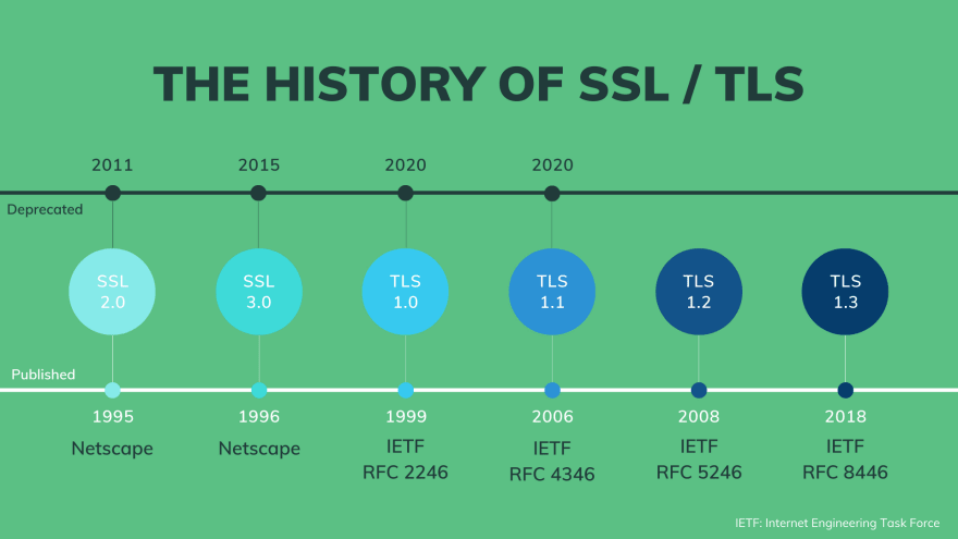

**CESPE / CEBRASPE - 2020 - Ministério da Economia - Tecnologia da Informação - Segurança da Informação e Proteção de Dados** 

**Tanto o protocolo TLS quanto o SSL, seu sucessor, protegem grande parte das comunicações seguras na Internet, apesar de uma vulnerabilidade na versão 3.0 do TLS permitir a execução de um ataque denominado poodle.** 

#### **Comentários:** 

O protocolo SSL e seu sucessor TLS protegem grande parte das comunicações seguras através da internet. Em 14 de outubro de 2014, pesquisadores do Google divulgaram uma vulnerabilidade na versão 3.0 do SSL que permite a execução de um ataque denominado POODLE. 

O ataque permite o roubo de cookies em conexões HTTPS, o que permite um atacante logar em sites como se fosse a vítima. 

**Gabarito** : E 

## **SSL** 

Falando agora especificamente das características do SSL, é importante destacarmos que ele permite o envio de informações de forma segura até um destino específico, agregando recursos de autenticidade, integridade e confidencialidade.

---

<!-- pagina: 73 -->

**André Castro Aula 01** 

O intuito de sua criação era criar uma camada de segurança para que as aplicações como HTTP, POP3 e SMTP pudessem ter tais recursos. Assim, criou-se o SSL de tal modo que fosse independentemente do tipo de protocolo utilizado na camada da aplicação e que pudesse rodar sobre as camadas mais inferiores. Por esse motivo, temos que o **SSL** se posiciona em uma **camada intermediária** entre as camadas de **aplicação e transporte** da arquitetura **TCP/IP** conforme imagem abaixo: 

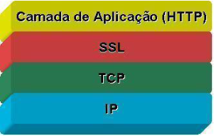

#### **CESPE / CEBRASPE - 2021 - PC-SE - Agente de Polícia Judiciária** 

**Se Paulo usasse o browser para acessar sua caixa de emails no órgão por meio do protocolo SSL (Secure Sockets Layer), que opera na camada de rede da pilha de protocolos TCP/IP, tal protocolo garantiria a segurança dos seus dados, diminuindo riscos de ataque aos seus dispositivos, de modo que o invasor não teria acesso aos arquivos do usuário.** 

#### **Comentários:** 

Conforme vimos, ele não fica localizado na camada de rede, mas sim, em uma camada intermediária entre a aplicação e transporte. 

**Gabarito** : E 

**VUNESP - 2019 - Prefeitura de Itapevi - SP - Analista em Tecnologia da Informação e Comunicação** 

**O Secure Sockets Layer (SSL) e o seu sucessor Transport Layer Security (TLS) têm o objetivo de proteger a comunicação realizada pelos serviços na Internet. Considerando a arquitetura do conjunto de protocolos TCP/ IP, o SSL/TLS pertencem à camada de** 

A) Aplicação. 

B) Apresentação. 

C) Redes. 

D) Sessão. 

E) Transporte. 

**Comentários:**

---

<!-- pagina: 74 -->

**André Castro Aula 01** 

Muita atenção aqui pessoal. A VUNESP considerou o cenário de se ter o TLS/SSL na camada de aplicação. Sabemos que o correto é em uma camada intermediária. 

**Gabarito** : A (Gabarito do professor: anulação) 

**FCC - 2019 - SANASA Campinas - Analista de Tecnologia da Informação - Suporte de Infraestrutura TI** 

**No âmbito da segurança de dados em redes de computadores, o Secure Sockets Layer - SSL realiza suas tarefas por meio de quatro protocolos em duas camadas. Considerando o modelo TCP, um desses protocolos, o Record Protocol, transporta mensagens dos outros três, assim como os dados −mensagens payload - provenientes da camada de** 

- A) transporte para a camada de rede. 

- ==5460== 

- B) aplicação para a camada de transporte. 

- C) rede para a camada de enlace. 

- D) enlace para a camada de aplicação. 

- E) rede para a camada de aplicação. 

#### **Comentários:** 

Agora sim temos uma questão melhor elaborada, considerando o fluxo dos dados na pilha de protocolos, saindo da aplicação para a camada de transporte. 

**Gabarito** : B 

O desenvolvimento original foi realizado pela Netscape, chegando a desenvolver três versões do protocolo. 

Assim, um exemplo de utilização de protocolo é através das comunicações WEB via HTTP de modo seguro, utilizando o SSL. Essas comunicações passam a funcionar em uma porta diferente e são chamadas de HTTPS. 

**CESPE / CEBRASPE - 2022 - Petrobras - Analista de Sistemas – Engenharia de Software O HTTPS é uma junção do HTTP com o SSL (secure sockets layers).** 

#### **Comentários:** 

Questão bem básica pessoal, mas vejam que ainda é cobrado a mera conjunção do HTTP com SSL, formando o HTTPS. 

**Gabarito** : C 

Uma característica do SSL é ser transparente ao usuário 

Ao trazermos os principais objetivos a serem alcançados pelo SSL, podemos listar: 

- **Autenticação entre clientes e servidores;** 

- **Garantia da Integridade dos dados:** (caso estes sejam alterados, pode-se detectar facilmente); 

**DataPrev (Perfil 3: Desenvolvimento de Software) Segurança da Informação - 2026 (Pós-Edital)**

---

<!-- pagina: 75 -->

**André Castro Aula 01** 

- **Garantia da Confidencialidade:** As informações transmitidas não podem ser interceptadas e interpretadas devido ao uso da criptografia, devendo ser lida apenas pelo destinatário que possui a chave de sessão. 

Desse modo, diz-se que o SSL não é um protocolo simples e único, mas sim um conjunto de protocolos auxiliares que atuam em conjunto em prol dos objetivos acima. Esse conjunto de protocolos pode ser dividido em duas camadas: 

- **Camada de segurança e integridade dos dados:** SSL Record; 

- **Camada de conexão SSL:** SSL Handshake Protocol, SSL Change Cipher Spec Protocol e SSL Alert Protocol. 

Assim, para termos um aspecto visual da estrutura do protocolo, podemos analisar a imagem a seguir: 

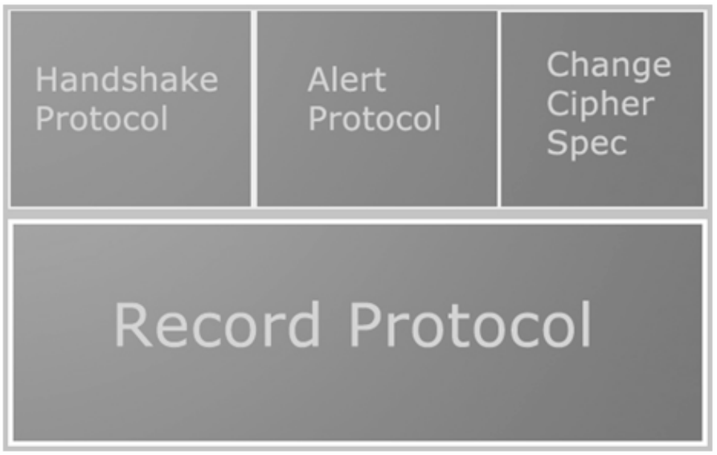

Falando um pouco sobre cada um dos protocolos: 

- **Handshake Protocol** – Responsável pelo estabelecimento da comunicação segura e autenticação das partes, com a escolha dos algoritmos de criptografia. Falaremos mais detalhadamente a seguir. 

- **Alert Protocol** – É o protocolo responsável pelo controle do protocolo através da troca de mensagens vinculadas ao funcionamento e transmissão de dados na conexão. Faz algo semelhante ao protocolo ICMP em relação ao IP. Possui duas identificações clássicas: “Warning” e “Fatal”. Ao ser enviado uma mensagem do tipo FATAL, a transmissão é interrompida imediatamente. Possui uma estrutura de dois bytes em que o primeiro é o tipo da falha e o segundo diz respeito ao alerta ou erro ocorrido. 

- **Change Cipher Spec** – É constituído por um tipo de mensagem que caracteriza um marco onde, a partir dessa mensagem, toda comunicação será criptografada conforme negociações feitas no estabelecimento da comunicação. É uma mensagem de duas vias,

---

<!-- pagina: 76 -->

**André Castro Aula 01** 

onde ambas as partes precisam emitir essa mensagem. Assim, diz-se que a sessão SSL de fato está aberta e será utilizado o RECORD PROTOCOL. 

- **Record Protocol** – Protocolo responsável pelo encapsulamento dos dados. Esse protocolo recebe os dados abertos da camada superior, encapsula, encripta e/ou adiciona o Message Authentication Codes (MACs) para garantir a segurança. É nessa fase que percebemos a total independência dos protocolos. 

Importante mencionar que o algoritmo aqui utilizado é simétrico, conforme princípios de criptografia, além da capacidade de se comprimir as mensagens. 

**CESPE / CEBRASPE - 2021 - SERPRO - Analista - Especialização: Desenvolvimento de Sistemas** 

**Conexões entre producers e consumers suportam mecanismos de autenticação capazes de criptografar com SSL.** 

#### **Comentários:** 

O processo de autenticação entre os pares é a base do processo de estabelecimento do túnel seguro pessoal. Só lembrando aqui que producers são os servidores, e os consumers são os clientes. Então, tem-se, de fato, um modelo CLIENTE-SERVIDOR. 

**Gabarito** : C 

#### **VUNESP - 2019 - Câmara de Piracicaba - SP - Administrador de Rede** 

**Um site disponibiliza comunicação segura via SSL/TLS, no entanto, faz uso de um certificado autoassinado ao invés de um assinado por uma entidade confiável. Por conta disso, o acesso ao site sob essas condições viola o atributo de** 

- A) autenticidade. 

- B) confidencialidade. 

- C) disponibilidade. 

- D) integridade. 

E) irretratabilidade. 

#### **Comentários:** 

É muito mais uma questão de criptografia do que de TLS/SSL. Uma vez que a ausência de uma infraestrutura de certificados, tendo, portanto, um certificado autoassinado, gera problemas de autenticidade. 

É como se você mesmo emitisse seu próprio passaporte. Ou seja, que validade tem esse passaporte emitido por vocês mesmo? 

**Gabarito** : A 

---

<!-- pagina: 77 -->

**André Castro Aula 01** 

O estabelecimento de uma conexão SSL se dá em etapas. Toda comunicação começa com o **HANDSHAKE PROTOCOL.** Detalhando um pouco mais essa fase, temos que essas etapas permitem a definição de algoritmos para geração de chaves de sessão. As etapas são: 

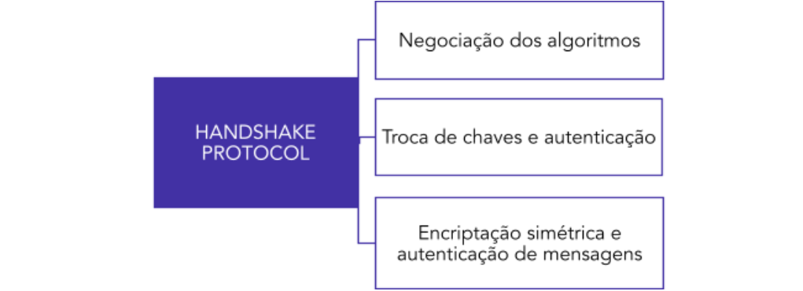

1. **Negociação dos Algoritmos** – Busca-se definir qual algoritmo é **suportado por ambos** e será utilizado. A tendência é escolher sempre o algoritmo mais robusto. O cliente faz a requisição da comunicação segura e o servidor responde com uma lista de algoritmos suportados. 

2. **Troca de Chaves e Autenticação** – Após a ciência e definição pelo servidor do algoritmo, **ambos trocam chaves** para realizarem a **autenticação entre si** . Nesse primeiro momento, utiliza-se algoritmos de criptografia assimétrica como RSA, Diffie-Hellman, entre outros. Aplica-se aqui o conceito de certificado digital por parte do servidor com todas as informações inerentes a essa tecnologia. 

3. **Encriptação simétrica e autenticação das mensagens** – A partir de então as mensagens utilizam funções HASH para autenticação, garantindo assim a integridade, segurança e autenticação. 

Traduzindo em termos de fluxo a dinâmica apresentada, vejamos a imagem a seguir: 

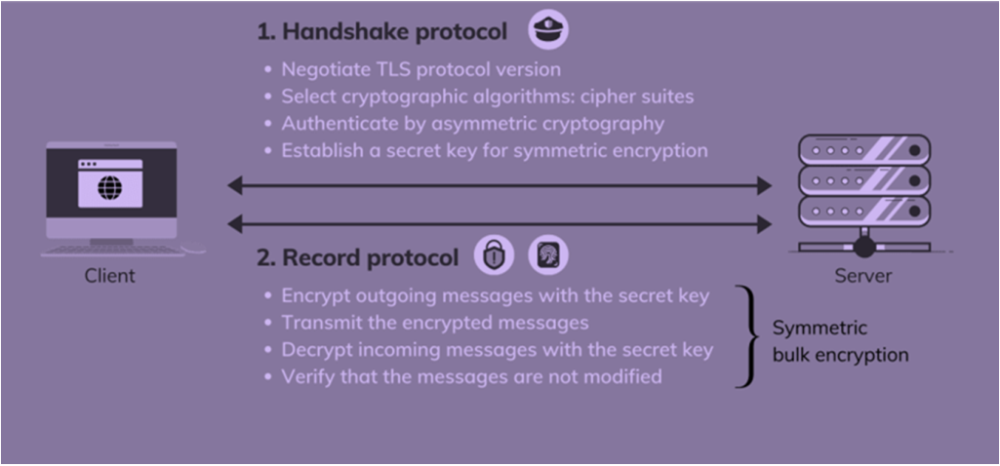

---

<!-- pagina: 78 -->

**André Castro Aula 01** 

Uma outra forma de enxergarmos o tráfego é o seguinte: 

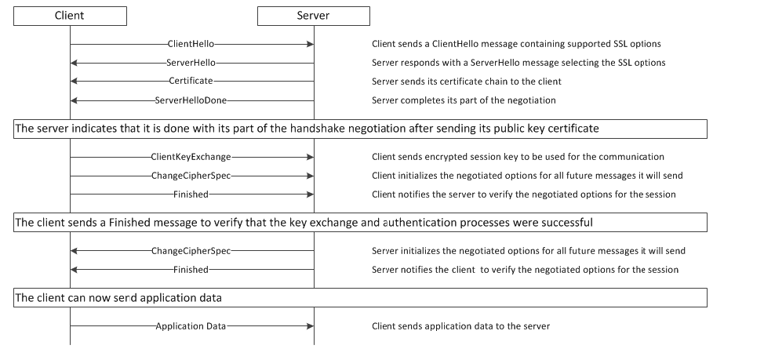

Por fim, trazendo um detalhamento ainda maior, temos o processo completo com a indicação, inclusive, dos parâmetros trocados e negociados em cada uma das etapas: 

Ainda, com vistas a materializar ainda mais essa dinâmica, podemos perceber em um cenário real de captura de pacotes por meio do Wireshark, o respectivo fluxo: 

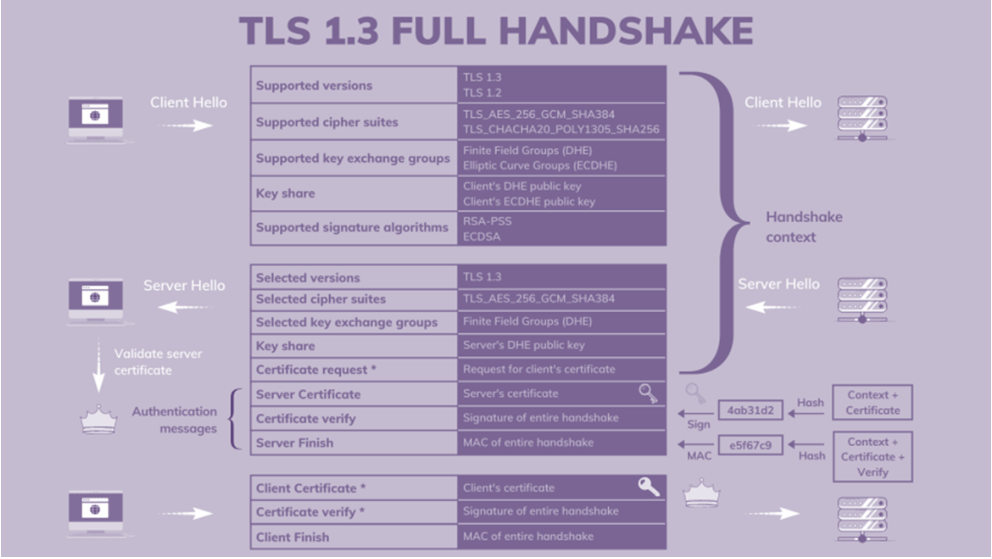

Para esgotarmos as formas de visualização e entendimento de tráfego, temos agora uma extração direta do Wireshark, ferramenta de captura de pacotes, que demonstra, conforme grifos em amarelo, cada uma das mensagens trafegadas nesse processo:

---

<!-- pagina: 79 -->

**André Castro Aula 01** 

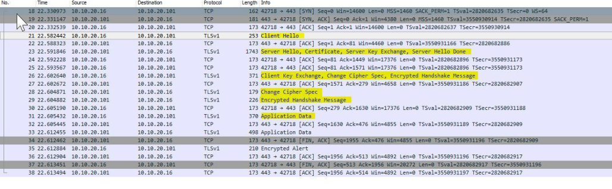

**FCC - 2019 - TRF - 4ª REGIÃO - Analista Judiciário - Infraestrutura em Tecnologia da Informação** 

**Considerando o recurso representado na figura, utilizado para proteger as comunicações entre um site, host ou servidor e os usuários finais que estão se conectando (ou entre duas máquinas em um relacionamento cliente-servidor), as lacunas I, II e III são correta e respectivamente preenchidas com:** 

A) plug-in VPN instalado −conexão VPN −com a chave privada do usuário. 

B) Servidor proxy habilitado −requisição cache −enviando o IP legítimo.

---

<!-- pagina: 80 -->

**André Castro Aula 01** 

C) serviço HTTP instalado −conexão VPN −criando um túnel com o protocolo handshake. 

D) certificado SSL instalado −conexão SSL −com um certificado SSL válido. 

E) código da sua chave privada −requisição de criptografia −com a chave pública do usuário. 

#### **Comentários:** 

Primeira coisa pessoal, é sem dúvida, realizar o acesso entregando o certificado SSL da origem para checagem e validação da identidade. A partir do certificado e das trocas de chaves, tem-se o estabelecimento da conexão SSL. Nesse processo de estabelecimento de conexão, o servidor também deve enviar seu certificado SSL para confirmação. 

**Gabarito** : D 

#### **CESPE/FUB/2015** 

**O protocolo SSL (secure socket layer) é utilizado em diversas aplicações TCP/IP para que se aumente a segurança na transmissão de dados. Ele é composto por protocolos base e auxiliares, tais como o SSL Record Protocol, responsável pelo transporte de informações autenticada e encriptada.** 

#### **Comentários:** 

Vimos que são exatamente esses os objetivos e as características do protocolo SSL. Relembrando das diversas camadas, temos: 

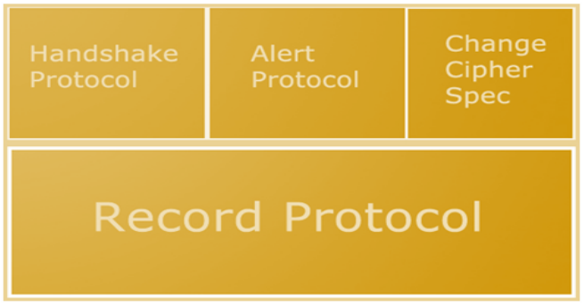

De fato, a camada SSL Record Protocol é responsável pelas funções aqui elencadas. 

**Gabarito** : C 

---

<!-- pagina: 81 -->

**André Castro Aula 01** 

## **TLS** 

Conforme vimos anteriormente, o SSL foi desenvolvido pela Netscape. Trazendo o desenvolvimento dessa solução de modo independente de plataforma, o IETF assumiu tal responsabilidade, renomeando, assim, para TLS. Este foi baseado na versão 3.0 do protocolo SSL. 

Atualmente não se faz tanto essa distinção, sempre nos referenciando ao conjunto de ambos: SSL/TLS. Isso se deve por não haver uma distinção substancial destes protocolos. 

Agora um fato muito importante para prova: 

Estes dois protocolos **não são compatíveis** , isto é, eles não interoperam entre si. 

Abordando então as diferenças entre esses protocolos, podemos citar: 

- O TLS tem a capacidade de trabalhar em portas diferentes e usa algoritmos de criptografia mais robustos como o HMAC, enquanto o SSL suporta apenas o MAC. 

- O TLS, quando utilizado em infraestrutura de chaves públicas, pode ser utilizado por uma autoridade intermediária, não necessitando recorrer à raiz de um Autoridade de Certificação como o SSL. 

Ainda pessoal, quero trazer para vocês um comparativo sobre os avanços do TLS 1.3 em relação ao 1.2. Vejamos a tabela comparativa a seguir: 

|**Novidades**|**TLS 1.3**|**TLS 1.2**|
|---|---|---|
|Mecanismo de Troca de Chave Segura|(EC)DHE >> Encaminhamento do segredo|RSA, EC(DH), EC(DHE)|
|Desempenho do HANDSHAKE|Processos resumidos como 1-RTT ou 0-RTT|2-RTT|
|Encriptação Simétrica mais Segura e Simplifcada|Somente AEAD AES 256 com SHA-384|AEAD, CBC, RC4, 3DES AES 256 com SHA-256|
|Assinatura mais Robusta|Assinatura cobre todo o processo de HANDSHAKE|Cobria apenas parte do processo|

---

<!-- pagina: 82 -->

**André Castro Aula 01** 

Melhor algoritmo de Curvas edDSA ECDSA Elípticas 

**CESPE / CEBRASPE - 2021 - TCE-RJ - Analista de Controle Externo - Especialidade: Tecnologia da Informação** 

**O algoritmo criptográfico RC4, cifra de fluxo com tamanho de chave variável, é utilizado nos padrões SSL/TLS (secure socket layer / transport layer security) definidos para a comunicação entre programas navegadores e servidores web.** 

#### **Comentários:** 

Vejam que o RC4 aparece em nossa tabela na versão 1.2, certo pessoal? Agora, realmente, a 1.3 já não está considerando, tendo ele sido substituído. 

**Gabarito** : C 

**FGV - 2018 - Câmara de Salvador - BA - Analista de Tecnologia da Informação** 

**No contexto do protocolo TLS, analise as afirmativas a seguir.** 

**I. Os parâmetros criptográficos usados pelo canal seguro são produzidos pelo sub-protocolo de handshake durante o estabelecimento da conexão entre o cliente e o servidor.** 

**II. O protocolo suporta dois tipos de troca de chaves: (EC)DHE e PSK com (EC)DHE.** 

**III. O protocolo é uma evolução do SSL e opera na camada de redes.** 

**Está correto somente o que se afirma em:** 

**A I;** 

**B II;** 

**C III;** 

**D I e II;** 

**E I e III.** 

#### **Comentários:** 

Vamos aos itens: 

I) Importante lembrar do fluxo estabelecido no HANDSHAKE conforme imagem ao final dessa questão. **CORRETO** 

II) Conforme vimos em nossa tabela, sendo as práticas associadas ao TLS 1.2 e 1.3. Apenas reforçando que o protocolo suporta dois tipos de troca de chaves: (EC)DHE e PSK com (EC)DHE. (EC)DHE é um acrônimo para (Elliptic Curve) Diffie-Hellman Ephemeral, um protocolo de troca de chaves que proporciona segurança de comunicação entre duas partes. PSK com (EC)DHE se refere a Pre-Shared Key com (Elliptic Curve) Diffie-Hellman Ephemeral, que é uma variante que

---

<!-- pagina: 83 -->

**André Castro Aula 01** 

utiliza uma chave pré-compartilhada em conjunto com o (EC)DHE para autenticação e troca de chaves. **CORRETO** 

III) O TLS continua atuando no mesmo contexto de camada intermediária que o SSL, não havendo quaisquer mudanças em seu posicionamento. **INCORRETO** 

**Gabarito** : D 

**FCC - 2019 - Prefeitura de Manaus - AM - Assistente Técnico de Tecnologia da Informação - Suporte** 

**O TLS/SSL é utilizado atualmente, em grande parte, nos serviços de comunicação na internet para prover segurança da informação na rede. Para prover a segurança, o TLS/SSL utiliza o esquema de chave** 

- A) pública para criptografar os dados transmitidos. 

- B) compartilhada para autenticar o computador remoto. 

- C) privada para autenticar o computador remoto. 

- D) assimétrica para criptografar os dados transmitidos.

---

<!-- pagina: 84 -->

**André Castro Aula 01** 

E) pública para autenticar o computador remoto. **Comentários:** 

Conforme vimos, são utilizados os dois padrões: 

1 – Criptografia assimétrica para autenticação dos pares. 

2 – Criptografia simétrica para tráfego dos dados 

**Gabarito** : E 

#### **CESPE – TCU/Auditor Federal de Controle Externo/2010** 

**A confidencialidade dos votos não será violada pela captura de tráfego na Internet, sem que sejam quebradas as proteções oferecidas pelo protocolo TLS/SSL.** 

#### **Comentários:** 

Conforme vimos, ainda que os dados sejam interceptados, dependerá ainda da quebra da criptografia para que seja possível decriptar as mensagens criptografadas em uma comunicação TLS/SSL. 

**Gabarito** : C 

**CESPE / CEBRASPE - 2021 - CODEVASF - Analista em Desenvolvimento Regional - Tecnologia da Informação** 

**Para atuarem como terminadores SSL, os balanceadores de carga possuem capacidade de suportar certificados do tipo wildcard, o que evita o uso de uma grande quantidade de certificados.** 

#### **Comentários:** 

Os certificados wildcards permitem trabalhar com subdomínio curinga, racionalizando a quantidade de certificados emitidos para um mesmo superdomínio. Assim, ao invés de ficar gerando um certificado para cada subdomínio, pode-se gerar um único wildcard para todo o domínio utilizado. 

**Gabarito** : C 

Para fins de curiosidade, deixo para vocês uma análise dos principais browsers em relação aos respectivos suportes das versões 1.2 e 1.3 do TLS, respectivamente:

---

<!-- pagina: 85 -->

**André Castro Aula 01** 

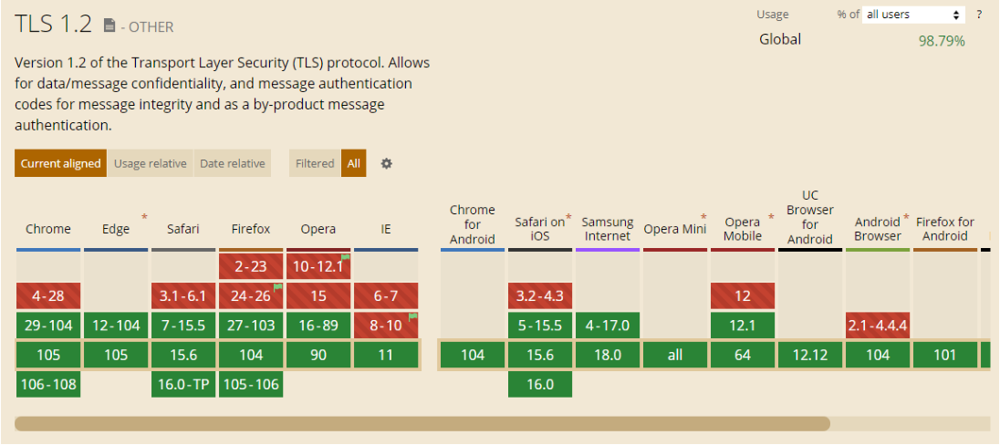

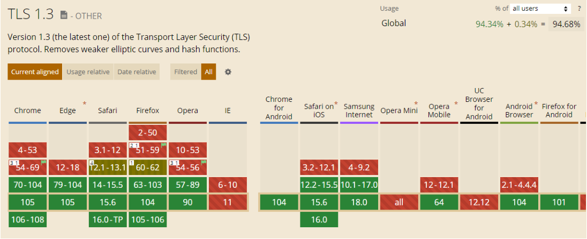

## **mTLS – Mutual TLS** 

Pessoal, estamos diante de um assunto que já tangenciamos indiretamente no contexto de nossas aulas sobre Mecanismos de Segurança ao falarmos de Túneis seguros, especificamente, o TLS. Sendo assim, mTLS, ou Mutual TLS, nada mais é do que um protocolo de autenticação mútua que usa o Transport Layer Security (TLS) para proteger a comunicação entre dois pontos finais de uma rede. O mTLS é uma extensão do TLS que adiciona autenticação mútua às duas pontas da conexão. 

O mTLS funciona da seguinte forma:

---

<!-- pagina: 86 -->

**André Castro Aula 01** 

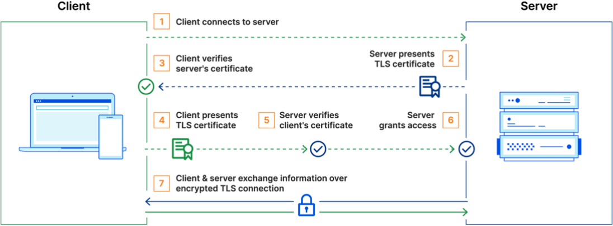

- O cliente se conecta ao servidor. 

- O servidor apresenta seu certificado TLS ao cliente. 

- O cliente verifica o certificado do servidor. 

- Se o certificado do servidor for válido, o cliente apresenta seu próprio certificado TLS ao servidor. 

- O servidor verifica o certificado do cliente. 

- Se o certificado do cliente for válido, a conexão TLS é estabelecida e os dados são criptografados. 

O mTLS oferece uma série de benefícios de segurança, incluindo: 

**a) Autenticação mútua:** O mTLS garante que ambas as pontas da conexão sejam autenticadas, o que ajuda a prevenir ataques de roubo de sessão. 

**b) Criptografia de ponta a ponta:** O mTLS criptografa todos os dados transmitidos entre as duas pontas da conexão, o que ajuda a proteger contra-ataques de interceptação de dados. 

**c) Identificação de origem:** O mTLS permite que as duas pontas da conexão identifiquem a origem uma da outra, o que pode ser útil para fins de auditoria e conformidade. 

O mTLS é usado em uma variedade de cenários, incluindo: 

**I. Integrações de API:** O mTLS pode ser usado para proteger as comunicações entre APIs de diferentes organizações. 

**II. Segurança de aplicativos:** O mTLS pode ser usado para proteger as comunicações entre aplicativos e servidores. 

**III. Segurança de rede:** O mTLS pode ser usado para proteger as comunicações entre dispositivos em uma rede.

---

<!-- pagina: 87 -->

**André Castro Aula 01** 

Para implementar o mTLS, os dois pontos finais da conexão devem ter certificados TLS válidos. Os certificados TLS podem ser obtidos de uma Autoridade de Certificação (CA) via alguma Infraestrutura de Chaves Públicas – ICP. 

## **OpenSSL** 

O OpenSSL é a implementação em código aberto dos padrões estudados anteriormente. Muita atenção, pois, apesar do nome, o OpenSSL também suporta o TLS. 

A sua codificação é escrita em linguagem C. Por ser um código aberto, visa sempre integrar os mais diversos protocolos e linguagens. Pode-se utilizar o Wrapper que permite a integração com várias outras linguagens. Atualmente se encontra na versão 1.0.2. 

Possui suporte a uma gama de algoritmos de criptografia, conforme listagem abaixo: 

- **Algoritmos simétricos:** AES (128,192 e 256), Blowfish, Camellia, SEED, CAST128, DES, IDEA, RC2, RC4, RC5, Triple DES, GOST 28147-89 

- **Algoritmos assimétricos:** RSA, DSA, Diffie–Hellman key exchange, Elliptic curve, GOST R 34.10-2001 

● **Funções HASH:** MD5, MD4, MD2, SHA-1, SHA-2, RIPEMD-160, MDC-2, GOST R 34.11-94 Suporta ainda outros protocolos agregados como o S/MIME, bastante utilizado para assinatura e cifragem de mensagens de e-mail. 

**CESPE – STF/Analista Judiciário – Suporte em Tecnologia da Informação/2013** 

**O OpenSSL usa algoritmos de hash, como o SHA1 e MD5.** 

#### **Comentários:** 

Em regra, temos que o OpenSSL suporta uma grande diversidade de algoritmos conforme vimos, entre eles SHA1 e MD5. 

**Gabarito** : C 

**CESPE / CEBRASPE - 2019 - TJ-AM - Analista Judiciário - Analista de Sistemas** 

**O comando openssl dgst -sha256 file.txt gera a assinatura digital do usuário dgst com saída no arquivo file.txt.** 

**Comentários:** 

**DataPrev (Perfil 3: Desenvolvimento de Software) Segurança da Informação - 2026 (Pós-Edital)**

---

<!-- pagina: 88 -->

**André Castro Aula 01** 

De fato, dgst faz parte da sintaxe do comando, não tendo relação com o usuário. Sintaxe: $ openssl dgst [hash function] [display options] -out file.dgst file.input Fonte:https://www.iit.comillas.edu/palacios/seguridad/openssl.pdf **Gabarito** : E 

#### **CESPE / CEBRASPE - 2019 - TJ-AM - Analista Judiciário - Analista de Sistemas** 

**O comando openssl genpkey -out myprivkey.pem -algorithm rsa 2048 gera uma chave privada no arquivo myprivkey.pem.** 

#### **Comentários:** 

O genpkey - é um comando padrão passado à ferramenta openssl que tem a função de GERAÇÃO DE CHAVE PRIVADA ou parâmetros. 

**Gabarito** : C

---

<!-- pagina: 89 -->

**André Castro Aula 01** 

# **QUESTÕES COMENTADAS - SSL E TLS - CESPE** 

**1. CESPE / CEBRASPE - 2025 - TRF - 6ª REGIÃO - Analista Judiciário – Área: Apoio Especializado – Especialidade: Governança e Gestão de Tecnologia da Informação** 

**No mecanismo de handshake do TLS 1.3, o início da sessão se dá quando o servidor envia uma mensagem Server Hello, acompanhada de um número randômico, e estabelece o algoritmo simétrico e o tamanho da chave.** 

#### **Comentários:** 

Inicia-se o processo, após o estabelecimento da conexão TCP, com a mensagem ClientHello e não ServerHello. 

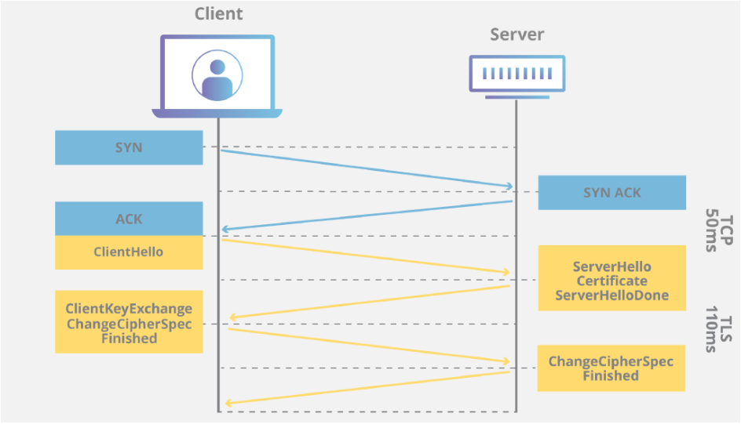

**Gabarito: E** 

**2. CESPE / CEBRASPE - 2025 - PC-DF - Gestor de Apoio as Atividades Policiais Civis - Especialidade: Analista de Informática: Rede de Computadores** 

**O handshake TLS é mais lento e complexo que o handshake SSL, que, por sua vez, possui menos etapas, estabelecendo uma conexão mais rápida que aquele.** 

#### **Comentários:** 

O TLS tem um handshake mais eficiente e seguro quando comparado ao SSL, mesmo que envolva algumas etapas extras. Além disso, o SSL já está obsoleto e não deve ser mais utilizado.

---

<!-- pagina: 90 -->

**André Castro Aula 01** 

**Gabarito: E** 

**3. CESPE / CEBRASPE - 2025 - PC-DF - Gestor de Apoio as Atividades Policiais Civis - Especialidade: Analista de Informática: Rede de Computadores** 

**O serviço de compressão de dados é obrigatório na implementação de segurança de redes com o SSL (secure sockets layer).** 

#### **Comentários:** 

O SSL não exige compressão obrigatória. A compressão era opcional, mas foi removida no TLS 1.3 para evitar ataques como o CRIME (Compression Ratio Info-leak Made Easy), que explorava falhas na compressão. ==5460== **Gabarito: E 4. CESPE / CEBRASPE - 2025 - PC-DF - Gestor de Apoio as Atividades Policiais Civis - Especialidade: Analista de Informática: Rede de Computadores** 

#### **Gabarito: E** 

**Sítios HTTPS requerem a emissão de um certificado SSL/TLS por uma autoridade certificadora (CA), o qual é compartilhado com o navegador para estabelecer confiança e permitir a troca segura de dados criptografados.** 

#### **Comentários:** 

Toda navegação HTTPS vai depender de um certificado digital associado. O que traz a garantia é a validade desse certificado, que deve estar inserido em alguma cadeia de certificados pertencente a uma infraestrutura de chaves públicas confiável. A partir desse ponto, é possível criar esse modelo de confiança e comunicação segura. 

**Gabarito: C** 

**5. CESPE / CEBRASPE - 2024 - STJ - Analista Judiciário - Área: Apoio Especializado - Especialidade: Suporte em Tecnologia da Informação** 

**Em uma VPN, o tráfego de dados é levado pela rede pública por meio de protocolos de criptografia por tunelamento, como o SSL, que define um tipo de cabeçalho de autenticação (AH - authentication header), garantindo a confidencialidade dos dados.** 

#### **Comentários:** 

O SSL pode ser usado em VPNs, mas não define um cabeçalho de autenticação (AH). Esse cabeçalho faz parte do IPSec, que pode ser usado como alternativa ao SSL para VPNs seguras.

---

<!-- pagina: 91 -->

**André Castro Aula 01** 

**Gabarito: E** 

#### **6. CESPE / CEBRASPE - 2020 - Ministério da Economia - Tecnologia da Informação - Segurança da Informação e Proteção de Dados** 

**Tanto o protocolo TLS quanto o SSL, seu sucessor, protegem grande parte das comunicações seguras na Internet, apesar de uma vulnerabilidade na versão 3.0 do TLS permitir a execução de um ataque denominado poodle.** 

#### **Comentários:** 

O protocolo SSL e seu sucessor TLS protegem grande parte das comunicações seguras através da internet. Em 14 de outubro de 2014, pesquisadores do Google divulgaram uma vulnerabilidade na versão 3.0 do SSL que permite a execução de um ataque denominado POODLE. 

O ataque permite o roubo de cookies em conexões HTTPS, o que permite um atacante logar em sites como se fosse a vítima. 

**Gabarito** : E 

**7. CESPE / CEBRASPE - 2021 - PC-SE - Agente de Polícia Judiciária** 

**Se Paulo usasse o browser para acessar sua caixa de emails no órgão por meio do protocolo SSL (Secure Sockets Layer), que opera na camada de rede da pilha de protocolos TCP/IP, tal protocolo garantiria a segurança dos seus dados, diminuindo riscos de ataque aos seus dispositivos, de modo que o invasor não teria acesso aos arquivos do usuário. Comentários:** 

Conforme vimos, ele não fica localizado na camada de rede, mas sim, em uma camada intermediária entre a aplicação e transporte. 

**8. CESPE / CEBRASPE - 2022 - Petrobras - Analista de Sistemas – Engenharia de Software O HTTPS é uma junção do HTTP com o SSL (secure sockets layers).** 

#### **Comentários:** 

Questão bem básica pessoal, mas vejam que ainda é cobrado a mera conjunção do HTTP com SSL, formando o HTTPS. 

**Gabarito** : C 

**9. CESPE / CEBRASPE - 2021 - SERPRO - Analista - Especialização: Desenvolvimento de Sistemas** 

**Conexões entre producers e consumers suportam mecanismos de autenticação capazes de criptografar com SSL.** 

#### **Comentários:**

---

<!-- pagina: 92 -->

**André Castro Aula 01** 

O processo de autenticação entre os pares é a base do processo de estabelecimento do túnel seguro pessoal. Só lembrando aqui que producers são os servidores, e os consumers são os clientes. Então, tem-se, de fato, um modelo CLIENTE-SERVIDOR. 

**Gabarito** : C 

#### **10. CESPE / CEBRASPE - 2021 - TCE-RJ - Analista de Controle Externo - Especialidade: Tecnologia da Informação** 

**O algoritmo criptográfico RC4, cifra de fluxo com tamanho de chave variável, é utilizado nos padrões SSL/TLS (secure socket layer / transport layer security) definidos para a comunicação entre programas navegadores e servidores web.** 

#### **Comentários:** 

Vejam que o RC4 aparece em nossa tabela na versão 1.2, certo pessoal? Agora, realmente, a 1.3 já não está considerando, tendo ele sido substituído. 

**Gabarito** : C 

**11. CESPE / CEBRASPE - 2021 - CODEVASF - Analista em Desenvolvimento Regional - Tecnologia da Informação** 

**Para atuarem como terminadores SSL, os balanceadores de carga possuem capacidade de suportar certificados do tipo wildcard, o que evita o uso de uma grande quantidade de certificados.** 

#### **Comentários:** 

Os certificados wildcards permitem trabalhar com subdomínio curinga, racionalizando a quantidade de certificados emitidos para um mesmo superdomínio. Assim, ao invés de ficar gerando um certificado para cada subdomínio, pode-se gerar um único wildcard para todo o domínio utilizado. 

**Gabarito** : C 

#### **12. CESPE – FUB/Técnico de TI/2015** 

**O protocolo SSL (secure socket layer) é utilizado em diversas aplicações TCP/IP para que se aumente a segurança na transmissão de dados. Ele é composto por protocolos base e auxiliares, tais como o SSL Record Protocol, responsável pelo transporte de informações autenticada e encriptada.** 

#### **Comentários:** 

Vimos que são exatamente esses os objetivos e as características do protocolo SSL. Relembrando das diversas camadas, temos:

---

<!-- pagina: 93 -->

**André Castro Aula 01** 

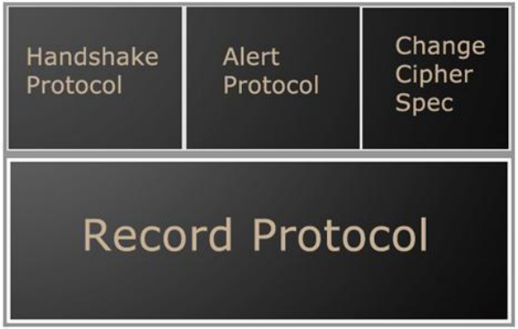

E de fato, a camada SSL Record Protocolo é responsável pelas funções aqui elencadas. 

**Gabarito** : C 

#### **13. CESPE – TJ-ES/Analista Judiciário – Análise de Suporte/2011.** 

**HTTPS — o HTTP usado sobre o SSL (secure socket layer) — é uma alternativa adequada para suprir a necessidade de segurança em alguns serviços a serem disponibilizados no sítio do tribunal em questão. O HTTPS usa como padrão a porta 443, sendo tarefa do SSL, após o estabelecimento da conexão segura, compactar e criptografar os dados.** 

#### **Comentários:** 

Vimos na sessão de protocolos da camada de aplicação a capacidade do HTTP de utilizar o SSL, passando a ser chamado de HTTPS. Nesse modo, é utilizado a porta 443 e não mais a porta 80. 

Vimos ainda que a camada SSL Record Protocol do SSL implementa compressão dos dados e compactação. 

#### **14. CESPE – STJ/Técnico Judiciário – Informática/2008** 

**HTTPS (hyper text transfer protocol secure), que verifica um certificado digital por meio de criptografia simétrica, é uma implementação do protocolo HTTP sobre uma camada SSL ou TLS.** 

#### **Comentários:** 

Pessoal, muita atenção. Conforme mencionamos, a fase de estabelecimento da conexão, que envolve as consultas e trocas de certificados para troca de chaves será feita através da criptografia assimétrica e não simétrica, conforme mencionado. 

**Gabarito** : E 

#### **15. CESPE – TCU/Auditor Federal de Controle Externo/2010.** 

**A confidencialidade dos votos não será violada pela captura de tráfego na Internet, sem que sejam quebradas as proteções oferecidas pelo protocolo TLS/SSL.**

---

<!-- pagina: 94 -->

**André Castro Aula 01** 

#### **Comentários:** 

Conforme vimos, ainda que os dados sejam interceptados, dependerá ainda da quebra da criptografia para que seja possível decriptar as mensagens criptografadas em uma comunicação TLS/SSL. 

**Gabarito** : C 

**16. CESPE – PC-DF/Agente de Polícia/2013.** 

**Os protocolos TLS (Transport Layer Security) e SSL (Secure Sockets Layer) possuem propriedades criptográficas que permitem assegurar a confidencialidade e a integridade da comunicação.** 

#### **Comentários:** 

Questão bem básica a respeito das propriedades e possibilidades do TSL e SSL, certo? 

**Gabarito** : C 

#### **17. CESPE – ANP/Analista Administrativo – Área 5/2013.** 

**No acesso a um sítio da web que utilize protocolo HTTP, no momento da transferência dos dados para autenticação utilizando usuário e senha, pode-se agregar o TLS/SSL para que os dados sejam criptografados ao serem enviados.** 

#### **Comentários:** 

Mais uma questão tratando da capacidade de se enviar uma mensagem confidencial e criptografada a partir do TLS/SSL. 

**Gabarito** : C 

**18. CESPE – STF/Analista Judiciário – Suporte em Tecnologia da Informação/2013.** 

**O OpenSSL usa algoritmos de hash, como o SHA1 e MD5.** 

#### **Comentários:** 

Em regra, temos que o OpenSSL suporta uma grande diversidade de algoritmos conforme vimos, entre eles SHA1 e MD5. 

**Gabarito** : C 

**19. CESPE – STF/Analista Judiciário – Suporte em Tecnologia da Informação/2013.** 

**O OpenSSL não suporta S/MIME, o qual é utilizado para assinar e cifrar mensagens de e-mail. Comentários:** 

Mais um protocolo suportado pelo OpenSSL conforme vimos na sessão teórica. 

**Gabarito** : E 

#### **20. CESPE – STF/Analista Judiciário – Suporte em Tecnologia da Informação/2013.**

---

<!-- pagina: 95 -->

**André Castro Aula 01** 

**O OpenSSL usa o padrão AES com chaves de 128, 192 e 256 bits.** 

#### **Comentários:** 

Reforçando mais uma vez a nossa lista de protocolos suportados pelo OpenSSL. 

**Gabarito** : C

---

<!-- pagina: 96 -->

**André Castro Aula 01** 

# **QUESTÕES COMENTADAS - SSL E TLS - FCC** 

#### **1. FCC – TRT-MG/Analista Judiciário/2015** 

**Para reduzir a vulnerabilidade dos acessos pelo protocolo HTTP, foi introduzido, acima desse protocolo, o SSL, originando assim o HTTPS. O HTTPS** 

A) realiza a autenticação do endereço IP que visita os sites. 

B) criptografa o endereço IP origem que visita os sites. 

C) torna o protocolo IP mais seguro por meio da checagem da integridade. 

D) criptografa o pacote TCP por completo. 

E) provê recursos de autenticação de sites visitados. 

#### **Comentários:** 

Temos aqui uma questão que pode ter gerado problema para alguns candidatos. Na prática, as principais características do HTTPS é garantir a confidencialidade através de um túnel criptografado e realizar a autenticação dos sites visitados, garantindo um aspecto de legitimidade, principalmente com o uso de certificados digitais. Entretanto, esses pontos não são exaustivos. Segundo Tanenbaum: 

- "A SSL constrói uma conexão segura entre dois soquetes, incluindo: 

1. Negociação de parâmetros entre cliente e servidor. 

2. Autenticação mútua de cliente e servidor. 

3. Comunicação secreta. 

4. Proteção da integridade dos dados" 

Diante desse posicionamento, percebemos que com o uso do HTTPS, podemos utilizar também de recursos de autenticação do lado do cliente, além de prover recursos de integridade. 

Entretanto, percebam que o SSL atua em uma camada intermediária entre a camada de aplicação e transporte da arquitetura TCP/IP. Ou seja, não há o que se falar de implementação do SSL para prover recursos de segurança em um sentido amplo para os protocolos TCP/UDP ou IP, pois estão abaixo da implementação do SSL. O protocolo HTTP sim usufrui desses recursos através do encapsulamento dos dados pelo SSL. 

**Gabarito** : E 

**2. FCC - 2019 - SANASA Campinas - Analista de Tecnologia da Informação - Suporte de Infraestrutura TI**

---

<!-- pagina: 97 -->

**André Castro Aula 01** 

**No âmbito da segurança de dados em redes de computadores, o Secure Sockets Layer - SSL realiza suas tarefas por meio de quatro protocolos em duas camadas. Considerando o modelo TCP, um desses protocolos, o Record Protocol, transporta mensagens dos outros três, assim como os dados −mensagens payload - provenientes da camada de** 

A) transporte para a camada de rede. 

B) aplicação para a camada de transporte. 

- C) rede para a camada de enlace. 

D) enlace para a camada de aplicação. 

E) rede para a camada de aplicação. 

#### **Comentários:** 

Agora sim temos uma questão melhor elaborada, considerando o fluxo dos dados na pilha de protocolos, saindo da aplicação para a camada de transporte. ==5460== 

**Gabarito** : B 

**3. FCC - 2019 - TRF - 4ª REGIÃO - Analista Judiciário - Infraestrutura em Tecnologia da Informação** 

**Considerando o recurso representado na figura, utilizado para proteger as comunicações entre um site, host ou servidor e os usuários finais que estão se conectando (ou entre duas máquinas em um relacionamento cliente-servidor), as lacunas I, II e III são correta e respectivamente preenchidas com:** 

A) plug-in VPN instalado −conexão VPN −com a chave privada do usuário. 

B) Servidor proxy habilitado −requisição cache −enviando o IP legítimo. 

C) serviço HTTP instalado −conexão VPN −criando um túnel com o protocolo handshake. 

D) certificado SSL instalado −conexão SSL −com um certificado SSL válido. 

E) código da sua chave privada −requisição de criptografia −com a chave pública do usuário.

---

<!-- pagina: 98 -->

**André Castro Aula 01** 

#### **Comentários:** 

Primeira coisa pessoal, é sem dúvida, realizar o acesso entregando o certificado SSL da origem para checagem e validação da identidade. A partir do certificado e das trocas de chaves, tem-se o estabelecimento da conexão SSL. Nesse processo de estabelecimento de conexão, o servidor também deve enviar seu certificado SSL para confirmação. 

**Gabarito** : D 

#### **4. FCC - 2019 - Prefeitura de Manaus - AM - Assistente Técnico de Tecnologia da Informação - Suporte** 

**O TLS/SSL é utilizado atualmente, em grande parte, nos serviços de comunicação na internet para prover segurança da informação na rede. Para prover a segurança, o TLS/SSL utiliza o esquema de chave** 

A) pública para criptografar os dados transmitidos. 

- B) compartilhada para autenticar o computador remoto. 

- C) privada para autenticar o computador remoto. 

- D) assimétrica para criptografar os dados transmitidos. 

E) pública para autenticar o computador remoto. 

#### **Comentários:** 

Conforme vimos, são utilizados os dois padrões: 

- 1 – Criptografia assimétrica para autenticação dos pares. 

- 2 – Criptografia simétrica para tráfego dos dados 

**Gabarito** : E

---

<!-- pagina: 99 -->

**André Castro Aula 01** 

# **QUESTÕES COMENTADAS - SSL E TLS - CESPE** 

**1. FGV - 2024 - TRF - 1ª REGIÃO - Técnico Judiciário - Área Administrativa - Especialidade: Suporte Técnico** 

**A empresa "CompraCerta", uma nova plataforma de e-commerce, está implementando SSL (Secure Sockets Layer) para garantir a segurança das transações entre seus clientes e servidores.** 

#### **Em relação aos aspectos técnicos do SSL, é correto afirmar que:** 

A) o SSL é um protocolo único projetado para fazer uso do TCP de modo a prover um serviço fim a fim seguro e confiável; 

B) entre qualquer par de participantes (aplicações como HTTP no cliente e no servidor), pode haver apenas uma conexão segura; 

C) o Protocolo de Apresentação SSL consiste em uma série de mensagens trocadas entre cliente e servidor. Pode-se considerar que essa troca possui sete fases; 

D) na operação global do protocolo de registro SSL, a primeira etapa é fragmentação. Cada mensagem de camada superior é fragmentada em blocos de 214 bytes (16.384 bytes) ou menos; 

E) a etapa final de processamento do Protocolo de Registro SSL é anexar um cabeçalho ao início da mensagem, consistindo nos campos: tipo de conteúdo, versão principal, comprimento comprimido e handshake. 

**Comentário:** 

O protocolo de registro SSL opera em etapas, e a fragmentação é a primeira delas. Cada mensagem oriunda de uma camada superior é dividida em fragmentos com tamanho máximo de 16.384 bytes (2^14 bytes), o que permite o processamento adequado e a aplicação de compressão e criptografia subsequentes. 

Sobre os demais itens, temos: 

**A: Incorreto, pois o SSL não é um protocolo único, mas um conjunto de protocolos que operam sobre o TCP para prover segurança fim a fim.** 

**B: Incorreto, pois não há limitação para apenas uma conexão segura entre um par de participantes; podem existir múltiplas sessões SSL simultâneas.** 

**C: Incorreto, pois o protocolo de apresentação do SSL (ou melhor, o handshake) não é descrito como possuindo exatamente sete fases.**

---

<!-- pagina: 100 -->

**André Castro Aula 01** 

**E: Incorreto, pois a etapa final do Protocolo de Registro não consiste em anexar um cabeçalho contendo “comprimento comprimido” ou “handshake” – o cabeçalho contém, tipicamente, os campos de tipo de conteúdo, versão e comprimento da mensagem.** 

**Gabarito: D** 

**2. FGV - 2021 - Banestes - Analista em Tecnologia da Informação - Segurança da Informação** 

**Sobre técnicas de segurança de tráfego na web, analise as afirmativas a seguir.** 

**I. IPSec pode ser usado para criptografar dados enviados entre quaisquer sistemas que possam ser identificados por endereços IP.** 

**II. TLS opera na camada de rede do modelo OSI oferecendo um serviço seguro e confiável de ponta a ponta.** 

**III. O protocolo HTTP pode operar em cima do protocolo SSL/TLS para obter conexão criptografada.** 

**Está correto o que se afirma em:** 

A) somente I; 

B) somente II; 

C) somente III; 

D) somente I e III; 

E) I, II e III. 

#### **Comentários:** 

Vamos aos itens: 

I – Sem dúvida pessoal. Vimos que é justamente a ótica de criação dos túneis. 

II – Errado pessoal. Quem opera na camada de rede é o IPSEC. O TLS está na camada intermediária entre a camada de transporte e a aplicação. 

III – Não só pode, como é o padrão de comunicação segura atualmente na internet, formando o HTTPS. 

**Gabarito** : D 

**3. FGV - 2017 - IBGE - Analista Censitário - Análise de Sistemas - Suporte à Comunicação e Rede**

---

<!-- pagina: 101 -->

**André Castro Aula 01** 

#### **A opção correta em relação ao protocolo SSL é:** 

A) dada a importância do tráfego Web, foi criado para aumentar especificamente a segurança do protocolo HTTP; 

B) combina criptografia assimétrica e simétrica para garantir segurança no tráfego de dados; 

C) garante a autenticação através da utilização necessária de certificados digitais X.509 em ambos os lados da comunicação; 

D) o lado cliente é quem define unilateralmente os algoritmos de criptografia a serem usados na comunicação; 

E) nem todos os protocolos de roteamento de tráfego são suportados pelo SSL. 

#### **Comentários:** 

Vamos aos itens: 

<!-- Start of picture text -->
==5460== <!-- End of picture text -->

a) **INCORRETO** . Em que pese seja amplamente utilizado no HTTP, ele não teve essa restrição de garantia de segurança. É utilizado atualmente em diversos contextos. 

b) **CORRETO.** Conforme vimos no processo de 3-way-handshake, onde há autenticação por meio da criptografia assimétrica, permitindo ainda a troca de chaves para, em seguida, com o túnel estabelecido, trocar informações por meio da criptografia simétrica. 

c) **INCORRETO** Não se limita à implementação de estruturas de certificados digitais baseado em infraestruturas de chaves públicas. 

d) **INCORRETO** A definição é feita de forma conjunta, sempre buscando aquele de maior segurança suportado por ambos. 

e) **INCORRETO** Não há vinculação ou dependência dos protocolos de roteamento. O SSL atua em camada superior, abstraindo esse aspecto. 

**Gabarito** : E 

#### **4. FGV - 2017 - IBGE - Analista Censitário - Análise de Sistemas - Suporte à Comunicação e Rede** 

**Em relação à criptografia, analise as afirmativas abaixo:** 

**I. A criptografia simétrica é a ideal para ser usada para a finalidade de autenticação.** 

**II. O protocolo SSL utiliza uma mistura de criptografia simétrica e assimétrica.** 

**III. Uma das vantagens da criptografia simétrica sobre a assimétrica é a velocidade de processamento.** 

**Está correto somente o que se afirma em:** 

A) I; 

B) II;

---

<!-- pagina: 102 -->

**André Castro Aula 01** 

C) III; 

D) I e II; 

E) II e III. 

**Comentários:** 

Vamos aos itens: 

I – **INCORRETO** . Comentário no último item. 

II – **CORRETO** . Comentário no próximo item. 

III – **CORRETO** . Exatamente. Por isso que, no processo de tunelamento, primeiro se usa a criptografia assimétrica para autenticação e integridade por meio da troca de chaves e estabelecimento da chave compartilhada. Em seguida, todo o tráfego de conteúdo é feito com a criptografia simétrica. 

**Gabarito** : E 

**5. FGV - 2017 - SEPOG - RO - Analista em Tecnologia da Informação e Comunicação** 

**O protocolo HTTPS faz uso de uma camada de encriptação SSL/TLS que permite a transferência de senhas, informações do cartão de crédito, entre outras, de uma forma segura pela Internet. Este protocolo é composto por diversas fases, que incluem o acerto de diversos detalhes da comunicação entre o cliente e o servidor, antes do envio da mensagem propriamente dita.** 

**Com relação ao protocolo HTTPS, analise as afirmativas a seguir.** 

**I. Na fase inicial do protocolo, o servidor utiliza certificados digitais, normalmente assinados por uma Autoridade Certificadora (AC), para provar a sua identidade ao cliente.** 

**II. Na fase inicial do protocolo, o cliente gera uma chave pública aleatoriamente e utiliza a chave privada do servidor para enviá-la de forma segura para o servidor.** 

**III. Depois da fase inicial, os dados das mensagens trocadas entre o cliente e o servidor são encriptadas utilizando um algoritmo simétrico acertado na fase inicial do protocolo.** 

**Está correto o que se afirma em** 

A) I, apenas. 

B)  II, apenas. 

C) III, apenas. 

D) I e III, apenas. 

E) I, II e III. 

#### **Comentários:** 

Vamos aos itens:

---

<!-- pagina: 103 -->

**André Castro Aula 01** 

I – **CORRETO** . Essa é a ideia base por trás da autenticação e legitimidade dos acessos seguros na Internet. Tudo isso considerando uma infraestrutura de chaves públicas reconhecida e segura como base. 

II – **INCORRETO** . Uma bagunça de ações. A chave privada sempre será utilizada somente pelo próprio dono. Então, toda questão que associar o uso da chave privada pela outra parte, estará errada. 

III – **CORRETO** . Essa é a ideia. Utiliza-se a criptografia assimétrica para autenticação e integridade, permitindo a troca da chave compartilhada que será usada posteriormente na criptografia simétrica, para tráfego do conteúdo, propriamente dito. 

**Gabarito** : D 

#### **6. VUNESP - 2019 - Prefeitura de Itapevi - SP - Analista em Tecnologia da Informação e Comunicação** 

**O Secure Sockets Layer (SSL) e o seu sucessor Transport Layer Security (TLS) têm o objetivo de proteger a comunicação realizada pelos serviços na Internet. Considerando a arquitetura do conjunto de protocolos TCP/ IP, o SSL/TLS pertencem à camada de** 

A) Aplicação. 

B) Apresentação. 

C) Redes. 

D) Sessão. 

E) Transporte. 

#### **Comentários:** 

Muita atenção aqui pessoal. A VUNESP considerou o cenário de se ter o TLS/SSL na camada de aplicação. Sabemos que o correto é em uma camada intermediária. 

**Gabarito** : A (Gabarito do professor: anulação) 

**7. VUNESP - 2019 - Câmara de Piracicaba - SP - Administrador de Rede** 

**Um site disponibiliza comunicação segura via SSL/TLS, no entanto, faz uso de um certificado autoassinado ao invés de um assinado por uma entidade confiável. Por conta disso, o acesso ao site sob essas condições viola o atributo de** 

A) autenticidade. 

B) confidencialidade. 

C) disponibilidade. 

D) integridade. 

E) irretratabilidade. 

**Comentários:**

---

<!-- pagina: 104 -->

**André Castro Aula 01** 

É muito mais uma questão de criptografia do que de TLS/SSL. Uma vez que a ausência de uma infraestrutura de certificados, tendo, portanto, um certificado autoassinado, gera problemas de autenticidade. 

É como se você mesmo emitisse seu próprio passaporte. Ou seja, que validade tem esse passaporte emitido por vocês mesmo? 

**Gabarito** : A 

**8. FGV - 2018 - Câmara de Salvador - BA - Analista de Tecnologia da Informação** 

**No contexto do protocolo TLS, analise as afirmativas a seguir.** 

**I. Os parâmetros criptográficos usados pelo canal seguro são produzidos pelo sub-protocolo de handshake durante o estabelecimento da conexão entre o cliente e o servidor.** 

**II. O protocolo suporta dois tipos de troca de chaves: (EC)DHE e PSK com (EC)DHE.** 

**III. O protocolo é uma evolução do SSL e opera na camada de redes.** 

**Está correto somente o que se afirma em:** 

A) I; 

B) II; 

C) III; 

D) I e II; 

E) I e III. 

**Comentários:** 

Vamos aos itens: 

I) Importante lembrar do fluxo estabelecido no HANDSHAKE conforme imagem ao final dessa questão. **CORRETO** 

II) Conforme vimos em nossa tabela, sendo as práticas associadas ao TLS 1.2 e 1.3. Apenas reforçando que o protocolo suporta dois tipos de troca de chaves: (EC)DHE e PSK com (EC)DHE. (EC)DHE é um acrônimo para (Elliptic Curve) Diffie-Hellman Ephemeral, um protocolo de troca de chaves que proporciona segurança de comunicação entre duas partes. PSK com (EC)DHE se refere a Pre-Shared Key com (Elliptic Curve) Diffie-Hellman Ephemeral, que é uma variante que utiliza uma chave pré-compartilhada em conjunto com o (EC)DHE para autenticação e troca de chaves. **CORRETO** 

III) O TLS continua atuando no mesmo contexto de camada intermediária que o SSL, não havendo quaisquer mudanças em seu posicionamento. **INCORRETO**

---

<!-- pagina: 105 -->

**André Castro Aula 01** 

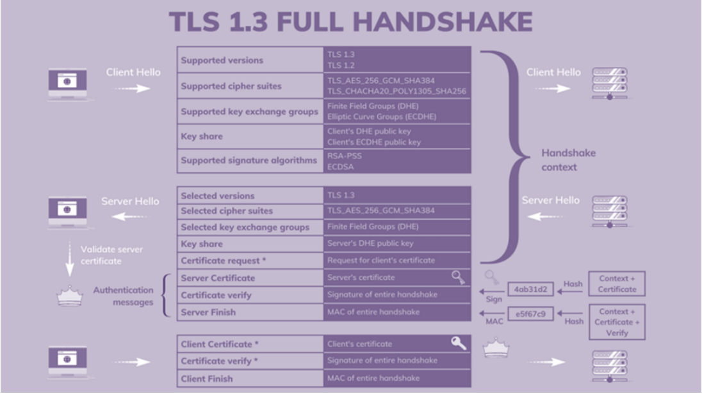

**Gabarito** : D

---

<!-- pagina: 106 -->

**André Castro Aula 01** 

# **LISTA DE QUESTÕES - SSL E TLS - CESPE** 

**1. CESPE / CEBRASPE - 2025 - TRF - 6ª REGIÃO - Analista Judiciário – Área: Apoio Especializado – Especialidade: Governança e Gestão de Tecnologia da Informação** 

**No mecanismo de handshake do TLS 1.3, o início da sessão se dá quando o servidor envia uma mensagem Server Hello, acompanhada de um número randômico, e estabelece o algoritmo simétrico e o tamanho da chave.** 

**2. CESPE / CEBRASPE - 2025 - PC-DF - Gestor de Apoio as Atividades Policiais Civis - Especialidade: Analista de Informática: Rede de Computadores** 

**O handshake TLS é mais lento e complexo que o handshake SSL, que, por sua vez, possui menos etapas, estabelecendo uma conexão mais rápida que aquele.** 

**3. CESPE / CEBRASPE - 2025 - PC-DF - Gestor de Apoio as Atividades Policiais Civis - Especialidade: Analista de Informática: Rede de Computadores** 

**O serviço de compressão de dados é obrigatório na implementação de segurança de redes com o SSL (secure sockets layer).** 

**4. CESPE / CEBRASPE - 2025 - PC-DF - Gestor de Apoio as Atividades Policiais Civis - Especialidade: Analista de Informática: Rede de Computadores** 

**Sítios HTTPS requerem a emissão de um certificado SSL/TLS por uma autoridade certificadora (CA), o qual é compartilhado com o navegador para estabelecer confiança e permitir a troca segura de dados criptografados.** 

**5. CESPE / CEBRASPE - 2024 - STJ - Analista Judiciário - Área: Apoio Especializado - Especialidade: Suporte em Tecnologia da Informação** 

**Em uma VPN, o tráfego de dados é levado pela rede pública por meio de protocolos de criptografia por tunelamento, como o SSL, que define um tipo de cabeçalho de autenticação (AH - authentication header), garantindo a confidencialidade dos dados.** 

**6. CESPE / CEBRASPE - 2020 - Ministério da Economia - Tecnologia da Informação - Segurança da Informação e Proteção de Dados**

---

<!-- pagina: 107 -->

**André Castro Aula 01** 

**Tanto o protocolo TLS quanto o SSL, seu sucessor, protegem grande parte das comunicações seguras na Internet, apesar de uma vulnerabilidade na versão 3.0 do TLS permitir a execução de um ataque denominado poodle.** 

#### **7. CESPE / CEBRASPE - 2021 - PC-SE - Agente de Polícia Judiciária** 

**Se Paulo usasse o browser para acessar sua caixa de emails no órgão por meio do protocolo SSL (Secure Sockets Layer), que opera na camada de rede da pilha de protocolos TCP/IP, tal protocolo garantiria a segurança dos seus dados, diminuindo riscos de ataque aos seus dispositivos, de modo que o invasor não teria acesso aos arquivos do usuário.** 

<!-- Start of picture text -->
==5460== <!-- End of picture text -->

**8. CESPE / CEBRASPE - 2022 - Petrobras - Analista de Sistemas – Engenharia de Software O HTTPS é uma junção do HTTP com o SSL (secure sockets layers).** 

#### **9. CESPE / CEBRASPE - 2021 - SERPRO - Analista - Especialização: Desenvolvimento de Sistemas** 

**Conexões entre producers e consumers suportam mecanismos de autenticação capazes de criptografar com SSL.** 

**10. CESPE / CEBRASPE - 2021 - TCE-RJ - Analista de Controle Externo - Especialidade: Tecnologia da Informação** 

**O algoritmo criptográfico RC4, cifra de fluxo com tamanho de chave variável, é utilizado nos padrões SSL/TLS (secure socket layer / transport layer security) definidos para a comunicação entre programas navegadores e servidores web.** 

**11. CESPE / CEBRASPE - 2021 - CODEVASF - Analista em Desenvolvimento Regional - Tecnologia da Informação** 

**Para atuarem como terminadores SSL, os balanceadores de carga possuem capacidade de suportar certificados do tipo wildcard, o que evita o uso de uma grande quantidade de certificados.** 

#### **12. CESPE – FUB/Técnico de TI/2015**

---

<!-- pagina: 108 -->

**André Castro Aula 01** 

**O protocolo SSL (secure socket layer) é utilizado em diversas aplicações TCP/IP para que se aumente a segurança na transmissão de dados. Ele é composto por protocolos base e auxiliares, tais como o SSL Record Protocol, responsável pelo transporte de informações autenticada e encriptada.** 

#### **13. CESPE – TJ-ES/Analista Judiciário – Análise de Suporte/2011.** 

**HTTPS — o HTTP usado sobre o SSL (secure socket layer) — é uma alternativa adequada para suprir a necessidade de segurança em alguns serviços a serem disponibilizados no sítio do tribunal em questão. O HTTPS usa como padrão a porta 443, sendo tarefa do SSL, após o estabelecimento da conexão segura, compactar e criptografar os dados.** 

#### **14. CESPE – STJ/Técnico Judiciário – Informática/2008** 

**HTTPS (hyper text transfer protocol secure), que verifica um certificado digital por meio de criptografia simétrica, é uma implementação do protocolo HTTP sobre uma camada SSL ou TLS.** 

#### **15. CESPE – TCU/Auditor Federal de Controle Externo/2010.** 

**A confidencialidade dos votos não será violada pela captura de tráfego na Internet, sem que sejam quebradas as proteções oferecidas pelo protocolo TLS/SSL.** 

#### **16. CESPE – PC-DF/Agente de Polícia/2013.** 

**Os protocolos TLS (Transport Layer Security) e SSL (Secure Sockets Layer) possuem propriedades criptográficas que permitem assegurar a confidencialidade e a integridade da comunicação.** 

#### **17. CESPE – ANP/Analista Administrativo – Área 5/2013.** 

**No acesso a um sítio da web que utilize protocolo HTTP, no momento da transferência dos dados para autenticação utilizando usuário e senha, pode-se agregar o TLS/SSL para que os dados sejam criptografados ao serem enviados.** 

#### **18. CESPE – STF/Analista Judiciário – Suporte em Tecnologia da Informação/2013.** 

**O OpenSSL usa algoritmos de hash, como o SHA1 e MD5.** 

#### **19. CESPE – STF/Analista Judiciário – Suporte em Tecnologia da Informação/2013.**

---

<!-- pagina: 109 -->

**André Castro Aula 01** 

**O OpenSSL não suporta S/MIME, o qual é utilizado para assinar e cifrar mensagens de e-mail.** 

#### **20. CESPE – STF/Analista Judiciário – Suporte em Tecnologia da Informação/2013.** 

**O OpenSSL usa o padrão AES com chaves de 128, 192 e 256 bits.** 

# **GABARITO** 

|**1. **|**2. **|**3. **|**4. **|**5. **|
|---|---|---|---|---|
|**E**|**E**|**E**|**C**|**E**|
|**6. **|**7. **|**8. **|**9. **|**10. **|
|**E**|**E**|**C**|**C**|**C**|
|**11. **|**12. **|**13. **|**14. **|**15. **|
|**C**|**C**|**C**|**E**|**C**|
|**16. **|**17. **|**18. **|**19. **|**20. **|
|**C**|**C**|**C**|**E**|**C**|

---

<!-- pagina: 110 -->

**André Castro Aula 01** 

# **LISTA DE QUESTÕES - SSL E TLS - FCC** 

#### **1. FCC – TRT-MG/Analista Judiciário/2015** 

**Para reduzir a vulnerabilidade dos acessos pelo protocolo HTTP, foi introduzido, acima desse protocolo, o SSL, originando assim o HTTPS. O HTTPS** 

A) realiza a autenticação do endereço IP que visita os sites. 

B) criptografa o endereço IP origem que visita os sites. 

C) torna o protocolo IP mais seguro por meio da checagem da integridade. 

- D) criptografa o pacote TCP por completo. 

- E) provê recursos de autenticação de sites visitados. 

#### **2. FCC - 2019 - SANASA Campinas - Analista de Tecnologia da Informação - Suporte de Infraestrutura TI** 

**No âmbito da segurança de dados em redes de computadores, o Secure Sockets Layer - SSL realiza suas tarefas por meio de quatro protocolos em duas camadas. Considerando o modelo TCP, um desses protocolos, o Record Protocol, transporta mensagens dos outros três, assim como os dados −mensagens payload - provenientes da camada de** 

A) transporte para a camada de rede. 

B) aplicação para a camada de transporte. 

- C) rede para a camada de enlace. 

- D) enlace para a camada de aplicação. 

- E) rede para a camada de aplicação. 

**3. FCC - 2019 - TRF - 4ª REGIÃO - Analista Judiciário - Infraestrutura em Tecnologia da Informação**

---

<!-- pagina: 111 -->

**André Castro Aula 01** 

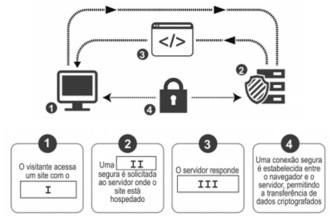

==5460== 

**Considerando o recurso representado na figura, utilizado para proteger as comunicações entre um site, host ou servidor e os usuários finais que estão se conectando (ou entre duas máquinas em um relacionamento cliente-servidor), as lacunas I, II e III são correta e respectivamente preenchidas com:** 

A) plug-in VPN instalado −conexão VPN −com a chave privada do usuário. 

B) Servidor proxy habilitado −requisição cache −enviando o IP legítimo. 

C) serviço HTTP instalado −conexão VPN −criando um túnel com o protocolo handshake. 

D) certificado SSL instalado −conexão SSL −com um certificado SSL válido. 

E) código da sua chave privada −requisição de criptografia −com a chave pública do usuário. 

#### **4. FCC - 2019 - Prefeitura de Manaus - AM - Assistente Técnico de Tecnologia da Informação - Suporte** 

**O TLS/SSL é utilizado atualmente, em grande parte, nos serviços de comunicação na internet para prover segurança da informação na rede. Para prover a segurança, o TLS/SSL utiliza o esquema de chave** 

A) pública para criptografar os dados transmitidos. 

B) compartilhada para autenticar o computador remoto. 

C) privada para autenticar o computador remoto. 

D) assimétrica para criptografar os dados transmitidos. 

E) pública para autenticar o computador remoto.

---

<!-- pagina: 112 -->

**André Castro Aula 01** 

# **GABARITO** 

|**01**|**02**|**03**|**04**|
|---|---|---|---|
|**E**|**B**|**D**|**E**|

---

<!-- pagina: 113 -->

**André Castro Aula 01** 

# **LISTA DE QUESTÕES - SSL E TLS - CESPE** 

**1. FGV - 2024 - TRF - 1ª REGIÃO - Técnico Judiciário - Área Administrativa - Especialidade: Suporte Técnico** 

**A empresa "CompraCerta", uma nova plataforma de e-commerce, está implementando SSL (Secure Sockets Layer) para garantir a segurança das transações entre seus clientes e servidores.** 

**Em relação aos aspectos técnicos do SSL, é correto afirmar que:** 

A) o SSL é um protocolo único projetado para fazer uso do TCP de modo a prover um serviço fim a fim seguro e confiável; 

B) entre qualquer par de participantes (aplicações como HTTP no cliente e no servidor), pode haver apenas uma conexão segura; 

C) o Protocolo de Apresentação SSL consiste em uma série de mensagens trocadas entre cliente e servidor. Pode-se considerar que essa troca possui sete fases; 

D) na operação global do protocolo de registro SSL, a primeira etapa é fragmentação. Cada mensagem de camada superior é fragmentada em blocos de 214 bytes (16.384 bytes) ou menos; 

E) a etapa final de processamento do Protocolo de Registro SSL é anexar um cabeçalho ao início da mensagem, consistindo nos campos: tipo de conteúdo, versão principal, comprimento comprimido e handshake. 

**2. FGV - 2021 - Banestes - Analista em Tecnologia da Informação - Segurança da Informação** 

**Sobre técnicas de segurança de tráfego na web, analise as afirmativas a seguir.** 

**I. IPSec pode ser usado para criptografar dados enviados entre quaisquer sistemas que possam ser identificados por endereços IP.** 

**II. TLS opera na camada de rede do modelo OSI oferecendo um serviço seguro e confiável de ponta a ponta.** 

**III. O protocolo HTTP pode operar em cima do protocolo SSL/TLS para obter conexão criptografada.** 

**Está correto o que se afirma em:** 

#### A) somente I; 

#### B) somente II;

---

<!-- pagina: 114 -->

**André Castro Aula 01** 

C) somente III; 

D) somente I e III; 

E) I, II e III. 

**3. FGV - 2017 - IBGE - Analista Censitário - Análise de Sistemas - Suporte à Comunicação e Rede** 

#### **A opção correta em relação ao protocolo SSL é:** 

A) dada a importância do tráfego Web, foi criado para aumentar especificamente a segurança do protocolo HTTP; 

B) combina criptografia assimétrica e simétrica para garantir segurança no tráfego de dados; ==5460== 

C) garante a autenticação através da utilização necessária de certificados digitais X.509 em ambos os lados da comunicação; 

D) o lado cliente é quem define unilateralmente os algoritmos de criptografia a serem usados na comunicação; 

E) nem todos os protocolos de roteamento de tráfego são suportados pelo SSL. 

**4. FGV - 2017 - IBGE - Analista Censitário - Análise de Sistemas - Suporte à Comunicação e Rede** 

**Em relação à criptografia, analise as afirmativas abaixo:** 

**I. A criptografia simétrica é a ideal para ser usada para a finalidade de autenticação.** 

**II. O protocolo SSL utiliza uma mistura de criptografia simétrica e assimétrica.** 

**III. Uma das vantagens da criptografia simétrica sobre a assimétrica é a velocidade de processamento.** 

**Está correto somente o que se afirma em:** 

A) I; 

B) II; 

C) III; 

D) I e II; 

E) II e III.

---

<!-- pagina: 115 -->

**André Castro Aula 01** 

**5. FGV - 2017 - SEPOG - RO - Analista em Tecnologia da Informação e Comunicação** 

**O protocolo HTTPS faz uso de uma camada de encriptação SSL/TLS que permite a transferência de senhas, informações do cartão de crédito, entre outras, de uma forma segura pela Internet. Este protocolo é composto por diversas fases, que incluem o acerto de diversos detalhes da comunicação entre o cliente e o servidor, antes do envio da mensagem propriamente dita.** 

**Com relação ao protocolo HTTPS, analise as afirmativas a seguir.** 

**I. Na fase inicial do protocolo, o servidor utiliza certificados digitais, normalmente assinados por uma Autoridade Certificadora (AC), para provar a sua identidade ao cliente.** 

**II. Na fase inicial do protocolo, o cliente gera uma chave pública aleatoriamente e utiliza a chave privada do servidor para enviá-la de forma segura para o servidor.** 

**III. Depois da fase inicial, os dados das mensagens trocadas entre o cliente e o servidor são encriptadas utilizando um algoritmo simétrico acertado na fase inicial do protocolo.** 

**Está correto o que se afirma em** 

A) I, apenas. 

B)  II, apenas. 

C) III, apenas. 

D) I e III, apenas. 

E) I, II e III. 

#### **6. VUNESP - 2019 - Prefeitura de Itapevi - SP - Analista em Tecnologia da Informação e Comunicação** 

**O Secure Sockets Layer (SSL) e o seu sucessor Transport Layer Security (TLS) têm o objetivo de proteger a comunicação realizada pelos serviços na Internet. Considerando a arquitetura do conjunto de protocolos TCP/ IP, o SSL/TLS pertencem à camada de** 

A) Aplicação. 

B) Apresentação. 

C) Redes. 

D) Sessão. 

E) Transporte. 

**7. VUNESP - 2019 - Câmara de Piracicaba - SP - Administrador de Rede** 

**Um site disponibiliza comunicação segura via SSL/TLS, no entanto, faz uso de um certificado autoassinado ao invés de um assinado por uma entidade confiável. Por conta disso, o acesso ao site sob essas condições viola o atributo de** 

A) autenticidade.

---

<!-- pagina: 116 -->

**André Castro Aula 01** 

B) confidencialidade. 

C) disponibilidade. 

D) integridade. 

- E) irretratabilidade. 

**8. FGV - 2018 - Câmara de Salvador - BA - Analista de Tecnologia da Informação** 

**No contexto do protocolo TLS, analise as afirmativas a seguir.** 

**I. Os parâmetros criptográficos usados pelo canal seguro são produzidos pelo sub-protocolo de handshake durante o estabelecimento da conexão entre o cliente e o servidor.** 

**II. O protocolo suporta dois tipos de troca de chaves: (EC)DHE e PSK com (EC)DHE.** 

**III. O protocolo é uma evolução do SSL e opera na camada de redes.** 

**Está correto somente o que se afirma em:** 

A) I; 

B) II; 

C) III; 

D) I e II; 

E) I e III. 

# **GABARITO** 

|**01**|**02**|**03**|**04**|**05**|**06**|**07**|**08**|
|---|---|---|---|---|---|---|---|
|**D**|**D**|**E**|**E**|**D**|**A***|**A**|**D**|

A* - Gabarito do professor: Anulação

---

<!-- pagina: 117 -->

