---
fonte_pdf: "Segurança da Informação - Aula 02.pdf"
paginas: 188
conversao: texto-e-imagens
---

<!-- pagina: 2 -->

**André Castro Aula 02** 

# **Índice** 

|.............................................................................................................................................................................................. 1) ISO 27001 e 27002 (Versão 2022) 3|
|---|
|.............................................................................................................................................................................................. 2) ISO 27001 e 27002 (Versão 2022) - Questões Comentadas - FGV 107|
|.............................................................................................................................................................................................. 3) ISO 27001 e 27002 (Versão 2022) - Questões Comentadas - FCC 118|
|.............................................................................................................................................................................................. 4) ISO 27001 e 27002 (Versão 2022) - Questões Comentadas - Cebraspe 124|
|.............................................................................................................................................................................................. 5) ISO 27001 e 27002 (Versão 2022) - Questões Comentadas - Cesgranrio 158|
|.............................................................................................................................................................................................. 6) ISO 27001 e 27002 (Versão 2022) - Lista de Questões - FGV 159|
|.............................................................................................................................................................................................. 7) ISO 27001 e 27002 (Versão 2022) - Lista de Questões - FCC 167|
|.............................................................................................................................................................................................. 8) ISO 27001 e 27002 (Versão 2022) - Lista de Questões - Cebraspe 171|
|.............................................................................................................................................................................................. 9) ISO 27001 e 27002 (Versão 2022) - Lista de Questões - Cesgranrio 186|

---

<!-- pagina: 3 -->

**André Castro Aula 02** 

# **ISO 27001** 

Antes de qualquer coisa, é importante termos a definição clara do que é ABNT, a ISO/IEC, e o que representa suas normas. Basicamente, a Associação Brasileira de Normas Técnicas – ABNT, é responsável pela elaboração de todas as normas brasileiras. Nesse quesito, importante destacar no que tange às ISO’s, que são normas internacionais, cabe à ABNT, portanto, apenas a tradução das referidas normas e a incorporação destas no contexto brasileiro. 

A Sigla ISO vem justamente dessa padronização internacional, a saber: International Organization for Standardization. 

Tá bom André. Chega de história... 

Calma lá pessoal... Isso cai em prova, e bem recente, portanto, não se enganem. Vejam: 

### **FGV/CGU/2022** 

**A Associação Brasileira de Normas Técnicas, ABNT, é responsável pela elaboração das Normas Brasileiras como, por exemplo, a ABNT NBR ISO/IEC 27001:2013, sobre aspectos da Segurança da Informação.** 

**Dado que a sigla ISO deriva de International Organization for Standardization, assinale a correta natureza das normas NBR ISO.** 

- A)  São normas brasileiras que passam a ser adotadas pela ISO. 

- B) São normas definidas em conjunto com a ISO. 

- C) São traduções de normas da ISO que passam a ser adotadas pela ABNT. 

- D) São normas da ISO adaptadas pela ABNT às práticas brasileiras. 

- E) São normas brasileiras compiladas a partir da combinação de outras normas da ISO. 

### **Comentários:** 

Cada país, portanto, elabora sua própria edição/versão da ISO, com a sua tradução. Esse trabalho é feito justamente pela ABNT. A referência NBR ISO/IEC traz justamente o padrão de que é uma tradução brasileira de uma norma internacional. 

**Gabarito** : C 

Importante destacar que essa percepção e conceito perpassa qualquer versão da norma. E é nisso que vamos focar... 

https://t.me/KakashiAssinaturasBot

---

<!-- pagina: 4 -->

**André Castro Aula 02** 

**Ainda, destaco que esse material passou por atualização e já incorpora a nova versão da ISO, ou seja, aquela elaborada em 2022. Tal norma é referenciada como ISO 27001:2022. Não há exercício até o presente momento da referida norma. Portanto, a dinâmica que trarei aqui é manter as questões das versões anteriores que não sofreram alterações em seu conteúdo, ou seja, o conteúdo é o mesmo à luz da norma para a versão 2022 e a versão de 2013, ok?** 

A norma ISO 27001 define os requisitos de um **Sistema de Gestão de Segurança da Informação – SGSI** . Veremos esse termo constantemente ao longo da nossa aula. 

Essa norma é um padrão e referência Internacional para a gestão da Segurança da Informação. Possui como objetivo a provisão de requisitos para **ESTABELECER, IMPLEMENTAR, MANTER E MELHORAR CONTINUAMENTE** um SGSI. 

A família 27000 possui uma visão integrada de diversas outras normas e boas práticas de segurança e governança. Então constantemente veremos termos que nos remetem a essas ações, ==5460== como é o próprio ciclo do PDCA, representado pelas 4 etapas do parágrafo anterior. 

### **CESPE/BANESE/2021** 

**Implementando-se um conjunto adequado de controles, de forma coordenada e coerente com os riscos associados a uma visão holística da organização, alcança-se a segurança da informação.** 

### **Comentários:** 

A segurança da informação é alcançada pela implementação de um conjunto adequado de controles, incluindo políticas, processos, procedimentos, estrutura organizacional e funções de software e hardware. Tal definição está justamente prevista na família ISO 27000. 

**Gabarito** : C 

A norma é dividida em 10 tópicos e 1 anexo de referência. Os tópicos são os seguintes: 

1. ESCOPO 2. REFERÊNCIA NORMATIVA 3. TERMOS e DEFINIÇÕES 4. Contexto da ORGANIZAÇÃO 5. LIDERANÇA 6. PLANEJAMENTO 

7. APOIO 8. OPERAÇÃO

---

<!-- pagina: 5 -->

**André Castro Aula 02** 

9. AVALIAÇÃO do DESEMPENHO 10. MELHORIA 

Antes de detalharmos um pouco mais cada um desses itens, é importante entendermos os motivadores dessa atualização. 

- **Maior ênfase no RISCO –** Sem dúvida é sempre um ponto de dor nas organizações. Não é atoa que existe uma norma específica para isso, como a ISO 27005. Assim, a norma foca no contexto de que as organizações devem identificar, avaliar e mitigar (reduzir) os riscos. 

- **Maior integração e sinergia com outras normas –** Naturalmente, a família ISO evoluiu e as normas são atualizadas constantes. E, destaco, não só a família ISO, mas também todas as outras normas correlatas. Assim, como falaremos a seguir, a gestão integrada não se restringe à Segurança da Informação, mas incorpora todas as demais áreas. 

- **Aprimoramento da conformidade com a LGDP –** a ISO 27001:2022 fornece mais suporte para as organizações que precisam cumprir a LGPD – Lei Geral de Proteção de Dados. Vejam que se trata de uma norma federal aplicada ao Brasil. E, assim, foi devidamente incorporada em seu contexto de atuação a pauta de proteção e privacidade dos dados. 

- **Reorganização de requisitos –** Com foco na usabilidade e entendimento por parte dos usuários da norma, buscou-se aprimorar a experiência com esse foco. 

## **Escopo** 

Nesta parte da norma é onde encontramos, além dos itens já apresentados no objetivo, outros pontos que também são considerados em relação à Segurança da Informação por intermédio do SGSI. Quais sejam: 

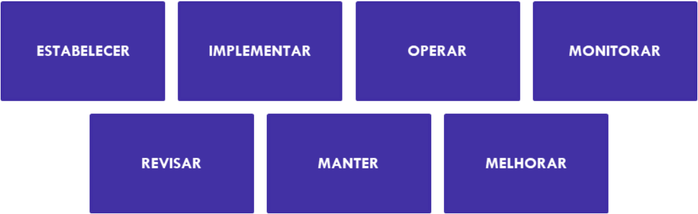

Ainda no escopo, podemos encontrar requisitos para avaliação e tratamento de riscos.

---

<!-- pagina: 6 -->

**André Castro Aula 02** 

Um ponto de destaque é que os itens de **4 a 10** da norma são **obrigatórios** para fins de CONFORMIDADE, ou seja, para uma instituição poder estar adaptada à norma, deve considerar esses itens. 

Obviamente, a construção da norma **deve contemplar qualquer tipo de organização,** sem restrição de tipo, tamanho ou natureza. Por isso ela é considerada genérica nesse sentido. 

## **Referência Normativa** 

Aqui, temos apenas uma referência de que a norma está ancorada na família 27000, que abrange uma série de outras questões no âmbito da Segurança da Informação. 

## **ões Termos de Definiç** 

Mais uma vez, tem-se a mera referência aos termos e definições presentes na família 27000. Veremos todos esses termos ao longo da nossa aula e complementaremos em nossos exercícios. 

## **Contexto da Organização** 

O SGSI não pode ser um documento avulso na organização. Para a sua construção, deve-se levar em conta a realidade da organização. 

Por isso é importante ENTENDER A **ORGANIZAÇÃO** E SEU **CONTEXTO** , bem como as **NECESSIDADES** E **EXPECTATIVAS** DAS PARTES INTERESSADAS. Obviamente, deve-se determinar também quem são as partes interessadas. 

Assim, deve-se considerar **questões internas e externas relevantes** para a organização alcançar os resultados esperados. 

Por fim, deve-se considerar o escopo do SGSI, tudo devidamente documentado e disponível. 

A título de detalhamento, esse contexto é dividido em 4 subcategorias, quais sejam: 

1. Entendendo a organização e seu contexto 

2. Entendendo as necessidades e as expectativas das partes interessadas 

3. Determinando o escopo do sistema de gestão da segurança da informação 

4. Sistema de gestão da segurança da informação

---

<!-- pagina: 7 -->

**André Castro Aula 02** 

## **Liderança** 

Como todo bom processo e robusto em uma instituição, a abordagem **TOP-DOWN** é **fundamental** , ou seja, é preciso que a alta direção da organização esteja devidamente alinhada e comprometida com a causa, exercendo, de fato, a liderança na condução do processo. 

Então a liderança também deverá atuar na construção da Política de Segurança da Informação – POSIC (falaremos mais sobre ela adiante), deverá participar no processo de decisão das autoridades, responsabilidades e papéis organizacionais que serão os atores diretos relacionados a assuntos de Segurança da Informação. 

Um ponto que merece destaque é em relação à Política de Segurança da Informação. Na subseção 2 deste tópico, temos que a Alta Direção deve estabelecer uma Política que: 

1. Seja apropriada ao propósito da organização; 

2. Inclua os objetivos de segurança da informação ou forneça a estrutura para estabelecer os objetivos de segurança da informação; 

3. Inclua o comprometimento em satisfazer os requisitos aplicáveis, relacionados com a SI; 

**4.** Inclua o comprometimento com a melhoria contínua do sistema de gestão da SI. 

Ainda em relação à POSIC, que é o principal instrumento de uma instituição no contexto de segurança da informação, ela deve: 

### **a) Estar disponível como informação documentada;** 

- b) Ser comunicada dentro da organização; e 

- c) Estar disponível para as partes interessadas, conforme apropriado. 

Vale lembrar que a POSIC é a base para elaboração de outros documentos derivados da norma maior, como políticas internas, normas operacionais e padrões de ações dos atores de uma organização. 

Importante lembrar ainda que é justamente na POSIC que temos a instituição do **GESTOR DE SEGURANÇA DA INFORMAÇÃO** , que é o responsável pelas **tomadas de decisão** relativas ao **assunto.** 

Do mesmo modo, esse capítulo da norma também é dividido em 3 subdivisões, a saber: 

1. Liderança e comprometimento 

2. Política 

3. Papéis, responsabilidades e autoridades organizacionais

---

<!-- pagina: 8 -->

**André Castro Aula 02** 

Em todo este processo, cumpre destacar que a Alta Direção pode atribuir responsabilidades e autoridades para relatar sobre o desempenho do sistema de gestão da segurança da informação dentro da organização. Ou seja, ela não é a única com essa possibilidade de atuação. 

## **Planejamento** 

Como já é de amplo conhecimento, aspectos relacionados à tecnologia da informação e, especificamente nesse contexto, a Segurança da Informação, dependem de ações planejadas e programadas. 

Por esse motivo há um rito muito bem definido na construção de um SGSI, onde se tem o alinhamento da Alta Direção... Depois a determinação das diretrizes em uma POSIC, para então dar seguimentos às demais ações. 

Assim, o planejamento é importante para mapear os riscos e oportunidades no âmbito do SGSI, com rotinas de avaliação contínua nesse processo. 

Quando se conhece os riscos e oportunidades, é possível acompanhá-los e medi-los, com definições claras de como tratá-los em caso de ocorrência. 

No processo de avaliação dos riscos, deve-se determinar critérios claros para a **ACEITAÇÃO DO RISCO** e para o DESEMPENHO DAS AVALIAÇÕES DOS RISCOS DE SEGURANÇA DA INFORMAÇÃO. 

Nesse processo, é sempre necessário, após a identificação dos riscos, mapear os responsáveis por eles. 

Vale a pena portanto, termos o consolidado no seguinte sentido como desdobramentos: 

- ❑ **Alinhamento com a alta direção;** 

- ❑ **Determinação de diretrizes em uma POSIC;** 

- ❑ **Ações táticas e operacionais;** 

- ❑ **Mapeamento de riscos e oportunidades.** 

- ❑ **Determinação de critérios claros e objetivos para aceitação do Risco e para desempenho das avaliações de riscos.** 

**Apenas como destaque que há uma referência direta à ISO 27005 ao considerar a etapa de Avaliação de Riscos em sua plenitude com as etapas de:** 

**1. Estabelecimento dos critérios dos riscos** 

**2. Avaliação contínua com resultados comparáveis, válidos e consistentes** 

**3. Identificação dos riscos** 

**4. Análise os riscos** 

**5. Avaliação dos Riscos**

---

<!-- pagina: 9 -->

**André Castro Aula 02** 

**Ainda, em seção própria dentro do contexto de PLANEJAMENTO, aborda também o TRATAMENTO DOS RISCOS.** 

## **Apoio** 

Quando falamos de APOIO, temos uma visão vertical e horizontal. Temos algumas ações que precisam ser consideradas no âmbito desse apoio: 

### **a) RECURSOS** 

- i. A organização deve determinar e prover recursos necessários para o estabelecimento, implementação, manutenção e melhoria contínua do SGSI. 

### **b) COMPETÊNCIA** 

   - i. A partir da determinação da competência necessária para as ações, deve-se assegurar que os responsáveis também tenham a competência devida, provendo a educação e capacitação necessárias, com a devida documentação dos processos. 

- **c) CONSCIENTIZAÇÃO** 

   - i. Todas as pessoas da organização devem conhecer a POSIC e os demais documentos, criando uma ação integrada da organização. 

### **d) COMUNICAÇÃO** 

   - i. Deve-se ter rotinas muito bem definidas de comunicações internas e externas para o SGSI, considerando “O QUE”, “QUANDO”, “QUEM” e “COMO”. 

   - ii. Na versão anterior da norma ainda tínhamos  o “PROCESSO” (o processo pelo qual a comunicação será realizada.) 

- **e) INFORMAÇÃO DOCUMENTADA** 

   - i. Por ser um procedimento formal e relevante na organização, deve-se estabelecer rotinas de documentação para o SGSI, permitindo a criação e atualização de maneira facilitada, com o devido controle e versionamento. 

## **Operação** 

A operação diz respeito ao dia a dia, e à série de atividades que devem ser colocadas em práticas derivadas das estruturas de planejamento e instruções normativas. 

Nesse sentido, esse bloco é dividido em três partes: 

### **1. Planejamento Operacional e Controle** 

   - a. A norma traz justamente que a Organização deve planejar, implementar e controlar os processos para atender os requisitos de SI, e para implementar as ações determinadas anteriormente. 

   - b. Sempre zelar pela informação documentada e controlar as mudanças planejadas, além de analisar criticamente as consequências de mudanças não planejadas. 

   - c. A organização deve assegurar que os processos terceirizados estão determinados e são controlados. 

**2. Avaliação de Riscos de Segurança da Informação** 

   - a. Deve-se realizar tal avaliação em intervalos planejados, ou ainda quando mudanças significativas são propostas ou ocorrem, o que implica em uma quebra dos

---

<!-- pagina: 10 -->

**André Castro Aula 02** 

parâmetros originalmente estabelecidos, e, portanto, a necessidade de nova avaliação. 

   - b. É importante sempre lembrar que toda informação documentada deve ser retida. 

**3. Tratamento de Riscos de Segurança da Informação** 

   - a. Após a avaliação supracitada, e com os riscos mapeados, deve-se agora definir as ações derivadas de cada risco, basicamente indicando a ação que poderá/deverá ser tomada. Esse processo é chamado de tratamento de riscos. Novamente, sempre retendo a informação documentada dos resultados gerados no tratamento. 

Em que pese exista uma norma própria que detalhe e qualifique essas etapas debaixo da estrutura de Gestão de Riscos, por aqui conseguimos enxergá-la dentro de um contexto  maior da Segurança da Informação. 

## **Avaliação de Desempenho** 

Seguindo a lógica da coisa, após o seu regime de operação, deve-se zelar pela avaliação contínua do desempenho do Sistema de Gestão, para posteriormente, endereçar, inclusive, ações de melhoria. Nesse sentido, traz expressamente o aspecto de monitorar a eficácia do sistema. 

Um ponto que destaco desde já é o aspecto da formalidade e registro, onde para cada um dos três itens abaixo, todos devem ter sua respectiva informação documentada retida como evidência do controle. 

Nesse quesito, a avaliação é dividida em três blocos, quais sejam: 

**1. Monitoramento, medição, análise e avaliação** 

   - a. Deve ser determinado o que será monitorado, e medido, com os devidos controles e processos associados; 

   - b. Definição dos métodos de monitoramento, medição, análise e avaliação, associados a periodicidade e responsáveis. 

   - c. Toda documentação de monitoramento deve ser retida. 

**2. Auditoria Interna** 

   - a. A organização deve conduzir ações de auditoria a intervalos planejados, com foco na obtenção da percepção de conformidade dos requisitos da norma e daqueles derivados e estabelecidos para a organização em seu respectivo sistema. 

   - b. Neste processo, é importante recuperar auditoria internas anteriores como referência comparativa. 

   - c. Para cada auditoria, deve-se definir de forma clara, os critérios e escopo de cada auditoria. 

   - d. Para essas atividades, deve-se buscar a imparcialidade no processo de seleção dos auditores, com a devida objetividade. E todos os resultados devem ser relatados à direção pertinente. 

   - e. Novamente, conforme já falamos, a informação documentada da auditoria e seus resultados deve ser devidamente retida. 

**3. Análise Crítica pela Direção**

---

<!-- pagina: 11 -->

**André Castro Aula 02** 

- a. Como o próprio item sugere, essa análise deve ser feita pela Alta Direção. Reforço a importância e papel fundamental dessa visão estratégica no sistema, trazendo responsabilidade e comprometimento. 

- b. Tal análise também deve ser realizada a intervalos planejados, resgatando as análises anteriores também como referência, além de ponderar sobre eventuais mudanças nas questões internas e externas que sejam relevantes. 

- c. Os resultados da análise crítica pela Direção devem incluir decisões relativas a oportunidades para melhoria contínua e quaisquer necessidades para mudanças do sistema de gestão da segurança da informação. 

- d. A organização deve reter a informação documentada como evidência dos resultados das análises críticas. 

### **FGV/DPE-RJ/2019** 

**De acordo com a norma ABNT NBR ISO/IEC 27001:2013, uma organização deve programar auditorias internas a fim de verificar a aderência da conformidade do sistema de gestão da segurança da informação aos seus requisitos e à legislação vigente.** 

### **Sobre a realização da auditoria interna, é correto afirmar que:** 

A) os critérios de verificação devem ser sempre os mesmos, independentemente do escopo ou do processo da organização a ser auditado; 

B) os auditores não devem conhecer e considerar os resultados das auditorias anteriores para não influenciarem o trabalho de verificação; 

C) os auditores devem ser do próprio setor auditado a fim de possibilitar o aproveitamento de seu conhecimento acerca das atividades desenvolvidas; 

D) os resultados das auditorias devem ser de conhecimento da direção responsável pelo setor auditado; 

E) os relatórios das auditorias podem ser descartados na ausência de inconformidades. 

**Comentários:** 

Vamos aos itens... A Organização deve: 

A) definir os critérios e o escopo da auditoria, para cada auditoria; **INCORRETO** 

B) planejar, estabelecer, implementar e manter um programa de auditoria, incluindo a frequência, métodos, responsabilidades, requisitos de planejamento e relatórios. Os programas de auditoria devem levar em conta a importância dos processos pertinentes e os resultados de auditorias anteriores. **INCORRETO** 

C) selecionar auditores e conduzir auditorias que assegurem objetividade e imparcialidade do processo de auditoria; **INCORRETO**

---

<!-- pagina: 12 -->

**André Castro Aula 02** 

- D) assegurar que os resultados das auditorias são relatados para a direção pertinente. **CORRETO** 

E) reter a informação documentada como evidência dos programas da auditoria e dos resultados da auditoria. **INCORRETO** 

**Gabarito** : D 

### **CESPE/SEFAZ-AL/2021** 

**A NBR ISO/IEC 27001 prescreve que, por medida de segurança, as informações documentadas como evidências de monitoramento, de auditoria e de análises críticas da segurança da informação sejam descartadas imediatamente após serem apresentadas aos gestores principais da organização.** 

### **Comentários:** 

Conforme nós vimos... A organização deve reter informação documentada: 

- como evidência do monitoramento e dos resultados da medição. 

- evidência dos programas da auditoria e dos resultados da auditoria. 

- ~~e~~ vidência dos resultados das análises críticas pela direção. 

**Gabarito** : E 

### **CESPE/PG-DF/2021** 

**Uma organização deve prever auditorias internas sobre o seu sistema de gestão de segurança da informação, em intervalos planejados, para verificar a conformidade com os requisitos da norma.** 

### **Comentários:** 

Exatamente pessoal. Essa periodicidade deve existir. 

**Gabarito** : C 

## **Melhoria** 

E por fim, e não menos importante, temos o processo de melhoria, que traz duas perspectivas... 

### **1. Melhoria Contínua** 

- a. A organização deve continuamente melhorar a pertinência, adequação e eficácia do sistema de gestão da segurança da informação.

---

<!-- pagina: 13 -->

**André Castro Aula 02** 

### **2. Não conformidade e Ação Corretiva** 

- a. Basicamente, o foco é em buscar inconformidades e corrigi-las, lidando com suas consequências. 

- b. Avaliar a necessidade de ações para eliminar as causas de não conformidade, para evitar repetição e recorrência. Esse ponto é importante, pois a norma não diz que deve ser feito, mas que deve ser avaliado. 

- c. Sempre realizar as mudanças no Sistema de Gestão quando necessário. As ações corretivas devem ser apropriadas aos efeitos das não conformidades encontradas. 

Apenas a título de referência, na versão anterior, essas atividades eram invertidas, começando pela não conformidade e depois avançando para a melhoria Contínua. 

Em seguida, a ISO 27001 apresenta a lista completa de todos os objetivos de controle e seus respectivos controles, estruturados em uma tabela. 

A partir das próximas seções, veremos os conceitos de maneira conjugada entre a norma 27001 e 27002, **já devidamente atualizada com a versão de 2022** . Caso a banca cobre somente a ISO 27001, ela tende a se ater somente ao objetivo de controle e controles, não entrando nos detalhes de cada controle. Mas repito, é uma tendência, não uma regra. Temos vários casos recentes onde a banca apresenta no Edital somente a ISO 27001, ou ainda, uma relação reduzida de controles, e acaba extrapolando e cobrando outros assuntos correlatos. 

Então, de antemão, você pode assumir o risco e dizer: “Ah André, a banca não vai cobrar coisas da ISO 27002, vou parar por aqui.” Isso fica por sua conta e risco. Eu, na condição de professor e guia de vocês, vou buscar dar a melhor preparação possível e reduzir os riscos de ausência de conteúdo na hora da prova. Assim, vamos seguir para os próximos capítulos. 

# **ISO 27002** 

A ISO 27002 apresenta um **código de boas práticas** com controles de **Segurança da Informação** para o **SGSI** . 

Em sua estrutura, temos um correlacionamento direto com a ISO 27001, até porque, ela trata das boas práticas, certo? Todos os controles e objetivos de controle estão previstos no ANEXO da 27001 e são detalhados na 27002.

---

<!-- pagina: 14 -->

**André Castro Aula 02** 

Aqui, vamos começar destacando algumas mudanças da nova versão de 2022. Antigamente, tínhamos 14 seções de controle de Segurança da Informação, de um total de 35 objetivos de controles e 114 controles, de fato. 

E aqui é fundamental termos a definição clara do que são esses controles, à luz da própria norma: 

“Um controle é definido como uma medida **que modifica ou mantém o risco.** Alguns dos controles deste documento são controles que modificam o risco, enquanto outros mantêm o risco. Uma política de segurança da informação, por exemplo, só pode manter o risco, enquanto o cumprimento da política de segurança da informação pode modificar o risco. Além disso, alguns controles descrevem a mesma medida genérica em diferentes contextos de riscos. Este documento fornece uma mistura genérica de controles organizacionais, de pessoas e de segurança da informação física e tecnológica derivados de melhores práticas reconhecidas internacionalmente.” 

Já na nova versão, como comentamos no início da aula, houve uma mudança em alguns arranjos. 

Os novos números são: 4 seções de controle de Segurança da Informação, com um total de 93 controles. Desses 93 controles, 82 são derivados dos 114 controles da versão anterior. Houve uma simplificação muito grande no modelo de apresentação com a inclusão em caráter de “novidade” de 11 controles. 

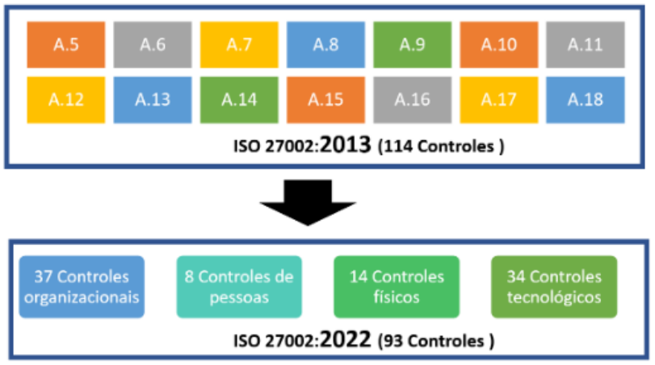

Uma outra grande novidade da norma, que vai ao encontro da filosofia de ser tornar didática, é a criação do conceito de atributos. Esses atributos foram divididos em 5 categorias, e assim, todo controle vai estar associado a esses atributos. Com isso, é possível focar em ações e controles específicos com base nos atributos que se espera desenvolver. 

São os atributos e suas respectivas classificações: 

### **1. Tipos de Controles** 

a. Preventivos: controles que são projetados para impedir que ameaças ocorram. 

- b. Detectivos: controles que são projetados para detectar ameaças que já ocorreram.

---

<!-- pagina: 15 -->

**André Castro Aula 02** 

c. Corretivos: controles que são projetados para corrigir ameaças que já ocorreram. 

### **2. Propriedades de Segurança da Informação** 

   - a. Confidencialidades 

   - b. Integridade 

   - c. Disponibilidade 

**3. Conceitos de Segurança Cibernética** 

   - a. Identificar 

   - b. Proteger 

   - c. Detectar 

   - d. Responder 

   - e. Restaurar 

### **4. Capacidades Operacionais** 

   - a. Governança 

   - b. Gestão de Ativos 

   - c. Proteção da Informação 

   - d. Segurança em recursos humanos 

   - e. Segurança física 

   - f. Segurança de sistemas e rede 

   - g. Segurança de aplicação 

   - h. Configuração segura 

   - i. Gestão de Identidade e Acesso 

   - j. Gestão de Ameaças e Vulnerabilidades 

   - k. Continuidade 

   - l. Segurança nas relações com Fornecedores 

   - m. Leis e Compliance 

   - n. Gestão de eventos de Segurança da Informação 

   - o. Garantia da segurança da Informação 

5. Domínios de Segurança 

   - a. Governança e Ecossistema 

   - b. Proteção 

   - c. Defesa 

d. Resiliência 

Apenas para ficar mais claro, vejam como os dois primeiros controles da norma são associados a estes atributos:

---

<!-- pagina: 16 -->

**André Castro Aula 02** 

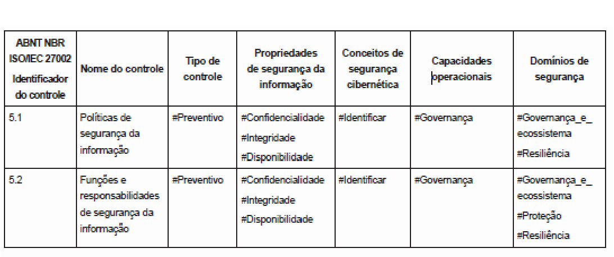

As provas variam bastante em termos de nível de cobrança... Alguns pontos são bem batidos e alvos constantes de uma análise mais detalhada. Por isso, reforço, a importância de fazermos bastante exercícios. Entretanto, por ser ainda uma nova norma, não há uma base sólida de cobrança. Os primeiros concursos estão aparecendo agora com o assunto. Desse modo, teremos que fazer um “mix” com questões da norma na versão anterior, porém, focados naqueles conteúdos ou tópicos que foram mantidos. 

Bom, conforme vimos, são 105 controles e todos eles são importantes e exercem uma função no processo de Gestão de Segurança. Entretanto, não há necessariamente uma ordem a ser implementada, muito menos a obrigatoriedade de se realizar todos. Agora um detalhe... Caso algum não seja realizado, deve-se destacar tal ponto e a referida justificativa de não se implementar o referido controle em um documento de suma importância, chamado de **DECLARAÇÃO DE APLICABILIDADE.** 

### **FGV/CGU/2022** 

**Um Sistema de Gestão de Segurança da Informação (SGSI) é um conjunto de controles que uma organização implementa para proteger os seus próprios ativos de informação e também para proteger outros ativos pelos quais é responsável. A norma ABNT NBR ISO/IEC 27001:2019 fornece os requisitos necessários para um SGSI. Rafael foi contratado para implementar o SGSI em um órgão público. Ele elencou os controles necessários para garantir a adequação à norma. Para isso, Rafael teve que elaborar:** 

A) políticas de segurança da informação; 

B) avaliação de desempenho;

---

<!-- pagina: 17 -->

**André Castro Aula 02** 

- C)  política de controle de acesso; 

- D) definição de funções e responsabilidades de segurança; 

E) declaração de aplicabilidade. 

### **Comentários:** 

Vejam como o assunto é cobrado de forma simples nesse processo. 

**Gabarito** : E 

A organização vai determinar seus requisitos a partir de três fontes principais: 

1. a avaliação de riscos da organização, considerando a estratégia e os objetivos globais de negócios da organização. Isso pode ser facilitado ou apoiado por meio de um processo de avaliação de riscos específicos de segurança da informação. Convém que isso resulte na determinação dos controles necessários para assegurar que o risco residual à organização atenda aos seus critérios de aceitação de riscos; 

2. os requisitos legais, estatutários, regulamentares e contratuais que uma organização e suas partes interessadas (parceiros comerciais, prestadores de serviços etc.) têm que cumprir e seu ambiente sociocultural; 

3. O conjunto de princípios, objetivos e requisitos de negócios para todas as etapas do ciclo de vida de informações que uma organização desenvolve para apoiar suas operações. 

Um ponto que gostaria de chamar sua atenção é para o fato de você realizar a leitura pensando, de fato, como isso acontece na sua organização de trabalho (para você que trabalha) ou, então, tente mentalizar as possibilidades. 

A melhor forma de “decorar/aprender” os conceitos, é entendendo que tudo faz sentido!!! 

### **“QUE SACADA... A RECEITA DO SUCESSO!”** 

Brincadeiras à parte, você deve entender o porquê é necessário definir responsabilidades.... O porquê é importante ter rotinas para controle de uso de dispositivos móveis... O porquê da necessidade de rotinas de backup... O porquê é necessário se preocupar com funcionário antes, durante e depois da contratação...

---

<!-- pagina: 18 -->

**André Castro Aula 02** 

Então quando uma questão cair na prova, ainda que você não lembre a literalidade da norma, o assunto e afirmação fará algum sentido. 

Para iniciarmos, vamos entender a estrutura da nova norma. Ao final, deixarei um complemento onde apresentarei a tabela do anexo B da norma, onde há uma correspondência entre os controles da nova versão e da antiga. 

## **Novidades da Norma** 

Quero começar destacando que a estrutura das seções mudou completamente. 

São os 4 tipos de Controles: 

**5. Controles organizacionais (todos aqueles que não se enquadram nas categorias seguintes) -** Possui 37 controles associados 

**6. Controles de pessoas (se eles dizem respeito a pessoas individuais) -** Possui 8 controles associados 

**7. Controles físicos (se eles dizem respeito a objetos físicos)** - Possui 14 controles associados 

**8. Controles tecnológicos (se eles dizem respeito à tecnologia)** - Possui 34 controles associados 

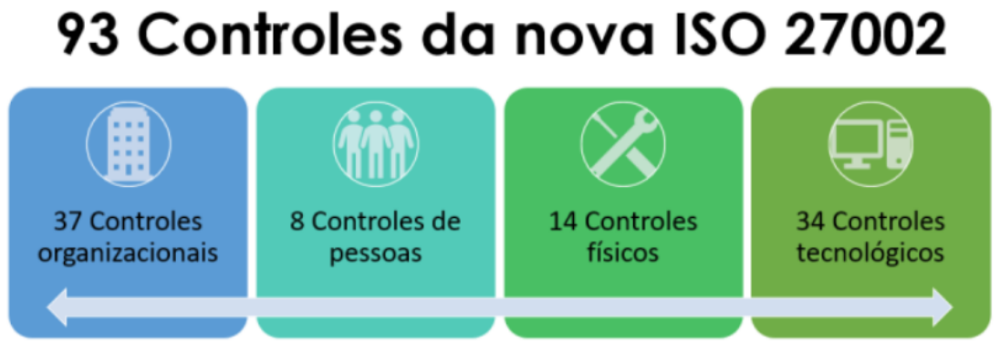

Apenas para ficarmos sempre aderentes à norma, essas 4 seções começam a partir do capítulo 5 e terminam no capítulo 9. Então, manteremos essa referência para conformidade completa com a norma. 

Conforme falamos, houve a inclusão de 11 controles que não tiveram qualquer derivação da versão anterior. Então vamos conhecê-los, já devidamente categorizados em suas seções:

---

<!-- pagina: 19 -->

**André Castro Aula 02** 

|**5. Controles organizacionais**|**5.7 Inteligência de ameaças** **5.23 Segurança da informação para uso de** **serviços em nuvem** **5.30 Prontidão de TIC para continuidade de** **negócios**|
|---|---|
|**7.Controles físicos**|**7.4 Monitoramento de segurança física**|
|**8. Controles tecnológicos**|**8.9 Gestão de confguração** **8.10 Exclusão de informações** **8.11 Mascaramento de dados** **8.12 Prevenção de vazamento de dados**|

Observem que nenhum controle do capítulo 6 - Controle de Pessoas foi considerado NOVO, mas tão somente incorporado da norma anterior. 

Ainda, dada a relevância da Lei Geral de Proteção de Dados do Brasil (LGPD), é importante entendermos que os controles 8.10, 8.11 e 8.12, desde já, guardam relação direta com práticas esperadas pela LGPD. 

Um outro ponto que a norma trouxe de novidade é em relação ao Layout, ou seja, como cada controle é descrito e detalhado. 

Anteriormente, tínhamos tão somente a seção do controle, o objetivo do controle, o controle em si e suas descrições. 

Agora, temos o seguinte layout: 

- **Título do controle:** Nome curto do controle; 

- **Tabela de atributos:** Uma tabela mostra o(s) valor(es) de cada atributo para o controle dado; 

- **Controle:** Qual é o controle; 

- **Propósito:** Por que convém que o controle seja implementado; 

- **Orientação:** Como convém que o controle seja implementado; 

- **Outras informações:** Texto explicativo ou referências a outros documentos relacionados.

---

<!-- pagina: 20 -->

**André Castro Aula 02** 

## **Estrutura da Norma Atualizada** 

**Bom, conforme falamos, vamos começar com a visão estruturada dos controles existentes na nova estrutura. Daqui, várias questões já podem ser resolvidas, simplesmente tendo essa visão ampla das seções, objetivos dos controles e os controles propriamente ditos.**

---

<!-- pagina: 21 -->

**André Castro Aula 02** 

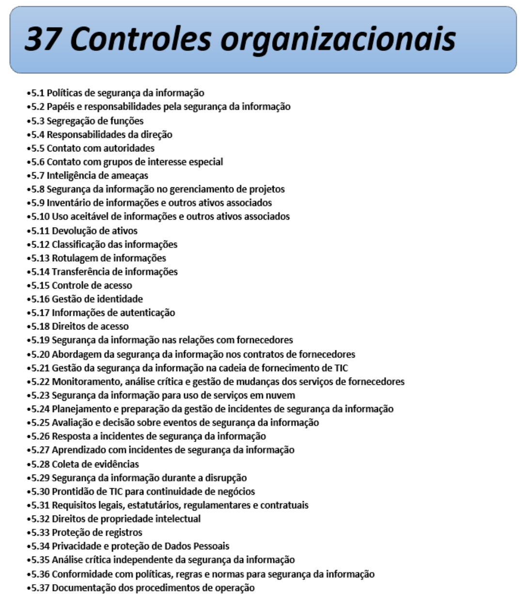

---

<!-- pagina: 22 -->

**André Castro Aula 02** 

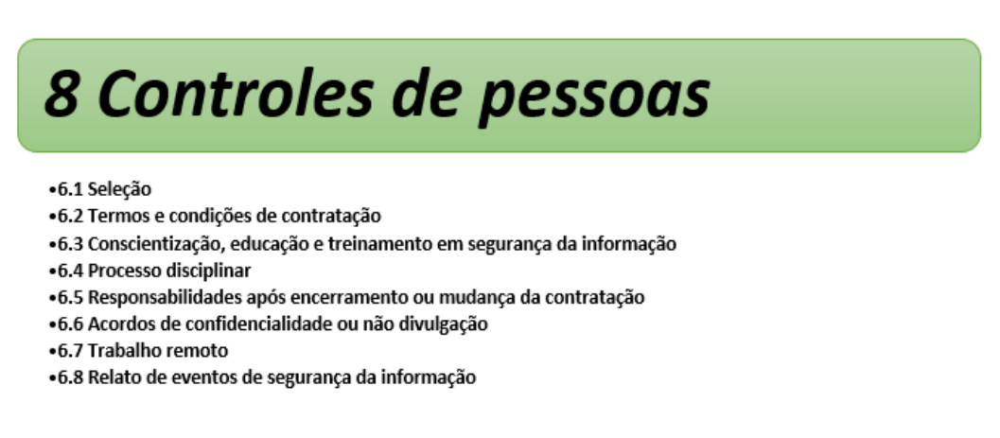

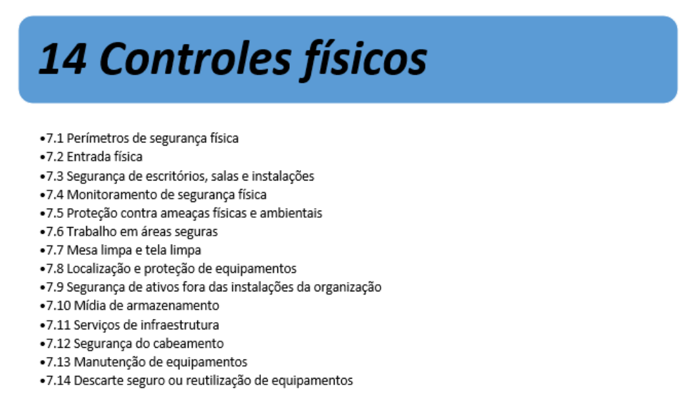

---

<!-- pagina: 23 -->

**André Castro Aula 02** 

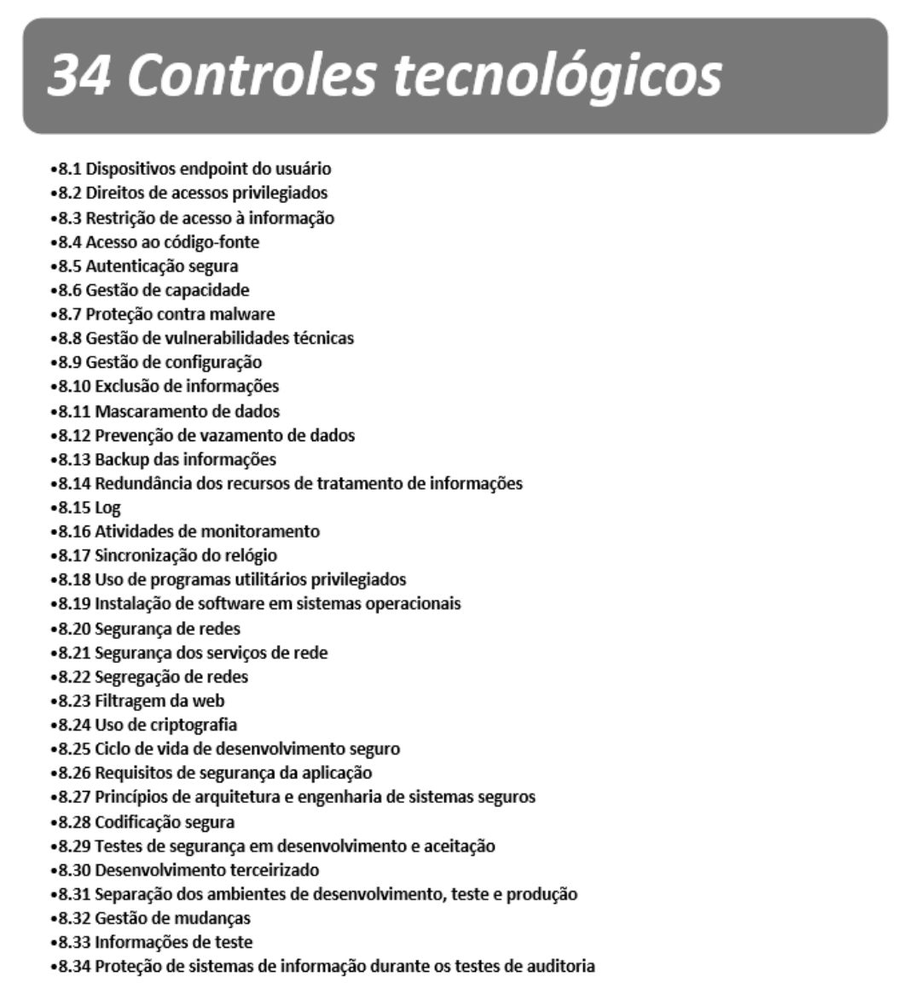

---

<!-- pagina: 24 -->

**André Castro Aula 02** 

Agora sim, vamos iniciar nossa jornada de detalhamento dos referidos controles: 

## **5. Controles Organizacionais** 

### **5.1 Políticas de segurança da informação** 

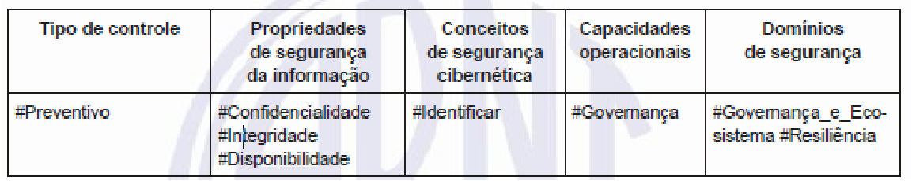

**CONTROLE -** Convém que um conjunto de políticas de segurança da informação seja definido, aprovado pela direção, publicado e comunicado para todos os funcionários e partes externas relevantes. 

**PROPÓSITO -** Assegurar a adequação contínua, suficiência, efetividade da direção de gestão e suporte à segurança da informação de acordo com os requisitos comerciais, legais, estatutários, regulamentares e contratuais. 

A Política de Segurança da Informação (POSIC) é o principal instrumento de uma instituição no que tange à Segurança. À luz da norma, pode, inclusive, receber outro nome, desde que mantidos os seus princípios. 

Ela servirá de base para a construção políticas específicas que podem ser organizadas por tema para tópicos como normas, diretivas, políticas ou outras. Muitas são conhecidas como normas operacionais e podem variar conforme cada organização. 

Convém que as políticas específicas por tema sejam alinhadas e complementares à política de segurança da informação da organização. 

Exemplos destes temas incluem: 

- a) controle de acesso; 

- b) segurança física e do ambiente; 

- c) gestão de ativos; 

- d) transferência de informações; 

- e) configuração e manuseio seguros de dispositivos endpoint do usuário;

---

<!-- pagina: 25 -->

**André Castro Aula 02** 

f) segurança de redes; 

- g) gestão de incidentes de segurança da informação; 

h) backup; 

**<u>i) criptografa e gerenciamento de chaves;</u>** 

j) classificação e tratamentos de informações; 

- k) gestão de vulnerabilidades técnicas; 

### **<u>l) desenvolvimento seguro.</u>** 

Ela prima ainda por um outro fator que é a determinação do GESTOR DE SEGURANÇA de uma organização. Esse será o responsável pelas tomadas de decisão referentes ao assunto. 

Além disso, um fator que sempre surge nas realidades de tecnologia das organizações é a questão do apoio estratégico da alta direção. Na POSIC, há o firmamento do compromisso da alta direção em relação à pauta, principalmente no que tange a investimentos financeiros que se façam necessários. 

Nesse controle, é importante destacar a aprovação da POSIC pela direção da instituição, com posterior publicação e comunicação a todos os funcionários e às partes externas envolvidas. Ainda, em relação à aprovação, cabe aos níveis apropriados de direção aprovar as normas específicas. 

**Então, cuidado... A POSIC alcança a todos que possuem alguma relação com a instituição, seja internamente, seja externamente. Entretanto, deve-se observar que, caso ela seja distribuída for da organização, convém que os cuidados sejam tomados para não divulgar informações confidenciais.** 

### **Observem esse ponto pois é bom para ser cobrado em caráter de exceção.** 

Além disso, diz-se que a POSIC é um documento vivo. Em sua construção, deve-se conter um tópico específico que determine a periodicidade de revisão e atualização, podendo ser de 2 em 2 anos, ou 3 em 3, por exemplo.

---

<!-- pagina: 26 -->

**André Castro Aula 02** 

Entretanto, como a POSIC deve representar o contexto estratégico da organização, caso haja mudanças significativas, obviamente a POSIC também deve acompanhar essa realidade, podendo ser, nesse horizonte, atualizada a qualquer tempo. 

### **CESPE – TCE-PA/Auditor/2017** 

**Devido a seu conteúdo confidencial e estratégico, a política de segurança da informação de uma organização deve estar disponível, como informação documentada, exclusivamente para a alta gerência.** 

### **Comentários:** 

Já comentamos sobre o assunto. A política de segurança deve ser divulgada para todos da organização, inclusive para os stakeholders. 

**Gabarito** : E 

### **5.2 Papéis e responsabilidades pela segurança da informação** 

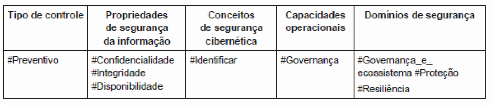

**CONTROLE -** Convém que os papéis e responsabilidades pela segurança da informação sejam definidos e alocados de acordo com as necessidades da organização. 

**PROPÓSITO -** Estabelecer uma estrutura definida, aprovada e compreendida para a implementação, operação e gestão da segurança da informação dentro da organização. 

Sempre orientada à POSIC, a norma recomenda que as responsabilidades sejam organizadas por:

---

<!-- pagina: 27 -->

**André Castro Aula 02** 

- a) proteção de informações e outros ativos associados; 

- b) realização de processos específicos de segurança da informação; 

c) atividades de gestão de riscos de segurança da informação e, em especial, aceitação de riscos 

residuais (por exemplo, para os proprietários de risco); 

- d) todo o pessoal usando as informações de uma organização e outros ativos associados. 

Um detalhe importante diz respeito à responsabilidade definida, onde, as atividades associadas a essa responsabilidade podem ser atribuídas, porém, sem tirar a responsabilidade originária. 

Aqui, há um destaque complementar à atribuição do gestor de segurança da informação, onde se espera que a responsabilidade por pesquisar e implementar os controles frequentemente permaneça com os gestores individuais. Uma prática comum é a nomeação de um proprietário para cada ativo que, então, se torna responsável por sua proteção no dia a dia. 

--------------------------------- 

### **5.3 Segregação de Funções** 

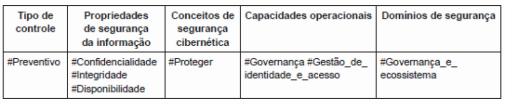

**CONTROLE -** Convém que funções conflitantes e áreas de responsabilidade sejam segregadas. 

**PROPÓSITO -** Reduzir o risco de fraude, erro e desvio de controles de segurança da informação 

O foco aqui é garantir que não haja conflito de interesse entre funções específicas, garantindo que sejam atribuídas atividades conflitantes a indivíduos distintos. Essa associação deve ter cautela nos processos de controle de usuários de papéis (RBAC), justamente para evitar tais problemas. 

### **CESPE/SEFAZ-CE/2021**

---

<!-- pagina: 28 -->

**André Castro Aula 02** 

**Convém que a política de segurança relacionada a controle de acesso da organização concentre as funções de pedido, autorização e administração de acesso em um grupo restrito e específico de colaboradores devidamente treinados para o desempenho dessas funções.** 

### **Comentários:** 

Pessoal, conforme vimos, há uma previsão do item de segregação de funções. Reforçando a nossa ótica de entender o controle. Se a mesma pessoa realiza todas as atividades, ela pode esconder e realizar ações indevidas sem que outros estejam contribuindo no processo, ainda que de forma sequencial. 

Por esse motivo é importante realizar a segregação das funções. 

**Gabarito** : E 

---------------------------------------- 

### **5.4 Responsabilidades da direção** 

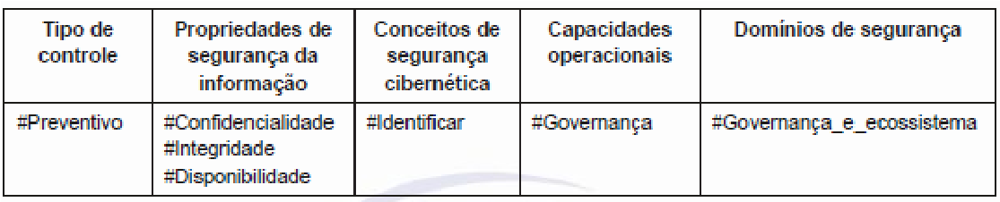

**CONTROLE -** Convém que a direção requeira que todo o pessoal aplique a segurança da informação de acordo com a política de segurança da informação estabelecida, com as políticas específicas por tema e com os procedimentos da organização.. 

**PROPÓSITO -** Assegurar que a direção entenda seu papel na segurança da informação e realize ações com o objetivo de assegurar que todo o pessoal esteja ciente e cumpra suas responsabilidades pela segurança da informação. 

Nesse contexto, busca-se consolidar todas as ações de incentivo e fomento à cultura organizacional de segurança a partir da alta direção. Durante a entrada de qualquer colaborador, este deve estar ciente dos termos e ter recebido as diretrizes necessárias, devidamente associadas às expectativas da organização. Lembrando que o principal instrumento aqui é justamente a POSIC. 

Ainda, há uma referência à eventual criação de canal confidencial para relatar as violações da POSIC em caráter de denúncia. 

---------------------

---

<!-- pagina: 29 -->

**André Castro Aula 02** 

### **5.5 Contato com autoridades** 

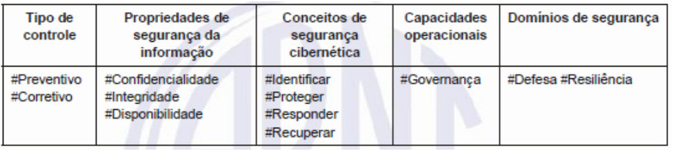

**CONTROLE -** Convém que a organização estabeleça e mantenha contato com as autoridades relevantes. 

**PROPÓSITO -** Assegurar o fluxo adequado de informações referentes à segurança da informação entre a organização e as autoridades legais, regulatórias e fiscalizadoras relevantes. 

Temos aqui um modelo de governança e capacidade de reação frente a eventuais problemas e riscos de continuidade de negócios. Ter os devidos pontos de contato para acionamento, que sejam representantes da lei, órgãos reguladores, como é o caso da ANPD, autoridades de supervisão e outros, é fundamental diante de uma situação de incidente. 

Essas autoridades podem apoiar, eventualmente, diante de um ataque para atuar diretamente na fonte, caso a organização não tenha capacidade para isso. Um exemplo clássico disso é frente a um ataque de DDoS onde é possível contatar uma autoridade da operadora para tentar restringir os acesso de determinada região que tem o ataque como fonte. 

--------------------- 

### **5.6 Contato com grupos de interesse especial** 

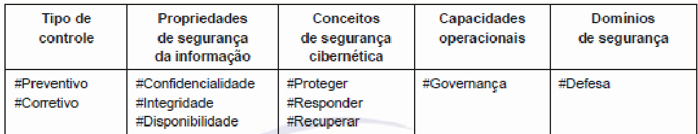

**CONTROLE -** Convém que a organização estabeleça e mantenha contato com grupos de interesse especial ou outros fóruns de especialistas em segurança e associações profissionais. 

**PROPÓSITO -** Assegurar que ocorra o fluxo adequado de informações relacionadas à segurança da informação.

---

<!-- pagina: 30 -->

**André Castro Aula 02** 

Mantendo o mesmo princípio do controle anterior, aqui, o foco é ter acesso a grupos especializados e de interesse, como fóruns especializados em segurança ou em determinada tecnologia. 

--------------------- 

### **5.7 Inteligência de Ameaças [NOVO]** 

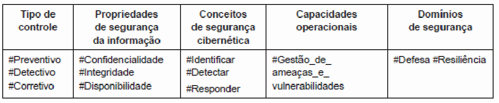

**CONTROLE -** Convém que as informações relacionadas a ameaças à segurança da informação sejam coletadas e analisadas para produzir inteligência de ameaças. 

**PROPÓSITO -** Conscientizar sobre o ambiente de ameaças da organização para que as ações de mitigação adequadas possam ser tomadas. 

Temos um novo controle na ISO. Focada em correlacionar informações de forma preventiva, bem como gerar insumos para detectar e reagir, busca-se sempre atuar com foco na eventual redução de impacto das ameaças. 

Ela pode ser dividida em três camadas: 

**a) inteligência estratégica de ameaças:** troca de informações de alto nível sobre o cenário de ameaças em mudança (por exemplo, tipos de atacantes ou tipos de ataques); 

**b) inteligência tática de ameaças:** informações sobre as metodologias dos atacantes, ferramentas e tecnologias envolvidas; 

**c) inteligência operacional de ameaças:** detalhes sobre ataques específicos, incluindo indicadores técnicos. 

A inteligência de ameaças é frequentemente fornecida por provedores ou consultores independentes, agências governamentais ou grupos colaborativos de inteligência de ameaças. Exemplos desses grupos são os CSIRT’s do Brasil, como centros de segurança com foco na resposta a incidentes. 

--------------------- 

### **5.8 Segurança da informação no gerenciamento de projetos**

---

<!-- pagina: 31 -->

**André Castro Aula 02** 

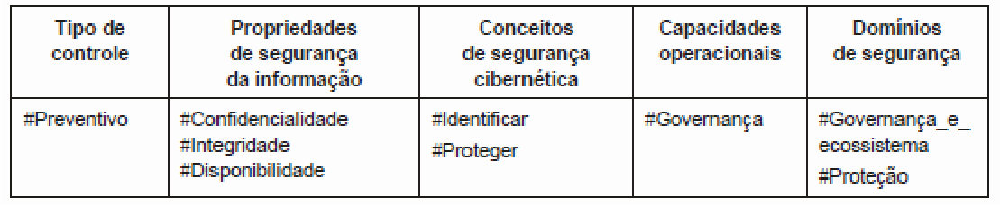

**CONTROLE -** Convém que a segurança da informação seja integrada ao gerenciamento de projetos. 

**PROPÓSITO -** Assegurar que os riscos de segurança da informação relacionados a projetos e entregas sejam efetivamente abordados no gerenciamento de projetos durante todo o ciclo de vida do projeto. 

--------------------- 

### **5.9 Inventário de informações e outros ativos associados** 

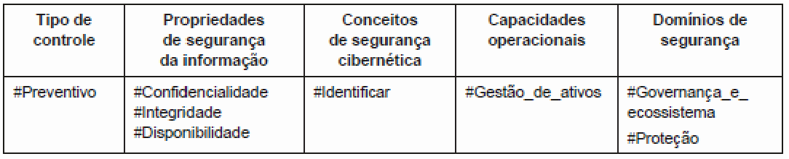

**CONTROLE -** Convém que um inventário de informações e outros ativos associados, incluindo proprietários, seja desenvolvido e mantido. 

**PROPÓSITO -** Identificar as informações da organização e outros ativos associados, a fim de preservar a sua segurança da informação e atribuir a propriedade adequada. 

Esta seção estava associada a um bloco muito importante de Gestão de Ativos da versão anterior. Portanto merece a sua atenção. 

------------------------ 

- **5.10 Uso aceitável de informações e outros ativos associados**

---

<!-- pagina: 32 -->

**André Castro Aula 02** 

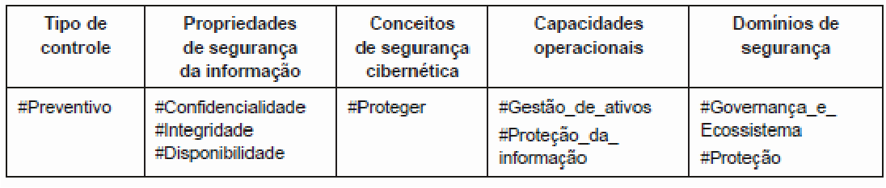

**CONTROLE -** Convém que regras para o uso aceitável e procedimentos para o manuseio de informações e outros ativos associados sejam identificados, documentados e implementados. 

**PROPÓSITO -** Assegurar que as informações e outros ativos associados sejam devidamente protegidos, usados e manuseados. 

Temos aqui um controle importante e muito prático nas organizações. Basicamente, a partir da identificação dos dispositivos que processam e tratam informações na organização, deve-se estabelecer políticas específicas para uso de cada dispositivo, e este se tornar conhecido pelos seus respectivos usuários. Tudo associado aos requisitos de segurança necessários. 

Convém que a política específica por tema declare: 

a) comportamentos esperados e inaceitáveis dos indivíduos do ponto de vista de segurança da informação; 

b) uso permitido e proibido de informações e outros ativos associados; 

c) atividades de monitoramento que estão sendo realizadas pela organização. 

Convém que os procedimentos de uso aceitáveis sejam elaborados para o ciclo de vida completo das informações de acordo com sua classificação e os riscos determinados. Tais itens podem ser considerados: 

a) restrições de acesso que apoiam os requisitos de proteção para cada nível de classificação; 

b) manutenção de registro dos usuários autorizados de informações e outros ativos associados; 

c) proteção de cópias temporárias ou permanentes de informações a um nível consistente com a proteção das informações originais; 

d) armazenamento de ativos associados a informações de acordo com as especificações dos fabricantes;

---

<!-- pagina: 33 -->

**André Castro Aula 02** 

e) marcação clara de todas as cópias de mídia de armazenamento (eletrônico ou físico) para a atenção do destinatário autorizado 

f) autorização de descarte de informações e outros ativos associados e métodos de descarte de apoio 

------------------------ 

### **5.11 Devolução de ativos** 

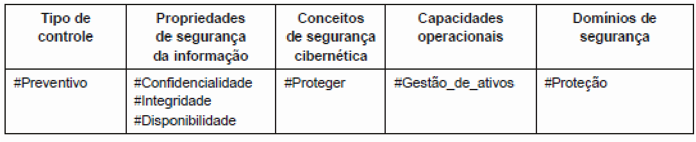

**CONTROLE -** Convém que o pessoal e outras partes interessadas, conforme apropriado, devolvam todos os ativos da organização em sua posse após a mudança ou encerramento da contratação ou acordo. 

**PROPÓSITO -** Proteger os ativos da organização como parte do processo de mudança ou encerramento da contratação ou acordo. 

Nos casos em que o pessoal e outras partes interessadas tenham conhecimento importante das operações em andamento, convém que essas informações sejam documentadas e transferidas para a organização. 

Durante o período de aviso prévio e posteriormente, convém que a organização impeça a cópia não autorizada de informações relevantes (por exemplo, propriedade intelectual) pelo pessoal que está sob aviso de rescisão. 

.------------------------ 

### **5.12 Classificação das informações** 

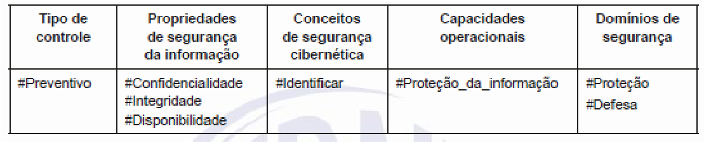

---

<!-- pagina: 34 -->

**André Castro Aula 02** 

**CONTROLE -** Convém que as informações sejam classificadas de acordo com as necessidades de segurança da informação da organização com base na confidencialidade, integridade, disponibilidade e requisitos relevantes das partes interessadas. 

**PROPÓSITO -** Assegurar a identificação e o entendimento das necessidades de proteção das informações de acordo com a sua importância para a organização. 

Esse controle específico recorrentemente cai em prova, seja no âmbito da ISO 27002, seja nos próprios conceitos relacionados à classificação da informação. 

Por isso, vamos falar um pouco mais sobre ele à luz da ISO 27002. Quando falamos de segurança da informação, obviamente, vinculamos o conceito de Tecnologia da Informação. 

Entretanto, no que tange à informação, o responsável por definir a criticidade, sensibilidade, aspectos legais, entre outros, é a área de negócio responsável por aquela informação. Uma vez definida e enquadrada na categoria devida, dá-se o devido tratamento conforme política e diretrizes de tratamento da informação definidas. 

Um outro ponto, é que a norma sugere que os proprietários da **informação e ativos** sejam os próprios **responsáveis** por sua **classificação.** 

Desta feita, um padrão definido para as categorias deve contemplar todas as áreas da organização, fazendo sentido para todos, mantendo um entendimento em comum. Não há uma restrição apenas para a alta gerência. 

A informação e classificação são instrumentos **dinâmicos, podendo mudar, conforme valor, criticidade, sensibilidade e requisitos legais.** 

Um outro ponto importante é em relação à troca de informações entre organizações. Quando uma informação da organização B, com um determinado nível de classificação passa para a organização A, deve-se realizar um trabalho de análise e rotulação da informação para verificar a equivalência e aplicação dos níveis referentes ao valor, sensibilidade e criticidade, não necessariamente mantendo o padrão da origem. 

.------------------------ 

**5.13 Rotulagem de informações** 

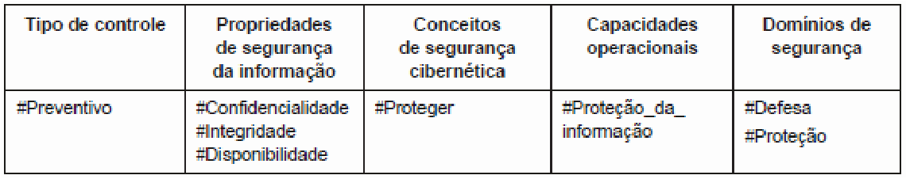

---

<!-- pagina: 35 -->

**André Castro Aula 02** 

**CONTROLE -** Convém que um conjunto adequado de procedimentos para rotulagem de informações seja desenvolvido e implementado de acordo com o esquema de classificação de informações adotado pela organização. 

**PROPÓSITO -** Facilitar a comunicação da classificação das informações e apoio à automação da gestão e tratamento das informações. 

É adequado que a rotulagem reflita o regime de classificação estabelecido, e que sejam facilmente reconhecíveis. Algumas técnicas de rotulagem são: 

- a) rótulos físicos; 

- b) cabeçalhos e rodapés; 

- c) metadados; 

- d) marca d’água; 

e) carimbos de borracha. 

Um ponto importante é que, quando falamos de compartilhamento de informações, a rotulagem de informações classificadas é um requisito fundamental. 

Há diversas referências que consideram exemplos de classificação, em que pese não haja um padrão específico pois depende da realidade de cada órgão ou empresa. Segue algumas referências: 

### **<u>(A) ultrassecretas:</u>** 

Informações ultrassecretas são aquelas que exigem o mais alto nível de confidencialidade e proteção, geralmente porque a sua divulgação pode causar danos extremamente graves à organização. 

### **<u>(B) confdenciais:</u>** 

Informações confidenciais exigem um nível significativo de proteção, mas não tão alto quanto o das informações ultrassecretas. Essas informações são acessíveis apenas a um grupo restrito de colaboradores e devem ser protegidas contra divulgação não autorizada. 

### **<u>(C) restritas:</u>** 

Informações restritas são aquelas que têm um nível moderado de confidencialidade e são acessíveis apenas a certos grupos dentro da organização. Devem ser protegidas, mas o impacto de sua divulgação é menos grave comparado às informações confidenciais ou ultrassecretas.

---

<!-- pagina: 36 -->

**André Castro Aula 02** 

### **<u>(D) de uso interno:</u>** 

Informações de uso interno são aquelas que podem ser acessadas por todos os funcionários da organização, sem necessidade de restrições específicas de confidencialidade. 

### **<u>(E) públicas:</u>** 

Informações públicas são aquelas que podem ser divulgadas amplamente sem causar danos à organização. Não requerem proteção especial. 

.------------------------ 

### **5.14 Transferência de informações** 

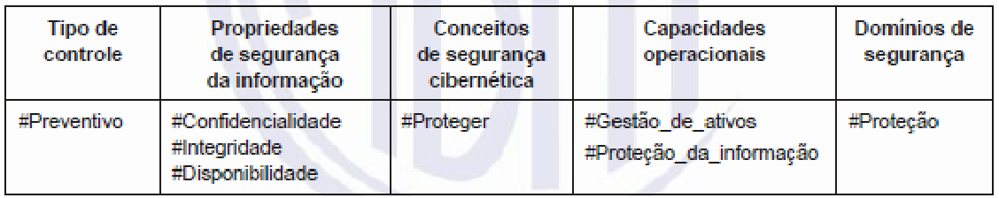

**CONTROLE -** Convém que regras, procedimentos ou acordos de transferência de informações sejam implementados para todos os tipos de recursos de transferência dentro da organização e entre a organização e outras partes. 

**PROPÓSITO -** Manter a segurança das informações transferidas dentro de uma organização e com qualquer parte interessada externa. 

-------------------------------- 

### **5.15 Controle de acesso** 

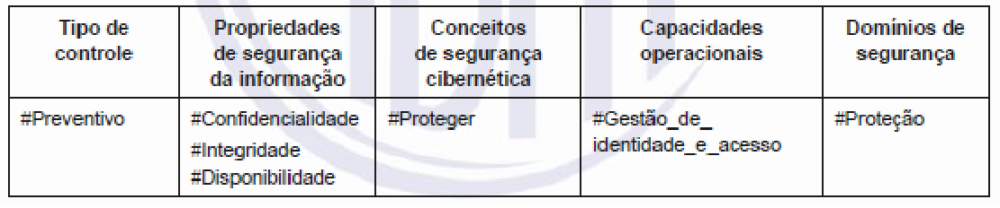

**CONTROLE -** Convém que as regras para controlar o acesso físico e lógico às informações e outros ativos associados sejam estabelecidas e implementadas com base nos requisitos de segurança da informação e de negócios.

---

<!-- pagina: 37 -->

**André Castro Aula 02** 

**PROPÓSITO -** Assegurar o acesso autorizado e evitar o acesso não autorizado a informações e outros ativos associados. 

Esse é um ponto que recorrentemente cai em prova tratando do CONTROLE DE ACESSO em questão e alguns aspectos operacionais. Vamos ver um pouco mais sobre isso nos exercícios uma vez que há uma consideração direta para cada banca. 

Um primeiro ponto que merece destaque é que os proprietários de informações e outros ativos que devem determinar os requisitos de segurança envolvidos. Isso pois ele é o detentor do conhecimento e práticas associadas. 

Convém que o seguinte seja considerado ao definir e implementar regras de controle de acesso: 

a) consistência entre os direitos de acesso e a classificação das informações; 

b) consistência entre os direitos de acesso e as necessidades e requisitos de segurança do perímetro físico; 

c) considerar todos os tipos de conexões disponíveis em ambientes distribuídos para que as entidades 

só tenham acesso a informações e outros ativos associados, incluindo redes e serviços de rede, que estejam autorizados a usar; 

d) considerar como os elementos ou fatores relevantes para o controle de acesso dinâmico podem ser refletidos. 

Convém que sejam tomados cuidado ao especificar as regras de controle de acesso a considerar: 

a) estabelecimento de regras baseadas na <u>premissa de menor privilégio, “Tudo é</u> geralmente proibido a menos que expressamente permitido”, em vez da regra mais fraca, “Tudo é geralmente permitido a menos que expressamente proibido”; 

b) alterações nos rótulos de informações que são iniciadas automaticamente pelos recursos de tratamento de informações e aquelas iniciadas a critério de um usuário;

---

<!-- pagina: 38 -->

**André Castro Aula 02** 

c) alterações nas permissões do usuário que são iniciadas automaticamente pelo sistema de informações e aquelas iniciadas por um administrador; 

d) quando definir e analisar criticamente de forma regular à aprovação. 

Toda regra de controle de acesso deve ser apoiada por procedimentos documentados e responsabilidades definidas. 

A norma invoca ainda princípios técnicos importantes que tratamos em outros pontos do nosso curso como as técnicas 

- MAC (controle de acesso obrigatório), 

- DAC (controle de acesso discricionário), 

- RBAC (controle de acesso baseado em papel) 

- ABAC (controle de acesso baseado em atributos). 

-------------------------------- 

### **5.16 Gestão de identidade** 

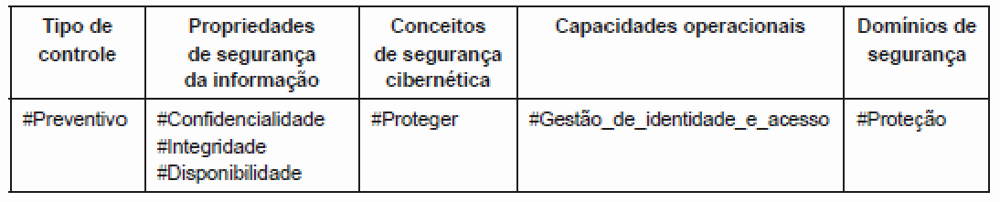

**CONTROLE -** Convém que o ciclo de vida completo das identidades seja gerenciado. 

**PROPÓSITO -** Permitir a identificação única de indivíduos e sistemas que acessam as informações da organização e outros ativos associados e para permitir a cessão adequada de direitos de acesso. 

-------------------------------- 

### **5.17 Informações de autenticação** 

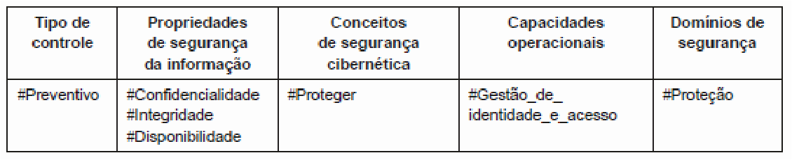

---

<!-- pagina: 39 -->

**André Castro Aula 02** 

**CONTROLE -** Convém que a alocação e a gestão de informações de autenticação sejam controladas por uma gestão de processo, incluindo aconselhar o pessoal sobre o manuseio adequado de informações de autenticação. 

**PROPÓSITO -** Assegurar a autenticação adequada da entidade e evitar falhas nos processos de autenticação 

Este controle é um dos mais importantes da norma pois está associado a práticas de identificação e autenticação dos usuários. 

Convém que o processo de alocação e gestão assegure que: 

a) senhas pessoais ou números de identificação pessoal (PIN) gerados automaticamente durante os processos de inscrição como informações temporárias de autenticação secreta não sejam fáceis de adivinhar e únicas para cada pessoa, e que os usuários sejam obrigados a alterá-las após o primeiro uso; 

b) procedimentos sejam estabelecidos para verificar a identidade de um usuário antes de fornecer informações novas, de substituição ou de autenticação temporária; 

c) informações de autenticação, incluindo informações de autenticação temporária, sejam transmitidas aos usuários de forma segura (por exemplo, em um canal autenticado e protegido) e que o uso de mensagens eletrônicas desprotegidas (texto claro) é evitado; 

d) usuários reconhecem o recebimento de informações de autenticação; 

e) informações de autenticação-padrão conforme predefinidas ou fornecidas pelos fornecedores são alteradas imediatamente após a instalação de sistemas ou softwares; 

f) registros de eventos significativos relativos à alocação e gestão de informações de autenticação sejam mantidos e sua confidencialidade assegurada, e que o método de registro seja aprovado (por exemplo, usando uma ferramenta de cofre de senha aprovada). 

Sempre focado na conscientização do usuário quanto ao sigilo e uso exclusivo, sem compartilhamentos, a norma reforça a importância de se fazer uma gestão eficaz dessas senhas, criando uma seção específica sobre **Sistema de Gerenciamento de Senhas. Essa prática envolve as regras que limitam ou restringem os usuários na geração e cadastramento de suas senhas.** 

### **Importante que o gerenciamento de senhas considere:** 

**a) permitir que os usuários selecionem e alterem suas próprias senhas e incluem um procedimento de confirmação para resolver erros de entrada;** 

**b) impor senhas fortes de acordo com as recomendações de boas práticas de “Responsabilidades do Usuário”;** 

- **c) forçar os usuários a alterarem suas senhas no primeiro login;**

---

<!-- pagina: 40 -->

**André Castro Aula 02** 

**d) impor alterações de senha conforme necessário, por exemplo, após um incidente de segurança, ou após a rescisão ou mudança de emprego quando um usuário tiver senhas conhecidas para identidades que permanecem ativas (por exemplo, identidades compartilhadas); e) impedir o reuso de senhas anteriores;** 

**f) impedir o uso de senhas comumente usadas e nomes de usuário comprometidos, combinações de senhas de sistemas hackeados;** 

**g) não exibir senhas na tela ao ser inserido;** 

**h) armazenar e transmitir senhas de forma protegida.** 

**Convém que a criptografia de senha e o hashing sejam realizados de acordo com técnicas criptográficas aprovadas para senhas.** 

**Requerer mudança frequente de senhas pode ser problemático porque os usuários podem ficar irritados com as mudanças frequentes, esquecer novas senhas, anotar em locais inseguros ou escolher senhas inseguras. A provisão de sinal único (SSO) ou outras ferramentas de gestão de autenticação (por exemplo, cofres de senha) reduz a quantidade de informações de autenticação que os usuários são requeridos a proteger e, assim, pode aumentar a eficácia deste controle. No entanto, essas ferramentas também podem aumentar o impacto da divulgação de informações de autenticação** 

-------------------------------- 

### **5.18 Direitos de acesso** 

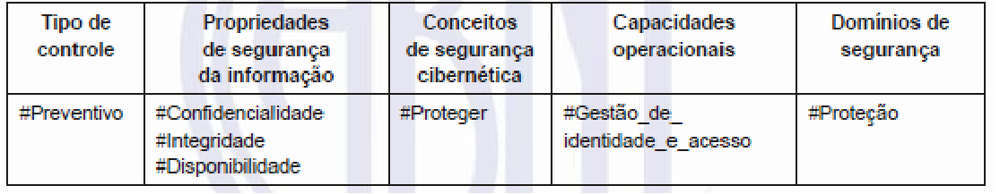

**CONTROLE -** Convém que os direitos de acesso às informações e outros ativos associados sejam provisionados, analisados criticamente, modificados e removidos de acordo com a política de tema específico e regras da organização para o controle de acesso 

**PROPÓSITO -** Assegurar que o acesso às informações e outros ativos associados esteja definido e autorizado de acordo com os requisitos do negócio. 

-------------------------------- 

- **5.19 Segurança da informação nas relações com fornecedores**

---

<!-- pagina: 41 -->

**André Castro Aula 02** 

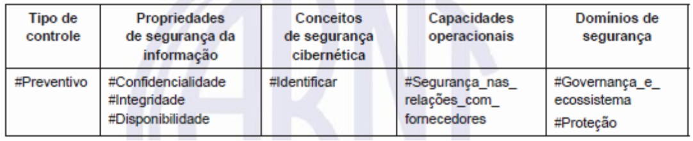

**CONTROLE -** Convém que processos e procedimentos sejam definidos e implementados para gerenciar a segurança da informação e os riscos associados com o uso dos produtos ou serviços dos fornecedores. 

**PROPÓSITO -** Manter um nível acordado de segurança da informação nas relações com fornecedores. 

Neste ponto é importante destacar que a relação com fornecedor alcança toda a cadeia produtiva associada ao ciclo de vida da informação. Logo, se o fornecedor processa e armazena qualquer informação da sua organização, seja no ambiente da própria organização ou em seu ambiente, é necessário haver políticas específicas para esse contexto. 

Convém que a organização identifique e implemente processos e procedimentos para enfrentar riscos de segurança associados ao uso de produtos e serviços prestados pelos fornecedores. 

Convém que isso também se aplique ao uso da organização de recursos de provedores de serviços em nuvem. 

Um ponto que merece destaque é no encerramento de um contrato com o fornecedor. Há uma grande preocupação durante esse processo e a norma nos traz o seguinte: 

### **Requisitos para assegurar um término seguro do relacionamento com o fornecedor, incluindo:** 

- 1) desprovisionamento dos direitos de acesso; 

- 2) tratamento de informações; 

- 3) determinação da propriedade intelectual desenvolvida durante o engajamento; 

- 4) portabilidade de informações em caso de alteração de fornecedor ou internalização; 

- 5) gerenciamento de registros; 

- 6) devolução de ativos; 

- 7) eliminação segura de informações e outros ativos associados; 

- 8) requisitos de confidencialidade em andamento;

---

<!-- pagina: 42 -->

**André Castro Aula 02** 

Ainda, na relação com o fornecedor, há uma lista de aspectos que devem ser observados e considerados, sendo estes inclusive alvos de cobrança em prova nas versões anteriores. Vejamos: 

a) identificar e documentar os tipos de fornecedores (por exemplo, serviços de TIC, logística, utilidades, serviços financeiros, componentes de infraestrutura de TIC) que podem afetar a confidencialidade, integridade e disponibilidade das informações da organização; 

**<u>b) estabelecer como avaliar e selecionar fornecedores de acordo com a sensibilidade de informações, produtos e serviços</u>** (por exemplo, com análise de mercado, referências ao cliente, análise crítica de documentos, avaliações no local, certificações); 

c) avaliar e selecionar produtos ou serviços do fornecedor que tenham controles adequados de segurança da informação e analisá-los criticamente; em particular, a precisão e a completeza dos controles implementados pelo fornecedor que assegure a integridade do tratamento de informações e informações do fornecedor e, consequentemente, a segurança da informação da organização; 

d) definir as informações da organização, os serviços de TIC e a infraestrutura física que os fornecedores podem acessar, monitorar, controlar ou usar; 

**<u>e) defnir os tipos de componentes e serviços de infraestrutura de TIC fornecidos pelos fornecedores que podem afetar a confdencialidade, integridade e disponibilidade das informações da organização;</u>** 

f) avaliar e gerenciar os riscos de segurança da informação associados a: 

1) o uso das informações da organização pelos fornecedores e outros ativos associados, incluindo riscos originário de potenciais fornecedores maliciosos; 

2) mau funcionamento ou vulnerabilidades dos produtos (incluindo componentes de software e subcomponentes utilizados nesses produtos) ou serviços prestados pelos fornecedores; 

g) monitorar o compliance com os requisitos estabelecidos de segurança da informação para cada tipo de fornecedor e tipo de acesso, incluindo análise crítica de terceiros e validação do produto; 

h) mitigar a não conformidade de um fornecedor, seja ela detectada por meio de monitoramento ou por outros meios; 

**<u>i) tratar de incidentes e contingências associados a produtos e serviços de fornecedores, incluindo responsabilidades tanto da organização quanto dos fornecedores;</u>** 

**<u>j) aplicar resiliência e, se necessário, medidas de recuperação e contingência para assegurar a disponibilidade do tratamento de informações e informações do fornecedor e, consequentemente, a disponibilidade das informações da organização;</u>**

---

<!-- pagina: 43 -->

**André Castro Aula 02** 

k) conscientizar e treinar o pessoal da organização interagindo com o pessoal do fornecedor sobre regras adequadas de engajamento, políticas específicas por tema para processos e procedimentos 

e comportamentos baseados no tipo de fornecedor e no nível de acesso do fornecedor aos sistemas de informações da organização; 

l) gerenciar a transferência necessária de informações, outros ativos associados e qualquer outra coisa que precise ser alterada e assegurar que a segurança da informação seja mantida durante todo o período de transferência; 

### **CESPE/SEFAZ-CE/2021** 

**No que se refere à NBR ISO/IEC 27002:2013 e a confiabilidade, integridade e disponibilidade, julgue o item a seguir.** 

**No contexto de política de segurança da informação no relacionamento com fornecedores, convém que sejam estabelecidos, quando necessário, acordos de contingência e recuperação para assegurar a disponibilidade da informação.** 

### **Comentários:** 

Conforme vimos, nos itens I e J, temos esses aspectos sendo abordados. 

<!-- Start of picture text -->
Gabarito : C <!-- End of picture text -->

-------------------------------- 

**5.20 Abordagem da segurança da informação nos contratos de fornecedores** 

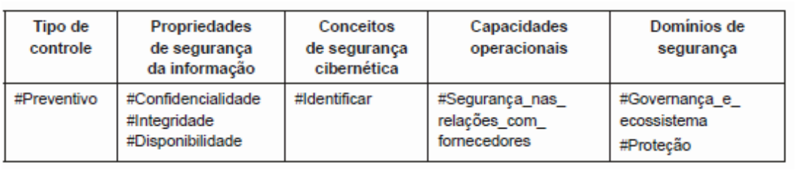

**CONTROLE -** Convém que requisitos relevantes de segurança da informação sejam estabelecidos e acordados com cada fornecedor com base no tipo de relacionamento com o fornecedor. 

**PROPÓSITO -** Manter um nível acordado de segurança da informação nas relações com fornecedores.

---

<!-- pagina: 44 -->

**André Castro Aula 02** 

-------------------------------- 

### **5.21 Gestão da segurança da informação na cadeia de fornecimento de TIC** 

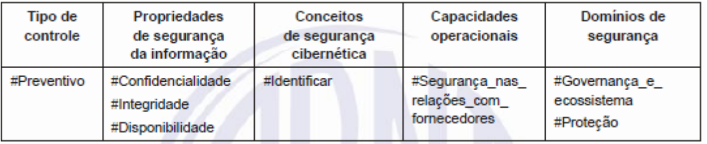

**CONTROLE -** Convém que processos e procedimentos sejam definidos e implementados para gerenciar riscos de segurança da informação associados à cadeia de fornecimento de produtos e serviços de TIC. 

**PROPÓSITO -** Manter um nível acordado de segurança da informação nas relações com fornecedores. 

-------------------------------- 

### **5.22 Monitoramento, análise crítica e gestão de mudanças dos serviços de fornecedores** 

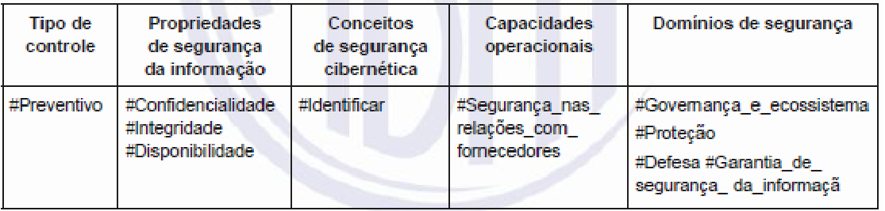

**CONTROLE -** Convém que a organização monitore, analise criticamente, avalie e gerencie regularmente a mudança nas práticas de segurança da informação dos fornecedores e na prestação de serviços. 

**PROPÓSITO -** Manter um nível acordado de segurança da informação e prestação de serviços em linha com os acordos com os fornecedores. 

--------------------------------------- 

### **5.23 Segurança da informação para uso de serviços em nuvem [NOVO]**

---

<!-- pagina: 45 -->

**André Castro Aula 02** 

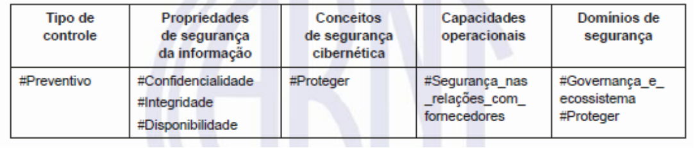

**CONTROLE -** Convém que os processos de aquisição, uso, gestão e saída de serviços em nuvem sejam estabelecidos de acordo com os requisitos de segurança da informação da organização. 

**PROPÓSITO -** Especificar e gerenciar a segurança da informação para o uso de serviços em nuvem. 

Aqui temos um controle novo muito relevante para as organizações. Com o grande aumento de consumo de serviços de nuvem, em diferentes níveis e perspectivas, a norma incorporou uma camada de tratamento própria para isso. Destaca-se que há um norma própria e especializada para tal contexto que é a ISO 27017. Ainda, no âmbito do Governo Federal, com o Gabinete de Segurança Institucional, temos a IN nº 05 que tem a mesma finalidade. 

O uso de serviços em nuvem pode envolver responsabilidade compartilhada pela segurança da informação e esforço colaborativo entre o provedor de serviços em nuvem e a organização que atua como cliente de serviço em nuvem. É essencial que as responsabilidades tanto para o provedor de serviços em nuvem quanto para a organização, atuando como cliente de serviço em nuvem, sejam definidas e implementadas adequadamente. 

Ter a definição clara da arquitetura, associada a quais controles de segurança da informação são gerenciados pelo provedor de serviços em nuvem e quais são gerenciados pela organização como cliente de serviço em nuvem é de suma importância. 

Um ponto de atenção é que os clientes, geralmente, estão sempre sujeitos aos termos contratuais vigentes de nuvem, pois não estão abertos a negociações. 

A norma traz uma relação de itens que se espera do provedor de nuvem. Vamos conhecê-los: 

a) prover soluções baseadas em padrões aceitos de mercado para a arquitetura e a infraestrutura; 

b) gerenciar controles de acesso dos serviços em nuvem que atendam aos requisitos da organização; 

c) implementar soluções de monitoramento e proteção de malware; 

d) tratar e armazenar as informações sensíveis da organização em locais aprovados (por exemplo, determinado país ou região), dentro ou sujeito a uma jurisdição específica;

---

<!-- pagina: 46 -->

**André Castro Aula 02** 

e) prover suporte dedicado em caso de incidente de segurança da informação no ambiente do serviço em nuvem; 

f) assegurar que os requisitos de segurança da informação da organização sejam atendidos no caso de os serviços de nuvem serem subcontratados de um fornecedor externo (ou proibir que os serviços em nuvem sejam subcontratados); 

g) apoiar a organização na coleta de provas digitais, considerando as leis e regulamentos para evidências digitais em diferentes jurisdições; 

h) prover suporte e disponibilidade adequados de serviços dentro de um prazo adequado, quando a organização quiser sair do serviço em nuvem; 

i) prover o backup necessário de dados e informações de configuração, gerenciando os backups com segurança conforme aplicável, com base nos recursos do provedor de serviços em nuvem usado pela organização atuando como cliente de serviço em nuvem; 

j) fornecer e retornar informações como arquivos de configuração, código-fonte e dados que pertencem à organização, atuando como cliente de serviço em nuvem, quando solicitado durante a prestação do serviço ou no término do serviço. 

---------------------------- 

**5.24 Planejamento e preparação da gestão de incidentes de segurança da informação** 

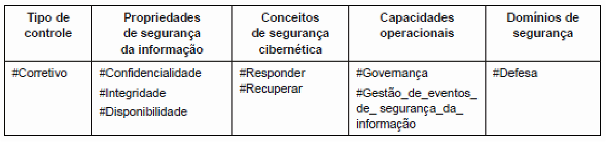

**CONTROLE -** Convém que a organização planeje e se prepare para gerenciar incidentes de segurança da informação definindo, estabelecendo e comunicando processos, papéis e responsabilidades de gestão de incidentes de segurança da informação. 

**PROPÓSITO -** Assegurar uma resposta rápida, eficaz, consistente e ordenada aos incidentes de segurança da informação, incluindo a comunicação sobre eventos de segurança da informação. 

--------------------------- 

- **5.25 Avaliação e decisão sobre eventos de segurança da informação**

---

<!-- pagina: 47 -->

**André Castro Aula 02** 

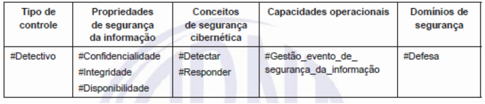

**CONTROLE -** Convém que a organização avalie os eventos de segurança da informação e decida se categoriza como incidentes de segurança da informação. 

**PROPÓSITO -** Assegurar a efetiva categorização e priorização de eventos de segurança da informação 

--------------------------- 

### **5.26 Resposta a incidentes de segurança da informação** 

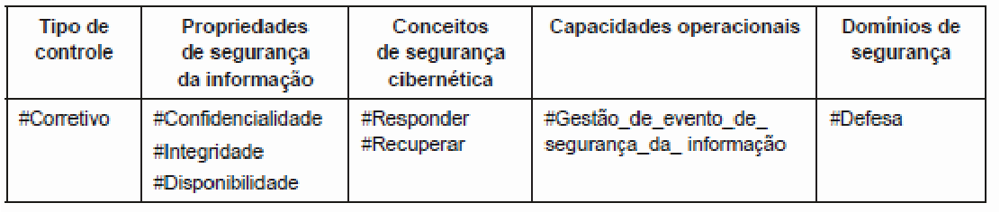

**CONTROLE -** Convém que os incidentes de segurança da informação sejam respondidos de acordo com os procedimentos documentados. 

**PROPÓSITO -** Assegurar uma resposta eficiente e eficaz aos incidentes de segurança da informação. 

Convém que a organização estabeleça e comunique os procedimentos de resposta aos incidentes de segurança da informação para todas as partes interessadas pertinentes. 

Convém que os incidentes de segurança da informação sejam respondidos por uma equipe designada com a competência necessária 

--------------------------- 

- **5.27 Aprendizado com incidentes de segurança da informação**

---

<!-- pagina: 48 -->

**André Castro Aula 02** 

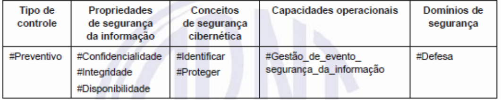

**CONTROLE -** Convém que o conhecimento adquirido com incidentes de segurança da informação seja usado para fortalecer e melhorar os controles de segurança da informação. 

**PROPÓSITO -** Reduzir a probabilidade ou as consequências de futuros incidentes. 

------------- 

### **5.28 Coleta de evidências** 

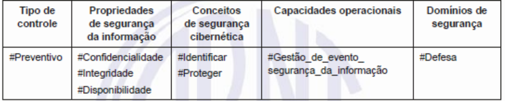

**CONTROLE -** Convém que a organização estabeleça e implemente procedimentos para identificação, coleta, aquisição e preservação de evidências relacionadas a eventos de segurança da informação 

**PROPÓSITO -** Assegurar uma gestão consistente e eficaz das evidências relacionadas a incidentes de segurança da informação para fins de ações disciplinares e legais. 

----------------------------- 

### **5.29 Segurança da informação durante a disrupção** 

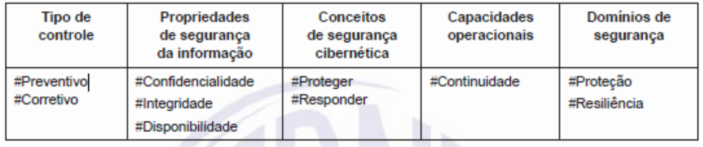

**CONTROLE -** Convém que a organização planeje como manter a segurança da informação em um nível apropriado durante a disrupção

---

<!-- pagina: 49 -->

**André Castro Aula 02** 

**PROPÓSITO -** Proteger as informações e outros ativos associados durante a disrupção. 

------------------------ 

### **5.30 Prontidão de TIC para continuidade de negócios [NOVO]** 

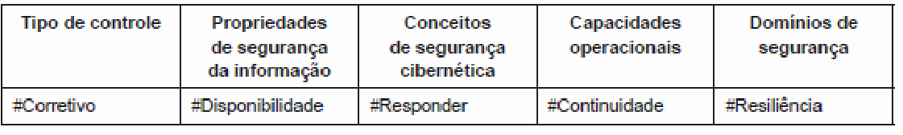

**CONTROLE -** Convém que a prontidão da TIC seja planejada, implementada, mantida e testada com base nos objetivos de continuidade de negócios e nos requisitos de continuidade da TIC. 

**PROPÓSITO -** Assegurar a disponibilidade das informações da organização e outros ativos associados durante a disrupção. 

A prontidão de TIC para a continuidade dos negócios é um componente importante na gestão da continuidade de negócios e na gestão da segurança da informação para assegurar que os objetivos da organização possam continuar a ser cumpridos durante a disrupção. 

Os requisitos de continuidade das TIC são o resultado da análise de impacto nos negócios (BIA). Convém que o processo BIA utilize tipos e critérios de impacto para avaliar os impactos ao longo do tempo decorrentes da disrupção das atividades empresariais que fornecem produtos e serviços. 

Convém que a magnitude e duração do impacto resultante sejam utilizadas para identificar atividades priorizadas que convém que sejam atribuídas a um objetivo de tempo de recuperação (RTO). Convém que a BIA então determine quais recursos são necessários para apoiar as atividades priorizadas. 

Convém que um RTO também seja especificado para esses recursos. Convém que um subconjunto desses recursos inclua serviços de TIC. 

------------------------------- 

- **5.31 Requisitos legais, estatutários, regulamentares e contratuais**

---

<!-- pagina: 50 -->

**André Castro Aula 02** 

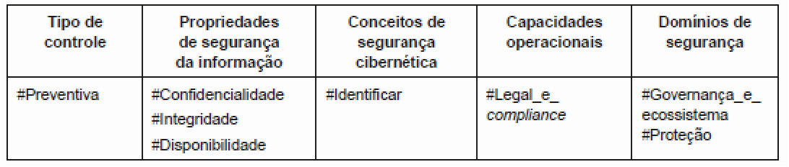

**CONTROLE -** Convém que os requisitos legais, estatutários, regulamentares e contratuais pertinentes à segurança da informação e à abordagem da organização para atender a esses requisitos sejam identificados, documentados e atualizados. 

**PROPÓSITO -** Assegurar o compliance dos requisitos legais, estatutários, regulamentares e contratuais relacionados à segurança da informação. 

----------------------------- 

### **5.32 Direitos de propriedade intelectual** 

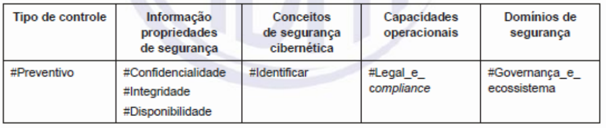

**CONTROLE -** Convém que a organização implemente procedimentos adequados para proteger os direitos de propriedade intelectual. 

**PROPÓSITO -** Assegurar o compliance dos requisitos legais, estatutários, regulamentares e contratuais relacionados aos direitos de propriedade intelectual e ao uso de produtos proprietários. 

----------------------------- 

- **5.33 Proteção de registros**

---

<!-- pagina: 51 -->

**André Castro Aula 02** 

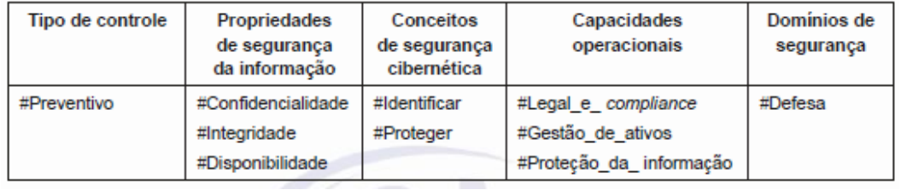

**CONTROLE -** Convém que os registros sejam protegidos contra perdas, destruição, falsificação, acesso não autorizado e liberação não autorizada. 

**PROPÓSITO -** Assegurar o compliance dos requisitos legais, estatutários, regulamentares e contratuais, bem como expectativas comunitárias ou sociais relacionadas à proteção e disponibilidade de registros. 

----------- 

### **5.34 Privacidade e proteção de DP** 

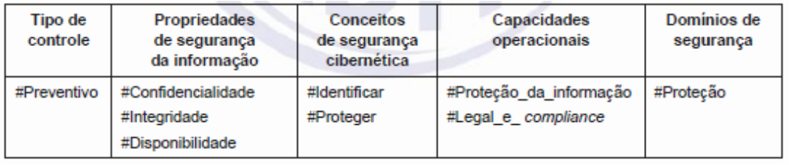

**CONTROLE -** Convém que a organização identifique e atenda aos requisitos relativos à preservação da privacidade e proteção de DP de acordo com as leis e regulamentos aplicáveis e requisitos contratuais. 

**PROPÓSITO -** Assegurar o compliance dos requisitos legais, estatutários, regulamentares e contratuais relacionados aos aspectos de segurança da informação da proteção de DP. 

-------------------------- 

### **5.35 Análise crítica independente da segurança da informação** 

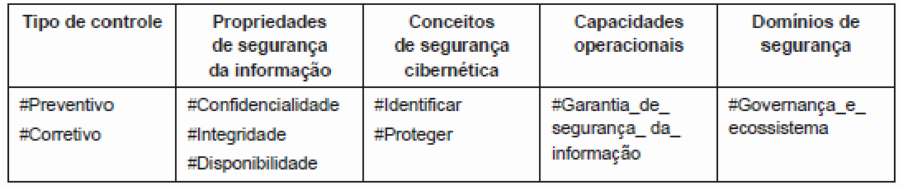

---

<!-- pagina: 52 -->

**André Castro Aula 02** 

**CONTROLE -** Convém que a abordagem da organização para gerenciar a segurança da informação e sua implementação, incluindo pessoas, processos e tecnologias, seja analisada criticamente de forma independente a intervalos planejados ou quando ocorrem mudanças significativas. 

**PROPÓSITO -** Assegurar a contínua adequação, suficiência e eficácia da abordagem da organização para a gestão da segurança da informação. 

-------------------------- 

**5.36 Conformidade com políticas, regras e normas para segurança da informação** 

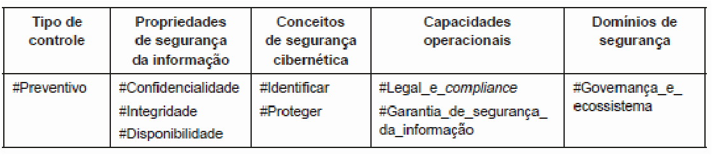

**CONTROLE -** Convém que o compliance da política de segurança da informação da organização, políticas, regras e normas de temas específicos seja analisado criticamente a intervalos regulares. 

**PROPÓSITO -** Assegurar que a segurança da informação seja implantada e operada de acordo com a política de segurança da informação da organização, políticas, regras e normas específicas por tema. 

-------------------------- 

- **5.37 Documentação dos procedimentos de operação**

---

<!-- pagina: 53 -->

**André Castro Aula 02** 

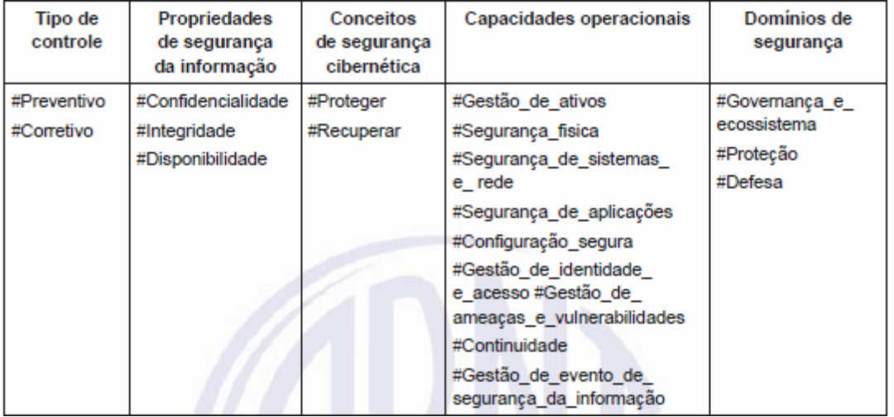

**CONTROLE -** Convém que os procedimentos de operação dos recursos de tratamento da informação sejam documentados e disponibilizados para o pessoal que necessite deles. 

**PROPÓSITO -** Assegurar a operação correta e segura dos recursos de tratamento da informação. 

-------------------------- 

Como combinamos, vamos tentar compor alguns conceitos que não mudaram da norma anterior, com os conceitos incorporados e mantidos na norma atualizada: 

**(CESPE – TRE-BA/Analista Judiciário – Análise de Sistemas/2017)** 

**I A gestão dos ativos mantidos no inventário deve ser realizada por ente terceirizado.** 

**II Ativos associados à informação, recursos e processamento da informação devem ser geridos por gestor com mais tempo de organização e mantidos fisicamente separados dos demais.** 

**III Recursos de processamento da informação devem ser identificados, documentados e implementados, assim como as regras para o uso aceitável das informações e dos ativos associados à informação.** 

**IV Os funcionários e partes externas devem devolver todos os ativos da organização que estejam em sua posse após o encerramento de suas atividades, de contrato ou acordo.** 

**Assinale a opção correta.** 

A) Apenas o item II está certo. 

B) Apenas o item III está certo.

---

<!-- pagina: 54 -->

**André Castro Aula 02** 

C) Apenas os itens I e II estão certos. 

D) Apenas os itens I e IV estão certos. 

E) Apenas os itens III e IV estão certos. 

### **Comentários:** 

Questão mais tranquila pois não exige saber a seção da norma que trata dos assuntos, mas tão somente se eles estão presentes ou não. Então, mais uma vez, o bom senso fala alto na análise. 

Item I – A norma não gera qualquer obrigatoriedade em relação à gestão de ativos a ser realizado por terceirizado. Diz tão somente que deve haver um proprietário com as devidas responsabilidades. ERRADO 

Item II – Mais uma vez não há essa obrigatoriedade na norma. ERRADO 

Item III – Exatamente o que define a subseção RESPONSABILIDADE PELOS ATIVOS da seção GESTÃO DE ATIVOS. Aqui, são definidas as questões de Inventariado, propriedade, uso aceitável e devolução. CERTO 

Item IV – Conforme já mencionamos no item anterior. É o último ponto... CERTO 

**Gabarito** : E 

## **6. Controles de pessoas** 

### **6.1 Seleção** 

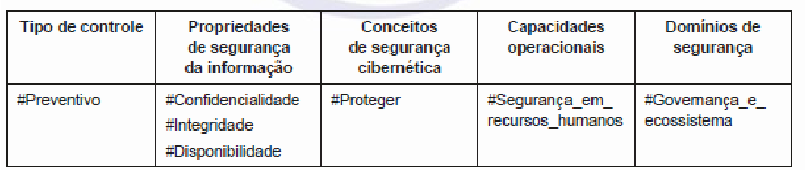

**CONTROLE -** Convém que verificações de antecedentes de todos os candidatos a serem contratados sejam realizadas antes de ingressarem na organização e de modo contínuo, de acordo com as leis, regulamentos e ética aplicáveis e que sejam proporcionais aos requisitos do negócio, à classificação das informações a serem acessadas e aos riscos percebidos. 

. 

**PROPÓSITO -** Assegurar que todo o pessoal seja elegível e adequado para os papéis para os quais são considerados e permaneça elegível e adequado durante sua contratação.

---

<!-- pagina: 55 -->

**André Castro Aula 02** 

---------------- 

### **6.2 Termos e condições de contratação** 

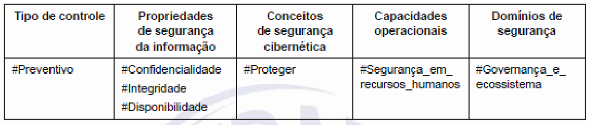

**CONTROLE -** Convém que os contratos trabalhistas declarem as responsabilidades do pessoal e da organização para a segurança da informação. 

**PROPÓSITO -** Assegurar que o pessoal entenda suas responsabilidades de segurança da informação para os papéis para os quais eles são considerados. 

-------------------------- 

### **6.3 Conscientização, educação e treinamento em Segurança da Informação** 

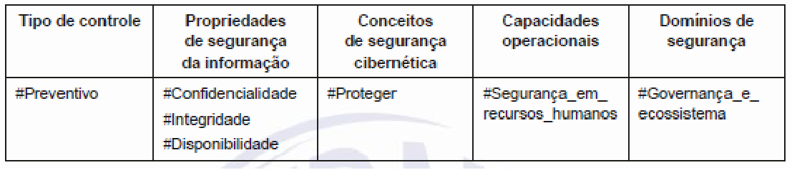

**CONTROLE -** Convém que o pessoal da organização e partes interessadas relevantes recebam treinamento, educação e conscientização em segurança da informação apropriados e atualizações regulares da política de segurança da informação da organização, políticas e procedimentos específicos por tema, pertinentes para as suas funções. 

**PROPÓSITO -** Assegurar que o pessoal e as partes interessadas pertinentes estejam cientes e cumpram suas responsabilidades de segurança da informação. 

----------------------------- 

- **6.4 Processo disciplinar**

---

<!-- pagina: 56 -->

**André Castro Aula 02** 

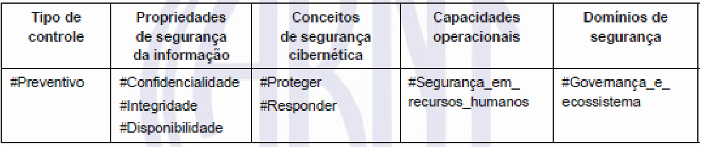

**CONTROLE -** Convém que um processo disciplinar seja formalizado e comunicado, para tomar ações contra pessoal e outras partes interessadas relevantes que tenham cometido uma violação da política de segurança da informação. 

**PROPÓSITO -** Assegurar que o pessoal e outras partes interessadas pertinentes entendam as consequências da violação da política de segurança da informação, para dissuadir e lidar adequadamente com as pessoas que cometeram a violação. 

---------------------------------- 

### **6.5 Responsabilidades após encerramento ou mudança da contratação** 

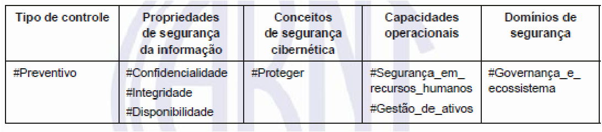

**CONTROLE -** Convém que as responsabilidades e funções de segurança da informação que permaneçam válidas após o encerramento ou mudança da contratação sejam definidos, aplicados e comunicados ao pessoal e outras partes interessadas pertinentes. 

**PROPÓSITO -** Proteger os interesses da organização como parte do processo de mudança ou encerramento da contratação ou de um contrato. 

---------------------------------- 

- **6.6 Acordos de confidencialidade ou não divulgação**

---

<!-- pagina: 57 -->

**André Castro Aula 02** 

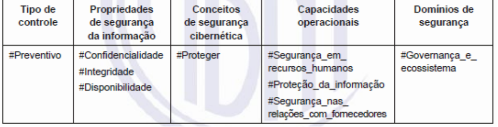

**CONTROLE -** Convém que acordos de confidencialidade ou não divulgação que reflitam as necessidades da organização para a proteção das informações sejam identificados, documentados, analisados criticamente em intervalos regulares e assinados por pessoal e outras partes interessadas pertinentes. 

**PROPÓSITO -** Manter a confidencialidade das informações acessíveis pelo pessoal ou por partes externas. 

---------------------------------- 

### **6.7 Trabalho remoto** 

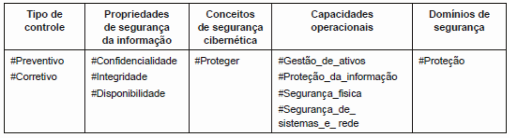

**CONTROLE -** Convém que medidas de segurança sejam implementadas quando as pessoas estiverem trabalhando remotamente para proteger as informações acessadas, tratadas ou armazenadas fora das instalações da organização. 

**PROPÓSITO -** Assegurar a segurança das informações quando o pessoal estiver trabalhando remotamente. 

---------------------------------- 

**6.8 Relato de eventos de segurança da informação**

---

<!-- pagina: 58 -->

**André Castro Aula 02** 

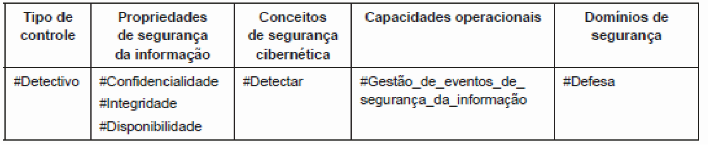

**CONTROLE -** Convém que a organização forneça um mecanismo para que as pessoas relatem eventos de segurança da informação observados ou suspeitos através de canais apropriados em tempo hábil. 

**PROPÓSITO -** Oferecer apoio em tempo hábil a relatos, consistentes e eficazes de eventos de segurança da informação que podem ser identificados pelo pessoal. 

Um primeiro destaque sobre esse ponto é a responsabilidade integrada de toda a organização. Ou seja, qualquer usuário deve ter consciência de suas responsabilidades sobre relatos de segurança da informação o mais rápido possível, com foco na mitigação dos riscos e impactos associados a incidentes. 

Saber os procedimentos e pontos de contato é uma tarefa básica, porém, deve estar muito claro para todos. Tais procedimentos devem ser simples e de fácil acesso. A norma entende como “Eventos de Segurança” quaisquer incidentes, violações e vulnerabilidades identificadas. 

A norma traz ainda uma lista de situações que devem ser consideradas como exemplo, e é um ponto de atenção para sua prova. Vejamos: 

a) controles de segurança da informação ineficazes; 

b) violação das expectativas de confidencialidade, integridade ou disponibilidade das informações; 

### **<u>c) erros humanos;</u>** 

d) não compliance com a política de segurança da informação, políticas específicas por tema ou normas aplicáveis; 

### **<u>e) violações de procedimentos de segurança física;</u>** 

f) mudanças de sistema que não passaram pelo processo de gestão de mudanças; 

g) defeitos ou outro comportamento anômalo do sistema de software ou hardware; 

h) violações de acesso; 

i) vulnerabilidades;

---

<!-- pagina: 59 -->

**André Castro Aula 02** 

j) suspeita de infecção por malware. 

A norma apresenta um contexto muito prático onde usuários mais ousados tendem a querer descobrir ou obter mais informações antes de gerar o relato. Testar vulnerabilidades pode ser interpretado como um potencial uso indevido do sistema e também pode causar danos ao sistema de informações ou serviço, podendo corromper ou tornar incompreensível as evidências digitais. Em última análise, isso pode resultar em responsabilidade legal para o indivíduo que realiza o teste. 

**CESPE / CEBRASPE - 2019 - TCE-RO - Analista de Tecnologia da Informação - Desenvolvimento de Sistemas** 

**Tendo em conta que todos os colaboradores de uma organização são responsáveis por notificar eventos de segurança da informação, nesse caso, com base na gestão de incidentes de segurança da informação da NBR ISO/IEC n.º 27002:2013, haverá notificação de evento de segurança da informação quando** 

A) ocorrer erros humanos. 

B) for admitido novo colaborador. 

C) for criado novo acesso à informação confidencial. 

D) houver modificação da política de segurança da informação. 

E) houver mudança programada em um ambiente de software. 

### **Comentários:** 

Apesar da questão fazer referência à norma antiga, essa lista foi incorporada pela nova versão. 

**Gabarito** : A 

## **7. Controles Físicos** 

- **7.1 Perímetros de segurança física**

---

<!-- pagina: 60 -->

**André Castro Aula 02** 

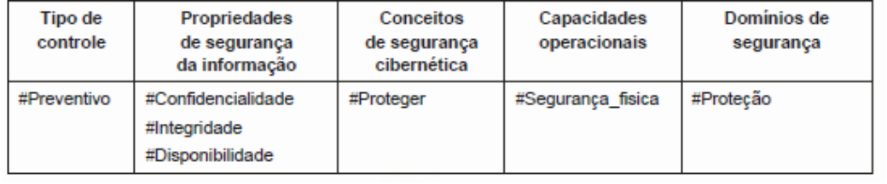

**CONTROLE -** Convém que perímetros de segurança sejam definidos e usados para proteger áreas que contenham informações e outros ativos associados. 

**PROPÓSITO -** Evitar acesso físico não autorizado, danos e interferências nas informações da organização e outros ativos associados. 

---------------------------------- 

### **7.2 Entrada física** 

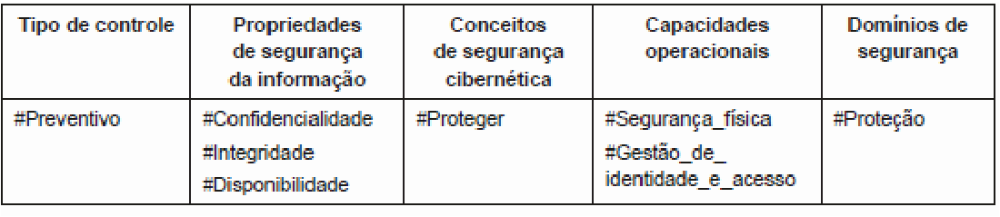

**CONTROLE -** Convém que as áreas seguras sejam protegidas por controles de entrada e pontos de acesso apropriados. 

**PROPÓSITO -** Assegurar que ocorra apenas acesso físico autorizado às informações da organização e outros ativos associados. 

Convém que os pontos de acesso, como áreas de entrega e carregamento e outros pontos onde pessoas não autorizadas podem entrar nas instalações, sejam controlados e, se possível, isolados dos recursos de tratamento da informação, para evitar acesso não autorizado. 

Como é uma temática que recorrentemente é cobrada em provas de forma específica e às vezes isolada, com itens próprios em edital, vamos trazer as três perspectivas da norma ao considerar os usuários internos, os visitantes e áreas de entrega e carregamento. 

Para os usuários internos, convém: 

a) restringir o acesso aos locais e edifícios apenas ao pessoal autorizado. Convém que o processo de gestão dos direitos de acesso às áreas físicas inclua o fornecimento, análise crítica periódica, atualização e revogação das autorizações;

---

<!-- pagina: 61 -->

**André Castro Aula 02** 

b) manter e monitorar de forma segura um livro de registro físico ou trilha de auditoria eletrônica de todos os acessos e proteger todos os registros e informações de autenticação sensíveis; 

c) estabelecer e implementar um processo e mecanismos técnicos para a gestão do acesso às áreas onde a informação é tratada ou armazenada. Os mecanismos de autenticação incluem o uso de cartões de acesso, biometria ou autenticação de dois fatores, como um cartão de acesso e PIN secreto. Convém que sejam consideradas portas duplas de segurança para acesso a áreas sensíveis; 

d) implantar uma área de recepção monitorada pelo pessoal ou outros meios para controlar o acesso físico ao local ou edifício; 

e) inspecionar e examinar pertences pessoais do pessoal e partes interessadas no momento da entrada e saída; 

f) requerer que todo o pessoal e as partes interessadas usem algum tipo visível de identificação e notifiquem imediatamente o pessoal de segurança se encontrarem visitantes não acompanhados e qualquer pessoa que não esteja usando uma identificação visível. Convém que crachás facilmente distinguíveis sejam considerados para melhor identificar funcionários permanentes, fornecedores e visitantes; 

g) conceder acesso restrito ao pessoal do fornecedor a áreas seguras ou recursos de tratamento da informação apenas quando necessário. Convém que esse acesso seja autorizado e monitorado; 

h) dar atenção especial à segurança de acesso físico no caso de edifícios que detêm ativos para várias organizações; 

i) elaborar medidas de segurança física que possam ser reforçadas quando a probabilidade de incidentes físicos aumentar; 

j) proteger outros pontos de entrada contra acesso não autorizado, como saídas de emergência; 

k) implantar um processo de gerenciamento chave para assegurar o gerenciamento das chaves físicas ou informações de autenticação (por exemplo, códigos de bloqueio, fechaduras de combinação para escritórios, salas e instalações, como armários de chaves) e para assegurar um livro de registro ou auditoria anual de chaves e que o acesso para as chaves físicas ou informações de autenticação seja controlado (ver 5.17 para obter mais orientações sobre informações de autenticação). 

**Já para os visitantes** , convém observar as seguintes diretrizes: 

a) autenticar a identidade dos visitantes por meios apropriados;

---

<!-- pagina: 62 -->

**André Castro Aula 02** 

b) registrar a data e a hora de entrada e saída dos visitantes; 

c) permitir o acesso apenas para visitantes para fins específicos e autorizados e com instruções 

sobre os requisitos de segurança da área e procedimentos de emergência; 

d) supervisionar todos os visitantes, a menos que uma exceção explícita seja concedida. 

Por fim, quanto às áreas de entrega: 

a) restringir o acesso a áreas de entrega e carregamento da área exterior do prédio para o pessoal identificado e autorizado; 

b) projetar as áreas de entrega e carregamento para que as entregas possam ser carregadas e descarregadas sem que o entregador obtenha acesso não autorizado a outras partes do edifício; 

c) proteger as portas externas das áreas de entrega e carregamento quando as portas para as áreas restritas são abertas; 

d) inspecionar e examinar as entregas recebidas para detecção de explosivos, produtos químicos ou outros materiais perigosos antes de serem transportados de áreas de entrega e carregamento; 

e) registrar as entregas recebidas de acordo com os procedimentos de gestão de ativos quando da sua entrada no local; 

f) segregar fisicamente remessas de entrada e saída, sempre que possível; 

g) inspecionar materiais recebidos para evidenciar adulteração no caminho. Se a adulteração for descoberta, convém que ela seja imediatamente reportada ao pessoal da segurança. 

---------------------------------- 

- **7.3 Segurança de escritórios, salas e instalações**

---

<!-- pagina: 63 -->

**André Castro Aula 02** 

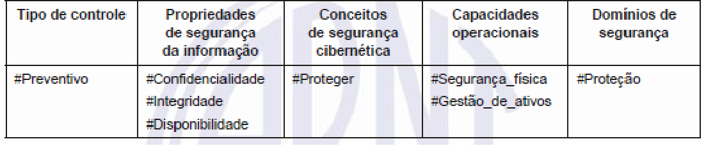

**CONTROLE -** Convém que seja projetada e implementada segurança física para escritórios, salas e instalações. 

**PROPÓSITO -** Evitar acesso físico não autorizado, danos e interferências nas informações da organização e outros ativos associados em escritórios, salas e instalações. 

---------------- 

### **7.4 Monitoramento de segurança física [NOVO]** 

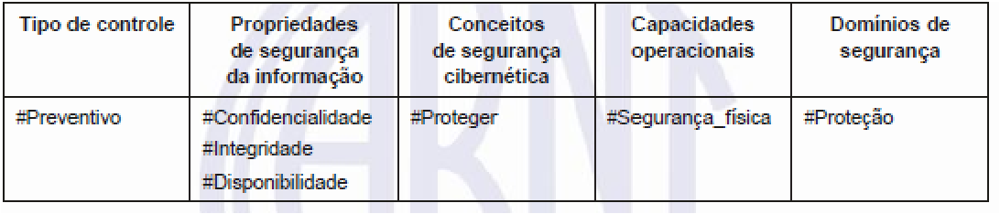

**CONTROLE -** Convém que as instalações sejam monitoradas continuamente para acesso físico não autorizado. 

**PROPÓSITO -** Detectar e impedir o acesso físico não autorizado. 

Temos aqui mais um controle do rol de novidades da ISO, muito focado no controle físico tradicional que conhecemos à luz de monitoramento. 

Convém que as instalações físicas sejam monitoradas por sistemas de vigilância, que podem incluir guardas, alarmes de intrusos, sistemas de videomonitoramento, como de circuito fechado de TV e software de gerenciamento de informações de segurança física, gerenciados internamente ou por um provedor de serviços de monitoramento. 

Um ponto interessante que a norma traz é de se manter em sigilo o local de monitoramento, para evitar que pessoas mal intencionadas, após atos indevidos, possam destruir as evidências. E, obviamente, esse setor de monitoramento deve ser devidamente protegido. 

A ISO se preocupou ainda com vazamento de dados e uso indevido. Convém que qualquer mecanismo de monitoramento e gravação seja usado levando em consideração as leis e

---

<!-- pagina: 64 -->

**André Castro Aula 02** 

regulamentos locais, incluindo a legislação de proteção de dados e proteção de DP, especialmente em relação ao monitoramento de pessoal e períodos de retenção de vídeos gravados. 

--------------------------- 

### **7.5 Proteção contra ameaças físicas e ambientais** 

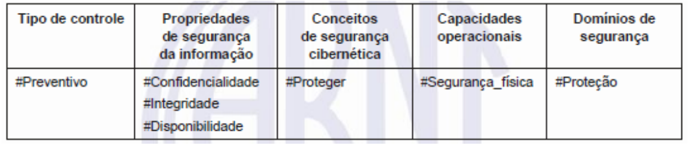

**CONTROLE -** Convém que a proteção contra ameaças físicas e ambientais, como desastres naturais e outras ameaças físicas intencionais ou não intencionais à infraestrutura, seja projetada e implementada 

**PROPÓSITO -** Prevenir ou reduzir as consequências de eventos originários de ameaças físicas e ambientais. 

--------------------------- 

### **7.6 Trabalho em áreas seguras** 

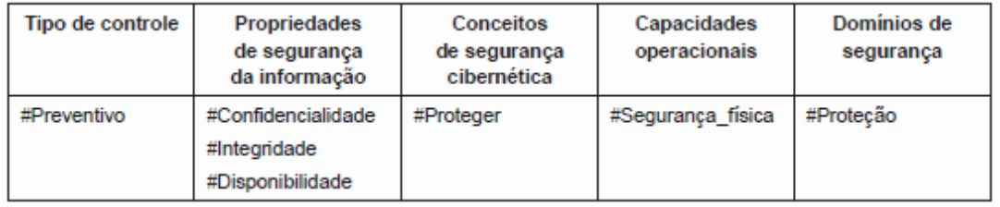

**CONTROLE -** Convém que medidas de segurança para trabalhar em áreas seguras sejam projetadas e implementadas. 

**PROPÓSITO -** Proteger as informações e outros ativos associados em áreas seguras contra danos e interferência não autorizada do pessoal que trabalha nessas áreas. 

----------------------------- 

- **7.7 Mesa limpa e tela limpa**

---

<!-- pagina: 65 -->

**André Castro Aula 02** 

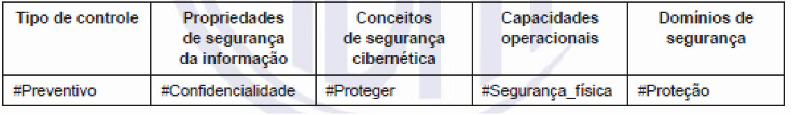

**CONTROLE -** Convém que regras de mesa limpa para documentos impressos e mídia de armazenamento removível e regras de tela limpa para os recursos de tratamento das informações sejam definidas e adequadamente aplicadas. 

**PROPÓSITO -** Reduzir os riscos de acesso não autorizado, perda e danos às informações em mesas, telas e em outros locais acessíveis durante e fora do horário comercial. 

Tal prática é muito importante no dia a dia das organizações, de tal modo que manteve-se um controle específico e próprio para ele. 

Basicamente, a essência aqui reside na prática de não deixar informações de login e senha expostas seja em meio físico (anotado em papéis ou em qualquer lugar na mesa), ou ainda em meio digital (blocos de notas ou widgets próprios de fácil acesso). 

Convém que as seguintes diretrizes sejam consideradas: 

a) bloquear informações de negócios sensíveis ou críticas (por exemplo, em papel ou em mídia de armazenamento eletrônico), idealmente em um cofre, gabinete ou outra forma de mobiliário de segurança quando não mais requerida, especialmente quando o escritório estiver desocupado; 

<u>b) proteger os dispositivos endpoint do usuário através de cadeados ou outros meios de segurança quando não estiver em uso ou sem vigilância;</u> 

c) encerrar sessões nos dispositivos endpoint do usuário ou proteger por um mecanismo de bloqueio de tela e de teclado, controlado por um mecanismo de autenticação do usuário quando sem supervisão. Convém que os computadores e sistemas sejam configurados com um recurso de tempo-limite ou encerramento de sessão automáticos; 

<u>d) fazer com que o autor colete saídas de impressoras ou multifuncionais imediatamente. Usar impressoras com uma função de autenticação, de modo que os autores são os únicos que podem obter suas impressões e somente quando estão ao lado da impressora;</u> 

e) armazenar de forma segura documentos e mídia de armazenamento removível contendo informações confidenciais e, quando não for mais necessário, descartá-los usando mecanismos de descarte seguro; 

f) estabelecer e comunicar regras e orientações para a configuração de alertas nas telas (por exemplo, desligar os novos alertas de e-mail e mensagens, se possível, durante apresentações, compartilhamento de tela ou em área pública);

---

<!-- pagina: 66 -->

**André Castro Aula 02** 

<u>g) limpar informações confdenciais ou críticas em quadros brancos e outros tipos de recursos de exibição quando não for mais necessário.</u> 

**FGV - 2022 - TJ-TO - Técnico Judiciário – Informática** 

**A equipe de segurança de um órgão público decidiu implantar inúmeras medidas de forma a elevar o nível de segurança do órgão.** 

**A medida que a equipe de segurança deve adotar para atender ao requisito de confidencialidade é a:** 

A) utilização de função de hash criptográfico; 

- B) realização de backups periódicos; 

C) política de mesa limpa; 

- D) gravação das ações dos usuários em log; 

E) implantação de redundâncias. 

### **Comentários:** 

Apesar da questão referenciar a norma na versão antiga, há uma vicnulação direta aos mesmos conceitos. 

**Gabarito** : C 

----------------------------- 

### **7.8 Localização e proteção de equipamentos** 

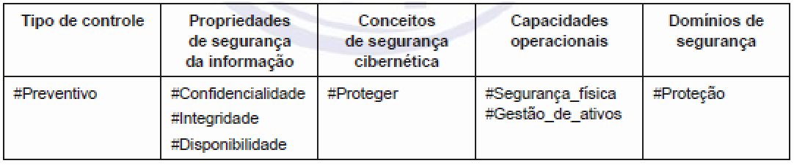

**CONTROLE -** Convém que os equipamentos sejam posicionados com segurança e proteção.

---

<!-- pagina: 67 -->

**André Castro Aula 02** 

**PROPÓSITO -** Reduzir os riscos de ameaças físicas e ambientais, e de acesso não autorizado e danos. 

----------------------------- 

### **7.9 Segurança de ativos fora das instalações da organização** 

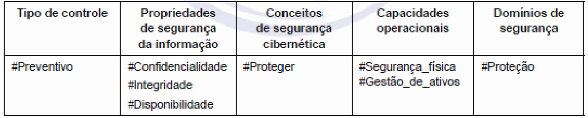

**CONTROLE -** Convém proteger os ativos fora das instalações da organização 

**PROPÓSITO -** Evitar perdas, danos, roubos ou comprometimento de ativos fora das instalações da organização e interrupção da operação da organização. 

Temos aqui um controle que tem muito efeito prático no contexto atual pós-pandemia, principalmente devido ao trabalho híbrido e remoto. 

Qualquer dispositivo usado fora das instalações da organização que armazene ou trate informações (por exemplo, dispositivo móvel), incluindo dispositivos pertencentes à organização e dispositivos de propriedade privada e usados em nome da organização (BYOD) necessita estar protegido. Convém que o uso desses dispositivos seja autorizado pela direção. 

Convém que sejam consideradas as seguintes diretrizes para a proteção de equipamentos que armazenam ou tratam informações fora das instalações da organização: 

a) não deixar sem vigilância os equipamentos e meios de armazenamento retirados das instalações da organização, em locais públicos e inseguros; 

b) observar as instruções dos fabricantes para proteger os equipamentos o tempo todo (por exemplo, proteção contra exposição a fortes campos eletromagnéticos, água, calor, umidade, poeira); 

c) quando equipamentos fora das instalações forem transferidos entre diferentes indivíduos ou partes interessadas, manter um registro que defina a cadeia de custódia dos equipamentos, incluindo pelo menos nomes e organizações dos responsáveis pelo equipamento. Convém que as informações que não precisam ser transferidas com o ativo sejam excluídas com segurança antes da transferência;

---

<!-- pagina: 68 -->

**André Castro Aula 02** 

d) quando necessário e possível, exigir autorização para que equipamentos e mídias sejam removidos das instalações da organização e manter um registro dessas remoções a fim de manter uma trilha de auditoria ; 

e) proteger contra a visualização de informações no dispositivo (por exemplo, celular ou laptop) no transporte público, e os riscos associados a espiar por cima dos ombros; 

f) implementar o rastreamento de localização e a capacidade de limpeza remota de dispositivos. 

----------------------------- 

### **7.10 Mídia de armazenamento** 

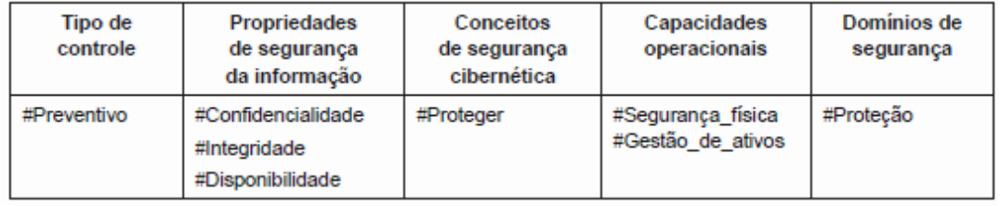

**CONTROLE -** Convém que as mídias de armazenamento sejam gerenciadas por seu ciclo de vida de aquisição, uso, transporte e descarte, de acordo com o esquema de classificação e com os requisitos de manuseio da organização. 

**PROPÓSITO -** Assegurar a divulgação, modificação, remoção ou destruição de informações apenas de forma autorizada sobre as mídias de armazenamento. 

Temos aqui um controle que as bancas gostam muito de cobrar em provas. Por esse motivo, vamos detalhar alguns pontos. 

Convém que sejam consideradas as seguintes diretrizes para o gerenciamento de mídias de armazenamento removíveis: 

a) estabelecer uma política específica por tema sobre o gerenciamento de mídia de armazenamento removível e comunicar essa política específica por tema para qualquer pessoa que use ou manuseie mídia de armazenamento removível; 

b) quando necessário e possível, exigir autorização para que os meios de armazenamento sejam removidos da organização e manter um registro dessas remoções, a fim de manter uma trilha de auditoria; 

c) armazenar todas as mídias de armazenamento em um ambiente seguro e protegido de acordo com a classificação de suas informações e protegê-las contra ameaças ambientais

---

<!-- pagina: 69 -->

**André Castro Aula 02** 

(como calor, umidade, ambiente úmido, campo eletrônico ou envelhecimento), de acordo com as especificações dos fabricantes; 

d) usar técnicas criptográficas para proteger informações nas mídias de armazenamento removíveis, se a confidencialidade ou a integridade das informações forem considerações importantes; 

e) mitigar o risco de degradação de mídia de armazenamento, enquanto as informações armazenadas ainda forem necessárias, transferindo as informações para novas mídias de armazenamento antes de se tornarem ilegíveis; 

f) armazenar múltiplas cópias de informações de grande valor, em mídias de armazenamento separadas, para reduzir ainda mais o risco de dano ou perda de informações coincidentes; 

g) considerar o registro das mídias de armazenamento removível para limitar a chance de perda de informações; 

### **<u>Ainda, este controle faz referência à Reutilização ou descarte seguro.</u>** 

**Convém que os procedimentos para a reutilização ou descarte seguro de mídia de armazenamento sejam estabelecidos para minimizar o risco de vazamento de informações confidenciais a pessoas não autorizadas. Convém que os procedimentos de reutilização ou descarte seguro de meios de armazenamento contendo informações confidenciais sejam proporcionais à sensibilidade dessas informações. Convém que os seguintes itens sejam considerados:** 

**a) se as mídias de armazenamento contendo informações confidenciais precisarem ser reutilizadas dentro da organização, excluir os dados com segurança ou formatar a mídia de armazenamento antes de reutilizar ;** 

**b) descartar de forma segura a mídia de armazenamento contendo informações confidenciais, quando não forem mais necessárias (por exemplo, destruindo, triturando ou excluindo o conteúdo com segurança);** 

**c) ter procedimentos implementados para identificar os itens que podem exigir descarte seguro;** 

**d) muitas organizações oferecem serviços de coleta e descarte para mídia de armazenamento. Convém tomar o devido cuidado na seleção de um fornecedor externo apropriado com controles e experiência adequados;** 

**e) registrar o descarte de itens sensíveis, a fim de manter uma trilha de auditoria;** 

**f) ao acumular mídia de armazenamento para descarte, considerar o efeito de agregação, que pode fazer com que uma grande quantidade de informações não sensíveis se torne sensível.**

---

<!-- pagina: 70 -->

**André Castro Aula 02** 

**Convém que um processo de avaliação de risco seja realizado em dispositivos danificados contendo dados sensíveis, para determinar se convém que os itens sejam fisicamente destruídos em vez de enviados para reparo ou descartados.** 

----------------------------- 

### **7.11 Serviços de infraestrutura** 

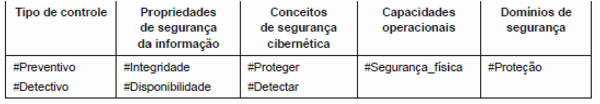

**CONTROLE -** Convém que as instalações de tratamento de informações sejam protegidas contra falhas de energia e outras disrupções causadas por falhas nos serviços de infraestrutura. 

**PROPÓSITO -** Evitar perdas, danos ou comprometimento de informações e outros ativos associados, ou a interrupção das operações da organização devido à falha e disrupção nos serviços de infraestrutura. 

----------------------------- 

### **7.12 Segurança do cabeamento** 

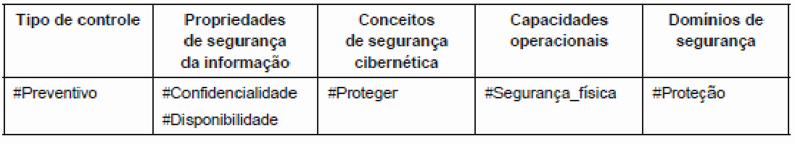

**CONTROLE -** Convém que os cabos que transportam energia ou dados ou que sustentam serviços de informação sejam protegidos contra interceptação, interferência ou danos. 

**PROPÓSITO -** Evitar perdas, danos, roubo ou comprometimento de informações e outros ativos associados à interrupção das operações da organização relacionadas ao cabeamento de energia e de comunicação. 

----------------------------- 

- **7.13 Manutenção de equipamentos**

---

<!-- pagina: 71 -->

**André Castro Aula 02** 

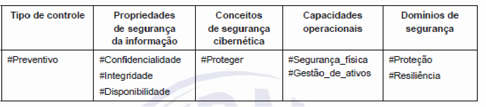

**CONTROLE -** Convém que os equipamentos sejam mantidos corretamente para assegurar a disponibilidade, integridade e confidencialidade da informação. 

**PROPÓSITO -** Evitar perdas, danos, roubos ou comprometimento de informações e outros ativos associados e interrupção das operações da organização causada pela falta de manutenção. 

----------------------------- 

### **7.14 Descarte seguro ou reutilização de equipamentos** 

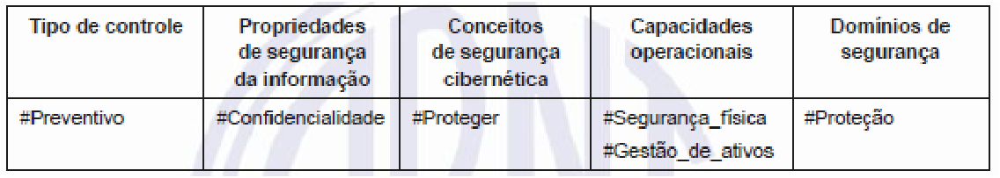

**CONTROLE -** Convém que sejam verificados os itens dos equipamentos que contenham mídia de armazenamento, para assegurar que quaisquer dados confidenciais e software licenciado tenham sido removidos ou substituídos com segurança antes do descarte ou reutilização 

**PROPÓSITO -** Evitar o vazamento de informações por equipamento que seja descartado ou reutilizado. 

----------------------------- 

## **8. Controles tecnológicos** 

- **8.1 Dispositivos endpoint do usuário**

---

<!-- pagina: 72 -->

**André Castro Aula 02** 

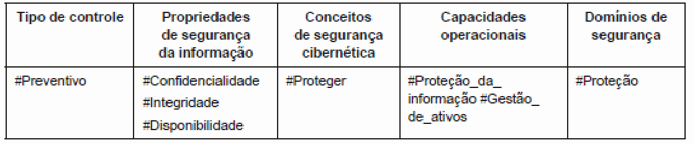

**CONTROLE -** Convém que as informações armazenadas, tratadas ou acessíveis por meio de dispositivos endpoint do usuário sejam protegidas. 

**PROPÓSITO -** Proteger informações contra os riscos introduzidos pelo uso de dispositivos endpoint do usuário. 

----------------------------- 

### **8.2 Direitos de acessos privilegiados** 

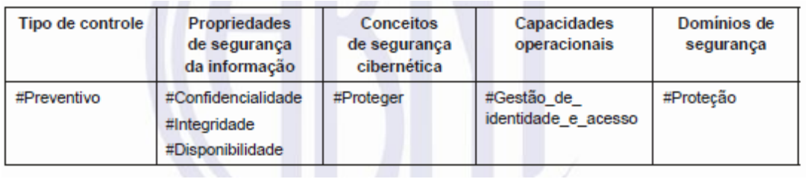

**CONTROLE -** Convém restringir e gerenciar a atribuição e o uso de direitos de acessos privilegiados. 

**PROPÓSITO -** Assegurar que apenas usuários, componentes de software e serviços autorizados recebam direitos de acessos privilegiados. 

----------------------------- 

### **8.3 Restrição de acesso à informação** 

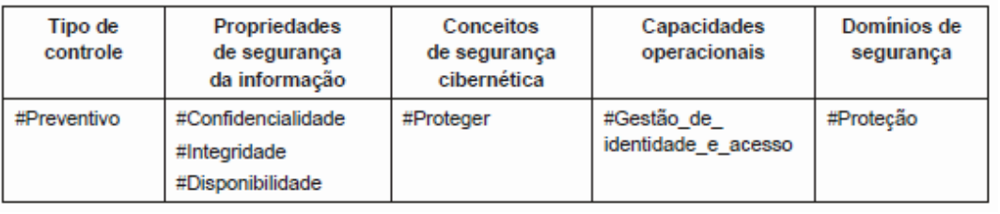

---

<!-- pagina: 73 -->

**André Castro Aula 02** 

**CONTROLE -** Convém que o acesso às informações e outros ativos associados seja restrito de acordo com a política específica por tema sobre controle de acesso. 

**PROPÓSITO -** Assegurar apenas o acesso autorizado e impedir o acesso não autorizado a informações e a outros ativos associados. 

----------------------------- 

### **8.4 Acesso ao Código-fonte** 

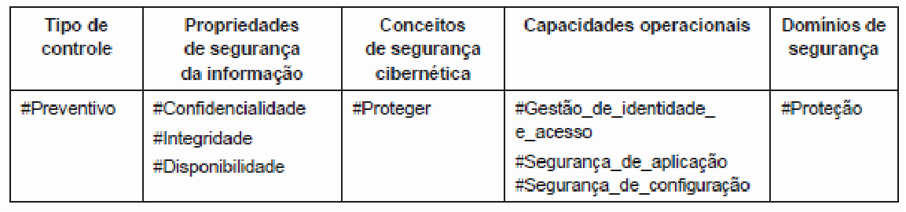

**CONTROLE -** Convém que os acessos de leitura e escrita ao código-fonte, ferramentas de desenvolvimento e bibliotecas de software sejam adequadamente gerenciados. 

**PROPÓSITO -** Evitar a introdução de funcionalidades não autorizadas, prevenir mudanças não intencionais ou maliciosas e manter a confidencialidade de propriedade intelectual valiosa. 

Não é muito difícil imaginar que o acesso ao código-fonte deve ser restrito.Para o código-fonte, isso pode ser alcançado controlando o armazenamento central de tal código, de preferência no sistema de gerenciamento de código-fonte. 

Quando os componentes de código são usados por vários desenvolvedores dentro de uma organização, convém que um acesso de leitura a um repositório centralizado de código seja implementado. Além disso, se o código-fonte aberto ou componentes de código de terceiros forem usados dentro de uma organização, o acesso de leitura a esses repositórios de código externo pode ser amplamente fornecido. No entanto, convém que o acesso de gravação ainda seja restrito. 

Nesse quesito, o que costuma aparecer em provas são os termos operacionais de como proceder. 

Convém que as seguintes diretrizes sejam consideradas para controlar o acesso às bibliotecas de código do programa, a fim de reduzir o potencial de corrupção de programas de computador:

---

<!-- pagina: 74 -->

**André Castro Aula 02** 

a) gerenciar o acesso ao código-fonte do programa e às bibliotecas de origem do programa de acordo com procedimentos estabelecidos; 

b) conceder acesso de leitura e de escrita ao código-fonte com base nos requisitos de negócio e na gestão de tratativas de riscos de alteração ou uso indevido e de acordo com procedimentos estabelecidos; 

<u>c) atualizar o código-fonte e os itens associados, conceder acesso ao código-fonte de</u> - <u>acordo com os procedimentos de controle de mudança e somente executá lo após a autorização adequada ter sido recebida;</u> 

- <u>d) não conceder aos desenvolvedores acesso direto ao repositório de código fonte, mas sim por meio de ferramentas de desenvolvedor que controlem atividades e autorizações</u> - <u>no código fonte;</u> 

e) armazenar listagem dos programas em um ambiente seguro, onde o acesso à leitura e escrita seja devidamente gerenciado e atribuído; 

<u>f) manter um registro de auditoria de todos os acessos e de todas as alterações no código-fonte.</u> 

Se o código-fonte do programa for destinado a ser publicado, convém que sejam considerados controles adicionais para fornecer garantia sobre a sua integridade (por exemplo, assinatura digital). 

**CESPE – ABIN – Oficial Técnico de Inteligência – Área 8/2018** 

**As bibliotecas das fontes dos programas de uma organização devem ser mantidas no mesmo ambiente computacional do sistema operacional, com o objetivo de facilitar atividades de auditoria.** 

**Comentários:** 

**Apesar de ser uma questão da norma anterior, vejam que ela fere o princípio da segregação das bibliotecas e visão do repositório de fontes centralizado.** 

**Gabarito** : E 

----------------------------- 

**8.5 Autenticação segura**

---

<!-- pagina: 75 -->

**André Castro Aula 02** 

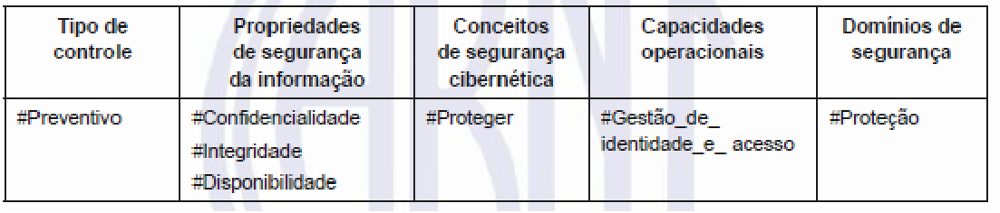

**CONTROLE -** Convém que sejam implementadas tecnologias e procedimentos de autenticação seguros, com base em restrições de acesso à informação e à política específica por tema de controle de acesso. 

**PROPÓSITO -** Assegurar que um usuário ou uma entidade seja autenticada com segurança, quando o acesso a sistemas, aplicações e serviços é concedido. 

O primeiro destaque é que a autenticação não se restringe a usuários. Assim, é importante associar técnicas de autenticação adequadas para comprovar a identidade dos usuários, softwares, mensagens e outras entidades. 

A complexidade e “força” da autenticação deve estar diretamente associada às entidades e seus respectivos tratamento de informação, ou seja, quanto mais sensível, maior a força da autenticação como certificados digitais, biometria, múltiplo fator de autenticação (MFA), entre outros. 

Usar uma combinação de múltiplos fatores de autenticação, como o que você sabe, o que você tem e o que você é, reduz as possibilidades de acessos não autorizados. A autenticação multifatores pode ser combinada com outras técnicas para exigir fatores adicionais em circunstâncias específicas, com base em regras e padrões predefinidos, como o acesso a partir de um local incomum, a partir de um dispositivo incomum ou em um momento incomum. 

Um ponto que tem aparecido em prova é a lista de procedimentos a serem considerados no procedimento de LOG-ON. Portanto, é importante trazer o conteúdo exato da norma para absorvermos o conhecimento: 

Convém que os procedimentos e tecnologias de acesso ao sistema sejam implementados considerando o seguinte:

---

<!-- pagina: 76 -->

**André Castro Aula 02** 

a) não exibir informações sensíveis do sistema ou do aplicativo até que o processo de log-on no sistema tenha sido concluído com sucesso, a fm de evitar fornecer a um usuário <u>não autorizado qualquer assistência desnecessária;</u> 

b) exibir um aviso público de que convém que o sistema, aplicativo ou serviço só sejam acessados por usuários autorizados; 

c) <u>não fornecer mensagens de ajuda durante o procedimento de acesso ao sistema que auxiliariam um usuário não autorizado (por exemplo, se houver uma condição de erro, não</u> convém que o sistema indique qual parte dos dados está correta ou incorreta); 

d) validar as informações de log-on no sistema somente na conclusão de todos os dados de entrada; 

e) proteger contra tentativas de log-on com força bruta em nomes de usuário e senhas <u>(por exemplo, usando o CAPTCHA,</u> exigindo redefinição de senha após um número predefinido de tentativas fracassadas ou bloqueando o usuário após um número máximo de erros); 

f) **registrar as tentativas malsucedidas e bem-sucedidas;** 

g) criar um evento de segurança, se for detectada uma possível tentativa ou violação bem-sucedida de controles de acesso ao sistema (por exemplo, enviando um alerta para o usuário e os administradores do sistema da organização quando um determinado número de tentativas erradas de senha foi alcançado); 

h) exibir ou enviar as seguintes informações em um canal separado na conclusão de um acesso bem-sucedido: 

1) data e hora do log-on anterior bem-sucedido ao sistema; 

2) detalhes de quaisquer tentativas de log-on malsucedidas desde o último log-on bem-sucedido 

ao sistema; 

i) não exibir a senha em texto claro quando ela estiver sendo inserida; em alguns casos, pode ser necessário desativar essa funcionalidade para facilitar o acesso ao sistema pelo usuário (por exemplo, por razões de acessibilidade ou para evitar o bloqueio de usuários por causa de erros repetidos); 

j) não transmitir senhas em texto claro pela rede para evitar a captura por um programa de “sniffer” de rede; 

k) finalizar sessões inativas após um período especificado de inatividade, especialmente em locais de alto risco, como áreas públicas ou externas fora da gestão de segurança da organização ou em dispositivos de terminal do usuário;

---

<!-- pagina: 77 -->

**André Castro Aula 02** 

l) restringir os tempos de duração da conexão para fornecer segurança adicional para aplicações de alto risco e reduzir a janela de oportunidade para acesso não autorizado. 

----------------------------- 

### **8.6 Gestão de capacidade** 

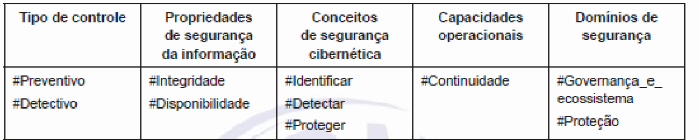

**CONTROLE -Convém que o uso dos recursos seja monitorado e ajustado de acordo com os requisitos atuais e esperados de capacidade.** 

**PROPÓSITO -** Assegurar a capacidade necessária dos recursos de tratamento de informações, recursos humanos, escritórios e outros serviços de infraestrutura. 

----------------------------- 

### **8.7 Proteção contra malware** 

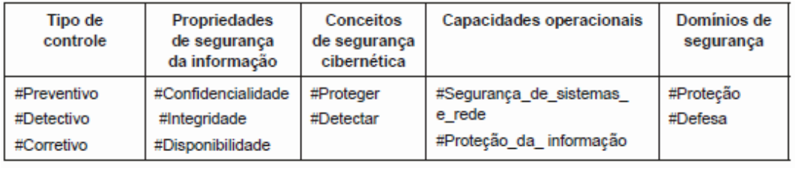

**CONTROLE - Convém que a proteção contra malware seja implementada e apoiada pela conscientização adequada do usuário.** 

**PROPÓSITO -** Assegurar que informações e outros ativos associados estejam protegidos contra malware. 

Aqui temos mais um controle extremamente importante e prático para as organizações, e que as bancas costumam apresentar itens soltos. Assim, vamos tratar o conteúdo completo deste controle com os destaques.

---

<!-- pagina: 78 -->

**André Castro Aula 02** 

Convém que a proteção contra malware seja baseada em software de detecção e reparo de malware, conscientização sobre segurança da informação, acesso adequado aos sistemas e controles de gestão de mudanças. **<u>O uso de software de detecção e reparo de malware sozinho não costuma ser adequado.</u>** Convém considerar as seguinte orientações: 

a) implementar regras e controles que impeçam ou detectem o uso de software não autorizado [por exemplo, lista de aplicações permitidos (ou seja, uso de uma lista que fornece aplicações autorizadas)] ; 

b) implementar controles que previnam ou detectem o uso de sites maliciosos conhecidos ou suspeitos (por exemplo, lista de bloqueio); 

c) reduzir vulnerabilidades que possam ser exploradas por malware [por exemplo, por meio de gestão de vulnerabilidades técnicas]; 

d) realizar validação automatizada regular do software e do conteúdo de dados dos sistemas, especialmente para sistemas que suportem processos de negócios críticos; investigar a presença de quaisquer arquivos não aprovados ou alterações não autorizadas; 

e) estabelecer medidas de proteção contra riscos associados à obtenção de arquivos e softwares de redes externas ou em qualquer outro meio; 

f) instalar e atualizar regularmente o software de detecção malware e recorrer ao software para varrer computadores e mídia de armazenamento eletrônico. Realizar varreduras regulares inclui: 

1) varrer quaisquer dados recebidos por meio de redes ou de qualquer forma de mídia de armazenamento eletrônico para identificar malware antes do uso; 

2) varrer anexos de e-mail, mensagens instantâneas e downloads em busca de malware antes do uso. Realizar essa varredura em diferentes locais (por exemplo, em servidores de e-mail, computadores desktop) e ao entrar na rede da organização; 

3) varrer páginas da web em busca de malware, quando acessadas; 

g) determinar a atribuição e configuração de ferramentas de detecção e reparo de malware com base nos resultados da avaliação de risco e considerando: 

**<u>1) princípios de defesa em profundidade onde possam ser mais efetivos. Por exemplo, isso pode levar à detecção de malware em um gateway de rede (em vários</u> -** **<u>protocolos de aplicações, como e mail, transferência de arquivos e web), bem como dispositivos endpoint do usuário e servidores;</u>** 

2) as técnicas evasivas dos atacantes (por exemplo, o uso de arquivos criptografados) para fornecer malware ou o uso de protocolos de criptografia para transmitir malware;

---

<!-- pagina: 79 -->

**André Castro Aula 02** 

h) ter cuidado para proteger contra a introdução de malware durante os procedimentos de manutenção e emergência, que podem contornar controles normais contra malware; 

i) implementar um processo para autorizar desativar temporariamente ou permanentemente algumas ou todas as medidas contra malware, incluindo autoridades de aprovação de exceção, justificativa documentada e data da análise crítica. Isso pode ser necessário quando a proteção contra malware causar disrupção em operações normais; 

j) elaborar planos adequados de continuidade de negócios para recuperação de ataques de malware, incluindo todas as cópias de segurança de dados e software necessários (incluindo cópia de segurança on-line e off-line) e medidas de recuperação (ver 8.13); 

k) isolar ambientes onde consequências catastróficas possam ocorrer; 

l) determinar procedimentos e responsabilidades para lidar com a proteção contra malware em sistemas, incluindo treinamento em seu uso, emissão de comunicação e recuperação de ataques de malware; 

m) prover conscientização ou treinamento (ver 6.3) a todos os usuários sobre como identificar e potencialmente mitigar o recebimento, envio ou instalação de e-mails, arquivos ou programas infectados por malware [as informações coletadas em n) e em o) podem ser usadas para assegurar que a conscientização e o treinamento sejam mantidos atualizados]; 

n) implementar procedimentos para coletar regularmente informações sobre novos malwares, por exemplo, assinar listas de discussão ou analisar criticamente websites relevantes; 

o) verificar se informações relacionadas a malware, como as de boletins de aviso, vêm de fontes qualificadas e respeitáveis (por exemplo, sites confiáveis da internet ou fornecedores de software de detecção de malware) e se são precisas e informativas. 

----------------------------- 

### **8.8 Gestão de vulnerabilidades técnicas** 

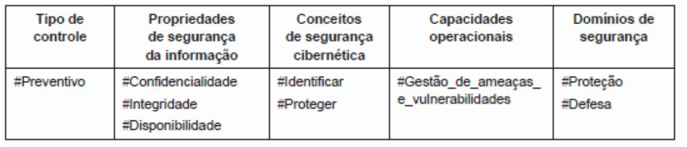

---

<!-- pagina: 80 -->

**André Castro Aula 02** 

**CONTROLE - Convém que informações sobre vulnerabilidades técnicas dos sistemas de informação em uso sejam obtidas, a exposição da organização a tais vulnerabilidades sejam avaliadas e medidas apropriadas sejam tomadas.** 

**PROPÓSITO -** Evitar a exploração de vulnerabilidades técnicas. 

----------------------------- 

### **8.9 Gestão de configuração [NOVO]** 

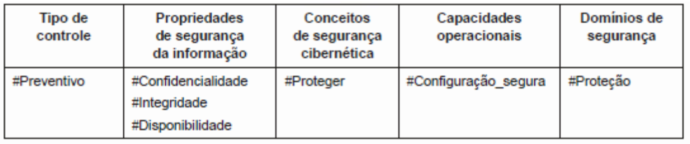

**CONTROLE - Convém que as configurações, incluindo configurações de segurança, de hardware, software, serviços e redes sejam estabelecidas, documentadas, implementadas, monitoradas e analisadas criticamente** 

**PROPÓSITO -** Assegurar que o hardware, o software, os serviços e as redes funcionem corretamente com as configurações de segurança necessárias, e que a configuração não seja alterada por alterações não autorizadas ou incorretas. 

Temos uma disciplina do ITIL importante associada aqui, e também a diversas práticas de segurança. Basicamente, as referências apresentadas aqui são as famosas baselines de configuração, que buscam constantemente estabelecer um processo sólido de HARDENING nas organizações, que é basicamente tornar os servidores e dispositivos que armazenam recursos mais robustos possíveis, diminuindo assim as superfícies de ataques. 

Convém que a organização defina e implemente processos e ferramentas para impor as configurações definidas (incluindo configurações de segurança) para hardware, software, serviços (por exemplo, serviços em nuvem) e redes, para sistemas recém-instalados, bem como para sistemas operacionais ao longo de sua vida útil. 

Convém que papéis, responsabilidades e procedimentos estejam em vigor para assegurar o controle satisfatório de todas as alterações de configuração. 

As práticas e políticas disponibilizadas pelos próprios fornecedores e fabricantes de soluções devem ser incorporadas. Isso ajuda justamente na manutenção das políticas de atualização uma vez que é necessária uma revisão constante e periódica, justamente diante dos novos ataques e vulnerabilidades constantes. 

As bancas gostam de algumas listas expostas na norma, então trago uma delas aqui.

---

<!-- pagina: 81 -->

**André Castro Aula 02** 

Convém que sejam considerados, para estabelecer modelos-padrão para a configuração segura de hardware, software, serviços e redes: 

a) minimização do número de identidades com direitos privilegiados ou de acesso ao nível do administrador; 

b) desabilitação de identidades desnecessárias, não usadas ou inseguras; 

c) desabilitação ou restrição de funções e serviços desnecessários; 

d) restrição de acesso a programas utilitários com direitos privilegiados e configurações de parâmetros de host; 

e) relógios sincronizados; 

f) alteração de informações de autenticação-padrão do fornecedor, como senhas-padrão imediatamente após a instalação e análise crítica de outros parâmetros importantes relacionados à segurança-padrão; 

g) acionamento do recurso de desabilitação automática para o log off de dispositivos de computação após um período de inatividade predeterminado; 

h) verificação de se os requisitos de licença foram atendidos 

Ainda, é importante termos em mente que este processo guarda relação direta com o controle de Gestão de mudanças, que veremos mais à frente no item 8.32. 

----------------------------- 

### **8.10 Exclusão de informações [NOVO]** 

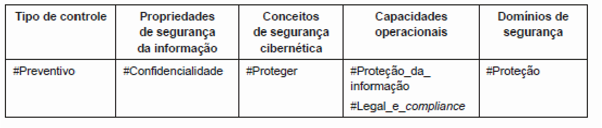

**CONTROLE - Convém que as informações armazenadas em sistemas de informação, dispositivos ou em qualquer outra mídia de armazenamento sejam excluídas quando não forem mais necessárias.** 

**PROPÓSITO -** Evitar a exposição desnecessária de informações sensíveis e estar em compliance com requisitos legais, estatutários, regulamentares e contratuais para a exclusão de informações.

---

<!-- pagina: 82 -->

**André Castro Aula 02** 

A partir deste controle, e os dois seguintes, temos uma relação direta com as práticas previstas na Lei Geral de Proteção de Dados - LGPD. Assim, começamos com a premissa de que informações sensíveis devem ser mantidas na organização e com os devidos direitos de acesso associados somente durante o tempo em que elas forem necessárias. Logo, a partir do momento que não são mais necessárias, deve-se iniciar o processo de exclusão do dado. 

Convém que informações sensíveis não sejam mantidas por mais tempo do que é necessário para reduzir o risco de divulgação indesejável. 

Ao excluir informações sobre sistemas, aplicações e serviços, convém que seja considerado o seguinte: 

a) selecionar um método de exclusão (por exemplo, sobrescrito eletrônico ou eliminação criptográfica) de acordo com os requisitos de negócios e levando em consideração as leis e os regulamentos relevantes; 

b) registrar os resultados da exclusão como evidência; 

c) ao usar fornecedores de serviços de exclusão de informações, obter deles evidências de exclusão de informações. 

Quando terceiros armazenarem as informações da organização em seu nome, convém que a organização considere a inclusão de requisitos sobre exclusão de informações nos acordos de terceiros para aplicá-los durante e mediante a rescisão de tais serviços. 

Tal prática também se aplica ao contexto de nuvem, uma vez que cabe a verificação junto a estes provedores de suas práticas. 

------------ 

### **8.11 Mascaramento de Dados [NOVO]** 

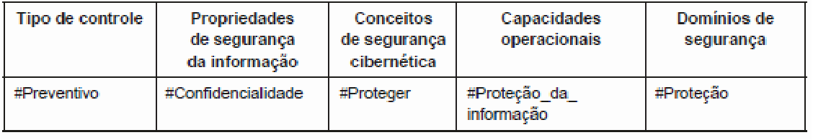

**CONTROLE - Convém que o mascaramento de dados seja usado de acordo com a política específica por tema da organização sobre controle de acesso e outros requisitos específicos por tema relacionados e requisitos de negócios, levando em consideração a legislação aplicável.** 

**PROPÓSITO -** Limitar a exposição de dados confidenciais, incluindo DP, e cumprir requisitos legais, estatutários, regulamentares e contratuais.

---

<!-- pagina: 83 -->

**André Castro Aula 02** 

Quando a proteção de dados sensíveis for uma preocupação, convém que as organizações considerem esconder tais dados utilizando técnicas como mascaramento de dados, pseudonimização ou anonimização. 

Essas técnicas visam ocultar o dado protegido, bem como a relação deste com a verdadeira identidade dos titulares desses dados. 

A norma  traz ainda as definições dessas técnicas: 

**<u>A anonimização</u>** altera irreversivelmente o Dado Protegido de tal forma que o titular de Dado Protegido não pode mais ser identificado direta ou indiretamente. 

**<u>A pseudonimização</u>** substitui as informações de identificação por um pseudônimo. 

O conhecimento do algoritmo (às vezes referido como “informação adicional”) usado para realizar a pseudonimização permite pelo menos alguma forma de identificação do titular de Dados Protegidos. Convém, portanto, que essas “informações adicionais” sejam mantidas separadas e protegidas. Embora a pseudonimização seja, portanto, mais fraca que a anonimização, os conjuntos de dados pseudononimizados podem ser mais úteis em pesquisas estatísticas. 

**<u>O mascaramento de dados</u>** é um conjunto de técnicas para ocultar, substituir ou ofuscar itens de dados confidenciais. O mascaramento de dados pode <u>ser estático</u> (quando os itens de dados são mascarados no banco de dados original), dinâmico (usando automação e regras para proteger dados em tempo real) <u>ou em tempo real (com dados</u> mascarados na memória de uma aplicação). 

Convém que, ao usar técnicas de pseudonimização ou anonimização, seja verificado se os dados foram adequadamente pseudonimizados ou anonimizados. Convém que a anonimização dos dados considere que todos os elementos das informações sensíveis são eficazes. Como exemplo, se não for considerado adequadamente, uma pessoa pode ser identificada mesmo que os dados que possam identificar diretamente essa pessoa sejam anonimizados, pela presença de mais dados que permitam que a pessoa seja identificada indiretamente. 

A norma prevê algumas técnicas de referência que podem ser consideradas: 

Técnicas adicionais para mascaramento de dados incluem: 

a) criptografia (exigindo que os usuários autorizados tenham uma chave); 

b) anulação ou exclusão de caracteres (impedindo que usuários não autorizados vejam mensagens completas); 

c) números e datas variados; 

- d) substituição (alteração de um valor por outro para ocultar dados sensíveis); 

- e) substituição de valores por seu hash.

---

<!-- pagina: 84 -->

**André Castro Aula 02** 

-------------------------------- 

### **8.12 Prevenção de Vazamento de Dados [NOVO]** 

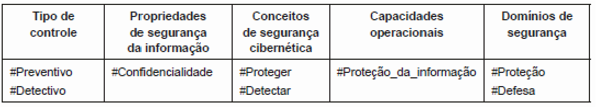

**CONTROLE - Convém que medidas de prevenção de vazamento de dados sejam aplicadas a sistemas, redes e quaisquer outros dispositivos que tratem, armazenem ou transmitam informações sensíveis.** 

**PROPÓSITO -** Detectar e prevenir a divulgação e extração não autorizadas de informações por indivíduos ou sistemas. 

Todo o processo de entendimento do dado parte de uma correta classificação das informações, e para isso, saber identificar e como proteger. 

Ainda, é importante entender os possíveis canais de vazamento de dados, basicamente entendendo por onde a informação é acessada e trafegada. 

Aqui, cabe destacar ainda a importância de ferramentas e soluções de DLP - Data Loss Prevention, onde, após um sinistro de ataque ou violação de perímetro, a organização ainda sim consiga prevenir o vazamento de dados sempre com foco na confidencialidade. As ferramentas de prevenção de vazamento de dados são projetadas para identificar dados, monitorar o uso e a movimentação de dados e tomar medidas para evitar que os dados vazem (por exemplo, alertar os usuários sobre seu comportamento de risco e bloquear a transferência de dados para dispositivos de armazenamento portáteis). 

Nesse contexto merece ainda o destaque a práticas e acessos em dados em nuvem, onde copiar e colar dados, e transpô-los em diferentes contextos traz um caráter de sensibilidade muito grande. 

Quando os dados forem armazenados em backup, convém que seja tomado o cuidado para assegurar que informações sensíveis sejam protegidas, usando medidas como criptografia, controle de acesso e proteção física da mídia de armazenamento que mantenha o backup. 

---------------------------------- 

### **8.13 Backup das informações**

---

<!-- pagina: 85 -->

**André Castro Aula 02** 

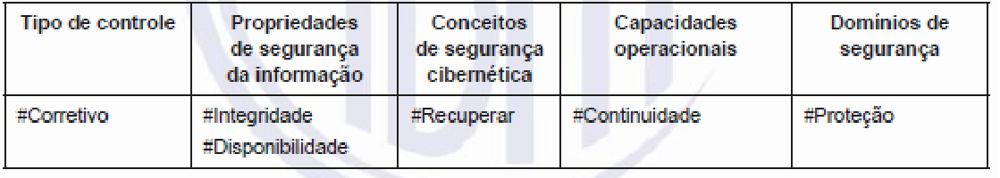

**CONTROLE - Convém que cópias de backup de informações, software e sistemas sejam mantidas e testadas regularmente de acordo com a política específica por tema acordada sobre backup.** 

**PROPÓSITO -** Permitir a recuperação da perda de dados ou sistemas. 

Aqui temos uma das práticas mais importantes na organização. Convém que uma política específica de tema sobre backup seja estabelecida para atender aos requisitos de retenção de dados e segurança da informação da organização. 

Convém que instalações de backup adequadas sejam fornecidas para assegurar que todas as informações e softwares essenciais possam ser recuperados após um incidente ou falha ou perda de mídia de armazenamento. 

Convém que planos sejam desenvolvidos e implementados sobre como a organização fará cópia de segurança das informações, software e sistemas, para abordar a política específica por tema sobre backup. 

Ao projetar um plano de backup, convém que os seguintes itens sejam levados em consideração: 

a) produção de registros precisos e completos das cópias de backup e procedimentos de restauração documentada; 

b) reflexão dos requisitos de negócios da organização (por exemplo, o objetivo do ponto de recuperação), dos requisitos de segurança das informações envolvidas e da criticidade das informações para o funcionamento contínuo da organização na extensão (por exemplo, backup completo ou diferencial) e da frequência de backups; 

c) armazenamento de backup em um local remoto e seguro, a uma distância suficiente para escapar de qualquer dano causado por um desastre no local principal; 

d) fornecimento de informações de backup com um nível apropriado de proteção física e ambiental , consistente com as normas aplicadas no local principal; 

e) teste regular de mídias de backup para assegurar que elas possam ser confiadas para uso emergencial, quando necessário. Teste da capacidade de restaurar dados apoiados em um sistema de teste, não substituindo a mídia de armazenamento original no caso de o processo de backup ou restauração falhar e causar danos ou perdas irreparáveis de dados;

---

<!-- pagina: 86 -->

**André Castro Aula 02** 

f) proteção do backup por meio da criptografia, de acordo com os riscos identificados (por exemplo, em situações em que a confidencialidade seja importante); 

g) cuidado para assegurar que a perda inadvertida de dados seja detectada antes que a backup seja tomada. 

Como mencionado no início, a norma traz sempre uma perspectiva prática sobre ambientes em nuvem. Assim, convém que, quando a organização usar um serviço em nuvem, cópias de backups de informações aplicações e sistemas da organização no ambiente de serviços em nuvem sejam feitas. Convém que a organização determine se e como os requisitos de backup são cumpridos ao usar o serviço de backup fornecido como parte do serviço em nuvem. 

Convém que o período de retenção de informações essenciais do negócio seja determinado, levando em conta qualquer exigência de retenção de cópias de arquivo. 

### **CESPE/BANESE/2021** 

**Em situações em que a confidencialidade é importante, cópias de segurança devem ser protegidas por criptografia bem como mídias de backup devem ser regularmente testadas e armazenadas em locais remotos.** 

### **Comentários:** 

Pessoal, em que pese não tenha citado, e foi proposital, vemos o tanto que a questão é intuitiva. Se a confidencialidade é importante, deve-se zelar por ela no dado bruto, disponível nos sistemas e bases de dados e também nas estruturas de backup. Ou seja, sempre busca-se aplicar os princípios de criptografia para tal propósito. 

**Gabarito** : C 

---------------------------------- 

- **8.14 Redundância dos recursos de tratamento de informações**

---

<!-- pagina: 87 -->

**André Castro Aula 02** 

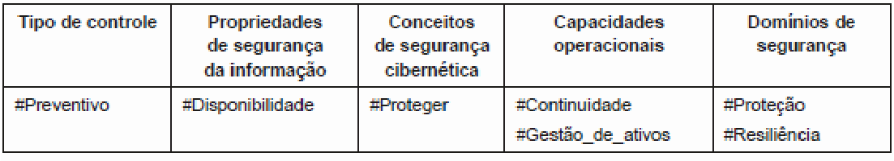

**CONTROLE - Convém que os recursos de tratamento de informações sejam implementados com redundância suficiente para atender aos requisitos de disponibilidade.** 

**PROPÓSITO -** Assegurar o funcionamento contínuo dos recursos de tratamento de informações 

### **--------------------------------** 

### **8.15 Log** 

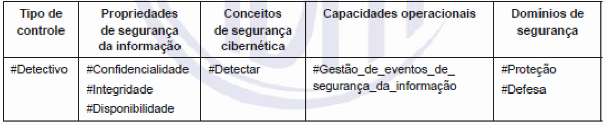

**CONTROLE -Convém que logs que registrem atividades, exceções, falhas e outros eventos relevantes sejam produzidos, armazenados, protegidos e analisados. .** 

**PROPÓSITO -** Registrar eventos, gerar evidências, assegurar a integridade das informações de registro, prevenir contra acesso não autorizado, identificar eventos de segurança da informação que possam levar a um incidente de segurança da informação e apoiar investigações. 

A norma anterior dividia esse assunto em diversos controles relativos à forma de armazenamento, segurança no armazenamento e outros aspectos derivados. Dentro de um mesmo item, parte-se do pressuposto sempre da simplicidade e finalidade. Convém que a organização determine a finalidade para a qual os logs são criados, quais dados são coletados e registrados e quaisquer requisitos específicos para proteger e manusear os dados de log. 

A norma define ainda que é importante ter uma política específica sobre a prática de armazenamento e tratamento de Log’s. 

Convém que os logs de eventos incluam para cada evento, conforme aplicável: 

- a) ID do usuário; 

- b) atividades do sistema;

---

<!-- pagina: 88 -->

**André Castro Aula 02** 

**- -** c) datas, horários e detalhes dos eventos relevantes **<u>(por exemplo, log on e log off);</u>** 

d) identidade do dispositivo, identificador do sistema e localização; 

e) endereços e protocolos de rede. 

Convém que os seguintes eventos sejam considerados para fins de log: 

### **-** **<u>a) tentativas de acesso ao sistema bem sucedidas e rejeitadas;</u>** 

b) dados bem-sucedidos e rejeitados e outras tentativas de acesso a recursos; 

c) alterações na configuração do sistema; 

d) uso de privilégios; 

e) uso de programas e aplicações utilitários; 

f) arquivos acessados e tipo de acesso, incluindo a exclusão de arquivos de dados importantes; 

g) alarmes levantados pelo sistema de controle de acesso; 

h) ativação e desativação de sistemas de segurança, como sistemas antivírus e sistemas de detecção de intrusão; 

i) criação, modificação ou exclusão de identidades; 

j) transações executadas pelos usuários em aplicações. Em alguns casos, as aplicações são um serviço ou produto fornecido ou executado por terceiros. 

É importante que todos os sistemas tenham fontes de tempo sincronizadas (ver 8.17), pois isso permite correlação de registros entre sistemas para análise, alerta e investigação de um incidente. 

Para a proteção de logs, convém considerar o uso das seguintes técnicas: hashing criptográfico, gravação em um arquivo somente de inclusão e somente leitura, gravação em um arquivo de transparência pública. Os logs de eventos podem conter dados confidenciais e dados pessoais. Convém que a privacidade adequada e as medidas de proteção sejam tomadas. 

Os registros do sistema geralmente contêm um grande volume de informações, sendo muitas das quais irrelevantes para o monitoramento de segurança da informação. Para ajudar a identificar eventos significativos para fins de monitoramento de segurança da informação, o uso de programas utilitários adequados ou ferramentas de auditoria para realizar interrogatórios de arquivos pode ser considerado.

---

<!-- pagina: 89 -->

**André Castro Aula 02** 

Uma ferramenta de gerenciamento de eventos de segurança da informação (SIEM) ou serviço equivalente pode ser usado para armazenar, correlacionar, normalizar e analisar informações de log e gerar alertas. Os SIEM tendem a exigir uma configuração cuidadosa para otimizar seus benefícios. 

As configurações a serem consideradas incluem identificação e seleção de fontes de log apropriadas, ajuste e teste de regras e desenvolvimento de casos de uso. 

### **--------------------------------** 

### **8.16 Atividades de monitoramento [NOVO]** 

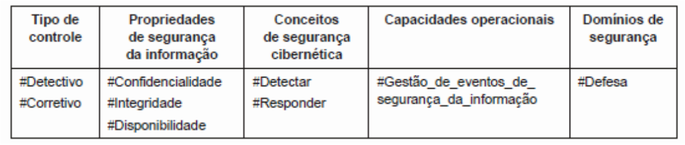

**CONTROLE - Convém que redes, sistemas e aplicações sejam monitorados por comportamentos anômalos e por ações apropriadas, tomadas para avaliar possíveis incidentes de segurança da informação.** 

**PROPÓSITO -** Detectar comportamentos anômalos e possíveis incidentes de segurança da informação. 

------------------------ 

### **8.17 Sincronização do relógio** 

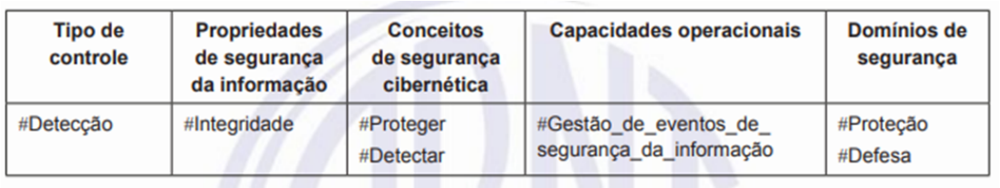

**CONTROLE - Convém que os relógios dos sistemas de tratamento de informações utilizados pela organização sejam sincronizados com fontes de tempo aprovadas** 

**PROPÓSITO -** Permitir a correlação e a análise de eventos relacionadas à segurança e a outros dados registrados, e apoiar investigações sobre incidentes de segurança da informação

---

<!-- pagina: 90 -->

**André Castro Aula 02** 

### **--------------------------------** 

### **8.18 Uso de programas utilitários privilegiados** 

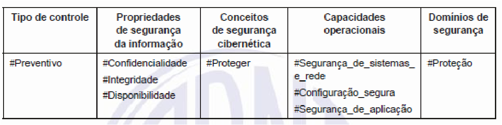

**CONTROLE - Convém que o uso de programas utilitários que possam ser capazes de substituir os controles de sistema e aplicações seja restrito e rigorosamente controlado.** 

**PROPÓSITO -** Assegurar que o uso de programas utilitários não prejudique os controles do sistema e das aplicações para a segurança da informação. 

----------------------------- 

### **8.19 Instalação de software em sistemas operacionais** 

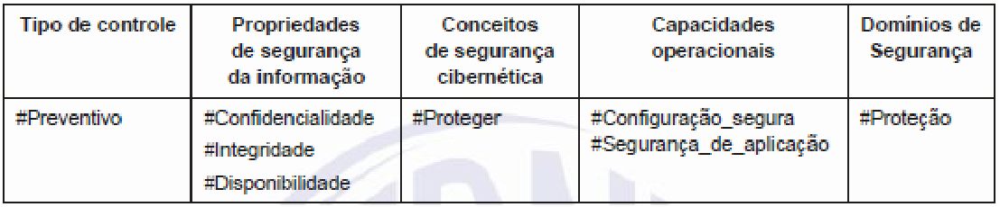

**CONTROLE - Convém que procedimentos e medidas sejam implementados para gerenciar com segurança a instalação de software em sistemas operacionais.** 

**PROPÓSITO -** Assegurar a integridade dos sistemas operacionais e evitar a exploração de vulnerabilidades técnicas. 

----------------------------- 

- **8.20 Segurança de redes**

---

<!-- pagina: 91 -->

**André Castro Aula 02** 

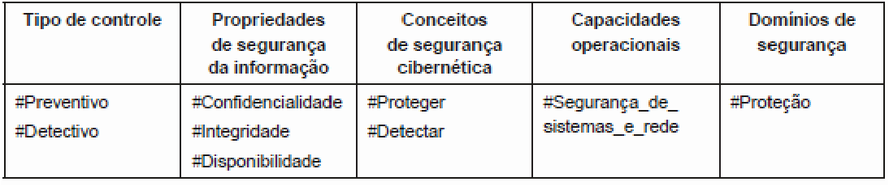

**CONTROLE - Convém que redes e dispositivos de rede sejam protegidos, gerenciados e controlados para proteger as informações em sistemas e aplicações.** 

**PROPÓSITO -** Proteger as informações nas redes e seus recursos de tratamento de informações de suporte contra o comprometimento por rede. 

----------------------------- 

### **8.21 Segurança dos serviços de rede** 

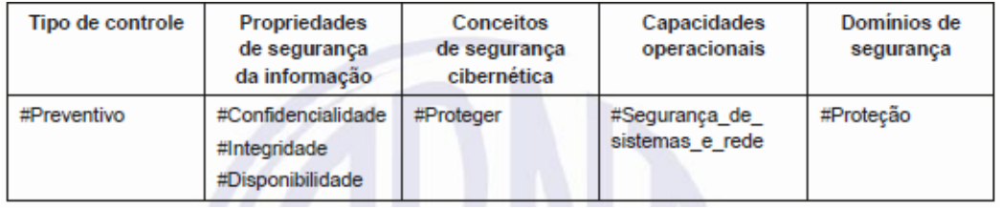

**CONTROLE - Convém que sejam identificados, implementados e monitorados mecanismos de segurança, níveis de serviço e requisitos de serviços de rede.** 

**PROPÓSITO -** Assegurar a segurança no uso de serviços de rede. 

----------------------------- 

### **8.22 Segregação de redes** 

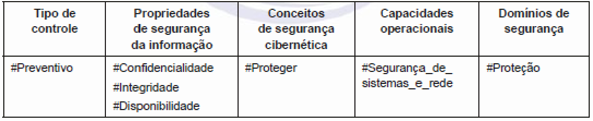

**CONTROLE - Convém que grupos de serviços de informação, usuários e sistemas de informação sejam segregados nas redes da organização.**

---

<!-- pagina: 92 -->

**André Castro Aula 02** 

**PROPÓSITO -** Dividir a rede em perímetros de segurança e controlar o tráfego entre eles com base nas necessidades de negócios. 

----------------------------- 

### **8.23 Filtragem da web [NOVO]** 

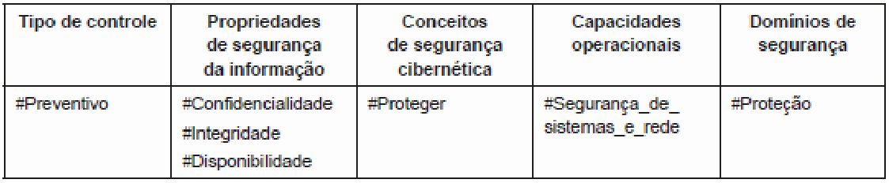

**CONTROLE - Convém que o acesso a sites externos seja gerenciado para reduzir a exposição a conteúdo malicioso.** 

**PROPÓSITO -** Proteger os sistemas de serem comprometidos por malware e impedir o acesso a recursos web não autorizados. 

Temos mais uma novidade na norma, focada nos filtros da WEB. Além do impacto, tem um apelo prático muito grande e com a incorporação de diversas práticas tratadas ao longo do nosso curso. 

Convém que a organização reduza os riscos de seu pessoal acessar sites que contenham informações ilegais ou que sejam conhecidos por conter vírus ou material de phishing. Uma técnica para conseguir isso funciona bloqueando o endereço IP ou o domínio do site em questão. Alguns navegadores e tecnologias anti-malware fazem isso automaticamente ou podem ser configurados para fazê-lo. 

Convém que a organização identifique os tipos de sites aos quais o seu pessoal pode ou não ter acesso. Convém que a organização considere bloquear o acesso aos seguintes tipos de sites: 

a) sites que possuem uma função de upload de informações, a menos que seja permitido por razões comerciais válidas; 

b) sites maliciosos conhecidos ou suspeitos (por exemplo, aqueles que distribuem conteúdo de malware ou phishing); 

c) servidores de comando e controle; 

d) site malicioso adquirido a partir de inteligência de ameaças (ver 5.7); 

- e) sites que compartilhem conteúdo ilegal.

---

<!-- pagina: 93 -->

**André Castro Aula 02** 

Antes de implantar esse controle, convém que as organizações estabeleçam regras para o uso seguro e adequado de recursos on-line, incluindo qualquer restrição a sites indesejáveis ou inadequados e aplicações baseadas na web. A atualização é fundamental nesse processo. 

Convém que um treinamento seja dado ao pessoal sobre o uso seguro e adequado de recursos on-line, incluindo acesso à web. <u>Convém que o treinamento inclua as regras da organização, ponto de contato para levantar preocupações de segurança e processo de exceção quando recursos restritos da web precisarem ser acessados por razões comerciais legítimas. Convém</u> também que o treinamento seja dado ao pessoal para assegurar **<u>que eles não sobrepassem qualquer aviso do navegador que informe que um site não é seguro,</u>** mas permite que o usuário prossiga. 

A filtragem da web pode incluir uma série de técnicas, incluindo assinaturas, heurísticas, lista de sites ou domínios aceitáveis, lista de sites ou domínios proibidos e configuração sob medida para ajudar a evitar que softwares maliciosos e outras atividades maliciosas ataquem a rede e os sistemas da organização. 

----------------------------- 

### **8.24 Uso de criptografia** 

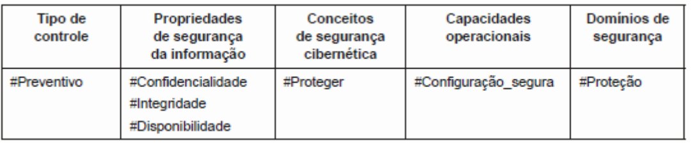

**CONTROLE - Convém que sejam definidas e implementadas regras para o uso efetivo da criptografia, incluindo o gerenciamento de chaves criptográficas.** 

**PROPÓSITO -** Assegurar o uso adequado e eficaz da criptografia para proteger a confidencialidade, autenticidade ou integridade das informações de acordo com os requisitos de segurança das empresas e da informação, e levando em consideração os requisitos legais, estatutários, regulamentares e contratuais relacionados à criptografia. 

A norma traz um rol de objetivos dos controles criptográficos. A saber:

---

<!-- pagina: 94 -->

**André Castro Aula 02** 

1. **Confidencialidade** – usar criptografia de informações para proteger informações confidenciais ou críticas, armazenadas ou transmitidas; 

2. **Integridade/Autenticidade** – usar assinaturas digitais ou códigos de autenticação de mensagens para verificar a autenticidade ou integridade de informações confidenciais ou críticas armazenadas ou transmitidas. Utilizar e algoritmos com o propósito de verificação da integridade de arquivos; 

**3. Não Repúdio –** utilizar técnicas criptográficas para comprovar a ocorrência ou não ocorrência de um evento ou ação; 

**4. Autenticação –** usar técnicas criptográficas para autenticar usuários e outras entidades do sistema, solicitando acesso a ou transacionando com usuários, entidades e recursos do sistema. 

Ao usar criptografia, convém que seja considerado o seguinte: 

a) a política específica por tema sobre criptografia definida pela organização, incluindo os princípios gerais para a proteção das informações. Uma política específica por tema sobre o uso de criptografia é necessária para maximizar os benefícios e minimizar os riscos do uso de técnicas criptográficas e evitar seu uso inadequado ou incorreto; 

<u>b) identifcação do nível de proteção necessário e classifcação das informações e, consequentemente, estabelecimento do tipo, da força e da qualidade dos algoritmos criptográfcos necessários;</u> 

<u>c) uso de criptografa para proteção de informações mantidas em endpoints móveis do usuário ou mídia de armazenamento e transmitidas por redes para tais dispositivos ou mídia de armazenamento;</u> 

d) abordagem do gerenciamento de chaves, incluindo métodos para lidar com a geração e proteção de chaves criptográficas e com a recuperação de informações criptografadas no caso de chaves perdidas, comprometidas ou danificadas; 

e) papéis e responsabilidades para: 

- 1) implementação das regras para o uso efetivo da criptografia; 

- 2) gerenciamento de chaves, incluindo a geração das chaves; 

f) normas a serem adotadas, bem como algoritmos criptográficos, força da criptografia, soluções criptográficas e práticas de uso que são aprovadas ou necessárias para uso na organização; 

g) impacto do uso de informações criptografadas em controles que dependam da inspeção de conteúdo (por exemplo, detecção de malware ou filtragem de conteúdo). 

A norma traz ainda a preocupação de se observar eventuais normas e políticas dos países que devam ser consideradas. Aqui invocamos as práticas e referências a algoritmos de proteção do estado, por exemplo, que vão alcançar as ações de defesa da soberania nacional.

---

<!-- pagina: 95 -->

**André Castro Aula 02** 

Ainda, há uma seção específica da norma que aborda a perspectiva de Gerenciamento de Chaves. Isso envolve práticas seguras para gerar, armazenar, arquivar, recuperar, distribuir, retirar e destruir chaves criptográficas. 

Essas práticas são referenciadas na norma a partir de uma lista com métodos seguros para: 

a) gerar chaves para diferentes sistemas criptográficos e diferentes aplicações; 

b) emitir e obter certificados de chave pública; 

c) distribuir chaves para entidades pretendidas, incluindo como ativar chaves quando recebidas; 

d) armazenar chaves, incluindo como os usuários autorizados obtêm acesso às chaves; 

e) alterar ou atualizar chaves, incluindo regras sobre quando alterar chaves e como isso será feito; 

f) lidar com chaves comprometidas; 

g) revogar chaves, incluindo como retirar ou desativar chaves [por exemplo, quando as chaves foram comprometidas ou quando um usuário deixar uma organização (nesse caso, convém que as chaves também sejam arquivadas)]; 

h) recuperar chaves que são perdidas ou corrompidas; 

i) backup ou arquivamento de chaves; 

j) destruir chaves; 

k) registrar e auditar as principais atividades relacionadas à gestão; 

l) definir datas de ativação e desativação para chaves, para que as chaves só possam ser usadas pelo período de tempo estabelecido conforme as regras da organização sobre gerenciamento de chaves; 

m) lidar com pedidos legais de acesso a chaves criptográficas (por exemplo, informações criptografadas podem ser necessárias para serem disponibilizadas de forma não criptografada como evidência em um processo judicial). 

Há um cuidado também em relação à proteção física dos dispositivos responsáveis pelo gerenciamento de chaves.

---

<!-- pagina: 96 -->

**André Castro Aula 02** 

### **CESPE/SEFAZ-AL/2021** 

**No que se refere à NBR ISO/IEC 27002:2013 e a confiabilidade, integridade e disponibilidade, julgue o item a seguir.** 

**Controles criptográficos como assinaturas digitais e códigos de autenticação de mensagens são aplicáveis para verificar a integridade de informações sensíveis ou críticas, armazenadas ou transmitidas.** 

### **Comentários:** 

Apesar da versão antiga, mas traduzimos para a versão atual no que se preconiza na norma em 8.24 - Uso de Criptografia, conforme texto abaixo: 

Controles criptográficos podem ser usados para alcançar diferentes objetivos de segurança, como por exemplo: 

b) usar assinaturas digitais ou códigos de autenticação de mensagens para verificar a autenticidade ou integridade de informações confidenciais ou críticas armazenadas ou transmitidas. Utilizar e algoritmos com o propósito de verificação da integridade de arquivos; 

**Gabarito** : C 

### **CESPE – SEDF/Analista de Gestão Educacional/2017** 

**Um analista de TI foi designado para promover ações que, mediante recursos criptográficos, visam à proteção da confidencialidade, da autenticidade e da integridade das informações de determinada organização.** 

**No que se refere a essa situação hipotética, julgue o item seguinte.** 

**De acordo com a ISO/IEC 27001, um processo de gerenciamento de chaves deve ser implantado para apoiar o uso de técnicas criptográficas pela organização.** 

**Comentários:**

---

<!-- pagina: 97 -->

**André Castro Aula 02** 

Para quem já estudou a matéria de criptografia, principalmente aspectos de certificação digital e a infraestrutura PKI, entende ainda mais a importância de se ter uma gestão de chaves de criptografia adequada. 

Mas à luz da norma, temos o item 8.24 - Uso de Criptografia 

<!-- Start of picture text -->
Gabarito : C <!-- End of picture text -->

----------------------------- 

### **8.25 Ciclo de vida de desenvolvimento seguro** 

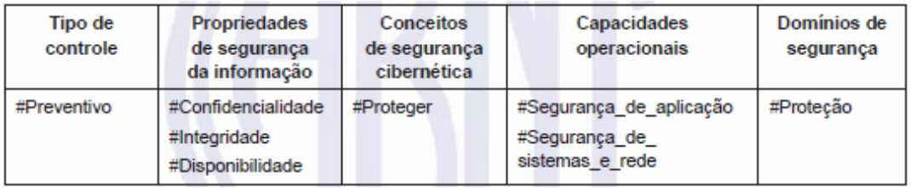

**CONTROLE - Convém que regras para o desenvolvimento seguro de software e sistemas sejam estabelecidas e aplicadas.** 

**PROPÓSITO -** Assegurar que a segurança da informação seja projetada e implementada dentro do ciclo de vida de desenvolvimento seguro de software e sistemas. 

O ciclo de desenvolvimento seguro é uma filosofia moderna e necessária, sendo, inclusive, cobrado de forma direta nos editais à luz dos frameworks que endereçam esse assunto, como o CLASP ou ainda as práticas referenciadas no OWASP. 

Porém, focando na norma, ela da mesma forma faz diversas referências a outros controles que contribuem diretamente para o processo de desenvolvimento seguro, a saber: 

a) separação dos ambientes de desenvolvimento, teste e produção (ver 8.31); 

b) orientação sobre a segurança no ciclo de vida do desenvolvimento de software: 

1) segurança na metodologia de desenvolvimento de software (ver 8.28 e 8.27); 

2) diretrizes de codificação seguras para cada linguagem de programação utilizada (ver 8.28); 

c) requisitos de segurança na fase de especificação e design (ver 5.8); 

- d) pontos de verificação de segurança em projetos (ver 5.8);

---

<!-- pagina: 98 -->

**André Castro Aula 02** 

e) testes de sistema e segurança, como testes de regressão, verificação de código e testes de invasão (ver 8.29); 

- f) repositórios seguros para código-fonte e configuração (ver 8.4 e 8.9); 

g) segurança no controle de versão (ver 8.32); 

h) conhecimento e treinamento necessários de segurança de aplicações (ver 8.28); 

i) capacidade dos desenvolvedores para prevenir, encontrar e corrigir vulnerabilidades (ver 8.28); 

j) requisitos e alternativas de licenciamento para assegurar soluções econômicas, evitando futuros problemas de licenciamento (ver 5.32). 

Se o desenvolvimento for terceirizado, convém que a organização obtenha a garantia de que o fornecedor está de acordo com as regras da organização para o desenvolvimento seguro (ver 8.30). 

----------------------------- 

### **8.26 Requisitos de segurança da aplicação** 

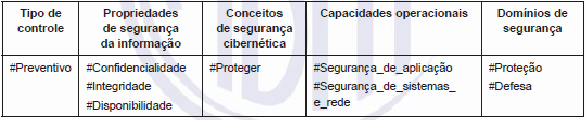

**CONTROLE - Convém que os requisitos de segurança da informação sejam identificados, especificados e aprovados ao desenvolver ou adquirir aplicações.** 

**PROPÓSITO -** Assegurar que todos os requisitos de segurança da informação sejam identificados e abordados ao desenvolver ou adquirir aplicações. 

----------------------------- 

- **8.27 Princípios de arquitetura e engenharia de sistemas seguros**

---

<!-- pagina: 99 -->

**André Castro Aula 02** 

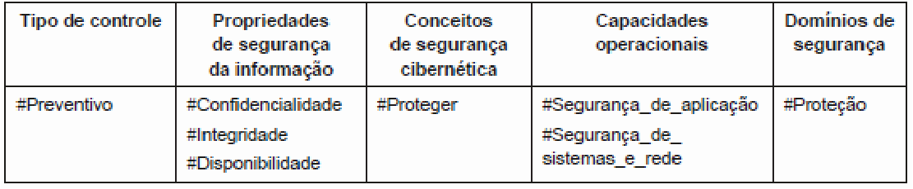

**CONTROLE - Convém que princípios de engenharia para sistemas de segurança sejam estabelecidos, documentados, mantidos e aplicados a qualquer atividade de desenvolvimento de sistemas.** 

**PROPÓSITO -** Assegurar que os sistemas de informação sejam projetados, implementados e operados com segurança dentro do ciclo de vida de desenvolvimento. 

----------------------------- 

### **8.28 Codificação segura [NOVO]** 

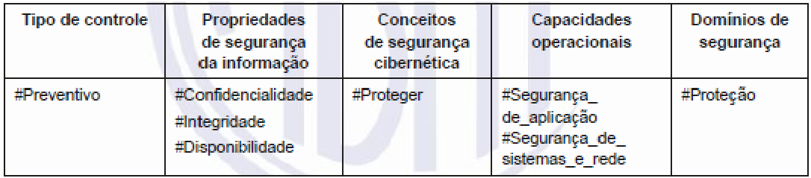

**CONTROLE - Convém que princípios de codificação segura sejam aplicados ao desenvolvimento de software.** 

**PROPÓSITO -** Assegurar que o software seja escrito com segurança, reduzindo assim o número de potenciais vulnerabilidades de segurança da informação no software. 

----------------------------- 

- **8.29 Testes de segurança em desenvolvimento e aceitação** 

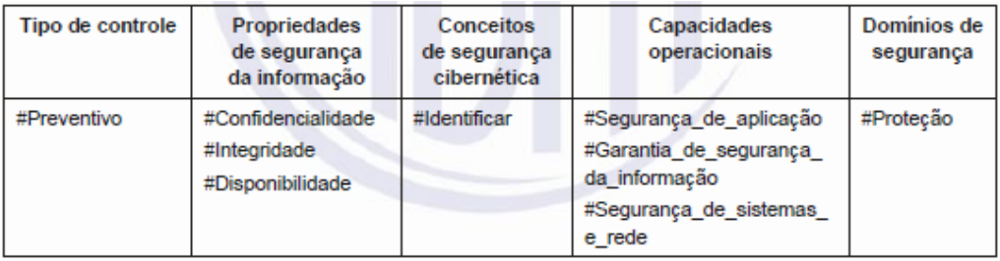

---

<!-- pagina: 100 -->

**André Castro Aula 02** 

**CONTROLE - Convém que os processos de teste de segurança sejam definidos e implementados no ciclo de vida do desenvolvimento.** 

**PROPÓSITO -** Validar se os requisitos de segurança da informação são atendidos quando as aplicações ou códigos são implantados no ambiente de produção. 

----------------------------- 

### **8.30 Desenvolvimento terceirizado** 

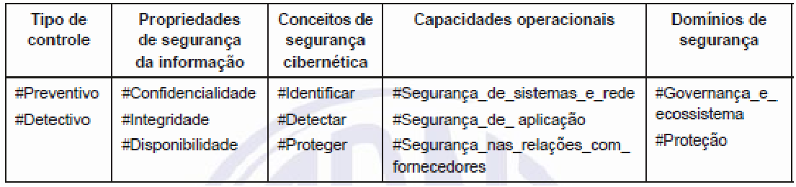

**CONTROLE - Convém que a organização dirija, monitore e analise criticamente as atividades relacionadas à terceirização de desenvolvimento de sistemas.** 

**PROPÓSITO -** Assegurar que as medidas de segurança da informação requeridas pela organização sejam implementadas na terceirização do desenvolvimento de sistemas. 

----------------------------- 

### **8.31 Separação dos ambientes de desenvolvimento, teste e produção** 

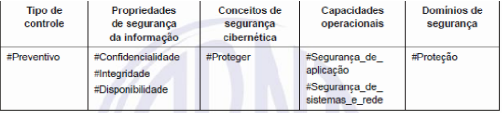

**CONTROLE - Convém que ambientes de desenvolvimento, testes e produção sejam separados e protegidos.** 

**PROPÓSITO -** Proteger o ambiente de produção e os dados de comprometimento por meio de atividades de desenvolvimento e teste. 

------------------------------------ 

- **8.32 Gestão de mudanças**

---

<!-- pagina: 101 -->

**André Castro Aula 02** 

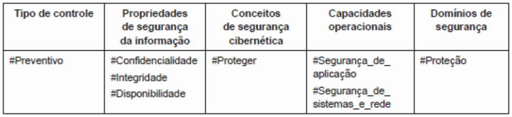

**CONTROLE - Convém que mudanças nos recursos de tratamento de informações e sistemas de informação estejam sujeitas a procedimentos de gestão de mudanças.** 

**PROPÓSITO -** Preservar a segurança da informação ao executar mudanças. 

------------------------------------ 

### **8.33 Informações de teste** 

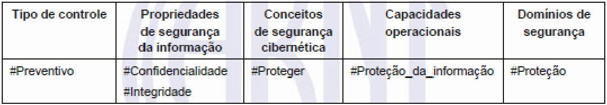

**CONTROLE - Convém que as informações de teste sejam adequadamente selecionadas, protegidas e gerenciadas.** 

**PROPÓSITO -** Assegurar a relevância dos testes e a proteção das informações operacionais utilizadas para testes. 

--------------------- 

### **8.34 Proteção de sistemas de informação durante os testes de auditoria** 

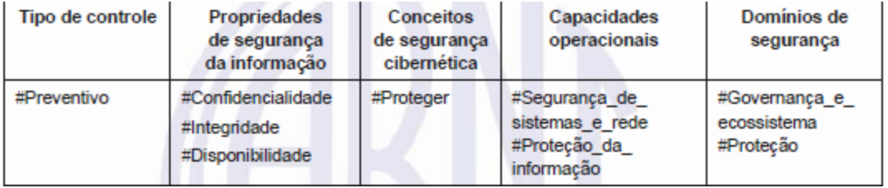

**CONTROLE - Convém que testes de auditoria e outras atividades de garantia envolvendo a avaliação de sistemas operacionais sejam planejados e acordados entre o testador e a gestão apropriada.**

---

<!-- pagina: 102 -->

**André Castro Aula 02** 

**PROPÓSITO -** Minimizar o impacto da auditoria e outras atividades de garantia em sistemas operacionais e processos de negócio. 

- --------------------- 

Bom, conforme prometido, a seguir, quero apresentar a vocês como eram os controles da versão antiga (nomes registrados na coluna mais à direita), e em relação à norma que acabamos de ver. Esse ponto é importante pois, com certeza, será um item explorado pela banca ao tentar abordar itens conforme a norma antiga. 

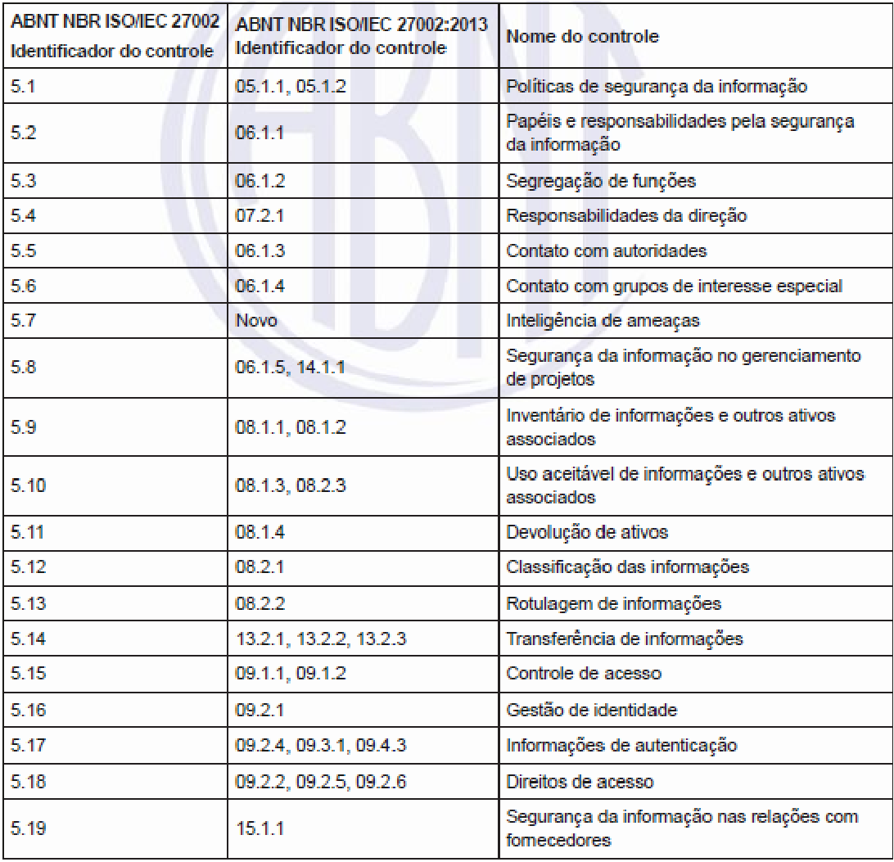

---

<!-- pagina: 103 -->

**André Castro Aula 02** 

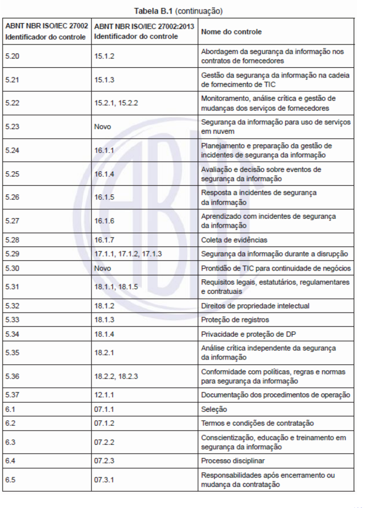

---

<!-- pagina: 104 -->

**André Castro Aula 02** 

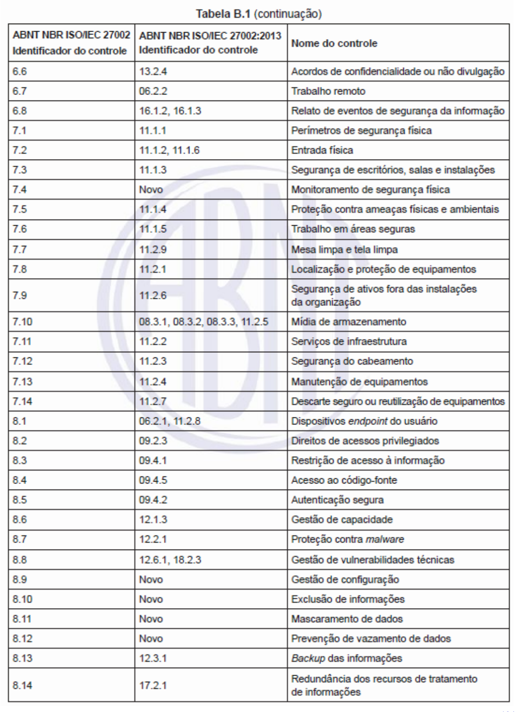

---

<!-- pagina: 105 -->

**André Castro Aula 02** 

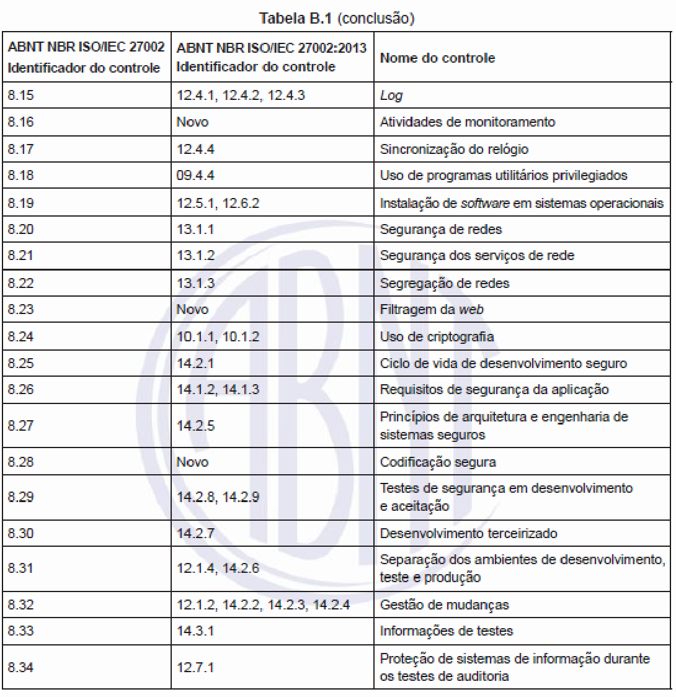

---

<!-- pagina: 106 -->

**André Castro Aula 02** 

A seguir, faremos exercícios que vão incluir questões das versões anteriores. Busquei manter as questões que exploram os conteúdos da norma, e não a sua organização. Vários conteúdos foram mantidos, por isso a importância desses exercícios. Já o aspecto da organização, com a mudança, não faz sentido mantê-los. **Assim, vamos avançar!!!** 

Referências: ISO 27001 e ISO 27002

---

<!-- pagina: 107 -->

**André Castro Aula 02** 

# **<mark>Q</mark> UESTÕES** **<mark>C</mark> OMENTADAS** **<mark>- ISO 27001</mark> E** **<mark>27002  (2022) - FGV</mark>** 

**1. 2025 - FGV - TCE-PI - Auditor de Controle Externo** 

**Os processos de gestão de riscos de um eficiente Sistema de Gestão de Segurança da Informação (SGSI) são bem definidos** 

**e podem ser enquadrados em uma das quatro fases do ciclo PDCA que são: planejamento, execução, verificação e ação.** 

### **A fase de execução de um SGSI deve conter o processo de** 

A) implementação do plano de tratamento de risco. 

B) monitoramento contínuo e análise crítica de riscos. 

C) melhoria do processo de gestão de riscos de segurança da informação. 

D) definição do plano de tratamento do risco. 

E) análise e execução de riscos. 

### **Comentário:** 

Na fase de execução do ciclo PDCA (Plan-Do-Check-Act) de um Sistema de Gestão de Segurança da Informação (SGSI), o foco está em colocar em prática as ações planejadas. Isso inclui a implementação do plano de tratamento de risco, que envolve aplicar as medidas e controles definidos para mitigar os riscos identificados durante a fase de planejamento. 

As outras opções referem-se a processos que pertencem a outras fases do ciclo PDCA: 

B: Monitoramento contínuo e análise crítica de riscos pertencem à fase de verificação. 

C: Melhoria do processo de gestão de riscos de segurança da informação pertence à fase de ação. 

- D: Definição do plano de tratamento do risco pertence à fase de planejamento. 

- E: Análise e execução de riscos não é uma fase específica do ciclo PDCA. 

**Gabarito: A** 

**2. 2025 - FGV - TCE-PI - Auditor de Controle Externo**

---

<!-- pagina: 108 -->

**André Castro Aula 02** 

**A política de classificação de informação de um Tribunal de Contas estabeleceu os critérios relativos à classificação de** 

**documentos em função de sua confidencialidade. Assinale a opção que apresenta o objetivo desse procedimento.** 

A) Regulamentar o armazenamento físico de processos administrativos sigilosos. 

B) Associar a cada documento corporativo uma temporalidade proporcional à sua relevância. 

C) Permitir que documentos com informações sensíveis sejam acessados somente por usuários autorizados. 

D) Garantir a disponibilidade de processos administrativos sigilosos para todos os membros da organização. 

E) Restringir a alteração de normas internas por pessoas de fora da organização, garantindo assim a sua integridade. 

### **Comentário:** 

Quando falamos de classificação da Informação, estamos falando de implantar regimes de acesso à informação e associá-los aos documentos organizacionais. 

**Gabarito: C** 

**3. 2025 - FGV - TCE-PI - Auditor de Controle Externo** 

**Um órgão público, a partir dos seus objetivos e necessidades organizacionais, deve estabelecer, implementar, manter e melhorar continuamente o Sistema de Gestão de Segurança da Informação (SGSI).** 

**Com relação à política de Segurança da Informação (PSI), que é um dos documentos que compõem o SGSI, analise as afirmativas a seguir.** 

**I. A PSI é elaborada a partir dos riscos levantados durante a elaboração do plano de gestão dos riscos.** 

**II. A PSI estabelece os princípios, diretrizes e atribuições relacionadas à Segurança da Informação de um órgão público.** 

**III. A PSI tem como objetivo proteger somente dados corporativos que trafegam por sistemas de tecnologia da informação e comunicação.** 

### **Está correto o que se afirma em** 

A) I, apenas.

---

<!-- pagina: 109 -->

**André Castro Aula 02** 

B) I e II, apenas. 

C) I e III, apenas. 

D) II e III, apenas. 

E) I, II e III. 

### **Comentário:** 

Vamos aos itens… 

I. Certo. A PSI utiliza outros aspectos de diretrizes de segurança, não ficando associado ao processo de Gestão de Riscos, ainda que este possa retroalimentar ou utilizar como base o processo de alguma forma. 

II. Certo. A PSI estabelece os princípios, diretrizes e atribuições relacionadas à Segurança da Informação, definindo como a organização deve proteger seus ativos de informação. 

III. Errado. A PSI não se limita a isso. Ela abrange a proteção de todos os ativos de informação da organização, independentemente do meio pelo qual trafegam. 

**Gabarito: D (Gabarito do Professor: B)** 

### **4. 2025 - FGV - TCE-PI - Auditor de Controle Externo** 

**Segundo a NBR ISO/IEC 27002:2022, o tipo de controle é um atributo para visualizar os controles da perspectiva de quando** 

**e como o controle modifica o risco, com relação à ocorrência de um incidente de segurança da informação. Assinale a opção que indica, corretamente, os valores de atributo.** 

A) Proativo, prescritivo e normativo. 

B) Prescritivo, normativo e corretivo. 

C) Prescritivo, detectivo e normativo. 

D) Preventivo, prescritivo e corretivo. 

E) Preventivo, detectivo e corretivo. 

### **Comentário:** 

A nova classificação prevê:

---

<!-- pagina: 110 -->

**André Castro Aula 02** 

- Preventivo: Controles que evitam a ocorrência de incidentes. 

- Detectivo: Controles que identificam a ocorrência de incidentes. 

- Corretivo: Controles que corrigem os efeitos de incidentes após sua ocorrência. 

**Gabarito: E** 

**5. 2025 - FGV - TCE-PI - Auditor de Controle Externo** 

**Com relação às principais fontes de requisitos de segurança da informação, descritas na NBR ISO/IEC 27002:2022, analise as afirmativas a seguir e assinale (V) para a verdadeira e (F) para a falsa.** 

**( ) A avaliação dos riscos para a organização é descrita como uma das principais fontes, levando em consideração a estratégia geral de negócio e os objetivos da organização.** 

**( ) Os requisitos legais, estatutários, regulamentares e contratuais que uma organização e suas partes interessadas devem cumprir, não são considerados fontes relevantes.** 

**( ) O conjunto de princípios, objetivos e requisitos de negócios da etapa inicial do ciclo de vida da informação que uma organização desenvolve para dar suporte às suas operações, é uma fonte primordial.** 

### **As afirmativas são, respectivamente,** 

A) V – V – V. 

B) V – F – F. 

C) V – F – V. 

D) F – V – V. 

E) F – F – V. 

### **Comentário:** 

I - Correto. A avaliação de riscos é fundamental para identificar e tratar os riscos que podem impactar a segurança da informação, alinhando-se com a estratégia e os objetivos da organização. 

II - Falso. Esses requisitos são, na verdade, fontes muito relevantes, pois garantem que a organização esteja em conformidade com as leis e regulamentos aplicáveis. Está associado ao princípio da legalidade. 

III - Correto . Esses elementos são essenciais para garantir que a segurança da informação esteja integrada aos processos de negócios desde o início. Dessa forma, não consigo entender o motivo da banca ter dado esse item como Errado.

---

<!-- pagina: 111 -->

**André Castro Aula 02** 

**Gabarito: B (Gabarito professor: C)** 

**6. 2025 - FGV - TCE-PI - Auditor de Controle Externo** 

**A NBR ISO/IEC 27001:2022 fornece os requisitos para estabelecer, implementar, manter e melhorar continuamente um** 

**sistema de gestão de segurança da informação (SGSI) no contexto da organização.** 

**Com relação às cláusulas e aos controles descritos nessa norma, analise as afirmativas a seguir.** 

**I. A organização deve determinar e fornecer os recursos necessários para o estabelecimento, implementação, manutenção e melhoria contínua de um SGSI.** 

**II. É obrigatório a implementação de todos os controles listados no Anexo A da norma.** 

**III. As cláusulas da referida norma estão divididas em contexto da organização, liderança, planejamento, implementação, suporte, operação, manutenção e conclusão. Está correto o que se arma em** 

A) I, apenas. 

B) I e II, apenas. 

C) I e III, apenas. 

D) II e III, apenas. 

E) I, II e III. 

### **Comentário:** 

I. Certo. A organização deve determinar e fornecer os recursos necessários para o estabelecimento, implementação, manutenção e melhoria contínua de um SGSI. Isso inclusive deve estar previsto na Política de Segurança da Informação. 

II. Errado. Não é obrigatório implementar todos os controles listados no Anexo A da norma. A organização deve selecionar e implementar os controles que são relevantes para os riscos identificados. Isso está associado ao Termo de Aplicabilidade. 

III. Errado. O objetivo da banca foi confundir com a versão do ano anterior.

---

<!-- pagina: 112 -->

**André Castro Aula 02** 

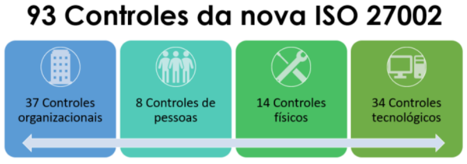

**Gabarito: A** 

==5460== 

### **7. 2025 - FGV - TCE-PI - Auditor de Controle Externo** 

De acordo com a NBR ISO/IEC 27001:2022, os controles de segurança da informação são agrupados em áreas de controles 

A) estruturais, pessoais, químicos e tecnológicos. 

B) organizacionais, pessoais, físicos e tecnológicos. 

C) estruturais, de recursos humanos, físicos e técnicos. 

D) organizacionais, de recursos humanos, físicos e químicos. 

E) organizacionais, estruturais, de recursos humanos e técnicos. 

### **Comentário:** 

Conforme definido na norma, temos: 

- Organizacionais: Controles relacionados à estrutura e políticas da organização. 

- Pessoais: Controles que envolvem a gestão de pessoas, como treinamento e conscientização. 

- Físicos: Controles que protegem os ativos físicos e o ambiente onde estão localizados. 

- Tecnológicos: Controles que utilizam tecnologia para proteger a informação, como firewalls e criptografia. 

**Gabarito: B** 

**8. FGV - 2024 - Prefeitura de Cuiabá - MT - Auditor Fiscal Tributário da Receita Municipal - Tecnologia da Informação (Tarde)** 

##### **DataPrev (Perfil 3: Desenvolvimento de Software) Segurança da Informação - 2026 (Pós-Edital)** 112

---

<!-- pagina: 113 -->

**André Castro Aula 02** 

**A gestão de segurança da informação é fundamental para proteger a informação dentro de uma organização. O anexo A da norma ISO/IEC 27001, atualizada em 2022, estabelece série de pontos de controles de segurança da informação que são subdivididos em grupos.** 

**Neste sentido, correlacione os grupos de controle existentes no anexo A desta norma, e apresentados abaixo, com seus respectivos pontos de controle.** 

**1. Controle de Pessoal** 

**2. Controles Físicos** 

**3. Controles Tecnológicos** 

**( ) Filtros de navegação web – O acesso a sites (web pages) externos devem ser controladas para reduzir a exposição a possíveis conteúdos maliciosos.** 

**( ) Segurança do cabeamento – Cabos de energia, dados etc. devem ser protegidos contra interceptações, interferência ou danos.** 

**( ) Trabalho remoto - Medidas de segurança devem ser implementadas quando o pessoal estiver trabalhando remotamente para proteger informações acessadas, processadas ou armazenadas fora das instalações da organização.** 

### **Assinale a opção que indica a relação correta na ordem apresentada** 

A) 1,2,3. 

B) 1,3,2. 

C) 2,1,3. 

D) 3,1,2. 

E) 3,2,1. 

### **Comentário:** 

- Filtro de Navegação Web - Controles Tecnológicos (3): Esse ponto de controle está relacionado ao uso de tecnologias para filtrar e controlar o acesso à internet, o que se enquadra em controles tecnológicos. 

- Segurança do cabeamento – Controles Físicos (2): A proteção de cabos e infraestrutura física é um aspecto dos controles físicos, que visam garantir a segurança do ambiente onde os recursos de informação estão localizados. 

- Trabalho remoto – Controle de Pessoal (1): O trabalho remoto envolve diretamente as pessoas e as políticas de segurança aplicadas a elas, o que se enquadra no controle de pessoal. 

**Gabarito: E**

---

<!-- pagina: 114 -->

**André Castro Aula 02** 

### **9. (FGV - AJ (TJ RN)/TJ RN/Apoio Especializado/Análise de Suporte/2023)** 

**Uma empresa de seguros de vida sempre fiscaliza a execução dos reparos em seus equipamentos endpoint realizados pela equipe de manutenção a fim de assegurar a disponibilidade, a integridade e a confidencialidade das informações neles armazenadas.** 

**De acordo com a ABNT ISO IEC 27001, o controle de segurança da informação implementado pela empresa é o:** 

a)  de pessoas; 

- b)  físico; 

- c)  de processos; 

- d)  tecnológico; 

- e)  organizacional. 

### **Comentários:** 

O foco está no reparo do equipamento físico pessoal. Isso é uma característica de controle físico. 

**Gabarito: B** 

### **10. (FGV - TecGes Admin (ALEMA)/ALEMA/Analista de Sistemas/2023)** 

**A norma NBR ISO/IEC 27001:2022 é composta por um conjunto de controles que as organizações interessadas em implementar um sistema de gestão de segurança da informação devem adotar.** 

**De acordo com esta norma, um exemplo de controle organizacional é** 

a)  o uso de criptografia. 

- b)  a classificação das informações. 

- c)  a prevenção de vazamento de dados. 

- d)  o acordo de confidencialidade ou não divulgação. 

e)  o descarte seguro ou reutilização de equipamentos. 

### **Comentários:** 

Vamos aos tipos de controle: 

- a) Controle Tecnológico

---

<!-- pagina: 115 -->

**André Castro Aula 02** 

b) Controle Organizacional 

- c) Controle Tecnológico 

- d) Controle de Pessoas 

- e) Controle Físico 

**Gabarito: B** 

**11. FGV/CGU/2022** 

**A Associação Brasileira de Normas Técnicas, ABNT, é responsável pela elaboração das Normas Brasileiras como, por exemplo, a ABNT NBR ISO/IEC 27001:2013, sobre aspectos da Segurança da Informação.** 

**Dado que a sigla ISO deriva de International Organization for Standardization, assinale a correta natureza das normas NBR ISO.** 

- A)  São normas brasileiras que passam a ser adotadas pela ISO. 

- B) São normas definidas em conjunto com a ISO. 

- C) São traduções de normas da ISO que passam a ser adotadas pela ABNT. 

- D) São normas da ISO adaptadas pela ABNT às práticas brasileiras. 

- E) São normas brasileiras compiladas a partir da combinação de outras normas da ISO. 

### **Comentários:** 

Cada país, portanto, elabora sua própria edição/versão da ISO, com a sua tradução. Esse trabalho é feito justamente pela ABNT. A referência NBR ISO/IEC traz justamente o padrão de que é uma tradução brasileira de uma norma internacional. 

**Gabarito** : C 

**12. FGV/DPE-RJ/2019** 

**De acordo com a norma ABNT NBR ISO/IEC 27001:2013, uma organização deve programar auditorias internas a fim de verificar a aderência da conformidade do sistema de gestão da segurança da informação aos seus requisitos e à legislação vigente.** 

### **Sobre a realização da auditoria interna, é correto afirmar que:**

---

<!-- pagina: 116 -->

**André Castro Aula 02** 

A) os critérios de verificação devem ser sempre os mesmos, independentemente do escopo ou do processo da organização a ser auditado; 

B) os auditores não devem conhecer e considerar os resultados das auditorias anteriores para não influenciarem o trabalho de verificação; 

C) os auditores devem ser do próprio setor auditado a fim de possibilitar o aproveitamento de seu conhecimento acerca das atividades desenvolvidas; 

D) os resultados das auditorias devem ser de conhecimento da direção responsável pelo setor auditado; 

E) os relatórios das auditorias podem ser descartados na ausência de inconformidades. 

### **Comentários:** 

Vamos aos itens... A Organização deve: 

A) definir os critérios e o escopo da auditoria, para cada auditoria; **INCORRETO** 

B) planejar, estabelecer, implementar e manter um programa de auditoria, incluindo a frequência, métodos, responsabilidades, requisitos de planejamento e relatórios. Os programas de auditoria devem levar em conta a importância dos processos pertinentes e os resultados de auditorias anteriores. **INCORRETO** 

C) selecionar auditores e conduzir auditorias que assegurem objetividade e imparcialidade do processo de auditoria; **INCORRETO** 

D) assegurar que os resultados das auditorias são relatados para a direção pertinente. **CORRETO** 

E) reter a informação documentada como evidência dos programas da auditoria e dos resultados da auditoria. **INCORRETO** 

**Gabarito** : D 

### **13. FGV/CGU/2022** 

**Um Sistema de Gestão de Segurança da Informação (SGSI) é um conjunto de controles que uma organização implementa para proteger os seus próprios ativos de informação e também para proteger outros ativos pelos quais é responsável. A norma ABNT NBR ISO/IEC 27001:2019 fornece os requisitos necessários para um SGSI. Rafael foi contratado para implementar o SGSI em um órgão público. Ele elencou os controles necessários para garantir a adequação à norma. Para isso, Rafael teve que elaborar:** 

A) políticas de segurança da informação; 

### B) avaliação de desempenho;

---

<!-- pagina: 117 -->

**André Castro Aula 02** 

C)  política de controle de acesso; 

D) definição de funções e responsabilidades de segurança; 

E) declaração de aplicabilidade. 

### **Comentários:** 

Vejam como o assunto é cobrado de forma simples nesse processo. 

**Gabarito** : E 

**14. FGV - 2022 - TJ-TO - Técnico Judiciário – Informática** 

**A equipe de segurança de um órgão público decidiu implantar inúmeras medidas de forma a elevar o nível de segurança do órgão.** 

**A medida que a equipe de segurança deve adotar para atender ao requisito de confidencialidade é a:** 

A) utilização de função de hash criptográfico; 

B) realização de backups periódicos; 

- C) política de mesa limpa; 

D) gravação das ações dos usuários em log; 

E) implantação de redundâncias. 

### **Comentários:** 

Apesar da questão referenciar a norma na versão antiga, há uma vicnulação direta aos mesmos conceitos. 

**Gabarito** : C

---

<!-- pagina: 118 -->

**André Castro Aula 02** 

# **<mark>Q</mark> UESTÕES** **<mark>C</mark> OMENTADAS** **<mark>- ISO 27001</mark> E** **<mark>27002 (2022) - FCC</mark>** 

**1. (FCC - Ana (COPERGÁS)/COPERGÁS/Sistemas/2023)** 

**Segundo a norma ABNT NBR ISO/IEC 27001:2013, quem deve estabelecer a política de segurança da informação, atribuir responsabilidades e autoridade para assegurar que o Sistema de Gestão da Segurança da Informação (SGSI) esteja em conformidade com os requisitos dessa norma e, ainda, relatar sobre o desempenho do sistema de gestão da segurança da informação é** 

### a) o setor de Qualidade. 

- b) a área de Infraestrutura. 

- c) a área de Tecnologia da Informação. 

- d) a Alta Direção. 

- e) a área de Compliance. 

### **Comentários:** 

O primeiro ponto de atenção é que estamos na versão de 2013. Porém, o mesmo ainda se mantém para a nova versão de 2022. Questão bem básica trazendo as atribuições de altíssimo nível organizacional que dará toda a base necessária para a implantação e consolidação de um SGSI em uma organização. 

**Gabarito: D** 

**2. (FCC – DPE-AM/Assistente Técnico de Defensoria/2018) A Norma ABNT NBR ISO/IEC 27002:2013 recomenda que um conjunto de políticas de segurança da informação seja definido. Segundo a Norma,** 

A) é necessário que estas políticas sejam aprovadas por todos os funcionários. 

B) estas políticas só devem ser divulgadas e comunicadas aos funcionários internos da organização. 

C) é recomendável contemplar requisitos oriundos de ações operacionais, independente da estratégia do negócio. 

D) só devem ser contemplados requisitos oriundos do ambiente de ameaça da segurança da informação atual.

---

<!-- pagina: 119 -->

**André Castro Aula 02** 

E) é recomendável que estas políticas contenham requisitos oriundos de regulamentações, legislação e contratos. 

### **Comentários:** 

Vamos comentar os itens: 

- A - A POSIC deve ser aprovada pela **ALTA DIREÇÃO** e não por todos os funcionários. **ERRADA** 

- B - A Norma também considera os stakeholders, além dos funcionários. **ERRADA** 

- C - Todo o SGSI deve estar alinhado com a estratégia de negócio. **ERRADA** 

- D - Deve-se considerar também o futuro. **ERRADA** 

- **E - CORRETO** 

**Gabarito** : E 

<!-- Start of picture text -->
==5460== <!-- End of picture text -->

**3. (FCC – TRT-24ª Região (MS)/Técnico Judiciário/2017) A norma ABNT NBR ISO/IEC 27001:2013 apresenta como anexo uma tabela com controles e objetivos de controle alinhados com os existentes na norma ABNT NBR ISO/IEC 27002:2013. Uma colaboradora de nível técnico, utilizando os controles relacionados à segurança em processos de desenvolvimento e de suporte dessa tabela deve saber que** 

A) modificações em pacotes de software devem ser encorajadas e não devem estar limitadas apenas às mudanças necessárias, porém, todas as mudanças devem ser documentadas. 

B) mudanças em sistemas dentro do ciclo de vida de desenvolvimento devem ser controladas por procedimentos informais de controle de mudanças. 

C) a organização não deve contratar empresas terceirizadas para realizar atividades de desenvolvimento de sistemas de informação. 

D) testes de funcionalidade de segurança devem ser realizados somente quando o sistema estiver pronto. 

E) programas de testes de aceitação e critérios relacionados devem ser estabelecidos para novos sistemas de informação, atualizações e novas versões. 

### **Comentários:** 

Vamos aos itens, pessoal: 

- a) Pessoal, mudanças são sempre um risco para qualquer ambiente ou solução. Desse modo, dizer que elas devem ser encorajadas é um erro. Os outros aspectos estão corretos. **ERRADO** 

- b) Mais uma vez, não há o que se falar MUDANÇA e INFORMAL na mesma frase. **ERRADO**

---

<!-- pagina: 120 -->

**André Castro Aula 02** 

- c) Pessoal, não há qualquer restrição para contratação de terceirizadas para tal finalidade. Obviamente, deve-se tratar todos os aspectos da ISO 27002 no que tange à segurança da informação para stakeholders externos. **ERRADO** 

- d) Não né pessoal? Aqui podemos invocar inclusive outras metodologias de desenvolvimento seguro como o SDL e CLASP, por exemplo, que garante um acompanhamento e testes de segurança durante toda a fase de desenvolvimento. Lembrando do capítulo específico da norma que trata do Cíclo de Desenvolvimento seguro ( **8.25 Ciclo de vida de desenvolvimento seguro) ERRADO** 

- e) Exatamente o controle previsto no objetivo **8.29 Testes de segurança em desenvolvimento e aceitação. Para a evolução interna, convém que esses testes sejam realizados inicialmente pela equipe de desenvolvimento. Convém, então, que testes de aceitação independentes sejam realizados para assegurar que o sistema funcione como esperado e apenas como esperado** 

**Gabarito** : E 

**4. (FCC – TRT-24ª Região (MS)/Técnico Judiciário/2017) Desenvolvimento seguro é um requisito para construir um serviço, uma arquitetura, um software e um sistema que respeitem normas de segurança. Dentro de uma política de desenvolvimento seguro, a norma ABNT NBR ISO/IEC 27002:2013 recomenda** 

A) que não é necessário considerar segurança na metodologia desenvolvimento do software, pois a segurança será considerada na fase de programação do software. 

B) que não sejam considerados requisitos de segurança na fase do projeto, mas sim na fase de implementação do software. 

C) levar em consideração a segurança no controle de versões. 

D) levar em consideração mais a habilidade técnica dos desenvolvedores, do que a capacidade de evitar, encontrar e corrigir vulnerabilidades. 

E) que o desenvolvimento de software nunca seja terceirizado. 

### **Comentários:** 

Vamos aos itens: 

A - Pessoal, não precisamos falar muito aqui, certo? Óbvio que é necessário considerar a segurança da informação. **ERRADO** 

B - Basta olharmos para a letra A. **ERRADO** 

C - Na Política de Desenvolvimento Seguro, há um rol de aspectos que devem ser considerados, entre eles, a segurança no controle de versões. Lembrando que na nova norma temo o item 8.28 - Codificação segura. **CORRETO**

---

<!-- pagina: 121 -->

**André Castro Aula 02** 

D - Mais uma vez o apego ao item da política de desenvolvimento seguro. Lá temos expresso a CAPACIDADE DOS DESENVOLVEDORES DE EVITAR, ENCONTRAR E CORRIGIR VULNERABILIDADES. **ERRADO** 

- E - Para verificarmos a tendência da banca. Já mencionamos esse item recentemente. **ERRADO** 

**Gabarito** : C 

**5. (FCC – TRT-11ª Região (AM e RR)/Analista Judiciário/2017) Um Analista Judiciário deve estabelecer um código de prática de segurança da informação no TRT para o controle e a prevenção de ataques de malwares. Considerando-se a Norma NBR ISO/IEC 27002:2013, é recomendável que o código de segurança inclua** 

A) a implementação de controles para prevenir o uso de software não autorizado, como o whitelisting que lista os softwares não permitidos. 

B) a aplicação do princípio do privilégio máximo para os usuários pertinentes para a instalação de softwares. 

C) o uso de dois ou mais tipos de software de controle contra malware de diferentes fornecedores para aumentar a eficácia na proteção. 

D) o procedimento para a divulgação imediata de alertas relacionados a malwares provenientes de todos os meios de comunicação, incluindo os alertas preliminares como boatos. 

E) a eliminação de qualquer atualização não autorizada de software crítico de forma imediata não sendo necessária uma investigação formal. 

### **Comentários:** 

Pessoal, os comentários a seguir ainda são práticas comuns na nova norma. Entretanto, quero **chamar sua atenção para o item C, onde na norma anterior, era CORRETO, mas agora, na nova norma, não há mais esse aspecto.** 

A - Pessoal, a WHITELIST apresenta aqueles permitidos. A questão inverteu os conceitos. **ERRADO** 

B - Errado pessoal. Temos a aplicação do privilégio mínimo. Questão bem simples. **ERRADO** C - A norma traz uma diretriz específica em relação a esse item. O que cabe observar aqui é a intenção. Quando se tem dois fabricantes envolvidos, tem-se uma capacidade maior de detecção tendo em vista que serão duas bases diferentes para considerar na análise. **CORRETO** 

D - A norma aponta para haver o devido cuidado na diferenciação do que é boato e o que é código malicioso, de fato. Assim, deve-se considerar, apenas, aquilo que seja real. **ERRADO** E - Mais uma vez, não se deve deixar de considerar o processo formal para apuração dos aspectos relacionados à Segurança da Informação. **ERRADO** 

**Gabarito** : C (Para a nova norma, todos errados)

---

<!-- pagina: 122 -->

**André Castro Aula 02** 

**6. (FCC – TRE-SP/Analista Judiciário/2017) Supondo-se que o TRE-SP tenha concursado profissionais que irão realizar atividades em local de trabalho remoto. A fim de garantir a segurança da informação, esse Tribunal se pautou em recomendações previstas na Norma ABNT NBR ISO/IEC 27002:2013 cujo objeto, em suas diretrizes para implementação, reza que deve haver política, medidas e controles que apoiem a segurança da informação e que a organização deve estabelecer condições e restrições para uso em trabalho remoto. Assim, quando entendidos como aplicáveis e permitidos por lei, convém considerar:** 

**I. Acordos de licenciamento de software que podem tornar as organizações responsáveis pelo licenciamento do software cliente em estações de trabalho particulares de propriedade de funcionários, fornecedores ou terceiros.** 

**II. Ambiente físico proposto para o trabalho remoto que inclui ambientes de trabalho não tradicionais, como aqueles referidos como: “ambientes de telecommuting”, “local de trabalho flexível” e “trabalho remoto”, excetuando-se, em todas as suas formas, o chamado “trabalho virtual”.** 

**III. Segurança física existente no local do trabalho remoto, levando-se em consideração a segurança física do prédio e o ambiente local.** 

**Está de acordo com as recomendações previstas na norma o que consta APENAS em** 

A) I e III. 

B) I e II. 

C) II. 

D) II e III. 

E) III. 

### **Comentários:** 

Encontramos nossa resposta na seção de TRABALHO REMOTO. Percebam que para o item “B”, houve uma distorção ao excluir o trabalho virtual, que é justamente o conceito de acesso remoto. 

Convém que a organização que permita a atividade de trabalho remoto publique uma política que defina as condições e restrições para o uso do trabalho remoto. Quando considerados aplicáveis e permitidos por lei, convém que os seguintes pontos sejam considerados: 

A) a segurança física existente no local do trabalho remoto, levando-se em consideração a segurança física do prédio e o ambiente local; 

B) o ambiente físico proposto para o trabalho remoto;

---

<!-- pagina: 123 -->

**André Castro Aula 02** 

i) acordos de licenciamento de software que podem tornar as organizações responsáveis pelo licenciamento do software cliente em estações de trabalho particulares de propriedade de funcionários, fornecedores ou terceiros; 

**Gabarito** : A

---

<!-- pagina: 124 -->

**André Castro Aula 02** 

# **<mark>Q</mark> UESTÕES** **<mark>C</mark> OMENTADAS** **<mark>- ISO 27001</mark> E** **<mark>27002  (2022) - CESPE</mark>** 

**1. CESPE / CEBRASPE - 2025 - PC-DF - Gestor de Apoio as Atividades Policiais Civis - Especialidade: Analista de Informática: Rede de Computadores** 

**Conforme a NBR ISO/IEC 27002, a organização está isenta de responsabilidade legal ou contratual quando componentes defeituosos ou vulneráveis da infraestrutura de TIC de um fornecedor causarem violações de segurança de dados compartilhados da organização ou de terceiros, desde que haja acordo de confidencialidade assinado entre a organização e o fornecedor.** 

### **Comentários:** 

A organização deve estar ciente de que a responsabilidade legal ou contratual pela proteção das informações <u>dos clientes permanece com</u> a organização mesmo se violações de segurança de dados compartilhados da organização ou de terceiros forem causados por componentes defeituosos ou vulneráveis da infraestrutura de TIC de certo fornecedor. 

**Gabarito: E** 

**2. CESPE / CEBRASPE - 2025 - PC-DF - Gestor de Apoio as Atividades Policiais Civis - Especialidade: Analista de Informática: Rede de Computadores** 

**Conforme a NBR ISO/IEC 27002, a organização está isenta de responsabilidade legal ou contratual quando componentes defeituosos ou vulneráveis da infraestrutura de TIC de um fornecedor causarem violações de segurança de dados compartilhados da organização ou de terceiros, desde que haja acordo de confidencialidade assinado entre a organização e o fornecedor.** 

### **Comentários:** 

Desconsiderar auditorias anteriores é totalmente contrário à recomendação da norma. 

**Gabarito: E** 

**3. CESPE / CEBRASPE - 2024 - STJ - Analista Judiciário - Área: Apoio Especializado - Especialidade: Suporte em Tecnologia da Informação** 

**As políticas de segurança da informação dentro de uma organização podem ser apoiadas por políticas específicas por tema, as quais devem, por sua vez, ser alinhadas e complementares à política de segurança da informação da organização.**

---

<!-- pagina: 125 -->

**André Castro Aula 02** 

### **Comentários:** 

Assim como um regulamento interno precisa seguir as diretrizes gerais de uma empresa, as políticas específicas de segurança da informação (ex.: controle de acesso, gestão de ativos) devem estar alinhadas à política de segurança principal, garantindo coerência e eficácia na proteção dos dados. 

**Gabarito: C** 

**4. CESPE / CEBRASPE - 2024 - STJ - Analista Judiciário - Área: Apoio Especializado - Especialidade: Suporte em Tecnologia da Informação** 

**Por meio da promoção de melhoria contínua, a alta direção de uma organização demonstra sua liderança e seu comprometimento em relação ao sistema de gestão de segurança da informação.** 

### **Comentários:** 

A ISO 27001 exige que a alta direção demonstre comprometimento com a segurança da informação, e a melhoria contínua é um dos principais pilares dessa norma. O sistema de gestão deve ser avaliado e aprimorado periodicamente para manter-se eficaz. 

**Gabarito: C** 

**5. CESPE / CEBRASPE - 2024 - STJ - Analista Judiciário - Área: Apoio Especializado - Especialidade: Suporte em Tecnologia da Informação** 

**Os controles são classificados em controle de pessoas, controle físico e controle tecnológico e, quando não enquadrados em nenhum desses, devem ser categorizados como organizacionais.** 

### **Comentários:** 

Os controles de segurança podem ser: 

- 🔹 Pessoas (ex.: treinamentos e restrições de acesso) 

- 🔹 Físico (ex.: fechaduras e câmeras) 

- 🔹 Tecnológico (ex.: firewalls e criptografia) 

Quando um controle não se encaixa nessas categorias, é considerado organizacional, como diretrizes e políticas. 

**Gabarito: C**

---

<!-- pagina: 126 -->

**André Castro Aula 02** 

**6. CESPE / CEBRASPE - 2025 - TRF - 6ª REGIÃO - Técnico Judiciário – Área: Apoio Especializado – Especialidade: Desenvolvimento de Sistemas de Informação** 

**A camada de inteligência estratégica de ameaças de uma organização deve atuar na coleta de informações sobre as metodologias dos atacantes, bem como sobre as ferramentas e tecnologias envolvidas nos ataques.** 

### **Comentários:** 

A inteligência de ameaças geralmente é dividida em três subcategorias: 

- Estratégica — tendências mais amplas normalmente destinadas a um público não técnico; 

- Tática — esboços das táticas, técnicas e procedimentos dos agentes de ameaças para um público mais técnico; 

- Operacional — detalhes técnicos sobre ataques e campanhas específicas. 

Então vejam quem a visão do enunciado está mais próximo da camada TÁTICA. 

### **Gabarito: E** 

### **7. CESPE / CEBRASPE - 2024 - TSE UNIFICADO - Analista Judiciário** 

**No âmbito da política de segurança da informação (PSI) de determinada organização, recomenda-se que as políticas específicas por temas — tais como controle de acesso, segurança física e do ambiente e gestão de ativos — sejam alinhadas e complementares à PSI da organização.** 

### **Comentários:** 

Essa é a ideia. As diretrizes gerais e mais amplas vem da PSI. A partir dela desdobram-se novas normas operacionais e que podem ainda se desdobrar em manuais técnicos e procedimentais. 

**Gabarito: C** 

### **8. CESPE / CEBRASPE - 2024 - TCE-AC** 

**De acordo com a NBR ISO/IEC 27001, quando uma não conformidade acontece, a organização deve, entre outras providências, avaliar a necessidade de realizar ações para a eliminação de sua causa, a fim de evitar que tal evento volte a acontecer.** 

### **Comentários:**

---

<!-- pagina: 127 -->

**André Castro Aula 02** 

Lembrando que a NÃO CONFORMIDADE é algo que saiu dos padrões esperados ou definidos pela organização. São várias providências a serem tomadas, mas sem dúvida, uma importante é a identificação e a eliminação da causa, e o aprendizado e ajuste de procedimentos para que não se repita. 

**Gabarito: C** 

### **9. CESPE / CEBRASPE - 2024 - TCE-AC** 

**Um plano de gestão de incidentes de segurança da informação deve garantir, entre outras coisas, o sigilo absoluto dos fatos ocorridos após a detecção e contenção do incidente.** 

### **Comentários:** 

Um Plano de Gestão de Incidentes de Segurança da Informação tem como objetivo identificar, responder, mitigar e aprender com incidentes de segurança, garantindo a proteção dos ativos da organização. 

No entanto, não é correto afirmar que deve haver sigilo absoluto dos fatos ocorridos. Existe uma estratégia de comunicação integrada com diversas definições e contextos de visibilidade a ser avaliado em cada caso. 

**Gabarito: E** 

### **10. CESPE / CEBRASPE - 2024 - TCE-AC** 

**O gerenciamento de crise no setor de TI envolve exclusivamente os incidentes de violação de dados e interrupção de serviços ocasionados por fatores internos ou externos à instituição.** 

### **Comentários:** 

O gerenciamento de crise no setor de TI envolve uma abordagem mais ampla do que apenas incidentes de violação de dados e interrupção de serviços. Ele abrange qualquer situação que possa comprometer a continuidade das operações, a reputação da organização ou a segurança dos sistemas e informações. 

**Gabarito: E** 

### **11. CESPE / CEBRASPE - 2024 - TCE-AC**

---

<!-- pagina: 128 -->

**André Castro Aula 02** 

**A adoção de um plano de gestão de incidentes de segurança da informação não reduz a probabilidade de ocorrência de desastres, mas ajuda na solução do problema quando da sua ocorrência.** 

### **Comentários:** 

O plano de gestão de incidentes também pode contribuir para a redução da probabilidade de desastres, pois envolve medidas preventivas e proativas , como identificação de riscos, testes de segurança e treinamentos para equipes. 

### **Gabarito: E** 

**12. CESPE / CEBRASPE - 2024 - TCE-AC** 

**Os desastres relacionados a sistemas de TI restringem-se aos causados por falhas em equipamentos e softwares e aos provocados por ataques maliciosos ou falhas humanas.** 

### **Comentários:** 

Mais uma questão restritiva na abordagem referente a desastres e gestão de continuidade de negócios. O contexto é muito mais amplo que venha afetar de qualquer forma os serviços ou a disponibilidade de informações na organização a partir de seus próprios ativos ou ainda de terceiros. 

**Gabarito: E** 

### **13. CESPE / CEBRASPE - 2024 - TCE-AC** 

**Um plano de contingência pode descrever, por exemplo, que certos processos automatizados em um sistema de informação comprometido devem ser executados manualmente, enquanto se busca a recuperação do sistema.** 

### **Comentários:** 

Sem dúvida estamos diante de uma boa prática para lidar com processos automatizados sempre que possível, porém, é importante ter as vias ou alternativas previstas para possíveis falhas nas execuções automatizadas. 

**Gabarito: C** 

### **14. CEBRASPE (CESPE) - Ana Sist (EMPREL)/EMPREL/2023**

---

<!-- pagina: 129 -->

**André Castro Aula 02** 

**Em situações de gerenciamento de acesso de usuários a sistemas críticos, o uso de ferramentas de segundo fator de autenticação e gerenciamento de acesso privilegiado é restrito aos administradores do sistema.** 

### **Comentários:** 

O uso de ferramentas de segundo fator de autenticação e gerenciamento de acesso privilegiado não se restringe apenas aos administradores do sistema, mas pode ser estendido a outros usuários que acessam sistemas críticos, dependendo da política de segurança da organização. 

**Gabarito: E** 

### **15. CEBRASPE (CESPE) - Ana Sist (EMPREL)/EMPREL/2023** 

**No Single Sign-On, a funcionalidade em que as informações de login e senha permitem um melhor controle da equipe de TI é** 

**a)  a autenticação multifator.** 

**b)  o gerenciamento interno de credenciais.** 

- **c)  a velocidade na recuperação de senhas.** 

- **d)  o ponto único para reinserir senha.** 

- **e)  a melhor aplicação da política de senha.** 

### **Comentários:** 

No Single Sign-On, o gerenciamento interno de credenciais é a funcionalidade que permite um melhor controle da equipe de TI, pois centraliza o gerenciamento das credenciais dos usuários, facilitando o controle de acesso e a revogação de permissões. Vejam que a questão não restringe qualquer aspecto de função ou privilégio. 

**Gabarito: B** 

**16. CEBRASPE (CESPE) - Ana Proc (DATAPREV)/DATAPREV/2023** 

**A respeito da Política de Segurança da Informação (POSIN), julgue o item a seguir.** 

**Competências e responsabilidades, apesar de serem importantes, não devem constar da POSIN, pois sua definição é restrita à alta administração da organização.** 

**Comentários:**

---

<!-- pagina: 130 -->

**André Castro Aula 02** 

Exatamente ao contrário do que vimos. Elas devem constar e também devem ser devidamente publicizadas. 

**Gabarito: E** 

### **17. CEBRASPE (CESPE) - Ana (SERPRO)/SERPRO/Tecnologia/2023** 

**Julgue o item que se segue, relativo à política de segurança da informação, segundo a NBR ISO/IEC 27001:2013.** 

**A política de segurança da informação somente deve ser comunicada dentro da organização quando for apropriado.** 

### **Comentários:** 

Novamente, reforçando o conceito de publicização. 

**Gabarito: E** 

**18. CEBRASPE (CESPE) - Ana (CNMP)/CNMP/Tecnologia da Informação e Comunicação/Desenvolvimento de Sistemas/2023** 

**Mesmo que a organização atribua a um gestor a responsabilidade global por desenvolver e implementar a segurança da informação, é relevante que a responsabilidade por pesquisar e implementar os controles permaneça com os gestores individuais dos ativos.** 

### **Comentários:** 

Conforme comentamos em nossa teoria, a responsabilidade dos ativos permanece com os donos dos ativos. Estes possuem um conhecimento mais detalhado e profundo do contexto de informação que é processado ou tratado neste dispositivo. 

**Gabarito: E** 

**19. CEBRASPE (CESPE) - Ana (MPE RO)/MPE RO/Suporte Computacional/2023** 

**Conforme a norma a ABNT NBR ISO/IEC 27002:2013, um nível adequado de proteção da informação, de acordo com a sua importância para a organização, é assegurado pelo controle** 

### **a)  requisitos do negócio para controle de acesso.** 

### **b) contratação de recursos humanos.** 

### **c) criptográfico.** 

### **d) dispositivos móveis e trabalho remoto.**

---

<!-- pagina: 131 -->

**André Castro Aula 02** 

### **e)  classificação da informação.** 

### **Comentários:** 

Vimos que a classificação da informação será a base para todo e qualquer tratamento das informações no âmbito da organização, endereçando de forma direta a questão da proteção da informação. 

**Gabarito: E** 

### **20. CEBRASPE (CESPE) - Ana TI (FUB)/FUB/2023** 

**O documento de política de segurança da informação tem como diretriz de implementação a necessidade de a direção da organização emitir uma declaração de comprometimento, que deve ser previamente registrada em órgão competente e anexada à política de segurança da informação.** 

### **Comentários:** 

A organização deve emitir uma declaração de comprometimento com a política de segurança da informação, mas não exige que essa declaração seja registrada em um órgão competente. 

### **Gabarito: E** 

**21. CEBRASPE (CESPE) - AIS (EMPREL)/EMPREL/Banco de Dados/2023** 

**Com base na norma ISO/IEC 27002, assinale a opção correta a respeito de controles de acesso.** 

**a)  Para evitar sobrecarga no processamento de informações, é recomendado evitar a retenção dos registros de acesso, das identidades dos usuários e dos dados de autenticação.** 

**b)  É fundamental que o controle de acesso a ativos de uma organização seja estabelecido com base em requisitos políticos e de usabilidade dos recursos.** 

**c)  Por questões de segurança, é crucial que as informações sobre os requisitos do negócio a serem atendidos pelo controle de acesso sejam restritas ao conselho diretivo da organização.** 

**d)  Uma política de controle de acesso deve estabelecer a concentração das funções de controle de acesso, tais como pedidos, autorizações e administração de acessos.** 

**e)  Convém que as regras para controle de acesso sejam apoiadas por procedimentos formais e responsabilidades claramente definidas.** 

### **Comentários:**

---

<!-- pagina: 132 -->

**André Castro Aula 02** 

Vamos aos itens que possuem erros: 

- a) Os registros devem ser armazenados e retidos. 

- b) Requisitos políticos? Forçou um pouco a barra né? 

- c) Os requisitos não precisam ter esse nível de restrição. 

- d) Essa é uma possibilidade e não uma regra. Centralizar o processo é uma questão de escolha. 

A norma recomenda que as regras para controle de acesso sejam apoiadas por procedimentos formais e responsabilidades claramente definidas. 

**Gabarito: E** 

### **22. CEBRASPE (CESPE) - AIS (EMPREL)/EMPREL/Banco de Dados/2023** 

**Os procedimentos necessários para o acesso lógico aos bancos de dados e sistemas de informações por pessoas de fora da organização devem fazer parte do gerenciamento de partes externas da organização da segurança da informação.** 

### **Comentários:** 

Essa é a ideia, pessoal. Sem muito mais o que acrescentar aqui. 

**Gabarito: C** 

### **23. CEBRASPE (CESPE) - Ana TI (DATAPREV)/DATAPREV/Desenvolvimento de software/2023** 

**Os procedimentos necessários para o acesso lógico aos bancos de dados e sistemas de informações por pessoas de fora da organização devem fazer parte do gerenciamento de partes externas da organização da segurança da informação.** 

### **Comentários:** 

O tempo de expiração de senhas para forçar o usuário a renovar a senha e manter uma política de troca de senhas contínua é uma orientação da norma. A mesma lógica vale para a concessão de acessos, com vistas a gerar uma reflexão contínua sobre a real necessidade dos acessos concedidos e evitar que caiam no esquecimento, de tal forma que um acesso poderia ser mantido indevidamente. 

**Gabarito: C** 

### **24. CEBRASPE (CESPE) - Ana (MPE RO)/MPE RO/Sistemas/2023** 

**De acordo com a norma ABNT NBR ISO/IEC 27002:2013, convém que as políticas de segurança da informação contemplem requisitos oriundos de**

---

<!-- pagina: 133 -->

**André Castro Aula 02** 

### **a)  lições aprendidas, experiências externas e literatura especializada.** 

**b) normas internacionais, especialmente as da família ISO 27000.** 

**c) estratégias do negócio, regulamentações, legislação e contratos.** 

**d) melhores práticas de segurança da informação e de análise de riscos.** 

**e)  histórico de configurações de ativos de rede e de sistemas.** 

### **Comentários:** 

A norma é muito clara e objetiva ao elencar os requisitos e origens da Política de Segurança conforme o item C. 

|**Gabarito: C**|
|---|

**25. CEBRASPE (CESPE) - Ana TI (DATAPREV)/DATAPREV/Desenvolvimento de software/2023** 

**No gerenciamento de informações, deve ser evitado o uso de mensagens de correio eletrônico de terceiros para o fornecimento de informações temporárias de autenticação secreta de usuários.** 

### **Comentários:** 

Sem dúvida… Aqui é o famoso “envie a senha pelo whatsapp”. Deve ser considerado sempre os canais definidos pela organização que, espera-se, tenham os critérios de segurança validados. 

|**Gabarito: C**|
|---|

**26. CEBRASPE (CESPE) - Ana TI (FUB)/FUB/2023** 

**Projetos de sistemas de informação devem contemplar, em seu estágio inicial, os requisitos de sistemas para a segurança da informação.** 

### **Comentários:** 

Essa é a filosofia moderna e necessária de tratamento de segurança da informação, ao se considerar no estágio inicial de qualquer projeto ou sistema. 

**Gabarito: C** 

### **27. CEBRASPE (CESPE) - AIS (EMPREL)/EMPREL/Banco de Dados/2023** 

**De acordo com a norma ISO/IEC 27002, o objetivo da classificação da informação é**

---

<!-- pagina: 134 -->

**André Castro Aula 02** 

**a)  verificar a informação do ponto de vista legal, atribuindo-lhe um valor de acordo com uma escala numérica adequada.** 

**b)  analisar a qualidade da informação, especificamente quanto à sua veracidade, visando-se à prevenção contra a desinformação.** 

**c)  assegurar que a informação receba um nível adequado de proteção, de acordo com a sua importância para a organização.** 

**d)  filtrar o conteúdo da informação acessada pelos colaboradores, com o propósito de manter a produtividade da organização.** 

**e)  avaliar a utilidade da informação organizacional, descartando-se os conteúdos inúteis à missão corporativa.** 

### **Comentários:** 

Já comentamos em outras questões a importância da classificação como base do tratamento das informações, seja pelos colaboradores ou pelos dispositivos/sistemas. Isso sem dúvida considerará o valor e a importância dessa informação para a organização. 

**Gabarito: C** 

### **28. CEBRASPE (CESPE) - Ana TI (FUB)/FUB/2023** 

**Saídas de sistemas que fornecem informações classificadas como críticas devem receber rótulo apropriado na classificação da informação.** 

### **Comentários:** 

Os rótulos mencionados são justamente a forma de destacar e distinguir as informações com base em sua classificação. 

**Gabarito: C** 

### **29. CEBRASPE (CESPE) - Ana TI (FUB)/FUB/2023** 

**Proprietários dos ativos são encarregados de proteger e salvaguardar os ativos de informação e processamento, além de serem os responsáveis por treinamentos e pela conscientização dos utilizadores dos ativos.** 

### **Comentários:**

---

<!-- pagina: 135 -->

**André Castro Aula 02** 

A NBR ISO/IEC 27002 define que os proprietários dos ativos são responsáveis pela proteção e salvaguarda dos ativos, mas a responsabilidade por treinamentos e conscientização dos usuários é dos gestores da segurança da informação. 

**Gabarito: E** 

### **30. CEBRASPE (CESPE) - Ana TI (FUB)/FUB/2023** 

**Ao constatar a ocorrência de não conformidades, a organização deve adotar a ação corretiva de retenção de informação documentada como evidência da responsabilização pessoal dos envolvidos e do trâmite disciplinar correcional.** 

### **Comentários:** 

A retenção de informação documentada como evidência da responsabilização pessoal dos envolvidos e do trâmite disciplinar correcional não é uma ação corretiva, mas sim uma ação preventiva. A ação corretiva visa corrigir a não conformidade e evitar sua recorrência. 

**Gabarito: E** 

**31. CEBRASPE (CESPE) - Ana (CNMP)/CNMP/Tecnologia da Informação e Comunicação/Desenvolvimento de Sistemas/2023** 

**A identificação dos requisitos de segurança da informação e integração dos processos associados deve ocorrer nos estágios finais dos projetos de desenvolvimento dos sistemas de informação.** 

### **Comentários:** 

Já comentamos que essas ações devem ocorrer nos estágios iniciais, e não nos finais. 

**Gabarito: E** 

**32. CEBRASPE (CESPE) - Ana (MPE RO)/MPE RO/Redes e Comunicação de Dados/2023** 

### **Acerca da gestão de segurança da informação, assinale a opção correta.** 

**a)  Pelo princípio da segregação de funções, conforme a norma ABNT NBR ISO/IEC 27001, a organização não deve manter programas de auditoria; contudo, convém estabelecer acordos de transferência de dados com os órgãos de controle externo, sempre que necessário.** 

**b) Conforme a norma ABNT NBR ISO/IEC 27001, a organização deve estabelecer e aplicar um processo em que haja critérios para realizar as avaliações de riscos de segurança da informação, prescindindo-se, nesse processo, de critérios de aceitação de riscos.**

---

<!-- pagina: 136 -->

**André Castro Aula 02** 

**c) Segundo a norma ABNT NBR ISO/IEC 27002, convém que os riscos de segurança da informação sejam abordados como parte do gerenciamento do projeto, o que é aplicável a qualquer tipo de projeto, independentemente de sua complexidade ou área de aplicação.** 

**d) Segundo a norma ABNT NBR ISO/IEC 27002, convém que haja gestão da identidade ainda que não seja possível assegurar que uma identidade esteja especificamente vinculada apenas a uma única pessoa.** 

**e)  Segundo a norma ABNT NBR ISO/IEC 27002, convém que o processo de alocação e gestão de identidade assegure que senhas pessoais não sejam fáceis de adivinhar, com exceção dos números de identificação pessoal (PIN) gerados automaticamente durante os processos de inscrição.** 

### **Comentários:** 

A norma ABNT NBR ISO/IEC 27002 recomenda que os riscos de segurança da informação sejam abordados como parte do gerenciamento de projetos, independentemente do tipo ou complexidade do projeto. 

**Gabarito: C** 

### **33. CEBRASPE (CESPE) - Ana Proc (DATAPREV)/DATAPREV/2023** 

**Uma POSIN deve estar em conformidade com a legislação vigente, com as normas pertinentes, com os requisitos regulamentares e contratuais e com as melhores práticas de segurança da informação.** 

### **Comentários:** 

Sem dúvida. Típica questão conceito para a nossa referência a respeito da POSIN e suas vinculações. 

**Gabarito: C** 

**34. CEBRASPE (CESPE) - Ana (CNMP)/CNMP/Tecnologia da Informação e Comunicação/Suporte e Infraestrutura/2023** 

**A política de segurança da informação é um documento formal aprovado pela alta gestão da organização e no qual ela declara o seu comprometimento no apoio às metas e aos princípios da segurança da informação.** 

### **Comentários:** 

No âmbito da Segurança da Informação, trata-se do documento mais importante e que, necessariamente, envolve essa patrocínio e engajamento da alta direção. 

**Gabarito: C**

---

<!-- pagina: 137 -->

**André Castro Aula 02** 

### **35. CEBRASPE (CESPE) - Ana (SERPRO)/SERPRO/Tecnologia/2023** 

**A política de segurança da informação deve estar disponível como referência aberta para consulta fora da organização.** 

### **Comentários:** 

Cuidado. Ela de fato deve ser amplamente divulgada, mas com alguns critérios, e também, considerando eventuais níveis de acesso ou informações sensíveis caso existam. Vejamos nas duas versões da norma: 

### 2022: 

5 Controles organizacionais 

- 5.1 Políticas de segurança da informação 

Controle 

A política de segurança da informação e as políticas específicas por tema devem ser definidas, aprovada pela direção, publicadas, comunicadas e reconhecidas pelo pessoal pertinente e pelas partes interessadas pertinentes, e analisadas criticamente em intervalos planejados e quando ocorrerem mudanças significativas. 

2013: 

### A.5.1.1 Políticas para segurança da informação 

Controle 

Um conjunto de políticas de segurança da informação deve ser definido, aprovado pela direção, publicado e comunicado para os funcionários e partes externas relevantes. 

**Gabarito: E** 

**36. CEBRASPE (CESPE) - Ana (CNMP)/CNMP/Tecnologia da Informação e Comunicação/Suporte e Infraestrutura/2023** 

**Os pilares formantes da segurança de servidores físicos são norteados pelas seguintes políticas de segurança: física, contra indisponibilidade, ambiental e lógica.** 

### **Comentários:** 

Tais referências e políticas não são exaustivas ou restritivas, mas faz parte sim dos pilares. Lembrando:

---

<!-- pagina: 138 -->

**André Castro Aula 02** 

**Segurança Física:** Envolve a proteção do hardware do servidor, bem como o local onde o servidor está localizado, contra ameaças físicas como roubo, incêndio, inundações, etc. 

**Segurança Contra Indisponibilidade:** Envolve a implementação de medidas para garantir que o servidor esteja sempre disponível e operacional. Isso pode incluir a implementação de redundâncias, sistemas de backup e recuperação de desastres. 

**Segurança Ambiental:** Envolve a proteção do servidor contra ameaças ambientais, como flutuações de temperatura, umidade, poeira, etc. 

**Segurança Lógica:** Envolve a proteção do servidor contra ameaças lógicas, como ataques cibernéticos, malware, etc. Isso pode incluir a implementação de firewalls, sistemas de detecção de intrusão, atualizações regulares de software e patches de segurança, etc. 

**Gabarito: C** 

**37. CEBRASPE (CESPE) - Ana (CNMP)/CNMP/Tecnologia da Informação e Comunicação/Desenvolvimento de Sistemas/2023** 

**No gerenciamento de projetos da organização, convém que as responsabilidades pela segurança da informação sejam definidas e alocadas para papéis específicos definidos por meio dos métodos de gerenciamento de projeto.** 

### **Comentários:** 

Mais uma questão retirada exatamente da norma na seção de Segurança da Informação no Gerenciamento de Projeto, na versão de 2013: 

“Convém que as responsabilidades pela segurança da informação sejam definidas e alocadas para papéis específicos definidos dos métodos de gerenciamento de projeto.” 

Já na versão de 2022, temos: 

“Convém que a adequação das considerações e atividades de segurança da informação seja acompanhada por pessoas ou órgãos diretivos adequados, como o comitê gestor do projeto, em etapas predefinidas. 

Convém que as responsabilidades e autoridades responsáveis pela segurança da informação sejam definidas e alocadas para papéis especificados. 

**Gabarito: C** 

### **38. CEBRASPE (CESPE) - Ana (SERPRO)/SERPRO/Tecnologia/2023**

---

<!-- pagina: 139 -->

**André Castro Aula 02** 

**De acordo com a norma ABNT NBR ISO/IEC 27001, a alta direção de uma organização deve demonstrar liderança e comprometimento em relação ao sistema de gestão da segurança da informação (SGSI) por vários meios, entre os quais se inclui** 

**a)** a atribuição de responsabilidade e autoridade para assegurar que o SGSI esteja em conformidade com os requisitos normativos. 

b) a determinação da capacidade da organização para modificar os parâmetros do SGSI e, como consequência, estabelecer as questões externas relevantes aos objetivos de segurança da informação. 

c) a comunicação sobre a importância de uma gestão eficaz da segurança da informação e da conformidade com os requisitos do SGSI. 

d) o estabelecimento das partes interessadas que são relevantes para o SGSI e os respectivos requisitos para a segurança da informação. 

e)  a indicação dos limites e da aplicabilidade do SGSI para o estabelecimento do escopo, que deve estar disponível como informação documentada. 

### **Comentários:** 

Sem dúvida, o principal ponto, que está expresso na norma é a letra C, justamente na seção da ALTA DIREÇÃO. 

Os demais estão espelhos em outras seções, a saber: 

A) REQUISITOS DA NORMA. 

B) Contexto da organização 

D) Contexto da organização 

E) Contexto da organização 

**Gabarito: C** 

### **39. CEBRASPE (CESPE) - Ana TI (FUB)/FUB/2023** 

**Pessoas que possuam responsabilidades definidas pela segurança da informação não podem delegar as tarefas de segurança da informação para outros usuários.** 

### **Comentários:** 

A delegação não tem problema algum. Importante apenas lembrar que a responsabilidade final é sempre do papel associado ou atribuição estabelecida. A delegação não isenta ou exime o responsável diante de alguma falha ou problema derivado de segurança da informação. 

### **Gabarito: E**

---

<!-- pagina: 140 -->

**André Castro Aula 02** 

**40. CEBRASPE (CESPE) - Ana (CNMP)/CNMP/Tecnologia da Informação e Comunicação/Suporte e Infraestrutura/2023** 

**O sistema de gestão da segurança da informação (SGSI) é parte integrante do sistema de gestão global da organização.** 

### **Comentários:** 

Sem dúvida pessoal. Vimos que todas as normas e práticas de Gestão de Segurança da Informação, ainda contemplando a gestão de riscos ou continuidade de negócio, devem estar debaixo do guarda-chuva institucional, ou seja, as políticas de governança e gestão corporativas. 

**Gabarito: C** 

**41. CEBRASPE (CESPE) - Ana TI (DATAPREV)/DATAPREV/Segurança da Informação e Proteção de Dados/2023** 

**O ciclo de Deming, modelo de implementação de um sistema de gestão de segurança da informação (SGSI), garante a melhoria contínua e oferece uma abordagem de prevenção e de correção de falhas encontradas.** 

### **Comentários:** 

O ciclo de DEMING nada mais é do que o PDCA, conforme nós vimos e comentamos em aula. É o famoso modelo de gestão associado ao modelo de melhoria contínua e ciclos iterativos e incrementais. 

**Gabarito: C** 

### **42. CEBRASPE (CESPE) - Ana TI (FUB)/FUB/2023** 

**Para o estabelecimento do escopo e dos limites do sistema de gestão de segurança da informação, devem ser consideradas as características do negócio.** 

### **Comentários:** 

Essa questão é um exemplo daquelas que mencionei em aula que não necessita de conhecimento teórico, pois acabam sendo óbvias e intuitivas. Sempre as práticas de gestão estarão associadas às características do negócio. 

**Gabarito: C** 

### **43. CEBRASPE (CESPE) - Ana TI (FUB)/FUB/2023** 

https://t.me/KakashiAssinaturasBot

---

<!-- pagina: 141 -->

**André Castro Aula 02** 

**Para o estabelecimento do escopo e dos limites do sistema de gestão de segurança da informação, devem ser consideradas as características do negócio.** 

### **Comentários:** 

Essa questão é um exemplo daquelas que mencionei em aula que não necessita de conhecimento teórico, pois acabam sendo óbvias e intuitivas. Sempre as práticas de gestão estarão associadas às características do negócio. 

**Gabarito: C** 

**44. CEBRASPE (CESPE) - Ana TI (FUB)/FUB/2023** 

**Com base na NBR ISO/IEC 27001, julgue o próximo item.** 

**A conformidade na proteção de registros organizacionais importantes deve considerar riscos de falsificação, perda e destruição.** 

### **Comentários:** 

Vejam que a questão, apesar de estar focada na ISO 27001, entrou no detalhamento dos controles a serem implantados. Essa prática aparece tanto na versão 2013 quanto 2022, com o mesmo texto, em diferentes seções: 

2013 

A.18 - Conformidade 

A.18.1.3 - Proteção de registros 

Controle 

Registros devem ser protegidos contra perda, destruição, falsificação, acesso não autorizado e liberação não autorizada, de acordo com os requisitos regulamentares, estatutários, contratuais e do negócio. 

2022 

5. Controles Organizacionais 

5.33 Proteção de registros Controle : Os registros devem ser protegidos contra perdas, destruição, falsificação, acesso não autorizado e liberação não autorizada. 

**Gabarito: C**

---

<!-- pagina: 142 -->

**André Castro Aula 02** 

**45. CEBRASPE (CESPE) - Ana (CNMP)/CNMP/Tecnologia da Informação e Comunicação/Desenvolvimento de Sistemas/2023** 

**Com base nas normas ABNT NBR ISO/IEC n.º 27001:2013 e ABNT NBR ISO/IEC n.º 27002:2013, julgue o item a seguir, a respeito da gestão de segurança da informação.** 

**O tempo máximo de duração de acordos de confidencialidade e de não divulgação está limitado ao tempo de existência da relação entre as partes, não sendo, portanto, admitidas situações em que a confidencialidade se mantenha indefinidamente.** 

### **Comentários:** 

Vejam o que traz as normas, exatamente, nas versões de 2013 e 2022: 

Convém que os elementos sejam selecionados ou acrescentados considerando-se o tipo do acesso permitido para a outra parte, ou para o tratamento da informação confidencial. Para identificar os requisitos para os acordos de confidencialidade ou de não divulgação, convém que os seguintes elementos sejam considerados: 

- a) uma definição da informação a ser protegida (por exemplo, informação confidencial); 

- b) o tempo de duração esperado de um acordo, incluindo situações onde a confidencialidade tenha que ser mantida indefinidamente; 

- c) … 

Na versão de 2022, há um complemento: 

b) a duração esperada de um acordo, incluindo casos em que a confidencialidade pode ser mantida indefinidamente ou até que as informações se tornam publicamente disponíveis; 

**Gabarito: E** 

**46. CEBRASPE (CESPE) - Ana (CNMP)/CNMP/Tecnologia da Informação e Comunicação/Desenvolvimento de Sistemas/2023** 

**Com base nas normas ABNT NBR ISO/IEC n.º 27001:2013 e ABNT NBR ISO/IEC n.º 27002:2013, julgue o item a seguir, a respeito da gestão de segurança da informação.** 

**Para o registro de todos os acessos físicos aos ambientes da organização são convenientes a manutenção e o monitoramento seguros de trilha de auditoria eletrônica ou de livro de registro físico.** 

### **Comentários:** 

Está correto. Novamente, temos um item que aparece tanto na versão 2022 quanto 2013. A preocupação reside na palavra “todos”, mas é exatamente isso. Todo e qualquer acesso deve ser mantido e monitorado.

---

<!-- pagina: 143 -->

**André Castro Aula 02** 

**Gabarito: C** 

**47. CEBRASPE (CESPE) - Ana (CNMP)/CNMP/Tecnologia da Informação e Comunicação/Suporte e Infraestrutura/2023** 

**A análise de riscos é a atividade do processo de gestão de riscos que permite comparar o risco estimado com os critérios de riscos predefinidos, para determinar a importância do risco.** 

### **Comentários:** 

Cuidado aqui pessoal. São diferenças tênues mas que merecem atenção. Vejamos o que a ISO nos traz: 

d) analise os riscos de segurança da informação: 

1) avalie as consequências potenciais que podem resultar se os riscos identificados em 6.1.2 c) 1) forem materializados 

2) avalie a probabilidade realística da ocorrência dos riscos identificados em 6.1.2 c) 

1); e 

3) determine os níveis de risco; 

e) avalie os riscos de segurança da informação: 

- 4) compare os resultados da análise dos riscos com os critérios de riscos 

- estabelecidos em 6.1.2 a); e 

5) priorize os riscos analisados para o tratamento do risco. 

**Gabarito: E** 

### **48. CEBRASPE (CESPE) - Ana TI (FUB)/FUB/2023** 

**A segurança dos recursos humanos prevê controles a serem aplicados antes, durante e após a contratação, sendo os papéis e as responsabilidades pela segurança da informação de funcionários definidos durante a contratação.** 

**Critérios para a aceitação do risco devem instituir exclusivamente um único limite, não sendo aceitável mais de um limite.** 

### **Comentários:** 

Originalmente, o gabarito foi dado como ERRADO. Porém, foi alterado para ANULADO com a justificativa: O item possibilita mais de uma interpretação, fato que prejudicou seu julgamento objetivo.

---

<!-- pagina: 144 -->

**André Castro Aula 02** 

Originariamente, temos um controle específico ANTES DA CONTRATAÇÃO que nos diz na 27001:2013: 

### A.7.1.2 

Termos e condições de contratação 

### Controle 

As obrigações contratuais com funcionários e partes externas devem declarar as suas responsabilidade e a da organização para a segurança da informação 

Na versão de 2022, temos: 

### 6.2 Termos e condições de contratação 

### Controle 

Os contratos trabalhistas devem declarar as responsabilidades do pessoal e da organização para a segurança da informação. 

**Gabarito: Anulado** 

### **49. CESPE/BANESE/2021** 

**Implementando-se um conjunto adequado de controles, de forma coordenada e coerente com os riscos associados a uma visão holística da organização, alcança-se a segurança da informação.** 

### **Comentários:** 

A segurança da informação é alcançada pela implementação de um conjunto adequado de controles, incluindo políticas, processos, procedimentos, estrutura organizacional e funções de software e hardware. Tal definição está justamente prevista na família ISO 27000. 

**Gabarito** : C 

### **50. CESPE/SEFAZ-AL/2021** 

**A NBR ISO/IEC 27001 prescreve que, por medida de segurança, as informações documentadas como evidências de monitoramento, de auditoria e de análises críticas da segurança da informação sejam descartadas imediatamente após serem apresentadas aos gestores principais da organização.** 

### **Comentários:**

---

<!-- pagina: 145 -->

**André Castro Aula 02** 

Conforme nós vimos... A organização deve reter informação documentada: 

- como evidência do monitoramento e dos resultados da medição. 

- evidência dos programas da auditoria e dos resultados da auditoria. 

- evidência dos resultados das análises críticas pela direção. 

**Gabarito** : E 

### **51. CESPE/PG-DF/2021** 

**Uma organização deve prever auditorias internas sobre o seu sistema de gestão de segurança da informação, em intervalos planejados, para verificar a conformidade com os requisitos da norma.** 

### **Comentários:** 

Exatamente pessoal. Essa periodicidade deve existir. 

**Gabarito** : C 

### **52. CESPE – TCE-PA/Auditor/2017** 

**Devido a seu conteúdo confidencial e estratégico, a política de segurança da informação de uma organização deve estar disponível, como informação documentada, exclusivamente para a alta gerência.** 

### **Comentários:** 

Já comentamos sobre o assunto. A política de segurança deve ser divulgada para todos da organização, inclusive para os stakeholders. 

**Gabarito** : E 

### **53. CESPE/SEFAZ-CE/2021** 

**Convém que a política de segurança relacionada a controle de acesso da organização concentre as funções de pedido, autorização e administração de acesso em um grupo restrito e específico de colaboradores devidamente treinados para o desempenho dessas funções.** 

### **Comentários:**

---

<!-- pagina: 146 -->

**André Castro Aula 02** 

Pessoal, conforme vimos, há uma previsão do item de segregação de funções. Reforçando a nossa ótica de entender o controle. Se a mesma pessoa realiza todas as atividades, ela pode esconder e realizar ações indevidas sem que outros estejam contribuindo no processo, ainda que de forma sequencial. 

Por esse motivo é importante realizar a segregação das funções. 

**Gabarito** : E 

### **54. CESPE/SEFAZ-CE/2021** 

**No que se refere à NBR ISO/IEC 27002:2013 e a confiabilidade, integridade e disponibilidade, julgue o item a seguir.** 

**No contexto de política de segurança da informação no relacionamento com fornecedores, convém que sejam estabelecidos, quando necessário, acordos de contingência e recuperação para assegurar a disponibilidade da informação.** 

### **Comentários:** 

Conforme vimos, nos itens I e J, temos esses aspectos sendo abordados. 

**Gabarito** : C 

### **55. (CESPE – TRE-BA/Analista Judiciário – Análise de Sistemas/2017)** 

**I A gestão dos ativos mantidos no inventário deve ser realizada por ente terceirizado.** 

**II Ativos associados à informação, recursos e processamento da informação devem ser geridos por gestor com mais tempo de organização e mantidos fisicamente separados dos demais.** 

**III Recursos de processamento da informação devem ser identificados, documentados e implementados, assim como as regras para o uso aceitável das informações e dos ativos associados à informação.** 

**IV Os funcionários e partes externas devem devolver todos os ativos da organização que estejam em sua posse após o encerramento de suas atividades, de contrato ou acordo.** 

### **Assinale a opção correta.** 

A) Apenas o item II está certo. 

B) Apenas o item III está certo. 

- C) Apenas os itens I e II estão certos.

---

<!-- pagina: 147 -->

**André Castro Aula 02** 

### D) Apenas os itens I e IV estão certos. 

### E) Apenas os itens III e IV estão certos. 

### **Comentários:** 

Questão mais tranquila pois não exige saber a seção da norma que trata dos assuntos, mas tão somente se eles estão presentes ou não. Então, mais uma vez, o bom senso fala alto na análise. 

Item I – A norma não gera qualquer obrigatoriedade em relação à gestão de ativos a ser realizado por terceirizado. Diz tão somente que deve haver um proprietário com as devidas responsabilidades. **ERRADO** 

Item II – Mais uma vez não há essa obrigatoriedade na norma. **ERRADO** 

Item III – Exatamente o que define a subseção RESPONSABILIDADE PELOS ATIVOS da seção GESTÃO DE ATIVOS. Aqui, são definidas as questões de Inventariado, propriedade, uso aceitável e devolução. **CERTO** 

Item IV – Conforme já mencionamos no item anterior. É o último ponto... **CERTO** 

**Gabarito** : E 

**56. CESPE / CEBRASPE - 2019 - TCE-RO - Analista de Tecnologia da Informação - Desenvolvimento de Sistemas** 

**Tendo em conta que todos os colaboradores de uma organização são responsáveis por notificar eventos de segurança da informação, nesse caso, com base na gestão de incidentes de segurança da informação da NBR ISO/IEC n.º 27002:2013, haverá notificação de evento de segurança da informação quando** 

### A) ocorrer erros humanos. 

- B) for admitido novo colaborador. 

- C) for criado novo acesso à informação confidencial. 

- D) houver modificação da política de segurança da informação. 

- E) houver mudança programada em um ambiente de software. 

### **Comentários:** 

Apesar da questão fazer referência à norma antiga, essa lista foi incorporada pela nova versão. 

**Gabarito** : A

---

<!-- pagina: 148 -->

**André Castro Aula 02** 

### **57. CESPE – ABIN – Oficial Técnico de Inteligência – Área 8/2018** 

**As bibliotecas das fontes dos programas de uma organização devem ser mantidas no mesmo ambiente computacional do sistema operacional, com o objetivo de facilitar atividades de auditoria.** 

### **Comentários:** 

**Apesar de ser uma questão da norma anterior, vejam que ela fere o princípio da segregação das bibliotecas e visão do repositório de fontes centralizado.** 

**Gabarito** : E 

### **58. CESPE/BANESE/2021** 

**Em situações em que a confidencialidade é importante, cópias de segurança devem ser protegidas por criptografia bem como mídias de backup devem ser regularmente testadas e armazenadas em locais remotos.** 

### **Comentários:** 

Pessoal, em que pese não tenha citado, e foi proposital, vemos o tanto que a questão é intuitiva. Se a confidencialidade é importante, deve-se zelar por ela no dado bruto, disponível nos sistemas e bases de dados e também nas estruturas de backup. Ou seja, sempre busca-se aplicar os princípios de criptografia para tal propósito. 

**Gabarito** : C 

**59. CESPE/SEFAZ-AL/2021** 

**No que se refere à NBR ISO/IEC 27002:2013 e a confiabilidade, integridade e disponibilidade, julgue o item a seguir.** 

**Controles criptográficos como assinaturas digitais e códigos de autenticação de mensagens são aplicáveis para verificar a integridade de informações sensíveis ou críticas, armazenadas ou transmitidas.** 

### **Comentários:** 

Apesar da versão antiga, mas traduzimos para a versão atual no que se preconiza na norma em 8.24 - Uso de Criptografia, conforme texto abaixo:

---

<!-- pagina: 149 -->

**André Castro Aula 02** 

Controles criptográficos podem ser usados para alcançar diferentes objetivos de segurança, como por exemplo: 

b) usar assinaturas digitais ou códigos de autenticação de mensagens para verificar a autenticidade ou integridade de informações confidenciais ou críticas armazenadas ou transmitidas. Utilizar e algoritmos com o propósito de verificação da integridade de arquivos; 

**Gabarito** : C 

### **60. CESPE – SEDF/Analista de Gestão Educacional/2017** 

**Um analista de TI foi designado para promover ações que, mediante recursos criptográficos, visam à proteção da confidencialidade, da autenticidade e da integridade das informações de determinada organização.** 

**No que se refere a essa situação hipotética, julgue o item seguinte.** 

**De acordo com a ISO/IEC 27001, um processo de gerenciamento de chaves deve ser implantado para apoiar o uso de técnicas criptográficas pela organização.** 

### **Comentários:** 

Para quem já estudou a matéria de criptografia, principalmente aspectos de certificação digital e a infraestrutura PKI, entende ainda mais a importância de se ter uma gestão de chaves de criptografia adequada. 

Mas à luz da norma, temos o item 8.24 - Uso de Criptografia 

**Gabarito** : C 

**61. (CESPE – CGM/PB – Auditor Municipal de Controle Interno – Desenvolvimento de Sistemas/2018) As organizações devem estabelecer os objetivos de segurança da informação de forma independente de sua política de segurança da informação.** 

### **Comentários:** 

Pessoal, vimos que todos os princípios, objetos e controles da ISO 27001 devem estar ancorados na Política de Segurança da organização. 

Este último trata-se do principal documento relacionado à Segurança da Informação. 

**Gabarito** : E

---

<!-- pagina: 150 -->

**André Castro Aula 02** 

**62. (CESPE – CGM/PB – Auditor Municipal de Controle Interno – Desenvolvimento de Sistemas/2018) A organização deve determinar e prover recursos necessários a estabelecimento, implementação, manutenção e melhoria contínua do sistema de gestão de segurança da informação (SGSI).** 

### **Comentários:** 

Pessoal, antes de decorarmos a norma, percebemos como faz total sentido a afirmação do enunciado. É a rotina do PDCA (Plan, do, check e act) aplicada à ISO 27001. 

Olhando para a norma, encontramos essa afirmação no capítulo 7, quando a norma define aspectos de APOIO. Essa frase foi retirada exatamente de como está escrito na norma. 

**Gabarito** : C 

63. **(CESPE – CGM/PB – Auditor Municipal de Controle Interno – Desenvolvimento de Sistemas/2018) A norma 27001 prevê que as organizações estabeleçam e mantenham critérios de riscos de segurança da informação que incluam os critérios de aceitação do risco.** 

### **Comentários:** 

A norma, em seu capítulo 6 (PLANEJAMENTO), item 6.1.2 - Avaliação de riscos de segurança da informação, traz que se deve estabelecer aspectos para AVALIAÇÃO DE RISCOS DE SEGURANÇA DA INFORMAÇÃO. Nessa parte, temos que a organização deve então definir os critérios para aceitação e para o desempenho das avaliações dos riscos. 

a) estabeleça e mantenha critérios de riscos de segurança da informação que incluam: 

- 1) critérios de aceitação de riscos; e 

- 2) critérios para realizar as avaliações de riscos de segurança da informação; 

b) assegure que as contínuas avaliações de riscos de segurança da informação repetidas produzam resultados comparáveis, válidos e consistentes; 

Extrapolando um pouco a norma, quando falamos de riscos, nos remetemos a 4 aspectos básicos para definição: 

1. Aceitação do Risco; 

2. Prevenção do Risco; 

3. Mitigação do Risco; 

4. Transferência do Risco; 

**Gabarito** : C

---

<!-- pagina: 151 -->

**André Castro Aula 02** 

**64. (CESPE – TRT – 7ª Região (CE)/ Analista Judiciário - TI/2017) De acordo com a ABNT NBR ISO/IEC 27001, a alta direção da organização tem papel fundamental no sistema de gestão de segurança da informação (SGSI). Nesse contexto, ela deve estabelecer uma política de segurança da informação que** 

A) inclua o comprometimento com a melhoria contínua do SGSI. 

### B) reduza efeitos indesejados. 

- C) informe responsáveis por cada ativo de informação. 

D) crie mecanismos de avaliação de riscos compatíveis com o framework Cobit 5. 

### **Comentários:** 

A POSIC é um documento estratégico que envolve diretrizes a serem consideradas em todo o contexto da segurança da informação. 

Percebam que as letras “B, C e D” tratam de aspectos mais práticos, do âmbito tático e operacional, enquanto a letra “A” possui um caráter mais de diretriz... 

**Gabarito** : A 

65. **(CESPE – SEDF/Analista de Gestão Educacional/2017) Todo documento requerido pelo sistema de gestão de segurança da informação (SGSI) precisa ter identificação e controle de versão de alteração, de modo que as diversas versões fiquem disponíveis nos locais de uso, sem que nada seja descartado.** 

### **Comentários:** 

Pessoal, a questão vai bem até o trecho final que afirma “sem que nada seja descartado.” 

Imagine uma organização com alguns anos de existência e armazenando essas versões sem quaisquer critérios. Longe de ser razoável, certo? 

**Gabarito** : E 

**66. (CESPE – SEDF/Analista de Gestão Educacional/2017) Ao implantar um sistema de gestão de segurança da informação (SGSI), a empresa deve identificar falhas e incidentes de segurança da informação de forma mais rápida e precisa, a fim de agilizar o tempo de resposta e prevenir incidentes futuros.**

---

<!-- pagina: 152 -->

**André Castro Aula 02** 

### **Comentários:** 

Novamente, aplicando o bom senso, resolvemos a questão. Sem dúvida identificar as falhas e incidentes possuem dois objetivos básicos: 

1. Prevenir que acontecem; 

2. Agilizar o tempo de resposta; 

Um outro destaque fica para o primeiro objetivo considerado na resposta aos incidentes: **“Voltar ao nível de segurança normal”** , para só então iniciar a recuperação necessária. 

### **Gabarito** : C 

==5460== 

**67. (CESPE – SEDF/Analista de Gestão Educacional/2017) Um analista de TI foi designado para promover ações que, mediante recursos criptográficos, visam à proteção da confidencialidade, da autenticidade e da integridade das informações de determinada organização.** 

### **No que se refere a essa situação hipotética, julgue o item seguinte.** 

**De acordo com a ISO/IEC 27001, um processo de gerenciamento de chaves deve ser implantado para apoiar o uso de técnicas criptográficas pela organização.** 

### **Comentários:** 

Para quem já estudou a matéria de criptografia, principalmente aspectos de certificação digital e a infraestrutura PKI, entende ainda mais a importância de se ter uma gestão de chaves de criptografia adequada. 

### **Gabarito** : C 

**68. (CESPE – TCE-PA/Auditor/2017) No que se refere a sistemas de gestão da segurança da informação (SGSI), julgue o item a seguir à luz da norma ISO/IEC 27001:2013.** 

**Para reivindicar conformidade com a referida norma, uma organização poderá excluir, sem justificativas formais, requisitos especificados nas seções de análise crítica pela direção e de auditorias internas do SGSI.** 

### **Comentários:** 

Pessoal, estamos falando de uma norma que possui uma série de aspectos formais, inclusive no que tange à certificação de instituições em relação ao Sistema de Gestão de Segurança da Informação. 

##### **DataPrev (Perfil 3: Desenvolvimento de Software) Segurança da Informação - 2026 (Pós-Edital)** **_www.estrategiaconcursos.com.br_** 

#### https://t.me/KakashiAssinaturasBot

---

<!-- pagina: 153 -->

**André Castro Aula 02** 

Então dizer, tão somente, para fins de conformidade, que poderá ser excluído requisitos especificados por causa da alta direção e auditorias internas é longe de ser razoável, muito menos ser justificativas formais. 

**Gabarito** : E 

**69. (CESPE – TCE-PA/Auditor/2017) Devido a seu conteúdo confidencial e estratégico, a política de segurança da informação de uma organização deve estar disponível, como informação documentada, exclusivamente para a alta gerência.** 

### **Comentários:** 

Já comentamos sobre o assunto. A política de segurança deve ser divulgada para todos da organização, inclusive para os stakeholders. 

**Gabarito** : E 

70. **(CESPE – STJ/Técnico Judiciário – Suporte Técnico/2018) Os controles da segurança da informação elencados na NBR ISO/IEC 27002 englobam as ações realizadas na gestão de projetos específicos da área de segurança da informação, as quais, porém, não lidam com controles que visem proteger a informação processada em sítios de teletrabalho.** 

### **Comentários:** 

Pessoal, os controles definidos na ISO 27002 abarcam o Sistema de Gestão de Segurança da Informação, contemplando, inclusive, a informação processada em teletrabalho. 

A questão está tratando especificamente do acesso remoto. Plenamente razoável definir regras e controles de acesso seguros por meio de empregados que acessem a rede interna a partir de uma rede externa, certo? 

Inclusive, devemos lembrar que no item 6.7 - TELETRABALHO, temos esse assunto sendo abordado expressamente. 

Aqui encontramos o controle de trabalho remoto: 

“Convém que medidas de segurança sejam implementadas quando as pessoas estiverem trabalhando remotamente para proteger as informações acessadas, tratadas e armazenadas fora das instalações da organização.” 

**Gabarito** : E

---

<!-- pagina: 154 -->

**André Castro Aula 02** 

**71. (CESPE – STJ/Técnico Judiciário – Suporte Técnico/2018) A norma ISO 27002 estabelece que o objetivo da classificação das informações (atribuição de grau de confidencialidade) é a garantia de que os ativos de informação receberão um nível de proteção adequado. Ainda segundo a norma, as informações devem ser classificadas para indicar a necessidade, as prioridades e o grau de proteção.** 

**Com base nesse objetivo, a norma estabelece diretrizes para essa classificação, entre as quais se inclui a de** 

A) atribuir o processo de revisão do nível de confidencialidade de um documento à alta gerência. 

B) manter a responsabilidade pela atribuição do nível de confidencialidade de um documento com o setor de TI. 

C) manter os rótulos de classificação originais nos documentos oriundos de outras organizações. 

D) manter o princípio de equidade que garante aos funcionários com funções similares o mesmo direito de acesso às informações classificadas. 

E) rotular as informações e as saídas geradas pelos sistemas que tratam dados confidenciais, segundo seu valor e sensibilidade para a organização. 

### **Comentários:** 

Excelente questão do CESPE tratando do conceito de classificação da informação. 

- a) A norma não traz aspectos detalhados no processo de revisão e não atribui à alta gerência. Lembrando que a responsabilidade pela classificação se dá pela área de negócio ou o seu representante. **ERRADO** 

- b) Conforme mencionamos no item anterior e na nossa teoria. Não é responsabilidade do setor de TI. **ERRADO** 

- c) A norma traz a referência de que deve haver uma análise para fins de avaliação e equiparação da classificação utilizada pelas organizações, não restringindo, portanto, aos aspectos de manutenção da classificação original. **ERRADO** 

- d) Lembrando que a informação tem um caráter de negócio. Então não basta olhar apenas para a função, mas para a atribuição e alocação do profissional. **ERRADO** 

- e) A norma traz que a classificação não deve se restringir à informação, mas deve alcançar os ativos e processos que geram informação, categorizando-se nos mesmos padrões definidos de uma maneira geral na organização. O capítulo específico que trata desse assunto é o 5.13 Rotulagem de informações **CERTO** 

**Gabarito** : E 

72. **(CESPE – ABIN – Oficial Técnico de Inteligência – Área 8/2018) As bibliotecas das fontes dos programas de uma organização devem ser mantidas no mesmo ambiente computacional do sistema operacional, com o objetivo de facilitar atividades de auditoria.**

---

<!-- pagina: 155 -->

**André Castro Aula 02** 

### **Comentários:** 

Conforme comentamos em nossa teoria, deve haver uma segregação desse contexto, inclusive estruturando-se um domínio centralizado para tal finalidade. 

**Gabarito** : E 

**73. (CESPE – ABIN – Oficial Técnico de Inteligência – Área 8/2018) As informações já armazenadas no histórico de acesso não devem ser mais editadas, servindo para coleta e retenção de evidências para auditoria.** 

### **Comentários:** 

Como já adiantamos a conversa sobre o gerenciamento de Log’s, agora representado pelo item 8.15 - Log, aproveitamos para analisar uma questão sobre o assunto. Lembramos que quando falamos de LOG’s, naturalmente nos remete a conceitos de operação… Agora de uma maneira mais prática, é razoável pensarmos que os logs não devem ser alterados justamente para não adulterarem eventuais evidências para fins de auditoria, certo pessoal? 

**Gabarito** : C 

**74. (CESPE – ABIN – Oficial Técnico de Inteligência – Área 8/2018) Uma das premissas do controle de acesso na segurança da informação é a implementação da regra de que tudo é proibido, a menos que seja expressamente permitido.** 

### **Comentários:** 

Mais uma vez pessoal, com o nosso conhecimento em segurança, seria possível responder essa questão sem conhecer a norma. 

Esse conceito é o do privilégio mínimo. Ou seja, você só terá acesso àquilo que for realmente necessário. 

Bom, olhando para a norma, temos que tal assunto é tratado em diferentes contextos. O termo aparece pelo menos nos seguintes tópicos: 

### **5.15 Controle de acesso** 

### **8.19 Instalação de software em sistemas operacionais** 

### **8.27 Princípios de arquitetura e engenharia de sistemas seguros** 

### **8.28 - Codificação Segura** 

A norma trata esse ponto com o termo “Menor Privilégio”.

---

<!-- pagina: 156 -->

**André Castro Aula 02** 

**Gabarito** : C 

**75. (CESPE – ABIN – Oficial Técnico de Inteligência – Área 8/2018) Quando uma mídia removível não for mais necessária e vier a ser retirada da organização, recomenda-se que o conteúdo magnético seja deletado.** 

### **Comentários:** 

Questão bem maldosa e sutil do CESPE. Realmente a lógica aqui acaba levando o candidato ao erro por não saber os detalhes. 

A norma zela pela política de descarte como medida de segurança. Desse modo, ela distingue em termos da necessidade da mídia. 

Wipe: método que visa destruir completamente todos os dados que residem em uma unidade de disco rígido ou outra mídia digital, usando “0 e 1” para sobrescrever os dados em todos os setores do dispositivo, em um processo irreversível. 

**Gabarito** : E 

**76. (CESPE – TRT - TO – Técnico Judiciário – Programação de Sistemas/2018) Segundo a norma ABNT NBR ISO/IEC 27002:2013, a segurança da informação deve ser apoiada por políticas de tópicos específicos, que exigem a implementação de controles de segurança e que sejam estruturadas para considerar as necessidades de certos grupos de interesse dentro da organização. A partir dessas informações, assinale a opção que apresenta um exemplo de política com tópico específico considerado pela referida norma.** 

A) desenvolvimento de software 

B) segurança institucional 

C) ética concorrencial 

- D) gestão de riscos 

E) controles criptográficos 

### **Comentários:** 

Pessoal, apesar de não haver uma correspondência direta dada algumas mudanças, vejam que é um assunto importante a ser cobrado pela banca. Assim, devemos lembrar da lista de normas operacionais previstas na nova norma: 

a) controle de acesso;

---

<!-- pagina: 157 -->

**André Castro Aula 02** 

b) segurança física e do ambiente; 

c) gestão de ativos; 

d) transferência de informações; 

e) configuração e manuseio seguros de dispositivos endpoint do usuário; 

f) segurança de redes; 

g) gestão de incidentes de segurança da informação; 

h) backup; 

**<u>i) criptografa e gerenciamento de chaves;</u>** 

j) classificação e tratamentos de informações; 

k) gestão de vulnerabilidades técnicas; 

### **<u>l) desenvolvimento seguro.</u>** 

**Gabarito** : E 

**77. (CESPE – TCE-SC/Auditor Fiscal de Controle Externo/2017) Ao elaborar, manter, melhorar e implantar um sistema de gestão de segurança da informação, a organização deve considerar as características técnicas de seu negócio, e o SGSI (sistema de gestão de segurança da informação) deve ser documentado dentro do contexto de suas atividades operacionais, sem, contudo, envolver a direção da organização.** 

### **Comentários:** 

Pessoal, questão bem tranquila, certo? Não envolver a direção da organização é um pouco demais. Os demais aspectos estão corretos em seus apontamentos. 

**Gabarito** : E

---

<!-- pagina: 158 -->

**André Castro Aula 02** 

# **<mark>Q</mark> UESTÕES** **<mark>C</mark> OMENTADAS** **<mark>- ISO 27001</mark> E** **<mark>27002  (2022) - CESGRANRIO</mark>** 

**1. (CESGRANRIO - PNS (ELETRONUCLEAR)/ELETRONUCLEAR/Analista de Sistemas/Gestão e Governança de TIC/2022)** 

**As empresas buscam cada vez mais estar em conformidade com as normas de segurança da informação. Existe, por exemplo, uma Norma ABNT NBR ISO/IEC que é projetada para as organizações usarem como uma referência na seleção de controles dentro do processo de implementação de um Sistema de Gestão da Segurança da Informação (SGSI) ou como um documento de orientação para as organizações implementarem controles de segurança da informação comumente aceitos.** 

### **A Norma mencionada é a** 

a)  27001 

b)  27002 

c)  27004 

d)  27005 

e)  27018 

**Comentários:** 

Agora é a hora que você questiona o professor de detalhar toda a norma para uma questão tão simples e superficial como essa, certo? Bom, com certeza não é o padrão de questão que esperamos. Mas vamos aproveitar apenas para garantir que você entendeu a diferença da ISO 27001 para a 27002. Enquanto a primeira traz os requisitos para o SGSI, com seu framework amplo e abrangente, a 27002 traz o detalhamento, orientações e boas práticas para o processo de seleção e implementação dos controles. Lembrando que o contexto desta última é mais prático. 

**Gabarito:** B

---

<!-- pagina: 159 -->

**André Castro Aula 02** 

# **LISTA DE QUESTÕES - ISO 27001 E 27002  (2022) - FGV** 

### **1. 2025 - FGV - TCE-PI - Auditor de Controle Externo** 

**Os processos de gestão de riscos de um eficiente Sistema de Gestão de Segurança da Informação (SGSI) são bem definidos** 

**e podem ser enquadrados em uma das quatro fases do ciclo PDCA que são: planejamento, execução, verificação e ação.** 

### **A fase de execução de um SGSI deve conter o processo de** 

A) implementação do plano de tratamento de risco. 

B) monitoramento contínuo e análise crítica de riscos. 

C) melhoria do processo de gestão de riscos de segurança da informação. 

D) definição do plano de tratamento do risco. 

E) análise e execução de riscos. 

**2. 2025 - FGV - TCE-PI - Auditor de Controle Externo** 

**A política de classificação de informação de um Tribunal de Contas estabeleceu os critérios relativos à classificação de** 

**documentos em função de sua confidencialidade. Assinale a opção que apresenta o objetivo desse procedimento.** 

A) Regulamentar o armazenamento físico de processos administrativos sigilosos. 

B) Associar a cada documento corporativo uma temporalidade proporcional à sua relevância. 

C) Permitir que documentos com informações sensíveis sejam acessados somente por usuários autorizados. 

D) Garantir a disponibilidade de processos administrativos sigilosos para todos os membros da organização. 

E) Restringir a alteração de normas internas por pessoas de fora da organização, garantindo assim a sua integridade. 

### **3. 2025 - FGV - TCE-PI - Auditor de Controle Externo**

---

<!-- pagina: 160 -->

**André Castro Aula 02** 

**Um órgão público, a partir dos seus objetivos e necessidades organizacionais, deve estabelecer, implementar, manter e melhorar continuamente o Sistema de Gestão de Segurança da Informação (SGSI).** 

**Com relação à política de Segurança da Informação (PSI), que é um dos documentos que compõem o SGSI, analise as afirmativas a seguir.** 

**I. A PSI é elaborada a partir dos riscos levantados durante a elaboração do plano de gestão dos riscos.** 

**II. A PSI estabelece os princípios, diretrizes e atribuições relacionadas à Segurança da Informação de um órgão público.** 

**III. A PSI tem como objetivo proteger somente dados corporativos que trafegam por sistemas de tecnologia da informação e comunicação.** 

**Está correto o que se afirma em** 

A) I, apenas. 

B) I e II, apenas. 

C) I e III, apenas. 

D) II e III, apenas. 

E) I, II e III. 

**4. 2025 - FGV - TCE-PI - Auditor de Controle Externo** 

**Segundo a NBR ISO/IEC 27002:2022, o tipo de controle é um atributo para visualizar os controles da perspectiva de quando** 

**e como o controle modifica o risco, com relação à ocorrência de um incidente de segurança da informação. Assinale a opção que indica, corretamente, os valores de atributo.** 

A) Proativo, prescritivo e normativo. 

B) Prescritivo, normativo e corretivo. 

C) Prescritivo, detectivo e normativo. 

D) Preventivo, prescritivo e corretivo. 

E) Preventivo, detectivo e corretivo.

---

<!-- pagina: 161 -->

**André Castro Aula 02** 

### **5. 2025 - FGV - TCE-PI - Auditor de Controle Externo** 

**Com relação às principais fontes de requisitos de segurança da informação, descritas na NBR ISO/IEC 27002:2022, analise as afirmativas a seguir e assinale (V) para a verdadeira e (F) para a falsa.** 

**( ) A avaliação dos riscos para a organização é descrita como uma das principais fontes, levando em consideração a estratégia geral de negócio e os objetivos da organização.** 

**( ) Os requisitos legais, estatutários, regulamentares e contratuais que uma organização e suas partes interessadas devem cumprir, não são considerados fontes relevantes.** 

**( ) O conjunto de princípios, objetivos e requisitos de negócios da etapa inicial do ciclo de vida da informação que uma organização desenvolve para dar suporte às suas operações, é uma fonte primordial.** 

**As afirmativas são, respectivamente,** 

A) V – V – V. 

B) V – F – F. 

C) V – F – V. 

D) F – V – V. 

E) F – F – V. 

### **6. 2025 - FGV - TCE-PI - Auditor de Controle Externo** 

**A NBR ISO/IEC 27001:2022 fornece os requisitos para estabelecer, implementar, manter e melhorar continuamente um** 

**sistema de gestão de segurança da informação (SGSI) no contexto da organização.** 

**Com relação às cláusulas e aos controles descritos nessa norma, analise as afirmativas a seguir.** 

**I. A organização deve determinar e fornecer os recursos necessários para o estabelecimento, implementação, manutenção e melhoria contínua de um SGSI.** 

**II. É obrigatório a implementação de todos os controles listados no Anexo A da norma.** 

**III. As cláusulas da referida norma estão divididas em contexto da organização, liderança, planejamento, implementação, suporte, operação, manutenção e conclusão. Está correto o que se arma em** 

A) I, apenas.

---

<!-- pagina: 162 -->

**André Castro Aula 02** 

B) I e II, apenas. 

C) I e III, apenas. 

D) II e III, apenas. 

E) I, II e III. 

### **7. 2025 - FGV - TCE-PI - Auditor de Controle Externo** 

De acordo com a NBR ISO/IEC 27001:2022, os controles de segurança da informação são agrupados em áreas de controles 

A) estruturais, pessoais, químicos e tecnológicos. 

B) organizacionais, pessoais, físicos e tecnológicos. 

C) estruturais, de recursos humanos, físicos e técnicos. 

D) organizacionais, de recursos humanos, físicos e químicos. 

E) organizacionais, estruturais, de recursos humanos e técnicos. 

**8. FGV - 2024 - Prefeitura de Cuiabá - MT - Auditor Fiscal Tributário da Receita Municipal - Tecnologia da Informação (Tarde)** 

**A gestão de segurança da informação é fundamental para proteger a informação dentro de uma organização. O anexo A da norma ISO/IEC 27001, atualizada em 2022, estabelece série de pontos de controles de segurança da informação que são subdivididos em grupos.** 

**Neste sentido, correlacione os grupos de controle existentes no anexo A desta norma, e apresentados abaixo, com seus respectivos pontos de controle.** 

**1. Controle de Pessoal** 

**2. Controles Físicos** 

**3. Controles Tecnológicos** 

**( ) Filtros de navegação web – O acesso a sites (web pages) externos devem ser controladas para reduzir a exposição a possíveis conteúdos maliciosos.** 

**( ) Segurança do cabeamento – Cabos de energia, dados etc. devem ser protegidos contra interceptações, interferência ou danos.**

---

<!-- pagina: 163 -->

**André Castro Aula 02** 

**( ) Trabalho remoto - Medidas de segurança devem ser implementadas quando o pessoal estiver trabalhando remotamente para proteger informações acessadas, processadas ou armazenadas fora das instalações da organização.** 

### **Assinale a opção que indica a relação correta na ordem apresentada** 

A) 1,2,3. 

B) 1,3,2. 

C) 2,1,3. 

D) 3,1,2. 

E) 3,2,1. 

==5460== 

### **9. (FGV - AJ (TJ RN)/TJ RN/Apoio Especializado/Análise de Suporte/2023)** 

**Uma empresa de seguros de vida sempre fiscaliza a execução dos reparos em seus equipamentos endpoint realizados pela equipe de manutenção a fim de assegurar a disponibilidade, a integridade e a confidencialidade das informações neles armazenadas.** 

**De acordo com a ABNT ISO IEC 27001, o controle de segurança da informação implementado pela empresa é o:** 

a)  de pessoas; 

b)  físico; 

c)  de processos; 

d)  tecnológico; 

- e)  organizacional. 

### **10. (FGV - TecGes Admin (ALEMA)/ALEMA/Analista de Sistemas/2023)** 

**A norma NBR ISO/IEC 27001:2022 é composta por um conjunto de controles que as organizações interessadas em implementar um sistema de gestão de segurança da informação devem adotar.** 

**De acordo com esta norma, um exemplo de controle organizacional é** 

### a)  o uso de criptografia. 

- b)  a classificação das informações. 

https://t.me/KakashiAssinaturasBot

---

<!-- pagina: 164 -->

**André Castro Aula 02** 

c)  a prevenção de vazamento de dados. 

- d)  o acordo de confidencialidade ou não divulgação. 

e)  o descarte seguro ou reutilização de equipamentos. 

### **11. FGV/CGU/2022** 

**A Associação Brasileira de Normas Técnicas, ABNT, é responsável pela elaboração das Normas Brasileiras como, por exemplo, a ABNT NBR ISO/IEC 27001:2013, sobre aspectos da Segurança da Informação.** 

**Dado que a sigla ISO deriva de International Organization for Standardization, assinale a correta natureza das normas NBR ISO.** 

A)  São normas brasileiras que passam a ser adotadas pela ISO. 

B) São normas definidas em conjunto com a ISO. 

C) São traduções de normas da ISO que passam a ser adotadas pela ABNT. 

D) São normas da ISO adaptadas pela ABNT às práticas brasileiras. 

E) São normas brasileiras compiladas a partir da combinação de outras normas da ISO. 

### **12. FGV/DPE-RJ/2019** 

**De acordo com a norma ABNT NBR ISO/IEC 27001:2013, uma organização deve programar auditorias internas a fim de verificar a aderência da conformidade do sistema de gestão da segurança da informação aos seus requisitos e à legislação vigente.** 

### **Sobre a realização da auditoria interna, é correto afirmar que:** 

A) os critérios de verificação devem ser sempre os mesmos, independentemente do escopo ou do processo da organização a ser auditado; 

B) os auditores não devem conhecer e considerar os resultados das auditorias anteriores para não influenciarem o trabalho de verificação; 

C) os auditores devem ser do próprio setor auditado a fim de possibilitar o aproveitamento de seu conhecimento acerca das atividades desenvolvidas; 

D) os resultados das auditorias devem ser de conhecimento da direção responsável pelo setor auditado;

---

<!-- pagina: 165 -->

**André Castro Aula 02** 

E) os relatórios das auditorias podem ser descartados na ausência de inconformidades. 

### **13. FGV/CGU/2022** 

**Um Sistema de Gestão de Segurança da Informação (SGSI) é um conjunto de controles que uma organização implementa para proteger os seus próprios ativos de informação e também para proteger outros ativos pelos quais é responsável. A norma ABNT NBR ISO/IEC 27001:2019 fornece os requisitos necessários para um SGSI. Rafael foi contratado para implementar o SGSI em um órgão público. Ele elencou os controles necessários para garantir a adequação à norma. Para isso, Rafael teve que elaborar:** 

A) políticas de segurança da informação; 

### B) avaliação de desempenho; 

C)  política de controle de acesso; 

D) definição de funções e responsabilidades de segurança; 

E) declaração de aplicabilidade. 

### **14. FGV - 2022 - TJ-TO - Técnico Judiciário – Informática** 

**A equipe de segurança de um órgão público decidiu implantar inúmeras medidas de forma a elevar o nível de segurança do órgão.** 

**A medida que a equipe de segurança deve adotar para atender ao requisito de confidencialidade é a:** 

A) utilização de função de hash criptográfico; 

B) realização de backups periódicos; 

C) política de mesa limpa; 

D) gravação das ações dos usuários em log; 

E) implantação de redundâncias.

---

<!-- pagina: 166 -->

**André Castro Aula 02** 

# **GABARITO** 

|**01**|**02**|**03**|**04**|**05**|**06**|**07**|
|---|---|---|---|---|---|---|
|**A**|**C**|**D***|**E**|**B***|**A**|**B**|
|**08**|**09**|**10**|**11**|**12**|**13**|**14**|
|**E**|**B**|**B**|**C**|**D**|**E**|**C**|

*Questão 03 - Gabarito do professor: B 

*Questão 05 - Gabarito do professor: C

---

<!-- pagina: 167 -->

**André Castro Aula 02** 

# **LISTA DE QUESTÕES - ISO 27001 E 27002 (2022) - FCC** 

### **1. (FCC - Ana (COPERGÁS)/COPERGÁS/Sistemas/2023)** 

**Segundo a norma ABNT NBR ISO/IEC 27001:2013, quem deve estabelecer a política de segurança da informação, atribuir responsabilidades e autoridade para assegurar que o Sistema de Gestão da Segurança da Informação (SGSI) esteja em conformidade com os requisitos dessa norma e, ainda, relatar sobre o desempenho do sistema de gestão da segurança da informação é** 

a) o setor de Qualidade. 

b) a área de Infraestrutura. 

c) a área de Tecnologia da Informação. 

d) a Alta Direção. 

e) a área de Compliance. 

**2. (FCC – DPE-AM/Assistente Técnico de Defensoria/2018) A Norma ABNT NBR ISO/IEC 27002:2013 recomenda que um conjunto de políticas de segurança da informação seja definido. Segundo a Norma,** 

A) é necessário que estas políticas sejam aprovadas por todos os funcionários. 

B) estas políticas só devem ser divulgadas e comunicadas aos funcionários internos da organização. 

C) é recomendável contemplar requisitos oriundos de ações operacionais, independente da estratégia do negócio. 

D) só devem ser contemplados requisitos oriundos do ambiente de ameaça da segurança da informação atual. 

E) é recomendável que estas políticas contenham requisitos oriundos de regulamentações, legislação e contratos. 

**3. (FCC – TRT-24ª Região (MS)/Técnico Judiciário/2017) A norma ABNT NBR ISO/IEC 27001:2013 apresenta como anexo uma tabela com controles e objetivos de controle alinhados com os existentes na norma ABNT NBR ISO/IEC 27002:2013. Uma colaboradora de nível técnico, utilizando os controles relacionados à segurança em processos de desenvolvimento e de suporte dessa tabela deve saber que** 

A) modificações em pacotes de software devem ser encorajadas e não devem estar limitadas apenas às mudanças necessárias, porém, todas as mudanças devem ser documentadas.

---

<!-- pagina: 168 -->

**André Castro Aula 02** 

B) mudanças em sistemas dentro do ciclo de vida de desenvolvimento devem ser controladas por procedimentos informais de controle de mudanças. 

C) a organização não deve contratar empresas terceirizadas para realizar atividades de desenvolvimento de sistemas de informação. 

D) testes de funcionalidade de segurança devem ser realizados somente quando o sistema estiver pronto. 

E) programas de testes de aceitação e critérios relacionados devem ser estabelecidos para novos sistemas de informação, atualizações e novas versões. 

**4. (FCC – TRT-24ª Região (MS)/Técnico** ==5460== **Judiciário/2017) Desenvolvimento seguro é um requisito para construir um serviço, uma arquitetura, um software e um sistema que respeitem normas de segurança. Dentro de uma política de desenvolvimento seguro, a norma ABNT NBR ISO/IEC 27002:2013 recomenda** 

A) que não é necessário considerar segurança na metodologia desenvolvimento do software, pois a segurança será considerada na fase de programação do software. 

B) que não sejam considerados requisitos de segurança na fase do projeto, mas sim na fase de implementação do software. 

C) levar em consideração a segurança no controle de versões. 

D) levar em consideração mais a habilidade técnica dos desenvolvedores, do que a capacidade de evitar, encontrar e corrigir vulnerabilidades. 

E) que o desenvolvimento de software nunca seja terceirizado. 

**5. (FCC – TRT-11ª Região (AM e RR)/Analista Judiciário/2017) Um Analista Judiciário deve estabelecer um código de prática de segurança da informação no TRT para o controle e a prevenção de ataques de malwares. Considerando-se a Norma NBR ISO/IEC 27002:2013, é recomendável que o código de segurança inclua** 

A) a implementação de controles para prevenir o uso de software não autorizado, como o whitelisting que lista os softwares não permitidos. 

B) a aplicação do princípio do privilégio máximo para os usuários pertinentes para a instalação de softwares. 

C) o uso de dois ou mais tipos de software de controle contra malware de diferentes fornecedores para aumentar a eficácia na proteção.

---

<!-- pagina: 169 -->

**André Castro Aula 02** 

D) o procedimento para a divulgação imediata de alertas relacionados a malwares provenientes de todos os meios de comunicação, incluindo os alertas preliminares como boatos. 

E) a eliminação de qualquer atualização não autorizada de software crítico de forma imediata não sendo necessária uma investigação formal. 

**6. (FCC – TRE-SP/Analista Judiciário/2017) Supondo-se que o TRE-SP tenha concursado profissionais que irão realizar atividades em local de trabalho remoto. A fim de garantir a segurança da informação, esse Tribunal se pautou em recomendações previstas na Norma ABNT NBR ISO/IEC 27002:2013 cujo objeto, em suas diretrizes para implementação, reza que deve haver política, medidas e controles que apoiem a segurança da informação e que a organização deve estabelecer condições e restrições para uso em trabalho remoto. Assim, quando entendidos como aplicáveis e permitidos por lei, convém considerar:** 

**I. Acordos de licenciamento de software que podem tornar as organizações responsáveis pelo licenciamento do software cliente em estações de trabalho particulares de propriedade de funcionários, fornecedores ou terceiros.** 

**II. Ambiente físico proposto para o trabalho remoto que inclui ambientes de trabalho não tradicionais, como aqueles referidos como: “ambientes de telecommuting”, “local de trabalho flexível” e “trabalho remoto”, excetuando-se, em todas as suas formas, o chamado “trabalho virtual”.** 

**III. Segurança física existente no local do trabalho remoto, levando-se em consideração a segurança física do prédio e o ambiente local.** 

**Está de acordo com as recomendações previstas na norma o que consta APENAS em** 

A) I e III. 

B) I e II. 

C) II. 

D) II e III. 

E) III.

---

<!-- pagina: 170 -->

**André Castro Aula 02** 

# **GABARITO** 

|**01**|**02**|**03**|**04**|**05**|**06**|
|---|---|---|---|---|---|
|**D**|**E**|**E**|**C**|**C***|**A**|

- **Questão 05: para a nova norma, todos errados**

---

<!-- pagina: 171 -->

**André Castro Aula 02** 

# **<mark>L</mark> ISTA DE** **<mark>Q</mark> UESTÕES** **<mark>- ISO 27001</mark> E** **<mark>27002  (2022) - CESPE</mark>** 

### **1. CEBRASPE (CESPE) - Ana Sist (EMPREL)/EMPREL/2023** 

**Em situações de gerenciamento de acesso de usuários a sistemas críticos, o uso de ferramentas de segundo fator de autenticação e gerenciamento de acesso privilegiado é restrito aos administradores do sistema.** 

### **2. CEBRASPE (CESPE) - Ana Sist (EMPREL)/EMPREL/2023** 

**No Single Sign-On, a funcionalidade em que as informações de login e senha permitem um melhor controle da equipe de TI é** 

**a)  a autenticação multifator.** 

**b)  o gerenciamento interno de credenciais.** 

**c)  a velocidade na recuperação de senhas.** 

**d)  o ponto único para reinserir senha.** 

**e)  a melhor aplicação da política de senha.** 

### **3. CEBRASPE (CESPE) - Ana Proc (DATAPREV)/DATAPREV/2023** 

**A respeito da Política de Segurança da Informação (POSIN), julgue o item a seguir.** 

**Competências e responsabilidades, apesar de serem importantes, não devem constar da POSIN, pois sua definição é restrita à alta administração da organização.** 

### **4. CEBRASPE (CESPE) - Ana (SERPRO)/SERPRO/Tecnologia/2023** 

**Julgue o item que se segue, relativo à política de segurança da informação, segundo a NBR ISO/IEC 27001:2013.** 

**A política de segurança da informação somente deve ser comunicada dentro da organização quando for apropriado.**

---

<!-- pagina: 172 -->

**André Castro Aula 02** 

**5. CEBRASPE (CESPE) - Ana (CNMP)/CNMP/Tecnologia da Informação e Comunicação/Desenvolvimento de Sistemas/2023** 

**Mesmo que a organização atribua a um gestor a responsabilidade global por desenvolver e implementar a segurança da informação, é relevante que a responsabilidade por pesquisar e implementar os controles permaneça com os gestores individuais dos ativos.** 

### **6. CEBRASPE (CESPE) - Ana (MPE RO)/MPE RO/Suporte Computacional/2023** 

**Conforme a norma a ABNT NBR ISO/IEC 27002:2013, um nível adequado de proteção da informação, de acordo com a sua importância para a organização, é assegurado pelo controle** 

**a)  requisitos do negócio para controle de acesso.** 

### **b) contratação de recursos humanos.** 

### **c) criptográfico.** 

### **d) dispositivos móveis e trabalho remoto.** 

**e)  classificação da informação.** 

### **7. CEBRASPE (CESPE) - Ana TI (FUB)/FUB/2023** 

**O documento de política de segurança da informação tem como diretriz de implementação a necessidade de a direção da organização emitir uma declaração de comprometimento, que deve ser previamente registrada em órgão competente e anexada à política de segurança da informação.** 

### **8. CEBRASPE (CESPE) - AIS (EMPREL)/EMPREL/Banco de Dados/2023** 

**Com base na norma ISO/IEC 27002, assinale a opção correta a respeito de controles de acesso.** 

**a)  Para evitar sobrecarga no processamento de informações, é recomendado evitar a retenção dos registros de acesso, das identidades dos usuários e dos dados de autenticação.** 

**b)  É fundamental que o controle de acesso a ativos de uma organização seja estabelecido com base em requisitos políticos e de usabilidade dos recursos.** 

**c)  Por questões de segurança, é crucial que as informações sobre os requisitos do negócio a serem atendidos pelo controle de acesso sejam restritas ao conselho diretivo da organização.** 

**d)  Uma política de controle de acesso deve estabelecer a concentração das funções de controle de acesso, tais como pedidos, autorizações e administração de acessos.**

---

<!-- pagina: 173 -->

**André Castro Aula 02** 

**e)  Convém que as regras para controle de acesso sejam apoiadas por procedimentos formais e responsabilidades claramente definidas.** 

### **9. CEBRASPE (CESPE) - AIS (EMPREL)/EMPREL/Banco de Dados/2023** 

**Os procedimentos necessários para o acesso lógico aos bancos de dados e sistemas de informações por pessoas de fora da organização devem fazer parte do gerenciamento de partes externas da organização da segurança da informação.** 

### **10.CEBRASPE (CESPE) - Ana TI (DATAPREV)/DATAPREV/Desenvolvimento de software/2023** 

**Os procedimentos necessários para o acesso lógico aos bancos de dados e sistemas de informações por pessoas de fora da organização devem fazer parte do gerenciamento de partes externas da organização da segurança da informação.** 

### **11.CEBRASPE (CESPE) - Ana (MPE RO)/MPE RO/Sistemas/2023** 

**De acordo com a norma ABNT NBR ISO/IEC 27002:2013, convém que as políticas de segurança da informação contemplem requisitos oriundos de** 

**a)  lições aprendidas, experiências externas e literatura especializada.** 

**b) normas internacionais, especialmente as da família ISO 27000.** 

**c) estratégias do negócio, regulamentações, legislação e contratos.** 

**d) melhores práticas de segurança da informação e de análise de riscos.** 

**e)  histórico de configurações de ativos de rede e de sistemas.** 

### **12.CEBRASPE (CESPE) - Ana TI (DATAPREV)/DATAPREV/Desenvolvimento de software/2023** 

**No gerenciamento de informações, deve ser evitado o uso de mensagens de correio eletrônico de terceiros para o fornecimento de informações temporárias de autenticação secreta de usuários.** 

### **13.CEBRASPE (CESPE) - Ana TI (FUB)/FUB/2023** 

**Projetos de sistemas de informação devem contemplar, em seu estágio inicial, os requisitos de sistemas para a segurança da informação.**

---

<!-- pagina: 174 -->

**André Castro Aula 02** 

### **14.CEBRASPE (CESPE) - AIS (EMPREL)/EMPREL/Banco de Dados/2023** 

**De acordo com a norma ISO/IEC 27002, o objetivo da classificação da informação é** 

**a)  verificar a informação do ponto de vista legal, atribuindo-lhe um valor de acordo com uma escala numérica adequada.** 

**b)  analisar a qualidade da informação, especificamente quanto à sua veracidade, visando-se à prevenção contra a desinformação.** 

**c)  assegurar que a informação receba um nível adequado de proteção, de acordo com a sua importância para a organização.** 

**d)  filtrar o conteúdo da informação acessada pelos colaboradores, com o propósito de manter a produtividade da organização.** 

**e)  avaliar a utilidade da informação organizacional, descartando-se os conteúdos inúteis à missão corporativa.** 

### **15.CEBRASPE (CESPE) - Ana TI (FUB)/FUB/2023** 

**Saídas de sistemas que fornecem informações classificadas como críticas devem receber rótulo apropriado na classificação da informação.** 

### **16.CEBRASPE (CESPE) - Ana TI (FUB)/FUB/2023** 

**Proprietários dos ativos são encarregados de proteger e salvaguardar os ativos de informação e processamento, além de serem os responsáveis por treinamentos e pela conscientização dos utilizadores dos ativos.** 

### **17.CEBRASPE (CESPE) - Ana TI (FUB)/FUB/2023** 

**Ao constatar a ocorrência de não conformidades, a organização deve adotar a ação corretiva de retenção de informação documentada como evidência da responsabilização pessoal dos envolvidos e do trâmite disciplinar correcional.** 

**18.CEBRASPE (CESPE) - Ana (CNMP)/CNMP/Tecnologia da Informação e Comunicação/Desenvolvimento de Sistemas/2023** 

**A identificação dos requisitos de segurança da informação e integração dos processos associados deve ocorrer nos estágios finais dos projetos de desenvolvimento dos sistemas de informação.**

---

<!-- pagina: 175 -->

**André Castro Aula 02** 

### **19.CEBRASPE (CESPE) - Ana (MPE RO)/MPE RO/Redes e Comunicação de Dados/2023** 

**Acerca da gestão de segurança da informação, assinale a opção correta.** 

**a)  Pelo princípio da segregação de funções, conforme a norma ABNT NBR ISO/IEC 27001, a organização não deve manter programas de auditoria; contudo, convém estabelecer acordos de transferência de dados com os órgãos de controle externo, sempre que necessário.** 

**b) Conforme a norma ABNT NBR ISO/IEC 27001, a organização deve estabelecer e aplicar um processo em que haja critérios para realizar as avaliações de riscos de segurança da informação, prescindindo-se, nesse processo, de critérios de aceitação de riscos.** 

**c) Segundo a norma ABNT NBR ISO/IEC 27002, convém que os riscos de segurança da informação sejam abordados como parte do gerenciamento do projeto, o que é aplicável a qualquer tipo de projeto, independentemente de sua complexidade ou área de aplicação.** 

**d) Segundo a norma ABNT NBR ISO/IEC 27002, convém que haja gestão da identidade ainda que não seja possível assegurar que uma identidade esteja especificamente vinculada apenas a uma única pessoa.** 

**e)  Segundo a norma ABNT NBR ISO/IEC 27002, convém que o processo de alocação e gestão de identidade assegure que senhas pessoais não sejam fáceis de adivinhar, com exceção dos números de identificação pessoal (PIN) gerados automaticamente durante os processos de inscrição.** 

### **20.CEBRASPE (CESPE) - Ana Proc (DATAPREV)/DATAPREV/2023** 

**Uma POSIN deve estar em conformidade com a legislação vigente, com as normas pertinentes, com os requisitos regulamentares e contratuais e com as melhores práticas de segurança da informação.** 

**21.CEBRASPE (CESPE) - Ana (CNMP)/CNMP/Tecnologia da Informação e Comunicação/Suporte e Infraestrutura/2023** 

**A política de segurança da informação é um documento formal aprovado pela alta gestão da organização e no qual ela declara o seu comprometimento no apoio às metas e aos princípios da segurança da informação.** 

### **22.CEBRASPE (CESPE) - Ana (SERPRO)/SERPRO/Tecnologia/2023** 

**A política de segurança da informação deve estar disponível como referência aberta para consulta fora da organização.**

---

<!-- pagina: 176 -->

**André Castro Aula 02** 

**23.CEBRASPE (CESPE) - Ana (CNMP)/CNMP/Tecnologia da Informação e Comunicação/Suporte e Infraestrutura/2023** 

**Os pilares formantes da segurança de servidores físicos são norteados pelas seguintes políticas de segurança: física, contra indisponibilidade, ambiental e lógica.** 

**24.CEBRASPE (CESPE) - Ana (CNMP)/CNMP/Tecnologia da Informação e Comunicação/Desenvolvimento de Sistemas/2023** 

**No gerenciamento de projetos da organização, convém que as responsabilidades pela segurança da informação sejam definidas e alocadas para papéis específicos definidos por meio dos métodos de gerenciamento de projeto.** 

### **25.CEBRASPE (CESPE) - Ana (SERPRO)/SERPRO/Tecnologia/2023** 

**De acordo com a norma ABNT NBR ISO/IEC 27001, a alta direção de uma organização deve demonstrar liderança e comprometimento em relação ao sistema de gestão da segurança da informação (SGSI) por vários meios, entre os quais se inclui** 

**a)** a atribuição de responsabilidade e autoridade para assegurar que o SGSI esteja em conformidade com os requisitos normativos. 

b) a determinação da capacidade da organização para modificar os parâmetros do SGSI e, como consequência, estabelecer as questões externas relevantes aos objetivos de segurança da informação. 

c) a comunicação sobre a importância de uma gestão eficaz da segurança da informação e da conformidade com os requisitos do SGSI. 

d) o estabelecimento das partes interessadas que são relevantes para o SGSI e os respectivos requisitos para a segurança da informação. 

e)  a indicação dos limites e da aplicabilidade do SGSI para o estabelecimento do escopo, que deve estar disponível como informação documentada. 

### **26.CEBRASPE (CESPE) - Ana TI (FUB)/FUB/2023** 

**Pessoas que possuam responsabilidades definidas pela segurança da informação não podem delegar as tarefas de segurança da informação para outros usuários.**

---

<!-- pagina: 177 -->

**André Castro Aula 02** 

**27.CEBRASPE (CESPE) - Ana (CNMP)/CNMP/Tecnologia da Informação e Comunicação/Suporte e Infraestrutura/2023** 

**O sistema de gestão da segurança da informação (SGSI) é parte integrante do sistema de gestão global da organização.** 

### **28.CEBRASPE (CESPE) - Ana TI (DATAPREV)/DATAPREV/Segurança da Informação e Proteção de Dados/2023** 

**O ciclo de Deming, modelo de implementação de um sistema de gestão de segurança da informação (SGSI), garante a melhoria contínua e oferece uma abordagem de prevenção e de correção de falhas encontradas.** 

### **29.CEBRASPE (CESPE) - Ana TI (FUB)/FUB/2023** 

**Para o estabelecimento do escopo e dos limites do sistema de gestão de segurança da informação, devem ser consideradas as características do negócio.** 

### **30.CEBRASPE (CESPE) - Ana TI (FUB)/FUB/2023** 

**Para o estabelecimento do escopo e dos limites do sistema de gestão de segurança da informação, devem ser consideradas as características do negócio.** 

### **31.CEBRASPE (CESPE) - Ana TI (FUB)/FUB/2023** 

**Com base na NBR ISO/IEC 27001, julgue o próximo item.** 

**A conformidade na proteção de registros organizacionais importantes deve considerar riscos de falsificação, perda e destruição.** 

**32.CEBRASPE (CESPE) - Ana (CNMP)/CNMP/Tecnologia da Informação e Comunicação/Desenvolvimento de Sistemas/2023** 

**Com base nas normas ABNT NBR ISO/IEC n.º 27001:2013 e ABNT NBR ISO/IEC n.º 27002:2013, julgue o item a seguir, a respeito da gestão de segurança da informação.** 

**O tempo máximo de duração de acordos de confidencialidade e de não divulgação está limitado ao tempo de existência da relação entre as partes, não sendo, portanto, admitidas situações em que a confidencialidade se mantenha indefinidamente.**

---

<!-- pagina: 178 -->

**André Castro Aula 02** 

**33.CEBRASPE (CESPE) - Ana (CNMP)/CNMP/Tecnologia da Informação e Comunicação/Desenvolvimento de Sistemas/2023** 

**Com base nas normas ABNT NBR ISO/IEC n.º 27001:2013 e ABNT NBR ISO/IEC n.º 27002:2013, julgue o item a seguir, a respeito da gestão de segurança da informação.** 

**Para o registro de todos os acessos físicos aos ambientes da organização são convenientes a manutenção e o monitoramento seguros de trilha de auditoria eletrônica ou de livro de registro físico.** 

**34.CEBRASPE (CESPE) - Ana (CNMP)/CNMP/Tecnologia da Informação e Comunicação/Suporte e Infraestrutura/2023** 

**A análise de riscos é a atividade do processo de gestão de riscos que permite comparar o risco estimado com os critérios de riscos predefinidos, para determinar a importância do risco.** 

### **35.CEBRASPE (CESPE) - Ana TI (FUB)/FUB/2023** 

**A segurança dos recursos humanos prevê controles a serem aplicados antes, durante e após a contratação, sendo os papéis e as responsabilidades pela segurança da informação de funcionários definidos durante a contratação.** 

**Critérios para a aceitação do risco devem instituir exclusivamente um único limite, não sendo aceitável mais de um limite.** 

### **36. CESPE/BANESE/2021** 

**Implementando-se um conjunto adequado de controles, de forma coordenada e coerente com os riscos associados a uma visão holística da organização, alcança-se a segurança da informação.** 

### **37. CESPE/SEFAZ-AL/2021** 

**A NBR ISO/IEC 27001 prescreve que, por medida de segurança, as informações documentadas como evidências de monitoramento, de auditoria e de análises críticas da segurança da informação sejam descartadas imediatamente após serem apresentadas aos gestores principais da organização.** 

### **38. CESPE/PG-DF/2021**

---

<!-- pagina: 179 -->

**André Castro Aula 02** 

**Uma organização deve prever auditorias internas sobre o seu sistema de gestão de segurança da informação, em intervalos planejados, para verificar a conformidade com os requisitos da norma.** 

### **39. CESPE – TCE-PA/Auditor/2017** 

**Devido a seu conteúdo confidencial e estratégico, a política de segurança da informação de uma organização deve estar disponível, como informação documentada, exclusivamente para a alta gerência.** 

### **40. CESPE/SEFAZ-CE/2021** 

**Convém que a política de segurança relacionada a controle de acesso da organização concentre as funções de pedido, autorização e administração de acesso em um grupo restrito e específico de colaboradores devidamente treinados para o desempenho dessas funções.** 

### **41. CESPE/SEFAZ-CE/2021** 

**No que se refere à NBR ISO/IEC 27002:2013 e a confiabilidade, integridade e disponibilidade, julgue o item a seguir.** 

**No contexto de política de segurança da informação no relacionamento com fornecedores, convém que sejam estabelecidos, quando necessário, acordos de contingência e recuperação para assegurar a disponibilidade da informação.** 

### **42. (CESPE – TRE-BA/Analista Judiciário – Análise de Sistemas/2017)** 

**I A gestão dos ativos mantidos no inventário deve ser realizada por ente terceirizado.** 

**II Ativos associados à informação, recursos e processamento da informação devem ser geridos por gestor com mais tempo de organização e mantidos fisicamente separados dos demais.** 

**III Recursos de processamento da informação devem ser identificados, documentados e implementados, assim como as regras para o uso aceitável das informações e dos ativos associados à informação.** 

**IV Os funcionários e partes externas devem devolver todos os ativos da organização que estejam em sua posse após o encerramento de suas atividades, de contrato ou acordo.** 

### **Assinale a opção correta.** 

A) Apenas o item II está certo.

---

<!-- pagina: 180 -->

**André Castro Aula 02** 

B) Apenas o item III está certo. 

- C) Apenas os itens I e II estão certos. 

- D) Apenas os itens I e IV estão certos. 

- E) Apenas os itens III e IV estão certos. 

### **43. CESPE / CEBRASPE - 2019 - TCE-RO - Analista de Tecnologia da Informação - Desenvolvimento de Sistemas** 

**Tendo em conta que todos os colaboradores de uma organização são responsáveis por notificar eventos de segurança da informação, nesse caso, com base na gestão de incidentes de segurança da informação da NBR ISO/IEC n.º 27002:2013, haverá notificação de evento de segurança da informação quando** 

A) ocorrer erros humanos. 

- B) for admitido novo colaborador. 

- C) for criado novo acesso à informação confidencial. 

- <u>D) houver modificação da política de segurança da informação.</u> 

- E) houver mudança programada em um ambiente de software. 

### **44. CESPE – ABIN – Oficial Técnico de Inteligência – Área 8/2018** 

**As bibliotecas das fontes dos programas de uma organização devem ser mantidas no mesmo ambiente computacional do sistema operacional, com o objetivo de facilitar atividades de auditoria.** 

### **45. CESPE/BANESE/2021** 

**Em situações em que a confidencialidade é importante, cópias de segurança devem ser protegidas por criptografia bem como mídias de backup devem ser regularmente testadas e armazenadas em locais remotos.** 

### **46. CESPE/SEFAZ-AL/2021**

---

<!-- pagina: 181 -->

**André Castro Aula 02** 

**No que se refere à NBR ISO/IEC 27002:2013 e a confiabilidade, integridade e disponibilidade, julgue o item a seguir.** 

**Controles criptográficos como assinaturas digitais e códigos de autenticação de mensagens são aplicáveis para verificar a integridade de informações sensíveis ou críticas, armazenadas ou transmitidas.** 

### **47. CESPE – SEDF/Analista de Gestão Educacional/2017** 

**Um analista de TI foi designado para promover ações que, mediante recursos criptográficos, visam à proteção da confidencialidade, da autenticidade e da integridade das informações de determinada organização.** 

**No que se refere a essa situação hipotética, julgue o item seguinte.** 

**De acordo com a ISO/IEC 27001, um processo de gerenciamento de chaves deve ser implantado para apoiar o uso de técnicas criptográficas pela organização.** 

**48. (CESPE – CGM/PB – Auditor Municipal de Controle Interno – Desenvolvimento de Sistemas/2018) As organizações devem estabelecer os objetivos de segurança da informação de forma independente de sua política de segurança da informação.** 

**49. (CESPE – CGM/PB – Auditor Municipal de Controle Interno – Desenvolvimento de Sistemas/2018) A organização deve determinar e prover recursos necessários a estabelecimento, implementação, manutenção e melhoria contínua do sistema de gestão de segurança da informação (SGSI).** 

**50. (CESPE – CGM/PB – Auditor Municipal de Controle Interno – Desenvolvimento de Sistemas/2018) A norma 27001 prevê que as organizações estabeleçam e mantenham critérios de riscos de segurança da informação que incluam os critérios de aceitação do risco.** 

**51. (CESPE – TRT – 7ª Região (CE)/ Analista Judiciário - TI/2017) De acordo com a ABNT NBR ISO/IEC 27001, a alta direção da organização tem papel fundamental no sistema de gestão de segurança da informação (SGSI). Nesse contexto, ela deve estabelecer uma política de segurança da informação que** 

### A) inclua o comprometimento com a melhoria contínua do SGSI. 

### B) reduza efeitos indesejados.

---

<!-- pagina: 182 -->

**André Castro Aula 02** 

C) informe responsáveis por cada ativo de informação. 

- D) crie mecanismos de avaliação de riscos compatíveis com o framework Cobit 5. 

**52. (CESPE – SEDF/Analista de Gestão Educacional/2017) Todo documento requerido pelo sistema de gestão de segurança da informação (SGSI) precisa ter identificação e controle de versão de alteração, de modo que as diversas versões fiquem disponíveis nos locais de uso, sem que nada seja descartado.** 

**53. (CESPE – SEDF/Analista de Gestão Educacional/2017) Ao implantar um sistema de gestão de segurança da informação (SGSI), a empresa deve identificar falhas e incidentes de segurança da informação de forma mais rápida e precisa, a fim de agilizar o tempo de resposta e prevenir incidentes futuros.** 

**54. (CESPE – SEDF/Analista de Gestão Educacional/2017) Um analista de TI foi designado para promover ações que, mediante recursos criptográficos, visam à proteção da confidencialidade, da autenticidade e da integridade das informações de determinada organização.** 

**No que se refere a essa situação hipotética, julgue o item seguinte.** 

**De acordo com a ISO/IEC 27001, um processo de gerenciamento de chaves deve ser implantado para apoiar o uso de técnicas criptográficas pela organização.** 

**55. (CESPE – TCE-PA/Auditor/2017) No que se refere a sistemas de gestão da segurança da informação (SGSI), julgue o item a seguir à luz da norma ISO/IEC 27001:2013.** 

**Para reivindicar conformidade com a referida norma, uma organização poderá excluir, sem justificativas formais, requisitos especificados nas seções de análise crítica pela direção e de auditorias internas do SGSI.** 

**56. (CESPE – TCE-PA/Auditor/2017) Devido a seu conteúdo confidencial e estratégico, a política de segurança da informação de uma organização deve estar disponível, como informação documentada, exclusivamente para a alta gerência.**

---

<!-- pagina: 183 -->

**André Castro Aula 02** 

**57. (CESPE – STJ/Técnico Judiciário – Suporte Técnico/2018) Os controles da segurança da informação elencados na NBR ISO/IEC 27002 englobam as ações realizadas na gestão de projetos específicos da área de segurança da informação, as quais, porém, não lidam com controles que visem proteger a informação processada em sítios de teletrabalho.** 

**58. (CESPE – STJ/Técnico Judiciário – Suporte Técnico/2018) A norma ISO 27002 estabelece que o objetivo da classificação das informações (atribuição de grau de confidencialidade) é a garantia de que os ativos de informação receberão um nível de proteção adequado. Ainda segundo a norma, as informações devem ser classificadas para indicar a necessidade, as prioridades e o grau de proteção.** 

**Com base nesse objetivo, a norma estabelece diretrizes para essa classificação, entre as quais se inclui a de** 

A) atribuir o processo de revisão do nível de confidencialidade de um documento à alta gerência. 

B) manter a responsabilidade pela atribuição do nível de confidencialidade de um documento com o setor de TI. 

C) manter os rótulos de classificação originais nos documentos oriundos de outras organizações. 

D) manter o princípio de equidade que garante aos funcionários com funções similares o mesmo direito de acesso às informações classificadas. 

E) rotular as informações e as saídas geradas pelos sistemas que tratam dados confidenciais, segundo seu valor e sensibilidade para a organização. 

**59. (CESPE – ABIN – Oficial Técnico de Inteligência – Área 8/2018) As bibliotecas das fontes dos programas de uma organização devem ser mantidas no mesmo ambiente computacional do sistema operacional, com o objetivo de facilitar atividades de auditoria.** 

**60. (CESPE – ABIN – Oficial Técnico de Inteligência – Área 8/2018) As informações já armazenadas no histórico de acesso não devem ser mais editadas, servindo para coleta e retenção de evidências para auditoria.** 

**61. (CESPE – ABIN – Oficial Técnico de Inteligência – Área 8/2018) Uma das premissas do controle de acesso na segurança da informação é a implementação da regra de que tudo é proibido, a menos que seja expressamente permitido.**

---

<!-- pagina: 184 -->

**André Castro Aula 02** 

**62. (CESPE – ABIN – Oficial Técnico de Inteligência – Área 8/2018) Quando uma mídia removível não for mais necessária e vier a ser retirada da organização, recomenda-se que o conteúdo magnético seja deletado.** 

**63. (CESPE – TRT - TO – Técnico Judiciário – Programação de Sistemas/2018) Segundo a norma ABNT NBR ISO/IEC 27002:2013, a segurança da informação deve ser apoiada por políticas de tópicos específicos, que exigem a implementação de controles de segurança e que sejam estruturadas para considerar as necessidades de certos grupos de interesse dentro da organização. A partir dessas informações, assinale a opção que apresenta um exemplo de política com tópico específico considerado pela referida norma.** A) desenvolvimento de software ==5460== B) segurança institucional C) ética concorrencial 

D) gestão de riscos 

### E) controles criptográficos 

**64. (CESPE – TCE-SC/Auditor Fiscal de Controle Externo/2017) Ao elaborar, manter, melhorar e implantar um sistema de gestão de segurança da informação, a organização deve considerar as características técnicas de seu negócio, e o SGSI (sistema de gestão de segurança da informação) deve ser documentado dentro do contexto de suas atividades operacionais, sem, contudo, envolver a direção da organização.**

---

<!-- pagina: 185 -->

**André Castro Aula 02** 

# **GABARITO** 

|**01**|**02**|**03**|**04**|**05**|**06**|
|---|---|---|---|---|---|
|**E**|**B**|**E**|**E**|**E**|**E**|
|**07**|**08**|**09**|**10**|**11**|**12**|
|**E**|**E**|**C**|**C**|**C**|**C**|
|**13**|**14**|**15**|**16**|**17**|**18**|
|**C**|**C**|**C**|**E**|**E**|**E**|
|**19**|**20**|**21**|**22**|**23**|**24**|
|**C**|**C**|**C**|**E**|**C**|**C**|
|**25**|**26**|**27**|**28**|**29**|**30**|
|**C**|**E**|**C**|**C**|**C**|**C**|
|**31**|**32**|**33**|**34**|**35**|**36**|
|**C**|**E**|**C**|**E**|**Anulado**|**C**|
|**37**|**38**|**39**|**40**|**41**|**42**|
|**E**|**C**|**E**|**E**|**C**|**E**|
|**43**|**44**|**45**|**46**|**47**|**48**|
|**A**|**E**|**C**|**C**|**C**|**E**|
|**49**|**50**|**51**|**52**|**53**|**54**|
|**C**|**C**|**A**|**E**|**C**|**C**|
|**55**|**56**|**57**|**58**|**59**|**60**|
|**E**|**E**|**E**|**E**|**E**|**C**|
|**61**|**62**|**63**|**64**|||
|**C**|**E**|**E**|**E**|||

---

<!-- pagina: 186 -->

**André Castro Aula 02** 

# **<mark>L</mark> ISTA DE** **<mark>Q</mark> UESTÕES** **<mark>- ISO 27001</mark> E** **<mark>27002 (2022) - CESGRANRIO</mark>** 

**1. (CESGRANRIO - PNS (ELETRONUCLEAR)/ELETRONUCLEAR/Analista de Sistemas/Gestão e Governança de TIC/2022)** 

**As empresas buscam cada vez mais estar em conformidade com as normas de segurança da informação. Existe, por exemplo, uma Norma ABNT NBR ISO/IEC que é projetada para as organizações usarem como uma referência na seleção de controles dentro do processo de implementação de um Sistema de Gestão da Segurança da Informação (SGSI) ou como um documento de orientação para as organizações implementarem controles de segurança da informação comumente aceitos.** 

### **A Norma mencionada é a** 

a) 27001 

b) 27002 

c) 27004 

d) 27005 

e) 27018

---

<!-- pagina: 187 -->

**André Castro Aula 02** 

# **GABARITO** 

### 1. B 

<!-- Start of picture text -->
==5460== <!-- End of picture text -->

---

<!-- pagina: 188 -->

